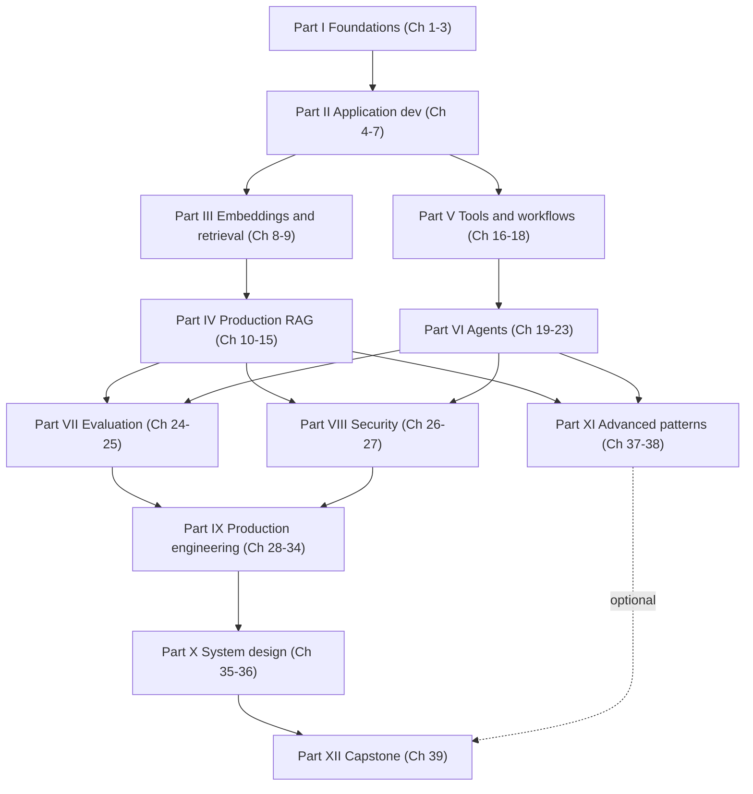

# Learning Roadmap

This book is written for a strong software engineer who is new to AI engineering. Most of its value
is in the code you type and the tests you run, not in the pages you read. This roadmap explains how
the material is organized, which parts depend on which, how to study it, and which path to take given
your time and your job. It ends with the graduation criteria and the capstone acceptance checklist, so
you know from day one what "done" means.

## 1. How the book is organized

Thirty-nine chapters in twelve parts, all following one template (why it matters, mental model,
concepts, mechanism, architecture, implementation, production considerations, failure modes,
evaluation, exercises, key takeaways); the system-design chapters replace the middle with the
ten-step method per case, and the capstone with a build log. Implementation chapters write real code under `book/projects/`,
and all of it depends on one shared library, `aie_core`, built in Chapter 3. The running example is
Northwind Assist, an internal assistant for a fictional 4,000-person company with two tenants,
`retail` and `logistics`. Each project adds one capability to it; the capstone assembles them.

| Part | Chapters | Theme | Project |
|---|---|---|---|
| I. Foundations | 1-3 | What the discipline is, how LLMs behave, the `aie_core` client and gateway | `aie_core` library |
| II. Application development | 4-7 | Prompts as contracts, context budgets, structured output, model routing | P1: structured extraction API (Ch 6) |
| III. Embeddings and retrieval | 8-9 | Embedding math, vector search, pgvector | P2: semantic search system (Ch 9) |
| IV. Production RAG | 10-15 | Ingestion, retrieval engineering, grounding, RAG evaluation, production RAG | P3: production RAG assistant (Ch 15) |
| V. Tools and workflows | 16-18 | Tool calling, workflow orchestration, MCP | P4: tool-using support assistant (Ch 16) |
| VI. Agents | 19-23 | Agent loop, architectures, memory, multi-agent, frameworks | P5: incident-research agent (Ch 20); P6: multi-agent research (Ch 22) |
| VII. Evaluation | 24-25 | `evalkit`, judges, statistics, task evaluators, CI gates | retrofit onto P1, P3, P5 |
| VIII. Security | 26-27 | Threat modeling, prompt injection, guardrails, safe tooling | adversarial suite for P3 and P4 |
| IX. Production engineering | 28-34 | Architecture, reliability, cost, observability, practices, fine-tuning, serving | primitives wired into P3 and P4 |
| X. System design | 35-36 | The 10-step method and nine worked cases, each mapped to the packages above | design drills; `back_of_envelope.py` sizing, `sql_guard.py` |
| XI. Advanced patterns | 37-38 | Advanced retrieval, durable and long-running agents | optional extensions |
| XII. Capstone | 39 | Northwind Assist as one production-grade system | capstone in `book/capstone/` |

Four projects are parts of the capstone: P1 is its extraction endpoint, P2 and P3 its retrieval
stack, and P4 its tool layer with approvals, run by the Chapter 19 agent loop. P5 and P6 are agent
systems you build to learn architecture and multi-agent trade-offs; the capstone deliberately does
not embed them, and Chapter 39 explains how either would plug in as one more route. Parts VII through
IX add evaluation, security, and production wiring to the projects rather than new ones. Skip P1 to
P4 and the capstone has a hole in it.

### Dependency graph between parts

Parts III-IV (retrieval) and Parts V-VI (tools and agents) are independent branches after Part II; a
reader who needs agents but not RAG can take the right branch first. Parts VII and VIII need both
branches because evaluation and security are taught against the RAG assistant and the tool-using
agent, not in the abstract.

### Prerequisites per part

| Part | You need before starting |
|---|---|
| I | Python 3.11 with type hints, `pytest`, HTTP basics, Docker. No ML background. |
| II | `aie_core` installed and its tests passing (Ch 3). pydantic v2 basics. |
| III | Ch 2 (tokens, context window), Ch 3. Comfort with NumPy arrays. PostgreSQL available locally or via Compose; the NumPy fallback works without it. |
| IV | All of Part III. P2 running. |
| V | Ch 3 (tool-calling protocol), Ch 4, Ch 6 (schemas and validation). |
| VI | All of Part V; P4 running. Ch 5 for context compaction. |
| VII | P3 and P5 running, because the evaluators are tested against them. Basic statistics (mean, variance, confidence interval). |
| VIII | P3 and P4 running. Ch 16 side-effect classes. |
| IX | Parts VII and VIII. Familiarity with OpenTelemetry concepts helps for Ch 31 but is taught. |
| X | Parts I-IX. The cases assume you can estimate from Ch 30 and Ch 34. |
| XI | Part IV for Ch 37; Part VI for Ch 38. |
| XII | Everything, and all six projects passing their tests. |

## 2. The study method

Reading alone produces people who can name techniques and cannot ship them. Use this loop for every
implementation chapter.

1. **Read the chapter once without touching the keyboard.** Note the mental-model callouts and the
   failure-modes section.
2. **Type the code.** Do not paste. Type every file at the path on its first-line comment. The places
   where you hesitate are the places you do not yet understand.
3. **Run the tests.** Every project passes `pytest` offline with `FakeLLM` and `FakeEmbeddings`. Fix
   failures before continuing. Then point `LLM_PROVIDER` at a real provider and run the
   `@pytest.mark.integration` tests once, so you see real behavior at least one time.
4. **Break it.** Violate one invariant the chapter claims: remove the retry jitter, set the chunk size
   to 50 tokens, drop the ACL filter, lower the agent step budget to 2. Watch the telemetry. This is
   the fastest way to learn what each piece is for.
5. **Do the debugging exercises.** Each chapter ends with D-exercises: a broken system or a trace that
   you diagnose. They are the exercises that most resemble the job; do them before the knowledge
   questions.
6. **Write the recall note.** Close the book and write from memory: five concepts, one mechanism (an
   equation, a data flow, or a state machine), one production trade-off, one failure mode, and one
   situation where you would not use the technique. If you cannot fill all five lines, reread. Keep the
   notes in one file; they become your interview preparation (Appendix C).

A recall note for Chapter 12, as an illustration of the expected length:

> **Concepts:** BM25, dense retrieval, reciprocal rank fusion, cross-encoder reranking, query rewriting.
> **Mechanism:** RRF score = sum over lists of 1 / (k + rank), k around 60, so a document ranked first in one list and tenth in another beats one ranked fifth in both.
> **Trade-off:** rerankers raise precision at the top of the list at the cost of one extra model call per query, typically the largest single latency item in the retrieval budget.
> **Failure mode:** HyDE on a question whose answer the model does not know produces a confident, wrong hypothetical document and pulls in confident, wrong evidence.
> **Do not use:** hybrid retrieval when the corpus is a few hundred short FAQs; exact dense search plus a filter is enough and has fewer moving parts.

Budget the week as roughly one third reading, one half typing and testing, and the rest breaking,
debugging, and the recall note. If you have read two chapters in a row without running code, stop and
go back.

## 3. How to use `exercises/` and `solutions/`

Each chapter's exercises are repeated in `book/exercises/chNN-exercises.md`; answers are in
`book/solutions/chNN-solutions.md` under the same identifiers.

- **K (knowledge).** A paragraph each. Write your answer before reading the solution.
- **E (engineering).** Design decisions. The solution gives a defensible answer and the dimensions that
  decide it. A different conclusion that names the same dimensions with a stated reason is also good.
- **P (practical).** Code on top of the chapter's project. The solution states the expected
  implementation and acceptance criteria (tests that must pass, metrics that must move). Write the
  tests from the criteria first, then implement.
- **D (debugging).** A described failure, often with a trace excerpt. The solution names the root cause
  and the telemetry that reveals it. Before reading it, write down the three spans or attributes you
  would inspect first; the diagnostic path is the point.

A chapter is finished when its K and E answers are written, at least two P exercises pass their
acceptance criteria, and every D exercise has a written diagnosis.

## 4. The full path: 16 weeks at 6-8 hours per week

The path for an engineer who wants the whole discipline. Every week has a project milestone or a
wiring task, and from week 13 on each chapter's artifact goes straight into the capstone tree, so week
16 is acceptance testing rather than assembly. If a week overruns, protect the milestone and let the
reading slip; the next week builds on the code, not the prose.

| Week | Chapters | Project milestone | You can now... |
|---|---|---|---|
| 1 | 1, 2 | Repo set up; tokenizer cost and sampling experiments run | Explain why decode is sequential and prefill is not, estimate tokens and cost for a prompt, predict lost-in-the-middle effects. |
| 2 | 3 | `aie_core` built; tests pass offline; one integration run against a real provider | Call any provider through one interface with retries, timeouts, streaming, structured output, and cost accounting, and fake it in tests. |
| 3 | 4, 5 | `PromptRegistry` with golden tests; `ContextBuilder` with token budget and compaction | Treat a prompt as a versioned contract with a regression suite; pack a context window on a budget with a stable prefix and source labels. |
| 4 | 6, 7 | **P1 complete**: extraction API with validation, repair loop, review queue, Dockerfile; `Router` with cascade evaluation | Ship a structured-output service that never returns unvalidated JSON; choose a model by evaluation, not leaderboard. |
| 5 | 8, 9 | **P2 complete**: semantic search over Northwind documents, pgvector with NumPy fallback, recall@k report | Compute, compare, and store embeddings; decide between brute force, pgvector, and a dedicated store; measure recall before claiming search works. |
| 6 | 10, 11, 12 | Minimal RAG in under 200 lines; chunker comparison; `BM25Index`, `HybridRetriever`, `Reranker` | Build the whole RAG pipeline from parts you wrote; name the stage behind each naive-RAG failure mode. |
| 7 | 13, 14 | `GroundedGenerator` with citation validation and abstention; `rag_eval` gold set and stage-isolation report | Produce cite-or-abstain answers, and say which stage lost the evidence when an answer is wrong. |
| 8 | 15 | **P3 complete**: ingestion worker, hybrid retrieval, reranking, ACL filter, tracing, Compose, evaluation suite | Run RAG under tenants and permissions, with incremental indexing, correct cache keys, and a freshness SLO. |
| 9 | 16, 17 | **P4 complete**: `ToolRegistry`, `ToolPolicy`, idempotency, approval binding, injection test; plain-Python workflow engine | Let a model propose actions that your code authorizes; choose between workflow and agent from a decision table. |
| 10 | 18, 19 | Small MCP server and client; `AgentRuntime` with typed state, event log, budgets, termination, replay | Expose tools over MCP with scoped credentials; run a bounded agent loop you can replay from its event log. |
| 11 | 20, 21 | **P5 complete**: incident-research agent with planner, evaluator-optimizer loop, Definition of Done, trajectory tests; memory stores with TTL and provenance | Pick an agent architecture by failure modes and cost profile; add memory that can be deleted, scoped, and audited. |
| 12 | 22, 23, 38 (read) | **P6 complete**: parallel workers, verifier, supervisor with budgets, compared against the single-agent baseline | Justify or reject a multi-agent design with numbers; map any framework's abstractions to primitives you built. |
| 13 | 24, 25, 37 (read) | `evalkit` core; judges calibrated against a human-labeled sample; CI eval gate on P1, P3, P5 | Build golden and synthetic datasets; run a calibrated judge with position randomization; block a release on a metric. |
| 14 | 26, 27 | Threat models for P3 and P4; `guardrails` package; adversarial suite with indirect injection, exfiltration, tenant-leak tests | Threat-model an AI system by trust boundaries and defend it with controls outside the prompt. |
| 15 | 28, 29, 30, 31, 34 (read) | Reliability primitives, `CostModel`, latency budget tracker, OTel tracing wired into P3 and P4; capstone tree scaffolded | Draw the reference architecture, set per-stage budgets, estimate capacity with Little's Law, debug a regression from traces. |
| 16 | 32, 33 (read), 35, 36, 39 | **Capstone acceptance**: Compose up, release gate green, checklist in section 7 passed; two design cases answered aloud | Design, build, measure, secure, and explain a production AI system end to end. |

Chapters 33, 34, 37, and 38 are depth chapters, scheduled as reading next to the chapter they extend.
Implement their code when a real need appears; the capstone does not require it.

## 5. The accelerated path: 8 weeks

For engineers who already call LLM APIs in production and have shipped at least one prompt-based
feature. You skip the conceptual on-ramp but not the projects, because the projects are where the
production habits form.

| Week | Chapters | Milestone |
|---|---|---|
| 1 | 2 (sections on KV cache, sampling, limits), 3 (read the public API; type the gateway and the structured helper), 4, 5 | `aie_core` tests pass; `PromptRegistry` and `ContextBuilder` done |
| 2 | 6, 7, 8, 9 | P1 and P2 complete |
| 3 | 10, 11, 12, 13 | Hybrid retrieval, reranker, grounded generator |
| 4 | 14, 15 | P3 complete with stage-isolation report |
| 5 | 16, 17, 19 | P4 complete; `AgentRuntime` with replay |
| 6 | 20, 21, 22 (read 18 and 23) | P5 complete; P6 if time allows |
| 7 | 24, 25, 26, 27 | Eval gate and adversarial suite on P3 and P4 |
| 8 | 28, 29, 30, 31, 32, 35 | Reduced capstone: P3 + P4 + gateway + gate + tracing behind one API |

Skip entirely on this path: Chapters 1, 33, 34, 36, 37, 38. Come back to 34 before you self-host, to
33 before you fine-tune, and to 36-38 when you have time. Do not skip Chapter 14 or Chapter 24; the most
common gap in engineers who already use LLM APIs is that they have never measured anything.

## 6. Role-based paths

Each path lists chapters in reading order and names what to skip. Every path includes Chapter 3,
because all the code depends on `aie_core`, and Chapter 24, because every role needs to measure.

### Backend engineer adding AI features to an existing product

Typical work: extraction, classification, a drafting or summarization endpoint, one tool-using
assistant behind an existing API.

Read in order: 1 (skim), 2, 3, 4, 5, 6 (build P1), 7, 16 (build P4), 17, 24, 25, 27, 28, 29, 30, 31,
32. Add 10 as a one-chapter overview of RAG so you recognize when a feature needs it.

Skip: 8-9, 11-15 (unless the feature is search), 18-23, 26 (read only the injection catalogue), 33-38.
Chapters 35-36 are optional; the document-processing and support-copilot cases are the useful ones.

### Engineer joining a RAG or search team

Typical work: ingestion, retrieval quality, evaluation, permissions, freshness.

Read in order: 2 (tokens and context window), 3, 5, 8, 9 (build P2), 10, 11, 12, 13, 14, 15 (build P3),
24, 25, 26 (index poisoning, exfiltration through documents), 27 (tenant isolation), 30 (caching
layers), 31, 37. Add 6 if your pipeline extracts metadata with a model.

Skip: 4 beyond the prompt-registry section, 7, 16-23, 28-29 (read the architecture diagrams only),
32-34, 38. Chapter 35's enterprise knowledge assistant case is required reading for this role.

### Engineer building agents or automation

Typical work: tool-using assistants, workflow automation, long-running tasks with approvals.

Read in order: 2, 3, 4, 5, 6 (schemas for tool arguments), 16 (build P4), 17, 18, 19, 20 (build P5), 21,
22 (build P6), 23, 24, 25 (agent evaluation), 26, 27, 29 (idempotency, partial failure), 31 (trajectory
views), 38. Add 10 and 12 as overviews if your agents retrieve.

Skip: 8-9, 11, 13-15, 30 (read the cost-per-task section), 32-34, 37. Chapter 36's workflow-automation
and research-agent cases are required for this role.

### Platform or SRE engineer running AI services

Typical work: model gateway, serving, quotas, observability, incident response for AI features that
other teams build.

Read in order: 1, 2 (prefill and decode, KV cache), 3 (the gateway is your product), 7 (routing and
fallbacks), 15 (production sections: indexing workers, caching, degraded modes), 16 (sandboxing, side
effects), 19 (budgets and termination), 26, 27, 28, 29, 30, 31, 32, 34, 35, 36 (the serving platform
and evaluation platform sketches).

Skip: 4-6, 8-14, 17-18, 20-23, 33 (read the deployment and rollback section), 37-38. Build the
reliability primitives from Chapter 29 and the `CostModel` from Chapter 30 in full; the rest you can
read.

## 7. Graduation criteria and capstone acceptance

The graduation standard is practical. You are done when you can build the systems, measure them,
secure them, and explain them. Not one of the four, all four.

**You must be able to build:**

- a provider-neutral gateway with retries, timeouts, fallbacks, caching, and cost accounting;
- a structured-extraction service whose output is always schema-valid or routed to a human;
- a RAG system with hybrid retrieval, reranking, ACL filtering, and cite-or-abstain generation;
- a tool-using agent whose permissions, budgets, idempotency, and approvals are enforced by code;
- an evaluation pipeline with a golden set, calibrated judges, and a release gate in CI;
- the observability to replay any request from its trace.

**You must be able to measure:**

- recall@k, MRR, and nDCG on a gold set you built, and the stage that lost the evidence;
- faithfulness and citation precision with a judge whose agreement with humans you checked;
- task completion, tool correctness, and step efficiency for an agent from its event log;
- p50/p95 time-to-first-token and completion latency per stage against a written budget;
- cost per successful task including retries, reranking, tools, and human review;
- the false-positive rate and bypass rate of each guardrail.

**You must be able to secure:**

- a written threat model with trust boundaries for both a RAG assistant and a tool-using agent;
- ACL filtering before retrieval, with a test that proves zero cross-tenant leakage;
- tool policy with allowlists, argument constraints, and approval bound to concrete arguments;
- an adversarial suite with direct and indirect injection, exfiltration via URLs, and memory poisoning;
- redaction of PII before the model and in logs, and secrets that never appear in code or traces.

**You must be able to explain**, in the layered form Appendix C teaches:

- why decode is memory-bandwidth-bound and what that implies for batching and latency;
- why prompt injection is an authorization problem, not a prompt-writing problem;
- when a workflow beats an agent and when retrieval beats fine-tuning, with the deciding dimensions;
- how you would debug a quality regression from traces, by stage and by version diff;
- a complete system design for one Part X case, with SLOs, capacity, and failure modes.

### Capstone acceptance checklist

The capstone (Chapter 39) is Northwind Assist as one deployable system. "It answers my demo questions"
is not acceptance. Every item is a test, a report, or a document in `book/capstone/northwind-assist/`,
and the README's "Acceptance checklist mapped to evidence" table names the test or file for each one.

**Build and run**

- [ ] `docker compose up` starts API, UI, worker, PostgreSQL with pgvector, Redis, and the trace collector.
- [ ] `pytest` passes offline; integration tests (Chapter 39, practical exercise P2) pass against one real provider.
- [ ] CI pipeline runs lint, type check, unit tests, and the evaluation gate, blocks the merge when a threshold fails, and has seen the gate fail on a deliberately broken configuration.
- [ ] Run book covers start, stop, reindex, rotate secrets, roll back a prompt version, and degraded modes.

**Retrieval and grounding**

- [ ] Gold set of at least 100 questions with required sources, permission context, and tags.
- [ ] Retrieval report shows recall@k and MRR per configuration and the stage-isolation breakdown.
- [ ] Every answer cites evidence IDs that exist and support the claim, or abstains; citation validator has tests.
- [ ] Incremental indexing with versions and deletion that propagates to index and caches.

**Permissions and tenancy**

- [ ] JWT auth with tenant and group claims; ACL filter applied at retrieval, never after generation.
- [ ] A cross-tenant leakage test suite runs in CI with zero leaks across `retail` and `logistics`.
- [ ] Cache keys include tenant and permission scope; a test proves a cached answer cannot cross tenants.

**Tools and agents**

- [ ] Typed tools with JSON Schema, argument validation outside the model, side-effect classes recorded.
- [ ] `send_reply` requires approval bound to the exact arguments; changing arguments invalidates approval; an approval whose requester context is lost fails closed.
- [ ] Idempotency keys for every write; a duplicate-suppression test.
- [ ] Agent step, token, and time budgets enforced; termination conditions tested; event log replayable.

**Security**

- [ ] Written threat model with trust boundaries diagram.
- [ ] Adversarial suite: direct injection, indirect injection via a document, exfiltration via markdown image URL, memory poisoning attempt; each either blocked or detected and logged.
- [ ] PII redaction before the model and in traces, with tests.

**Evaluation and operations**

- [ ] Faithfulness judge with its agreement against a human-labeled sample reported; a judge below your agreement bar is reported, not used for quality decisions.
- [ ] Release gate thresholds for retrieval recall, faithfulness, citation precision, tool correctness, and injection block rate.
- [ ] OpenTelemetry traces with spans for router, retrieval, rerank, model, tool, validator, and agent step, carrying prompt version, model, tokens, cost, cache hits, evidence IDs, and policy results.
- [ ] Latency report: p50 and p95 time-to-first-token and completion per stage against the budget (illustrative targets: p95 TTFT under 2 s, p95 completion under 8 s).
- [ ] Cost report: cost per successful answer and per tenant, with an alert threshold.
- [ ] Alert rules as code (page on user-visible SLO breaches and any cross-tenant event, ticket on drift), with a test that healthy traffic fires none and an injected fault fires the right one.
- [ ] At least one documented failure analysis: what broke, which span showed it, what changed, how the gate now catches it.

When every box is checked, you have the skill set this book is meant to build. Then read Appendix C
and practice saying it out loud.
