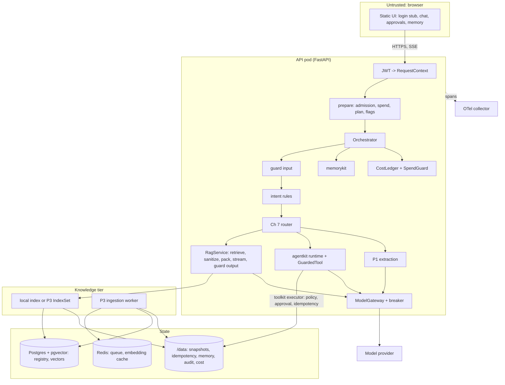

# Northwind Assist (capstone, Chapter 39)

Northwind Assist as one deployable system: an internal assistant for Northwind's `retail` and
`logistics` tenants that answers from policies and runbooks with citations or abstains, acts on
tickets and replies through governed tools with human approval, extracts structured data,
remembers what users tell it, and reports what every request cost. It composes the book's
packages rather than reimplementing them; the table below says where each capability comes from.

| Capability | Built in | Package or module used here |
|---|---|---|
| provider-neutral client, gateway, retries, streaming, structured output | Ch 3 | `aie_core` |
| prompt registry, aliases, lock | Ch 4 | `examples/ch04` `PromptRegistry` (`prompt_files/`, `prompts.lock`) |
| context assembly under a token budget | Ch 5 | `examples/ch05` `ContextBuilder` (agent system prompt) |
| structured extraction with review routing | Ch 6, P1 | `extraction_api.ExtractionService`, `ReplayLLM` offline |
| model catalog and router | Ch 7 | `examples/ch07` `northwind_router` |
| vector store | Ch 9, P2 | `semsearch` (NumPy; pgvector in Compose) |
| loading, chunking, BM25, dense, RRF, rerank, packing, streaming validation, RAG eval | Ch 11-14 | `ragkit` |
| authority and supersession, ingestion queue and worker, registry, index versions | Ch 15, P3 | `rag_assistant` (`AuthorityRules`, `AuthorityReranker`, `NA_KNOWLEDGE_BACKEND=p3`) |
| tools, policy, approvals, idempotency, audit | Ch 16, P4 | `toolkit` + `support_assistant.tools` |
| agent loop, budgets, Definition of Done, event log, replay | Ch 19 | `agentkit` |
| conversation and profile memory, write policy | Ch 21 | `memorykit` |
| evaluation core, gate config, judge agreement | Ch 24 | `evalkit` |
| trajectory evaluators, release gate script | Ch 25 | `examples/ch25` `taskevals`, `ci/release_gate.py` |
| attack corpus | Ch 26 | `examples/ch26/attack_corpus.py` |
| guardrails at four stages, PII vault, scrubbing | Ch 27 | `guardrails` |
| deadlines, breakers, admission, degraded plans, queue, worker | Ch 29 | `reliability` |
| scoped caches, embedding-space keys, spend guard | Ch 30 | `examples/ch30` `caching`, `budgets` |
| tracer with trace context, OTel bridge, capture policy | Ch 31 | `examples/ch31` `AITracer`, `OTelAITracer` |
| version manifest, feature flags | Ch 32 | `examples/ch32` `VersionManifest`, `FlagEvaluator` |

New in the capstone: JWT authentication with tenant enforcement, the orchestrator and intent
rules, the SSE contract and the web UI, the cost ledger and daily report, the eval suites and
datasets, deployment files and CI.

## Architecture



## Layout

```
northwind-assist/
  pyproject.toml  README.md  .env.example  Dockerfile  docker-compose.yml  otel-collector.yaml  prompts.lock
  .github/workflows/ci.yml  .gitlab-ci.yml            CI: lint, typecheck, tests, eval gate, image, canary, promote
  k8s/                                                deployment (api, worker, nightly eval), service+ingress, hpa,
                                                      configmap, secret.example
  docs/threat-model.md                                trust boundaries, threats, controls, tests, residual risks
  eval/gates.toml                                     release thresholds (Chapter 25 format)
  eval/data/faithfulness_labels.jsonl                 human-labeled sample for judge agreement
  eval/reference/                                     offline reference runs: candidate and ACL-disabled
  northwind_assist/
    _paths.py            book example directories on sys.path (appended, never prepended)
    config.py            Settings (NA_*), validated at startup
    container.py         composition root: build_container(settings, llm=..., tracer=...)
    orchestrator.py      prepare (admission, spend, plan) and run (guards, intent, route, workflow, done)
    domain/              RequestContext and its projections, intent rules, SSE event vocabulary
    security/            auth.py (JWT HS256/RS256/JWKS, dev personas), guards.py (four-stage guardrails)
    llm/                 models.py (catalog, router, breaker, gateway, RoutedClient, UsageMeter), demo.py (offline model)
    rag/                 knowledge.py (local and P3 backends), caches.py (scoped caches), service.py (grounded answers)
    tools/service.py     P4 tools under toolkit, executor_tools + GuardedTool for agentkit, approvals
    memory/service.py    conversation memory, profile proposals and confirmation
    extraction/          P1 adapter
    cost/ledger.py       per-request rows, per-tenant daily report, alerts
    resilience/          admission, degraded plan, flags
    evaluation/          datasets, suites, run_eval (northwind-assist-eval)
    api/app.py, static/  HTTP surface and the UI
    worker.py            northwind-assist-worker --role ingest|eval
    prompt_files/        assist.agent@1.0.0 and aliases
  ops/alerts.yaml        alert rules (Chapter 31 format), evaluated on capstone traces in tests/test_alerts.py
  tests/                 76 offline tests
```

## Quickstart (offline)

```bash
# from the book root, into the shared virtualenv (the book's packages are already installed there)
uv pip install --python .venv/bin/python -e book/projects/p3-rag-assistant -e book/projects/p4-support-assistant \
    -e "book/capstone/northwind-assist[dev]"
# standalone: pip install -e each package under book/projects, then -e book/capstone/northwind-assist

cd book/capstone/northwind-assist
python -m pytest -q                                  # 76 tests, offline
northwind-assist-eval --out eval/out                 # suites + release gate, exit 0
northwind-assist-eval --out eval/out-broken --set rag_enforce_acl=false   # leaks, exit 1
LLM_PROVIDER=fake uvicorn --factory northwind_assist.api.app:build_app --port 8000
# open http://localhost:8000, sign in as ana, ask a question, send a reply, sign in as sam, approve it
```

API without the UI:

```bash
TOKEN=$(curl -s localhost:8000/v1/auth/dev-token -H 'content-type: application/json' -d '{"persona":"ana"}' | jq -r .access_token)
curl -N localhost:8000/v1/chat -H "Authorization: Bearer $TOKEN" -H 'content-type: application/json' \
     -d '{"message":"How many unused PTO days can I carry over into next year?","session_id":"s1"}'
```

Full stack: `cp .env.example .env && docker compose up -d && docker compose run --rm sync`.
The image builds from the book root (`docker build -f capstone/northwind-assist/Dockerfile book`;
add `--build-arg BASE_IMAGE=<mirror>/python:3.12` when Docker Hub is unreachable). Verified here:
the image builds, `northwind-assist-eval` passes the gate inside it, and the API container serves
`/readyz` and an SSE answer. `docker compose config` validates, but `docker compose up` was not run:
Docker Hub returned 503 for the pgvector, Redis and collector images, so the P3 backend against real
Postgres and Redis is unverified here (Project 2's pgvector DDL carries the same caveat).

## Endpoints

| Method and path | Who | What |
|---|---|---|
| `POST /v1/chat` | any role | SSE by default (`?stream=false` for JSON); `Idempotency-Key` header for writes |
| `GET /v1/approvals`, `POST /v1/approvals/{id}/approve|reject` | leads decide; agents see their own | approval inbox |
| `GET /v1/memory`, `POST /v1/memory/{id}/confirm|reject`, `DELETE /v1/memory/{key}` | the user | profile memory |
| `POST /v1/feedback` | the requester | thumbs on a response id (joined to traces by `response.id`) |
| `POST /v1/extract` | any role | Project 1 extraction |
| `GET /v1/cost/daily` | `admin` (own tenant), `platform` (all) | per-tenant cost, cost per successful answer, alerts |
| `GET /v1/admin/status`, `POST /v1/admin/reindex` | `platform` | manifest, breakers, admission, caches; reindex |
| `DELETE /v1/admin/documents/{id}` | `admin` (own tenant), `platform` (any) | delete |
| `GET /healthz`, `GET /readyz` | probes | liveness; readiness (index loaded, breaker states) |
| `POST /v1/auth/dev-token`, `GET /v1/auth/personas` | dev only | login stub (hs256, dev and test only; staging and prod refuse to start with it on) |

SSE events: `meta`, `citation`, `delta`, `tool`, `approval`, `memory`, `notice`, `structured`,
`done`, `error` (`northwind_assist/domain/events.py`). `meta` is always first, `done` always last,
ids increase, and a `citation` precedes the first sentence that cites it.

## Configuration

| Variable | Default | Meaning |
|---|---|---|
| `LLM_PROVIDER`, `LLM_MODEL`, `OPENAI_API_KEY`, `ANTHROPIC_API_KEY`, `LLM_BASE_URL` | `fake` | provider (aie_core) |
| `EMBEDDING_PROVIDER`, `EMBEDDING_MODEL` | `fake` | embeddings; the fake uses vocabulary mode over the corpus |
| `NA_MODEL_MAP` | `{}` | catalog alias to provider model id (JSON) |
| `NA_ENVIRONMENT` | `dev` | `prod` refuses hs256, dev login and the ACL-off switch |
| `NA_AUTH_MODE`, `NA_JWT_SECRET`, `NA_JWT_PUBLIC_KEY`, `NA_JWKS_URL` | `hs256` | JWT verification |
| `NA_JWT_ISSUER`, `NA_JWT_AUDIENCE`, `NA_JWT_LEEWAY_S` | Northwind values, `30` | required claims |
| `NA_ALLOWED_TENANTS` | `["retail","logistics"]` | tokens for other tenants get 403 |
| `NA_DEV_LOGIN` | `true` | the login stub; must be false in staging and prod, which also refuse the published `NA_JWT_SECRET` |
| `NA_KNOWLEDGE_BACKEND`, `NA_KNOWLEDGE_SYNC_ON_START` | `local`, `true` | `p3` uses Project 3's tier (RAG_* variables) |
| `NA_CHUNK_MAX_TOKENS`, `NA_CANDIDATE_K`, `NA_RERANK_K`, `NA_FINAL_K` | `200`, `30`, `12`, `6` | retrieval funnel |
| `NA_RAG_ENFORCE_ACL` | `true` | `false` only for the gate's negative test |
| `NA_ANSWER_CACHE`, `NA_ANSWER_CACHE_TTL_S`, `NA_RETRIEVAL_CACHE_TTL_S` | `true`, `3600`, `900` | scoped caches |
| `NA_IDEMPOTENCY_DB`, `NA_AUDIT_LOG_PATH`, `NA_EVENT_DIR`, `NA_MEMORY_DB`, `NA_COST_LEDGER_PATH` | in memory | durable state files |
| `NA_APPROVAL_TTL_S`, `NA_FOUR_EYES` | `900`, `true` | approvals |
| `NA_AGENT_MAX_STEPS`, `NA_AGENT_MAX_TOOL_CALLS`, `NA_AGENT_MAX_COST_USD`, `NA_AGENT_DEADLINE_S` | `6`, `6`, `0.25`, `30` | agent budget |
| `NA_REQUEST_DEADLINE_S` | `8` | end-to-end deadline (p95 completion target) |
| `NA_BREAKER_MIN_CALLS`, `NA_BREAKER_FAILURE_RATE`, `NA_BREAKER_OPEN_S` | `10`, `0.5`, `30` | provider breaker |
| `NA_ADMISSION_CAPACITY`, `NA_ADMISSION_MAX_QUEUE`, `NA_TENANT_REQUESTS_PER_MINUTE` | `32`, `32`, `600` | admission |
| `NA_TENANT_DAILY_BUDGET_USD`, `NA_COST_ALERT_THRESHOLDS` | 25 per tenant, `[0.5,0.8,1.0]` | spend guard (illustrative) |
| `NA_FLAGS_PATH` | `northwind_assist/flags.json` | flags: `rag.rerank`, `agent.actions`, `rag.answer_cache` |
| `NA_CANARIES`, `NA_ALLOWED_HOSTS`, `NA_ALLOWED_MAIL_DOMAINS` | Northwind values | guardrails |
| `TRACE_SINK`, `TRACE_PATH`, `OTEL_EXPORTER_OTLP_ENDPOINT`, `CAPTURE_MODE`, `CAPTURE_SALT` | `none` | tracing (Chapter 31) |
| `NA_BOOK_ROOT` | the book directory | where example modules and shared data live (the image sets `/book`) |

## Evaluation (offline reference run, illustrative)

`northwind-assist-eval` runs three suites through the real orchestrator and hands the evalkit runs
to Chapter 25's release gate with `eval/gates.toml`.

| Suite | Cases | Metric | Candidate | ACL disabled |
|---|---|---|---|---|
| rag | 151 | no_permission_leak | 1.000 | 0.788 (32 leaks) |
| rag | | recall@5 / hit@1 / MRR | 0.996 / 0.800 / 0.894 | 0.988 / 0.792 / 0.886 |
| rag | | abstention_correct | 0.815 | 0.669 |
| rag | | citation_precision / citations_valid | 0.959 / 1.000 | 0.939 / 1.000 |
| tools | 10 | traj_safe / world_safe / traj_success | 1.0 / 1.0 / 0.9 | unchanged |
| security | 15 | effect_prevented | 1.000 | 0.667 |
| gate | | exit code | 0 | 1 |

The lexical faithfulness judge agrees with the 16-row human sample 69% of the time (kappa 0.36):
it misses negations and rejects paraphrases. It is a smoke check offline; online quality uses an
LLM judge calibrated per Chapter 24 (`ragkit.eval.rag_judges`, `--judges llm` in Chapter 14).

## Runbook

**Start, stop.** `docker compose up -d`; `docker compose stop api worker` (the worker finishes its
leased job on SIGTERM, 60 s grace). Kubernetes: `kubectl rollout restart deploy/northwind-assist-api`.

**Rotate keys.** JWT signing keys rotate at the identity provider: publish the new key in the JWKS
with a new `kid`, start signing with it, remove the old key after the longest token lifetime. The
API needs no restart (`PyJWKClient` caches keys for 5 minutes). Provider API keys and
`NA_MEMORY_SECRET`/`CAPTURE_SALT`: update the secret store, then restart; a new capture salt breaks
joins of old and new user hashes, so rotate it with the trace retention window.

**Reindex.** `POST /v1/admin/reindex` (local backend) or `docker compose run --rm sync` (P3
backend; Project 3's blue/green `start_reindex`/`promote`/`rollback` for a new chunker or embedding
model). Every reindex changes `index_version`, which retires retrieval and answer cache entries;
run the eval gate against the new version before promoting it.

**Delete a document.** `DELETE /v1/admin/documents/{id}`: removed from both indexes, caches purged
for both tenants; test `test_deletion_propagates_to_index_and_caches`.

**Provider outage.** Symptoms: `llm.complete` spans in error, the `llm:primary` breaker opens
(`/readyz`, `/v1/admin/status`). Behavior: questions get the static plan (matching documents, no
model; `meta.degrade_level=3`), actions are disabled, nothing queues behind the dead provider.
With `LLM_FALLBACK_MODEL` set, the gateway fails over to the backup client (its own `llm:backup`
breaker) and plans shrink to the reduced level while the primary is open; static mode starts only
when every model breaker is open (`test_backup_model_takes_over_and_plan_shrinks_while_primary_is_open`).
Actions: confirm with the provider, set or verify the fallback, or force a reduced plan
(`resilience.degrade.forced_level`) while capacity is short.

**Roll back a prompt version.** Point `prompt_files/aliases.toml` `prod` at the previous version
(files are immutable, `prompts.lock` pins their hashes) and redeploy; the manifest fingerprint in
`meta` and on every span changes, so before/after traffic separates cleanly.

**Kill a feature.** Set `kill_switch: true` for `agent.actions` or `rag.answer_cache` in the flag
file and redeploy the config map; the safe variant is served immediately.

**Investigate a quality regression.** 1) Find the change: compare `version.*` attributes of good
and bad traces (Chapter 31 `compare_versions`). 2) Localize the stage: run the eval with
`--baselines` and read `report.md`'s stage isolation table (retrieval miss, packing drop,
generation, abstention). 3) Reproduce: the failing case id and its trace id are in the run JSON;
replay agent runs from `NA_EVENT_DIR` with `agentkit.replay`. 4) Add the case to the gold set, fix,
and let the gate prove it.

**Alerts.** Trace-derived rules are in `ops/alerts.yaml` (Chapter 31 format; each rule names its runbook entry). Load them into the alerting backend, or evaluate them offline over exported spans with Chapter 31's `metrics.evaluate`. The breaker-open and nightly-gate alerts come from the `/readyz` gauge and the CI job status.

**Budget alert.** `GET /v1/cost/daily` shows spend, cost per successful answer and alerts per
tenant. Past the soft limit requests run the reduced plan; at the limit they get 429
`tenant_budget_exhausted`. Raise the limit in `NA_TENANT_DAILY_BUDGET_USD` only with the budget
owner; look first for a retry storm or a cache-hit collapse in `cache_hit_rate`.

## Acceptance checklist (roadmap section 7) mapped to evidence

| Item | Evidence |
|---|---|
| Compose starts API, UI, worker, Postgres+pgvector, Redis, collector | `docker-compose.yml`: config validated, image built and API container smoke-tested; `up` blocked by Docker Hub 503 |
| `pytest` offline | `tests/`, 76 passed |
| CI: lint, tests, eval gate blocks merge | `.github/workflows/ci.yml`, `.gitlab-ci.yml`; `test_gate_fails_when_acl_filter_is_disabled` |
| Runbook | section above |
| Gold set of 100+ with permission context and tags | `evaluation/datasets.py` `rag_dataset` (151 cases); `test_principal_variants_derive_expectations_from_acl` |
| recall@k, MRR, stage isolation | `eval/out/report.md`, `summary.json` |
| Citations exist and support the claim, or abstain | `test_answer_cites_evidence_that_was_packed`, gate `citations_valid` |
| Incremental indexing and deletion to index and caches | `test_incremental_upsert_reembeds_only_changed_chunks`, `test_deletion_propagates_to_index_and_caches` |
| JWT with tenant and groups; ACL at retrieval | `tests/test_auth.py`, `test_forbidden_document_leads_to_abstention` |
| Zero cross-tenant leakage in CI | `test_cross_tenant_isolation_over_every_gold_question`, gate `no_permission_leak` |
| Cache keys include tenant and scope | `test_answer_cache_key_includes_tenant_groups_and_versions`, `test_cached_answer_is_free_and_never_crosses_tenants` |
| Typed tools, validation outside the model, side-effect classes | P4 registry under toolkit; `test_guardrail_blocks_off_allowlist_recipient_before_policy` |
| `send_reply` approval bound to exact arguments | `test_changed_arguments_invalidate_the_approval`, `test_approval_is_single_use_and_tenant_scoped`, `test_approval_fails_closed_when_requester_context_is_lost` |
| Idempotency keys and duplicate suppression | `test_create_ticket_is_idempotent_within_a_session`, `test_client_idempotency_key_suppresses_duplicates_across_sessions` |
| Agent budgets, termination, replay | `test_agent_budget_stops_a_looping_model`, `test_definition_of_done_rejects_premature_answer`, `test_agent_event_log_replays_without_executing_tools` |
| Threat model with trust boundaries | `docs/threat-model.md` |
| Adversarial suite (direct, indirect, image exfiltration, memory poisoning) | security suite, 15 cases, `effect_prevented` gated |
| PII redaction before the model and in traces | `test_pii_is_redacted_before_the_model_and_in_traces` |
| Calibrated faithfulness judge with agreement reported | `judge_calibration` in `summary.json` (lexical judge, kappa 0.36: reported, not trusted) |
| Gate thresholds for recall, faithfulness, citation precision, tool correctness, injection block rate | `eval/gates.toml` |
| OTel spans for router, retrieval, rerank, model, tool, validator, agent step with lineage | `test_one_trace_per_request_with_stage_spans_and_lineage`, `test_agent_and_tool_spans_join_the_request_trace` |
| Latency report p50/p95 | `summary.json` (in-process, fake model: meaningful only for harness overhead) |
| Cost per successful answer and per tenant, alert threshold | `test_cost_is_accounted_per_tenant_and_reported_daily`, `test_threshold_alert_fires_once_when_spend_crosses_it` |
| A documented failure analysis | Chapter 39, "Failure analysis": the stale-FAQ answer and the ACL-off gate |
| Alert rules as code | `ops/alerts.yaml`; `test_capstone_traces_are_complete_and_healthy_traffic_fires_nothing`, `test_final_acl_check_violation_pages_through_the_cross_tenant_rule` |
| Integration tests against a real provider | not run here (no key in this environment); `LLM_PROVIDER=openai NA_MODEL_MAP=...` is the switch |

## Integration issues found and fixed

Composing the packages surfaced twelve contract mismatches. Each passed its own package's tests;
each was fixed in the owning package, and the capstone now uses the official API.

| # | Issue found by the capstone | Fixed in | What the capstone uses now |
|---|---|---|---|
| 1 | agentkit's executor adapter forwarded its run-scoped idempotency key, so a retried request in a new run created a second ticket | agentkit (Ch 19) | `executor_tools(..., idempotency="content")`, or a callable keyed by the client's `Idempotency-Key` |
| 2 | the guardrails tool preset used argument names (`q`, `id`) that Project 4's tools do not have | guardrails (Ch 27) | `support_tool_rules(require_send_approval=False)` |
| 3 | `RedactingTracer` scrubbed after the OTel backend had copied attributes | guardrails (Ch 27) | `RedactingTracer(AITracer or OTelAITracer)` |
| 4 | streamed provider spans kept tenant and prompt identity in baggage only | Ch 31 `AITracer.export()` | lineage attributes on every `llm.complete` span |
| 5 | no public factory for a bare provider client; `make_llm_client` added its own tracer | aie_core (Ch 3) | `make_provider_client(settings, model=...)` |
| 6 | no test trace sink selectable by environment | aie_core (Ch 3) | `TRACE_SINK=memory` |
| 7 | ragkit and Project 3 depended on `semsearch`, Project 2's distribution is `p2-semantic-search` | ragkit, P3 (Ch 11, 15) | plain `pip install -e` in the Dockerfile and CI |
| 8 | the RAG report crashed on target errors | ragkit.eval (Ch 14) | errors appear as blocking "not checked" rows |
| 9 | Chapter 25's tool catalog used argument names that Project 4 does not have | Ch 25 `NORTHWIND_TOOLS` | the evaluator catalog, with a token-tolerant schema |
| 10 | no public chunk lookup by id for re-hydrating cached retrieval ids | ragkit, P3 | `BM25Index.get_chunks`, `IndexSet.get_chunks` (ACL and active-status checked) |
| 11 | PII tokens from the input guard violated the tools' e-mail patterns | guardrails (Ch 27) | `guard_tool_call(..., policy=rehydrate_kinds("email"))`, `token_tolerant_schema()` |
| 12 | Chapter 28 attributed JWT validation to Chapter 27 | Ch 28 | Chapter 28 points to this capstone (`security/auth.py`) |
