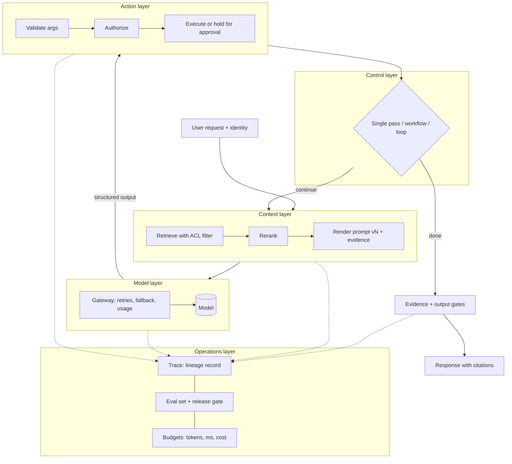
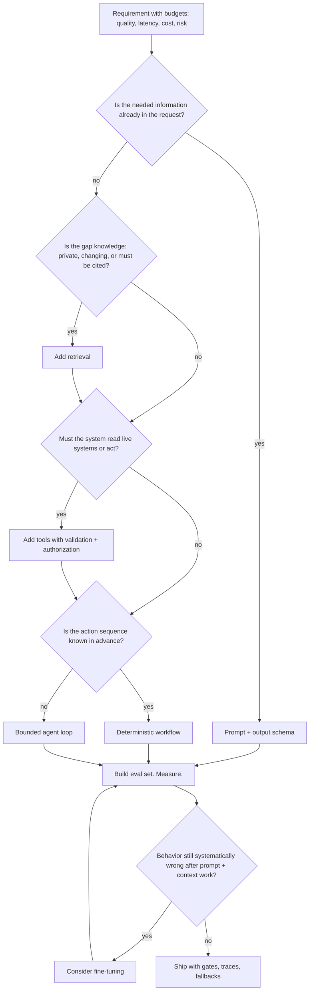

# Chapter 1 — What AI Engineering Is

After this chapter you will be able to place any AI feature on a five-layer map, choose the least complex architecture that meets a requirement and defend that choice, and state the questions you must be able to answer about every production request. You will also know what this book builds, in which order, and why. The chapter's only code is a small lineage record in `book/projects/examples/ch01/`, the ancestor of the tracing schema the rest of the book uses.

## Why this matters

A language model is a function that turns a sequence of tokens into a probability distribution over the next token, and nothing more. Everything that makes a model useful at work, such as knowing your company's leave policy, refusing to show one tenant's data to another, filing a ticket instead of pretending to, finishing in two seconds, and costing less than the value it creates, is supplied by software around the model. That software is what AI engineering produces. The model is the one component you did not write and cannot fully specify; the discipline exists because the rest of the system has to be specified anyway.

Teams that skip this framing make the same expensive mistakes. They treat the model as a database and are surprised when it invents a policy clause. They ship the prompt that worked on ten examples and meet the eleventh in production. They build an agent with a dozen tools first and spend months making it predictable. They read a vendor benchmark as a guarantee. Each is a failure of engineering judgment, not of model capability.

This chapter gives you the picture that prevents them. It owns three ideas the rest of the book leans on: the five-layer stack, the decision ladder, and request lineage.

## Mental model

> **Mental model:** Production AI is primarily a systems-engineering problem. The model proposes; your code decides, verifies, limits, records, and recovers.

Hold this picture: a probabilistic component sits in the middle of an otherwise deterministic system. Data flows toward it through a context pipeline you control. Its output flows away through validation, authorization, and rendering you control. Around the whole thing sits an operations loop you control: evaluation, tracing, budgets, rollback. The component in the middle is powerful, opaque, and not fully trustworthy. Every design decision in this book is a version of one question: how much do I let the probabilistic part decide, and how do I bound the damage when it decides wrong?

## Core concepts

### Systems engineering around a probabilistic component

Classical software is specified by inputs and outputs: given this request, return that response, and a test asserts equality. A language model breaks the assertion. Ask it the same question twice at a nonzero temperature (the sampling parameter that controls randomness, covered in Chapter 2) and you can get two answers. Ask at temperature zero and you still cannot prove the answer correct, only reproducible on this model version, and a version change removes even that.

AI engineering is the practice of building reliable systems that contain this component. The job has three parts. Decide what the model is allowed to do: transform text, extract fields, propose a tool call, choose among options. Build the deterministic machinery that feeds, constrains, and checks it: retrieval that supplies evidence, schemas that constrain output, policy code that authorizes actions, evaluation that measures the result. Operate it: trace it, budget it, watch it drift as models, prompts, and data change.

Notice what is absent. You do not train the model and rarely change its weights. Your leverage is in the system, and the system is ordinary software with an unusual component in the middle.

### How this differs from ML engineering

Machine learning engineering centers on producing a model: collecting and labeling data, choosing features and architectures, training, validating, deploying an artifact whose behavior is defined by a training set you own. The main lever is the training process, the main artifact is the model file, and the main metric is measured on a held-out split of your own data.

AI engineering inverts this. The model is a commodity you rent or download, trained on data you never see, with capabilities you discover by probing. Your levers are the prompt, the context, the tools, the control flow, and the evaluation. Your artifact is a system. Your metric is measured on a test set of your tasks, because the vendor's benchmark says little about your workload. Fine-tuning, the one place AI engineering touches training, appears late (Chapter 33) and is treated as a last resort: slow to iterate, expensive to evaluate, and unnecessary for most quality problems.

An ML engineer moving into this field has to unlearn the instinct to fix quality problems by changing the model. An AI engineer needs to understand training only to the depth that explains behavior, which is exactly the depth of Chapter 2.

### How this differs from ordinary backend work

The closer and more dangerous comparison is to backend engineering, because the two look identical: an HTTP service, a database, a queue, a cache, a third-party API with a rate limit. A backend engineer can build a working chat endpoint in an afternoon, and it has every property of a backend service except correctness guarantees.

Four things change when one dependency is a language model. Outputs are distributions, so testing moves from assertions on single answers to measurements over sets of cases, with pass rates and confidence intervals. The dependency is steerable through its own input, so any text that reaches the model, including documents you retrieved and tool results you fetched, can carry instructions it may follow; the security boundary moves from the network edge to inside every string you concatenate into a prompt (Chapter 26). Cost and latency scale with content rather than request count, so the context you send is a budget you spend (Chapter 5, Chapter 30). And the dependency changes underneath you without a version bump you control, so only an evaluation set you maintain will tell you that June's behavior differs from March's.

Everything a backend engineer knows still applies: idempotency, timeouts, retries with backoff, pooling, observability, migrations. Chapter 3 and Chapter 29 apply them to model calls. What is added is the discipline of treating one component as probabilistic and untrusted, and building the system so that this is safe.

### The five-layer stack

Any AI application decomposes into five layers. The decomposition matters because most design errors are a layer confusion: solving at one layer a problem that belongs to another.

The **model layer** turns tokens into a distribution and, through sampling, into text or structured output. It is the only probabilistic layer. Your decisions here are which model, which sampling parameters, which output constraints, and which gateway with which retries and fallbacks (Chapters 2, 3, 7).

The **context layer** decides what the model sees on this request: system instructions, conversation so far, retrieved evidence, tool results, summaries of earlier state. It is a budget allocation under a hard limit, the context window, with a soft limit well below it where quality degrades (Chapter 5, and Chapters 8 through 15 for retrieval).

The **action layer** exposes capabilities the model can request: functions, APIs, database queries, code execution, browsers, servers speaking a tool protocol. The model emits a structured request; your code decides whether to execute it. The trust boundary lives here (Chapters 16, 18, 27).

The **control layer** decides the shape of execution: a single call, a fixed sequence, a conditional workflow, or a loop in which the model chooses the next step. The more the model decides, the less you can test (Chapter 17, Chapters 19 through 22).

The **operations layer** measures and governs the rest: evaluation sets and release gates, traces at prompt and retrieval level, token and cost accounting, latency budgets, security testing, versioning of prompts and indexes, rollback (Chapters 24 through 32).

The layers are not a call stack; a single function can touch four of them. They are a classification of concerns whose value is diagnostic. Stale answers are a context problem; do not fine-tune. Wrong arithmetic is an action problem; do not write a longer prompt. A process that always runs the same steps is a control problem with a workflow answer; do not build an agent. A system nobody can debug is an operations problem that no model upgrade fixes.

### The decision ladder and architectural restraint

Given a requirement, which architecture do you build? Climb a ladder one rung at a time, with a measured reason for each step.

**Rung one: prompt and output schema.** If the task is a transformation or judgment over information already in the request, such as classifying a ticket, extracting invoice fields, or rewriting a reply in house style, a well-specified prompt with a validated output schema may be the whole system. Build it, build an evaluation set, measure. Most teams underestimate how far this rung goes (Chapter 4, Chapter 6).

**Rung two: retrieval.** Climb when the model lacks knowledge it needs, when that knowledge changes, when answers must cite sources, or when permissions decide who may see what. Retrieval changes the input, not the model, which is why it is cheap to update and easy to audit (Parts III and IV).

**Rung three: tools.** Climb when the model must read an authoritative system or take an action. Tool results are untrusted input to the context layer; tool calls are untrusted proposals to the action layer. Both are validated in code (Part V).

**Rung four: fine-tuning.** Climb when behavior, not knowledge, remains systematically wrong after prompting and context are exhausted: a classification the model keeps getting wrong the same way, a format it will not hold at volume, a narrow task where a small tuned model beats a large prompted one on cost. It requires a clean evaluation set that never touches training data (Chapter 33).

**Rung five: the agent loop.** Climb only when the sequence of actions cannot be known in advance, because the right next step depends on what the previous step found in ways you cannot enumerate. A loop adds nondeterminism in control flow on top of nondeterminism in output, multiplies latency and cost by the iteration count, and widens the security surface to every tool it can reach (Part VI).

The ordering is about the size of the state space you must evaluate and secure, not about sophistication. A prompt has one call to test. Retrieval adds a search system with its own recall and precision. Tools add every argument the model might emit and every result that might return. A loop adds every path through every tool. You climb only when a rung's measured benefit exceeds its measured cost in reliability, latency, money, and security.

This is **architectural restraint**: the best system for a requirement is usually the least agentic one that meets it. As a build sequence: define the job and its budgets, build the simplest non-agent baseline, add context deliberately, add tools only for actions, add a loop only for dynamic paths, evaluate before scaling, instrument everything, optimize after measuring, red-team the data and tool boundary, ship with fallbacks. Each later chapter develops one or two of those steps.

### Request lineage

Here is a test for whether a system is production-grade. Pick any request from yesterday's traffic and ask whether you can answer, from stored data and without guessing:

- Which model, from which provider, at which version or snapshot, produced the output?
- Which prompt, at which version, with which rendered content, was sent?
- Which evidence entered the context, from which documents and which build of the index, with which permission and tenant tags, at which scores?
- Which tools were offered, which were called, with which arguments, and what came back?
- Which policy gates ran (tenant filter, evidence threshold, output scan, approval) and what did each decide?
- How many tokens went in and out, how many came from cache, and how many milliseconds elapsed, overall and per stage?
- What exact output was shown, and was it the model's answer or a fallback the system substituted?
- Did the request pass or fail evaluation, online or in a later offline run?

Together these define the request's **lineage**: the chain of versioned inputs and decisions that produced one output. If any question has no answer, debugging is guesswork. A user reports a wrong answer: was the evidence wrong, was it right and ignored, or was it never shown because the ranker dropped it? Those are three fixes in three layers, and without lineage you cannot tell them apart.

Lineage also serves evaluation, which replays a request against a new prompt version with the same recorded evidence, and security, which proves that no document outside the caller's permissions reached the context by comparing each evidence item's permission groups and tenant tag with the caller's. The record is where observability (Chapter 31), evaluation (Chapter 24), and tenant isolation (Chapter 15) meet.

### Evidence discipline for vendor claims

The field moves faster than any curriculum, and most of what you read about models is produced by the people selling them. You need a habit for weighting claims.

Rank evidence by independence and reproducibility. At the top: results replicated by people other than the authors, with released code and data. Then a primary paper or technical report detailed enough to reproduce. Then official product documentation, reliable about interfaces and unreliable about quality. Then independent third-party benchmarks on public tasks. Then vendor benchmarks, usually honest and usually measured under conditions that favor the vendor: a particular prompt format, a particular sampling setup, sometimes tools or multiple samples not disclosed in the headline number. At the bottom, anecdotes, which show that something is possible once and nothing about how often.

Lower rungs are still signals. A vendor benchmark tells you which tasks the vendor cares about; an anecdote tells you a capability exists. What they cannot tell you is how the model behaves on your tasks, with your prompts, under your latency and cost constraints. One source of evidence can: an evaluation set built from your workload, run by you, on the candidate model, in the configuration you will ship. This is why the book treats evaluation (Part VII) as the foundation of model selection (Chapter 7), and why every project ships with its own evaluation set.

Two further habits. When a number is quoted, ask what system surrounded the model: tools, retries, multiple samples, long reasoning. "Model capability" and "system capability" are different units and routinely conflated. And when a technique is claimed to help, look for an ablation, a measurement with and without that component under otherwise identical conditions.

## How it works

The layers become concrete when you trace one request. Take Northwind Assist, the system this book builds (introduced fully in the last section). An employee in the `retail` business unit types: "How many weeks of parental leave do I get, and can I split it?"

The request reaches a FastAPI service with an authenticated identity: user `emp-4471`, tenant `retail`, groups `all` and `retail`. Nothing model-related has happened, and already the most important security decision is made: identity is established in code and carried through every step. The model is never asked who the user is.

**Context layer.** The service searches the knowledge base with a filter that admits only documents whose permission tags intersect the caller's groups, retrieves a few dozen candidates by lexical and semantic similarity, reranks them, and keeps the top few. It renders the system prompt from the registry at a known version, attaches the chunks with their source identifiers, and counts tokens against the budget. Everything here is deterministic given the index version and the query.

**Model layer.** The gateway sends the request at temperature zero with a response schema requiring an answer and a list of citation identifiers, and records latency, usage, model, and provider. On a timeout it retries once with backoff, then falls back to a second provider, and the lineage record notes which one answered.

**Action layer.** The tool `create_ticket` was offered, because the assistant may escalate to HR. The model did not call it, and the record says so: offered, not called. Had it been called, the application would have validated the arguments, checked that this user may create tickets in this tenant, and, because ticket creation is a side effect, held it for the user's confirmation.

**Control layer.** A single pass: retrieve, generate, check, respond. The sequence is known in advance for every policy question, which is why it is a workflow and not an agent.

**Operations layer.** Before the answer is shown, an evidence gate checks that the cited identifiers refer to chunks actually in the context and that at least one scored above a relevance threshold. If the gate fails, the user sees "I could not find a current policy document for this; here is how to reach HR," the lineage record marks the output as a fallback rather than an answer, and the request is tagged for review. If it passes, the answer renders with citations. The full trace goes to the trace store; a nightly sample is scored against the evaluation rubric, and the pass rate feeds the release gate for the next prompt change.

Count the decisions the model made: it wrote the answer and chose the citations. Who the user is, what they may see, whether the evidence sufficed, whether to escalate, and whether the output was acceptable were all decided in code. That ratio is what a well-engineered AI system looks like.

## Architecture

### The stack as a data-flow diagram



Read it as two flows. The solid path is the request: identity in, context assembled, model called, proposed actions checked, control layer deciding whether to loop, gates applied, response out. The dotted edges are lineage: every layer writes to the trace. The model node is the only probabilistic box, and code you control surrounds it on both sides.

### The ladder as a flowchart



Fine-tuning is not a rung on the main path but a branch taken after measurement shows a persistent behavioral failure. Every path passes through "build eval set, measure" before shipping, and the loop is reached only when the action sequence is genuinely unknown.

### Worked example: the Northwind policy assistant

Northwind's HR and IT teams want employees to ask policy questions and get current, cited answers. Answers must respect document permissions (some runbooks are visible only to `it-oncall`), and when evidence is insufficient the system must escalate to a human rather than guess.

Walk the ladder. Rung one fails immediately: the policies are private and change, so no prompt can contain them. Rung two is required, and the permission requirement shapes it: retrieval filters by the caller's groups before ranking, so a document the user may not see never enters the candidate set. Reranking is justified because policy documents are long and similar, and top-of-list quality decides whether citations are right. Rung three enters only at the edge: escalation may create a ticket, a side effect, so `create_ticket` is offered as a tool gated by explicit confirmation. The control layer is a workflow: identity, permission-aware retrieval, rerank, cited generation, evidence gate, escalation.

Why no agent? Nothing about the path is dynamic. The system never has to decide whether to search the IT runbooks next, or the incident reports, or ask a clarifying question. It searches once with the user's permissions and either finds evidence or does not. A loop would add iterations, latency, cost, and attack surface to solve a problem the requirement does not pose.

Why no fine-tuning? Its risk is knowledge, facts that change every quarter when HR revises a policy, not systematically wrong behavior. Fine-tuning bakes knowledge into weights that take days to update and cannot be permission-filtered; retrieval updates when the document does and respects permissions by construction. If months of evaluation showed citations consistently formatted wrong despite prompt work, that would be a behavioral failure and a small tuned model might be justified. Nothing in the requirement suggests it today.

The result is a RAG system with one gated tool and a strong operations layer. It is also Project 3 of this book, built in Chapter 15, with the tool policy added in Chapter 16.

## The ten mental models

The book returns to ten ideas so often that they deserve to be named once, with the engineering consequence each carries. Later chapters cite them by number.

**1. LLM output is probabilistic; design for distributions, not single answers.** Consequence: a test for an AI component is a dataset with a pass rate and an interval, not one assertion. Moving from 0.91 to 0.93 on thirty cases has not been shown to help (Chapter 24).

**2. Context is a limited engineering resource; more context is not better context.** Consequence: every context assembly has a token budget split across instructions, history, evidence, and tool results, and a measured point beyond which adding evidence lowers quality (Chapter 5).

**3. Retrieval quality usually dominates generation quality.** Consequence: when a RAG answer is wrong, inspect the retrieved chunks before the prompt, and report retrieval recall separately from answer correctness so you know which stage failed (Chapter 14).

**4. Evaluate before optimizing; a system without evaluation is a demo.** Consequence: the first deliverable of any AI feature is its evaluation set, built before the second prompt iteration, and the release gate runs it in CI (Chapter 25).

**5. Agents add nondeterminism and cost; prefer deterministic workflows where the path is known.** Consequence: the default control layer is a workflow, a loop requires a written justification naming the dynamic decision it enables, and every loop has iteration, token, time, and cost budgets (Chapters 17, 19).

**6. Every external tool widens the security boundary; the model proposes, code authorizes.** Consequence: a schema-valid tool call is unauthorized until policy code has checked identity, permissions, limits, and side-effect class; side effects need idempotency keys and, where consequential, human approval (Chapters 16, 27).

**7. Reliability is engineered around the model, not expected from it.** Consequence: every model call sits behind a gateway with timeouts, retries, fallbacks, and a degraded mode, and malformed output is a handled case with a repair path (Chapters 3, 29).

**8. Model quality alone does not determine application quality.** Consequence: upgrading the model is one experiment among several, run through the same evaluation set as a prompt change; selection is driven by your metrics, not leaderboards (Chapter 7).

**9. Observe at the prompt/retrieval/tool level, not just HTTP.** Consequence: traces carry prompt versions, evidence identifiers, tool arguments, and gate decisions as span attributes, so a regression can be localized to a layer without re-running anything (Chapter 31).

**10. Production AI is primarily a systems-engineering problem.** Consequence: the skills that make these systems work are architecture, testing, security, and operations, and the book spends most of its pages there.

## Implementation

The chapter's one code artifact turns the lineage questions into a record. It is standard-library only on purpose: later chapters replace it with pydantic models and tracing spans from `aie_core`, but the fields and checks survive that replacement unchanged.

```python
# path: book/projects/examples/ch01/lineage.py
"""Request lineage: the record you must be able to produce for any production request.

Chapter 1 introduces lineage as a set of questions. This module turns the questions into
fields, so that "can we answer this about request X?" becomes "is this field populated and
consistent?". Standard library only; later chapters replace these dataclasses with the
pydantic models and tracing spans of ``aie_core`` (see Chapter 3 and Chapter 31).
"""
from __future__ import annotations

import hashlib
import json
from dataclasses import asdict, dataclass, field
from datetime import datetime, timezone
from enum import Enum
from typing import Any, Literal


class EvalOutcome(str, Enum):
    """Result of the offline or online evaluation attached to this request, if any."""

    PASS = "pass"
    FAIL = "fail"
    UNSCORED = "unscored"


def content_hash(text: str) -> str:
    """Short, stable fingerprint for prompts and outputs. Lets you compare without storing text."""
    return hashlib.sha256(text.encode("utf-8")).hexdigest()[:16]


@dataclass(frozen=True)
class ModelRef:
    provider: str
    name: str
    version: str | None = None  # provider snapshot or deployment tag, when the API exposes one


@dataclass(frozen=True)
class PromptRef:
    name: str  # registry key, e.g. "policy_answer"
    version: str  # registry version, e.g. "7"
    content_hash: str  # fingerprint of the rendered system prompt actually sent


@dataclass(frozen=True)
class EvidenceRef:
    source_id: str  # document identity in the knowledge base
    chunk_id: str
    score: float  # final ranking score after rerank
    acl_groups: tuple[str, ...]  # groups allowed to read this document
    tenant: str = "shared"  # document tenant tag: "shared" or one tenant such as "retail"


@dataclass(frozen=True)
class ToolEvent:
    name: str
    offered: bool  # was the tool in the request's tool list?
    called: bool  # did the model request it and did the application execute it?
    arguments_hash: str | None = None
    outcome: Literal["ok", "error", "denied", "pending_approval"] | None = None
    latency_ms: float | None = None


@dataclass(frozen=True)
class PolicyGate:
    name: str  # e.g. "evidence_gate", "tenant_filter", "output_pii_scan"
    decision: Literal["allow", "deny", "escalate"]
    reason: str | None = None


@dataclass(frozen=True)
class Usage:
    input_tokens: int = 0
    output_tokens: int = 0
    cached_input_tokens: int = 0

    @property
    def total_tokens(self) -> int:
        return self.input_tokens + self.output_tokens


@dataclass
class RequestLineage:
    """Everything you need to answer the lineage questions for one request."""

    request_id: str
    tenant: str
    principal: str  # authenticated user id
    principal_groups: tuple[str, ...]
    model: ModelRef
    prompt: PromptRef
    usage: Usage
    latency_ms: float
    output_hash: str
    output_kind: Literal["answer", "fallback", "refusal"] = "answer"  # what the user was shown
    index_version: str | None = None  # knowledge-index build that served the evidence
    evidence: list[EvidenceRef] = field(default_factory=list)
    tools: list[ToolEvent] = field(default_factory=list)
    gates: list[PolicyGate] = field(default_factory=list)
    eval_outcome: EvalOutcome = EvalOutcome.UNSCORED
    started_at: datetime = field(default_factory=lambda: datetime.now(timezone.utc))

    # --- the lineage questions, as code -------------------------------------------------

    def unanswered_questions(self) -> list[str]:
        """Return the lineage questions this record cannot answer. Empty list means complete."""
        missing: list[str] = []
        if not self.model.name:
            missing.append("which model was called")
        if not self.prompt.version or not self.prompt.content_hash:
            missing.append("which prompt version was used")
        if not self.output_hash:
            missing.append("what output was shown")
        if self.evidence and not self.index_version:
            missing.append("which index version served the evidence")
        if self.latency_ms <= 0:
            missing.append("how long it took")
        if self.usage.total_tokens == 0:
            missing.append("how many tokens it consumed")
        if not self.gates:
            missing.append("which policy gates ran")
        return missing

    def consistency_violations(self) -> list[str]:
        """Cross-field checks. Each violation is a production bug, not a logging gap."""
        problems: list[str] = []
        for ev in self.evidence:
            if "all" not in ev.acl_groups and not set(ev.acl_groups) & set(self.principal_groups):
                problems.append(
                    f"evidence {ev.source_id}/{ev.chunk_id} is outside the caller's groups"
                )
            if ev.tenant not in ("shared", self.tenant):
                problems.append(
                    f"evidence {ev.source_id}/{ev.chunk_id} belongs to tenant {ev.tenant}, "
                    f"not the caller's tenant {self.tenant}"
                )
        for tool in self.tools:
            if tool.called and not tool.offered:
                problems.append(f"tool {tool.name} was called but never offered to the model")
        denied = [g.name for g in self.gates if g.decision == "deny"]
        if denied and self.output_kind == "answer":
            # A deny must end in a fallback or refusal message, never in the model's answer.
            problems.append(f"gates {denied} denied but the model's answer was shown")
        return problems

    def is_complete(self) -> bool:
        return not self.unanswered_questions() and not self.consistency_violations()

    # --- serialization -----------------------------------------------------------------

    def to_dict(self) -> dict[str, Any]:
        data = asdict(self)
        data["eval_outcome"] = self.eval_outcome.value
        data["started_at"] = self.started_at.isoformat()
        return data

    def to_json(self) -> str:
        return json.dumps(self.to_dict(), sort_keys=True)

    @classmethod
    def from_dict(cls, data: dict[str, Any]) -> "RequestLineage":
        return cls(
            request_id=data["request_id"],
            tenant=data["tenant"],
            principal=data["principal"],
            principal_groups=tuple(data["principal_groups"]),
            model=ModelRef(**data["model"]),
            prompt=PromptRef(**data["prompt"]),
            usage=Usage(**data["usage"]),
            latency_ms=data["latency_ms"],
            output_hash=data["output_hash"],
            output_kind=data.get("output_kind", "answer"),
            index_version=data.get("index_version"),
            evidence=[
                EvidenceRef(**{**e, "acl_groups": tuple(e["acl_groups"])}) for e in data["evidence"]
            ],
            tools=[ToolEvent(**t) for t in data["tools"]],
            gates=[PolicyGate(**g) for g in data["gates"]],
            eval_outcome=EvalOutcome(data["eval_outcome"]),
            started_at=datetime.fromisoformat(data["started_at"]),
        )
```

The test builds the parental-leave request from the worked example and then breaks it in each way the checks are designed to catch.

```python
# path: book/projects/examples/ch01/test_lineage.py
from __future__ import annotations

from lineage import (
    EvalOutcome,
    EvidenceRef,
    ModelRef,
    PolicyGate,
    PromptRef,
    RequestLineage,
    ToolEvent,
    Usage,
    content_hash,
)


def northwind_request() -> RequestLineage:
    """A retail employee asks about the parental-leave policy. RAG only, no tools called."""
    return RequestLineage(
        request_id="req-0001",
        tenant="retail",
        principal="emp-4471",
        principal_groups=("all", "retail"),
        model=ModelRef(provider="fake", name="fake-model", version="2026-01"),
        prompt=PromptRef(name="policy_answer", version="7", content_hash=content_hash("SYSTEM v7")),
        usage=Usage(input_tokens=1850, output_tokens=210, cached_input_tokens=1200),
        latency_ms=2340.0,
        output_hash=content_hash("Parental leave is 16 weeks... [1]"),
        index_version="kb-2026-03-01",
        evidence=[
            EvidenceRef("hr/parental-leave.md", "c3", 0.91, ("all",)),
            EvidenceRef("hr/leave-faq.md", "c1", 0.74, ("all",)),
        ],
        tools=[ToolEvent(name="create_ticket", offered=True, called=False)],
        gates=[
            PolicyGate("tenant_filter", "allow"),
            PolicyGate("evidence_gate", "allow", reason="2 chunks above threshold"),
        ],
        eval_outcome=EvalOutcome.PASS,
    )


def test_complete_record_answers_every_question() -> None:
    lineage = northwind_request()
    assert lineage.unanswered_questions() == []
    assert lineage.consistency_violations() == []
    assert lineage.is_complete()


def test_missing_gates_and_usage_are_reported_by_name() -> None:
    lineage = northwind_request()
    lineage.gates = []
    lineage.usage = Usage()
    missing = lineage.unanswered_questions()
    assert "which policy gates ran" in missing
    assert "how many tokens it consumed" in missing


def test_evidence_outside_callers_groups_is_a_violation() -> None:
    lineage = northwind_request()
    lineage.evidence.append(EvidenceRef("it/oncall-runbook.md", "c9", 0.80, ("it-oncall",)))
    violations = lineage.consistency_violations()
    assert len(violations) == 1
    assert "outside the caller's groups" in violations[0]


def test_cross_tenant_evidence_is_a_violation_even_when_groups_match() -> None:
    lineage = northwind_request()
    # Visible to group "all", but tagged for the other tenant: groups alone would admit it.
    lineage.evidence.append(EvidenceRef("hr/logistics-shift-pay.md", "c2", 0.77, ("all",), "logistics"))
    violations = lineage.consistency_violations()
    assert len(violations) == 1
    assert "belongs to tenant logistics" in violations[0]


def test_evidence_without_index_version_is_unanswerable() -> None:
    lineage = northwind_request()
    lineage.index_version = None
    assert "which index version served the evidence" in lineage.unanswered_questions()


def test_tool_called_without_being_offered_is_a_violation() -> None:
    lineage = northwind_request()
    lineage.tools.append(ToolEvent(name="send_reply", offered=False, called=True, outcome="ok"))
    assert any("never offered" in v for v in lineage.consistency_violations())


def test_denied_gate_with_model_answer_shown_is_a_violation() -> None:
    lineage = northwind_request()
    lineage.gates.append(PolicyGate("output_pii_scan", "deny", reason="employee SSN in answer"))
    assert any("denied but the model's answer was shown" in v for v in lineage.consistency_violations())


def test_denied_gate_followed_by_fallback_message_is_consistent() -> None:
    lineage = northwind_request()
    lineage.gates[-1] = PolicyGate("evidence_gate", "deny", reason="no chunk above threshold")
    lineage.output_kind = "fallback"
    lineage.output_hash = content_hash("I could not find a current policy document for this...")
    assert lineage.consistency_violations() == []


def test_json_round_trip_preserves_every_field() -> None:
    lineage = northwind_request()
    restored = RequestLineage.from_dict(__import__("json").loads(lineage.to_json()))
    assert restored == lineage
    assert restored.to_json() == lineage.to_json()
```

Run it from the example directory:

```bash
cd book/projects/examples/ch01
python -m pytest -q
```

## Code walkthrough

The record has one sub-record per lineage question. `ModelRef` carries a version because one model name can point at different snapshots over time. `PromptRef` answers "which prompt" twice: by registry version, what you intended to send, and by content hash of the rendered prompt, what you actually sent; the two disagree whenever a variable or a date is interpolated. `EvidenceRef` carries each document's permission groups and tenant tag next to the record's `principal_groups` and `tenant`, which makes the permission check possible after the fact. Both are needed: in Northwind a document is visible only when its groups intersect the caller's and its tenant is `shared` or the caller's own, so a document open to group `all` in the other tenant passes a groups-only check and is still a leak. `index_version` names the index build that served the evidence, because a rebuilt index changes answers without any prompt or model change. `output_kind` records whether the user saw the model's answer or a substituted fallback or refusal. `ToolEvent` separates "offered" from "called", because a tool called without being offered means something other than the model issued the call. `PolicyGate` records a decision and a reason; the reason is what the on-call engineer reads first.

Two methods make the record useful rather than decorative. `unanswered_questions` names the questions the record cannot answer, so a nightly job can report "3% of requests have no gate decisions recorded" instead of silently accepting incomplete traces. `consistency_violations` runs the cross-field checks that turn a trace into an audit: evidence outside the caller's groups or tenant, a tool called without being offered, and a denying gate followed by the model's answer rather than a fallback. In production these run on the trace stream (Chapter 31) and raise alerts; here they run in a unit test.

Prompts and outputs appear as hashes rather than text, because lineage is stored long and queried widely and full text is large and sensitive. The hash detects "same prompt, different answer" and joins to a separate access-controlled store when the text is needed. The round-trip test exists because a record that cannot be restored losslessly cannot be replayed, and replay is the point (Chapters 19 and 25 depend on it).

## Production considerations

**Latency.** Retrieval and reranking run before the first model token can appear, so they sit on the time-to-first-token path and need their own budget; generation length determines the rest. The book's working targets for RAG answers are p95 time-to-first-token under 2 s and p95 completion under 8 s. Per-stage latencies in the lineage record tell you which stage ate the budget when a percentile moves.

**Cost.** Cost scales with tokens, and tokens scale with context. `Usage` separates cached from uncached input tokens because provider-side prompt caching (Chapter 3) can make a large stable system prompt nearly free on repeated calls. The derived per-request cost, labeled illustrative wherever this book quotes one, feeds the cost-per-successful-task metric of Chapter 30.

**Security.** The permission check and the offered-before-called check are the two most important invariants of an assistant with permissions and tools. Both are enforced in code at request time (Chapters 15, 16) and verified from traces afterward. Enforcing once is a control; verifying from an independent record is an audit. You want both.

**Operations.** The lineage record is the unit of change management. Model, prompt, index, and gate configuration all change, and the record lets you compare pass rates before and after each change in isolation. Without it, a regression after a week with three prompt edits, one index rebuild, and a silent provider update cannot be attributed to anything.

## Common mistakes

Treating the model as a database. A prompt asks the model to recall company facts, and a user receives a confident, invented policy. The fix is retrieval with abstention when evidence is missing, never a longer prompt.

Treating schema validity as authorization. The model emits a well-formed `send_reply` call with a real ticket identifier, and the application executes it. Valid JSON means the request parses; it says nothing about whether this user may send this reply.

Starting at the top of the ladder. A team builds an agent with eight tools for a task that turns out to be "read the status page and summarize it," then spends its budget stopping the agent from calling tools it does not need.

Shipping without an evaluation set. The prompt works on the twelve examples the developer tried; production supplies the thirteenth, and no later change can be shown to help.

Logging at HTTP level only. A user reports a wrong answer; the log says 200 OK in 1.8 s and nothing about prompt version, evidence, or gates.

Believing a benchmark. A model is chosen for leading a public leaderboard and then fails at extraction on your invoices, which no leaderboard measured.

## Failure modes

**Layer confusion.** A stale answer is treated as a model failure and weeks go into fine-tuning; the tuned model has the same stale knowledge. Telemetry: eval failures concentrated on questions about recently changed documents. Test: an evaluation slice built from documents modified in the last 30 days.

**Permission leak via retrieval.** The filter runs after ranking, so a restricted document can still influence a reranker or query expansion; or the filter reads the wrong field; or it checks groups and forgets the tenant tag. Telemetry: an `EvidenceRef` whose groups do not intersect the caller's, or whose tenant is neither `shared` nor the caller's. Test: an adversarial set in which each tenant asks questions only the other tenant's documents can answer, with the required outcome "no evidence found."

**Unbounded loop.** An agent that runs until the model says it is done sometimes never says so. Telemetry: iteration counts and token usage at the tail far above the median, with repeated identical tool calls. Test: a scripted fake model that never terminates, with the expectation that budgets stop the loop.

**Silent provider change.** The provider updates the model behind an unchanged name; pass rates drift with no deploy. Telemetry: eval failure rate moves while prompt, index, and gate versions are constant, and `model.version` is null or unchanged because the provider does not expose the snapshot. Test: a scheduled run of the evaluation set against production configuration, independent of deploys.

**Gate bypass.** A denied output reaches the user because the gate result was logged but not enforced, or a fallback path skipped it. Telemetry: a `deny` decision beside `output_kind = "answer"`, exactly the check in `consistency_violations`. Test: a fake model scripted to produce a disallowed output on every path, including the fallback-provider path.

## Tradeoffs

Every rung trades predictability for capability. A prompt is cheap, fast, fully testable, and limited to what the request contains. Retrieval adds knowledge and freshness at the cost of a second system with its own metrics. Tools add reach at the cost of a security boundary and side effects that must be made idempotent. Fine-tuning adds durable behavior at the cost of iteration speed. The agent loop handles unknown paths at the cost of nondeterministic control flow, multiplied latency and cost, and the largest attack surface. None is wrong; each is wrong when chosen without the problem it solves.

Lineage costs storage, a few milliseconds per request, and a trace store that becomes a sensitive dataset. Debugging from HTTP logs instead is cheaper per request and far more expensive per incident.

Restraint has a tradeoff as well. A system at the lowest adequate rung is easier to ship, test, secure, and operate, and reaches its ceiling sooner as requirements grow. The right response is to climb when measurement says so. Restraint without evaluation is caution; restraint with evaluation is engineering.

## Evaluation and testing

Three questions apply to any design, and later chapters give each its machinery.

Is the architecture justified? For each rung above the first, name the requirement that forces it and the measurement showing the lower rung fails. Chapter 17 turns this into a decision framework with written criteria.

Is the lineage complete? Run the equivalent of `unanswered_questions` over a sample of production traces and report the fraction with gaps per field. Chapter 31 defines the tracing schema that supersedes the dataclass here.

Are the invariants holding? Run the equivalent of `consistency_violations` continuously; each violation is an incident. Chapters 15 and 27 build request-time enforcement; Chapter 25 adds these checks to the CI release gate as adversarial cases.

The unit tests in this chapter are the smallest version of all three: a complete record reports no gaps, each gap is reported by name, each invariant violation is detected, and the record survives serialization.

## The anatomy of this book

### What you need before starting

This book assumes you are a working software engineer. You should write Python 3.11 or later with type hints and use a test runner. You should understand HTTP well enough to reason about timeouts, status codes, streaming, and idempotent retries. You should write SQL joins and know what an index does, because the retrieval chapters build on PostgreSQL with the pgvector extension. You should be able to run `docker compose up` and read a Dockerfile, because every project ships with one. Nothing needs a GPU, and no chapter assumes you know how to train a model. The mathematics is limited to what explains behavior: a dot product, a softmax, some probability for evaluation statistics. When math appears, read it as an engineer: ask what the shapes are, what changes when one variable doubles, what resource it consumes, and what failure it predicts in production.

### What this book deliberately does not cover

It does not teach the mathematics of training: backpropagation, optimizers, loss landscapes, the derivation of attention. Chapter 2 explains the transformer at block-diagram level, as far as it predicts behavior you will observe, because AI engineers do not train foundation models and the time is better spent on evaluation. It does not cover GPU kernels, distributed training, or inference-engine internals beyond what capacity planning for a self-hosted model needs (Chapter 34). It does not cover data science workflows or classical ML deployment, which have their own literature. It does not survey the model landscape or quote prices and context sizes as facts, because those change faster than a book can be reprinted and the right source is your own evaluation set. And it teaches no framework as the way to build; Chapter 23 covers frameworks as implementations of primitives you will already have built by hand, so you can evaluate lock-in instead of inheriting it.

### Parts, projects, and the capstone

The book has twelve parts and six projects, all set in Northwind.

**Part I, Foundations** (Chapters 1 through 3): this map, the model internals that explain behavior, and the provider-neutral library `aie_core` that every later chapter imports.

**Part II, LLM Application Development** (Chapters 4 through 7): prompts as versioned contracts, context as a budget, structured output with a repair loop, routing driven by evaluation. **Project 1** (Chapter 6): a structured-extraction API over Northwind's invoices and tickets.

**Part III, Embeddings and Retrieval** (Chapters 8 and 9): embedding math and vector search, including when a vector database is unnecessary. **Project 2** (Chapter 9): a semantic search system with a pgvector store and an in-memory fallback.

**Part IV, Production RAG** (Chapters 10 through 15): from a minimal pipeline through ingestion, hybrid retrieval with reranking, grounded generation with citations and abstention, and stage-wise evaluation, to a service with permissions and tenancy. **Project 3** (Chapter 15): the policy assistant designed in this chapter.

**Part V, Tools and Workflows** (Chapters 16 through 18): tool schemas, policy, idempotency, sandboxing, deterministic orchestration, and the tool protocol ecosystem. **Project 4** (Chapter 16): Northwind Assist's tools with approval gates.

**Part VI, Agents** (Chapters 19 through 23): a bounded loop with typed state, event log and replay, then architectural patterns, memory, multi-agent coordination, and frameworks. **Project 5** (Chapter 20): an incident-research agent. **Project 6** (Chapter 22): parallel research with a verifier, built only after the case for multiple agents is made.

**Part VII, Evaluation** (Chapters 24 and 25): datasets, deterministic metrics, calibrated model-as-judge, statistics, a CI release gate.

**Part VIII, Security and Guardrails** (Chapters 26 and 27): threat-modeling prompt injection and tool abuse, then guardrails with an adversarial test suite.

**Part IX, Production AI Engineering** (Chapters 28 through 34): reference architecture, reliability, performance and cost, observability, engineering practices, fine-tuning, serving.

**Part X, System Design** (Chapters 35 and 36) runs a ten-step method across nine cases: seven applications and two platforms, an LLM serving platform and an evaluation platform. **Part XI, Advanced Patterns** (Chapters 37 and 38) covers advanced retrieval and durable agents. **Part XII** is the capstone, Chapter 39: Northwind Assist assembled end to end.

### Where the code lives

Everything under `book/projects/` is real, tested code, and later code imports earlier code rather than copying it. Eight reusable libraries carry the primitives; six project services assemble them for Northwind; small per-chapter examples live in `book/projects/examples/chNN/`.

| Directory | Built in | What it provides |
|---|---|---|
| `aie_core` | Chapter 3 | Provider-neutral LLM client, `ModelGateway`, embeddings, tracing, settings |
| `p1-extraction-api` | Chapter 6 | Project 1: extraction service with validation, repair, and review queue |
| `p2-semantic-search` | Chapter 9 | Project 2: vector store protocol, pgvector and NumPy stores, search API |
| `ragkit` | Chapters 11 to 14 | Parsing, chunking, retrieval, grounded generation, RAG evaluation |
| `p3-rag-assistant` | Chapter 15 | Project 3: the policy assistant with ACLs, tenancy, and caching |
| `toolkit`, `p4-support-assistant` | Chapter 16 | Tool registry, policy, idempotency, sandbox; Project 4 |
| `agentkit`, `p5-incident-agent` | Chapters 19 and 20 | Agent runtime with events, budgets, replay; Project 5 |
| `memorykit` | Chapter 21 | Memory stores with write policies |
| `p6-research-team` | Chapter 22 | Project 6: supervised parallel research with verification |
| `evalkit` | Chapter 24 | Evaluation cases, runners, judges, statistics |
| `guardrails` | Chapter 27 | Input, context, output, and tool guardrails |
| `reliability` | Chapter 29 | Deadlines, retry budgets, circuit breakers, admission control, job queues |
| `shared-data` | used throughout | Synthetic Northwind documents, tickets, invoices, and gold sets |
| `book/capstone` | Chapter 39 | Northwind Assist assembled end to end |

Every test suite runs offline with fake models and fake embeddings; tests that need a real provider are marked and skipped by default. Companion files sit beside the chapters: a learning roadmap with reading paths and a project schedule (`00-learning-roadmap.md`), a glossary, references, interview preparation, and the solutions directory.

### How to read it

Read Part I in order; everything imports from it. After that the parts build on each other and the projects accumulate into the capstone, so the straight path is the default. If you already run RAG in production, skim Part IV for the evaluation and permission material and slow down at Part V. If your immediate problem is agents, read Part V first anyway: agents are tools plus a loop, and tool discipline is where agent projects fail. Read Part VII early if you are tempted to skip it.

Every chapter ends with exercises of four kinds: knowledge, engineering, practical, debugging. Answers live in a separate solutions directory. The debugging exercises describe a broken system or trace and are the best test of whether a chapter has taken hold. Type and run the code; change a threshold or a budget and predict the result before you look.

### The running example

Northwind is a fictional company of about four thousand employees with two business units that act as tenants, `retail` and `logistics`. Northwind Assist is the internal assistant the book builds for its employees and support staff. Its knowledge base holds HR policies, IT runbooks, product documentation, incident reports, and support tickets, each document carrying permission groups such as `all`, `hr`, or `it-oncall`, and a tenant tag. Its structured work is extracting fields from invoices and tickets and classifying tickets. Its tools are `lookup_employee`, `search_tickets`, `create_ticket`, `draft_reply`, `send_reply` (approval required), `get_service_status`, and `query_metrics`, a read-only query interface over a semantic layer. Its agents research incidents and run parallel research with verification. Its non-functional targets are p95 time-to-first-token under 2 s for retrieval-backed answers, p95 completion under 8 s, and zero cross-tenant leakage.

The parental-leave question traced in this chapter is the first Northwind request you have seen. By Chapter 39 you will have built the system that answers it.

## Exercises

### Knowledge questions

**K1.** State in two sentences how AI engineering differs from ML engineering, naming the primary lever and the primary artifact of each.

**K2.** For each of the five layers, name one failure that belongs to it and one commonly attempted fix that belongs to a different layer.

**K3.** Why does the decision ladder place the agent loop last, when agents are the most capable architecture? Answer in terms of the state space that must be evaluated and secured.

**K4.** A colleague says, "The model returned valid JSON for the `send_reply` tool, so we executed it." Name the mental model this violates and list four checks that should have run between the model's output and the execution.

**K5.** Rank the following as evidence for the claim "model X is better at extraction than model Y": a vendor blog post with a benchmark table; a replicated academic result on a public extraction benchmark; a 300-case evaluation set built from your own invoices; a colleague's report that X "seemed better" on a few documents. Explain the ranking.

**K6.** Why does the lineage record store both the prompt registry version and a content hash of the rendered prompt?

### Engineering questions

**E1.** Northwind wants a feature that classifies incoming support tickets into one of twelve categories and routes them to a queue. Walk the ladder for this requirement. Which rung do you stop at, and what measurement would justify climbing one more?

**E2.** A different team proposes an agent for the policy assistant: "it will decide which knowledge sources to search and when to ask clarifying questions." Write the justification you would require before accepting an agent loop here, and describe the deterministic workflow you would propose as the baseline to beat.

**E3.** Design the minimal set of lineage fields for an extraction API (Project 1) that has no retrieval and no tools. Which fields from `RequestLineage` drop out, which remain, and which new field becomes essential for an extraction task?

**E4.** The policy assistant must respect document permissions. Explain why the permission filter must run before ranking rather than after, and describe one way a post-ranking filter can leak information even when the filtered document never appears in the final answer.

### Practical exercises

**P1.** Extend `RequestLineage` with per-stage latencies (retrieval, rerank, model, gates) and a method that returns the stage that consumed the largest share. Add a test with a record whose total latency is dominated by retrieval and assert the method names it.

**P2.** Write a function that takes a list of `RequestLineage` records and produces a completeness report: for each lineage question, the fraction of records that cannot answer it. Test it with a mix of complete and incomplete records.

**P3.** Add a consistency check for tools: a `ToolEvent` with outcome `pending_approval` must not coexist with a `PolicyGate` decision of `allow` for an approval gate on the same request. Write the failing case first, then make it pass.

**P4.** Draw (in Mermaid) the five-layer data flow for a ticket-classification endpoint with no retrieval and no tools. Mark which layers are present, which are degenerate, and where the trust boundary is.

### Debugging exercises

**D1.** A trace shows: `prompt.version = "7"`, `evidence = []`, `gates = [tenant_filter: allow, evidence_gate: allow]`, `output_hash` non-empty, `eval_outcome = FAIL` with the note "answer not grounded." The evidence gate allowed an answer with no evidence. Identify the fault and the layer it belongs to, and name the trace field that reveals it.

**D2.** Over a week, the policy assistant's offline pass rate falls from 0.94 to 0.86. Prompt version, index version, and gate configuration are unchanged in every trace. `model.version` is null in all of them. What is the most likely cause, what in the lineage design allowed it to go undetected, and what two changes would you make?

**D3.** A `logistics` employee receives an answer citing `hr/retail-bonus-plan.md`, a document tagged `groups: ["retail"]`. The trace for the request shows `principal_groups = ("all", "logistics")` and the evidence list includes the chunk with `acl_groups = ("retail",)`. The retrieval service's permission filter has unit tests and they pass. List three hypotheses that are consistent with these facts and the single additional trace field that would distinguish them.

## Key takeaways

- AI engineering is systems engineering around one probabilistic component. The model proposes; your code decides, verifies, limits, records, and recovers.
- It differs from ML engineering in its lever (the system, not training) and from backend engineering in four properties of its key dependency: distributional output, steerability through input, content-proportional cost, version drift.
- Every AI application decomposes into five layers: model, context, action, control, operations. Most design errors solve a problem at the wrong layer.
- Climb the ladder one rung at a time, on measurement: prompt and schema, then retrieval, then tools, then fine-tuning for persistent behavioral faults, then an agent loop only for action paths that cannot be known in advance.
- The least agentic system that meets the requirement is usually the best one. Restraint is only engineering when an evaluation set exists to tell you when to climb.
- For any production request you must be able to answer: which model and version, which prompt and version, which evidence, which tools offered and called, which gates and decisions, how many tokens and milliseconds, what output, what eval outcome. Without that lineage, debugging is guesswork.
- Lineage enables debugging by layer, replay for evaluation, and audit of invariants such as no evidence outside the caller's permissions and no tool executed without being offered.
- Weight vendor claims by independence and reproducibility; your own evaluation set on your own workload is the only evidence that predicts your outcome.
- This book builds one system, Northwind Assist, across six projects and a capstone. Read Part I in order, and read Part VII before you think you need it.
