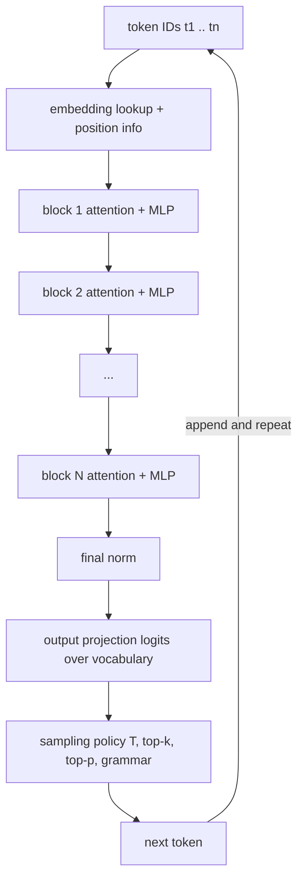
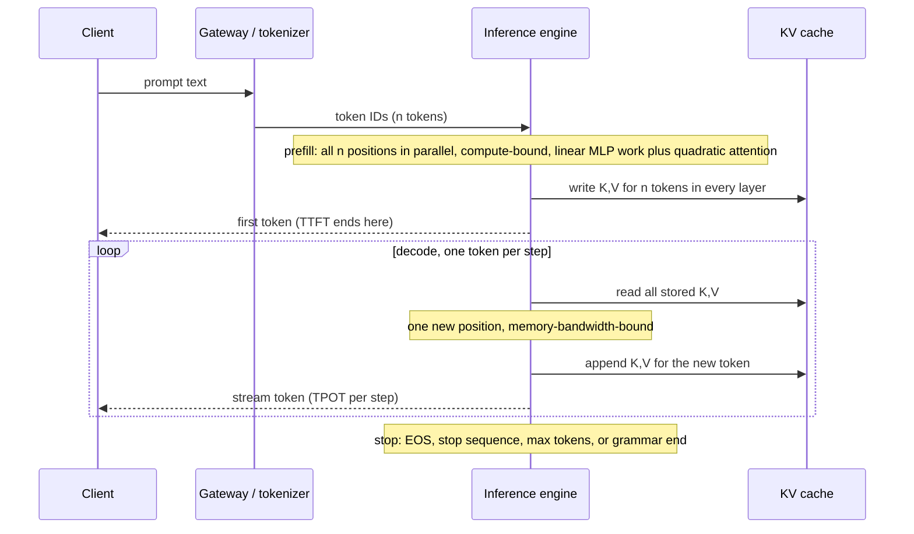
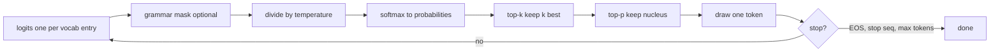

# Chapter 2 — How LLMs Work, for Engineers

This chapter covers the minimum of model internals an engineer must design around, so you can predict an LLM-backed system's behavior from the mechanism underneath. Why did a bill double when you switched languages? Why does the first token take two seconds and the rest stream fast? Why did "temperature 0" return two different answers, why did a 200k-token context miss the fact on page 40, and why can a model that writes fluent SQL not count the rows in a table you paste? None of it is research mathematics, and training appears only to the depth that explains behavior.

**You will be able to:**
- Measure token cost per language and content type with the real tokenizer, and explain why it varies.
- Explain prefill and decode, and attribute a latency problem to time-to-first-token or time-per-output-token.
- Compute KV-cache memory for a model configuration and turn it into a concurrency limit.
- Choose sampling settings (temperature, top-k, top-p, stopping) per task and explain why temperature 0 is not reproducible.
- Explain how a pretrained model becomes a chat assistant, and use that to predict instruction-following failures, refusals, and sycophancy.
- Predict which tasks the mechanism makes unreliable (facts, arithmetic, trust) and where the system must compensate.

**Prerequisites:** Chapter 1 (the running Northwind example and the idea of a model as an untrusted component). | **Code:** `book/projects/examples/ch02/` (run: `cd book/projects/examples/ch02 && pytest -q`) | **Builds:** three small experiments: a tokenizer cost table, a sampling demonstration, and a KV-cache calculator.

**First reading:** Mental model; Tokens; The transformer as a block diagram; Attention; The context window; Prefill and decode; The KV cache; From logits to a token; Determinism; Structured and constrained generation; Lost in the middle; Capability limits; then Implementation. **Deep dives** (skip on a first pass): Two things called "embedding"; From base model to assistant; Why decode is sequential; Model types; How to read a model card.

## Why this matters

An LLM's unusual failure modes mostly trace back to a handful of mechanical facts, and engineers who do not know them debug by superstition. They add "please be accurate" to a prompt when the evidence sits in the middle of a 60k-token context. They call temperature 0 deterministic and are surprised by a flaky test. They size a self-hosted deployment by parameter count and run out of GPU memory at a dozen concurrent long chats.

One filter chose what is here: does this internal detail predict something an engineer must handle? Position encodings, backpropagation, and normalization variants fail it.

## Mental model

> **Mental model:** The model is a **next-token probability machine wrapped in a loop**. The machine takes a sequence of token IDs and returns a score for every vocabulary entry at the next position. The loop turns those scores into one chosen token, appends it, and calls the machine again until a stop condition fires. Everything you control (prompt, sampling settings, schema, stop sequences, maximum length) is an input to the machine or a rule in the loop. Nothing you do changes the weights.

Three consequences recur throughout the book. Cost and latency follow token counts, not question difficulty, so context is a budget, not a bucket. The model has no state between calls, so whatever it should remember must be sent again. The output is a sample, so ground truth and any property you need with certainty must come from outside the model.

## Core concepts

### Tokens: the unit of cost, context, and confusion

A tokenizer maps text to integer IDs from a fixed vocabulary, typically tens to a few hundred thousand entries, and back. Most use Byte Pair Encoding (BPE) or a close relative: start from single bytes and repeatedly merge the most frequent adjacent pair in a large corpus into a new entry, so common words like ` policy` become single tokens. A Northwind ticket ID such as `NW-48213` never appeared often enough to earn merges, so it stays in fragments, and rare text falls back toward individual bytes. The vocabulary is frozen with the model. Four consequences follow.

**Tokens are not words.** For English prose a token is roughly four characters, and the ratio shifts with content. The experiment in this chapter tokenizes the same vacation-policy sentence in four languages, plus code, JSON, numbers, and identifiers, with one public BPE vocabulary (`tiktoken`'s `o200k_base`; words are split on spaces, so Japanese shows one):

```
sample                          chars  bytes  words  tokens chars/tok tok/word
------------------------------------------------------------------------------
English prose                     173    173     29      32      5.41     1.10
Russian prose (same text)         177    329     23      42      4.21     1.83
Azerbaijani prose (same text)     163    195     21      55      2.96     2.62
Japanese prose (same text)         66    196      1      57      1.16    57.00
Python function                   216    216     24      48      4.50     2.00
JSON, compact                     247    247      6      76      3.25    12.67
JSON, indent=2                    309    309     30     112      2.76     3.73
Decimal numbers                    82     82     10      47      1.74     4.70
UUIDs and hashes                  124    124      6      98      1.27    16.33
```

The same statement costs 32 tokens in English, 42 in Russian, and 55 in Azerbaijani, a Latin-alphabet language with diacritics and morphology the vocabulary rarely saw. An older vocabulary from the same family (`cl100k_base`) charges 80 for the Russian sentence. Your provider's vocabulary can change a multilingual cost model by a factor of two, and only measuring tells you.

**Structure is expensive.** Pretty-printing the same ticket JSON raises its cost from 76 to 112 tokens for zero information, and a schema sent with every request pays that tax on every call. Compact serialization is one of the cheapest optimizations in the book.

**Numbers and identifiers shatter.** A ten-digit number becomes four pieces (`123 | 456 | 789 | 0`), and 124 characters of UUIDs and hashes become 98 tokens. Fragmentation is one reason arithmetic and exact copying are weak: `1234567890` is four arbitrary symbols, not a quantity. When extraction must preserve an invoice number exactly, verify the copied value against the source.

**Count with the real tokenizer.** Character-based estimates are wrong by two to four times in exactly the cases that matter. Use exact counts (the provider's counting endpoint or published tokenizer) for budget enforcement and billing, heuristics only for early estimates, and log which one you used. The tokenizer is part of the model: when you switch models, re-measure.

### Two things called "embedding"

> **Deep dive.** Separates the model's internal token vectors from the retrieval embeddings of Part IV; skip on a first reading.

Inside the model, each token ID first selects a row of an embedding matrix, a vector of a few thousand numbers learned with the rest of the network and never exposed through an API. A retrieval embedding model is a separate, usually smaller network trained to map a whole passage to one vector so that related passages land near each other; its output is what you store in a vector index.

You cannot pull "the LLM's embeddings" out of a chat model for search, you cannot switch retrieval embedding models without re-indexing, and an LLM reading a retrieved chunk sees its tokens, never its vector. Chapter 8 develops the retrieval side.

### The transformer as a block diagram

The shape of the computation, not the equations, determines cost.



Token IDs become vectors, the vectors pass through N identical blocks (tens to around a hundred), and the final vector at the last position is projected to one raw score per vocabulary entry, called a **logit**. A sampling policy picks a token, it is appended, and the whole thing runs again. Each block does two things. **Attention** moves information between positions: each token's vector is updated with a weighted mix of information from earlier tokens. **The MLP** (a feed-forward network) transforms each position independently and holds most of the parameters.

The loop at the bottom is why generation is sequential and output tokens cost more latency than input tokens. The absence of any box labeled "memory" or "truth" is why the model knows only what is in `t1 .. tn` and in its weights.

**Mixture of experts (MoE)** replaces each MLP with many "experts" plus a router that sends each token through only a few. Such a model has **total parameters**, which must all sit in accelerator memory, and fewer **active parameters**, which run per token and set the per-step cost. An illustrative MoE model with 100 billion total and 15 billion active parameters needs the memory of a large model and decodes at roughly the speed of a mid-sized one (Chapter 34).

### Attention: every token reads from every earlier token

Think of attention as a fuzzy dictionary lookup that runs at every position. Each position builds a *query* vector (what it is looking for). Every earlier position offers a *key* vector (what it can answer) and a *value* vector (what it hands over if picked). The query is compared with every key, the match scores become weights that add up to one (a softmax), and the position receives a weighted average of all the values. When Northwind Assist answers "Can I carry over unused vacation days?", the positions writing the answer match the keys of the carry-over clause, so that clause's values dominate the mix.

Each layer runs several of these lookups in parallel, called *heads*, each with vectors of length `head_dim`; this matters for the KV cache below. The operational content: **any token can read from any earlier token, with learned weights, in every layer**. That is how a model uses a definition from the system prompt, and why an instruction inside a retrieved document can steer the output: attention does not know which tokens you trust (Chapter 26).

The cost follows. Attention compares n queries against n keys, so its work grows with n², while the MLP grows linearly. A 2,000-token prompt means about 4 million query-key comparisons per head per layer; a 64,000-token prompt, about 4 billion: thirty-two times the tokens, a thousand times the work. So doubling a long prompt more than doubles the wait before the first output token.

Models also degrade, sometimes sharply, beyond the sequence lengths they were trained on, even when the API accepts the tokens. An advertised context size says what the input will accept, not how well the model uses position 150,000.

### The context window: working memory and a budget

The context window is the maximum number of tokens the model can attend over: system prompt, history, retrieved documents, tool results, and generated tokens all share it. It is the model's entire working memory; a fact in neither the window nor the weights gets replaced by something plausible.

The window is a budget with four costs. **Money:** every input token is billed. **Latency:** reading the prompt grows at least linearly with its length. **Serving memory:** every token holds its keys and values in GPU memory (the KV cache, below) for the whole request, which caps concurrency. **Attention dilution:** the more tokens compete, the less reliably any one is used (see Lost in the middle). Deciding what goes in is context engineering (Chapter 5).

### From base model to assistant

> **Deep dive.** Explains instruction-following, refusals, sycophancy, and reasoning tokens from the training stages; skip on a first reading.

The model behind a chat API went through several training stages, and each leaves fingerprints you will debug (Chapter 33 covers running them yourself).

**Pretraining** teaches next-token prediction on a very large corpus. The result is a *base model*: a document continuer. Ask it "How many vacation days carry over?" and it may continue with three more questions, because a list of questions is a plausible document. Almost everything the model knows, and its knowledge cutoff, comes from this stage.

**Instruction tuning** (supervised fine-tuning on curated conversations) teaches the format: after a marker that says "the assistant speaks now," a helpful answer follows, then an end-of-turn token.

**Preference tuning** shapes which of several acceptable answers the model prefers, from pairwise comparisons by people or models (RLHF trains a reward model on them; DPO-style methods use the pairs directly). Tone, helpfulness, and refusals are mostly set here.

**Chat templates.** The list of messages your code sends is not a structure the model sees. The server serializes it into one token sequence with a *chat template*, using special tokens that mark each role's turn:

```
messages your code sends                     token stream the model reads (illustrative)
[{"role": "system", "content": "You are     <|start|>system<|sep|>You are Northwind Assist ...<|end|>
   Northwind Assist ..."},               ->  <|start|>user<|sep|>How many vacation days carry over?<|end|>
 {"role": "user", "content": "How many       <|start|>assistant<|sep|>      <- generation starts here
   vacation days carry over?"}]
```

Each model family has its own markers. Generation begins right after the assistant marker, and the end-of-turn token is the "natural stop" in the stopping rules below. If you self-host, apply the exact template from the model's tokenizer configuration: a wrong template raises no error, it silently lowers quality.

Three behaviors follow from these stages.

- **The instruction hierarchy is learned, not enforced.** Models follow the system segment over a conflicting user segment because training rewarded that, not because anything blocks the user tokens; a persuasive user message or a retrieved instruction can still win (Chapters 4 and 26).
- **Refusals are a learned pattern.** The model learns surface cues, not your policy. It over-refuses benign requests that resemble harmful ones (an HR question about "terminating" an employee's access) and can under-refuse a rephrased harmful one. Enforce your actual policy in code (Chapter 27).
- **Sycophancy is a learned preference.** Raters tend to prefer answers that agree with them and sound confident. The model accepts false premises ("since carry-over is unlimited, how do I ...") and flips a correct answer under pushback. Ground answers in retrieved evidence and include leading-question cases in your evaluation set (Chapter 24).

**Reasoning models** add a stage, typically reinforcement learning on problems with checkable answers, that rewards a long stretch of "thinking" tokens before the answer. Each thinking token is an ordinary decode step (both described below): it takes time, occupies KV cache, and is usually billed as output even when hidden. A visible 200-token answer may sit behind thousands of them, so the wait grows, cost varies widely between requests, and `max_tokens` must leave room. The extra computation helps on multi-step math, code, and planning, and buys little on lookup, extraction, or classification. Chapter 7 routes effort per request.

## How it works: the life of a request

### Prefill and decode

Follow one Northwind request through the engine: a 6,000-token prompt (system contract, three HR policy chunks, and the question "How many vacation days carry over?") that produces a 150-token answer. It runs in two phases with different performance character.



Prefill is reading the whole question; decode is writing the answer one token at a time. **Prefill** pushes all n prompt positions through all blocks together in large matrix multiplications. It is compute-bound, holds the quadratic attention term, writes the prompt's keys and values to the KV cache, and ends with logits for the first output token.

**Decode** then generates one token per step. Each step reads all the weights and all cached keys and values to do a little arithmetic for one new position, then appends its key and value to the cache. The phase is memory-bandwidth-bound, like a full table scan to return one row. With an illustrative 8-billion-parameter model at 16 bits, each step reads about 16 GB of weights; at about 3 TB/s of bandwidth that sets a floor of roughly 5 ms per token. It is also why batching helps: one pass over the weights serves every sequence in the batch.

The split needs two latency metrics. **Time to first token (TTFT)** is the server-side time from receiving the request to producing the first output token: queueing plus prefill. **Time per output token (TPOT)** is the decode cadence, set by model size, memory bandwidth, and batch size, and creeping up as the cache grows. For the Northwind request, TTFT is queueing plus the 6,000-token prefill, and the answer is 150 TPOT steps. A long prompt with a short answer is TTFT-dominated; a short prompt with a long answer is TPOT-dominated.

Keep TTFT distinct from the user's **perceived wait**, the time until something useful appears on screen. Without streaming, the user waits TTFT plus every decode step; with streaming (Chapter 3), roughly TTFT plus network time. Streaming shortens the perceived wait and changes neither TTFT nor TPOT. Northwind's "p95 time-to-first-token under 2 s" is a constraint on prompt size and queueing that streaming cannot relax; an answer-length cap is the separate lever on total decode time.

### The KV cache and why long context plus concurrency runs out of memory

Without a cache, step k of decode would recompute the keys and values of all k earlier tokens. Because attention only looks backward, those never change, so the KV cache stores them. It is the resource that runs out first when long contexts meet many simultaneous users. Its size for one sequence is

```
KV bytes = 2 × layers × kv_heads × head_dim × tokens × bytes_per_element
```

where the 2 counts keys and values, `layers` is the block count N, `kv_heads × head_dim` is the width of the key (and value) vector per layer, `tokens` is everything in context so far (prompt plus generated), and `bytes_per_element` is 2 for 16-bit and 1 for 8-bit cache formats. Everything except `tokens` is a constant of the model, so the cache is linear in context length and, across users, in concurrency.

One worked number, with an illustrative mid-sized configuration: 32 layers, 8 key/value heads, head dimension 128, 16-bit cache. Every token kept in context costs 2 × 32 × 8 × 128 × 2 = 131,072 bytes, 128 KiB. A 16,000-token context occupies about 1.95 GiB per sequence; sixteen such sequences need 31 GiB on top of the weights. With 40 GiB free, 20 Northwind HR users with 16k tokens of handbook context fit, or two with 128k contexts, and the next one queues. **Context length is a concurrency decision**, and a provider's rate limits and latency spikes under load follow the same arithmetic.

The configuration assumed 8 key/value heads for a model that might have 32 query heads. That sharing is **grouped-query attention (GQA)**; with one shared key/value head it is **multi-query attention (MQA)**. It cuts the cache by the sharing factor (four times here: 7.8 GiB per 16k sequence without it) at a modest quality cost; 8-bit cache formats halve it again. For self-hosting, the key/value head count says more about concurrency than the parameter count.

The cache also explains **prefix reuse**, sold by hosted providers as prompt caching. Keys and values at position i depend only on tokens 1 through i, so requests that begin with the same tokens can share that prefix's cache and skip its prefill. One changed token near the start invalidates everything after it. Chapter 5 owns the practice.

### Why decode is sequential, and what engines do about it

> **Deep dive.** Names the engine techniques behind serving throughput; skip on a first reading.

Token k+1 cannot be computed until token k is chosen, so one request cannot use an accelerator efficiently. Engines recover utilization with **continuous batching** (many requests' decode steps run together, joining and leaving at every step), **paging** the KV cache in fixed blocks, and **speculative decoding** (a small model drafts several tokens and the large model verifies them in one pass). All change throughput and tail latency (Chapter 34). Your latency depends on who else is in the batch, which is why percentiles, not averages, are the right metric.

### From logits to a token: the sampling pipeline

The last step of every decode iteration is yours to configure.



**Softmax** turns logits into probabilities that sum to one: `p_i = exp(z_i) / Σ exp(z_j)`. **Temperature** divides the logits first, a contrast knob: below 1 it sharpens the distribution (in the table below, T=0.3 lifts ' the' from 42% to 89%), above 1 it flattens it, and near 0 it approaches greedy selection. It never changes the ranking; it changes how much probability the tail of individually unlikely tokens keeps.

**Top-k** keeps the k most probable tokens and renormalizes. **Top-p** (nucleus sampling) keeps the smallest set of top tokens whose probabilities add up to at least p, so it keeps one or two when the model is confident and many when it is not. Both cut the tail, which summed can derail a continuation every few hundred draws. A toy eight-token distribution for the prefix "The ticket was escalated to":

```
token               greedy (T=0)   T=0.3   T=1.0   T=2.0   T=1, top_k=3   T=1, top_p=0.9   T=2, top_p=0.9
' the'                     1.000   0.893   0.424   0.275          0.550            0.441            0.285
' a'                       0.000   0.062   0.191   0.185          0.247            0.198            0.191
' tier'                    0.000   0.032   0.156   0.167          0.202            0.162            0.173
' engineering'             0.000   0.008   0.105   0.137          0.000            0.109            0.142
' support'                 0.000   0.004   0.086   0.124          0.000            0.089            0.128
' management'              0.000   0.000   0.035   0.079          0.000            0.000            0.082
' Paris'                   0.000   0.000   0.003   0.023          0.000            0.000            0.000
' purple'                  0.000   0.000   0.001   0.011          0.000            0.000            0.000
entropy (bits)              0.00    0.65    2.24    2.64           1.44             2.07             2.48
candidates left                1       8       8       8              3                5                6
```

Entropy measures how spread out the choice is: 0 bits is one certain token, 3 bits a uniform pick among eight.

Read the ' purple' row. At temperature 1 it has about a 0.06% chance per step; if every step had a tail like this, a 500-token answer would contain such a token roughly one time in four. At temperature 2 it is 1.1% per step, near certain over 500 tokens. Top-p at 0.9 removes it at either temperature. Temperature controls diversity among reasonable options; truncation deletes unreasonable ones. A common split is low temperature alone for extraction and classification, moderate temperature with top-p for generation.

**Greedy decoding** (temperature 0) always takes the argmax, the right default for extraction, classification, tool arguments, and code edits. Its pathology is looping: a model that starts repeating a phrase has no randomness to escape. **Repetition penalties** push down logits of tokens already produced; they help with loops but damage legitimately repeated identifiers, so try stop sequences and length caps first.

**Stopping** is a loop rule. Generation ends on the end-of-sequence (EOS) token, on a configured stop sequence, at `max_tokens`, or when a grammar says the structure is complete. The API reports truncation as a separate finish reason (this book writes `length`). Treat `length` as an error in extraction pipelines, because the JSON is almost certainly incomplete, and set `max_tokens` per task, since it also bounds cost and latency.

### Determinism, and the myths around it

Temperature 0 makes the sampling step deterministic, not the system. Floating-point addition is not associative, and the summation order depends on the kernel and on which other requests share the batch. Two identical requests can see logits that differ in the last bits; when the top two candidates are close, the argmax flips and the outputs diverge from there. A Northwind ticket where P2 and P3 score almost the same can be labeled P2 in one CI run and P3 in the next, with an identical prompt. Mixture-of-experts routing can also depend on the batch, and providers update models behind a stable name, so a `seed` parameter is best-effort at most.

**Temperature 0 gives you stability, not reproducibility.** Tests that assert exact string equality will be flaky; assert on validated structure, fields, a judge's rubric, or a set of acceptable answers (Chapter 24). Only a response cache (Chapter 3) gives bit-exact repeats, because it skips the model.

### Structured and constrained generation

The grammar-mask box in the sampling diagram is where **constrained decoding** happens: the engine turns a schema or grammar into a token-level mask that zeroes any token that would make the output unparseable, so after `{"priority": "` only tokens that can begin `low`, `medium`, or `high` survive. The result is syntactically valid by construction (unless `max_tokens` cuts it off), but **syntactic validity is not semantic validity**: the date may be February 30th and the enum value the wrong one. Chapter 6 owns constrained decoding and the validation that must follow it.

### Lost in the middle

Models use context unevenly: move one required fact through a fixed long prompt, and accuracy is typically highest near the start or end and lowest in the middle, more so as the prompt grows. If Northwind's builder pastes 40 HR chunks in reading order, the carry-over clause that answers the question can land at position 21, the least-used place. Chapter 5 owns the remedies and the position-sweep test that measures your model at your lengths.

### Model types and what they change for an engineer

> **Deep dive.** Maps model classes onto the mechanism; Chapter 7 owns the choice; skip on a first reading.

**Small models** trade peak capability for latency, cost, and memory; for a bounded task such as ticket classification, one tuned or prompted for the job often matches a large model. **General models** are the default when the task shape is unknown. **Reasoning models** (see "From base model to assistant") are slower and costlier by large factors and better on multi-step problems. **Decision-style usage** returns a class, score, or choice, often with log-probabilities, which makes output cheap to validate and possible to calibrate (Chapter 6). **Multimodal inputs** enter as extra tokens from a modality-specific encoder: an image costs hundreds to thousands of tokens, so send text when you have it.

For Northwind, ticket triage is a small-model job, policy questions go to a general model over retrieved context, and reconciling a disputed invoice is a routed reasoning case that still calls a calculator tool (Chapter 7).

### Capability limits that the mechanism predicts

Each of these follows from the mechanism above, so a newer model version softens it at best.

**No ground truth.** When the plausible continuation is a fact the model has not seen, it produces a plausible fact, with no internal flag separating recall from invention; confident tone is not a signal. Grounding, validated citations, and abstention paths (Chapter 13) are how the system supplies truth.

**No state between calls.** Each request starts from the weights and the context you send. "Memory" in a product is the application re-sending or summarizing prior content (Chapter 21).

**Knowledge cutoff.** Weights encode the training corpus up to some date. Anything later, and anything private to your organization, must arrive through the context. A question about last week's incident is a retrieval problem.

**Weak arithmetic and counting.** Numbers are fragmented into opaque pieces, and the architecture has no carry register or loop counter. Multi-digit arithmetic and counting a long list fail at rates unacceptable for billing or compliance. Route calculation to a tool (Chapter 16).

**Instruction competition.** Attention does not know which tokens are the system prompt, the user, or a pasted document, so instruction-shaped text in a document influences the output. Treat retrieved and user-provided content as untrusted data (Chapters 4 and 26).

**Sensitivity to formatting.** Rephrasing, reordered examples, or Markdown versus plain text can measurably change quality, because form is part of the condition. Version prompts and regression-test them (Chapter 4).

### How to read a model card or a benchmark claim

> **Deep dive.** Turns vendor numbers into questions to ask; skip on a first reading.

Each vendor claim needs a question before you design on it. A **context size** is an input limit: what evaluation showed usable recall at your lengths and positions? A **parameter count** is about weights: what are total and active parameters, layers, key/value heads, and head dimension, which set the KV cache and your concurrency? A **benchmark score** is a measurement under specific settings: was it tool-assisted, how many samples per question, at what sampling settings, could the benchmark have leaked into training, and does its task distribution resemble yours? A **latency or throughput claim** is meaningless without prompt length, output length, concurrency, and percentile.

As in Chapter 1, separate "the vendor reports" from "we measured," and record the evidence level next to every number you design on.

## Implementation

Three standalone scripts (standard library, NumPy, optional `tiktoken`) with offline tests; no `aie_core` dependency yet.

```
book/projects/examples/ch02/
├── tokenizer_experiment.py   # token cost table, BPE pieces, heuristic fallback
├── sampling.py               # softmax, temperature, top-k, top-p, sample, demo
├── kv_cache_calc.py          # kv_cache_bytes() and a CLI
└── test_ch02.py              # offline tests
```

Run from the repository root:

```bash
cd book/projects/examples/ch02 && pytest -q
python tokenizer_experiment.py --pieces
python sampling.py --draws 10000
python kv_cache_calc.py --layers 32 --kv-heads 8 --head-dim 128 --tokens 16000 \
    --concurrency 16 --memory-gb 40 --query-heads 32
```

Look for the UUID row's characters per token, the ' purple' row, and the calculator's GQA line: each replaces an assumption with a measurement.

`tiktoken` downloads a merge table on first use. If that fails behind a proxy, the script prints a table labeled `heuristic` instead of crashing. The counting core:

```python
# path: book/projects/examples/ch02/tokenizer_experiment.py  (excerpt: counting core)
from __future__ import annotations

import argparse
import json
import math
import re
from dataclasses import dataclass
from typing import Callable

DEFAULT_ENCODING = "o200k_base"

# ---------------------------------------------------------------------------
# Counting
# ---------------------------------------------------------------------------

_Encoder = Callable[[str], list[int]]
_ENCODER_CACHE: dict[str, _Encoder | None] = {}


def _load_tiktoken(encoding_name: str) -> _Encoder | None:
    """Return a ``str -> token ids`` callable, or None if tiktoken is unavailable.

    Any failure (package missing, no network for the merge table, bad name) means
    fallback. The caller reports which path was used.
    """
    if encoding_name in _ENCODER_CACHE:
        return _ENCODER_CACHE[encoding_name]
    encoder: _Encoder | None
    try:
        import tiktoken  # type: ignore[import-not-found]

        encoder = tiktoken.get_encoding(encoding_name).encode
    except Exception:  # noqa: BLE001 - deliberately broad
        encoder = None
    _ENCODER_CACHE[encoding_name] = encoder
    return encoder


def heuristic_token_count(text: str) -> int:
    """Rough estimate: ~4 ASCII chars, ~4 non-ASCII UTF-8 bytes, or ~2 digits per token.

    Loosely calibrated against public BPE vocabularies. For budgeting, not billing.
    """
    if not text:
        return 0
    ascii_chars = sum(1 for ch in text if ord(ch) < 128 and not ch.isdigit())
    digit_chars = sum(1 for ch in text if ch.isdigit())
    other_bytes = sum(len(ch.encode("utf-8")) for ch in text if ord(ch) >= 128)
    estimate = ascii_chars / 4.0 + digit_chars / 2.0 + other_bytes / 4.0
    return max(1, math.ceil(estimate))


@dataclass(frozen=True)
class TokenCount:
    tokens: int
    method: str  # "tiktoken:<encoding>" or "heuristic"

    @property
    def exact(self) -> bool:
        return self.method.startswith("tiktoken:")


def count_tokens(text: str, encoding_name: str = DEFAULT_ENCODING) -> TokenCount:
    """Count tokens with the real tokenizer if possible, else with the heuristic."""
    encoder = _load_tiktoken(encoding_name)
    if encoder is None:
        return TokenCount(heuristic_token_count(text), "heuristic")
    return TokenCount(len(encoder(text)), f"tiktoken:{encoding_name}")
```

The sampling module's core is the pipeline itself, ending in the `sample` step that chains temperature, softmax, top-k, and top-p. The helpers and the `main` that produced the table above are on disk.

```python
# path: book/projects/examples/ch02/sampling.py  (excerpt: the sampling pipeline)
# A toy next-token distribution for the prefix "The ticket was escalated to".
# Logits are unnormalized scores straight out of the model's output projection.
TOY_VOCAB: list[str] = [" the", " a", " tier", " engineering", " support", " management", " Paris", " purple"]
TOY_LOGITS: np.ndarray = np.array([4.0, 3.2, 3.0, 2.6, 2.4, 1.5, -1.0, -2.5])


def softmax(logits: np.ndarray) -> np.ndarray:
    """Numerically stable softmax: subtracting the max does not change the result."""
    z = np.asarray(logits, dtype=np.float64)
    z = z - z.max()
    e = np.exp(z)
    return e / e.sum()


def apply_temperature(logits: np.ndarray, temperature: float) -> np.ndarray:
    """Divide logits by T. T < 1 sharpens, T > 1 flattens, T -> 0 approaches greedy.

    T == 0 is handled by the caller as greedy (argmax) because division by zero is
    undefined; providers do the same.
    """
    if temperature < 0:
        raise ValueError("temperature must be >= 0")
    if temperature == 0:
        raise ValueError("temperature 0 means greedy; call greedy() instead")
    return np.asarray(logits, dtype=np.float64) / temperature


# ... top_k_filter() is on disk


def top_p_filter(probs: np.ndarray, p_threshold: float) -> np.ndarray:
    """Nucleus sampling: keep the smallest prefix (by descending prob) whose mass >= p.

    The surviving set adapts to confidence: a peaked distribution keeps one or two
    tokens, a flat one keeps many. The most probable token is always kept, so the
    result is never empty even for tiny thresholds.
    """
    if not 0 < p_threshold <= 1:
        raise ValueError("p must be in (0, 1]")
    p = np.asarray(probs, dtype=np.float64)
    order = np.argsort(-p, kind="stable")
    cumulative = np.cumsum(p[order])
    # index of the first position where cumulative mass reaches the threshold
    cutoff = int(np.searchsorted(cumulative, p_threshold, side="left"))
    keep = order[: cutoff + 1]
    out = np.zeros_like(p)
    out[keep] = p[keep]
    return out / out.sum()


def greedy(logits: np.ndarray) -> int:
    """Argmax. Deterministic given identical logits; ties resolve to the lowest index."""
    return int(np.argmax(np.asarray(logits, dtype=np.float64)))


def sample(
    logits: np.ndarray,
    *,
    temperature: float = 1.0,
    top_k: int | None = None,
    top_p: float | None = None,
    rng: np.random.Generator | None = None,
) -> int:
    """One decode step: logits -> temperature -> softmax -> top-k -> top-p -> draw.

    Order matters and mirrors common engine implementations: temperature reshapes the
    logits first, then truncation removes the tail from the resulting probabilities.
    """
    if temperature == 0:
        return greedy(logits)
    probs = softmax(apply_temperature(logits, temperature))
    if top_k is not None:
        probs = top_k_filter(probs, top_k)
    if top_p is not None:
        probs = top_p_filter(probs, top_p)
    rng = rng or np.random.default_rng()
    return int(rng.choice(probs.size, p=probs))
```

The KV-cache calculator's core is three functions; the CLI that wraps them is on disk.

```python
# path: book/projects/examples/ch02/kv_cache_calc.py  (excerpt: core functions)
GIB = 1024**3


def kv_cache_bytes(layers: int, kv_heads: int, head_dim: int, tokens: int, bytes_per_elem: int) -> int:
    """Bytes of KV cache for ONE sequence of ``tokens`` tokens."""
    for name, value in (
        ("layers", layers),
        ("kv_heads", kv_heads),
        ("head_dim", head_dim),
        ("bytes_per_elem", bytes_per_elem),
    ):
        if value <= 0:
            raise ValueError(f"{name} must be positive, got {value}")
    if tokens < 0:
        raise ValueError(f"tokens must be >= 0, got {tokens}")
    return 2 * layers * kv_heads * head_dim * tokens * bytes_per_elem


def bytes_per_token(layers: int, kv_heads: int, head_dim: int, bytes_per_elem: int) -> int:
    """KV bytes added for every token kept in context. Handy for cost-per-token intuition."""
    return kv_cache_bytes(layers, kv_heads, head_dim, 1, bytes_per_elem)


def max_concurrent_sequences(memory_budget_bytes: int, per_sequence_bytes: int) -> int:
    """How many sequences of that size fit in the memory left for KV cache (floor)."""
    if per_sequence_bytes <= 0:
        raise ValueError("per_sequence_bytes must be positive")
    if memory_budget_bytes < 0:
        raise ValueError("memory budget must be >= 0")
    return memory_budget_bytes // per_sequence_bytes
```

For the worked example it prints the numbers quoted in the KV-cache section, plus `without GQA (32 K/V heads) the same sequence would need 7.81 GiB, 4.0x more`.

The tests (`test_ch02.py`, on disk) pin the softmax, ranking under temperature, a never-empty top-p, KV linearity, and the heuristic fallback. None calls a model, and tests that need the real vocabulary are skipped, not failed, when it is unavailable.

## Code walkthrough

**Fallback that announces itself.** `count_tokens` returns a `TokenCount` whose `method` field says whether the number is exact. A bare `int` would let a production budget check silently switch to approximate when a download fails, unnoticed until a context overflow.

**Order of operations in `sample`.** Top-p after a high temperature keeps a larger nucleus (six candidates at T=2 versus five at T=1 in the demo). Do not assume one provider's order matches another's.

**Top-p always keeps one token.** The slice `[: cutoff + 1]` includes the first position where cumulative mass reaches the threshold, so for `p = 0.01` on a flat distribution one token survives. A naive `cumulative <= p` mask would return an empty set and divide by zero.

**Why the KV function validates.** Zero layers or negative tokens would produce a silent zero or negative byte count, and a capacity plan built on that is worse than a crash. `max_concurrent_sequences` floors deliberately: nineteen and a half users is nineteen users and a queue.

## Production considerations

**Cost accounting is token accounting.** Record input, output, cached-input, and thinking tokens per request from the provider's usage field, not your estimate, and reconcile against the invoice.

**Latency budgets split by phase.** Measure TTFT and TPOT separately, at percentiles. A TTFT regression points at prompt growth or queueing; a TPOT regression at load, batch composition, or a model change. Turn Northwind's p95 TTFT target into a context-size ceiling the context builder enforces (Chapter 5).

**Version what shapes the distribution.** Model identifier, sampling settings, stop sequences, `max_tokens`, and schema are deployed behavior. Keep them in one versioned configuration, log the version per request, and rerun the regression suite on a schedule, because providers update models behind stable names. Never let model output alone authorize a side effect (Chapters 16, 26, 27).

**Two more signals.** Alert when the cached-input ratio drops after a deploy: a change broke prefix reuse. On a self-hosted engine, watch queue depth next to KV-cache utilization; together they predict the concurrency cliff (Chapters 31 and 34).

## Common mistakes

- **Estimating tokens from characters** for non-English text, numbers, IDs, or structured content.
- **Stacking temperature, top-k, top-p, and penalties by folklore.** The knobs interact; tune with an evaluation or keep defaults.
- **Using a repetition penalty to fix looping in code generation.** It breaks identifiers that must repeat.
- **Pretty-printing JSON and schemas sent to the model.**
- **Sizing hardware by parameter count.** The KV cache, not the weights, caps concurrent long-context sessions.
- **Serving an instruction-tuned model without its chat template.** Nothing errors; quality just drops.
- **Reading a confident or agreeable answer as a correct one.**
- **Dumping everything into a large context window.**
- **Asking the model to count or compute** instead of having it call a tool.

## Failure modes

**Context overflow at the margin.** Symptom: intermittent 4xx errors or silently truncated history on long conversations, mostly for non-English users. Telemetry: token count near the limit with `method = heuristic`, or a jump in the exact count after a model switch. Test: assert the exact count of the worst-case multilingual conversation from your logs stays under budget; alert when production takes the heuristic path.

**Truncated structured output.** Symptom: JSON parse errors on a few percent of extractions. Telemetry: `finish_reason = length` on those requests. Test: a long synthetic ticket that must still end in a natural stop; count `length` as a failure on every structured request.

**Tail-token derailment.** Symptom: a rare absurd word or language switch mid-answer. Telemetry: high-entropy positions; vanishes with top-p or lower temperature. Test: generate the same answer many times at deployed settings and run a judge or language-id check.

**Greedy loop.** Symptom: the answer repeats a sentence until `max_tokens`. Telemetry: high n-gram repetition plus `finish_reason = length`. Mitigate with stop sequences, a tighter cap, or mild sampling.

**Lost-in-the-middle miss.** Symptom: the assistant says a policy does not cover a case the retrieved document clearly covers. Telemetry: the correct chunk is in the evidence list but sat in the middle of a long block. Test: the position sweep from Chapter 5, on each model change.

**Nondeterministic regression.** Symptom: a golden test passes locally and fails in CI with a semantically identical answer. Telemetry: both outputs validate structurally; only the string differs. Replace the string assertion with structural checks (Chapter 24).

**Concurrency cliff on a self-hosted model.** Symptom: p99 latency jumps and requests queue past some number of active sessions. Telemetry: KV-cache utilization near 100%, GPU compute moderate. Test: load test at p95 context length and confirm the threshold matches the formula.

## Tradeoffs

| Decision | Favors | Costs | Choose when |
|---|---|---|---|
| Greedy decoding | Stability, extraction accuracy | Loops on long open text, no diversity | Extraction, classification, tool arguments, code edits |
| Sampling with top-p | Natural prose, fewer loops | Variance, harder tests | Drafting, summaries, brainstorming |
| Long context | Simplicity, fewer retrieval decisions | Cost, TTFT, dilution, KV memory | Small corpora, one-off analysis, when retrieval evaluation is poor |
| Retrieval into a small context | Cost, latency, recall at the edges | Pipeline complexity, retrieval errors | Large or changing corpora, many users |
| Small specialized model | Latency, cost, privacy | Narrow capability, more models to operate | Bounded, high-volume, measurable tasks |
| Reasoning effort on | Hard multi-step accuracy | Latency and cost by large factors | Routed hard cases where the value justifies it |
| Fewer KV heads or 8-bit cache | Concurrency, context length | Small quality loss, needs evaluation | Self-hosting under memory pressure |

## Evaluation and testing

**Test the system's contract with the model, never the model's exact words.** The failure-mode tests above cover token budgets, stopping, and position sensitivity. Add:

- **Sampling policy:** each regression case states whether determinism or diversity is wanted; extraction cases run several times must produce identical validated structures, generation cases must pass a judge rubric every time.
- **Constrained output:** parsing always succeeds, so tests move to content: values exist in the source, IDs are authorized, dates are real.
- **Model-card claims:** for each number you design on, one experiment on your data that confirms or refutes it, recorded with its evidence level.

Chapter 24 builds the harness.

## Exercises

**Start here:** K1, K3, E3, P2, D1 (about 2.5 hours). The rest go deeper.

### Knowledge questions

**K1.** A product manager says the new model "has a 1M-token context, so we can drop retrieval and send the whole handbook." Give three mechanistic reasons from this chapter why that is incomplete, naming the resource or effect each touches.

**K2.** The same sentence costs 32 tokens in English and 55 in Azerbaijani with one vocabulary, and 80 in Russian with another. What property of BPE training produces the gap, and what should a team do before committing to a per-request cost model for a multilingual rollout?

**K3.** TTFT is 3.8 s and TPOT is 25 ms for a 40k-token prompt and a 300-token answer. Which phase dominates, what would you change first, and why would streaming alone not fix it?

**K4.** Describe what temperature and top-p each do to a distribution, and explain why "temperature 2 with top-p 0.9" can be a reasonable creative setting while "temperature 2 alone" rarely is.

**K5.** A user writes "Since carry-over is unlimited now, how do I book my extra days?" and the assistant explains the booking steps without correcting the premise. Which training stage most plausibly produced this behavior, why, and what two changes outside the model reduce it?

**K6.** State the KV-cache formula, say which factors are fixed by the model and which by the request, and explain in one sentence each why GQA and 8-bit cache formats change serving capacity.

### Engineering questions

**E1.** Northwind Assist's extraction service sends a 1,800-token JSON schema with every request. Propose two changes that reduce the schema tax without changing the output contract, and describe how you would measure the saving and confirm that extraction quality did not move.

**E2.** A team proposes a regression suite that asserts exact output strings at temperature 0. Design an assertion strategy that is stable under the nondeterminism described in this chapter, and explain what each assertion type catches.

**E3.** You are choosing between two self-hostable models of similar quality. Model A: 40 layers, 32 K/V heads, head dim 128. Model B: 48 layers, 8 K/V heads, head dim 128. For a p95 context of 24k tokens and 8 concurrent sessions in 16-bit cache, compute the KV memory for each and state which one fits in 60 GiB of free memory. What else about the models would you need before deciding?

**E4.** Northwind is considering a reasoning model with high effort for all assistant traffic. Using only the mechanisms in this chapter, predict what happens to TTFT before the visible answer, cost per request and its variance, KV-cache occupancy, and the `length` finish rate under the current `max_tokens`, separately for ticket triage, policy questions, and invoice reconciliation. State which prediction you would test first and how. (Chapter 7 turns these predictions into a router.)

### Practical exercises

**P1.** (about 60 min) Extend `tokenizer_experiment.py` with a `--file` option that tokenizes a document from `book/projects/shared-data/` and reports tokens per Markdown section. Add a test on a small synthetic document asserting the per-section counts sum to the whole-document count.

**P2.** (about 60 min) Add `repetition_penalty(logits, generated_ids, penalty)` to `sampling.py`, dividing positive and multiplying negative logits of already-generated tokens by the penalty (the common engine convention). Test that it lowers the probability of repeated tokens, and demonstrate how it damages a code snippet where an identifier legitimately repeats.

**P3.** (about 2 hours) Write a `position_sweep.py` that builds a long synthetic context from Northwind policy paragraphs, inserts one required fact at a configurable position, and asks a `FakeLLM` (Chapter 3) a question whose answer depends on it, recording accuracy by position. The fake cannot show the real effect; the deliverable is the harness and its tests, ready to point at a real model.

**P4.** (about 45 min) Add `--sweep-tokens` to `kv_cache_calc.py` that prints per-sequence cache and maximum concurrency for a list of context lengths (for example 4k, 16k, 64k, 128k) under a given memory budget, plus a test that checks monotonicity.

### Debugging exercises

**D1.** An extraction pipeline shows a 3% JSON parse failure rate that began after a model upgrade. Traces show `finish_reason = "length"` on every failing request, `max_tokens` unchanged at 400, and unchanged input tickets. Explain the most likely cause and two fixes.

**D2.** Georgian-speaking users of a multilingual chat product hit "context too long" at about half the conversation length English users do, although the client-side budget check (a shared `chars / 4` estimate) passes. Walk through the diagnosis using telemetry fields from this chapter.

**D3.** A self-hosted assistant handles 40 concurrent short chats without issue. During a quarterly-review week, when staff paste long documents, p99 latency triples and requests queue while GPU compute utilization sits near 50%. Name the saturated resource, show how to confirm it from engine metrics and the formula in this chapter, and propose two mitigations with trade-offs.

## Key takeaways

- The model is a next-token probability machine in a loop; everything you control is an input to the machine or a rule in the loop.
- Tokens are the unit of cost and context. Non-English text, identifiers, numbers, and pretty-printed structure cost two to four times a character estimate. Count with the real tokenizer and record which counter you used.
- Attention lets every token read every earlier token at quadratic cost; it does not know which tokens you trust, and it uses long contexts unevenly.
- Compute-bound prefill sets TTFT and grows with prompt size; memory-bound sequential decode sets TPOT. Measure them separately, at percentiles. Streaming shortens the user's perceived wait, never TTFT.
- KV cache bytes = 2 × layers × kv_heads × head_dim × tokens × bytes_per_element. Linear in context and concurrency, and the first resource to run out; fewer key/value heads and 8-bit caches are why modern models serve more.
- Temperature reshapes the distribution without changing the ranking; top-k and top-p delete the tail. Temperature 0 gives stability, not reproducibility, so tests assert contracts, not strings. Constrained decoding guarantees syntax, never semantics.
- A chat model is a pretrained document continuer taught a template and a set of preferences. The instruction hierarchy, refusals, and sycophancy are learned tendencies, not rules; reasoning models add billed thinking tokens before every answer.
- Model classes change latency, cost, and output shape; choose by workload constraints and confirm with an evaluation on your data.
- No ground truth, no state between calls, a knowledge cutoff, weak arithmetic, instruction competition, and format sensitivity are properties of the mechanism. Design the system to supply what the model cannot.

## Further reading

- *Attention Is All You Need* (Vaswani et al., 2017): the original transformer; read the architecture section against the block diagram in this chapter.
- *Neural Machine Translation of Rare Words with Subword Units* (Sennrich, Haddow, and Birch, 2016): where byte-pair encoding for language models comes from, and why rare text fragments.
- *The Curious Case of Neural Text Degeneration* (Holtzman et al., 2020): the case for nucleus (top-p) sampling, with the tail-token failure this chapter's table reproduces.
- *GQA: Training Generalized Multi-Query Transformer Models from Multi-Head Checkpoints* (Ainslie et al., 2023): the key/value head sharing behind the KV-cache numbers.
- *Training Language Models to Follow Instructions with Human Feedback* (Ouyang et al., 2022): the instruction-tuning and RLHF pipeline behind "From base model to assistant."
- *Efficient Memory Management for Large Language Model Serving with PagedAttention* (Kwon et al., 2023): how a serving engine pages the KV cache, the bridge to Chapter 34.
