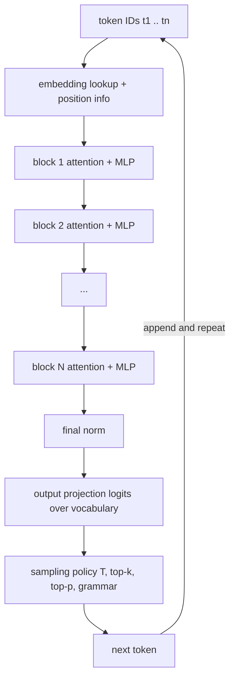
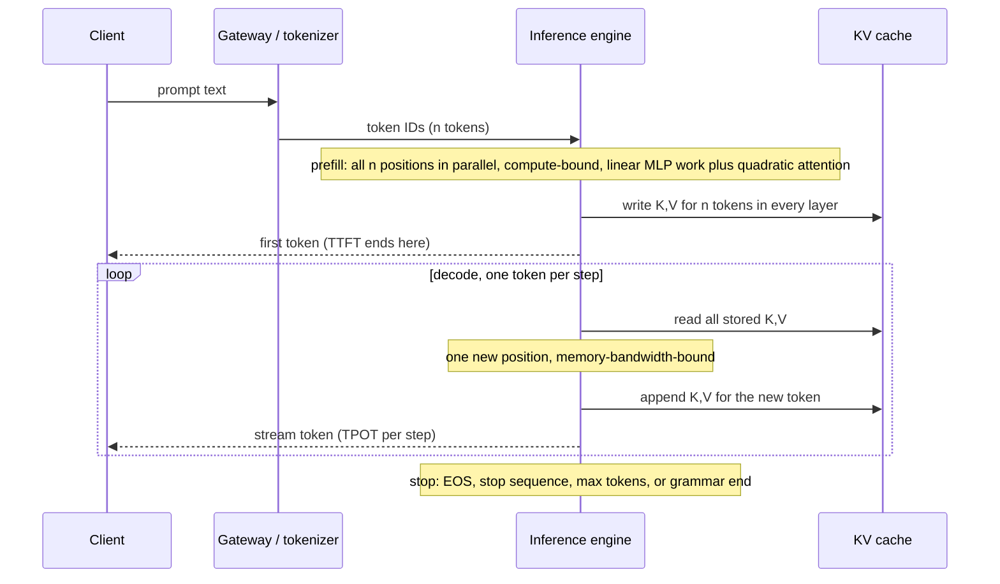
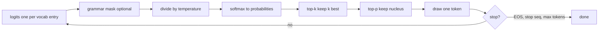

# Chapter 2 — How LLMs Work, for Engineers

This chapter covers the minimum of model internals an engineer must design around, so you can predict an LLM-backed system's behavior from the mechanism underneath: why a bill doubled when you switched languages, why the first token takes two seconds and the rest stream fast, why "temperature 0" still returned two different answers, why a 200k-token context did not find the fact you buried on page 40, and why a model that writes fluent SQL cannot reliably count the rows in a table you paste. None of it is research mathematics, and training appears only to the depth that explains behavior.

**You will be able to:**
- Measure token cost per language and content type with the real tokenizer, and explain why it varies.
- Explain prefill and decode, and attribute a latency problem to time-to-first-token or time-per-output-token.
- Compute KV-cache memory for a model configuration and turn it into a concurrency limit.
- Choose sampling settings (temperature, top-k, top-p, stopping) per task and explain why temperature 0 is not reproducible.
- Explain how a pretrained model becomes a chat assistant, and use that to predict instruction-following failures, refusals, and sycophancy.
- Predict which tasks the mechanism makes unreliable (facts, arithmetic, trust) and where the system must compensate.

**Prerequisites:** Chapter 1 (the running Northwind example and the idea of a model as an untrusted component). | **Code:** `book/projects/examples/ch02/` (run: `.venv/bin/python -m pytest book/projects/examples/ch02 -q` from the repository root) | **Builds:** three small experiments: a tokenizer cost table, a sampling demonstration, and a KV-cache calculator.

## Why this matters

An LLM is a component with unusual failure modes, and most trace back to a handful of mechanical facts. The model sees integers from a fixed vocabulary, not characters or words. It produces one token at a time, each conditioned on everything before it. Its working memory is the context window and nothing else. It emits a probability distribution, and a separate sampling step turns it into text. Its memory footprint during generation is a cache that grows with every token in context and every concurrent user.

Engineers who do not know these facts debug by superstition. They add "please be accurate" to a prompt when the real problem is that the evidence sits in the middle of a 60k-token context. They set temperature to zero, call the output deterministic, and are surprised by a flaky test. They size a self-hosted deployment by parameter count and run out of GPU memory at a dozen concurrent long chats.

Everything here is chosen by one filter: does this internal detail predict something an engineer must handle? Position encodings, backpropagation, and normalization variants fail that filter and are left to the references. Tokenization, attention cost, the KV cache, sampling, how a base model becomes an assistant, and the capability envelope pass it, and each is explained to the depth needed to design and debug, no further.

## Mental model

Treat the model as a **next-token probability machine wrapped in a loop**. The machine takes a sequence of token IDs and returns a score for every token in its vocabulary at the next position. The loop converts those scores into one chosen token, appends it, and calls the machine again until a stop condition fires. Everything you control (prompt, sampling settings, schema, stop sequences, maximum length) is either an input to the machine or a rule in the loop. Nothing you do changes the weights.

> **Mental model:** Context is a budget, not a bucket. Every token you put in costs money when the model reads it in, costs memory for the whole generation, and competes for the model's attention with every other token.

> **Mental model:** The model never knows anything; it has a distribution over what comes next. Ground truth, state, and certainty must be supplied by the system around it.

Three consequences recur throughout the book. Cost and latency are functions of token counts, not of how hard the question is. The model has no state between calls, so whatever it should remember must be sent again. The output is a sample, so any property you need with certainty must be enforced outside the model.

## Core concepts

### Tokens: the unit of cost, context, and confusion

A tokenizer maps text to integer IDs from a fixed vocabulary, typically tens to a few hundred thousand entries, and back. Modern tokenizers use Byte Pair Encoding (BPE) or a close relative: start from single bytes, scan a large corpus, and repeatedly merge the most frequent adjacent pair into a new vocabulary entry. If `i` and `ng` appear side by side constantly, `ing` becomes one entry; later merges turn whole words like ` the` or ` policy` into single tokens. A Northwind ticket ID such as `NW-48213` never appeared often enough to earn merges, so it stays in several fragments. After tens of thousands of merges, common English words and frequent code fragments are single tokens, rarer words are two or three pieces, and anything the corpus rarely contained falls back toward individual bytes. The vocabulary is frozen with the model; it does not adapt to your domain, language, or identifiers. Four consequences follow.

**Tokens are not words.** For English prose a token is roughly four characters (larger vocabularies push this toward five), and the ratio shifts with content. The experiment in this chapter tokenizes the same vacation-policy sentence in four languages, plus code, JSON, numbers, and identifiers, with one widely used public BPE vocabulary (`tiktoken`'s `o200k_base`). Words are counted by splitting on spaces, which is why Japanese, written without spaces, shows one "word" and a meaningless tokens-per-word ratio:

```
sample                          chars  bytes  words  tokens chars/tok tok/word
------------------------------------------------------------------------------
English prose                     173    173     29      32      5.41     1.10
Russian prose (same text)         177    329     23      42      4.21     1.83
Azerbaijani prose (same text)     163    195     21      55      2.96     2.62
Japanese prose (same text)         66    196      1      57      1.16    57.00
Python function                   216    216     24      48      4.50     2.00
JSON, compact                     247    247      6      76      3.25    12.67
JSON, indent=2                    309    309     30     112      2.76     3.73
Decimal numbers                    82     82     10      47      1.74     4.70
UUIDs and hashes                  124    124      6      98      1.27    16.33
```

The same statement costs 32 tokens in English, 42 in Russian, and 55 in Azerbaijani, a Latin-alphabet language with diacritics and morphology the vocabulary rarely saw. An older vocabulary from the same family (`cl100k_base`) charges 80 for the same Russian sentence. Which vocabulary your provider uses changes a multilingual cost model by a factor of two, and you cannot know it without measuring.

**Structure is expensive.** Pretty-printing the same ticket JSON raises its cost from 76 to 112 tokens for zero information; whitespace runs, quotes, and braces each take pieces. A JSON schema sent with every structured-output request is a fixed tax on every call, and formatting choices inside it are paid on every request. Stripping the whitespace saves about a third and loses no information. Compact serialization is one of the cheapest optimizations in the book.

**Numbers and identifiers shatter.** A ten-digit number becomes four pieces (`123 | 456 | 789 | 0`), an ISO timestamp thirteen, and 124 characters of UUIDs and hashes become 98 tokens. Beyond cost, fragmentation is one reason arithmetic and exact copying are weak: the model sees `1234567890` not as a quantity but as four arbitrary symbols whose grouping depends on digit count. When extraction must preserve an invoice number exactly, verify the copied value against the source rather than trusting it.

**Count with the real tokenizer.** Character-based estimates are wrong by two to four times in exactly the cases that matter. Providers expose a counting endpoint or document the tokenizer; `aie_core.llm.tokens.count_tokens` (Chapter 3) uses `tiktoken` when it is available and a characters-per-token heuristic otherwise; it returns a bare number, so treat it as an estimate. Use exact counts for budget enforcement and billing reconciliation, heuristics only for early estimates, and log which one you used. And because the tokenizer is part of the model, a prompt that fits a budget on one provider may overflow on another: when you switch models, re-measure.

### Two things called "embedding"

Inside the model, the first step after tokenization is a lookup: each token ID selects a row from an embedding matrix with one row per vocabulary entry. Each row is a vector of `hidden_size` numbers (typically a few thousand), the width the model uses to represent a token throughout the network. These token embeddings are learned jointly with the rest of the network to make next-token prediction work, they are specific to the model, and you never see them through an API.

A retrieval embedding model is a different artifact: a separate, usually much smaller network trained so that a whole passage maps to one vector and passages relevant to the same query land near each other under cosine similarity. Its output is what you store in a vector index. Its geometry reflects its training objective, so it compresses meaning in ways that serve similarity search and discards what the objective did not reward: exact numbers, identifiers, negation, permissions, recency. High cosine similarity is a hint about relevance, not a proof.

The confusion matters. You cannot pull "the LLM's embeddings" out of a chat model and use them for search. You cannot change your retrieval embedding model without re-indexing everything, because vectors from different models live in unrelated spaces. And an LLM reading a retrieved chunk never sees the chunk's vector; it sees the chunk's tokens. Chapter 8 develops the retrieval side; here the point is only that one word names two unrelated things.

### The transformer as a block diagram

You need the shape of the computation, not the equations, because the shape determines cost.



Token IDs become vectors; the vectors pass through N identical blocks (tens to around a hundred); the final vector at the last position is projected to one score per vocabulary entry. These raw scores are called logits. A sampling policy picks the token, which is appended, and the whole thing runs again. Every block does two things. **Attention** moves information between positions: each token's vector is updated with a weighted mix of information from earlier tokens. **The MLP** (a feed-forward network) transforms each position's vector independently and holds most of the parameters. Attention is the communication step; the MLP is the per-token computation step. Normalization and residual connections are plumbing that keeps the numbers well-behaved during training, and they are invisible to you.

Two facts from this diagram will reappear. The loop at the bottom is why generation is sequential and why output tokens cost more latency than input tokens. The absence of any box labeled "memory," "database," or "truth" is why the model knows only what is in `t1 .. tn` and in its weights.

**Mixture of experts (MoE)** changes the MLP box. Instead of one feed-forward network per block, an MoE block holds many (the "experts") plus a small router that sends each token through only a few of them. The model therefore has two parameter counts: **total parameters**, which must all sit in accelerator memory, and **active parameters**, the fraction that runs for each token and sets the arithmetic and memory traffic per decode step. An illustrative MoE model with 100 billion total and 15 billion active parameters needs the memory of a large model and decodes at roughly the speed of a mid-sized one. For a hosted API this is invisible except in price and speed; for self-hosting it means memory is sized by total parameters and per-token speed by active ones (Chapter 34). Routing also depends on which tokens share a batch in some implementations, one more source of nondeterminism (see the determinism section).

### Attention: every token reads from every earlier token

Think of attention as a fuzzy dictionary lookup that runs at every position. Each position builds a *query* vector (what it is looking for). Every earlier position offers a *key* vector (what it can answer) and a *value* vector (what it hands over if picked). The query is compared with every key, the match scores are turned into weights that add up to one (a softmax), and the current position receives a weighted average of the values. Unlike a real dictionary, every entry comes back, weighted by how well it matched. When Northwind Assist answers "Can I carry over unused vacation days?", the positions writing the answer issue queries that match the keys of the carry-over clause in the retrieved policy, so that clause's values dominate the mix. The projections that produce queries, keys, and values are learned; you never set them.

Each layer runs several of these lookups in parallel, called *heads*, each with its own smaller query, key, and value vectors of length `head_dim`; this detail matters for memory in the KV-cache section. The operational content is: **any token can read from any earlier token, with learned weights, in every layer**. This is what lets a model use a definition from the system prompt when answering the last user turn, and why an instruction inside a retrieved document can influence the output; attention does not know which tokens you trust (Chapter 26).

The cost follows. For n tokens, attention compares n queries against n keys, so its work grows with n², while the MLP grows linearly. A 2,000-token prompt means about 4 million query-key comparisons per head per layer; a 64,000-token prompt, about 4 billion: thirty-two times the tokens, a thousand times the attention work. For short prompts the MLP dominates; in the tens of thousands of tokens the quadratic term takes over. Optimized GPU routines (kernels) compute attention in tiles and never store the whole n×n score table, so memory stays manageable, but the arithmetic is still quadratic. What you observe is that time-to-first-token grows faster than linearly with prompt length: doubling a long prompt more than doubles the wait before the first output token.

Attention on its own is also blind to order: it treats earlier tokens as a set, so swapping two of them leaves the weighted mix unchanged. Models inject word order separately, through position encodings we do not derive here. The practical effect is that a model trained on sequences up to some length degrades, sometimes sharply, beyond it even when the API accepts the tokens. An advertised context size says what the input will accept, not how well the model uses position 150,000.

### The context window: working memory and a budget

The context window is the maximum number of tokens the model can attend over: system prompt, conversation history, retrieved documents, tool results, and the tokens generated so far all share it. It is the model's entire working memory; there is no other channel. If a fact is not in the window and not in the weights, the model produces something plausible in its place.

The window is a budget with four costs. **Money:** every input token is processed at prefill and billed. **Latency:** prefill grows at least linearly with prompt length, and faster than linearly once the quadratic attention term dominates. **Serving memory:** every token in context keeps its attention keys and values in GPU memory (the KV cache, explained under "How it works") for the whole request, and that memory caps how many requests run at once. **Attention dilution:** the more tokens compete, the less reliably any one is used, which is the mechanism behind lost-in-the-middle below.

Spend the budget deliberately. A Northwind Assist request about vacation policy should carry the system contract, the relevant policy sections rather than the whole handbook, the recent turns that matter, and a bounded answer length. Deciding what goes in, in what order, and in what form is context engineering (Chapter 5).

### From base model to assistant

The model you call through a chat API went through several training stages, and each one leaves fingerprints you will debug. You never run these stages yourself unless you fine-tune (Chapter 33), but they explain behavior that no amount of reading the architecture will.

**Pretraining** teaches next-token prediction on a very large corpus of text and code. The result is a *base model*: a document continuer. Ask a base model "How many vacation days carry over?" and it may continue with three more questions, because a list of questions is a plausible document. Almost everything the model knows, and its knowledge cutoff, comes from this stage.

**Instruction tuning** (supervised fine-tuning on curated conversations) teaches the format: after a marker that says "the assistant speaks now," a helpful answer follows, and then an end-of-turn token. It teaches task-following and style, not much new knowledge.

**Preference tuning** shapes which of several acceptable answers the model prefers. People or models compare pairs of answers; RLHF (reinforcement learning from human feedback) trains a reward model on those comparisons and optimizes the assistant against it, while DPO-style methods optimize directly on the preference pairs without a separate reward model. Tone, helpfulness, and refusals are mostly set here.

**Chat templates and role tokens.** The list of messages your code sends is not a structure the model sees. The server serializes it into one token sequence using a *chat template*, with special tokens that mark where each role's turn begins and ends:

```
messages your code sends                     token stream the model reads (illustrative)
[{"role": "system", "content": "You are     <|start|>system<|sep|>You are Northwind Assist ...<|end|>
   Northwind Assist ..."},               ->  <|start|>user<|sep|>How many vacation days carry over?<|end|>
 {"role": "user", "content": "How many       <|start|>assistant<|sep|>      <- generation starts here
   vacation days carry over?"}]
```

Each model family has its own markers, and they are reserved vocabulary entries that ordinary text should not be able to produce. Generation begins right after the assistant marker, and the model's end-of-turn token is the "natural stop" in the stopping rules below. If you self-host an instruction-tuned model, apply the exact template from its tokenizer configuration: a missing or wrong template does not raise an error, it silently lowers quality.

Three behaviors follow mechanically from these stages.

- **The instruction hierarchy is learned, not enforced.** Models follow the system segment over a conflicting user segment because training rewarded that, not because anything blocks the user tokens. All segments are still one sequence that attention reads, so a persuasive user message or an instruction inside a retrieved document can still win. Chapter 4 uses the hierarchy for prompt design; Chapter 26 explains why security cannot rest on it.
- **Refusals are a learned pattern.** Preference tuning rewarded declining certain requests, and the model learns surface cues, not your policy. It over-refuses benign requests that resemble harmful ones (an HR question about "terminating" an employee's access) and can under-refuse a harmful request rephrased. Measure the refusal rate on your own traffic, and enforce your actual policy in code (Chapter 27).
- **Sycophancy is a learned preference.** Raters tend to prefer answers that agree with them and sound confident, and optimization learns that. The model accepts false premises ("since carry-over is unlimited, how do I ...") and flips a correct answer when the user pushes back. Ground answers in retrieved evidence, phrase prompts neutrally, and include leading-question cases in your evaluation set (Chapter 24).

**Reasoning models** add one more stage, typically reinforcement learning on problems with checkable answers, which rewards producing a long stretch of intermediate "thinking" tokens before the answer. Those tokens are decoded exactly like any other: each one is a sequential decode step (see "Prefill and decode" below), occupies KV cache, and is usually billed as output even when the provider hides or summarizes it. A visible 200-token answer may sit behind thousands of thinking tokens, so the wait before the visible answer grows, cost per request varies widely between requests, and `max_tokens` must leave room for the thinking. Many APIs expose an effort setting that bounds it. The extra computation helps on multi-step math, code, and planning, and buys little on lookup, extraction, or classification. Chapter 3 covers how thinking tokens appear in usage accounting, and Chapter 7 routes effort per request.

## How it works: the life of a request

### Prefill and decode

The sections above describe the parts. Now follow one Northwind request through the engine: a 6,000-token prompt (system contract, three HR policy chunks, and the question "How many vacation days carry over?") that produces a 150-token answer. It runs in two phases with different performance character.



Prefill is reading the whole question; decode is writing the answer one token at a time. **Prefill** processes the entire prompt at once. All n positions go through all blocks together in large matrix multiplications; the phase is compute-bound, and the quadratic attention term lives here. The prompt's keys and values at every layer are written to the KV cache, and the model ends with logits for the first output token.

**Decode** then generates one token per step. Each step runs the full network for a single new position, which means reading all the weights and all cached keys and values to do a small amount of arithmetic. Each step appends one more key and value per layer to the cache. The phase is memory-bandwidth-bound: the accelerator (a GPU or similar chip) spends its time waiting for data to stream in from memory, not multiplying, much like a full table scan to return one row. With an illustrative 8-billion-parameter model at 16 bits, each decode step must read about 16 GB of weights; at about 3 TB/s of memory bandwidth that alone sets a floor of roughly 5 ms per token, however fast the arithmetic is. The same fact explains why batching helps: one pass over the weights serves every sequence in the batch.

This split is why two latency metrics are needed. **Time to first token (TTFT)** is queueing plus prefill, a function of prompt length and load. **Time per output token (TPOT)** is the decode cadence, roughly constant per step at a given context length (it creeps up as the cache grows) and a function of model size, hardware bandwidth, and how many requests the engine processes together in one batch. For the Northwind request, TTFT is queueing plus the 6,000-token prefill, and the 150-token answer is 150 TPOT steps. A long prompt with a short answer is TTFT-dominated; a short prompt with a long answer is TPOT-dominated. Streaming (Chapter 3) changes neither number; it lets the user see output after TTFT instead of after all decode steps. Northwind's "p95 time-to-first-token under 2 s" is therefore a constraint on prompt size and queueing. Total decode time is roughly TPOT times output tokens, so an answer-length cap is the separate lever that bounds it.

### The KV cache and why long context plus concurrency runs out of memory

Without a cache, step k of decode would recompute the keys and values of all k earlier tokens. The KV cache stores them so each step computes only the new token's. Earlier tokens' keys and values never change, because attention only looks backward, and each step needs only the new token's query, so queries are not cached. It makes decode feasible, and it is the resource that runs out first when long contexts meet many simultaneous users. Its size for one sequence is

```
KV bytes = 2 × layers × kv_heads × head_dim × tokens × bytes_per_element
```

where the 2 counts keys and values, `layers` is the block count N, `kv_heads × head_dim` is the width of the key (and value) vector per layer (models often keep fewer key/value heads than query heads; see GQA below), `tokens` is everything in context so far (prompt plus generated), and `bytes_per_element` is 2 for 16-bit formats and 1 for 8-bit cache formats. Everything except `tokens` is a constant of the model, so the cache is linear in context length and, across users, linear in concurrency.

One worked number, with an illustrative mid-sized configuration: 32 layers, 8 key/value heads, head dimension 128, 16-bit cache. Every token kept in context costs 2 × 32 × 8 × 128 × 2 = 131,072 bytes, 128 KiB. A 16,000-token context occupies about 1.95 GiB per sequence; sixteen such sequences need 31 GiB on top of the weights. With 40 GiB free, 20 users with 16k contexts fit, or two users with 128k contexts, and the next one queues or is rejected. If Northwind self-hosted this model for HR staff whose chats carry 16k tokens of handbook context, the twenty-first simultaneous user would queue. These are the numbers `kv_cache_calc.py` prints. **Context length is a concurrency decision**, and a provider's rate limits and the latency spikes you see under load are shaped by this arithmetic even when you never see the GPU.

The configuration assumed 8 key/value heads for a model that might have 32 query heads. That gap is **grouped-query attention (GQA)**; its extreme with one shared key/value head is **multi-query attention (MQA)**. In original multi-head attention every query head has its own keys and values, so the cache scales with head count. Sharing them across groups of query heads cuts the cache by the sharing factor (four times here: 1.95 GiB per 16k sequence instead of 7.8 without sharing) at a modest quality cost, and nearly every model designed for serving does it; quantized cache formats halve it again. For self-hosting, the key/value head count says more about concurrency than the parameter count does.

The cache also explains **prefix reuse**, which you will meet as a billing line. Keys and values at position i depend only on tokens 1 through i, so two requests that begin with the same tokens compute identical cache entries for that shared prefix. An engine that keeps those entries can skip the prefix's prefill on the next request and start work at the first differing token. Hosted providers sell this as prompt caching: cheaper and faster input tokens for a prefix they have seen recently. Two engineering rules follow from the mechanism. The match is on exact tokens from the first position, so one changed byte near the start (a timestamp, a request id, a reordered tool list) invalidates everything after it. And reuse is best-effort, because retained entries compete for the same memory as active requests and are evicted under load. Chapter 5 owns the practice (cache-friendly prompt layout), Chapter 3 shows how to measure the hit rate from usage fields, Chapter 30 does the cost math, and Chapter 34 covers prefix caching on a self-hosted engine.

### Why decode is sequential, and what engines do about it

Token k+1 cannot be computed until token k has been chosen, because it is an input. Decode is therefore a serial loop of memory-bound steps, and a single request cannot use an accelerator efficiently. Engines recover utilization by **continuous batching** (many requests' decode steps run together, sequences joining and leaving at every step), by **paging** the KV cache in fixed blocks, by **speculative decoding** (a small model drafts several tokens, the large model verifies them in one parallel pass, which costs about as much as one decode step, so every accepted draft token saves a step), and by splitting prefill and decode onto separate hardware pools. None of these changes the output distribution by design; exact speculative decoding provably preserves it. Batching does perturb floating-point results (see the determinism section). All change throughput and tail latency (Chapter 34). Your latency depends on who else is in the batch, which is why percentiles, not averages, are the right metric.

### From logits to a token: the sampling pipeline

The last step of every decode iteration is yours to configure.



**Logits** are unnormalized scores, one per vocabulary entry. **Softmax** turns them into probabilities that sum to one: `p_i = exp(z_i) / Σ exp(z_j)`. **Temperature** divides the logits before softmax: below 1 it sharpens the distribution toward the top candidates, above 1 it flattens it, and as it approaches 0 it approaches greedy selection. Think of it as a contrast knob: in the table below, T=0.3 lifts ' the' from 42% to 89%, while T=2 spreads probability toward the unlikely candidates. Temperature never changes the ranking of tokens and never adds knowledge; it changes how much probability the tail (the many individually unlikely tokens) keeps.

**Top-k** keeps the k most probable tokens and renormalizes. **Top-p** (nucleus sampling) keeps the smallest set of top tokens whose probabilities add up to at least p (that kept set is the nucleus); it adapts, keeping one or two tokens when the model is confident and many when it is not. Both exist to cut the long tail of individually improbable tokens that, summed, carry enough mass to derail a continuation every few hundred draws.

The experiment reproduces this on a toy eight-token distribution for the prefix "The ticket was escalated to":

```
token               greedy (T=0)   T=0.3   T=1.0   T=2.0   T=1, top_k=3   T=1, top_p=0.9   T=2, top_p=0.9
' the'                     1.000   0.893   0.424   0.275          0.550            0.441            0.285
' a'                       0.000   0.062   0.191   0.185          0.247            0.198            0.191
' tier'                    0.000   0.032   0.156   0.167          0.202            0.162            0.173
' engineering'             0.000   0.008   0.105   0.137          0.000            0.109            0.142
' support'                 0.000   0.004   0.086   0.124          0.000            0.089            0.128
' management'              0.000   0.000   0.035   0.079          0.000            0.000            0.082
' Paris'                   0.000   0.000   0.003   0.023          0.000            0.000            0.000
' purple'                  0.000   0.000   0.001   0.011          0.000            0.000            0.000
entropy (bits)              0.00    0.65    2.24    2.64           1.44             2.07             2.48
candidates left                1       8       8       8              3                5                6
```

Entropy measures how spread out the choice is: 0 bits means one certain token, 3 bits a uniform pick among eight.

Read the ' purple' row. At temperature 1 it has about a 0.06% chance per step; if every step had a tail like this one, a 500-token answer would contain such a token roughly one time in four. At temperature 2 it is 1.1% per step, likely within a paragraph and near certain over 500 tokens. Top-p at 0.9 removes it at either temperature while leaving plausible candidates in proportion. That is the argument for truncation (top-k or top-p): temperature controls diversity among reasonable options, truncation deletes unreasonable ones. Most production configurations use a low temperature alone for extraction and classification and a moderate temperature with top-p for generation, versioned with the prompt.

**Greedy decoding** (temperature 0) always takes the argmax. It is the right default for extraction, classification, tool arguments, and code transformation, where diversity is a defect. Its pathology is looping: with no randomness, a model that starts repeating a phrase has no mechanism to escape. **Repetition and frequency penalties** push down logits of tokens already produced; they help with loops but damage legitimately repeated content such as identifiers, so prefer stop sequences, length caps, and better prompts first.

**Stopping** is a loop rule, not a model property. Generation ends on the end-of-sequence (EOS) token, a special vocabulary entry the model was trained to emit when it is done, on a configured stop sequence (which is removed), at `max_tokens`, or when a grammar says the structure is complete. The API reports truncation as a different finish reason than a natural stop (named `length`, `max_tokens`, or similar depending on the API; this book writes `length`); treat `length` as an error in extraction pipelines, because the JSON you received is almost certainly incomplete. `max_tokens` also bounds cost and latency, so set it per task.

### Determinism, and the myths around it

Temperature 0 makes the sampling step deterministic. It does not make the system deterministic, for several independent reasons.

Floating-point arithmetic is not associative, and the order in which an accelerator sums partial products depends on the kernel, the batch size, and which other requests share the batch. Two identical requests served at different moments can see logits that differ in the last bits; when the top two candidates are close, the argmax flips, and from that token on the outputs diverge entirely. A Northwind ticket where P2 and P3 score almost the same can be labeled P2 in one CI run and P3 in the next, at temperature 0, with an identical prompt. Mixture-of-experts models add another source, since a token's path through the experts can depend on batch composition. Providers also update models and kernels behind a stable model name. A `seed` parameter, where offered, is documented as best-effort for exactly these reasons.

**Temperature 0 gives you stability, not reproducibility.** Tests that assert exact string equality will be flaky; assert on validated structure, fields, a judge's rubric, or a set of acceptable answers (Chapter 24). Caching (Chapter 3) gives bit-exact repeats because it skips the model, which is the only way to get them.

### Structured and constrained generation

The grammar-mask box in the sampling diagram is where **constrained decoding** happens: the engine compiles a schema or grammar into a token-level mask and zeroes the probability of any token that would make the output unparseable, so after `{"priority": "` only tokens that can begin `low`, `medium`, or `high` survive. The result is syntactically valid by construction (unless `max_tokens` cuts it off), but **syntactic validity is not semantic validity**: the date may be February 30th and the enum value may be the wrong one. Chapter 6 owns constrained decoding, schema modes, and the validation that must follow them.

### Lost in the middle

Models use information unevenly across the context. In controlled experiments where one required fact is moved through an otherwise fixed long prompt, accuracy is highest near the beginning or end and lowest in the middle, and the dip deepens as the prompt grows and distractors are added. A plausible mechanism, still debated in the research, is attention competition plus position effects from training: the model has seen far more instructions at the start and questions at the end than critical facts at position 40,000 of 80,000. If Northwind's builder pastes 40 HR chunks in reading order, the one carry-over clause that answers the question can land at position 21, the least-used place in the prompt. Chapter 5 owns what to do about it: ordering, budgeting, and the position-sweep test that measures how your model behaves at your lengths.

### Model types and what they change for an engineer

"LLM" covers several model classes, and the mechanism above predicts how each one changes cost, latency, and output shape. **Small models** trade peak capability for latency, cost, and memory; for a bounded task such as ticket classification or field extraction, one prompted or fine-tuned for the job often matches a large model, and small models are the natural draft model for speculative decoding. **General models** are the default when the task shape is not known in advance. **Reasoning models** (above) turn test-time compute into a knob: better on multi-step problems, slower and costlier by large factors, so route effort per request and do not mistake visible deliberation for correctness. **Decision-style usage** returns a class, score, or choice rather than prose, often with log-probabilities (the log of the probability the model assigned each output token), which makes the output cheap to validate and possible to calibrate (Chapter 6).

**Multimodal inputs** (images, audio, documents as pixels) enter the same transformer as extra tokens from a modality-specific encoder. An image costs hundreds to thousands of tokens depending on resolution, occupies context and KV cache, and competes for attention like any other tokens. A table sent as a screenshot costs more than the same table as text, and the model must read the cells back out of pixels, which can introduce errors; send text when you have it.

For Northwind, ticket triage is a small-model or decision-style job, policy questions go to a general model over retrieved context, and reconciling a disputed invoice is a routed reasoning case that still calls a calculator tool. Chapter 7 owns model classes and turns these distinctions into a router and cascade, chosen from workload constraints and confirmed by an evaluation on your own data.

### Capability limits that the mechanism predicts

Each of these follows from the mechanism above, so a newer model version softens it at best.

**No ground truth.** The model has a distribution over plausible continuations. When the plausible continuation is a fact it has not seen, it produces a plausible fact, with no internal flag separating recall from invention; confident tone is not a signal. Grounding, validated citations, and abstention paths (Chapter 13) are how the system supplies truth.

**No state between calls.** Each request starts from the weights and the context you send. "Memory" in a product is the application re-sending or summarizing prior content (Chapter 21).

**Knowledge cutoff.** Weights encode the training corpus up to some date. Anything after it, and anything private to your organization, must arrive through the context. A question about last week's incident is a retrieval problem; no rewording of the instructions supplies facts the weights lack.

**Weak arithmetic and counting.** Numbers are fragmented into opaque pieces, and the architecture has no carry register or loop counter. Multi-digit arithmetic, counting items in a long list, and comparing long numbers fail at rates unacceptable for billing or compliance. Route calculation to a tool (Chapter 16): the model decides what to compute, it does not compute.

**Instruction competition.** Attention does not know which tokens are the system prompt, the user, or a pasted document; all three compete. Text shaped like instructions inside a document will influence the output, and a long user message can override a short system contract. The learned instruction hierarchy (see "From base model to assistant") raises the bar without making it a boundary. Labeling, delimiting, and treating all retrieved and user-provided content as untrusted data is the subject of Chapters 4 and 26.

**Sensitivity to formatting.** The same request phrased differently, with examples reordered, or in Markdown versus plain text can produce measurably different quality, because form is part of the condition in a conditional distribution over text. Treat prompts as versioned artifacts with regression tests (Chapter 4); no change is cosmetic until an evaluation says so.


### How to read a model card or a benchmark claim

Vendor claims arrive as a context size, a parameter count, benchmark scores, and a price. Each needs a question before it becomes a fact you design on.

A **context size** is an input limit; ask what evaluation showed usable recall at the lengths and positions you will use. A **parameter count** is about weights, not cost; ask for total and active parameters (they differ for mixture-of-experts models), layers, key/value heads, and head dimension, because those set the KV cache and therefore your concurrency. A **benchmark score** is a measurement under specific settings; ask whether it was tool-assisted, how many samples per question, at what sampling settings, whether the benchmark could have leaked into training, and whether its task distribution resembles yours. A **latency or throughput claim** is meaningless without prompt length, output length, concurrency, and percentile.

As in Chapter 1, separate "the vendor reports" from "we measured," record the evidence level next to every number you design on, and treat each claim as a hypothesis until your own evaluation confirms it. This chapter's code replaces three assumptions (tokens are words, temperature 0 is deterministic, memory is about parameters) with three measurements.

## Implementation

Three standalone scripts, standard library plus NumPy and an optional `tiktoken`, with tests that run offline. No `aie_core` dependency yet; Chapter 3 builds that library.

```
book/projects/examples/ch02/
├── tokenizer_experiment.py   # token cost table, BPE pieces, heuristic fallback
├── sampling.py               # softmax, temperature, top-k, top-p, sample, demo
├── kv_cache_calc.py          # kv_cache_bytes() and a CLI
└── test_ch02.py              # offline tests
```

Run from the repository root:

```bash
.venv/bin/python -m pytest book/projects/examples/ch02 -q
cd book/projects/examples/ch02
python tokenizer_experiment.py --pieces
python sampling.py --draws 10000
python kv_cache_calc.py --layers 32 --kv-heads 8 --head-dim 128 --tokens 16000 \
    --concurrency 16 --memory-gb 40 --query-heads 32
```

Look for three things in the output: the UUID row's characters per token, the ' purple' row in the sampling table, and the GQA line from the calculator. Each replaces a guess with a measurement.

`tiktoken` downloads a BPE merge table the first time an encoding is used. Behind a corporate proxy that may fail; the script then prints a table labeled `heuristic` instead of crashing, which is what you want from a token counter in CI. The counting core is shown here; the sample texts and table formatting are on disk.

```python
# path: book/projects/examples/ch02/tokenizer_experiment.py  (excerpt: counting core)
from __future__ import annotations

import argparse
import json
import math
import re
from dataclasses import dataclass
from typing import Callable

DEFAULT_ENCODING = "o200k_base"

# ---------------------------------------------------------------------------
# Counting
# ---------------------------------------------------------------------------

_Encoder = Callable[[str], list[int]]
_ENCODER_CACHE: dict[str, _Encoder | None] = {}


def _load_tiktoken(encoding_name: str) -> _Encoder | None:
    """Return a ``str -> token ids`` callable, or None if tiktoken is unavailable.

    Any failure (package missing, no network for the merge table, bad name) means
    fallback. The caller reports which path was used.
    """
    if encoding_name in _ENCODER_CACHE:
        return _ENCODER_CACHE[encoding_name]
    encoder: _Encoder | None
    try:
        import tiktoken  # type: ignore[import-not-found]

        encoder = tiktoken.get_encoding(encoding_name).encode
    except Exception:  # noqa: BLE001 - deliberately broad
        encoder = None
    _ENCODER_CACHE[encoding_name] = encoder
    return encoder


def heuristic_token_count(text: str) -> int:
    """Rough estimate: ~4 ASCII chars, ~4 non-ASCII UTF-8 bytes, or ~2 digits per token.

    Loosely calibrated against public BPE vocabularies. For budgeting, not billing.
    """
    if not text:
        return 0
    ascii_chars = sum(1 for ch in text if ord(ch) < 128 and not ch.isdigit())
    digit_chars = sum(1 for ch in text if ch.isdigit())
    other_bytes = sum(len(ch.encode("utf-8")) for ch in text if ord(ch) >= 128)
    estimate = ascii_chars / 4.0 + digit_chars / 2.0 + other_bytes / 4.0
    return max(1, math.ceil(estimate))


@dataclass(frozen=True)
class TokenCount:
    tokens: int
    method: str  # "tiktoken:<encoding>" or "heuristic"

    @property
    def exact(self) -> bool:
        return self.method.startswith("tiktoken:")


def count_tokens(text: str, encoding_name: str = DEFAULT_ENCODING) -> TokenCount:
    """Count tokens with the real tokenizer if possible, else with the heuristic."""
    encoder = _load_tiktoken(encoding_name)
    if encoder is None:
        return TokenCount(heuristic_token_count(text), "heuristic")
    return TokenCount(len(encoder(text)), f"tiktoken:{encoding_name}")
```

The sampling module's core is the pipeline itself: temperature, softmax, top-p, greedy, and the `sample` step that chains them. `top_k_filter`, the entropy and support-size helpers, the `Setting` dataclass, the table renderer, and the `main` that produced the table above are on disk.

```python
# path: book/projects/examples/ch02/sampling.py  (excerpt: the sampling pipeline)
# A toy next-token distribution for the prefix "The ticket was escalated to".
# Logits are unnormalized scores straight out of the model's output projection.
TOY_VOCAB: list[str] = [" the", " a", " tier", " engineering", " support", " management", " Paris", " purple"]
TOY_LOGITS: np.ndarray = np.array([4.0, 3.2, 3.0, 2.6, 2.4, 1.5, -1.0, -2.5])


def softmax(logits: np.ndarray) -> np.ndarray:
    """Numerically stable softmax: subtracting the max does not change the result."""
    z = np.asarray(logits, dtype=np.float64)
    z = z - z.max()
    e = np.exp(z)
    return e / e.sum()


def apply_temperature(logits: np.ndarray, temperature: float) -> np.ndarray:
    """Divide logits by T. T < 1 sharpens, T > 1 flattens, T -> 0 approaches greedy.

    T == 0 is handled by the caller as greedy (argmax) because division by zero is
    undefined; providers do the same.
    """
    if temperature < 0:
        raise ValueError("temperature must be >= 0")
    if temperature == 0:
        raise ValueError("temperature 0 means greedy; call greedy() instead")
    return np.asarray(logits, dtype=np.float64) / temperature


# ... top_k_filter() is on disk


def top_p_filter(probs: np.ndarray, p_threshold: float) -> np.ndarray:
    """Nucleus sampling: keep the smallest prefix (by descending prob) whose mass >= p.

    The surviving set adapts to confidence: a peaked distribution keeps one or two
    tokens, a flat one keeps many. The most probable token is always kept, so the
    result is never empty even for tiny thresholds.
    """
    if not 0 < p_threshold <= 1:
        raise ValueError("p must be in (0, 1]")
    p = np.asarray(probs, dtype=np.float64)
    order = np.argsort(-p, kind="stable")
    cumulative = np.cumsum(p[order])
    # index of the first position where cumulative mass reaches the threshold
    cutoff = int(np.searchsorted(cumulative, p_threshold, side="left"))
    keep = order[: cutoff + 1]
    out = np.zeros_like(p)
    out[keep] = p[keep]
    return out / out.sum()


def greedy(logits: np.ndarray) -> int:
    """Argmax. Deterministic given identical logits; ties resolve to the lowest index."""
    return int(np.argmax(np.asarray(logits, dtype=np.float64)))


def sample(
    logits: np.ndarray,
    *,
    temperature: float = 1.0,
    top_k: int | None = None,
    top_p: float | None = None,
    rng: np.random.Generator | None = None,
) -> int:
    """One decode step: logits -> temperature -> softmax -> top-k -> top-p -> draw.

    Order matters and mirrors common engine implementations: temperature reshapes the
    logits first, then truncation removes the tail from the resulting probabilities.
    """
    if temperature == 0:
        return greedy(logits)
    probs = softmax(apply_temperature(logits, temperature))
    if top_k is not None:
        probs = top_k_filter(probs, top_k)
    if top_p is not None:
        probs = top_p_filter(probs, top_p)
    rng = rng or np.random.default_rng()
    return int(rng.choice(probs.size, p=probs))
```

The KV-cache calculator's core is three functions; the argparse CLI that wraps them (with `--query-heads` to show the GQA saving) is on disk.

```python
# path: book/projects/examples/ch02/kv_cache_calc.py  (excerpt: core functions)
GIB = 1024**3


def kv_cache_bytes(layers: int, kv_heads: int, head_dim: int, tokens: int, bytes_per_elem: int) -> int:
    """Bytes of KV cache for ONE sequence of ``tokens`` tokens."""
    for name, value in (
        ("layers", layers),
        ("kv_heads", kv_heads),
        ("head_dim", head_dim),
        ("bytes_per_elem", bytes_per_elem),
    ):
        if value <= 0:
            raise ValueError(f"{name} must be positive, got {value}")
    if tokens < 0:
        raise ValueError(f"tokens must be >= 0, got {tokens}")
    return 2 * layers * kv_heads * head_dim * tokens * bytes_per_elem


def bytes_per_token(layers: int, kv_heads: int, head_dim: int, bytes_per_elem: int) -> int:
    """KV bytes added for every token kept in context. Handy for cost-per-token intuition."""
    return kv_cache_bytes(layers, kv_heads, head_dim, 1, bytes_per_elem)


def max_concurrent_sequences(memory_budget_bytes: int, per_sequence_bytes: int) -> int:
    """How many sequences of that size fit in the memory left for KV cache (floor)."""
    if per_sequence_bytes <= 0:
        raise ValueError("per_sequence_bytes must be positive")
    if memory_budget_bytes < 0:
        raise ValueError("memory budget must be >= 0")
    return memory_budget_bytes // per_sequence_bytes
```

Its output for the worked example is the set of numbers quoted in the KV-cache section, plus the line `without GQA (32 K/V heads) the same sequence would need 7.81 GiB, 4.0x more`.

The tests (`test_ch02.py`, on disk) check the softmax against the hand-computed example `[2, 1, 0]` to `[0.665, 0.245, 0.090]`, that temperature preserves ranking while moving entropy in the right direction, that top-p keeps exactly the smallest prefix reaching the threshold and never returns an empty set, that 4,000 draws under top-k = 3 never leave the top three and track the filtered distribution within 3%, that the KV formula is linear in tokens and shrinks proportionally with fewer heads or a smaller dtype, that the heuristic fallback engages when an encoding cannot be loaded, and (only when the real tokenizer is available) that Cyrillic costs more than English and a ten-digit number is never one token.

## Code walkthrough

**Fallback that announces itself.** `count_tokens` returns a `TokenCount` whose `method` field says whether the number is exact. A bare `int` would let a production budget check silently switch to approximate when a download fails, unnoticed until a context overflow.

**Order of operations in `sample`.** Temperature, then softmax, then top-k, then top-p. Top-p after a high temperature keeps a larger nucleus, because the flattened distribution needs more tokens to reach the same mass (six candidates at T=2 versus five at T=1 in the demo). Document the order if you implement sampling; do not assume one provider's matches another's.

**Top-p always keeps one token.** `searchsorted(..., side="left")` returns the index of the first cumulative value reaching the threshold, and the slice `[: cutoff + 1]` includes it, so for `p = 0.01` on a flat distribution one token survives. A naive `cumulative <= p` mask would return an empty set and divide by zero; `test_top_p_adapts_support_to_confidence` pins this edge.

**Why the KV function validates.** Zero layers or negative tokens would produce a silent zero or negative byte count, and a capacity plan built on that is worse than a crash. `max_concurrent_sequences` floors deliberately: nineteen and a half users is nineteen users and a queue.

**What the tests do not claim.** None calls a model, and none asserts an output string. Tests that depend on a specific vocabulary are skipped, not failed, when it is unavailable: green on a laptop without network access, informative on one with it.

## Production considerations

**Cost accounting is token accounting.** Record input, output, cached-input, and (for reasoning models) thinking tokens per request from the provider's usage field, not your estimate, and reconcile against the invoice. A rising share of heuristic counts in telemetry means a tokenizer dependency is broken.

**Latency budgets split by phase.** Measure TTFT and TPOT separately, at percentiles. A TTFT regression points at prompt growth, queueing, or a provider-side prefill change; a TPOT regression at load, batch composition, or a model change. Northwind's p95 TTFT target is a budget on prompt tokens; turn it into a context-size ceiling the context builder enforces (Chapter 5).

**Security follows from attention.** Because attention cannot tell instruction tokens from data tokens, never let model output alone authorize a side effect (Chapters 16, 26, 27).

**Version what shapes the distribution.** Model identifier, sampling settings, stop sequences, `max_tokens`, and schema are deployed behavior as much as the prompt text. Keep them in one versioned configuration, log the version per request, and run the regression suite on a schedule, because providers update models behind stable names.

**Signals that follow from the mechanism.** Two signals are not covered elsewhere in this chapter: alert when the cached-input ratio drops after a deploy, because that means a change broke prefix reuse; and on a self-hosted engine watch queue depth next to KV-cache utilization, which together predict the concurrency cliff before users feel it. Chapter 31 wires these and the failure-mode signals below into traces and dashboards.

**Self-hosting starts from the KV formula.** Multiply cache bytes per token by p95 context length and target concurrency before choosing hardware; key/value head count and cache precision move the answer by factors of two to eight (Chapter 34).

## Common mistakes

- **Estimating tokens from characters for non-English or structured content.** The error is largest for non-English text, numbers, and IDs.
- **Treating temperature 0 as reproducibility,** then marking exact-string tests flaky.
- **Stacking temperature, top-k, top-p, and penalties by folklore.** The knobs interact; tune with an evaluation or keep defaults.
- **Using a repetition penalty to fix looping in code generation.** It breaks identifiers that must repeat.
- **Pretty-printing JSON and schemas sent to the model.** A fixed tax of tens of percent per request.
- **Confusing the model's internal embeddings with a retrieval embedding model.**
- **Sizing hardware by parameter count.** The KV cache, not the weights, caps concurrent long-context sessions.
- **Serving an instruction-tuned model without its chat template.** Nothing errors; quality just drops.
- **Reading a confident or agreeable answer as a correct one.** Preference tuning rewards both tone and agreement (sycophancy).
- **Dumping everything into a large context window.** Dilution and position effects lower recall while raising cost and TTFT.
- **Asking the model to count or compute** instead of having it call a tool.

## Failure modes

**Context overflow at the margin.** Symptom: intermittent 4xx errors or silently truncated history on long conversations, correlated with non-English users. Telemetry: token count near the limit with `method = heuristic` in the counter's provenance, or a jump in the exact count after a model switch. Test: feed the context builder the worst-case multilingual conversation from your logs and assert the exact count stays under budget.

**Truncated structured output.** Symptom: JSON parse errors on a few percent of extractions. Telemetry: `finish_reason = length` on those requests. Test: a long synthetic ticket that must still fit in `max_tokens`, asserting a natural stop.

**Tail-token derailment.** Symptom: a rare absurd word or language switch mid-answer under default sampling. Telemetry: correlates with high-entropy positions and vanishes with top-p or lower temperature. Test: generate the same answer many times at deployed settings and run a judge or language-id check.

**Greedy loop.** Symptom: the answer repeats a sentence until `max_tokens`. Telemetry: high n-gram repetition plus `finish_reason = length`. Mitigate with stop sequences, a tighter cap, or mild sampling.

**Lost-in-the-middle miss.** Symptom: the assistant says a policy does not cover a case the retrieved document clearly covers. Telemetry: the correct chunk is in the evidence list but sat in the middle of a long block. Test: the position sweep from Chapter 5.

**Nondeterministic regression.** Symptom: a golden test passes locally and fails in CI with a semantically identical answer. Telemetry: both outputs validate structurally; only the string differs. Replace the string assertion with the structural checks from the determinism section (Chapter 24).

**Concurrency cliff on a self-hosted model.** Symptom: p99 latency jumps and requests queue once active sessions pass a threshold. Telemetry: KV-cache utilization near 100% while GPU compute utilization is moderate. Test: load test at p95 context length and confirm the threshold matches the formula before going live.

## Tradeoffs

| Decision | Favors | Costs | Choose when |
|---|---|---|---|
| Greedy decoding | Stability, extraction accuracy | Loops on long open text, no diversity | Extraction, classification, tool arguments, code edits |
| Sampling with top-p | Natural prose, fewer loops | Variance, harder tests | Drafting, summaries, brainstorming |
| Long context | Simplicity, fewer retrieval decisions | Cost, TTFT, dilution, KV memory | Small corpora, one-off analysis, when retrieval evaluation is poor |
| Retrieval into a small context | Cost, latency, recall at the edges | Pipeline complexity, retrieval errors | Large or changing corpora, many users |
| Small specialized model | Latency, cost, privacy | Narrow capability, more models to operate | Bounded, high-volume, measurable tasks |
| Reasoning effort on | Hard multi-step accuracy | Latency and cost by large factors | Routed hard cases where the value justifies it |
| Fewer KV heads or 8-bit cache | Concurrency, context length | Small quality loss, needs evaluation | Self-hosting under memory pressure |

## Evaluation and testing

**Test the system's contract with the model, never the model's exact words.** Concretely:

- **Token budgets:** a unit test over the context builder with the longest realistic inputs per language, asserting the exact count against the limit; an alert when the heuristic path is taken in production.
- **Sampling policy:** a regression set where each case states whether determinism or diversity is wanted; extraction cases run several times must produce identical validated structures, generation cases must pass a judge rubric every time.
- **Stopping:** assert the finish reason on every structured request; count `length` as a failure.
- **Constrained output:** parsing always succeeds, so tests move to content: values exist in the source, IDs are authorized, dates are real.
- **Position sensitivity:** the evidence-position sweep, on each model change.
- **Model-card claims:** for each number you design on, one experiment on your data that confirms or refutes it, recorded with its evidence level.

Chapter 24 builds the harness; this list is the part that follows directly from how the model works.

## Exercises

**Start here:** K1, K3, E3, P2, D1 (about 2.5 hours). The rest go deeper.

### Knowledge questions

**K1.** A product manager says the new model "has a 1M-token context, so we can drop retrieval and send the whole handbook." Give three mechanistic reasons from this chapter why that is incomplete, naming the resource or effect each touches.

**K2.** The same sentence costs 32 tokens in English and 55 in Azerbaijani with one vocabulary, and 80 in Russian with another. What property of BPE training produces the gap, and what should a team do before committing to a per-request cost model for a multilingual rollout?

**K3.** TTFT is 3.8 s and TPOT is 25 ms for a 40k-token prompt and a 300-token answer. Which phase dominates, what would you change first, and why would streaming alone not fix it?

**K4.** Describe what temperature and top-p each do to a distribution, and explain why "temperature 2 with top-p 0.9" can be a reasonable creative setting while "temperature 2 alone" rarely is.

**K5.** A user writes "Since carry-over is unlimited now, how do I book my extra days?" and the assistant explains the booking steps without correcting the premise. Which training stage most plausibly produced this behavior, why, and what two changes outside the model reduce it?

**K6.** State the KV-cache formula, say which factors are fixed by the model and which by the request, and explain in one sentence each why GQA and 8-bit cache formats change serving capacity.

### Engineering questions

**E1.** Northwind Assist's extraction service sends a 1,800-token JSON schema with every request. Propose two changes that reduce the schema tax without changing the output contract, and describe how you would measure the saving and confirm that extraction quality did not move.

**E2.** A team proposes a regression suite that asserts exact output strings at temperature 0. Design an assertion strategy that is stable under the nondeterminism described in this chapter, and explain what each assertion type catches.

**E3.** You are choosing between two self-hostable models of similar quality. Model A: 40 layers, 32 K/V heads, head dim 128. Model B: 48 layers, 8 K/V heads, head dim 128. For a p95 context of 24k tokens and 8 concurrent sessions in 16-bit cache, compute the KV memory for each and state which one fits in 60 GiB of free memory. What else about the models would you need before deciding?

**E4.** Northwind is considering a reasoning model with high effort for all assistant traffic. Using only the mechanisms in this chapter, predict what happens to TTFT before the visible answer, cost per request and its variance, KV-cache occupancy, and the `length` finish rate under the current `max_tokens`, separately for ticket triage, policy questions, and invoice reconciliation. State which prediction you would test first and how. (Chapter 7 turns these predictions into a router.)

### Practical exercises

**P1.** (about 60 min) Extend `tokenizer_experiment.py` with a `--file` option that tokenizes a document from `book/projects/shared-data/` and reports tokens per Markdown section. Add a test on a small synthetic document asserting the per-section counts sum to the whole-document count.

**P2.** (about 60 min) Add `repetition_penalty(logits, generated_ids, penalty)` to `sampling.py`, dividing positive and multiplying negative logits of already-generated tokens by the penalty (the common engine convention). Test that it lowers the probability of repeated tokens, and demonstrate how it damages a code snippet where an identifier legitimately repeats.

**P3.** (about 2 hours) Write a `position_sweep.py` that builds a long synthetic context from Northwind policy paragraphs, inserts one required fact at a configurable position, and asks a `FakeLLM` (Chapter 3) a question whose answer depends on it, recording accuracy by position. The fake cannot show the real effect; the deliverable is the harness and its tests, ready to point at a real model.

**P4.** (about 45 min) Add `--sweep-tokens` to `kv_cache_calc.py` that prints per-sequence cache and maximum concurrency for a list of context lengths (for example 4k, 16k, 64k, 128k) under a given memory budget, plus a test that checks monotonicity.

### Debugging exercises

**D1.** An extraction pipeline shows a 3% JSON parse failure rate that began after a model upgrade. Traces show `finish_reason = "length"` on every failing request, `max_tokens` unchanged at 400, and unchanged input tickets. Explain the most likely cause and two fixes.

**D2.** Georgian-speaking users of a multilingual chat product hit "context too long" at about half the conversation length English users do, although the client-side budget check (a shared `chars / 4` estimate) passes. Walk through the diagnosis using telemetry fields from this chapter.

**D3.** A self-hosted assistant handles 40 concurrent short chats without issue. During a quarterly-review week, when staff paste long documents, p99 latency triples and requests queue while GPU compute utilization sits near 50%. Name the saturated resource, show how to confirm it from engine metrics and the formula in this chapter, and propose two mitigations with trade-offs.

## Key takeaways

- The model is a next-token probability machine in a loop; everything you control is an input to the machine or a rule in the loop.
- Tokens are the unit of cost and context. Non-English text, identifiers, numbers, and pretty-printed structure cost two to four times a character estimate. Count with the real tokenizer and record which counter you used.
- The embeddings inside a model and retrieval embedding models are different artifacts with different objectives.
- Attention lets every token read every earlier token at quadratic cost; it does not know which tokens you trust, and it uses long contexts unevenly.
- Compute-bound prefill sets TTFT and grows with prompt size; memory-bound sequential decode sets TPOT. Measure them separately, at percentiles.
- KV cache bytes = 2 × layers × kv_heads × head_dim × tokens × bytes_per_element. Linear in context and concurrency, and the first resource to run out; fewer key/value heads and 8-bit caches are why modern models serve more.
- Temperature reshapes the distribution without changing the ranking; top-k and top-p delete the tail. Temperature 0 gives stability, not reproducibility, so tests assert contracts, not strings.
- Constrained decoding guarantees syntax, never semantics.
- A chat model is a pretrained document continuer taught a template and a set of preferences. The instruction hierarchy, refusals, and sycophancy are learned tendencies, not rules; reasoning models add billed thinking tokens before every answer.
- Model classes change latency, cost, and output shape; choose by workload constraints and confirm with an evaluation on your data.
- No ground truth, no state between calls, a knowledge cutoff, weak arithmetic, instruction competition, and format sensitivity are properties of the mechanism. Design the system to supply what the model cannot.

## Further reading

- *Attention Is All You Need* (Vaswani et al., 2017): the original transformer; read the architecture section against the block diagram in this chapter.
- *Neural Machine Translation of Rare Words with Subword Units* (Sennrich, Haddow, and Birch, 2016): where byte-pair encoding for language models comes from, and why rare text fragments.
- *The Curious Case of Neural Text Degeneration* (Holtzman et al., 2020): the case for nucleus (top-p) sampling, with the tail-token failure this chapter's table reproduces.
- *GQA: Training Generalized Multi-Query Transformer Models from Multi-Head Checkpoints* (Ainslie et al., 2023): the key/value head sharing behind the KV-cache numbers.
- *Training Language Models to Follow Instructions with Human Feedback* (Ouyang et al., 2022): the instruction-tuning and RLHF pipeline behind "From base model to assistant."
- *Efficient Memory Management for Large Language Model Serving with PagedAttention* (Kwon et al., 2023): how a serving engine pages the KV cache, the bridge to Chapter 34.
