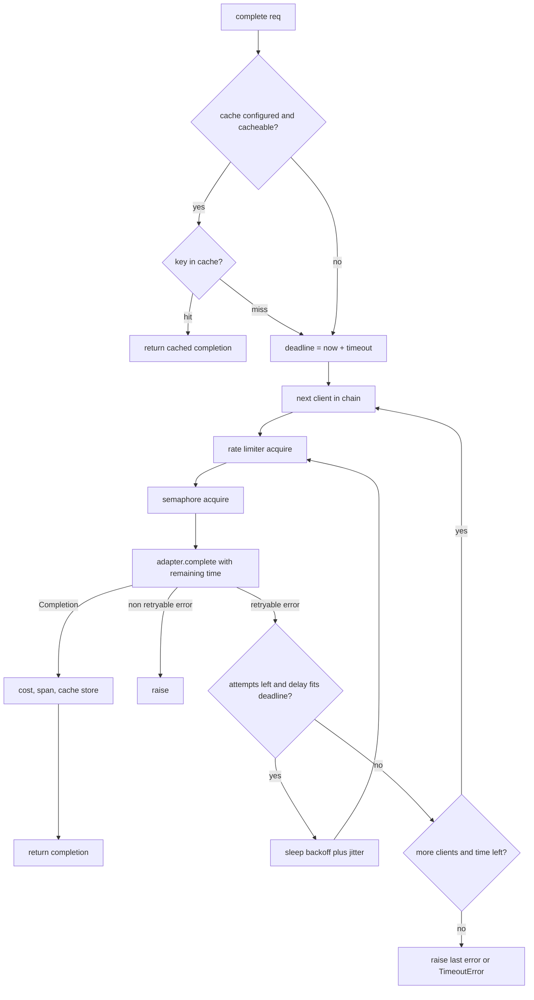
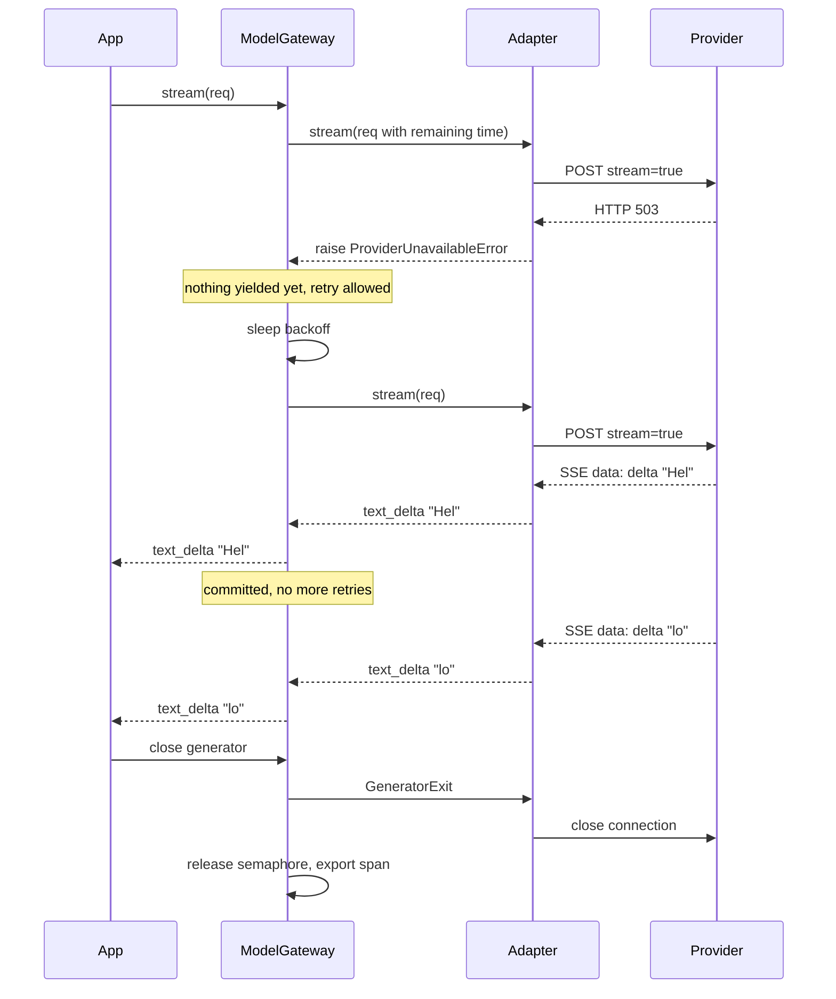

# Chapter 3 — Working with LLM APIs

After this chapter you will be able to call any hosted or self-hosted language model through one interface, stream its output, get validated structured data back, run the tool-calling loop, and wrap all of it in a gateway that retries, respects deadlines, limits rate and concurrency, falls back across models, caches, and accounts for cost. The chapter builds `aie_core`, the shared library every later project in this book imports (`book/projects/aie_core/`). Northwind Assist, the running example, makes its very first model call here.

## Why this matters

A language model behind an HTTP API is a remote, slow, expensive, probabilistic function. Each adjective breaks an assumption ordinary code makes about function calls. Remote means the call can fail halfway through. Slow means a request can outlast a user's patience, which is why streaming exists. Expensive means a retry storm is a bill, not just a latency problem. Probabilistic means the same input may produce different output, so a response is something to validate, not to trust.

Most teams discover these properties one incident at a time: the night a provider returned errors for forty minutes and the service had no fallback; the week the invoice doubled because a background job retried without backoff; the afternoon a JSON parser crashed on a response that began with "Sure! Here is the JSON you asked for". Each has a boring, well-understood fix from distributed systems engineering. The fixes belong in one place, written once and tested offline, so the chapters that follow can concentrate on retrieval, agents, and evaluation. That place is `aie_core`. It is not a framework; it is a client, a gateway, and a handful of helpers whose every line you can read in an hour.

## Mental model

> **Mental model:** Reliability is engineered around the model, not expected from it.

Picture the model as a service you do not operate, with an SLA you did not negotiate. Everything you can control sits on your side of the wire: how you shape the request, what you do when the answer is late, wrong, or missing, how many requests you let in flight, and how much you are willing to spend. The gateway in this chapter is where that control lives.

A second model to carry through the chapter: **a completion is a transaction with a budget**. The budget has three currencies. Time, expressed as a deadline that shrinks with every retry. Tokens, which the provider meters and bills. Attempts, which you ration so that a failing provider does not drag your own service down with it. The gateway spends from all three and stops when any one runs out.

## Core concepts

The subsections below fall into three groups. The first group, from messages through tokens and usage, describes what one call looks like on the wire. The second, from the error taxonomy through cost accounting, is the gateway: what wraps that call so it survives production. Its first pieces build on each other: errors must be classified before you can retry, retries need a deadline, and deadlines do not protect the provider's quota, so you need a rate limiter. The last group carries the same shape over to embeddings. The flowchart in the Architecture section draws the whole gateway as one picture, and it is worth a glance now.

### Messages and roles

Every chat-style API accepts a list of messages, each tagged with a role. Four roles are enough to express everything this book does:

- `system`: instructions from the application developer. The model treats them as higher authority than user text (how much higher varies by model; Chapter 26 covers why that matters for security).
- `user`: input on behalf of the person or upstream system making the request.
- `assistant`: previous model output, replayed so the model sees the conversation so far. It can carry text, tool calls, or both.
- `tool`: the result of executing a tool call, tied to the call by an id.

The model is stateless. Every request carries the entire conversation it should know about; the "memory" a chat product appears to have is the client re-sending history. This is why context engineering (Chapter 5) is a client-side discipline and why token counting matters: history grows with every turn and you pay for all of it each time.

`aie_core` models this with `Message`, which has four constructors so that call sites read like the conversation they build:

```python
from aie_core import Message

messages = [
    Message.system("You are Northwind Assist, an internal helper for Northwind employees."),
    Message.user("What is the refund deadline for retail customers?"),
]
```

Content is either a string or a list of `ContentPart` objects for multimodal input (text and image references). Nearly all code in this book uses the string form.

### System prompts

The system prompt is where the application states its identity, scope, output rules, and refusal behavior. Three engineering facts about it belong in this chapter; Chapter 4 owns the craft of writing one.

First, it is the most stable part of the request, so it is the part that provider-side prompt caching can reuse (see Caching below). Keep it first and keep it byte-identical across requests. Second, different providers transport it differently (this book calls the two main API formats dialects): the OpenAI dialect sends it as a message with role `system`; the Anthropic dialect sends it as a top-level `system` field. The adapter hides this, and when a request has several system messages the Anthropic adapter concatenates them. Third, the model only reads the system prompt; nothing in it is enforced. Whatever it says, your code must still validate what comes back.

### Request and response shape across providers

The two wire dialects you will meet most often agree on the concepts and differ in the encoding. Both take a model name, a message list, a temperature, a maximum output length, optional tool definitions, and a stop list. Both return a message, a reason the generation stopped, and token usage. The differences, for example:

| Concern | OpenAI dialect | Anthropic dialect |
|---|---|---|
| Field names | `max_tokens` (`max_completion_tokens` on some servers), `stop` | `max_tokens`, `stop_sequences` |
| Tool calls | a `tool_calls` array with JSON-string arguments | `tool_use` content blocks with already-parsed input |
| Tool results | a message with role `tool` | a `tool_result` block inside a `user` message |
| Finish reasons | `stop`, `length`, `tool_calls` | `end_turn`, `stop_sequence`, `max_tokens`, `tool_use` |
| Cached tokens | included in the input count, cached share in a detail field | excluded from `input_tokens`; cache reads and writes counted separately |

None of those differences should reach application code. `aie_core` defines one `CompletionRequest` and one `Completion`, and each adapter is a pure translation: build the vendor payload from the request, parse the vendor response into a `Completion`. The payoff is portability and, more importantly, testability: the application is tested against `FakeLLM`, which speaks the neutral types, and each adapter against recorded vendor payloads with no network. When a provider renames a field, one adapter and its tests change.

The `LLMClient` protocol (a `typing.Protocol`: any object with these methods qualifies, no inheritance needed) has four methods: `complete`, `stream`, and their async twins `acomplete` and `astream`. A gateway, an adapter, and a fake all satisfy it, which is what lets the gateway wrap any of them and lets tests swap one for another.

### Streaming

Generation is autoregressive: tokens come out one at a time, and a 400-token answer at a typical decode speed takes several seconds. Streaming delivers tokens as they are produced instead of after the last one. It does not make generation faster; it cuts time to first token (TTFT) from "whole answer" to "first chunk", so the interface responds while generation continues. Northwind Assist's target of a two-second p95 TTFT for retrieval answers is a streaming target; without streaming the user would stare at an empty screen for the whole answer, about eight seconds for 400 tokens at an illustrative 50 tokens per second.

The transport is almost always Server-Sent Events (SSE): a long-lived HTTP response whose body is a sequence of `event:` and `data:` lines separated by blank lines. SSE fits because the flow is one-directional and ordinary HTTP infrastructure (proxies, load balancers, TLS termination) passes it through. WebSockets are warranted only when the client must also send mid-stream, as in voice. `aie_core` parses SSE with a small parser (about eighty lines, sync and async sharing one accumulator) rather than a dependency because the format is that small and owning it makes the edge cases visible: keep-alive comment lines, multi-line `data:` fields, streams that end without their terminator line (for example `data: [DONE]` in the OpenAI dialect).

Each event carries a delta, meaning only what is new since the previous event. Text deltas are easy: append them. Tool-call deltas are not: the arguments arrive as fragments of a JSON string (`{"id"`, then `: 42}`), and a fragment is not valid JSON until the last one lands. The adapter therefore buffers argument fragments per tool call and emits one `tool_call_delta` event with a fully parsed `ToolCall` when the call closes. Streamed structured output has the same problem; rendering a partially filled form requires an incremental JSON parser that tolerates truncation (Chapter 6). The default here is to buffer.

Cancellation is the half of streaming that gets forgotten. When the user navigates away, the server should stop reading and close the HTTP response, which lets the provider stop generating and stop billing. In Python this means the generator gets `GeneratorExit` at its current `yield`; any resource it holds (here, a concurrency slot) must be released in a `finally` block. `test_abandoned_stream_releases_semaphore` checks exactly that.

Finally, retries and streams interact badly. A failure before the first byte can be retried transparently. A failure after text has reached the user cannot be retried silently, because the user would see the answer start over. The gateway therefore retries a stream only until it has received the first event, and never after.

### Structured outputs

Downstream code wants typed objects. There are three ways to get them, in decreasing order of reliability:

1. **Schema mode.** The request carries a JSON Schema and the provider constrains decoding (Chapter 2) so the output is guaranteed to parse and to match the schema's shape. This is `response_schema` in `CompletionRequest`, sent as `response_format` of type `json_schema` in the OpenAI dialect. The guarantee holds only in that dialect's strict mode, which the adapter sends when constructed with `strict_schemas=True`; the default is off because strict mode restricts which schema features are accepted.
2. **Tool as schema.** A server that has tool calling but no schema mode can be forced to call a single tool whose parameter schema is your output schema. The "arguments" of that call are your structured result. The Anthropic-dialect adapter in this book emulates `response_schema` this way, with a forced tool named `emit_structured_output`, and presents the result as JSON text so callers cannot tell the difference. Some servers of that dialect now offer a native schema mode as well.
3. **Prompt and parse.** Describe the schema in the prompt, parse whatever comes back. Weakest, but universal, and the fallback for servers that support neither of the above.

Whichever path produced the JSON, validation is still yours. A schema that does not encode every business rule lets a priority of 9 through when your business allows 1 to 4, and a category can be spelled in a way your pydantic enum rejects. `complete_structured` runs pydantic validation and, on failure, sends the error text back to the model as a new user turn and asks again, up to `max_repair_attempts` times. This repair loop fixes a large share of real-world failures at the cost of one extra call. When the budget is exhausted it raises `MalformedResponseError`, and the caller decides whether to degrade, queue for a human, or fail.

One failure is excluded from repair on purpose: a completion whose `finish_reason` is `length` ran out of `max_tokens`, and `Completion.truncated` says so. Re-asking with the same budget would truncate again, so `parse_structured`, the validation step `complete_structured` runs on each answer, raises `TruncatedOutputError` (a `MalformedResponseError`) at once, even when the cut-off text happens to parse as valid JSON; the fix is a larger `max_tokens` or a smaller schema, not another attempt. Chapter 6 builds whole extraction pipelines on this primitive.

### The tool-calling protocol

Tool calling is a protocol, not a capability of the model. The model never executes anything; it emits a request that your code may or may not honor.

1. The request includes `tools`: a list of `ToolSpec`, each with a name, a description the model reads, and a JSON Schema for parameters.
2. The response has a `finish_reason` of `tool_calls` and a message carrying one or more `ToolCall` objects: an id, a name, and parsed arguments.
3. Your code validates the arguments against the schema and against policy (is this user allowed to call `send_reply`?), runs the tool, and appends two things to the conversation: the assistant message exactly as returned (including its tool calls), then one `tool` message per call, each carrying the matching `tool_call_id` and the result as text.
4. You call the model again with the extended conversation. It may answer, or it may request more tools. Loop until it answers or you hit a step limit.

In Northwind terms: a user asks about ticket 4812; the model returns a call to `search_tickets` with `{"id": 4812}` and `finish_reason` `tool_calls`; your code runs the search, appends the assistant turn and `Message.tool(call_id, result)`, and calls again; this time the model answers in prose.

Two details trip people. The assistant message with tool calls must be replayed verbatim; dropping it makes the next request invalid because tool results would reference calls the model never saw. And `tool_choice` controls whether the model may call a tool (`auto`), must call some tool (`required`), must not call one (`none`), or must call one named tool (the tool's name). Forcing a named tool is how structured output goes through tools, and `none` is how you make the model summarize results without calling anything else. `Message.tool(tool_call_id, content)` exists to make step three one line. Chapter 16 adds the registry, policy, and sandbox around this protocol.

### Tokens and usage

Providers meter in tokens, the units their tokenizer splits text into (Chapter 2). You need counts at two moments. Before the call, to budget context and to feed the rate limiter, you can only estimate: `count_tokens` uses `tiktoken` when it is installed and can load a vocabulary, and a characters-divided-by-four heuristic otherwise. `count_message_tokens` adds a small per-message overhead for role markers and framing. Neither is exact for every model; treat estimates as estimates and leave headroom. After the call, the provider reports exact `usage`: input tokens, output tokens, and how many input tokens were served from a prompt cache. `Completion.usage` normalizes all three across providers, and the gateway turns them into cost and into attributes on a span (one timed record of an operation; Chapter 31 assembles spans into request trees). Record usage on every call; it is the only exact record of what you are paying for.

### Error taxonomy

Everything so far assumed the call succeeds. The rest of the gateway exists because it often does not, and the first decision on any failure is whether to try again. Vendors return dozens of error codes. The gateway needs exactly one bit from each: can retrying possibly help? `aie_core` maps every provider failure into six classes, each carrying `retryable` and an optional `retry_after_s` hint.

| Class | Typical cause | Retryable | Fallback |
|---|---|---|---|
| `RateLimitError` | HTTP 429, quota exceeded | yes, after the hinted delay | yes |
| `TimeoutError` | no response within the budget | yes if the call is idempotent | yes |
| `ProviderUnavailableError` | 5xx, connection refused, "overloaded" | yes | yes |
| `InvalidRequestError` | 400/401/403/404: bad schema, unknown model, bad key | no | no |
| `ContentFilterError` | provider refused for policy reasons | no | no |
| `MalformedResponseError` | 2xx but unparseable body or tool arguments | no (repair instead) | no |

The non-retryable column is the important one. Retrying an invalid request burns attempts and time while guaranteeing the same answer, and falling back on it sends a request you already know is broken to a second provider. A malformed response is a special case: the HTTP call succeeded, so a transport-level retry is the wrong tool; the structured-output repair loop is the right one.

### Retries, backoff, and jitter

Once an error is classified as retryable, the question is how to retry without making things worse. A retry is a bet that the failure was transient. Three rules make the bet cheap. Bound the attempts, because an outage is not transient and a provider that is down for an hour should cost you three requests, not three thousand. Back off exponentially, because if the provider is overloaded your immediate retry is part of the problem. And add jitter, because a thousand clients that all failed at the same instant and all retry after exactly one second produce a synchronized wave that fails again; "full jitter", a uniform draw between zero and the exponential cap, spreads the wave out. When the provider sends a `Retry-After` value, honor it instead of guessing, with a little jitter on top.

Retries have an idempotency problem that LLM calls mostly dodge. A plain completion has no side effects, so retrying after a timeout is safe: at worst you pay for a response you never read. The exception is a call whose result triggers an action elsewhere, or a provider batch submission; for those, either set `retry_on_timeout=False` in the policy or carry an idempotency key (a unique id sent with the request, which the receiver uses to detect and drop duplicates) so the second attempt is recognized as a duplicate. Chapter 16 handles idempotency for tool execution.

### Timeouts and deadline propagation

Retries spend time, so they need a ceiling. A timeout without a deadline is a trap. If each attempt gets sixty seconds and you allow three attempts with backoff, a caller who expected sixty seconds can wait more than three minutes. The gateway therefore computes one deadline when the call starts (`timeout_s` on the request or the gateway default) and derives every per-attempt timeout from what remains. Before sleeping for a backoff delay it checks whether the sleep still fits; if not, it skips straight to the next client in the fallback chain (see Model fallbacks) or gives up. Before trying a fallback it checks whether any time is left. The deadline also propagates *into* the adapter as the HTTP read timeout, so a single stuck connection cannot outlive the caller's patience. One caveat in this implementation: the remaining time is computed when the attempt starts, before it waits on the rate limiter and concurrency semaphore, so under heavy queueing an attempt can run past the deadline by the time it spent queued. When the budget runs out between attempts, the error you get is a `TimeoutError` chained (as `__cause__`) to the last provider error; when it runs out before any attempt could start, for example while waiting on the rate limiter, the `TimeoutError` has no cause. These gateway-raised timeouts are marked non-retryable, so they end the call at once rather than moving on to fallbacks, unlike a provider timeout, which the table above lists as retryable.

Chapter 29 extends this with circuit breakers and admission control at the service level; here the unit is one call.

### Rate limits

Retries and backoff react after the provider pushes back. A rate limiter stops you from causing the pushback in the first place. Providers enforce two limits, requests per minute and tokens per minute, and tell you about them with headers and 429s. Reacting to 429s is necessary but late; by then you have already been throttled. A client-side token bucket admits requests at a sustainable pace before they leave your process. A token bucket holds up to *C* units, refills continuously, and lets a request through only if it can take its units out, so bursts are capped at *C*. With *C* set to the per-minute limit, the bucket refills at *C*/60 per second; a request takes one unit from the request bucket and its estimated token count from the token bucket, and waits when either is empty. `RateLimiter` implements both buckets with an injectable clock and sleep so the tests run in microseconds. The token estimate used for admission is deliberately conservative: prompt tokens plus the full `max_tokens` output budget, because a limiter that under-counts is a limiter that does not work.

Say Northwind's key allows an illustrative 500 requests and 200,000 tokens per minute. A ticket classification with a 350-token prompt and `max_tokens=150` reserves 500 tokens, so the token bucket admits about 400 such calls a minute. That is below the request limit, so the token bucket is the one that actually throttles.

The limiter is per process. Provider quotas are per account or per key, so four replicas each configured with the full limit admit four times what the provider allows, and the 429s come back. Either give each replica its share (limit divided by replica count, revisited whenever autoscaling changes the count) or move the bucket into shared storage such as Redis; Chapter 29 sizes per-replica shares and adds per-tenant admission.

### Concurrency

Rate limits bound throughput; concurrency limits bound how many requests are in flight at once. They are different knobs, linked by Little's law: the number of requests in flight equals arrival rate times latency. Twenty requests per second with five-second latency means a hundred concurrent connections, each holding a socket, memory for the response, and a slot in the provider's queue. The gateway holds a `threading.BoundedSemaphore` for synchronous callers and an `asyncio.Semaphore` for async ones, both sized by `max_concurrency`. Async is the natural fit for fan-out, such as embedding a batch or running several retrieval queries in parallel: `asyncio.gather` over `gateway.acomplete` gives you concurrency without threads, and the semaphore keeps the fan-out from becoming a flood.

One asyncio detail shapes the implementation. An asyncio primitive is tied to the event loop that first uses it, and each `asyncio.run` creates a new loop. The gateway therefore keeps one `asyncio.Semaphore` per running loop; otherwise code that calls `asyncio.run` repeatedly against a shared gateway, common in scripts and task workers, fails under contention with "bound to a different event loop". The semaphores do not share a count, so a process can have up to `max_concurrency` calls in flight for sync callers plus `max_concurrency` per running event loop.

### Batching

Concurrency raises throughput for work someone is waiting on. For work nobody is waiting on, the cheaper lever is batching, a word used for two unrelated things. Client-side batching groups independent calls so they run concurrently, which is just fan-out with a semaphore. Provider batch APIs are a different product: you upload a file of requests, the provider processes them asynchronously within a window of hours, and you download results, typically at a steep discount. Use them for anything that is not interactive: nightly ticket classification, re-embedding a corpus, generating evaluation data. Do not use them for anything a person is waiting on. `aie_core` does not wrap batch APIs because their shape is provider-specific and job-oriented; Chapter 30 shows where they slot in.

### Caching

Caching also names two unrelated mechanisms.

An **exact-match response cache** stores the whole `Completion` keyed by a hash of everything that determines the answer: model, messages, tools, tool choice, response schema, temperature, max tokens, and stop sequences. Request metadata and timeouts stay out of the key, except `cache_scope`, described below. It is only safe to cache when the answer should be the same for the same input, which is why the gateway caches by default only at temperature zero and otherwise requires `metadata={"cache": True}`. The hit rate on free-form chat is low; the hit rate on classification, routing, and extraction of repeated inputs is high.

It is also only safe when the key includes everything that makes the answer specific to a user: if a system prompt embeds the caller's permissions, two users with different permissions produce different keys, which is correct; if permissions are enforced outside the prompt, two users must not share a cached answer, and you must add a tenant or user id to the key. In Northwind, a retail agent and a logistics agent can both ask "What is the escalation path for a damaged shipment?" If the tool layer, not the prompt, decides what each may see, the two prompts are byte-identical, and without a scope the second agent gets the first one's cached answer.

The gateway supports scoping through `metadata["cache_scope"]` (for example `"tenant:retail"`), the one metadata field that enters the key, and `require_cache_scope=True` makes a multi-tenant gateway refuse to cache any request that arrives without a scope, so a forgotten field costs hit rate rather than leaking data. Chapter 30 generalizes this into scoped caches with lint checks on key components.

**Provider prompt caching** happens on the provider's side, out of your code's sight. The provider reuses the computation for a prefix of the prompt it has recently seen (the transformer prefill, Chapter 2), charges less for those tokens, and reports them as cached input tokens. You benefit by keeping the stable part of the prompt first and byte-identical: system prompt, tool definitions, shared documents, then the volatile user content. A timestamp at the top of a system prompt silently destroys this. `Usage.cached_input_tokens` is how you measure whether it is working, and the pricing table charges cached tokens at a separate rate so the savings show up in cost accounting.

### Model fallbacks

When retries on the primary are exhausted and the deadline still has time left, the gateway can try a different model. A fallback chain buys a great deal of availability, and it is also where breakage hides. The gateway moves to each fallback in turn. Four things can break when the fallback is a different model or provider: context length (the fallback may reject a prompt the primary accepted), tool support (the fallback may not call tools, or may call them differently), schema support (the fallback may not have a schema mode; the adapter emulates where it can), and behavior (the fallback may answer differently enough to fail your evaluations). Test the fallback path in CI with the fakes, run your evaluation set against the fallback model before you need it, and record `provider` and `model` on every span so you can tell during an incident which model actually answered. One interaction with caching to know about: the response-cache key uses the primary model's name, so an answer produced by a fallback is stored and later served as if the primary had produced it, until the entry expires. If that matters for your feature, set `metadata={"cache": False}` on those requests, or subclass the gateway to skip storing a completion whose `model` differs from the primary's. Whether to fall back at all is a product decision; see Tradeoffs.

### Cost accounting

Cost is usage times price, and cached input is billed at its own rate: a request with 340 input tokens, 200 of them cached, and 25 output tokens is billed at three rates, and without the split a 60% prompt-cache hit would be invisible in the spend report. `PricingTable` holds prices per million tokens for input, cached input, and output, keyed by model name with prefix matching so dated model variants inherit the base price. Every number you put in it is illustrative and will be stale; load it from configuration, not code. The gateway attaches `cost_usd` to each completion's `raw` dictionary and to the span, so cost per request, per user, per feature, and per fallback appears wherever your traces go. A response-cache hit is recorded as zero cost plus an `avoided_cost_usd`; keeping the two separate is what stops a cache from inflating the spend report while still showing its value. Chapter 30 builds the cost model on top of this.

### Embedding clients and the embedding space

The same library carries the embedding side, because every retrieval chapter needs it and it has the same remote, metered, failure-prone shape as completion. `EmbeddingClient` is a protocol with two attributes and two methods: `model`, `dimensions`, `embed(texts)` for documents, and `embed_query(text)` for queries, kept separate because some embedding models expect different instructions for the two sides (Chapter 8). `OpenAICompatibleEmbeddings` sends inputs in batches of `batch_size`. It checks that the response holds exactly one vector per input with indices 0 to n-1 and restores that order, because a provider may return vectors out of order and a silent shift would pair every text with the wrong vector. It learns `dimensions` from the first response when you do not set it, and it maps failures into the same error taxonomy. It does not retry: indexing jobs should wrap it with the retry and deadline primitives of Chapter 29, and query-time callers usually prefer one fast failure. `FakeEmbeddings` derives each vector from a hash of the text's tokens, so the same text always gets the same vector, or, with a `vocabulary`, embeds bag-of-words counts so that tests can control which texts are close.

`CachedEmbeddings` wraps any client so repeated texts are embedded once, and its key needs care. Two vectors can be compared only if they come from the same **embedding space**: same provider, same model, same output dimensionality, the same instruction or prefix prepended to the text, and the same text preparation (cleaning and chunk rendering). A cache keyed on model name and text alone would hand back a vector from the old space after you changed an instruction or truncated dimensions, and nothing would fail: cosine similarity still returns numbers, retrieval recall quietly collapses. So the wrapper hashes all five properties into a `space_fingerprint` and puts it in front of the text in every key; changing any of them changes every key, which invalidates the cache instead of mixing spaces. Suppose Northwind indexes its handbook at 1,536 dimensions and later switches to 768 to save storage: a cache keyed on model and text would keep returning 1,536-dimension vectors for unchanged paragraphs, while the fingerprint changes and forces every paragraph to be re-embedded, which is the correct behavior.

Wrappers can stack, for example a cache around a retrying client, so provider, model, and dimensions are read from the real client at the bottom of the stack; the instruction and `text_prep_version` belong to the cache wrapper itself. The fingerprint is frozen at construction, and a client whose dimensionality is learned lazily contributes `"unknown"` rather than changing keys mid-life, because a key that changed after the first response would orphan every entry written before it. Bump `text_prep_version` whenever you change cleaning or chunk rendering. Store the same fingerprint next to the vectors in your index, which is what Chapter 8's namespaced store and Chapter 9's `index:model:version` namespaces do, so a query embedded in one space is never searched against vectors from another.

## How it works

Follow one Northwind request through the gateway.

A support engineer asks Northwind Assist to classify a ticket. The application builds a `CompletionRequest` with a system prompt, the ticket text, a `response_schema` from a pydantic model, temperature zero, `max_tokens=200`, and a ten-second timeout. It calls `gateway.complete(req)`.

The gateway computes the deadline: now plus ten seconds. The temperature is zero and a cache is configured, so it computes the cache key and looks it up. Miss. It enters the client loop with the primary client, attempt one. A span opens. The gateway copies the request with `timeout_s` set to the remaining 9.998 seconds; the rate limiter admits it at roughly 550 estimated tokens (the prompt plus the 200-token output budget) without waiting; the gateway takes a concurrency slot and calls the adapter.

The adapter builds the vendor payload, posts it with that timeout, and gets a 429 with `Retry-After: 2`. It maps the response to `RateLimitError(retry_after_s=2.0)` and raises. The span records the exception and closes with status error. Back in the loop, the error is retryable and attempt one is below the limit of three, so the policy computes a delay: two seconds from the hint, plus a little jitter. Two seconds fit within the remaining 9.9, so the gateway sleeps.

Attempt two. New span, limiter, slot, request copied with 7.8 seconds remaining. The adapter gets a 200 whose body has a `message` with JSON text, a `finish_reason` of `stop`, and `usage` of 340 input tokens (200 of them cached) and 25 output tokens. It returns a `Completion`. The gateway looks up the price for the model, computes cost, writes `cost_usd`, `cache_hit=False`, and `attempt=2` into `raw`, fills the span with tokens, latency, queue time, cost, and finish reason, closes it, stores the completion in the cache under the key, and returns.

Had the lookup been a hit, the served completion would carry `cost_usd=0.0` and the price the provider would have charged in `avoided_cost_usd`, so summing `cost_usd` across completions gives real spend and summing `avoided_cost_usd` gives what the cache saved.

`complete_structured`, which made the call, parses the text as JSON, validates it against the pydantic model, and returns the object with the completion. Had validation failed, it would have appended the answer and the error to the messages and called `gateway.complete` again. Each repair is a new gateway call with the request's own `timeout_s`, so the deadline applies per call, not across the repair loop: with two repairs allowed, the worst case is three times the timeout. Budget for that, or pass a smaller `timeout_s` on repair attempts.

Had the second attempt failed with a 503 and the third too, the gateway would have moved to the first fallback client, still under the original deadline, and the span attributes would show a different `provider` and `model`. Had the failure been a 400, the first attempt would have raised immediately, with no retry and no fallback.

## Architecture

The request path, with the decisions that route a call:



Streaming, showing where the retry boundary sits and how cancellation propagates:



## Implementation

The library layout. Files marked with an asterisk are shown in full or in excerpt below; everything is on disk and tested.

```
book/projects/aie_core/
  pyproject.toml
  README.md
  .env.example
  aie_core/
    __init__.py
    settings.py              * Settings, make_llm_client, make_provider_client, make_embedding_client
    observability.py           Span, Tracer, JsonlTracer, OTelTracer, NoopTracer, InMemoryTracer
    embeddings.py              EmbeddingClient, OpenAICompatibleEmbeddings, FakeEmbeddings, CachedEmbeddings
    llm/
      types.py               * neutral request and response types
      client.py                LLMClient protocol, collect_stream
      errors.py              * error taxonomy and HTTP mapping
      tokens.py                count_tokens, count_message_tokens
      structured.py          * complete_structured and the repair loop
      gateway.py             * ModelGateway, RetryPolicy, RateLimiter, caches, PricingTable
      providers/
        _sse.py              * SSE parser
        _http.py               httpx construction and transport error mapping
        openai_compat.py     * OpenAI-dialect adapter
        anthropic.py         * Anthropic-dialect adapter
        fake.py              * FakeLLM
  tests/                       118 offline tests
```

Runtime dependencies are `pydantic`, `pydantic-settings`, `httpx`, and `numpy`; `tiktoken` and `opentelemetry-sdk` are optional extras (`pyproject.toml` on disk). Integration tests are marked and excluded by default through `addopts`.

Install and run:

```bash
uv pip install --python .venv/bin/python -e book/projects/aie_core   # or: pip install -e book/projects/aie_core
cd book/projects/aie_core && python -m pytest -q
```

Configuration is environment-driven. The defaults run entirely offline with fakes, which is what every test in the book relies on.

| Variable | Default | Meaning |
|---|---|---|
| `LLM_PROVIDER` | `fake` | `openai`, `anthropic`, or `fake` |
| `LLM_MODEL` | `fake-model` | model name sent to the provider |
| `LLM_BASE_URL` | unset | OpenAI-compatible server or proxy base URL |
| `OPENAI_API_KEY`, `ANTHROPIC_API_KEY` | unset | credentials, read as secrets |
| `EMBEDDING_PROVIDER`, `EMBEDDING_MODEL` | `fake`, `fake-embedding` | embeddings |
| `TRACE_SINK`, `TRACE_PATH` | `none`, `traces.jsonl` | `none`, `jsonl`, `otel`, or `memory` (an `InMemoryTracer`, for tests) |
| `REQUEST_TIMEOUT_S` | `60` | default deadline per call |
| `LLM_MAX_ATTEMPTS`, `LLM_MAX_CONCURRENCY` | `3`, `16` | retry budget per client, in-flight limit |
| `LLM_REQUESTS_PER_MINUTE`, `LLM_TOKENS_PER_MINUTE` | unset | enable the token-bucket limiter |
| `LLM_RESPONSE_CACHE` | `false` | enable the exact-match cache |
| `LLM_FALLBACK_MODEL` | unset | second model on the same provider, tried on retryable failures |

You do not need to read every excerpt with equal care. Read Types and Gateway closely: they are the contract and the control flow. Skim the adapters for the translation rules, and treat the SSE parser and Settings as reference. The Code walkthrough after the excerpts explains the decisions in each.

### Types

Look for what is absent: no vendor field names anywhere, and `raw` as the only escape hatch to the provider's payload.

```python
# path: book/projects/aie_core/aie_core/llm/types.py
"""Provider-neutral request and response types.

Every provider adapter translates *to* these types on the way in and *from* them on
the way out, so application code never sees a vendor payload.
"""
from __future__ import annotations

from enum import Enum
from typing import Any, Literal

from pydantic import BaseModel, Field


class Role(str, Enum):
    SYSTEM = "system"
    USER = "user"
    ASSISTANT = "assistant"
    TOOL = "tool"


class ContentPart(BaseModel):
    """One piece of multimodal content. Text-only callers never build these by hand."""

    type: Literal["text", "image_url"]
    text: str | None = None
    image_url: str | None = None


class ToolCall(BaseModel):
    """A request from the model to run a tool. `arguments` is already parsed JSON."""

    id: str
    name: str
    arguments: dict[str, Any] = Field(default_factory=dict)


class Message(BaseModel):
    role: Role
    content: str | list[ContentPart] = ""
    tool_calls: list[ToolCall] | None = None
    tool_call_id: str | None = None
    name: str | None = None

    @classmethod
    def system(cls, text: str) -> "Message":
        return cls(role=Role.SYSTEM, content=text)

    @classmethod
    def user(cls, text: str) -> "Message":
        return cls(role=Role.USER, content=text)

    @classmethod
    def assistant(cls, text: str) -> "Message":
        return cls(role=Role.ASSISTANT, content=text)

    @classmethod
    def tool(cls, tool_call_id: str, content: str) -> "Message":
        return cls(role=Role.TOOL, content=content, tool_call_id=tool_call_id)

    @property
    def text(self) -> str:
        """Content flattened to a string (image parts are dropped)."""
        if isinstance(self.content, str):
            return self.content
        return "".join(p.text or "" for p in self.content if p.type == "text")


class ToolSpec(BaseModel):
    """What the model is told about a tool. `parameters` is a JSON Schema object."""

    name: str
    description: str
    parameters: dict[str, Any] = Field(default_factory=lambda: {"type": "object", "properties": {}})


class Usage(BaseModel):
    input_tokens: int = 0
    output_tokens: int = 0
    cached_input_tokens: int = 0

    def __add__(self, other: "Usage") -> "Usage":
        return Usage(
            input_tokens=self.input_tokens + other.input_tokens,
            output_tokens=self.output_tokens + other.output_tokens,
            cached_input_tokens=self.cached_input_tokens + other.cached_input_tokens,
        )


class CompletionRequest(BaseModel):
    messages: list[Message]
    model: str | None = None
    temperature: float = 0.0
    max_tokens: int = 1024
    tools: list[ToolSpec] | None = None
    tool_choice: Literal["auto", "none", "required"] | str = "auto"
    response_schema: dict[str, Any] | None = None  # JSON Schema for structured output
    stop: list[str] | None = None
    metadata: dict[str, Any] = Field(default_factory=dict)
    timeout_s: float | None = None


class Completion(BaseModel):
    message: Message
    usage: Usage = Field(default_factory=Usage)
    finish_reason: str = "stop"
    model: str = ""
    provider: str = ""
    latency_ms: float = 0.0
    raw: dict[str, Any] | None = None

    @property
    def text(self) -> str:
        return self.message.text

    @property
    def tool_calls(self) -> list[ToolCall]:
        return list(self.message.tool_calls or [])

    @property
    def truncated(self) -> bool:
        """True when generation stopped because `max_tokens` ran out (`finish_reason == "length"`).
        The text is cut mid-way; structured output parsed from it is unreliable even if it happens
        to be valid JSON."""
        return self.finish_reason == "length"


class StreamEvent(BaseModel):
    """One incremental event from a streaming completion.

    `text_delta` carries a text fragment. `tool_call_delta` carries one *complete* tool
    call: argument JSON arrives in fragments that cannot be validated until the call is
    closed, so adapters buffer and emit the call once. `usage` arrives at the end when the
    provider reports it. `done` is always the last event of a successful stream.
    """

    type: Literal["text_delta", "tool_call_delta", "usage", "done", "error"]
    text: str | None = None
    tool_call: ToolCall | None = None
    usage: Usage | None = None
    error: str | None = None
    finish_reason: str | None = None


__all__ = [
    "Role",
    "ContentPart",
    "ToolCall",
    "Message",
    "ToolSpec",
    "Usage",
    "CompletionRequest",
    "Completion",
    "StreamEvent",
]
```

### Errors

The base class, one representative subclass (the other five differ only in name, docstring, and `default_retryable`), and the HTTP mapping. Transport-level mapping for timeouts and connection errors lives in `providers/_http.py` and follows the same pattern. Notice that only the status code and the message decide the class, and the retryable flag lives on the class.

```python
# path: book/projects/aie_core/aie_core/llm/errors.py  (excerpt)

class LLMError(Exception):
    """Base class. `retryable` drives retry and fallback; `retry_after_s` is a provider hint."""

    default_retryable: bool = False

    def __init__(
        self,
        message: str,
        *,
        retryable: bool | None = None,
        retry_after_s: float | None = None,
        status_code: int | None = None,
        provider: str | None = None,
        raw: Any = None,
    ) -> None:
        super().__init__(message)
        self.retryable = self.default_retryable if retryable is None else retryable
        self.retry_after_s = retry_after_s
        self.status_code = status_code
        self.provider = provider
        self.raw = raw

    def __str__(self) -> str:
        base = super().__str__()
        bits = []
        if self.provider:
            bits.append(f"provider={self.provider}")
        if self.status_code is not None:
            bits.append(f"status={self.status_code}")
        if self.retry_after_s is not None:
            bits.append(f"retry_after={self.retry_after_s:g}s")
        return f"{base} ({', '.join(bits)})" if bits else base


class RateLimitError(LLMError):
    """HTTP 429 or an equivalent quota signal. Retry after a delay, or fall back."""

    default_retryable = True


def map_http_error(
    status_code: int,
    body: Any,
    headers: dict[str, str] | None,
    provider: str,
) -> LLMError:
    """Translate an HTTP failure into the taxonomy. Shared by the OpenAI-style and Anthropic adapters."""
    headers = {k.lower(): v for k, v in (headers or {}).items()}
    message = _extract_message(body) or f"HTTP {status_code}"
    retry_after = _parse_retry_after(headers.get("retry-after"))
    common = {"status_code": status_code, "provider": provider, "raw": body}

    if status_code == 429:
        return RateLimitError(message, retry_after_s=retry_after, **common)
    if status_code == 408:
        return TimeoutError(message, retry_after_s=retry_after, **common)
    if status_code >= 500:
        return ProviderUnavailableError(message, retry_after_s=retry_after, **common)
    lowered = message.lower()
    if "content_filter" in lowered or "content filter" in lowered or "content management policy" in lowered:
        return ContentFilterError(message, **common)
    return InvalidRequestError(message, **common)
```

### SSE parser

The accumulator's `feed` is the whole format; the async variant on disk is identical with `async for`. Watch the blank-line branch: it is the only place `feed` emits an event, and `flush` handles a stream that ends without its final blank line.

```python
# path: book/projects/aie_core/aie_core/llm/providers/_sse.py  (excerpt)

class _Accumulator:
    # ... other members omitted; full file on disk ...

    def feed(self, line: str) -> SSEEvent | None:
        line = line.rstrip("\r")
        if line == "":
            if not self.has_content:
                return None
            ev = self.current.finish()
            self.current = SSEEvent()
            self.has_content = False
            return ev
        if line.startswith(":"):
            return None
        name, _, value = line.partition(":")
        if value.startswith(" "):
            value = value[1:]
        self.has_content = True
        if name == "event":
            self.current.event = value
        elif name == "data":
            self.current._data_lines.append(value)
        elif name == "id":
            self.current.id = value
        return None


def iter_sse(lines: Iterable[str]) -> Iterator[SSEEvent]:
    acc = _Accumulator()
    for line in lines:
        ev = acc.feed(line)
        if ev is not None:
            yield ev
    tail = acc.flush()
    if tail is not None:
        yield tail
```

### OpenAI-dialect adapter

Request encoding and the stream state machine. The full file adds `parse_completion` (the inverse translation, which also raises `ContentFilterError` on that finish reason), `complete`, the async twins, and `close` methods. In the stream state machine, follow how tool-call argument fragments accumulate per index until the call closes.

```python
# path: book/projects/aie_core/aie_core/llm/providers/openai_compat.py  (excerpt)

class OpenAICompatibleClient:
    # ... other members omitted; full file on disk ...

    def build_payload(self, req: CompletionRequest, *, stream: bool = False) -> dict[str, Any]:
        model = req.model or self.default_model
        if not model:
            raise ValueError("no model: set CompletionRequest.model or default_model")
        payload: dict[str, Any] = {
            "model": model,
            "messages": [self._encode_message(m) for m in req.messages],
            "temperature": req.temperature,
            self.max_tokens_field: req.max_tokens,
        }
        if req.stop:
            payload["stop"] = req.stop
        if req.tools:
            payload["tools"] = [
                {"type": "function", "function": {"name": t.name, "description": t.description, "parameters": t.parameters}}
                for t in req.tools
            ]
            payload["tool_choice"] = self._encode_tool_choice(req.tool_choice)
        if req.response_schema is not None:
            payload["response_format"] = {
                "type": "json_schema",
                "json_schema": {
                    "name": str(req.response_schema.get("title", "response")),
                    "schema": req.response_schema,
                    "strict": self.strict_schemas,
                },
            }
        if stream:
            payload["stream"] = True
            payload["stream_options"] = {"include_usage": True}
        for key, value in self.extra_body.items():
            payload.setdefault(key, value)
        return payload

    def _encode_message(self, m: Message) -> dict[str, Any]:
        if m.role == Role.TOOL:
            return {"role": "tool", "tool_call_id": m.tool_call_id or "", "content": m.text}
        out: dict[str, Any] = {"role": m.role.value, "content": self._encode_content(m.content)}
        if m.name:
            out["name"] = m.name
        if m.role == Role.ASSISTANT and m.tool_calls:
            out["tool_calls"] = [
                {
                    "id": tc.id,
                    "type": "function",
                    "function": {"name": tc.name, "arguments": json.dumps(tc.arguments, ensure_ascii=False)},
                }
                for tc in m.tool_calls
            ]
            if out["content"] == "":
                out["content"] = None
        return out

    def stream(self, req: CompletionRequest) -> Iterator[StreamEvent]:
        payload = self.build_payload(req, stream=True)
        state = _OpenAIStreamState(self.provider)
        try:
            with self._client.stream(
                "POST", "/chat/completions", json=payload, timeout=timeout_for(req.timeout_s, self.timeout_s)
            ) as resp:
                if not resp.is_success:
                    resp.read()
                raise_for_status(resp, self.provider)
                for sse in iter_sse(resp.iter_lines()):
                    yield from state.handle(sse.data)
        except httpx.HTTPError as exc:
            raise map_transport_error(exc, self.provider) from exc
        yield from state.finish()


class _OpenAIStreamState:
    # ... other members omitted; full file on disk ...

    def handle(self, data: str) -> Iterator[StreamEvent]:
        if not data or data.strip() == "[DONE]":
            return
        try:
            chunk = json.loads(data)
        except ValueError as exc:
            raise MalformedResponseError(f"bad SSE chunk: {exc}", provider=self.provider, raw=data) from exc
        if "error" in chunk and not chunk.get("choices"):
            msg = str((chunk.get("error") or {}).get("message") or chunk["error"])
            yield StreamEvent(type="error", error=msg)
            return
        if chunk.get("usage"):
            self.usage = OpenAICompatibleClient._parse_usage(chunk["usage"])
        for choice in chunk.get("choices") or []:
            delta = choice.get("delta") or {}
            if delta.get("content"):
                yield StreamEvent(type="text_delta", text=delta["content"])
            for tc in delta.get("tool_calls") or []:
                idx = int(tc.get("index", 0))
                slot = self.pending.setdefault(idx, {"id": None, "name": None, "args": ""})
                if tc.get("id"):
                    slot["id"] = tc["id"]
                fn = tc.get("function") or {}
                if fn.get("name"):
                    slot["name"] = fn["name"]
                if fn.get("arguments"):
                    slot["args"] += fn["arguments"]
            if choice.get("finish_reason"):
                self.finish_reason = choice["finish_reason"]
                if self.finish_reason == "content_filter":
                    raise ContentFilterError("stream blocked by content filter", provider=self.provider, raw=chunk)
                yield from self._flush_tool_calls()
```

### Anthropic-dialect adapter

Only the part that differs in kind rather than spelling: message merging. Structured-output emulation through a forced tool, response parsing, usage normalization, and the typed stream state machine are on disk with the same structure as above.

```python
# path: book/projects/aie_core/aie_core/llm/providers/anthropic.py  (excerpt)

class AnthropicClient:
    # ... other members omitted; full file on disk ...

    def _encode_messages(self, messages: list[Message]) -> list[dict[str, Any]]:
        """Anthropic requires strict user/assistant alternation and wants all tool results that
        answer one assistant turn inside a single user message, so adjacent same-role blocks merge."""
        out: list[dict[str, Any]] = []
        for m in messages:
            if m.role == Role.TOOL:
                role = "user"
                blocks: list[dict[str, Any]] = [
                    {"type": "tool_result", "tool_use_id": m.tool_call_id or "", "content": m.text}
                ]
            elif m.role == Role.ASSISTANT:
                role = "assistant"
                blocks = self._encode_content(m.content)
                for tc in m.tool_calls or []:
                    blocks.append({"type": "tool_use", "id": tc.id, "name": tc.name, "input": tc.arguments})
            else:
                role = "user"
                blocks = self._encode_content(m.content)
            if not blocks:
                continue
            if out and out[-1]["role"] == role:
                out[-1]["content"].extend(blocks)
            else:
                out.append({"role": role, "content": blocks})
        return out
```

### FakeLLM

`FakeLLM` (on disk) satisfies the protocol with no I/O. Its response list accepts a string (assistant text), a dict (serialized as JSON text, for structured-output tests), a list of `ToolCall` (a tool-calling turn), a prepared `Completion`, or an exception instance, which it raises; a `handler` callable replaces the list for dynamic scripting. It records every request in `.requests`, synthesizes `Usage` with the token counter so cost accounting works in tests, and streams by chunking text.

### Gateway

Policies and admission first. `cache_key` (on disk) hashes a canonical JSON of model, messages, tools, tool choice, response schema, temperature, max tokens, and stop list.

```python
# path: book/projects/aie_core/aie_core/llm/gateway.py  (excerpt)

class RetryPolicy(BaseModel):
    max_attempts: int = 3
    base_delay_s: float = 0.5
    max_delay_s: float = 8.0
    jitter: bool = True
    retry_on_timeout: bool = True  # set False for non-idempotent calls (tool side effects)

    def delay_for(self, attempt: int, retry_after_s: float | None, rng: random.Random) -> float:
        """Attempt is 1-based. Full jitter: uniform(0, min(cap, base * 2**(attempt-1)))."""
        exp = min(self.max_delay_s, self.base_delay_s * (2 ** (attempt - 1)))
        delay = rng.uniform(0.0, exp) if self.jitter else exp
        if retry_after_s is not None:
            # Honor the provider's hint; jitter on top avoids every client retrying at once.
            delay = retry_after_s + (rng.uniform(0.0, min(1.0, retry_after_s * 0.1)) if self.jitter else 0.0)
        return delay

    def should_retry(self, err: LLMError, attempt: int) -> bool:
        if attempt >= self.max_attempts or not err.retryable:
            return False
        if isinstance(err, TimeoutError) and not self.retry_on_timeout:
            return False
        return True


class RateLimiter:
    # ... other members omitted; full file on disk ...

    def _reserve(self, tokens: int) -> float:
        """Return the wait needed; consume immediately when zero."""
        with self._lock:
            wait = 0.0
            if self._req is not None:
                wait = max(wait, self._req.wait_time(1))
            if self._tok is not None and tokens > 0:
                wait = max(wait, self._tok.wait_time(tokens))
            if wait == 0.0:
                if self._req is not None:
                    self._req.consume(1)
                if self._tok is not None and tokens > 0:
                    self._tok.consume(tokens)
            return wait
```

Then the gateway itself. Four small helpers are on disk and described in the walkthrough: `_with_remaining` copies the request with the time left, `_plan_retry` asks the policy for a delay, `_fits` checks that delay against the deadline, `_give_up` converts a deadline-driven stop into `TimeoutError`. `_open_stream` does admission and pulls the first event for `stream`. The async methods mirror the synchronous ones with `await`. In the code, find the two nested loops (clients outside, attempts inside) and the two places the remaining time is checked against `deadline`.

```python
# path: book/projects/aie_core/aie_core/llm/gateway.py  (excerpt)

class ModelGateway:
    # ... other members omitted; full file on disk ...

    def _attempt(self, client: LLMClient, req: CompletionRequest, attempt: int, deadline: float) -> Completion:
        """One traced attempt: admission, the call, accounting. Raises LLMError on failure."""
        with self.tracer.span(SPAN_NAME, provider=client.provider, model=self._model_for(client, req), attempt=attempt) as span:
            queued = self._clock()
            attempt_req = self._with_remaining(req, deadline)
            if self.rate_limiter is not None:
                self.rate_limiter.acquire(self.token_estimator(req), deadline=deadline)
            with self._sem:
                queue_ms = (self._clock() - queued) * 1000
                completion = client.complete(attempt_req)
            completion = self._annotate(completion, cache_hit=False, attempt=attempt)
            self._fill_span(span, completion, cache_hit=False, queue_ms=queue_ms)
            return completion

    def complete(self, req: CompletionRequest) -> Completion:
        deadline = self._deadline(req)
        key = cache_key(req, self._model_for(self.primary, req)) if self._cacheable(req) else None
        cached = self._cache_lookup(key)
        if cached is not None:
            return cached

        last_error: LLMError | None = None
        deadline_hit = False
        for client in self.clients:
            attempt = 0
            while True:
                attempt += 1
                try:
                    completion = self._attempt(client, req, attempt, deadline)
                except LLMError as err:
                    last_error = err
                    if not err.retryable:
                        raise  # InvalidRequest, ContentFilter, Malformed: no retry, no fallback
                    delay = self._plan_retry(err, attempt)
                    if delay is None:
                        break  # retry budget for this client is spent; try the next one
                    if not self._fits(delay, deadline):
                        deadline_hit = True
                        break  # waiting would blow the deadline; try the next client now
                    self._sleep(delay)
                    continue
                self._cache_store(key, completion)
                return completion
            if self._clock() >= deadline:
                deadline_hit = True
                break
        raise self._give_up(last_error, deadline_hit)

    def _relay(self, opened: _OpenStream, client: LLMClient, req: CompletionRequest, attempt: int) -> Iterator[StreamEvent]:
        usage, finish = Usage(), "stop"
        try:
            events = opened.iterator
            assert isinstance(events, Iterator)
            for ev in _chain_first(opened.first, events):
                if ev.type == "usage" and ev.usage is not None:
                    usage = ev.usage
                elif ev.type == "done" and ev.finish_reason:
                    finish = ev.finish_reason
                yield ev
        except BaseException as exc:
            opened.span.record_exception(exc)
            raise
        finally:
            self._sem.release()
            model = self._model_for(client, req) or ""
            summary = Completion(
                message=req.messages[-1], usage=usage, finish_reason=finish, model=model, provider=client.provider,
                latency_ms=(self._clock() - opened.started) * 1000,
            )
            self._fill_span(opened.span, self._annotate(summary, cache_hit=False, attempt=attempt), cache_hit=False)
            opened.span.finish()
            self.tracer.export(opened.span)

    def stream(self, req: CompletionRequest) -> Iterator[StreamEvent]:
        """Retries and fallbacks apply only until the first event has been yielded: once bytes
        have reached the caller, a silent restart would duplicate text."""
        deadline = self._deadline(req)
        last_error: LLMError | None = None
        deadline_hit = False
        for client in self.clients:
            attempt = 0
            while True:
                attempt += 1
                try:
                    opened = self._open_stream(client, req, attempt, deadline)
                except LLMError as err:
                    last_error = err
                    if not err.retryable:
                        raise
                    delay = self._plan_retry(err, attempt)
                    if delay is None:
                        break
                    if not self._fits(delay, deadline):
                        deadline_hit = True
                        break
                    self._sleep(delay)
                    continue
                yield from self._relay(opened, client, req, attempt)
                return
            if self._clock() >= deadline:
                deadline_hit = True
                break
        raise self._give_up(last_error, deadline_hit)
```

### Structured output

```python
# path: book/projects/aie_core/aie_core/llm/structured.py  (excerpt)

def extract_json(text: str) -> str:
    """Strip Markdown fences and leading prose so `json.loads` sees the object itself."""
    stripped = text.strip()
    m = _FENCE_RE.match(stripped)
    if m:
        return m.group(1).strip()
    if stripped.startswith("{") or stripped.startswith("["):
        return stripped
    # last resort: take the outermost braces
    start = stripped.find("{")
    end = stripped.rfind("}")
    if start != -1 and end > start:
        return stripped[start : end + 1]
    return stripped


def complete_structured(
    client: LLMClient,
    req: CompletionRequest,
    schema: type[BaseModel],
    max_repair_attempts: int = 2,
) -> tuple[BaseModel, Completion]:
    current = _prepare(client, req, schema)
    last_error: Exception | None = None
    for attempt in range(max_repair_attempts + 1):
        completion = client.complete(current)
        try:
            return parse_structured(completion, schema), completion
        except TruncatedOutputError:
            raise  # repairing at the same max_tokens would truncate again
        except (ValueError, ValidationError) as exc:  # json.JSONDecodeError is a ValueError
            last_error = exc
            if attempt == max_repair_attempts:
                break
            current = current.model_copy(
                update={
                    "messages": [
                        *current.messages,
                        Message.assistant(completion.text or json.dumps(
                            completion.tool_calls[0].arguments if completion.tool_calls else {}
                        )),
                        Message.user(REPAIR_INSTRUCTION.format(error=_short(str(exc)))),
                    ]
                }
            )
    raise MalformedResponseError(
        f"structured output failed validation after {max_repair_attempts + 1} attempts: {_short(str(last_error))}",
        provider=getattr(client, "provider", None),
        raw=str(last_error),
    )
```

### Embedding cache keys

```python
# path: book/projects/aie_core/aie_core/embeddings.py  (excerpt)

class CachedEmbeddings:
    # ... other members omitted; full file on disk ...

    def _compute_fingerprint(self) -> str:
        real = self.innermost
        dims = getattr(real, "dimensions", 0) or None
        material = {
            "provider": getattr(real, "provider", type(real).__name__),
            "model": real.model,
            "dimensions": dims if dims else "unknown",
            "instruction": self.instruction,
            "text_prep_version": self.text_prep_version,
        }
        blob = json.dumps(material, sort_keys=True, separators=(",", ":"))
        return hashlib.sha256(blob.encode("utf-8")).hexdigest()[:16]

    @property
    def space_fingerprint(self) -> str:
        """Stable identifier of the embedding space these cached vectors belong to."""
        return self._fingerprint

    def _key(self, text: str) -> str:
        return hashlib.sha256(f"{self._fingerprint}\x00{text}".encode("utf-8")).hexdigest()
```

### Settings and factory

```python
# path: book/projects/aie_core/aie_core/settings.py  (excerpt)

def make_provider_client(settings: Settings | None = None, model: str | None = None) -> LLMClient:
    """The bare provider adapter for `settings`, with no gateway around it.

    Use it when you compose your own `ModelGateway` (a shared tracer, a custom fallback chain,
    a router that owns several gateways). `model` defaults to `settings.llm_model`.
    """
    settings = settings or Settings()
    return _raw_client(settings, model or settings.llm_model)


def make_llm_client(
    settings: Settings | None = None,
    *,
    tracer: Tracer | None = None,
    wrap: bool | None = None,
) -> LLMClient:
    """The client the application should use.

    By default (`wrap=None`) `fake` returns a bare FakeLLM so tests can script it, and real
    providers come wrapped in a ModelGateway configured from `settings`. `wrap=True` wraps the
    fake too (to test retries, caching, or spans); `wrap=False` returns the bare provider client,
    the same as `make_provider_client`. `tracer` replaces the tracer built from `trace_sink`, so
    an application can pass the one tracer it uses everywhere (Chapter 31).
    """
    settings = settings or Settings()
    if wrap is False:
        return make_provider_client(settings)
    if settings.llm_provider == "fake" and wrap is None:
        return FakeLLM(model=settings.llm_model)
    primary = _raw_client(settings, settings.llm_model)
    fallbacks = [_raw_client(settings, settings.llm_fallback_model)] if settings.llm_fallback_model else []
    from .llm.gateway import RateLimiter

    limiter = (
        RateLimiter(settings.llm_requests_per_minute, settings.llm_tokens_per_minute)
        if settings.llm_requests_per_minute or settings.llm_tokens_per_minute
        else None
    )
    return ModelGateway(
        primary,
        fallbacks=fallbacks,
        retry=RetryPolicy(max_attempts=settings.llm_max_attempts),
        rate_limiter=limiter,
        cache=InMemoryResponseCache() if settings.llm_response_cache else None,
        max_concurrency=settings.llm_max_concurrency,
        tracer=tracer if tracer is not None else get_tracer(settings),
        default_timeout_s=settings.request_timeout_s,
    )
```

## Code walkthrough

The paragraphs below follow the excerpts in order.

**Types are the contract.** `CompletionRequest` carries everything a call needs and nothing provider-specific. `response_schema` is plain JSON Schema so the same request works against schema mode, tool emulation, or prompt-and-parse. `Completion.raw` keeps the vendor payload for debugging and is where the gateway writes `cost_usd`, `avoided_cost_usd`, `cache_hit`, and `attempt`; application code should treat `raw` as opaque. `StreamEvent` has five types, and `done` is guaranteed to be last on success, which is what lets `collect_stream` fold a stream back into a `Completion`.

**Errors decide, payloads do not.** `map_http_error` is the only place that looks at status codes. It reads `Retry-After` case-insensitively, recognizes content-filter errors by their message, and treats every other 4xx as a programming error. The retryable flag lives on the class as a default so a caller can override it per instance (`RateLimitError(..., retryable=False)` for a hard quota).

**Adapters are translations.** `build_payload` and `parse_completion` are pure functions of their inputs, which is what makes them easy to test against recorded payloads. Note what `_encode_message` does for an assistant message with tool calls: it serializes the already-parsed arguments back to a JSON string, because that dialect transports them as strings, and sets `content` to `None` when empty because some servers reject an empty string next to tool calls. The Anthropic `_encode_messages` merges adjacent same-role turns because that dialect requires strict alternation and wants all tool results for one assistant turn in one user message.

**The gateway is a loop over clients wrapped around a loop over attempts.** `_attempt` is one traced attempt: compute the remaining budget, admit through the limiter, take a slot, call, annotate, fill the span. `complete` decides what to do with failures: non-retryable raises at once; a retryable failure consults `_plan_retry` for a delay and `_fits` for whether the delay respects the deadline; exhausting either moves to the next client. `_give_up` turns a deadline-driven stop into a `TimeoutError` whose cause is the last provider error, so callers can distinguish "the provider is broken" from "we ran out of time".

**Streaming has a commit point.** `_open_stream` does admission and pulls the first event; everything in it can fail safely and be retried. `_relay` forwards events, tracks usage for the span, and in `finally` releases the semaphore and exports the span whether the stream completed, raised, or was abandoned.

The streaming span is built by hand because the span must outlive the function and close when the generator ends, which a `with` block cannot do across `yield`; `link_to_current()` still attaches it to the caller's open span, so every `llm.complete` span, streamed or not, shares the request's `trace_id` and records its `parent_span_id`. `Tracer.span` does the same linkage automatically through a context variable (Python's `contextvars`, which follow the current task or thread), which is what lets Chapter 31 assemble whole request trees from flat span records.

**The repair loop.** `_prepare` picks the strongest mechanism the client supports. `complete_structured` tries, validates, and on failure appends the bad answer and the error as two new turns; a truncated answer is re-raised instead of repaired. Appending the bad answer matters: the model needs to see what it said to understand the correction. The function is deliberately provider-agnostic; it calls `client.complete`, so it works through the gateway and gets retries and tracing for free.

**The factory is the only place that knows about environments.** `make_llm_client` returns a bare `FakeLLM` when the provider is `fake`, so tests can script it directly, and otherwise wraps the real adapter in a gateway configured from the same settings. Two keyword arguments cover composition. `tracer=` replaces the tracer built from `TRACE_SINK`, so an application passes the one tracer it uses for the whole request (Chapter 31) instead of getting a second one inside the gateway. `wrap=True` puts a gateway around the fake as well, which is how a test exercises retries, caching, and spans offline; `wrap=False` returns the bare adapter. `make_provider_client(settings, model=None)` is the public way to get that bare adapter when you build your own `ModelGateway`, for example one per routing target or with a custom fallback chain. Nothing else in the book constructs a provider client by hand.

## Production considerations

The gateway in this chapter is a teaching implementation that runs in one process. In production you would typically replace several parts:

- the in-memory response cache with a shared store such as Redis (Chapter 30 adds scoping; the shared store is left to you);
- the per-process rate limiter with per-replica shares and per-tenant admission (Chapter 29);
- retries alone with retries plus a circuit breaker and admission control (Chapter 29);
- illustrative prices with a pricing table loaded from configuration and reconciled against the provider's usage exports (Chapter 30);
- text-free spans with spans that capture prompts under redaction and sampling (Chapter 31).

**Latency.** Measure TTFT and total latency separately; streaming improves only the first. Set `max_tokens` to what the task needs; it caps both cost and worst-case duration.

**Cost.** Enable the pricing table from day one, even with illustrative numbers, so cost per feature is a dashboard rather than a month-end surprise. Watch `cached_input_tokens` as a ratio of input tokens (see "Prompt-cache miss cascade" under Failure modes). Retries multiply cost: an attempt that times out after generating most of an answer is still billed.

**Security.** API keys enter through `Settings` as `SecretStr` (pydantic's string type that prints as asterisks and is revealed only by an explicit `get_secret_value()`) and never appear in logs or repr. Keep `Completion.raw` out of user-facing responses and long-term logs; it holds the full model output. Treat tool-call arguments as untrusted even when they passed a schema; schema says shape, not permission (Chapter 16). A fallback sends the prompt to a second vendor; make sure your data agreements allow it, and consider restricting fallbacks per tenant.

**Operations.** Expose the derived signals in the table below as metrics. Alert on fallback rate and on `InvalidRequestError` rate, which should be near zero and spikes when a prompt change breaks a schema. Pin model names explicitly rather than relying on aliases that move. Rotate the response cache on prompt or model changes by including a prompt version in the system prompt, which changes the key. Exercise the fallback path on a schedule so that its first run is not during an incident.

**What the gateway records.** Every attempt, cache hit, and stream produces one `llm.complete` span. The attributes are the raw material for the dashboards and alerts above, and the names are what Chapter 31's tracing schema builds on.

| Attribute | Meaning | Derived signal |
|---|---|---|
| `trace_id`, `parent_span_id` | Inherited from the caller's open span through a context variable; streams link by hand | Whole-request trees; attempts per logical request |
| `provider`, `model`, `attempt` | Who answered, on which try; `attempt=0` is a cache hit | Fallback rate, retry rate, attempt distribution |
| `stream` | Present and true on streamed calls | TTFT measured separately for streams |
| `input_tokens`, `output_tokens`, `cached_input_tokens` | Provider-reported usage | Prompt-cache ratio, token growth per prompt version |
| `latency_ms`, `queue_ms` | Provider time versus time waiting on limiter and semaphore | Saturated gateway versus slow provider |
| `cost_usd`, `avoided_cost_usd`, `cache_hit` | Real spend and what the response cache saved | Spend per feature or tenant; cache value |
| `finish_reason`, status, exception events | How the generation ended; error class on failure | `length` share, error-class mix, `InvalidRequestError` spikes |

Three operational notes. `OTelTracer`, the OpenTelemetry (OTel) exporter, receives each span only after it has finished, too late to create it as a native OTel child of its parent, so it emits spans flat and carries the linkage as `aie.trace_id` and `aie.parent_span_id` attributes. Spans hold no prompt or response text, by design; Chapter 31 adds capture with redaction and sampling. And use one tracer per request path: Chapter 31's tracer replaces this one rather than running beside it.

## Common mistakes

- **Retrying everything.** A loop that retries `InvalidRequestError` burns the attempt budget and the deadline on a request that can never succeed. Branch on `retryable`.
- **Per-attempt timeouts without a deadline.** Three attempts of sixty seconds with backoff is more than three minutes. Compute one deadline and derive attempt timeouts from it.
- **Jitterless backoff.** Synchronized retries after a shared failure produce a second, synchronized failure. Use full jitter.
- **Parsing `completion.text` as JSON directly.** Models wrap JSON in code fences and prose, and a truncated object can still parse. Use `complete_structured`, or at least `extract_json` plus a check of `completion.truncated`.
- **Caching nondeterministic calls.** Caching at temperature 0.8 freezes one random sample as the permanent answer. Cache only when the answer is supposed to be stable.
- **Dropping the assistant tool-call message.** Replaying only the tool results makes the next request invalid. The assistant turn with `tool_calls` goes back verbatim.
- **Falling back blind.** A fallback model with a smaller context or no tool support turns an availability incident into a correctness incident. Evaluate the fallback before relying on it.
- **Mixing embedding spaces.** Changing an embedding model, dimension, or instruction while reusing cached or indexed vectors returns plausible numbers and wrong neighbors. Key caches and indexes on the space fingerprint.
- **Configuring every replica with the full provider quota.** The limiter is per process; N replicas need N shares or a shared bucket.
- **Letting an abandoned stream leak a slot.** Without a `finally`, a client that disconnects mid-stream leaves the semaphore one slot smaller forever. `_relay` releases in `finally`; test it.

## Failure modes

Each failure below names what it looks like in telemetry and how to reproduce it offline.

**Retry storm.** Symptom: provider error rate climbs, your request rate to the provider climbs faster, cost spikes, and recovery is delayed because your retries keep the provider saturated. Telemetry: spans with `attempt > 1` dominate and `queue_ms` grows. Reproduce: `FakeLLM(responses=[ProviderUnavailableError(...)] * n)` behind a gateway with jitter off and inspect the injected sleep log. Prevention: bounded attempts, full jitter, a circuit breaker at the service level (Chapter 29).

**Deadline overrun.** Symptom: callers time out at their own layer while the gateway is still retrying, so work completes that nobody reads and the bill grows. Telemetry: span end times after the caller's timeout; completions with `attempt` of two or three whose results were never used. Reproduce: a gateway with `timeout_s=5` and `base_delay_s=4`; the test `test_deadline_bounds_retries_and_propagates_remaining_budget` shows the second retry being skipped and the fallback getting the remaining budget.

**Duplicate side effects on retried timeouts.** Symptom: a tool action happens twice. Telemetry: two spans for one logical request with the same metadata and `attempt` 1 and 2, both with a `tool_calls` finish reason. Reproduce: a `FakeLLM` that raises `TimeoutError` once and then returns a tool call, behind a gateway with `retry_on_timeout=True`. Prevention: `retry_on_timeout=False` for calls whose results trigger actions, or idempotency keys downstream.

**Partial stream.** Symptom: users see an answer that stops mid-sentence with no error. Telemetry: a stream span with status error and an exception event after text deltas, or a `done` event with finish reason `length`. Reproduce: an SSE body that ends after a few deltas without a terminator, or an inline `error` event; `test_streaming_inline_error_event` covers the second. Handling: surface the error event to the UI and offer a retry button rather than retrying silently.

**Schema drift after a prompt change.** Symptom: `MalformedResponseError` rate jumps after a deploy. Telemetry: `complete_structured` making two or three calls per logical request (visible as consecutive spans with growing input token counts) before failing. Reproduce: script a `FakeLLM` with three invalid answers. Fix: the prompt test suite from Chapter 4.

**Silent fallback degradation.** Symptom: answers get worse with no errors. Telemetry: the `provider` or `model` attribute changes on a growing share of spans. Reproduce: a primary `FakeLLM` scripted to fail with `ProviderUnavailableError` and a fallback that answers; assert on the span's `provider`. Fix: alert on fallback rate, and run the evaluation set against the fallback model.

**Cross-tenant cache hit.** Symptom: a user sees an answer, or a tool call, produced for someone in another tenant. Telemetry: a span with `cache_hit=True` whose trace belongs to a different tenant than the trace that stored the entry; in aggregate, a cache hit rate that rose when a second tenant was onboarded. Cause: permissions enforced outside the prompt and no scope in the key. Reproduce: two requests identical except for the caller's tenant through a cached gateway. Prevention: `cache_scope` on every request and `require_cache_scope=True` on any shared gateway.

**Prompt-cache miss cascade.** Symptom: cost per request rises with no change in traffic. Telemetry: `cached_input_tokens / input_tokens` drops to near zero. Cause: volatile content moved ahead of the stable prefix, or the prefix changed byte-wise (a date, a request id). Fix: reorder; add a test that the first N bytes of the rendered prompt are identical across two requests.

## Tradeoffs

**One abstraction versus vendor features.** The neutral `CompletionRequest` cannot expose every provider knob. The chosen escape hatches are `metadata` for the gateway, `extra_body` on the OpenAI-dialect adapter for server-specific request fields such as log-probabilities (it never overrides a field the adapter sets), and `raw` for the response; provider-only features (extended thinking budgets, specific caching controls) need either an adapter-level option or a deliberate extension in a project. The tradeoff is accepted because the alternative, vendor types leaking into thirty chapters of application code, costs far more.

**Buffering tool-call arguments versus streaming them.** Buffering gives callers a validated `ToolCall` and keeps the event model simple; it costs the ability to start executing a tool before the model finishes describing the call. For the tools in this book, which complete in milliseconds, the latency lost is negligible. A voice agent might decide differently.

**Conservative admission estimate versus throughput.** Counting the full `max_tokens` against the token bucket under-utilizes the limit when responses are short. The alternative, counting actual output after the fact, lets bursts exceed the provider's limit and triggers the 429s the limiter exists to prevent. Tune `max_tokens` per task instead.

**Exact-match versus semantic caching.** Exact matching never serves the wrong answer; its hit rate on free text is low. Semantic caches raise the hit rate and add a failure mode: a confident cached answer to a question that only looked similar. Chapter 30 covers when the trade is worth it.

**Fallback chains versus failing fast.** A fallback keeps the feature alive at the price of different behavior and a second vendor seeing the data. Failing fast keeps behavior uniform and lets the caller degrade in a controlled way (show cached content, queue the job). Interactive chat usually wants the fallback; a compliance-sensitive extraction job usually wants to fail fast.

## Evaluation and testing

The LLM client is the one component you can test exhaustively without a model, and you should: its bugs show up as retry storms, overruns, and leaked data rather than as bad answers.

**Adapters: recorded payloads through `httpx.MockTransport`.** Every request-mapping test builds a `CompletionRequest`, sends it through a transport that captures the HTTP request, and asserts on the JSON that would have gone over the wire. Every response-mapping test feeds a recorded vendor body back and asserts on the resulting `Completion`. Streaming tests build SSE bodies from event lists; the tool-call test feeds the argument string in three fragments and asserts that exactly one parsed `ToolCall` comes out. Error tests are parametrized over status codes and assert on class, `retryable`, and `retry_after_s`. No test opens a socket.

**Gateway: scripted failures and a fake clock.** `FakeLLM` accepts exceptions in its response list, so "fail twice then succeed" is one line. The gateway takes `clock`, `sleep`, `asleep`, and `rng` as injectable dependencies; the test clock advances when sleep is called, so a test that exercises a five-second deadline runs in a millisecond and can assert the exact sequence of delays. Assertions cover: which client answered, how many requests each client saw, the sleep sequence, the `timeout_s` each attempt received, and the span attributes.

**Structured output: scripted bad answers.** A `FakeLLM` whose first answer violates the schema and whose second is valid exercises the repair loop; assertions check that the second request contains the model's bad answer and the validation error as the last two messages.

**Concurrency: observe the peak.** A handler that counts active calls under a lock and sleeps briefly, run from eight threads against `max_concurrency=2`, must observe a peak of exactly two. A stream that is closed after its first event, followed by a call that needs the only slot, proves the slot was released.

**Observability: an in-memory tracer.** `InMemoryTracer` collects spans so tests assert on attributes (`attempt`, `cache_hit`, `cost_usd`, `avoided_cost_usd`, `provider`), statuses, and linkage: a gateway call made inside a caller's span must produce `llm.complete` spans with the caller's `trace_id` and `parent_span_id`, including the hand-built streaming span.

**Integration tests, rarely.** A few tests marked `@pytest.mark.integration`, skipped by default, can hit a real provider to catch wire-format drift. Run them on a schedule, never as a build dependency. What this suite cannot evaluate is answer quality; that is Chapter 24's job, and separating the two means client bugs and model behavior are diagnosed with different tools.

## Exercises

### Knowledge questions

- **K1.** Why does the assistant message containing tool calls have to be replayed verbatim before the tool result messages? What happens at the provider if it is omitted?
- **K2.** Explain the difference between an exact-match response cache and provider prompt caching along three axes: where it lives, what the key is, and what it saves.
- **K3.** A gateway has `max_attempts=3`, `base_delay_s=0.5`, `max_delay_s=8`, full jitter, and a request deadline of 2 seconds. The provider returns 503 on every attempt. What is the maximum number of attempts the gateway can make, and why might it make fewer?
- **K4.** Which of the six error classes should trigger a fallback to another provider, and why is `MalformedResponseError` excluded even though the call failed?
- **K5.** Why does the adapter buffer tool-call argument fragments instead of emitting them as they arrive, while it emits text fragments immediately?
- **K6.** Streaming does not reduce total generation time. Name the two latency metrics it does change and explain which user-facing experience each one governs.

### Engineering questions

- **E1.** Northwind runs the same gateway for the `retail` and `logistics` tenants, with tenant permissions enforced by the tool layer rather than in the prompt. The response cache is enabled. Describe the bug, then propose two different fixes and the tradeoff between them.
- **E2.** A batch job classifies 50,000 tickets nightly with temperature zero. Design the gateway configuration (limiter, concurrency, cache, retries, timeout, fallback) and justify each number against the provider's published per-minute limits, which you may treat as illustrative.
- **E3.** You must add a provider whose API is request/response only, with no streaming. How would you satisfy the `LLMClient` protocol's `stream` method without lying to callers about latency? Discuss what the `done` event should carry.
- **E4.** The team wants semantic caching: a cache hit when a new question is "close enough" to a cached one. Specify the key, the similarity threshold policy, the invalidation rules, and the evaluation you would run before enabling it.

### Practical exercises

- **P1.** Implement `IdempotentGateway`, a thin wrapper around `ModelGateway` that accepts an idempotency key in `req.metadata`, stores in-flight and completed results keyed by it, and guarantees that concurrent or retried calls with the same key produce exactly one provider call. Write tests with `FakeLLM` and threads.
- **P2.** Write a streaming tool-calling loop for Northwind Assist: stream text to stdout, collect tool calls, execute them against a dict of fake tools (`lookup_employee`, `search_tickets`), append results, and continue until the model stops calling tools or a step limit is hit. Use `FakeLLM(handler=...)` to script a two-step conversation.
- **P3.** Add a `RedisResponseCache` that implements the `ResponseCache` protocol with TTLs, serializing `Completion` via pydantic. Provide an in-memory fake Redis for tests and verify the gateway behaves identically with both caches.
- **P4.** Build a `PrefixStabilityCheck` test helper: given a function that renders a prompt for a request, call it twice with different user content and assert the leading N bytes are identical. Apply it to a Northwind system prompt that currently embeds the current date, and fix the prompt.

### Debugging exercises

- **D1.** Traces show, for one logical request, four `llm.complete` spans: attempts 1, 2, 3 on provider A with status error and `RateLimitError`, then attempt 1 on provider B with status ok. Total span time is 41 seconds although the request's `timeout_s` was 10. The injected clock is the real one. List the candidate causes in the gateway or its configuration and the single log line or attribute that would confirm each.
- **D2.** After a deploy, cost per request rose 35 percent with no change in traffic or token counts; `cached_input_tokens` dropped to near zero on every span. The diff touched only the system prompt template. What happened, and what test would have caught it?
- **D3.** Users report answers that stop mid-sentence roughly once in two hundred requests. Spans for those requests have `stream=True`, status ok, `finish_reason="stop"`, and `output_tokens` well below `max_tokens`. No error events were emitted. Where in the stack is the bug most likely, and what two experiments narrow it down?

## Key takeaways

- A model call is remote, slow, expensive, and probabilistic. Each property needs an engineering response, and the responses belong in one shared, tested layer.
- One neutral request and response type plus thin adapters keeps vendor formats out of application code and makes both sides testable offline.
- Streaming changes time to first token, not total time. Retries are only safe before the first byte reaches the caller; cancellation must release resources.
- Structured output is schema mode when available, tool emulation when not, prompt-and-parse as a last resort, and pydantic validation with a bounded repair loop in every case.
- Errors are classified by whether retrying can help. Invalid requests, content filters, and malformed responses are never retried and never trigger fallback.
- Retries are bounded, exponential, jittered, and subordinate to a single deadline that shrinks with every attempt and propagates into the HTTP timeout.
- Exact-match response caching is safe only for deterministic requests with identity in the key; provider prompt caching is a prefix-stability discipline you measure through usage.
- Fallbacks keep features alive and can silently change behavior; evaluate them before incidents and record which model answered.
- Record usage and cost on every call; it is the only ground truth about what the system is doing and spending.
