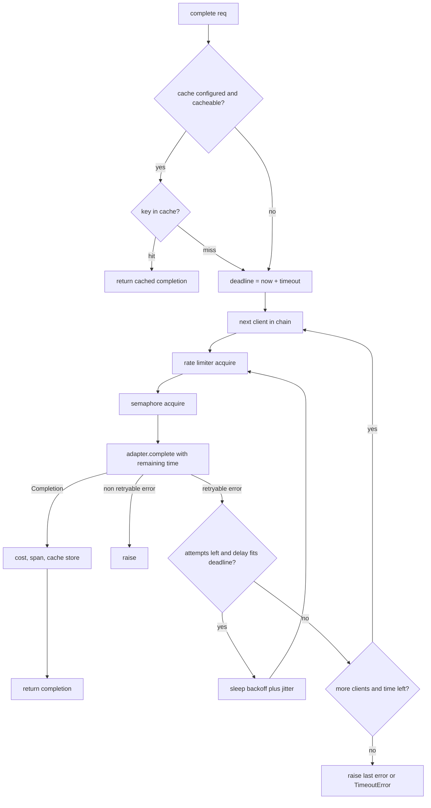
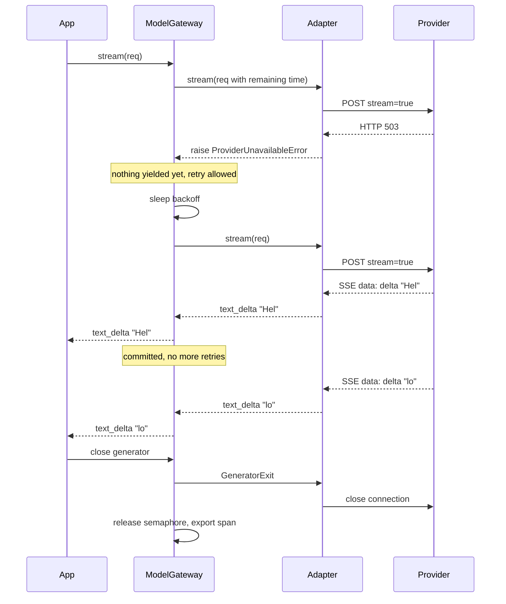

# Chapter 3 — Working with LLM APIs

This chapter turns a raw HTTP call to a language model into a dependable library call. It builds `aie_core`, the shared client and gateway that every later project imports, and Northwind Assist, the running example, makes its very first model call here.

**You will be able to:**
- call any hosted or self-hosted model through one provider-neutral interface, and explain what the adapter translates on the wire;
- stream output with correct cancellation, and get validated structured data back through a bounded repair loop;
- run the tool-calling protocol by hand: tool specs, tool calls, tool results, and the replay rule;
- build a gateway that classifies errors, retries with jittered backoff under one deadline, limits rate and concurrency, and falls back across models;
- account for every call's tokens and cost, including cached input and reasoning tokens;
- decide when to build this layer yourself and when to adopt a vendor SDK or an off-the-shelf LLM gateway.

**Prerequisites:** Chapter 2 (tokens, prefill and decode, why output is probabilistic). | **Code:** `book/projects/aie_core/` (run: `cd book/projects/aie_core && pytest -q`) | **Builds:** the `aie_core` package.

**First reading:** Why this matters, Mental model, Core concepts, How it works, Architecture, the Types, Errors, FakeLLM, and Gateway excerpts, Known limitations, Production considerations (for the span attributes), Failure modes, Before you ship. **Deep dives** (skip on a first pass): the SSE parser, adapter, structured-output and settings excerpts, the rest of the Code walkthrough, Tradeoffs, Evaluation and testing.

## Why this matters

A language model behind an HTTP API is a remote, slow, expensive, probabilistic function. Each adjective breaks an assumption ordinary code makes about function calls. Remote means the call can fail halfway through. Slow means a request can outlast a user's patience, which is why streaming exists. Expensive means a retry storm is a bill, not just a latency problem. Probabilistic means the same input may produce different output, so a response is something to validate, not to trust.

Most teams discover these properties one incident at a time: the night a provider returned errors for forty minutes and the service had no fallback; the week the invoice doubled because a background job retried without backoff; the afternoon a JSON parser crashed on a response that began with "Sure! Here is the JSON you asked for". Each has a boring, well-understood fix from distributed systems engineering. The fixes belong in one place, written once and tested offline, so later chapters can concentrate on retrieval, agents, and evaluation. That place is `aie_core`: not a framework, but a client, a gateway, and a few helpers you can read in an hour.

## Mental model

> **Mental model:** Reliability is engineered around the model, not expected from it.

Picture the model as a service you do not operate, with an SLA you did not negotiate. Everything you control sits on your side of the wire: the request's shape, what you do when the answer is late, wrong, or missing, how many requests you let in flight, and how much you spend. The gateway is where that control lives.

A second model to carry through the chapter: **a completion is a transaction with a budget**. The budget has three currencies. Time, expressed as a deadline that shrinks with every retry. Tokens, which the provider meters and bills. Attempts, which you ration so that a failing provider does not drag your own service down with it. The gateway spends from all three and stops when any one runs out.

## Core concepts

The subsections fall into two groups:

- **The call** (One call on the wire through Tokens and usage): what a single request and response look like, including streaming, structured output, and tool calls.
- **The gateway** (Error taxonomy through Cost accounting): what wraps that call so it survives production. Each piece builds on the last: errors must be classified before you can retry, retries need a deadline, and a deadline does not protect the provider's quota, so you also need a rate limiter.

A short pointer on embedding clients closes the section. The Architecture flowchart draws the whole gateway in one picture and is worth a glance now.

### One call on the wire

Strip away every library and a model call is one HTTPS POST with a JSON body. The listing uses the OpenAI-dialect shape, which many servers speak; the URL, model, and key are placeholders.

```python
# Illustrative: one chat completion over raw HTTP (OpenAI-dialect shape, placeholder URL and model)
import os
import httpx

resp = httpx.post(
    "https://llm.example.com/v1/chat/completions",
    headers={"Authorization": f"Bearer {os.environ['LLM_API_KEY']}"},
    json={
        "model": "example-model",
        "messages": [
            {"role": "system", "content": "You are Northwind Assist, an internal helper."},
            {"role": "user", "content": "What is the refund deadline for retail customers?"},
        ],
        "temperature": 0,
        "max_tokens": 200,
    },
    timeout=10.0,
)
resp.raise_for_status()
body = resp.json()
print(body["choices"][0]["message"]["content"], body["usage"])
```

The response (abridged, illustrative) carries three things every later section depends on: the message, the reason generation stopped, and metered usage.

```json
{
  "choices": [{"message": {"role": "assistant", "content": "Retail refunds ..."},
               "finish_reason": "stop"}],
  "usage": {"prompt_tokens": 41, "completion_tokens": 18}
}
```

That one call already contains every problem this chapter solves. `raise_for_status` turns a 429 and a 400 into the same exception, though one should be retried and the other never. The ten-second timeout applies to one attempt, not to the caller's budget. Nothing limits how many of these run at once, nothing records what they cost, and the dictionary paths are one provider's spelling. Here is the same call through `aie_core`:

```python
from aie_core import CompletionRequest, Message, make_llm_client

client = make_llm_client()  # FakeLLM offline; a ModelGateway around the real adapter when LLM_PROVIDER is set
completion = client.complete(CompletionRequest(
    messages=[
        Message.system("You are Northwind Assist, an internal helper."),
        Message.user("What is the refund deadline for retail customers?"),
    ],
    max_tokens=200,
    timeout_s=10.0,
))
print(completion.text, completion.finish_reason, completion.usage)
```

The call site looks no simpler; what changed is everything behind it, which the rest of the chapter builds.

### Messages and roles

Every chat-style API takes a list of messages, each tagged with a role:

- `system`: instructions from the application developer, which the model treats as higher authority than user text (how much higher varies; Chapter 26 covers the security consequences).
- `user`: input from the person or upstream system making the request.
- `assistant`: previous model output, replayed so the model sees the conversation; it can carry text, tool calls, or both.
- `tool`: the result of executing a tool call, tied to the call by an id.

The model is stateless. Every request carries the whole conversation; a chat product's "memory" is the client re-sending history, and you pay for all of it on every turn (Chapter 5 manages that budget). `Message` has one constructor per role (`Message.system`, `.user`, `.assistant`, `.tool`). Content is a string or, for multimodal input, a list of `ContentPart` objects.

### System prompts

The system prompt states the application's identity, scope, output rules, and refusal behavior; Chapter 4 owns the craft of writing one. Three engineering facts belong here. It is the most stable part of the request, so keep it first and byte-identical, which lets provider prompt caching reuse it (Chapter 5). The two main API formats, which this book calls dialects, transport it differently: the OpenAI dialect as a `system` message, the Anthropic dialect as a top-level `system` field (the adapter hides this and concatenates multiple system messages). And nothing in it is enforced: your code must still validate what comes back.

### Request and response shape across providers

Both dialects take a model name, messages, a temperature, a maximum output length, optional tools, and a stop list, and both return a message, a finish reason, and token usage. They differ in encoding, for example:

| Concern | OpenAI dialect | Anthropic dialect |
|---|---|---|
| Field names | `max_tokens` (`max_completion_tokens` on some servers), `stop` | `max_tokens`, `stop_sequences` |
| Tool calls | a `tool_calls` array with JSON-string arguments | `tool_use` content blocks with already-parsed input |
| Tool results | a message with role `tool` | a `tool_result` block inside a `user` message |
| Finish reasons | `stop`, `length`, `tool_calls` | `end_turn`, `stop_sequence`, `max_tokens`, `tool_use` |
| Cached tokens | included in the input count, cached share in a detail field | excluded from `input_tokens`; cache reads and writes counted separately |

None of those differences should reach application code. `aie_core` defines one `CompletionRequest` and one `Completion`, and each adapter is a pure translation in both directions. The application is tested against `FakeLLM`, which speaks the neutral types, and each adapter against recorded vendor payloads. When a provider renames a field, one adapter changes.

The `LLMClient` protocol (a `typing.Protocol`, so any object with the right methods qualifies) has four methods: `complete`, `stream`, `acomplete`, and `astream`. A gateway, an adapter, and a fake all satisfy it, so the gateway can wrap any of them and tests can swap one for another.

### Streaming

Streaming delivers each token as it is produced instead of after the last one. It changes neither server-side time to first token (TTFT) nor total generation time (Chapter 2 defines both). What it cuts is the user's perceived wait: the time until text appears drops from the whole generation, about eight seconds for 400 tokens at an illustrative 50 tokens per second, to roughly TTFT. Northwind Assist's two-second p95 TTFT target only describes what users experience because answers are streamed.

The transport is almost always Server-Sent Events (SSE): a long-lived HTTP response whose body is a sequence of `event:` and `data:` lines separated by blank lines. It fits because the flow is one-directional and ordinary HTTP infrastructure passes it through; WebSockets are warranted only when the client must also send mid-stream, as in voice.

Each event carries a delta, only what is new. Text deltas are simply appended. Tool-call arguments arrive as fragments of a JSON string (`{"id"`, then `: 42}`) that do not parse until the last one lands, so the adapter buffers them per call and emits one `tool_call_delta` with a fully parsed `ToolCall` when the call closes. Streamed structured output has the same problem (Chapter 6).

Cancellation is the forgotten half of streaming. When the user navigates away, closing the HTTP response lets the provider stop generating and stop billing. In Python the generator receives `GeneratorExit` at its current `yield`, so any resource it holds, here a concurrency slot, must be released in a `finally` block.

Retries and streams interact badly. A failure before the first byte can be retried transparently; a failure after text reached the user cannot, because the answer would visibly start over. The gateway therefore retries a stream only until it has received the first event.

### Structured outputs

Three ways to get typed objects, in decreasing order of reliability:

1. **Schema mode.** The request carries a JSON Schema and the provider constrains decoding to match it (Chapter 6 explains constrained decoding and its limits). This is `response_schema` on `CompletionRequest`, sent as `response_format` of type `json_schema` in the OpenAI dialect. The guarantee holds only in strict mode (`strict_schemas=True` on the adapter), which is off by default because it restricts which schema features are accepted.
2. **Tool as schema.** Force the model to call a single tool whose parameter schema is your output schema; the call's arguments are your result. The Anthropic-dialect adapter emulates `response_schema` this way, with a forced tool named `emit_structured_output`, and returns the result as JSON text so callers cannot tell the difference.
3. **Prompt and parse.** Describe the schema in the prompt and parse what comes back. Weakest, but universal.

Validation is still yours: a schema rarely encodes every business rule, so a priority of 9 can pass when only 1 to 4 are valid. `complete_structured` validates with pydantic and, on failure, sends the error back as a new user turn and asks again, up to `max_repair_attempts` times. When the budget runs out it raises `MalformedResponseError`, and the caller decides whether to degrade, queue for a human, or fail.

One failure is excluded from repair on purpose. A completion with `finish_reason` `length` ran out of `max_tokens` (`Completion.truncated` is true), and re-asking with the same budget would truncate again. `parse_structured`, the validation step inside `complete_structured`, raises `TruncatedOutputError` (a `MalformedResponseError`) at once, even if the cut-off text happens to parse. The fix is a larger `max_tokens` or a smaller schema.

### The tool-calling protocol

Tool calling is a protocol: the model never executes anything; it emits a request your code may or may not honor.

1. The request includes `tools`: a list of `ToolSpec`, each with a name, a description the model reads, and a JSON Schema for parameters.
2. The response has `finish_reason` `tool_calls` and one or more `ToolCall` objects: an id, a name, and parsed arguments.
3. Your code validates the arguments against the schema and against policy (may this user call `send_reply`?), runs the tool, and appends the assistant message exactly as returned, then one `tool` message per call carrying the matching `tool_call_id` and the result as text.
4. You call the model again. It answers or requests more tools; loop until it answers or a step limit is hit.

In Northwind terms: a user asks about ticket 4812; the model returns a call to `search_tickets` with `{"id": 4812}`; your code runs the search, appends the assistant turn and `Message.tool(call_id, result)`, and calls again; the model answers in prose.

Two details trip people. The assistant message with tool calls must be replayed verbatim; without it, the tool results reference calls the model never made and the request is invalid. And `tool_choice` says whether the model may call a tool (`auto`), must call some tool (`required`), must not (`none`), or must call one named tool. Forcing a named tool is how structured output goes through tools; `none` makes the model summarize results without calling anything else. Chapter 16 adds the registry, policy, and sandbox around this protocol.

### Tokens and usage

Before a call, to budget context and feed the rate limiter, you can only estimate tokens: `count_tokens` uses `tiktoken` when it can load a vocabulary and a characters-divided-by-four heuristic otherwise, and `count_message_tokens` adds per-message framing overhead. After the call, the provider reports exact `usage`: input tokens, output tokens, and input tokens served from a prompt cache. `Completion.usage` normalizes all three, and the gateway turns them into cost and into attributes on a span (one timed record of an operation; Chapter 31 assembles spans into request trees). Record usage on every call; it is the only exact record of what you pay for.

**Reasoning tokens.** Reasoning models (Chapter 2) generate hidden "thinking" tokens before the visible answer, with four consequences at the API layer:

- They are billed as output tokens, at the output rate, though you never see most of them. `Usage` keeps them inside `output_tokens`; the vendor payload in `Completion.raw` carries the separate count where a provider reports one.
- They count against `max_tokens` on most APIs, so a budget sized for the visible answer can be spent entirely on thinking, leaving an empty reply with `finish_reason` `length`. Size `max_tokens` for both, or use the provider's reasoning budget or effort setting.
- They make cost per request long-tailed: identical visible answers can differ several-fold in billed output. Watch the distribution of `output_tokens`, and compare models by cost per completed task, not price per token.
- Some providers return reasoning as opaque items that must be sent back verbatim on the next turn of a tool loop. `Message` has no slot for them; Chapter 19 stores them in the agent's event log.

### Error taxonomy

On any failure the first decision is whether to try again, so the gateway needs one bit from each of the vendor's dozens of error codes: can retrying possibly help? `aie_core` maps every failure into six classes, each carrying `retryable` and an optional `retry_after_s` hint.

| Class | Typical cause | Retryable | Fallback |
|---|---|---|---|
| `RateLimitError` | HTTP 429, quota exceeded | yes, after the hinted delay | yes |
| `TimeoutError` | no response within the budget | yes if the call is idempotent | yes |
| `ProviderUnavailableError` | 5xx, connection refused, "overloaded" | yes | yes |
| `InvalidRequestError` | 400/401/403/404: bad schema, unknown model, bad key | no | no |
| `ContentFilterError` | provider refused for policy reasons | no | no |
| `MalformedResponseError` | 2xx but unparseable body or tool arguments | no (repair instead) | no |

The non-retryable column is the important one. Retrying an invalid request burns attempts and time for a guaranteed identical failure, and falling back sends a request you know is broken to a second provider. A malformed response succeeded at the HTTP level, so the right tool is the structured-output repair loop, not a transport retry.

### Retries, backoff, and jitter

A retry bets that the failure was transient. Three rules make the bet cheap. Bound the attempts: a provider that is down for an hour should cost you three requests, not three thousand. Back off exponentially: if the provider is overloaded, your immediate retry is part of the problem. Add jitter: a thousand clients that failed at the same instant and retry after exactly one second fail again together. "Full jitter", a uniform draw between zero and the exponential cap, spreads the wave out. When the provider sends `Retry-After`, honor it, with a little jitter on top.

Retrying a plain completion after a timeout costs at most a response you never read. For a call whose result triggers an action elsewhere, set `retry_on_timeout=False` or carry an idempotency key (a unique id the receiver uses to drop duplicates). Chapter 16 handles idempotency for tool execution.

### Timeouts and deadline propagation

A timeout without a deadline is a trap. If each attempt gets sixty seconds and you allow three attempts with backoff, a caller who expected sixty seconds can wait more than three minutes.

The fix is one deadline, computed when the call starts from `timeout_s` (or the gateway default), with everything derived from what remains. Each attempt's timeout is the remaining time, which propagates into the adapter as the HTTP read timeout. Before sleeping for a backoff delay, the gateway checks that the sleep still fits; if not, it moves to the next client in the fallback chain or gives up. Before trying a fallback, it checks that time is left.

When the budget runs out between attempts, the gateway raises a `TimeoutError` whose `__cause__` is the last provider error, so a caller can tell "the provider is broken" from "we ran out of time"; when it runs out before any attempt starts, the `TimeoutError` has no cause. These gateway-raised timeouts are non-retryable and end the call at once, unlike a provider timeout. Chapter 29 adds circuit breakers and admission control at service level.

### Rate limits

Retries react after the provider pushes back with a 429; a rate limiter stops you from causing it. Providers limit requests and tokens per minute. A client-side token bucket holds up to *C* units, refills at *C*/60 per second when *C* is the per-minute limit, and admits a request only if it can take its units out. `RateLimiter` keeps one bucket for requests and one for tokens. Admission is deliberately conservative: prompt tokens plus the full `max_tokens` budget, because a limiter that under-counts does not work.

Say Northwind's key allows an illustrative 500 requests and 200,000 tokens per minute. A ticket classification with a 350-token prompt and `max_tokens=150` reserves 500 tokens, so the token bucket admits about 400 such calls a minute. That is below the request limit, so the token bucket is the one that throttles.

The limiter is per process, but quotas are per key: four replicas each configured with the full limit admit four times what the provider allows. Give each replica its share (revisited when autoscaling changes the count) or move the bucket into shared storage such as Redis; Chapter 29 sizes shares and adds per-tenant admission.

### Concurrency

Rate limits bound throughput; concurrency limits bound requests in flight. Little's law links them: in-flight requests equal arrival rate times latency, so twenty requests per second at five seconds each means a hundred open connections. The gateway holds a `threading.BoundedSemaphore` for sync callers and an `asyncio.Semaphore` for async ones, both sized by `max_concurrency`. For fan-out, `asyncio.gather` over `gateway.acomplete` gives concurrency without threads while the semaphore prevents a flood.

### Batching

For work nobody is waiting on, provider batch APIs are the cheaper lever: you upload a file of requests and the provider processes them within hours, typically at a steep discount. Use them for nightly classification, re-embedding, or evaluation data, never for anything a person is waiting on. `aie_core` does not wrap them because their shape is provider-specific; Chapter 30 shows where they fit.

### Caching

Caching names two unrelated mechanisms.

An **exact-match response cache** stores the whole `Completion` keyed by a hash of everything that determines the answer: model, messages, tools, tool choice, response schema, temperature, max tokens, and stop sequences. Metadata and timeouts stay out of the key, except `cache_scope`. Caching is only safe when the same input should give the same answer, so the gateway caches by default only at temperature zero and otherwise requires `metadata={"cache": True}`. Hit rates are low on free-form chat and high on classification, routing, and extraction of repeated inputs.

The key must also include everything that makes the answer user-specific. In Northwind, a retail agent and a logistics agent can both ask "What is the escalation path for a damaged shipment?" If the tool layer, not the prompt, decides what each may see, the two prompts are byte-identical, and without a scope the second agent gets the first one's cached answer. `metadata["cache_scope"]` (for example `"tenant:retail"`) is the one metadata field that enters the key, and `require_cache_scope=True` makes a shared gateway refuse to cache unscoped requests, so a forgotten field costs hit rate rather than leaking data. Chapter 30 generalizes this into scoped caches.

**Provider prompt caching** reuses the provider's prefill work for a recently seen prompt prefix and bills those tokens at a reduced rate; `cached_input_tokens / input_tokens` is its hit rate. Chapter 5 owns prompt layout for it, Chapter 30 the cost math.

### Model fallbacks

When retries on the primary are exhausted and the deadline has time left, the gateway tries each fallback client in turn. A fallback chain buys availability, but breakage hides there: a different model may reject a prompt the primary accepted (context length), call tools differently or not at all, lack a schema mode, or answer differently enough to fail your evaluations. Test the fallback path in CI, run your evaluation set against the fallback model before you need it, and record `provider` and `model` on every span. Whether to fall back at all is a product decision; see Tradeoffs.

### Cost accounting

Cost is usage times price, with cached input at its own rate: a request with 340 input tokens, 200 of them cached, and 25 output tokens is billed at three rates, and without the split a 60% prompt-cache hit would be invisible. `PricingTable` holds per-million-token prices for input, cached input, and output, keyed by model name with prefix matching so dated variants inherit the base price. Every number in it is illustrative and will go stale, so load it from configuration. The gateway attaches `cost_usd` to the completion's `raw` dictionary and to the span. A response-cache hit records zero cost plus an `avoided_cost_usd`, so the cache shows its value without inflating the spend report. Because reasoning tokens make cost long-tailed (see Tokens and usage), report percentiles of cost per request, not only the mean. Chapter 30 builds the cost model on this.

### Embedding clients

The same library carries the embedding side, which has the same remote, metered, failure-prone shape. `EmbeddingClient` exposes `embed(texts)` for documents and `embed_query(text)` for queries; `OpenAICompatibleEmbeddings` batches inputs and maps failures into the same error taxonomy but does not retry; `FakeEmbeddings` runs tests offline; and `CachedEmbeddings` embeds repeated texts once, keyed by a fingerprint of the embedding space. Chapter 8 owns embedding spaces and that fingerprint.

## How it works

Follow one Northwind request through the gateway.

A support engineer asks Northwind Assist to classify a ticket. The application calls `complete_structured`, which sends `gateway.complete` a `CompletionRequest` with a system prompt, the ticket text, a `response_schema` from a pydantic model, temperature zero, `max_tokens=200`, and a ten-second timeout.

The gateway sets the deadline to now plus ten seconds. The temperature is zero and a cache is configured, so it looks up the cache key. Miss. Attempt one on the primary client opens a span, copies the request with `timeout_s` set to the remaining 9.998 seconds, passes the rate limiter at roughly 550 estimated tokens (prompt plus the 200-token output budget), takes a concurrency slot, and calls the adapter.

The adapter posts the vendor payload and gets a 429 with `Retry-After: 2`, which it maps to `RateLimitError(retry_after_s=2.0)`. The span records the exception and closes with status error. The error is retryable and attempt one is below the limit of three, so the policy computes a delay of two seconds plus a little jitter. That fits within the remaining 9.9 seconds, so the gateway sleeps.

Attempt two runs with 7.8 seconds remaining. The adapter gets a 200 with JSON text, `finish_reason` `stop`, and usage of 340 input tokens (200 cached) and 25 output tokens. The gateway computes cost, writes `cost_usd`, `cache_hit=False`, and `attempt=2` into `raw`, fills and closes the span, stores the completion in the cache, and returns.

`complete_structured` validates the JSON against the pydantic model and returns the object. Had validation failed, it would have called `gateway.complete` again with the answer and the error appended. Each repair is a new gateway call with the request's own `timeout_s`, so with two repairs allowed the worst case is three times the timeout. Budget for that, or pass a smaller `timeout_s` on repairs.

Had attempts two and three failed with 503s, the gateway would have moved to the fallback client under the original deadline, and the span would show a different `provider` and `model`. Had the first failure been a 400, it would have raised at once, with no retry and no fallback.

## Architecture

The request path, with the decisions that route a call:



Streaming, showing where the retry boundary sits and how cancellation propagates:



## Implementation

The library layout; files marked with an asterisk are excerpted below.

```
book/projects/aie_core/
  pyproject.toml
  README.md
  .env.example
  aie_core/
    __init__.py
    settings.py              * Settings, make_llm_client, make_provider_client, make_embedding_client
    observability.py           Span, Tracer, JsonlTracer, OTelTracer, NoopTracer, InMemoryTracer
    embeddings.py              EmbeddingClient, OpenAICompatibleEmbeddings, FakeEmbeddings, CachedEmbeddings
    llm/
      types.py               * neutral request and response types
      client.py                LLMClient protocol, collect_stream
      errors.py              * error taxonomy and HTTP mapping
      tokens.py                count_tokens, count_message_tokens
      structured.py          * complete_structured and the repair loop
      gateway.py             * ModelGateway, RetryPolicy, RateLimiter, caches, PricingTable
      providers/
        _sse.py              * SSE parser
        _http.py               httpx construction and transport error mapping
        openai_compat.py     * OpenAI-dialect adapter
        anthropic.py         * Anthropic-dialect adapter
        fake.py              * FakeLLM
  tests/                       offline test suite
```

Runtime dependencies are `pydantic`, `pydantic-settings`, `httpx`, and `numpy`; `tiktoken` and `opentelemetry-sdk` are optional extras. Integration tests are excluded by default.

Install and run:

```bash
uv pip install --python .venv/bin/python -e book/projects/aie_core   # or: pip install -e book/projects/aie_core
cd book/projects/aie_core && python -m pytest -q
```

Configuration is environment-driven; the defaults run offline with fakes, which every test in the book relies on.

| Variable | Default | Meaning |
|---|---|---|
| `LLM_PROVIDER` | `fake` | `openai`, `anthropic`, or `fake` |
| `LLM_MODEL` | `fake-model` | model name sent to the provider |
| `LLM_BASE_URL` | unset | OpenAI-compatible server or proxy base URL |
| `OPENAI_API_KEY`, `ANTHROPIC_API_KEY` | unset | credentials, read as secrets |
| `EMBEDDING_PROVIDER`, `EMBEDDING_MODEL` | `fake`, `fake-embedding` | embeddings |
| `TRACE_SINK`, `TRACE_PATH` | `none`, `traces.jsonl` | `none`, `jsonl`, `otel`, or `memory` (an `InMemoryTracer`, for tests) |
| `REQUEST_TIMEOUT_S` | `60` | default deadline per call |
| `LLM_MAX_ATTEMPTS`, `LLM_MAX_CONCURRENCY` | `3`, `16` | retry budget per client, in-flight limit |
| `LLM_REQUESTS_PER_MINUTE`, `LLM_TOKENS_PER_MINUTE` | unset | enable the token-bucket limiter |
| `LLM_RESPONSE_CACHE` | `false` | enable the exact-match cache |
| `LLM_FALLBACK_MODEL` | unset | second model on the same provider, tried on retryable failures |

Read Types and Gateway closely: they are the contract and the control flow. Errors and FakeLLM are short; the rest is reference.

### Types

The request, the response, and the stream event. Note what is absent: no vendor field names, and `raw` as the only escape hatch to the provider's payload.

```python
# path: book/projects/aie_core/aie_core/llm/types.py (excerpt; full file on disk)
class ToolCall(BaseModel):
    """A request from the model to run a tool. `arguments` is already parsed JSON."""

    id: str
    name: str
    arguments: dict[str, Any] = Field(default_factory=dict)


class Message(BaseModel):
    role: Role
    content: str | list[ContentPart] = ""
    tool_calls: list[ToolCall] | None = None
    tool_call_id: str | None = None
    name: str | None = None

    # ... constructors system(), user(), assistant(), tool() and the text property on disk ...


class Usage(BaseModel):
    input_tokens: int = 0
    output_tokens: int = 0
    cached_input_tokens: int = 0


class CompletionRequest(BaseModel):
    messages: list[Message]
    model: str | None = None
    temperature: float = 0.0
    max_tokens: int = 1024
    tools: list[ToolSpec] | None = None
    tool_choice: Literal["auto", "none", "required"] | str = "auto"
    response_schema: dict[str, Any] | None = None  # JSON Schema for structured output
    stop: list[str] | None = None
    metadata: dict[str, Any] = Field(default_factory=dict)
    timeout_s: float | None = None


class Completion(BaseModel):
    message: Message
    usage: Usage = Field(default_factory=Usage)
    finish_reason: str = "stop"
    model: str = ""
    provider: str = ""
    latency_ms: float = 0.0
    raw: dict[str, Any] | None = None

    # ... text and tool_calls properties on disk ...

    @property
    def truncated(self) -> bool:
        """True when generation stopped because `max_tokens` ran out (`finish_reason == "length"`).
        The text is cut mid-way; structured output parsed from it is unreliable even if it happens
        to be valid JSON."""
        return self.finish_reason == "length"


class StreamEvent(BaseModel):
    # ... docstring on disk ...
    type: Literal["text_delta", "tool_call_delta", "usage", "done", "error"]
    text: str | None = None
    tool_call: ToolCall | None = None
    usage: Usage | None = None
    error: str | None = None
    finish_reason: str | None = None
```

### Errors

The base class, one representative subclass (the other five differ only in name and `default_retryable`), and the HTTP mapping, the only place that reads status codes. Every 4xx other than a content-filter refusal is treated as a programming error. The retryable flag is a class default that a caller can override per instance, for example `RateLimitError(..., retryable=False)` for a hard quota.

```python
# path: book/projects/aie_core/aie_core/llm/errors.py (excerpt; full file on disk)

class LLMError(Exception):
    """Base class. `retryable` drives retry and fallback; `retry_after_s` is a provider hint."""

    default_retryable: bool = False

    def __init__(
        self,
        message: str,
        *,
        retryable: bool | None = None,
        retry_after_s: float | None = None,
        status_code: int | None = None,
        provider: str | None = None,
        raw: Any = None,
    ) -> None:
        super().__init__(message)
        self.retryable = self.default_retryable if retryable is None else retryable
        self.retry_after_s = retry_after_s
        self.status_code = status_code
        self.provider = provider
        self.raw = raw

    def __str__(self) -> str:
        base = super().__str__()
        bits = []
        if self.provider:
            bits.append(f"provider={self.provider}")
        if self.status_code is not None:
            bits.append(f"status={self.status_code}")
        if self.retry_after_s is not None:
            bits.append(f"retry_after={self.retry_after_s:g}s")
        return f"{base} ({', '.join(bits)})" if bits else base


class RateLimitError(LLMError):
    """HTTP 429 or an equivalent quota signal. Retry after a delay, or fall back."""

    default_retryable = True


def map_http_error(
    status_code: int,
    body: Any,
    headers: dict[str, str] | None,
    provider: str,
) -> LLMError:
    """Translate an HTTP failure into the taxonomy. Shared by the OpenAI-style and Anthropic adapters."""
    headers = {k.lower(): v for k, v in (headers or {}).items()}
    message = _extract_message(body) or f"HTTP {status_code}"
    retry_after = _parse_retry_after(headers.get("retry-after"))
    common = {"status_code": status_code, "provider": provider, "raw": body}

    if status_code == 429:
        return RateLimitError(message, retry_after_s=retry_after, **common)
    if status_code == 408:
        return TimeoutError(message, retry_after_s=retry_after, **common)
    if status_code >= 500:
        return ProviderUnavailableError(message, retry_after_s=retry_after, **common)
    lowered = message.lower()
    if "content_filter" in lowered or "content filter" in lowered or "content management policy" in lowered:
        return ContentFilterError(message, **common)
    return InvalidRequestError(message, **common)
```

### SSE parser

> **Deep dive.** The line-level SSE format; skip on a first reading.

The accumulator's `feed` is the whole format. The blank-line branch is the only place it emits an event, and `flush` handles a stream that ends without its final blank line.

```python
# path: book/projects/aie_core/aie_core/llm/providers/_sse.py (excerpt; full file on disk)

class _Accumulator:
    # ... other members omitted; full file on disk ...

    def feed(self, line: str) -> SSEEvent | None:
        line = line.rstrip("\r")
        if line == "":
            if not self.has_content:
                return None
            ev = self.current.finish()
            self.current = SSEEvent()
            self.has_content = False
            return ev
        if line.startswith(":"):
            return None
        name, _, value = line.partition(":")
        if value.startswith(" "):
            value = value[1:]
        self.has_content = True
        if name == "event":
            self.current.event = value
        elif name == "data":
            self.current._data_lines.append(value)
        elif name == "id":
            self.current.id = value
        return None


def iter_sse(lines: Iterable[str]) -> Iterator[SSEEvent]:
    acc = _Accumulator()
    for line in lines:
        ev = acc.feed(line)
        if ev is not None:
            yield ev
    tail = acc.flush()
    if tail is not None:
        yield tail
```

### OpenAI-dialect adapter

> **Deep dive.** How neutral types become one dialect's JSON and back; skip on a first reading.

Request encoding, a pure function easy to test against recorded payloads, and the stream state machine. In the state machine, follow how tool-call argument fragments accumulate per index until the call closes.

```python
# path: book/projects/aie_core/aie_core/llm/providers/openai_compat.py (excerpt; full file on disk)

class OpenAICompatibleClient:
    # ... other members omitted; full file on disk ...

    def build_payload(self, req: CompletionRequest, *, stream: bool = False) -> dict[str, Any]:
        model = req.model or self.default_model
        if not model:
            raise ValueError("no model: set CompletionRequest.model or default_model")
        payload: dict[str, Any] = {
            "model": model,
            "messages": [self._encode_message(m) for m in req.messages],
            "temperature": req.temperature,
            self.max_tokens_field: req.max_tokens,
        }
        if req.stop:
            payload["stop"] = req.stop
        if req.tools:
            payload["tools"] = [
                {"type": "function", "function": {"name": t.name, "description": t.description, "parameters": t.parameters}}
                for t in req.tools
            ]
            payload["tool_choice"] = self._encode_tool_choice(req.tool_choice)
        if req.response_schema is not None:
            payload["response_format"] = {
                "type": "json_schema",
                "json_schema": {
                    "name": str(req.response_schema.get("title", "response")),
                    "schema": req.response_schema,
                    "strict": self.strict_schemas,
                },
            }
        if stream:
            payload["stream"] = True
            payload["stream_options"] = {"include_usage": True}
        for key, value in self.extra_body.items():
            payload.setdefault(key, value)
        return payload

    # ... _encode_message, parse_completion, complete, stream, and the async twins on disk ...


class _OpenAIStreamState:
    # ... other members omitted; full file on disk ...

    def handle(self, data: str) -> Iterator[StreamEvent]:
        if not data or data.strip() == "[DONE]":
            return
        try:
            chunk = json.loads(data)
        except ValueError as exc:
            raise MalformedResponseError(f"bad SSE chunk: {exc}", provider=self.provider, raw=data) from exc
        if "error" in chunk and not chunk.get("choices"):
            msg = str((chunk.get("error") or {}).get("message") or chunk["error"])
            yield StreamEvent(type="error", error=msg)
            return
        if chunk.get("usage"):
            self.usage = OpenAICompatibleClient._parse_usage(chunk["usage"])
        for choice in chunk.get("choices") or []:
            delta = choice.get("delta") or {}
            if delta.get("content"):
                yield StreamEvent(type="text_delta", text=delta["content"])
            for tc in delta.get("tool_calls") or []:
                idx = int(tc.get("index", 0))
                slot = self.pending.setdefault(idx, {"id": None, "name": None, "args": ""})
                if tc.get("id"):
                    slot["id"] = tc["id"]
                fn = tc.get("function") or {}
                if fn.get("name"):
                    slot["name"] = fn["name"]
                if fn.get("arguments"):
                    slot["args"] += fn["arguments"]
            if choice.get("finish_reason"):
                self.finish_reason = choice["finish_reason"]
                if self.finish_reason == "content_filter":
                    raise ContentFilterError("stream blocked by content filter", provider=self.provider, raw=chunk)
                yield from self._flush_tool_calls()
```

### Anthropic-dialect adapter

> **Deep dive.** The one translation that differs in kind, not spelling; skip on a first reading.

Message merging: this dialect requires strict user/assistant alternation and wants all tool results for one assistant turn in one user message.

```python
# path: book/projects/aie_core/aie_core/llm/providers/anthropic.py (excerpt; full file on disk)

class AnthropicClient:
    # ... other members omitted; full file on disk ...

    def _encode_messages(self, messages: list[Message]) -> list[dict[str, Any]]:
        """Anthropic requires strict user/assistant alternation and wants all tool results that
        answer one assistant turn inside a single user message, so adjacent same-role blocks merge."""
        out: list[dict[str, Any]] = []
        for m in messages:
            if m.role == Role.TOOL:
                role = "user"
                blocks: list[dict[str, Any]] = [
                    {"type": "tool_result", "tool_use_id": m.tool_call_id or "", "content": m.text}
                ]
            elif m.role == Role.ASSISTANT:
                role = "assistant"
                blocks = self._encode_content(m.content)
                for tc in m.tool_calls or []:
                    blocks.append({"type": "tool_use", "id": tc.id, "name": tc.name, "input": tc.arguments})
            else:
                role = "user"
                blocks = self._encode_content(m.content)
            if not blocks:
                continue
            if out and out[-1]["role"] == role:
                out[-1]["content"].extend(blocks)
            else:
                out.append({"role": role, "content": blocks})
        return out
```

### FakeLLM

`FakeLLM` satisfies the protocol with no I/O. Its response list accepts a string (assistant text), a dict (returned as JSON text), a list of `ToolCall` (a tool-calling turn), a prepared `Completion`, or an exception instance, which it raises; a `handler` callable replaces the list for dynamic scripting. It records every request in `.requests`, synthesizes `Usage` so cost accounting works in tests, and streams by chunking text.

### Gateway

Policies and admission first.

```python
# path: book/projects/aie_core/aie_core/llm/gateway.py (excerpt; full file on disk)

class RetryPolicy(BaseModel):
    max_attempts: int = 3
    base_delay_s: float = 0.5
    max_delay_s: float = 8.0
    jitter: bool = True
    retry_on_timeout: bool = True  # set False for non-idempotent calls (tool side effects)

    def delay_for(self, attempt: int, retry_after_s: float | None, rng: random.Random) -> float:
        """Attempt is 1-based. Full jitter: uniform(0, min(cap, base * 2**(attempt-1)))."""
        exp = min(self.max_delay_s, self.base_delay_s * (2 ** (attempt - 1)))
        delay = rng.uniform(0.0, exp) if self.jitter else exp
        if retry_after_s is not None:
            # Honor the provider's hint; jitter on top avoids every client retrying at once.
            delay = retry_after_s + (rng.uniform(0.0, min(1.0, retry_after_s * 0.1)) if self.jitter else 0.0)
        return delay

    def should_retry(self, err: LLMError, attempt: int) -> bool:
        if attempt >= self.max_attempts or not err.retryable:
            return False
        if isinstance(err, TimeoutError) and not self.retry_on_timeout:
            return False
        return True


class RateLimiter:
    # ... other members omitted; full file on disk ...

    def _reserve(self, tokens: int) -> float:
        """Return the wait needed; consume immediately when zero."""
        with self._lock:
            wait = 0.0
            if self._req is not None:
                wait = max(wait, self._req.wait_time(1))
            if self._tok is not None and tokens > 0:
                wait = max(wait, self._tok.wait_time(tokens))
            if wait == 0.0:
                if self._req is not None:
                    self._req.consume(1)
                if self._tok is not None and tokens > 0:
                    self._tok.consume(tokens)
            return wait
```

Then the gateway: a loop over clients (primary, then fallbacks) wrapped around a loop over attempts. The three deadline helpers come first; in `complete`, find the two places the remaining time is checked.

```python
# path: book/projects/aie_core/aie_core/llm/gateway.py (excerpt; full file on disk)

class ModelGateway:
    # ... other members omitted; full file on disk ...

    def _with_remaining(self, req: CompletionRequest, deadline: float) -> CompletionRequest:
        """Deadline propagation: each attempt may use only what is left of the whole budget."""
        remaining = deadline - self._clock()
        if remaining <= 0:
            raise TimeoutError("deadline exhausted before the attempt started", retryable=False)
        return req.model_copy(update={"timeout_s": remaining})

    def _fits(self, delay: float, deadline: float) -> bool:
        return self._clock() + delay < deadline

    def _give_up(self, last_error: LLMError | None, deadline_hit: bool) -> LLMError:
        if last_error is None:
            return GatewayConfigurationError("no clients configured")
        if deadline_hit and not isinstance(last_error, TimeoutError):
            timeout = TimeoutError(f"deadline exceeded; last error: {last_error}", retryable=False)
            timeout.__cause__ = last_error
            return timeout
        return last_error

    def _attempt(self, client: LLMClient, req: CompletionRequest, attempt: int, deadline: float) -> Completion:
        """One traced attempt: admission, the call, accounting. Raises LLMError on failure."""
        with self.tracer.span(SPAN_NAME, provider=client.provider, model=self._model_for(client, req), attempt=attempt) as span:
            queued = self._clock()
            attempt_req = self._with_remaining(req, deadline)
            if self.rate_limiter is not None:
                self.rate_limiter.acquire(self.token_estimator(req), deadline=deadline)
            with self._sem:
                queue_ms = (self._clock() - queued) * 1000
                completion = client.complete(attempt_req)
            completion = self._annotate(completion, cache_hit=False, attempt=attempt)
            self._fill_span(span, completion, cache_hit=False, queue_ms=queue_ms)
            return completion

    def complete(self, req: CompletionRequest) -> Completion:
        deadline = self._deadline(req)
        key = cache_key(req, self._model_for(self.primary, req)) if self._cacheable(req) else None
        cached = self._cache_lookup(key)
        if cached is not None:
            return cached

        last_error: LLMError | None = None
        deadline_hit = False
        for client in self.clients:
            attempt = 0
            while True:
                attempt += 1
                try:
                    completion = self._attempt(client, req, attempt, deadline)
                except LLMError as err:
                    last_error = err
                    if not err.retryable:
                        raise  # InvalidRequest, ContentFilter, Malformed: no retry, no fallback
                    delay = self._plan_retry(err, attempt)
                    if delay is None:
                        break  # retry budget for this client is spent; try the next one
                    if not self._fits(delay, deadline):
                        deadline_hit = True
                        break  # waiting would blow the deadline; try the next client now
                    self._sleep(delay)
                    continue
                self._cache_store(key, completion)
                return completion
            if self._clock() >= deadline:
                deadline_hit = True
                break
        raise self._give_up(last_error, deadline_hit)
```

`stream` (on disk) runs the same two loops around `_open_stream`, which does admission and pulls the first event, so everything before that commit point can be retried. After it, `_relay` forwards the remaining events and releases the slot in `finally`, whether the stream completed, raised, or was abandoned. The async methods mirror these with `await`.

### Structured output

> **Deep dive.** The repair loop's code; skip on a first reading.

`extract_json` strips fences and leading prose. `complete_structured` appends the bad answer and the error as two new turns, because the model needs to see what it said to understand the correction. It calls `client.complete`, so through a gateway it gets retries and tracing for free.

```python
# path: book/projects/aie_core/aie_core/llm/structured.py (excerpt; full file on disk)

def extract_json(text: str) -> str:
    """Strip Markdown fences and leading prose so `json.loads` sees the object itself."""
    stripped = text.strip()
    m = _FENCE_RE.match(stripped)
    if m:
        return m.group(1).strip()
    if stripped.startswith("{") or stripped.startswith("["):
        return stripped
    # last resort: take the outermost braces
    start = stripped.find("{")
    end = stripped.rfind("}")
    if start != -1 and end > start:
        return stripped[start : end + 1]
    return stripped


def complete_structured(
    client: LLMClient,
    req: CompletionRequest,
    schema: type[BaseModel],
    max_repair_attempts: int = 2,
) -> tuple[BaseModel, Completion]:
    current = _prepare(client, req, schema)
    last_error: Exception | None = None
    for attempt in range(max_repair_attempts + 1):
        completion = client.complete(current)
        try:
            return parse_structured(completion, schema), completion
        except TruncatedOutputError:
            raise  # repairing at the same max_tokens would truncate again
        except (ValueError, ValidationError) as exc:  # json.JSONDecodeError is a ValueError
            last_error = exc
            if attempt == max_repair_attempts:
                break
            current = current.model_copy(
                update={
                    "messages": [
                        *current.messages,
                        Message.assistant(completion.text or json.dumps(
                            completion.tool_calls[0].arguments if completion.tool_calls else {}
                        )),
                        Message.user(REPAIR_INSTRUCTION.format(error=_short(str(exc)))),
                    ]
                }
            )
    raise MalformedResponseError(
        f"structured output failed validation after {max_repair_attempts + 1} attempts: {_short(str(last_error))}",
        provider=getattr(client, "provider", None),
        raw=str(last_error),
    )
```

### Settings and factory

> **Deep dive.** How environment settings become a client; skip on a first reading.

The factory is the only place that knows about environments. Nothing else in the book constructs a provider client by hand.

```python
# path: book/projects/aie_core/aie_core/settings.py (excerpt; full file on disk)

def make_provider_client(settings: Settings | None = None, model: str | None = None) -> LLMClient:
    """The bare provider adapter for `settings`, with no gateway around it.

    Use it when you compose your own `ModelGateway` (a shared tracer, a custom fallback chain,
    a router that owns several gateways). `model` defaults to `settings.llm_model`.
    """
    settings = settings or Settings()
    return _raw_client(settings, model or settings.llm_model)


def make_llm_client(
    settings: Settings | None = None,
    *,
    tracer: Tracer | None = None,
    wrap: bool | None = None,
) -> LLMClient:
    """The client the application should use.

    By default (`wrap=None`) `fake` returns a bare FakeLLM so tests can script it, and real
    providers come wrapped in a ModelGateway configured from `settings`. `wrap=True` wraps the
    fake too (to test retries, caching, or spans); `wrap=False` returns the bare provider client,
    the same as `make_provider_client`. `tracer` replaces the tracer built from `trace_sink`, so
    an application can pass the one tracer it uses everywhere (Chapter 31).
    """
    settings = settings or Settings()
    if wrap is False:
        return make_provider_client(settings)
    if settings.llm_provider == "fake" and wrap is None:
        return FakeLLM(model=settings.llm_model)
    primary = _raw_client(settings, settings.llm_model)
    fallbacks = [_raw_client(settings, settings.llm_fallback_model)] if settings.llm_fallback_model else []
    from .llm.gateway import RateLimiter

    limiter = (
        RateLimiter(settings.llm_requests_per_minute, settings.llm_tokens_per_minute)
        if settings.llm_requests_per_minute or settings.llm_tokens_per_minute
        else None
    )
    return ModelGateway(
        primary,
        fallbacks=fallbacks,
        retry=RetryPolicy(max_attempts=settings.llm_max_attempts),
        rate_limiter=limiter,
        cache=InMemoryResponseCache() if settings.llm_response_cache else None,
        max_concurrency=settings.llm_max_concurrency,
        tracer=tracer if tracer is not None else get_tracer(settings),
        default_timeout_s=settings.request_timeout_s,
    )
```

## Code walkthrough

> **Deep dive.** Design decisions not visible in the excerpts; skip on a first reading, but read Known limitations below.

**Types are the contract.** `response_schema` is plain JSON Schema, so one request works with any of the three structured-output paths. The gateway writes `cost_usd`, `avoided_cost_usd`, `cache_hit`, and `attempt` into `Completion.raw`, which application code treats as opaque. `done` is guaranteed to be the last `StreamEvent` on success, which lets `collect_stream` fold a stream back into a `Completion`.

**Streaming spans are linked by hand.** A streaming span must close when the generator ends, which a `with` block cannot do across `yield`, so the gateway builds it manually and attaches it to the caller's open span. Every `llm.complete` span, streamed or not, therefore shares the request's `trace_id` and records its `parent_span_id`. `Tracer.span` does the same linkage automatically through Python's `contextvars`, which is what lets Chapter 31 assemble request trees from flat span records.

**The factory composes.** `wrap=True` puts a gateway around the fake, which is how tests exercise retries, caching, and spans offline. `make_provider_client` returns the bare adapter for when you build your own `ModelGateway`, for example one per routing target (Chapter 7).

### Known limitations

The gateway is a teaching implementation with four edges worth knowing.

- **Queueing time is outside the per-attempt budget.** The remaining time is computed before the attempt waits on the rate limiter and semaphore, so under heavy queueing an attempt can overrun the deadline by its queue time, which `queue_ms` on the span shows.
- **One async semaphore per event loop.** An asyncio primitive is bound to the loop that first uses it, and each `asyncio.run` creates a new loop, so the gateway keeps one `asyncio.Semaphore` per running loop. They do not share a count: a process can have `max_concurrency` sync calls in flight plus `max_concurrency` per running loop.
- **Fallback answers are cached under the primary's key.** An answer produced by a fallback is later served as if the primary had produced it. If that matters, set `metadata={"cache": False}` on the feature's requests, or skip storing completions whose `model` differs from the primary's.
- **OpenTelemetry spans are flat.** `OTelTracer` receives each span only after it finishes, too late to create a native OpenTelemetry child, so it carries the linkage as `aie.trace_id` and `aie.parent_span_id` attributes. Chapter 31's tracer replaces this one.

## Production considerations

In production you would typically replace the in-memory response cache with a shared store such as Redis, add per-replica limiter shares, per-tenant admission, and a circuit breaker (Chapter 29), reconcile prices against provider usage exports (Chapter 30), and capture prompts with redaction and sampling (Chapter 31).

**Latency and cost.** Measure TTFT and total latency separately; streaming changes neither, only the perceived wait. Set `max_tokens` to what the task needs: it caps both cost and worst-case duration. Retries multiply cost, since an attempt that times out after generating most of an answer is still billed.

**Security.** API keys enter through `Settings` as `SecretStr` (pydantic's string type that prints as asterisks) and never appear in logs or repr. `Completion.raw` holds the full model output; keep it out of user-facing responses and long-term logs. Treat tool-call arguments as untrusted even when they passed a schema, which checks shape, not permission (Chapter 16). A fallback sends the prompt to a second vendor, so check data agreements and consider restricting fallbacks per tenant.

**Operations.** Pin model names rather than relying on aliases that move. Include a prompt version in the system prompt so prompt changes rotate the response-cache key.

**What the gateway records.** Every attempt, cache hit, and stream produces one `llm.complete` span, with no prompt or response text by design. The attributes feed the alerts in Before you ship, and Chapter 31's tracer, which replaces this one, builds on their names.

| Attribute | Meaning | Derived signal |
|---|---|---|
| `trace_id`, `parent_span_id` | Inherited from the caller's open span through a context variable; streams link by hand | Whole-request trees; attempts per logical request |
| `provider`, `model`, `attempt` | Who answered, on which try; `attempt=0` is a cache hit | Fallback rate, retry rate, attempt distribution |
| `stream` | Present and true on streamed calls | TTFT measured separately for streams |
| `input_tokens`, `output_tokens`, `cached_input_tokens` | Provider-reported usage | Prompt-cache ratio, token growth per prompt version |
| `latency_ms`, `queue_ms` | Provider time versus time waiting on limiter and semaphore | Saturated gateway versus slow provider |
| `cost_usd`, `avoided_cost_usd`, `cache_hit` | Real spend and what the response cache saved | Spend per feature or tenant; cache value |
| `finish_reason`, status, exception events | How the generation ended; error class on failure | `length` share, error-class mix, `InvalidRequestError` spikes |

## Common mistakes

- **Retrying everything.** Retrying `InvalidRequestError` burns attempts and deadline on a request that can never succeed. Branch on `retryable`.
- **Parsing `completion.text` as JSON directly.** Models wrap JSON in fences and prose, and a truncated object can still parse. Use `complete_structured`, or at least `extract_json` plus a check of `completion.truncated`.
- **Caching nondeterministic calls.** Caching at temperature 0.8 freezes one random sample as the permanent answer.
- **Dropping the assistant tool-call message.** The next request becomes invalid.
- **Configuring every replica with the full provider quota.** N replicas need N shares or a shared bucket.
- **Letting an abandoned stream leak a slot.** Without a `finally`, each disconnect mid-stream shrinks the semaphore by one slot forever.

## Failure modes

Each failure names its telemetry and an offline reproduction.

**Retry storm.** Symptom: provider errors climb, your request rate climbs faster, cost spikes, and your retries keep the provider saturated. Telemetry: spans with `attempt > 1` dominate and `queue_ms` grows. Reproduce: `FakeLLM(responses=[ProviderUnavailableError(...)] * n)` behind a gateway with jitter off; inspect the injected sleep log. Prevention: bounded attempts, full jitter, a circuit breaker (Chapter 29).

**Deadline overrun.** Symptom: callers time out while the gateway is still retrying, so work nobody reads is billed. Telemetry: span end times after the caller's timeout. Reproduce: a gateway with `timeout_s=5` and `base_delay_s=4`; `test_deadline_bounds_retries_and_propagates_remaining_budget` shows the second retry skipped and the fallback getting the remaining budget. Prevention: one deadline per call, never a fresh per-attempt timeout.

**Duplicate side effects on retried timeouts.** Symptom: a tool action happens twice. Telemetry: two spans for one logical request, `attempt` 1 and 2, both with a `tool_calls` finish reason. Reproduce: a `FakeLLM` that raises `TimeoutError` once, then returns a tool call. Prevention: `retry_on_timeout=False` for calls whose results trigger actions, or idempotency keys downstream.

**Partial stream.** Symptom: an answer stops mid-sentence with no error. Telemetry: a stream span with status error and an exception event after text deltas, or a `done` event with finish reason `length`. Reproduce: an SSE body that ends after a few deltas without a terminator, or an inline `error` event. Handling: surface the error to the UI and offer a retry button rather than retrying silently.

**Schema drift after a prompt change.** Symptom: `MalformedResponseError` rate jumps after a deploy. Telemetry: two or three consecutive spans per logical request with growing input token counts (the repair loop) before failing. Reproduce: a `FakeLLM` with three invalid answers. Fix: the prompt test suite from Chapter 4.

**Silent fallback degradation.** Symptom: answers get worse with no errors. Telemetry: the `provider` or `model` attribute changes on a growing share of spans. Reproduce: a primary `FakeLLM` that fails with `ProviderUnavailableError` and a fallback that answers. Fix: alert on fallback rate and evaluate the fallback model before relying on it.

**Cross-tenant cache hit.** Symptom: a user sees an answer, or a tool call, produced for another tenant. Telemetry: a span with `cache_hit=True` in a trace from a different tenant than the one that stored the entry. Reproduce: two requests identical except for the caller's tenant through a cached gateway. Prevention: `cache_scope` on every request and `require_cache_scope=True` on any shared gateway.

**Prompt-cache miss cascade.** Symptom: cost per request rises with no change in traffic. Telemetry: `cached_input_tokens / input_tokens` drops to near zero. Cause: volatile content (a date, a request id) moved into or ahead of the stable prefix. Fix: reorder, and test that the first N bytes of the rendered prompt are identical across two requests (Chapter 5).

## Tradeoffs

> **Deep dive.** The design choices behind the gateway and when to adopt one instead; skip on a first reading.

**One abstraction versus vendor features.** The neutral request cannot expose every provider knob. The escape hatches are `metadata` for the gateway, `extra_body` on the OpenAI-dialect adapter for server-specific fields such as log-probabilities, and `raw` for the response. Vendor types leaking into thirty chapters of application code would cost far more.

**Buffering tool-call arguments versus streaming them.** Buffering gives callers a validated `ToolCall` at the cost of not starting a tool before the model finishes describing it. For millisecond tools that is negligible; a voice agent might decide differently.

**Conservative admission estimate versus throughput.** Counting the full `max_tokens` under-uses the limit when responses are short, but counting actual output after the fact lets bursts trigger the 429s the limiter exists to prevent. Tune `max_tokens` per task instead.

**Exact-match versus semantic caching.** Exact matching never serves the wrong answer but rarely hits on free text. Semantic caches hit more and add a failure mode: a confident cached answer to a question that only looked similar (Chapter 30).

**Fallback chains versus failing fast.** A fallback keeps the feature alive at the price of different behavior and a second vendor seeing the data. Failing fast keeps behavior uniform and lets the caller degrade in a controlled way. Interactive chat usually wants the fallback; a compliance-sensitive extraction job usually wants to fail fast.

**When not to build this.** You do not have to own this layer in production. Two kinds of off-the-shelf component cover much of it:

- *Vendor SDKs*, for example most providers' official client libraries, already retry with backoff, honor `Retry-After`, set timeouts, and type their responses. With one provider, no fallback requirement, and vendor types kept inside one module, the SDK plus a thin wrapper for cost and tracing may be all you need.
- *LLM gateways and proxies*, for example open-source proxies and managed gateway services, expose one (usually OpenAI-dialect) endpoint in front of many providers and centralize keys, fallback, rate limits, caching, and spend. They pay off when several teams share providers and someone must own quotas and spend in one place.

Build your own thin layer when you need deterministic offline tests, a deadline that spans retries and fallbacks, auditable tenant-scoped caching, or spans in your own tracing schema. Adopt when the need is breadth and an operations team can run the proxy. The two combine: a proxy can be another `base_url` behind the OpenAI-dialect adapter, with your gateway still enforcing the deadline. Before trusting an adopted layer, check which errors it retries (retrying 400s wastes your budget), whether its timeouts compose into one deadline, whether its cache keys include tenant scope, and whether it reports cached and reasoning tokens separately. It is also one more hop that can be down.

## Evaluation and testing

> **Deep dive.** How the offline suite pins the gateway's behavior; skip on a first reading.

The client is the one component you can test exhaustively without a model; no test opens a socket.

**Adapters: recorded payloads through `httpx.MockTransport`.** Request tests assert on the JSON that would have gone over the wire; response tests feed a recorded vendor body and assert on the `Completion`. The tool-call streaming test feeds the arguments in three fragments and asserts that exactly one parsed `ToolCall` comes out. Error tests are parametrized over status codes.

**Gateway: scripted failures and a fake clock.** `FakeLLM` accepts exceptions in its response list, so "fail twice then succeed" is one line. The gateway takes `clock`, `sleep`, `asleep`, and `rng` as injectable dependencies, so a five-second deadline test runs in a millisecond and can assert which client answered, the exact sleep sequence, and the `timeout_s` each attempt received.

**Structured output.** A `FakeLLM` whose first answer violates the schema and whose second is valid checks that the second request ends with the bad answer and the validation error.

**Concurrency.** Eight threads against `max_concurrency=2` must observe a peak of exactly two active calls. A stream closed after its first event, followed by a call that needs the only slot, proves the slot was released.

**Observability.** `InMemoryTracer` collects spans so tests assert on attributes, statuses, and linkage: a gateway call inside a caller's span, streamed or not, must carry the caller's `trace_id` and `parent_span_id`.

**Integration tests, rarely.** A few tests marked `@pytest.mark.integration`, skipped by default, hit a real provider on a schedule to catch wire-format drift. Answer quality is Chapter 24's job.

## Before you ship

- [ ] Application code obtains clients only through `make_llm_client` or `make_provider_client`; no module builds a provider payload or vendor client by hand.
- [ ] Every request path sets `timeout_s` from its caller's budget, and structured calls budget for `max_repair_attempts + 1` gateway calls.
- [ ] `RetryPolicy` has bounded attempts and jitter on, and `retry_on_timeout=False` is set for every call whose result triggers a side effect.
- [ ] A test proves that `InvalidRequestError`, `ContentFilterError`, and `MalformedResponseError` are neither retried nor sent to a fallback.
- [ ] The rate limiter is configured with this replica's share of the provider quota (or a shared bucket), and the share is revisited when autoscaling limits change.
- [ ] `max_tokens` is set per task, sized to include reasoning tokens on reasoning models, and the share of `finish_reason == "length"` is on a dashboard.
- [ ] Structured output goes through `complete_structured`, and the `MalformedResponseError` rate has an alert.
- [ ] The response cache is limited to temperature zero or explicit opt-in, shared gateways use `require_cache_scope=True`, and a test shows two tenants with identical prompts cause two provider calls.
- [ ] The fallback model has passed the evaluation set, the fallback path runs in CI and on a schedule, and data agreements allow the second vendor to see the prompts.
- [ ] Prices load from configuration; `cost_usd` and `avoided_cost_usd` land on spans; cost per request is reported as percentiles per feature.
- [ ] Alerts exist on fallback rate, `InvalidRequestError` rate, and the `cached_input_tokens / input_tokens` ratio.
- [ ] The abandoned-stream test passes, API keys are `SecretStr` and absent from logs, and `Completion.raw` never reaches a user-facing response.

## Exercises

**Start here:** K3, K7, E1, P2, D1 (about 3 hours). The rest go deeper.

### Knowledge questions

**K1.** Why does the assistant message containing tool calls have to be replayed verbatim before the tool result messages? What happens at the provider if it is omitted?

**K2.** Explain the difference between an exact-match response cache and provider prompt caching along three axes: where it lives, what the key is, and what it saves.

**K3.** A gateway has `max_attempts=3`, `base_delay_s=0.5`, `max_delay_s=8`, full jitter, and a request deadline of 2 seconds. The provider returns 503 on every attempt. What is the maximum number of attempts the gateway can make, and why might it make fewer?

**K4.** Which of the six error classes should trigger a fallback to another provider, and why is `MalformedResponseError` excluded even though the call failed?

**K5.** Why does the adapter buffer tool-call argument fragments instead of emitting them as they arrive, while it emits text fragments immediately?

**K6.** Streaming reduces neither server-side time to first token nor total generation time. What does it reduce, and which user-facing experience do TTFT and total completion time each govern?

**K7.** A ticket classifier moves to a reasoning model and keeps `max_tokens=150`, sized for a 20-token visible answer. A few percent of responses now come back empty with `finish_reason` `length`, and the monthly bill rises far more than the price-per-token difference suggests. Explain both symptoms and name two fixes.

### Engineering questions

**E1.** Northwind runs the same gateway for the `retail` and `logistics` tenants, with tenant permissions enforced by the tool layer rather than in the prompt. The response cache is enabled. Describe the bug, then propose two different fixes and the tradeoff between them.

**E2.** A batch job classifies 50,000 tickets nightly with temperature zero. Design the gateway configuration (limiter, concurrency, cache, retries, timeout, fallback) and justify each number against the provider's published per-minute limits, which you may treat as illustrative.

**E3.** You must add a provider whose API is request/response only, with no streaming. How would you satisfy the `LLMClient` protocol's `stream` method without lying to callers about latency? Discuss what the `done` event should carry.

**E4.** The team wants semantic caching: a cache hit when a new question is "close enough" to a cached one. Specify the key, the similarity threshold policy, the invalidation rules, and the evaluation you would run before enabling it.

### Practical exercises

**P1.** (about 2 hours) Implement `IdempotentGateway`, a thin wrapper around `ModelGateway` that accepts an idempotency key in `req.metadata`, stores in-flight and completed results keyed by it, and guarantees that concurrent or retried calls with the same key produce exactly one provider call. Write tests with `FakeLLM` and threads.

**P2.** (about 90 min) Write a streaming tool-calling loop for Northwind Assist: stream text to stdout, collect tool calls, execute them against a dict of fake tools (`lookup_employee`, `search_tickets`), append results, and continue until the model stops calling tools or a step limit is hit. Use `FakeLLM(handler=...)` to script a two-step conversation.

**P3.** (about 90 min) Add a `RedisResponseCache` that implements the `ResponseCache` protocol with TTLs, serializing `Completion` via pydantic. Provide an in-memory fake Redis for tests and verify the gateway behaves identically with both caches.

**P4.** (about 45 min) Build a `PrefixStabilityCheck` test helper: given a function that renders a prompt for a request, call it twice with different user content and assert the leading N bytes are identical. Apply it to a Northwind system prompt that currently embeds the current date, and fix the prompt.

### Debugging exercises

**D1.** Traces show, for one logical request, four `llm.complete` spans: attempts 1, 2, 3 on provider A with status error and `RateLimitError`, then attempt 1 on provider B with status ok. Total span time is 41 seconds although the request's `timeout_s` was 10. The injected clock is the real one. List the candidate causes in the gateway or its configuration and the single log line or attribute that would confirm each.

**D2.** After a deploy, cost per request rose 35 percent with no change in traffic or token counts; `cached_input_tokens` dropped to near zero on every span. The diff touched only the system prompt template. What happened, and what test would have caught it?

**D3.** Users report answers that stop mid-sentence roughly once in two hundred requests. Spans for those requests have `stream=True`, status ok, `finish_reason="stop"`, and `output_tokens` well below `max_tokens`. No error events were emitted. Where in the stack is the bug most likely, and what two experiments narrow it down?

## Key takeaways

- A model call is remote, slow, expensive, and probabilistic. Each property needs an engineering response, and the responses belong in one shared, tested layer.
- One neutral request and response type plus thin adapters keeps vendor formats out of application code and makes both sides testable offline.
- Streaming cuts the user's perceived wait, not server-side time to first token or total time. Retries are only safe before the first byte reaches the caller; cancellation must release resources.
- Structured output is schema mode when available, tool emulation when not, prompt-and-parse as a last resort, and pydantic validation with a bounded repair loop in every case.
- Errors are classified by whether retrying can help. Invalid requests, content filters, and malformed responses are never retried and never trigger fallback.
- Retries are bounded, exponential, jittered, and subordinate to a single deadline that shrinks with every attempt and propagates into the HTTP timeout.
- Exact-match response caching is safe only for deterministic requests with identity in the key; provider prompt caching is a prefix-stability discipline you measure through usage.
- Fallbacks keep features alive and can silently change behavior; evaluate them before incidents and record which model answered.
- Reasoning tokens are invisible output tokens: they consume `max_tokens`, bill at the output rate, and make cost per request long-tailed.
- Record usage and cost on every call; it is the only ground truth about what the system is doing and spending.

## Further reading

- *Exponential Backoff and Jitter* (Brooker, AWS Architecture Blog): the simulation behind full jitter, and why synchronized retries make outages worse.
- *Timeouts, retries, and backoff with jitter* (Amazon Builders' Library): how timeouts, retry budgets, and jitter compose across a call chain, which is the deadline idea of this chapter at service scale.
- *RFC 9110, HTTP Semantics*: the meaning of the status codes the error taxonomy maps and of the `Retry-After` header.
- *Server-sent events, HTML Living Standard*: the exact line format the SSE parser implements, including comments, multi-line `data:` fields, and event ids.
- *Release It! Design and Deploy Production-Ready Software* (Nygard): timeouts, circuit breakers, and bulkheads as stability patterns, the background for this gateway and for Chapter 29.
