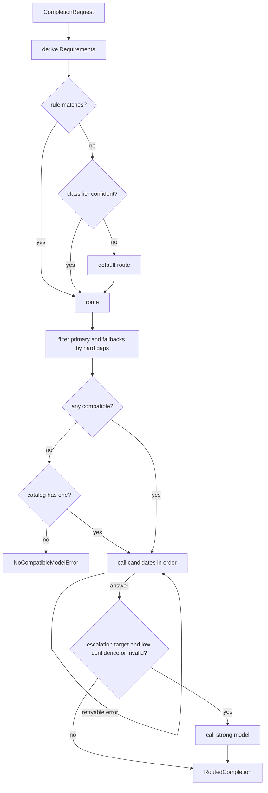
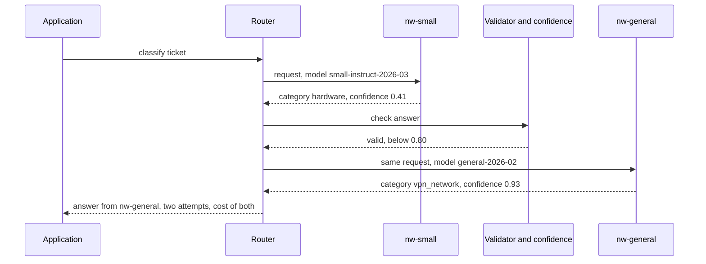
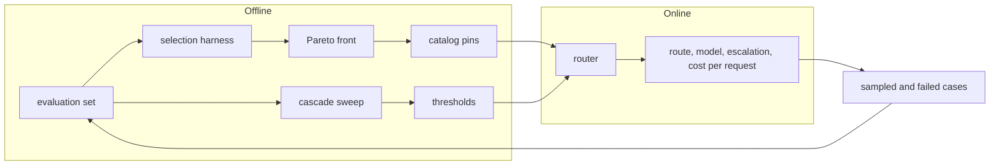

# Chapter 7 — Model Selection and Routing

After this chapter you will be able to choose a model for a workload from evidence rather than reputation, and build the component that makes that choice again for every request. You will record model capabilities in a catalog, run one evaluation set across candidates and read the results as a Pareto front, and build a `Router` that combines policy rules, an optional classifier, and a confidence cascade, and that refuses fallbacks which would quietly break a request. Finally you will evaluate a cascade end to end, pricing in what a misrouted request costs. The code in `book/projects/examples/ch07/` runs offline against `FakeLLM` instances acting as a small, a general, and a reasoning model on the Northwind ticket set.

## Why this matters

Model choice is often the largest lever on the cost and latency of an AI feature, and it is usually pulled once, early, by intuition. A team prototypes with the strongest model it can reach, the prototype works, and that model becomes the production default for every request: the password-reset question, the 400-page contract, the ticket that only needs a category. Months later the bill arrives, or the p95 latency target is missed, and nobody can say which requests needed the expensive model, because nothing measured it.

The opposite mistake is just as common and harder to see. A team reads that a small model is "nearly as good" on a public benchmark, switches, and watches the aggregate quality score barely move. Meanwhile the hardest tenth of traffic, the requests where a wrong answer creates a human escalation or a customer complaint, quietly gets worse. Averages hide that, and benchmarks measure someone else's distribution.

Three facts make selection an engineering problem. Workloads are mixed: Northwind Assist serves ticket classification (short input, high volume), cited policy answers, incident research (long context, tools), and occasional high-stakes refund exceptions, and no single model is the best trade-off for all four. Models differ in contracts, not only quality: window, tool calling, schema output, image input, and where inference may run. A request that needs a missing capability fails or, worse, succeeds wrongly. And models change underneath you, as providers update, rename, and retire them.

The answer is machinery most teams build eventually and usually too late: a catalog of what each model can do, a harness that measures candidates on your data, a router that decides per request, and an evaluation that treats the router as part of the system's quality. This chapter builds all four.

## Mental model

> **Mental model:** A model is a dependency with a contract. Choose it per request, from evidence, and treat the choice itself as code that can be wrong.

The contract part means you write down what each model guarantees (window, tools, schema mode, modalities, data zone) and check it before every call, the way you would check an API version. The evidence part is the book's eighth mental model applied directly: model quality alone does not determine application quality, so selection comes from a task-level evaluation, not a leaderboard. The last part is the one teams skip. A router is a classifier with a cost function. It makes errors, its errors have prices, and routing quality is a component of end-to-end quality. A cheap model that handles easy traffic well can still lose money overall if the router sends it the wrong requests.

## Core concepts

### The selection axes

Ten properties decide whether a model fits a workload. They split into two groups. Hard constraints remove candidates outright. Trade-off axes are measured and balanced.

| Axis | Kind | What to measure or check | What happens if you ignore it |
|---|---|---|---|
| Task capability | trade-off | pass rate on your evaluation set, with an interval | you ship on benchmark reputation |
| Reasoning depth | trade-off | pass rate on the hard slice, per effort setting | hard cases fail silently or easy ones overpay |
| Latency | trade-off | p50 and p95 end to end, time to first token for streaming | SLO misses that no prompt change can fix |
| Price | trade-off | cost per request and per correct answer, at your token mix | the bill scales with traffic, not with value |
| Context window | hard | prompt plus output tokens versus the window | truncation, rejected requests, or lost-in-the-middle at the edge |
| Structured-output quality | hard or soft | schema validity rate, native schema mode or not | repair loops, parse failures in production |
| Tool use | hard | tool calling supported, argument validity rate | tool-using prompts answered without tools |
| Multimodality | hard | image or audio input supported, perception accuracy | images silently dropped or misread |
| Reliability and availability | trade-off | error rate, rate-limit headroom, regional outages | a single provider incident takes the feature down |
| Data residency | hard | where inference runs, retention terms | regulated data leaves its permitted zone |

Two of these deserve a note. Price means cost per correct answer, not per token. A model that is cheaper per token but writes three times as many output tokens, or needs a repair round trip twice as often, can cost more per correct answer, which is the number that matters. And reliability is a property of the deployment, not the weights: the same model behind two providers, or self-hosted versus hosted, has different availability, rate limits, and latency tails.

### Model classes as workload shapes

Chapter 2 introduced the model classes. For selection, what matters is the workload each one fits.

A **small model** (often called an SLM, small language model) is the right default for narrow, stable, high-volume tasks: classification, extraction into a fixed schema, intent routing, guard checks. Small does not mean weak on every task. A compact model prompted or fine-tuned for one well-defined job often matches a general model on that job at a fraction of the cost and latency, and it can run on hardware you control, which matters for privacy. Its weakness is breadth: unusual inputs, multi-topic requests, and anything needing world knowledge it was not trained on.

A **general model** is the default when the shape of the task is not known in advance: open-ended questions, drafting, synthesis across sources.

A **reasoning model** spends extra inference compute on multi-step problems. It earns its cost on planning, multi-constraint decisions, mathematics, and hard debugging. It wastes it on classification and extraction, where the answer does not get better with more deliberation.

A **decision-style model** returns a typed decision (a class, a score, a probability) rather than prose. For routing, moderation, eligibility, and triage, a bounded output is cheaper, easier to validate, and can be calibrated. Do not use a text generator when the product contract is a decision.

A recurring selection question is whether a small model with retrieval beats a reasoning model. It does when the hard part of the task is knowledge access rather than reasoning: the task is bounded, the answer is in your documents, latency and cost matter, and your evaluation shows the small model is sufficient once it has the evidence. Reasoning effort cannot compensate for missing facts, and retrieval cannot compensate for a problem that genuinely needs several dependent inference steps.

Newer classes keep arriving. Recursive approaches let a model query a huge input piece by piece instead of loading it whole, separating the available corpus from the active context. Diffusion-style models refine many positions in parallel, which changes the latency profile. Keep the router open to new classes, but admit one only after it passes the same evaluation as everything else, and record the evidence level of every claim: a vendor report, a preprint, and an independent evaluation on a workload like yours are three different things.

### Reasoning effort as a knob

Many models now expose a reasoning budget: an effort level, a thinking-token limit, or a separate reasoning mode. This turns inference compute into a per-request parameter. The same model asked to think longer gets better on hard multi-step problems and worse on latency and cost, often by large factors, because the extra deliberation is billed and generated serially as output tokens.

Treat effort as a route attribute, not a global setting. The Northwind high-assurance route uses high effort for refund exceptions; the general route uses none; a classifier-selected reasoning route uses medium. Three rules keep the knob honest. Evaluate the outcome, not the length of the reasoning: long chains can be confidently wrong, and visible deliberation is not evidence of correctness. Cap the budget: an effort setting without a token ceiling is an unbounded cost on adversarial or degenerate inputs. And measure each effort level as a separate candidate in the selection harness, because "the reasoning model" at low and high effort are two points on the Pareto front (defined below), not one.

The `aie_core` request type has no effort field, because providers expose it differently. The router passes `reasoning_effort` in `req.metadata`, and only to models whose catalog profile lists the requested level; adapters that support the knob read it from there. A request that asks for an effort level the model does not offer, including a model with no knob at all, gets a soft warning instead of a silent drop.

### Multimodal inputs

Images, scans, and audio enter the model as extra tokens produced by a modality-specific encoder, so they consume context, cost, and latency like text. Selection for multimodal work has three parts beyond "does it accept images."

First, preprocess before you pay. Resize, crop to the region of interest, sample video frames, or run OCR or object detection first when that reduces cost without losing evidence. A photographed invoice often goes through OCR and a text model more cheaply and accurately than through a vision model; the selection harness can tell you which. Second, preserve provenance: keep a reference to the exact image, page, frame, or region so the answer can point at it. Third, evaluate perception and reasoning separately. An answer can be wrong because OCR misread a digit, because the model grounded on the wrong region, or because it reasoned badly from correct features, and one end-to-end score cannot tell these apart.

Multimodal inputs also widen the attack surface: text hidden in images, adversarial perturbations, manipulated metadata, and instructions embedded in a screenshot or a QR code (Chapter 26). For the router, an image part in the request is a hard requirement: the request goes only to models whose profile has `supports_vision`, and a text-only fallback is never acceptable, because it would answer without seeing the input.

### Evaluation-driven selection

The selection procedure is the same whether you are choosing a first model or deciding whether to switch.

1. **Write the task contract.** Inputs, outputs, the metric that defines correct, and the cost of each kind of error. For ticket classification: exact category match, and a wrong category costs a re-triage.
2. **Build the evaluation set from your workload.** Real or realistic requests, with the hard and rare slices represented. Sixty tickets is enough to start and too few to separate close candidates, as the intervals below show (Chapter 24 covers sample size).
3. **Fix the constraints.** Latency SLO, cost ceiling, data zone, required capabilities. These come from the product, not from the candidates.
4. **Filter candidates by hard constraints.** A model that cannot run in the required zone or lacks a required capability is not a candidate, however good its scores.
5. **Run every candidate on the same set in the configuration you will ship:** same prompt, same parameters, same effort setting. Record quality, latency percentiles, cost, and failures per case.
6. **Read the Pareto front.** The Pareto front is the set of candidates you cannot improve on one axis without losing on another. Discard the rest, the dominated candidates: anything another candidate beats or matches on quality, cost, and latency at once.
7. **Choose the cheapest candidate that meets the quality floor on the lower bound of its interval**, not on its point estimate, and within the latency ceiling.
8. **Compare close candidates with paired counts.** On the same cases, how many does A get right that B gets wrong, and the reverse? Two models with similar averages can fail on entirely different cases, which is exactly the situation where routing pays.
9. **Record the decision** (set version, prompt version, model versions, results) and re-run it on every model, prompt, or traffic change.

Here is the harness's output on the Northwind ticket set, with illustrative prices and latencies:

| candidate | quality (95% CI) | p50 ms | p95 ms | $/request | $/correct | errors | Pareto |
|---|---|---|---|---|---|---|---|
| nw-reasoning | 0.950 (0.86-0.98) | 6500 | 6500 | 0.000928 | 0.000977 | 0.0% | yes |
| nw-general | 0.933 (0.84-0.97) | 1800 | 1800 | 0.000186 | 0.000199 | 0.0% | yes |
| nw-small | 0.800 (0.68-0.88) | 250 | 250 | 0.000019 | 0.000023 | 0.0% | yes |

The 95% interval is a Wilson score interval on the pass rate; it stays honest at small sample sizes and near 0 or 1, where the textbook normal approximation does not (Chapter 24 covers intervals and paired tests in depth). The fakes report fixed latencies, so p50 equals p95 here; a real bake-off shows a gap between them, and the gap is often what disqualifies a candidate.

All three are on the front: each is the best at something. The intervals overlap heavily between the reasoning and general models, so sixty cases cannot say the reasoning model is better at classification; they can say it costs five times as much and takes more than three and a half times as long. With a quality floor of 0.80 on the lower bound and a p95 ceiling of 3 seconds, the procedure picks `nw-general`: the small model's point estimate meets the floor but its lower bound (0.68) does not.

The harness also prints paired counts: the small model gets two tickets right that the general model misses, and the general model gets ten right that the small one misses. Neither model's correct set contains the other's, and most of the small model's errors are concentrated in a recognizable slice: multi-topic tickets whose obvious keywords point the wrong way. That is the signature of a workload where a cascade (cheap model first, escalate when unsure; see Routing strategies) might beat both single-model options. Whether it does depends on what an error costs, which is the subject of the cascade evaluation below.

### Routing strategies

Routing chooses the model, provider, or pipeline for each request. The strategies form a ladder of increasing power and decreasing explainability.

**Static mapping by use case.** Each endpoint or task type has a model, chosen by the procedure above. This is where every system should start, and many never need more. It is trivially explainable and testable.

**Rules.** Deterministic predicates over request features that code already knows: task type, tenant, data zone, risk flag, prompt size, presence of tools or images, customer tier. Rules encode policy (restricted data stays on-premises) and obvious economics (classification goes to the small model). They are cheap, fast, and auditable. Put policy rules before cost rules, so a cost optimization can never override a compliance requirement.

**Classifiers.** A small model predicts difficulty, domain, or route from the request text. This handles traffic that rules cannot separate, such as general questions that are sometimes easy and sometimes need reasoning. A classifier must abstain: when its confidence is low, the request takes the default route rather than a guess.

**Embedding similarity.** Embed labeled example requests per route, compute a centroid per route, and send each request to the nearest centroid, with the margin over the runner-up as confidence. It needs a few dozen examples instead of a trained model, and requests between two centroids visibly report low margin. Chapter 8 covers the embedding side; the router implements it as `EmbeddingRouteClassifier`.

**Model-as-router.** A language model reads the request and picks a route. It handles nuance, but adds a full model call to every request and is the easiest router to manipulate through the request text. Use it only when cheaper strategies have measurably failed, and map its output to an enumerated route in code.

**Confidence cascades.** Instead of predicting difficulty up front, run the cheap model first and escalate when its answer looks unreliable: low confidence, a failed validator, or an output outside the allowed set. A cascade learns difficulty from the attempt itself, which is often more accurate than predicting it from the input, at the cost of paying for the cheap call on every escalated request and adding its latency to the escalated path.

Real routers combine these. The Northwind router evaluates rules first, then an optional classifier, then a default route, and any route can carry an escalation target that turns it into a cascade.

### Confidence signals and calibration

A cascade is only as good as the signal that decides escalation. The candidates, from cheapest to most expensive:

- **Self-reported confidence.** A confidence field in the output. Free, and often miscalibrated.
- **Token log-probabilities.** Where exposed, the probability of the chosen label token is better founded than a self-report.
- **Validators.** Deterministic checks: the output parses, the label is in the allowed set, the extracted total equals the sum of line items. A validator failure is the most reliable trigger there is, because it is not a guess.
- **Agreement.** Sample the cheap model twice, or ask two cheap models, and escalate on disagreement. It doubles the cheap cost and misses consistently wrong answers.
- **A learned verifier.** A small model trained to predict whether an answer is correct. The most accurate and the most work to maintain.

Whatever the signal, measure its calibration on your distribution: bin the cases by confidence and compare each bin's mean confidence to its accuracy. The expected calibration error (ECE) is the weighted average gap. On the Northwind set, the small model's self-reported confidence has these bins (illustrative):

| confidence bin | cases | mean confidence | accuracy |
|---|---|---|---|
| 0.2-0.4 | 1 | 0.20 | 0.00 |
| 0.4-0.6 | 7 | 0.52 | 0.71 |
| 0.6-0.8 | 15 | 0.76 | 0.73 |
| 0.8-1.0 | 37 | 0.96 | 0.86 |

ECE is about 0.09. The signal is informative (higher bins are more accurate) but overconfident at the top. The top bin holds five wrong answers, four of them at 0.97, the highest confidence the model ever reports. No threshold short of escalating everything will catch those four, and one of them is wrong on the large model too. Those confident errors are the number to watch in cascade design: escalation can only fix errors the signal can see. Confident mistakes pass straight through, and their price decides whether the cascade is worth building.

### Routing error cost

A router makes two kinds of mistakes. A **false accept** (false "easy") lets a cheap model's wrong answer through. It costs quality, often silently, or a retry if something downstream catches it. A **false escalation** (false "hard") sends a request the cheap model had answered correctly to the expensive model anyway. It costs money and latency, never quality. Router accuracy, the share of requests where the escalate-or-not decision was right, counts these two equally. Their prices are nothing alike: at the illustrative Northwind prices a false escalation costs about $0.00017 extra, while a silent wrong answer can cost a re-triage worth hundreds of times that.

The correct objective is end-to-end utility per request, in one currency:

```text
# pseudocode
utility = value of correct answers
        - cost of silent errors (false accepts nobody catches)
        - cost of caught errors (rework plus the re-run on the strong model)
        - model spend on every stage that ran
        - cost of latency, if waiting has a price
```

False accepts land in the two error terms; a false escalation shows up only as extra model spend and latency. The misroute cost belongs in this sum even when the cheap answer is eventually fixed. A cheap model that fails, is caught by a validator downstream, and triggers a retry on the strong model costs both calls plus the rework, which can exceed calling the strong model once. That is the warning attached to every routing recipe: evaluate misroutes, not just routes.

The cascade sweep on the ticket set makes this concrete. Running each model once and simulating every threshold offline gives, for three illustrative prices of a silent error (the value of a correct answer and the caught share stay fixed):

| cost of a silent error | best policy by utility | accuracy | $/request | escalated |
|---|---|---|---|---|
| 0.0002 | always small | 0.800 | 0.000019 | 0% |
| 0.001 | cascade, threshold 0.78 | 0.883 | 0.000066 | 25% |
| 0.05 | always large | 0.933 | 0.000186 | 100% |

Three prices, three different winners. When errors are nearly free, the cheap model's savings dominate. In a middle band, the cascade beats both single models. When errors are expensive, the small model's confident mistakes cost more than every escalation saves, and calling the large model directly wins: the best cascade escalates everything, which makes it the large model plus a wasted small call on every request. Meanwhile the threshold that maximizes router accuracy is the same, about 0.53, in all three regimes, because router accuracy ignores prices.

### Fallbacks that change assumptions

A fallback is a second model used when the first is unavailable or unfit. The gateway in Chapter 3 already falls back on retryable errors. What the gateway cannot know is whether the fallback can actually serve this request. Fallbacks change assumptions in ways that break requests:

- **Context length.** The primary has a 200k-token window and the fallback 32k (illustrative sizes). Falling back either fails with a context error or, if some layer truncates to fit, answers from a prompt that lost its evidence.
- **Tool support.** A tool-using request sent to a model without tool calling gets a confident prose answer that never looked anything up.
- **Structured output.** The fallback lacks a native schema mode. The request can still work through prompt-and-parse with validation and repair (Chapter 6), but its malformed-output rate changes.
- **Data residency.** The only model allowed for restricted data is on-premises. Falling back to a cloud model during an outage is a compliance incident, not a reliability feature.
- **Reasoning effort, tokenizer, and prompt format.** The fallback has no effort knob, counts tokens differently, or follows the system prompt differently. A prompt tuned for one model family can underperform on another (Chapter 4).

The router therefore classifies every gap as hard or soft. Hard gaps (context, output length, tools, vision, data zone) remove a model from the candidate list. Soft gaps (no native schema mode, unsupported effort level) keep it but attach a warning to the decision, so a dashboard can show how often requests ran under changed assumptions.

Two fallbacks remain when the plan fails. When every planned model has a hard gap, the router looks across the catalog, among models that have a registered client, for the cheapest compatible one and records the substitution. A model whose data zone is `any` makes no residency promise, so it never satisfies a request that requires a specific zone, and the substitution can never pick it for an on-prem request. When nothing is compatible, it raises `NoCompatibleModelError` instead of sending the request somewhere it cannot succeed. The caller can then shrink the context, drop the tools, or tell the user, all better than a wrong answer.

### Vendor neutrality and model pinning

Every model reference in application code should be an alias owned by the catalog (`nw-small`, `nw-general`), never a provider's model name. The catalog resolves each alias to a pinned, versioned identifier. Swapping a provider or version becomes a one-line, reviewed catalog change. A provider updating a floating name cannot change your behavior without a deploy. And every trace records the exact version that served the request, so a regression can be tied to a version change.

Repointing an alias is a release: run the selection harness on the new version, compare per-category deltas, canary it (serve it to a small share of traffic first), and keep the old pin for rollback (Chapter 32). Provider-neutral `aie_core` types keep the router independent of any vendor SDK. Track deprecation dates for every pin, because a retired pin becomes an outage on a date you were told about months earlier.

A migration off a retired or superseded pin follows a fixed procedure, and it starts weeks before the retirement date:

1. **Add the new version as a separate alias** (`nw-general-next`) in the catalog, with its own profile. Capabilities change between versions too: a new version can have a different window, output limit, or schema support, and the router's capability check only protects you if the profile is accurate.
2. **Run the selection harness** with both pins on the current evaluation set, in the shipped configuration. Read per-slice deltas and paired counts, not only the overall score, and re-run the cascade sweep if the alias is a cascade stage: a new version's confidence distribution can move every threshold.
3. **Port the prompt deliberately.** Prompts tuned on one version can regress on its successor, so every prompt that the alias serves runs its regression suite against the new pin before anything ships (Chapter 4). If the new version needs a retuned prompt, evaluate the pair offline, then roll the changes out one at a time where possible, so a regression can be attributed to the prompt or the model rather than to both.
4. **Shadow, then canary.** Send a sample of live traffic to the new alias without serving its answers, compare format-error rate, latency, and judged quality, then serve a small share and watch the route's telemetry.
5. **Repoint the alias, keep the old pin** until the retirement date, so rollback is a catalog change rather than an emergency.

Error mapping matters on retirement day. A provider usually rejects a retired model with a "model not found" class of error, which `aie_core` maps to a non-retryable `InvalidRequestError`: the route fails loudly and an alert fires. That is the correct behavior, because a missing model will not come back on retry. Any layer that turns it into a retryable error, such as an internal proxy that answers 503 for every upstream failure, converts the outage into a silent fallback on every request, which shows up only as a cost increase.

## How it works

Follow one Northwind request through the router.

1. **Requirements are derived from the request, not declared by the caller.** `Requirements.from_request` counts prompt tokens plus `max_tokens`, and detects tools, a response schema, and image parts; data zone and effort come from metadata. A caller cannot forget to declare that its prompt is 150k tokens.
2. **A route is selected.** Rules run in order: restricted data, high risk, long context, narrow task. If none matches and a classifier is configured, the classifier predicts a route; a prediction below its confidence floor falls through to the default route. The decision records which stage chose the route.
3. **The route becomes a candidate list.** The primary model and its fallbacks are checked against the requirements. Models with hard gaps are skipped, each with a recorded reason. If none survive, the cheapest compatible model in the catalog that has a client is substituted; if there is none, the request fails with `NoCompatibleModelError`. Soft gaps become warnings. The escalation target, if any, is checked too and disabled if incompatible.
4. **Candidates are called in order.** Each call goes through that alias's client, which in production is a `ModelGateway` with its own retries. The router sets `req.model` to the pinned identifier and passes the effort level where supported. A retryable error moves to the next candidate; a non-retryable one is raised, because a bad request will fail on every model.
5. **The answer is checked for escalation.** If the route has an escalation target that did not already serve the request, the validator runs first and the confidence function second. A failed validator or low confidence triggers one call to the stronger model. If that call fails, or the escalation target was disabled because it cannot serve this request, the router returns the cheap answer marked `degraded`, so the caller knows it is below the route's quality bar.
6. **Everything is recorded.** The result carries the decision, every attempt with its outcome, latency, cost, and confidence, and the model that finally served. The router also compares the model the completion reports with the pin it planned for; a difference means something below the router, usually a gateway with its own fallback list, served the request from a model the capability check never saw. A tracing span carries the route, stage, serving alias and the model id the completion reported, attempts, warnings, escalation, degradation, mismatch, and cost as attributes.

## Architecture

The router's decision and execution path, with the hard capability check between selection and execution:



The cascade on one ticket, showing why escalated requests pay for both stages in money and latency:



Selection and routing are two halves of one loop. Offline evaluation sets the catalog and the thresholds; production telemetry feeds new cases back into the evaluation set:



## Implementation

```text
book/projects/examples/ch07/
├── catalog.py        ModelProfile, Requirements, capability gaps, ModelCatalog
├── catalog.json      the illustrative Northwind catalog as data
├── tasks.py          ticket-classification cases, label schema, scorer, confidence reader
├── fakes.py          make_small_model and make_large_model: FakeLLM handlers
├── selection.py      run_selection, Wilson intervals, percentiles, Pareto front, choose
├── router.py         Router, Route, Rule, EmbeddingRouteClassifier, Northwind routes and rules
├── cascade_eval.py   collect_outcomes, simulate, sweep, utility, calibration
├── config.py         RouterSettings from environment variables
├── demo.py           selection table, cascade sweeps, routing decisions
├── test_ch07.py      offline tests
├── pyproject.toml
├── .env.example
└── README.md
```

Install and run from the repository root:

```bash
uv pip install --python .venv/bin/python -e book/projects/aie_core   # or: pip install -e book/projects/aie_core
.venv/bin/python -m pytest book/projects/examples/ch07 -q
cd book/projects/examples/ch07 && ../../../../.venv/bin/python demo.py
```

| Variable | Default | Meaning |
|---|---|---|
| `MODEL_CATALOG_PATH` | unset | JSON catalog; the built-in illustrative catalog when unset |
| `ROUTER_MIN_CONFIDENCE` | `0.8` | escalate below this confidence on cascade routes |
| `ROUTER_LONG_CONTEXT_TOKENS` | `100000` | prompt plus output size that selects the long-context route |
| `ROUTER_CLASSIFIER_MIN_CONFIDENCE` | `0.5` | below this, the classifier abstains |
| `LLM_PROVIDER`, `LLM_MODEL`, API keys | see `aie_core` | used when fakes are replaced by real clients |

### The catalog

The catalog holds one `ModelProfile` per alias and derives a request's `Requirements`. Read `capability_gaps` first: it is the single definition of compatible.

```python
# path: book/projects/examples/ch07/catalog.py
"""Model catalog: what each candidate model can do, what it costs, and where it may run.

Every number in a catalog is illustrative. The catalog is the one place where a model's
capabilities are written down, so the router can check them before it sends a request
and the selection harness can label its results. Profiles are pinned: application code
refers to an alias such as ``nw-small`` and the catalog resolves it to an exact,
versioned model identifier. Changing what an alias points to is a reviewed catalog
change, never a side effect of a provider silently updating a floating name.
"""
from __future__ import annotations

import json
from enum import IntEnum
from pathlib import Path
from typing import Any, Iterable

from pydantic import BaseModel, Field, model_validator

from aie_core import CompletionRequest, count_message_tokens


class Tier(IntEnum):
    """Relative tiers. Lower is cheaper or faster. Only the ordering is meaningful."""

    LOW = 1
    MEDIUM = 2
    HIGH = 3
    VERY_HIGH = 4


class ModelProfile(BaseModel):
    alias: str                                   # what application code and routes use
    model_id: str                                # pinned, versioned identifier sent to the provider
    provider: str                                # key into the client registry
    context_tokens: int                          # total window: prompt plus output
    max_output_tokens: int
    supports_tools: bool = False
    supports_json_schema: bool = False           # native schema-constrained output
    supports_vision: bool = False
    reasoning_efforts: tuple[str, ...] = ()      # e.g. ("low", "medium", "high"); empty = no knob
    data_zones: tuple[str, ...] = ("any",)       # where inference runs, e.g. ("eu",); "any" = no residency guarantee
    cost_tier: Tier = Tier.MEDIUM
    latency_tier: Tier = Tier.MEDIUM
    input_per_1m: float = 0.0                    # illustrative USD per million input tokens
    output_per_1m: float = 0.0                   # illustrative USD per million output tokens
    notes: str = ""

    @model_validator(mode="after")
    def _check(self) -> "ModelProfile":
        if self.max_output_tokens > self.context_tokens:
            raise ValueError(f"{self.alias}: max_output_tokens exceeds context_tokens")
        return self

    def pricing_entry(self) -> dict[str, float]:
        return {"input_per_1m": self.input_per_1m, "output_per_1m": self.output_per_1m}


class Requirements(BaseModel):
    """What a request needs from whichever model serves it."""

    min_context_tokens: int = 0
    min_output_tokens: int = 0
    needs_tools: bool = False
    needs_json_schema: bool = False
    needs_vision: bool = False
    data_zone: str | None = None
    reasoning_effort: str | None = None

    @classmethod
    def from_request(cls, req: CompletionRequest) -> "Requirements":
        """Derive requirements from the request itself, so callers cannot forget them."""
        has_image = any(
            not isinstance(m.content, str) and any(p.type == "image_url" for p in m.content)
            for m in req.messages
        )
        prompt_tokens = count_message_tokens(req.messages, req.model)
        return cls(
            min_context_tokens=prompt_tokens + req.max_tokens,
            min_output_tokens=req.max_tokens,
            needs_tools=bool(req.tools) and req.tool_choice != "none",
            needs_json_schema=req.response_schema is not None,
            needs_vision=has_image,
            data_zone=req.metadata.get("data_zone"),
            reasoning_effort=req.metadata.get("reasoning_effort"),
        )


class Gap(BaseModel):
    """One way a profile fails a requirement. Hard gaps disqualify; soft gaps degrade."""

    capability: str
    detail: str
    hard: bool = True


def capability_gaps(profile: ModelProfile, need: Requirements) -> list[Gap]:
    gaps: list[Gap] = []
    if need.min_context_tokens > profile.context_tokens:
        gaps.append(Gap(capability="context",
                        detail=f"needs {need.min_context_tokens} tokens, window is {profile.context_tokens}"))
    if need.min_output_tokens > profile.max_output_tokens:
        gaps.append(Gap(capability="output",
                        detail=f"needs {need.min_output_tokens} output tokens, max is {profile.max_output_tokens}"))
    if need.needs_tools and not profile.supports_tools:
        gaps.append(Gap(capability="tools", detail="request carries tools; model has no tool calling"))
    if need.needs_vision and not profile.supports_vision:
        gaps.append(Gap(capability="vision", detail="request carries images; model is text-only"))
    if need.data_zone and need.data_zone not in profile.data_zones:  # "any" never satisfies an explicit zone
        gaps.append(Gap(capability="data_zone",
                        detail=f"request must stay in {need.data_zone}; model runs in {list(profile.data_zones)}"))
    if need.needs_json_schema and not profile.supports_json_schema:
        # Soft: structured output can fall back to prompt-and-parse with validation and repair
        # (Chapter 6). The request still works, but its failure rate changes, so it is flagged.
        gaps.append(Gap(capability="json_schema", hard=False,
                        detail="no native schema mode; falls back to prompt+parse with repair"))
    if need.reasoning_effort and need.reasoning_effort not in profile.reasoning_efforts:
        gaps.append(Gap(capability="reasoning_effort", hard=False,
                        detail=f"effort {need.reasoning_effort!r} unsupported; model offers {list(profile.reasoning_efforts)}"))
    return gaps


def is_compatible(profile: ModelProfile, need: Requirements) -> bool:
    return not any(g.hard for g in capability_gaps(profile, need))


class ModelCatalog(BaseModel):
    profiles: dict[str, ModelProfile] = Field(default_factory=dict)

    @classmethod
    def from_profiles(cls, profiles: Iterable[ModelProfile]) -> "ModelCatalog":
        catalog = cls()
        for p in profiles:
            catalog.add(p)
        return catalog

    @classmethod
    def from_json(cls, path: str | Path) -> "ModelCatalog":
        data: dict[str, Any] = json.loads(Path(path).read_text(encoding="utf-8"))
        return cls.from_profiles(ModelProfile.model_validate(p) for p in data["models"])

    def add(self, profile: ModelProfile) -> None:
        if profile.alias in self.profiles:
            raise ValueError(f"duplicate alias {profile.alias!r}")
        self.profiles[profile.alias] = profile

    def get(self, alias: str) -> ModelProfile:
        try:
            return self.profiles[alias]
        except KeyError:
            raise KeyError(f"unknown model alias {alias!r}; known: {sorted(self.profiles)}") from None

    def compatible(self, need: Requirements, among: Iterable[str] | None = None) -> list[ModelProfile]:
        """Compatible profiles, cheapest first, then fastest. Stable for equal tiers."""
        names = list(among) if among is not None else list(self.profiles)
        found = [self.get(n) for n in names if is_compatible(self.get(n), need)]
        return sorted(found, key=lambda p: (p.cost_tier, p.latency_tier))

    def pricing(self) -> dict[str, dict[str, float]]:
        """Prices keyed by pinned model id, in the shape aie_core.PricingTable expects."""
        return {p.model_id: p.pricing_entry() for p in self.profiles.values()}


def northwind_catalog() -> ModelCatalog:
    """The illustrative catalog used throughout Chapter 7. Names are invented; tiers and
    prices are made up to have realistic ratios, not to describe any vendor."""
    return ModelCatalog.from_profiles([
        ModelProfile(alias="nw-small", model_id="small-instruct-2026-03", provider="local",
                     context_tokens=32_000, max_output_tokens=4_000, supports_json_schema=True,
                     data_zones=("onprem",), cost_tier=Tier.LOW, latency_tier=Tier.LOW,
                     input_per_1m=0.10, output_per_1m=0.40,
                     notes="self-hosted; stays inside Northwind's network"),
        ModelProfile(alias="nw-general", model_id="general-2026-02", provider="cloud-a",
                     context_tokens=128_000, max_output_tokens=8_000, supports_tools=True,
                     supports_json_schema=True, supports_vision=True, data_zones=("eu",),
                     cost_tier=Tier.MEDIUM, latency_tier=Tier.MEDIUM,
                     input_per_1m=1.00, output_per_1m=4.00),
        ModelProfile(alias="nw-reasoning", model_id="reasoner-2026-01", provider="cloud-a",
                     context_tokens=200_000, max_output_tokens=32_000, supports_tools=True,
                     supports_json_schema=True, reasoning_efforts=("low", "medium", "high"),
                     data_zones=("eu",), cost_tier=Tier.HIGH, latency_tier=Tier.VERY_HIGH,
                     input_per_1m=5.00, output_per_1m=20.00),
        ModelProfile(alias="nw-longctx", model_id="longctx-2025-12", provider="cloud-b",
                     context_tokens=1_000_000, max_output_tokens=8_000, supports_tools=False,
                     supports_json_schema=False, data_zones=("any",),
                     cost_tier=Tier.HIGH, latency_tier=Tier.HIGH,
                     input_per_1m=2.50, output_per_1m=10.00,
                     notes="large window, no tools, no native schema mode"),
    ])


__all__ = [
    "Tier", "ModelProfile", "Requirements", "Gap", "capability_gaps", "is_compatible",
    "ModelCatalog", "northwind_catalog",
]
```

### The selection harness

The harness runs every candidate on the same cases, scores each answer, and summarizes quality with a Wilson interval, latency percentiles, and cost. Look for how failures become scored zeros instead of crashes, and for the Pareto and paired-count helpers.

```python
# path: book/projects/examples/ch07/selection.py
"""Evaluation-driven model selection.

Run one evaluation set across several candidate clients, record quality, latency, cost and
failures per candidate, and compute the Pareto front over (quality up, cost down, p95
latency down). The harness calls candidates through the LLMClient protocol, so the same code
runs against FakeLLM in tests and against ModelGateway-wrapped providers in a real bake-off.
"""
from __future__ import annotations

import math
import time
from collections.abc import Callable, Mapping, Sequence

from pydantic import BaseModel, Field

from aie_core import Completion, LLMClient, LLMError, PricingTable

from tasks import EvalCase

Scorer = Callable[[EvalCase, Completion], float]


class CaseResult(BaseModel):
    case_id: str
    candidate: str
    score: float                       # 0..1; 0 for errors
    latency_ms: float
    cost_usd: float
    input_tokens: int = 0
    output_tokens: int = 0
    error: str | None = None
    output: str = ""


class CandidateSummary(BaseModel):
    candidate: str
    n: int
    quality: float
    quality_low: float                 # Wilson 95% interval on the pass rate
    quality_high: float
    p50_latency_ms: float
    p95_latency_ms: float
    cost_per_request_usd: float
    cost_per_correct_usd: float
    error_rate: float
    pareto: bool = False


class SelectionReport(BaseModel):
    summaries: list[CandidateSummary]
    results: list[CaseResult] = Field(default_factory=list)

    def by_name(self, name: str) -> CandidateSummary:
        return next(s for s in self.summaries if s.candidate == name)

    def to_markdown(self) -> str:
        head = ("| candidate | quality (95% CI) | p50 ms | p95 ms | $/request | $/correct | errors | Pareto |\n"
                "|---|---|---|---|---|---|---|---|")
        rows = [
            f"| {s.candidate} | {s.quality:.3f} ({s.quality_low:.2f}-{s.quality_high:.2f}) | "
            f"{s.p50_latency_ms:.0f} | {s.p95_latency_ms:.0f} | {s.cost_per_request_usd:.6f} | "
            f"{s.cost_per_correct_usd:.6f} | {s.error_rate:.1%} | {'yes' if s.pareto else ''} |"
            for s in self.summaries
        ]
        return "\n".join([head, *rows])


def wilson_interval(successes: float, n: int, z: float = 1.96) -> tuple[float, float]:
    """Wilson score interval: honest at small n and near 0 or 1, unlike the normal approximation."""
    if n == 0:
        return 0.0, 1.0
    p = successes / n
    denom = 1 + z * z / n
    centre = (p + z * z / (2 * n)) / denom
    half = z * math.sqrt(p * (1 - p) / n + z * z / (4 * n * n)) / denom
    return max(0.0, centre - half), min(1.0, centre + half)


def percentile(values: Sequence[float], q: float) -> float:
    """Nearest-rank percentile; q in [0, 100]."""
    if not values:
        return 0.0
    ordered = sorted(values)
    rank = max(1, math.ceil(q / 100 * len(ordered)))
    return ordered[rank - 1]


def run_case(name: str, client: LLMClient, case: EvalCase, scorer: Scorer,
             pricing: PricingTable, model: str | None = None) -> CaseResult:
    req = case.request.model_copy(update={"model": model}) if model else case.request
    started = time.perf_counter()
    try:
        completion = client.complete(req)
    except LLMError as exc:  # a failed call is a scored outcome, not a crash of the harness
        return CaseResult(case_id=case.id, candidate=name, score=0.0,
                          latency_ms=(time.perf_counter() - started) * 1000,
                          cost_usd=0.0, error=type(exc).__name__)
    wall_ms = (time.perf_counter() - started) * 1000
    # Providers report server-side latency; fakes report a scripted one. Prefer the reported
    # figure when present so fakes are deterministic; real runs should also log wall time.
    latency = completion.latency_ms or wall_ms
    return CaseResult(
        case_id=case.id, candidate=name, score=scorer(case, completion), latency_ms=latency,
        cost_usd=pricing.cost_usd(completion.model, completion.usage),
        input_tokens=completion.usage.input_tokens, output_tokens=completion.usage.output_tokens,
        output=completion.text[:500],
    )


def summarize(name: str, results: Sequence[CaseResult]) -> CandidateSummary:
    n = len(results)
    correct = sum(r.score for r in results)
    lo, hi = wilson_interval(correct, n)
    latencies = [r.latency_ms for r in results]
    total_cost = sum(r.cost_usd for r in results)
    return CandidateSummary(
        candidate=name, n=n, quality=correct / n if n else 0.0, quality_low=lo, quality_high=hi,
        p50_latency_ms=percentile(latencies, 50), p95_latency_ms=percentile(latencies, 95),
        cost_per_request_usd=total_cost / n if n else 0.0,
        cost_per_correct_usd=total_cost / correct if correct else math.inf,
        error_rate=sum(1 for r in results if r.error) / n if n else 0.0,
    )


def dominates(a: CandidateSummary, b: CandidateSummary) -> bool:
    """a dominates b if it is no worse on every axis and strictly better on at least one."""
    no_worse = (a.quality >= b.quality and a.cost_per_request_usd <= b.cost_per_request_usd
                and a.p95_latency_ms <= b.p95_latency_ms)
    better = (a.quality > b.quality or a.cost_per_request_usd < b.cost_per_request_usd
              or a.p95_latency_ms < b.p95_latency_ms)
    return no_worse and better


def pareto_front(summaries: Sequence[CandidateSummary]) -> list[CandidateSummary]:
    return [s for s in summaries if not any(dominates(o, s) for o in summaries if o is not s)]


def run_selection(candidates: Mapping[str, LLMClient], cases: Sequence[EvalCase], scorer: Scorer,
                  pricing: PricingTable, models: Mapping[str, str] | None = None) -> SelectionReport:
    """Evaluate every candidate on every case. `models` optionally maps candidate name to the
    pinned model id to request, for clients that serve several models."""
    results: list[CaseResult] = []
    summaries: list[CandidateSummary] = []
    for name, client in candidates.items():
        rs = [run_case(name, client, c, scorer, pricing, (models or {}).get(name)) for c in cases]
        results.extend(rs)
        summaries.append(summarize(name, rs))
    front = {s.candidate for s in pareto_front(summaries)}
    for s in summaries:
        s.pareto = s.candidate in front
    summaries.sort(key=lambda s: (-s.quality, s.cost_per_request_usd))
    return SelectionReport(summaries=summaries, results=results)


def choose(report: SelectionReport, *, min_quality: float, max_p95_ms: float,
           use_lower_bound: bool = True) -> CandidateSummary | None:
    """Cheapest candidate meeting the quality floor and latency ceiling. With use_lower_bound
    the floor applies to the lower end of the confidence interval, which refuses to pick a
    model on luck when the evaluation set is small."""
    ok = [s for s in report.summaries
          if (s.quality_low if use_lower_bound else s.quality) >= min_quality and s.p95_latency_ms <= max_p95_ms]
    return min(ok, key=lambda s: (s.cost_per_request_usd, s.p95_latency_ms), default=None)


def paired_disagreements(report: SelectionReport, a: str, b: str) -> tuple[int, int]:
    """(cases a got right and b got wrong, cases b got right and a got wrong). Paired counts
    are what a McNemar-style comparison of two candidates on the same set is built on."""
    sa = {r.case_id: r.score for r in report.results if r.candidate == a}
    sb = {r.case_id: r.score for r in report.results if r.candidate == b}
    a_only = sum(1 for k in sa if sa[k] >= 0.5 > sb.get(k, 0.0))
    b_only = sum(1 for k in sb if sb[k] >= 0.5 > sa.get(k, 0.0))
    return a_only, b_only


__all__ = [
    "Scorer", "CaseResult", "CandidateSummary", "SelectionReport", "wilson_interval", "percentile",
    "run_case", "summarize", "dominates", "pareto_front", "run_selection", "choose",
    "paired_disagreements",
]
```

### The router

`route` does selection then capability filtering; `complete` executes the candidates; `_needs_escalation` is the cascade.

```python
# path: book/projects/examples/ch07/router.py
"""A capability-aware model router with rules, an optional classifier, and a confidence cascade.

Decision order for every request:
  1. Derive Requirements from the request (context size, tools, schema, images, data zone).
  2. Pick a route: the first matching rule, else a classifier prediction above its confidence
     floor, else the default route.
  3. Turn the route into an ordered candidate list (primary, then fallbacks) keeping only models
     with no hard capability gap. If none remain, substitute the cheapest compatible model in
     the catalog and say so; if the catalog has none, fail loudly.
  4. Execute: call candidates in order, moving on only for retryable errors. If the route has an
     escalation target and the answer is low-confidence or invalid, call the stronger model.

Retries against one model belong to aie_core's ModelGateway (Chapter 3); wrap each client in a
gateway. The router owns the decisions a gateway cannot make: which model, and which fallbacks
are safe given what this particular request needs.
"""
from __future__ import annotations

from collections.abc import Callable, Mapping, Sequence
from dataclasses import dataclass
from typing import Literal, Protocol

import numpy as np
from pydantic import BaseModel, ConfigDict, Field

from aie_core import (Completion, CompletionRequest, InvalidRequestError, LLMClient, LLMError,
                      PricingTable, ProviderUnavailableError)
from aie_core.embeddings import EmbeddingClient, cosine_similarity, normalize
from aie_core.observability import NoopTracer, Tracer

from catalog import ModelCatalog, Requirements, capability_gaps, is_compatible


class NoCompatibleModelError(InvalidRequestError):
    """No model in the catalog can serve this request as specified. Not retryable."""


class Route(BaseModel):
    model_config = ConfigDict(frozen=True)

    name: str
    model: str                                  # catalog alias
    fallbacks: tuple[str, ...] = ()             # tried on retryable errors or capability gaps
    reasoning_effort: str | None = None         # passed to models that expose the knob
    escalate_to: str | None = None              # confidence cascade target
    min_confidence: float = 0.0                 # escalate when confidence is below this


@dataclass(frozen=True)
class Rule:
    name: str
    route: str
    when: Callable[[CompletionRequest, Requirements], bool]


class RouteClassifier(Protocol):
    def predict(self, req: CompletionRequest) -> tuple[str, float]:
        """Return (route name, confidence in [0, 1])."""
        ...


class EmbeddingRouteClassifier:
    """Nearest-centroid routing over labeled example requests.

    Each route gets a centroid: the normalized mean embedding of its examples. A request goes
    to the closest centroid; confidence is the relative margin over the runner-up, so a request
    halfway between two routes reports low confidence and falls through to the default route.
    """

    def __init__(self, embeddings: EmbeddingClient, examples: Mapping[str, Sequence[str]]) -> None:
        if len(examples) < 2:
            raise ValueError("need examples for at least two routes")
        self.embeddings = embeddings
        self.centroids: dict[str, list[float]] = {}
        for route, texts in examples.items():
            vectors = np.array(embeddings.embed(list(texts)), dtype=float)
            self.centroids[route] = normalize(vectors.mean(axis=0))

    def predict(self, req: CompletionRequest) -> tuple[str, float]:
        text = "\n".join(m.text for m in req.messages if m.role.value == "user")
        q = self.embeddings.embed_query(text)
        sims = sorted(((cosine_similarity(q, c), r) for r, c in self.centroids.items()), reverse=True)
        (best, route), (second, _) = sims[0], sims[1]
        if best <= 0:
            return route, 0.0
        return route, max(0.0, min(1.0, (best - second) / best))


class RouteDecision(BaseModel):
    route: str
    stage: Literal["rule", "classifier", "default"]
    rule: str | None = None
    classifier_confidence: float | None = None
    candidates: list[str]                       # aliases, in execution order, all compatible
    escalate_to: str | None = None
    escalation_disabled: bool = False           # the route has a cascade, but its target cannot serve this
    min_confidence: float = 0.0
    reasoning_effort: str | None = None
    substitutions: list[str] = Field(default_factory=list)   # why the plan differs from the route
    warnings: list[str] = Field(default_factory=list)        # soft gaps: works, but differently

    @property
    def model(self) -> str:
        return self.candidates[0]


class Attempt(BaseModel):
    model: str
    outcome: Literal["ok", "error", "low_confidence", "invalid"]
    detail: str = ""
    latency_ms: float = 0.0
    cost_usd: float = 0.0
    confidence: float | None = None


class RoutedCompletion(BaseModel):
    completion: Completion
    decision: RouteDecision
    attempts: list[Attempt]
    served_by: str
    escalated: bool = False
    degraded: bool = False                      # escalation was wanted but failed or was impossible
    model_mismatch: bool = False                # the completion reports a model other than the alias's pin

    @property
    def cost_usd(self) -> float:
        return sum(a.cost_usd for a in self.attempts)

    @property
    def latency_ms(self) -> float:
        return sum(a.latency_ms for a in self.attempts)   # sequential calls add up


Confidence = Callable[[Completion], float]
Validator = Callable[[Completion], bool]


class Router:
    def __init__(
        self,
        catalog: ModelCatalog,
        clients: Mapping[str, LLMClient],
        routes: Sequence[Route],
        *,
        default_route: str,
        rules: Sequence[Rule] = (),
        classifier: RouteClassifier | None = None,
        classifier_min_confidence: float = 0.5,
        confidence: Confidence | None = None,
        validator: Validator | None = None,
        pricing: PricingTable | None = None,
        tracer: Tracer | None = None,
    ) -> None:
        self.catalog = catalog
        self.clients = dict(clients)
        self.routes = {r.name: r for r in routes}
        self.rules = list(rules)
        self.default_route = default_route
        self.classifier = classifier
        self.classifier_min_confidence = classifier_min_confidence
        self.confidence = confidence
        self.validator = validator
        self.pricing = pricing or PricingTable(catalog.pricing())
        self.tracer = tracer or NoopTracer()
        self._check_config()

    def _check_config(self) -> None:
        """Fail at startup, not at 3 a.m., if a route names something that does not exist."""
        if self.default_route not in self.routes:
            raise ValueError(f"default route {self.default_route!r} is not defined")
        for rule in self.rules:
            if rule.route not in self.routes:
                raise ValueError(f"rule {rule.name!r} targets unknown route {rule.route!r}")
        for r in self.routes.values():
            for alias in (r.model, *r.fallbacks, *([r.escalate_to] if r.escalate_to else [])):
                self.catalog.get(alias)
                if alias not in self.clients:
                    raise ValueError(f"route {r.name!r} uses {alias!r} but no client is registered for it")

    # ------------------------------------------------------------------ decide
    def _pick_route(self, req: CompletionRequest, need: Requirements) -> tuple[Route, str, str | None, float | None]:
        for rule in self.rules:
            if rule.when(req, need):
                return self.routes[rule.route], "rule", rule.name, None
        if self.classifier is not None:
            name, conf = self.classifier.predict(req)
            if conf >= self.classifier_min_confidence and name in self.routes:
                return self.routes[name], "classifier", None, conf
            return self.routes[self.default_route], "default", None, conf
        return self.routes[self.default_route], "default", None, None

    def route(self, req: CompletionRequest) -> RouteDecision:
        need = Requirements.from_request(req)
        route, stage, rule, conf = self._pick_route(req, need)
        effort = need.reasoning_effort or route.reasoning_effort
        need = need.model_copy(update={"reasoning_effort": effort})

        substitutions: list[str] = []
        planned = [route.model, *route.fallbacks]
        candidates: list[str] = []
        for alias in planned:
            gaps = [g for g in capability_gaps(self.catalog.get(alias), need) if g.hard]
            if gaps:
                substitutions.append(f"skip {alias}: " + "; ".join(f"{g.capability}: {g.detail}" for g in gaps))
            else:
                candidates.append(alias)
        if not candidates:
            # Every planned model is unfit. Look across the whole catalog, cheapest first, but only
            # among models we can actually call.
            for p in self.catalog.compatible(need, among=self.clients):
                candidates.append(p.alias)
                substitutions.append(f"catalog substitute {p.alias} for route {route.name}")
                break
        if not candidates:
            raise NoCompatibleModelError(
                f"no model satisfies route {route.name!r}: " + " | ".join(substitutions))

        escalate_to = route.escalate_to
        escalation_disabled = False
        if escalate_to is not None and not is_compatible(self.catalog.get(escalate_to), need):
            substitutions.append(f"escalation to {escalate_to} disabled: capability gap")
            escalate_to, escalation_disabled = None, True

        # Soft gaps on any candidate: a fallback that works but changes an assumption.
        warnings = [f"{alias}: {g.detail}" for alias in candidates
                    for g in capability_gaps(self.catalog.get(alias), need) if not g.hard]
        return RouteDecision(
            route=route.name, stage=stage, rule=rule, classifier_confidence=conf,
            candidates=candidates, escalate_to=escalate_to, escalation_disabled=escalation_disabled,
            min_confidence=route.min_confidence,
            reasoning_effort=effort, substitutions=substitutions, warnings=warnings,
        )

    # ----------------------------------------------------------------- execute
    def _request_for(self, alias: str, req: CompletionRequest, decision: RouteDecision) -> CompletionRequest:
        profile = self.catalog.get(alias)
        metadata = {**req.metadata, "route": decision.route, "model_alias": alias}
        if decision.reasoning_effort and decision.reasoning_effort in profile.reasoning_efforts:
            # aie_core has no effort field; adapters that support the knob read it from metadata.
            metadata["reasoning_effort"] = decision.reasoning_effort
        else:
            metadata.pop("reasoning_effort", None)
        return req.model_copy(update={"model": profile.model_id, "metadata": metadata})

    def _call(self, alias: str, req: CompletionRequest, decision: RouteDecision) -> tuple[Completion, Attempt]:
        completion = self.clients[alias].complete(self._request_for(alias, req, decision))
        cost = self.pricing.cost_usd(completion.model, completion.usage)
        return completion, Attempt(model=alias, outcome="ok", latency_ms=completion.latency_ms, cost_usd=cost)

    def _needs_escalation(self, completion: Completion, decision: RouteDecision, attempt: Attempt) -> bool:
        if self.validator is not None and not self.validator(completion):
            attempt.outcome, attempt.detail = "invalid", "validator rejected output"
            return True
        if self.confidence is not None:
            attempt.confidence = self.confidence(completion)
            if attempt.confidence < decision.min_confidence:
                attempt.outcome = "low_confidence"
                attempt.detail = f"confidence {attempt.confidence:.2f} < {decision.min_confidence:.2f}"
                return True
        return False

    def complete(self, req: CompletionRequest) -> RoutedCompletion:
        with self.tracer.span("router.complete") as span:
            decision = self.route(req)
            span.set_attribute("router.route", decision.route)
            span.set_attribute("router.stage", decision.stage)
            span.set_attribute("router.substitutions", len(decision.substitutions))
            attempts: list[Attempt] = []
            completion: Completion | None = None
            served_by = ""
            for alias in decision.candidates:
                try:
                    completion, attempt = self._call(alias, req, decision)
                except LLMError as exc:
                    attempts.append(Attempt(model=alias, outcome="error", detail=type(exc).__name__))
                    if not exc.retryable:
                        span.record_exception(exc)
                        raise
                    continue
                attempts.append(attempt)
                served_by = alias
                break
            if completion is None:
                raise ProviderUnavailableError(
                    f"all candidates failed for route {decision.route!r}: {[a.model for a in attempts]}")

            escalated = degraded = False
            target = decision.escalate_to
            if target and target != served_by and self._needs_escalation(completion, decision, attempts[-1]):
                try:
                    strong, strong_attempt = self._call(target, req, decision)
                    attempts.append(strong_attempt)
                    completion, served_by, escalated = strong, target, True
                except LLMError as exc:
                    # Keep the cheap answer but say it is below the route's bar.
                    attempts.append(Attempt(model=target, outcome="error", detail=type(exc).__name__))
                    degraded = True
            elif decision.escalation_disabled and self._needs_escalation(completion, decision, attempts[-1]):
                # The cascade could not run for this request, and the answer is below its bar.
                degraded = True
            # A client below the router (for example a gateway with its own fallback list) may have
            # served the request from a different model. The router planned for the alias's pin; a
            # mismatch means its capability check did not cover the model that actually answered.
            mismatch = completion.model != self.catalog.get(served_by).model_id
            result = RoutedCompletion(completion=completion, decision=decision, attempts=attempts,
                                      served_by=served_by, escalated=escalated, degraded=degraded,
                                      model_mismatch=mismatch)
            span.set_attribute("router.model", served_by)
            span.set_attribute("router.model_id", completion.model)
            span.set_attribute("router.model_mismatch", mismatch)
            span.set_attribute("router.attempts", len(attempts))
            span.set_attribute("router.warnings", len(decision.warnings))
            span.set_attribute("router.escalated", escalated)
            span.set_attribute("router.degraded", degraded)
            span.set_attribute("router.cost_usd", result.cost_usd)
            return result


# ---------------------------------------------------------------------- Northwind
NARROW_TASKS = frozenset({"classify_ticket", "extract_invoice", "route_intent"})


def northwind_routes(min_confidence: float = 0.8) -> list[Route]:
    return [
        Route(name="private", model="nw-small"),
        Route(name="high_assurance", model="nw-reasoning", reasoning_effort="high"),
        Route(name="long_context", model="nw-longctx", fallbacks=("nw-reasoning",)),
        Route(name="small_first", model="nw-small", fallbacks=("nw-general",),
              escalate_to="nw-general", min_confidence=min_confidence),
        Route(name="reasoning", model="nw-reasoning", reasoning_effort="medium", fallbacks=("nw-general",)),
        Route(name="general", model="nw-general", fallbacks=("nw-reasoning",)),
    ]


def northwind_rules(long_context_threshold: int = 100_000) -> list[Rule]:
    """Rules run in order; put the ones that encode policy before the ones that save money."""
    return [
        Rule("restricted_data", "private", lambda req, need: need.data_zone == "onprem"),
        Rule("high_risk", "high_assurance", lambda req, need: req.metadata.get("risk") == "high"),
        Rule("long_context", "long_context", lambda req, need: need.min_context_tokens > long_context_threshold),
        Rule("narrow_task", "small_first", lambda req, need: req.metadata.get("task") in NARROW_TASKS),
    ]


def northwind_router(catalog: ModelCatalog, clients: Mapping[str, LLMClient], *,
                     classifier: RouteClassifier | None = None, min_confidence: float = 0.8,
                     long_context_threshold: int = 100_000, classifier_min_confidence: float = 0.5,
                     confidence: Confidence | None = None, validator: Validator | None = None,
                     tracer: Tracer | None = None) -> Router:
    return Router(catalog, clients, northwind_routes(min_confidence), default_route="general",
                  rules=northwind_rules(long_context_threshold), classifier=classifier,
                  classifier_min_confidence=classifier_min_confidence, confidence=confidence,
                  validator=validator, tracer=tracer)


__all__ = [
    "NoCompatibleModelError", "Route", "Rule", "RouteClassifier", "EmbeddingRouteClassifier",
    "RouteDecision", "Attempt", "RoutedCompletion", "Router", "northwind_routes", "northwind_rules",
    "northwind_router", "NARROW_TASKS",
]
```

### Cascade evaluation

The evaluator runs each model once per case, then replays every threshold offline. `_per_case` is where the utility formula above becomes code.

```python
# path: book/projects/examples/ch07/cascade_eval.py
"""Offline evaluation of a two-stage confidence cascade.

Run the small and the large model once on every case and record correctness, confidence,
cost and latency. Every cascade threshold can then be simulated from that table without
calling a model again, so a full threshold sweep costs one pass over the set per model.

Utility is computed end to end, per request, in one currency (illustrative USD):

    utility = value_correct * correct
              - cost_silent_error * undetected wrong answers
              - rework_cost * detected wrong answers
              - model spend (both stages, plus downstream re-runs)
              - latency_cost_per_s * latency

A wrong answer from the small model that is accepted is a *false accept* (silent quality
loss, or a retry if something downstream catches it). A correct small answer that is escalated
anyway is a *false escalation* (wasted spend and latency). Router accuracy counts both errors
equally; utility weighs each by what it actually costs, which is why the two pick different
thresholds.
"""
from __future__ import annotations

from collections.abc import Callable, Sequence

from pydantic import BaseModel

from aie_core import LLMClient, PricingTable

from selection import Scorer, percentile, run_case
from tasks import EvalCase


class CaseOutcome(BaseModel):
    case_id: str
    small_correct: bool
    small_confidence: float
    small_cost_usd: float
    small_latency_ms: float
    large_correct: bool
    large_cost_usd: float
    large_latency_ms: float


class UtilityModel(BaseModel):
    """All values illustrative. Set them with the product owner, not by the engineer alone."""

    value_correct: float = 0.0          # often zero: the baseline is "the task got done"
    cost_silent_error: float = 0.05     # a mis-triaged ticket waits in the wrong queue
    detect_rate: float = 0.0            # share of accepted wrong answers caught downstream
    rework_cost: float = 0.01           # cost of a caught error, on top of re-running large
    latency_cost_per_s: float = 0.0     # what a second of waiting is worth, if anything


class PolicyMetrics(BaseModel):
    policy: str
    threshold: float | None
    accuracy: float
    cost_per_request_usd: float
    mean_latency_ms: float
    p95_latency_ms: float
    escalation_rate: float
    false_accept_rate: float
    false_escalation_rate: float
    router_accuracy: float
    utility_per_request: float


ConfidenceFn = Callable[..., float]


def collect_outcomes(cases: Sequence[EvalCase], small: LLMClient, large: LLMClient, scorer: Scorer,
                     confidence: ConfidenceFn, pricing: PricingTable) -> list[CaseOutcome]:
    outcomes: list[CaseOutcome] = []
    for case in cases:
        # Call small directly to read its confidence; run_case scores and prices it.
        s_completion = small.complete(case.request)
        s = run_case("small", _Replay(s_completion), case, scorer, pricing)
        lg = run_case("large", large, case, scorer, pricing)
        outcomes.append(CaseOutcome(
            case_id=case.id, small_correct=s.score >= 0.5, small_confidence=confidence(s_completion),
            small_cost_usd=s.cost_usd, small_latency_ms=s.latency_ms,
            large_correct=lg.score >= 0.5 and lg.error is None, large_cost_usd=lg.cost_usd,
            large_latency_ms=lg.latency_ms,
        ))
    return outcomes


class _Replay:
    """An LLMClient that returns one prepared completion; lets run_case score it."""

    provider = "replay"

    def __init__(self, completion) -> None:
        self._c = completion

    def complete(self, req):
        return self._c


def _per_case(o: CaseOutcome, escalate: bool, u: UtilityModel) -> tuple[float, float, float, float]:
    """(expected correctness, cost, latency_ms, penalty) for one case under one decision."""
    if escalate:
        cost = o.small_cost_usd + o.large_cost_usd
        latency = o.small_latency_ms + o.large_latency_ms
        return float(o.large_correct), cost, latency, 0.0 if o.large_correct else u.cost_silent_error
    if o.small_correct:
        return 1.0, o.small_cost_usd, o.small_latency_ms, 0.0
    # False accept. A share d of these is caught downstream and redone on the large model,
    # paying rework plus a second call; the rest stays wrong and silent.
    d = u.detect_rate
    redo_penalty = u.rework_cost + (0.0 if o.large_correct else u.cost_silent_error)
    return (d * float(o.large_correct),
            o.small_cost_usd + d * o.large_cost_usd,
            o.small_latency_ms + d * o.large_latency_ms,
            d * redo_penalty + (1 - d) * u.cost_silent_error)


def simulate(outcomes: Sequence[CaseOutcome], threshold: float, u: UtilityModel) -> PolicyMetrics:
    """Accept the small answer when its confidence >= threshold, otherwise escalate."""
    n = len(outcomes)
    correct = 0.0
    cost = penalty = 0.0
    latencies: list[float] = []
    escalations = false_accepts = false_escalations = 0
    for o in outcomes:
        escalate = o.small_confidence < threshold
        ok, c, lat, pen = _per_case(o, escalate, u)
        correct += ok
        cost += c
        penalty += pen
        latencies.append(lat)
        escalations += escalate
        false_accepts += (not escalate) and (not o.small_correct)
        false_escalations += escalate and o.small_correct
    return _metrics(f"cascade@{threshold:.2f}", threshold, n, correct, cost, penalty, latencies,
                    escalations, false_accepts, false_escalations, u)


def baseline(outcomes: Sequence[CaseOutcome], which: str, u: UtilityModel) -> PolicyMetrics:
    """Single-model policies: 'small' (never escalate) or 'large' (call large only)."""
    n = len(outcomes)
    if which == "small":
        m = simulate(outcomes, threshold=0.0, u=u)
        return m.model_copy(update={"policy": "always-small", "threshold": None})
    if which != "large":
        raise ValueError(which)
    correct = sum(o.large_correct for o in outcomes)
    cost = sum(o.large_cost_usd for o in outcomes)
    penalty = sum(0.0 if o.large_correct else u.cost_silent_error for o in outcomes)
    latencies = [o.large_latency_ms for o in outcomes]
    return _metrics("always-large", None, n, correct, cost, penalty, latencies, n, 0,
                    sum(o.small_correct for o in outcomes), u)


def _metrics(policy: str, threshold: float | None, n: int, correct: float, cost: float, penalty: float,
             latencies: list[float], escalations: int, false_accepts: int, false_escalations: int,
             u: UtilityModel) -> PolicyMetrics:
    mean_latency = sum(latencies) / n
    utility = (u.value_correct * correct - penalty - cost - u.latency_cost_per_s * sum(latencies) / 1000) / n
    return PolicyMetrics(
        policy=policy, threshold=threshold, accuracy=correct / n, cost_per_request_usd=cost / n,
        mean_latency_ms=mean_latency, p95_latency_ms=percentile(latencies, 95),
        escalation_rate=escalations / n, false_accept_rate=false_accepts / n,
        false_escalation_rate=false_escalations / n,
        router_accuracy=1 - (false_accepts + false_escalations) / n, utility_per_request=utility,
    )


def sweep(outcomes: Sequence[CaseOutcome], u: UtilityModel,
          thresholds: Sequence[float] | None = None) -> list[PolicyMetrics]:
    ts = thresholds if thresholds is not None else sorted({0.0, 1.01, *(o.small_confidence for o in outcomes)})
    return [simulate(outcomes, t, u) for t in ts]


def best_by_utility(results: Sequence[PolicyMetrics]) -> PolicyMetrics:
    # Ties go to the lower threshold: same utility, fewer escalations.
    return max(results, key=lambda m: (round(m.utility_per_request, 12), -(m.threshold or 0.0)))


def best_by_router_accuracy(results: Sequence[PolicyMetrics]) -> PolicyMetrics:
    return max(results, key=lambda m: (m.router_accuracy, -(m.threshold or 0.0)))


class CalibrationBin(BaseModel):
    low: float
    high: float
    n: int
    mean_confidence: float
    accuracy: float


def calibration_table(outcomes: Sequence[CaseOutcome], bins: int = 5) -> list[CalibrationBin]:
    out: list[CalibrationBin] = []
    for i in range(bins):
        lo, hi = i / bins, (i + 1) / bins
        members = [o for o in outcomes if lo <= o.small_confidence < hi or (i == bins - 1 and o.small_confidence == 1.0)]
        if members:
            out.append(CalibrationBin(
                low=lo, high=hi, n=len(members),
                mean_confidence=sum(o.small_confidence for o in members) / len(members),
                accuracy=sum(o.small_correct for o in members) / len(members)))
    return out


def expected_calibration_error(outcomes: Sequence[CaseOutcome], bins: int = 5) -> float:
    n = len(outcomes)
    return sum(b.n / n * abs(b.mean_confidence - b.accuracy) for b in calibration_table(outcomes, bins))


def to_markdown(rows: Sequence[PolicyMetrics]) -> str:
    head = ("| policy | accuracy | $/req | mean ms | p95 ms | escalated | false accept | false escalate | router acc | utility/req |\n"
            "|---|---|---|---|---|---|---|---|---|---|")
    body = [
        f"| {m.policy} | {m.accuracy:.3f} | {m.cost_per_request_usd:.6f} | {m.mean_latency_ms:.0f} | "
        f"{m.p95_latency_ms:.0f} | {m.escalation_rate:.0%} | {m.false_accept_rate:.0%} | "
        f"{m.false_escalation_rate:.0%} | {m.router_accuracy:.3f} | {m.utility_per_request:+.5f} |"
        for m in rows
    ]
    return "\n".join([head, *body])


__all__ = [
    "CaseOutcome", "UtilityModel", "PolicyMetrics", "collect_outcomes", "simulate", "baseline",
    "sweep", "best_by_utility", "best_by_router_accuracy", "CalibrationBin", "calibration_table",
    "expected_calibration_error", "to_markdown",
]
```

### Task, fakes, and tests

`tasks.py` turns each ticket in `shared-data/tickets.jsonl` into an `EvalCase` holding the exact `CompletionRequest` a candidate receives (system prompt with the twelve allowed categories, a JSON schema for `{"category", "confidence"}`, `max_tokens=64`, and `metadata={"task": "classify_ticket"}`), plus the expected label. `score_label` returns 1.0 for an exact category match and 0.0 for anything else, including malformed output. `label_confidence` reads the confidence field and returns 0.0 for malformed output, so unparseable answers always escalate.

`fakes.py` builds the models as `FakeLLM(handler=...)` instances. The small model is a keyword scorer whose confidence comes from the margin between its top two categories: right on tickets that use the obvious words, unsure or wrong on tickets that mix topics. The large model returns the gold label except on a deterministic hash-selected subset of roughly one in twenty (four of sixty here); the reasoning candidate is the same fake with a different subset and a longer latency. All three report fixed illustrative latencies. `tasks.py` and `fakes.py` are on disk in full. The tests below are the ones that demonstrate the chapter's claims; the full file has 36.

```python
# path: book/projects/examples/ch07/test_ch07.py (excerpt; imports and fixtures omitted, full file on disk)
def make_router(catalog, gold, **overrides) -> Router:
    clients = {
        "nw-small": overrides.pop("small", make_small_model()),
        "nw-general": overrides.pop("general", make_large_model(gold)),
        "nw-reasoning": overrides.pop("reasoning", make_large_model(gold, model="reasoner-2026-01")),
        "nw-longctx": overrides.pop("longctx", make_large_model(gold, model="longctx-2025-12")),
    }
    overrides.setdefault("confidence", label_confidence)
    overrides.setdefault("validator", lambda c: parse_label(c) is not None)
    return northwind_router(catalog, clients, **overrides)

def test_low_confidence_escalates_and_costs_both_calls(catalog, gold):
    small = FakeLLM(responses=[{"category": "hardware", "confidence": 0.41}], model="small-instruct-2026-03")
    general = FakeLLM(responses=[{"category": "vpn_network", "confidence": 0.93}], model="general-2026-02")
    router = make_router(catalog, gold, small=small, general=general)
    r = router.complete(ticket_request("VPN drops", "VPN disconnects every 10 minutes since Monday"))
    assert r.escalated and r.served_by == "nw-general"
    assert [a.outcome for a in r.attempts] == ["low_confidence", "ok"]
    assert r.attempts[0].confidence == pytest.approx(0.41)
    assert r.cost_usd == pytest.approx(sum(a.cost_usd for a in r.attempts)) and r.attempts[0].cost_usd > 0
    assert parse_label(r.completion).category == "vpn_network"

def test_retryable_error_falls_back_without_double_escalation(catalog, gold):
    small = FakeLLM(responses=[ProviderUnavailableError("gpu node lost")], model="small-instruct-2026-03")
    general = FakeLLM(responses=[{"category": "vpn_network", "confidence": 0.5}], model="general-2026-02")
    r = make_router(catalog, gold, small=small, general=general).complete(ticket_request("VPN", "vpn down"))
    # general answered as the fallback; it is also the escalation target, so no second call
    assert r.served_by == "nw-general" and not r.escalated
    assert [a.outcome for a in r.attempts] == ["error", "ok"]
    assert general.remaining() == 0

def test_long_context_with_tools_never_falls_back_to_a_toolless_model(catalog, gold):
    tools = [ToolSpec(name="search_tickets", description="search")]
    req = CompletionRequest(messages=[Message.user(big_text(150_000))], max_tokens=2_000, tools=tools)
    d = make_router(catalog, gold).route(req)
    assert d.route == "long_context" and d.candidates == ["nw-reasoning"]
    huge = req.model_copy(update={"messages": [Message.user(big_text(400_000))]})
    with pytest.raises(NoCompatibleModelError):
        make_router(catalog, gold).route(huge)

def test_restricted_data_never_leaves_the_zone(catalog, gold):
    req = CompletionRequest(messages=[Message.user("summarize this payroll export")],
                            tools=[ToolSpec(name="lookup_employee", description="lookup")],
                            metadata={"data_zone": "onprem"})
    with pytest.raises(NoCompatibleModelError):   # only nw-small runs on-prem and it has no tools
        make_router(catalog, gold).route(req)
    ok = req.model_copy(update={"tools": None})
    assert make_router(catalog, gold).route(ok).candidates == ["nw-small"]

def _o(i, small_ok, conf, large_ok=True):
    return CaseOutcome(case_id=str(i), small_correct=small_ok, small_confidence=conf, small_cost_usd=0.001,
                       small_latency_ms=200, large_correct=large_ok, large_cost_usd=0.01, large_latency_ms=2000)

def test_router_accuracy_and_utility_disagree():
    # One confident-ish miss (0.70) hides above three correct but hesitant answers (0.65).
    outs = [_o(0, False, 0.70)] + [_o(i, True, 0.65) for i in range(1, 4)] + [_o(i, True, 0.9) for i in range(4, 10)]
    thresholds = [0.0, 0.75]
    expensive = sweep(outs, UtilityModel(cost_silent_error=1.0), thresholds)
    # Router accuracy prefers accepting everything: one wrong decision versus three.
    assert best_by_router_accuracy(expensive).threshold == 0.0
    # Utility prefers paying for four large calls to avoid one very expensive miss.
    assert best_by_utility(expensive).threshold == 0.75
    cheap = sweep(outs, UtilityModel(cost_silent_error=0.0001), thresholds)
    assert best_by_utility(cheap).threshold == 0.0

def test_optimal_threshold_rises_with_error_cost(cases, gold, pricing):
    outs = collect_outcomes(cases, make_small_model(), make_large_model(gold), score_label,
                            label_confidence, pricing)
    assert len(outs) == 60
    assert sum(o.small_correct for o in outs) == 48
    best = []
    for cost in (0.0001, 0.001, 0.01, 0.1):
        u = UtilityModel(cost_silent_error=cost)
        best.append(best_by_utility(sweep(outs, u)).threshold)
    assert best == sorted(best) and best[0] < best[-1]
    # When errors are expensive the small model's confident mistakes make the cascade lose
    # to calling the large model directly.
    u = UtilityModel(cost_silent_error=0.05)
    assert baseline(outs, "large", u).utility_per_request > best_by_utility(sweep(outs, u)).utility_per_request

def test_online_router_matches_offline_simulation(catalog, gold, cases, pricing):
    """The offline sweep is only trustworthy if it predicts what the live router does."""
    outs = collect_outcomes(cases, make_small_model(), make_large_model(gold), score_label,
                            label_confidence, pricing)
    predicted = simulate(outs, 0.8, UtilityModel())
    router = make_router(catalog, gold, min_confidence=0.8, validator=None)
    results = [router.complete(c.request) for c in cases]
    accuracy = sum(score_label(c, r.completion) for c, r in zip(cases, results)) / len(cases)
    escalation = sum(r.escalated for r in results) / len(cases)
    cost = sum(r.cost_usd for r in results) / len(cases)
    assert accuracy == pytest.approx(predicted.accuracy)
    assert escalation == pytest.approx(predicted.escalation_rate)
    assert cost == pytest.approx(predicted.cost_per_request_usd)
```

## Code walkthrough

**The catalog is data with a validator.** A catalog loaded from JSON is checked at startup: an output limit larger than the window is rejected before any request runs. Only the ordering of tiers matters; the illustrative prices exist so `pricing()` can feed `aie_core`'s `PricingTable`, keyed by the pinned `model_id` that completions report. `capability_gaps` is the single definition of "compatible", and it returns structured gaps rather than a boolean so the router can explain every skip. Data zone and effort come from metadata set by application code, never from the user's text.

**The harness scores failures instead of crashing on them.** `run_case` records an `LLMError` as a zero score with the error class, so a candidate rate-limited half the time shows a 50% error rate instead of aborting the run. Latency prefers the provider-reported figure so fakes are deterministic; a real bake-off should also log wall time, because client-side queueing is part of what users experience.

**The router validates its configuration at construction.** `_check_config` confirms that every route, rule target, and alias exists and has a client. A typo in a fallback list is a startup error, not a `KeyError` during the first outage that exercises it.

**Route selection and capability filtering are separate steps.** `_pick_route` answers "which policy applies"; `route` answers "which models can execute it." Keeping them apart is what makes the long-context test readable: the request matches the long-context rule, the long-context model is skipped for lacking tools, and the reasoning model, which has both the window and tool calling, serves it. Make the prompt 400k tokens and nothing fits; the router raises instead of truncating.

**Escalation reads the attempt it is judging.** `_needs_escalation` runs the validator before the confidence function, because a parse failure makes the confidence meaningless, and it writes the outcome (`invalid` or `low_confidence`) and the confidence onto the attempt record. The escalation is skipped when the escalation target already served the request as a fallback, which `test_retryable_error_falls_back_without_double_escalation` pins down: paying the strong model twice for one answer is a classic cascade bug.

**Degraded is a first-class outcome.** When escalation fails, the router returns the cheap answer with `degraded=True` and the caller decides: caveat, review queue, or retry. Raising would turn a quality problem into an availability problem.

**The router checks what actually served the request.** `model_mismatch` compares `completion.model` with the pinned `model_id` of the alias that answered. It costs one string comparison and catches a layering bug the capability check cannot see: a capability-changing fallback configured inside a `ModelGateway`, below the router, where no capability check runs. `test_model_mismatch_below_the_router_is_detected` simulates exactly that. Alert on the attribute rather than raising, because the answer may be fine and the fix is configuration, not a failed request.

**A disabled cascade is still a cascade.** When a route's escalation target has a hard gap for this request (an image request on a route whose strong model is text-only), the router disables escalation and records why. It still runs the validator and confidence check on the answer, and marks a failing answer `degraded`, which `test_disabled_escalation_marks_low_confidence_answer_degraded` pins down. Otherwise the route's quality bar would silently not apply to exactly the requests that can least afford it.

**The cascade evaluator separates collection from simulation.** `collect_outcomes` runs each model once per case. `simulate` applies a threshold to that table with no model calls, so `sweep` can evaluate every distinct confidence value as a threshold for the cost of two passes. `_per_case` is the only place utility is defined; the false-accept branch charges the share caught downstream for both model calls plus rework, which is how the warning about misroutes becomes a number. The final test, `test_online_router_matches_offline_simulation`, runs the real router over all sixty tickets and checks that its accuracy, escalation rate, and cost equal the offline prediction.

## Production considerations

**Latency.** A cascade's escalated path costs the cheap call plus the strong call, serially. For every cascade in the sweep table, p95 is the sum, 2,050 ms illustrative, though its mean is far below the large model's. As a rule of thumb with steady latencies, once more than 5% of traffic escalates, the cascade's p95 exceeds the strong model's alone: p95 is the latency 95% of requests beat, so it lands on the two-stage path (2,050 ms against 1,800 ms). Mitigations: stream the strong answer, put a tight timeout on the cheap stage, or send predicted-hard requests straight to the strong model. Route selection itself must be cheap: rules cost microseconds, an embedding classifier one cached embedding call, a model-as-router a full call per request.

**Cost.** Track spend per route, per serving model, and per escalation outcome, not only per tenant. The two numbers that explain a cost regression are the route mix (what share of traffic each route receives) and the escalation rate on cascade routes. A one-point rise in escalation on a high-volume route can cost more than a price change. Chapter 30 builds the cost model these numbers feed. Cap reasoning effort with a token ceiling per route, so the most expensive knob in the catalog has a bound.

**Budget enforcement.** Routing is the natural place for it: when a tenant or feature approaches its spend ceiling, a policy rule can move its traffic to a cheaper route (or a shorter context) and mark responses degraded, which is a better failure than a hard stop at the end of the month.

**Security.** Policy rules read only metadata that application code sets after authentication: tenant, data zone, risk flag, task. A user cannot select a route by writing "this is high risk" in the prompt. Classifier and model-as-router strategies read user text, which makes them manipulable: a user who learns that complicated-sounding questions reach the reasoning model can drive up your cost, so cap spend per user and per route. The data-zone rule is first in the rule list and is a hard gap in the capability check, and a model marked `any` never satisfies an explicit zone, so even a misconfigured fallback list or a catalog-wide substitution cannot send restricted data to a cloud model. Two tests verify the router raises rather than leaking: `test_restricted_data_never_leaves_the_zone` and `test_oversized_onprem_request_is_never_substituted_to_a_cloud_model`. Every model a route can reach is part of the request's trust boundary: a fallback provider with different retention terms is a data-processing decision.

**Operations.** Log the route, stage, serving model and pinned version, attempts, escalation, degradation, and warnings on every request; these are span attributes in `aie_core` tracing (Chapter 31). Dashboard the route distribution and alert when it drifts, because a classifier whose input distribution shifts will silently move traffic between routes.

Exercise fallbacks continuously, not only during incidents: send a small fraction of traffic through each fallback path, or run the selection harness against fallbacks nightly, so you discover a broken fallback before you need it. Under overload, routing is also admission control: sending traffic to a smaller model or a reduced context can serve everyone acceptably where the largest model would time out for many (Chapter 29).

**What to measure and alert on.** Every signal below comes from the router's span attributes and result fields, aggregated per route and per serving alias. Baselines and thresholds are illustrative; set yours from a few weeks of your own traffic.

| Signal | Source | Alert when (illustrative) | Usually means |
|---|---|---|---|
| route mix | `router.route` share | any route's share moves more than 5 points week over week without a deploy | classifier drift or a traffic change |
| default-stage share | `router.stage == "default"` | doubles against its baseline | classifier confidence falling, input drift |
| escalation rate | `router.escalated` on cascade routes | more than 1.5x baseline for an hour | confidence shift after a prompt or model change |
| degraded rate | `router.degraded` | above 1% on any route | escalation target failing, or cascades disabled by capability gaps |
| model mismatch | `router.model_mismatch` | any occurrence | a fallback below the router, or an alias pointing at a floating name |
| substitutions | `router.substitutions` greater than 0 | sustained rise on one route | requests no longer fit the planned models (prompt growth, new tools) |
| soft-gap warnings | `router.warnings` | sustained rise | requests running under changed assumptions, such as no native schema mode |
| per-alias error attempts | attempts with outcome `error` | above 2% on one alias | provider incident, rate limits, or a retired pin |
| cost per request by route | `router.cost_usd` | more than 20% above the 7-day median | escalation or route-mix change, or a price change |
| p95 latency by route | sum of attempt latencies | above the route's SLO | escalation tail or a slow fallback |
| `NoCompatibleModelError` count | router exceptions | any sustained rate | requests outgrew the catalog; callers must shrink context |

Two of these deserve a dashboard of their own: escalation rate next to cost per request on each cascade route, and route mix next to per-route sampled quality. Together they explain most cost and quality regressions in a routed system without opening a single trace.

## Common mistakes

- **Choosing from a leaderboard.** Public benchmarks measure someone else's distribution. Run your evaluation set.
- **One model for everything.** The strongest model as a universal default overpays on easy traffic by an order of magnitude and often has worse latency than the task needs.
- **Tuning the router on router accuracy.** It weighs a wasted escalation the same as a shipped wrong answer. Optimize utility with real error prices.
- **Trusting self-reported confidence without measuring calibration.** Bin it, compute the gap, and count the confident errors that no threshold can catch.
- **Calling floating model names.** Behavior changes without a deploy, and traces cannot tie a regression to a version.
- **Comparing candidates on point estimates from small sets.** Sixty cases give intervals around fifteen points wide. Use lower bounds and paired counts.
- **Testing the cascade only offline.** If the live router does not reproduce the simulated numbers, the sweep's numbers are untested. Check them against each other.
- **Escalating twice.** When the fallback is the escalation target, a naive cascade pays the strong model again for the same answer.

## Failure modes

**Silent downgrade.** Hard requests are routed to the cheap model and answered plausibly but wrongly. Telemetry: aggregate quality flat, quality on the hard slice down, false-accept rate up on the sampled labeled set, complaint or escalation rate up for one route. Test: per-route and per-slice evaluation in CI, with a floor on the hard slice, not only the overall score.

**Escalation storm.** The cheap model's confidence distribution shifts (a prompt change, a new ticket type, a model update) and most traffic escalates. Telemetry: escalation rate on a cascade route jumps; cost per request and p95 latency rise together while quality is unchanged. Test: alert on escalation rate against its baseline; re-run the calibration table on every change to the cheap model or its prompt.

**Overconfident cheap model.** Confident errors pass every threshold. Telemetry: errors concentrated in the top confidence bin of the calibration table; raising the threshold buys little quality for large cost. Remedy: a validator or a better confidence signal, not a higher threshold. The sweep shows this as a flat quality curve against escalation rate.

**Fallback truncation.** During a primary outage, requests go to a fallback with a smaller window and some layer truncates the prompt to fit. Telemetry: answers lose citations or contradict evidence only while the primary is down; prompt token counts on the fallback cluster at its window size. Test: a capability-aware router makes this impossible by construction; `test_oversized_prompt_skips_the_small_model` checks it.

**Tool-less fallback.** A tool-using request reaches a model without tool calling and returns prose that claims to have checked something. Telemetry: `finish_reason` is `stop` with no tool calls on a route whose requests always carry tools; tool-call rate drops during an incident. Test: `test_long_context_with_tools_never_falls_back_to_a_toolless_model`.

**Hidden fallback below the router.** A `ModelGateway` registered for one alias has its own fallback list pointing at a model with different capabilities. During an outage it serves tool-using or long-context requests from that model, and the router, which only sees a successful completion, records the planned alias. Telemetry: `router.model_mismatch` is true; the completion's model differs from the alias's pin; tool-call rate or citation rate drops only during the provider incident. Test: `test_model_mismatch_below_the_router_is_detected`; the structural fix is to keep only same-capability retries in the gateway and put every capability-changing fallback in a route.

**Retired pin.** A provider retires a pinned version on its announced date. Telemetry: error attempts on one alias jump to 100% at a point in time; if the adapter treats the error as retryable, served-by shifts to the fallback and cost per request rises with no quality change; if not, the route fails outright. Test: a startup check on deprecation dates (exercise P3) and an adapter test that "model not found" maps to a non-retryable error.

**Router drift.** The classifier was fit on last quarter's traffic. Telemetry: the route distribution shifts without a deploy; classifier confidence drifts down and more traffic falls to the default route. Test: track the share of default-route decisions and the classifier's confidence histogram; re-label a monthly sample.

**Alias drift.** An alias was repointed to a new version without re-evaluation, or a provider changed a floating name. Telemetry: quality or format-error rate changes at a point in time that matches no deploy; the pinned version attribute changed. Test: a release gate that re-runs the selection harness when any pin changes.

**Cascade latency tail.** The mean improves, the p95 gets worse. Telemetry: latency histogram becomes bimodal; p95 equals cheap plus strong latency. Test: include p95 in the sweep, as `cascade_eval` does, and set a ceiling on it in the policy choice.

## Tradeoffs

**Rules versus learned routing.** Rules are explainable, cheap, and testable, but they only separate what code can already see. Learned routing separates traffic by content but adds a component that drifts and must be evaluated on its own. Start with rules; add a classifier when you can measure its routing errors in money.

**Predictive routing versus cascades.** Predicting difficulty from the input avoids paying for a cheap attempt on hard requests and keeps the latency tail tight, but input features are a weak signal of difficulty. Cascades see the attempt, which is a stronger signal, but every escalation pays twice. Many systems use both: rules and a classifier send the obviously hard traffic straight to the strong model, and a cascade handles the uncertain middle.

**Cost versus quality on the hard slice.** Every routing configuration is a point on a curve of cost against hard-slice quality, and spending more buys quality where errors are expensive. The utility function is where product owners, not engineers, set the exchange rate between a cent of spend and a wrong answer.

**Provider diversity versus behavioral consistency.** A second provider improves availability but changes refusal patterns, prompt sensitivity, and structured-output reliability. Each fallback needs its own evaluation, and for regulated workloads some teams accept lower availability rather than inconsistent answers.

**Pinning versus freshness.** Pins give stability but leave improvements and price cuts unused until someone re-runs the evaluation. Make re-evaluation one command, so pinning does not become stagnation.

**A specialist versus routing.** A fine-tuned small model for one task (Chapter 33) can remove the need for a cascade on that task entirely. Routing is cheaper to build; fine-tuning can be cheaper to run at volume.

## Evaluation and testing

Test the router at four levels.

**Unit tests for policy.** Every rule, capability gap, soft warning, and misconfiguration, with nothing beyond a scripted `FakeLLM`. These tests are deterministic, run in milliseconds, form the router's contract, and belong in every CI run.

**Selection evaluation per candidate.** The harness on the evaluation set, reporting intervals and paired counts, re-run when a candidate, prompt, or pin changes. Report per slice (category, tenant, priority) as well as overall: a candidate that wins on average and loses on P1 tickets is not a win (Chapter 25 turns this into a release gate).

**Cascade evaluation.** Collect outcomes once, sweep thresholds, choose by utility with the product's error prices, and keep the calibration table. Re-run when either model, the prompt, or the confidence signal changes. Report the false-accept and false-escalation rates next to utility so a reviewer can see why a threshold was chosen.

**Online consistency and monitoring.** Check that the live router reproduces the offline prediction on the same set, as the last test does. In production, sample routed requests for labeling per route, compare each route's live quality with its offline number, and evaluate each route separately: a global quality metric averages a healthy general route with a failing cascade. Shadow evaluation (see the migration procedure) is the safest way to measure a new threshold or a new pin on real traffic before switching.

## Exercises

### Knowledge questions

**K1.** Name the ten selection axes and classify each as a hard constraint or a trade-off axis. Which one can be either, and what decides it?

**K2.** Define false accept and false escalation in a two-stage cascade. Which one costs quality, which one costs money, and why does router accuracy fail to capture the difference?

**K3.** Why does the selection procedure apply the quality floor to the lower bound of a confidence interval rather than to the point estimate? What does it cost to do so?

**K4.** What is expected calibration error, and why does an overconfident top bin limit what any escalation threshold can achieve?

**K5.** When is a small model with retrieval a better choice than a reasoning model? Give the conditions, not an example.

**K6.** What does pinning a model version protect against, and what new obligation does it create?

### Engineering questions

**E1.** Northwind's incident researcher uses tools and sometimes needs 150k tokens of logs. Its primary model has a 200k window and tool calling. Design its fallback chain from the illustrative catalog and state what the router should do when the primary is down and the request is 250k tokens.

**E2.** Product says a misrouted P1 ticket costs a human 20 minutes, while a misrouted P4 ticket costs nothing measurable. How would you change the cascade evaluation and the router to reflect this, and what new data would you need?

**E3.** A team proposes a model-as-router that reads every request and picks among four routes. Write the arguments for and against, the test you would require before accepting it, and the safeguards it needs in production.

**E4.** Your cascade's mean latency is 520 ms and its p95 is 2,050 ms. The SLO is p95 under 1,500 ms. List three design changes that could meet the SLO and the cost or quality price of each.

### Practical exercises

**P1.** Add a third cascade signal to the router: agreement. Call the small model twice (the second time with a different temperature, or a second small model) and escalate when the labels differ. Extend `cascade_eval` to simulate it from collected outcomes and compare its utility with the self-reported confidence signal at two error prices.

**P2.** Make the cascade evaluation slice-aware: compute utility per priority (P1 to P4) with a different silent-error cost per priority, choose a threshold per slice, and extend the router so a route's `min_confidence` can depend on request metadata. Show that per-slice thresholds beat a single threshold on the ticket set.

**P3.** Add a `deprecation_date` field to `ModelProfile` and a startup check that warns when any routed alias's pin expires within a configurable window and fails when it has passed. Add tests for both.

**P4.** Extend the selection harness to evaluate effort levels as separate candidates: given a client and a list of effort levels, produce one row per level with its own quality, latency, and cost, and include them in the Pareto front.

### Debugging exercises

**D1.** After a routine prompt update to the ticket classifier, the monthly model bill for Northwind Assist rises 40% while accuracy on the evaluation set is unchanged. Traces show the `small_first` route's share of traffic is unchanged, `router.escalated` is true on 61% of its requests (it was 15%), and the attempts on escalated requests show outcome `low_confidence` with confidences clustered between 0.70 and 0.79. Diagnose.

**D2.** During a two-hour outage of the cloud provider, incident-research answers stopped citing log lines and several claimed that "no errors were found in the period." Traces from the window show `router.model` as `nw-reasoning`, but the completion's `model` field reports `longctx-2025-12`; `finish_reason` is `stop`, there are zero tool calls, and the decision's `substitutions` list is empty. The same requests before the outage were served by `nw-reasoning` with three to six tool calls each. What is wrong with the system, and which code path allowed it?

**D3.** A new embedding-based route classifier passes its offline evaluation with 92% route accuracy. Two weeks after launch, the share of requests on the `reasoning` route has fallen from 18% to 6%, the share decided at stage `default` has risen from 5% to 19%, and user ratings for analytical questions have dropped. No code or catalog change was deployed in that period. What happened, what telemetry confirms it, and what would have caught it earlier?

**D4.** On a Monday morning, cost per request on Northwind's `general` route rises about fivefold and its p95 latency moves from under 2 s to about 6.5 s. Quality ratings are unchanged and nothing was deployed. Calls to cloud models go through Northwind's internal inference proxy. Every trace on the route shows two attempts: the first on `nw-general` with outcome `error` and detail `ProviderUnavailableError`, after a latency of a few milliseconds, and the second `ok` on `nw-reasoning`. Other customers of the same provider report no incident. The catalog entry for `nw-general` was last changed eight months ago. Diagnose the root cause, explain why the router behaved as it did, and name the two changes that would have turned this into a loud, early failure.

## Key takeaways

- Choose models from a task-level evaluation on your own workload, in the configuration you will ship; benchmarks and vendor claims are hypotheses to test.
- Separate hard constraints (context, tools, vision, data zone, output length) from trade-off axes (quality, latency, cost, reliability); filter by the first, optimize over the second.
- Read candidates as a Pareto front, choose the cheapest that meets the quality floor on its lower bound, and use paired counts to see whether two models fail on different cases.
- Treat reasoning effort as a per-route parameter with a budget cap, evaluated by outcome, never by the length of the reasoning.
- Start routing with static mapping and policy rules; add classifiers, embedding similarity, or cascades only when you can measure their routing errors.
- A cascade is only as good as its escalation signal. Measure calibration, prefer validators where they exist, and count the confident errors no threshold can catch.
- Optimize thresholds on end-to-end utility with real error prices; the same data gives different winners as the price of an error changes, while router accuracy picks the same threshold every time.
- Fallbacks must be capability-aware: never fall back to a model that lacks the window, tools, modality, or data zone the request needs, and fail loudly when nothing fits.
- Reference models by catalog aliases that resolve to pinned versions, record the pinned version on every trace, alert when the model that answered is not the pin the router planned for, and start every migration well before a pin's retirement date.
- Verify that the live router reproduces the offline simulation, then monitor route mix, escalation rate, and per-route quality in production.
