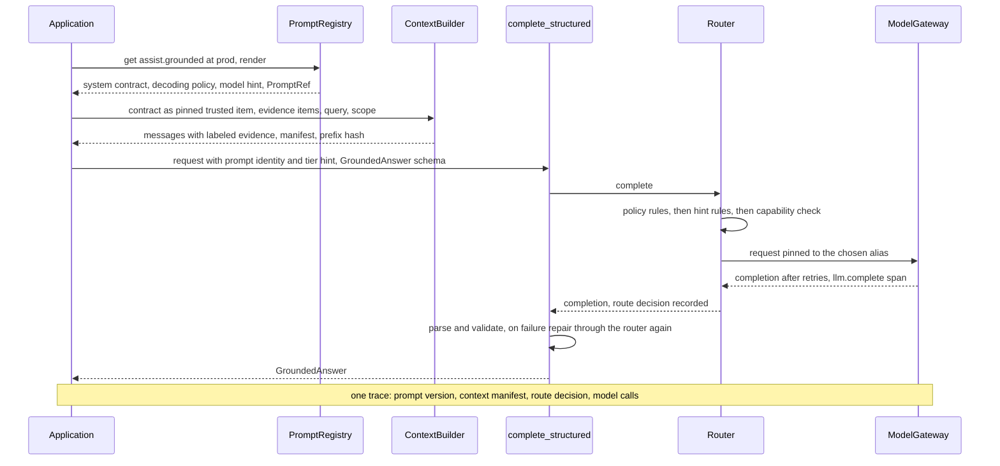
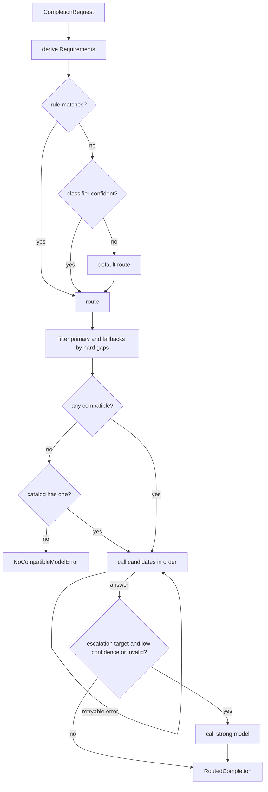
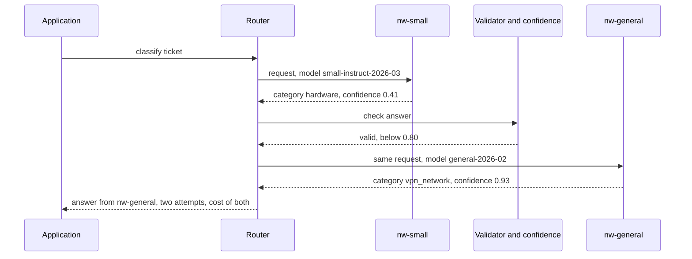
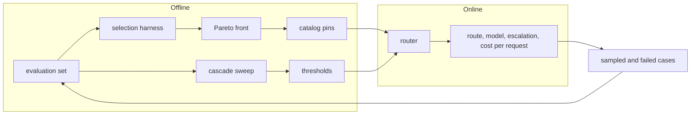

# Chapter 7 — Model Selection and Routing

This chapter is about choosing a model for a workload from evidence rather than reputation, and about building the component that makes that choice again for every request. Getting it wrong rarely breaks anything visibly: the bill grows, or the hardest requests get worse while the average looks fine.

**You will be able to:**
- Record each model's capabilities, prices, and data zone in a catalog that application code reaches only through pinned aliases.
- Run one evaluation set across candidates and choose from the Pareto front, using interval lower bounds and paired counts.
- Decide between a hosted API, a managed open-weight endpoint, and self-hosting from cost at volume, data control, and operating burden.
- Build a router that combines policy rules, an optional classifier, and a confidence cascade, and that refuses fallbacks which would quietly break a request.
- Choose a cascade threshold by end-to-end utility, pricing in what a misrouted request costs.
- Diagnose routing incidents (escalation storms, hidden fallbacks, retired pins) from router telemetry.

**Prerequisites:** Chapters 3 and 6 (the `aie_core` client, gateway, and pricing table; confidence signals and calibration); Chapters 4 and 5 for How Part II composes. | **Code:** `book/projects/examples/ch07/` (run: `cd book/projects/examples/ch07 && pytest -q`) | **Builds:** the chapter's model catalog, selection harness, `Router`, and cascade evaluator, running offline against `FakeLLM` instances that act as a small, a general, and a reasoning model on the Northwind ticket set.

**First reading:** Why this matters, Mental model, Core concepts (The selection axes, Model classes as workload shapes, Evaluation-driven selection, Routing strategies, Confidence signals and calibration, Routing error cost, Fallbacks that change assumptions), How it works, Architecture, Implementation (The catalog, The router, Cascade evaluation), Common mistakes, Failure modes, Before you ship. **Deep dives** (skip on a first pass): Reasoning effort as a knob, Multimodal inputs, Hosted API, managed open-weight, or self-hosted, Vendor neutrality and model pinning, How Part II composes, The selection harness, Task, fakes, and tests, Code walkthrough, Production considerations, Tradeoffs, Evaluation and testing.

## Why this matters

Model choice is often the largest lever on the cost and latency of an AI feature, and it is usually pulled once, early, by intuition. The prototype's strongest model becomes the default for every request, from the password-reset question to the 400-page contract. When the bill grows, nobody can say which requests needed the expensive model, because nothing measured it.

The opposite mistake is harder to see. A team switches to a small model that is "nearly as good" on a public benchmark, the aggregate score barely moves, and the hardest tenth of traffic, where a wrong answer creates an escalation, quietly gets worse.

Three facts make selection an engineering problem. Workloads are mixed: Northwind Assist serves ticket classification (short input, high volume), cited policy answers, incident research (long context, tools), and occasional high-stakes refund exceptions, and no single model is the best trade-off for all four. Models differ in contracts, not only quality: window, tool calling, schema output, image input, and where inference may run. And providers update, rename, and retire models underneath you.

This chapter builds the machinery most teams build too late: a catalog, a selection harness, a per-request router, and an evaluation that treats the router as part of the system's quality.

## Mental model

> **Mental model:** A model is a dependency with a contract. Choose it per request, from evidence, and treat the choice itself as code that can be wrong.

The contract means you write down what each model guarantees (window, tools, schema mode, modalities, data zone) and check it before every call. The evidence is the book's eighth mental model: model quality alone does not determine application quality, so selection comes from a task-level evaluation, not a leaderboard. The last part is the one teams skip. A router is a classifier with a cost function, and a cheap model that handles easy traffic well can still lose money if the router sends it the wrong requests.

## Core concepts

### The selection axes

Ten properties decide whether a model fits a workload. Hard constraints remove candidates outright. Trade-off axes are measured and balanced.

| Axis | Kind | What to measure or check | If you ignore it |
|---|---|---|---|
| Task capability | trade-off | pass rate on your evaluation set, with an interval | you ship on benchmark reputation |
| Reasoning depth | trade-off | pass rate on the hard slice, per effort setting | hard cases fail or easy ones overpay |
| Latency | trade-off | p50 and p95 end to end, time to first token | SLO misses no prompt change can fix |
| Price | trade-off | cost per correct answer at your token mix | the bill scales with traffic, not value |
| Context window | hard | prompt plus output tokens versus the window | truncation or rejected requests |
| Structured-output quality | hard or soft | schema validity rate, native schema mode | repair loops, parse failures |
| Tool use | hard | tool calling, argument validity rate | tool prompts answered without tools |
| Multimodality | hard | image or audio input, perception accuracy | images dropped or misread |
| Reliability and availability | trade-off | error rate, rate-limit headroom, outages | one provider incident takes you down |
| Data residency | hard | where inference runs, retention terms | regulated data leaves its zone |

Price means cost per correct answer: a model cheaper per token that writes three times the output, or needs repair twice as often, can cost more. Reliability belongs to the deployment, not the weights: the same model behind two providers has different availability and latency tails.

### Model classes as workload shapes

Chapter 2 introduced the model classes. For selection, what matters is the workload each one fits.

- A **small model** (SLM) is the right default for narrow, stable, high-volume tasks: classification, fixed-schema extraction, intent routing, guard checks. Tuned for one job, it often matches a general model on that job at a fraction of the cost and latency, and it can run on hardware you control. Its weakness is breadth: unusual inputs, multi-topic requests, missing world knowledge.
- A **general model** is the default when the shape of the task is not known in advance: open-ended questions, drafting, synthesis across sources.
- A **reasoning model** spends extra inference compute on multi-step problems. It earns its cost on planning, multi-constraint decisions, mathematics, and hard debugging, and wastes it on classification and extraction.
- A **decision-style model** returns a typed decision (a class, a score, a probability). For routing, moderation, eligibility, and triage, a bounded output is cheaper, easier to validate, and can be calibrated.

A small model with retrieval beats a reasoning model when the hard part is knowledge access rather than reasoning. The conditions: the task is bounded, the answer is in your documents, latency and cost matter, and your evaluation shows the small model is sufficient once it has the evidence. Reasoning effort cannot compensate for missing facts, and retrieval cannot compensate for a problem that needs several dependent inference steps.

Admit a new model class only after it passes the same evaluation as everything else; a vendor report, a preprint, and an independent evaluation on a workload like yours are different levels of evidence.

### Reasoning effort as a knob

> **Deep dive.** Treating a model's reasoning budget as a per-route setting; skip on a first reading.

Many models expose a reasoning budget (an effort level or a thinking-token limit). More effort helps on hard multi-step problems and costs latency and money, often by large factors, because the deliberation is generated and billed as output tokens.

Treat effort as a route attribute, not a global setting: Northwind's high-assurance route uses high effort for refund exceptions, the general route none. Evaluate the outcome, not the length of the reasoning, because long chains can be confidently wrong. Cap the budget with a token ceiling. And measure each effort level as a separate candidate, because one model at low and at high effort is two points on the Pareto front (defined below).

Because providers expose effort differently, the router passes `reasoning_effort` in `req.metadata`, and only to models whose profile lists that level; any other model gets a soft warning instead of a silent drop.

### Multimodal inputs

> **Deep dive.** What changes when requests carry images or audio; skip on a first reading.

Images, scans, and audio enter the model as extra tokens, so they cost context, money, and latency like text. Preprocess before you pay: resize, crop, sample frames, or run OCR first. A photographed invoice often goes through OCR and a text model more cheaply and accurately than through a vision model, and the harness can tell you which. Keep a reference to the exact image, page, or region so the answer can point at it. And evaluate perception and reasoning separately, because one end-to-end score cannot tell a misread digit from bad reasoning.

Images also widen the attack surface (Chapter 26). For the router, an image part is a hard requirement: the request goes only to models with `supports_vision`, never to a text-only fallback that would answer without seeing it.

### Hosted API, managed open-weight, or self-hosted

> **Deep dive.** The hosting decision and its cost arithmetic; skip on a first reading.

Every candidate also comes with a deployment choice. A **hosted API** serves a proprietary model, billed per token. A **managed open-weight endpoint** serves published weights on a cloud or inference provider, billed per token or per GPU-hour; the weights are portable and you run no GPUs. **Self-hosting** runs open weights on your hardware behind an inference server (Chapter 34).

| Factor | Hosted API | Managed open-weight | Self-hosted |
|---|---|---|---|
| Licensing | provider terms of service | the model's license plus provider terms | the model's license; some restrict use, scale, or derivatives |
| Cost at volume | per token, scales linearly with traffic | per token or per hour | mostly fixed: GPUs cost the same idle or busy |
| Data control | provider's retention terms and regions | provider's regions, often configurable | data never leaves your network |
| Fine-tunability | only what the provider offers | often adapters, sometimes full | full control (Chapter 33) |
| Operations burden | none beyond the client | low | high: capacity, upgrades, on-call, quantization checks |
| Versions | provider retires pins on its schedule | provider may retire hosted versions | you keep weights as long as you like |
| Strongest available quality | usually here | often behind | often behind |

The cost row is where teams go wrong: a self-hosted node costs the same busy or idle, so its cost per token depends on utilization. Illustrative numbers: a GPU node at $8 per hour that sustains 2,000 output tokens per second produces 7.2 million tokens an hour, about $1.10 per million at full load. At 25% average utilization it costs about $4.40 per million, roughly the general model's illustrative output price, before counting the engineers who run it. Compare at measured utilization, nights and weekends included (Chapter 34 does the serving math).

Self-hosting is justified when data must not leave your network (why Northwind's `nw-small` runs on-premises), when a narrow task keeps GPUs busy and a small model passes the evaluation, or when you need control of the weights. It is a poor fit for spiky traffic, for tasks that need the strongest model, and for teams with no one to own GPUs. A managed open-weight endpoint is the middle path.

Evaluate the exact deployment. A model tested at full precision and deployed quantized can lose quality on the hard slice, and an inference server upgrade can change outputs (a new default sampling setting, a chat template), so pin the server version with the weights. The same weights served by a provider and by you are two catalog aliases.

### Evaluation-driven selection

The same procedure serves a first choice and a switch:

1. **Write the task contract:** inputs, outputs, the metric that defines correct, and the cost of each error. For ticket classification: exact category match; a wrong category costs a re-triage.
2. **Build the evaluation set from your workload,** hard and rare slices included (Chapter 24 covers sample size).
3. **Fix the constraints from the product:** latency SLO, cost ceiling, data zone, required capabilities.
4. **Filter by hard constraints.** A model that fails one is not a candidate, however good its scores.
5. **Run every candidate on the same set in the shipped configuration** (prompt, parameters, effort).
6. **Read the Pareto front:** the candidates you cannot improve on one axis without losing on another. Discard the dominated ones, which another candidate matches or beats on quality, cost, and latency at once.
7. **Choose the cheapest candidate that meets the quality floor on the lower bound of its interval**, not its point estimate, within the latency ceiling.
8. **Compare close candidates with paired counts:** how many cases A gets right that B gets wrong, and the reverse. Similar averages can hide different failures, which is where routing pays.
9. **Record the decision** (set, prompt, and model versions, results) and re-run it on every model, prompt, or traffic change.

The harness's output on the sixty-ticket Northwind set, with illustrative prices and latencies:

| candidate | quality (95% CI) | p50 ms | p95 ms | $/request | $/correct | errors | Pareto |
|---|---|---|---|---|---|---|---|
| nw-reasoning | 0.950 (0.86-0.98) | 6500 | 6500 | 0.000928 | 0.000977 | 0.0% | yes |
| nw-general | 0.933 (0.84-0.97) | 1800 | 1800 | 0.000186 | 0.000199 | 0.0% | yes |
| nw-small | 0.800 (0.68-0.88) | 250 | 250 | 0.000019 | 0.000023 | 0.0% | yes |

The interval is a Wilson score interval, which stays honest at small samples and near 0 or 1 (Chapter 24). The fakes report fixed latencies, so p50 equals p95; in a real bake-off that gap often disqualifies a candidate.

All three are on the front. The reasoning and general intervals overlap heavily, so sixty cases cannot say the reasoning model classifies better, only that it costs five times as much and is over three times slower. With a floor of 0.80 on the lower bound and a p95 ceiling of 3 seconds, the procedure picks `nw-general`: the small model's point estimate meets the floor but its lower bound (0.68) does not.

Paired counts: the small model gets two tickets right that the general model misses, and the general model ten the other way, mostly multi-topic tickets whose obvious keywords mislead the small model. That is the signature of a workload where a cascade (cheap model first, escalate when unsure) might beat both, depending on what an error costs (Routing error cost, below).

### Routing strategies

Routing chooses the model, provider, or pipeline for each request. The strategies form a ladder of increasing power and decreasing explainability.

**Static mapping by use case.** Each endpoint or task type has a model chosen by the procedure above. Start here; many systems never need more.

**Rules.** Deterministic predicates over features code already knows: task type, tenant, data zone, risk flag, prompt size, tools or images. Rules encode policy (restricted data stays on-premises) and obvious economics (classification goes to the small model), and they are cheap and auditable. Put policy rules before cost rules, so a cost optimization can never override a compliance requirement.

**Classifiers.** A small model predicts difficulty or route from the request text, separating traffic rules cannot. It must abstain: below its confidence floor, the request takes the default route.

**Embedding similarity.** Send each request to the nearest route centroid of embedded example requests, with the margin over the runner-up as confidence. A few dozen examples replace a trained model (Chapter 8); the router implements it as `EmbeddingRouteClassifier`.

**Model-as-router.** A language model reads the request and picks a route. It handles nuance, but adds a full call per request and is the easiest router to manipulate through request text. Use it only when cheaper strategies have measurably failed, and map its output to an enumerated route in code.

**Confidence cascades.** Run the cheap model first and escalate when its answer looks unreliable: low confidence, a failed validator, or an output outside the allowed set. The attempt is often a better difficulty signal than the input, but every escalated request pays for both calls.

A route can also name an effort level, so the cheapest escalation is sometimes more effort on the same model. The Northwind router combines strategies: rules first, then an optional classifier, then a default route, and any route with an escalation target is a cascade.

### Confidence signals and calibration

A cascade is only as good as its escalation signal. From cheapest to most expensive:

- **Self-reported confidence** in the output: free, and often miscalibrated.
- **Token log-probabilities,** where exposed: better founded than a self-report.
- **Validators:** the output parses, the label is in the allowed set, the total equals the line items. The most reliable trigger, because it is not a guess.
- **Agreement:** sample twice, or ask two cheap models, and escalate on disagreement. Doubles the cheap cost and misses consistently wrong answers.
- **A learned verifier:** a small model trained to predict correctness. Most accurate, most work to maintain.

Chapter 6 owns calibration: a reliability table compares each confidence bin's mean confidence with its accuracy, and expected calibration error (ECE) is the count-weighted average gap. Run that table on your own data, for the exact signal the cascade uses. The small model's self-reported confidence on the Northwind set (illustrative):

| confidence bin | cases | mean confidence | accuracy |
|---|---|---|---|
| 0.2-0.4 | 1 | 0.20 | 0.00 |
| 0.4-0.6 | 7 | 0.52 | 0.71 |
| 0.6-0.8 | 15 | 0.76 | 0.73 |
| 0.8-1.0 | 37 | 0.96 | 0.86 |

ECE is about 0.09. The signal is informative but overconfident at the top: the top bin holds five wrong answers, four at 0.97, the highest confidence the model reports, so no threshold short of escalating everything catches them. Escalation can only fix errors the signal can see, and the price of confident mistakes decides whether the cascade is worth building.

### Routing error cost

A router makes two mistakes. A **false accept** (false "easy") lets a cheap model's wrong answer through; it costs quality, or a retry if something downstream catches it. A **false escalation** (false "hard") sends a request the cheap model had right to the expensive model anyway; it costs money and latency, never quality. Router accuracy, the share of correct escalate-or-not decisions, counts the two equally. Their prices differ: at illustrative Northwind prices a false escalation costs about $0.00017 extra, while a silent wrong answer can cost a re-triage worth hundreds of times that.

The correct objective is end-to-end utility per request, in one currency:

```text
# pseudocode
utility = value of correct answers
        - cost of silent errors (false accepts nobody catches)
        - cost of caught errors (rework plus the re-run on the strong model)
        - model spend on every stage that ran
        - cost of latency, if waiting has a price
```

A false escalation shows up only as spend and latency. A cheap answer that is caught downstream and re-run on the strong model costs both calls plus rework, which can exceed calling the strong model once: evaluate misroutes, not just routes.

Running each model once on the ticket set and simulating every threshold offline gives, for three illustrative prices of a silent error (other terms fixed):

| cost of a silent error | best policy by utility | accuracy | $/request | escalated |
|---|---|---|---|---|
| 0.0002 | always small | 0.800 | 0.000019 | 0% |
| 0.001 | cascade, threshold 0.78 | 0.883 | 0.000066 | 25% |
| 0.05 | always large | 0.933 | 0.000186 | 100% |

Three prices, three winners. When errors are nearly free, the cheap model's savings dominate. In a middle band, the cascade beats both single models. When errors are expensive, the small model's confident mistakes cost more than escalation saves, and the best cascade escalates everything: the large model plus a wasted small call. The threshold that maximizes router accuracy is about 0.53 in all three regimes, because router accuracy ignores prices.

### Fallbacks that change assumptions

The Chapter 3 gateway already falls back to a second model on retryable errors, but it cannot know whether that model can serve this request. Fallbacks change assumptions:

- **Context length.** With a 200k primary and a 32k fallback (illustrative), the fallback rejects the request or, if a layer truncates to fit, answers from a prompt that lost its evidence.
- **Tool support.** A model without tool calling gives a confident prose answer that never looked anything up.
- **Structured output.** Without native schema mode, prompt-and-parse with repair still works (Chapter 6), but the malformed-output rate changes.
- **Data residency.** If only an on-premises model may see restricted data, falling back to a cloud model is a compliance incident, not a reliability feature.
- **Effort, tokenizer, and prompt format.** A prompt tuned for one model family can underperform on another (Chapter 4).

The router classifies every gap as hard or soft. Hard gaps (context, output length, tools, vision, data zone) remove a model from the candidates. Soft gaps (no native schema mode, unsupported effort level) keep it with a warning, so a dashboard can show how often requests ran under changed assumptions.

When every planned model has a hard gap, the router substitutes the cheapest compatible catalog model that has a registered client, and records it. A model whose data zone is `any` makes no residency promise, so it never satisfies a request that requires a zone. When nothing fits, the router raises `NoCompatibleModelError`, and the caller can shrink the context, drop the tools, or tell the user, all better than a wrong answer.

### Vendor neutrality and model pinning

> **Deep dive.** Aliases, pins, and the migration off a retired version; skip on a first reading.

Application code should reference models only by catalog aliases (`nw-small`), never provider model names. Each alias resolves to a pinned, versioned identifier, so a swap is a one-line reviewed change, a provider repointing a floating model name cannot change behavior without a deploy, and every trace records the exact version.

A retired pin is an outage on a date you were told about months earlier, so track every pin's deprecation date and start migrating weeks before it:

1. **Add the new version as a separate alias** (`nw-general-next`) with its own profile, because window, output limit, and schema support can change between versions.
2. **Run the selection harness** with both pins. Read per-slice deltas and paired counts, and re-run the cascade sweep if the alias is a cascade stage, because a new confidence distribution moves every threshold.
3. **Port the prompt deliberately.** Run every prompt the alias serves through its regression suite on the new pin (Chapter 4), and roll prompt and model changes out separately where possible, so a regression can be attributed.
4. **Shadow, then canary.** Send sampled live traffic to the new alias without serving it, compare format-error rate, latency, and judged quality, then serve a small share (Chapter 32).
5. **Repoint the alias, keep the old pin** until the retirement date, so rollback is a catalog change.

On retirement day a provider usually rejects the model with a "model not found" error, which `aie_core` maps to a non-retryable `InvalidRequestError`: the route fails loudly, which is correct, because retrying will not bring the model back. A layer that makes it retryable, such as an internal proxy answering 503 for every upstream failure, turns the outage into a silent fallback visible only as a cost increase.

## How it works

Follow one Northwind request through the router.

1. **Requirements come from the request, not the caller.** `Requirements.from_request` counts prompt tokens plus `max_tokens` and detects tools, a response schema, and image parts; data zone and effort come from metadata. A caller cannot forget that its prompt is 150k tokens.
2. **A route is selected.** Rules run in order: restricted data, high risk, long context, narrow task. If none matches, a configured classifier predicts a route, and a prediction below its confidence floor falls through to the default. The decision records which stage chose.
3. **The route becomes a candidate list.** Hard gaps skip the primary or a fallback with a recorded reason; soft gaps become warnings. If none survive, the catalog substitution applies or `NoCompatibleModelError` is raised. An incompatible escalation target is disabled.
4. **Candidates are called in order,** each through its alias's client (in production a `ModelGateway` with its own retries), with `req.model` set to the pin. A retryable error moves to the next candidate; a non-retryable one is raised, because a bad request fails on every model.
5. **The answer is checked for escalation.** If the route's escalation target did not already serve, the validator runs, then the confidence function; failure triggers one call to the stronger model. If that call fails, or escalation was disabled, a failing answer is returned marked `degraded`, so the caller knows it is below the route's bar.
6. **Everything is recorded:** the decision, every attempt with outcome, latency, cost, and confidence, and the serving model. The router also compares the model the completion reports with the planned pin, which catches a fallback hidden below the router (see Hidden fallback below the router, under Failure modes).

## How Part II composes

> **Deep dive.** How the prompt registry, context builder, router, gateway, and structured-output loop fit together on one request; skip on a first reading.

Chapters 4 to 7 each built one component and tested it alone. A production request passes through all of them. The prompt registry owns the versioned contract (instructions, decoding policy, model hint). The `ContextBuilder` owns what the model sees under a budget and the manifest that records it. The router owns which model serves; the gateway owns retries, limits, and the call span; `complete_structured` owns the schema and the repair loop. One grounded Northwind Assist answer, end to end:



**Who labels untrusted text.** Chapter 4's template wraps an untrusted variable in `<untrusted_data label="...">`; Chapter 5's builder wraps an untrusted item in `<untrusted_data source="..." kind="...">`. Both use the same tag and neutralize a forged closing tag. The rule: untrusted text is labeled exactly once, by the component that places it in the prompt. Anything selected under a budget (evidence, tool results, memory, conversation state) is a `ContextItem` labeled by the builder, which alone knows its source and whether it survived the budget. The template labels only its own slots, such as the ticket body in `ticket.classify`, which has no builder in front of it.

So a prompt that feeds a builder declares no evidence slot. `assist.grounded` (in `examples/ch07/prompt_files/`) has only a system section and enters the builder as a pinned, trusted instructions item. Chapter 4's `assist.answer` keeps a `documents` slot because its regression suite renders it without a builder. Passing evidence both ways would label it twice and make the manifest wrong.

The glue is short because each component already speaks `aie_core` types:

```python
# path: book/projects/examples/ch07/compose.py (excerpt; full file on disk)
PROMPTS = PromptRegistry.from_directory(HERE / "prompt_files")
HINT_ROUTES = {"small": "small_first", "medium": "general", "large": "reasoning"}

# ... GroundedAnswer (the output schema) and Composed (answer, prompt, context, route, served_by)

def hinted_router(catalog, clients, **kwargs) -> Router:
    """Policy rules first; a prompt's tier hint decides only when no policy rule matched."""
    hints = [Rule(f"prompt_hint_{tier}", route, lambda req, need, t=tier: req.metadata.get("prompt.tier") == t)
             for tier, route in HINT_ROUTES.items()]
    return Router(catalog, clients, northwind_routes(), default_route="general",
                  rules=[*northwind_rules(), *hints], **kwargs)


class _RouterClient:
    """complete_structured expects an LLMClient; keep every RoutedCompletion for the result."""
    provider = "router"

    def __init__(self, router: Router) -> None:
        self.router, self.routed = router, []

    def complete(self, req):
        self.routed.append(self.router.complete(req))
        return self.routed[-1].completion


def answer(question: str, evidence: list[ContextItem], scope, *, builder, router: Router,
           tracer: Tracer | None = None, **request_metadata) -> Composed:
    prompt = PROMPTS.get("assist.grounded", "prod").render({})               # 1. versioned contract
    items = [ContextItem(kind="instructions", content=m.text, source_id=f"prompt:{prompt.ref}",
                         trust=Trust.TRUSTED, pinned=True) for m in prompt.messages]
    items += [*evidence, ContextItem(kind="query", content=question, source_id="user:request")]
    with (tracer or NoopTracer()).span("assist.answer", **prompt.ref.span_attributes()):
        built = builder.build(items, scope)                                   # 2. budget, order, labels
        req = prompt.to_request(messages=built.messages)
        req = req.model_copy(update={"metadata": {**req.metadata, **request_metadata,
                                                  "prompt.tier": prompt.spec.model_hints.tier}})
        client = _RouterClient(router)                                         # 3-4. route, then gateway
        parsed, _ = complete_structured(client, req, GroundedAnswer)           # 5. validate and repair
    last = client.routed[-1]
    return Composed(parsed, prompt.ref, built, last.decision, last.served_by)
```

Each router client is a `ModelGateway`, so retries stay below the routing decision, and a repair is a new routed call, costed and traced like the first. `test_compose.py` checks that the hint chose the route, that evidence is labeled once, that one malformed answer costs exactly one repair, and that all four spans land in one tracer.

**What the router does with model hints.** The `Router` never reads `ModelHints`. The hint reaches it only because the glue copies `model_hints.tier` into `req.metadata["prompt.tier"]` and `hinted_router` appends one rule per tier after the Northwind rules. Rule order makes a hint advice rather than a command: every policy rule wins first, and a test pins that an on-prem request ignores a `medium` hint. The other hint fields need no rule, because `Requirements.from_request` derives the same needs from the request itself. Without this glue, a hint is documentation: useful in review and in the selection harness, invisible at runtime.

**Why Project 1 uses prompt constants.** Project 1 keeps its prompts as constants in `prompts.py`, labels the document with its own `<document>` tag, and stamps one `PROMPT_VERSION` on every output. That suits one service whose four prompts change and ship together; it gives up per-prompt versions, a lock, and rollback without a deploy. To get those, move each constant into a prompt file, declare `document` an untrusted variable (retiring `render_document`), record `rendered.ref` where `PROMPT_VERSION` is recorded, and add the lock check to CI. The document stays a template slot, since nothing is selected under a budget.

## Architecture

The router's decision and execution path, with the hard capability check between selection and execution:



The cascade on one ticket, showing why escalated requests pay for both stages in money and latency:



Offline evaluation sets the catalog and thresholds; production telemetry feeds new cases back into the evaluation set:



## Implementation

```text
book/projects/examples/ch07/
├── catalog.py        ModelProfile, Requirements, capability gaps, ModelCatalog
├── catalog.json      the illustrative Northwind catalog as data
├── tasks.py          ticket-classification cases, label schema, scorer, confidence reader
├── fakes.py          make_small_model and make_large_model: FakeLLM handlers
├── selection.py      run_selection, Wilson intervals, percentiles, Pareto front, choose
├── router.py         Router, Route, Rule, EmbeddingRouteClassifier, Northwind routes and rules
├── cascade_eval.py   collect_outcomes, simulate, sweep, utility, calibration
├── config.py         RouterSettings from environment variables
├── demo.py           selection table, cascade sweeps, routing decisions
├── compose.py        one request through registry, builder, router, gateway, validator
├── prompt_files/     assist.grounded@1.0.0 and aliases.toml, the prompt compose.py serves
├── test_ch07.py      offline tests
├── test_compose.py   offline test of the Part II composition
├── pyproject.toml
├── .env.example
└── README.md
```

Install and run from the repository root:

```bash
uv pip install --python .venv/bin/python -e book/projects/aie_core   # or: pip install -e book/projects/aie_core
.venv/bin/python -m pytest book/projects/examples/ch07 -q
cd book/projects/examples/ch07 && ../../../../.venv/bin/python demo.py
```

| Variable | Default | Meaning |
|---|---|---|
| `MODEL_CATALOG_PATH` | unset | JSON catalog; the built-in illustrative catalog when unset |
| `ROUTER_MIN_CONFIDENCE` | `0.8` | escalate below this confidence on cascade routes |
| `ROUTER_LONG_CONTEXT_TOKENS` | `100000` | prompt plus output size that selects the long-context route |
| `ROUTER_CLASSIFIER_MIN_CONFIDENCE` | `0.5` | below this, the classifier abstains |
| `LLM_PROVIDER`, `LLM_MODEL`, API keys | see `aie_core` | used when fakes are replaced by real clients |

### The catalog

The catalog holds one `ModelProfile` per alias and derives a request's `Requirements`. Read `capability_gaps` first: it is the single definition of compatible, returning structured gaps so the router can explain every skip. The illustrative catalog has four aliases: `nw-small` on-premises, `nw-general` and `nw-reasoning` in the EU, and `nw-longctx` with a large window but no tools.

```python
# path: book/projects/examples/ch07/catalog.py (excerpt; full file on disk)
class ModelProfile(BaseModel):
    alias: str                                   # what application code and routes use
    model_id: str                                # pinned, versioned identifier sent to the provider
    provider: str                                # key into the client registry
    context_tokens: int                          # total window: prompt plus output
    max_output_tokens: int
    supports_tools: bool = False
    supports_json_schema: bool = False           # native schema-constrained output
    supports_vision: bool = False
    reasoning_efforts: tuple[str, ...] = ()      # e.g. ("low", "medium", "high"); empty = no knob
    data_zones: tuple[str, ...] = ("any",)       # where inference runs, e.g. ("eu",); "any" = no residency guarantee
    cost_tier: Tier = Tier.MEDIUM
    latency_tier: Tier = Tier.MEDIUM
    input_per_1m: float = 0.0                    # illustrative USD per million input tokens
    output_per_1m: float = 0.0                   # illustrative USD per million output tokens
    # ...

class Requirements(BaseModel):
    # ...
    @classmethod
    def from_request(cls, req: CompletionRequest) -> "Requirements":
        """Derive requirements from the request itself, so callers cannot forget them."""
        has_image = any(
            not isinstance(m.content, str) and any(p.type == "image_url" for p in m.content)
            for m in req.messages
        )
        prompt_tokens = count_message_tokens(req.messages, req.model)
        return cls(
            min_context_tokens=prompt_tokens + req.max_tokens,
            min_output_tokens=req.max_tokens,
            needs_tools=bool(req.tools) and req.tool_choice != "none",
            needs_json_schema=req.response_schema is not None,
            needs_vision=has_image,
            data_zone=req.metadata.get("data_zone"),
            reasoning_effort=req.metadata.get("reasoning_effort"),
        )

def capability_gaps(profile: ModelProfile, need: Requirements) -> list[Gap]:
    gaps: list[Gap] = []
    if need.min_context_tokens > profile.context_tokens:
        gaps.append(Gap(capability="context",
                        detail=f"needs {need.min_context_tokens} tokens, window is {profile.context_tokens}"))
    # ... output length, tools, and vision follow the same pattern
    if need.data_zone and need.data_zone not in profile.data_zones:  # "any" never satisfies an explicit zone
        gaps.append(Gap(capability="data_zone",
                        detail=f"request must stay in {need.data_zone}; model runs in {list(profile.data_zones)}"))
    if need.needs_json_schema and not profile.supports_json_schema:
        # Soft: structured output can fall back to prompt-and-parse with validation and repair
        # (Chapter 6). The request still works, but its failure rate changes, so it is flagged.
        gaps.append(Gap(capability="json_schema", hard=False,
                        detail="no native schema mode; falls back to prompt+parse with repair"))
    if need.reasoning_effort and need.reasoning_effort not in profile.reasoning_efforts:
        gaps.append(Gap(capability="reasoning_effort", hard=False,
                        detail=f"effort {need.reasoning_effort!r} unsupported; model offers {list(profile.reasoning_efforts)}"))
    return gaps

def is_compatible(profile: ModelProfile, need: Requirements) -> bool:
    return not any(g.hard for g in capability_gaps(profile, need))

class ModelCatalog(BaseModel):
    # ...
    def compatible(self, need: Requirements, among: Iterable[str] | None = None) -> list[ModelProfile]:
        """Compatible profiles, cheapest first, then fastest. Stable for equal tiers."""
        names = list(among) if among is not None else list(self.profiles)
        found = [self.get(n) for n in names if is_compatible(self.get(n), need)]
        return sorted(found, key=lambda p: (p.cost_tier, p.latency_tier))
```

### The selection harness

> **Deep dive.** The code behind the selection table; skip on a first reading.

In `run_case` a failed call becomes a scored zero, so a candidate rate-limited half the time shows a 50% error rate instead of aborting the run. `dominates` defines the Pareto front; `choose` applies the floor to the interval's lower bound.

```python
# path: book/projects/examples/ch07/selection.py (excerpt; full file on disk)
def wilson_interval(successes: float, n: int, z: float = 1.96) -> tuple[float, float]:
    """Wilson score interval: honest at small n and near 0 or 1, unlike the normal approximation."""
    if n == 0:
        return 0.0, 1.0
    p = successes / n
    denom = 1 + z * z / n
    centre = (p + z * z / (2 * n)) / denom
    half = z * math.sqrt(p * (1 - p) / n + z * z / (4 * n * n)) / denom
    return max(0.0, centre - half), min(1.0, centre + half)

def run_case(name: str, client: LLMClient, case: EvalCase, scorer: Scorer,
             pricing: PricingTable, model: str | None = None) -> CaseResult:
    req = case.request.model_copy(update={"model": model}) if model else case.request
    started = time.perf_counter()
    try:
        completion = client.complete(req)
    except LLMError as exc:  # a failed call is a scored outcome, not a crash of the harness
        return CaseResult(case_id=case.id, candidate=name, score=0.0,
                          latency_ms=(time.perf_counter() - started) * 1000,
                          cost_usd=0.0, error=type(exc).__name__)
    wall_ms = (time.perf_counter() - started) * 1000
    # Providers report server-side latency; fakes report a scripted one. Prefer the reported
    # figure when present so fakes are deterministic; real runs should also log wall time.
    latency = completion.latency_ms or wall_ms
    return CaseResult(
        case_id=case.id, candidate=name, score=scorer(case, completion), latency_ms=latency,
        cost_usd=pricing.cost_usd(completion.model, completion.usage),
        input_tokens=completion.usage.input_tokens, output_tokens=completion.usage.output_tokens,
        output=completion.text[:500],
    )

def dominates(a: CandidateSummary, b: CandidateSummary) -> bool:
    """a dominates b if it is no worse on every axis and strictly better on at least one."""
    no_worse = (a.quality >= b.quality and a.cost_per_request_usd <= b.cost_per_request_usd
                and a.p95_latency_ms <= b.p95_latency_ms)
    better = (a.quality > b.quality or a.cost_per_request_usd < b.cost_per_request_usd
              or a.p95_latency_ms < b.p95_latency_ms)
    return no_worse and better

def choose(report: SelectionReport, *, min_quality: float, max_p95_ms: float,
           use_lower_bound: bool = True) -> CandidateSummary | None:
    """Cheapest candidate meeting the quality floor and latency ceiling. With use_lower_bound
    the floor applies to the lower end of the confidence interval, which refuses to pick a
    model on luck when the evaluation set is small."""
    ok = [s for s in report.summaries
          if (s.quality_low if use_lower_bound else s.quality) >= min_quality and s.p95_latency_ms <= max_p95_ms]
    return min(ok, key=lambda s: (s.cost_per_request_usd, s.p95_latency_ms), default=None)
```

### The router

`route` decides and `complete` executes. A `Route` is plain data, and the Northwind rules show the ordering principle, policy before cost.

```python
# path: book/projects/examples/ch07/router.py (excerpt; full file on disk)
class Route(BaseModel):
    model_config = ConfigDict(frozen=True)

    name: str
    model: str                                  # catalog alias
    fallbacks: tuple[str, ...] = ()             # tried on retryable errors or capability gaps
    reasoning_effort: str | None = None         # passed to models that expose the knob
    escalate_to: str | None = None              # confidence cascade target
    min_confidence: float = 0.0                 # escalate when confidence is below this

def northwind_rules(long_context_threshold: int = 100_000) -> list[Rule]:
    """Rules run in order; put the ones that encode policy before the ones that save money."""
    return [
        Rule("restricted_data", "private", lambda req, need: need.data_zone == "onprem"),
        Rule("high_risk", "high_assurance", lambda req, need: req.metadata.get("risk") == "high"),
        Rule("long_context", "long_context", lambda req, need: need.min_context_tokens > long_context_threshold),
        Rule("narrow_task", "small_first", lambda req, need: req.metadata.get("task") in NARROW_TASKS),
    ]
```

The decision half. `_pick_route` answers "which policy applies": the first matching rule, else a classifier prediction above its floor, else the default. The rest of `route` answers "which models can execute it." Keeping the two apart makes the long-context test below readable. The request matches the long-context rule, `nw-longctx` is skipped for lacking tools, and `nw-reasoning`, which has both the window and tool calling, serves it.

```python
# path: book/projects/examples/ch07/router.py (excerpt; full file on disk)
    def _pick_route(self, req: CompletionRequest, need: Requirements) -> tuple[Route, str, str | None, float | None]:
        for rule in self.rules:
            if rule.when(req, need):
                return self.routes[rule.route], "rule", rule.name, None
        if self.classifier is not None:
            name, conf = self.classifier.predict(req)
            if conf >= self.classifier_min_confidence and name in self.routes:
                return self.routes[name], "classifier", None, conf
            return self.routes[self.default_route], "default", None, conf
        return self.routes[self.default_route], "default", None, None

    def route(self, req: CompletionRequest) -> RouteDecision:
        need = Requirements.from_request(req)
        route, stage, rule, conf = self._pick_route(req, need)
        effort = need.reasoning_effort or route.reasoning_effort
        need = need.model_copy(update={"reasoning_effort": effort})

        substitutions: list[str] = []
        planned = [route.model, *route.fallbacks]
        candidates: list[str] = []
        for alias in planned:
            gaps = [g for g in capability_gaps(self.catalog.get(alias), need) if g.hard]
            if gaps:
                substitutions.append(f"skip {alias}: " + "; ".join(f"{g.capability}: {g.detail}" for g in gaps))
            else:
                candidates.append(alias)
        if not candidates:
            # Every planned model is unfit. Look across the whole catalog, cheapest first, but only
            # among models we can actually call.
            for p in self.catalog.compatible(need, among=self.clients):
                candidates.append(p.alias)
                substitutions.append(f"catalog substitute {p.alias} for route {route.name}")
                break
        if not candidates:
            raise NoCompatibleModelError(
                f"no model satisfies route {route.name!r}: " + " | ".join(substitutions))

        escalate_to = route.escalate_to
        escalation_disabled = False
        if escalate_to is not None and not is_compatible(self.catalog.get(escalate_to), need):
            substitutions.append(f"escalation to {escalate_to} disabled: capability gap")
            escalate_to, escalation_disabled = None, True
        # ... soft gaps on surviving candidates become warnings; the RouteDecision is returned
```

The execution half, with the span attributes elided. `_call` (on disk) sends the request through the alias's client with the pin and effort level set, and prices the completion. `_needs_escalation` runs the validator before the confidence function, because a parse failure makes the confidence meaningless.

```python
# path: book/projects/examples/ch07/router.py (excerpt; full file on disk)
    def _needs_escalation(self, completion: Completion, decision: RouteDecision, attempt: Attempt) -> bool:
        if self.validator is not None and not self.validator(completion):
            attempt.outcome, attempt.detail = "invalid", "validator rejected output"
            return True
        if self.confidence is not None:
            attempt.confidence = self.confidence(completion)
            if attempt.confidence < decision.min_confidence:
                attempt.outcome = "low_confidence"
                attempt.detail = f"confidence {attempt.confidence:.2f} < {decision.min_confidence:.2f}"
                return True
        return False

    def complete(self, req: CompletionRequest) -> RoutedCompletion:
        with self.tracer.span("router.complete") as span:
            decision = self.route(req)
            # ...
            for alias in decision.candidates:
                try:
                    completion, attempt = self._call(alias, req, decision)
                except LLMError as exc:
                    attempts.append(Attempt(model=alias, outcome="error", detail=type(exc).__name__))
                    if not exc.retryable:
                        span.record_exception(exc)
                        raise
                    continue
                attempts.append(attempt)
                served_by = alias
                break
            # ... no completion: raise ProviderUnavailableError
            escalated = degraded = False
            target = decision.escalate_to
            if target and target != served_by and self._needs_escalation(completion, decision, attempts[-1]):
                try:
                    strong, strong_attempt = self._call(target, req, decision)
                    attempts.append(strong_attempt)
                    completion, served_by, escalated = strong, target, True
                except LLMError as exc:
                    # Keep the cheap answer but say it is below the route's bar.
                    attempts.append(Attempt(model=target, outcome="error", detail=type(exc).__name__))
                    degraded = True
            elif decision.escalation_disabled and self._needs_escalation(completion, decision, attempts[-1]):
                # The cascade could not run for this request, and the answer is below its bar.
                degraded = True
            mismatch = completion.model != self.catalog.get(served_by).model_id
            # ... build the RoutedCompletion, set span attributes, return it
```

### Cascade evaluation

`collect_outcomes` (on disk) runs each model once per case, recording correctness, the small model's confidence, and both stages' cost and latency. `simulate` applies one threshold to that table without calling a model, so `sweep` tests every distinct confidence value for the cost of two passes. `_per_case` is the only place the utility formula becomes code.

```python
# path: book/projects/examples/ch07/cascade_eval.py (excerpt; full file on disk)
class UtilityModel(BaseModel):
    """All values illustrative. Set them with the product owner, not by the engineer alone."""

    value_correct: float = 0.0          # often zero: the baseline is "the task got done"
    cost_silent_error: float = 0.05     # a mis-triaged ticket waits in the wrong queue
    detect_rate: float = 0.0            # share of accepted wrong answers caught downstream
    rework_cost: float = 0.01           # cost of a caught error, on top of re-running large
    latency_cost_per_s: float = 0.0     # what a second of waiting is worth, if anything

def _per_case(o: CaseOutcome, escalate: bool, u: UtilityModel) -> tuple[float, float, float, float]:
    """(expected correctness, cost, latency_ms, penalty) for one case under one decision."""
    if escalate:
        cost = o.small_cost_usd + o.large_cost_usd
        latency = o.small_latency_ms + o.large_latency_ms
        return float(o.large_correct), cost, latency, 0.0 if o.large_correct else u.cost_silent_error
    if o.small_correct:
        return 1.0, o.small_cost_usd, o.small_latency_ms, 0.0
    # False accept. A share d of these is caught downstream and redone on the large model,
    # paying rework plus a second call; the rest stays wrong and silent.
    d = u.detect_rate
    redo_penalty = u.rework_cost + (0.0 if o.large_correct else u.cost_silent_error)
    return (d * float(o.large_correct),
            o.small_cost_usd + d * o.large_cost_usd,
            o.small_latency_ms + d * o.large_latency_ms,
            d * redo_penalty + (1 - d) * u.cost_silent_error)

def simulate(outcomes: Sequence[CaseOutcome], threshold: float, u: UtilityModel) -> PolicyMetrics:
    """Accept the small answer when its confidence >= threshold, otherwise escalate."""
    # ...
    for o in outcomes:
        escalate = o.small_confidence < threshold
        ok, c, lat, pen = _per_case(o, escalate, u)
        # ... accumulate correctness, cost, penalty, latency
        false_accepts += (not escalate) and (not o.small_correct)
        false_escalations += escalate and o.small_correct
    # ... returns PolicyMetrics with accuracy, cost, p95, rates, router accuracy, and utility

def sweep(outcomes: Sequence[CaseOutcome], u: UtilityModel,
          thresholds: Sequence[float] | None = None) -> list[PolicyMetrics]:
    ts = thresholds if thresholds is not None else sorted({0.0, 1.01, *(o.small_confidence for o in outcomes)})
    return [simulate(outcomes, t, u) for t in ts]
```

`baseline` (on disk) computes the always-small and always-large policies, and `calibration_table` and `expected_calibration_error` produce the reliability table shown earlier.

### Task, fakes, and tests

> **Deep dive.** How the offline task, fake models, and tests are built; skip on a first reading.

`tasks.py` turns each ticket in `shared-data/tickets.jsonl` into an `EvalCase`: the exact `CompletionRequest` a candidate receives (twelve allowed categories, a JSON schema for `{"category", "confidence"}`, `metadata={"task": "classify_ticket"}`) plus the expected label. `label_confidence` returns 0.0 for malformed output, so unparseable answers always escalate.

In `fakes.py`, the small model is a keyword scorer whose confidence is the margin between its top two categories, so it struggles on tickets that mix topics. The large model is wrong on a deterministic four of sixty.

The tests below pin the central claims: a cascade pays for both calls, capability gaps beat fallback order, residency is never traded for availability, and the offline sweep predicts the live router.

```python
# path: book/projects/examples/ch07/test_ch07.py (excerpt; imports and fixtures omitted, full file on disk)
def make_router(catalog, gold, **overrides) -> Router:
    clients = {
        "nw-small": overrides.pop("small", make_small_model()),
        "nw-general": overrides.pop("general", make_large_model(gold)),
        "nw-reasoning": overrides.pop("reasoning", make_large_model(gold, model="reasoner-2026-01")),
        "nw-longctx": overrides.pop("longctx", make_large_model(gold, model="longctx-2025-12")),
    }
    overrides.setdefault("confidence", label_confidence)
    overrides.setdefault("validator", lambda c: parse_label(c) is not None)
    return northwind_router(catalog, clients, **overrides)

def test_low_confidence_escalates_and_costs_both_calls(catalog, gold):
    small = FakeLLM(responses=[{"category": "hardware", "confidence": 0.41}], model="small-instruct-2026-03")
    general = FakeLLM(responses=[{"category": "vpn_network", "confidence": 0.93}], model="general-2026-02")
    router = make_router(catalog, gold, small=small, general=general)
    r = router.complete(ticket_request("VPN drops", "VPN disconnects every 10 minutes since Monday"))
    assert r.escalated and r.served_by == "nw-general"
    assert [a.outcome for a in r.attempts] == ["low_confidence", "ok"]
    assert r.attempts[0].confidence == pytest.approx(0.41)
    assert r.cost_usd == pytest.approx(sum(a.cost_usd for a in r.attempts)) and r.attempts[0].cost_usd > 0
    assert parse_label(r.completion).category == "vpn_network"

def test_long_context_with_tools_never_falls_back_to_a_toolless_model(catalog, gold):
    tools = [ToolSpec(name="search_tickets", description="search")]
    req = CompletionRequest(messages=[Message.user(big_text(150_000))], max_tokens=2_000, tools=tools)
    d = make_router(catalog, gold).route(req)
    assert d.route == "long_context" and d.candidates == ["nw-reasoning"]
    huge = req.model_copy(update={"messages": [Message.user(big_text(400_000))]})
    with pytest.raises(NoCompatibleModelError):
        make_router(catalog, gold).route(huge)

def test_restricted_data_never_leaves_the_zone(catalog, gold):
    req = CompletionRequest(messages=[Message.user("summarize this payroll export")],
                            tools=[ToolSpec(name="lookup_employee", description="lookup")],
                            metadata={"data_zone": "onprem"})
    with pytest.raises(NoCompatibleModelError):   # only nw-small runs on-prem and it has no tools
        make_router(catalog, gold).route(req)
    ok = req.model_copy(update={"tools": None})
    assert make_router(catalog, gold).route(ok).candidates == ["nw-small"]

def test_online_router_matches_offline_simulation(catalog, gold, cases, pricing):
    """The offline sweep is only trustworthy if it predicts what the live router does."""
    outs = collect_outcomes(cases, make_small_model(), make_large_model(gold), score_label,
                            label_confidence, pricing)
    predicted = simulate(outs, 0.8, UtilityModel())
    router = make_router(catalog, gold, min_confidence=0.8, validator=None)
    results = [router.complete(c.request) for c in cases]
    accuracy = sum(score_label(c, r.completion) for c, r in zip(cases, results)) / len(cases)
    escalation = sum(r.escalated for r in results) / len(cases)
    cost = sum(r.cost_usd for r in results) / len(cases)
    assert accuracy == pytest.approx(predicted.accuracy)
    assert escalation == pytest.approx(predicted.escalation_rate)
    assert cost == pytest.approx(predicted.cost_per_request_usd)
```

## Code walkthrough

**Misconfiguration fails at startup.** A `ModelProfile` validator rejects an output limit larger than the window. `_check_config` confirms every route, rule target, and alias exists and has a client, so a typo in a fallback list never waits for the first outage.

**Degraded is a first-class outcome.** Escalation can fail, or be disabled because the target has a hard gap (an image request whose strong model is text-only). Either way the router returns the failing cheap answer with `degraded=True`, and the caller decides: caveat, review queue, or retry. Raising would turn a quality problem into an availability problem; returning it unmarked would silently drop the route's quality bar.

**The mismatch check alerts rather than raises.** When `completion.model` differs from the serving alias's pin, the answer may still be fine and the fix is configuration, so the router sets `model_mismatch` instead of failing the request.

## Production considerations

**Latency.** A cascade's escalated path runs both calls serially (2,050 ms illustrative, against 1,800 ms for the strong model), so once more than 5% of traffic escalates, its p95 lands on that path even though its mean is far lower. Mitigations: stream the strong answer, put a tight timeout on the cheap stage, or send predicted-hard requests straight to the strong model. Route selection itself must be cheap: rules cost microseconds, an embedding classifier one cached call, a model-as-router a full call.

**Cost.** Track spend per route, serving model, and escalation outcome (Chapter 30 builds the cost model). Near a spend ceiling, a policy rule can move a tenant to a cheaper route and mark responses degraded, a better failure than a hard stop at month end.

**Security.** Policy rules read only metadata that application code sets after authentication, so a user cannot pick a route by writing "this is high risk." Classifiers and model-as-router read user text, so users can talk their way to the expensive route; cap spend per user and per route. Residency holds by construction (data-zone rule first, a hard gap, `any` never matching an explicit zone), and `test_oversized_onprem_request_is_never_substituted_to_a_cloud_model` pins it. A fallback provider with different retention terms is a data-processing decision.

**Operations.** Exercise fallbacks continuously (a trickle of live traffic or a nightly harness run), so a broken one shows up before you need it. Under overload, routing doubles as admission control (Chapter 29).

**What to measure and alert on.** Every signal below comes from the router's span attributes, attempts, and exceptions (Chapter 31), aggregated per route and serving alias. Thresholds are illustrative; set yours from your own traffic.

| Signal (span attribute) | Alert when (illustrative) | Usually means |
|---|---|---|
| route mix (`router.route`) | a route's share moves more than 5 points week over week without a deploy | classifier drift or a traffic change |
| default-stage share (`router.stage`) | doubles against its baseline | classifier confidence falling, input drift |
| escalation rate (`router.escalated`) | more than 1.5x baseline for an hour | confidence shift after a prompt or model change |
| degraded rate (`router.degraded`) | above 1% on any route | escalation target failing or disabled |
| model mismatch (`router.model_mismatch`) | any occurrence | a fallback below the router, or a floating name |
| substitutions (`router.substitutions`) | sustained rise on one route | requests outgrowing the planned models |
| soft-gap warnings (`router.warnings`) | sustained rise | requests running under changed assumptions |
| per-alias error attempts | above 2% on one alias | provider incident, rate limits, or a retired pin |
| cost per request (`router.cost_usd`) | more than 20% above the 7-day median | escalation, route mix, or price change |
| p95 latency by route | above the route's SLO | escalation tail or a slow fallback |
| `NoCompatibleModelError` count | any sustained rate | requests outgrew the catalog |

Put escalation rate next to cost per request on each cascade route, and route mix next to per-route sampled quality: together they explain most regressions without opening a trace.

## Common mistakes

- **Choosing from a leaderboard.** Run your own evaluation set.
- **One model for everything.** The strongest model as a universal default overpays on easy traffic by an order of magnitude.
- **Tuning the router on router accuracy.** It weighs a wasted escalation the same as a shipped wrong answer. Optimize utility.
- **Pricing self-hosting at peak throughput.** Use measured average utilization, plus the people who run it.
- **Comparing candidates on point estimates from small sets.** Sixty cases give intervals around fifteen points wide. Use lower bounds and paired counts.
- **Testing the cascade only offline.** If the live router does not reproduce the simulation, the sweep is untested.
- **Escalating twice.** When the fallback is also the escalation target, a naive cascade pays the strong model again for the same answer (`test_retryable_error_falls_back_without_double_escalation`).

## Failure modes

**Silent downgrade.** Hard requests go to the cheap model and get plausible wrong answers. Telemetry: aggregate quality flat, hard-slice quality down, sampled false-accept rate up. Test: per-route and per-slice evaluation in CI, with a floor on the hard slice.

**Escalation storm.** The cheap model's confidence distribution shifts (a prompt change, a new ticket type, a model update) and most traffic escalates. Telemetry: escalation rate jumps; cost and p95 rise together while quality is unchanged. Test: alert on escalation rate against its baseline; re-run the calibration table on every change to the cheap model or its prompt.

**Overconfident cheap model.** Confident errors pass every threshold. Telemetry: errors concentrated in the top confidence bin; the sweep shows quality flat against escalation rate, so a higher threshold buys little quality for large cost. Remedy: a validator or a better confidence signal, not a higher threshold.

**Fallback truncation.** During a primary outage, a smaller-window fallback receives a prompt that some layer truncated to fit. Telemetry: answers lose citations only while the primary is down; fallback prompt sizes cluster at its window. Test: `test_oversized_prompt_skips_the_small_model`; a capability-aware router prevents it by construction.

**Tool-less fallback.** A tool-using request reaches a model without tool calling and returns prose claiming it checked something. Telemetry: `finish_reason` is `stop` with no tool calls on a route whose requests always carry tools. Test: `test_long_context_with_tools_never_falls_back_to_a_toolless_model`.

**Hidden fallback below the router.** A `ModelGateway` registered for one alias has its own fallback list pointing at a model with different capabilities, and the router, seeing only a successful completion, records the planned alias. Telemetry: `router.model_mismatch` is true; tool-call or citation rate drops only during the provider incident. Test: `test_model_mismatch_below_the_router_is_detected`. Fix: keep only same-capability retries in the gateway and every capability-changing fallback in a route.

**Retired pin.** A provider retires a pinned version on its announced date. Telemetry: error attempts on one alias jump to 100% at one instant; if the error arrives as retryable, served-by shifts to the fallback and cost rises with no quality change, otherwise the route fails outright. Test: a startup check on deprecation dates (exercise P3) and an adapter test that "model not found" stays non-retryable.

**Router drift.** The classifier was fit on last quarter's traffic. Telemetry: the route distribution shifts without a deploy; classifier confidence drifts down and more traffic falls to the default route. Test: track the default-stage share and the classifier's confidence histogram; re-label a monthly sample.

**Alias drift.** An alias was repointed without re-evaluation, or points at a floating name that changed. Telemetry: quality or format-error rate changes at a time that matches no deploy; the pinned version attribute changed. Test: a release gate that re-runs the selection harness when any pin changes.

**Cascade latency tail.** The mean improves, the p95 gets worse. Telemetry: a bimodal latency histogram; p95 equals cheap plus strong latency. Test: include p95 in the sweep, as `cascade_eval` does, and cap it in the policy choice.

## Tradeoffs

**Rules versus learned routing.** Rules are explainable, cheap, and testable, but only separate what code can already see. Learned routing separates by content but adds a component that drifts. Start with rules; add a classifier when you can measure its routing errors in money.

**Predictive routing versus cascades.** Predicting difficulty from the input avoids a wasted cheap attempt and keeps the tail tight, but input is a weak signal; cascades see the attempt but pay twice on every escalation. Many systems use both: rules and a classifier send obviously hard traffic straight to the strong model, and a cascade handles the uncertain middle.

**Provider diversity versus behavioral consistency.** A second provider improves availability but changes refusals, prompt sensitivity, and structured-output reliability, so each fallback needs its own evaluation; some regulated workloads prefer lower availability.

**Pinning versus freshness.** Pins leave improvements and price cuts unused until someone re-runs the evaluation. Make re-evaluation one command.

**A specialist versus routing.** A fine-tuned small model (Chapter 33) can remove the need for a cascade on one task. Routing is cheaper to build; fine-tuning can be cheaper to run at volume.

## Evaluation and testing

Test the router at four levels. **Unit tests for policy** cover every rule, gap, warning, and misconfiguration with scripted `FakeLLM`s, in every CI run. **Selection evaluation** re-runs the harness when a candidate, prompt, or pin changes, per slice as well as overall, because a candidate that loses on P1 tickets is not a win (Chapter 25 makes this a release gate). **Cascade evaluation** re-runs the sweep when either model, the prompt, or the signal changes, reporting false-accept and false-escalation rates next to utility.

**Online consistency** closes the loop: `test_online_router_matches_offline_simulation` checks the live router against the offline prediction, and in production you label sampled requests per route, because a global metric averages a healthy route with a failing cascade.

## Before you ship

- [ ] Every model reference in application code is a catalog alias, and every alias resolves to a pinned, versioned identifier (no floating names).
- [ ] Each routed alias has a recorded selection run (evaluation set version, prompt version, pin, results) that meets the quality floor on its interval lower bound and the latency ceiling at p95.
- [ ] Per-slice results exist for the hard and high-stakes slices, with a floor on each, not only an overall score.
- [ ] The data-zone rule is first in the rule list, and a test proves a restricted request raises rather than reaching a model outside its zone.
- [ ] Tests prove that tool-carrying, image-carrying, and oversized requests never reach a model without the tools, vision, or window they need.
- [ ] Each cascade threshold was chosen by utility with error prices agreed with the product owner, and the calibration table for its confidence signal is stored with the decision.
- [ ] A test checks that the live router reproduces the offline simulation's accuracy, escalation rate, and cost on the evaluation set.
- [ ] Every reasoning-effort route has a token ceiling.
- [ ] Gateways below the router contain only same-capability retries; every capability-changing fallback lives in a route.
- [ ] Deprecation dates are tracked for every pin, with a warning weeks before retirement, and "model not found" stays non-retryable through every proxy layer.
- [ ] Alerts are live for route mix, escalation rate, degraded rate, model mismatch, per-alias error attempts, and cost per request by route.
- [ ] For self-hosted aliases, the evaluated configuration matches the deployed one (quantization, inference server version), and cost was computed at measured utilization.

## Exercises

**Start here:** K2, K4, E1, P2, D1 (about 4 hours). The rest go deeper.

### Knowledge questions

**K1.** Name the ten selection axes and classify each as a hard constraint or a trade-off axis. Which one can be either, and what decides it?

**K2.** Define false accept and false escalation in a two-stage cascade. Which one costs quality, which one costs money, and why does router accuracy fail to capture the difference?

**K3.** Why does the selection procedure apply the quality floor to the lower bound of a confidence interval rather than to the point estimate? What does it cost to do so?

**K4.** What is expected calibration error, and why does an overconfident top bin limit what any escalation threshold can achieve?

**K5.** When is a small model with retrieval a better choice than a reasoning model? Give the conditions, not an example.

**K6.** What does pinning a model version protect against, and what new obligation does it create?

### Engineering questions

**E1.** Northwind's incident researcher uses tools and sometimes needs 150k tokens of logs. Its primary model has a 200k window and tool calling. Design its fallback chain from the illustrative catalog and state what the router should do when the primary is down and the request is 250k tokens.

**E2.** Product says a misrouted P1 ticket costs a human 20 minutes, while a misrouted P4 ticket costs nothing measurable. How would you change the cascade evaluation and the router to reflect this, and what new data would you need?

**E3.** A team proposes a model-as-router that reads every request and picks among four routes. Write the arguments for and against, the test you would require before accepting it, and the safeguards it needs in production.

**E4.** Your cascade's mean latency is 520 ms and its p95 is 2,050 ms. The SLO is p95 under 1,500 ms. List three design changes that could meet the SLO and the cost or quality price of each.

**E5.** Northwind classifies about 3 million tickets a month, each about 600 input and 40 output tokens, mostly during business hours. A team proposes moving `nw-general`'s share of that traffic to a self-hosted open-weight model. List the numbers you need to compare the two options, explain how traffic shape changes the answer, and name the evaluation you would run before any cost comparison matters.

### Practical exercises

**P1.** (about 2 hours) Add a third cascade signal to the router: agreement. Call the small model twice (the second time with a different temperature, or a second small model) and escalate when the labels differ. Extend `cascade_eval` to simulate it from collected outcomes and compare its utility with the self-reported confidence signal at two error prices.

**P2.** (about 2 hours) Make the cascade evaluation slice-aware: compute utility per priority (P1 to P4) with a different silent-error cost per priority, choose a threshold per slice, and extend the router so a route's `min_confidence` can depend on request metadata. Show that per-slice thresholds beat a single threshold on the ticket set.

**P3.** (about 60 min) Add a `deprecation_date` field to `ModelProfile` and a startup check that warns when any routed alias's pin expires within a configurable window and fails when it has passed. Add tests for both.

**P4.** (about 90 min) Extend the selection harness to evaluate effort levels as separate candidates: given a client and a list of effort levels, produce one row per level with its own quality, latency, and cost, and include them in the Pareto front.

### Debugging exercises

**D1.** After a routine prompt update to the ticket classifier, the monthly model bill for Northwind Assist rises 40% while accuracy on the evaluation set is unchanged. Traces show the `small_first` route's share of traffic is unchanged, `router.escalated` is true on 61% of its requests (it was 15%), and the attempts on escalated requests show outcome `low_confidence` with confidences clustered between 0.70 and 0.79. Diagnose.

**D2.** During a two-hour outage of the cloud provider, incident-research answers stopped citing log lines and several claimed that "no errors were found in the period." Traces from the window show `router.model` as `nw-reasoning`, but the completion's `model` field reports `longctx-2025-12`; `finish_reason` is `stop`, there are zero tool calls, and the decision's `substitutions` list is empty. The same requests before the outage were served by `nw-reasoning` with three to six tool calls each. What is wrong with the system, and which code path allowed it?

**D3.** A new embedding-based route classifier passes its offline evaluation with 92% route accuracy. Two weeks after launch, the share of requests on the `reasoning` route has fallen from 18% to 6%, the share decided at stage `default` has risen from 5% to 19%, and user ratings for analytical questions have dropped. No code or catalog change was deployed in that period. What happened, what telemetry confirms it, and what would have caught it earlier?

**D4.** On a Monday morning, cost per request on Northwind's `general` route rises about fivefold and its p95 latency moves from under 2 s to about 6.5 s. Quality ratings are unchanged and nothing was deployed. Calls to cloud models go through Northwind's internal inference proxy. Every trace on the route shows two attempts: the first on `nw-general` with outcome `error` and detail `ProviderUnavailableError`, after a latency of a few milliseconds, and the second `ok` on `nw-reasoning`. Other customers of the same provider report no incident. The catalog entry for `nw-general` was last changed eight months ago. Diagnose the root cause, explain why the router behaved as it did, and name the two changes that would have turned this into a loud, early failure.

## Key takeaways

- Choose models from a task-level evaluation on your own workload, in the configuration and deployment you will ship; benchmarks and vendor claims are hypotheses to test, and self-hosting pays only at sustained utilization or when data must stay inside.
- Separate hard constraints (context, tools, vision, data zone, output length) from trade-off axes (quality, latency, cost, reliability); filter by the first, optimize over the second.
- Read candidates as a Pareto front, choose the cheapest that meets the quality floor on its lower bound, and use paired counts to see whether two models fail on different cases.
- Treat reasoning effort as a per-route parameter with a budget cap, evaluated by outcome, never by the length of the reasoning.
- Start routing with static mapping and policy rules; add classifiers, embedding similarity, or cascades only when you can measure their routing errors.
- A cascade is only as good as its escalation signal. Measure calibration, prefer validators where they exist, and count the confident errors no threshold can catch.
- Optimize thresholds on end-to-end utility with real error prices; the same data gives different winners as the price of an error changes, while router accuracy picks the same threshold every time.
- Fallbacks must be capability-aware: never fall back to a model that lacks the window, tools, modality, or data zone the request needs, and fail loudly when nothing fits.
- Reference models by catalog aliases that resolve to pinned versions, record the pinned version on every trace, alert when the model that answered is not the pin the router planned for, and start every migration well before a pin's retirement date.
- Verify that the live router reproduces the offline simulation, then monitor route mix, escalation rate, and per-route quality in production.

## Further reading

- *On Calibration of Modern Neural Networks* (Guo et al., 2017): the reliability diagram and expected calibration error behind every cascade threshold in this chapter.
- *Self-Consistency Improves Chain of Thought Reasoning in Language Models* (Wang et al., 2023): the origin of agreement across samples as a signal, the basis of exercise P1.
- *Holistic Evaluation of Language Models (HELM)* (Liang et al., 2022): why a single benchmark number is a poor basis for choosing a model, and what multi-metric, scenario-based comparison looks like.
- *Trustworthy Online Controlled Experiments* (Kohavi, Tang, and Xu, 2020): the discipline behind shadowing, canaries, and reading online results when you repoint an alias or change a threshold.
- *Efficiently Scaling Transformer Inference* (Pope et al., 2023): the serving cost model behind the self-hosting arithmetic, developed further in Chapter 34.
