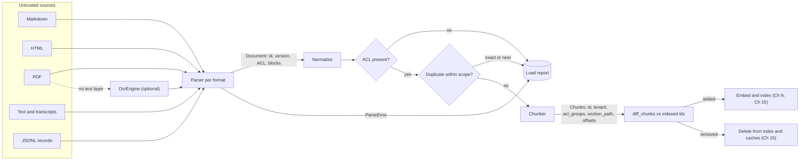
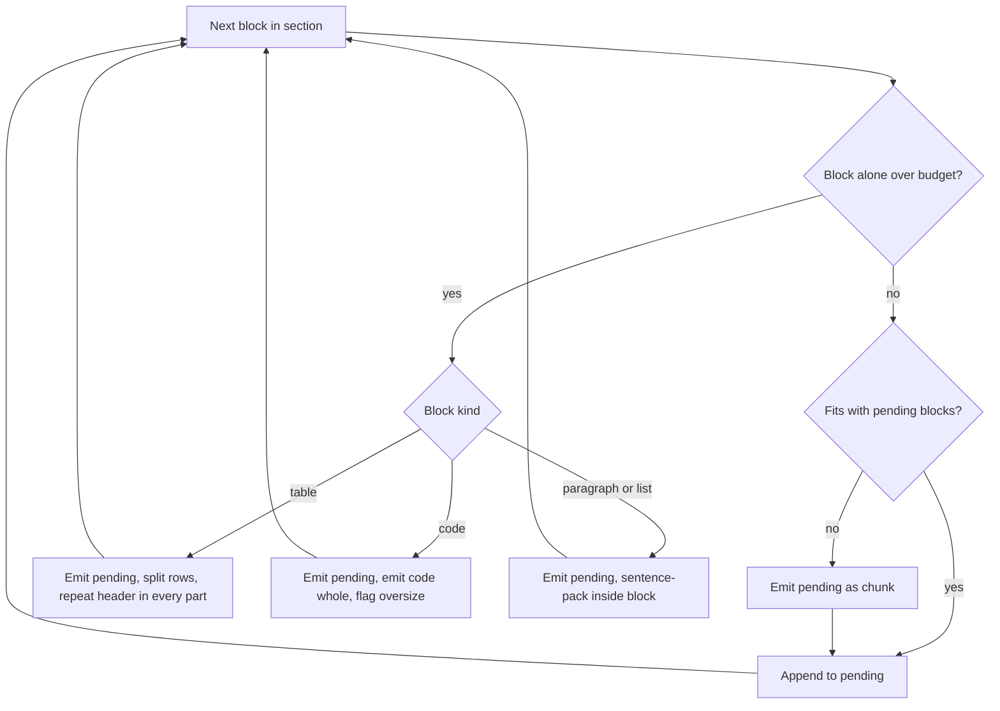
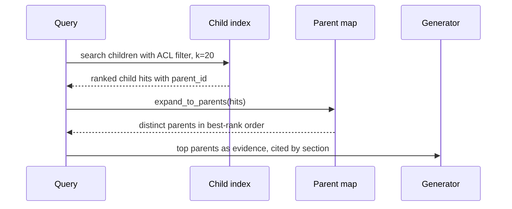

# Chapter 11 — Ingestion and Chunking

After this chapter you will be able to turn a messy corpus of Markdown, HTML, PDF, transcripts, and JSON records into documents with stable identity, permissions, and structure; clean and deduplicate them without changing their meaning; cut them into retrievable chunks with six different strategies; and choose a strategy and size by measurement rather than habit. The code is `ragkit` (`book/projects/ragkit/`), a reusable package that Chapters 12 to 15 and Project 3 import. It has a document model, five parsers with an OCR seam, normalization and MinHash deduplication, six chunkers that share one identity scheme, a corpus loader with an ACL gate, and a chunk-size evaluation script. Its 71 ingestion and chunking tests run offline; Chapters 12 to 14 add their own tests to the same package.

## Why this matters

Chapter 10 ended with a catalogue of naive RAG failures. Two of them start here: the wrong chunk boundary and the missing evidence. A third, the permission leak, often starts here too, because a chunk that lost its ACL during ingestion cannot be filtered at retrieval time. When an answer is wrong, the debugging decision tree from Chapter 10 begins with one question: does the needed fact exist in the corpus as a retrievable unit? Ingestion and chunking decide the answer before any query arrives.

The failures at this stage are quiet. A PDF scan with no text layer parses "successfully" into an empty string and never shows up in results. A table split from its header row is indexed as a list of numbers with no labels. A wiki page copied into three spaces fills the top five results with the same paragraph. A hidden HTML element carrying "ignore your previous instructions" becomes indexed text. A chunk id derived from position changes every time someone adds a sentence near the top of a document, so the indexer re-embeds the whole document and leaves orphans behind. None of these raises an exception. They show up weeks later as a recall drop, a cost spike, or a security review finding.

Chunking also sets the economics of everything downstream. Chunk size decides how many vectors you store, how many tokens each retrieved passage costs in the prompt, and how precisely an embedding represents what a passage is about. Overlap multiplies index size and embedding spend. Semantic chunking multiplies embedding calls at ingestion time. Each of these has measurable effects on retrieval, and this chapter measures them.

## Mental model

> **Mental model:** A chunk is the unit of retrieval, citation, permission, and cost. Design it for all four.

Think of ingestion as a compiler. Sources are the input language, `Document` is the intermediate representation, and `Chunk` is the object code that the index executes. Like a compiler, the pipeline has a front end per format (parsers), a normalization pass that makes equivalent inputs identical, and a back end (chunkers) that targets a specific runtime: an embedding model with an input limit, a retriever with a k, and a generator with a context budget. Also like a compiler, the intermediate representation is where the leverage is. If the parser keeps headings, tables, code blocks, page numbers, and permissions as structure, every chunker can use them. If it flattens everything to a string, no chunker can recover them.

The second half of the model is identity. Every chunk must answer three questions without a database join: which document and version did I come from, who may see me, and where exactly in the source am I? A chunk that cannot answer them cannot be cited, filtered, refreshed, or deleted correctly.

## Core concepts

### The document model and identity

A document is one logical source after parsing: a policy file, a web page, a PDF, a single ticket from a JSONL export. `ragkit.Document` carries four groups of fields.

**Identity.** `id` is a stable identifier chosen by the source owner when possible (Northwind's Markdown front matter has `id: hr-pto-policy`) and derived from the source URI otherwise. `version` is the declared version, or a prefix of the content hash when the source declares none. `content_hash` is the SHA-256 of the normalized text. The three answer different questions: `id` says "which logical thing", `version` says "which edition the owner meant", and `content_hash` says "which exact bytes". A document can change content without a version bump (an editor fixed a typo and forgot), and it can bump a version without changing content (a metadata-only release). Incremental ingestion keys on the hash; humans read the version.

Why not use the file path as the id? Because paths change when someone reorganizes a wiki, and a path-derived id turns a rename into a delete plus an insert, which loses any feedback or evaluation labels attached to the old id. Derived ids are a fallback, and the fallback should hash a URI that is stable across machines (a repository-relative path or a canonical URL), never an absolute path on the ingestion host.

**Provenance.** `source_uri`, `source_type`, and `parser` (a name and version such as `markdown/1`) record how the document was produced. The parser version matters because a parser fix changes the text, and you need to know which documents were produced by the buggy version so you can re-ingest exactly those.

**Permissions.** `tenant` and `acl_groups`. An empty `acl_groups` means nobody may see the document: ingestion fails closed. The alternative, defaulting to `["all"]`, turns every missing front-matter line into a company-wide disclosure. The loader in this chapter goes further and rejects documents without a tenant and ACL by default, reporting them instead of silently indexing them.

**Structure.** `text` is the normalized full text, and `blocks` is the same text cut into typed units: heading, paragraph, list, code, table, quote. Each block knows its `section_path` (the heading breadcrumb, for example `["Retail Returns API v2 Reference", "Rate limits"]`), its page for paginated sources, and its character offsets into `text`. The invariant `doc.text[b.char_start:b.char_end] == b.text` holds for every block and is tested for every parser. Offsets are what make citations precise later: Chapter 13 can highlight the exact span a claim relies on.

A `Chunk` inherits identity and permissions from its document and adds its own: `id`, `content_hash`, `section_path`, `char_start` and `char_end`, `page_start` and `page_end`, `token_count`, `kind` (text, table, code, or mixed), `role` (leaf, parent, or child), `parent_id`, `position`, and `chunker`, a fingerprint (a hash) of the chunking strategy and its configuration. Copying `tenant` and `acl_groups` onto every chunk is deliberate denormalization: the retriever filters on them inside the index query (Chapter 15) and must never need a join that could be skipped.

### Chunk identity that survives edits

Chapter 10 used "document id plus position" as the chunk id and called it fragile. Here is why, and the alternative. Suppose a 40-chunk policy gets a new paragraph at the top. With positional ids, every chunk after the insertion gets a new id. The incremental indexer sees 40 new chunks and 39 deleted ones, re-embeds everything, and any cached answer or feedback keyed on the old ids is orphaned.

`ragkit` derives the chunk id from content and location instead:

```
chunk_id = doc_id + ":" + hash(chunker_fingerprint, section_path, content_hash, occurrence, parent_id)
```

Position is excluded, so inserting text elsewhere does not change the id of an unchanged chunk. The document version is excluded, so a version bump that leaves a section untouched leaves that section's chunk ids untouched. The section path is included, so the same sentence under two different headings yields two ids. The occurrence counter distinguishes identical text appearing twice in the same section. The chunker fingerprint is included, so two configurations can be indexed side by side for an A/B comparison without colliding. A test in the suite edits a policy (new opening paragraph, version bump) and asserts that the three untouched sections keep their ids.

This works best with structure-aware chunkers, whose boundaries are anchored to headings. A fixed-size window chunker shifts every boundary after an insertion, so its chunk contents, and therefore its ids, change anyway. That is a real argument for structure-aware chunking that has nothing to do with retrieval quality: it makes incremental updates cheap.

### Parsing by format

A parser's job is to recover what a human reader of the rendered source would treat as content and structure, and nothing else. Every format has its own way of hiding content, inventing content, or destroying structure.

**Markdown** is the friendliest format and still has traps. Front matter carries identity and ACLs, so a front-matter reader that silently skips a line it does not understand is a permission bug. `ragkit`'s reader handles the flat subset Northwind uses (scalars, quoted strings, inline lists) and raises `ParseError` on anything nested rather than guessing. Fenced code blocks must be recognized before headings, or a `# comment` inside a Python block becomes a heading and corrupts the section tree. Pipe tables must be recognized as tables, or each row becomes a paragraph. HTML comments are invisible in rendered Markdown but present in the source; the parser strips them outside top-level code fences and records how many it removed. Northwind's vendor newsletter, kept in the corpus as a security fixture, hides an injection attempt in exactly such a comment.

**HTML** is mostly chrome. Navigation, headers, footers, cookie banners, scripts, styles, and forms surround a small amount of content. A parser built on the standard library's `html.parser` can drop known chrome tags, map `h1` to `h6` to headings, `p` and `li` to paragraphs and list items, `pre` to code (taking the language from a `language-*` class), and `table` to a table whose first row is the header when it uses `th`. The security-relevant step is dropping content a human never sees: elements with the `hidden` attribute, `aria-hidden="true"`, or inline `display:none` or `visibility:hidden`. Hidden text is a standard carrier for indirect prompt injection (Chapter 26). Removing it at ingestion is cheap defense in depth; the retrieval-time contract that retrieved text is data, not instructions, is still required. Boilerplate detection by tag is crude. Sites that wrap content in generic `div`s need either site-specific selectors or a content-density heuristic, and both should be evaluated on a sample of your pages rather than trusted.

**PDF** is a page-description format, not a document format. A PDF contains drawing instructions that place glyphs at coordinates. Whether there is extractable text at all depends on how the file was produced: an export from a word processor has a text layer, a scan does not, and a "print to PDF" from some tools has a text layer with glyphs in drawing order rather than reading order. The extracted text of a two-column page often interleaves the columns line by line. Running headers and footers repeat on every page and pollute every chunk. Words hyphenated at line ends arrive split ("manage-" and "ment"). Tables arrive as lines of space-separated cells with no boundaries.

`ragkit`'s PDF parser uses pypdf's text layer and is explicit about what it cannot see. Each page gets a `PageInfo` with the number of characters extracted and `needs_ocr=True` when that count is below a threshold (20 characters by default). On documents of three or more pages, running headers and footers are removed by finding lines at page edges that repeat on most pages, with digits masked so "Handbook, page 3" matches "Handbook, page 4". Lowercase hyphenation across line breaks is joined. Page numbers are kept on every block, so chunks report `page_start` and `page_end` and citations can say "page 4".

The text layer is the floor, not the ceiling. Three families of tools recover layout and tables when it is not enough, and they trade cost for fidelity. **Coordinate-aware extraction** reads each glyph's position instead of the content stream order, clusters lines into columns by their x coordinates, and orders blocks top to bottom within a column; it fixes most two-column interleaving at text-extraction speed. **Table detectors** find ruled or whitespace-aligned grids from line and glyph geometry and emit cells, which the parser can turn into the same canonical table block the Markdown and HTML parsers produce; they fail on borderless tables with merged cells, and they need a header heuristic.

**Model-based document parsing** renders each page and asks a layout model or a vision-language model for structured output (headings, paragraphs, tables as rows); it handles the hardest pages, at a per-page model cost, a latency measured in seconds, and a new failure class: plausible text that is not on the page.

Route by need rather than by default. Use the text layer for exported documents, coordinate-aware extraction when a page's line lengths or column statistics suggest multiple columns, and a model only for pages flagged as tables or scans, recording the parser per page in `PageInfo` so each route is its own quality slice. Evaluate any upgrade on a sample of real pages with hand-checked text and tables, because every route looks fine on the page used to demo it. Images, charts, and figures inside documents are a multimodal retrieval problem (Chapter 37).

**OCR.** When a page has no text layer, optical character recognition (rendering the page as an image and recognizing glyphs) is the only way in. OCR is slower than text extraction by orders of magnitude, often runs on separate infrastructure, and produces errors that text extraction never does: confused characters (`0` and `O`, `1` and `l`), lost table structure, and broken reading order. Treat OCR'd documents as a distinct quality slice: tag their blocks with the engine's confidence, track retrieval metrics for that slice separately (Chapter 14), and set a confidence floor below which a page is excluded or routed for review. Confidence numbers are engine-specific and not comparable across engines, so calibrate a floor per engine on a labeled sample.

`ragkit` defines an `OcrEngine` protocol with one method, `ocr_page(pdf_bytes, page_number) -> OcrResult(text, confidence)`, and does not ship an engine. When an engine is supplied, pages that need OCR are sent to it and marked `ocr_applied` with the confidence. When it is not, the document reports `needs_ocr`, and the loader lists it so the pipeline can queue it rather than index an empty page.

**Office documents** (word processor, spreadsheet, and slide formats) are zipped XML. The book does not implement parsers for them; the approach is the same as for HTML. Map paragraphs with heading styles to headings, keep tables as tables, keep slide titles as headings and speaker notes as separate blocks marked as notes, and treat each spreadsheet sheet as a table with its header row. Spreadsheets are usually better handled as structured sources (below) than as text. Implement them behind the same `Parser` protocol so the rest of the pipeline does not change.

**Transcripts** (calls, meetings, incident bridges) have speakers and timestamps. A chunk that merges three speakers without labels loses who committed to what. `ragkit`'s text parser detects transcripts when most lines look like `[00:12:03] Dana: ...`, makes each turn its own block with `speaker` and `timestamp` metadata, and the chunkers lift those into chunk metadata (`speakers`, `start_time`) so retrieval can filter by participant or time range.

**Source code** has syntax-level units: functions, classes, modules. A function cut in half retrieves badly and cannot be cited usefully. Code-aware chunking splits on syntax boundaries (with a parser for the language, or at least with separators like a newline followed by `def ` or `class `), and attaches context that the unit alone lacks: the file path, the enclosing class name, and the imports the function relies on. This chapter's recursive chunker accepts custom separators for exactly this purpose (exercise P2); full syntax-tree chunking is a natural extension behind the same interface. For code embedded in documentation, the rule is simpler: never split a fenced block.

### Tables

Tables deserve their own section because they are where naive pipelines lose the most meaning. A table row means something only together with its header: "| Internal tools | 100 requests/minute |" is interpretable, "| 100 | 422 | expired |" is not. Three representations are common:

1. **Keep the table whole** as rendered text (a canonical pipe table). Best when the table fits the chunk budget, which most documentation tables do.
2. **Split by rows and repeat the header** in every part. Each part is self-describing; the cost is the repeated header tokens, a few percent of the index at typical budgets and 11 points at the extreme 48-token budget in the evaluation below.
3. **Serialize each row as a sentence** with column names ("Client type: Internal tools. Limit: 100 requests per minute."). This makes each row retrievable on its own and works well for lookup tables, at the cost of destroying cross-row relationships (totals, comparisons, "the row above").

Large or numeric tables are often better not embedded at all: load them into a database and answer questions with SQL (Chapter 1's decision ladder, and the semantic-layer tool in later chapters). `ragkit` renders every table canonically, without the alignment padding authors add for readability, because padding costs tokens and carries no meaning. The vendor newsletter's padded catalogue table loses about a third of its characters when re-rendered. The section-aware chunker implements options 1 and 2.

### Cleaning and normalization

Normalization makes equivalent content byte-identical, so that hashes, caches, and deduplication work, and removes text that would pollute retrieval. Its constraint is that it must never change meaning.

**Unicode.** The same visible text can be encoded several ways: composed or decomposed accents, ligatures (the single glyph "fi"), full-width digits, non-breaking spaces, zero-width joiners, and soft hyphens. NFC normalization unifies composed and decomposed forms. NFKC also folds compatibility characters: ligatures become letters and full-width digits become ASCII, which helps matching, but it also turns "m²" into "m2" and "½" into "1⁄2". `ragkit` defaults to NFKC for prose and makes the form configurable, and it removes zero-width characters and soft hyphens, which are invisible and break token matching.

**Whitespace.** Line endings are unified, runs of spaces and tabs collapse, and three or more newlines collapse to a paragraph break. Hard-wrapped Markdown paragraphs are reflowed into single lines by the parser, which helps sentence splitting.

**Boilerplate.** Page counters ("Page 3 of 12"), confidentiality footers, copyright lines, and email unsubscribe footers repeat across documents. Left in, they make every chunk slightly similar to every other chunk and slightly dissimilar from its own topic. `ragkit` removes lines that fully match a small, configurable list of patterns. Removing whole lines only, and only on full matches, keeps the risk of deleting real content low.

**Code is data.** Collapsing spaces in a Python block changes its meaning, and NFKC can alter string literals. The normalizer only unifies line endings and removes invisible characters inside code blocks. Tables are normalized cell by cell and re-rendered.

Normalization runs on blocks, not on the flat text, and then the document is rebuilt so offsets and the content hash stay correct. A normalization change is a re-ingestion event: every content hash may change, so incremental indexers will see changed documents. Version the normalization configuration with the parser.

### Metadata extraction

Metadata is everything about a chunk that is not its text and that someone will want to filter, sort, display, or debug by. Sources provide some of it explicitly (front matter fields such as owner, tags, and updated date; HTML meta tags; PDF document info; JSON fields). Structure provides more (section path, page numbers, block kinds, speakers). Some must be derived: language detection, entity extraction (product names, error codes, ticket ids), or a document type classifier. Derived metadata from a model is an extraction problem with its own evaluation (Chapter 6); do not let an unvalidated classifier write a field that a permission filter or a freshness rule depends on.

Freshness and authority are metadata that later stages depend on, so they need a convention, not an ad hoc field per corpus. `ragkit` copies every front-matter key that is not an identity or permission field into `Document.metadata`, and chunks inherit it, so a document can declare `effective_date: 2026-01-01` and `supersedes: [hr-faq]` and Chapter 13's evidence packer reads both: it prefers the newer effective date over a file's `updated_at`, and an explicit supersedes link resolves a conflict that a heuristic can only guess at. The Northwind corpus states its supersession only in prose ("This version (3.0) supersedes PTO Policy 2.2 ... and any older guidance, including HR FAQ entries"), which is the normal state of real corpora and the root of the stale-FAQ failure from Chapter 10.

Treat these fields like permissions: they come from the document system or a reviewed authority map, never from a model reading the prose, because a wrong `supersedes` silently hides a correct source. Project 3 (Chapter 15) supplies them through an ingestion-side authority map.

Two rules keep metadata useful. First, keep it flat and typed on the chunk: `priority: "P1"`, not a nested blob, because vector stores filter on flat fields. Second, separate what controls access (tenant, ACL groups) from what helps relevance (tags, section path). The first must come from an authoritative source and be validated; the second can be best-effort.

`Chunk.embedding_text()` puts some metadata to work: it prefixes the chunk with a breadcrumb of title and section path ("NorthGate VPN Access Runbook > Troubleshooting") before embedding or lexical indexing. A chunk from a "Troubleshooting" section does not mention which product it troubleshoots; the breadcrumb restores that context. `Chunk.text` stays clean so that citations quote the source exactly. Chapter 12 develops the stronger version of this idea, contextual retrieval, where a model writes a short situating sentence per chunk.

### Structured versus unstructured sources

Tickets, CRM notes, FAQ entries, and product catalogs arrive as records with fields. Some fields are prose worth embedding (subject, body, resolution); others are facts worth filtering on (category, priority, status, tenant, dates). Treating the whole record as text and embedding it ("priority: P1" somewhere in a vector) loses the ability to filter on it exactly. Treating the whole record as structured data loses the prose.

`ragkit`'s JSONL parser does both. Configured text fields are rendered as labeled paragraphs ("Subject: ...", "Body: ...", "Resolution: ...") and the remaining scalar fields become flat metadata. "Open P1 payment tickets similar to this one" then becomes a metadata filter plus a semantic query. Each record becomes its own document with `source_uri` set to `tickets.jsonl#TCK-2026-0001`, and its version is a hash of the record, so a changed record is detected without a declared version field. Bad lines either fail the file with the line number or are skipped and collected in `parser.errors`, depending on configuration; silent skipping is not an option.

For questions about structured facts ("how many P1 tickets last week"), retrieval over text is the wrong tool. Query the system of record.

### Deduplication

Enterprise corpora are full of duplicates: the same policy exported to two wikis, a runbook copied into a team space and edited slightly, an email thread quoted in ten replies, an old version kept next to the new one. Duplicates waste index space and embedding spend, and they crowd results: if the top five chunks are the same paragraph from five copies, the generator sees one piece of evidence five times and nothing else.

**Exact duplicates** are found by content hash after normalization. Normalization matters here: two copies that differ only in trailing spaces or a non-breaking space must hash equally.

**Near duplicates** need a similarity measure. Jaccard similarity of word shingles (overlapping sequences of k words, five by default) is a good one for text reuse: two documents that share 90 percent of their five-word sequences are near copies. Computing it for every pair is quadratic.

MinHash compresses each shingle set into a fixed-length signature (128 values here), with the property that the fraction of positions where two signatures agree is an unbiased estimate of their Jaccard similarity. Banded locality-sensitive hashing (LSH) then splits each signature into b bands of r rows, where each band is a slice of r signature values, and two documents become candidates only if at least one band matches exactly. A pair with similarity s collides with probability 1 - (1 - s^r)^b. With 16 bands of 8 rows (illustrative, the defaults here), a pair at s = 0.9 collides with probability above 0.999, a pair at s = 0.5 with probability about 0.06, and the curve's midpoint sits near (1/16)^(1/8), about 0.71. Candidates are then checked against the threshold using the full signature.

**Scope matters more than the algorithm.** Two documents with identical text and different ACLs are not duplicates for retrieval. Merging them either leaks the restricted copy to everyone or hides the public copy from everyone. `ragkit` deduplicates only within a permission scope, keyed on tenant and sorted ACL groups, and keeps the newest copy by default. It records every dropped document with the id it duplicates and the similarity, so the decision can be audited and reversed.

Superseded versions are a related but different problem. Northwind's HR FAQ still describes the old five-day PTO carryover limit, while the PTO policy 3.0 says ten. These are not near duplicates (the documents differ substantially), and deduplication will not save you. Version conflicts are handled with metadata (updated dates, supersedes links) and at generation time (Chapter 13's handling of conflicting evidence). Near-duplicate detection can also run on chunks rather than documents, to drop repeated disclaimers and boilerplate paragraphs that slipped past the pattern list.

### Chunking strategies

Why chunk at all? Embedding models have input limits, retrieval returns units rather than documents, and every retrieved unit costs prompt tokens. A boundary therefore decides whether the evidence a question needs lands in one retrievable unit. A bad cut produces the failures this chapter opened with: a table row orphaned from its header, or a chunk that says "this limit does not apply to contractors" with no referent.

A small invented section shows how strategies differ. Here it is, cut by three of them at a 24-token budget (`¦` marks a boundary, `...` elides text):

```text
## Rate limits
Internal tools get 100 requests per minute; partner integrations get 20.
| Client type    | Limit          |
|----------------|----------------|
| Internal tools | 100 req/minute |
| Partners       | 20 req/minute  |
Requests over the limit return HTTP 429.

fixed windows     : ## Rate limits ... | Client type | Limit | | ¦ ---|---| | Internal tools ... ¦ ...
sentence packing  : ## Rate limits ... get 20. | Client type | Limit | ¦ |---|---| | Internal tools | 100 req/minute | ¦ | Partners | 20 req/minute | Requests over ...
section-aware     : the whole section, heading and table together, is one chunk
```

The fixed window cuts wherever the count runs out, here inside a table row. Sentence packing never cuts inside a sentence, but each table row counts as a sentence, so at this small budget the header lands in one chunk and the rows in others. The section-aware chunker keeps the section whole and would split an oversized table with its header repeated. At budgets of 150 tokens or more, sentence packing also keeps this section whole; the strategies diverge only when a section exceeds the budget. The rest of this section explains each strategy and when its trade-offs pay.

All six strategies in `ragkit` answer the same question, "where should the cuts go?", and differ in what they look at. They share one finalization step that computes token counts, inherits permissions and metadata, assigns section paths and pages from the document's blocks, and derives ids. That shared step is why the strategies can be swapped and compared fairly.

**Fixed-size token windows** (`FixedTokenChunker`) slide a window of N tokens with a stride (the step between window starts) of N minus the overlap. They look at nothing but the token sequence. Their virtues are real: every chunk fits the embedding model's input limit, behavior is perfectly predictable, and they are fast. Their weakness is that boundaries fall wherever the count runs out: mid-sentence, between a table header and its rows, through a code block. Use them as the baseline every other strategy must beat, and for homogeneous prose with no useful structure. Chapter 10's baseline used characters; tokens are better because the budgets they serve (embedding input, prompt context) are counted in tokens.

**Recursive splitting** (`RecursiveChunker`) tries the coarsest separator first (paragraph breaks), recursing into finer separators (line breaks, sentence ends, spaces, and finally token windows) only for pieces that are still too large, and then greedily merges small adjacent pieces up to the budget. It respects whatever natural boundaries the text has without needing a parser, which makes it a strong default for unstructured text. Its overlap is applied in whole pieces, so with paragraph-sized pieces the effective overlap is often zero. That is usually fine. Custom separator lists make it code-aware or format-aware.

**Sentence and paragraph packing** (`SentenceChunker`) splits text into sentences and packs them up to the budget, never cutting inside a sentence unless one sentence alone exceeds the budget. Paragraphs that fit are packing units, so chunk boundaries fall between paragraphs whenever possible. Overlap is a number of trailing sentences repeated at the start of the next chunk. The splitter is rule-based: it handles abbreviations, initials, version numbers, and decimals, and treats newlines as boundaries because, in parsed documents, newlines separate list items, table rows, and code lines. Statistical splitters handle messy prose better; a deterministic one with no dependencies is the right default for a library. This strategy suits prose where sentence integrity matters (policies, articles) but where structure is weak or untrusted.

**Document-aware chunking** (`MarkdownSectionChunker`) works on parsed blocks, so it applies to Markdown, HTML, JSONL, and transcripts alike. A heading starts a new section and chunks never span sections. Within a section, blocks are packed up to the budget, with the heading line at the top of the section's first chunk (unless that first block is itself oversized, in which case the heading survives only in `section_path`). Code blocks are atomic: never split, even when oversized, in which case the chunk is flagged `oversize` so you can see it and decide. Tables are atomic when they fit and split by rows with a repeated header when they do not. An oversized paragraph falls back to sentence packing inside that block. A heading with no body produces no chunk, because its title already appears in the section path of its subsections. This is the strongest default for documentation, policies, and runbooks: boundaries match how authors organized meaning, citations can name a section, and, as shown above, ids survive edits.

**Semantic chunking** (`SemanticChunker`) embeds each sentence (optionally with neighbors on each side to smooth noise), computes the cosine distance between consecutive sentence embeddings, and cuts where the distance exceeds a threshold, either absolute or a percentile of the document's own distances. It then enforces maximum and minimum sizes. The appeal is boundaries at topic shifts in text that has no headings: transcripts, long emails, scraped articles.

The costs are concrete. Ingestion embeds every sentence: a 2,000-token document with 100 sentences of about 20 tokens, embedded with a window of one neighbor on each side, sends roughly 6,000 tokens to the embedding model to produce boundaries, three times what embedding the final chunks costs (illustrative arithmetic). Boundaries depend on the embedding model, so the model id is part of the fingerprint and a model change re-chunks the corpus. And the topic-shift signal is noisy: published comparisons and practitioner reports are mixed on whether it beats a good recursive or section-aware baseline. Measure before you pay for it.

**Parent-child chunking** (`ParentChildChunker`) produces two levels: parents (by default sections up to 800 tokens) and children cut inside each parent (by default sentence packs up to 128 tokens). You index the children and, when a child is retrieved, give the generator its parent. Small children produce precise embeddings that match specific questions; parents restore the definitions, qualifiers, and neighboring rows that a child alone would lack. The cost is a second lookup at query time, more vectors in the index, and larger evidence in the prompt. `expand_to_parents` maps ranked child hits to parents, keeping the best rank and dropping repeats, so three hits inside one section become one passage. Chapter 12 builds parent-document retrieval on top of this.

### Overlap

Overlap repeats the end of one chunk at the start of the next, so that a fact near a boundary appears whole in at least one chunk. It is a patch for structure-blind boundaries, and it is not free. With a window of N and overlap O, the index holds about N / (N - O) times the corpus tokens: 256 with 32 overlap is about 14 percent more vectors, tokens, and embedding spend (the evaluation below measures 12 to 13 percent). Overlap also produces near-duplicate retrieval results: two adjacent chunks sharing 32 tokens often both make the top k for a question about those 32 tokens, wasting a slot. And it makes evidence packing harder, because the packer must detect and merge overlapping spans (Chapter 13).

Use overlap with fixed and recursive chunkers on unstructured text, keep it small (10 to 15 percent is a common starting range), and prefer sentence-level overlap to token-level overlap so that the repeated part is a whole sentence. With section-aware or parent-child chunking, overlap is usually unnecessary: the boundaries are meaningful, and parents supply the surrounding context at generation time.

### Chunk size

There is no universal chunk length. Small chunks retrieve precisely, because the embedding represents one idea and lexical scores are not diluted, but they lose context: a chunk that says "this limit does not apply to contractors" without saying which limit is useless alone. Large chunks keep context but dilute relevance: an embedding of a 1,000-token section is an average of many ideas, and a question about one of them may match a different, more focused chunk better. Large chunks also cost more per retrieved passage, so at a fixed context budget you can afford fewer of them, which reduces the diversity of evidence.

What determines the right size is the shape of your questions and your documents. Lookup questions over reference material ("what does error RET-005 mean") want small units. Synthesis questions over policies ("what happens to my carryover if I leave in February") want the whole section. Compact FAQ entries chunk well at 100 tokens; long-form policy sections at 300 to 500. The embedding model's input limit sets a hard ceiling, and its quality at long inputs, which varies by model, sets a softer one. Parent-child chunking exists precisely because one size cannot serve both retrieval precision and generation context.

So measure. The measurement must target evidence the answers actually need, not documents: a question is answered by specific spans, so a chunker should be judged on whether those spans land together in one retrievable chunk (this chapter calls that span integrity) and whether retrieval finds it. The evaluation section below does this on the Northwind corpus and shows how the numbers move.

## How it works

Follow one document, Northwind's `retail-returns-api.md`, through the pipeline.

1. **Parse.** `MarkdownParser` splits off the front matter and reads `id: prod-retail-returns-api`, `version: "2.3"`, `tenant: retail`, `acl_groups: ["all"]`, plus owner and tags, which become metadata. It strips HTML comments outside code fences, then walks the body line by line: an ATX heading pushes onto the section stack, a fence opens a code block that runs until the matching fence, a line starting with `|` followed by a separator line starts a table, list items and their continuation lines form a list block, and everything else accumulates into paragraphs that are reflowed onto one line. The `DocumentBuilder` stamps each block with the current section path and assembles `text` with blank lines between blocks, recording offsets.
2. **Normalize.** `normalize_document` applies Unicode and whitespace normalization and boilerplate removal block by block, leaves code blocks alone except for line endings, re-renders tables from normalized cells, and rebuilds the document so offsets and `content_hash` are fresh.
3. **Gate.** The loader checks `has_acl` (tenant and at least one group) and rejects the document otherwise. It checks for empty text and for pages that need OCR.
4. **Deduplicate.** Within the scope `(retail, ["all"])`, the content hash is checked against earlier documents, then the MinHash signature is checked against the LSH index. The returns API has no duplicates, so it is kept.
5. **Chunk.** `MarkdownSectionChunker(300)` groups blocks into sections. "Authentication" becomes one chunk with its heading. "Rate limits" becomes one chunk containing the heading, the table, and the paragraph after it (kind `mixed`). The `POST /v2/returns/validate` section's JSON code block stays intact with its explanatory sentences. With a budget of 48 tokens the error-code table no longer fits, so it is split into parts, each starting with `| Code | HTTP | Meaning |` and its separator line.
6. **Finalize.** For each piece, `BaseChunker.finalize` slices the text, finds the covered blocks to infer the kind and lift block metadata, copies `tenant`, `acl_groups`, title, source URI and updated date, counts tokens, and derives the id from the fingerprint, section path, content hash, and occurrence.
7. **Hand off.** The chunks go to the index (Chapter 9's store, Chapter 15's worker). On the next ingestion run, `diff_chunks` compares the ids already indexed for this document with a fresh chunking and returns what to embed, what to keep, and what to delete.

## Architecture

The first diagram is the offline ingestion path with its exits. Every document either becomes chunks or ends up in a report with a reason; nothing disappears silently.



The second diagram is the decision logic of the section-aware chunker for each block inside a section. It shows why code and tables survive and where the oversize escape hatches are.



The third diagram shows how parent-child chunks are used at query time: children are what the retriever sees, parents are what the generator reads.



## Implementation

The package layout:

```
book/projects/ragkit/
  pyproject.toml   README.md   .env.example
  eval_data/chunk_eval_gold.jsonl
  ragkit/
    __init__.py  documents.py  tokenizers.py  settings.py  normalize.py  pipeline.py
    parsers/   __init__.py  base.py  markdown.py  html.py  pdf.py  text.py  jsonl.py
    chunking/  __init__.py  base.py  fixed.py  recursive.py  sentences.py  sentence.py
               section.py  semantic.py  parent_child.py
    eval/      __init__.py  chunk_size.py
  tests/       conftest.py  pdf_fixtures.py  test_documents.py  test_parsers.py
               test_normalize.py  test_chunkers.py  test_pipeline_and_eval.py
```

Install and run:

```bash
cd book/projects/ragkit
uv pip install -e ../aie_core -e .      # fallback: pip install -e ../aie_core && pip install -e .
pytest -q tests/test_documents.py tests/test_parsers.py tests/test_normalize.py tests/test_chunkers.py tests/test_pipeline_and_eval.py   # 71 passed, offline
python -m ragkit.eval.chunk_size --docs ../shared-data/docs --gold eval_data/chunk_eval_gold.jsonl --k 3
```

Configuration is optional and read from environment variables:

| Variable | Default | Meaning |
|---|---|---|
| `RAGKIT_TOKENIZER` | `regex` | `regex` (deterministic, offline) or `tiktoken` |
| `RAGKIT_TIKTOKEN_ENCODING` | `cl100k_base` | encoding for the tiktoken tokenizer |
| `RAGKIT_PDF_MIN_CHARS_PER_PAGE` | `20` | thinner text layers are flagged `needs_ocr` |
| `RAGKIT_REQUIRE_ACL` | `true` | the loader rejects documents without tenant and ACL |
| `RAGKIT_NEAR_DUPLICATE_THRESHOLD` | `0.9` | estimated Jaccard above which a document is a near duplicate |
| `EMBEDDING_PROVIDER`, `EMBEDDING_MODEL` | `fake` | read by `aie_core`; used for semantic chunking |

### The document model

`Document`, `Block`, and `Chunk` carry the fields described above. Watch `assemble`, which records block offsets, and, under Parsers below, the identity precedence in `DocumentBuilder`.

```python
# path: book/projects/ragkit/ragkit/documents.py
"""The document model every later RAG chapter builds on.

A `Document` is one logical source (a policy file, a web page, a PDF, one JSONL record) after
parsing. It carries identity (id, version, content_hash), provenance (source_uri, parser),
permissions (tenant, acl_groups), and structure (blocks with section paths and character
offsets into `text`). A `Chunk` is the retrievable unit derived from a document. It copies the
permission fields so that retrieval can filter without a join, and it records where it came
from (doc_id, version, section_path, char offsets, pages) so that answers can be traced back
to a source and stale chunks can be found and deleted.
"""
from __future__ import annotations

import hashlib
from enum import Enum
from typing import Any, Iterable, Literal

from pydantic import BaseModel, Field, model_validator

BlockKind = Literal["heading", "paragraph", "list", "code", "table", "quote"]
ChunkKind = Literal["text", "table", "code", "mixed"]
ChunkRole = Literal["leaf", "parent", "child"]

BLOCK_SEPARATOR = "\n\n"


class SourceType(str, Enum):
    MARKDOWN = "markdown"
    HTML = "html"
    PDF = "pdf"
    TEXT = "text"
    JSONL = "jsonl"


# ----------------------------------------------------------------------------- hashing
def sha256_text(text: str) -> str:
    return hashlib.sha256(text.encode("utf-8")).hexdigest()


def short_hash(*parts: object, length: int = 16) -> str:
    """Stable hash of several values. Never use Python's hash(): it is salted per process."""
    joined = "\x1f".join(str(p) for p in parts)
    return hashlib.sha256(joined.encode("utf-8")).hexdigest()[:length]


def doc_id_from_uri(source_uri: str) -> str:
    """Fallback document id when the source does not declare one."""
    return f"doc-{short_hash(source_uri)}"


# ----------------------------------------------------------------------------- structure
class Block(BaseModel):
    """One structural unit of a parsed document, rendered as it appears in `Document.text`."""

    kind: BlockKind
    text: str
    level: int | None = None  # heading level 1-6
    section_path: list[str] = Field(default_factory=list)
    page: int | None = None  # 1-based page for paginated sources
    char_start: int = 0
    char_end: int = 0
    meta: dict[str, Any] = Field(default_factory=dict)


class PageInfo(BaseModel):
    number: int  # 1-based
    char_count: int  # characters in the extracted text layer
    needs_ocr: bool  # the text layer was empty or too thin to trust
    ocr_applied: bool = False
    ocr_confidence: float | None = None


def assemble(blocks: Iterable[Block]) -> tuple[str, list[Block]]:
    """Join blocks into document text and recompute every block's character offsets."""
    out: list[Block] = []
    parts: list[str] = []
    cursor = 0
    for b in blocks:
        if not b.text:
            continue
        if parts:
            parts.append(BLOCK_SEPARATOR)
            cursor += len(BLOCK_SEPARATOR)
        parts.append(b.text)
        out.append(b.model_copy(update={"char_start": cursor, "char_end": cursor + len(b.text)}))
        cursor += len(b.text)
    return "".join(parts), out


class Document(BaseModel):
    id: str
    version: str
    source_uri: str
    source_type: SourceType
    title: str = ""
    tenant: str | None = None
    acl_groups: list[str] = Field(default_factory=list)  # empty means nobody: fail closed
    updated_at: str | None = None
    metadata: dict[str, Any] = Field(default_factory=dict)
    parser: str  # name/version of the parser that produced this document
    text: str
    blocks: list[Block] = Field(default_factory=list)
    pages: list[PageInfo] = Field(default_factory=list)
    content_hash: str = ""

    @model_validator(mode="after")
    def _fill_hash(self) -> "Document":
        if not self.content_hash:
            self.content_hash = sha256_text(self.text)
        return self

    @property
    def has_acl(self) -> bool:
        return self.tenant is not None and len(self.acl_groups) > 0

    @property
    def needs_ocr(self) -> bool:
        return any(p.needs_ocr and not p.ocr_applied for p in self.pages)

    def with_blocks(self, blocks: Iterable[Block], **updates: Any) -> "Document":
        """Return a copy rebuilt from `blocks`, with fresh text, offsets, and content hash."""
        text, rebuilt = assemble(blocks)
        data = self.model_dump()
        data.update(updates)
        data.update({"text": text, "blocks": [b.model_dump() for b in rebuilt], "content_hash": ""})
        return Document.model_validate(data)

    def visible_to(self, groups: Iterable[str], tenant: str | None = None) -> bool:
        """Same rule as the shared dataset: tenant must match or be `shared`, and a group must overlap."""
        if tenant is not None and self.tenant not in ("shared", tenant):
            return False
        return bool(set(self.acl_groups) & set(groups))


class Chunk(BaseModel):
    id: str
    doc_id: str
    version: str  # version of the document this chunk was cut from
    text: str
    content_hash: str
    tenant: str | None
    acl_groups: list[str]
    metadata: dict[str, Any] = Field(default_factory=dict)
    section_path: list[str] = Field(default_factory=list)
    parent_id: str | None = None
    position: int  # order within the chunker's output for this document
    char_start: int  # span in Document.text this chunk covers
    char_end: int
    token_count: int
    kind: ChunkKind = "text"
    role: ChunkRole = "leaf"
    page_start: int | None = None
    page_end: int | None = None
    chunker: str  # fingerprint of the chunker and its configuration

    def context_header(self) -> str:
        title = str(self.metadata.get("title", "")).strip()
        crumbs = [s for s in self.section_path if s and s != title]
        parts = [p for p in [title, *crumbs] if p]
        return " > ".join(parts)

    def embedding_text(self) -> str:
        """Text to embed or index: a breadcrumb of title and section, then the chunk body.

        The breadcrumb restores context the chunk lost when it was cut out of its document.
        Keep `text` itself clean so that citations quote the source exactly.
        """
        header = self.context_header()
        return f"{header}\n\n{self.text}" if header else self.text


__all__ = [
    "Block",
    "BlockKind",
    "Chunk",
    "ChunkKind",
    "ChunkRole",
    "Document",
    "PageInfo",
    "SourceType",
    "assemble",
    "doc_id_from_uri",
    "sha256_text",
    "short_hash",
    "BLOCK_SEPARATOR",
]
```

### Tokenizers with spans

Chunk budgets are in tokens, but chunk text must be exact source text. Re-joining decoded tokens alters whitespace and breaks citation offsets, so every tokenizer returns character spans and chunkers slice `Document.text` at those offsets. The default `RegexTokenizer` counts words and punctuation marks. It is deterministic and dependency-free, and it differs from a subword tokenizer by tens of percent on rare words and code, so production systems should count with the embedding model's own tokenizer (`TiktokenTokenizer` is one example, via `RAGKIT_TOKENIZER=tiktoken`).

```python
# path: book/projects/ragkit/ragkit/tokenizers.py  (excerpt; full file on disk)
class RegexTokenizer:
    name = "regex-v1"
    _PATTERN = re.compile(r"\w+|[^\w\s]", re.UNICODE)

    def spans(self, text: str) -> list[Span]:
        return [m.span() for m in self._PATTERN.finditer(text)]

    def count(self, text: str) -> int:
        return len(self._PATTERN.findall(text))
```

### Parsers

All parsers implement one protocol and return a list of documents (JSONL yields many, the others one). `DocumentBuilder` tracks the heading stack and resolves identity with a fixed precedence: what the source declares, then caller-supplied defaults, then derived values.

```python
# path: book/projects/ragkit/ragkit/parsers/base.py  (excerpt; full file on disk)
class DocDefaults(BaseModel):
    """Values applied when the source itself does not declare them (front matter wins)."""

    id: str | None = None
    version: str | None = None
    title: str | None = None
    tenant: str | None = None
    acl_groups: list[str] | None = None
    updated_at: str | None = None
    metadata: dict[str, Any] = Field(default_factory=dict)


@runtime_checkable
class Parser(Protocol):
    source_type: SourceType
    version: str

    def parse(self, raw: bytes | str, *, source_uri: str, defaults: DocDefaults | None = None) -> list[Document]: ...
```
```python
# path: book/projects/ragkit/ragkit/parsers/base.py  (excerpt; full file on disk)
    def build(
        self,
        *,
        source_uri: str,
        source_type: SourceType,
        parser: str,
        defaults: DocDefaults | None,
        declared: dict[str, Any] | None = None,
        pages: list[PageInfo] | None = None,
        fallback_title: str = "",
        metadata: dict[str, Any] | None = None,
    ) -> Document:
        """Resolve identity and permissions: declared (front matter) > defaults > derived."""
        d = defaults or DocDefaults()
        declared = declared or {}
        text, blocks = assemble(self.blocks)

        def pick(key: str) -> Any:
            value = declared.get(key)
            return value if value not in (None, "", []) else getattr(d, key)

        acl = pick("acl_groups")
        if isinstance(acl, str):
            acl = [acl]
        meta = {**d.metadata, **(metadata or {})}
        meta.update({k: v for k, v in declared.items() if k not in _IDENTITY_KEYS})
        return Document(
            id=str(pick("id") or doc_id_from_uri(source_uri)),
            version=str(pick("version") or sha256_text(text)[:12]),
            source_uri=source_uri,
            source_type=source_type,
            title=str(pick("title") or self.first_heading or fallback_title),
            tenant=pick("tenant"),
            acl_groups=[str(g) for g in (acl or [])],
            updated_at=None if pick("updated_at") is None else str(pick("updated_at")),
            metadata=meta,
            parser=parser,
            text=text,
            blocks=blocks,
            pages=pages or [],
        )
```

The Markdown body loop shows the order that matters: fences before headings, tables before paragraphs.

```python
# path: book/projects/ragkit/ragkit/parsers/markdown.py  (excerpt; full file on disk)
    def _parse_body(self, body: str, b: DocumentBuilder) -> None:
        lines = body.split("\n")
        i, n = 0, len(lines)
        para: list[str] = []

        def flush() -> None:
            if para:
                b.paragraph(" ".join(s.strip() for s in para))
                para.clear()

        while i < n:
            line = lines[i]
            stripped = line.strip()
            fence = _FENCE.match(line)
            if fence:
                flush()
                marker, lang = fence.group(2), fence.group(3)
                code: list[str] = []
                i += 1
                closed = False
                while i < n:
                    if lines[i].strip().startswith(marker[0] * len(marker)) and lines[i].strip().strip(marker[0]) == "":
                        closed = True
                        i += 1
                        break
                    code.append(lines[i])
                    i += 1
                b.code("\n".join(code), lang, **({} if closed else {"unclosed": True}))
                continue
            heading = _HEADING.match(line)
            if heading:
                flush()
                b.heading(heading.group(2), len(heading.group(1)))
                i += 1
                continue
            if stripped.startswith("|") and i + 1 < n and _TABLE_SEP.match(lines[i + 1]):
                flush()
                header = _cells(line)
                rows: list[list[str]] = []
                i += 2
                while i < n and lines[i].strip().startswith("|"):
                    rows.append(_cells(lines[i]))
                    i += 1
                b.table(header, rows)
                continue
            if _LIST_ITEM.match(line):
                flush()
                items: list[str] = []
                while i < n and lines[i].strip():
                    if _LIST_ITEM.match(lines[i]) or not items:
                        items.append(lines[i].rstrip())
                    else:  # continuation line of the previous item
                        items[-1] = f"{items[-1]} {lines[i].strip()}"
                    i += 1
                b.list_block("\n".join(items))
                continue
            if stripped.startswith(">"):
                flush()
                quote: list[str] = []
                while i < n and lines[i].strip().startswith(">"):
                    quote.append(lines[i].strip()[1:].strip())
                    i += 1
                b.quote(" ".join(q for q in quote if q))
                continue
            if not stripped:
                flush()
            else:
                para.append(line)
            i += 1
        flush()
```

The HTML extractor's hidden-content rule, and the PDF parser's per-page quality accounting and OCR seam (full files on disk):

```python
# path: book/projects/ragkit/ragkit/parsers/html.py  (excerpt; full file on disk)
    def _is_hidden(self, attrs: dict[str, str | None]) -> bool:
        if "hidden" in attrs:
            return True
        if (attrs.get("aria-hidden") or "").lower() == "true":
            return True
        return bool(_HIDDEN_STYLE.search(attrs.get("style") or ""))
```
```python
# path: book/projects/ragkit/ragkit/parsers/pdf.py  (excerpt; full file on disk)
class OcrResult(BaseModel):
    text: str
    confidence: float  # 0..1 as reported by the engine; engines differ in calibration


@runtime_checkable
class OcrEngine(Protocol):
    name: str

    def ocr_page(self, pdf_bytes: bytes, page_number: int) -> OcrResult: ...
```
```python
# path: book/projects/ragkit/ragkit/parsers/pdf.py  (excerpt; full file on disk)
        pages: list[PageInfo] = []
        page_lines: list[list[str]] = []
        for number, text in enumerate(page_texts, start=1):
            chars = len(text.strip())
            info = PageInfo(number=number, char_count=chars, needs_ocr=chars < self.min_chars_per_page)
            if info.needs_ocr and self.ocr is not None:
                result = self.ocr.ocr_page(raw, number)
                text = result.text
                info.ocr_applied = True
                info.ocr_confidence = result.confidence
            elif info.needs_ocr:
                text = ""
            pages.append(info)
            page_lines.append(text.replace("\r\n", "\n").split("\n"))

        if self.remove_repeated_lines and len(page_lines) >= 3:
            page_lines = strip_repeated_lines(page_lines)

        builder = DocumentBuilder()
        for info, lines in zip(pages, page_lines):
            builder.page = info.number
            lines = [ln for ln in lines if not _PAGE_NUMBER_LINE.match(ln)]
            for para in _paragraphs("\n".join(lines)):
                meta = {"ocr": True, "ocr_confidence": info.ocr_confidence} if info.ocr_applied else {}
                builder.paragraph(para, **meta)
```

The JSONL parser's split between rendered text and filterable metadata:

```python
# path: book/projects/ragkit/ragkit/parsers/jsonl.py  (excerpt; full file on disk)
    def _record_to_document(self, record: dict[str, Any], source_uri: str, defaults: DocDefaults | None) -> Document:
        rid = record.get(self.id_field)
        if rid in (None, ""):
            raise ValueError(f"missing id field {self.id_field!r}")
        builder = DocumentBuilder()
        rendered = 0
        for field in self.text_fields:
            value = record.get(field)
            if value in (None, ""):
                continue
            text = value if isinstance(value, str) else json.dumps(value, ensure_ascii=False)
            label = field.replace("_", " ").capitalize()
            builder.paragraph(f"{label}: {text}" if self.label_fields else text, field=field)
            rendered += 1
        if rendered == 0:
            raise ValueError(f"none of the text fields {self.text_fields} has content")

        rendered_set = set(self.text_fields)
        if self.metadata_fields is None:
            meta = {k: v for k, v in record.items() if k not in rendered_set and isinstance(v, (str, int, float, bool))}
        else:
            meta = {k: record[k] for k in self.metadata_fields if k in record}
        declared: dict[str, Any] = {"id": str(rid)}
        if self.title_field and record.get(self.title_field):
            declared["title"] = str(record[self.title_field])
        if self.tenant_field and record.get(self.tenant_field):
            declared["tenant"] = record[self.tenant_field]
        if self.acl_field and record.get(self.acl_field):
            declared["acl_groups"] = record[self.acl_field]
        if self.updated_at_field and record.get(self.updated_at_field):
            declared["updated_at"] = str(record[self.updated_at_field])
        if self.version_field and record.get(self.version_field) is not None:
            declared["version"] = str(record[self.version_field])
        else:  # content-derived version: changes exactly when the record changes
            declared["version"] = sha256_text(json.dumps(record, sort_keys=True, ensure_ascii=False))[:12]
        for key in ("id", self.tenant_field, self.acl_field):
            meta.pop(key or "", None)
        return builder.build(
            source_uri=f"{source_uri}#{rid}",
            source_type=self.source_type,
            parser=self.version,
            defaults=defaults,
            declared=declared,
            fallback_title=str(rid),
            metadata=meta,
        )
```

### Normalization and deduplication

```python
# path: book/projects/ragkit/ragkit/normalize.py  (excerpt; full file on disk)
def _normalize_block(block: Block, cfg: NormalizationConfig) -> Block | None:
    if block.kind == "code":  # code is data: only line endings and invisible characters
        text = block.text.replace("\r\n", "\n").translate(_ZERO_WIDTH)
        return block.model_copy(update={"text": text})
    if block.kind == "table":
        header = [normalize_text(c, cfg) for c in block.meta.get("header", [])]
        rows = [[normalize_text(c, cfg) for c in row] for row in block.meta.get("rows", [])]
        from .parsers.base import render_table

        meta = {**block.meta, "header": header, "rows": rows}
        return block.model_copy(update={"text": render_table(header, rows), "meta": meta})
    if block.kind == "list":  # keep one item per line
        lines = [normalize_text(ln, cfg) for ln in block.text.split("\n")]
        text = "\n".join(ln for ln in lines if ln)
    else:
        text = normalize_text(block.text, cfg)
    if not text:
        return None
    return block.model_copy(update={"text": text})


def normalize_document(doc: Document, config: NormalizationConfig | None = None) -> Document:
    """Normalize block by block and rebuild text, offsets, and content hash."""
    cfg = config or NormalizationConfig()
    blocks = [b for b in (_normalize_block(b, cfg) for b in doc.blocks) if b is not None]
    meta = {**doc.metadata, "normalized": cfg.unicode_form}
    return doc.with_blocks(blocks, metadata=meta, title=normalize_text(doc.title, cfg))
```
```python
# path: book/projects/ragkit/ragkit/normalize.py  (excerpt; full file on disk)
class MinHasher:
    """MinHash over k-word shingles with universal hashing ((a*x + b) mod p), deterministic by seed."""

    def __init__(self, num_perm: int = 128, *, shingle_size: int = 5, seed: int = 7) -> None:
        self.num_perm = num_perm
        self.shingle_size = shingle_size
        rng = np.random.RandomState(seed)
        self._a = rng.randint(1, int(_MERSENNE), size=num_perm).astype(np.uint64)
        self._b = rng.randint(0, int(_MERSENNE), size=num_perm).astype(np.uint64)

    @staticmethod
    def _base_hash(s: str) -> int:
        return int.from_bytes(hashlib.blake2b(s.encode("utf-8"), digest_size=8).digest(), "big") % int(_MERSENNE)

    def signature(self, text: str) -> np.ndarray:
        sh = shingles(text, self.shingle_size)
        if not sh:
            return np.full(self.num_perm, int(_MERSENNE), dtype=np.uint64)
        x = np.fromiter((self._base_hash(s) for s in sh), dtype=np.uint64, count=len(sh))
        hashed = (np.outer(x, self._a) + self._b) % _MERSENNE  # (shingles, num_perm), fits in uint64
        return hashed.min(axis=0)

    @staticmethod
    def similarity(sig_a: np.ndarray, sig_b: np.ndarray) -> float:
        return float(np.mean(sig_a == sig_b))


class NearDuplicateIndex:
    """Banded LSH over MinHash signatures. With b bands of r rows, pairs with Jaccard s collide in
    at least one band with probability 1 - (1 - s**r)**b, an S-curve centred near (1/b)**(1/r)."""

    def __init__(self, *, threshold: float = 0.9, num_perm: int = 128, bands: int = 16, seed: int = 7) -> None:
        if num_perm % bands:
            raise ValueError("num_perm must be divisible by bands")
        self.threshold = threshold
        self.bands = bands
        self.rows = num_perm // bands
        self.hasher = MinHasher(num_perm, seed=seed)
        self._buckets: dict[tuple[int, bytes], list[str]] = defaultdict(list)
        self._signatures: dict[str, np.ndarray] = {}

    def _band_keys(self, sig: np.ndarray) -> list[tuple[int, bytes]]:
        return [(i, sig[i * self.rows : (i + 1) * self.rows].tobytes()) for i in range(self.bands)]

    def query(self, text: str) -> list[tuple[str, float]]:
        sig = self.hasher.signature(text)
        return self._query_sig(sig)

    def _query_sig(self, sig: np.ndarray) -> list[tuple[str, float]]:
        candidates: set[str] = set()
        for key in self._band_keys(sig):
            candidates.update(self._buckets.get(key, ()))
        scored = [(c, MinHasher.similarity(sig, self._signatures[c])) for c in candidates]
        return sorted([s for s in scored if s[1] >= self.threshold], key=lambda s: (-s[1], s[0]))

    def add(self, key: str, text: str) -> list[tuple[str, float]]:
        """Insert and return existing entries that are near-duplicates of this text."""
        if key in self._signatures:
            raise KeyError(f"duplicate key {key!r}")
        sig = self.hasher.signature(text)
        matches = self._query_sig(sig)
        self._signatures[key] = sig
        for band_key in self._band_keys(sig):
            self._buckets[band_key].append(key)
        return matches

    def __len__(self) -> int:
        return len(self._signatures)
```
```python
# path: book/projects/ragkit/ragkit/normalize.py  (excerpt; full file on disk)
def dedupe_documents(
    docs: Iterable[Document],
    *,
    threshold: float = 0.9,
    near: bool = True,
    keep: Literal["first", "newest"] = "newest",
) -> DedupResult:
    """Drop exact and near duplicates, but only within the same permission scope.

    Two documents with the same text and different ACLs are not duplicates for retrieval: merging
    them would either leak the restricted copy or hide the public one. The scope key is
    (tenant, sorted acl_groups).
    """
    items = list(docs)
    order = {id(d): i for i, d in enumerate(items)}
    if keep == "newest":  # visit newest first so it is the one kept; stable on ties
        items = sorted(items, key=lambda d: d.updated_at or "", reverse=True)
    kept: list[Document] = []
    dups: list[DuplicateRecord] = []
    by_hash: dict[tuple[object, ...], str] = {}
    indexes: dict[tuple[object, ...], NearDuplicateIndex] = {}
    for d in items:
        scope = (d.tenant, tuple(sorted(d.acl_groups)))
        hkey = (*scope, d.content_hash)
        if hkey in by_hash:
            dups.append(DuplicateRecord(dropped_id=d.id, kept_id=by_hash[hkey], similarity=1.0, exact=True))
            continue
        if near:
            index = indexes.setdefault(scope, NearDuplicateIndex(threshold=threshold))
            matches = index.query(d.text)
            if matches:
                dups.append(DuplicateRecord(dropped_id=d.id, kept_id=matches[0][0], similarity=matches[0][1], exact=False))
                continue
            index.add(d.id, d.text)
        by_hash[hkey] = d.id
        kept.append(d)
    kept.sort(key=lambda d: order[id(d)])  # report survivors in input order
    return DedupResult(kept=kept, duplicates=dups)
```

### The chunker base: one finalization, one identity scheme

This is the one place where ids, permissions, metadata, pages, and token counts are computed; each strategy only returns `Piece`s, character spans of where to cut.

```python
# path: book/projects/ragkit/ragkit/chunking/base.py
"""Chunker protocol, shared finalization, and deterministic chunk identity.

Every strategy only decides *where to cut*. It returns `Piece`s (character spans, optionally
with replacement text). `BaseChunker.finalize` turns pieces into `Chunk`s the same way for all
strategies: token counts, section paths and pages from the document's blocks, inherited
permissions, and ids.

Chunk id = doc_id + hash(chunker fingerprint, section path, content hash, occurrence, parent id).
Position and document version are deliberately *not* in the id: inserting a paragraph near the
top of a document, or bumping its version without touching a section, leaves the ids of
unchanged chunks unchanged, so an incremental indexer re-embeds only what changed (Chapter 15).
The chunker fingerprint *is* in the id, so two chunking configurations can be indexed side by
side for comparison without colliding.
"""
from __future__ import annotations

import bisect
import json
from abc import ABC, abstractmethod
from collections import Counter
from dataclasses import dataclass, field
from typing import Any, ClassVar, Iterable, Protocol, runtime_checkable

from ..documents import Block, Chunk, ChunkKind, ChunkRole, Document, sha256_text, short_hash
from ..tokenizers import Tokenizer, default_tokenizer


@dataclass
class Piece:
    start: int  # character span in Document.text
    end: int
    text: str | None = None  # None: use Document.text[start:end]
    kind: ChunkKind | None = None  # None: infer from the blocks the span covers
    section_path: list[str] | None = None  # None: section of the block at `start`
    meta: dict[str, Any] = field(default_factory=dict)
    role: ChunkRole = "leaf"
    parent_id: str | None = None


@runtime_checkable
class Chunker(Protocol):
    name: str

    def fingerprint(self) -> str: ...

    def chunk(self, doc: Document) -> list[Chunk]: ...


def make_chunk_id(
    doc_id: str,
    chunker_fingerprint: str,
    section_path: list[str],
    content_hash: str,
    occurrence: int,
    parent_id: str | None = None,
) -> str:
    digest = short_hash(chunker_fingerprint, " / ".join(section_path), content_hash, occurrence, parent_id or "")
    return f"{doc_id}:{digest}"


_DOC_FIELDS_IN_CHUNK = ("title", "source_uri", "updated_at")


class BaseChunker(ABC):
    name: ClassVar[str] = "base"
    algorithm_version: ClassVar[int] = 1

    def __init__(self, tokenizer: Tokenizer | None = None) -> None:
        self.tokenizer = tokenizer or default_tokenizer()

    # -- strategy hooks
    @abstractmethod
    def config(self) -> dict[str, Any]:
        """Every parameter that changes the output. Feeds the fingerprint."""

    @abstractmethod
    def split(self, doc: Document) -> list[Piece]:
        """Decide where to cut."""

    # -- shared behavior
    def fingerprint(self) -> str:
        cfg = json.dumps({**self.config(), "tokenizer": self.tokenizer.name}, sort_keys=True, default=str)
        return f"{self.name}/{self.algorithm_version}:{short_hash(cfg, length=8)}"

    def count(self, text: str) -> int:
        return self.tokenizer.count(text)

    def chunk(self, doc: Document) -> list[Chunk]:
        return self.finalize(doc, self.split(doc))

    def chunk_many(self, docs: Iterable[Document]) -> list[Chunk]:
        out: list[Chunk] = []
        for d in docs:
            out.extend(self.chunk(d))
        return out

    def finalize(self, doc: Document, pieces: list[Piece]) -> list[Chunk]:
        fp = self.fingerprint()
        index = _BlockIndex(doc.blocks)
        seen: Counter[tuple[Any, ...]] = Counter()
        chunks: list[Chunk] = []
        base_meta = {"source_type": doc.source_type.value, **doc.metadata}
        base_meta.update({k: getattr(doc, k) for k in _DOC_FIELDS_IN_CHUNK})
        for position, p in enumerate(pieces):
            text = p.text if p.text is not None else doc.text[p.start : p.end]
            if not text.strip():
                continue
            covered = index.covering(p.start, p.end)
            section = p.section_path if p.section_path is not None else index.section_at(p.start)
            content_hash = sha256_text(text)
            key = (tuple(section), content_hash, p.parent_id)
            occurrence = seen[key]
            seen[key] += 1
            pages = [b.page for b in covered if b.page is not None]
            meta = {**base_meta, **_aggregate_block_meta(covered), **p.meta}
            chunks.append(
                Chunk(
                    id=make_chunk_id(doc.id, fp, section, content_hash, occurrence, p.parent_id),
                    doc_id=doc.id,
                    version=doc.version,
                    text=text,
                    content_hash=content_hash,
                    tenant=doc.tenant,
                    acl_groups=list(doc.acl_groups),
                    metadata=meta,
                    section_path=list(section),
                    parent_id=p.parent_id,
                    position=len(chunks),
                    char_start=p.start,
                    char_end=p.end,
                    token_count=self.count(text),
                    kind=p.kind or _infer_kind(covered),
                    role=p.role,
                    page_start=min(pages) if pages else None,
                    page_end=max(pages) if pages else None,
                    chunker=fp,
                )
            )
        return chunks


class _BlockIndex:
    def __init__(self, blocks: list[Block]) -> None:
        self.blocks = blocks
        self.starts = [b.char_start for b in blocks]

    def section_at(self, pos: int) -> list[str]:
        if not self.blocks:
            return []
        i = max(0, bisect.bisect_right(self.starts, pos) - 1)
        return self.blocks[i].section_path

    def covering(self, start: int, end: int) -> list[Block]:
        if not self.blocks:
            return []
        i = max(0, bisect.bisect_right(self.starts, start) - 1)
        out = []
        while i < len(self.blocks) and self.blocks[i].char_start < max(end, start + 1):
            if self.blocks[i].char_end > start:
                out.append(self.blocks[i])
            i += 1
        return out


def _infer_kind(blocks: list[Block]) -> ChunkKind:
    kinds = {b.kind for b in blocks if b.kind != "heading"}
    if not kinds:
        return "text"
    if kinds == {"table"}:
        return "table"
    if kinds == {"code"}:
        return "code"
    if kinds & {"table", "code"}:
        return "mixed"
    return "text"


def _aggregate_block_meta(blocks: list[Block]) -> dict[str, Any]:
    """Lift per-block facts that matter for retrieval filters: speakers, timestamps, OCR."""
    out: dict[str, Any] = {}
    speakers = sorted({str(b.meta["speaker"]) for b in blocks if b.meta.get("speaker")})
    if speakers:
        out["speakers"] = speakers
    stamps = [b.meta["timestamp"] for b in blocks if b.meta.get("timestamp")]
    if stamps:
        out["start_time"] = stamps[0]
    confidences = [b.meta["ocr_confidence"] for b in blocks if b.meta.get("ocr")]
    if confidences:
        out["ocr"] = True
        out["ocr_confidence_min"] = min(c for c in confidences if c is not None) if any(
            c is not None for c in confidences
        ) else None
    return out


__all__ = ["BaseChunker", "Chunker", "Piece", "make_chunk_id"]
```

### Fixed and recursive

```python
# path: book/projects/ragkit/ragkit/chunking/fixed.py  (excerpt; full file on disk)
class FixedTokenChunker(BaseChunker):
    """Windows of `chunk_size` tokens; consecutive windows share exactly `overlap` tokens.

    Ignores structure entirely: windows cut through sentences, tables, and code. Its virtues are
    predictability (every chunk fits the embedding model's input limit) and speed.
    """

    name = "fixed"

    def __init__(self, chunk_size: int = 256, overlap: int = 32, *, tokenizer: Tokenizer | None = None) -> None:
        super().__init__(tokenizer)
        if chunk_size <= 0:
            raise ValueError("chunk_size must be positive")
        if not 0 <= overlap < chunk_size:
            raise ValueError("overlap must be in [0, chunk_size)")
        self.chunk_size = chunk_size
        self.overlap = overlap

    def config(self) -> dict[str, Any]:
        return {"chunk_size": self.chunk_size, "overlap": self.overlap}

    def split(self, doc: Document) -> list[Piece]:
        spans = self.tokenizer.spans(doc.text)
        if not spans:
            return []
        step = self.chunk_size - self.overlap
        pieces: list[Piece] = []
        i = 0
        while True:
            window = spans[i : i + self.chunk_size]
            pieces.append(Piece(window[0][0], window[-1][1], meta={"token_offset": i}))
            if i + self.chunk_size >= len(spans):
                break
            i += step
        return pieces
```
```python
# path: book/projects/ragkit/ragkit/chunking/recursive.py  (excerpt; full file on disk)
    def _split_span(self, text: str, s: int, e: int, seps: tuple[str, ...]) -> list[Span]:
        if self.count(text[s:e]) <= self.chunk_size:
            return [(s, e)]
        while seps and seps[0] and text.find(seps[0], s, e) == -1:
            seps = seps[1:]
        if not seps or seps[0] == "":
            return token_windows(text, s, e, self.chunk_size, self.tokenizer)
        sep, rest = seps[0], seps[1:]
        parts: list[Span] = []
        idx = s
        pos = text.find(sep, idx, e)
        while pos != -1:
            parts.append((idx, pos + len(sep)))  # separator stays with the left part: spans stay contiguous
            idx = pos + len(sep)
            pos = text.find(sep, idx, e)
        if idx < e:
            parts.append((idx, e))
        out: list[Span] = []
        for ps, pe in parts:
            if self.count(text[ps:pe]) > self.chunk_size:
                out.extend(self._split_span(text, ps, pe, rest))
            else:
                out.append((ps, pe))
        return out

    def _merge(self, text: str, atoms: list[Span]) -> list[Span]:
        out: list[Span] = []
        cur: list[tuple[int, int, int]] = []  # (start, end, tokens)
        cur_tokens = 0
        for s, e in atoms:
            t = self.count(text[s:e])
            if t == 0:
                if cur:
                    cur[-1] = (cur[-1][0], e, cur[-1][2])
                continue
            if cur and cur_tokens + t > self.chunk_size:
                out.append((cur[0][0], cur[-1][1]))
                tail: list[tuple[int, int, int]] = []
                tail_tokens = 0
                for atom in reversed(cur):
                    if tail_tokens + atom[2] > self.overlap or tail_tokens + atom[2] + t > self.chunk_size:
                        break
                    tail.insert(0, atom)
                    tail_tokens += atom[2]
                cur, cur_tokens = tail, tail_tokens
            cur.append((s, e, t))
            cur_tokens += t
        if cur:
            out.append((cur[0][0], cur[-1][1]))
        return out

    def split(self, doc: Document) -> list[Piece]:
        text = doc.text
        if not text.strip():
            return []
        atoms = self._split_span(text, 0, len(text), self.separators)
        pieces = []
        for s, e in self._merge(text, atoms):
            while s < e and text[s].isspace():
                s += 1
            while e > s and text[e - 1].isspace():
                e -= 1
            if e > s:
                pieces.append(Piece(s, e))
        return pieces
```

### Sentences

```python
# path: book/projects/ragkit/ragkit/chunking/sentences.py  (excerpt; full file on disk)
def split_sentences(text: str) -> list[Span]:
    spans: list[Span] = []
    start = 0

    def add(s: int, e: int) -> None:
        while s < e and text[s].isspace():
            s += 1
        while e > s and text[e - 1].isspace():
            e -= 1
        if e > s:
            spans.append((s, e))

    for m in _CANDIDATE.finditer(text):
        if m.group("p") is not None:
            punct = m.group("p")
            if punct[0] == ".":
                w = _LAST_WORD.search(text, start, m.start())
                word = w.group(1).lower().lstrip("(\"'[") if w else ""
                nxt = text[m.end() : m.end() + 1]
                if word in ABBREVIATIONS or (len(word) == 1 and word.isalpha()) or (nxt.islower() and "\n" not in m.group(0)):
                    continue
            add(start, m.start() + len(punct))
        else:
            add(start, m.start())
        start = m.end()
    add(start, len(text))
    return spans
```
```python
# path: book/projects/ragkit/ragkit/chunking/sentence.py  (excerpt; full file on disk)
    def units(self, text: str) -> list[list[tuple[Span, int]]]:
        """Packing units: whole paragraphs when they fit, otherwise single sentences."""
        sentences: list[tuple[Span, int]] = []
        starts_paragraph: list[bool] = []
        prev_end = 0
        for s, e in split_sentences(text):
            for ws, we in token_windows(text, s, e, self.max_tokens, self.tokenizer):
                sentences.append(((ws, we), self.count(text[ws:we])))
                starts_paragraph.append(prev_end == 0 or "\n\n" in text[prev_end:ws])
                prev_end = we
        paragraphs: list[list[tuple[Span, int]]] = []
        for sent, starts in zip(sentences, starts_paragraph):
            if starts or not paragraphs:
                paragraphs.append([])
            paragraphs[-1].append(sent)
        units: list[list[tuple[Span, int]]] = []
        for para in paragraphs:
            if sum(t for _, t in para) <= self.max_tokens:
                units.append(para)
            else:
                units.extend([s] for s in para)
        return units

    def split(self, doc: Document) -> list[Piece]:
        text = doc.text
        pieces: list[Piece] = []
        cur: list[tuple[Span, int]] = []
        cur_tokens = 0

        def emit() -> None:
            pieces.append(Piece(cur[0][0][0], cur[-1][0][1], meta={"sentences": len(cur)}))

        for unit in self.units(text):
            unit_tokens = sum(t for _, t in unit)
            if cur and cur_tokens + unit_tokens > self.max_tokens:
                emit()
                tail = cur[-self.overlap_sentences :] if self.overlap_sentences else []
                if sum(t for _, t in tail) + unit_tokens > self.max_tokens:
                    tail = []
                cur = list(tail)
                cur_tokens = sum(t for _, t in cur)
            cur.extend(unit)
            cur_tokens += unit_tokens
        if cur:
            emit()
        return pieces
```

### Section-aware chunking with intact code and tables

Follow the per-block decisions from the second Architecture diagram: code is atomic, tables split by rows with a repeated header, and an oversized paragraph falls back to sentence packing.

```python
# path: book/projects/ragkit/ragkit/chunking/section.py  (excerpt; full file on disk)
    def split(self, doc: Document) -> list[Piece]:
        if not doc.blocks:  # unstructured input: degrade to recursive splitting, same budget
            return RecursiveChunker(self.max_tokens, tokenizer=self.tokenizer).split(doc)
        pieces: list[Piece] = []
        for section in _sections(doc.blocks):
            heading = section[0] if section[0].kind == "heading" else None
            body = section[1:] if heading else section
            if not body:
                continue
            pieces.extend(self._pack(heading, body))
        return pieces

    def _pack(self, heading: Block | None, body: list[Block]) -> list[Piece]:
        path = body[0].section_path
        out: list[Piece] = []
        pending: list[Block] = [heading] if heading is not None and self.include_headings else []
        pending_tokens = sum(self.count(b.text) for b in pending)

        def has_content() -> bool:
            return any(b.kind != "heading" for b in pending)

        def emit() -> None:
            nonlocal pending, pending_tokens
            if has_content():
                out.append(Piece(pending[0].char_start, pending[-1].char_end, section_path=path))
            pending, pending_tokens = [], 0

        for blk in body:
            t = self.count(blk.text)
            if t > self.max_tokens:
                emit()
                if blk.kind == "table":
                    out.extend(self._split_table(blk, path))
                elif blk.kind == "code":
                    out.append(Piece(blk.char_start, blk.char_end, section_path=path, kind="code", meta={"oversize": True}))
                else:
                    spans = pack_spans(blk.text, split_sentences(blk.text), self.max_tokens, self.tokenizer)
                    out.extend(Piece(blk.char_start + s, blk.char_start + e, section_path=path) for s, e in spans)
                continue
            if has_content() and pending_tokens + t > self.max_tokens:
                emit()
            pending.append(blk)
            pending_tokens += t
        emit()
        return out

    def _split_table(self, blk: Block, path: list[str]) -> list[Piece]:
        header: list[str] = blk.meta.get("header", [])
        rows: list[list[str]] = blk.meta.get("rows", [])
        header_text = render_table(header, [])
        budget = max(1, self.max_tokens - self.count(header_text))
        lines = blk.text.split("\n")  # header, separator, then one line per row
        offsets = []
        cursor = 0
        for line in lines:
            offsets.append((cursor, cursor + len(line)))
            cursor += len(line) + 1

        groups: list[list[int]] = []
        current: list[int] = []
        used = 0
        for r, row in enumerate(rows):
            t = self.count(render_table(header, [row]).split("\n", 2)[2])
            if current and used + t > budget:
                groups.append(current)
                current, used = [], 0
            current.append(r)
            used += t
        if current:
            groups.append(current)

        pieces = []
        for k, group in enumerate(groups):
            first_line, last_line = group[0] + 2, group[-1] + 2
            start = blk.char_start + (0 if k == 0 else offsets[first_line][0])
            end = blk.char_start + offsets[last_line][1]
            selected = [rows[r] for r in group]
            if k == 0 or self.repeat_table_header:
                text = render_table(header, selected)
            else:
                text = "\n".join(lines[first_line : last_line + 1])
            pieces.append(
                Piece(
                    start,
                    end,
                    text=text,
                    kind="table",
                    section_path=path,
                    meta={
                        "table_part": k + 1,
                        "table_parts": len(groups),
                        "table_rows": [group[0], group[-1]],
                        "header_repeated": k > 0 and self.repeat_table_header,
                    },
                )
            )
        return pieces
```

### Semantic chunking

The chunker embeds sentence windows, computes consecutive distances, and cuts at a percentile threshold before enforcing size limits.

```python
# path: book/projects/ragkit/ragkit/chunking/semantic.py  (excerpt; full file on disk)
    def distances(self, text: str, sentences: list[Span]) -> list[float]:
        windows = []
        for i in range(len(sentences)):
            lo, hi = max(0, i - self.window), min(len(sentences), i + self.window + 1)
            windows.append(text[sentences[lo][0] : sentences[hi - 1][1]])
        vectors = np.asarray(self.embeddings.embed(windows), dtype=np.float64)
        norms = np.linalg.norm(vectors, axis=1)
        norms[norms == 0] = 1.0
        unit = vectors / norms[:, None]
        sims = np.sum(unit[:-1] * unit[1:], axis=1)
        return [float(1.0 - s) for s in sims]

    def split(self, doc: Document) -> list[Piece]:
        text = doc.text
        sentences = split_sentences(text)
        if not sentences:
            return []
        if len(sentences) == 1:
            return [Piece(s, e) for s, e in pack_spans(text, sentences, self.max_tokens, self.tokenizer)]
        dist = self.distances(text, sentences)
        self.last_distances = dist
        cut_at = self.threshold if self.threshold is not None else float(np.percentile(dist, self.breakpoint_percentile))
        groups: list[list[Span]] = [[sentences[0]]]
        for i, d in enumerate(dist):
            if d > cut_at:
                groups.append([])
            groups[-1].append(sentences[i + 1])

        # enforce the upper bound
        sized: list[list[Span]] = []
        for g in groups:
            g_tokens = self.count(text[g[0][0] : g[-1][1]])
            if g_tokens <= self.max_tokens:
                sized.append(g)
            else:
                sized.extend([[span] for span in pack_spans(text, g, self.max_tokens, self.tokenizer)])
        # enforce the lower bound by merging small groups into the previous one when it fits
        merged: list[list[Span]] = []
        for g in sized:
            g_tokens = self.count(text[g[0][0] : g[-1][1]])
            if merged and g_tokens < self.min_tokens:
                prev = merged[-1]
                if self.count(text[prev[0][0] : g[-1][1]]) <= self.max_tokens:
                    prev.extend(g)
                    continue
            merged.append(list(g))
        return [Piece(g[0][0], g[-1][1], meta={"cut_threshold": round(cut_at, 4)}) for g in merged]
```

### Parent-child chunking

Parents are finalized first because each child id includes its parent id; `expand_to_parents` is the query-time half.

```python
# path: book/projects/ragkit/ragkit/chunking/parent_child.py  (excerpt; full file on disk)
    def _children_of(self, doc: Document, parent: Piece) -> list[Piece]:
        parent_text = parent.text if parent.text is not None else doc.text[parent.start : parent.end]
        contiguous = parent.text is None or parent.text == doc.text[parent.start : parent.end]
        sub = doc.model_copy(update={"text": parent_text, "blocks": [], "pages": []})
        out = []
        for c in self.child.split(sub):
            child_text = parent_text[c.start : c.end]
            if contiguous:
                start, end, text = parent.start + c.start, parent.start + c.end, None
            else:  # parent text was synthesized (e.g. repeated table header); keep the parent span
                start, end, text = parent.start, parent.end, child_text
            out.append(
                Piece(start, end, text=text, kind=parent.kind, section_path=parent.section_path, role="child",
                      meta={**c.meta})
            )
        return out

    def chunk(self, doc: Document) -> list[Chunk]:
        parent_pieces = self.parent.split(doc)
        for p in parent_pieces:
            p.role = "parent"
        parents = self.finalize(doc, parent_pieces)
        # finalize skips blank pieces, so re-pair surviving parents with their pieces by span
        by_span = {(c.char_start, c.char_end, c.text): c for c in parents}
        out: list[Chunk] = []
        child_pieces: list[Piece] = []
        groups: list[tuple[Chunk, list[Piece]]] = []
        for piece in parent_pieces:
            text = piece.text if piece.text is not None else doc.text[piece.start : piece.end]
            parent_chunk = by_span.get((piece.start, piece.end, text))
            if parent_chunk is None:
                continue
            kids = self._children_of(doc, piece)
            for k in kids:
                k.parent_id = parent_chunk.id
            groups.append((parent_chunk, kids))
            child_pieces.extend(kids)
        children = self.finalize(doc, child_pieces)
        by_parent: dict[str, list[Chunk]] = {}
        for c in children:
            by_parent.setdefault(c.parent_id or "", []).append(c)
        for parent_chunk, _ in groups:
            parent_chunk.metadata["child_count"] = len(by_parent.get(parent_chunk.id, []))
            out.append(parent_chunk)
            out.extend(by_parent.get(parent_chunk.id, []))
        return out


def split_roles(chunks: Iterable[Chunk]) -> tuple[list[Chunk], list[Chunk]]:
    """(parents, children). Leaf chunks from other strategies count as children of nobody."""
    parents, children = [], []
    for c in chunks:
        (parents if c.role == "parent" else children).append(c)
    return parents, children


def expand_to_parents(hits: Iterable[Chunk], parents: Mapping[str, Chunk]) -> list[Chunk]:
    """Map ranked child hits to their parents, keeping the best rank and dropping repeats."""
    out: list[Chunk] = []
    seen: set[str] = set()
    for hit in hits:
        target = parents.get(hit.parent_id or "", hit)
        if target.id not in seen:
            seen.add(target.id)
            out.append(target)
    return out
```

### The corpus loader and chunk diffs

```python
# path: book/projects/ragkit/ragkit/pipeline.py  (excerpt; full file on disk)
def load_documents(
    sources: str | Path | Iterable[str | Path],
    *,
    root: str | Path | None = None,
    defaults: DocDefaults | None = None,
    parsers: dict[str, Parser] | None = None,
    normalize: bool = True,
    normalization: NormalizationConfig | None = None,
    dedupe: bool = True,
    near_duplicate_threshold: float | None = None,
    require_acl: bool | None = None,
) -> LoadReport:
    """Parse every source; never let one bad file stop the batch, never admit a document without ACL.

    `root` makes source URIs relative (stable across machines). `parsers` overrides the parser per
    extension, for example a configured JsonlParser for tickets.
    """
    from .settings import RagkitSettings

    settings = RagkitSettings()
    require_acl = settings.require_acl if require_acl is None else require_acl
    threshold = settings.near_duplicate_threshold if near_duplicate_threshold is None else near_duplicate_threshold
    report = LoadReport()
    docs: list[Document] = []
    for path in _iter_paths(sources):
        uri = path.relative_to(root).as_posix() if root else path.as_posix()
        parser = (parsers or {}).get(path.suffix.lower())
        try:
            parsed = parse_file(path, parser=parser, defaults=defaults, source_uri=uri)
        except (ParseError, OSError) as exc:
            report.rejected.append(Rejected(source_uri=uri, reason=str(exc)))
            continue
        for d in parsed:
            if normalize:
                d = normalize_document(d, normalization)
            if require_acl and not d.has_acl:
                report.rejected.append(Rejected(source_uri=d.source_uri, reason="missing tenant or acl_groups"))
                continue
            if not d.text.strip() and not d.needs_ocr:
                report.rejected.append(Rejected(source_uri=d.source_uri, reason="no extractable text"))
                continue
            if d.needs_ocr:
                report.needs_ocr.append(d.id)
            docs.append(d)
    if dedupe:
        result = dedupe_documents(docs, threshold=threshold)
        report.documents, report.duplicates = result.kept, result.duplicates
    else:
        report.documents = docs
    return report


def chunk_documents(docs: Iterable[Document], chunker: Chunker) -> list[Chunk]:
    out: list[Chunk] = []
    for d in docs:
        out.extend(chunker.chunk(d))
    return out


class ChunkDiff(BaseModel):
    added: list[Chunk] = Field(default_factory=list)  # embed and index these
    unchanged: list[str] = Field(default_factory=list)  # ids already indexed; refresh metadata only
    removed: list[str] = Field(default_factory=list)  # delete from every index and cache


def diff_chunks(previous_ids: Iterable[str], new_chunks: Iterable[Chunk]) -> ChunkDiff:
    """Compare the chunk ids currently indexed for a document with a fresh chunking of it."""
    prev = set(previous_ids)
    diff = ChunkDiff()
    current: set[str] = set()
    for c in new_chunks:
        current.add(c.id)
        if c.id in prev:
            diff.unchanged.append(c.id)
        else:
            diff.added.append(c)
    diff.removed = sorted(prev - current)
    return diff
```

### Tests

The suite has 71 tests across five files. These excerpts show the properties that matter most: exact overlap, intact code and tables, parent-child linkage, and id stability under edits.

```python
# path: book/projects/ragkit/tests/test_chunkers.py  (excerpt; full file on disk)
def test_fixed_overlap_is_exact_and_sizes_bounded():
    chunks = FixedTokenChunker(50, 10, tokenizer=TOK).chunk(plain(LONG))
    assert len(chunks) > 3
    assert all(c.token_count <= 50 for c in chunks)
    for a, b in zip(chunks, chunks[1:]):
        assert tokens(a.text)[-10:] == tokens(b.text)[:10]
```
```python
# path: book/projects/ragkit/tests/test_chunkers.py  (excerpt; full file on disk)
def test_section_keeps_code_block_intact_even_when_oversize(policy_doc):
    code_block = next(b for b in policy_doc.blocks if b.kind == "code")
    for budget in (400, 12):
        chunks = MarkdownSectionChunker(budget, tokenizer=TOK).chunk(policy_doc)
        holders = [c for c in chunks if "def call(client):" in c.text]
        assert len(holders) == 1
        assert code_block.text in holders[0].text
        assert holders[0].text.count("```") % 2 == 0
    oversize = [c for c in MarkdownSectionChunker(12, tokenizer=TOK).chunk(policy_doc) if c.metadata.get("oversize")]
    assert len(oversize) == 1 and oversize[0].kind == "code"
```
```python
# path: book/projects/ragkit/tests/test_chunkers.py  (excerpt; full file on disk)
def test_large_table_split_repeats_header_and_loses_no_rows():
    doc = md(big_table_md(40))
    chunks = MarkdownSectionChunker(120, tokenizer=TOK).chunk(doc)
    parts = [c for c in chunks if c.kind == "table"]
    assert len(parts) > 2
    for i, p in enumerate(parts, start=1):
        assert p.text.startswith("| Code | HTTP | Meaning |\n|---|---|---|\n")
        assert p.token_count <= 120
        assert p.metadata["table_part"] == i and p.metadata["table_parts"] == len(parts)
    rows = [ln for p in parts for ln in p.text.splitlines()[2:]]
    assert rows == [f"| E-{i:03d} | {400 + i % 100} | Meaning number {i} for the error code table |" for i in range(40)]
    assert all(p.metadata["header_repeated"] for p in parts[1:])
```
```python
# path: book/projects/ragkit/tests/test_chunkers.py  (excerpt; full file on disk)
def test_parent_child_linkage(policy_doc):
    chunker = ParentChildChunker(MarkdownSectionChunker(400, tokenizer=TOK), SentenceChunker(8, 0, tokenizer=TOK),
                                 tokenizer=TOK)
    chunks = chunker.chunk(policy_doc)
    parents, children = split_roles(chunks)
    by_id = {p.id: p for p in parents}
    assert parents and children
    assert all(c.role == "child" and c.parent_id in by_id for c in children)
    assert all(c.text in by_id[c.parent_id].text for c in children)
    assert all(policy_doc.text[c.char_start : c.char_end] == c.text for c in children)
    assert all(p.metadata["child_count"] == sum(1 for c in children if c.parent_id == p.id) >= 1 for p in parents)
    assert all(c.section_path == by_id[c.parent_id].section_path for c in children)
    # output order: each parent followed by its children
    assert chunks[0].role == "parent" and chunks[1].parent_id == chunks[0].id
```
```python
# path: book/projects/ragkit/tests/test_chunkers.py  (excerpt; full file on disk)
def test_section_ids_survive_insertions_and_version_bumps():
    original = md(POLICY_MD)
    edited_md = POLICY_MD.replace('version: "1.0"', 'version: "1.1"').replace(
        "# Test Policy\n", "# Test Policy\n\nA brand new opening paragraph inserted above everything else.\n", 1)
    edited = md(edited_md)
    chunker = MarkdownSectionChunker(400, tokenizer=TOK)
    before = {c.section_path[-1]: c.id for c in chunker.chunk(original)}
    after = {c.section_path[-1]: c.id for c in chunker.chunk(edited)}
    assert before["Test Policy"] != after["Test Policy"]  # the edited section changes
    for unchanged in ("Limits", "Example code", "Details"):
        assert before[unchanged] == after[unchanged]
```
```python
# path: book/projects/ragkit/tests/test_parsers.py  (excerpt; full file on disk)
def test_pdf_per_page_text_and_needs_ocr_flag():
    d = PdfParser(min_chars_per_page=10).parse(make_pdf(PAGES, title="Handbook"), source_uri="h.pdf",
                                                defaults=DocDefaults(tenant="shared", acl_groups=["all"]))[0]
    assert d.title == "Handbook"
    assert [p.needs_ocr for p in d.pages] == [False, True, False]
    assert d.needs_ocr and d.metadata["pages_needing_ocr"] == [2]
    assert {b.page for b in d.blocks} == {1, 3}
    assert "Equipment is provided." in d.text  # dehyphenated across the line break
    assert "Northwind Handbook" not in d.text  # running header removed
    assert "Page 1 of 3" not in d.text
```

PDF tests need no binary fixtures: `tests/pdf_fixtures.py` writes a valid PDF with a text-layer page per list of lines and an empty page for each empty list, which is how a scan looks to a text extractor.

## Code walkthrough

**Strategies only decide where to cut.** Every chunker returns `Piece`s, character spans with optional replacement text and hints, and `BaseChunker.finalize` does the rest. This is the design decision that keeps six strategies honest. Ids, permissions, metadata, pages, kinds, and token counts are computed in one place, so a comparison between strategies compares boundaries and nothing else, and a bug fix in metadata propagation fixes every strategy at once.

**Offsets are an invariant, not a convenience.** Parsers build text through `assemble`, which records block offsets, and normalization rebuilds through `with_blocks`, which recomputes them. Chunkers cut at token spans or block offsets, so for every chunk whose text was not synthesized, `doc.text[c.char_start:c.char_end] == c.text`. The only exception is a table part with a repeated header, whose text is synthesized; its span covers the rows it contains, and its metadata says `header_repeated`. Tests assert the invariant for every strategy.

**The fingerprint closes the loop on configuration.** `fingerprint()` hashes the chunker's `config()` together with the tokenizer name. It feeds every chunk id and is stored on every chunk. When someone changes a budget from 300 to 400 tokens, the fingerprint changes, the ids change, and the index can hold both versions until the evaluation says which one wins. Without it, two configurations would overwrite each other's chunks with the same ids.

**Fail-closed defaults appear in three places.** An empty `acl_groups` list means nobody; the loader rejects documents without tenant and ACL; and the front-matter reader raises on syntax it does not understand. Each of these turns a silent permission bug into a visible rejection in the load report.

**The section chunker's escape hatches are explicit.** An oversized code block is emitted whole and flagged, not silently truncated or split. An oversized table is split with headers repeated, and each part records its position (`table_part`, `table_parts`, row range). An oversized paragraph falls back to sentence packing. Each escape hatch leaves a trace in metadata, so a dashboard can count oversize chunks per source and someone can decide whether a 2,000-token code listing belongs in the index at all.

**Semantic chunking exposes its signal.** `last_distances` holds the consecutive-sentence distances for the last document, which is what you plot when tuning the percentile. The test uses `FakeEmbeddings(vocabulary=...)` from `aie_core`, which embeds by bag of words over a fixed vocabulary, so two refund sentences are close and a VPN sentence is far, and asserts that the single cut lands at the topic shift.

**Parent-child linkage is built in two passes.** Parents are finalized first, because a child's id includes its parent's id. Children are then cut inside each parent by running the child chunker on a lightweight copy of the document whose text is the parent's text, and their offsets are shifted back into document coordinates. The output interleaves each parent with its children and records `child_count` on the parent.

## Production considerations

**Throughput and latency.** Ingestion is offline, but it is not free of deadlines: a freshness target such as "policy changes searchable within 15 minutes" (illustrative) bounds how long parsing, chunking, and embedding may take per document. Parsing Markdown and HTML is fast; PDF text extraction is slower and varies wildly with file complexity; OCR is slower still and usually runs on separate workers with its own queue. Run parsers in a process pool with a per-document timeout, because a pathological PDF can hang a parser, and record parse duration per source type so the slow slice is visible. Semantic chunking adds embedding calls to the ingestion path, which turns an embedding provider's rate limit into an ingestion bottleneck.

**Cost.** Ingestion cost is dominated by embeddings, and embeddings scale with indexed tokens. Overlap multiplies indexed tokens by about N / (N - O). Parent-child chunking indexes only children, but children are more numerous. Semantic chunking pays for sentence embeddings that are thrown away after boundaries are chosen. Repeated table headers add a few percent at typical budgets. Duplicates that slip past deduplication cost their full share. Cache embeddings by content hash and model (`aie_core.CachedEmbeddings` does exactly this): with content-derived chunk ids and hashes, re-ingesting an edited document re-embeds only the changed chunks. Query-time cost is the other side: chunk size times k is the evidence budget for every request, so a move from 300-token to 500-token chunks at k=5 adds about 1,000 prompt tokens to every answer (illustrative).

**Security.** Everything that enters through ingestion is untrusted input to a model later. Parsers should strip invisible content (HTML comments, hidden elements, zero-width characters) and record what they removed, so that a security review can see that a document contained hidden text. Do not rely on this as the defense: Chapter 26's contract (retrieved text is data, never instructions) and Chapter 27's guardrails are the defense, and ingestion hygiene reduces exposure. ACLs must come from an authoritative source (the document system's permissions, not a field anyone can edit in a Markdown file) and must be validated at ingestion; a document without them is rejected. Deduplication must never cross permission scopes. Parsers process attacker-controllable files, so treat them as an attack surface: keep parser libraries patched, set size and page limits, and run them without network access.

**Operations.** Every ingestion run should produce a report: documents loaded, rejected with reasons, duplicates dropped with the ids they duplicate, documents needing OCR, oversize chunks by source, and parse duration percentiles. `LoadReport` is the in-process version. Track these as metrics over time: a jump in rejected documents means a source changed its format or lost its ACL export; a jump in `needs_ocr` means someone started uploading scans; a jump in near duplicates means a wiki migration copied a space. Store `parser`, normalization form, and `chunker` fingerprint with every chunk so you can find and re-ingest exactly the chunks produced by a buggy version. Keep a small, versioned set of tricky documents (a two-column PDF, a scan, a page with hidden text, a huge table, a long code listing) as an ingestion regression suite and run it on every parser change.

**Incremental ingestion.** Full rebuilds do not scale and they make deletions lag. The pieces this chapter provides are the ones that depend only on identity: document `content_hash` to skip unchanged documents, content-derived chunk ids, and `diff_chunks`, which compares the ids currently indexed for a document with a fresh chunking and returns chunks to embed, ids to keep, and ids to delete. Chapter 15 builds the rest: an idempotent indexing worker driven by change events, version records per document, deletion propagation to every index and cache, and freshness SLOs.

## Common mistakes

- **Flattening before chunking.** Converting every source to plain text first and chunking the string throws away headings, tables, code fences, and pages that no chunker can recover. Parse to structure, then chunk.
- **Positional chunk ids.** They change on every insertion and force full re-embedding. Derive ids from content and section.
- **Defaulting missing ACLs to public.** A missing permission field must reject the document, not publish it.
- **Treating overlap as free.** Twenty-five percent overlap means a third more vectors, embedding spend, and near-duplicate hits. Measure what it buys.
- **Tuning chunk size by reading a few chunks.** Chunks that look sensible to a human can still score badly on retrieval. Use an evidence-span gold set.
- **Normalizing code like prose.** Collapsing whitespace in code changes its meaning; NFKC can change string literals.
- **Deduplicating across ACL scopes.** Merging a public and a restricted copy of the same text either leaks or hides.
- **Embedding the breadcrumb into `text`.** Context headers help retrieval, but if they are baked into the stored text, citations no longer quote the source. Keep them in `embedding_text()`.

## Failure modes

**Silent empty documents.** Symptom: questions about a contract or a scanned procedure always abstain or retrieve neighbors. Telemetry: the document exists in the source system and in the load report, with `needs_ocr` set and zero chunks; document-level recall for the scanned slice is near zero. Test: a fixture PDF with an image-only page must produce `needs_ocr=True` and appear in the report.

**Orphaned table rows.** Symptom: answers to lookup questions cite the right section but give the wrong value or say the table does not list the item. Telemetry: the retrieved chunk is a table part without a header, or a fixed window that starts mid-table; span integrity for table questions is low. Test: the large-table test asserts every part starts with the header and no row is lost or duplicated.

**Broken code examples.** Symptom: the assistant returns half a command or a function without its last lines. Telemetry: chunks containing an odd number of fence markers. Test: assert balanced fences in every chunk for every strategy that claims to preserve code.

**Running headers dominate similarity.** Symptom: queries about one topic retrieve pages from unrelated sections of the same PDF. Telemetry: the top chunks share a repeated first line ("Northwind Employee Handbook 2026"). Test: the repeated-line test, plus a check that no single line appears in more than a set fraction of a document's chunks.

**Duplicate crowding.** Symptom: the top five results are the same paragraph from five wiki copies, and the answer misses a second relevant source. Telemetry: high pairwise similarity among retrieved chunks; many distinct document ids with near-identical content hashes. Test: the near-duplicate test, and a retrieval-level diversity metric in Chapter 14.

**Re-embedding storms.** Symptom: embedding spend spikes after a routine edit to a large document set. Telemetry: `diff_chunks` reports most chunks as added and removed for documents whose content barely changed. Causes: positional ids, a chunker whose boundaries shift with every insertion, or a normalization or parser version change that altered every hash. Test: the id-stability test under insertion and version bump.

**Hidden instructions indexed.** Symptom: an answer contains a phrase from a vendor document that no human reader of the page saw. Telemetry: `html_comments_removed` or `hidden_elements_removed` is absent for a source that does contain hidden content, meaning the parser did not run or a different parser was used. Test: the HTML and Markdown tests that assert hidden text is absent from `text`.

**Fingerprint drift.** Symptom: after a deploy, retrieval quality changes although no one "changed chunking". Telemetry: chunks in the index carry two different `chunker` fingerprints, because a default changed in a library upgrade. Test: pin chunker configuration explicitly in the ingestion config and alert when an index contains more than the expected fingerprints.

## Tradeoffs

| Strategy | Respects | Cost at ingestion | Index size | Best for | Weak when |
|---|---|---|---|---|---|
| Fixed tokens + overlap | Nothing but the budget | Lowest | +N/(N-O) | Baselines, homogeneous prose | Tables, code, edits (ids shift) |
| Recursive | Paragraphs, lines, sentences | Low | About 1x | Unstructured text without parser support | Tables split by size, no section context |
| Sentence packing | Sentences, paragraphs | Low | About 1x, plus sentence overlap | Policies, articles | Lists and tables become fragments |
| Section-aware | Headings, code, tables | Low, needs good parsing | About 1x, plus repeated headers | Documentation, runbooks, policies | Weak or wrong headings, giant sections |
| Semantic | Topic shifts | One embedding per sentence | About 1x | Transcripts, long unstructured text | Noisy signal, model-dependent ids, cost |
| Parent-child | Whatever the parent chunker respects | Low | More vectors (children) | Questions needing precise match and broad context | Larger prompts, extra lookup |

Two cross-cutting trade-offs sit behind the table. Precision against context: smaller units match questions better and carry less context; parent-child chunking is the standard way to have both, paid for in prompt tokens. Simplicity against fidelity: every structure-aware step depends on a parser being right, and a wrong heading tree produces confidently wrong section paths. Where parsing is unreliable (scraped HTML, OCR output), recursive or sentence chunking degrades more gracefully.

### The default configuration for Northwind Assist

The later RAG chapters need a starting point. Northwind Assist uses the following ingestion configuration from Chapter 12 onward. Treat it as a baseline to re-measure when the corpus changes, not as a universal recommendation.

- **Policies, runbooks, and product documentation** (Markdown and HTML) go through `MarkdownSectionChunker(300)` with table headers repeated, wrapped in `ParentChildChunker` when the retrieval chapter needs it: sections up to 800 tokens as parents and sentence packs of about 96 tokens as children. On the evaluation above this pairing gives near-best recall@1 (0.69, behind fixed-512's 0.75 at about a third of its context), and its ids survive edits because the boundaries are anchored to headings.
- **Tickets** go through `JsonlParser` with subject, body, and resolution as text fields and everything else as metadata. Each ticket is usually short enough to be a single chunk, so the chunker hardly matters; the metadata does. Category, priority, status, tenant, and creation date are filterable fields, and the `support` group is supplied as the ACL default because the export has no permission column.
- **Incident bridge transcripts** go through the text parser's transcript mode and the section-aware chunker, which falls back to packing turns. Speaker and start time travel with each chunk.
- **PDFs** go through `PdfParser` with no OCR engine in the book's environment. Pages that need OCR are listed in the load report and excluded from the index until an engine is configured, so retrieval never silently treats a scanned contract as empty.
- **Normalization** is NFKC for prose, code untouched, with the default boilerplate patterns. Deduplication runs within each permission scope at an estimated Jaccard of 0.9, keeping the newest copy.
- **Token counting** uses `RegexTokenizer` in tests and the embedding model's own tokenizer in deployment, with budgets set about 20 percent below the model's input limit to absorb the difference between the two counts (illustrative margin).

ACLs are mandatory, OCR-pending pages are visible rather than empty, and oversize code is flagged rather than truncated: each makes a problem appear in a report the day it happens. Re-measure the section and parent-child sizes whenever the corpus gains a new document type.

## Evaluation and testing

Test ingestion at two levels. **Unit properties** are deterministic and belong in CI: offsets match text, overlap is exact, sizes are bounded, code fences are balanced, tables keep their headers, parent links resolve, ids are deterministic and stable under unrelated edits, permissions propagate to every chunk, hidden content is removed, scans are flagged. The 71 ingestion tests in `ragkit` cover each of these.

**Retrieval effect** is measured, not asserted. The chunk-size script uses a gold set of questions whose answers need specific evidence spans (`eval_data/chunk_eval_gold.jsonl`: 16 questions over five Northwind documents, several of which need a table header and a row together). For each configuration it reports span integrity (are all evidence spans inside one chunk, independent of retrieval), recall@k (are all spans present in the top k after retrieval), MRR of the first chunk containing any span, context tokens at k (what the generator would read), mean and p95 chunk tokens, and index overhead. Retrieval is a small TF-IDF ranker so that the script runs offline; it stands in for the lexical, dense, and hybrid retrievers of Chapter 12, and the harness accepts any retriever factory.

Output on the Northwind corpus at k=3 (24 documents, 16 questions; illustrative, because the gold set is small and each question is worth 0.06):

```
| config | chunks | mean tok | p95 tok | overhead | span integrity | recall@3 | MRR | ctx tok@3 |
|---|---|---|---|---|---|---|---|---|
| fixed-64/0 | 343 | 62 | 64 | +0% | 0.69 | 0.81 | 0.71 | 186 |
| fixed-128/16 | 197 | 121 | 128 | +13% | 1.00 | 1.00 | 0.84 | 372 |
| fixed-256/32 | 103 | 230 | 256 | +12% | 1.00 | 1.00 | 0.89 | 729 |
| fixed-512/64 | 51 | 449 | 512 | +8% | 1.00 | 1.00 | 0.91 | 1364 |
| recursive-200 | 136 | 155 | 198 | +0% | 1.00 | 0.94 | 0.80 | 462 |
| sentence-150/1 | 193 | 118 | 148 | +8% | 1.00 | 1.00 | 0.79 | 344 |
| section-300 | 231 | 91 | 180 | +0% | 1.00 | 0.94 | 0.74 | 296 |
| section-48 | 615 | 37 | 54 | +8% | 0.94 | 1.00 | 0.81 | 120 |
| section-48/no-repeat | 615 | 33 | 49 | -3% | 0.88 | 1.00 | 0.77 | 112 |
| parent-child-800/96 | 335 | 63 | 93 | +0% | 1.00 | 1.00 | 0.86 | 363 |
```

And the same configurations at k=1, the strictest setting:

```
| config | recall@1 | MRR | ctx tok@1 |
|---|---|---|---|
| fixed-64/0 | 0.38 | 0.56 | 60 |
| fixed-128/16 | 0.56 | 0.69 | 128 |
| fixed-256/32 | 0.62 | 0.81 | 245 |
| fixed-512/64 | 0.75 | 0.81 | 456 |
| recursive-200 | 0.62 | 0.69 | 162 |
| sentence-150/1 | 0.56 | 0.62 | 115 |
| section-300 | 0.50 | 0.56 | 96 |
| section-48 | 0.69 | 0.69 | 41 |
| section-48/no-repeat | 0.56 | 0.62 | 39 |
| parent-child-800/96 | 0.69 | 0.75 | 144 |
```

How to read this:

- **Span integrity catches what recall hides.** Fixed 64-token windows split the evidence of five questions across chunks (integrity 0.69). At k=3 retrieval sometimes reassembles the pieces from adjacent chunks, so recall@3 (0.81) looks better than the chunking deserves. At k=1 it collapses to 0.38.
- **Large chunks buy recall with context tokens.** Fixed 512-token windows reach the best recall@1 (0.75), but the generator reads 456 tokens for one passage. Parent-child reaches 0.69 at 144 tokens, and section-48 reaches 0.69 at 41 tokens. At k=3, seven configurations reach full recall, with context from 112 to 1,364 tokens; recursive-200 and section-300 each miss one question. On this corpus, the size decision is mostly a cost decision.
- **Repeating table headers is measurable.** With a 48-token budget, tables are split. Without header repetition, span integrity drops from 0.94 to 0.88 and recall@1 from 0.69 to 0.56, for an index that is 11 percentage points smaller in overhead. The header repetition pays for itself on table questions.
- **Small sections can hurt a lexical retriever.** Section-300 has perfect integrity but the weakest recall@1 among configurations with perfect integrity (0.50). Inspecting the eight misses: three go to sibling documents on the same topic (the HR FAQ, the IT FAQ, the travel policy), and five go to the wrong section of the right document. This is a retrieval problem exposed by chunking, exactly the case for Chapter 12's hybrid retrieval and reranking. Without stage isolation you would blame the chunker.
- **Overlap buys integrity at fixed sizes, and you pay for it in overhead.** A side run without overlap shows the effect: fixed-128/0 has span integrity 0.75 and recall@1 0.38, against 1.00 and 0.56 with 16 tokens of overlap; fixed-256/0 has 0.81 against 1.00 with 32 tokens. That is the boundary patch working as designed, for 12 to 13 percent more index. Section-aware chunking reaches full integrity at about zero overhead, because its boundaries are already meaningful.

Running with `--embeddings fake` adds a semantic-chunker row. With the hashing fake, embeddings carry no meaning, so that row measures nothing about semantic chunking. Rerun with `--embeddings settings` and a real embedding model before drawing conclusions. The general method carries over to your corpus: build evidence-span questions per document type, include table, code, and multi-sentence questions, report span integrity and recall separately, compare against the fixed-size baseline, and pick the cheapest configuration within noise of the best.

## Exercises

### Knowledge questions

**K1.** Name the three identity fields of a `Document` and explain, for each, a change that alters it while leaving the other two unchanged.

**K2.** Why are position and document version excluded from `ragkit`'s chunk id, while the chunker fingerprint and section path are included? Describe one bug each inclusion or exclusion prevents.

**K3.** A PDF page yields an empty string from text extraction. List three different causes, and explain why the parser flags the page rather than raising an error.

**K4.** With 128 MinHash values split into 32 bands of 4 rows, roughly where is the similarity threshold of the LSH S-curve, and what happens to the false-candidate rate compared with 16 bands of 8 rows?

**K5.** Explain why overlap is usually unnecessary with section-aware and parent-child chunking but useful with fixed-size windows.

**K6.** What does span integrity measure that recall@k does not, and why can recall@3 exceed span integrity?

### Engineering questions

**E1.** Northwind wants to index 30,000 support tickets alongside its policies. Design the JSONL parser configuration (text fields, metadata fields, title, ACL source) and state which ticket questions should be answered by metadata filters, by retrieval, or by SQL against the ticket system.

**E2.** A team proposes semantic chunking for all documents "because it understands meaning." Write the evaluation plan you would require before approving it: corpus slices, gold questions, metrics, the baseline, and the cost figures you would report.

**E3.** The procurement team uploads 2,000 scanned contracts. Design the ingestion path: OCR placement, confidence handling, quality slicing, what is indexed while OCR is pending, and how the contracts' tables (payment schedules) are represented.

**E4.** Northwind's wiki is being migrated, and every page will get a new URL and a new internal id. Explain what happens to chunk ids, embeddings, cached answers, and evaluation labels, and design a migration that avoids re-embedding and keeps labels valid.

### Practical exercises

**P1.** Add an `HtmlParser` option `content_selector` that, when set to an element id or class, keeps only content inside the matching element. Write tests with a page whose article sits inside `<div id="content">` and whose sidebar contains decoy text.

**P2.** Add `RecursiveChunker.for_python()`, a preset whose separators split Python source on class and function boundaries first, and a `CodeContextChunker` wrapper that prefixes each chunk's `embedding_text()` with the file path and enclosing class name. Test it on a 200-line module and assert no function is split when it fits the budget.

**P3.** Implement a `RowSentenceTableChunker` that serializes each table row as "Column: value." sentences, keeps non-table blocks as the section chunker does, and add it to the evaluation grid. Report its span integrity and recall on the table questions only.

**P4.** Extend `chunk_size.py` with a `--slice` option that reports metrics per question tag (table, code, prose), add tags to the gold file, and write five new questions with evidence spans over `incident-2025-11-pos-outage.md`. Report which configuration wins each slice.

### Debugging exercises

**D1.** After a library upgrade, the nightly ingestion log shows that 94 percent of chunks were "added" and 94 percent "removed" across a corpus where only a dozen documents changed. Embedding spend for the night was 15 times normal. Retrieval quality is unchanged. Diagnose the likely causes in order of probability and name the field on the stored chunks that confirms each.

**D2.** Users report that the assistant answers "the table does not list a limit for internal tools" for the Returns API, although the table clearly lists it. The trace shows the retrieved chunk is `| Online store | 1,000 requests/minute |\n| Internal tools | 100 requests/minute |` with section path `["Retail Returns API v2 Reference", "Rate limits"]`. Explain what went wrong at ingestion and why the model's answer is reasonable given its input.

**D3.** A logistics employee receives an answer that quotes a paragraph from an HR document restricted to the `hr` group. The retriever's ACL filter is correct and tested. The load report from the last run lists one exact duplicate: `dropped_id: hr-comp-bands-public`, `kept_id: hr-comp-bands`. Reconstruct the chain of events and name the defect.

## Key takeaways

- Ingestion decides whether the needed fact exists as a retrievable, citable, permitted unit. When answers are wrong, check this stage first.
- Parse to structure, not to strings: headings, tables, code blocks, pages, and speakers are retrieval metadata, and no chunker can recover what the parser threw away.
- Give every document `id`, `version`, and `content_hash`, and every chunk inherited permissions, a section path, character offsets, and a chunker fingerprint. Fail closed when ACLs are missing.
- Derive chunk ids from content and section, not position, so edits re-embed only what changed and A/B chunking configurations can coexist.
- Treat formats as distinct quality problems: strip hidden content from HTML and Markdown, flag PDF pages without a text layer and treat OCR output as its own slice, keep transcript speakers, keep code units whole.
- Tables need special handling: keep them whole, split by rows with a repeated header, or serialize rows with column names. Never split by token count alone.
- Normalize so equal content hashes equally, without changing meaning; leave code alone. Deduplicate exactly and with MinHash, only within a permission scope.
- Strategies differ in what they respect: fixed windows nothing, recursive and sentence chunkers natural boundaries, section-aware chunkers authorial structure, semantic chunkers topic shifts, parent-child both precision and context. Overlap patches structure-blind boundaries and costs index size.
- Choose chunk size and strategy with an evidence-span gold set, reporting span integrity, recall@k, and context tokens per configuration; pick the cheapest configuration within noise of the best.
