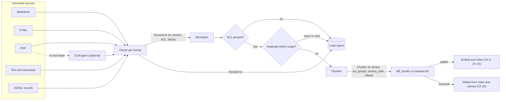
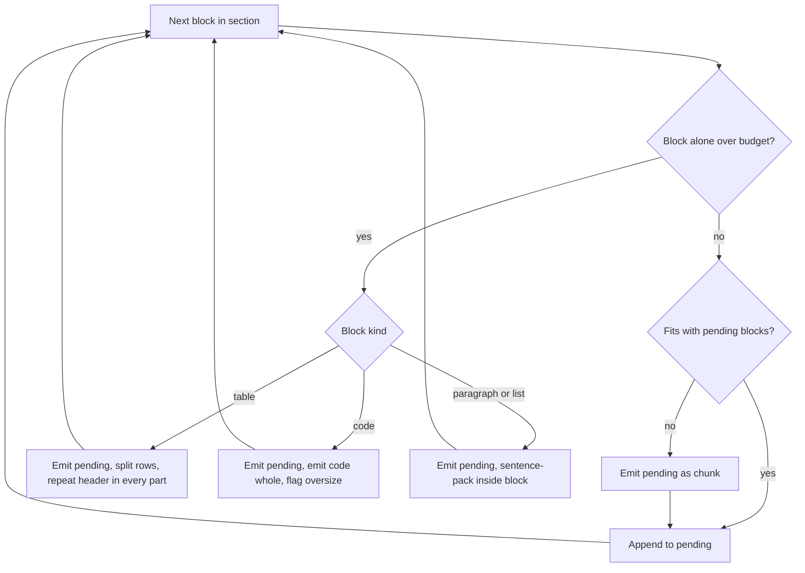
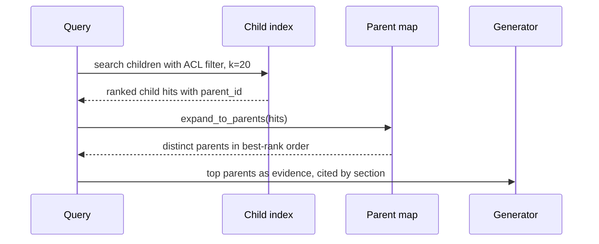

# Chapter 11 — Ingestion and Chunking

This chapter turns a messy corpus of Markdown, HTML, PDF, transcripts, and JSON records into chunks that carry stable identity, permissions, and structure. Many wrong RAG answers that look like retrieval or generation bugs start here, because the chunk is the unit everything downstream retrieves, cites, filters, and pays for.

**You will be able to:**
- Design a document model with stable identity (id, version, content hash), fail-closed permissions, and typed blocks with character offsets.
- Parse Markdown, HTML, PDF, transcripts, and JSONL records into that model, stripping hidden content and flagging pages that need OCR.
- Normalize and deduplicate a corpus, exactly and with MinHash, without changing meaning or crossing permission scopes.
- Build and compare six chunking strategies that share one finalization step and a chunk id that survives edits.
- Choose a chunking strategy and size with an evidence-span gold set, reporting span integrity, recall@k, and context tokens.
- Diagnose ingestion failures (empty scans, orphaned table rows, duplicate crowding, re-embedding storms) from load reports and chunk metadata.

**Prerequisites:** Chapter 10 (the RAG pipeline and its failure catalogue), Chapter 8 (embeddings and input limits), Chapter 2 (tokens). | **Code:** `book/projects/ragkit/` (run: `cd book/projects/ragkit && pytest -q`) | **Builds:** the ingestion half of the `ragkit` package (document model, five parsers with an OCR seam, normalization and MinHash deduplication, six chunkers, a corpus loader with an ACL gate, a chunk-size evaluation script), which Chapters 12 to 15 and Project 3 import.

**First reading:** Why this matters, Mental model, Core concepts (except the five deep dives below), How it works, Architecture, Implementation (The document model; The chunker base; Section-aware chunking with intact code and tables; The corpus loader and chunk diffs), Code walkthrough, Common mistakes, Failure modes, Tradeoffs, Evaluation and testing, Before you ship. **Deep dives** (skip on a first pass): Cleaning and normalization, Metadata extraction, Contextual chunk headers, Structured versus unstructured sources, Deduplication, Tokenizers with spans, Parsers, Normalization and deduplication, Fixed, recursive, and sentence strategies, Semantic chunking, Parent-child chunking, Tests, Production considerations.

## Why this matters

Chapter 10 ended with a catalogue of naive RAG failures. Two start here: the wrong chunk boundary and the missing evidence. A third, the permission leak, often does too, because a chunk that lost its ACL during ingestion cannot be filtered at retrieval time. Chapter 10's debugging tree begins with one question: does the needed fact exist as a retrievable unit? Ingestion decides that before any query arrives.

The failures here are quiet. A scanned PDF with no text layer parses "successfully" into an empty string. A table split from its header is indexed as unlabeled numbers. A wiki page copied into three spaces fills the top five results. A hidden HTML element carrying "ignore your previous instructions" becomes indexed text. A positional chunk id changes whenever someone edits near the top, so the whole document is re-embedded. None of these raises an exception; they surface weeks later as a recall drop, a cost spike, or a security finding.

Chunking also sets the economics downstream: chunk size decides how many vectors you store, what each passage costs in the prompt, and how precisely its embedding represents it. This chapter measures each effect.

## Mental model

> **Mental model:** A chunk is the unit of retrieval, citation, permission, and cost. Design it for all four.

Think of ingestion as a compiler. Sources are the input language, `Document` is the intermediate representation, and `Chunk` is the object code the index executes. Parsers are the per-format front end, normalization makes equivalent inputs identical, and chunkers are the back end for a runtime: an embedding model with an input limit, a retriever with a k, and a generator with a context budget. The leverage is in the intermediate representation. If the parser keeps headings, tables, code blocks, pages, and permissions as structure, every chunker can use them. If it flattens everything to a string, no chunker can recover them.

The second half of the model is identity. Every chunk must answer three questions without a database join: which document and version did I come from, who may see me, and where exactly in the source am I? A chunk that cannot answer them cannot be cited, filtered, refreshed, or deleted correctly.

## Core concepts

### The document model and identity

A document is one logical source after parsing: a policy file, a web page, a PDF, one ticket from a JSONL export. `ragkit.Document` carries four groups of fields.

**Identity.** `id` is chosen by the source owner when possible (Northwind's front matter has `id: hr-pto-policy`) and derived from the source URI otherwise. `version` is the declared version, or a prefix of the content hash. `content_hash` is the SHA-256 of the normalized text. They answer which logical thing, which edition the owner meant, and which exact bytes. A typo fix changes content without a version bump; a metadata-only release bumps the version without changing content. Incremental ingestion keys on the hash; humans read the version.

Avoid file paths as ids: a wiki reorganization turns a rename into a delete plus an insert, orphaning labels on the old id. A derived id should hash a machine-independent URI (a repository-relative path or a canonical URL).

**Provenance.** `source_uri`, `source_type`, and `parser` (a name and version such as `markdown/1`), so you can re-ingest exactly the documents a buggy parser produced.

**Permissions.** `tenant` and `acl_groups`. An empty `acl_groups` means nobody may see the document: ingestion fails closed, because defaulting to `["all"]` would turn every missing front-matter line into a company-wide disclosure. By default the loader rejects and reports documents without a tenant and ACL.

**Structure.** `text` is the normalized full text, and `blocks` cuts it into typed units: heading, paragraph, list, code, table, quote. Each block knows its `section_path` (the heading breadcrumb, such as `["Retail Returns API v2 Reference", "Rate limits"]`), its page, and its character offsets. The invariant `doc.text[b.char_start:b.char_end] == b.text` is tested for every parser, and it lets Chapter 13 highlight the exact span a claim relies on.

A `Chunk` inherits identity and permissions from its document and adds its own: `id`, `content_hash`, `section_path`, `char_start` and `char_end`, `page_start` and `page_end`, `token_count`, `kind` (text, table, code, or mixed), `role` (leaf, parent, or child), `parent_id`, `position`, and `chunker`, a fingerprint (a hash) of the chunking strategy and its configuration. Copying `tenant` and `acl_groups` onto every chunk is deliberate denormalization: the retriever filters on them inside the index query (Chapter 15), with no join that could be skipped.

### Chunk identity that survives edits

Chapter 10 used "document id plus position" as the chunk id and called it fragile. Suppose a 40-chunk policy gets a new paragraph at the top. With positional ids, every chunk after the insertion gets a new id. The indexer sees 40 new chunks and 39 deleted ones, re-embeds everything, and orphans any cached answer or feedback keyed on the old ids. `ragkit` derives the chunk id from content and location instead:

```
chunk_id = doc_id + ":" + hash(chunker_fingerprint, section_path, content_hash, occurrence, parent_id)
```

Position is excluded, so an insertion elsewhere leaves the ids of unchanged chunks alone. Version is excluded, so a version bump leaves the ids of untouched sections alone. The section path is included, so the same sentence under two headings gets two ids, and the occurrence counter separates repeats within one section. The chunker fingerprint is included, so two configurations can share an index for an A/B comparison. A test inserts an opening paragraph, bumps the version, and asserts that the three untouched sections keep their ids.

This works best with structure-aware chunkers, whose boundaries are anchored to headings. A fixed-size window shifts every boundary after an insertion, so its ids change anyway: structure-aware chunking makes incremental updates cheap, independent of retrieval quality.

### Parsing by format

A parser recovers what a human reader of the rendered source would treat as content and structure, and nothing else. Each format hides content, invents it, or destroys structure in its own way.

| Format | Trap | How `ragkit` handles it | Upgrade path |
|---|---|---|---|
| Markdown | Front matter carries identity and ACLs; a `# comment` in a code fence read as a heading; tables read as paragraphs; HTML comments invisible when rendered | Flat front matter only, `ParseError` on anything nested; fences before headings, tables before paragraphs; HTML comments outside fences stripped and counted | A full front-matter reader that still fails closed |
| HTML | Mostly chrome (navigation, footers, banners, scripts); hidden elements carry text no reader sees | Drops chrome tags; maps headings, paragraphs, list items, `pre`, and tables; drops elements marked `hidden`, `aria-hidden="true"`, `display:none`, or `visibility:hidden` | Site-specific selectors (exercise P1) or a content-density heuristic, checked on a sample of pages |
| PDF | Drawing instructions, not a document: scans lack a text layer, glyphs arrive out of reading order, columns interleave, running headers repeat, words split at hyphens, tables arrive as spaced text | pypdf text layer; a `PageInfo` per page, `needs_ocr` below 20 characters; repeated edge lines removed; hyphenation joined; a page number on every block | Coordinate-aware extraction, table detectors, model-based parsing (below) |
| Scans (OCR) | Slow; confused characters (`0` and `O`, `1` and `l`), lost tables, broken reading order | An `OcrEngine` protocol, `ocr_page(pdf_bytes, page_number) -> OcrResult(text, confidence)`, with no engine shipped; pages marked `ocr_applied` with confidence, otherwise reported as `needs_ocr` | An engine behind the protocol, with a per-engine confidence floor |
| Office documents | Zipped XML with styles, slides, notes, sheets | Not implemented | The same `Parser` protocol: heading styles to headings, speaker notes as note blocks, sheets as structured sources |
| Transcripts | Merged speakers lose who committed to what | Detects `[00:12:03] Dana: ...` lines; one block per turn; `speakers` and `start_time` on chunks for filtering | Semantic chunking for topic boundaries (below) |
| Source code | A function cut in half retrieves badly and cannot be cited | Fenced code never split; the recursive chunker accepts custom separators (exercise P2) | Syntax-tree chunking that adds file path, enclosing class, and imports as context |

**Hidden text is an attack carrier** for indirect prompt injection (Chapter 26). Northwind's vendor newsletter, kept as a security fixture, hides an injection attempt in a Markdown comment. Stripping hidden content is cheap defense in depth, not a substitute for treating retrieved text as data.

**PDF upgrades trade cost for fidelity.** *Coordinate-aware extraction* clusters glyphs into columns by position and fixes most interleaving at text-extraction speed. *Table detectors* emit cells for the canonical table block but fail on borderless tables with merged cells. *Model-based parsing* sends each page to a layout or vision-language model; it handles the hardest pages at a per-page model cost, seconds of latency, and a new failure class: plausible text that is not on the page. Route by need, record the route per page so each is a quality slice, and evaluate upgrades on real pages with hand-checked text. Images and charts are a multimodal problem (Chapter 37).

**OCR output is its own quality slice.** Tag OCR'd blocks with the engine's confidence, track their retrieval metrics separately (Chapter 14), and exclude or review pages below a floor. Confidences are not comparable across engines, so calibrate the floor per engine on a labeled sample.

### Tables

Tables are where naive pipelines lose the most meaning. A row means something only with its header: "| Internal tools | 100 requests/minute |" is interpretable, "| 100 | 422 | expired |" is not. Three representations are common:

1. **Keep the table whole** as a canonical pipe table, when it fits the budget, as most documentation tables do.
2. **Split by rows and repeat the header** in every part. Each part is self-describing, at a few percent of corpus tokens (about 11 percent at the extreme 48-token budget evaluated below).
3. **Serialize each row as a sentence** ("Client type: Internal tools. Limit: 100 requests per minute."). Good for lookups, but cross-row relationships such as totals and comparisons are lost.

Large or numeric tables often belong in a database queried with SQL (Chapter 1's decision ladder). `ragkit` drops alignment padding, which costs tokens and carries no meaning (the vendor newsletter's padded table loses about a third of its characters). The section-aware chunker implements options 1 and 2; exercise P3 builds option 3.

### Cleaning and normalization

> **Deep dive.** Unicode, whitespace, and boilerplate rules that make equal content hash equally; skip on a first reading.

Normalization makes equivalent content byte-identical, so hashes, caches, and deduplication work, and removes text that pollutes retrieval. It must never change meaning.

**Unicode.** NFC unifies composed and decomposed accents. NFKC also folds compatibility characters such as ligatures ("fi") and full-width digits, which helps matching but turns "m²" into "m2". `ragkit` defaults to NFKC for prose (configurable) and removes zero-width characters and soft hyphens, which are invisible and break token matching.

**Whitespace.** Line endings are unified, runs of spaces collapse, and three or more newlines become a paragraph break.

**Boilerplate.** Page counters ("Page 3 of 12"), confidentiality footers, and unsubscribe lines make every chunk slightly similar to every other. `ragkit` removes only whole lines that fully match a small, configurable pattern list, which keeps the risk of deleting real content low.

**Code is data.** Collapsing spaces or applying NFKC can alter a program, so inside code blocks only line endings and invisible characters change. Tables are normalized cell by cell and re-rendered.

Normalization runs on blocks and then rebuilds the document so offsets and the content hash stay correct. Changing it can alter every content hash, so version its configuration with the parser.

### Metadata extraction

> **Deep dive.** Which fields to extract, where freshness and supersession come from, and how to keep metadata filterable; skip on a first reading.

Metadata is anything besides the text that someone will filter, sort, display, or debug by. Sources provide some (front matter, HTML meta tags, PDF document info, JSON fields), structure provides more (section path, pages, speakers), and some must be derived (language, error codes, document type). Never let an unvalidated model (Chapter 6) write a field that a permission or freshness rule depends on.

`ragkit` copies every front-matter key that is not an identity or permission field into `Document.metadata`, and chunks inherit it. A document can declare `effective_date: 2026-01-01` and `supersedes: [hr-faq]`, and Chapter 13's evidence packer reads both: the newer effective date wins over a file's `updated_at`, and an explicit supersedes link resolves a conflict that a heuristic can only guess at. The Northwind corpus states supersession only in prose ("This version (3.0) supersedes PTO Policy 2.2 ... and any older guidance, including HR FAQ entries"), which is normal for real corpora and the root of Chapter 10's stale-FAQ failure.

Treat these fields like permissions: they come from the document system or a reviewed authority map (Project 3 in Chapter 15 uses one), never from a model reading prose, because a wrong `supersedes` silently hides a correct source.

Keep metadata flat and typed (`priority: "P1"`, not a nested blob), because vector stores filter on flat fields. Access fields (tenant, ACL groups) must be authoritative and validated; relevance fields (tags, section path) can be best-effort.

### Contextual chunk headers

> **Deep dive.** Three levels of indexed context prefix and when each one pays; skip on a first reading.

A chunk cut out of its document loses implicit context: the VPN runbook's "Troubleshooting" section never says VPN, and no index can match a question to words that are not in the indexed text. A contextual chunk header restores it as a short prefix on the indexed text only. There are three levels, in increasing cost.

1. **Deterministic breadcrumb.** Title and section path from the parser; `Chunk.embedding_text()` does this ("NorthGate VPN Access Runbook > Troubleshooting"). Free and never invents anything, but only as good as the headings.
2. **Document summary.** One or two sentences per document (from the owner, a description field, or a model), prepended to every chunk with the breadcrumb. It helps when titles are uninformative, such as `final_v3.pdf`, for at most one model call per document.
3. **Chunk-specific context.** A model reads the chunk with its document and writes a situating sentence. This is contextual retrieval, built in Chapter 12. It costs one model call per chunk, repeated when the chunk's neighborhood changes, and puts model-written text derived from untrusted documents into the index.

At every level, keep the header out of `Chunk.text` so citations quote the source exactly, and treat its format as part of the index version, since changing it changes every vector (Chapters 12 and 15). Pay for per-chunk context only when an evaluation slice of terse, self-referential chunks shows a recall gap the cheaper levels did not close.

### Structured versus unstructured sources

> **Deep dive.** How the JSONL parser splits records into embeddable prose and filterable fields; skip on a first reading.

Tickets, CRM notes, FAQ entries, and catalogs arrive as records. Some fields are prose worth embedding (subject, body, resolution); others are facts worth filtering on (category, priority, status, tenant, dates). Embedding the whole record loses exact filtering on those facts.

`ragkit`'s JSONL parser does both: configured text fields become labeled paragraphs ("Subject: ...", "Body: ...") and the other scalar fields become flat metadata, so "open P1 payment tickets similar to this one" is a metadata filter plus a semantic query. Each record becomes a document (`source_uri` such as `tickets.jsonl#TCK-2026-0001`) whose version hashes the record. Bad lines either fail the file with the line number or are collected in `parser.errors`, by configuration; they are never skipped silently. For counts and aggregates ("how many P1 tickets last week"), query the system of record.

### Deduplication

> **Deep dive.** Exact and MinHash near-duplicate detection, and why scope matters more than the algorithm; skip on a first reading.

Enterprise corpora are full of duplicates: a policy exported to two wikis, a runbook copied and lightly edited. They waste embedding spend and crowd results: five copies of one paragraph in the top five give the generator one piece of evidence.

**Exact duplicates** are found by content hash after normalization, so copies that differ only in whitespace hash equally.

**Near duplicates** need a similarity measure. Jaccard similarity of word shingles (overlapping sequences of k words, five by default) suits text reuse, but comparing every pair is quadratic. MinHash compresses each shingle set into a fixed-length signature (128 values here) such that the fraction of agreeing positions is an unbiased estimate of Jaccard similarity. Banded locality-sensitive hashing (LSH) splits each signature into b bands of r values, and two documents become candidates only if at least one band matches exactly. A pair with similarity s collides with probability 1 - (1 - s^r)^b. With 16 bands of 8 rows (illustrative, the defaults here), a pair at s = 0.9 collides with probability above 0.999, a pair at s = 0.5 with probability about 0.06, and the curve's midpoint sits near (1/16)^(1/8), about 0.71. Candidates are then checked against the threshold using the full signature.

**Scope matters more than the algorithm.** Identical text with different ACLs is not a duplicate for retrieval: merging the copies either leaks the restricted one or hides the public one. `ragkit` deduplicates only within a permission scope (tenant plus sorted ACL groups), keeps the newest copy, and records every dropped document with the id it duplicates and the similarity, so the decision can be audited and reversed.

Superseded versions are a different problem. Northwind's HR FAQ (five-day carryover) and PTO policy 3.0 (ten days) differ too much to be near duplicates; metadata and generation-time conflict handling (Chapter 13) resolve them.

### Chunking strategies

Why chunk at all? Embedding models have input limits, retrieval returns units rather than documents, and every retrieved unit costs prompt tokens. A boundary decides whether the evidence a question needs lands in one retrievable unit. A bad cut orphans a table row from its header, or leaves "this limit does not apply to contractors" with no referent.

Here is a small invented section, cut by three strategies at a 24-token budget (`¦` marks a boundary, `...` elides text):

```text
## Rate limits
Internal tools get 100 requests per minute; partner integrations get 20.
| Client type    | Limit          |
|----------------|----------------|
| Internal tools | 100 req/minute |
| Partners       | 20 req/minute  |
Requests over the limit return HTTP 429.

fixed windows     : ## Rate limits ... | Client type | Limit | | ¦ ---|---| | Internal tools ... ¦ ...
sentence packing  : ## Rate limits ... get 20. | Client type | Limit | ¦ |---|---| | Internal tools | 100 req/minute | ¦ | Partners | 20 req/minute | Requests over ...
section-aware     : the whole section, heading and table together, is one chunk
```

The fixed window cuts inside a table row. Sentence packing treats each table row as a sentence, so at this budget the header and the rows land in different chunks. The section-aware chunker keeps the section whole. At 150 tokens or more, sentence packing does too: strategies diverge only when a section exceeds the budget.

All six `ragkit` strategies decide only where to cut. A shared finalization step computes token counts, permissions, metadata, section paths, pages, and ids, which is why strategies can be swapped and compared fairly.

**Fixed-size token windows** (`FixedTokenChunker`) slide a window of N tokens with a stride (the step between window starts) of N minus the overlap. They are fast, predictable, and always fit the input limit, but they cut mid-sentence, between a table header and its rows, and through code. Use them as the baseline every other strategy must beat, and for homogeneous prose.

**Recursive splitting** (`RecursiveChunker`) splits on the coarsest separator first (paragraph breaks), recurses into finer ones (lines, sentence ends, spaces, token windows) only for pieces still too large, then merges small neighbors up to the budget. It respects natural boundaries without a parser, a strong default for unstructured text, and custom separators make it code-aware. Its overlap is applied in whole pieces, so with paragraph-sized pieces it is often zero.

**Sentence packing** (`SentenceChunker`) packs whole sentences, and whole paragraphs when they fit, up to the budget; overlap is a number of trailing sentences. Its rule-based splitter handles abbreviations, initials, and decimals, and treats newlines as boundaries because parsed newlines separate list items and table rows. It suits prose with weak or untrusted structure.

**Section-aware chunking** (`MarkdownSectionChunker`) works on parsed blocks, so it applies to Markdown, HTML, JSONL, and transcripts alike. Chunks never span sections, and blocks are packed up to the budget with the heading at the top of the section's first chunk. Code blocks are atomic (flagged `oversize` when too big), tables are split by rows with a repeated header only when they do not fit, and an oversized paragraph falls back to sentence packing. This is the strongest default for documentation, policies, and runbooks: boundaries follow the author's organization, citations can name a section, and ids survive edits.

**Semantic chunking** (`SemanticChunker`) embeds each sentence (optionally with neighbors to smooth noise), cuts where the cosine distance between consecutive sentences exceeds a threshold (absolute, or a percentile of the document's own distances), then enforces size limits. It targets topic shifts in text without headings, such as transcripts and long emails. The costs are concrete. A 2,000-token document of 100 sentences of about 20 tokens, embedded with one neighbor on each side, sends roughly 6,000 tokens to the embedding model just to place boundaries, three times the cost of embedding the final chunks (illustrative arithmetic). Boundaries depend on the embedding model, so its id is part of the fingerprint and a model change re-chunks the corpus. And published comparisons are mixed on whether it beats a good recursive or section-aware baseline. Measure before you pay for it.

**Parent-child chunking** (`ParentChildChunker`) cuts parents (by default sections up to 800 tokens) and children inside them (by default sentence packs up to 128 tokens). Children are indexed for precise matching; the generator reads the parent, which restores the definitions, qualifiers, and neighboring rows a child lacks. The cost is a second lookup, more vectors, and larger prompts. `expand_to_parents` maps ranked child hits to distinct parents, and Chapter 12 builds parent-document retrieval on it.

### Overlap

Overlap repeats the end of one chunk at the start of the next, so a fact near a boundary appears whole in at least one chunk. It is a patch for structure-blind boundaries, and it is not free. With a window of N and overlap O, the index holds about N / (N - O) times the corpus tokens: 256 with 32 overlap is about 14 percent more vectors and embedding spend (the evaluation below measures 12 to 13 percent). Adjacent chunks also tend to both make the top k, wasting a slot, and the evidence packer must merge overlapping spans (Chapter 13).

Use overlap with fixed and recursive chunkers on unstructured text, keep it small (10 to 15 percent is a common starting range), and repeat whole sentences rather than raw tokens. Section-aware and parent-child chunking rarely need it: their boundaries are meaningful, and parents supply the surrounding context.

### Chunk size

There is no universal chunk length. Small chunks embed one idea and retrieve precisely, but they lose context: "this limit does not apply to contractors" is useless without the limit. Large chunks keep context but dilute relevance, because an embedding of a 1,000-token section averages many ideas, and fewer of them fit a context budget.

The shape of your questions and documents decides. Lookups over reference material ("what does error RET-005 mean") want small units; synthesis over policies ("what happens to my carryover if I leave in February") wants whole sections. FAQ entries chunk well at about 100 tokens, long policy sections at 300 to 500. The embedding model's input limit is the hard ceiling. Parent-child chunking exists because one size cannot serve both retrieval precision and generation context.

So measure against evidence, not documents. A question is answered by specific spans, so judge a chunker on whether those spans land together in one retrievable chunk (this chapter calls that **span integrity**) and whether retrieval finds it. Evaluation and testing does this on the Northwind corpus.

## How it works

Follow Northwind's `retail-returns-api.md` through the pipeline.

1. **Parse.** `MarkdownParser` reads the front matter (`id: prod-retail-returns-api`, `version: "2.3"`, `tenant: retail`, `acl_groups: ["all"]`), strips HTML comments outside code fences, and walks the body into typed blocks, each stamped with its section path and offsets.
2. **Normalize.** `normalize_document` normalizes block by block and rebuilds the document so offsets and `content_hash` are fresh.
3. **Gate.** The loader rejects the document unless `has_acl` holds (a tenant and at least one group), and checks for empty text and pages that need OCR.
4. **Deduplicate.** Within the scope `(retail, ["all"])`, the content hash and then the MinHash signature are checked against earlier documents. There is no match, so the document is kept.
5. **Chunk.** `MarkdownSectionChunker(300)` makes "Authentication" one chunk with its heading, and "Rate limits" one `mixed` chunk holding the heading, the table, and the paragraph after it. The `POST /v2/returns/validate` section keeps its JSON code block intact. At a 48-token budget the error-code table no longer fits, so it is split into parts, each starting with `| Code | HTTP | Meaning |` and its separator line.
6. **Finalize.** `BaseChunker.finalize` slices each piece, infers its kind from the covered blocks, copies permissions and document metadata, counts tokens, and derives the id.
7. **Hand off.** The chunks go to the index (Chapter 9's store, Chapter 15's worker). On the next run, `diff_chunks` compares the ids already indexed for this document with a fresh chunking and returns what to embed, keep, and delete.

## Architecture

The first diagram is the offline ingestion path with its exits. Every document either becomes chunks or ends up in a report with a reason; nothing disappears silently.



The second diagram is the decision logic of the section-aware chunker for each block inside a section. It shows why code and tables survive and where the oversize escape hatches are.



The third diagram shows how parent-child chunks are used at query time: children are what the retriever sees, parents are what the generator reads.



## Implementation

The ingestion half of the package (Chapters 12 to 14 add `retrieval/`, `generation/`, and more of `eval/`):

```
book/projects/ragkit/
  pyproject.toml   README.md   .env.example
  eval_data/chunk_eval_gold.jsonl
  ragkit/
    __init__.py  documents.py  tokenizers.py  settings.py  normalize.py  pipeline.py
    parsers/   __init__.py  base.py  markdown.py  html.py  pdf.py  text.py  jsonl.py
    chunking/  __init__.py  base.py  fixed.py  recursive.py  sentences.py  sentence.py
               section.py  semantic.py  parent_child.py
    eval/      __init__.py  chunk_size.py
  tests/       conftest.py  pdf_fixtures.py  test_documents.py  test_parsers.py
               test_normalize.py  test_chunkers.py  test_pipeline_and_eval.py
```

Install and run:

```bash
cd book/projects/ragkit
uv pip install -e ../aie_core -e .      # fallback: pip install -e ../aie_core && pip install -e .
pytest -q tests/test_documents.py tests/test_parsers.py tests/test_normalize.py tests/test_chunkers.py tests/test_pipeline_and_eval.py   # all pass offline
python -m ragkit.eval.chunk_size --docs ../shared-data/docs --gold eval_data/chunk_eval_gold.jsonl --k 3
```

Configuration is optional and read from environment variables:

| Variable | Default | Meaning |
|---|---|---|
| `RAGKIT_TOKENIZER` | `regex` | `regex` (deterministic, offline) or `tiktoken` |
| `RAGKIT_TIKTOKEN_ENCODING` | `cl100k_base` | encoding for the tiktoken tokenizer |
| `RAGKIT_PDF_MIN_CHARS_PER_PAGE` | `20` | thinner text layers are flagged `needs_ocr` |
| `RAGKIT_REQUIRE_ACL` | `true` | the loader rejects documents without tenant and ACL |
| `RAGKIT_NEAR_DUPLICATE_THRESHOLD` | `0.9` | estimated Jaccard above which a document is a near duplicate |
| `EMBEDDING_PROVIDER`, `EMBEDDING_MODEL` | `fake` | read by `aie_core`; used for semantic chunking |

### The document model

`Document`, `Block`, and `Chunk` carry the fields described above. The excerpt shows the parts with behavior: `short_hash` (stable across processes), `assemble` (records block offsets), `with_blocks` (rebuilds text, offsets, and hash together after any transformation), and `embedding_text` (adds the breadcrumb only to the indexed text).

```python
# path: book/projects/ragkit/ragkit/documents.py (excerpt; full file on disk)
def short_hash(*parts: object, length: int = 16) -> str:
    """Stable hash of several values. Never use Python's hash(): it is salted per process."""
    joined = "\x1f".join(str(p) for p in parts)
    return hashlib.sha256(joined.encode("utf-8")).hexdigest()[:length]


class Block(BaseModel):
    """One structural unit of a parsed document, rendered as it appears in `Document.text`."""

    kind: BlockKind
    text: str
    level: int | None = None  # heading level 1-6
    section_path: list[str] = Field(default_factory=list)
    page: int | None = None  # 1-based page for paginated sources
    char_start: int = 0
    char_end: int = 0
    meta: dict[str, Any] = Field(default_factory=dict)


def assemble(blocks: Iterable[Block]) -> tuple[str, list[Block]]:
    """Join blocks into document text and recompute every block's character offsets."""
    out: list[Block] = []
    parts: list[str] = []
    cursor = 0
    for b in blocks:
        if not b.text:
            continue
        if parts:
            parts.append(BLOCK_SEPARATOR)
            cursor += len(BLOCK_SEPARATOR)
        parts.append(b.text)
        out.append(b.model_copy(update={"char_start": cursor, "char_end": cursor + len(b.text)}))
        cursor += len(b.text)
    return "".join(parts), out


class Document(BaseModel):
    # ...
    tenant: str | None = None
    acl_groups: list[str] = Field(default_factory=list)  # empty means nobody: fail closed
    # ...
    @property
    def has_acl(self) -> bool:
        return self.tenant is not None and len(self.acl_groups) > 0

    def with_blocks(self, blocks: Iterable[Block], **updates: Any) -> "Document":
        """Return a copy rebuilt from `blocks`, with fresh text, offsets, and content hash."""
        text, rebuilt = assemble(blocks)
        data = self.model_dump()
        data.update(updates)
        data.update({"text": text, "blocks": [b.model_dump() for b in rebuilt], "content_hash": ""})
        return Document.model_validate(data)
    # ...


class Chunk(BaseModel):
    # ...
    def embedding_text(self) -> str:
        """Text to embed or index: a breadcrumb of title and section, then the chunk body.

        The breadcrumb restores context the chunk lost when it was cut out of its document.
        Keep `text` itself clean so that citations quote the source exactly.
        """
        header = self.context_header()
        return f"{header}\n\n{self.text}" if header else self.text
```

### Tokenizers with spans

> **Deep dive.** Why tokenizers return character spans, and which one to count with in production; skip on a first reading.

Chunk budgets are in tokens, but chunk text must be exact source text, so every tokenizer returns character spans and chunkers slice `Document.text` at them instead of re-joining decoded tokens. The default `RegexTokenizer` counts words and punctuation. It is deterministic and dependency-free, but it differs from a subword tokenizer by tens of percent on rare words and code, so count with the embedding model's own tokenizer in production (for example `RAGKIT_TOKENIZER=tiktoken`).

```python
# path: book/projects/ragkit/ragkit/tokenizers.py  (excerpt; full file on disk)
class RegexTokenizer:
    name = "regex-v1"
    _PATTERN = re.compile(r"\w+|[^\w\s]", re.UNICODE)

    def spans(self, text: str) -> list[Span]:
        return [m.span() for m in self._PATTERN.finditer(text)]

    def count(self, text: str) -> int:
        return len(self._PATTERN.findall(text))
```

### Parsers

> **Deep dive.** The parser protocol, identity precedence, and the code behind the format table; skip on a first reading.

All parsers implement `parse(raw, *, source_uri, defaults) -> list[Document]`, returning a list because a JSONL file yields many documents. `DocumentBuilder` tracks the heading stack and resolves identity with a fixed precedence: what the source declares, then caller-supplied defaults, then derived values.

```python
# path: book/projects/ragkit/ragkit/parsers/base.py  (excerpt; full file on disk)
    def build(
        self,
        # ...
    ) -> Document:
        """Resolve identity and permissions: declared (front matter) > defaults > derived."""
        d = defaults or DocDefaults()
        declared = declared or {}
        text, blocks = assemble(self.blocks)

        def pick(key: str) -> Any:
            value = declared.get(key)
            return value if value not in (None, "", []) else getattr(d, key)
        # ...
        return Document(
            id=str(pick("id") or doc_id_from_uri(source_uri)),
            version=str(pick("version") or sha256_text(text)[:12]),
            # ...
            tenant=pick("tenant"),
            acl_groups=[str(g) for g in (acl or [])],
            # ...
        )
```

The Markdown body loop shows the order that matters: fences before headings, tables before paragraphs.

```python
# path: book/projects/ragkit/ragkit/parsers/markdown.py  (excerpt; full file on disk)
        while i < n:
            line = lines[i]
            stripped = line.strip()
            fence = _FENCE.match(line)
            if fence:
                flush()
                marker, lang = fence.group(2), fence.group(3)
                code: list[str] = []
                i += 1
                closed = False
                while i < n:
                    if lines[i].strip().startswith(marker[0] * len(marker)) and lines[i].strip().strip(marker[0]) == "":
                        closed = True
                        i += 1
                        break
                    code.append(lines[i])
                    i += 1
                b.code("\n".join(code), lang, **({} if closed else {"unclosed": True}))
                continue
            heading = _HEADING.match(line)
            if heading:
                flush()
                b.heading(heading.group(2), len(heading.group(1)))
                i += 1
                continue
            if stripped.startswith("|") and i + 1 < n and _TABLE_SEP.match(lines[i + 1]):
                flush()
                header = _cells(line)
                rows: list[list[str]] = []
                i += 2
                while i < n and lines[i].strip().startswith("|"):
                    rows.append(_cells(lines[i]))
                    i += 1
                b.table(header, rows)
                continue
            # ...
```

The HTML extractor's hidden-content rule, and the PDF parser's per-page accounting with its OCR seam:

```python
# path: book/projects/ragkit/ragkit/parsers/html.py  (excerpt; full file on disk)
    def _is_hidden(self, attrs: dict[str, str | None]) -> bool:
        if "hidden" in attrs:
            return True
        if (attrs.get("aria-hidden") or "").lower() == "true":
            return True
        return bool(_HIDDEN_STYLE.search(attrs.get("style") or ""))
```
```python
# path: book/projects/ragkit/ragkit/parsers/pdf.py  (excerpt; full file on disk)
        for number, text in enumerate(page_texts, start=1):
            chars = len(text.strip())
            info = PageInfo(number=number, char_count=chars, needs_ocr=chars < self.min_chars_per_page)
            if info.needs_ocr and self.ocr is not None:
                result = self.ocr.ocr_page(raw, number)
                text = result.text
                info.ocr_applied = True
                info.ocr_confidence = result.confidence
            elif info.needs_ocr:
                text = ""
            pages.append(info)
            page_lines.append(text.replace("\r\n", "\n").split("\n"))

        if self.remove_repeated_lines and len(page_lines) >= 3:
            page_lines = strip_repeated_lines(page_lines)
```

### Normalization and deduplication

> **Deep dive.** The per-block normalizer and the MinHash, LSH, and scope code; skip on a first reading.

Normalization works per block, so code and tables get their own rules, and then rebuilds the document through `with_blocks`.

```python
# path: book/projects/ragkit/ragkit/normalize.py  (excerpt; full file on disk)
def _normalize_block(block: Block, cfg: NormalizationConfig) -> Block | None:
    if block.kind == "code":  # code is data: only line endings and invisible characters
        text = block.text.replace("\r\n", "\n").translate(_ZERO_WIDTH)
        return block.model_copy(update={"text": text})
    if block.kind == "table":
        header = [normalize_text(c, cfg) for c in block.meta.get("header", [])]
        rows = [[normalize_text(c, cfg) for c in row] for row in block.meta.get("rows", [])]
        # ...
        return block.model_copy(update={"text": render_table(header, rows), "meta": meta})
    # ...


def normalize_document(doc: Document, config: NormalizationConfig | None = None) -> Document:
    """Normalize block by block and rebuild text, offsets, and content hash."""
    cfg = config or NormalizationConfig()
    blocks = [b for b in (_normalize_block(b, cfg) for b in doc.blocks) if b is not None]
    meta = {**doc.metadata, "normalized": cfg.unicode_form}
    return doc.with_blocks(blocks, metadata=meta, title=normalize_text(doc.title, cfg))
```

MinHash and banded LSH, then the scope logic of `dedupe_documents`: the scope key comes first, for exact and near duplicates alike.

```python
# path: book/projects/ragkit/ragkit/normalize.py  (excerpt; full file on disk)
    def signature(self, text: str) -> np.ndarray:
        sh = shingles(text, self.shingle_size)
        if not sh:
            return np.full(self.num_perm, int(_MERSENNE), dtype=np.uint64)
        x = np.fromiter((self._base_hash(s) for s in sh), dtype=np.uint64, count=len(sh))
        hashed = (np.outer(x, self._a) + self._b) % _MERSENNE  # (shingles, num_perm), fits in uint64
        return hashed.min(axis=0)
    # ...
    def _band_keys(self, sig: np.ndarray) -> list[tuple[int, bytes]]:
        return [(i, sig[i * self.rows : (i + 1) * self.rows].tobytes()) for i in range(self.bands)]
    # ...
    def _query_sig(self, sig: np.ndarray) -> list[tuple[str, float]]:
        candidates: set[str] = set()
        for key in self._band_keys(sig):
            candidates.update(self._buckets.get(key, ()))
        scored = [(c, MinHasher.similarity(sig, self._signatures[c])) for c in candidates]
        return sorted([s for s in scored if s[1] >= self.threshold], key=lambda s: (-s[1], s[0]))
# ...
    for d in items:
        scope = (d.tenant, tuple(sorted(d.acl_groups)))
        hkey = (*scope, d.content_hash)
        if hkey in by_hash:
            dups.append(DuplicateRecord(dropped_id=d.id, kept_id=by_hash[hkey], similarity=1.0, exact=True))
            continue
        if near:
            index = indexes.setdefault(scope, NearDuplicateIndex(threshold=threshold))
            matches = index.query(d.text)
            if matches:
                dups.append(DuplicateRecord(dropped_id=d.id, kept_id=matches[0][0], similarity=matches[0][1], exact=False))
                continue
            index.add(d.id, d.text)
        by_hash[hkey] = d.id
        kept.append(d)
```

### The chunker base: one finalization, one identity scheme

Each strategy implements only `config()` and `split()`, returning `Piece`s: character spans of where to cut, with optional replacement text and hints. `finalize` is the one place where ids, permissions, metadata, pages, and token counts are computed.

```python
# path: book/projects/ragkit/ragkit/chunking/base.py (excerpt; full file on disk)
def make_chunk_id(
    doc_id: str,
    chunker_fingerprint: str,
    section_path: list[str],
    content_hash: str,
    occurrence: int,
    parent_id: str | None = None,
) -> str:
    digest = short_hash(chunker_fingerprint, " / ".join(section_path), content_hash, occurrence, parent_id or "")
    return f"{doc_id}:{digest}"
# ...
    def fingerprint(self) -> str:
        cfg = json.dumps({**self.config(), "tokenizer": self.tokenizer.name}, sort_keys=True, default=str)
        return f"{self.name}/{self.algorithm_version}:{short_hash(cfg, length=8)}"
    # ...
    def finalize(self, doc: Document, pieces: list[Piece]) -> list[Chunk]:
        fp = self.fingerprint()
        index = _BlockIndex(doc.blocks)
        seen: Counter[tuple[Any, ...]] = Counter()
        chunks: list[Chunk] = []
        base_meta = {"source_type": doc.source_type.value, **doc.metadata}
        base_meta.update({k: getattr(doc, k) for k in _DOC_FIELDS_IN_CHUNK})
        for position, p in enumerate(pieces):
            text = p.text if p.text is not None else doc.text[p.start : p.end]
            if not text.strip():
                continue
            covered = index.covering(p.start, p.end)
            section = p.section_path if p.section_path is not None else index.section_at(p.start)
            content_hash = sha256_text(text)
            key = (tuple(section), content_hash, p.parent_id)
            occurrence = seen[key]
            seen[key] += 1
            pages = [b.page for b in covered if b.page is not None]
            meta = {**base_meta, **_aggregate_block_meta(covered), **p.meta}
            chunks.append(
                Chunk(
                    id=make_chunk_id(doc.id, fp, section, content_hash, occurrence, p.parent_id),
                    doc_id=doc.id,
                    version=doc.version,
                    text=text,
                    content_hash=content_hash,
                    tenant=doc.tenant,
                    acl_groups=list(doc.acl_groups),
                    # ...
                    chunker=fp,
                )
            )
        return chunks
```

### Fixed, recursive, and sentence strategies

> **Deep dive.** The window and sentence-packing loops; skip on a first reading.

The fixed chunker's whole strategy is a stride over token spans. `RecursiveChunker` (on disk) keeps each separator attached to the left part so spans stay contiguous.

```python
# path: book/projects/ragkit/ragkit/chunking/fixed.py  (excerpt; full file on disk)
    def split(self, doc: Document) -> list[Piece]:
        spans = self.tokenizer.spans(doc.text)
        if not spans:
            return []
        step = self.chunk_size - self.overlap
        pieces: list[Piece] = []
        i = 0
        while True:
            window = spans[i : i + self.chunk_size]
            pieces.append(Piece(window[0][0], window[-1][1], meta={"token_offset": i}))
            if i + self.chunk_size >= len(spans):
                break
            i += step
        return pieces
```

Sentence packing applies overlap in whole sentences and drops the overlap tail when it would push the next chunk over budget, so the budget always wins over the overlap.

```python
# path: book/projects/ragkit/ragkit/chunking/sentence.py  (excerpt; full file on disk)
        for unit in self.units(text):
            unit_tokens = sum(t for _, t in unit)
            if cur and cur_tokens + unit_tokens > self.max_tokens:
                emit()
                tail = cur[-self.overlap_sentences :] if self.overlap_sentences else []
                if sum(t for _, t in tail) + unit_tokens > self.max_tokens:
                    tail = []
                cur = list(tail)
                cur_tokens = sum(t for _, t in cur)
            cur.extend(unit)
            cur_tokens += unit_tokens
```

### Section-aware chunking with intact code and tables

Follow the per-block decisions from the second Architecture diagram: code is atomic, tables split by rows with a repeated header, and an oversized paragraph falls back to sentence packing.

```python
# path: book/projects/ragkit/ragkit/chunking/section.py  (excerpt; full file on disk)
    def _pack(self, heading: Block | None, body: list[Block]) -> list[Piece]:
        path = body[0].section_path
        out: list[Piece] = []
        pending: list[Block] = [heading] if heading is not None and self.include_headings else []
        pending_tokens = sum(self.count(b.text) for b in pending)

        def has_content() -> bool:
            return any(b.kind != "heading" for b in pending)

        def emit() -> None:
            nonlocal pending, pending_tokens
            if has_content():
                out.append(Piece(pending[0].char_start, pending[-1].char_end, section_path=path))
            pending, pending_tokens = [], 0

        for blk in body:
            t = self.count(blk.text)
            if t > self.max_tokens:
                emit()
                if blk.kind == "table":
                    out.extend(self._split_table(blk, path))
                elif blk.kind == "code":
                    out.append(Piece(blk.char_start, blk.char_end, section_path=path, kind="code", meta={"oversize": True}))
                else:
                    spans = pack_spans(blk.text, split_sentences(blk.text), self.max_tokens, self.tokenizer)
                    out.extend(Piece(blk.char_start + s, blk.char_start + e, section_path=path) for s, e in spans)
                continue
            if has_content() and pending_tokens + t > self.max_tokens:
                emit()
            pending.append(blk)
            pending_tokens += t
        emit()
        return out

    def _split_table(self, blk: Block, path: list[str]) -> list[Piece]:
        header: list[str] = blk.meta.get("header", [])
        rows: list[list[str]] = blk.meta.get("rows", [])
        header_text = render_table(header, [])
        budget = max(1, self.max_tokens - self.count(header_text))
        # ...
        for r, row in enumerate(rows):
            t = self.count(render_table(header, [row]).split("\n", 2)[2])
            if current and used + t > budget:
                groups.append(current)
                current, used = [], 0
            current.append(r)
            used += t
        # ...
            if k == 0 or self.repeat_table_header:
                text = render_table(header, selected)
            else:
                text = "\n".join(lines[first_line : last_line + 1])
```

### Semantic chunking

> **Deep dive.** The distance signal and where the cuts go; skip on a first reading.

The chunker embeds sentence windows, computes consecutive cosine distances, and cuts above a percentile threshold; size enforcement follows on disk. `last_distances` keeps the distances for the last document, which is what you plot when tuning the percentile.

```python
# path: book/projects/ragkit/ragkit/chunking/semantic.py  (excerpt; full file on disk)
    def distances(self, text: str, sentences: list[Span]) -> list[float]:
        windows = []
        for i in range(len(sentences)):
            lo, hi = max(0, i - self.window), min(len(sentences), i + self.window + 1)
            windows.append(text[sentences[lo][0] : sentences[hi - 1][1]])
        vectors = np.asarray(self.embeddings.embed(windows), dtype=np.float64)
        norms = np.linalg.norm(vectors, axis=1)
        norms[norms == 0] = 1.0
        unit = vectors / norms[:, None]
        sims = np.sum(unit[:-1] * unit[1:], axis=1)
        return [float(1.0 - s) for s in sims]
    # ...
        dist = self.distances(text, sentences)
        self.last_distances = dist
        cut_at = self.threshold if self.threshold is not None else float(np.percentile(dist, self.breakpoint_percentile))
        groups: list[list[Span]] = [[sentences[0]]]
        for i, d in enumerate(dist):
            if d > cut_at:
                groups.append([])
            groups[-1].append(sentences[i + 1])
```

### Parent-child chunking

> **Deep dive.** Two-pass parent-child linkage and query-time expansion; skip on a first reading.

Parents are finalized first because each child id includes its parent id. Children are then cut inside each parent, and their offsets are shifted back into document coordinates. `expand_to_parents` is the query-time half.

```python
# path: book/projects/ragkit/ragkit/chunking/parent_child.py  (excerpt; full file on disk)
    def chunk(self, doc: Document) -> list[Chunk]:
        parent_pieces = self.parent.split(doc)
        for p in parent_pieces:
            p.role = "parent"
        parents = self.finalize(doc, parent_pieces)
        # finalize skips blank pieces, so re-pair surviving parents with their pieces by span
        by_span = {(c.char_start, c.char_end, c.text): c for c in parents}
        # ...
        for piece in parent_pieces:
            text = piece.text if piece.text is not None else doc.text[piece.start : piece.end]
            parent_chunk = by_span.get((piece.start, piece.end, text))
            if parent_chunk is None:
                continue
            kids = self._children_of(doc, piece)
            for k in kids:
                k.parent_id = parent_chunk.id
            groups.append((parent_chunk, kids))
            child_pieces.extend(kids)
        children = self.finalize(doc, child_pieces)
        # ...


def expand_to_parents(hits: Iterable[Chunk], parents: Mapping[str, Chunk]) -> list[Chunk]:
    """Map ranked child hits to their parents, keeping the best rank and dropping repeats."""
    out: list[Chunk] = []
    seen: set[str] = set()
    for hit in hits:
        target = parents.get(hit.parent_id or "", hit)
        if target.id not in seen:
            seen.add(target.id)
            out.append(target)
    return out
```

### The corpus loader and chunk diffs

`load_documents` never lets one bad file stop the batch and never admits a document without an ACL; every exit lands in the report with a reason.

```python
# path: book/projects/ragkit/ragkit/pipeline.py  (excerpt; full file on disk)
    for path in _iter_paths(sources):
        uri = path.relative_to(root).as_posix() if root else path.as_posix()
        parser = (parsers or {}).get(path.suffix.lower())
        try:
            parsed = parse_file(path, parser=parser, defaults=defaults, source_uri=uri)
        except (ParseError, OSError) as exc:
            report.rejected.append(Rejected(source_uri=uri, reason=str(exc)))
            continue
        for d in parsed:
            if normalize:
                d = normalize_document(d, normalization)
            if require_acl and not d.has_acl:
                report.rejected.append(Rejected(source_uri=d.source_uri, reason="missing tenant or acl_groups"))
                continue
            if not d.text.strip() and not d.needs_ocr:
                report.rejected.append(Rejected(source_uri=d.source_uri, reason="no extractable text"))
                continue
            if d.needs_ocr:
                report.needs_ocr.append(d.id)
            docs.append(d)
    # ...


def diff_chunks(previous_ids: Iterable[str], new_chunks: Iterable[Chunk]) -> ChunkDiff:
    """Compare the chunk ids currently indexed for a document with a fresh chunking of it."""
    prev = set(previous_ids)
    diff = ChunkDiff()
    current: set[str] = set()
    for c in new_chunks:
        current.add(c.id)
        if c.id in prev:
            diff.unchanged.append(c.id)
        else:
            diff.added.append(c)
    diff.removed = sorted(prev - current)
    return diff
```

`ChunkDiff.added` holds the chunks to embed and index, `unchanged` the ids already indexed (refresh metadata only), and `removed` the ids to delete from every index and cache.

### Tests

> **Deep dive.** The tests behind intact code, table splits, id stability, and PDF page accounting; skip on a first reading.

Exact overlap, parent-child linkage, and offset invariants for every strategy are tested on disk.

```python
# path: book/projects/ragkit/tests/test_chunkers.py  (excerpt; full file on disk)
def test_section_keeps_code_block_intact_even_when_oversize(policy_doc):
    code_block = next(b for b in policy_doc.blocks if b.kind == "code")
    for budget in (400, 12):
        chunks = MarkdownSectionChunker(budget, tokenizer=TOK).chunk(policy_doc)
        holders = [c for c in chunks if "def call(client):" in c.text]
        assert len(holders) == 1
        assert code_block.text in holders[0].text
        assert holders[0].text.count("```") % 2 == 0
    oversize = [c for c in MarkdownSectionChunker(12, tokenizer=TOK).chunk(policy_doc) if c.metadata.get("oversize")]
    assert len(oversize) == 1 and oversize[0].kind == "code"
```
```python
# path: book/projects/ragkit/tests/test_chunkers.py  (excerpt; full file on disk)
def test_large_table_split_repeats_header_and_loses_no_rows():
    doc = md(big_table_md(40))
    chunks = MarkdownSectionChunker(120, tokenizer=TOK).chunk(doc)
    parts = [c for c in chunks if c.kind == "table"]
    assert len(parts) > 2
    for i, p in enumerate(parts, start=1):
        assert p.text.startswith("| Code | HTTP | Meaning |\n|---|---|---|\n")
        assert p.token_count <= 120
        assert p.metadata["table_part"] == i and p.metadata["table_parts"] == len(parts)
    rows = [ln for p in parts for ln in p.text.splitlines()[2:]]
    assert rows == [f"| E-{i:03d} | {400 + i % 100} | Meaning number {i} for the error code table |" for i in range(40)]
    assert all(p.metadata["header_repeated"] for p in parts[1:])
```
```python
# path: book/projects/ragkit/tests/test_chunkers.py  (excerpt; full file on disk)
def test_section_ids_survive_insertions_and_version_bumps():
    original = md(POLICY_MD)
    edited_md = POLICY_MD.replace('version: "1.0"', 'version: "1.1"').replace(
        "# Test Policy\n", "# Test Policy\n\nA brand new opening paragraph inserted above everything else.\n", 1)
    edited = md(edited_md)
    chunker = MarkdownSectionChunker(400, tokenizer=TOK)
    before = {c.section_path[-1]: c.id for c in chunker.chunk(original)}
    after = {c.section_path[-1]: c.id for c in chunker.chunk(edited)}
    assert before["Test Policy"] != after["Test Policy"]  # the edited section changes
    for unchanged in ("Limits", "Example code", "Details"):
        assert before[unchanged] == after[unchanged]
```
```python
# path: book/projects/ragkit/tests/test_parsers.py  (excerpt; full file on disk)
def test_pdf_per_page_text_and_needs_ocr_flag():
    d = PdfParser(min_chars_per_page=10).parse(make_pdf(PAGES, title="Handbook"), source_uri="h.pdf",
                                                defaults=DocDefaults(tenant="shared", acl_groups=["all"]))[0]
    assert d.title == "Handbook"
    assert [p.needs_ocr for p in d.pages] == [False, True, False]
    assert d.needs_ocr and d.metadata["pages_needing_ocr"] == [2]
    assert {b.page for b in d.blocks} == {1, 3}
    assert "Equipment is provided." in d.text  # dehyphenated across the line break
    assert "Northwind Handbook" not in d.text  # running header removed
    assert "Page 1 of 3" not in d.text
```

PDF tests need no binary fixtures: `tests/pdf_fixtures.py` writes a valid PDF with a text-layer page per list of lines and an empty page for each empty list, which is how a scan looks to a text extractor.

## Code walkthrough

**Strategies only decide where to cut.** Because `finalize` computes everything else in one place, a comparison between strategies compares boundaries and nothing else, and a metadata fix fixes every strategy at once.

**Offsets are an invariant.** `assemble`, `with_blocks`, and span-based cutting guarantee `doc.text[c.char_start:c.char_end] == c.text` for every chunk. The one exception is a table part with a repeated header: its text is synthesized, its span covers its rows, and its metadata says `header_repeated`.

**The fingerprint closes the loop on configuration.** `fingerprint()` hashes `config()` with the tokenizer name and feeds every chunk id. Change a budget from 300 to 400 tokens and the ids change, so both versions can coexist in the index until the evaluation picks one, instead of overwriting each other.

**Fail closed, and leave traces.** An empty `acl_groups` means nobody, the loader rejects documents without tenant and ACL, and the front-matter reader raises on syntax it does not understand. Oversized code is flagged rather than truncated, and split tables record `table_part` and `table_parts`. Every silent problem becomes a visible line in a report.

**Semantic chunking is testable offline.** Its test uses `aie_core`'s bag-of-words `FakeEmbeddings(vocabulary=...)`, so refund sentences sit close and a VPN sentence far, and asserts the single cut lands at the topic shift.

## Production considerations

> **Deep dive.** Throughput, cost, security, and operations for a running ingestion pipeline; skip on a first reading.

**Throughput.** A freshness target such as "policy changes searchable within 15 minutes" (illustrative) bounds the time per document. PDF extraction time varies wildly with file complexity, and OCR needs its own workers and queue, so record parse duration per source type. Semantic chunking turns the embedding provider's rate limit into an ingestion bottleneck.

**Cost.** Embeddings dominate ingestion cost and scale with indexed tokens, so overlap, the extra vectors of parent-child chunking, discarded sentence embeddings, repeated headers, and missed duplicates all add up. Cache embeddings by content hash and model (`aie_core.CachedEmbeddings`) so that an edited document re-embeds only its changed chunks. At query time, chunk size times k is every request's evidence budget: moving from 300-token to 500-token chunks at k=5 adds about 1,000 prompt tokens per answer (illustrative).

**Security.** Everything ingested is untrusted input to a model later. Stripping hidden content reduces exposure, but Chapter 26's contract (retrieved text is data, never instructions) and Chapter 27's guardrails are the defense. Parsers process attacker-controllable files, so keep parser libraries patched and isolated (Before you ship lists the limits).

**Operations.** Every run produces a `LoadReport` (loaded, rejected with reasons, duplicates, `needs_ocr`, oversize chunks, parse durations). Alert on jumps: more rejections mean a source changed format or lost its ACL export, more `needs_ocr` means scans arrived, more near duplicates mean a wiki migration copied a space. Run a small, versioned suite of tricky documents (a two-column PDF, a scan, hidden text, a huge table, a long code listing) on every parser change.

**Incremental ingestion.** This chapter supplies the identity pieces (`content_hash`, content-derived ids, `diff_chunks`); Chapter 15 builds the indexing worker, deletion propagation, and freshness SLOs.

## Common mistakes

- **Flattening before chunking.** A plain-text conversion throws away headings, tables, code fences, and pages that no chunker can recover. Parse to structure, then chunk.
- **Defaulting missing ACLs to public.** A missing permission field must reject the document, not publish it.
- **Treating overlap as free.** Twenty-five percent overlap means a third more vectors, embedding spend, and near-duplicate hits.
- **Tuning chunk size by reading a few chunks.** Chunks that look sensible can still retrieve badly. Use an evidence-span gold set.
- **Normalizing code like prose.** Collapsing whitespace or applying NFKC can change a program.
- **Deduplicating across ACL scopes.** Merging a public and a restricted copy either leaks or hides.
- **Embedding the breadcrumb into `text`.** Citations then no longer quote the source. Keep it in `embedding_text()`.

## Failure modes

**Silent empty documents.** Symptom: questions about a scanned contract always abstain or retrieve neighbors. Telemetry: the load report lists the document with `needs_ocr` and zero chunks; recall for the scanned slice is near zero. Test: an image-only fixture page yields `needs_ocr=True` and appears in the report.

**Orphaned table rows.** Symptom: lookup answers cite the right section but give the wrong value or say the item is not listed. Telemetry: the retrieved chunk is a headerless table part or a window starting mid-table; span integrity for table questions is low. Test: the large-table test (every part starts with the header, no row lost or duplicated).

**Broken code examples.** Symptom: half a command, or a function without its last lines. Telemetry: chunks with an odd number of fence markers. Test: balanced fences in every chunk for every strategy that claims to preserve code.

**Running headers dominate similarity.** Symptom: queries retrieve unrelated pages of the same PDF. Telemetry: the top chunks share a repeated first line ("Northwind Employee Handbook 2026"). Test: the repeated-line test, plus a cap on the fraction of a document's chunks any one line may appear in.

**Duplicate crowding.** Symptom: the top five results are one paragraph from five wiki copies, and a second relevant source is missed. Telemetry: high pairwise similarity among retrieved chunks from distinct document ids. Test: the near-duplicate test; at query time, Chapter 12's MMR diversity stage limits what slips through.

**Re-embedding storms.** Symptom: embedding spend spikes after a routine edit. Telemetry: `diff_chunks` reports most chunks as added and removed for documents that barely changed. Causes: positional ids, boundaries that shift with every insertion, or a parser or normalization change that altered every hash. Test: the id-stability test under insertion and version bump.

**Hidden instructions indexed.** Symptom: an answer contains vendor-document text no human reader saw. Telemetry: `html_comments_removed` or `hidden_elements_removed` is absent for a source known to hold hidden content, so the parser did not run or another one did. Test: the hidden-text tests for HTML and Markdown.

**Fingerprint drift.** Symptom: after a deploy, retrieval quality changes although no one "changed chunking". Telemetry: the index holds chunks with two `chunker` fingerprints, because a library upgrade changed a default. Test: pin chunker configuration explicitly and alert when an index holds more fingerprints than expected.

## Tradeoffs

| Strategy | Respects | Cost at ingestion | Index size | Best for | Weak when |
|---|---|---|---|---|---|
| Fixed tokens + overlap | Nothing but the budget | Lowest | +N/(N-O) | Baselines, homogeneous prose | Tables, code, edits (ids shift) |
| Recursive | Paragraphs, lines, sentences | Low | About 1x | Unstructured text without parser support | Tables split by size, no section context |
| Sentence packing | Sentences, paragraphs | Low | About 1x, plus sentence overlap | Policies, articles | Lists and tables become fragments |
| Section-aware | Headings, code, tables | Low, needs good parsing | About 1x, plus repeated headers | Documentation, runbooks, policies | Weak or wrong headings, giant sections |
| Semantic | Topic shifts | One embedding per sentence | About 1x | Transcripts, long unstructured text | Noisy signal, model-dependent ids, cost |
| Parent-child | Whatever the parent chunker respects | Low | More vectors (children) | Questions needing precise match and broad context | Larger prompts, extra lookup |

Two trade-offs sit behind the table. Precision against context: smaller units match better and carry less context, and parent-child chunking buys both with prompt tokens. Simplicity against fidelity: structure-aware steps depend on correct parsing, and a wrong heading tree yields confidently wrong section paths. Where parsing is unreliable (scraped HTML, OCR output), recursive or sentence chunking degrades more gracefully. Northwind Assist's configuration closes Evaluation and testing, after the measurements it rests on.

## Evaluation and testing

Test ingestion at two levels. **Unit properties** are deterministic and belong in CI: offsets match text, overlap is exact, sizes are bounded, code fences balance, tables keep their headers, parent links resolve, ids are stable under unrelated edits, permissions reach every chunk, hidden content is removed, scans are flagged. `ragkit`'s tests cover each offline.

**Retrieval effect** is measured, not asserted. The chunk-size script uses a gold set whose answers need specific evidence spans (`eval_data/chunk_eval_gold.jsonl`: 16 questions over five Northwind documents, several needing a table header and a row together). Per configuration it reports span integrity (all evidence spans inside one chunk, independent of retrieval), recall@k (all spans in the top k), MRR, context tokens at k, chunk-size statistics, and index overhead. Retrieval is a small offline TF-IDF ranker standing in for Chapter 12's retrievers; the harness accepts any retriever factory.

Output on the Northwind corpus at k=3 (24 documents, 16 questions; illustrative, because the gold set is small and each question is worth 0.06):

```
| config | chunks | mean tok | p95 tok | overhead | span integrity | recall@3 | MRR | ctx tok@3 |
|---|---|---|---|---|---|---|---|---|
| fixed-64/0 | 343 | 62 | 64 | +0% | 0.69 | 0.81 | 0.71 | 186 |
| fixed-128/16 | 197 | 121 | 128 | +13% | 1.00 | 1.00 | 0.84 | 372 |
| fixed-256/32 | 103 | 230 | 256 | +12% | 1.00 | 1.00 | 0.89 | 729 |
| fixed-512/64 | 51 | 449 | 512 | +8% | 1.00 | 1.00 | 0.91 | 1364 |
| recursive-200 | 136 | 155 | 198 | +0% | 1.00 | 0.94 | 0.80 | 462 |
| sentence-150/1 | 193 | 118 | 148 | +8% | 1.00 | 1.00 | 0.79 | 344 |
| section-300 | 231 | 91 | 180 | +0% | 1.00 | 0.94 | 0.74 | 296 |
| section-48 | 615 | 37 | 54 | +8% | 0.94 | 1.00 | 0.81 | 120 |
| section-48/no-repeat | 615 | 33 | 49 | -3% | 0.88 | 1.00 | 0.77 | 112 |
| parent-child-800/96 | 335 | 63 | 93 | +0% | 1.00 | 1.00 | 0.86 | 363 |
```

And the same configurations at k=1, the strictest setting:

```
| config | recall@1 | MRR | ctx tok@1 |
|---|---|---|---|
| fixed-64/0 | 0.38 | 0.56 | 60 |
| fixed-128/16 | 0.56 | 0.69 | 128 |
| fixed-256/32 | 0.62 | 0.81 | 245 |
| fixed-512/64 | 0.75 | 0.81 | 456 |
| recursive-200 | 0.62 | 0.69 | 162 |
| sentence-150/1 | 0.56 | 0.62 | 115 |
| section-300 | 0.50 | 0.56 | 96 |
| section-48 | 0.69 | 0.69 | 41 |
| section-48/no-repeat | 0.56 | 0.62 | 39 |
| parent-child-800/96 | 0.69 | 0.75 | 144 |
```

How to read this:

- **Span integrity catches what recall hides.** Fixed 64-token windows split the evidence of five questions (integrity 0.69). At k=3 adjacent chunks sometimes reassemble the pieces, so recall@3 (0.81) flatters the chunking; at k=1 it collapses to 0.38.
- **Large chunks buy recall with context tokens.** Fixed-512 reaches the best recall@1 (0.75) but reads 456 tokens per passage; parent-child reaches 0.69 at 144 tokens and section-48 0.69 at 41. At k=3, seven configurations reach full recall with context from 112 to 1,364 tokens. On this corpus, the size decision is mostly a cost decision.
- **Repeating table headers pays for itself.** At a 48-token budget, dropping repetition lowers span integrity from 0.94 to 0.88 and recall@1 from 0.69 to 0.56, to save about 11 percent of corpus tokens.
- **Small sections can hurt a lexical retriever.** Section-300 has perfect integrity but recall@1 of only 0.50. Of its eight misses, three go to sibling documents on the same topic (the HR FAQ, the IT FAQ, the travel policy) and five to the wrong section of the right document: a retrieval problem exposed by chunking, and the case for Chapter 12's hybrid retrieval and reranking. Without stage isolation you would blame the chunker.
- **Overlap buys integrity at fixed sizes.** Without overlap, fixed-128 has integrity 0.75 and recall@1 0.38, against 1.00 and 0.56 with 16 tokens of overlap; fixed-256 has integrity 0.81 against 1.00. That costs 12 to 13 percent more index; section-aware chunking reaches full integrity at about zero overhead.

The `--embeddings fake` semantic-chunker row measures nothing, because the hashing fake's embeddings carry no meaning; rerun with `--embeddings settings` and a real model before drawing conclusions. On your corpus: build evidence-span questions per document type, including table, code, and multi-sentence questions, report span integrity and recall separately, compare against the fixed-size baseline, and pick the cheapest configuration within noise of the best.

### The default configuration for Northwind Assist

The later RAG chapters need a starting point. Northwind Assist uses this ingestion configuration from Chapter 12 onward, as a baseline to re-measure when the corpus changes, not a universal recommendation.

- **Policies, runbooks, and product documentation** (Markdown and HTML) go through `MarkdownSectionChunker(300)` with table headers repeated, wrapped in `ParentChildChunker` when the retrieval chapter needs it: sections up to 800 tokens as parents and sentence packs of about 96 tokens as children. In the k=1 table above, this pairing reaches recall@1 0.69, behind fixed-512's 0.75 at about a third of its context, and its heading-anchored ids survive edits.
- **Tickets** go through `JsonlParser` with subject, body, and resolution as text fields and everything else as metadata. A ticket is usually one chunk, so the metadata matters more than the chunker. The `support` group is the ACL default because the export has no permission column.
- **Incident bridge transcripts** go through transcript mode and the section-aware chunker, which packs turns. Speaker and start time travel with each chunk.
- **PDFs** go through `PdfParser` with no OCR engine in the book's environment. Pages that need OCR are reported and excluded from the index until an engine is configured.
- **Normalization** is NFKC for prose, code untouched, with the default boilerplate patterns. Deduplication runs within each permission scope at an estimated Jaccard of 0.9, keeping the newest copy.
- **Token counting** uses `RegexTokenizer` in tests and the embedding model's own tokenizer in deployment, with budgets about 20 percent below the model's input limit to absorb the difference (illustrative margin).

Each choice makes a problem visible the day it happens. Re-measure the sizes whenever the corpus gains a new document type.

## Before you ship

- [ ] Every parser has a test asserting `doc.text[b.char_start:b.char_end] == b.text` for every block, and every chunker has one asserting offsets match chunk text.
- [ ] `RAGKIT_REQUIRE_ACL=true` in every environment; a test ingests a document without tenant or ACL and asserts it lands in the rejected list, and the rejected count is alerted on.
- [ ] Tenant and ACL groups come from the document system or a reviewed mapping, never from a field any author can edit unreviewed.
- [ ] Hidden-content fixtures (an HTML hidden element, a Markdown comment) pass, and removal counts are recorded per document.
- [ ] Pages flagged `needs_ocr` appear in the load report and are queued or excluded, never indexed as empty; OCR output carries a confidence and a per-engine floor.
- [ ] Parsers run in a worker pool with a per-document timeout, size and page limits, and no network access.
- [ ] Deduplication is keyed on tenant plus sorted ACL groups, and every dropped document is reported with the id it duplicates and the similarity.
- [ ] Chunker configuration is pinned explicitly, and an alert fires when the index holds more `chunker` fingerprints than expected.
- [ ] `parser`, normalization form, and `chunker` fingerprint are stored on every chunk.
- [ ] The id-stability test (insert a paragraph, bump the version, untouched sections keep their ids) passes for the production chunker, and `diff_chunks` drives re-embedding.
- [ ] Budgets are counted with the embedding model's tokenizer, with a margin below its input limit, and oversize chunks are counted per source.
- [ ] The strategy and size were chosen on an evidence-span gold set with table and code questions, reporting span integrity, recall@k, and context tokens against the fixed-size baseline.

## Exercises

**Start here:** K2, K6, E2, P3, D1 (about 4 hours). The rest go deeper.

### Knowledge questions

**K1.** Name the three identity fields of a `Document` and explain, for each, a change that alters it while leaving the other two unchanged.

**K2.** Why are position and document version excluded from `ragkit`'s chunk id, while the chunker fingerprint and section path are included? Describe one bug each inclusion or exclusion prevents.

**K3.** A PDF page yields an empty string from text extraction. List three different causes, and explain why the parser flags the page rather than raising an error.

**K4.** With 128 MinHash values split into 32 bands of 4 rows, roughly where is the similarity threshold of the LSH S-curve, and what happens to the false-candidate rate compared with 16 bands of 8 rows?

**K5.** Explain why overlap is usually unnecessary with section-aware and parent-child chunking but useful with fixed-size windows.

**K6.** What does span integrity measure that recall@k does not, and why can recall@3 exceed span integrity?

**K7.** Name the three levels of contextual chunk header in increasing cost. For each, give a corpus where it is enough and one sign that you need the next level.

### Engineering questions

**E1.** Northwind wants to index 30,000 support tickets alongside its policies. Design the JSONL parser configuration (text fields, metadata fields, title, ACL source) and state which ticket questions should be answered by metadata filters, by retrieval, or by SQL against the ticket system.

**E2.** A team proposes semantic chunking for all documents "because it understands meaning." Write the evaluation plan you would require before approving it: corpus slices, gold questions, metrics, the baseline, and the cost figures you would report.

**E3.** The procurement team uploads 2,000 scanned contracts. Design the ingestion path: OCR placement, confidence handling, quality slicing, what is indexed while OCR is pending, and how the contracts' tables (payment schedules) are represented.

**E4.** Northwind's wiki is being migrated, and every page will get a new URL and a new internal id. Explain what happens to chunk ids, embeddings, cached answers, and evaluation labels, and design a migration that avoids re-embedding and keeps labels valid.

### Practical exercises

**P1.** (about 60 min) Add an `HtmlParser` option `content_selector` that, when set to an element id or class, keeps only content inside the matching element. Write tests with a page whose article sits inside `<div id="content">` and whose sidebar contains decoy text.

**P2.** (about 2 hours) Add `RecursiveChunker.for_python()`, a preset whose separators split Python source on class and function boundaries first, and a `CodeContextChunker` wrapper that prefixes each chunk's `embedding_text()` with the file path and enclosing class name. Test it on a 200-line module and assert no function is split when it fits the budget.

**P3.** (about 2 hours) Implement a `RowSentenceTableChunker` that serializes each table row as "Column: value." sentences, keeps non-table blocks as the section chunker does, and add it to the evaluation grid. Report its span integrity and recall on the table questions only.

**P4.** (about 90 min) Extend `chunk_size.py` with a `--slice` option that reports metrics per question tag (table, code, prose), add tags to the gold file, and write five new questions with evidence spans over `incident-2025-11-pos-outage.md`. Report which configuration wins each slice.

### Debugging exercises

**D1.** After a library upgrade, the nightly ingestion log shows that 94 percent of chunks were "added" and 94 percent "removed" across a corpus where only a dozen documents changed. Embedding spend for the night was 15 times normal. Retrieval quality is unchanged. Diagnose the likely causes in order of probability and name the field on the stored chunks that confirms each.

**D2.** Users report that the assistant answers "the table does not list a limit for internal tools" for the Returns API, although the table clearly lists it. The trace shows the retrieved chunk is `| Online store | 1,000 requests/minute |\n| Internal tools | 100 requests/minute |` with section path `["Retail Returns API v2 Reference", "Rate limits"]`. Explain what went wrong at ingestion and why the model's answer is reasonable given its input.

**D3.** A logistics employee receives an answer that quotes a paragraph from an HR document restricted to the `hr` group. The retriever's ACL filter is correct and tested. The load report from the last run lists one exact duplicate: `dropped_id: hr-comp-bands-public`, `kept_id: hr-comp-bands`. Reconstruct the chain of events and name the defect.

## Key takeaways

- Ingestion decides whether the needed fact exists as a retrievable, citable, permitted unit. When answers are wrong, check this stage first.
- Parse to structure, not to strings: headings, tables, code blocks, pages, and speakers are retrieval metadata, and no chunker can recover what the parser threw away.
- Give every document `id`, `version`, and `content_hash`, and every chunk inherited permissions, a section path, character offsets, and a chunker fingerprint. Fail closed when ACLs are missing.
- Derive chunk ids from content and section, not position, so edits re-embed only what changed and A/B chunking configurations can coexist.
- Treat formats as distinct quality problems: strip hidden content from HTML and Markdown, flag PDF pages without a text layer and treat OCR output as its own slice, keep transcript speakers, keep code units whole.
- Tables need special handling: keep them whole, split by rows with a repeated header, or serialize rows with column names. Never split by token count alone.
- Normalize so equal content hashes equally, without changing meaning; leave code alone. Deduplicate exactly and with MinHash, only within a permission scope.
- Strategies differ in what they respect: fixed windows nothing, recursive and sentence chunkers natural boundaries, section-aware chunkers authorial structure, semantic chunkers topic shifts, parent-child both precision and context. Overlap patches structure-blind boundaries and costs index size.
- Choose chunk size and strategy with an evidence-span gold set, reporting span integrity, recall@k, and context tokens per configuration; pick the cheapest configuration within noise of the best.

## Further reading

- Broder, *On the Resemblance and Containment of Documents* (1997). The origin of MinHash; read it for why signature agreement estimates Jaccard similarity.
- Anthropic, *Introducing Contextual Retrieval* (2024). The case for model-written chunk context, the third level of contextual chunk headers, with the retrieval gains that motivate it.
- Greshake et al., *Not What You've Signed Up For: Compromising Real-World LLM-Integrated Applications with Indirect Prompt Injection* (2023). Why hidden text in indexed documents is an attack, not noise.
- Karpukhin et al., *Dense Passage Retrieval for Open-Domain Question Answering* (2020). Its fixed 100-word passages are the classic fixed-size baseline that structure-aware chunking is measured against.
- Liu et al., *Lost in the Middle: How Language Models Use Long Contexts* (2024). Why more and larger chunks in the prompt are not free even when they fit.
