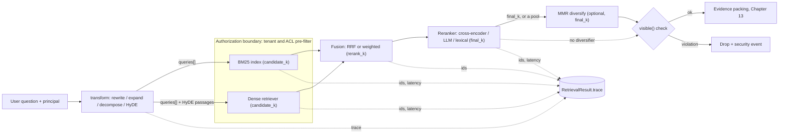
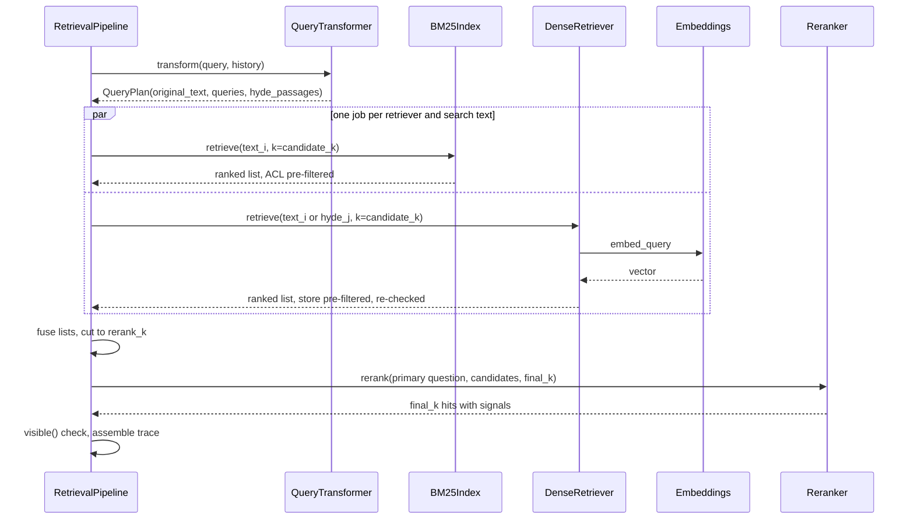
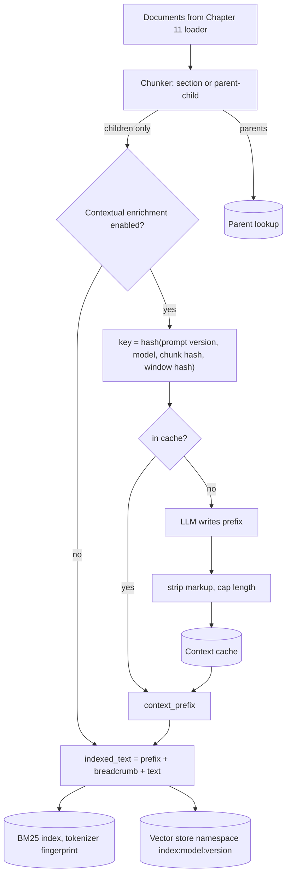

# Chapter 12 — Retrieval Engineering

Retrieval decides most of a RAG system's quality. This chapter treats it as a measured funnel rather than a single similarity search: cheap retrievers for recall, fusion, an expensive reranker for precision, and optional stages that each have to earn their place on the gold set.

**You will be able to:**
- Explain BM25 term by term and build an identifier-aware lexical index that enforces authorization before scoring.
- Combine lexical and dense retrieval with Reciprocal Rank Fusion or weighted fusion, and say when each is right.
- Choose a reranker (lexical baseline, cross-encoder, hosted API, LLM grader) and an optional MMR diversity stage from measured gains per slice.
- Apply query transformations (rewriting, multi-query, decomposition, HyDE) and index-side techniques (contextual and parent-document retrieval) without losing the user's question.
- Size `candidate_k`, `rerank_k`, and `final_k` and split a p95 latency budget across stages with deadlines and degraded paths.
- Diagnose a retrieval failure to the stage that lost the evidence, from per-stage traces.

**Prerequisites:** Chapters 9 (vector stores, filtered search, `semsearch`), 10 (the gold set, the failure catalog, and the retrieval metrics), and 11 (chunks with breadcrumbs and ACL fields). | **Code:** `book/projects/ragkit/ragkit/retrieval/` (run: `cd book/projects/ragkit && pytest -q tests/test_retrieval_*.py`) | **Builds:** the `ragkit.retrieval` package that Chapters 13 to 15 and Project 3 use, and the `compare_retrievers.py` evaluation script.

## Why this matters

Chapter 10 ended with a catalog of failures, and three of them belong to retrieval. A distractor outranked the evidence: "What is the return window for my old laptop?" pulled the Retail Returns API reference above the IT laptop runbook. A stale FAQ outranked the current policy. And a permission leak happened because nothing filtered by the caller's groups. Chapter 11 fixed what it could at ingestion: structure-aware chunks, breadcrumbs, ACL fields on every chunk. What remains is the search itself.

Retrieval is where most of a RAG system's quality is won or lost, and it is an information retrieval problem first. A Northwind support engineer types "INC-2025-1142 root cause". A dense embedding model represents that string as a blur of "incident", "number", and "something about 2025", and it may well prefer the POS overview, which mentions the incident in passing, over the incident report itself. A lexical index matches the token exactly. An employee asks "can I work from another country for a month?". The remote-work policy describes a "work from abroad" allowance of up to 20 working days per calendar year, which shares almost none of the question's words. Dense retrieval bridges that; BM25 does not. Real query logs mix both kinds, so a system that uses only one family of retrieval fails a predictable slice of users, every day, silently.

The second reason is economics. Every stage that reads query and document together (a cross-encoder, an LLM judge, the generator itself) is expensive per candidate. Every stage that scores documents independently of the query (an inverted index, a vector index) is cheap per candidate but shallow. Production retrieval arranges these into a funnel: broad and cheap first, narrow and expensive last, with each stage's k chosen so the next stage has the evidence available without drowning in candidates. Getting the funnel wrong produces either a system that misses evidence the reranker would have found, or one that spends its entire latency budget reranking two hundred chunks to choose eight.

The third reason is safety. Retrieval is the last place where authorization can be enforced cleanly: once a forbidden chunk is scored, logged, or shown to a reranking model, it has been exposed to a component the user's permissions never covered. Chapter 15 owns authorization in retrieval; this chapter shows where each retriever enforces it.

## Mental model

> **Mental model:** Retrieval is a funnel with a recall stage and a precision stage. A relevant chunk missing from the candidates cannot be recovered later; a relevant chunk present but ranked low can.

Hold two pictures at once. The first is the funnel. First-stage retrievers (BM25, dense) scan the authorized corpus and return a candidate set of perhaps 30 to 100 chunks. Their only job is recall: is the evidence somewhere in the candidates? Fusion merges several candidate lists into one. A reranker reads the question and each candidate together and orders a shortlist of perhaps 20 to 50. Its job is precision at the top: are the best five or eight chunks the ones the generator needs? Every stage has its own k, its own latency, and its own metric. Measuring recall at the candidate stage and precision after reranking tells you which stage to fix.

The second picture is that **each retrieval signal fails differently**. Lexical retrieval fails on vocabulary mismatch and succeeds on exact tokens. Dense retrieval fails on rare identifiers, numbers, and negation, and succeeds on paraphrase. Rerankers fail when the candidate set lacks the evidence, and on long or structurally odd chunks, and succeed at telling "about the topic" from "answers the question". Query rewriting fails by drifting from intent and succeeds on conversational references. Combining signals helps exactly when their failures are uncorrelated, which is why hybrid retrieval is a strong default and why stacking three dense variants usually is not.

## Core concepts

> **Default recipe.** If you have no evaluation data yet, start here and change one piece at a time against the gold set:
>
> - **First stage:** BM25 with an identifier-aware tokenizer and a dense retriever, run in parallel, each returning `candidate_k = 50` under the caller's authorization pre-filter.
> - **Fusion:** Reciprocal Rank Fusion with k = 60, cut to `rerank_k = 20`.
> - **Rerank:** a cross-encoder over those 20, returning `final_k = 8`; a lexical-overlap reranker as the fallback and as the baseline every reranker must beat.
> - **Off the hot path:** no HyDE, no LLM reranking, no MMR, no multi-query expansion. Each is a per-slice tool you enable when a slice of the gold set shows the failure it fixes.
> - **Always:** a deadline per stage with a degraded path, and per-stage candidate ids in the trace.
>
> The sections below explain each choice and when to deviate from it.

### Dense retrieval as one stage among several

Chapters 8 and 9 covered embeddings and vector search. From the retrieval engineer's point of view, a dense retriever is a function from (query text, principal, filters, k) to a ranked list of chunks with cosine scores, with three properties that matter here.

First, the representation is learned, so it captures paraphrase and topical similarity, and it is lossy on tokens that were rare in the model's training data. Product codes, ticket numbers, error codes, version strings, and internal acronyms are the classic casualties. A model may embed "SH-201" and "SH-210" almost identically, or embed "SH-201" as noise. The failure is silent: the vector search still returns k results with confident-looking scores.

Second, the vector space is tied to an embedding model and to the exact text that was embedded (Chapter 8's space fingerprint, Chapter 9's `index:model:version` namespaces and migrations). The embedded text here is Chapter 11's breadcrumb plus an optional contextual prefix from this chapter, so changing either means re-embedding into a new index version. A query embedded with a different model than the corpus returns plausible garbage, not an error.

Third, cosine scores are relative: 0.42 is the best match in one corpus and noise in another, so dense scores cannot be thresholded without calibration or added to BM25 scores.

`DenseRetriever` in this chapter does not implement storage. It adapts ragkit chunks to Project 2's `VectorRecord` and calls any `VectorStore`: `NumpyVectorStore` in tests, `PgVectorStore` in Project 3.

### Lexical retrieval and BM25

Lexical retrieval scores a chunk by the query terms it contains. The data structure is an inverted index: for every term, a posting list of the chunks containing it and how often. A query touches only the posting lists of its own terms, which is why lexical search over millions of documents takes milliseconds. The scoring function used by most search engines for three decades is Okapi BM25:

```text
score(q, d) = Σ over query terms t:  idf(t) · tf(t,d) · (k1 + 1) / ( tf(t,d) + k1 · (1 − b + b · |d| / avgdl) )
idf(t)      = ln( 1 + (N − n_t + 0.5) / (n_t + 0.5) )
```

Each piece encodes one intuition about relevance.

**Inverse document frequency.** `N` is the number of chunks and `n_t` the number containing term t. A term in every chunk ("policy") carries little information; a term in a handful ("Patroni", "inc-2025-1142") carries a lot. In the Northwind index of 231 section chunks, "policy" appears in 78 chunks and gets an idf of about 1.08; "inc-2025-1142" appears in 12 and gets 2.92; "old" appears in 10 and gets 3.10. The `1 +` inside the logarithm keeps idf positive even for terms in more than half the chunks. The original Robertson-Sparck Jones form can go negative, which penalizes documents for containing common query words; most modern engines use the positive variant, and so does ours.

**Term-frequency saturation.** The fraction `tf·(k1+1) / (tf + k1·...)` grows with term frequency but flattens. With `k1 = 1.2`, the second occurrence of a term adds much less than the first, and the tenth adds almost nothing. This is the opposite of raw TF-IDF, where a chunk that repeats "VPN" thirty times beats one that mentions it twice. Larger `k1` lets repetition count for more; `k1 = 0` reduces BM25 to a binary "contains the term" model weighted by idf.

**Length normalization.** `|d|` is the chunk's length in tokens and `avgdl` the average. With `b = 0.75`, a chunk twice the average length needs proportionally more occurrences for the same score, because long chunks match more terms by chance. `b = 0` turns normalization off; `b = 1` normalizes fully. Section-aware chunks from Chapter 11 vary in length more than fixed windows, which makes `b` matter more than in textbook benchmarks.

The defaults `k1 = 1.2` and `b = 0.75` are reasonable starting points, not truths. Short, uniform chunks barely care about `b`; collections of long manuals with repeated boilerplate may want lower `k1`. Tune them on the gold set like any other parameter, and only after the tokenizer is right, because tokenization moves results far more than either parameter.

**Tokenization decides what can match.** A naive tokenizer that splits on non-letters turns "INC-2025-1142" into "inc", "2025", "1142", and the query "INC-2025-1142" then matches any chunk mentioning 2025 and any chunk with an "inc". `BM25Tokenizer` emits compound identifiers whole and also as parts, so the exact identifier is one rare, high-idf term while a partial query ("ticket 1142") still matches. It lowercases, drops a short list of stopwords, and folds simple plurals ("laptops" to "laptop", "policies" to "policy"). It does not stem aggressively: a Porter stemmer maps "running" and "runs" together but also maps "general" and "generic" to the same stem, which costs precision in policy text where those words differ. The tokenizer's configuration is part of the index identity. The saved index records a fingerprint, and loading it with a different tokenizer is an error, because a query tokenized one way cannot find terms indexed another way.

Here is the scoring at work on the Chapter 10 distractor, for a retail employee:

| Chunk | Length | Matched terms and contributions | BM25 |
|---|---|---|---|
| Laptop runbook, "Returning the old device" | 61 | old 4.75, laptop 3.24, return 3.17 | 11.16 |
| Returns API, `POST /v2/returns/validate` | 50 | return 3.55, window 2.88 | 6.43 |
| Returns API, "Return eligibility rules" | 70 | return 3.52, window 2.49 | 6.01 |

BM25 gets this one right, because "old" and "laptop" are rare and both appear in the runbook's section; it still ranks the runbook first on fixed windows without breadcrumbs. The naive dense setup put the Returns API first in Chapter 10, because dense similarity rewards the shared topic words "return" and "window". That is the point of looking at per-term contributions (`BM25Index.explain`): when a ranking looks wrong, the explanation tells you whether the problem is a missing term (chunking or tokenization), a dominant common term (idf), or a length effect (`b`).

Use lexical retrieval for identifiers, codes, names, quoted phrases, unfamiliar jargon, and whenever you must explain a match; expect it to fail on paraphrase, misspellings (without fuzzy matching or character n-grams), and multilingual text without per-language analyzers.

> **Sidebar: lexical retrieval in PostgreSQL.** The from-scratch index exists so you know what a lexical engine does; in production you usually let the database or a search engine do it. Chapter 9 already put a generated `tsvector` column on the chunk table and fused it with pgvector results in one SQL statement. Two cautions apply. First, PostgreSQL's built-in `ts_rank` and `ts_rank_cd` are not BM25: they weigh term frequency and term proximity but have no corpus-level idf, so a rare identifier and a common word count the same. That matters little for RRF, which uses only the order, and a lot for weighted score fusion. True BM25 inside PostgreSQL needs an extension or a dedicated search engine, a deliberate dependency either way. Second, the `english` text-search configuration stems and splits tokens, which is good for prose and bad for identifiers. The usual fix is two vectors: a weighted `english` vector for prose (title, breadcrumb, body) and a `simple` vector over extracted identifiers that matches them exactly. `ragkit/retrieval/sql/lexical_tsvector.sql` on disk shows both, with the authorization predicates in the same `WHERE` clause as the text match and a deterministic tiebreak.

### Learned sparse retrieval

Between BM25 and dense retrieval sits a third family. A learned sparse model (SPLADE is the best-known example) runs a transformer over the text and outputs a weight for each term in its vocabulary, including terms that do not appear in the text but are related to it. "Laptop return" might get weight on "device", "hardware", and "handover" as well. The output is still a sparse term-weight vector, so it lives in an ordinary inverted index and is scored by the dot product of query and document weights.

It exists to get some of dense retrieval's paraphrase tolerance while keeping lexical retrieval's machinery: posting lists, exact-term matching, and explainability per term. On many public benchmarks it beats BM25 and is competitive with dense models; on your corpus that is a hypothesis to test, not a given.

The costs are real. Every chunk passes through a model at ingestion, as with dense retrieval, and queries need a model call too unless you use a query-side variant that only tokenizes. Expansion makes documents' posting lists longer, so the index is larger and queries slower than BM25. The vocabulary is the model's, so identifiers the model's tokenizer splits into fragments can fare worse than with an identifier-aware BM25 tokenizer, and a domain shift hurts it the way it hurts dense models. Engine support varies: some search engines and vector databases accept sparse vectors natively, PostgreSQL needs an extension.

Use it as a candidate replacement for BM25 (or for dense, if you need one sparse index instead of two systems) when the paraphrase slice lags and you would rather not run a vector index. Evaluate it on the `exact-id` slice before trusting it with identifiers, and keep it in the funnel the same way: one more ranked list for RRF.

### Metadata filters and authorization

Filters restrict retrieval to chunks that satisfy constraints: tenant and group membership (authorization), and business constraints such as document type, tags, product, language, or freshness. Chapter 9 explained the mechanics of filtered vector search, and Chapter 15 owns the authorization rules: filter before scoring, never after generation, with identity taken from the authenticated session. Here is how the retrieval package applies them.

**Authorization is a pre-filter in every retriever, then a check on the way out.** `BM25Index.search` computes the set of chunk ids the principal may read before touching a posting list, so a forbidden chunk is never scored. `DenseRetriever` turns the principal into a store filter that the store applies before ranking, then re-checks `visible()` on each result, dropping and counting any that fail. `RetrievalPipeline` checks again before returning. Three checks for one rule cost microseconds; the failure they prevent is a breach no answer-level guardrail can undo. Lookups by id, which bypass search (`BM25Index.get_chunks(ids, principal)` for resolving citations), take the principal too and omit forbidden chunks exactly like unknown ones.

**Filters fail loudly.** A filter key that no retriever understands (`"tag_any"` instead of `"tags_any"`) raises `UnknownFilterError`. Ignoring it would silently widen the result set, which for a filter that encodes a contractual restriction is a leak. The supported keys are document-level properties copied onto chunks at ingestion: `tags_any`, `doc_ids`, `exclude_doc_ids`, `updated_after`, `source_types`. A chunk without an `updated_at` fails an `updated_after` filter: missing metadata fails closed.

**Global statistics can leak, slightly.** BM25's idf and average length are computed over the whole index, including documents the current user cannot see, so adding a restricted document with a rare term shifts scores a little. Nothing restricted is returned, and scores are not shown to users, so for most assistants this side channel is far below normal index churn. For high-sensitivity tenants, per-tenant indexes (Chapter 15) remove it.

Business filters are also a precision tool, not only a safety one. "Show me only current policies" (`updated_after`, `tags_any: ["policy"]`) removes the stale-FAQ failure from Chapter 10 for questions where the user or a router knows the intent. The risk is over-filtering: a filter that excludes the only document with the answer produces a confident abstention, or worse, a confident answer from the next-best chunk. Log the number of candidates after filtering, and alert when filters frequently reduce candidates to zero.

### Fusion: combining ranked lists

Once two retrievers each return a ranked list, they must be merged. Raw scores cannot simply be added: BM25 scores in the Northwind index range from about 0 to 35, cosine similarities from about 0 to 0.7, and the ranges shift with every query. Two fusion methods dominate.

**Reciprocal Rank Fusion** ignores scores and uses positions. The intuition: positions are comparable across lists when scores are not, and a chunk that two independent retrievers both rank well is better evidence than one ranked first by only one of them:

```text
RRF(d) = Σ over lists i:  w_i / (k + rank_i(d))         (a list that does not contain d contributes 0)
```

Take two lists: BM25 returns [x, y, z] and dense returns [y, w]. With k = 60, y scores 1/62 + 1/61 ≈ 0.0325, x scores 1/61 ≈ 0.0164, w scores 1/62 ≈ 0.0161, z scores 1/63 ≈ 0.0159. The fused order is y, x, w, z: the chunk both retrievers found wins, even though BM25 ranked it only second. The constant k controls how much the top of each list dominates. With k = 0, rank 1 scores 1.0 and rank 2 scores 0.5, so one retriever's top hit can override agreement. With k = 60, the conventional default, rank 1 scores 1/61 and rank 10 scores 1/70, a difference of about 13 percent, so appearing in both lists matters far more than position within one. RRF needs no calibration, is robust to score distributions changing between queries, and works for any number of lists, which is why it is the right default when you have no labeled data. Its weakness is that it discards score gaps. If BM25 finds one chunk with a score of 22 and the rest below 5, that is strong evidence of an exact match, and RRF treats it the same as a narrow win.

**Weighted score fusion** keeps the gaps. Normalize each list's scores to [0, 1] with min-max scaling, then take a weighted sum. With BM25 scores [12, 7, 1] normalized to [1, 0.55, 0] and dense scores [0.91, 0.42] normalized to [1, 0], equal weights give y = 0.55 + 1 = 1.55, x = 1.0, and w = z = 0. It can outperform RRF when weights are tuned on judged queries, especially when one retriever's confidence is informative. It has two traps. Min-max normalization is relative to the list, so the best dense hit always gets 1.0, even when it is a terrible match for a query dense retrieval cannot handle (an error code). And weights tuned on one query mix go stale when the mix changes. Use it when you have a few hundred judged queries and re-tune on every model or chunking change; otherwise use RRF.

Both implementations keep every input list's rank and score in `ScoredChunk.signals` (`bm25_rank`, `dense_score`, and so on). When a fused ranking surprises you, the signals answer "which retriever put this here?" without rerunning anything. Learned fusion, where a small model combines features such as both scores, ranks, and document metadata, is the next step when you have click or judgment data at scale, and it needs the evaluation discipline of Chapter 14 to avoid overfitting a small gold set.

### Reranking

A reranker takes a query and a short candidate list and produces a better ordering by reading query and candidate together. First-stage retrievers are fast because they cannot do this. A dense retriever compresses the chunk into a vector before the query exists; BM25 counts terms without understanding them. A reranker can notice that the Returns API chunk is about customer purchases and the question is about an employee's laptop.

**Cross-encoders** are transformer models that take the concatenated pair (query, passage) and output a relevance score. Because attention runs across both texts, they capture interactions that independent embeddings miss: negation, which entity a number belongs to, whether the passage answers or merely mentions. The cost is a full model forward pass per pair. A small cross-encoder on a GPU scores tens of pairs in tens of milliseconds; on a CPU, the same work can take several hundred milliseconds (illustrative figures; measure on your hardware). That cost is why cross-encoders rerank 20 to 100 candidates, never the corpus.

Trained mostly on web search data, they may need domain evaluation and sometimes fine-tuning (Chapter 33). `CrossEncoderReranker` loads a local model through sentence-transformers only on first use, accepts an injected scoring function for tests or for a model served elsewhere, and, if the library or weights are missing, logs one warning and delegates to a fallback reranker instead of failing requests. The fallback is visible in `backend` and in a signal on every hit, so a deployment that silently lost its model shows up in traces.

**LLM rerankers** prompt a general model to grade relevance. `LLMReranker` sends batches of eight candidates, asks for an integer grade from 0 (unrelated) to 3 (contains the answer), and validates the response against a pydantic schema through `aie_core.complete_structured`, which repairs malformed output once. Graded scores are coarser than a cross-encoder's continuous scores but more interpretable, and an LLM can apply instructions ("prefer current policies over FAQs", "a passage about customer returns does not answer employee device questions").

Listwise prompting (rank these ten passages) can be more accurate than pointwise grading but is sensitive to the order in which candidates are presented and harder to validate; pointwise grades in small batches are the safer production default.

The costs are latency (one LLM call per batch, typically hundreds of milliseconds to seconds), money, and a new attack surface: the reranker reads untrusted chunk text, and the vendor newsletter in the shared corpus contains an injection paragraph. The prompt fences passages inside `<untrusted_data>` tags and tells the model to ignore instructions inside them; the schema limits the damage an injection can do to a grade between 0 and 3. When the provider fails, the reranker returns the incoming order with a `rerank_failed` signal rather than failing the request.

**Lexical overlap** is the baseline: the fraction of query terms present in the chunk, plus a weighted bonus for terms in the title and section breadcrumb. It costs microseconds and fixes a surprising share of shallow ranking errors, including the laptop distractor in the naive setup. Every other reranker must beat it on the gold set to justify its latency.

**Hosted rerank and embedding APIs.** Several providers sell reranking as an API call: send the query and up to some number of passages, get back relevance scores. They are usually cross-encoder-class models you do not have to serve, often multilingual, and the same is true of hosted embedding APIs for the dense stage. They remove GPU operations and model updates from your team. In exchange, every query sends candidate chunk text to a third party (check data-processing terms and whether restricted tenants may use it), the network round trip and the provider's tail latency land inside your retrieval budget, cost scales with candidates times queries, and the model can change under you, so pin a version where the provider allows it and keep the gold-set gate. `CrossEncoderReranker` accepts an injected scoring function, so a hosted reranker plugs in as one; if the call raises or misses `rerank_timeout_s`, the pipeline keeps the fused order. A self-hosted cross-encoder wins when volume is high, data cannot leave, or latency must be tight and predictable; a hosted one wins when the team is small and the volume moderate.

**Late interaction** (ColBERT-style, one vector per token, scored with MaxSim) sits between single-vector retrieval and a cross-encoder. It is not implemented here; Chapter 37 covers it.

Two cautions apply to all rerankers. Their scores are not probabilities and are not comparable across models; a cut-off ("drop candidates below 0.3") must be calibrated on judged queries (Chapter 14). And a reranker can only reorder what it is given: if recall at the candidate stage is 70 percent, a perfect reranker yields at most 70 percent. Measure candidate recall before buying a better reranker.

### Diversity: maximal marginal relevance

A reranker scores each candidate on its own, so it cannot see that its top four say the same thing. That happens whenever a fact is restated: the PTO policy and the HR FAQ both state the carryover rule, overlapping chunks repeat each other, and a two-facet question ("how many PTO days carry over, and by when must I use them?") can get four slots of carryover and none of the expiry deadline.

Maximal marginal relevance (MMR) picks hits one at a time. Each remaining candidate scores

```text
MMR(d) = λ · relevance(d) − (1 − λ) · max over already-picked p: similarity(d, p)
```

and the best one is taken. λ = 1 keeps the reranker's order; lower values push harder against near-copies. In this pipeline relevance is the reranker's score rescaled to [0, 1] over the pool (divided by the pool maximum when scores are non-negative, so the weakest candidate is not pinned at zero), and similarity is token-set Jaccard by default, which costs no model call and catches overlapping chunks and copied paragraphs. Passing an `EmbeddingClient` switches to cosine, which also catches paraphrases, for one embedding batch per request. With the test fixture's scores, a near-copy of the first pick keeps the second slot at λ = 0.9 and loses it to the deadline chunk at λ = 0.8, so λ is tuned on the gold set, not guessed: start around 0.7 (illustrative).

MMR helps on multi-facet questions, on corpora with many near-copies (mirrored wikis, FAQs restating policies, overlapping chunks), and when `final_k` is small. It hurts on single-fact lookups, where a second copy of the right answer is better evidence than an unrelated chunk, and whenever the pool holds weak candidates, because an unrelated chunk is maximally "diverse". Two guards follow: a `min_relevance` floor, and a small, already-reranked pool (`diversify_pool_k`, by default twice `final_k`, capped at `rerank_k`).

Run it after the reranker, never before: first-stage scores cannot tell "about the topic" from "answers the question", and the reranker would undo MMR's choices. Re-tune λ whenever the reranker changes, because score spreads differ between rerankers. On the Northwind corpus the effect is small and mixed (one swap of two equally plausible sections), which is the expected result on a corpus with little duplication, and why MMR ships off by default and is enabled per slice where the `multi-hop` metrics show a gain. It does not replace deduplication: the evidence packer (Chapter 13) still removes exact duplicates and merges overlapping chunks.

### Query transformation

What users type is often a poor search query. Four transformations address different gaps, and all of them follow one rule in this codebase: the `QueryPlan` they return always carries `original_text`, the pipeline traces every search text it issued, and on any model failure or implausible output the transformer falls back to the original.

**Conversation-aware rewriting.** In a chat, the second question is often "and by when do I have to use them?" Searched literally, that matches nothing useful. `QueryRewriter` sends the last few turns and the latest message to a model and asks for one standalone query that resolves references, keeps every identifier and number exactly, and neither answers nor changes scope. The output is checked for plausibility (non-empty, not an essay), because a rewriter that drifts ("PTO carryover" becoming "vacation policy overview") produces confident retrieval of the wrong thing. The rewritten query becomes the plan's `primary`, which rerankers judge against, because the raw follow-up has no meaning on its own. Rewriting costs one small model call per turn, on the critical path; skip it for the first turn of a conversation and for queries that are already standalone (a cheap heuristic such as "no pronouns, longer than five words" catches most).

**Multi-query expansion.** `MultiQueryExpander` asks for a few paraphrases in the vocabulary a document author would use ("carry over" alongside "carryover", "unused vacation days roll into next year"). The pipeline searches every retriever with every variant and fuses all lists with RRF. Expansion raises recall on vocabulary-mismatch questions at the cost of more first-stage queries (cheap) and a model call (not cheap). It also raises the number of distractors in the candidate set, which a reranker then has to handle. The original query is always the first variant.

**Decomposition.** "What is the format of a Trackline tracking ID and how many requests per minute can I make?" asks two things that live in different sections. A single embedding of the whole question lands between them. `QueryDecomposer` splits it into self-contained sub-questions, each searched separately, with the original kept for reranking. Decomposition helps multi-hop and multi-part questions and hurts simple ones, where the extra queries add noise; the decomposer is told to return the question unchanged when it asks one thing.

**HyDE (Hypothetical Document Embeddings).** A short question and a long policy paragraph sit far apart in embedding space even when one answers the other. HyDE asks a model to write a passage that would answer the question, in the style of the corpus, and embeds that passage instead of the question. The synthetic passage shares vocabulary and structure with real documents, so it often lands nearer the right ones. `HyDEGenerator` asks for placeholders instead of invented numbers, keeps the original question as the only lexical query, and the pipeline routes HyDE passages to dense retrievers only, so BM25 never searches for terms a model made up.

HyDE helps underspecified, abstract, or jargon-poor questions over corpora whose style the model can imitate. It hurts when the model's prior is wrong: asked about Northwind's carryover rule, a model that "knows" a typical rule of five days writes a passage about five days, and the embedding pulls toward the stale FAQ that says five. It hurts on identifier queries, where the passage dilutes the one token that mattered. And it adds a generation call before retrieval can even start, which is often the largest single latency item in the pipeline. Treat it as a per-slice tool enabled where evaluation shows a gain, never as a global default.

Agentic retrieval, where a model decides iteratively what to search next, belongs to Chapter 37; prefer the bounded, deterministic transformations above first.

### Contextual retrieval

The techniques so far change the query; the next two change what is indexed and what is returned. Chapter 11's breadcrumb puts the document title and section path in front of every chunk before indexing. Contextual retrieval goes further: at ingestion time, a model reads the chunk and its surrounding document and writes one or two sentences situating it ("From the NorthGate VPN runbook: the fix for error 412, an expired device certificate"). The sentence is prepended to the chunk for both lexical and dense indexing, never shown to the generator as evidence.

It helps most on corpora with terse sections that do not repeat their subject: "Click Renew certificate in the client; if that fails, run Repair" says nothing about VPNs or error codes, and neither BM25 nor an embedding can connect it to "how do I fix error 412" without help. It helps less on well-structured documents where the breadcrumb already carries the context, and it costs one model call per chunk at ingestion, which for a large corpus is a real line item and for a frequently edited corpus recurs.

Two engineering details make it affordable and safe. The cache key is a content hash of everything that determines the output: prompt version, model, the chunk's content hash, and a hash of the document title and the window the model saw. The window is the chunk's neighborhood (a few thousand characters), not the whole document, so an edit far from a chunk does not invalidate its context, and an unchanged chunk in a re-ingested document costs nothing. Failures are not cached: a chunk whose context generation failed keeps its breadcrumb and is retried on the next run. And because the prefix is model output generated from untrusted text, it is stripped of markup and capped in length before it enters an index.

One subtle consequence: the chunk id from Chapter 11 is derived from the chunk's content, not its index text, so a new context prefix does not change the id. An indexing pipeline that decides what to re-embed by comparing chunk ids would miss the change. `ContextualEnricher` records a `context_key` in metadata precisely so the indexer can compare it; Chapter 15's indexing worker includes it in the record fingerprint.

### Parent-document retrieval

Small chunks match precisely; large chunks give the generator context. Parent-document retrieval refuses to choose: index small children, return their parents. Chapter 11's `ParentChildChunker` cuts sections (parents, up to 800 tokens by default) into sentence packs (children, about 128 tokens), and `expand_to_parents` maps child hits to parents. `ParentDocumentRetriever` wraps any child-level retriever and asks it for `fanout × k` children, where `fanout` is a multiplier (3 by default) that compensates for several children of one section collapsing into one parent. It keeps the best child's score and rank and records how many children matched.

It helps when answers need the qualifiers around a sentence (an exception two lines later, a table header above a row), and it makes chunk boundaries nearly irrelevant at generation time. It hurts the token budget: eight parents of 800 tokens are 6,400 tokens of evidence, much of it irrelevant, and the packing stage (Chapter 13) must then trim. It also changes what "relevant chunk" means for evaluation, because the gold evidence is now judged at parent level. A common middle ground is to return the matched child plus its immediate neighbors rather than the whole section.

### Candidate funnel sizing

With the stages defined, the remaining question is how large each one should be. Every stage has a k, and the k values are linked. Let `candidate_k` be the number each first-stage retriever returns per search text, `rerank_k` the number of fused candidates the reranker sees, and `final_k` the number passed to the generator.

Start from the end. `final_k` is set by the generator's evidence budget and by how many chunks typical answers need: five to ten for most question answering, more for summaries. `rerank_k` is set by reranker latency: if the reranker costs a fixed amount per candidate, its stage latency grows linearly with `rerank_k`, so pick the largest value the budget allows and check that candidate recall at that depth is close to its ceiling. `candidate_k` is set by first-stage recall: plot recall@k for the fused list as k grows and choose the knee, typically somewhere between 30 and 100. Larger `candidate_k` is cheap for BM25 and exact vector search and more expensive for approximate indexes. In pgvector without iterative scans, `ef_search` caps how many results one search can return, so it must be at least `candidate_k`; with iterative scans the index keeps scanning until it has enough, at a latency cost that grows with filter selectivity (Chapter 9). Either way, `candidate_k` only matters if fusion actually promotes the extra candidates into the top `rerank_k`.

The diagnostic that ties this together is the stage recall table. For each gold question, record whether a required document is in each retriever's list, in the fused top `rerank_k`, and in the final top `final_k`. If the evidence is missing from every first-stage list, fix chunking, tokenization, or the embedding model. If it is in a first-stage list but not in the fused top `rerank_k`, raise `rerank_k` or adjust fusion. If it is in the reranker's input but not its output, the reranker is the problem. `RetrievalPipeline` records every stage's candidate ids precisely so this table is a query over traces; the comparison script reports `cand_recall` for the reranker's input next to final recall, and Chapter 14 generalizes it into a stage-isolation report.

On the Northwind corpus these sizes barely matter: each user can see 109 to 198 of the 231 chunks, so `candidate_k = 30` already covers a large fraction of the visible index, and candidate recall is 1.0 at every size the comparison script tries. That is a property of a toy corpus, not of the method. On a corpus of a million chunks, recall at 30 and recall at 200 can differ by tens of points, and the funnel sizes become the main tuning knob.

### Latency budgeting across stages

Northwind's target is a p95 time to first token under 2 seconds for RAG answers. Generation needs most of that: model queueing and prefill on a few thousand tokens of evidence. An illustrative allocation leaves retrieval about 400 milliseconds at p95:

| Stage | Illustrative p95 budget | What drives it |
|---|---|---|
| Query rewrite (conversational turns only) | 150 ms | one small model call; skip when standalone |
| BM25 and dense, in parallel | 60 ms | the slower of the two, not the sum; dense includes embedding the query |
| Fusion | under 1 ms | in-process arithmetic |
| Rerank 20 candidates (cross-encoder, GPU) | 120 ms | per-candidate forward passes; batching |
| ACL check, assembly, tracing | 10 ms | |
| Total retrieval | about 340 ms, 60 ms headroom | |

Three rules follow. Run independent stages concurrently: the pipeline issues every (retriever, search text) job at once and records the wall-clock time of the parallel phase. Put a deadline on every stage and degrade instead of failing: a dense retriever that misses the deadline leaves BM25 results; a reranker that misses it leaves the fused order. `RetrievalPipeline` takes `retrieve_timeout_s` and `rerank_timeout_s` for exactly this; with the budget above, 80 ms and 150 ms (illustrative) leave room for the p95 while cutting off a hung dependency. And budget at p95 or p99, not the mean, because the slowest of several parallel calls determines the stage latency, so tail latency compounds. An LLM reranker or HyDE, each adding an LLM call that can take a second or more, does not fit this budget; they belong to asynchronous flows, offline evaluation, or slices where quality justifies a slower answer. Chapter 30 develops latency budgets across the whole request.

## How it works

A request passes through the pipeline in five steps, plus an optional sixth, each recorded in the trace.

1. **Transform.** The transformer (identity by default) turns the `RetrievalQuery` into a `QueryPlan`: one or more search texts, optional HyDE passages, and the untouched `original_text`. A conversational follow-up becomes a standalone query; a multi-part question becomes sub-questions. If the model fails or returns something implausible, the plan falls back to the original and is marked `fallback`.
2. **Retrieve.** The pipeline builds one job per (retriever, search text) pair, adding (dense retriever, HyDE passage) jobs, and runs them concurrently. Each job asks for `candidate_k` hits under the caller's principal and filters. A job that raises is recorded with its error and skipped; if every job fails, the request fails with `RetrievalError`.
3. **Fuse.** All successful lists, named like `bm25#q0`, `dense#q1`, `dense#hyde0`, are merged with RRF (or weighted fusion) and cut to `rerank_k`. Weights are configured per retriever and applied to every list that retriever produced.
4. **Rerank.** The reranker receives the fused shortlist and a copy of the query whose text is the plan's `primary` (the standalone question) and whose `original_text` is what the user typed. It returns `final_k` hits. A reranker exception leaves the fused order and is recorded as degradation.
5. **Diversify (optional).** With a diversifier configured, the reranker returns a pool of `diversify_pool_k` hits and MMR picks `final_k` of them, trading relevance against redundancy with what it already picked. A diversifier exception keeps the relevance order and is recorded as degradation.
6. **Check and return.** Every hit is checked with `visible(chunk, principal)` once more. A violation is removed and listed under `acl_violations`, which should always be empty and is worth an alert if it is not.

Offline, documents flow the other way. Chapter 11's loader and chunker produce chunks; optionally `ContextualEnricher` adds a context prefix; `BM25Index.add` and `DenseRetriever.index` write them, each document replaced atomically by version. For parent-document retrieval, only children are indexed and parents are kept in a lookup.

## Architecture

The first diagram shows the online funnel, with the authorization boundary that every first-stage retriever enforces before scoring.



The second diagram shows timing. The first-stage jobs overlap, so the retrieve stage costs the slowest job; transformation and reranking are sequential and dominate when they call a model.



The third diagram shows the ingestion side and where the contextual cache sits. The cache key covers everything that determines the prefix, so re-ingestion calls the model only for chunks whose neighborhood changed.



## Implementation

The retrieval package sits inside ragkit so that Chapters 13 to 15 import one library. Only `types.py` predates this chapter; it is the fixed contract every stage speaks.

```text
book/projects/ragkit/
  ragkit/retrieval/
    types.py        # FIXED CONTRACT: Principal, RetrievalQuery, ScoredChunk, RetrievalResult, Retriever, Reranker, visible
    common.py       # filters (fail loudly), indexed_text, rerank_list, Stopwatch
    settings.py     # RetrievalSettings (RAGKIT_RETRIEVAL_*)
    bm25.py         # BM25Tokenizer, BM25Index
    dense.py        # DenseRetriever over a semsearch VectorStore
    hybrid.py       # reciprocal_rank_fusion, weighted_score_fusion, min_max, HybridRetriever
    rerank.py       # LexicalOverlapReranker, CrossEncoderReranker, LLMReranker
    diversity.py    # MMRDiversifier, mmr_order, normalized_relevance (optional stage after rerank)
    mmr.py          # mmr_select: embedding-space MMR over ScoredChunk (Chapter 8's formula)
    query.py        # QueryPlan, QueryRewriter, MultiQueryExpander, QueryDecomposer, HyDEGenerator, ChainedTransformer
    parent.py       # ParentDocumentRetriever, parent_child_index
    contextual.py   # ContextualEnricher, JsonFileCache
    pipeline.py     # RetrievalPipeline, RetrievalError, stage_candidates
    sql/lexical_tsvector.sql
  ragkit/eval/compare_retrievers.py
  tests/retrieval_fixtures.py, tests/test_retrieval_*.py
```

Install and run, from `book/projects/ragkit`:

```bash
uv pip install -e ../aie_core -e ../p2-semantic-search -e .   # or the same with pip
pytest -q tests/test_retrieval_*.py
python -m ragkit.eval.compare_retrievers --by-tag
# optional local cross-encoder: pip install -e '.[rerank]' and set RAGKIT_RETRIEVAL_CROSS_ENCODER_MODEL
```

| Variable | Default | Meaning |
|---|---|---|
| `RAGKIT_RETRIEVAL_CANDIDATE_K` | `50` | hits per first-stage retriever per search text |
| `RAGKIT_RETRIEVAL_RERANK_K` | `20` | fused candidates handed to the reranker |
| `RAGKIT_RETRIEVAL_FINAL_K` | `8` | hits returned to the generator |
| `RAGKIT_RETRIEVAL_FUSION` | `rrf` | `rrf` or `weighted` |
| `RAGKIT_RETRIEVAL_RRF_K` | `60` | RRF damping constant |
| `RAGKIT_RETRIEVAL_BM25_K1`, `RAGKIT_RETRIEVAL_BM25_B` | `1.2`, `0.75` | BM25 saturation and length normalization |
| `RAGKIT_RETRIEVAL_CROSS_ENCODER_MODEL` | unset | local cross-encoder name or path; unset means lexical fallback |
| `RAGKIT_RETRIEVAL_RERANK_BATCH_SIZE` | `8` | candidates per LLM reranking call |
| `RAGKIT_RETRIEVAL_DIVERSITY` | `none` | `mmr` adds an `MMRDiversifier` (Jaccard similarity) after the reranker |
| `RAGKIT_RETRIEVAL_MMR_LAMBDA` | `0.7` | relevance weight; 1.0 keeps the reranker's order |
| `RAGKIT_RETRIEVAL_DIVERSIFY_POOL_K` | unset | reranked hits MMR chooses from; unset means `min(2 * final_k, rerank_k)` |
| `RAGKIT_RETRIEVAL_PARALLEL` | `true` | run first-stage jobs concurrently |
| `RAGKIT_RETRIEVAL_RETRIEVE_TIMEOUT_S` | unset | deadline for the first-stage phase; unfinished jobs are skipped and marked `timed_out` |
| `RAGKIT_RETRIEVAL_RERANK_TIMEOUT_S` | unset | deadline for the reranker; on expiry the fused order is kept |
| `LLM_PROVIDER`, `LLM_MODEL`, `EMBEDDING_PROVIDER`, `EMBEDDING_MODEL` | `fake` | read by `aie_core` for transformers, LLM reranking, contextual enrichment, and dense retrieval |

### BM25 from scratch

The whole index is one file on disk: the tokenizer, writes with per-document replacement, `get_chunks` for authorized lookups by id, `explain` for per-term contributions, and `save`/`load` with the tokenizer fingerprint check. The excerpt shows the three parts that carry the ideas. Read `allowed_ids` and the inner loop of `search` together: authorization happens before scoring, and the posting loop skips anything outside the allowed set.

```python
# path: book/projects/ragkit/ragkit/retrieval/bm25.py (excerpt; full file on disk)
class BM25Tokenizer:
    """Lowercase word tokens; compound identifiers emitted whole and split; optional plural folding."""
    # ...
    def tokenize(self, text: str) -> list[str]:
        out: list[str] = []
        for match in _TOKEN_RE.finditer(text.lower()):
            tok = match.group(0)
            if _PART_RE.search(tok):
                out.append(tok)  # the whole identifier: "inc-2025-1142"
                parts = [p for p in _PART_RE.split(tok) if p]
                out.extend(self._norm(p) for p in parts if p not in self.stopwords and len(p) >= self.min_len)
            elif tok not in self.stopwords and len(tok) >= self.min_len:
                out.append(self._norm(tok))
        return out

# ...
    def idf(self, term: str) -> float:
        n_t = len(self._postings.get(term, {}))
        n = len(self._chunks)
        return math.log(1.0 + (n - n_t + 0.5) / (n_t + 0.5))

    def _term_score(self, term: str, chunk_id: str, tf: int) -> float:
        dl = self._length[chunk_id]
        avgdl = self.avgdl or 1.0
        denom = tf + self.k1 * (1.0 - self.b + self.b * dl / avgdl)
        return self.idf(term) * tf * (self.k1 + 1.0) / denom

    def allowed_ids(self, principal: Principal, filters: dict | None = None) -> set[str]:
        """Chunk ids this principal may see under these filters. Computed before any scoring."""
        filters = filters or {}
        validate_filters(filters)
        return {cid for cid, c in self._chunks.items() if visible(c, principal) and matches_filters(c, filters)}

    def search(self, text: str, principal: Principal, k: int = 10, filters: dict | None = None) -> list[ScoredChunk]:
        if k <= 0 or not self._chunks:
            return []
        allowed = self.allowed_ids(principal, filters)
        if not allowed:
            return []
        query_terms = Counter(self.tokenizer.tokenize(text))
        scores: dict[str, float] = {}
        matched: Counter[str] = Counter()
        for term, qtf in query_terms.items():
            for cid, tf in self._postings.get(term, {}).items():
                if cid not in allowed:  # authorization first: forbidden chunks are never scored
                    continue
                scores[cid] = scores.get(cid, 0.0) + qtf * self._term_score(term, cid, tf)
                matched[cid] += 1
        ranked = sorted(scores.items(), key=lambda kv: (-kv[1], kv[0]))[:k]
        # ... wrap each (cid, score) in a ScoredChunk with signals "bm25" and "bm25_matched_terms"
```

`_norm` (on disk) folds simple plurals; `allowed_ids` scans every chunk, which is fine for an in-memory teaching index and is what a real engine replaces with a filter bitmap or posting-list intersection.

### Dense retrieval over the Project 2 store

`index` (on disk) groups chunks by document and writes each document with the store's `replace_document`, so a reader never sees two versions of one document. `_store_filter` (on disk) turns the principal into tenant and group predicates and reduces the document-level filters to an allowed doc-id set, raising if it has no document catalog rather than silently returning nothing. `_search` applies that filter in the store and re-checks every result.

```python
# path: book/projects/ragkit/ragkit/retrieval/dense.py (excerpt; full file on disk)
def _search(self, text: str, principal: Principal, k: int, filters: dict | None) -> tuple[list[ScoredChunk], int]:
    """Returns (hits, dropped) where dropped counts results that failed the final ACL check."""
    if k <= 0:
        return [], 0
    flt = self._store_filter(principal, filters or {})
    if flt.doc_ids is not None and not flt.doc_ids:
        return [], 0
    vector = self.embeddings.embed_query(text)
    raw = self.store.search(self.namespace, vector, k, flt)
    hits: list[ScoredChunk] = []
    dropped = 0
    for h in raw:
        chunk = Chunk.model_validate(h.metadata["chunk"])
        if not visible(chunk, principal):  # defense in depth: never trust one layer with ACLs
            dropped += 1
            continue
        if self.min_score is not None and h.score < self.min_score:
            continue
        hits.append(
            ScoredChunk(chunk=chunk, score=h.score, stage=self.name, rank=len(hits) + 1,
                        signals={"dense": round(h.score, 6)})
        )
    return hits, dropped
```

### Fusion

RRF is a few lines of arithmetic; the rest of the function is bookkeeping that keeps every input list's rank and score in `signals`. `weighted_score_fusion` and `min_max` (on disk) follow the same shape, min-max scaling each list before the weighted sum, and map a list whose scores are all equal to 1.0 rather than dividing by zero.

```python
# path: book/projects/ragkit/ragkit/retrieval/hybrid.py (excerpt; full file on disk)
def reciprocal_rank_fusion(
    rankings: Mapping[str, Ranking],
    *,
    k: int = 60,
    weights: Mapping[str, float] | None = None,
    limit: int | None = None,
) -> list[ScoredChunk]:
    """Fuse ranked lists by sum of w / (k + rank). Ranks are 1-based positions in each list."""
    # ...
    for name, ranking in rankings.items():
        seen: set[str] = set()
        for position, hit in enumerate(ranking, start=1):
            cid = hit.chunk.id
            if cid in seen:  # a list that repeats a chunk counts it once, at its best rank
                continue
            seen.add(cid)
            chunks.setdefault(cid, hit)
            fused[cid] = fused.get(cid, 0.0) + w[name] / (k + position)
            best_rank[cid] = min(best_rank.get(cid, position), position)
            sig = signals.setdefault(cid, {})
            sig.update({k_: v for k_, v in hit.signals.items() if k_ not in sig})
            sig[f"{name}_rank"] = float(position)
            sig[f"{name}_score"] = round(hit.score, 6)
    order = sorted(fused, key=lambda cid: (-fused[cid], best_rank[cid], cid))
    # ...
```

The sort key matters more than it looks: ties break on the best rank in any list and then on chunk id, so the same inputs always produce the same order, which is what makes traces and evaluation runs reproducible.

### Rerankers

The LLM reranker is the most instructive of the three because it shows the pattern for any model-in-the-loop stage: untrusted input fenced, output validated by schema, a cheap deterministic tiebreak, and degradation on failure. `_grade` (on disk) calls `complete_structured` with a `GradeBatch` schema, so an out-of-range grade is repaired once or rejected, and a passage the model skipped is marked `llm_missing`. The cross-encoder's lazy loading and fallback are on disk too; the lexical baseline is about twenty lines.

```python
# path: book/projects/ragkit/ragkit/retrieval/rerank.py (excerpt; full file on disk)
def build_request(self, question: str, batch: Sequence[ScoredChunk]) -> CompletionRequest:
    blocks = []
    for i, c in enumerate(batch, start=1):
        header = c.chunk.context_header() or c.chunk.doc_id
        body = c.chunk.text[: self.max_chars]
        blocks.append(f'<passage id="{i}" source="{c.chunk.doc_id}" title="{header}">\n'
                      f"<untrusted_data>\n{body}\n</untrusted_data>\n</passage>")
    user = f"Question: {question}\n\n" + "\n\n".join(blocks) + f"\n\nGrade passages 1 to {len(batch)}."
    return CompletionRequest(
        messages=[Message.system(RERANK_SYSTEM), Message.user(user)],
        model=self.model,
        temperature=0.0,
        max_tokens=40 + 16 * len(batch),
        metadata={"purpose": "rerank", "batch_size": len(batch)},
    )

def rerank(self, query: RetrievalQuery, candidates: list[ScoredChunk], k: int) -> list[ScoredChunk]:
    if not candidates:
        return []
    batches = [candidates[i : i + self.batch_size] for i in range(0, len(candidates), self.batch_size)]
    try:
        if self.max_concurrency > 1 and len(batches) > 1:
            with ThreadPoolExecutor(max_workers=min(self.max_concurrency, len(batches))) as pool:
                graded = list(pool.map(lambda b: self._grade(query.text, b), batches))
        else:
            graded = [self._grade(query.text, b) for b in batches]
    except LLMError as exc:
        # Degrade to the incoming order rather than failing the request; the signal makes it visible.
        log.warning("LLMReranker failed (%s); keeping prior order", exc)
        return [c.model_copy(update={"stage": "rerank", "rank": i,
                                     "signals": {**c.signals, "rerank_failed": 1.0}})
                for i, c in enumerate(candidates[:k], start=1)]
    n = len(candidates)
    out: list[ScoredChunk] = []
    for batch, grades in zip(batches, graded):
        for c, g in zip(batch, grades):
            sig = {**c.signals, "prior_rank": float(c.rank)}
            if g is None:
                sig["llm_missing"] = 1.0
            sig["llm_grade"] = g if g is not None else 0.0
            out.append(c.model_copy(update={"score": (g or 0.0) + _prior_bonus(c, n), "signals": sig}))
    return rerank_list(out, "rerank")[:k]
```

`_prior_bonus` adds a small amount that decreases with the incoming rank, smaller than one grade step, so it only breaks ties among passages with the same grade.

### Diversity

`MMRDiversifier` has the `Reranker` shape, `rerank(query, candidates, k)`, so it can run standalone on any ranked list; inside the pipeline it is the `diversifier` argument. The pipeline records the reranker's pool and MMR's choice as separate `rerank` and `diversify` stages, so a trace shows exactly which chunk diversity displaced, and each selected hit carries `prior_rank`, `mmr_relevance`, `mmr_redundancy`, and `mmr_score`. `normalized_relevance` (on disk) does the rescaling described in Core concepts. For callers that hold vectors and have no reranker, `mmr_select` in `mmr.py` is the embedding-space form, identical to Chapter 8's. Both share the greedy loop:

```python
# path: book/projects/ragkit/ragkit/retrieval/diversity.py (excerpt; full file on disk)
def mmr_order(relevance: Sequence[float], similarity: np.ndarray, k: int, lambda_: float,
              min_relevance: float = 0.0) -> list[tuple[int, float, float]]:
    """Greedy MMR. Returns (index, mmr score, redundancy) in selection order."""
    pool = [i for i, r in enumerate(relevance) if r >= min_relevance]
    chosen: list[tuple[int, float, float]] = []
    while pool and len(chosen) < k:
        best, best_score, best_red = pool[0], float("-inf"), 0.0
        for i in pool:  # pool order = incoming rank, so ties keep the reranker's order
            red = max((float(similarity[i, j]) for j, _, _ in chosen), default=0.0)
            score = lambda_ * relevance[i] - (1.0 - lambda_) * red
            if score > best_score + 1e-12:
                best, best_score, best_red = i, score, red
        chosen.append((best, best_score, best_red))
        pool.remove(best)
    return chosen
```

### Query transformation

`QueryPlan` is the contract: whatever a transformer does, the original survives and `primary` names the text rerankers judge against. The rewriter and HyDE excerpts below show the fallback pattern every transformer follows; `MultiQueryExpander`, `QueryDecomposer`, and `ChainedTransformer` are on disk.

```python
# path: book/projects/ragkit/ragkit/retrieval/query.py (excerpt; full file on disk)
class QueryPlan(BaseModel):
    original_text: str
    queries: list[str]  # search texts for every retriever; queries[0] is the primary one
    strategy: str
    hyde_passages: list[str] = Field(default_factory=list)  # embedded by dense retrievers only
    fallback: bool = False  # True when the transformer failed and returned the original
    notes: dict[str, Any] = Field(default_factory=dict)

    @property
    def primary(self) -> str:
        """Self-contained version of the question: what rerankers judge relevance against."""
        return self.queries[0] if self.queries else self.original_text

    def search_queries(self, base: RetrievalQuery, text: str) -> RetrievalQuery:
        return base.model_copy(update={"text": text, "original_text": self.original_text})
```

```python
# path: book/projects/ragkit/ragkit/retrieval/query.py (excerpt; full file on disk)
def transform(self, query: RetrievalQuery, history: Sequence[Message] | None = None) -> QueryPlan:
    original = _original(query)
    turns = list(history or [])[-self.max_history_turns :]
    convo = "\n".join(f"{m.role.value}: {m.text}" for m in turns) or "(no earlier messages)"
    try:
        out = self._ask(f"Conversation so far:\n{convo}\n\nLatest message: {original}", Rewrite)
    except LLMError as exc:
        return self._fallback(query, str(exc))
    assert isinstance(out, Rewrite)
    if not _plausible(out.query, original):
        return self._fallback(query, "implausible rewrite")
    queries = [out.query, original] if self.keep_original else [out.query]
    return QueryPlan(original_text=original, queries=_dedupe(queries), strategy=self.name,
                     notes={"history_turns": len(turns)})
```

```python
# path: book/projects/ragkit/ragkit/retrieval/query.py (excerpt; full file on disk)
class HyDEGenerator(_LLMTransformer):
    # ...
    system = """Write a short passage (2-4 sentences) in the style of an internal policy or runbook
that would answer the question. Use the vocabulary such a document would use. If you do not know
specific values, use placeholders like X rather than inventing numbers. Do not mention the question."""
    # ...
    def transform(self, query: RetrievalQuery, history: Sequence[Message] | None = None) -> QueryPlan:
        original = _original(query)
        passages: list[str] = []
        for _ in range(self.n):
            try:
                out = self._ask(f"Question: {query.text}", Hypothetical)
            except LLMError as exc:
                return self._fallback(query, str(exc))
            assert isinstance(out, Hypothetical)
            if out.passage.strip():
                passages.append(out.passage.strip()[: self.max_passage_chars])
        if not passages:
            return self._fallback(query, "empty hypothetical passage")
        return QueryPlan(original_text=original, queries=[query.text], strategy=self.name,
                         hyde_passages=_dedupe(passages))
```

### Contextual enrichment: the cache key

Every input that determines the prefix goes into the key, and failures are never cached.

```python
# path: book/projects/ragkit/ragkit/retrieval/contextual.py (excerpt; full file on disk)
def window(self, doc: Document, chunk: Chunk) -> str:
    """The part of the document the model sees: the chunk's neighborhood, not the whole file."""
    half = self.window_chars // 2
    start = max(0, chunk.char_start - half)
    end = min(len(doc.text), chunk.char_end + half)
    return doc.text[start:end]

def key(self, doc: Document, chunk: Chunk) -> str:
    return short_hash(self.prompt_version, self._model_name(), chunk.content_hash,
                      short_hash(doc.title, self.window(doc, chunk)), length=32)
```

### The pipeline

`retrieve` runs the steps from How it works in order and records each stage in the trace. The excerpt keeps the control flow and the degradation rules; the stage records, the trace assembly, and the diversify step (same shape as rerank) are on disk.

```python
# path: book/projects/ragkit/ragkit/retrieval/pipeline.py (excerpt; full file on disk)
def retrieve(self, query: RetrievalQuery, history: Sequence[Message] | None = None) -> RetrievalResult:
    validate_filters(query.filters)  # a caller bug, so it raises instead of degrading
    final_k = self.final_k or query.k
    # ...
    with Stopwatch() as total, self._span("retrieval.pipeline", final_k=final_k):
        # 1. transform
        with Stopwatch() as sw, self._span("retrieval.transform"):
            plan = self.transformer.transform(query, history)
        # ...
        # 2. first-stage retrieval, all (retriever, text) jobs in parallel, under an optional deadline
        jobs = self._jobs(plan)
        with Stopwatch() as sw:
            records = self._run_jobs(jobs, query, plan)
        latency["retrieve"] = sw.ms  # wall clock of the parallel phase, not the sum
        ok = [r for r in records if "error" not in r]
        degraded.extend(f"retrieve:{r['name']}" for r in records if "error" in r)
        if not ok:
            raise RetrievalError("all retrievers failed: " + "; ".join(r["error"] for r in records))
        # ...
        # 3. fusion
        with Stopwatch() as sw, self._span("retrieval.fusion", lists=len(ok)):
            fused = self._fuse({r["name"]: r["hits"] for r in ok}, limit=self.rerank_k)
        # ...
        # 4. rerank, judged against the self-contained question
        rerank_query = query.model_copy(update={"text": plan.primary, "original_text": plan.original_text})
        pool_k = self._pool_k(final_k)
        hits = fused[:pool_k]
        if self.reranker is not None and fused:
            with Stopwatch() as sw, self._span("retrieval.rerank", candidates=len(fused)):
                try:
                    hits = self._rerank(rerank_query, fused, pool_k)
                except Exception as exc:  # degrade to fused order, including on timeout
                    degraded.append(f"rerank:{type(exc).__name__}")
                    hits = fused[:pool_k]
        # ...
        # 4b. diversify (optional): pick final_k from the pool, trading relevance against redundancy
        # ...
        hits = hits[:final_k]

        # 5. final authorization check: belt and braces; any violation is a security event
        violations = [h.chunk.id for h in hits if not visible(h.chunk, query.principal)]
        hits = [h for h in hits if visible(h.chunk, query.principal)]
    # ...
    return RetrievalResult(query=query, hits=hits, trace=trace)
```

The trace holds the plan, one record per stage with its k and candidate ids, latency per stage, the `degraded` list, `acl_violations`, and the total `acl_dropped` from the retrievers' own re-checks.

The deadline lives in `_run_jobs`. `wait` returns when every job is done or the deadline passes, whichever comes first. A job still running is recorded with `timed_out` and the same `error` field as a failed retriever, so fusion, the degraded list, and Chapter 14's stage isolation treat both alike. Each job runs in `contextvars.copy_context()`: tracing context lives in context variables, which a thread pool does not inherit, so without the copy every per-retriever span would start a new trace and the request's trace would lose its retrieval children. A request uses the caller's shared `executor` when one is configured, which is what a service should do, and otherwise a short-lived pool that is shut down without waiting for stragglers.

```python
# path: book/projects/ragkit/ragkit/retrieval/pipeline.py (excerpt; full file on disk)
def _run_jobs(self, jobs: list[tuple[str, str, str]], query: RetrievalQuery,
              plan: QueryPlan) -> list[dict[str, Any]]:
    """Run every first-stage job; under a deadline, unfinished jobs become timed-out records."""
    concurrent = self.parallel and len(jobs) > 1
    if not concurrent and self.retrieve_timeout_s is None:
        return [self._run_job(j, query, plan) for j in jobs]
    own = None if self.executor else ThreadPoolExecutor(
        max_workers=min(self.max_workers, len(jobs)) if concurrent else 1)
    pool = self.executor or own
    assert pool is not None
    try:
        # one copied context per job: the open span (aie_core's contextvar, or Chapter 31's tracer)
        # crosses into the worker thread, so retriever spans stay children of retrieval.pipeline
        futures = [pool.submit(contextvars.copy_context().run, self._run_job, j, query, plan) for j in jobs]
        done, _ = wait(futures, timeout=self.retrieve_timeout_s)
        return [f.result() if f in done else self._timed_out(j, f) for j, f in zip(jobs, futures)]
    finally:
        if own is not None:
            own.shutdown(wait=False, cancel_futures=True)
```

A deadline stops the pipeline from waiting; it does not stop the work. Python cannot kill a thread, so a hung vector-store call keeps its worker until the client's own timeout fires. Two consequences follow. Set timeouts in the clients too (an HTTP timeout on the embedding call, `statement_timeout` on the PostgreSQL session), so the work actually ends. And size a shared executor for stragglers: while a dependency hangs, every request leaves one busy worker behind for the length of the client timeout, and a pool sized for the healthy case runs dry. A circuit breaker in front of the dependency (Chapter 29; Project 3 wraps each retriever in one) is what stops new requests from feeding the hang.

### Scoring the gold set

The comparison script builds the offline bench (Chapter 11's 300-token section chunks, BM25, and a dense retriever over `FakeEmbeddings` in vocabulary mode), runs each configuration under each gold question's own principal, and scores at document level with the metrics defined in Chapter 10. The inversion for `forbidden-doc` questions is the part worth reading.

```python
# path: book/projects/ragkit/ragkit/eval/compare_retrievers.py (excerpt; full file on disk)
def score_question(q: GoldQuestion, chunk_docs: Sequence[str], ks: Sequence[int],
                   candidate_docs: Sequence[str] | None = None) -> dict[str, float]:
    ranks = doc_ranks(chunk_docs)
    req = q.required_doc_ids
    found_any = [ranks[d] for d in req if d in ranks]
    row: dict[str, float] = {}
    if q.forbidden:  # inverted: the restricted document must not appear at all
        leaked = bool(found_any)
        for k in ks:
            row[f"hit@{k}"] = row[f"recall@{k}"] = 0.0 if leaked else 1.0
        row["mrr"] = 0.0 if leaked else 1.0
        row["leak"] = 1.0 if leaked else 0.0
        if candidate_docs is not None:
            row["cand_recall"] = 0.0 if any(d in set(candidate_docs) for d in req) else 1.0
        return row
    # ... ordinary questions: hit@k, recall@k, MRR, and cand_recall as defined in Chapter 10
```

## Code walkthrough

**The contract keeps stages swappable.** Every retriever returns `RetrievalResult` with `ScoredChunk` hits carrying `stage`, `rank`, and `signals`, so `HybridRetriever`, `ParentDocumentRetriever`, and `RetrievalPipeline` can wrap any retriever, a reranker is one constructor argument, and Chapter 14 evaluates every stage with the same metric code. Signals accumulate rather than being overwritten: a final hit still carries `bm25`, `dense`, its fused ranks, and the reranker's `prior_rank`, so "why is this first?" is answered from the result itself.

**Authorization is tested as a property.** The tests assert the property rather than the mechanism: for every gold `forbidden-doc` question, no chunk of the restricted document appears in any stage's candidate ids, even when a multi-query expansion names the restricted runbook, and a deliberately leaky retriever is caught and reported by id.

**The motivating cases are tests.** On the shared corpus, BM25 ranks the incident report first for "INC-2025-1142" while the dense retriever prefers the POS overview that mentions it, and for "SH-201" dense returns five confident results without the code. (The offline dense retriever embeds only shared content words, deliberately mimicking a dense model's weakness on rare tokens; the test checks the mechanism, not a specific model.) `naive_dense()` approximates Chapter 10's naive setup with fixed 200-token chunks without breadcrumbs, under which the Returns API ranks first for the laptop question. The lexical reranker and the LLM reranker (driven by a scripted grader in `FakeLLM`) both put the runbook first. The LLM test also checks batching, `<untrusted_data>` fencing, schema repair of an out-of-range grade, and degradation when the provider is down.

**Transformers never lose the question, and the trace proves what was searched.** Every failure path in `query.py` (rate limit, malformed output, implausible rewrite) returns the original with `fallback=True`. The pipeline tests confirm HyDE passages reach `dense#hyde0` and never a BM25 job, that the reranker judges the rewritten standalone question, and that the trace lists stages in order with k values, candidate ids, latencies, and the subset relations a stage-isolation report needs: final hits within the fused list, fused list within the union of retriever lists.

## Production considerations

**Latency.** Keep model calls off the critical path unless a slice needs them. In Northwind's budget, BM25 and dense retrieval run in parallel within tens of milliseconds, fusion is free, and a GPU cross-encoder over 20 candidates fits; an LLM reranker or HyDE does not, and goes behind a flag for slices where evaluation shows it pays. Give every stage a deadline derived from its p95 budget (`retrieve_timeout_s`, `rerank_timeout_s`), degrade on expiry, and alert on the timed-out rate per retriever, because a deadline that fires on every request is an outage that the degraded path is hiding. Watch tail latency, because the retrieve stage waits for the slowest parallel job and multi-query expansion multiplies the number of jobs.

**Cost.** First-stage retrieval is nearly free per query. The costs are query embedding (small), LLM transformations (one call each), LLM reranking (one call per batch of candidates, tokens proportional to `rerank_k` times chunk length), and contextual enrichment (one call per chunk at ingestion, repeated whenever a chunk's neighborhood changes). The contextual cache turns re-ingestion cost from "corpus size" into "changed chunks". An LLM reranker over 20 candidates of 300 tokens reads about 6,000 tokens per query before generation starts, which for many deployments costs more than the answer itself; price it with Chapter 30's cost model before enabling it.

**Security.** Authorization is enforced inside every retriever, from identity the application derived from the authenticated session, never from the request body (Chapter 15). Filters raise on unknown keys. Rerankers and transformers read untrusted text: fence it, validate outputs with schemas, and remember that the vendor newsletter in the shared corpus contains an injection aimed at exactly these components. Contextual prefixes are model output derived from untrusted documents; they are cleaned and capped, and they affect only search, never the evidence the generator sees. Traces log chunk ids, not chunk text, because trace access is usually wider than document access.

**Index operations.** The BM25 index persists with a tokenizer fingerprint; the dense index lives in a namespace that includes the embedding model and an index version. Changing the tokenizer, the embedding model, the chunker, the breadcrumb format, or the contextual prompt version means building a new index version alongside the old one, evaluating it on the gold set, and switching reads atomically (Chapter 15). Both indexes replace documents by version so readers never see a half-updated document. Deletions must reach both indexes, the contextual cache, and any retrieval cache.

**Observability.** Emit a span per stage with candidate counts, the k values, latency, the transformation strategy and whether it fell back, the reranker backend, the number of chunks dropped by ACL checks, and the degraded list. Three metrics deserve alerts: `acl_violations` above zero (a security event), the rate of requests where a stage degraded (a dependency is failing), and the rate of requests with zero candidates after filtering (a filter or ingestion bug that otherwise looks like "the assistant doesn't know").

**Configuration as an experiment surface.** Every knob here (k values, fusion, weights, reranker, transformer) lives in settings, is recorded in each trace, and changes only through an evaluation run against the current configuration (Chapters 14 and 25).

## Common mistakes

**Adding raw BM25 and cosine scores.** The larger scale dominates and the fused order is effectively one retriever's order, sometimes the worse one. Use RRF, or normalize and tune weights on judged data.

**Tuning BM25 parameters before fixing tokenization.** `k1` and `b` move results a little; splitting "INC-2025-1142" into three common tokens moves them a lot.

**Reranking without measuring candidate recall.** A reranker cannot recover evidence that is not in its input. Teams buy a larger reranker to fix what is actually a first-stage recall problem.

**Filtering after retrieval.** Removing forbidden chunks from the top 10 returns fewer results for restricted users, exposes forbidden text to logs and rerankers, and can leave nothing, which looks like missing knowledge (Chapter 15).

**Letting transformations replace the question.** A pipeline that stores only the rewritten query cannot evaluate whether rewriting helped, cannot rerank against what the user asked, and cannot explain a wrong answer. Keep `original_text` everywhere.

**Enabling HyDE, LLM reranking, or MMR globally.** Each helps only some query types, and the first two add a model call to every request. Enable them per slice, after evaluation.

**Reading a hosted reranker's or embedder's model as fixed.** A provider-side model update changes rankings with no deploy on your side. Pin a version where possible and run the gold set on a schedule, not only on your own changes.

## Failure modes

**Identifier blindness (dense first stage).** A query that is mostly an identifier returns topically related chunks that do not contain it. Signal: the identifier appears in the corpus (a term lookup finds it) but in none of the top-k chunks; dense similarity scores are low and flat. Test: an `exact-id` slice in the gold set, and a unit test like the SH-201 one. Fix: a lexical retriever in the funnel, with identifier-aware tokenization.

**Vocabulary mismatch (lexical first stage).** Paraphrased questions find nothing or find chunks that share incidental words. Signal: BM25 returns few candidates or candidates matching only one or two common terms (`bm25_matched_terms` in signals); the `paraphrase` slice lags. Fix: a dense retriever, multi-query expansion, or contextual prefixes.

**Fusion dominated by one list.** Weighted fusion with stale weights or raw scores lets one retriever decide every ranking. Signal: the fused top ranks almost always equal one retriever's top ranks (compare `bm25_rank` and `dense_rank` in signals across many queries). Fix: RRF, or re-tune weights on a current gold set.

**Candidate starvation.** The evidence is in a first-stage list at rank 40 but `rerank_k` is 20, so the reranker never sees it. Signal: required chunk present in a retriever's candidate ids but absent from the fusion stage's ids. Fix: raise `rerank_k` or `candidate_k`, or improve fusion.

**Reranker regression.** A new reranker improves the overall metric while losing a slice, or a fallback reranker runs silently because the model failed to load. Signal: per-slice MRR drops; `cross_encoder_fallback` or `rerank_failed` signals appear in hits; the reranker backend reported in traces changes. Fix: per-slice evaluation gates and an alert on fallback rate.

**Rewrite drift.** The rewriter changes scope ("PTO carryover" to "vacation policy") or invents an entity, and retrieval confidently returns the wrong documents. Signal: low lexical overlap between `original_text` and the rewritten query; a rising share of answers citing documents unrelated to the original question's key terms. Fix: stricter rewriting instructions, plausibility checks, keeping the original as a second search query, and skipping rewriting for standalone queries.

**HyDE prior contamination.** The hypothetical passage encodes the model's general-world assumption and pulls retrieval toward documents that agree with it, such as the stale FAQ rather than the current policy. Signal: retrieval with HyDE disagrees with retrieval without it on the `conflicting-versions` slice. Fix: disable HyDE for that slice, ask for placeholders instead of values, and fuse HyDE results with plain-query results instead of replacing them.

**Authorization leak.** A store bug, a missing filter on one retriever, or a cache keyed without permission scope returns a forbidden chunk. Signal: `acl_dropped` above zero on a retriever (it caught its own store's bug) or `acl_violations` in the pipeline trace (a whole retriever misbehaved). Test: the gold `forbidden-doc` questions asserted at every stage, not just the final list. Fix: authorization inside every retriever and cache key; treat any violation as an incident.

**Diversity starves the answer.** MMR with a low λ, or without a relevance floor, replaces the second copy of the right answer with an unrelated chunk, and single-fact questions lose a supporting citation or abstain. Signal: hits whose `mmr_relevance` is low and whose `prior_rank` is deep in the pool; `exact-fact` metrics drop while `multi-hop` ones rise. Fix: raise λ, set `min_relevance`, shrink `diversify_pool_k`, or enable diversity only for slices that need it.

**Stale or mixed index.** Index text changed (a new breadcrumb format, regenerated contextual prefixes, an embedding upgrade) but was applied in place, or the indexer compared chunk ids, saw no change, and skipped re-embedding. The index now mixes old and new representations, and no test of the new code catches it. Signal: `context_key` in metadata differs from the key recorded in the index; scores shift for some documents and not others. Fix: include the context key and index-text fingerprint in the indexing decision, and build a new index version for any change to index text (Chapter 9).

## Tradeoffs

| Technique | Helps when | Hurts or wastes effort when | Added cost |
|---|---|---|---|
| BM25 | identifiers, codes, names, rare jargon, explainability | paraphrase, misspellings, cross-language | negligible per query; an index to maintain |
| Dense | paraphrase, conceptual questions | identifiers, numbers, negation, out-of-domain jargon | query embedding; vector index; re-embedding on model change |
| RRF fusion | retrievers fail differently; no labeled data | one retriever is much stronger on all queries | negligible |
| Weighted fusion | labeled data exists; one retriever's confidence is informative | weights go stale; min-max outliers | tuning and re-tuning |
| Learned sparse (SPLADE-style) | paraphrase tolerance inside an inverted index; one sparse system instead of two | identifiers the model's vocabulary fragments; domain shift | model call per chunk and per query; larger postings |
| Cross-encoder rerank | relevant evidence present but misordered | candidate recall is the real problem; very long chunks | tens to hundreds of ms per query; a model to serve |
| Hosted rerank or embedding API | small team, moderate volume, multilingual needs | data may not leave; tight p95; high volume | per-call price; network tail latency; provider-side model changes |
| LLM rerank | nuanced relevance, instructions about authority or recency | strict latency budgets; untrusted-text exposure | one LLM call per batch; tokens per candidate |
| Conversational rewrite | follow-up questions with references | standalone questions (adds latency for nothing) | one small model call |
| Multi-query | vocabulary mismatch; short questions | precise questions (more distractors) | one model call plus more first-stage jobs |
| Decomposition | multi-part and multi-hop questions | simple questions | one model call plus more jobs |
| HyDE | underspecified or jargon-poor questions | identifier queries; questions where the model's prior is wrong | one generation call before retrieval |
| Contextual retrieval | terse sections that do not name their subject | well-structured docs with good breadcrumbs | one model call per chunk at ingestion |
| Parent-document | answers need surrounding qualifiers | tight evidence budgets | larger evidence; a second lookup |
| MMR diversity | multi-facet questions; near-copies in the corpus; small `final_k` | single-fact lookups; pools with weak candidates | Jaccard: negligible; cosine: one embedding batch |

The general rule is to add a stage when the gold set shows a failure class it fixes and keep it only if the metric improves on that slice without hurting others. Each stage is cheap to add in code and expensive to carry in latency, cost, and evaluation surface.

## Evaluation and testing

Retrieval is evaluated without any generation. The comparison script runs the four standard configurations on the 40 gold questions, each under its own principal, and reports document-level metrics over the top-k chunks (hit@k, recall@k, and MRR as defined in Chapter 10). The three `forbidden-doc` questions are scored inverted: they count as hits only if no chunk of the restricted document appears, and any appearance is also counted under `leaks`. Here is the offline run with the lexical reranker (dense is the vocabulary-mode fake described above; numbers are illustrative of mechanisms, not of any production model):

| config | hit@1 | hit@3 | recall@5 | MRR | cand_recall | leaks | p50 ms |
|---|---|---|---|---|---|---|---|
| bm25 | 0.80 | 0.975 | 1.0 | 0.890 | | 0 | 0.12 |
| dense | 0.80 | 1.0 | 1.0 | 0.892 | | 0 | 0.17 |
| hybrid | 0.825 | 1.0 | 1.0 | 0.908 | 1.0 | 0 | 0.71 |
| hybrid+rerank | 0.80 | 1.0 | 0.988 | 0.892 | 1.0 | 0 | 1.79 |

Read it the way you would read a production report:

1. No configuration leaks, and that number is the only one that is meaningful at any corpus size.
2. Recall saturates by k = 3 to 5 because the gold questions are answerable from one or two documents and each principal sees a small index (109 to 198 chunks); on this corpus, hit@1 and MRR carry the signal, exactly as Chapter 9 warned.
3. Hybrid beats both single retrievers on MRR: by tag, BM25 loses paraphrases (0.25 hit@1) that dense finds (0.5), dense loses exact facts (0.75) that BM25 finds (0.8), and fusion keeps the better of each.
4. The lexical reranker does not earn its place here. It reaches the same candidates (`cand_recall` 1.0) and then undoes dense's paraphrase wins, because a term-overlap reranker has the same blind spot as BM25. That is the reranker evaluation working as intended: a baseline that fixes the Chapter 10 distractor in the naive setup can still be a net loss on the full gold set, and only measurement tells you.
5. Most remaining top-1 misses are FAQ documents (the HR FAQ, the IT FAQ) outranking the authoritative policy or runbook, including the conflicting-version questions. Those FAQs are genuinely relevant; relevance ranking cannot know that a newer policy supersedes them. That failure belongs to version metadata and evidence handling (Chapters 13 and 15), not to a better retriever. Chapter 14 calls this attribution of a failure to its stage *stage isolation*.

The tests split into four layers:

- **Math**: BM25 against the formula, RRF against hand-computed values, min-max edges, deterministic tie-breaking.
- **Properties that must always hold**: forbidden chunks never scored or returned by id lookups, tenant isolation, unknown filters raising, atomic version replacement, persistence and fingerprint checks, `original_text` preserved.
- **Behavior on the shared corpus**: the identifier, distractor, parent, and contextual cases above.
- **The pipeline**: trace contents, HyDE routing, degradation, deadlines on a hung retriever and a slow reranker, a shared executor, span parentage across the thread pool, settings, and forbidden-doc at every stage.

The MMR stage's tests cover the near-copy swap at λ = 0.5, λ = 1 as identity, the relevance floor, cosine similarity, embedding-space `mmr_select`, and the traced pool and degradation. All run offline in about a second with `FakeLLM` and `FakeEmbeddings`.

In production, replay the gold set against every configuration change and report per-slice metrics, candidate recall next to final metrics, p95 latency per stage, and leaks. Add real user queries to the gold set as they arrive, especially the ones that failed: identifier lookups, follow-ups, and questions with no answer in the corpus. Chapter 14 turns this into the general evaluation harness, with nDCG (defined in Chapter 10), judged relevance grades, and a stage-isolation report built from the traces this pipeline records.

## Before you ship

- [ ] The gold set runs under each question's own principal, has `exact-id`, `paraphrase`, `multi-hop`, and `forbidden-doc` slices, and reports zero leaks at every stage's candidate ids, not only the final list.
- [ ] Every first-stage retriever enforces tenant and ACL predicates before scoring, and id lookups (`get_chunks`) take the principal; a test with a deliberately leaky retriever shows `acl_violations` catching it.
- [ ] An unknown filter key raises in a test, and a chunk missing filter metadata fails closed.
- [ ] The BM25 tokenizer keeps identifiers whole, the same normalization runs at index and query time, and loading an index with a different tokenizer fingerprint fails.
- [ ] Fusion is RRF, or weighted fusion with weights tuned on a current gold set and a scheduled re-tune.
- [ ] The chosen reranker beats the lexical baseline per slice, not only overall, and `cross_encoder_fallback` and `rerank_failed` rates are alerted on.
- [ ] `candidate_k`, `rerank_k`, and `final_k` come from a measured recall-versus-k curve and a reranker latency measurement at p95 under load; `ef_search` (or iterative scanning) supports `candidate_k`.
- [ ] `retrieve_timeout_s` and `rerank_timeout_s` are set from the stage budget, clients have their own timeouts, and a test with a hung retriever shows the degraded path.
- [ ] HyDE, LLM reranking, multi-query, and MMR are off on the hot path unless a slice's evaluation shows a gain, and each enabled one is scoped to that slice.
- [ ] Index text changes (tokenizer, embedding model, chunker, breadcrumb, contextual prompt version) produce a new index version that is evaluated before reads switch.
- [ ] Traces record per-stage candidate ids, k values, latencies, the transformation strategy and fallback flag, and the degraded list; traces hold chunk ids, never chunk text.
- [ ] Alerts exist for `acl_violations` above zero, the degraded-stage rate, and the zero-candidates-after-filtering rate.

## Exercises

**Start here:** K2, K6, E1, P2, D2 (about 4 hours). The rest go deeper.

### Knowledge questions

**K1.** Explain what each of idf, the `k1` saturation term, and the `b` length normalization contributes to a BM25 score. What does BM25 reduce to when `k1 = 0`? When `b = 0`?

**K2.** RRF with k = 60 and a document ranked 1st by one retriever and absent from the other, versus a document ranked 5th by both. Which ranks higher, and why is that usually the desired behavior? What changes with k = 0?

**K3.** Why is a cross-encoder more accurate than a bi-encoder (dense retriever) at the same model size, and why can it not replace the first stage?

**K4.** HyDE embeds a hypothetical answer instead of the question. Name two query types where it tends to help, two where it tends to hurt, and explain why the pipeline never sends HyDE passages to BM25.

**K5.** Why does PostgreSQL's `ts_rank_cd` behave differently from BM25 on a query containing one rare identifier and one common word? Does the difference matter for RRF fusion? For weighted fusion?

**K6.** What is the difference between candidate recall and final recall, and what does it mean when candidate recall is 0.95 and final recall at 5 is 0.70?

**K7.** How does a learned sparse retriever (SPLADE-style) differ from BM25 in what it stores and how it scores? Name one query type where you would expect it to beat BM25 and one where it may lose.

### Engineering questions

**E1.** Northwind adds a ticket corpus of two million support tickets to the existing documents. Propose `candidate_k`, `rerank_k`, and `final_k` values and a reranker choice for a 400 ms p95 retrieval budget, and describe the measurement you would run to validate each number.

**E2.** A team proposes to drop BM25 because their new embedding model scores higher on a public benchmark. What evidence from Northwind's gold set and query logs would you require before agreeing, and which slices would you check first?

**E3.** Design the cache key for a retrieval cache (query to candidate ids) in a multi-tenant deployment. List every component, explain what goes wrong if each is omitted, and say how the contextual-retrieval prompt version interacts with it.

**E4.** The LLM reranker reads untrusted chunks. Describe how an attacker who controls one document could try to manipulate ranking, what the current design limits, and one further control you would add.

### Practical exercises

**P1.** (about 3 hours) Add a `FieldWeightedBM25Index` (BM25F-style) that indexes the breadcrumb and the body as separate fields with configurable weights. Show on the gold set whether weighting the breadcrumb higher improves hit@1, and add a test that fails if field weights are ignored.

**P2.** (about 2 hours) Implement a `funnel_sweep` command in the comparison script that reports, for `candidate_k` in {10, 30, 100} and `rerank_k` in {5, 10, 20, 40}, candidate recall, final MRR, and p50 and p95 latency. Run it with an artificially slowed reranker (a fixed delay per candidate) and recommend a configuration for a given latency budget.

**P3.** (about 2 hours) Add a freshness-aware reranker wrapper that, among candidates whose documents share tags and disagree in version, boosts the most recently updated one by a configurable amount. Show its effect on the `conflicting-versions` slice and on every other slice.

**P4.** (about 3 hours) Implement a cheap "needs rewriting" classifier (rules or a small model) that skips `QueryRewriter` for standalone questions. Measure how many rewriter calls it saves on a synthetic conversation set and whether retrieval quality on follow-ups is unchanged.

### Debugging exercises

**D1.** After a deploy, hit@1 on the `exact-id` slice drops from 0.8 to 0.2 while paraphrase questions are unchanged. Traces show the `bm25#q0` stage returning candidates normally, with `bm25_matched_terms` of 1 for the top hits of identifier queries. The deploy changed only "text normalization utilities". Diagnose.

**D2.** Users in the logistics tenant report that answers about RoutePilot are fine but answers about the scanner guide became "I could not find this" yesterday afternoon. Traces for those requests show `bm25#q0` with no candidates, `dense#q0` returning only route-planner and tracking chunks with low scores, `acl_dropped` of 0, and no degraded stages. The same questions work for a logistics manager. Identify what to look at and the likely root cause.

**D3.** An LLM reranker was enabled for HR questions. Offline MRR improved, but in production the p95 time to first token rose from 1.6 s to 3.9 s, and 4 percent of HR answers now cite the vendor newsletter. Traces show `rerank_failed` on 3 percent of requests and the newsletter chunk with `llm_grade` 3 on the citing requests. Explain each symptom and what you would change.

## Key takeaways

- Retrieval is a funnel: first-stage retrievers buy recall cheaply, a reranker buys precision expensively on a short list, and each stage needs its own k, latency budget, and metric.
- Lexical and dense retrieval fail on different queries (identifiers versus paraphrases), so hybrid retrieval with RRF is a strong default; weighted fusion needs judged data and re-tuning.
- BM25 is three ideas (idf, saturating term frequency, length normalization), and tokenization matters more than its parameters, especially for identifiers.
- Authorization is enforced inside every retriever before scoring and checked again on the way out; filters fail loudly; forbidden documents must be absent from every stage, not just the final list.
- Rerankers score candidates independently, so add MMR as an optional stage when multi-facet questions lose slots to near-copies; tune λ on the gold set, keep a relevance floor, and leave it off for single-fact slices.
- Rerankers can only reorder their input. Measure candidate recall before investing in a reranker, and require every reranker to beat a cheap lexical baseline per slice.
- Query transformations (rewriting, multi-query, decomposition, HyDE) are lossy; keep the original question, trace every search text, fall back on failure, and enable each only where evaluation shows a gain.
- Contextual retrieval and parent-document retrieval change what is indexed and what is returned; both need index versioning and evaluation, and contextual enrichment needs a content-hash cache to be affordable.
- Record per-stage candidate ids, k values, and latencies in every trace: that record turns "retrieval is bad" into "stage X lost the evidence", and it is what Chapter 14's stage isolation runs on.

## Further reading

- *The Probabilistic Relevance Framework: BM25 and Beyond* (Robertson and Zaragoza, 2009): the standard account of BM25, including where idf, saturation, and length normalization come from and the BM25F field-weighted variant used in P1.
- *Reciprocal Rank Fusion Outperforms Condorcet and Individual Rank Learning Methods* (Cormack, Clarke, and Büttcher, 2009): the short paper behind RRF and the k = 60 default.
- *Passage Re-ranking with BERT* (Nogueira and Cho, 2019): the cross-encoder reranking baseline, and a clear picture of why reading query and passage together beats separate encodings.
- *BEIR: A Heterogeneous Benchmark for Zero-shot Evaluation of Information Retrieval Models* (Thakur et al., 2021): evidence that BM25 stays a strong baseline out of domain, the argument for keeping a lexical signal.
- *Precise Zero-Shot Dense Retrieval without Relevance Labels* (Gao et al., 2023): the HyDE paper; read it with this chapter's caveats about the model's prior.
- *Introducing Contextual Retrieval* (Anthropic, 2024): an engineering write-up of contextual chunk prefixes combined with hybrid retrieval and reranking.
