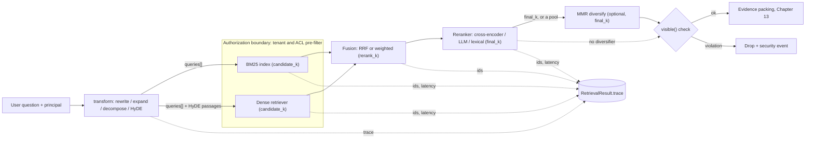
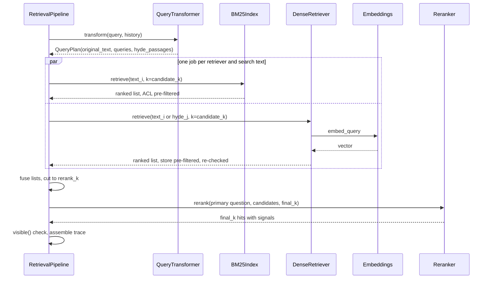
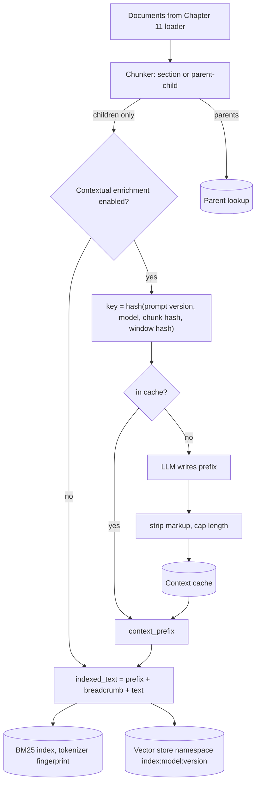

# Chapter 12 — Retrieval Engineering

Retrieval decides most of a RAG system's quality. This chapter treats it as a measured funnel rather than a single similarity search: cheap retrievers for recall, fusion, an expensive reranker for precision, and optional stages that each have to earn their place on the gold set.

**You will be able to:**
- Explain BM25 term by term and build an identifier-aware lexical index that enforces authorization before scoring.
- Combine lexical and dense retrieval with Reciprocal Rank Fusion or weighted fusion, and say when each is right.
- Choose a reranker (lexical baseline, cross-encoder, hosted API, LLM grader) and an optional MMR diversity stage from measured gains per slice.
- Apply query transformations (rewriting, multi-query, decomposition, HyDE) and index-side techniques (contextual and parent-document retrieval) without losing the user's question.
- Size `candidate_k`, `rerank_k`, and `final_k` and split a p95 latency budget across stages with deadlines and degraded paths.
- Diagnose a retrieval failure to the stage that lost the evidence, from per-stage traces.

**Prerequisites:** Chapters 9 (vector stores, filtered search, `semsearch`), 10 (the gold set, the failure catalog, and the retrieval metrics), and 11 (chunks with breadcrumbs and ACL fields). | **Code:** `book/projects/ragkit/ragkit/retrieval/` (run: `cd book/projects/ragkit && pytest -q tests/test_retrieval_*.py`) | **Builds:** the `ragkit.retrieval` package that Chapters 13 to 15 and Project 3 use, and the `compare_retrievers.py` evaluation script.

**First reading:** Why this matters, Mental model, Core concepts (Dense retrieval, Lexical retrieval and BM25, Metadata filters and authorization, Fusion, Reranking, Candidate funnel sizing, Latency budgeting), How it works, Implementation (Fusion, The pipeline, Scoring the gold set), Evaluation and testing, Before you ship. **Deep dives** (skip on a first pass): Learned sparse retrieval, Diversity, Query transformation, Contextual retrieval, Parent-document retrieval, and the remaining Implementation subsections.

## Why this matters

Three of Chapter 10's cataloged failures belong to retrieval. A distractor outranked the evidence: "What is the return window for my old laptop?" pulled the Retail Returns API reference above the IT laptop runbook. A stale FAQ outranked the current policy. And a permission leak happened because nothing filtered by the caller's groups. Chapter 11 fixed what it could at ingestion; what remains is the search itself.

A Northwind support engineer types "INC-2025-1142 root cause". A dense embedding model represents that string as a blur of "incident" and "something about 2025", and may prefer the POS overview, which mentions the incident in passing, over the incident report. A lexical index matches the token exactly. An employee asks "can I work from another country for a month?", and the remote-work policy's "work from abroad" allowance shares almost none of those words. Dense retrieval bridges that; BM25 does not. Real query logs mix both kinds, so a system using one family of retrieval silently fails a predictable slice of users.

The second reason is economics. Stages that read query and document together (a reranker, the generator) are expensive per candidate; stages that score documents independently (an inverted index, a vector index) are cheap but shallow. Production retrieval arranges them into a funnel: broad and cheap first, narrow and expensive last. Size it wrong and you either miss evidence or spend the latency budget reranking two hundred chunks to choose eight.

The third reason is safety. A forbidden chunk that is scored, logged, or shown to a reranker has already been exposed. Chapter 15 owns authorization in retrieval; this chapter shows where each retriever enforces it.

## Mental model

> **Mental model:** Retrieval is a funnel with a recall stage and a precision stage. A relevant chunk missing from the candidates cannot be recovered later; a relevant chunk present but ranked low can.

Hold two pictures at once. The first is the funnel. First-stage retrievers (BM25, dense) return perhaps 30 to 100 candidates from the authorized corpus; their only job is recall. Fusion merges their lists. A reranker reads the question with each candidate and orders a shortlist of perhaps 20 to 50; its job is precision at the top. Measuring recall before reranking and precision after it tells you which stage to fix.

The second picture is that **each retrieval signal fails differently**. Lexical retrieval fails on vocabulary mismatch and succeeds on exact tokens. Dense retrieval fails on rare identifiers, numbers, and negation, and succeeds on paraphrase. Rerankers fail when the candidates lack the evidence, and succeed at telling "about the topic" from "answers the question". Combining signals helps exactly when their failures are uncorrelated, which is why hybrid retrieval is a strong default and stacking three dense variants is not.

## Core concepts

> **Default recipe.** If you have no evaluation data yet, start here and change one piece at a time against the gold set:
>
> - **First stage:** BM25 with an identifier-aware tokenizer and a dense retriever, run in parallel, each returning `candidate_k = 50` under the caller's authorization pre-filter.
> - **Fusion:** Reciprocal Rank Fusion (RRF, which merges lists by summing a small score per rank position and ignores raw scores) with k = 60, cut to `rerank_k = 20`.
> - **Rerank:** a cross-encoder (a model that reads query and chunk together and outputs one relevance score) over those 20, returning `final_k = 8`; a lexical-overlap reranker as the fallback and as the baseline every reranker must beat.
> - **Off the hot path:** no HyDE, no LLM reranking, no MMR, no multi-query expansion. Each is a per-slice tool you enable when a slice of the gold set shows the failure it fixes.
> - **Always:** a deadline per stage with a degraded path, and per-stage candidate ids in the trace.
>
> The sections below explain each choice and when to deviate from it.

### Dense retrieval as one stage among several

Chapters 8 and 9 covered embeddings and vector search. Here a dense retriever maps (query text, principal, filters, k) to chunks ranked by cosine score, with three properties that matter.

First, the representation is learned: it captures paraphrase and is lossy on rare tokens such as product codes, ticket numbers, and error codes. A model may embed "SH-201" and "SH-210" almost identically, and the search still returns k confident-looking results.

Second, the vector space is tied to an embedding model and to the exact text embedded (Chapter 8's space fingerprint, Chapter 9's index versions). Here that text is Chapter 11's breadcrumb plus an optional contextual prefix, so changing either means re-embedding into a new index version.

Third, cosine scores are relative: 0.42 is the best match in one corpus and noise in another, so dense scores cannot be thresholded without calibration or added to BM25 scores.

`DenseRetriever` adapts ragkit chunks to Project 2's `VectorStore`: `NumpyVectorStore` in tests, `PgVectorStore` in Project 3.

### Lexical retrieval and BM25

Lexical retrieval scores a chunk by the query terms it contains, using an inverted index: for every term, a posting list of the chunks containing it and how often. A query touches only its own terms' lists, so search over millions of documents takes milliseconds. The standard scoring function is Okapi BM25:

```text
score(q, d) = Σ over query terms t:  idf(t) · tf(t,d) · (k1 + 1) / ( tf(t,d) + k1 · (1 − b + b · |d| / avgdl) )
idf(t)      = ln( 1 + (N − n_t + 0.5) / (n_t + 0.5) )
```

Each piece encodes one intuition about relevance.

**Inverse document frequency.** `N` is the number of chunks and `n_t` the number containing term t. A term in every chunk ("policy") carries little information; a term in a handful ("Patroni", "inc-2025-1142") carries a lot. In the Northwind index of 231 section chunks, "policy" appears in 78 chunks (idf about 1.08), "inc-2025-1142" in 12 (2.92), and "old" in 10 (3.10). The `1 +` inside the logarithm keeps idf positive even for terms in more than half the chunks; the original Robertson-Sparck Jones form can go negative, penalizing documents for containing common query words.

**Term-frequency saturation.** The fraction `tf·(k1+1) / (tf + k1·...)` grows with term frequency but flattens. With `k1 = 1.2`, the second occurrence adds much less than the first, and the tenth almost nothing, unlike raw TF-IDF, where a chunk repeating "VPN" thirty times wins. `k1 = 0` reduces BM25 to a binary "contains the term" model weighted by idf.

**Length normalization.** `|d|` is the chunk's length in tokens and `avgdl` the average. With `b = 0.75`, a chunk twice the average length needs proportionally more occurrences for the same score, because long chunks match more terms by chance. `b = 0` turns normalization off; `b = 1` normalizes fully. Chapter 11's section-aware chunks vary in length, which makes `b` matter.

The defaults `k1 = 1.2` and `b = 0.75` are starting points. Tune them on the gold set, and only after the tokenizer is right, because tokenization moves results far more than either parameter.

**Tokenization decides what can match.** A naive tokenizer turns "INC-2025-1142" into "inc", "2025", "1142", and the query then matches any chunk mentioning 2025. `BM25Tokenizer` emits compound identifiers whole and also as parts, so the exact identifier is one rare, high-idf term while "ticket 1142" still matches. It lowercases, drops a short stopword list, and folds simple plurals ("policies" to "policy"). It does not stem aggressively: a Porter stemmer maps "general" and "generic" to one stem, which costs precision in policy text. The tokenizer's configuration is part of the index identity: the saved index records a fingerprint, and loading it with a different tokenizer is an error.

Here is the scoring at work on the Chapter 10 distractor, for a retail employee:

| Chunk | Length | Matched terms and contributions | BM25 |
|---|---|---|---|
| Laptop runbook, "Returning the old device" | 61 | old 4.75, laptop 3.24, return 3.17 | 11.16 |
| Returns API, `POST /v2/returns/validate` | 50 | return 3.55, window 2.88 | 6.43 |
| Returns API, "Return eligibility rules" | 70 | return 3.52, window 2.49 | 6.01 |

BM25 gets this one right, because "old" and "laptop" are rare and both appear in the runbook's section. The naive dense setup put the Returns API first in Chapter 10, because dense similarity rewards the shared topic words "return" and "window". When a ranking looks wrong, the per-term contributions (`BM25Index.explain`) tell you whether the problem is a missing term (chunking or tokenization), a dominant common term (idf), or a length effect (`b`).

> **Sidebar: lexical retrieval in PostgreSQL.** In production a database or search engine usually does lexical search; Chapter 9 fused a `tsvector` column with pgvector results in one SQL statement. Two cautions. First, `ts_rank` and `ts_rank_cd` are not BM25: without corpus-level idf, a rare identifier and a common word count the same. That matters little for RRF, which uses only order, and a lot for weighted fusion. Second, the `english` configuration stems and splits identifiers, so add a `simple` vector over extracted identifiers. `ragkit/retrieval/sql/lexical_tsvector.sql` on disk shows both vectors, with authorization predicates in the same `WHERE` clause.

### Learned sparse retrieval

> **Deep dive.** A third retriever family that sits between BM25 and dense; skip on a first reading.

A learned sparse model (SPLADE is the best-known example) runs a transformer over the text and outputs a weight for each vocabulary term, including related terms absent from the text: "laptop return" might also get weight on "device" and "handover". The output is still a sparse term-weight vector, so it lives in an ordinary inverted index and is scored by a dot product. It buys some paraphrase tolerance while keeping posting lists and exact-term matching.

The costs: a model pass per chunk and usually per query; longer posting lists, so a larger, slower index; and identifiers the model's tokenizer fragments can fare worse than with an identifier-aware BM25 tokenizer. Try it in place of BM25 when the paraphrase slice lags, check the `exact-id` slice first, and feed it to RRF as one more ranked list.

### Metadata filters and authorization

Filters restrict retrieval by authorization (tenant and group membership) and by business constraints such as tags or freshness. Chapter 9 explained filtered vector search, and Chapter 15 owns the authorization rules. Here is how the retrieval package applies them.

**Authorization is a pre-filter in every retriever, then a check on the way out.** `BM25Index.search` computes the chunk ids the principal may read before scoring anything. `DenseRetriever` turns the principal into a store filter applied before ranking, then re-checks `visible()` on each result, dropping and counting failures (`acl_dropped`). `RetrievalPipeline` checks again before returning. Lookups by id (`BM25Index.get_chunks(ids, principal)`, for resolving citations) take the principal too and omit forbidden chunks exactly like unknown ones.

**Filters fail loudly.** An unknown filter key (`"tag_any"` instead of `"tags_any"`) raises `UnknownFilterError`, because ignoring it would silently widen the results. The supported keys are document-level properties copied onto chunks at ingestion: `tags_any`, `doc_ids`, `exclude_doc_ids`, `updated_after`, `source_types`. A chunk without an `updated_at` fails an `updated_after` filter: missing metadata fails closed.

**Global statistics can leak, slightly.** BM25's idf covers documents the user cannot see, so a restricted rare term shifts scores a little. For most assistants this is negligible; per-tenant indexes (Chapter 15) remove it.

Business filters are also a precision tool: "only current policies" removes Chapter 10's stale-FAQ failure when the intent is known. The risk is over-filtering away the only document with the answer, so alert when filters often leave zero candidates.

### Fusion: combining ranked lists

Raw scores cannot simply be added: Northwind's BM25 scores range from about 0 to 35, cosine similarities from 0 to 0.7, and the ranges shift per query. Two fusion methods dominate.

**Reciprocal Rank Fusion** ignores scores and uses positions, which are comparable across lists when scores are not. A chunk that two independent retrievers both rank well is better evidence than one ranked first by only one of them:

```text
RRF(d) = Σ over lists i:  w_i / (k + rank_i(d))         (a list that does not contain d contributes 0)
```

Take two lists: BM25 returns [x, y, z] and dense returns [y, w]. With k = 60, y scores 1/62 + 1/61 ≈ 0.0325, x scores 1/61 ≈ 0.0164, w scores 1/62 ≈ 0.0161, z scores 1/63 ≈ 0.0159. The fused order is y, x, w, z: the chunk both retrievers found wins, though BM25 ranked it only second. The constant k controls how much the top of each list dominates. With k = 0, rank 1 scores 1.0 and rank 2 scores 0.5, so one retriever's top hit can override agreement. With k = 60, rank 1 and rank 10 differ by about 13 percent, so appearing in both lists matters far more than position within one. Needing no calibration, RRF is the right default without labeled data. Its weakness is that it discards score gaps: a BM25 hit scoring 22 with the rest below 5 is strong evidence of an exact match, and RRF treats it like a narrow win.

**Weighted score fusion** keeps the gaps. Normalize each list's scores to [0, 1] with min-max scaling, then take a weighted sum. With BM25 scores [12, 7, 1] normalized to [1, 0.55, 0] and dense scores [0.91, 0.42] normalized to [1, 0], equal weights give y = 0.55 + 1 = 1.55, x = 1.0, and w = z = 0. Tuned on judged queries it can beat RRF, with two traps. Min-max is relative to the list, so the best dense hit always gets 1.0, even for a query dense retrieval cannot handle (an error code). And weights tuned on one query mix go stale when the mix changes. Use it when you have a few hundred judged queries and re-tune on every model or chunking change; otherwise use RRF.

Both keep every input list's rank and score in `ScoredChunk.signals` (`bm25_rank`, `dense_score`), so "which retriever put this here?" needs no rerun. Learned fusion, a small model over scores and ranks, is the next step with judgment data at scale.

### Reranking

A reranker reorders a short candidate list by reading query and candidate together, which first-stage retrievers cannot do. It can notice that the Returns API chunk is about customer purchases and the question is about an employee's laptop.

**Cross-encoders** are transformer models that take the concatenated pair (query, passage) and output a relevance score. Attention across both texts captures negation, which entity a number belongs to, and answering versus merely mentioning. The cost is a forward pass per pair: tens of pairs in tens of milliseconds on a GPU, several hundred milliseconds on a CPU (illustrative; measure on your hardware). Hence 20 to 100 candidates, never the corpus. Trained mostly on web data, they may need domain evaluation or fine-tuning (Chapter 33). If the model cannot load, `CrossEncoderReranker` logs a warning and delegates to a fallback reranker, marked by a `cross_encoder_fallback` signal on every hit.

**LLM rerankers** prompt a general model to grade relevance. `LLMReranker` sends batches of eight candidates and asks for a schema-validated grade from 0 (unrelated) to 3 (contains the answer). Grades are coarse but interpretable, and an LLM can follow instructions ("prefer current policies over FAQs"). Pointwise grades in small batches are safer than listwise prompting, which is sensitive to presentation order. The costs are latency (hundreds of milliseconds to seconds per batch), money, and attack surface: the reranker reads untrusted text, including the vendor newsletter's injection paragraph. The prompt fences passages in `<untrusted_data>` tags, and the schema limits an injection's damage to a grade between 0 and 3. When the provider fails, the reranker keeps the incoming order with a `rerank_failed` signal.

**Lexical overlap** is the baseline: the fraction of query terms in the chunk, plus a bonus for terms in the title and breadcrumb. It costs microseconds and fixes the laptop distractor in the naive setup. Every other reranker must beat it on the gold set to justify its latency.

**Hosted rerank and embedding APIs** are cross-encoder-class models you do not have to serve. In exchange, chunk text goes to a third party (check data-processing terms per tenant), the provider's tail latency lands in your budget, cost scales with candidates times queries, and the model can change under you, so pin a version. A hosted reranker plugs into `CrossEncoderReranker` as its scoring function. Self-host when volume is high, data cannot leave, or latency must be predictable; use a hosted one when the team is small and volume moderate.

**Late interaction** (ColBERT-style) sits between single-vector retrieval and a cross-encoder. It stores one vector per token and scores with MaxSim: each query token takes its best-matching document token's similarity, and those maxima are summed. It is not implemented here; Chapter 37 covers it.

Two cautions apply to all rerankers. Their scores are not probabilities and are not comparable across models, so a cut-off must be calibrated on judged queries (Chapter 14). And a reranker can only reorder what it is given: if candidate recall is 70 percent, a perfect reranker yields at most 70 percent. Measure candidate recall before buying a better reranker.

> **What a real cross-encoder changes.** Offline, the only reranker this chapter runs is the lexical baseline, and it loses on the toy corpus (see Evaluation and testing). A trained cross-encoder typically helps where that baseline fails: paraphrases, negation, and passages that mention the topic without answering it. Expect gains in hit@1 and MRR, never in candidate recall. To verify on your data, set `RAGKIT_RETRIEVAL_CROSS_ENCODER_MODEL`, rerun the comparison script, and compare per slice against unreranked hybrid and the lexical baseline, with p95 rerank latency. Keep it only if it wins where you care without losing elsewhere.

### Diversity: maximal marginal relevance

> **Deep dive.** An optional stage that stops near-copies filling the top slots; skip on a first reading.

A reranker scores each candidate on its own, so it cannot see that its top four say the same thing. A two-facet question ("how many PTO days carry over, and by when must I use them?") can get four slots of carryover, restated by the PTO policy, the HR FAQ, and overlapping chunks, and none of the expiry deadline.

Maximal marginal relevance (MMR) picks hits one at a time. Each remaining candidate scores

```text
MMR(d) = λ · relevance(d) − (1 − λ) · max over already-picked p: similarity(d, p)
```

and the best one is taken. λ = 1 keeps the reranker's order; lower values push harder against near-copies. A three-line example, after the policy's carryover chunk A is picked first:

- Near-copy B (an FAQ restating carryover): relevance 0.95, similarity to A 0.9. Deadline chunk C: relevance 0.7, similarity to A 0.1.
- At λ = 0.9: B scores 0.9 × 0.95 − 0.1 × 0.9 = 0.765, C scores 0.9 × 0.7 − 0.1 × 0.1 = 0.62, so the near-copy B wins.
- At λ = 0.5: B scores 0.475 − 0.45 = 0.025, C scores 0.35 − 0.05 = 0.30, so the deadline chunk C wins.

Relevance is the reranker's score rescaled to [0, 1] over the pool. Similarity is token-set Jaccard by default, which needs no model call; passing an `EmbeddingClient` switches to cosine, which also catches paraphrases. Where the flip happens depends on the scores, so tune λ on the gold set, starting around 0.7 (illustrative).

MMR helps on multi-facet questions, on corpora with many near-copies, and when `final_k` is small. It hurts on single-fact lookups, where a second copy of the right answer beats an unrelated chunk, and when the pool holds weak candidates, because an unrelated chunk is maximally "diverse". Hence two guards: a `min_relevance` floor, and a small, already-reranked pool (`diversify_pool_k`, by default twice `final_k`, capped at `rerank_k`).

Run it after the reranker, never before, or the reranker undoes its choices, and re-tune λ when the reranker changes. On Northwind's corpus, with little duplication, the effect is one swap of two equally plausible sections, so MMR ships off and is enabled per slice where `multi-hop` metrics gain.

### Query transformation

> **Deep dive.** Rewriting, expansion, decomposition, and HyDE for queries that search poorly as typed; skip on a first reading.

What users type is often a poor search query. Four transformations address different gaps, all under one rule: the `QueryPlan` they return always carries `original_text`, the pipeline traces every search text it issued, and on any model failure or implausible output the transformer falls back to the original.

**Conversation-aware rewriting.** A follow-up such as "and by when do I have to use them?" matches nothing useful when searched literally. `QueryRewriter` asks a model, given the last few turns, for one standalone query that resolves references, keeps identifiers and numbers exactly, and does not change scope. The output is checked for plausibility, because a drifting rewrite ("PTO carryover" becoming "vacation policy overview") retrieves the wrong thing confidently. The rewrite becomes the plan's `primary`, which rerankers judge against. Skip its model call for first turns and already-standalone queries.

**Multi-query expansion.** `MultiQueryExpander` asks for paraphrases in a document author's vocabulary ("unused vacation days roll into next year"); every variant is searched and all lists are fused with RRF. Recall rises on vocabulary mismatch, at the cost of a model call and more distractors. The original query is always the first variant.

**Decomposition.** "What is the format of a Trackline tracking ID and how many requests per minute can I make?" asks two things that live in different sections, and one embedding of the whole question lands between them. `QueryDecomposer` splits it into self-contained sub-questions, searched separately, with the original kept for reranking. It helps multi-part questions and adds noise to simple ones, so the decomposer returns single-intent questions unchanged.

**HyDE (Hypothetical Document Embeddings).** A short question and the long paragraph that answers it can sit far apart in embedding space. HyDE has a model write a passage that would answer the question, in the corpus's style, and embeds that instead. `HyDEGenerator` asks for placeholders instead of invented numbers, and the pipeline routes HyDE passages to dense retrievers only, so BM25 never searches for terms a model made up.

HyDE helps underspecified or jargon-poor questions. It hurts when the model's prior is wrong: a model that "knows" a typical carryover rule of five days pulls retrieval toward the stale FAQ that says five. It hurts identifier queries, diluting the one token that mattered, and it adds a generation call before retrieval starts.

Agentic retrieval, where a model iteratively decides what to search next, belongs to Chapter 37.

### Contextual retrieval

> **Deep dive.** An ingestion-time prefix that situates terse chunks, and its cache; skip on a first reading.

The next two techniques change what is indexed and what is returned. Chapter 11's breadcrumb puts the document title and section path in front of every chunk. Contextual retrieval goes further: at ingestion, a model reads the chunk and its neighborhood and writes one or two situating sentences ("From the NorthGate VPN runbook: the fix for error 412, an expired device certificate"). The sentence is prepended for lexical and dense indexing, never shown to the generator as evidence.

It helps on terse sections that do not name their subject ("Click Renew certificate; if that fails, run Repair"), less where the breadcrumb already carries the context, and costs one model call per chunk at ingestion.

The cache key hashes everything that determines the output: prompt version, model, the chunk's content hash, and the document title plus the window the model saw. The window is the chunk's neighborhood, so a distant edit does not invalidate it. Failures are not cached. Because the prefix is model output derived from untrusted text, it is stripped of markup and capped before indexing.

A new prefix does not change the chunk id (Chapter 11 derives it from content), so an indexer comparing ids would skip re-embedding; `ContextualEnricher` records a `context_key` that Chapter 15's indexing worker compares instead.

### Parent-document retrieval

> **Deep dive.** Index small chunks, return their sections; skip on a first reading.

Small chunks match precisely; large chunks give the generator context. Parent-document retrieval indexes small children and returns their parents. Chapter 11's `ParentChildChunker` cuts sections (parents, up to 800 tokens) into sentence packs (children, about 128 tokens). `ParentDocumentRetriever` wraps any child-level retriever, asks it for `fanout × k` children (`fanout` is 3 by default, because several children of one section collapse into one parent), and keeps the best child's score and rank.

It helps when answers need nearby qualifiers (an exception two lines later, a table header). It hurts the token budget: eight parents of 800 tokens are 6,400 tokens for the packer (Chapter 13) to trim. A middle ground returns the matched child plus its neighbors.

### Candidate funnel sizing

The three k values are linked. `candidate_k` is the number each first-stage retriever returns per search text, `rerank_k` the number of fused candidates the reranker sees, and `final_k` the number passed to the generator.

Start from the end. `final_k` is set by the evidence budget: five to ten chunks for most question answering. `rerank_k` is set by reranker latency, which grows linearly with candidates: pick the largest value the budget allows and check that candidate recall at that depth is near its ceiling. `candidate_k` is set by first-stage recall: plot recall@k for the fused list and choose the knee, typically between 30 and 100. For approximate indexes a larger `candidate_k` costs more; in pgvector without iterative scans, `ef_search` must be at least `candidate_k` (Chapter 9).

The diagnostic that ties this together is the stage recall table. For each gold question, record whether a required document is in each retriever's list, the fused top `rerank_k`, and the final `final_k`. Missing from every first-stage list: fix chunking, tokenization, or the embedding model. In a first-stage list but not the fused top `rerank_k`: raise `rerank_k` or adjust fusion. In the reranker's input but not its output: the reranker is the problem. `RetrievalPipeline` records every stage's candidate ids so this table is a query over traces; the comparison script reports `cand_recall` (recall of the reranker's input) next to final recall, and Chapter 14 generalizes it into a stage-isolation report.

On the Northwind corpus, where each user sees 109 to 198 of 231 chunks, candidate recall is 1.0 at every size tried. On a million chunks, recall at 30 and at 200 can differ by tens of points.

### Latency budgeting across stages

Northwind's target is a p95 time to first token under 2 seconds, and generation needs most of it. An illustrative allocation leaves retrieval about 400 ms:

| Stage | Illustrative p95 budget | What drives it |
|---|---|---|
| Query rewrite (conversational turns only) | 150 ms | one small model call; skip when standalone |
| BM25 and dense, in parallel | 60 ms | the slower of the two, not the sum; dense includes embedding the query |
| Fusion | under 1 ms | in-process arithmetic |
| Rerank 20 candidates (cross-encoder, GPU) | 120 ms | per-candidate forward passes; batching |
| ACL check, assembly, tracing | 10 ms | |
| Total retrieval | about 340 ms, 60 ms headroom | |

Three rules follow. Run independent stages concurrently, so the retrieve stage costs the slowest job, not the sum. Put a deadline on every stage and degrade instead of failing: a late dense retriever leaves BM25 results; a late reranker leaves the fused order (`retrieve_timeout_s` and `rerank_timeout_s`, here 80 ms and 150 ms, illustrative). And budget at p95 or p99, not the mean, because the slowest parallel call sets the stage latency. An LLM reranker or HyDE, each a call that can take a second or more, does not fit this budget. Chapter 29 covers deadlines and Chapter 30 whole-request latency budgets.

## How it works

A request passes through the pipeline in five steps, plus an optional sixth, each recorded in the trace.

1. **Transform.** The transformer (identity by default) turns the `RetrievalQuery` into a `QueryPlan`: one or more search texts, optional HyDE passages, and the untouched `original_text`.
2. **Retrieve.** The pipeline builds one job per (retriever, search text) pair, plus (dense retriever, HyDE passage) jobs, and runs them concurrently, each asking for `candidate_k` hits under the caller's principal and filters. A job that raises is recorded and skipped; if every job fails, the request fails with `RetrievalError`.
3. **Fuse.** All successful lists, named like `bm25#q0`, `dense#q1`, `dense#hyde0`, are merged with RRF (or weighted fusion, with weights per retriever) and cut to `rerank_k`.
4. **Rerank.** The reranker judges the fused shortlist against the plan's `primary` (the standalone question), keeping `original_text` alongside, and returns `final_k` hits. A reranker exception leaves the fused order and is recorded as degradation.
5. **Diversify (optional).** The reranker returns a pool of `diversify_pool_k` hits and MMR picks `final_k` of them; an exception keeps the relevance order.
6. **Check and return.** Every hit is checked with `visible(chunk, principal)` once more. A violation is removed and listed under `acl_violations`, which should always be empty.

Offline, Chapter 11's chunks get an optional contextual prefix and are written to both indexes, each document replaced atomically by version.

## Architecture

The first diagram shows the online funnel, with the authorization boundary that every first-stage retriever enforces before scoring.



The second diagram shows timing: first-stage jobs overlap, while transformation and reranking are sequential.



The third diagram shows ingestion and the contextual cache, which calls the model only for chunks whose neighborhood changed.



## Implementation

The retrieval package sits inside ragkit, so Chapters 13 to 15 import one library; `types.py` is the contract every stage speaks.

```text
book/projects/ragkit/
  ragkit/retrieval/
    types.py        # FIXED CONTRACT: Principal, RetrievalQuery, ScoredChunk, RetrievalResult, Retriever, Reranker, visible
    common.py       # filters (fail loudly), indexed_text, rerank_list, Stopwatch
    settings.py     # RetrievalSettings (RAGKIT_RETRIEVAL_*)
    bm25.py         # BM25Tokenizer, BM25Index
    dense.py        # DenseRetriever over a semsearch VectorStore
    hybrid.py       # reciprocal_rank_fusion, weighted_score_fusion, min_max, HybridRetriever
    rerank.py       # LexicalOverlapReranker, CrossEncoderReranker, LLMReranker
    diversity.py    # MMRDiversifier, mmr_order, normalized_relevance (optional stage after rerank)
    mmr.py          # mmr_select: embedding-space MMR over ScoredChunk (Chapter 8's formula)
    query.py        # QueryPlan, QueryRewriter, MultiQueryExpander, QueryDecomposer, HyDEGenerator, ChainedTransformer
    parent.py       # ParentDocumentRetriever, parent_child_index
    contextual.py   # ContextualEnricher, JsonFileCache
    pipeline.py     # RetrievalPipeline, RetrievalError, stage_candidates
    sql/lexical_tsvector.sql
  ragkit/eval/compare_retrievers.py
  tests/retrieval_fixtures.py, tests/test_retrieval_*.py
```

Install and run, from `book/projects/ragkit`:

```bash
uv pip install -e ../aie_core -e ../p2-semantic-search -e .   # or the same with pip
pytest -q tests/test_retrieval_*.py
python -m ragkit.eval.compare_retrievers --by-tag
# optional local cross-encoder: pip install -e '.[rerank]' and set RAGKIT_RETRIEVAL_CROSS_ENCODER_MODEL
```

| Variable | Default | Meaning |
|---|---|---|
| `RAGKIT_RETRIEVAL_CANDIDATE_K` | `50` | hits per first-stage retriever per search text |
| `RAGKIT_RETRIEVAL_RERANK_K` | `20` | fused candidates handed to the reranker |
| `RAGKIT_RETRIEVAL_FINAL_K` | `8` | hits returned to the generator |
| `RAGKIT_RETRIEVAL_FUSION` | `rrf` | `rrf` or `weighted` |
| `RAGKIT_RETRIEVAL_RRF_K` | `60` | RRF damping constant |
| `RAGKIT_RETRIEVAL_BM25_K1`, `RAGKIT_RETRIEVAL_BM25_B` | `1.2`, `0.75` | BM25 saturation and length normalization |
| `RAGKIT_RETRIEVAL_CROSS_ENCODER_MODEL` | unset | local cross-encoder; unset means lexical fallback |
| `RAGKIT_RETRIEVAL_RERANK_BATCH_SIZE` | `8` | candidates per LLM reranking call |
| `RAGKIT_RETRIEVAL_DIVERSITY` | `none` | `mmr` adds MMR after the reranker |
| `RAGKIT_RETRIEVAL_MMR_LAMBDA` | `0.7` | relevance weight; 1.0 keeps the reranker's order |
| `RAGKIT_RETRIEVAL_DIVERSIFY_POOL_K` | unset | MMR's pool; unset means `min(2 * final_k, rerank_k)` |
| `RAGKIT_RETRIEVAL_PARALLEL` | `true` | run first-stage jobs concurrently |
| `RAGKIT_RETRIEVAL_RETRIEVE_TIMEOUT_S` | unset | first-stage deadline; late jobs marked `timed_out` |
| `RAGKIT_RETRIEVAL_RERANK_TIMEOUT_S` | unset | reranker deadline; on expiry the fused order is kept |
| `LLM_PROVIDER`, `LLM_MODEL`, `EMBEDDING_PROVIDER`, `EMBEDDING_MODEL` | `fake` | `aie_core` models for every model-backed stage |

### BM25 from scratch

> **Deep dive.** The index code behind the formula; skip on a first reading.

The excerpt shows the tokenizer, the scoring, and search. Read `allowed_ids` and the inner loop of `search` together: authorization happens before scoring, and the posting loop skips anything outside the allowed set.

```python
# path: book/projects/ragkit/ragkit/retrieval/bm25.py (excerpt; full file on disk)
class BM25Tokenizer:
    """Lowercase word tokens; compound identifiers emitted whole and split; optional plural folding."""
    # ...
    def tokenize(self, text: str) -> list[str]:
        out: list[str] = []
        for match in _TOKEN_RE.finditer(text.lower()):
            tok = match.group(0)
            if _PART_RE.search(tok):
                out.append(tok)  # the whole identifier: "inc-2025-1142"
                parts = [p for p in _PART_RE.split(tok) if p]
                out.extend(self._norm(p) for p in parts if p not in self.stopwords and len(p) >= self.min_len)
            elif tok not in self.stopwords and len(tok) >= self.min_len:
                out.append(self._norm(tok))
        return out

# ...
    def idf(self, term: str) -> float:
        n_t = len(self._postings.get(term, {}))
        n = len(self._chunks)
        return math.log(1.0 + (n - n_t + 0.5) / (n_t + 0.5))

    def _term_score(self, term: str, chunk_id: str, tf: int) -> float:
        dl = self._length[chunk_id]
        avgdl = self.avgdl or 1.0
        denom = tf + self.k1 * (1.0 - self.b + self.b * dl / avgdl)
        return self.idf(term) * tf * (self.k1 + 1.0) / denom

    def allowed_ids(self, principal: Principal, filters: dict | None = None) -> set[str]:
        """Chunk ids this principal may see under these filters. Computed before any scoring."""
        filters = filters or {}
        validate_filters(filters)
        return {cid for cid, c in self._chunks.items() if visible(c, principal) and matches_filters(c, filters)}

    def search(self, text: str, principal: Principal, k: int = 10, filters: dict | None = None) -> list[ScoredChunk]:
        if k <= 0 or not self._chunks:
            return []
        allowed = self.allowed_ids(principal, filters)
        if not allowed:
            return []
        query_terms = Counter(self.tokenizer.tokenize(text))
        scores: dict[str, float] = {}
        matched: Counter[str] = Counter()
        for term, qtf in query_terms.items():
            for cid, tf in self._postings.get(term, {}).items():
                if cid not in allowed:  # authorization first: forbidden chunks are never scored
                    continue
                scores[cid] = scores.get(cid, 0.0) + qtf * self._term_score(term, cid, tf)
                matched[cid] += 1
        ranked = sorted(scores.items(), key=lambda kv: (-kv[1], kv[0]))[:k]
        # ... wrap each (cid, score) in a ScoredChunk with signals "bm25" and "bm25_matched_terms"
```

`allowed_ids` scans every chunk, which is fine for a teaching index; a real engine uses a filter bitmap or posting-list intersection.

### Dense retrieval over the Project 2 store

> **Deep dive.** How the dense retriever pre-filters in the store and re-checks; skip on a first reading.

`_search` turns the principal and filters into a store filter, searches, and re-checks every result. Writes (on disk) use the store's `replace_document`, so a reader never sees two versions of one document.

```python
# path: book/projects/ragkit/ragkit/retrieval/dense.py (excerpt; full file on disk)
def _search(self, text: str, principal: Principal, k: int, filters: dict | None) -> tuple[list[ScoredChunk], int]:
    """Returns (hits, dropped) where dropped counts results that failed the final ACL check."""
    if k <= 0:
        return [], 0
    flt = self._store_filter(principal, filters or {})
    if flt.doc_ids is not None and not flt.doc_ids:
        return [], 0
    vector = self.embeddings.embed_query(text)
    raw = self.store.search(self.namespace, vector, k, flt)
    hits: list[ScoredChunk] = []
    dropped = 0
    for h in raw:
        chunk = Chunk.model_validate(h.metadata["chunk"])
        if not visible(chunk, principal):  # defense in depth: never trust one layer with ACLs
            dropped += 1
            continue
        if self.min_score is not None and h.score < self.min_score:
            continue
        hits.append(
            ScoredChunk(chunk=chunk, score=h.score, stage=self.name, rank=len(hits) + 1,
                        signals={"dense": round(h.score, 6)})
        )
    return hits, dropped
```

### Fusion

RRF is a few lines of arithmetic; the rest is bookkeeping that keeps every input list's rank and score in `signals`. `weighted_score_fusion` (on disk) has the same shape and maps a list whose scores are all equal to 1.0 rather than dividing by zero.

```python
# path: book/projects/ragkit/ragkit/retrieval/hybrid.py (excerpt; full file on disk)
def reciprocal_rank_fusion(
    rankings: Mapping[str, Ranking],
    *,
    k: int = 60,
    weights: Mapping[str, float] | None = None,
    limit: int | None = None,
) -> list[ScoredChunk]:
    """Fuse ranked lists by sum of w / (k + rank). Ranks are 1-based positions in each list."""
    # ...
    for name, ranking in rankings.items():
        seen: set[str] = set()
        for position, hit in enumerate(ranking, start=1):
            cid = hit.chunk.id
            if cid in seen:  # a list that repeats a chunk counts it once, at its best rank
                continue
            seen.add(cid)
            chunks.setdefault(cid, hit)
            fused[cid] = fused.get(cid, 0.0) + w[name] / (k + position)
            best_rank[cid] = min(best_rank.get(cid, position), position)
            sig = signals.setdefault(cid, {})
            sig.update({k_: v for k_, v in hit.signals.items() if k_ not in sig})
            sig[f"{name}_rank"] = float(position)
            sig[f"{name}_score"] = round(hit.score, 6)
    order = sorted(fused, key=lambda cid: (-fused[cid], best_rank[cid], cid))
    # ...
```

The sort key breaks ties on the best rank in any list and then on chunk id, so the same inputs always produce the same order, which keeps traces and evaluation runs reproducible.

### Rerankers

> **Deep dive.** The LLM reranker as a pattern for any model-in-the-loop stage; skip on a first reading.

The LLM reranker shows the pattern for any model-in-the-loop stage: untrusted input fenced, output validated by schema, a deterministic tiebreak, and degradation on failure. A passage the model skipped is marked `llm_missing`.

```python
# path: book/projects/ragkit/ragkit/retrieval/rerank.py (excerpt; full file on disk)
def build_request(self, question: str, batch: Sequence[ScoredChunk]) -> CompletionRequest:
    blocks = []
    for i, c in enumerate(batch, start=1):
        header = c.chunk.context_header() or c.chunk.doc_id
        body = c.chunk.text[: self.max_chars]
        blocks.append(f'<passage id="{i}" source="{c.chunk.doc_id}" title="{header}">\n'
                      f"<untrusted_data>\n{body}\n</untrusted_data>\n</passage>")
    user = f"Question: {question}\n\n" + "\n\n".join(blocks) + f"\n\nGrade passages 1 to {len(batch)}."
    return CompletionRequest(
        messages=[Message.system(RERANK_SYSTEM), Message.user(user)],
        model=self.model,
        temperature=0.0,
        max_tokens=40 + 16 * len(batch),
        metadata={"purpose": "rerank", "batch_size": len(batch)},
    )

def rerank(self, query: RetrievalQuery, candidates: list[ScoredChunk], k: int) -> list[ScoredChunk]:
    if not candidates:
        return []
    batches = [candidates[i : i + self.batch_size] for i in range(0, len(candidates), self.batch_size)]
    try:
        if self.max_concurrency > 1 and len(batches) > 1:
            with ThreadPoolExecutor(max_workers=min(self.max_concurrency, len(batches))) as pool:
                graded = list(pool.map(lambda b: self._grade(query.text, b), batches))
        else:
            graded = [self._grade(query.text, b) for b in batches]
    except LLMError as exc:
        # Degrade to the incoming order rather than failing the request; the signal makes it visible.
        log.warning("LLMReranker failed (%s); keeping prior order", exc)
        return [c.model_copy(update={"stage": "rerank", "rank": i,
                                     "signals": {**c.signals, "rerank_failed": 1.0}})
                for i, c in enumerate(candidates[:k], start=1)]
    n = len(candidates)
    out: list[ScoredChunk] = []
    for batch, grades in zip(batches, graded):
        for c, g in zip(batch, grades):
            sig = {**c.signals, "prior_rank": float(c.rank)}
            if g is None:
                sig["llm_missing"] = 1.0
            sig["llm_grade"] = g if g is not None else 0.0
            out.append(c.model_copy(update={"score": (g or 0.0) + _prior_bonus(c, n), "signals": sig}))
    return rerank_list(out, "rerank")[:k]
```

`_prior_bonus` is smaller than one grade step, so the incoming order only breaks ties among passages with the same grade.

### Diversity

> **Deep dive.** The greedy MMR loop; skip on a first reading.

`MMRDiversifier` has the `Reranker` shape, so it can run standalone on any ranked list; inside the pipeline it is the `diversifier` argument. The trace records the reranker's pool and MMR's choice as separate `rerank` and `diversify` stages, and each selected hit carries `prior_rank`, `mmr_relevance`, `mmr_redundancy`, and `mmr_score`. `mmr_select` in `mmr.py` is the embedding-space form from Chapter 8. Both share the greedy loop:

```python
# path: book/projects/ragkit/ragkit/retrieval/diversity.py (excerpt; full file on disk)
def mmr_order(relevance: Sequence[float], similarity: np.ndarray, k: int, lambda_: float,
              min_relevance: float = 0.0) -> list[tuple[int, float, float]]:
    """Greedy MMR. Returns (index, mmr score, redundancy) in selection order."""
    pool = [i for i, r in enumerate(relevance) if r >= min_relevance]
    chosen: list[tuple[int, float, float]] = []
    while pool and len(chosen) < k:
        best, best_score, best_red = pool[0], float("-inf"), 0.0
        for i in pool:  # pool order = incoming rank, so ties keep the reranker's order
            red = max((float(similarity[i, j]) for j, _, _ in chosen), default=0.0)
            score = lambda_ * relevance[i] - (1.0 - lambda_) * red
            if score > best_score + 1e-12:
                best, best_score, best_red = i, score, red
        chosen.append((best, best_score, best_red))
        pool.remove(best)
    return chosen
```

### Query transformation

> **Deep dive.** The `QueryPlan` contract and the fallback pattern; skip on a first reading.

`QueryPlan` is the contract: whatever a transformer does, the original survives and `primary` names the text rerankers judge against. The rewriter and HyDE excerpts show the fallback pattern every transformer follows.

```python
# path: book/projects/ragkit/ragkit/retrieval/query.py (excerpt; full file on disk)
class QueryPlan(BaseModel):
    original_text: str
    queries: list[str]  # search texts for every retriever; queries[0] is the primary one
    strategy: str
    hyde_passages: list[str] = Field(default_factory=list)  # embedded by dense retrievers only
    fallback: bool = False  # True when the transformer failed and returned the original
    notes: dict[str, Any] = Field(default_factory=dict)

    @property
    def primary(self) -> str:
        """Self-contained version of the question: what rerankers judge relevance against."""
        return self.queries[0] if self.queries else self.original_text

    def search_queries(self, base: RetrievalQuery, text: str) -> RetrievalQuery:
        return base.model_copy(update={"text": text, "original_text": self.original_text})
```

```python
# path: book/projects/ragkit/ragkit/retrieval/query.py (excerpt; full file on disk)
def transform(self, query: RetrievalQuery, history: Sequence[Message] | None = None) -> QueryPlan:
    original = _original(query)
    turns = list(history or [])[-self.max_history_turns :]
    convo = "\n".join(f"{m.role.value}: {m.text}" for m in turns) or "(no earlier messages)"
    try:
        out = self._ask(f"Conversation so far:\n{convo}\n\nLatest message: {original}", Rewrite)
    except LLMError as exc:
        return self._fallback(query, str(exc))
    assert isinstance(out, Rewrite)
    if not _plausible(out.query, original):
        return self._fallback(query, "implausible rewrite")
    queries = [out.query, original] if self.keep_original else [out.query]
    return QueryPlan(original_text=original, queries=_dedupe(queries), strategy=self.name,
                     notes={"history_turns": len(turns)})
```

```python
# path: book/projects/ragkit/ragkit/retrieval/query.py (excerpt; full file on disk)
class HyDEGenerator(_LLMTransformer):
    # ...
    system = """Write a short passage (2-4 sentences) in the style of an internal policy or runbook
that would answer the question. Use the vocabulary such a document would use. If you do not know
specific values, use placeholders like X rather than inventing numbers. Do not mention the question."""
    # ...
    def transform(self, query: RetrievalQuery, history: Sequence[Message] | None = None) -> QueryPlan:
        original = _original(query)
        passages: list[str] = []
        for _ in range(self.n):
            try:
                out = self._ask(f"Question: {query.text}", Hypothetical)
            except LLMError as exc:
                return self._fallback(query, str(exc))
            assert isinstance(out, Hypothetical)
            if out.passage.strip():
                passages.append(out.passage.strip()[: self.max_passage_chars])
        if not passages:
            return self._fallback(query, "empty hypothetical passage")
        return QueryPlan(original_text=original, queries=[query.text], strategy=self.name,
                         hyde_passages=_dedupe(passages))
```

### Contextual enrichment: the cache key

> **Deep dive.** The window and key described under Contextual retrieval; skip on a first reading.

Every input that determines the prefix goes into the key.

```python
# path: book/projects/ragkit/ragkit/retrieval/contextual.py (excerpt; full file on disk)
def window(self, doc: Document, chunk: Chunk) -> str:
    """The part of the document the model sees: the chunk's neighborhood, not the whole file."""
    half = self.window_chars // 2
    start = max(0, chunk.char_start - half)
    end = min(len(doc.text), chunk.char_end + half)
    return doc.text[start:end]

def key(self, doc: Document, chunk: Chunk) -> str:
    return short_hash(self.prompt_version, self._model_name(), chunk.content_hash,
                      short_hash(doc.title, self.window(doc, chunk)), length=32)
```

### The pipeline

`retrieve` runs the steps from How it works in order. The excerpt keeps the control flow and the degradation rules.

```python
# path: book/projects/ragkit/ragkit/retrieval/pipeline.py (excerpt; full file on disk)
def retrieve(self, query: RetrievalQuery, history: Sequence[Message] | None = None) -> RetrievalResult:
    validate_filters(query.filters)  # a caller bug, so it raises instead of degrading
    final_k = self.final_k or query.k
    # ...
    with Stopwatch() as total, self._span("retrieval.pipeline", final_k=final_k):
        # 1. transform
        with Stopwatch() as sw, self._span("retrieval.transform"):
            plan = self.transformer.transform(query, history)
        # ...
        # 2. first-stage retrieval, all (retriever, text) jobs in parallel, under an optional deadline
        jobs = self._jobs(plan)
        with Stopwatch() as sw:
            records = self._run_jobs(jobs, query, plan)
        latency["retrieve"] = sw.ms  # wall clock of the parallel phase, not the sum
        ok = [r for r in records if "error" not in r]
        degraded.extend(f"retrieve:{r['name']}" for r in records if "error" in r)
        if not ok:
            raise RetrievalError("all retrievers failed: " + "; ".join(r["error"] for r in records))
        # ...
        # 3. fusion
        with Stopwatch() as sw, self._span("retrieval.fusion", lists=len(ok)):
            fused = self._fuse({r["name"]: r["hits"] for r in ok}, limit=self.rerank_k)
        # ...
        # 4. rerank, judged against the self-contained question
        rerank_query = query.model_copy(update={"text": plan.primary, "original_text": plan.original_text})
        pool_k = self._pool_k(final_k)
        hits = fused[:pool_k]
        if self.reranker is not None and fused:
            with Stopwatch() as sw, self._span("retrieval.rerank", candidates=len(fused)):
                try:
                    hits = self._rerank(rerank_query, fused, pool_k)
                except Exception as exc:  # degrade to fused order, including on timeout
                    degraded.append(f"rerank:{type(exc).__name__}")
                    hits = fused[:pool_k]
        # ...
        # 4b. diversify (optional): pick final_k from the pool, trading relevance against redundancy
        # ...
        hits = hits[:final_k]

        # 5. final authorization check: belt and braces; any violation is a security event
        violations = [h.chunk.id for h in hits if not visible(h.chunk, query.principal)]
        hits = [h for h in hits if visible(h.chunk, query.principal)]
    # ...
    return RetrievalResult(query=query, hits=hits, trace=trace)
```

The trace holds the plan, each stage's k, candidate ids, and latency, the `degraded` list, `acl_violations`, and `acl_dropped`.

The deadline lives in `_run_jobs`. A job still running when `wait` returns is recorded as `timed_out` with the same `error` field as a failed retriever, so fusion and Chapter 14's stage isolation treat both alike. Each job runs in `contextvars.copy_context()` because a thread pool does not inherit context variables; without the copy, per-retriever spans would start new traces instead of nesting under the request's.

```python
# path: book/projects/ragkit/ragkit/retrieval/pipeline.py (excerpt; full file on disk)
def _run_jobs(self, jobs: list[tuple[str, str, str]], query: RetrievalQuery,
              plan: QueryPlan) -> list[dict[str, Any]]:
    """Run every first-stage job; under a deadline, unfinished jobs become timed-out records."""
    concurrent = self.parallel and len(jobs) > 1
    if not concurrent and self.retrieve_timeout_s is None:
        return [self._run_job(j, query, plan) for j in jobs]
    own = None if self.executor else ThreadPoolExecutor(
        max_workers=min(self.max_workers, len(jobs)) if concurrent else 1)
    pool = self.executor or own
    assert pool is not None
    try:
        # one copied context per job: the open span (aie_core's contextvar, or Chapter 31's tracer)
        # crosses into the worker thread, so retriever spans stay children of retrieval.pipeline
        futures = [pool.submit(contextvars.copy_context().run, self._run_job, j, query, plan) for j in jobs]
        done, _ = wait(futures, timeout=self.retrieve_timeout_s)
        return [f.result() if f in done else self._timed_out(j, f) for j, f in zip(jobs, futures)]
    finally:
        if own is not None:
            own.shutdown(wait=False, cancel_futures=True)
```

A deadline stops the pipeline from waiting, not the work: Python cannot kill a thread, so a hung call keeps its worker until the client's own timeout fires. Set client timeouts too (an HTTP timeout on embedding, `statement_timeout` in PostgreSQL), and put a circuit breaker in front of the dependency (Chapter 29) so new requests stop feeding the hang.

### Scoring the gold set

The comparison script builds the offline bench (Chapter 11's 300-token section chunks, BM25, and a dense retriever over `FakeEmbeddings` in vocabulary mode), runs each configuration under each gold question's own principal, and scores at document level with Chapter 10's metrics. The inversion for `forbidden-doc` questions is the part worth reading.

```python
# path: book/projects/ragkit/ragkit/eval/compare_retrievers.py (excerpt; full file on disk)
def score_question(q: GoldQuestion, chunk_docs: Sequence[str], ks: Sequence[int],
                   candidate_docs: Sequence[str] | None = None) -> dict[str, float]:
    ranks = doc_ranks(chunk_docs)
    req = q.required_doc_ids
    found_any = [ranks[d] for d in req if d in ranks]
    row: dict[str, float] = {}
    if q.forbidden:  # inverted: the restricted document must not appear at all
        leaked = bool(found_any)
        for k in ks:
            row[f"hit@{k}"] = row[f"recall@{k}"] = 0.0 if leaked else 1.0
        row["mrr"] = 0.0 if leaked else 1.0
        row["leak"] = 1.0 if leaked else 0.0
        if candidate_docs is not None:
            row["cand_recall"] = 0.0 if any(d in set(candidate_docs) for d in req) else 1.0
        return row
    # ... ordinary questions: hit@k, recall@k, MRR, and cand_recall as defined in Chapter 10
```

## Code walkthrough

**The contract keeps stages swappable.** Every retriever returns `ScoredChunk` hits carrying `stage`, `rank`, and `signals`, so wrappers (hybrid, parent-document, pipeline) compose with any retriever, a reranker is one constructor argument, and Chapter 14 evaluates every stage with the same code. Signals accumulate rather than being overwritten, so "why is this first?" is answered from the result itself.

**The tests pin properties and the motivating cases.** Authorization is tested as a property: for every `forbidden-doc` question, no restricted chunk appears in any stage's candidate ids, even when multi-query expansion names the restricted runbook. The SH-201, INC-2025-1142, and laptop-distractor cases from this chapter are tests on the shared corpus. (The offline dense retriever embeds only shared content words, mimicking a dense model's weakness on rare tokens.) Pipeline tests confirm HyDE passages never reach BM25 and that final hits sit within the fused list, which sits within the union of retriever lists, the relation stage isolation needs.

## Production considerations

**Latency.** Alert on the timed-out rate per retriever, because a deadline that fires on every request is an outage the degraded path hides. Multi-query expansion multiplies the parallel jobs and so the tail.

**Cost.** First-stage retrieval is nearly free. The costs are model calls: query embedding, transformations, LLM reranking, and contextual enrichment at ingestion. An LLM reranker over 20 candidates of 300 tokens reads about 6,000 tokens per query before generation starts, often more than the answer costs; price it with Chapter 30's cost model first.

**Security.** Authorization comes from the authenticated session, never the request body (Chapter 15). Rerankers and transformers read untrusted text: fence it and validate outputs with schemas. Traces log chunk ids, not chunk text, because trace access is usually wider than document access.

**Operations.** Index-text changes ship as new index versions with an atomic read switch (Chapter 15), and deletions must reach both indexes, the contextual cache, and any retrieval cache. Every knob lives in settings, is recorded in each trace, and changes only through an evaluation run (Chapters 14 and 25). The alerts and trace fields to require are in Before you ship.

## Common mistakes

**Adding raw BM25 and cosine scores.** The larger scale dominates. Use RRF, or normalize and tune weights on judged data.

**Tuning BM25 parameters before fixing tokenization.** `k1` and `b` move results a little; splitting "INC-2025-1142" into three tokens moves them a lot.

**Buying a better reranker for a recall problem.** Check candidate recall first.

**Filtering after retrieval.** It exposes forbidden text to logs and rerankers and can leave nothing, which looks like missing knowledge (Chapter 15).

**Letting transformations replace the question.** Without `original_text` you cannot evaluate rewriting, rerank against what the user asked, or explain a wrong answer.

**Treating a hosted model as fixed.** A provider-side update changes rankings with no deploy on your side; run the gold set on a schedule.

## Failure modes

**Identifier blindness (dense first stage).** An identifier query returns related chunks that lack it. Signal: the identifier is in the corpus but in none of the top-k chunks; dense scores are low and flat. Test: an `exact-id` slice and a unit test like the SH-201 one. Fix: a lexical retriever with identifier-aware tokenization.

**Vocabulary mismatch (lexical first stage).** Paraphrases find nothing useful. Signal: few BM25 candidates, or low `bm25_matched_terms`; the `paraphrase` slice lags. Fix: a dense retriever, multi-query expansion, or contextual prefixes.

**Fusion dominated by one list.** Stale weights or raw scores let one retriever decide every ranking. Signal: across many queries, the fused top ranks almost always equal one retriever's (`bm25_rank`, `dense_rank` in signals). Fix: RRF, or re-tune weights.

**Candidate starvation.** The evidence is at rank 40 in a first-stage list but `rerank_k` is 20. Signal: required chunk in a retriever's candidate ids but absent from the fusion stage's ids. Fix: raise `rerank_k` or `candidate_k`, or improve fusion.

**Reranker regression.** A new reranker wins overall while losing a slice, or a fallback runs silently. Signal: per-slice MRR drops; `cross_encoder_fallback` or `rerank_failed` signals appear; the traced reranker backend changes. Fix: per-slice gates and an alert on fallback rate.

**Rewrite drift.** The rewriter changes scope or invents an entity. Signal: low lexical overlap between `original_text` and the rewrite. Fix: stricter instructions, plausibility checks, the original as a second search query, and no rewriting for standalone queries.

**HyDE prior contamination.** The passage encodes the model's general assumption and pulls retrieval toward the stale FAQ that agrees with it. Signal: HyDE and plain retrieval disagree on the `conflicting-versions` slice. Fix: disable HyDE there, ask for placeholders, and fuse HyDE results with plain-query results instead of replacing them.

**Authorization leak.** A store bug, a retriever missing its filter, or a cache keyed without permission scope returns a forbidden chunk. Signal: `acl_dropped` above zero (a retriever caught its store's bug) or `acl_violations` in the pipeline trace (a whole retriever misbehaved). Test: `forbidden-doc` questions asserted at every stage. Fix: authorization inside every retriever and cache key; treat any violation as an incident.

**Diversity starves the answer.** A low λ or no relevance floor replaces a second copy of the right answer with an unrelated chunk. Signal: hits with low `mmr_relevance` and deep `prior_rank`; `exact-fact` metrics drop while `multi-hop` rise. Fix: raise λ, set `min_relevance`, shrink `diversify_pool_k`, or scope diversity to slices that need it.

**Stale or mixed index.** Index text changed in place, or the indexer compared chunk ids and skipped re-embedding, so the index mixes old and new representations. Signal: `context_key` in metadata differs from the key recorded in the index; scores shift for some documents only. Fix: include the context key and index-text fingerprint in the indexing decision, and build a new index version for any index-text change (Chapter 9).

## Tradeoffs

| Technique | Helps when | Hurts or wastes effort when | Added cost |
|---|---|---|---|
| BM25 | identifiers, codes, names, rare jargon, explainability | paraphrase, misspellings, cross-language | negligible per query; an index to maintain |
| Dense | paraphrase, conceptual questions | identifiers, numbers, negation, out-of-domain jargon | query embedding; vector index; re-embedding on model change |
| RRF fusion | retrievers fail differently; no labeled data | one retriever is much stronger on all queries | negligible |
| Weighted fusion | labeled data exists; one retriever's confidence is informative | weights go stale; min-max outliers | tuning and re-tuning |
| Learned sparse (SPLADE-style) | paraphrase tolerance inside an inverted index | fragmented identifiers; domain shift | model call per chunk and query; larger postings |
| Cross-encoder rerank | relevant evidence present but misordered | candidate recall is the real problem; very long chunks | tens to hundreds of ms per query; a model to serve |
| Hosted rerank or embedding API | small team, moderate volume | data may not leave; tight p95; high volume | per-call price; tail latency; provider model changes |
| LLM rerank | nuanced relevance, instructions about authority or recency | strict latency budgets; untrusted-text exposure | one LLM call per batch; tokens per candidate |
| Conversational rewrite | follow-ups with references | standalone questions | one small model call |
| Multi-query | vocabulary mismatch; short questions | precise questions (more distractors) | one model call plus more first-stage jobs |
| Decomposition | multi-part and multi-hop questions | simple questions | one model call plus more jobs |
| HyDE | underspecified or jargon-poor questions | identifier queries; questions where the model's prior is wrong | one generation call before retrieval |
| Contextual retrieval | terse sections that do not name their subject | well-structured docs with good breadcrumbs | one model call per chunk at ingestion |
| Parent-document | answers need surrounding qualifiers | tight evidence budgets | larger evidence; a second lookup |
| MMR diversity | multi-facet questions; near-copies in the corpus; small `final_k` | single-fact lookups; pools with weak candidates | Jaccard: negligible; cosine: one embedding batch |

Add a stage when the gold set shows a failure class it fixes, and keep it only if that slice improves without hurting others. Each stage is cheap to add in code and expensive to carry in latency, cost, and evaluation surface.

## Evaluation and testing

The comparison script evaluates retrieval without generation: four configurations, 40 gold questions each under its own principal, hit@k, recall@k, and MRR (Chapter 10). The three `forbidden-doc` questions are scored inverted: a hit only if no chunk of the restricted document appears, with any appearance also counted under `leaks`. Here is the offline run with the lexical reranker (dense is the vocabulary-mode fake; numbers illustrate mechanisms, not any production model):

| config | hit@1 | hit@3 | recall@5 | MRR | cand_recall | leaks | p50 ms |
|---|---|---|---|---|---|---|---|
| bm25 | 0.80 | 0.975 | 1.0 | 0.890 | | 0 | 0.12 |
| dense | 0.80 | 1.0 | 1.0 | 0.892 | | 0 | 0.17 |
| hybrid | 0.825 | 1.0 | 1.0 | 0.908 | 1.0 | 0 | 0.71 |
| hybrid+rerank | 0.80 | 1.0 | 0.988 | 0.892 | 1.0 | 0 | 1.79 |

Read it the way you would read a production report:

1. No configuration leaks, and that is the only number meaningful at any corpus size.
2. Recall saturates by k = 3 to 5 because the questions need one or two documents and each principal sees 109 to 198 chunks; hit@1 and MRR carry the signal here, as Chapter 9 warned.
3. Hybrid beats both single retrievers on MRR: BM25 loses paraphrases (0.25 hit@1) that dense finds (0.5), dense loses exact facts (0.75) that BM25 finds (0.8), and fusion keeps the better of each.
4. The lexical reranker does not earn its place. It sees the same candidates (`cand_recall` 1.0) and then undoes dense's paraphrase wins, because term overlap shares BM25's blind spot. A baseline that fixes the Chapter 10 distractor can still lose on the full gold set; only measurement tells you.
5. Most remaining top-1 misses are genuinely relevant FAQs outranking the authoritative policy, which relevance ranking cannot detect. That failure belongs to version metadata and evidence handling (Chapters 13 and 15), not to a better retriever. Chapter 14 calls this attribution of a failure to its stage *stage isolation*.

The tests run offline in about a second, in four layers:

- **Math**: BM25 against the formula, RRF against hand-computed values, deterministic tie-breaking, and the MMR near-copy swap.
- **Properties that must always hold**: forbidden chunks never scored or returned by id lookups, tenant isolation, unknown filters raising, fingerprint checks, `original_text` preserved.
- **Behavior on the shared corpus**: the identifier, distractor, parent, and contextual cases above.
- **The pipeline**: trace contents, HyDE routing, degradation, deadlines on a hung retriever and a slow reranker, span parentage across the thread pool, and forbidden-doc at every stage.

In production, replay the gold set on every configuration change, reporting per-slice metrics, candidate recall, p95 latency per stage, and leaks, and add real failing queries as they arrive. Chapter 14 turns this into the general evaluation harness.

## Before you ship

- [ ] The gold set runs under each question's own principal, has `exact-id`, `paraphrase`, `multi-hop`, and `forbidden-doc` slices, and reports zero leaks at every stage's candidate ids, not only the final list.
- [ ] Every first-stage retriever enforces tenant and ACL predicates before scoring, and id lookups (`get_chunks`) take the principal; a test with a deliberately leaky retriever shows `acl_violations` catching it.
- [ ] An unknown filter key raises in a test, and a chunk missing filter metadata fails closed.
- [ ] The BM25 tokenizer keeps identifiers whole, the same normalization runs at index and query time, and loading an index with a different tokenizer fingerprint fails.
- [ ] Fusion is RRF, or weighted fusion with weights tuned on a current gold set and a scheduled re-tune.
- [ ] The chosen reranker beats the lexical baseline per slice, not only overall, and `cross_encoder_fallback` and `rerank_failed` rates are alerted on.
- [ ] `candidate_k`, `rerank_k`, and `final_k` come from a measured recall-versus-k curve and a reranker latency measurement at p95 under load; `ef_search` (or iterative scanning) supports `candidate_k`.
- [ ] `retrieve_timeout_s` and `rerank_timeout_s` are set from the stage budget, clients have their own timeouts, and a test with a hung retriever shows the degraded path.
- [ ] HyDE, LLM reranking, multi-query, and MMR are off on the hot path unless a slice's evaluation shows a gain, and each enabled one is scoped to that slice.
- [ ] Index text changes (tokenizer, embedding model, chunker, breadcrumb, contextual prompt version) produce a new index version that is evaluated before reads switch.
- [ ] Traces record per-stage candidate ids, k values, latencies, the transformation strategy and fallback flag, and the degraded list; traces hold chunk ids, never chunk text.
- [ ] Alerts exist for `acl_violations` above zero, the degraded-stage rate, and the zero-candidates-after-filtering rate.

## Exercises

**Start here:** K2, K6, E1, P2, D2 (about 4 hours). The rest go deeper.

### Knowledge questions

**K1.** Explain what each of idf, the `k1` saturation term, and the `b` length normalization contributes to a BM25 score. What does BM25 reduce to when `k1 = 0`? When `b = 0`?

**K2.** RRF with k = 60 and a document ranked 1st by one retriever and absent from the other, versus a document ranked 5th by both. Which ranks higher, and why is that usually the desired behavior? What changes with k = 0?

**K3.** Why is a cross-encoder more accurate than a bi-encoder (dense retriever) at the same model size, and why can it not replace the first stage?

**K4.** HyDE embeds a hypothetical answer instead of the question. Name two query types where it tends to help, two where it tends to hurt, and explain why the pipeline never sends HyDE passages to BM25.

**K5.** Why does PostgreSQL's `ts_rank_cd` behave differently from BM25 on a query containing one rare identifier and one common word? Does the difference matter for RRF fusion? For weighted fusion?

**K6.** What is the difference between candidate recall and final recall, and what does it mean when candidate recall is 0.95 and final recall at 5 is 0.70?

**K7.** How does a learned sparse retriever (SPLADE-style) differ from BM25 in what it stores and how it scores? Name one query type where you would expect it to beat BM25 and one where it may lose.

### Engineering questions

**E1.** Northwind adds a ticket corpus of two million support tickets to the existing documents. Propose `candidate_k`, `rerank_k`, and `final_k` values and a reranker choice for a 400 ms p95 retrieval budget, and describe the measurement you would run to validate each number.

**E2.** A team proposes to drop BM25 because their new embedding model scores higher on a public benchmark. What evidence from Northwind's gold set and query logs would you require before agreeing, and which slices would you check first?

**E3.** Design the cache key for a retrieval cache (query to candidate ids) in a multi-tenant deployment. List every component, explain what goes wrong if each is omitted, and say how the contextual-retrieval prompt version interacts with it.

**E4.** The LLM reranker reads untrusted chunks. Describe how an attacker who controls one document could try to manipulate ranking, what the current design limits, and one further control you would add.

### Practical exercises

**P1.** (about 3 hours) Add a `FieldWeightedBM25Index` (BM25F-style) that indexes the breadcrumb and the body as separate fields with configurable weights. Show on the gold set whether weighting the breadcrumb higher improves hit@1, and add a test that fails if field weights are ignored.

**P2.** (about 2 hours) Implement a `funnel_sweep` command in the comparison script that reports, for `candidate_k` in {10, 30, 100} and `rerank_k` in {5, 10, 20, 40}, candidate recall, final MRR, and p50 and p95 latency. Run it with an artificially slowed reranker (a fixed delay per candidate) and recommend a configuration for a given latency budget.

**P3.** (about 2 hours) Add a freshness-aware reranker wrapper that, among candidates whose documents share tags and disagree in version, boosts the most recently updated one by a configurable amount. Show its effect on the `conflicting-versions` slice and on every other slice.

**P4.** (about 3 hours) Implement a cheap "needs rewriting" classifier (rules or a small model) that skips `QueryRewriter` for standalone questions. Measure how many rewriter calls it saves on a synthetic conversation set and whether retrieval quality on follow-ups is unchanged.

### Debugging exercises

**D1.** After a deploy, hit@1 on the `exact-id` slice drops from 0.8 to 0.2 while paraphrase questions are unchanged. Traces show the `bm25#q0` stage returning candidates normally, with `bm25_matched_terms` of 1 for the top hits of identifier queries. The deploy changed only "text normalization utilities". Diagnose.

**D2.** Users in the logistics tenant report that answers about RoutePilot are fine but answers about the scanner guide became "I could not find this" yesterday afternoon. Traces for those requests show `bm25#q0` with no candidates, `dense#q0` returning only route-planner and tracking chunks with low scores, `acl_dropped` of 0, and no degraded stages. The same questions work for a logistics manager. Identify what to look at and the likely root cause.

**D3.** An LLM reranker was enabled for HR questions. Offline MRR improved, but in production the p95 time to first token rose from 1.6 s to 3.9 s, and 4 percent of HR answers now cite the vendor newsletter. Traces show `rerank_failed` on 3 percent of requests and the newsletter chunk with `llm_grade` 3 on the citing requests. Explain each symptom and what you would change.

## Key takeaways

- Retrieval is a funnel: first-stage retrievers buy recall cheaply, a reranker buys precision expensively on a short list, and each stage needs its own k, latency budget, and metric.
- Lexical and dense retrieval fail on different queries (identifiers versus paraphrases), so hybrid retrieval with RRF is a strong default; weighted fusion needs judged data and re-tuning.
- BM25 is three ideas (idf, saturating term frequency, length normalization), and tokenization matters more than its parameters, especially for identifiers.
- Authorization is enforced inside every retriever before scoring and checked again on the way out; filters fail loudly; forbidden documents must be absent from every stage, not just the final list.
- Rerankers score candidates independently, so add MMR as an optional stage when multi-facet questions lose slots to near-copies; tune λ on the gold set, keep a relevance floor, and leave it off for single-fact slices.
- Rerankers can only reorder their input. Measure candidate recall before investing in a reranker, and require every reranker to beat a cheap lexical baseline per slice.
- Query transformations (rewriting, multi-query, decomposition, HyDE) are lossy; keep the original question, trace every search text, fall back on failure, and enable each only where evaluation shows a gain.
- Contextual retrieval and parent-document retrieval change what is indexed and what is returned; both need index versioning and evaluation, and contextual enrichment needs a content-hash cache to be affordable.
- Record per-stage candidate ids, k values, and latencies in every trace: that record turns "retrieval is bad" into "stage X lost the evidence", and it is what Chapter 14's stage isolation runs on.

## Further reading

- *The Probabilistic Relevance Framework: BM25 and Beyond* (Robertson and Zaragoza, 2009): the standard account of BM25, including where idf, saturation, and length normalization come from and the BM25F field-weighted variant used in P1.
- *Reciprocal Rank Fusion Outperforms Condorcet and Individual Rank Learning Methods* (Cormack, Clarke, and Büttcher, 2009): the short paper behind RRF and the k = 60 default.
- *Passage Re-ranking with BERT* (Nogueira and Cho, 2019): the cross-encoder reranking baseline, and a clear picture of why reading query and passage together beats separate encodings.
- *BEIR: A Heterogeneous Benchmark for Zero-shot Evaluation of Information Retrieval Models* (Thakur et al., 2021): evidence that BM25 stays a strong baseline out of domain, the argument for keeping a lexical signal.
- *Precise Zero-Shot Dense Retrieval without Relevance Labels* (Gao et al., 2023): the HyDE paper; read it with this chapter's caveats about the model's prior.
- *Introducing Contextual Retrieval* (Anthropic, 2024): an engineering write-up of contextual chunk prefixes combined with hybrid retrieval and reranking.
