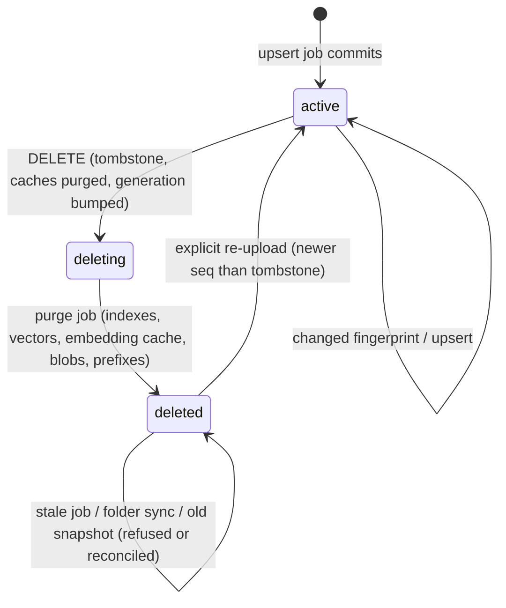
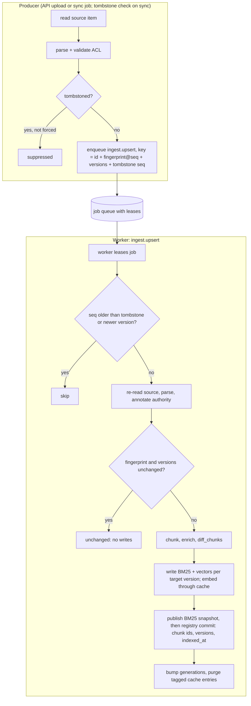
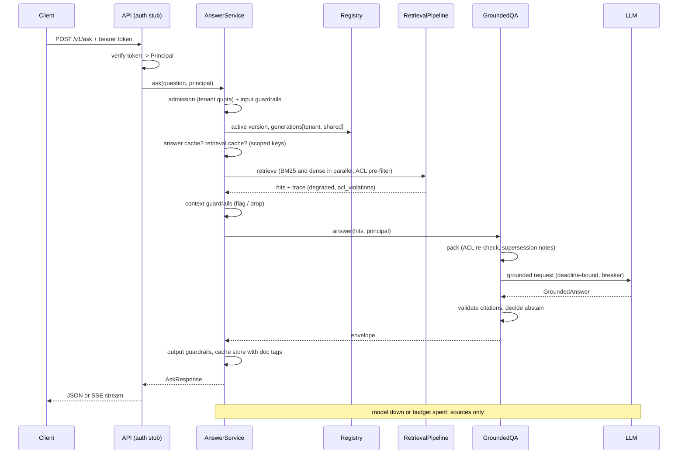
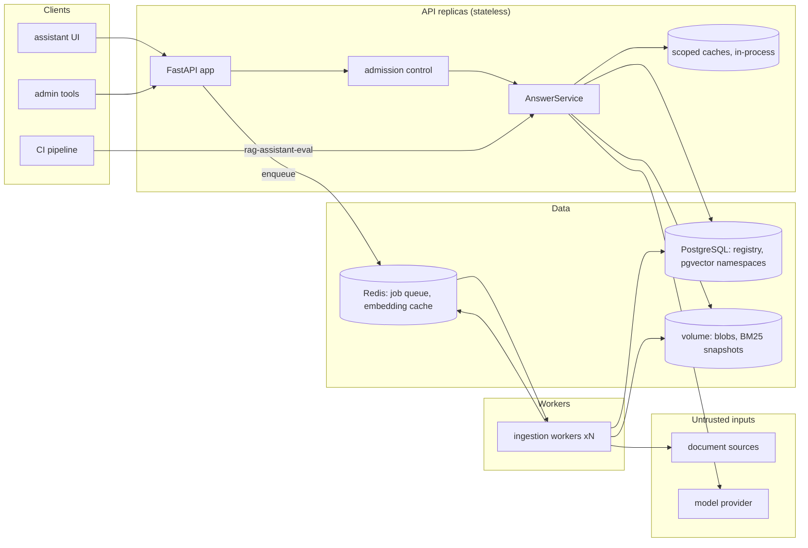

# Chapter 15 — Production RAG

This chapter turns the RAG components from Chapters 10 to 14 into a service that keeps working after the demo. You will learn to run indexing as a pipeline of idempotent jobs. You will update documents incrementally, and delete them so that no copy survives in any index, cache, or derived store. You will put authority and supersession metadata on chunks so that a current policy outranks an old FAQ, and enforce permissions at retrieval time. You will choose between per-tenant namespaces and a shared index, key every cache on the variables that change its answer, and give every stage a span, a metric, and a latency budget. Finally, you will define what the service does when the vector store, the reranker, or the model is down, and gate releases on an evaluation that fails on a single permission leak. The code is **Project 3**, the Northwind Assist knowledge service at `book/projects/p3-rag-assistant/` (package `rag_assistant`). It is a FastAPI service and an ingestion worker over PostgreSQL with pgvector and Redis, assembled from `ragkit`, `semsearch`, `guardrails`, `reliability`, `evalkit` and `aie_core`. It ships with Docker Compose and 55 offline tests.

## Why this matters

Northwind's first RAG release was a notebook promoted to a container. A script read the documents folder, chunked everything, embedded everything, and wrote a fresh vector index every night. Retrieval filtered by tenant after ranking. A dictionary held answers keyed on the question text. It passed the demo, and in its first quarter it produced four incidents. None of them was a model problem.

1. **The resurrected document.** Legal asked for a draft reorganization memo to be removed. It was deleted from the vector index by hand. The next nightly rebuild read the folder, where nobody had deleted the file, and indexed it again. The memo was back by morning and stayed for nine days.
2. **The cached leak.** A manager asked about an incident report visible only to `it-oncall` and `managers`. The answer went into the cache under the question text. An hour later an employee asked the same question and got the manager's answer, with a citation to a document they could not open.
3. **The stale policy.** PTO Policy 3.0 raised carryover from 5 to 10 days. Retrieval kept ranking the HR FAQ above the policy, because the FAQ's wording was closer to how employees ask, and the FAQ still said 5. This is the failure Chapter 14's gold set calls RQ-001. It also turned out to be an ingestion problem, not a ranking problem.
4. **The 40-minute brownout.** The vector database was overloaded during a reindex. Every request waited for a ten-second timeout on dense retrieval and then failed. BM25 was healthy the whole time and could have answered most questions.

Every one of these is a property of the system around retrieval and generation: how documents enter and leave, who may see what, what a cache key contains, and what happens when a dependency fails. Chapters 11 to 14 built good components. This chapter is about the joints between them.

## Mental model

> **Mental model:** The index is a cache of the registry, and every cache is a copy you must be able to delete.

A production RAG system has one system of record for documents. That record holds identity, version, permissions, lineage, and state. Everything downstream is a projection of it: the BM25 index, the vector namespace, the embedding cache, the contextual prefixes, the retrieval cache, the answer cache, the BM25 snapshot on disk, and the uploaded original in the blob store. Each projection can be rebuilt from the record and the sources. Each one must be invalidated when the record changes, and each one must be purged when a document is deleted. When you design a feature, ask three questions:

- Which projections does this change touch?
- What key tells a projection that it is stale?
- What stops an old copy from coming back?

Follow one edit through the system: the producer enqueues a pointer, a worker re-reads the source, re-embeds only the changed chunk, commits the registry, and bumps a generation counter so cached answers miss. Follow one delete: the API request marks the row `deleting` and bumps the generation, and a queued purge removes every copy. The rest of this section explains each step.

The second mental model comes from the book's list and applies to every request: **the model is not the authorization system.** A document the principal cannot read must never enter the candidate list, the prompt, a trace visible to the user, or a cache another principal can hit. Permissions are applied before scoring and checked again before packing. Nothing is filtered after generation, because by then the model has already read the forbidden text.

## Core concepts

### Indexing as a pipeline of jobs

The notebook approach, "rebuild everything nightly", has three costs. It burns embedding spend on unchanged text. It makes freshness a function of the cron schedule. And it has no concept of deletion: whatever is in the source tonight is the index tomorrow, including things that should have been removed. Production indexing is a stream of small jobs, one per document change. A producer enqueues them and workers process them.

The **producer** (`IngestionService`) never writes an index. It reads a source item, parses it far enough to learn the document id, tenant, ACL and content hash, and rejects invalid documents early. A document without ACL metadata gets a 422 at upload, not a dead letter an hour later. The producer then enqueues a job with an idempotency key. The **queue** is `reliability.JobQueue` from Chapter 29: `InMemoryJobQueue` in tests, `RedisJobQueue` in Compose. It gives leases, bounded attempts, backoff, and a dead-letter queue (DLQ). The **worker** is `reliability.Worker` with two handlers, `ingest.upsert` and `ingest.purge`.

The queue carries pointers, not documents. A job says "folder connector, `pto-policy.md`" or "blob connector, `hr-sabbatical-policy/3f2c….md`". The worker re-reads the source when it runs. A job that waited behind a backlog indexes what the source holds now. A retried job never indexes a stale payload. Pointers also keep the queue small: a 40 MB PDF does not travel through Redis.

**Idempotency** works at two levels, because the queue delivers at least once. At enqueue time, the key is document id plus fingerprint plus the sequence number at which that fingerprint last became new, plus target versions and the tombstone sequence. Resubmitting unchanged content returns the existing job, so a full sync of 24 unchanged documents creates zero jobs. A revert (content A, then B, then A again, or an ACL changed and changed back) gets a new sequence and therefore a new job. At processing time, the handler compares the document fingerprint and target versions with the registry and does nothing when they match. Every index write is "replace everything this index holds for document X". A handler that crashes between the BM25 write and the vector write, and is then redelivered, converges to the same state.

The **fingerprint** matters more than it looks. The obvious idempotency key is the content hash, and it is wrong. When a document's ACL changes from `["all"]` to `["hr"]`, its text, and therefore its content hash, are unchanged. A content-hash key would deduplicate the change away, and the document would stay visible to everyone. The fingerprint covers everything that changes what the indexes hold: content hash, version, tenant, ACL groups, authority metadata, chunker configuration, authority-rules version, pipeline version, and whether contextual enrichment is on. A new chunker or a new rule re-ingests exactly the documents it affects.

**Index versions** separate "what we serve" from "what we are building". The vector namespace is `index:model:version` (Chapter 9's `make_namespace`). Two embedding models, or two chunking runs, never share a search space. A version is the unit of a blue/green rebuild: build version N+1 next to the live version N, then switch reads to it in one step. The registry records which versions hold each document. Retrieval always reads the active version, and promotion is a single registry write.

### Incremental updates

When a document changes, most of its chunks usually do not. ragkit's chunk ids are `doc_id:hash(chunker fingerprint, section path, content hash, occurrence, parent)` (Chapter 11). An edit in section 1 leaves section 3's id untouched. `diff_chunks(previous_ids, new_chunks)` returns three lists: `added`, `unchanged`, `removed`. The registry stores each document's chunk ids, so the diff is cheap.

The diff does not have to drive the writes directly. The project does the simple thing: it replaces the whole document in BM25, because tokenizing a few chunks costs microseconds. It calls `DenseRetriever.index`, which re-embeds the document, through an embedding cache keyed by embedding-space fingerprint and exact text (`aie_core.CachedEmbeddings`). Unchanged chunks hit the cache. Only `added` chunks reach the provider. The test `test_update_reembeds_only_the_changed_chunks` edits one sentence of the PTO policy and asserts that exactly one text was sent to the embedding provider.

Contextual enrichment (Chapter 12) adds a subtlety. `ContextualEnricher` writes a model-generated prefix into `chunk.metadata["context_prefix"]` and changes the indexed text, but not `Chunk.id`. A chunk can be "unchanged" by id while its neighborhood changed enough to change its prefix, and then it needs a new vector. The enricher also records `context_key`, a hash of everything that determined the prefix. The registry stores the key per chunk, and the handler counts unchanged ids whose key moved as `reembedded`. The embedding cache makes this automatic, since a new prefix means new indexed text and a cache miss. The count is what tells you how much enrichment is costing you.

### Deletion and the tombstone

Deletion has two parts with different deadlines. The **logical delete** must take effect immediately, inside the API request: the user, or the lawyer, needs the document gone now. The **physical purge** removes every copy. It can run asynchronously, but it must be complete and verifiable.

`IngestionService.delete` does the logical part synchronously:

- It sets the registry row to `status="deleting"` with a new `deleted_seq`.
- It bumps the generation counter of the document's tenant scope (an integer per scope, incremented on every committed change; see Caching layers), which invalidates every scoped cache entry for readers of that scope.
- It physically removes cache entries tagged with the document.
- It enqueues a purge job.

Until the purge runs, and until every replica has loaded the purged indexes, `TombstoneFilter` drops hits from every document whose state is not `active`. The purge handler then deletes the document from every index version and partition (per-tenant sub-index, see Multi-tenancy), from the embedding cache (vectors are derived data and can be partially inverted), from the contextual-prefix cache, from the blob store, and from every request cache. It marks the row `deleted`.

The row is kept. The **tombstone** is what prevents resurrection, and the Northwind memo incident shows that resurrection is the normal failure. A document comes back through four paths, and each needs its own guard:

| Path back | Guard |
|---|---|
| A stale upsert job, planned before the delete and delivered after it | the job's `seq` is older than `deleted_seq`, so the handler returns `skipped_tombstone` |
| A folder sync that still sees the file | `submit_uri` refuses tombstoned ids, so the tombstone acts as a suppression list |
| An old BM25 snapshot or a restored backup | `IndexSet.reconcile()` removes anything the registry lists as deleting or deleted |
| A purge that crashed halfway | the purge is idempotent and re-runs; reconciliation is the backstop |

Re-adding a deleted document is allowed, but it must be explicit. An admin upload carries the new tombstone sequence in its idempotency key. Without that, the queue would return the old, already-succeeded job for the same content, and the re-upload would silently do nothing.



### Authority, effective dates, and supersession

Chapters 10, 12 and 14 kept meeting the same miss. For "How many unused PTO days can I carry over?", the HR FAQ outranks PTO Policy 3.0. Better embeddings will not fix it. The FAQ really is the closer textual match: it is phrased as the employee's question. What the ranker lacks is a fact about the documents. The policy is authoritative, it is newer, and it explicitly replaces the FAQ's time-off section. The FAQ even says so in its header note. That fact belongs to the content owners, so it belongs in metadata written at ingestion. It does not belong in a prompt instruction hoping the model notices dates.

`domain/authority.py` reads a reviewed rules file and annotates every document and chunk with four fields:

- `authority`: an integer level, from external (0) and FAQ (1) through runbook, product and incident (2) to policy (3).
- `effective_date`: from front matter, then a "Effective date: YYYY-MM-DD" line near the top of the body, then `updated_at`.
- `supersedes`: on the newer document. ragkit's `EvidencePacker` reads it to write a conflict note that tells the model which block wins.
- `superseded_by`: on the older document's affected chunks only. The rule names the FAQ's "Time off" section, so the FAQ's payroll answers are untouched.

`AuthorityReranker` runs after the relevance reranker. It adds a boost proportional to the authority level, scaled to the top score so that it means the same thing for RRF scores near 0.03 and for cross-encoder logits. It also enforces one hard rule: a chunk marked `superseded_by` a document that is also among the candidates scores just below that document's best chunk. Supersession only applies when the newer document is present. If retrieval found only the FAQ, the FAQ is still the best available evidence, and the packer and validator handle its age.

Chunk ids do not depend on metadata. A rule change therefore re-annotates chunks without re-embedding them: the fingerprint changes, the handler rewrites the indexes, and the embedding cache serves every vector.

### Permissions: filter at retrieval, re-check at packing, never after generation

There are three places a permission check can go, and only two of them are correct.

**At retrieval, before scoring.** `BM25Index` computes the allowed chunk set for the principal before it computes a single score (Chapter 12). `DenseRetriever` passes tenant and group filters to the vector store as a pre-filter. A forbidden chunk never occupies a top-k slot, never appears in a score log, and never shifts the ranks of allowed chunks. Post-filtering a top-k list leaks in a subtler way too: if a user's top 10 comes back with 7 results, the 3 missing slots tell them that something they cannot see matched their query.

**At packing, again.** `EvidencePacker.pack(hits, principal)` re-applies `visible()` and records any drop as `dropped_acl`. `RetrievalPipeline` also checks the final hits and reports violations in `trace["acl_violations"]`, which Chapter 14's leak metric reads. In a correct system both checks always pass. They exist because the pre-filter lives in a different component, possibly a database, and you never trust one layer with authorization. A non-empty `acl_violations` list is a security event, not a quality metric.

**After generation: never.** The model has already read the text. Redacting a citation afterwards does not remove the fact from the answer, and nothing removes it from the provider's logs.

The principal comes from a verified token and nothing else (`api/auth.py`, an HMAC stub that Chapter 39 replaces with JWT). It never comes from request fields, the question text, or anything a document says.

**ACL changes propagate** like any other change. The fingerprint includes the ACL, so the upsert handler rewrites chunks with new `acl_groups` in BM25 and in every vector record. Vectors come from the cache, so no embedding calls are made. The handler bumps the generations of the old and new tenant scopes and purges cache entries tagged with the document. The test `test_acl_change_reaches_indexes_without_reembedding` restricts the PTO policy to `hr`. It then asserts three things: an employee's next request misses the cache and no longer retrieves the document, zero texts were embedded, and an HR user still sees it. The propagation delay is the freshness lag of the change. Tightening a permission is a high-priority change: route it to a dedicated queue or process it inline if your SLO requires minutes rather than the normal ingestion lag.

### Multi-tenancy: namespaces or a shared index

Northwind has two tenants, `retail` and `logistics`, plus `shared` content that both can read. There are two layouts, and the project implements both behind `RAG_TENANCY_MODE`.

**Shared index with tenant filters** (`shared`, the default). There is one BM25 index and one vector namespace. Every chunk carries `tenant` and `acl_groups`, and every query pre-filters by them. Operations are simple: one index to build, monitor and reindex. Shared documents are stored once, and corpus statistics such as BM25 IDF come from the whole corpus. The risk is that isolation depends on the filter being correct on every code path. A filter bug is a cross-tenant leak. Filtered ANN search also has a performance cliff: when a tenant owns 2 percent of the vectors, an HNSW search with a restrictive filter must either over-fetch heavily or use iterative scanning (Chapter 9) to find enough matches.

**Namespace per tenant** (`namespace`). Each version has one partition per tenant plus a `shared` partition, and each partition has its own BM25 index and vector namespace (`northwind-retail:model:v1`). `build_pipeline` opens only the partitions the principal may read: a retail user's pipeline has `bm25@retail`, `bm25@shared`, `dense@retail` and `dense@shared`, and RRF fuses the four lists. Fusion by rank is what makes this work. BM25 scores from two indexes with different IDF statistics are not comparable, but ranks are. A retail query cannot touch logistics data even if a filter is wrong, because the retriever for that data does not exist in the request. The test asserts exactly that from the trace. The costs:

- Shared content is either duplicated per tenant or queried as an extra partition. The project does the latter, which adds lists to fuse.
- Small tenants get poor corpus statistics.
- Per-tenant index count grows operational load linearly: monitoring, reindexing, HNSW memory.

| | Shared index + filter | Namespace per tenant |
|---|---|---|
| Isolation failure mode | filter bug leaks | misrouted partition leaks (rarer, easier to test) |
| Operations | one index | N indexes, N reindexes |
| Small-tenant search quality | good corpus statistics | weak IDF, small ANN graphs |
| Restrictive-filter ANN cost | over-fetch or iterative scan | none |
| Per-tenant deletion ("delete tenant X") | filtered delete | drop namespace |
| Fits | many small tenants, internal units | few large or regulated tenants, contractual isolation |

Northwind's tenants are business units of one company, so the shared index is the default. A SaaS product selling to banks would start with namespaces, or with separate databases.

**Noisy neighbors** appear on both paths. On the request path, one tenant's batch script can consume the replica's model concurrency. `reliability.AdmissionController` gives each tenant a token bucket. The API returns 429 with `Retry-After` when a tenant exhausts its quota, while other tenants keep their capacity (`test_tenant_quota_returns_429`). Under global load it degrades admissions before rejecting them, through admission levels (how far the service sheds work under load): level 1 skips the reranker and halves candidate counts, and level 2 returns sources without generation.

On the ingestion path, a tenant that bulk-uploads 50,000 documents can push every other tenant's freshness past its SLO. FIFO queues cannot express fairness. The fixes are per-tenant queues with weighted round-robin leasing, or a per-tenant cap on in-flight jobs. The job model already carries `tenant_id` for exactly this.

### Caching layers and their keys

There are three caches on the path, each with its own key discipline. Chapter 30 owns cache economics. This section is about correctness.

| Cache | Key | Shared across principals? | Invalidated by |
|---|---|---|---|
| Embeddings | embedding-space fingerprint + exact text | yes, because a vector depends only on the text | space change (new key), document purge (`forget_doc`) |
| Retrieval results | tenant + groups (scoped) + normalized query + index version + generations of readable scopes + funnel config | no | generation bump, TTL, document tag purge |
| Answers | everything in the retrieval key + prompt version + model + guardrail policy version | no | as above, plus prompt/model change (new key) |

The embedding cache key comes from `aie_core.CachedEmbeddings`. It hashes the provider, model, dimensions, instruction prefix and text-preparation version into a **space fingerprint**. Changing the model or the "query: " prefix invalidates the cache instead of mixing vector spaces. `ForgettableEmbeddings` adds the one thing deletion needs: a per-document index of keys, stored in the same Redis map, so a purge can forget the document's vectors.

The retrieval and answer caches are `ScopedCache`, a subclass of `guardrails.TenantScopedCache`. Its key comes from `scoped_cache_key` over the caller's tenant and sorted groups. Two principals who could see different documents can never share an entry, and on read the cache re-checks that the stored authorization context equals the caller's. A forged or colliding key raises `TenantIsolationError` instead of returning data.

That settles who may share an entry. Generations settle when an entry goes stale. The key also includes the **index version** and the **generation counters** of every scope the principal can read. A retail employee depends on `gen[retail]` and `gen[shared]`. Any committed change to a retail or shared document bumps one of them, so every older entry becomes unreachable for new lookups at once, on every API replica, because the counters live in the shared registry. Replicas also sweep unreachable entries when they notice the generations moved, so stale data does not sit in memory until its TTL. Entries carry document tags, so a delete physically removes every entry that contains the document.

Generations are deliberately coarse. A change to any shared document invalidates every cached answer for every tenant. On a corpus that changes a few times an hour that costs little hit rate and buys a simple correctness argument. On a corpus that changes every second, coarse generations reduce the hit rate to zero. Then you need per-document dependency tracking: invalidate only entries whose tags include the changed document, and also entries for queries the new document might now win. The second half is the hard part, and it is why the fine-grained scheme is rarely worth it.

TTLs add a freshness bound on top of generations. They catch the failures generations cannot see, such as a source edited without anyone running a sync. The defaults are illustrative: retrieval results live 5 minutes and answers live 10.

Some results are not cached at all. A **degraded** retrieval result, for example lexical-only because the vector store was down, would pin lower quality for its TTL after the store recovers. Abstentions and escalations are not cached either, because the next ingestion might answer them. Streaming answers bypass the answer cache in this implementation. A semantic cache, which reuses answers for similar rather than identical questions, needs every key component above plus a similarity threshold validated against the gold set. Chapter 30 builds one and shows why its false-hit rate must be measured per tenant.

### Observability of each stage

The tracer is one `aie_core` tracer per container, passed to every component, and every request produces one span tree. The root span `rag.request` carries `request.id`, `tenant.id`, `user.id`, the mode, the cache result, the index version, and the degraded list. Below it sit `guardrail.check` spans (with a `guardrail.stage` attribute of input, context, or output), `retrieval.pipeline` with `retrieval.retrieve`, `retrieval.fusion` and `retrieval.rerank` written by ragkit, then `rag.answer` and `rag.generate`. Ingestion produces `job.process`, then `ingest.upsert` or `ingest.purge`, tagged with the change kind and the added and removed chunk counts.

One trap: `RetrievalPipeline` runs retrievers in a thread pool, and tracing context lives in context variables, which threads do not inherit. The pipeline therefore submits every job through `contextvars.copy_context().run`, so `retrieval.retrieve` spans, and any spans the retrievers open (an embedding call through the gateway), stay children of `retrieval.pipeline` in the request's trace. The same holds for Chapter 31's `AITracer`. Code that adds its own thread or process pools inside a request has to do the same, or its spans start new traces.

Traces explain one request. Metrics show the population. `observability/metrics.py` keeps labeled counters and distributions and renders Prometheus text at `/metrics`:

- `rag_stage_latency_ms{stage}` for every stage, including `retrieval.retrieve` (the wall clock of the parallel phase) and `total`.
- `rag_requests_total{mode, cache}`, plus cache lookups by layer.
- `rag_degraded_total{reason}`: a nonzero rate is a page-worthy signal even while users get answers.
- `rag_security_events_total{kind}` for flagged context, output redactions, and ACL violations.
- `rag_ingest_jobs_total{change}` and `rag_freshness_lag_s`.

**Freshness lag** is easy to omit because nothing errors when it grows. It is the time from the moment a change was observed (`submitted_at`, stamped by the producer) to the moment it became searchable (`indexed_at`, stamped at the registry commit). `GET /v1/index/status` reports its p95 and maximum against the freshness SLO, together with queue depth, dead letters, the age of the oldest pending purge, and breaker states. Freshness is one of the service's dependencies. When it degrades, users get stale answers without any error.

### Cost and latency budgets

Northwind's target is p95 time-to-first-token under 2 seconds and p95 completion under 8 seconds (illustrative, from Chapter 1). A budget turns that target into per-stage allowances that each owner can test against. The table below is illustrative, for a hosted model and a CPU cross-encoder. Measure your own.

| Stage | p95 budget (ms) | Notes |
|---|---|---|
| auth, admission, input guardrails | 20 | deterministic checks only; model-based classifiers would cost 100+ |
| cache lookups (answer, retrieval) | 5 | in-process; Redis adds about 1 ms per round trip |
| query embedding | 40 | cached for repeated questions |
| lexical ‖ dense retrieval | 60 | parallel: the budget is the max, not the sum |
| fusion | 2 | RRF over 2 to 4 lists of 40 |
| rerank, 20 candidates | 150 | cross-encoder; the lexical fallback takes about 1 ms |
| context guardrails + packing | 20 | |
| model time to first token | 1,100 | provider- and prompt-length-dependent |
| first complete sentence (safe streaming buffer) | 400 | Chapter 13: the first visible token is the first validated sentence |
| **time to first visible text** | **about 1,800** | 200 ms headroom under the 2 s target |

The retrieval rows are enforced, not just written down. `RetrievalPipeline` enforces `retrieve_timeout_s` (`RAG_RETRIEVE_TIMEOUT_S`, 0.3 s, illustrative) with one shared thread pool, and `RAG_RERANK_TIMEOUT_S` (0.25 s) goes to `AuthorityReranker`. A retriever that misses its budget is recorded as degraded and skipped, exactly like a failed one. A relevance reranker that misses its budget leaves the fused order, and `AuthorityReranker` still applies authority and supersession to it, because it enforces the reranker's deadline itself. pgvector reads also carry a server-side `statement_timeout` (`RAG_PG_STATEMENT_TIMEOUT_MS`), so an abandoned query does not keep consuming the database. A breaker handles a dependency that is down. A timeout handles one that is slow, which is the more common failure.

The request deadline (`RAG_REQUEST_DEADLINE_S`, 8 s) is a `reliability.Deadline`. `DeadlineBoundLLM` stamps the remaining budget on every model request, so a call that starts late gets a short timeout instead of the provider default. If less than `RAG_MIN_GENERATION_S` remains when packing finishes, the service returns sources without an answer, so the user gets the evidence instead of a timeout.

**Cost per answer** is dominated by generation input tokens. An evidence budget of 2,500 tokens, about 500 tokens of system prompt and question, and 300 output tokens give 3,000 input and 300 output tokens. At illustrative prices of `p_in` and `p_out` per million tokens, that is `0.003·p_in + 0.0003·p_out` dollars. Query embedding and reranking are two or three orders of magnitude smaller. Per-tenant request quotas bound volume, not spend; a tenant whose questions pull long evidence costs more per request, so a spend ceiling per tenant (Chapter 30's `SpendGuard`) belongs next to the quota. The levers, in order of size:

- **The evidence budget.** Halving it halves the dominant term. Chapter 14's evaluation tells you whether `evidence_packed` survives the cut.
- **The answer cache hit rate.**
- **Routing easy questions to a cheaper model** (Chapter 7), gated on the same evaluation.

Ingestion cost scales with changed chunks, not with the corpus. That is the economic case for incremental updates. With contextual enrichment on, every changed chunk also costs one model call of about 1,500 input tokens.

### Scalability

The request path scales horizontally. API replicas are stateless apart from in-process caches, which generations keep correct, and BM25 snapshots, which reload when the worker publishes a new one. Inside a request, lexical and dense retrieval run in parallel (`RAG_PARALLEL_RETRIEVAL`), so retrieval latency is the slower of the two, not their sum.

**Index size** sets the hardware. Northwind's corpus is 24 documents and 231 chunks, which fits anywhere. A 4,000-employee company with ten years of wikis, tickets and runbooks might hold 200,000 documents. At about 10 chunks each, that is 2 million chunks. At 1,024 float32 dimensions, the vectors alone take 2,000,000 × 1,024 × 4 bytes, about 8.2 GB, and pgvector's HNSW index stores its own copy of each vector, so the table plus index hold about twice that. HNSW graph links at m=16 add about 0.3 GB. Chunk text and metadata at about 2 KB per chunk add 4 GB, and BM25 postings add another 1 to 2× the text size. That is one large PostgreSQL instance with pgvector, held in RAM. A read replica doubles query capacity, and Chapter 9 shows `ef_search` tuning. Two levers shrink the vector share:

- **Halving dimensions** (Matryoshka-style truncation, if the model supports it, validated on the gold set) halves the 8 GB.
- **int8 quantization** quarters it, at a recall cost you must measure.

Read replicas need one rule: a request must not read a replica that lags behind the registry generation it used for its cache key. Otherwise a deleted document can come back from a lagging replica. Project 3 reads the primary only, so it does not implement the rule. With PostgreSQL, record the primary's write-ahead-log position, its LSN (`pg_current_wal_lsn()`, a monotonically increasing position in the change log), in the registry commit that bumps a generation, and route a request to a replica only if its replayed position (`pg_last_wal_replay_lsn()`) has reached the position of the generations in the request's key; otherwise read the primary.

**Ingestion throughput** is simple arithmetic. If a worker processes a document in 0.5 s (parse 20 ms, chunk 10 ms, embed one batch 300 ms, write 150 ms), one worker sustains 2 documents per second. A migration that drops 50,000 documents at once needs 7 hours on one worker and 42 minutes on ten. That is fine, as long as the bulk load cannot starve everyday changes of their freshness SLO. Bulk loads run at batch priority, or on their own queue.

### Freshness SLOs

A freshness SLO states how quickly a change becomes searchable, for example "95 percent of document changes searchable within 5 minutes; deletions and permission tightening within 1 minute" (illustrative). The lag has four components, and each has its own fix:

1. **Detection.** Polling a folder every 15 minutes puts a 15-minute floor under the lag. Webhooks or change feeds from the source system remove it.
2. **Queue wait.** This is depth divided by throughput, and it is the component that blows up under bulk loads.
3. **Processing.** Parse, chunk, embed, write. Embedding batches dominate.
4. **Publication.** For the BM25 snapshot path, the API must reload. In-process indexes, or Postgres full-text search, remove this step.

Measure the SLO from `submitted_at` to `indexed_at`. Measure separately how long changes wait between happening at the source and being observed, because the registry cannot see that part. Report the SLO next to latency and error rate. Deletions get a tighter target, which the logical delete makes achievable regardless of purge lag: invisibility takes effect in the API request itself.

### Failure handling and degraded modes

Every dependency on the request path has a breaker (`reliability.CircuitBreaker`, one per dependency name) and a defined degraded mode. Degraded modes are product decisions written down before an incident.

| Dependency down | Mode | User sees | Recorded |
|---|---|---|---|
| vector store / dense retrieval | lexical only | normal answer, sometimes weaker on paraphrases | `retrieve:dense#q0` |
| one of the BM25 partitions | dense only | normal answer, weaker on IDs | `retrieve:bm25…` |
| reranker (down or too slow) | fused order, authority still applied | normal answer | `rerank:fallback` |
| LLM (error, open breaker, budget spent) | sources only | "These documents matched your question", titles and snippets | `generate:…` |
| every retriever | unavailable | 503 with a retry message | `retrieve:all` |
| admission level 2 (overload) | sources only | as LLM down | `admission:level2`, `generate:shed` |

The breaker is what turns the 40-minute brownout into a non-event. After a few failures in its window, the dense breaker opens, and dense retrieval fails in microseconds with `CircuitOpenError`. `RetrievalPipeline` already treats a failing retriever as "skip and record". Requests run lexical-only at normal latency until the breaker's half-open probes succeed (after a cool-down the breaker lets a few trial calls through and closes if they succeed). The test `test_breaker_opens_and_dense_fails_fast` asserts that later requests never call the broken dependency. The breaker for the model is checked before generation: when it is open, the service goes straight to sources-only instead of waiting for a timeout it already knows will happen.

"Sources only" deserves care. The sources are the packed evidence blocks, after ACL re-checks and with flagged spans removed, so the list never shows more than an answer would have cited. When retrieval abstains because nothing relevant is visible, the response lists nothing. The hits were not good enough to answer from, so they are not good enough to show either.

### Evaluation in CI and online feedback

`rag-assistant-eval` builds a container exactly as the API does, ingests the docs folder through the queue and worker, and evaluates `AnswerService.ask` on the 40-question shared-data gold set with Chapter 14's machinery: `evaluate_system`, stage isolation, and `render_rag_report`. Caches are off, so the run measures the pipeline rather than a warm cache. The gate (`P3_GATE`) has three kinds of rules:

- **Must pass all:** `no_permission_leak` and `citations_valid`. A single case fails the release.
- **Absolute floors** on recall@5, hit@1, evidence packed, and abstention correctness.
- **Critical slices:** no leak on any `forbidden-doc` case, and hit@1 on every `conflicting-versions` case.

`--baseline-run` adds Chapter 14's regression rules against the previous release. Exit code 1 means the gate failed, and 2 means setup failed, so CI can tell "the candidate is worse" from "the evaluation is broken".

Offline, the default configuration passes with zero leaks. The ablations show why the critical slices exist:

| Configuration | recall@5 | hit@1 | abstention correct | gate |
|---|---|---|---|---|
| default | 0.986 | 0.811 | 0.875 | pass |
| authority layer off | 0.986 | 0.784 | 0.875 | fail: conflicting-versions |
| no reranker | 1.000 | 0.946 | 0.85 | fail: conflicting-versions |

Removing the toy lexical reranker *raises* hit@1 from 0.81 to 0.95 on this corpus. Without the critical slice, that configuration would ship as an improvement while failing a conflicting-versions question: authority still runs without the reranker, but for RQ-002 the parental leave policy now ranks first. With the slice, the release blocks and someone has to make the trade explicitly, which is exercise P2. The numbers come from an offline fake model and vocabulary embeddings, so read them as a demonstration of the gate, not as quality claims.

Online, every response carries a request id. Chapter 31's convention joins user feedback, thumbs and "this source is wrong" reports, to the trace by `response.id`. The useful online signals are:

- the abstention rate per tenant and topic;
- the share of answers with `answer_with_caveat` (conflicts, stale sources);
- the citation-click rate;
- the "wrong source" report rate per document, which is how you find the next FAQ-over-policy pair;
- the degraded-mode rate.

Feedback-flagged questions become candidate gold cases after a human labels the required documents (Chapter 25).

## How it works

### The ingestion path



The registry write is the commit point. Indexes and the BM25 snapshot are written first and the registry last, so an API replica that sees the new generation can also load the new snapshot. A crash in between leaves the registry describing the old state, and the redelivered job redoes the work, which is safe because every index write is a whole-document replace. Two workers processing two versions of the same document at once is the remaining race. A narrower one remains around re-uploads of a deleted document: a reconcile that runs after the worker has written vectors but before the registry commits `active` can remove them, so run reconcile only when no re-add of a tombstoned id is in flight. The handler takes a per-document lock inside a process. Across processes, route a document's jobs to one queue partition by hashing the doc id, or take a row lock on the registry row. Exercise E2 asks you to choose.

### The request path



There is one trust boundary that matters: everything retrieved is untrusted. The packer wraps evidence in `<untrusted_data>` tags, strips HTML comments, and flags instruction-like paragraphs. Context guardrails flag the vendor newsletter's injection paragraph. The validator refuses claims whose only support lies in flagged spans. None of these depends on the model choosing to ignore the instruction. The test `test_controls_hold_even_when_the_model_obeys_the_injection` uses a deliberately compromised fake model that repeats the injected exfiltration request, and asserts that the user still receives an abstention with the payload stripped.

## Architecture



Docker Compose runs one service per box: `postgres` (pgvector image), `redis` with append-only persistence because the queue must survive restarts, `api`, and `worker`. One-off `sync` and `eval` jobs run under a profile. The API and the worker share a volume for blobs and BM25 snapshots. In a larger deployment the lexical index moves into PostgreSQL full-text search (ragkit ships `sql/lexical_tsvector.sql`) or a search engine, which removes the snapshot step.

## Implementation

The project tree, configuration table and run instructions are in `book/projects/p3-rag-assistant/README.md`. The listings below are the files where the chapter's decisions live. Long files are shown in part and marked as excerpts. The complete files are on disk.

```
p3-rag-assistant/
  pyproject.toml  Dockerfile  docker-compose.yml  .env.example  README.md
  rag_assistant/
    config.py  wiring.py
    domain/      models.py  authority.py  keys.py
    data/        authority_rules.json
    ingestion/   sources.py  registry.py  processing.py  handlers.py  service.py  worker.py
    retrieval/   index.py  wiring.py
    answering/   service.py
    caching/     caches.py
    observability/ metrics.py
    adapters/    llm.py
    api/         app.py  auth.py
    eval/        run_eval.py
  tests/         conftest.py  test_p3_ingestion.py  test_p3_deletion.py  test_p3_acl_tenancy.py
                 test_p3_injection_degraded.py  test_p3_api.py  test_p3_eval_backends.py  test_p3_scoped_cache.py
```

### Identity and keys

`doc_fingerprint` is the function every idempotency decision rests on; note what it includes beyond the content hash.

```python
# path: book/projects/p3-rag-assistant/rag_assistant/domain/keys.py
"""Identity functions: document fingerprints, query normalization, index partition keys.

Each function answers "which inputs change the result?". Leaving one input out of a key is
how caches serve stale or leaked answers; putting an irrelevant one in only costs hit rate.
"""
from __future__ import annotations

import re
import unicodedata

from ragkit.documents import Document, short_hash
from ragkit.retrieval import Principal

from .models import SHARED_TENANT

_WS = re.compile(r"\s+")
_TRAILING = re.compile(r"[\s?.!]+$")


def normalize_query(text: str) -> str:
    """Cache-key normalization only (never sent to retrieval): case, width, whitespace, final '?'."""
    text = unicodedata.normalize("NFKC", text).lower()
    return _TRAILING.sub("", _WS.sub(" ", text)).strip()


def doc_fingerprint(doc: Document, *, chunker: str, rules: str, pipeline_version: str, enrichment: bool) -> str:
    """Everything that changes what the indexes hold for this document.

    Content hash alone is not enough: an ACL change leaves the text (and its hash) unchanged
    but must reach every index and cache. Same for a new authority rule or a new chunker.
    """
    meta = doc.metadata
    return short_hash(
        doc.content_hash,
        doc.version,
        doc.tenant,
        ",".join(sorted(doc.acl_groups)),
        meta.get("authority"),
        meta.get("effective_date"),
        ",".join(meta.get("supersedes") or []),
        chunker,
        rules,
        pipeline_version,
        enrichment,
        length=24,
    )


def acl_fingerprint(tenant: str | None, groups: list[str]) -> str:
    return short_hash(tenant, ",".join(sorted(groups)))


def partition_for_doc(tenant: str | None, mode: str) -> str:
    """Which index partition a document lives in: one shared index, or one per tenant."""
    if mode == "shared":
        return "all"
    return tenant or SHARED_TENANT


def partitions_for_principal(principal: Principal, mode: str) -> list[str]:
    """Which partitions a principal's query may touch. Namespace mode never opens another tenant's."""
    if mode == "shared":
        return ["all"]
    return sorted({principal.tenant, SHARED_TENANT})


def generation_scopes(tenant: str | None) -> list[str]:
    """Generation counters bumped by a change to a document of this tenant."""
    return [tenant or SHARED_TENANT]


def principal_scopes(principal: Principal) -> list[str]:
    """Generation counters a principal's cached results depend on."""
    return sorted({principal.tenant, SHARED_TENANT})


__all__ = [
    "acl_fingerprint", "doc_fingerprint", "generation_scopes", "normalize_query", "partition_for_doc",
    "partitions_for_principal", "principal_scopes",
]
```

### Authority rules

The rules file, `book/projects/p3-rag-assistant/rag_assistant/data/authority_rules.json`:

```json
{
  "comment": "Owned by the content owners, reviewed like code. Levels: higher wins when sources disagree.",
  "levels": [
    {"match": {"tags_any": ["external", "newsletter"]}, "level": 0, "kind": "external"},
    {"match": {"tags_any": ["faq"]}, "level": 1, "kind": "faq"},
    {"match": {"tags_any": ["incident", "postmortem"]}, "level": 2, "kind": "incident"},
    {"match": {"tags_any": ["runbook"]}, "level": 2, "kind": "runbook"},
    {"match": {"id_prefix": ["prod-"]}, "level": 2, "kind": "product"},
    {"match": {"tags_any": ["policy"]}, "level": 3, "kind": "policy"}
  ],
  "default_level": 1,
  "supersessions": [
    {
      "newer": "hr-pto-policy",
      "older": "hr-faq",
      "older_sections": ["Time off"],
      "reason": "PTO Policy 3.0 (effective 2026-01-01) supersedes HR FAQ time-off entries published before 2026"
    }
  ]
}
```

```python
# path: book/projects/p3-rag-assistant/rag_assistant/domain/authority.py  (excerpt; full file on disk)
class AuthorityRules(BaseModel):
    levels: list[LevelRule] = Field(default_factory=list)
    default_level: int = 1
    supersessions: list[Supersession] = Field(default_factory=list)

    @classmethod
    def load(cls, path: str | Path) -> "AuthorityRules":
        data = json.loads(Path(path).read_text(encoding="utf-8"))
        data.pop("comment", None)
        return cls.model_validate(data)

    @property
    def fingerprint(self) -> str:
        """Part of every document fingerprint: a rule change re-annotates the affected documents."""
        from ragkit.documents import short_hash

        return short_hash(self.model_dump_json())

    # ------------------------------------------------------------------ document level
    def level_for(self, doc: Document) -> tuple[int, str]:
        declared = doc.metadata.get("authority")
        if isinstance(declared, int):
            return declared, "declared"
        tags = {str(t).lower() for t in doc.metadata.get("tags") or []}
        for rule in self.levels:  # first match wins: order rules from most to least specific
            if tags & {t.lower() for t in rule.match.get("tags_any", [])}:
                return rule.level, rule.kind
            if any(doc.id.startswith(p) for p in rule.match.get("id_prefix", [])):
                return rule.level, rule.kind
        return self.default_level, "default"

    def annotate_document(self, doc: Document) -> Document:
        level, kind = self.level_for(doc)
        supersedes = sorted({*_as_list(doc.metadata.get("supersedes")),
                             *(s.older for s in self.supersessions if s.newer == doc.id)})
        meta: dict[str, Any] = {
            **doc.metadata,
            "authority": level,
            "authority_kind": kind,
            "effective_date": effective_date(doc),
            "supersedes": supersedes,
        }
        return doc.model_copy(update={"metadata": meta})

    # ------------------------------------------------------------------ chunk level
    def annotate_chunks(self, chunks: list[Chunk]) -> list[Chunk]:
        """Mark the older document's affected chunks as superseded_by the newer document."""
        out: list[Chunk] = []
        for c in chunks:
            by = [s.newer for s in self.supersessions if s.older == c.doc_id and _section_matches(c, s)]
            if by:
                c = c.model_copy(update={"metadata": {**c.metadata, "superseded_by": sorted(set(by))}})
            out.append(c)
        return out
```

### The worker handlers

Read the guards in order, each cheaper than the one after it, then the commit order at the end of `_upsert`.

```python
# path: book/projects/p3-rag-assistant/rag_assistant/ingestion/handlers.py
"""Worker handlers: `ingest.upsert` and `ingest.purge`.

Both are idempotent, because the queue (reliability.JobQueue) delivers at least once:

- upsert compares the document fingerprint and target versions with the registry and does
  nothing when they match; every index write is "replace this document", so a retry after a
  crash between two writes converges to the same state.
- purge deletes from every index version, every cache, the embedding cache, the contextual
  prefix cache and the blob store, then marks the tombstone purged. Running it twice deletes
  nothing the second time.

Ordering guards (sequence numbers from the registry):

- an upsert whose seq is older than the document's tombstone is skipped (no resurrection);
- an upsert older than the version already indexed is skipped (no regression by a slow retry);
- a purge older than a later re-creation is skipped (an intentional re-upload wins).

The registry write is the commit point: indexes are written first, then the BM25 snapshot is
published, the registry last, so a crash in between leaves the registry describing the old
state and the retry redoes the work. Publishing the snapshot before the generation bump means
an API replica that sees the new generation can always load the new BM25; the reverse order
would let it cache old content under the new stamp.
"""
from __future__ import annotations

import threading
from collections.abc import MutableMapping
from dataclasses import dataclass, field
from typing import Any

from aie_core.observability import NoopTracer, Tracer
from ragkit.pipeline import diff_chunks
from ragkit.retrieval import indexed_text
from reliability import Job, JobContext, PermanentJobError

from ..caching.caches import CacheSet, ForgettableEmbeddings
from ..domain.keys import generation_scopes, partition_for_doc
from ..domain.models import ChangeKind, DocRecord, IngestOutcome, IngestPayload, now
from ..observability.metrics import Metrics
from ..retrieval.index import IndexSet
from .processing import DocumentProcessor
from .registry import DocumentRegistry
from .sources import BlobConnector, SourceConnector, SourceNotFound


@dataclass
class IngestionDeps:
    registry: DocumentRegistry
    index_set: IndexSet
    connectors: dict[str, SourceConnector]
    processor: DocumentProcessor
    embeddings: ForgettableEmbeddings
    caches: list[CacheSet]
    blobs: BlobConnector
    tenancy_mode: str
    metrics: Metrics = field(default_factory=Metrics)
    tracer: Tracer = field(default_factory=NoopTracer)
    context_cache: MutableMapping[str, str] | None = None  # ContextualEnricher cache, if enabled


class IngestHandlers:
    def __init__(self, deps: IngestionDeps) -> None:
        self.d = deps
        self._locks: dict[str, threading.Lock] = {}
        self._locks_guard = threading.Lock()

    def _lock(self, doc_id: str) -> threading.Lock:
        # Serializes jobs for one document inside this process. Across processes, route a
        # document's jobs to one partition or take a database row lock (see Chapter 15).
        with self._locks_guard:
            return self._locks.setdefault(doc_id, threading.Lock())

    def handlers(self) -> dict[str, Any]:
        return {"ingest.upsert": self.upsert, "ingest.purge": self.purge}

    # ------------------------------------------------------------------ upsert
    def upsert(self, job: Job, ctx: JobContext | None = None) -> dict[str, Any]:
        p = IngestPayload.model_validate(job.payload)
        with self._lock(p.doc_id), self.d.tracer.span("ingest.upsert", doc_id=p.doc_id, job_id=job.id,
                                                      attempt=job.attempts, reason=p.reason) as span:
            outcome = self._upsert(p, ctx)
            span.set_attribute("change", outcome.change)
            span.set_attribute("chunks.added", outcome.added)
            span.set_attribute("chunks.removed", outcome.removed)
            self.d.metrics.inc("rag_ingest_jobs_total", change=outcome.change)
            if outcome.freshness_lag_s is not None:
                self.d.metrics.observe("rag_freshness_lag_s", outcome.freshness_lag_s)
            return outcome.model_dump()

    def _upsert(self, p: IngestPayload, ctx: JobContext | None) -> IngestOutcome:
        d = self.d
        rec = d.registry.get(p.doc_id)
        if rec is not None and rec.deleted_seq is not None and p.seq < rec.deleted_seq:
            return IngestOutcome(doc_id=p.doc_id, change="skipped_tombstone")
        if rec is not None and rec.status == "active" and p.seq < rec.submitted_seq and p.reason != "reindex":
            return IngestOutcome(doc_id=p.doc_id, change="skipped_stale")
        connector = d.connectors.get(p.connector)
        if connector is None:
            raise PermanentJobError(f"unknown connector {p.connector!r}")
        try:
            raw = connector.read(p.uri)
        except SourceNotFound as exc:  # the source no longer has it; deletion has its own path
            raise PermanentJobError(f"source item {p.connector}:{p.uri} is gone") from exc
        doc = d.processor.parse(raw, p.uri)
        if doc.id != p.doc_id:
            raise PermanentJobError(f"{p.uri} now declares id {doc.id!r}, job was for {p.doc_id!r}")
        fingerprint = d.processor.fingerprint(doc)
        targets = p.target_versions or d.index_set.writable_versions()
        active = rec is not None and rec.status == "active"
        if active and rec.fingerprint == fingerprint and set(targets) <= set(rec.index_versions):  # type: ignore[union-attr]
            return IngestOutcome(doc_id=doc.id, change="unchanged", unchanged=len(rec.chunk_ids),  # type: ignore[union-attr]
                                 versions=rec.index_versions)  # type: ignore[union-attr]

        if not (active and rec.fingerprint == fingerprint):  # type: ignore[union-attr]
            # The content changed since the job was planned (e.g. a reindex job reading a newer
            # source): a partial write would leave the active version stale, so write them all.
            targets = sorted(set(targets) | set(d.index_set.writable_versions()))
        chunks = d.processor.chunk(doc)
        prev_ids = rec.chunk_ids if active else []  # type: ignore[union-attr]
        diff = diff_chunks(prev_ids, chunks)
        prev_ctx = rec.context_keys if active else {}  # type: ignore[union-attr]
        new_ctx = {c.id: str(c.metadata["context_key"]) for c in chunks if c.metadata.get("context_key")}
        reembedded = sum(1 for cid in diff.unchanged if prev_ctx.get(cid) != new_ctx.get(cid))
        change = _classify(rec if active else None, doc.content_hash, doc.tenant, doc.acl_groups, fingerprint)

        partition = partition_for_doc(doc.tenant, d.tenancy_mode)
        old_partition = partition_for_doc(rec.tenant, d.tenancy_mode) if active else partition  # type: ignore[union-attr]
        if ctx is not None:
            ctx.checkpoint()  # do not start index writes after losing the lease or during shutdown
        for version in targets:
            if old_partition != partition:  # tenant moved: remove from the partition it left
                d.index_set.get(version, old_partition).delete(doc.id)
            d.index_set.get(version, partition).write(doc.id, chunks)
        d.embeddings.track(doc.id, [indexed_text(c) for c in chunks])
        if d.context_cache is not None:
            for cid in diff.removed:
                if cid in prev_ctx:
                    d.context_cache.pop(prev_ctx[cid], None)

        same_content = active and rec.fingerprint == fingerprint  # type: ignore[union-attr]
        versions = sorted(set(targets) | (set(rec.index_versions) if same_content else set()))  # type: ignore[union-attr]
        indexed_at = now()
        meta = doc.metadata
        new_rec = DocRecord(
            doc_id=doc.id, tenant=doc.tenant or "shared", acl_groups=list(doc.acl_groups), version=doc.version,
            title=doc.title, content_hash=doc.content_hash, fingerprint=fingerprint, connector=p.connector,
            uri=p.uri, chunk_ids=[c.id for c in chunks], context_keys=new_ctx, index_versions=versions,
            status="active", submitted_seq=max(p.seq, rec.submitted_seq if active else 0),  # type: ignore[union-attr]
            deleted_seq=rec.deleted_seq if rec else None, submitted_at=p.submitted_at, indexed_at=indexed_at,
            authority=int(meta.get("authority", 1)), effective_date=meta.get("effective_date"),
            supersedes=list(meta.get("supersedes") or []),
        )
        d.index_set.save_snapshots()  # before the commit: replicas never see a generation without its BM25
        d.registry.put(new_rec)  # commit point
        scopes = generation_scopes(doc.tenant) + (generation_scopes(rec.tenant) if rec else [])
        d.registry.bump(scopes)
        for cache in d.caches:
            cache.invalidate_docs([doc.id])
        return IngestOutcome(doc_id=doc.id, change="reindex" if p.reason == "reindex" and same_content else change,
                             added=len(diff.added), unchanged=len(diff.unchanged), removed=len(diff.removed),
                             reembedded=reembedded, versions=versions, freshness_lag_s=new_rec.freshness_lag_s)

    # ------------------------------------------------------------------ purge
    def purge(self, job: Job, ctx: JobContext | None = None) -> dict[str, Any]:
        p = IngestPayload.model_validate(job.payload)
        with self._lock(p.doc_id), self.d.tracer.span("ingest.purge", doc_id=p.doc_id, job_id=job.id) as span:
            result = self._purge(p)
            span.set_attribute("purged", result.get("purged", False))
            self.d.metrics.inc("rag_ingest_jobs_total", change="purged" if result.get("purged") else "skipped")
            return result

    def _purge(self, p: IngestPayload) -> dict[str, Any]:
        d = self.d
        rec = d.registry.get(p.doc_id)
        if rec is not None and rec.status == "active" and rec.submitted_seq > p.seq:
            return {"doc_id": p.doc_id, "purged": False, "reason": "re-created after this delete"}
        removed: dict[str, tuple[int, int]] = {}
        for ix in d.index_set.existing():
            lexical, dense = ix.delete(p.doc_id)
            if lexical or dense:
                removed[f"{ix.version}/{ix.partition}"] = (lexical, dense)
        vectors_forgotten = d.embeddings.forget_doc(p.doc_id)
        blobs = d.blobs.delete_doc(p.doc_id)
        contexts = 0
        if d.context_cache is not None and rec is not None:
            for key in rec.context_keys.values():
                contexts += d.context_cache.pop(key, None) is not None
        cache_entries = sum(c.invalidate_docs([p.doc_id]) for c in d.caches)
        d.index_set.save_snapshots()
        if rec is not None:
            rec = rec.model_copy(update={"status": "deleted", "purged_at": now(), "chunk_ids": [],
                                         "context_keys": {}, "index_versions": [],
                                         "deleted_seq": max(rec.deleted_seq or 0, p.seq)})
            d.registry.put(rec)
            d.registry.bump(generation_scopes(rec.tenant))
        return {"doc_id": p.doc_id, "purged": True, "indexes": removed, "vectors_forgotten": vectors_forgotten,
                "blobs": blobs, "context_prefixes": contexts, "cache_entries": cache_entries}


def _classify(rec: DocRecord | None, content_hash: str, tenant: str | None, acl: list[str],
              fingerprint: str) -> ChangeKind:
    if rec is None:
        return "new"
    if rec.content_hash != content_hash:
        return "content"
    if rec.tenant != (tenant or "shared") or sorted(rec.acl_groups) != sorted(acl):
        return "acl_only"
    return "metadata" if rec.fingerprint != fingerprint else "unchanged"


__all__ = ["IngestHandlers", "IngestionDeps"]
```

### The producer: uploads, sync, delete, blue/green

The producer validates early, builds idempotency keys, and does the synchronous half of a delete.

```python
# path: book/projects/p3-rag-assistant/rag_assistant/ingestion/service.py  (excerpt; full file on disk)
class IngestionService:
    def __init__(self, deps: IngestionDeps, queue: JobQueue, *, max_inline_bytes: int = 1_000_000) -> None:
        self.d = deps
        self.queue = queue
        self.max_inline_bytes = max_inline_bytes

    @property
    def index_set(self) -> IndexSet:
        return self.d.index_set

    # ------------------------------------------------------------------ submissions
    def _enqueue_upsert(self, doc_id: str, tenant: str, connector: str, uri: str, content_hash: str,
                        fingerprint: str, *, targets: list[str] | None = None, reason: str = "change") -> dict[str, Any]:
        rec = self.d.registry.get(doc_id)
        tomb = (rec.deleted_seq or 0) if rec else 0
        seq = self.d.registry.next_seq()
        payload = IngestPayload(op="upsert", doc_id=doc_id, connector=connector, uri=uri, content_hash=content_hash,
                                seq=seq, submitted_at=now(), target_versions=targets or [], reason=reason)
        head_key = f"upsert_head:{short_hash(doc_id)}"
        head = state_json(self.d.registry, head_key)
        if not isinstance(head, dict) or head.get("fp") != fingerprint:  # a new fingerprint: a new change
            head = {"fp": fingerprint, "seq": seq}
            self.d.registry.set_state(head_key, json.dumps(head))
        key = f"upsert:{doc_id}:{fingerprint}@{head['seq']}:{','.join(targets or ['*'])}:{tomb}"
        job = self.queue.enqueue("ingest.upsert", payload.model_dump(mode="json"), idempotency_key=key,
                                 tenant_id=tenant)
        return {"doc_id": doc_id, "job_id": job.id, "state": job.state.value, "deduplicated": job.payload["seq"] != seq}

    def submit_upload(self, content: bytes, filename: str) -> dict[str, Any]:
        """Validate now (so the admin gets a 422, not a dead letter), store, enqueue."""
        if len(content) > self.max_inline_bytes:
            raise ValueError(f"upload is {len(content)} bytes; the limit is {self.max_inline_bytes}")
        doc = self.d.processor.parse(content, filename)
        uri = BlobConnector.uri_for(doc.id, filename, content)
        self.d.blobs.put(uri, content)
        out = self._enqueue_upsert(doc.id, doc.tenant or "shared", "blob", uri, doc.content_hash,
                                   self.d.processor.fingerprint(doc))
        return {**out, "tenant": doc.tenant}

    def peek(self, content: bytes, filename: str) -> tuple[str, str]:
        """(doc id, tenant) an upload declares, for authorization before anything is stored."""
        doc = self.d.processor.parse(content, filename)
        return doc.id, doc.tenant or "shared"

    def submit_uri(self, connector: str, uri: str, *, force: bool = False) -> dict[str, Any]:
        raw = self.d.connectors[connector].read(uri)
        doc = self.d.processor.parse(raw, uri)
        rec = self.d.registry.get(doc.id)
        if rec is not None and rec.status != "active" and not force:
            # The tombstone is the suppression list: a sync that still sees the file must not
            # bring a deleted document back. Re-adding is an explicit decision (force or upload).
            return {"doc_id": doc.id, "suppressed": True}
        return self._enqueue_upsert(doc.id, doc.tenant or "shared", connector, uri, doc.content_hash,
                                    self.d.processor.fingerprint(doc))

    def delete(self, doc_id: str) -> dict[str, Any]:
        rec = self.d.registry.get(doc_id)
        if rec is None or rec.status == "deleted":
            return {"doc_id": doc_id, "status": "absent"}
        seq = self.d.registry.next_seq()
        if rec.status == "active":
            rec = rec.model_copy(update={"status": "deleting", "deleted_seq": seq, "deleted_at": now()})
            self.d.registry.put(rec)  # invisible from this point: retrieval filters "deleting"
            self.d.registry.bump(generation_scopes(rec.tenant))
            for cache in self.d.caches:
                cache.invalidate_docs([doc_id])
        payload = IngestPayload(op="purge", doc_id=doc_id, seq=rec.deleted_seq or seq, submitted_at=now(),
                                reason="delete")
        job = self.queue.enqueue("ingest.purge", payload.model_dump(mode="json"),
                                 idempotency_key=f"purge:{doc_id}:{rec.deleted_seq}", tenant_id=rec.tenant)
        return {"doc_id": doc_id, "status": "deleting", "job_id": job.id}

    def sync(self, connector: str = "folder") -> dict[str, Any]:
        """Full reconciliation of one connector against the registry."""
        seen: set[str] = set()
        submitted, suppressed, errors = [], [], []
        for uri in self.d.connectors[connector].list():
            try:
                out = self.submit_uri(connector, uri)
            except (SourceNotFound, ValueError) as exc:
                errors.append({"uri": uri, "error": str(exc)})
                continue
            except Exception as exc:  # InvalidDocument and friends: report, keep syncing
                errors.append({"uri": uri, "error": f"{type(exc).__name__}: {exc}"})
                continue
            seen.add(out["doc_id"])
            (suppressed if out.get("suppressed") else submitted).append(out["doc_id"])
        vanished = [r.doc_id for r in self.d.registry.all("active") if r.connector == connector and r.doc_id not in seen]
        for doc_id in vanished:
            self.delete(doc_id)  # deletion at the source propagates
        return {"submitted": submitted, "suppressed": suppressed, "deleted": vanished, "errors": errors}

    # ------------------------------------------------------------------ blue/green
    def start_reindex(self, new_version: str) -> int:
        self.index_set.begin_build(new_version)
        n = 0
        for rec in self.d.registry.all("active"):
            self._enqueue_upsert(rec.doc_id, rec.tenant, rec.connector, rec.uri, rec.content_hash, rec.fingerprint,
                                 targets=[new_version], reason="reindex")
            n += 1
        return n

    def reindex_progress(self) -> dict[str, int]:
        building = self.index_set.building_version
        active = self.d.registry.all("active")
        done = sum(1 for r in active if building and building in r.index_versions)
        return {"total": len(active), "done": done}

    def promote(self) -> str:
        progress = self.reindex_progress()
        if progress["done"] < progress["total"]:
            raise ReindexIncomplete(f"{progress['done']}/{progress['total']} documents in the new version")
        version = self.index_set.promote()
        self._bump_all()
        return version

    def rollback(self) -> str:
        version = self.index_set.rollback()
        self._bump_all()
        return version

    def _bump_all(self) -> None:
        scopes = {r.tenant for r in self.d.registry.all()} | {"shared"}
        self.d.registry.bump(scopes)
        for cache in self.d.caches:
            cache.sweep(lambda stamp: True)
```

### Scoped caches

The key carries the authorization scope, index version, and generations; the read path re-checks authorization.

```python
# path: book/projects/p3-rag-assistant/rag_assistant/caching/caches.py  (excerpt; full file on disk)
# ============================================================================ embeddings
class ForgettableEmbeddings(CachedEmbeddings):
    """CachedEmbeddings plus a per-document index of cache keys, kept in the same store."""

    def __init__(self, inner: EmbeddingClient, store: MutableMapping[str, bytes] | None = None, **kwargs: Any) -> None:
        super().__init__(inner, store, **kwargs)
        self._lock = threading.Lock()

    def _tags(self, doc_id: str) -> set[str]:
        raw = self.store.get(_TAG_PREFIX + doc_id)
        return set(json.loads(raw)) if raw else set()

    def track(self, doc_id: str, texts: Iterable[str]) -> None:
        """Record that these texts (already embedded) belong to doc_id; forget the doc's old texts."""
        keep = {self._key(t) for t in texts}
        with self._lock:
            for key in self._tags(doc_id) - keep:
                self.store.pop(key, None)
            self.store[_TAG_PREFIX + doc_id] = json.dumps(sorted(keep)).encode("utf-8")

    def forget_doc(self, doc_id: str) -> int:
        with self._lock:
            keys = self._tags(doc_id)
            for key in keys:
                self.store.pop(key, None)
            self.store.pop(_TAG_PREFIX + doc_id, None)
        return len(keys)

    def has_doc(self, doc_id: str) -> bool:
        return bool(self._tags(doc_id))


# ============================================================================ scoped caches
class _Meta:
    __slots__ = ("expires_at", "doc_ids", "stamp")

    def __init__(self, expires_at: float, doc_ids: frozenset[str], stamp: Any) -> None:
        self.expires_at = expires_at
        self.doc_ids = doc_ids
        self.stamp = stamp


class ScopedCache(TenantScopedCache[T], Generic[T]):
    """guardrails.TenantScopedCache (authorization-checked reads) with TTL, document tags,
    generation stamps and a size bound. In-process: one per API replica."""

    def __init__(self, namespace: str, *, ttl_s: float, max_entries: int = 10_000, policy_version: str = "v1",
                 clock: Callable[[], float] = time.monotonic) -> None:
        super().__init__(namespace, per_user=False, policy_version=policy_version)
        self.ttl_s = ttl_s
        self.max_entries = max_entries
        self._clock = clock
        self._meta: OrderedDict[str, _Meta] = OrderedDict()
        self._lock = threading.RLock()
        self.hits = 0
        self.misses = 0

    def get(self, ctx: GuardContext, *parts: Any) -> T | None:  # type: ignore[override]
        key = self.key(ctx, *parts)
        with self._lock:
            meta = self._meta.get(key)
            if meta is None or meta.expires_at <= self._clock():
                if meta is not None:
                    self._drop(key)
                self.misses += 1
                return None
            value = super().get(ctx, *parts)  # raises TenantIsolationError on a context mismatch
            self._meta.move_to_end(key)
            self.hits += 1
            return value

    def put(self, ctx: GuardContext, value: T, *parts: Any, doc_ids: Iterable[str], stamp: Any = None,
            ttl_s: float | None = None) -> str:
        key = self.key(ctx, *parts)
        with self._lock:
            super().set(ctx, value, *parts)
            self._meta[key] = _Meta(self._clock() + (self.ttl_s if ttl_s is None else ttl_s),
                                    frozenset(doc_ids), stamp)
            self._meta.move_to_end(key)
            while len(self._meta) > self.max_entries:
                oldest = next(iter(self._meta))
                self._drop(oldest)
        return key

    def discard_key(self, key: str) -> bool:
        """The one removal path (guardrails routes discard, clear and invalidate_tenant through it),
        so the TTL/tag metadata can never outlive its entry."""
        with self._lock:
            had_meta = self._meta.pop(key, None) is not None
            return super().discard_key(key) or had_meta

    def _drop(self, key: str) -> None:
        self.discard_key(key)

    # ------------------------------------------------------------------ invalidation
    def invalidate_docs(self, doc_ids: Iterable[str]) -> int:
        """Physically remove every entry that contains any of these documents."""
        doomed_docs = set(doc_ids)
        with self._lock:
            doomed = [k for k, m in self._meta.items() if m.doc_ids & doomed_docs]
            for k in doomed:
                self._drop(k)
        return len(doomed)

    def sweep(self, is_stale: Callable[[Any], bool]) -> int:
        """Drop entries whose stamp is stale (e.g. older generations) or whose TTL passed."""
        now = self._clock()
        with self._lock:
            doomed = [k for k, m in self._meta.items() if m.expires_at <= now or is_stale(m.stamp)]
            for k in doomed:
                self._drop(k)
        return len(doomed)

    def clear(self) -> int:
        with self._lock:
            removed = super().clear()
            self._meta.clear()
            return removed

    def entries_for(self, doc_id: str) -> int:
        with self._lock:
            return sum(1 for m in self._meta.values() if doc_id in m.doc_ids)

    def __len__(self) -> int:
        return len(self._meta)


class CacheSet:
    """The request-path caches, invalidated together."""

    def __init__(self, *, retrieval_ttl_s: float, answer_ttl_s: float, max_entries: int, policy_version: str) -> None:
        self.retrieval: ScopedCache[Any] = ScopedCache("retrieval", ttl_s=retrieval_ttl_s, max_entries=max_entries,
                                                       policy_version=policy_version)
        self.answers: ScopedCache[Any] = ScopedCache("answer", ttl_s=answer_ttl_s, max_entries=max_entries,
                                                     policy_version=policy_version)

    def invalidate_docs(self, doc_ids: Iterable[str]) -> int:
        ids = list(doc_ids)
        return self.retrieval.invalidate_docs(ids) + self.answers.invalidate_docs(ids)

    def sweep(self, is_stale: Callable[[Any], bool]) -> int:
        return self.retrieval.sweep(is_stale) + self.answers.sweep(is_stale)

    def entries_for(self, doc_id: str) -> int:
        return self.retrieval.entries_for(doc_id) + self.answers.entries_for(doc_id)
```

### Retrieval adapters

The adapters wire ragkit's retrievers to the registry's active version, and `AuthorityReranker` wraps whatever relevance reranker is configured.

```python
# path: book/projects/p3-rag-assistant/rag_assistant/retrieval/wiring.py  (excerpt; full file on disk)
class BreakerRetriever:
    def __init__(self, inner: Retriever, breaker: CircuitBreaker) -> None:
        self.inner = inner
        self.breaker = breaker

    def retrieve(self, query: RetrievalQuery) -> RetrievalResult:
        return self.breaker.call(self.inner.retrieve, query)


class BreakerReranker:
    def __init__(self, inner: Reranker, breaker: CircuitBreaker) -> None:
        self.inner = inner
        self.breaker = breaker

    def rerank(self, query: RetrievalQuery, candidates: list[ScoredChunk], k: int) -> list[ScoredChunk]:
        return self.breaker.call(self.inner.rerank, query, candidates, k)


class TombstoneFilter:
    """Drop hits from documents in `hidden` (status "deleting"). Asks the inner retriever for a
    few extra candidates so the caller still gets k results while purges are in flight."""

    def __init__(self, inner: Retriever, hidden: frozenset[str]) -> None:
        self.inner = inner
        self.hidden = hidden

    def retrieve(self, query: RetrievalQuery) -> RetrievalResult:
        if not self.hidden:
            return self.inner.retrieve(query)
        padded = query.model_copy(update={"k": query.k + 4 * len(self.hidden)})
        result = self.inner.retrieve(padded)
        kept = [h for h in result.hits if h.chunk.doc_id not in self.hidden][: query.k]
        kept = [h.model_copy(update={"rank": i}) for i, h in enumerate(kept, start=1)]
        trace = {**result.trace, "tombstoned_dropped": len(result.hits) - len(kept)}
        return RetrievalResult(query=query, hits=kept, trace=trace)


class AuthorityReranker:
    name = "authority"

    def __init__(self, inner: Reranker | None = None, *, weight: float = 0.05, timeout_s: float | None = None,
                 executor: Executor | None = None) -> None:
        self.inner = inner
        self.weight = weight
        self.timeout_s = timeout_s
        self.executor = executor

    def _relevance(self, query: RetrievalQuery, candidates: list[ScoredChunk]) -> list[ScoredChunk]:
        assert self.inner is not None
        if self.timeout_s is None:
            return self.inner.rerank(query, candidates, len(candidates))
        own = None if self.executor else ThreadPoolExecutor(max_workers=1)
        pool = self.executor or own
        assert pool is not None
        try:  # a TimeoutError here is handled like any reranker failure
            ctx = contextvars.copy_context()
            return pool.submit(ctx.run, self.inner.rerank, query, candidates, len(candidates)).result(
                timeout=self.timeout_s)
        finally:
            if own is not None:
                own.shutdown(wait=False, cancel_futures=True)

    def rerank(self, query: RetrievalQuery, candidates: list[ScoredChunk], k: int) -> list[ScoredChunk]:
        failed = False
        try:
            ranked = self._relevance(query, candidates) if self.inner else list(candidates)
        except Exception:  # reranker down, breaker open or too slow: keep fused order, still apply authority
            ranked, failed = list(candidates), True
        # The boost is relative to the top score, so it means the same thing for RRF scores
        # (around 0.03), lexical-overlap scores (0 to 1.5) and cross-encoder logits.
        scale = max((abs(h.score) for h in ranked), default=1.0) or 1.0
        adjusted: list[ScoredChunk] = []
        for h in ranked:
            level = int(h.chunk.metadata.get("authority", 1) or 0)
            signals = {**h.signals, "authority": float(level), "pre_authority": round(h.score, 6)}
            if failed:
                signals["rerank_failed"] = 1.0  # RetrievalPipeline records "rerank:fallback" as degraded
            adjusted.append(h.model_copy(update={"score": h.score + self.weight * level * scale, "signals": signals}))
        best_by_doc: dict[str, float] = {}
        for h in adjusted:
            best_by_doc[h.chunk.doc_id] = max(best_by_doc.get(h.chunk.doc_id, float("-inf")), h.score)
        final: list[ScoredChunk] = []
        for h in adjusted:
            newer = [d for d in h.chunk.metadata.get("superseded_by") or [] if d in best_by_doc]
            if newer:
                ceiling = min(best_by_doc[d] for d in newer) - 1e-6
                if h.score > ceiling:
                    h = h.model_copy(update={"score": ceiling, "signals": {**h.signals, "superseded": 1.0}})
            final.append(h)
        final.sort(key=lambda x: (-x.score, x.rank))
        return [h.model_copy(update={"rank": i, "stage": "rerank"}) for i, h in enumerate(final[:k], start=1)]


def base_reranker(settings: AssistantSettings) -> Reranker | None:
    if settings.reranker == "none":
        return None
    if settings.reranker == "cross_encoder":
        from ragkit.retrieval import CrossEncoderReranker

        return CrossEncoderReranker()  # falls back to lexical overlap if the model is unavailable
    return LexicalOverlapReranker()


def build_pipeline(
    index_set: IndexSet,
    principal: Principal,
    settings: AssistantSettings,
    *,
    breakers: CircuitBreakerRegistry,
    hidden: frozenset[str] = frozenset(),
    degrade_level: int = 0,
    tracer: Tracer | None = None,
    reranker_factory: Callable[[AssistantSettings], Reranker | None] = base_reranker,
    version: str | None = None,
    executor: Executor | None = None,
) -> RetrievalPipeline:
    """Retrievers for every partition the principal may read; lexical and dense in parallel.

    Degrade level 1 (admission control under load) skips the reranker and halves candidate
    counts; level 2 is handled by the caller (no generation).
    """
    version = version or index_set.active_version
    retrievers: dict[str, Retriever] = {}
    for partition in partitions_for_principal(principal, settings.tenancy_mode):
        ix = index_set.get(version, partition)
        suffix = "" if partition == "all" else f"@{partition}"
        retrievers[f"bm25{suffix}"] = TombstoneFilter(BreakerRetriever(ix.bm25, breakers.get("bm25")), hidden)
        retrievers[f"dense{suffix}"] = TombstoneFilter(BreakerRetriever(ix.dense, breakers.get("dense")), hidden)
    inner = reranker_factory(settings) if degrade_level == 0 else None
    wrapped_inner = BreakerReranker(inner, breakers.get("reranker")) if inner is not None else None
    reranker = AuthorityReranker(wrapped_inner, weight=settings.authority_weight,
                                 timeout_s=settings.rerank_timeout_s, executor=executor)
    shrink = 2 if degrade_level >= 1 else 1
    return RetrievalPipeline(
        retrievers,
        reranker=reranker,
        candidate_k=max(5, settings.candidate_k // shrink),
        rerank_k=max(5, settings.rerank_k // shrink),
        final_k=settings.final_k,
        parallel=settings.parallel_retrieval,
        retrieve_timeout_s=settings.retrieve_timeout_s,
        rerank_timeout_s=None,  # AuthorityReranker applies rerank_timeout_s to the relevance reranker
        executor=executor,  # one pool per service, not per request
        tracer=tracer,
    )
```

### The request path

`_prepare` builds the cache keys from the registry, and `_ask` walks the degraded modes in order.

```python
# path: book/projects/p3-rag-assistant/rag_assistant/answering/service.py  (excerpt; full file on disk)
    def _prepare(self, question: str, principal: Principal, rid: str, level: int, *,
                 use_answer_cache: bool) -> _Prepared:
        timings: dict[str, float] = {}
        deadline = Deadline.after(self.s.request_deadline_s, name=f"ask:{rid}")
        ctx = guard_context(principal, rid)
        with _Clock(timings, "guard_input"):
            verdict = self.guards.check_input(question, ctx)
        prep = _Prepared(request_id=rid, principal=principal, question=verdict.text, version="", gens={},
                         degrade_level=level, deadline=deadline, timings=timings)
        if level > 0:
            prep.degraded.append(f"admission:level{level}")
        if verdict.flags:
            prep.security.extend(f"input:{v.check}" for v in verdict.flags)
        if not verdict.allowed:
            prep.early = AskOutcome(AskResponse(request_id=rid, mode="blocked", timings_ms=timings,
                                                message="This request cannot be processed."),
                                    security_events=[f"input_blocked:{verdict.blocked_by}"])
            return prep

        # Stamp first, then load snapshots: the worker publishes a snapshot before bumping the
        # generation, so the indexes read here are never older than the stamp cached results carry.
        prep.version = self.index_set.active_version
        prep.gens = self.registry.generations(principal_scopes(principal))
        with _Clock(timings, "refresh"):
            self._refresh_view()

        if use_answer_cache and self.s.answer_cache and level == 0:
            with _Clock(timings, "answer_cache"):
                cached = self.caches.answers.get(guard_context(principal), *self._answer_key(prep))
            self.metrics.inc("rag_cache_lookups_total", cache="answer", result="hit" if cached else "miss")
            if cached is not None:
                resp = cached.response.model_copy(update={"request_id": rid, "cache": "hit", "timings_ms": timings})
                prep.early = AskOutcome(resp, retrieval=cached.retrieval, qa=cached.qa)
                return prep

        result: RetrievalResult | None = None
        rkey = ("v1", normalize_query(prep.question), prep.version, tuple(sorted(prep.gens.items())), level,
                self.s.final_k, self.s.reranker)
        if self.s.retrieval_cache:
            result = self.caches.retrieval.get(guard_context(principal), *rkey)
            self.metrics.inc("rag_cache_lookups_total", cache="retrieval", result="hit" if result else "miss")
            prep.cache = "hit" if result is not None else "miss"
        if result is None:
            # every non-active status: a replica's BM25 snapshot may still hold a purged ("deleted") doc
            hidden = frozenset(r.doc_id for r in self.registry.all() if r.status != "active")
            pipeline = build_pipeline(self.index_set, principal, self.s, breakers=self.breakers, hidden=hidden,
                                      degrade_level=level, tracer=self.tracer, version=prep.version,
                                      executor=self._executor)
            try:
                with _Clock(timings, "retrieve"):
                    result = pipeline.retrieve(RetrievalQuery(text=prep.question, principal=principal,
                                                              k=self.s.final_k))
            except RetrievalError:
                prep.degraded.append("retrieve:all")
                prep.early = AskOutcome(AskResponse(request_id=rid, mode="unavailable", degraded=prep.degraded,
                                                    index_version=prep.version, timings_ms=timings,
                                                    message="Search is temporarily unavailable."))
                return prep
            if self.s.retrieval_cache and not result.trace.get("degraded") and level == 0:
                # never cache a degraded result: it would pin lower quality after recovery
                self.caches.retrieval.put(guard_context(principal), result, *rkey, doc_ids=result.doc_ids,
                                          stamp=self._stamp(prep))
        for stage, ms in (result.trace.get("latency_ms") or {}).items():
            self.metrics.observe("rag_stage_latency_ms", ms, stage=f"retrieval.{stage}")
        prep.degraded.extend(result.trace.get("degraded") or [])
        if result.trace.get("acl_violations"):
            prep.security.append(f"acl_violation:{len(result.trace['acl_violations'])}")
        prep.retrieval = result

        with _Clock(timings, "guard_context"):
            prep.hits = self._guard_context(result.hits, prep)
        return prep

    # ------------------------------------------------------------------ steps
    def _admit(self, principal: Principal):  # type: ignore[no-untyped-def]
        if self.admission is None:
            return None
        decision = self.admission.admit(AdmissionRequest(
            tenant_id=principal.tenant, deadline_s=self.s.request_deadline_s,
            est_tokens=self.s.evidence_token_budget + self.s.generation_max_tokens))
        if not decision.admitted:
            from reliability import AdmissionRejected

            raise AdmissionRejected(f"{decision.action.value}: {decision.reason}", reason=decision.reason,
                                    retry_after_s=decision.retry_after_s)
        return decision

    def _refresh_view(self) -> None:
        """Pick up worker snapshots; when generations moved, sweep entries that became unreachable."""
        self.index_set.refresh()
        view = (self.index_set.active_version, tuple(sorted(self.registry.generations().items())))
        if view != self._seen_view:
            gens = dict(view[1])

            def stale(stamp: Any) -> bool:
                if not stamp:
                    return False
                version, stamped = stamp
                return version != view[0] or any(gens.get(s, 0) != g for s, g in stamped)

            self.caches.sweep(stale)
            self._seen_view = view

    def _guard_context(self, hits: list[ScoredChunk], prep: _Prepared) -> list[ScoredChunk]:
        ctx = guard_context(prep.principal, prep.request_id)
        kept: list[ScoredChunk] = []
        for h in hits:
            res = self.guards.check_context(h.chunk.text, ctx, source=f"retrieved:{h.chunk.doc_id}")
            if not res.allowed:
                prep.security.append(f"context_blocked:{h.chunk.doc_id}")
                continue
            if res.action in (Action.FLAG, Action.REDACT) and res.flags:
                prep.security.append(f"context_flagged:{h.chunk.doc_id}")  # the packer flags the span too
            kept.append(h)
        return kept

    def _generation_blocked(self, prep: _Prepared) -> str | None:
        """The degraded reason that rules out generation, or None (_sources_only records it)."""
        if prep.degrade_level >= 2:
            return "generate:shed"
        if not prep.deadline.fits(self.s.min_generation_s):
            return "generate:deadline"
        if self.breakers.get("llm").state is CircuitState.OPEN:  # fail fast: do not wait for a timeout
            return "generate:breaker_open"
        return None

    def _guard_output(self, qa: QAResult, prep: _Prepared) -> AnswerEnvelope:
        env = qa.envelope
        if env.action not in ("answer", "answer_with_caveat"):
            return env
        ctx = guard_context(prep.principal, prep.request_id)
        ctx.evidence_ids = frozenset(qa.packed.eids)
        res = self.guards.check_output(env.text, ctx)
        if not res.allowed:
            prep.security.append(f"output_blocked:{res.blocked_by}")
            return AnswerEnvelope(request_id=env.request_id, status="insufficient_evidence", action="abstain",
                                  text=f"{ABSTAIN_MESSAGE} You can ask {self.qa.policy.fallback_contact}.",
                                  prompt_version=env.prompt_version)
        if res.text != env.text:
            prep.security.append("output_redacted")
            return env.model_copy(update={"text": res.text})
        return env

    def _sources_only(self, prep: _Prepared, packed: PackedEvidence, *, reason: str) -> AskOutcome:
        if reason not in prep.degraded:
            prep.degraded.append(reason)
        blocks = {b.doc_id: b for b in packed.blocks}
        sources = [SourceSnippet(doc_id=b.doc_id, title=b.title, version=b.version, section=b.section,
                                 source_uri=b.source_uri, snippet=_clip(b.clean_text())) for b in blocks.values()]
        response = AskResponse(request_id=prep.request_id, mode="sources_only", sources=sources,
                               degraded=prep.degraded, cache=prep.cache, index_version=prep.version,
                               timings_ms=prep.timings,
                               message="The assistant cannot write an answer right now. These documents matched your question.")
        return AskOutcome(response, retrieval=prep.retrieval, security_events=prep.security)
```

### The CI gate

Leaks and invalid citations are hard failures; the rest are floors and critical slices.

```python
# path: book/projects/p3-rag-assistant/rag_assistant/eval/run_eval.py  (excerpt; full file on disk)
# Absolute floors, set from the offline reference run minus a margin (illustrative). Leaks and
# invalid citations are never averaged: one case fails the gate.
P3_GATE = GateConfig.from_dict({
    "name": "p3-release",
    "metrics": [
        {"metric": "no_permission_leak", "must_pass_all": True},
        {"metric": "citations_valid", "must_pass_all": True},
        {"metric": "recall@5", "min_mean": 0.85},
        {"metric": "hit@1", "min_mean": 0.70},
        {"metric": "evidence_packed", "min_mean": 0.80},
        {"metric": "abstention_correct", "min_mean": 0.80},
    ],
    "critical": [{"tag": "forbidden-doc", "metric": "no_permission_leak"},
                 {"tag": "conflicting-versions", "metric": "hit@1"}],
    "max_error_rate": 0.0,
    "max_evaluator_errors": 0,
})


def service_target(container: Container):  # type: ignore[no-untyped-def]
    """Adapt AnswerService to the ragkit.eval contract."""

    def system(question: str, principal: Principal) -> RagOutput:
        outcome = container.answers.ask(question, principal)
        r = outcome.response
        meta: dict[str, Any] = {"mode": r.mode, "degraded": r.degraded, "security": outcome.security_events}
        if outcome.qa is not None and outcome.retrieval is not None:
            out = from_grounded_qa(outcome.qa, outcome.retrieval)
            out.metadata.update(meta)
            return out
        # sources-only, blocked or unavailable: no generated answer, so it counts as an abstention
        return RagOutput(answer="", abstained=True, retrieval=outcome.retrieval, metadata=meta)

    return system
```

## Code walkthrough

**Fingerprints, not content hashes.** `doc_fingerprint` in `domain/keys.py` is the function every idempotency decision depends on. If you remove `acl_groups` from it, `test_acl_change_reaches_indexes_without_reembedding` fails: the sync deduplicates the change and the employee keeps retrieving a document now restricted to HR. If you remove the rules fingerprint, a supersession rule added on Monday reaches only the documents edited after Monday.

**The upsert handler's guards come in order of cost.** It checks the tombstone and the sequence against the registry before reading the source, and the fingerprint before chunking. Only a real change reaches the chunker and the embedding cache. The forced widening of `targets` handles one subtle race. Suppose a reindex job for `v2` reads a source that changed after the job was planned. Writing only `v2` would leave the active `v1` serving the old content, so a fingerprint mismatch always writes every writable version.

**The commit order is deliberate.** Indexes are written first, then the BM25 snapshot, then the registry, then generations, then the cache purge. A reader that sees the new generation will miss the cache and retrieve from indexes and snapshots that already hold the new data. A request reads the version and generation stamp before it loads snapshots, so a replica never caches old content under a new stamp. If the registry were written first, a reader could cache the old index content under the new generation, and that entry would survive until its TTL.

**`IngestionService.delete` is synchronous where it matters.** The tombstone, the generation bump and the cache purge happen inside the API request. Only the expensive physical deletion is queued. The idempotency key of the purge includes `deleted_seq`, so a delete, a re-upload and a second delete produce two purge jobs, not one deduplicated job.

**`ScopedCache.get` re-checks authorization on read.** The parent class stores the tenant and groups with each entry and raises if they differ from the caller's. Removal goes through one public method, `TenantScopedCache.discard_key`, which `discard`, `clear` and `invalidate_tenant` all call. `ScopedCache` overrides that one method to drop its TTL and tag metadata, so no removal path can leave metadata for an entry that is gone, which would otherwise count a phantom hit. The test forges a colliding key on purpose to show that a key bug alone does not leak. The `stamp` stored with each entry, the index version and generations, is what `sweep` compares when a replica sees a newer view.

**`AuthorityReranker` survives reranker failure.** It wraps the relevance reranker, enforces its deadline itself (the pipeline-level rerank timeout is off for this wrapper), and catches its failure or timeout. It keeps the fused order, sets the `rerank_failed` signal that `RetrievalPipeline` records as degraded, and still applies authority and supersession. If the authority step lived inside a reranker that can fail, a reranker outage would quietly bring back the FAQ-over-policy bug.

**`_prepare` builds the cache keys from the registry, not from the request.** The version and generations come from `registry.generations(principal_scopes(principal))`, read after `_refresh_view`. A client cannot send a version or a scope. The retrieval key also includes the degrade level and the funnel configuration, because a level-1 result (no reranker) is a different result.

**Streaming binds the budget to the client, not to a context.** `ask` runs generation inside `deadline.scope()`. A streaming generator cannot: the ASGI server resumes it from different contexts, and a context-variable token cannot be reset across them, which shows up as an error under `TestClient`. `stream` therefore wraps the LLM in `DeadlineBoundLLM(llm, deadline)` with the deadline passed explicitly.

**The eval target is the service.** `service_target` calls `container.answers.ask`, the same method the API calls, and adapts its outcome with Chapter 14's `from_grounded_qa`. Sources-only, blocked and unavailable outcomes count as abstentions. The evaluation therefore scores a degraded run as what the user experienced, not as a crash.

## Production considerations

**Latency.** Keep the deterministic guardrails on the request path and move model-based classifiers (Chapter 27) out of the synchronous path, or behind a cheap pre-check. The BM25 snapshot reload happens on the request that first sees a new snapshot generation. At Northwind's size it takes milliseconds. At millions of chunks, reload in a background thread and swap atomically, or move lexical search into the database.

**Cost.** The answer cache is the largest lever after the evidence budget, and also the riskiest. Measure its hit rate per tenant and per question cluster before raising TTLs. Contextual enrichment is an ingestion-time cost proportional to changed chunks. Run it on the corpus slices where the gold set shows breadcrumbs are not enough, not everywhere.

**Security.**

- The auth stub must not leave a closed network. Its token format exists to make the "principal only from a verified token" contract testable. `create_app` refuses to start with the published dev secret unless `RAG_ALLOW_DEV_AUTH_SECRET=true`, which only the local Compose file sets, because anyone who has read the source can mint tokens for it.
- Admins may manage documents in their own tenant and in `shared` only, checked against both the uploaded content's tenant and, when the document id already exists, the existing record's tenant (a check-then-act: an id still queued and not yet registered is not protected).
- Traces carry ids and hashes, not document text (Chapter 31's capture policy).
- The embedding cache keys are hashes of the space fingerprint and the text, but the values are vectors of user queries and document chunks, and vectors can be partially inverted to their text. Give query entries a TTL, and treat the Redis instance as holding user data.
- Lookups by chunk id, which resolve citations or re-display a stored answer, go through `IndexSet.get_chunks(ids, principal)`. It applies the same ACL check as retrieval and omits documents that are not `active`, so an id from an old answer cannot reach a deleted or restricted chunk.
- Uploads are parsed before being stored, so a malformed or ACL-less document is rejected at the door.
- Folder connector URIs cannot escape the source root.

**Operations.**

- Dead letters need an owner and a dashboard. A poison document in the DLQ is a document users cannot find.
- Run `reconcile()` at every API start (`Container.startup`) and on a schedule, and alert when it removes anything. A non-empty reconciliation means a purge failed or a backup was restored.
- Blue/green promotion refuses to run until every active document is in the new version. Keep the previous version for a rollback window, then drop it with `IndexSet.drop_version`, which also deletes its vectors.
- Deletions must reach backups too. A restored backup is reconciled against the registry, but the registry itself must not be restored to a point before a deletion. Snapshot the tombstones separately, or replay them after a restore.

## Common mistakes

- **Keying ingestion idempotency on content hash.** ACL changes and metadata fixes are silently dropped.
- **Deleting from the vector index only.** BM25, the embedding cache, contextual prefixes, the answer cache, uploaded originals and snapshots still hold the document.
- **Hard-deleting the registry row.** Without a tombstone, the next sync, retry or restore brings the document back.
- **Post-filtering by tenant after top-k.** It leaks through rank gaps, wastes candidate slots, and puts forbidden text in score logs.
- **Answer cache keyed on question text.** This is the Northwind incident. The key needs tenant, groups, index version, generations, prompt and model versions.
- **Caching degraded results.** One vector-store blip pins lexical-only quality for the cache TTL.
- **Supersession as a prompt instruction** ("prefer newer documents"). The model sees dates it cannot interpret, while the owners know which document wins and can write it down.
- **Comparing BM25 scores across per-tenant indexes.** IDF differs per index. Fuse by rank.
- **One shared FIFO queue for bulk loads and everyday edits.** A migration starves freshness for everyone.
- **Timeouts without breakers.** Each request pays the full timeout of a dependency the previous thousand requests already found dead.

## Failure modes

**Resurrection after deletion.**
- *Telemetry:* a document id with a tombstone appears in `retrieval.doc_ids` or in a citation. Reconciliation removes ids at startup, and `rag_ingest_jobs_total{change="skipped_tombstone"}` spikes after a restore.
- *Test:* `test_stale_job_cannot_resurrect_a_deleted_document`, `test_folder_sync_respects_the_tombstone` and `test_old_snapshot_is_reconciled_against_the_registry`.

**Cross-scope cache hit.**
- *Telemetry:* a cache hit whose cited documents are not visible to the requester. Log `visible(chunk, principal)` for cited chunks on cache hits in a shadow check, and alert on any false.
- *Test:* `test_cache_keys_include_the_authorization_scope` checks the keys and the read-time check.

**Stale-version answer.**
- *Telemetry:* `answer_with_caveat` notices "a newer document may change part of this answer", and the validator code `stale_source_preferred`.
- *Test:* the gold set's `conflicting-versions` slice as a critical gate rule, and `test_authority_metadata_fixes_faq_over_policy`.

**Freshness drift.**
- *Telemetry:* the p95 of `rag_freshness_lag_s` above the SLO, queue depth rising, `oldest_pending_purge_s` growing.
- *Test:* status-endpoint assertions in integration tests, plus a synthetic "canary document" whose edit time and searchable time are measured continuously in production.

**Silent degradation.**
- *Telemetry:* `rag_degraded_total{reason="retrieve:dense#q0"}` is nonzero while the error rate is flat. Users get answers that are worse on paraphrases.
- *Test:* degraded-mode tests, and an alert on any sustained degraded rate.

**Poison document.**
- *Telemetry:* dead letters with `InvalidDocument`, and the same doc id repeatedly in `job.process` spans with errors.
- *Test:* `test_invalid_document_without_acl_is_rejected_before_queueing`.

**Index and registry divergence after a crash.**
- *Telemetry:* the registry lists chunk ids that BM25 or the vector store lacks, or the reverse. The weekly audit job compares counts per document.
- *Test:* the redelivery idempotency test, plus reconciliation.

**Injection carried in a document.**
- *Telemetry:* `rag_security_events_total{kind="context_flagged"}` from a document id, and output redactions.
- *Test:* the two injection tests. One uses an honest model and the other uses a compromised model.

## Tradeoffs

**Synchronous versus queued ingestion.** Queued ingestion adds a moving part and a lag, but gives retries, backpressure, horizontal scale, and isolation of slow parsers from the API. Synchronous ingestion is acceptable only for small admin uploads with low volume. The project offers it as `RAG_INLINE_INGEST`, for development.

**Coarse generations versus per-document invalidation.** Coarse generations are trivially correct and cost hit rate on fast-changing corpora. Per-document tags are precise for removals but cannot tell which cached queries a *new* document would now win. The project uses both: generations for correctness, tags for physical purge.

**Shared index versus namespaces.** One gives operational simplicity and good statistics. The other gives structural isolation and predictable filtered-search performance. Regulated or contractual isolation pushes toward namespaces or separate databases. Many small tenants push toward a shared index.

**Authority as data versus learned ranking.** Rules files are explicit, reviewable and immediate, but they need owners and they rot. A learned ranker can absorb authority signals from click data, but it is opaque and needs volume. Start with rules for the handful of document pairs the gold set and feedback reveal.

**Answer caching versus freshness and personalization.** Every key component you add for correctness lowers the hit rate. Answer caches pay off for high-volume, low-personalization questions such as policy FAQs. They rarely pay off for incident questions.

**Sources-only fallback versus a smaller model fallback.** A cheaper model can keep answering when the primary fails (Chapter 7), but it must pass the same gate. Sources-only is always safe and always available. The project falls back to sources. Adding a model fallback is a routing decision with its own evaluation.

## Evaluation and testing

The test suite runs offline in about 12 seconds. It runs from the project directory or from the repository root:

```bash
cd book/projects/p3-rag-assistant && pytest -q
pytest -q book/projects/p3-rag-assistant/tests
```

The 55 tests are grouped by the property they prove:

- **Ingestion** (9 tests):
  - a full sync indexes each document once;
  - resubmitting unchanged sources creates no jobs and no embedding calls;
  - redelivering a job is a no-op;
  - a one-sentence edit embeds exactly one text;
  - an ACL change propagates without embedding;
  - an ACL-less upload is rejected before queueing;
  - the authority layer flips RQ-001 back to the policy;
  - a blue/green reindex dual-writes, refuses early promotion, promotes, and rolls back;
  - a revert (A, then B, then A again) is re-ingested instead of deduplicated.
- **Deletion** (9): the purge leaves no trace in BM25, vectors, the embedding cache, blobs, or request caches, and a document is hidden before the purge runs. The no-resurrection tests cover stale jobs, folder syncs and old snapshots. A re-upload after a delete is a new ingestion, and cached answers that cited the deleted document are removed. Purged documents stay hidden until replicas load the new snapshot, and the snapshot is published before the registry commit.
- **Permissions and tenancy** (7): forbidden-doc gold questions never retrieve, pack or cite the forbidden document, and they abstain. Group-based access is checked for on-call staff, and cross-tenant isolation is checked in both tenancy modes. Cache keys include scope and resist a forged key, and the retrieval key includes generations.
- **Injection and degraded modes** (12): injection has no effect with an honest model, and the controls hold with a compromised one. The degraded modes covered are dense down, an opening breaker, reranker down, LLM down, all retrievers down, a slow retriever cut by its stage budget, a slow reranker that still leaves authority applied, and a spent budget. Degraded results are not cached, and one request produces one trace.
- **API** (9): auth, refusal to start on the published dev secret, cited JSON answers, the SSE contract (meta first, citations before the text that uses them, done last), streamed abstention, the admin upload and delete permissions (including an admin who tries to take over another tenant's document id), status, health and metrics, and per-tenant quota 429s.
- **Scoped caches and id lookups** (3): tenant invalidation removes the entries and their metadata (a later read is a miss, not a phantom hit); discard, per-entry TTL, and clear go through the public removal API; and `IndexSet.get_chunks` returns chunks in the order asked while omitting restricted and tombstoned ones.
- **Evaluation and backends** (6): the gate passes with zero leaks, the gate fails on one injected leak, the CLI exit code is correct, the registry contract holds on memory and SQLite, and the full stack runs on the SQL registry, the Redis queue and the Redis embedding cache (fakeredis), with a separate "API replica" container.

What the offline suite does not prove: real pgvector behavior, which needs the Compose stack (the HNSW DDL is Project 2's); real model faithfulness, for which Chapter 14's LLM judges run with `--judges llm`; and concurrency across worker processes. Mark integration tests that use `DATABASE_URL` and `REDIS_URL` with `@pytest.mark.integration`, and run them in a CI job that brings up the Compose stack.

## Exercises

### Knowledge questions

**K1.** Why is a content hash insufficient as an ingestion idempotency key? Name two changes that would be lost.

**K2.** List every place a Northwind document's information lives after ingestion in Project 3, and say which of them the logical delete reaches immediately.

**K3.** Explain why per-tenant namespaces require rank fusion rather than score fusion across partitions.

**K4.** What does the generation counter in a cache key protect against that a TTL alone does not? What does the TTL protect against that generations do not?

**K5.** Why must the authority adjustment survive a reranker failure? What would users observe if it did not?

**K6.** State the four components of freshness lag and which one the registry cannot measure.

### Engineering questions

**E1.** Northwind wants permission tightening to take effect within 30 seconds, while normal edits keep a 5-minute SLO. Design the change to the ingestion path and say what you would measure.

**E2.** Two workers may process two upsert jobs for the same document concurrently. Compare queue partitioning by doc id with a registry row lock (`SELECT ... FOR UPDATE`), covering throughput, failure behavior, and implementation cost on PostgreSQL plus Redis.

**E3.** A tenant contract requires that their data can be deleted completely within 24 hours, including from backups. Which parts of Project 3 satisfy this, and what must you add?

**E4.** Design a cache for query embeddings that is safe to share across tenants. Then argue whether the retrieval cache could also be shared across principals with identical tenant and group sets.

### Practical exercises

**P1.** Add a per-tenant cap on in-flight ingestion jobs, so that a bulk upload from `logistics` cannot push `retail` freshness beyond its SLO. Write a test that enqueues 200 logistics jobs and 5 retail jobs and asserts the retail lag.

**P2.** Diagnose the no-reranker failure: with `RAG_RERANKER=none`, authority still runs, yet RQ-002 ranks the parental leave policy first. Use the trace to find the stage responsible and explain why the authority boost cannot fix it, implement an adjustment so the `conflicting-versions` slice passes without the reranker, then compare the gate results of the three configurations.

**P3.** Implement a source-change canary: a synthetic document whose content embeds a timestamp, edited every minute by a scheduled job. Measure end-to-end freshness (source edit to searchable) from outside the service and expose it as a metric.

**P4.** Add a `PgLexicalIndex` adapter using ragkit's `sql/lexical_tsvector.sql`, so the API no longer needs BM25 snapshots. Keep the `Retriever` contract and the pre-filter on tenant and groups, and run the existing tests against both lexical backends.

### Debugging exercises

**D1.** After a weekend restore of the vector database from Friday's backup, users report a cancelled travel policy appearing in answers. The registry shows the policy as `deleted` since Saturday. The answer cache is empty after the restart. What happened, which telemetry confirms it, and what should have prevented it?

**D2.** Retail's answer quality on paraphrased questions dropped for two hours on Tuesday, but error rates and latency were normal. The trace for a sample request shows `degraded: ["retrieve:dense#q0"]`, and the dense breaker shows `open` in `/healthz`. The vector database dashboard shows it healthy since 09:05, while degradation lasted until 11:10. Diagnose.

**D3.** An HR admin restricted the parental-leave policy to `hr` at 10:00. At 10:20 an employee still received an answer citing it. The status endpoint shows queue depth 3,400 and freshness p95 of 42 minutes, and the upsert job for the policy is still queued. The employee's response has `cache: "miss"`. Explain the chain of causes and the two fixes, one immediate and one structural.

## Key takeaways

- The registry is the system of record. Indexes, vectors, caches, prefixes, blobs and snapshots are projections that must be invalidated on change and purged on delete.
- Ingestion is a stream of idempotent jobs keyed on a fingerprint that covers content, ACL, metadata, chunker and pipeline version.
- Incremental updates come from stable chunk ids, `diff_chunks`, and an embedding cache keyed by space fingerprint and text, so only changed chunks cost embedding calls.
- Deletion is a synchronous logical delete followed by an asynchronous complete purge. The tombstone prevents resurrection by stale jobs, syncs and restores, and reconciliation is the backstop.
- Authority, effective date and supersession are ingestion-time metadata owned by content owners. They fix FAQ-over-policy misses that no embedding change can fix.
- Permissions are enforced before scoring and re-checked at packing, never after generation. ACL changes propagate as ordinary fingerprinted changes.
- Retrieval and answer cache keys include the principal's tenant and groups, the index version, and the generations of every readable scope; degraded results are not cached.
- Every dependency has a breaker and a written degraded mode: lexical only, fused order, sources only, or unavailable.
- Budgets per stage and an explicit freshness SLO make "fast enough" and "fresh enough" testable claims.
- The release gate runs the real service on the gold set and fails on one permission leak or on any failing case in a critical slice, even when the averages improve.
