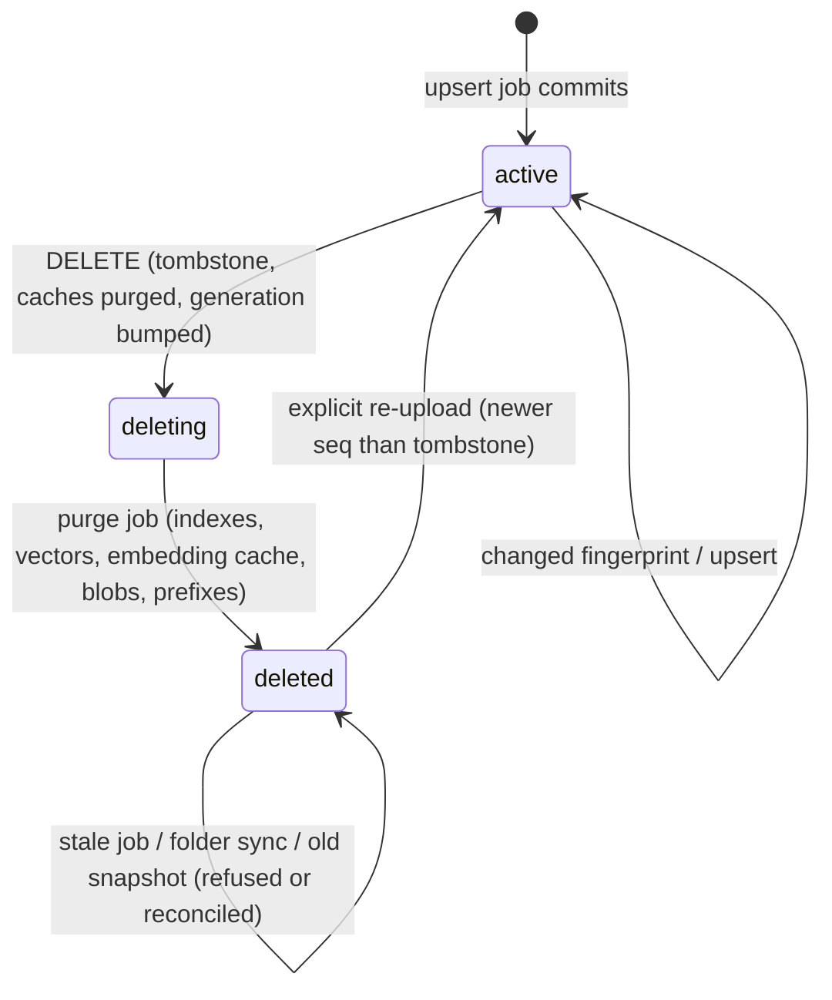
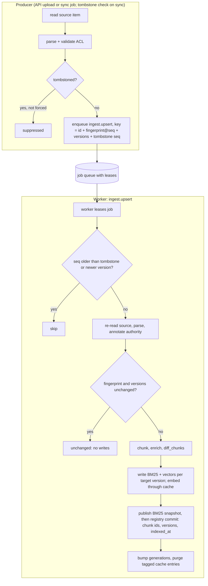
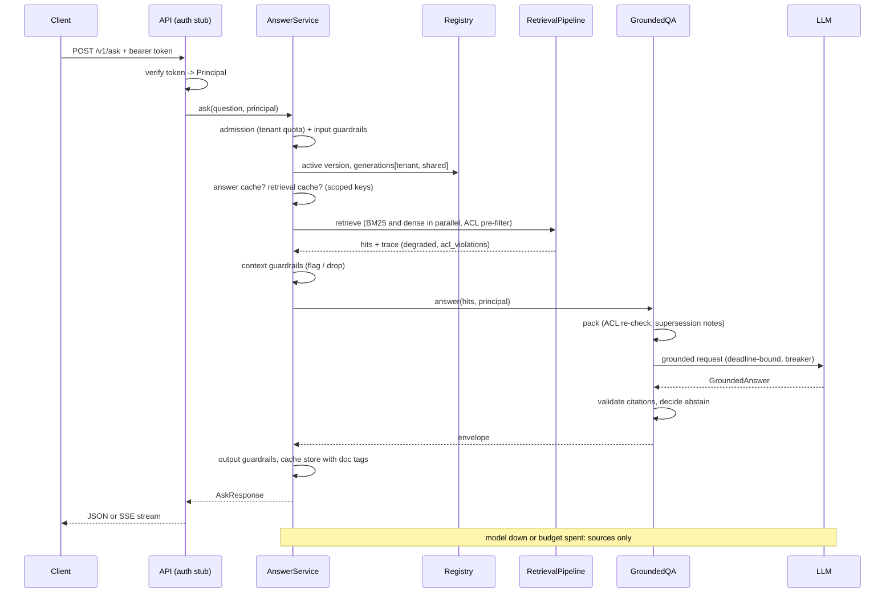
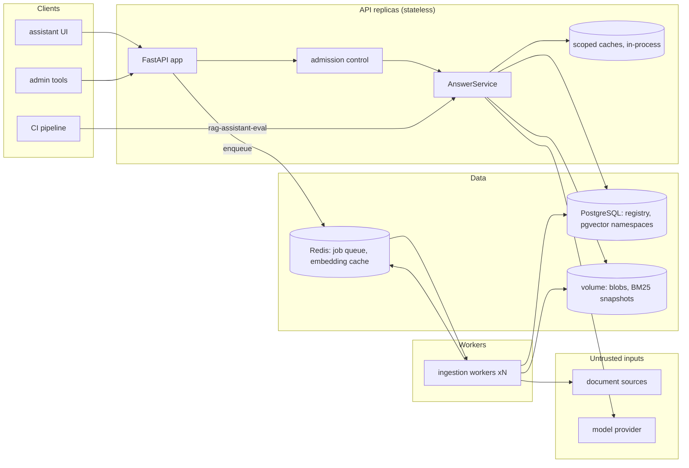

# Chapter 15 — Production RAG

This chapter turns the RAG components from Chapters 10 to 14 into a service that keeps working after the demo. Documents enter and leave through idempotent jobs, permissions hold on every path, caches never serve stale or foreign answers, and every dependency has a written failure mode.

**You will be able to:**

- Build indexing as a pipeline of idempotent jobs whose updates re-embed only the chunks that changed.
- Delete a document so that no copy survives in any index, cache or derived store, and prove that it cannot come back.
- Enforce permissions before retrieval scoring, and propagate ACL changes without re-embedding.
- Choose between per-tenant namespaces and a shared index, and key every cache on the variables that change its answer.
- Set per-stage latency budgets, a freshness SLO, and a degraded mode for each dependency.
- Gate a release on an evaluation that fails on a single permission leak.

**Prerequisites:** Chapters 10 to 13 (the `ragkit` pipeline: chunking, hybrid retrieval, reranking, grounded answers), Chapter 14 (the gold set and stage-isolated evaluation), and Chapter 9 (namespaces and filtered search). | **Code:** `book/projects/p3-rag-assistant/` (run: `cd book/projects/p3-rag-assistant && pytest -q`) | **Builds:** Project 3, the Northwind Assist knowledge service (package `rag_assistant`).

**First reading:** Why this matters, Mental model, Core concepts (except Multi-tenancy, Observability of each stage and Latency budgets), How it works, Evaluation and testing, Before you ship. **Deep dives** (skip on a first pass): Multi-tenancy, Observability of each stage, Latency budgets, Architecture, Implementation, Code walkthrough, Production considerations.

Project 3 is a FastAPI service and an ingestion worker over PostgreSQL with pgvector and Redis, assembled from `ragkit`, `semsearch`, `guardrails`, `reliability`, `evalkit` and `aie_core`. It ships with Docker Compose and an offline test suite.

**Components borrowed from later chapters.** Project 3 uses these before the chapters that build them; you need only their contracts:

| Component | Contract in one line | Built in |
|---|---|---|
| `reliability.JobQueue` | at-least-once delivery with leases, bounded retries, backoff, a dead-letter queue, and idempotency keys | Chapter 29 |
| `reliability.CircuitBreaker` | after repeated failures, fails calls instantly for a cool-down, then lets trial calls through | Chapter 29 |
| `reliability.AdmissionController` | per-tenant token buckets, plus load levels that shed work before rejecting it | Chapter 29 |
| `reliability.Deadline` | one time budget per request; each stage asks how much is left | Chapter 29 |
| `guardrails.TenantScopedCache` | a cache whose key and read-time check include tenant and groups; a mismatch raises | Chapter 27 |
| guardrail checks (`check_input`, `check_context`, `check_output`) | deterministic checks that allow, flag, redact or block text at three stages | Chapter 27 |
| `SpendGuard` | a per-tenant spend ceiling (discussed here, not wired into Project 3) | Chapter 30 |
| `aie_core` tracer | nested spans per request, exported to JSONL or OpenTelemetry | Chapters 3 and 31 |
| `evalkit.GateConfig` | release rules: must-pass-all metrics, floors, critical slices | Chapter 24 |

## Why this matters

Northwind's first RAG release was a notebook promoted to a container: a nightly full re-embed, tenant filtering after ranking, and answers cached by question text. It passed the demo and produced four incidents in its first quarter, none of them a model problem.

1. **The resurrected document.** Legal asked for a draft reorganization memo to be removed, and it was deleted from the vector index by hand. The next nightly rebuild read the folder, where the file still sat, and indexed it again. The memo stayed for nine more days.
2. **The cached leak.** A manager asked about an incident report visible only to `it-oncall` and `managers`. The answer went into the cache under the question text. An hour later an employee asked the same question and got the manager's answer, with a citation to a document they could not open.
3. **The stale policy.** PTO Policy 3.0 raised carryover from 5 to 10 days. Retrieval kept ranking the HR FAQ above the policy, because the FAQ's wording was closer to how employees ask, and the FAQ still said 5. This is Chapter 14's gold case RQ-001, and it turned out to be an ingestion problem, not a ranking problem.
4. **The 40-minute brownout.** The vector database was overloaded during a reindex. Every request waited for a ten-second timeout on dense retrieval and then failed. BM25 was healthy the whole time and could have answered most questions.

Each is a property of the system around retrieval and generation: how documents enter and leave, who may see what, what a cache key contains, and what happens when a dependency fails. Chapters 11 to 14 built the components; this chapter is about the joints between them.

## Mental model

> **Mental model:** The index is a cache of the registry, and every cache is a copy you must be able to delete.

A production RAG system has one system of record for documents, the registry: identity, version, permissions, lineage, and state. Everything downstream is a projection of it: the BM25 index and its snapshot on disk, the vector namespace, the embedding cache, the contextual prefixes, the retrieval and answer caches, and the uploaded original. Each projection can be rebuilt from the registry and the sources, must be invalidated when the registry changes, and must be purged on delete. For any feature, ask:

- Which projections does this change touch?
- What key tells a projection that it is stale?
- What stops an old copy from coming back?

The second model applies to every request: **the model is not the authorization system.** A document the principal cannot read must never enter the candidate list, the prompt, a user-visible trace, or a cache another principal can hit. Permissions apply before scoring and are re-checked before packing; filtering after generation is too late, because the model has already read the text.

The rest of the chapter applies both, starting with one edit and one question traced end to end.

## Core concepts

**One edit and one question, end to end.** At 09:00 People Operations edits one sentence about carryover in PTO Policy 3.0 (tenant `shared`, readable by `all`).

1. The folder sync sees new content, computes the document's fingerprint, and enqueues an `ingest.upsert` job that points at the file.
2. A worker leases the job, re-reads the file, and annotates authority: a policy, level 3, superseding the HR FAQ's "Time off" section. It chunks the document and diffs chunk ids against the registry: one chunk changed.
3. The worker embeds that one chunk (the rest hit the embedding cache), rewrites the document in BM25 and the vector namespace, commits the registry row, and bumps the `shared` scope's generation counter, a number every cached entry records.
4. At 09:03 a retail employee asks "How many unused PTO days can I carry over?" The API takes tenant `retail` and the employee's groups from the verified token.
5. The cache keys include the generations of `retail` and `shared`. The `shared` generation moved, so yesterday's cached answer misses.
6. BM25 and dense retrieval run in parallel, each restricted to chunks the employee may read before scoring. After fusion and reranking, the authority step ranks the FAQ's "Time off" chunk just below the policy.
7. The packer re-checks permissions and notes that the policy supersedes the FAQ. The model answers "10 days" citing the policy, and the answer is cached under the employee's scope, tagged with the cited documents.

**A. Document lifecycle** explains steps 1 to 3, plus deletion, ACL changes and freshness. **B. Request path** explains steps 4 to 7, plus tenancy, tracing, budgets and degraded modes.

### A. Document lifecycle

#### Indexing as a pipeline of jobs

"Rebuild everything nightly" burns embedding spend on unchanged text, ties freshness to the cron schedule, and cannot delete. Production indexing is a stream of small jobs, one per document change.

The **producer** (`IngestionService`) never writes an index. It parses a source item far enough to learn its id, tenant, ACL and content hash, rejects invalid documents (no ACL metadata means a 422 at upload, not a dead letter later), and enqueues a job. The **queue** is `reliability.JobQueue`, with leases, bounded attempts, backoff, and a dead-letter queue (DLQ). The **worker** runs two handlers, `ingest.upsert` and `ingest.purge`.

Jobs carry pointers, not documents, so a job delayed by a backlog or retry indexes what the source holds now.

**Idempotency** works at two levels, because the queue delivers at least once. The enqueue key combines the document id, its fingerprint with the sequence number at which it last became new, the target versions and the tombstone sequence. A sync of 24 unchanged documents therefore creates zero jobs, while a revert (A, then B, then A again) gets a new job. At processing time, the handler skips work when fingerprint and versions match the registry, and every index write replaces the whole document, so a job redelivered after a crash converges.

The **fingerprint** is the key decision. The obvious key, the content hash, is wrong: an ACL change from `["all"]` to `["hr"]` leaves the text unchanged, so it would be deduplicated away and the document would stay visible to everyone. The fingerprint covers everything that changes what the indexes hold: content hash, version, tenant, ACL groups, authority metadata, chunker, rules and pipeline versions, and the enrichment flag.

**Index versions** separate what is served from what is being built. The vector namespace is `index:model:version` (Chapter 9), so two embedding models never share a search space. A blue/green rebuild builds version N+1 beside the live version N and promotes it with one registry write.

#### Incremental updates

Most chunks of an edited document do not change. ragkit's chunk ids hash the chunker fingerprint, section path, content and position (Chapter 11), so an edit in section 1 leaves section 3's id untouched, and `diff_chunks` sorts ids into `added`, `unchanged` and `removed` against the registry.

The project keeps writes simple: it replaces the whole document in BM25, which costs microseconds, and re-indexes vectors through an embedding cache keyed by embedding-space fingerprint and exact text. Unchanged chunks hit the cache, so `test_update_reembeds_only_the_changed_chunks` edits one sentence and sees exactly one text embedded. With contextual enrichment (Chapter 12), a chunk can keep its id while its model-written prefix changes; the new prefix is new text, so it misses the cache and is re-embedded, and the handler reports it as `reembedded`.

#### Deletion and the tombstone

Deletion has two parts with different deadlines. The **logical delete** takes effect inside the API request, because the user, or the lawyer, needs the document gone now. The **physical purge** can run asynchronously, but it must remove every copy, verifiably.

`IngestionService.delete` does the logical part synchronously. It marks the registry row `status="deleting"` with a new `deleted_seq`, bumps the generation counter of the document's tenant scope (an integer per scope, incremented on every committed change; see Caching layers), removes cache entries tagged with the document, and enqueues a purge. Until every replica has loaded the purged indexes, `TombstoneFilter` drops hits from any non-`active` document. The purge removes the document from every index version and partition, the embedding cache (vectors can be partially inverted to text), prefixes, blobs and request caches, then marks the row `deleted`.

The row is kept. The **tombstone** prevents resurrection, which the memo incident shows is the normal failure. Each path back needs its own guard:

| Path back | Guard |
|---|---|
| A stale upsert job, planned before the delete and delivered after it | the job's `seq` is older than `deleted_seq`, so the handler returns `skipped_tombstone` |
| A folder sync that still sees the file | `submit_uri` refuses tombstoned ids, so the tombstone acts as a suppression list |
| An old BM25 snapshot or a restored backup | `IndexSet.reconcile()` removes anything the registry lists as deleting or deleted |
| A purge that crashed halfway | the purge is idempotent and re-runs; reconciliation is the backstop |

Re-adding a deleted document must be explicit: an admin upload carries the new tombstone sequence in its idempotency key, or the queue would return the old, succeeded job and do nothing.



#### Authority, effective dates, and supersession

For the carryover question, the HR FAQ keeps outranking PTO Policy 3.0 (Chapters 10, 12 and 14), and better embeddings will not fix it: the FAQ really is the closer textual match. The ranker lacks a fact the content owners know: the policy is authoritative, newer, and replaces the FAQ's time-off section. That fact belongs in metadata written at ingestion, not in a prompt asking the model to notice dates.

`domain/authority.py` reads a reviewed rules file and annotates documents and chunks with four fields:

- `authority`: an integer level, from external (0) and FAQ (1) through runbook, product and incident (2) to policy (3).
- `effective_date`: from front matter, then an "Effective date: YYYY-MM-DD" line near the top of the body, then `updated_at`.
- `supersedes`: on the newer document. ragkit's `EvidencePacker` reads it to write a conflict note that tells the model which block wins.
- `superseded_by`: on the older document's affected chunks only, so the FAQ's payroll answers are untouched.

`AuthorityReranker` runs after the relevance reranker and adds a boost proportional to authority level, scaled to the top score so it means the same for RRF scores and cross-encoder logits. Its hard rule: a chunk `superseded_by` a document that is also among the candidates scores just below that document's best chunk (if only the FAQ was retrieved, it is still the best evidence). It must survive a reranker failure by keeping the fused order and still applying authority; otherwise a reranker outage quietly brings back the FAQ-over-policy bug.

Chunk ids ignore metadata, so a rule change rewrites the indexes with every vector served from the cache.

#### ACL changes

An ACL change is an ordinary fingerprinted change. The upsert handler rewrites the chunks with new `acl_groups` in BM25 and every vector record (vectors come from the cache), bumps the old and new tenant scopes' generations, and purges cache entries tagged with the document. `test_acl_change_reaches_indexes_without_reembedding` restricts the PTO policy to `hr`: an employee's next request misses the cache and no longer retrieves it, zero texts are embedded, and an HR user still sees it.

Until the job runs, the old ACL is still in the indexes, so the propagation delay is the change's freshness lag. Treat permission tightening as high priority: give it a dedicated queue, or process it inline, if your SLO requires minutes.

#### Freshness SLOs

A freshness SLO states how quickly a change becomes searchable, for example "95 percent of changes within 5 minutes; deletions and permission tightening within 1 minute" (illustrative). The lag has four components, each with its own fix:

1. **Detection.** Polling every 15 minutes puts a 15-minute floor under the lag; webhooks or change feeds remove it.
2. **Queue wait.** Depth divided by throughput; this is what blows up under bulk loads.
3. **Processing.** Parse, chunk, embed, write. Embedding batches dominate.
4. **Publication.** For the BM25 snapshot path, the API must reload; in-process indexes or Postgres full-text search remove this step.

The registry measures from `submitted_at` (the producer observed the change) to `indexed_at` (the registry commit). It cannot see detection, so measure that with a canary document edited on a schedule. Nothing errors when freshness lag grows, so report it beside latency and error rate. Deletions meet a tighter target regardless of purge lag, because the logical delete is immediate.

### B. Request path

#### Permissions: filter at retrieval, re-check at packing, never after generation

A permission check can go in three places, and only two are correct.

**At retrieval, before scoring.** `BM25Index` computes the principal's allowed chunk set before scoring (Chapter 12), and `DenseRetriever` passes tenant and group filters to the vector store as a pre-filter. A forbidden chunk never takes a top-k slot, enters a score log, or shifts allowed ranks. Post-filtering also leaks through gaps: a top 10 that returns 7 results tells the user something hidden matched.

**At packing, again.** `EvidencePacker.pack(hits, principal)` re-applies `visible()` and records drops as `dropped_acl`, and `RetrievalPipeline` reports any forbidden final hit in `trace["acl_violations"]`, which Chapter 14's leak metric reads. Both checks always pass in a correct system; they exist because the pre-filter lives in another component, possibly a database, and no single layer is trusted with authorization. A non-empty `acl_violations` list is a security event.

**After generation: never.** The model has already read the text, and redacting a citation removes it from neither the answer nor the provider's logs.

The principal comes only from a verified token (`api/auth.py`, an HMAC stub that Chapter 39 replaces with JWT), never from request fields, the question, or a document. Two more rules:

- **Fail closed at ingestion.** A document without ACL metadata is rejected, never indexed as public. Mapping a source system's permissions (a wiki space, a shared drive) to `acl_groups` is authorization code: test it.
- **Group membership runs on the token's clock.** Removing a user from a group takes effect when their token expires, so keep token lifetimes as short as your revocation requirement. Scoped caches key on groups, so a changed group set cannot hit old entries.

#### Multi-tenancy: namespaces or a shared index

> **Deep dive.** Adds the shared-index versus per-tenant-namespace layouts and noisy-neighbor controls; skip on a first reading.

Northwind has tenants `retail` and `logistics` plus `shared` content; `RAG_TENANCY_MODE` selects the layout.

**Shared index with tenant filters** (`shared`, the default): one BM25 index and one vector namespace, with every query pre-filtered on `tenant` and `acl_groups`. It is simple to operate and stores shared documents once, but isolation depends on the filter being right on every code path, and restrictive filters force HNSW to over-fetch or scan iteratively (Chapter 9).

**Namespace per tenant** (`namespace`): each version has a partition per tenant plus `shared`, each with its own BM25 index and vector namespace. `build_pipeline` opens only the partitions the principal may read, so a retail query fuses `bm25@retail`, `bm25@shared`, `dense@retail` and `dense@shared` with RRF. Rank fusion is required because BM25 scores from indexes with different IDF statistics are not comparable. A retail query cannot touch logistics data even if a filter is wrong, because no retriever for it exists in the request.

| | Shared index + filter | Namespace per tenant |
|---|---|---|
| Isolation failure mode | filter bug leaks | misrouted partition leaks (rarer, easier to test) |
| Operations | one index | N indexes, N reindexes |
| Small-tenant search quality | good corpus statistics | weak IDF, small ANN graphs |
| Restrictive-filter ANN cost | over-fetch or iterative scan | none |
| Per-tenant deletion ("delete tenant X") | filtered delete | drop namespace |
| Fits | many small tenants, internal units | few large or regulated tenants, contractual isolation |

Northwind's tenants are business units of one company, so the shared index is the default; a SaaS product selling to banks would start with namespaces or separate databases.

**Noisy neighbors.** On the request path, `reliability.AdmissionController` gives each tenant a token bucket (429 with `Retry-After` when empty) and sheds work under global load: level 1 skips the reranker, level 2 returns sources without generation. On the ingestion path, use per-tenant queues or a per-tenant in-flight cap, so one tenant's bulk upload cannot push everyone past the freshness SLO.

#### Caching layers and their keys

There are three caches on the path. Chapter 30 owns cache economics; this section is about correctness.

| Cache | Key | Shared across principals? | Invalidated by |
|---|---|---|---|
| Embeddings | embedding-space fingerprint + exact text | yes, because a vector depends only on the text | space change (new key), document purge (`forget_doc`) |
| Retrieval results | tenant + groups (scoped) + normalized query + index version + generations of readable scopes + funnel config | no | generation bump, TTL, document tag purge |
| Answers | everything in the retrieval key + prompt version + model + guardrail policy version | no | as above, plus prompt/model change (new key) |

The embedding-space fingerprint (Chapter 8) in the key means a new model invalidates the cache instead of mixing spaces; `ForgettableEmbeddings` indexes keys per document so a purge can forget them.

The retrieval and answer caches are `ScopedCache`, built on `guardrails.TenantScopedCache`. The key includes the caller's tenant and sorted groups, so principals who could see different documents never share an entry, and a read re-checks the stored authorization context: a forged or colliding key raises `TenantIsolationError` instead of returning data.

Scope settles who may share an entry; **generations** settle when it is stale. The key includes the index version and the generation of every scope the principal reads (`retail` and `shared` for a retail employee). Any committed change bumps one of them in the shared registry, so every older entry becomes unreachable on every replica at once. Document tags let a delete physically remove every entry that cites the document.

Generations are deliberately coarse: any shared-document change invalidates every tenant's answers. At a few changes an hour that costs little hit rate and buys a simple correctness argument; at a change per second you would need per-document dependency tracking, which is rarely worth it.

TTLs (illustrative: 5 minutes for retrieval, 10 for answers) bound what generations cannot see, such as a source edited without a sync. Never cached: **degraded results**, which would pin lexical-only quality after recovery; **abstentions**, which the next ingestion might answer; and, in this implementation, **streamed answers**. A semantic cache for similar questions needs all these key parts plus a gold-set-validated similarity threshold (Chapter 30).

#### Observability of each stage

> **Deep dive.** Adds the span tree, the thread-pool tracing trap and the metric set; skip on a first reading.

Every request produces one span tree. The root `rag.request` carries ids, mode, cache result, index version and the degraded list; below it sit `guardrail.check`, `retrieval.pipeline` (with ragkit's retrieve, fusion and rerank spans), `rag.answer` and `rag.generate`. Ingestion produces `job.process`, then `ingest.upsert` or `ingest.purge`.

One trap: `RetrievalPipeline` runs retrievers in a thread pool, and tracing context lives in context variables, which threads do not inherit. The pipeline submits jobs through `contextvars.copy_context().run` so retriever spans stay in the request's trace; any code adding its own pools must do the same (Chapter 31).

The metrics an operator acts on, at `/metrics`:

- `rag_stage_latency_ms{stage}` for every stage and `total`.
- `rag_degraded_total{reason}`: a nonzero rate is page-worthy even while users get answers.
- `rag_security_events_total{kind}`: flagged context, output redactions, ACL violations.
- `rag_freshness_lag_s` and `rag_ingest_jobs_total{change}`.

`GET /v1/index/status` reports freshness lag against the SLO, queue depth, dead letters, the oldest pending purge, and breaker states.

#### Latency budgets

> **Deep dive.** Adds per-stage latency allowances and how the code enforces them; skip on a first reading.

A budget turns Northwind's targets (p95 time to first token under 2 s, completion under 8 s; illustrative, from Chapter 1) into per-stage allowances each owner can test. Illustrative values for a hosted model and a CPU cross-encoder:

| Stage | p95 budget (ms) | Notes |
|---|---|---|
| auth, admission, input guardrails | 20 | deterministic checks only; model-based classifiers would cost 100+ |
| cache lookups (answer, retrieval) | 5 | in-process; Redis adds about 1 ms per round trip |
| query embedding | 40 | cached for repeated questions |
| lexical ‖ dense retrieval | 60 | parallel: the budget is the max, not the sum |
| fusion | 2 | RRF over 2 to 4 lists of 40 |
| rerank, 20 candidates | 150 | cross-encoder; the lexical fallback takes about 1 ms |
| context guardrails + packing | 20 | |
| model time to first token | 1,100 | provider- and prompt-length-dependent |
| first complete sentence (safe streaming buffer) | 400 | Chapter 13: the first visible token is the first validated sentence |
| **time to first visible text** | **about 1,800** | 200 ms headroom under the 2 s target |

The retrieval rows are enforced. A retriever that misses `RAG_RETRIEVE_TIMEOUT_S` (0.3 s, illustrative) is recorded as degraded and skipped. `AuthorityReranker` enforces `RAG_RERANK_TIMEOUT_S` itself, so a slow reranker leaves the fused order with authority applied. pgvector reads carry a server-side `statement_timeout`. A breaker handles a dependency that is down; a timeout handles one that is slow, which is more common.

The request deadline (`RAG_REQUEST_DEADLINE_S`, 8 s) is a `reliability.Deadline` (Chapter 29). Each model call gets the remaining budget as its timeout, and if less than `RAG_MIN_GENERATION_S` remains after packing, the service returns sources instead of a timeout.

#### Failure handling and degraded modes

Every request-path dependency has a breaker (`reliability.CircuitBreaker`, one per dependency) and a degraded mode, decided as product behavior before any incident.

| Dependency down | Mode | User sees | Recorded |
|---|---|---|---|
| vector store / dense retrieval | lexical only | normal answer, sometimes weaker on paraphrases | `retrieve:dense#q0` |
| one of the BM25 partitions | dense only | normal answer, weaker on IDs | `retrieve:bm25…` |
| reranker (down or too slow) | fused order, authority still applied | normal answer | `rerank:fallback` |
| LLM (error, open breaker, budget spent) | sources only | "These documents matched your question", titles and snippets | `generate:…` |
| every retriever | unavailable | 503 with a retry message | `retrieve:all` |
| admission level 2 (overload) | sources only | as LLM down | `admission:level2`, `generate:shed` |

The breaker turns the 40-minute brownout into a non-event: after a few failures, dense retrieval fails in microseconds, and `RetrievalPipeline` skips and records it, so requests run lexical-only at normal latency until trial calls succeed (`test_breaker_opens_and_dense_fails_fast`). The model's breaker is checked before generation, so an open breaker goes straight to sources only instead of waiting for a known timeout.

"Sources only" shows the packed evidence after ACL re-checks and with flagged spans removed, never more than an answer would have cited. When retrieval abstains, the list is empty: hits not good enough to answer from are not good enough to show.

## How it works

### The ingestion path



The guards run in order of cost (tombstone and sequence before reading the source, fingerprint before chunking), so only a real change reaches the chunker.

The registry write is the commit point. Indexes and the BM25 snapshot are written first, so a replica that sees the new generation can load the new snapshot; written the other way round, a reader could cache old content under the new generation until its TTL. A crash before the commit leaves the old state, and redelivery redoes the work safely because every index write is a whole-document replace. The remaining race is two workers processing two versions of one document. The handler locks per document within a process; across processes, partition the queue by doc id or lock the registry row (exercise E2).

> **Sidebar: two narrower races.** Project 3 leaves two more races open; both matter once you scale out.
>
> - *Reconcile during a re-upload.* A reconcile that runs after the worker wrote vectors for a re-added tombstoned document, but before the registry commits it as `active`, removes those vectors. Do not reconcile while such a re-add is in flight.
> - *Lagging read replicas.* A replica behind the registry generation in the cache key can bring a deleted document back. Project 3 reads the primary only. With PostgreSQL, record `pg_current_wal_lsn()` (the primary's position in its change log) in the commit that bumps a generation, and use a replica only if its `pg_last_wal_replay_lsn()` has reached it.

### The request path



Cache keys come from the registry, never the request, so a client cannot send a version or scope. The request reads its version and generation stamp before loading snapshots, so a replica never caches old content under a new stamp.

Everything retrieved is untrusted (Chapter 26). The packer wraps evidence in `<untrusted_data>` tags and flags instruction-like paragraphs, context guardrails flag the vendor newsletter's injection, and the validator refuses claims supported only by flagged spans. None of this relies on the model: `test_controls_hold_even_when_the_model_obeys_the_injection` uses a fake model that obeys the injection, and the user still gets an abstention with the payload stripped.

## Architecture

> **Deep dive.** Adds the deployment layout; skip on a first reading.



Compose runs `postgres` (pgvector), `redis` with append-only persistence so the queue survives restarts, `api` and `worker`, which share a volume for blobs and BM25 snapshots. At scale, lexical search moves into PostgreSQL full-text search (ragkit's `sql/lexical_tsvector.sql`) or a search engine, removing the snapshot step.

## Implementation

> **Deep dive.** Adds excerpts of the files where the chapter's decisions live; skip on a first reading, but read Retrieval adapters before exercise P2.

The project tree, configuration and run instructions are in `book/projects/p3-rag-assistant/README.md`; elisions are marked `# ...`.

### Identity and keys

`doc_fingerprint` is the function every idempotency decision rests on; note what it includes beyond the content hash.

```python
# path: book/projects/p3-rag-assistant/rag_assistant/domain/keys.py  (excerpt; full file on disk)
def normalize_query(text: str) -> str:
    """Cache-key normalization only (never sent to retrieval): case, width, whitespace, final '?'."""
    text = unicodedata.normalize("NFKC", text).lower()
    return _TRAILING.sub("", _WS.sub(" ", text)).strip()


def doc_fingerprint(doc: Document, *, chunker: str, rules: str, pipeline_version: str, enrichment: bool) -> str:
    """Everything that changes what the indexes hold for this document.

    Content hash alone is not enough: an ACL change leaves the text (and its hash) unchanged
    but must reach every index and cache. Same for a new authority rule or a new chunker.
    """
    meta = doc.metadata
    return short_hash(
        doc.content_hash,
        doc.version,
        doc.tenant,
        ",".join(sorted(doc.acl_groups)),
        meta.get("authority"),
        meta.get("effective_date"),
        ",".join(meta.get("supersedes") or []),
        chunker,
        rules,
        pipeline_version,
        enrichment,
        length=24,
    )

# ...
def partitions_for_principal(principal: Principal, mode: str) -> list[str]:
    """Which partitions a principal's query may touch. Namespace mode never opens another tenant's."""
    if mode == "shared":
        return ["all"]
    return sorted({principal.tenant, SHARED_TENANT})

# ...
def principal_scopes(principal: Principal) -> list[str]:
    """Generation counters a principal's cached results depend on."""
    return sorted({principal.tenant, SHARED_TENANT})
```

### Authority rules

The rules file, `book/projects/p3-rag-assistant/rag_assistant/data/authority_rules.json`:

```json
{
  "comment": "Owned by the content owners, reviewed like code. Levels: higher wins when sources disagree.",
  "levels": [
    {"match": {"tags_any": ["external", "newsletter"]}, "level": 0, "kind": "external"},
    {"match": {"tags_any": ["faq"]}, "level": 1, "kind": "faq"},
    {"match": {"tags_any": ["incident", "postmortem"]}, "level": 2, "kind": "incident"},
    {"match": {"tags_any": ["runbook"]}, "level": 2, "kind": "runbook"},
    {"match": {"id_prefix": ["prod-"]}, "level": 2, "kind": "product"},
    {"match": {"tags_any": ["policy"]}, "level": 3, "kind": "policy"}
  ],
  "default_level": 1,
  "supersessions": [
    {
      "newer": "hr-pto-policy",
      "older": "hr-faq",
      "older_sections": ["Time off"],
      "reason": "PTO Policy 3.0 (effective 2026-01-01) supersedes HR FAQ time-off entries published before 2026"
    }
  ]
}
```

```python
# path: book/projects/p3-rag-assistant/rag_assistant/domain/authority.py  (excerpt; full file on disk)
class AuthorityRules(BaseModel):
    # ... (fields, load, and a fingerprint property that every document fingerprint includes)

    # ------------------------------------------------------------------ document level
    def level_for(self, doc: Document) -> tuple[int, str]:
        declared = doc.metadata.get("authority")
        if isinstance(declared, int):
            return declared, "declared"
        tags = {str(t).lower() for t in doc.metadata.get("tags") or []}
        for rule in self.levels:  # first match wins: order rules from most to least specific
            if tags & {t.lower() for t in rule.match.get("tags_any", [])}:
                return rule.level, rule.kind
            if any(doc.id.startswith(p) for p in rule.match.get("id_prefix", [])):
                return rule.level, rule.kind
        return self.default_level, "default"

    # ... (annotate_document writes authority, authority_kind, effective_date and supersedes)

    # ------------------------------------------------------------------ chunk level
    def annotate_chunks(self, chunks: list[Chunk]) -> list[Chunk]:
        """Mark the older document's affected chunks as superseded_by the newer document."""
        out: list[Chunk] = []
        for c in chunks:
            by = [s.newer for s in self.supersessions if s.older == c.doc_id and _section_matches(c, s)]
            if by:
                c = c.model_copy(update={"metadata": {**c.metadata, "superseded_by": sorted(set(by))}})
            out.append(c)
        return out
```

### The worker handlers

Read the guards in order, each cheaper than the one after it, then the commit order at the end of `_upsert`.

```python
# path: book/projects/p3-rag-assistant/rag_assistant/ingestion/handlers.py  (excerpt; full file on disk)
    def _upsert(self, p: IngestPayload, ctx: JobContext | None) -> IngestOutcome:
        d = self.d
        rec = d.registry.get(p.doc_id)
        if rec is not None and rec.deleted_seq is not None and p.seq < rec.deleted_seq:
            return IngestOutcome(doc_id=p.doc_id, change="skipped_tombstone")
        if rec is not None and rec.status == "active" and p.seq < rec.submitted_seq and p.reason != "reindex":
            return IngestOutcome(doc_id=p.doc_id, change="skipped_stale")
        # ... (read the source through its connector; a vanished source is a PermanentJobError)
        doc = d.processor.parse(raw, p.uri)
        # ... (the parsed id must match the job's doc id)
        fingerprint = d.processor.fingerprint(doc)
        targets = p.target_versions or d.index_set.writable_versions()
        active = rec is not None and rec.status == "active"
        if active and rec.fingerprint == fingerprint and set(targets) <= set(rec.index_versions):  # type: ignore[union-attr]
            return IngestOutcome(doc_id=doc.id, change="unchanged", unchanged=len(rec.chunk_ids),  # type: ignore[union-attr]
                                 versions=rec.index_versions)  # type: ignore[union-attr]

        if not (active and rec.fingerprint == fingerprint):  # type: ignore[union-attr]
            # The content changed since the job was planned (e.g. a reindex job reading a newer
            # source): a partial write would leave the active version stale, so write them all.
            targets = sorted(set(targets) | set(d.index_set.writable_versions()))
        chunks = d.processor.chunk(doc)
        prev_ids = rec.chunk_ids if active else []  # type: ignore[union-attr]
        diff = diff_chunks(prev_ids, chunks)
        # ... (contextual keys for the re-embed count, change classification)
        partition = partition_for_doc(doc.tenant, d.tenancy_mode)
        old_partition = partition_for_doc(rec.tenant, d.tenancy_mode) if active else partition  # type: ignore[union-attr]
        if ctx is not None:
            ctx.checkpoint()  # do not start index writes after losing the lease or during shutdown
        for version in targets:
            if old_partition != partition:  # tenant moved: remove from the partition it left
                d.index_set.get(version, old_partition).delete(doc.id)
            d.index_set.get(version, partition).write(doc.id, chunks)
        d.embeddings.track(doc.id, [indexed_text(c) for c in chunks])
        # ... (drop removed chunks' contextual prefixes, build the new DocRecord: chunk ids, versions, status="active", indexed_at)
        d.index_set.save_snapshots()  # before the commit: replicas never see a generation without its BM25
        d.registry.put(new_rec)  # commit point
        scopes = generation_scopes(doc.tenant) + (generation_scopes(rec.tenant) if rec else [])
        d.registry.bump(scopes)
        for cache in d.caches:
            cache.invalidate_docs([doc.id])
        # ... (return the IngestOutcome with added, unchanged, removed and reembedded counts)

    def _purge(self, p: IngestPayload) -> dict[str, Any]:
        d = self.d
        rec = d.registry.get(p.doc_id)
        if rec is not None and rec.status == "active" and rec.submitted_seq > p.seq:
            return {"doc_id": p.doc_id, "purged": False, "reason": "re-created after this delete"}
        removed: dict[str, tuple[int, int]] = {}
        for ix in d.index_set.existing():
            lexical, dense = ix.delete(p.doc_id)
            if lexical or dense:
                removed[f"{ix.version}/{ix.partition}"] = (lexical, dense)
        vectors_forgotten = d.embeddings.forget_doc(p.doc_id)
        blobs = d.blobs.delete_doc(p.doc_id)
        # ... (pop the document's contextual prefixes)
        cache_entries = sum(c.invalidate_docs([p.doc_id]) for c in d.caches)
        d.index_set.save_snapshots()
        if rec is not None:
            rec = rec.model_copy(update={"status": "deleted", "purged_at": now(), "chunk_ids": [],
                                         "context_keys": {}, "index_versions": [],
                                         "deleted_seq": max(rec.deleted_seq or 0, p.seq)})
            d.registry.put(rec)
            d.registry.bump(generation_scopes(rec.tenant))
        # ... (return what was removed from each store)
```

### The producer: uploads, sync, delete, blue/green

The producer validates early, builds idempotency keys, and does the synchronous half of a delete.

```python
# path: book/projects/p3-rag-assistant/rag_assistant/ingestion/service.py  (excerpt; full file on disk)
class IngestionService:
    # ...
    def _enqueue_upsert(self, doc_id: str, tenant: str, connector: str, uri: str, content_hash: str,
                        fingerprint: str, *, targets: list[str] | None = None, reason: str = "change") -> dict[str, Any]:
        rec = self.d.registry.get(doc_id)
        tomb = (rec.deleted_seq or 0) if rec else 0
        seq = self.d.registry.next_seq()
        payload = IngestPayload(op="upsert", doc_id=doc_id, connector=connector, uri=uri, content_hash=content_hash,
                                seq=seq, submitted_at=now(), target_versions=targets or [], reason=reason)
        head_key = f"upsert_head:{short_hash(doc_id)}"
        head = state_json(self.d.registry, head_key)
        if not isinstance(head, dict) or head.get("fp") != fingerprint:  # a new fingerprint: a new change
            head = {"fp": fingerprint, "seq": seq}
            self.d.registry.set_state(head_key, json.dumps(head))
        key = f"upsert:{doc_id}:{fingerprint}@{head['seq']}:{','.join(targets or ['*'])}:{tomb}"
        job = self.queue.enqueue("ingest.upsert", payload.model_dump(mode="json"), idempotency_key=key,
                                 tenant_id=tenant)
        return {"doc_id": doc_id, "job_id": job.id, "state": job.state.value, "deduplicated": job.payload["seq"] != seq}

    def submit_uri(self, connector: str, uri: str, *, force: bool = False) -> dict[str, Any]:
        raw = self.d.connectors[connector].read(uri)
        doc = self.d.processor.parse(raw, uri)
        rec = self.d.registry.get(doc.id)
        if rec is not None and rec.status != "active" and not force:
            # The tombstone is the suppression list: a sync that still sees the file must not
            # bring a deleted document back. Re-adding is an explicit decision (force or upload).
            return {"doc_id": doc.id, "suppressed": True}
        return self._enqueue_upsert(doc.id, doc.tenant or "shared", connector, uri, doc.content_hash,
                                    self.d.processor.fingerprint(doc))

    def delete(self, doc_id: str) -> dict[str, Any]:
        rec = self.d.registry.get(doc_id)
        if rec is None or rec.status == "deleted":
            return {"doc_id": doc_id, "status": "absent"}
        seq = self.d.registry.next_seq()
        if rec.status == "active":
            rec = rec.model_copy(update={"status": "deleting", "deleted_seq": seq, "deleted_at": now()})
            self.d.registry.put(rec)  # invisible from this point: retrieval filters "deleting"
            self.d.registry.bump(generation_scopes(rec.tenant))
            for cache in self.d.caches:
                cache.invalidate_docs([doc_id])
        payload = IngestPayload(op="purge", doc_id=doc_id, seq=rec.deleted_seq or seq, submitted_at=now(),
                                reason="delete")
        job = self.queue.enqueue("ingest.purge", payload.model_dump(mode="json"),
                                 idempotency_key=f"purge:{doc_id}:{rec.deleted_seq}", tenant_id=rec.tenant)
        return {"doc_id": doc_id, "status": "deleting", "job_id": job.id}

    # ... (sync; blue/green: start_reindex, promote, which refuses until every document is in the new version, and rollback)
```

### Scoped caches

The key carries the authorization scope, index version, and generations; the read path re-checks authorization.

```python
# path: book/projects/p3-rag-assistant/rag_assistant/caching/caches.py  (excerpt; full file on disk)
class ForgettableEmbeddings(CachedEmbeddings):
    """CachedEmbeddings plus a per-document index of cache keys, kept in the same store."""
    # ... (__init__, track: record the cache keys that belong to a document)

    def forget_doc(self, doc_id: str) -> int:
        with self._lock:
            keys = self._tags(doc_id)
            for key in keys:
                self.store.pop(key, None)
            self.store.pop(_TAG_PREFIX + doc_id, None)
        return len(keys)


class ScopedCache(TenantScopedCache[T], Generic[T]):
    """guardrails.TenantScopedCache (authorization-checked reads) with TTL, document tags,
    generation stamps and a size bound. In-process: one per API replica."""
    # ... (__init__ with TTL, size bound and an ordered metadata map)

    def get(self, ctx: GuardContext, *parts: Any) -> T | None:  # type: ignore[override]
        key = self.key(ctx, *parts)
        with self._lock:
            meta = self._meta.get(key)
            if meta is None or meta.expires_at <= self._clock():
                if meta is not None:
                    self._drop(key)
                self.misses += 1
                return None
            value = super().get(ctx, *parts)  # raises TenantIsolationError on a context mismatch
            self._meta.move_to_end(key)
            self.hits += 1
            return value

    def put(self, ctx: GuardContext, value: T, *parts: Any, doc_ids: Iterable[str], stamp: Any = None,
            ttl_s: float | None = None) -> str:
        key = self.key(ctx, *parts)
        with self._lock:
            super().set(ctx, value, *parts)
            self._meta[key] = _Meta(self._clock() + (self.ttl_s if ttl_s is None else ttl_s),
                                    frozenset(doc_ids), stamp)
            self._meta.move_to_end(key)
            while len(self._meta) > self.max_entries:
                oldest = next(iter(self._meta))
                self._drop(oldest)
        return key

    # ... (discard_key, the single removal path, drops TTL and tag metadata with the entry)

    def invalidate_docs(self, doc_ids: Iterable[str]) -> int:
        """Physically remove every entry that contains any of these documents."""
        doomed_docs = set(doc_ids)
        with self._lock:
            doomed = [k for k, m in self._meta.items() if m.doc_ids & doomed_docs]
            for k in doomed:
                self._drop(k)
        return len(doomed)
    # ... (sweep drops entries whose generation stamp is stale or whose TTL passed)
```

### Retrieval adapters

`build_pipeline` (on disk) wraps each readable partition's retriever in a breaker and a `TombstoneFilter`, and wraps the relevance reranker in `AuthorityReranker`:

```python
# path: book/projects/p3-rag-assistant/rag_assistant/retrieval/wiring.py  (excerpt; full file on disk)
class TombstoneFilter:
    """Drop hits from documents in `hidden` (status "deleting"). Asks the inner retriever for a
    few extra candidates so the caller still gets k results while purges are in flight."""

    # ...
    def retrieve(self, query: RetrievalQuery) -> RetrievalResult:
        if not self.hidden:
            return self.inner.retrieve(query)
        padded = query.model_copy(update={"k": query.k + 4 * len(self.hidden)})
        result = self.inner.retrieve(padded)
        kept = [h for h in result.hits if h.chunk.doc_id not in self.hidden][: query.k]
        kept = [h.model_copy(update={"rank": i}) for i, h in enumerate(kept, start=1)]
        trace = {**result.trace, "tombstoned_dropped": len(result.hits) - len(kept)}
        return RetrievalResult(query=query, hits=kept, trace=trace)


class AuthorityReranker:
    name = "authority"

    # ... (__init__, and _relevance, which runs the relevance reranker under its own timeout)

    def rerank(self, query: RetrievalQuery, candidates: list[ScoredChunk], k: int) -> list[ScoredChunk]:
        failed = False
        try:
            ranked = self._relevance(query, candidates) if self.inner else list(candidates)
        except Exception:  # reranker down, breaker open or too slow: keep fused order, still apply authority
            ranked, failed = list(candidates), True
        # The boost is relative to the top score, so it means the same thing for RRF scores
        # (around 0.03), lexical-overlap scores (0 to 1.5) and cross-encoder logits.
        scale = max((abs(h.score) for h in ranked), default=1.0) or 1.0
        adjusted: list[ScoredChunk] = []
        for h in ranked:
            level = int(h.chunk.metadata.get("authority", 1) or 0)
            signals = {**h.signals, "authority": float(level), "pre_authority": round(h.score, 6)}
            if failed:
                signals["rerank_failed"] = 1.0  # RetrievalPipeline records "rerank:fallback" as degraded
            adjusted.append(h.model_copy(update={"score": h.score + self.weight * level * scale, "signals": signals}))
        best_by_doc: dict[str, float] = {}
        for h in adjusted:
            best_by_doc[h.chunk.doc_id] = max(best_by_doc.get(h.chunk.doc_id, float("-inf")), h.score)
        final: list[ScoredChunk] = []
        for h in adjusted:
            newer = [d for d in h.chunk.metadata.get("superseded_by") or [] if d in best_by_doc]
            if newer:
                ceiling = min(best_by_doc[d] for d in newer) - 1e-6
                if h.score > ceiling:
                    h = h.model_copy(update={"score": ceiling, "signals": {**h.signals, "superseded": 1.0}})
            final.append(h)
        final.sort(key=lambda x: (-x.score, x.rank))
        return [h.model_copy(update={"rank": i, "stage": "rerank"}) for i, h in enumerate(final[:k], start=1)]
```

### The request path

`_prepare` builds the cache keys from the registry and never caches a degraded result. `_generation_blocked` decides, before any model call, whether the request must fall back to sources only.

```python
# path: book/projects/p3-rag-assistant/rag_assistant/answering/service.py  (excerpt; full file on disk)
    def _prepare(self, question: str, principal: Principal, rid: str, level: int, *,
                 use_answer_cache: bool) -> _Prepared:
        # ... (deadline, input guardrails, early return when blocked)

        # Stamp first, then load snapshots: the worker publishes a snapshot before bumping the
        # generation, so the indexes read here are never older than the stamp cached results carry.
        prep.version = self.index_set.active_version
        prep.gens = self.registry.generations(principal_scopes(principal))
        with _Clock(timings, "refresh"):
            self._refresh_view()

        # ... (answer cache lookup; its key adds prompt, model and guardrail policy versions)

        result: RetrievalResult | None = None
        rkey = ("v1", normalize_query(prep.question), prep.version, tuple(sorted(prep.gens.items())), level,
                self.s.final_k, self.s.reranker)
        if self.s.retrieval_cache:
            result = self.caches.retrieval.get(guard_context(principal), *rkey)
            self.metrics.inc("rag_cache_lookups_total", cache="retrieval", result="hit" if result else "miss")
            prep.cache = "hit" if result is not None else "miss"
        if result is None:
            # every non-active status: a replica's BM25 snapshot may still hold a purged ("deleted") doc
            hidden = frozenset(r.doc_id for r in self.registry.all() if r.status != "active")
            pipeline = build_pipeline(self.index_set, principal, self.s, breakers=self.breakers, hidden=hidden,
                                      degrade_level=level, tracer=self.tracer, version=prep.version,
                                      executor=self._executor)
            try:
                with _Clock(timings, "retrieve"):
                    result = pipeline.retrieve(RetrievalQuery(text=prep.question, principal=principal,
                                                              k=self.s.final_k))
            except RetrievalError:
                prep.degraded.append("retrieve:all")
                prep.early = AskOutcome(AskResponse(request_id=rid, mode="unavailable", degraded=prep.degraded,
                                                    index_version=prep.version, timings_ms=timings,
                                                    message="Search is temporarily unavailable."))
                return prep
            if self.s.retrieval_cache and not result.trace.get("degraded") and level == 0:
                # never cache a degraded result: it would pin lower quality after recovery
                self.caches.retrieval.put(guard_context(principal), result, *rkey, doc_ids=result.doc_ids,
                                          stamp=self._stamp(prep))
        for stage, ms in (result.trace.get("latency_ms") or {}).items():
            self.metrics.observe("rag_stage_latency_ms", ms, stage=f"retrieval.{stage}")
        prep.degraded.extend(result.trace.get("degraded") or [])
        if result.trace.get("acl_violations"):
            prep.security.append(f"acl_violation:{len(result.trace['acl_violations'])}")
        prep.retrieval = result

        with _Clock(timings, "guard_context"):
            prep.hits = self._guard_context(result.hits, prep)
        return prep

    # ... (_admit, _refresh_view, _guard_context, _guard_output and _sources_only)

    def _generation_blocked(self, prep: _Prepared) -> str | None:
        """The degraded reason that rules out generation, or None (_sources_only records it)."""
        if prep.degrade_level >= 2:
            return "generate:shed"
        if not prep.deadline.fits(self.s.min_generation_s):
            return "generate:deadline"
        if self.breakers.get("llm").state is CircuitState.OPEN:  # fail fast: do not wait for a timeout
            return "generate:breaker_open"
        return None
```

### The CI gate

Leaks and invalid citations are hard failures; the rest are floors and critical slices.

```python
# path: book/projects/p3-rag-assistant/rag_assistant/eval/run_eval.py  (excerpt; full file on disk)
# Absolute floors, set from the offline reference run minus a margin (illustrative). Leaks and
# invalid citations are never averaged: one case fails the gate.
P3_GATE = GateConfig.from_dict({
    "name": "p3-release",
    "metrics": [
        {"metric": "no_permission_leak", "must_pass_all": True},
        {"metric": "citations_valid", "must_pass_all": True},
        {"metric": "recall@5", "min_mean": 0.85},
        {"metric": "hit@1", "min_mean": 0.70},
        {"metric": "evidence_packed", "min_mean": 0.80},
        {"metric": "abstention_correct", "min_mean": 0.80},
    ],
    "critical": [{"tag": "forbidden-doc", "metric": "no_permission_leak"},
                 {"tag": "conflicting-versions", "metric": "hit@1"}],
    "max_error_rate": 0.0,
    "max_evaluator_errors": 0,
})
```

## Code walkthrough

> **Deep dive.** Adds the non-obvious reasons behind the excerpts; skip on a first reading.

**Fingerprints, not content hashes.** Remove `acl_groups` from `doc_fingerprint` and `test_acl_change_reaches_indexes_without_reembedding` fails, because the sync deduplicates the change. Remove the rules fingerprint and a new supersession rule reaches only documents edited after it.

**The forced widening of `targets` closes a race.** A reindex job for `v2` may read a source that changed after the job was planned. Writing only `v2` would leave the active `v1` serving old content, so a fingerprint mismatch writes every writable version.

**The retrieval key includes the degrade level,** because a level-1 result (no reranker) is a different result. And every `ScopedCache` removal goes through one method, so no path leaves TTL or tag metadata behind to count a phantom hit.

**Streaming binds the budget explicitly.** `ask` runs generation inside `deadline.scope()`, but a streaming generator is resumed by the ASGI server from different contexts, where a context-variable token cannot be reset. `stream` therefore wraps the LLM in `DeadlineBoundLLM(llm, deadline)`.

**The eval target is the service.** `service_target` (in `eval/run_eval.py`) calls `container.answers.ask`, the method the API calls. Sources-only, blocked and unavailable outcomes count as abstentions, so a degraded run is scored as the user experienced it.

## Production considerations

> **Deep dive.** Adds cost and capacity arithmetic, security details and operations; skip on a first reading.

**Latency.** Keep only deterministic guardrails on the request path (Chapter 27). At millions of chunks, reload BM25 snapshots in the background and swap atomically, or move lexical search into the database.

**Cost per answer** is dominated by generation input (Chapter 30 owns the cost model). A 2,500-token evidence budget plus about 500 tokens of prompt and question, with 300 output tokens, costs `0.003·p_in + 0.0003·p_out` dollars at illustrative per-million-token prices; embedding and reranking are orders of magnitude smaller. The levers, largest first: the evidence budget (check `evidence_packed` in Chapter 14's evaluation when you cut it), the answer cache hit rate (also the riskiest; measure it per tenant before raising TTLs), and routing easy questions to a cheaper model (Chapter 7). Quotas bound volume, not spend, so pair them with a per-tenant spend ceiling (`SpendGuard`). Ingestion cost scales with changed chunks, and contextual enrichment adds one model call of about 1,500 input tokens per changed chunk.

**Ingestion throughput.** At 0.5 s per document (parse 20 ms, chunk 10 ms, embed 300 ms, write 150 ms), one worker sustains 2 documents per second, so a 50,000-document migration takes 7 hours on one worker and 42 minutes on ten. Run it at batch priority or on its own queue so it cannot starve everyday changes.

**Index size and scaling.** API replicas are stateless apart from generation-checked caches, so they scale horizontally; index size sets the hardware. Northwind has 24 documents and 231 chunks. A 4,000-employee company might hold 200,000 documents, about 2 million chunks:

- Vectors at 1,024 float32 dimensions: 2,000,000 × 1,024 × 4 bytes, about 8.2 GB, doubled because pgvector's HNSW index keeps its own copy.
- HNSW graph links at m=16: about 0.3 GB.
- Chunk text and metadata at about 2 KB each: 4 GB, plus BM25 postings at 1 to 2× that.

That is one large PostgreSQL instance held in RAM. A read replica doubles query capacity, subject to the replica rule in the sidebar under How it works. Halving dimensions (if the model supports truncation) halves the vector share and int8 quantization quarters it; validate either on the gold set.

**Security.**

- `create_app` refuses the published dev auth secret unless `RAG_ALLOW_DEV_AUTH_SECRET=true`, which only local Compose sets, because anyone who read the source can mint tokens with it.
- Admins manage documents only in their own tenant and `shared`, checked against the upload and any existing record (check-then-act: an id still queued is not protected).
- Traces carry ids and hashes, not document text (Chapter 31).
- Embedding cache values can be partially inverted to text: give query entries a TTL and treat Redis as holding user data.
- Lookups by chunk id (citations, stored answers) go through `IndexSet.get_chunks(ids, principal)`, which applies the ACL check and omits non-`active` documents.

**Operations.** A poison document in the DLQ is a document users cannot find, and a reconcile that removes anything means a purge failed or a backup was restored; both deserve alerts (see Before you ship). Blue/green promotion refuses until every active document is in the new version; keep the old version for a rollback window, then `IndexSet.drop_version`. Never restore the registry to a point before a deletion: snapshot tombstones separately, or replay them after a restore.

## Common mistakes

- **Keying ingestion idempotency on content hash.** ACL changes and metadata fixes are silently dropped.
- **Deleting from the vector index only.** BM25, caches, prefixes, originals and snapshots still hold the document.
- **Hard-deleting the registry row.** Without a tombstone, the next sync, retry or restore brings it back.
- **Post-filtering by tenant after top-k.** It leaks through rank gaps and puts forbidden text in score logs.
- **Answer cache keyed on question text.** The Northwind leak.
- **Caching degraded results.** One vector-store blip pins lexical-only quality for the TTL.
- **Supersession as a prompt instruction** ("prefer newer documents"). The owners know which document wins; write it down.
- **Comparing BM25 scores across per-tenant indexes.** IDF differs per index; fuse by rank.
- **One FIFO queue for bulk loads and everyday edits.** A migration starves everyone's freshness.
- **Timeouts without breakers.** Every request pays the full timeout of a dependency already known to be dead.

## Failure modes

**Resurrection after deletion.**
- *Telemetry:* a tombstoned id in `retrieval.doc_ids` or a citation; reconciliation removing ids at startup; `rag_ingest_jobs_total{change="skipped_tombstone"}` spiking after a restore.
- *Test:* `test_stale_job_cannot_resurrect_a_deleted_document`, `test_folder_sync_respects_the_tombstone`, `test_old_snapshot_is_reconciled_against_the_registry`.

**Cross-scope cache hit.**
- *Telemetry:* a cache hit citing documents the requester cannot see. Shadow-check `visible(chunk, principal)` for cited chunks on cache hits and alert on any false.
- *Test:* `test_cache_keys_include_the_authorization_scope`.

**Stale-version answer.**
- *Telemetry:* `answer_with_caveat` notices ("a newer document may change part of this answer") and the validator code `stale_source_preferred`.
- *Test:* the `conflicting-versions` critical slice and `test_authority_metadata_fixes_faq_over_policy`.

**Freshness drift.**
- *Telemetry:* p95 `rag_freshness_lag_s` above the SLO, rising queue depth, growing `oldest_pending_purge_s`.
- *Test:* status-endpoint assertions, plus a canary document measured continuously in production.

**Silent degradation.**
- *Telemetry:* nonzero `rag_degraded_total{reason="retrieve:dense#q0"}` with a flat error rate; answers worse on paraphrases.
- *Test:* degraded-mode tests, and an alert on any sustained degraded rate.

**Poison document.**
- *Telemetry:* dead letters with `InvalidDocument`; the same doc id repeatedly in failing `job.process` spans.
- *Test:* `test_invalid_document_without_acl_is_rejected_before_queueing`.

**Index and registry divergence after a crash.**
- *Telemetry:* registry chunk ids missing from BM25 or the vector store, or the reverse, found by a weekly per-document count audit.
- *Test:* the redelivery idempotency test, plus reconciliation.

**Injection carried in a document.**
- *Telemetry:* `rag_security_events_total{kind="context_flagged"}` from one document id, and output redactions.
- *Test:* the two injection tests (honest and compromised model).

## Tradeoffs

**Synchronous versus queued ingestion.** Queuing adds a moving part and a lag, but gives retries, backpressure, scale, and isolation of slow parsers from the API. Synchronous ingestion (`RAG_INLINE_INGEST`) suits only development and small admin uploads.

**Authority as data versus learned ranking.** Rules files are explicit, reviewable and immediate, but need owners and rot. A learned ranker can absorb authority from click data, but is opaque and needs volume. Start with rules for the few document pairs the gold set and feedback reveal.

**Answer caching versus freshness and personalization.** Every key part added for correctness lowers the hit rate. Answer caches pay off for high-volume, low-personalization questions such as policy FAQs, rarely for incident questions.

**Sources-only versus a smaller fallback model.** A cheaper model can keep answering when the primary fails (Chapter 7), but must pass the same gate. Sources only is always safe, so the project uses it.

## Evaluation and testing

### The release gate

`rag-assistant-eval` builds a container as the API does, ingests the docs through the queue and worker, and evaluates `AnswerService.ask` on the 40-question gold set with Chapter 14's machinery, caches off. The gate (`P3_GATE`) has three kinds of rules:

- **Must pass all:** `no_permission_leak` and `citations_valid`. A single case fails the release.
- **Absolute floors** on recall@5, hit@1, evidence packed, and abstention correctness.
- **Critical slices:** no leak on any `forbidden-doc` case, and hit@1 on every `conflicting-versions` case.

`--baseline-run` adds Chapter 14's regression rules. Exit code 1 means the gate failed and 2 means setup failed, so CI can tell a worse candidate from a broken evaluation.

The default configuration passes with zero leaks. The ablations show why the critical slices exist:

| Configuration | recall@5 | hit@1 | abstention correct | gate |
|---|---|---|---|---|
| default | 0.986 | 0.811 | 0.875 | pass |
| authority layer off | 0.986 | 0.784 | 0.875 | fail: conflicting-versions |
| no reranker | 1.000 | 0.946 | 0.85 | fail: conflicting-versions |

Removing the toy lexical reranker *raises* hit@1 from 0.81 to 0.95, so without the critical slice it would ship as an improvement while failing RQ-002, where the parental leave policy now ranks first. The slice blocks it and forces an explicit trade (exercise P2). The numbers come from an offline fake model and vocabulary embeddings: they demonstrate the gate, not quality.

### Online feedback

Every response carries a request id, which joins user feedback to the trace (Chapter 31). Watch the abstention rate per tenant and topic, the share of answers with caveats, the citation-click rate, the degraded-mode rate, and "wrong source" reports per document, which is how you find the next FAQ-over-policy pair. Flagged questions become gold cases once a human labels the required documents (Chapter 25).

### The offline test suite

The suite runs offline in about 12 seconds, from the project directory or the repository root:

```bash
cd book/projects/p3-rag-assistant && pytest -q
pytest -q book/projects/p3-rag-assistant/tests
```

Its groups mirror the chapter: ingestion idempotency and incremental embedding, deletion and the three resurrection paths, permissions in both tenancy modes, scoped caches against forged keys, injection with an honest and a compromised model, every degraded mode, the API and SSE contracts, the gate failing on one injected leak, and the full stack on the SQL registry and Redis (fakeredis).

It does not prove real pgvector behavior (run the Compose stack), real-model groundedness (Chapter 14's `--judges llm`), or concurrency across worker processes. Mark integration tests that use `DATABASE_URL` and `REDIS_URL` with `@pytest.mark.integration` and run them in a CI job that starts Compose.

## Before you ship

- [ ] The ingestion idempotency key is the full document fingerprint (content, ACL, authority metadata, chunker, rules and pipeline versions), and a test proves that an ACL-only change is re-ingested.
- [ ] A delete makes the document invisible inside the API request, and a test asserts that after the purge no copy remains in BM25, vectors, the embedding cache, contextual prefixes, blobs or request caches.
- [ ] Tombstone rows are never hard-deleted, and tests cover resurrection by a stale job, a folder sync and an old snapshot.
- [ ] `reconcile()` runs at startup and on a schedule, with an alert whenever it removes anything; the restore runbook replays tombstones before the service takes traffic.
- [ ] Every retriever pre-filters on tenant and groups before scoring, the packer re-checks, and a non-empty `acl_violations` list raises a security event.
- [ ] The principal comes only from a verified token, and the service refuses to start with a development auth secret.
- [ ] Retrieval and answer cache keys include tenant, groups, index version and the generations of every readable scope (answers add prompt version, model and guardrail policy); degraded results and abstentions are never cached.
- [ ] Every request-path dependency has a circuit breaker, a stage timeout and a written degraded mode, each covered by a test.
- [ ] Per-stage p95 latency is measured from `rag_stage_latency_ms` against the budget, and a request near its deadline returns sources only instead of timing out.
- [ ] A freshness SLO is written down (tighter for deletions and permission tightening), with alerts on `rag_freshness_lag_s`, queue depth and the oldest pending purge, and a canary document that measures source-to-searchable lag.
- [ ] Bulk loads run on their own queue or under a per-tenant in-flight cap, and dead letters have an owner and a dashboard.
- [ ] The release gate runs the same `AnswerService` as the API and fails on one permission leak, one invalid citation, or any failing critical slice.

## Exercises

**Start here:** K1, K4, E1, P2, D3 (about 5 hours). The rest go deeper.

### Knowledge questions

**K1.** Why is a content hash insufficient as an ingestion idempotency key? Name two changes that would be lost.

**K2.** List every place a Northwind document's information lives after ingestion in Project 3, and say which of them the logical delete reaches immediately.

**K3.** Explain why per-tenant namespaces require rank fusion rather than score fusion across partitions.

**K4.** What does the generation counter in a cache key protect against that a TTL alone does not? What does the TTL protect against that generations do not?

**K5.** Why must the authority adjustment survive a reranker failure? What would users observe if it did not?

**K6.** State the four components of freshness lag and which one the registry cannot measure.

### Engineering questions

**E1.** Northwind wants permission tightening to take effect within 30 seconds, while normal edits keep a 5-minute SLO. Design the change to the ingestion path and say what you would measure.

**E2.** Two workers may process two upsert jobs for the same document concurrently. Compare queue partitioning by doc id with a registry row lock (`SELECT ... FOR UPDATE`), covering throughput, failure behavior, and implementation cost on PostgreSQL plus Redis.

**E3.** A tenant contract requires that their data can be deleted completely within 24 hours, including from backups. Which parts of Project 3 satisfy this, and what must you add?

**E4.** Design a cache for query embeddings that is safe to share across tenants. Then argue whether the retrieval cache could also be shared across principals with identical tenant and group sets.

### Practical exercises

**P1.** (about 2 hours) Add a per-tenant cap on in-flight ingestion jobs, so that a bulk upload from `logistics` cannot push `retail` freshness beyond its SLO. Write a test that enqueues 200 logistics jobs and 5 retail jobs and asserts the retail lag.

**P2.** (about 3 hours) Diagnose the no-reranker failure: with `RAG_RERANKER=none`, authority still runs, yet RQ-002 ranks the parental leave policy first. Use the trace to find the stage responsible and explain why the authority boost cannot fix it, implement an adjustment so the `conflicting-versions` slice passes without the reranker, then compare the gate results of the three configurations.

**P3.** (about 2 hours) Implement a source-change canary: a synthetic document whose content embeds a timestamp, edited every minute by a scheduled job. Measure end-to-end freshness (source edit to searchable) from outside the service and expose it as a metric.

**P4.** (about 3 hours) Add a `PgLexicalIndex` adapter using ragkit's `sql/lexical_tsvector.sql`, so the API no longer needs BM25 snapshots. Keep the `Retriever` contract and the pre-filter on tenant and groups, and run the existing tests against both lexical backends.

### Debugging exercises

**D1.** After a weekend restore of the vector database from Friday's backup, users report a cancelled travel policy appearing in answers. The registry shows the policy as `deleted` since Saturday. The answer cache is empty after the restart. What happened, which telemetry confirms it, and what should have prevented it?

**D2.** Retail's answer quality on paraphrased questions dropped for two hours on Tuesday, but error rates and latency were normal. The trace for a sample request shows `degraded: ["retrieve:dense#q0"]`, and the dense breaker shows `open` in `/healthz`. The vector database dashboard shows it healthy since 09:05, while degradation lasted until 11:10. Diagnose.

**D3.** An HR admin restricted the parental-leave policy to `hr` at 10:00. At 10:20 an employee still received an answer citing it. The status endpoint shows queue depth 3,400 and freshness p95 of 42 minutes, and the upsert job for the policy is still queued. The employee's response has `cache: "miss"`. Explain the chain of causes and the two fixes, one immediate and one structural.

## Key takeaways

- The registry is the system of record. Indexes, vectors, caches, prefixes, blobs and snapshots are projections that must be invalidated on change and purged on delete.
- Ingestion is a stream of idempotent jobs keyed on a fingerprint that covers content, ACL, metadata, chunker and pipeline version. A content hash alone drops permission changes.
- Incremental updates come from stable chunk ids, `diff_chunks`, and an embedding cache keyed by space fingerprint and text, so only changed chunks cost embedding calls.
- Deletion is a synchronous logical delete followed by an asynchronous complete purge. The tombstone prevents resurrection by stale jobs, syncs and restores, and reconciliation is the backstop.
- Authority, effective date and supersession are ingestion-time metadata owned by content owners. They fix FAQ-over-policy misses that no embedding change can fix.
- Permissions are enforced before scoring and re-checked at packing, never after generation. ACL changes propagate as ordinary fingerprinted changes.
- Retrieval and answer cache keys include the principal's tenant and groups, the index version, and the generations of every readable scope; degraded results are not cached.
- Every dependency has a breaker and a written degraded mode: lexical only, fused order, sources only, or unavailable.
- Budgets per stage and an explicit freshness SLO make "fast enough" and "fresh enough" testable claims.
- The release gate runs the real service on the gold set and fails on one permission leak or on any failing case in a critical slice, even when the averages improve.

## Further reading

- **Kleppmann, *Designing Data-Intensive Applications*.** Derived data, queues, idempotence and delivery guarantees: the theory behind "the index is a cache of the registry".
- **Nygard, *Release It!*** Circuit breakers, timeouts and bulkheads, the patterns behind this chapter's degraded modes.
- **Beyer et al., *Site Reliability Engineering*.** How to write and operate SLOs and error budgets, which this chapter applies to freshness as well as latency.
- **Cormack, Clarke and Büttcher, *Reciprocal Rank Fusion Outperforms Condorcet and Individual Rank Learning Methods*.** Why fusing by rank works across partitions whose scores are not comparable.
- **OWASP Top 10 for Large Language Model Applications.** The threat categories (sensitive information disclosure, weaknesses in vector and embedding stores) that permission filtering, scoped caches and complete deletion defend against.
