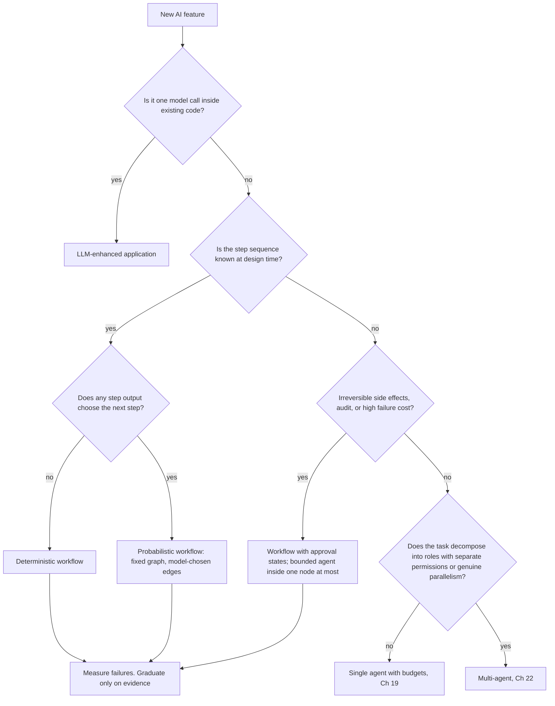
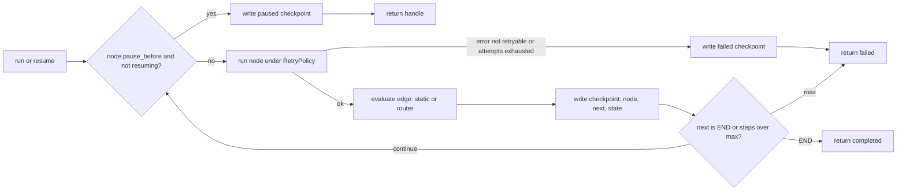
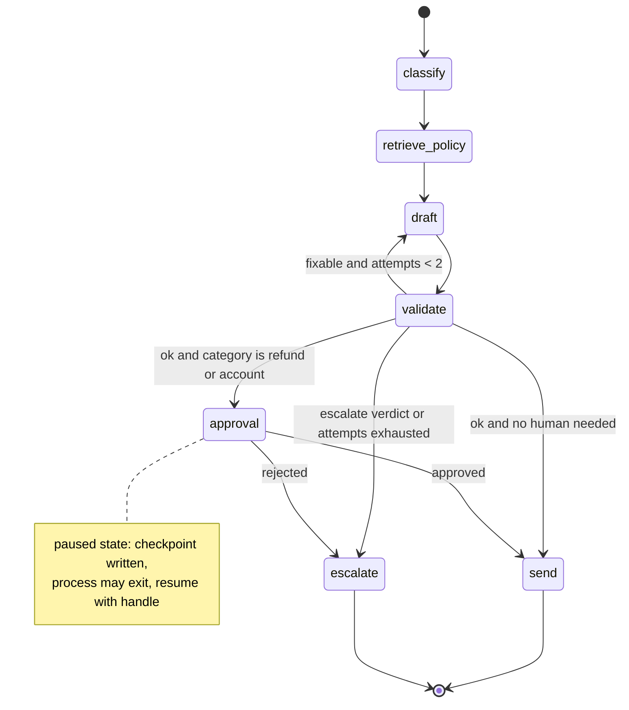

# Chapter 17 — AI Workflows and Orchestration

This chapter is about the layer between model calls: deciding how much of the control flow the model should own, and building the retries, checkpoints, and approvals that make a multi-step AI feature reliable.

**You will be able to:**
- Place a proposed AI feature on the spectrum from LLM-enhanced application to multi-agent system and defend the placement with a written argument.
- Estimate what a chain of model calls costs in latency, money, and end-to-end success rate before building it.
- Build a workflow as an explicit graph with typed state, conditional edges, and a retry policy per node that distinguishes transient, validation, and fatal errors.
- Make runs resumable with checkpoints, and implement human approval as a paused state bound to the exact state the approver saw.
- Keep side-effecting steps safe under at-least-once execution with stable idempotency keys.
- Choose between plain code, a graph library, and a durable execution engine, and measure orchestration overhead separately from model quality.

**Prerequisites:** Chapters 3 (the gateway client and its per-call retries) and 16 (idempotency keys and approvals bound to arguments). | **Code:** `book/projects/examples/ch17/` (run: `cd book/projects/examples/ch17 && pytest -q`) | **Builds:** a plain-Python workflow engine of about 250 lines and the Northwind ticket-triage workflow on top of it, once as a fixed pipeline and once as a graph, all running offline against a scripted fake model.

**First reading:** Why this matters, Mental model, Core concepts (except Orchestration patterns in plain Python), How it works, Architecture, Implementation (The engine, The domain, The same workflow as a graph, Tests), Code walkthrough, Failure modes, Before you ship. **Deep dives** (skip on a first pass): Orchestration patterns in plain Python, The same workflow as a fixed pipeline, Measuring orchestration overhead separately from model quality, When to graduate to an agent, Graph libraries and durable execution engines.

## Why this matters

Most AI features that survive production are workflows, not agents. A support reply that is classified, grounded in a policy, drafted, checked, and approved is five steps whose order never changes. The model does real work in three of them but never decides what happens next. Build this as an autonomous agent and the model rediscovers the same five steps on every ticket, sometimes in a different order, sometimes skipping validation. Every incident review then starts with "what did it decide to do this time?"

The opposite mistake is as expensive: a hard-coded path breaks when a case needs an unanticipated step, and the repair is a thicket of untestable special cases. The core skill is placing a problem on the spectrum with evidence: build the simplest non-agent baseline, measure, and add an agent loop only when the action sequence cannot be predetermined.

Orchestration is also where reliability is engineered: retries, fallbacks, checkpoints, approval gates, and budgets live between model calls. Chapter 3's client retries one call; this chapter decides what a failed call means for the whole job.

## Mental model

> **Mental model:** Agents add nondeterminism and cost; prefer deterministic workflows where the path is known.

Ask one question at every step: *who decides what happens next?* In a deterministic workflow, code decides and the model only fills in values. In a probabilistic workflow, the model emits a value and code maps it onto one of a fixed set of edges. In an agent, the model names the next action and code only checks whether it is allowed. The further right you move, the more control flow lives in a probability distribution instead of in a file you can read.

For implementation, see a workflow as a state machine over a typed record: steps map state to state, and edges are constants or pure functions of the state. Checkpoints are then serialized state, replay is re-reading the log, an approval is a state the machine waits in, and tests assert which edge a state selects. None of this needs a framework.

## Core concepts

### The spectrum, with precise definitions

The five positions differ in how much of the control flow the model owns, and you can classify a design by reading its code. "Deterministic" and "probabilistic" describe the *path*, not the outputs: a deterministic workflow may contain a model step whose text varies, as long as that text never changes which step runs next. The order below is increasing complexity, which is also the order to try them in.

**LLM-enhanced application.** Ordinary software that calls the model as a function: `summary = summarize(ticket)` inside a request handler, `tags = suggest_tags(doc)` inside a save hook. The application owns all control flow and uses or discards the value. It is often the right choice: one call of latency, one function to test.

**Deterministic workflow.** Orchestration code runs several steps in an order fixed at design time, passing state between them. A model runs inside a step, and its output is validated against a schema before the fixed next step. Example: Northwind's nightly job reads new tickets, asks the model for a category from a closed enum, rejects anything outside it, and writes the result to a column; a regex in place of the model would leave the shape unchanged. Failures are local to one step, and tests are unit tests plus a golden set for the model step.

**Telling the first two apart.** Both answer "code" to "who decides the next step," so ask instead whether there is a sequence to orchestrate:

- **Steps.** An LLM-enhanced application fills one hole in existing code with one model call. A deterministic workflow chains two or more steps (fetch, call, validate, write) that exist to serve the AI task.
- **State between steps.** An LLM-enhanced application uses the value at once. A deterministic workflow carries state from step to step, and that state is what you checkpoint, retry, and resume.
- **Where it runs.** An LLM-enhanced application calls the model synchronously in the request path, under the application's timeout. A deterministic workflow usually runs as its own job, with its own retry and failure policy.

If deleting the model call leaves the feature intact except for one missing value, it is an LLM-enhanced application. If the feature *is* the sequence of steps around the call, it is a workflow.

**Probabilistic workflow.** The graph of steps is fixed, but at one or more points the model's output selects which edge is taken. The paths are finite and enumerable, but which one an input takes is known only at runtime. Example: in this chapter's triage workflow a validation step returns `ok`, `fixable`, or `escalate`, and code maps those values to three edges; the model cannot invent a fourth destination. Path distribution becomes a production metric, because a prompt change can silently shift traffic to the expensive edge.

**Agent.** The model chooses actions in a loop, picking a tool or deciding to stop, and the harness executes each choice. The sequence is unknown at design time, and stopping is itself a judgment. Chapter 19 builds this loop.

**Multi-agent.** Several such loops with distinct roles, contexts, or permission domains, coordinated by a supervisor loop or a fixed protocol. Chapter 22 covers when this is justified: genuine parallelism, separate permission domains, or independent verification.

| Position | Who picks the next step | Paths known at design time | Typical failure | Primary test |
|---|---|---|---|---|
| LLM-enhanced application | Application code; there is no step sequence | One call, no path | Bad value from one call | Unit test with a fake model |
| Deterministic workflow | Orchestration code, over a fixed sequence of steps | One | One step fails or returns invalid output | Step tests plus golden set |
| Probabilistic workflow | Code, from a validated model value | Finite, enumerable | Wrong edge chosen; path mix drifts | Router tests plus path-distribution monitoring |
| Agent | Model, checked by policy | Open | Loop, drift, premature or late stop | Trajectory tests, budgets, replay |
| Multi-agent | Supervisor model plus protocol | Open | Coordination, duplicated work, inconsistent state | Contract tests per agent, end-to-end traces |

Designs mix positions: a probabilistic workflow may contain one node that is a bounded agent. That beats making the whole system an agent for one open-ended sub-task.

### A decision framework

Six questions decide most cases. Answer them for the concrete feature, not the product vision.

| Criterion | Pushes toward a workflow | Pushes toward an agent |
|---|---|---|
| Is the action sequence known? | Yes, up to a few enumerable branches | No; steps depend on what earlier steps reveal |
| Are side effects involved? | Yes, gated at fixed points | Read-only or trivially reversible |
| Is the output verifiable? | By code or a human at a fixed step | Only by iterating against the environment |
| Latency and cost budget | Tight; every call accounted for | Loose; variable spend per task is fine |
| Audit requirements | Transitions must be enumerable and reviewable | Auditing the trajectory afterward is enough |
| Cost of a failure | High or irreversible | Low; a failed attempt can be discarded |

A "workflow" answer in the side-effects, audit, or failure-cost rows is close to decisive on its own: a regulated process with irreversible actions is a workflow with an approval state even when its sequence varies somewhat. An agent is justified only when the first row says "no" and none of the others say "stop."



Apply the framework twice: before building, and after a few weeks of failure data ("When to graduate to an agent").

**The rule: start at the simplest position that can meet the acceptance bar, and move one position at a time on evidence.** Each step right buys flexibility and costs predictability, latency, money, and debuggability, so it needs a written reason: a failure the current position cannot fix, measured on real cases. "The model is smart enough to figure out the steps" is not a reason; it describes every position.

Five Northwind features, placed. The deciding question is the one whose answer rules out the position to the left.

| Feature | Position | Deciding question and answer |
|---|---|---|
| Suggest tags when an employee saves a runbook | LLM-enhanced application | One model call inside an existing save handler; no steps, no state |
| Nightly invoice extraction into the ledger staging table (Project 1) | Deterministic workflow | Fixed steps (parse, extract, validate, stage) with state between them; the model fills fields, never picks a step |
| Ticket triage with redraft, approval, and escalation (this chapter) | Probabilistic workflow | The validator's verdict chooses among three edges; refunds touch money, so approval is a fixed state |
| Incident research across runbooks, metrics, and past incidents (Project 5) | Single agent with budgets | The next system to consult depends on the last one; actions are read-only |
| Multi-part research questions with independent verification (Project 6) | Single agent plus a verifier by default; multi-agent only when wall-clock time or separate permission domains require it | Sub-questions could run in parallel, but Chapter 22's benchmark shows the team only ties a single agent with a verifier on quality and costs more |

The last row is the ladder rule at work: the gain came from verification, which a single agent can also have, so what remains is a latency argument, made with a latency budget.

### Prefer the simplest architecture: the arithmetic

Every model call adds latency, money, and a place to fail. Do the arithmetic before any design review.

**Latency adds.** Four sequential calls with a median of 1.5 s each have a median near 6 s. The tail is worse: the chain's p95 is dominated by whichever call happened to be slow. A single-call feature that meets an 8 s p95 with room to spare usually misses it as a four-step chain.

**Cost adds, and context grows.** Step k's input includes earlier outputs, so tokens per call grow along a chain. A workflow's token count is fixed by its graph; an agent's grows roughly quadratically with its steps (Chapter 19).

**Reliability multiplies.** If each step independently succeeds with probability p, the chain succeeds with probability p^n. Independence is optimistic, because a mediocre draft makes validation harder.

| Per-step success p | n = 1 | n = 2 | n = 4 | n = 6 |
|---|---|---|---|---|
| 0.99 | 0.990 | 0.980 | 0.961 | 0.941 |
| 0.97 | 0.970 | 0.941 | 0.885 | 0.833 |
| 0.95 | 0.950 | 0.903 | 0.815 | 0.735 |
| 0.90 | 0.900 | 0.810 | 0.656 | 0.531 |

A six-step chain of "pretty good" 0.95 steps fails one job in four. Its n minus 1 handoffs can also break on a schema mismatch or truncated output with no model error at all.

Decomposition is still often right, because narrowing a task raises its per-step p: a classifier picking one label from four beats one prompt that classifies, retrieves, and drafts, and the chain's p^n can beat the monolith's p. But the gain has to be measured and has to pay for the added latency and cost; without that measurement, the one-call design wins.

### Orchestration patterns in plain Python

> **Deep dive.** The seven reusable patterns and the failure semantics of concurrent ones; skip on a first reading.

Workflows are composed of seven patterns; naming them shows a reviewer what a design costs. The listing shows the two concurrent ones from `patterns.py`, whose failure semantics are least obvious.

**Sequence.** Steps run in order, each consuming the previous output: n calls, n failure points, latency is the sum.

**Branch.** A decision function, written in code, picks one of several steps; in a probabilistic workflow it reads a validated model output. Each branch is a path to test and monitor.

**Parallel fan-out and fan-in.** Independent steps run concurrently under a semaphore for provider rate limits, and a fan-in step merges results. Latency drops to the slowest branch. Returning exceptions as values forces the fan-in to decide what a partial result means.

**Map-reduce over documents.** Fan-out with one prompt over many chunks, then one reduce call. A summary over a partial set of documents is usually a wrong answer, so `map_reduce` raises on the first mapper failure.

**Retry with policy.** Bounded attempts, backoff, and a list of retryable errors. Retrying a validation failure with the same input is a common waste. Chapter 29 covers backoff and circuit breakers.

**Fallback.** A second path when the primary fails for a listed reason: a cheaper model, a cached answer, a template, or a human. Falling back on a bug in your own code hides the bug. The `retry` and `fallback` helpers catch every exception to stay short; in production, pass the retryable classes explicitly.

**Human approval as a paused state.** The workflow persists its state and stops; a person decides later, and the workflow resumes in another process. A call that blocks until someone clicks cannot do this, because the process may not live that long.

```python
# path: book/projects/examples/ch17/patterns.py (excerpt; full file on disk)
async def fan_out(tasks: Sequence[Callable[[], Awaitable[R]]], *,
                  max_concurrency: int = 8) -> list[R | BaseException]:
    """Run independent coroutines concurrently; return results in input order.

    Failures are returned, not raised, so the fan-in step decides what a
    partial result means for the workflow.
    """
    sem = asyncio.Semaphore(max_concurrency)

    async def guarded(task: Callable[[], Awaitable[R]]) -> R:
        async with sem:
            return await task()

    return list(await asyncio.gather(*(guarded(t) for t in tasks), return_exceptions=True))


async def map_reduce(items: Iterable[T], mapper: Callable[[T], Awaitable[R]],
                     reducer: Callable[[list[R]], Any], *, max_concurrency: int = 8) -> Any:
    """Map each item concurrently (one model call each), then reduce once.

    Raises the first mapper failure: a summary over a partial set of
    documents is a different, usually wrong, answer.
    """
    results = await fan_out([lambda i=i: mapper(i) for i in items], max_concurrency=max_concurrency)
    failures = [r for r in results if isinstance(r, BaseException)]
    if failures:
        raise failures[0]
    return reducer(results)  # type: ignore[arg-type]
```

### Workflows as explicit state machines with typed state

The state between steps is a pydantic model. The schema is a contract at every handoff, so an unexpected shape fails at the boundary instead of three steps later. It serializes to JSON for checkpoints and replay. Routers can be tested against a hand-built state. And model output enters only through validated fields: the model never names a node.

Rules for the state record:

- **Append where history matters.** A `log` list and a `draft_attempts` counter let routers decide on retries and humans see what happened.
- **Keep it small.** It is written after every node, so large blobs go to object storage, referenced from the state.
- **Store decisions, not just values.** `approved: bool | None`, with `None` meaning "not yet asked," answers "are we waiting on a human?" without a second table.
- **Do not store derived values.** Stale derived fields are a classic replay bug.
- **Carry tenancy.** Northwind states carry `tenant`, and every step that retrieves or sends reads it; a checkpoint resumed in another tenant's context is a leakage path.

### Checkpointing and resumption

A checkpoint is the serialized state plus which node just ran and which runs next. The engine writes one after every node, which gives three capabilities. (This is one durable-execution style; Chapter 38 covers the other, an event log replayed to rebuild state.)

**Resume after a crash.** A new process loads the latest checkpoint and continues from `next_node` without repeating earlier steps. A node that was running when the process died runs again. This is at-least-once execution: harmless for pure steps, dangerous for side effects, so side-effecting nodes must be idempotent as Chapter 16 describes for tool calls.

The engine provides the key: `step_key()` returns `run_id:node:visit`, where `visit` counts how many times that node already completed in this run. The sequence number would be wrong: a failed attempt consumes one, so the re-execution would get a new key and the duplicate would go through. With the visit count, a re-executed `send` presents the same key, while `draft` in a redraft loop gets a new key each visit.

**Pause for a human.** A paused checkpoint has the approval node as `next_node` and status `paused`; resuming applies the human's decision. The decision must be bound to the exact state the human saw, so the `ResumeHandle` carries the paused checkpoint's sequence number and a hash of its state. `resume` raises `StaleHandleError` if the latest checkpoint is no longer that pause or the state no longer matches the hash.

**Replay for debugging and evaluation.** Reading the checkpoint log answers "what was the state after `validate` on run 7" without re-running anything. Chapter 19 extends this to counterfactual replay for agents.

The engine writes checkpoints, only after a step completes; one written before would claim a step that never ran. The paused checkpoint is the one exception: it is written before the approval node, because that node's job is to wait.

### Error classes per step

A step can fail in five ways, each needing its own policy; one `except Exception` for all of them is a common source of runaway cost.

| Error class | Example | Right response | Wrong response |
|---|---|---|---|
| Transient | Timeout, rate limit, provider 5xx | Retry with backoff, bounded | Fail the whole run on first hit |
| Validation | Output fails schema or business check | Route: redraft with the error in context, or escalate | Retry with the same input |
| Semantic | Valid but wrong (misread the ticket) | Detect with a validator step; route | Nothing, since nothing raised |
| Fatal | Bug in our code, bad configuration | Stop, keep state, alert | Retry; a fallback that masks the bug |
| Impossible | Tools or data cannot do the task | Escalate to a human with context | Loop until the budget is gone |

The engine encodes transient, validation, and fatal errors as exception classes, and each node's `retry_on` decides what is retried. Semantic errors do not raise: a validation node writes a verdict into the state and a router acts on it. Impossible tasks surface as repeated validation failures that an attempt counter catches. Exceptions are for the engine; verdicts are for the graph.

## How it works

The run loop is short enough to hold in your head, which is the reason to write it before adopting a library.

1. `run` creates a `run_id` and starts at the entry node.
2. If the node is marked `pause_before` and the run was not resumed with a decision, write a paused checkpoint and return status `paused` with a `ResumeHandle`.
3. Otherwise run the node under its retry policy. An exception is retried only if its type is in `retry_on` and attempts remain; otherwise write a failed checkpoint that still points at this node and return `failed`.
4. On success, evaluate the edge (a static target or a router), checking the target against the node table so a router bug raises instead of ending silently.
5. Write a checkpoint with this node, the next node, and the state. If the step count reaches `max_steps`, fail, so a graph with a cycle still terminates.
6. Repeat until the next node is `END`.

Each attempt gets a deep copy of the state, so a step that mutates a field and then raises cannot leak a half-applied change.

`resume` checks the handle, applies the node's `on_decision` function to the human's decision, and re-enters the loop at the approval node without pausing again. `resume_from_checkpoint` continues after a crash. `aresume` and `aresume_from_checkpoint` are async twins for callers already in an event loop. `replay` reads the history back as typed states.



## Architecture

The triage graph has seven nodes and two routers. Three nodes call the model, one is a lookup, one is a paused approval state, and two are terminal actions. Code, not the model, decides from the category whether approval is needed: refunds and account changes are side effects a human signs off on.



The trust boundary runs through `validate` and the routers: model text becomes control flow only as one of three enumerated verdicts plus the attempt counter. `send`, the only irreversible action, is never retried by the engine and is reached only after `validate` returns `ok` and, for sensitive categories, a recorded human decision.

## Implementation

The engine knows nothing about tickets; the domain knows nothing about graphs. The pipeline and the graph are thin orchestration layers over the same step functions, so any behavioral difference between them comes from orchestration alone.

```
book/projects/examples/ch17/
├── workflow_engine.py   # Graph, Step, RetryPolicy, Checkpointer, pause/resume, replay, step_key
├── patterns.py          # sequence, branch, fan_out, map_reduce, retry, fallback
├── triage_domain.py     # TriageState, six step functions, FakeModel, policies
├── triage_pipeline.py   # fixed pipeline with synchronous approval
├── triage_graph.py      # the same workflow as a Graph with routers and a pause
├── compare.py           # orchestration overhead vs model time
├── test_ch17.py         # offline tests
└── README.md
```

Run from the repository root:

```bash
.venv/bin/python -m pytest book/projects/examples/ch17 -q
```

### The engine

The first excerpt is the engine's vocabulary: error classes, the idempotency key, the retry policy, the checkpoint record with the `Checkpointer` protocol a durable store implements, and the resume handle.

```python
# path: book/projects/examples/ch17/workflow_engine.py (excerpt; full file on disk)
class StepError(Exception):
    """Base class. `retryable` documents whether a retry can help; a node's `retry_on` decides."""

    retryable: bool = False


class TransientError(StepError):
    """Infrastructure hiccup: timeout, rate limit, 5xx. Retry is reasonable."""

    retryable = True


class StepValidationError(StepError):
    """The step produced output that failed validation. Retrying the same
    input rarely helps; the graph should route, not loop blindly."""


class FatalError(StepError):
    """Do not retry, do not continue. Preserve state for a human."""


# ...
def step_key() -> str:
    """Stable key for the node now running: `run_id:node:visit`.

    `visit` counts earlier *successful* runs of the same node in this run, so a
    node re-executed after a crash or a failed attempt gets the same key, and a
    node legitimately visited twice (a redraft loop) gets a new one.
    """
    return _STEP_KEY.get()


# ...
@dataclass(frozen=True)
class RetryPolicy:
    max_attempts: int = 1
    base_delay_s: float = 0.0
    max_delay_s: float = 2.0
    retry_on: tuple[type[BaseException], ...] = (TransientError,)

    def delay(self, attempt: int) -> float:
        return min(self.max_delay_s, self.base_delay_s * (2 ** (attempt - 1)))


@dataclass(frozen=True)
class Checkpoint:
    run_id: str
    seq: int
    node: str          # node that just finished (or paused/failed before running)
    next_node: str     # where execution continues
    status: Status | Literal["running"]
    state: dict[str, Any]
    ts: float = field(default_factory=time.time)


class Checkpointer(Protocol):
    def save(self, cp: Checkpoint) -> None: ...
    def latest(self, run_id: str) -> Checkpoint | None: ...
    def history(self, run_id: str) -> list[Checkpoint]: ...


# ...
@dataclass(frozen=True)
class ResumeHandle:
    run_id: str
    node: str                       # the approval node waiting for a decision
    seq: int | None = None          # seq of the paused checkpoint the human saw
    state_hash: str | None = None   # hash of the state the human saw
```

The second is the run loop: `aresume` checks the handle before anything runs, `_execute` is the loop from "How it works," and `_run_node` applies the retry policy.

```python
# path: book/projects/examples/ch17/workflow_engine.py (excerpt; full file on disk)
class Graph(Generic[S]):
    # ...
    async def aresume(self, handle: ResumeHandle, decision: Any) -> RunResult[S]:
        cp = self.checkpointer.latest(handle.run_id)
        if cp is None or cp.status != "paused" or cp.next_node != handle.node:
            raise StaleHandleError("no paused checkpoint matches this handle")
        if handle.seq is not None and cp.seq != handle.seq:
            raise StaleHandleError(f"handle is for pause seq {handle.seq}, run is paused at {cp.seq}")
        if handle.state_hash is not None and state_hash(cp.state) != handle.state_hash:
            raise StaleHandleError("paused state changed since the approver saw it")
        state = self.state_type.model_validate(cp.state)
        node = self._nodes[handle.node]
        if node.on_decision is not None:
            state = node.on_decision(state, decision)
        return await self._execute(handle.run_id, handle.node, state,
                                   seq=cp.seq + 1, trace=[], skip_pause=True)

    # ...
    async def _execute(self, run_id: str, current: str, state: S, *, seq: int,
                       trace: list[StepRecord], skip_pause: bool = False) -> RunResult[S]:
        steps = 0
        visits = Counter(cp.node for cp in self.checkpointer.history(run_id)
                         if cp.status in ("running", "completed"))
        while current != END:
            if steps >= self.max_steps:
                self._save(run_id, seq, current, current, "failed", state)
                return RunResult(run_id, "failed", state, trace, error="max_steps exceeded")
            node = self._nodes[current]
            if node.pause_before and not skip_pause:
                cp = self._save(run_id, seq, current, current, "paused", state)
                handle = ResumeHandle(run_id, current, seq=seq, state_hash=state_hash(cp.state))
                return RunResult(run_id, "paused", state, trace, handle=handle)
            skip_pause = False
            token = _STEP_KEY.set(f"{run_id}:{current}:{visits[current]}")
            try:
                with self._span(run_id, current) as span:
                    record, state, err = await self._run_node(current, node, state)
                    nxt = current if err is not None else self._next(current, state)
                    if span is not None:
                        span.set_attribute("workflow.attempts", record.attempts)
                        span.set_attribute("workflow.status", "failed" if err else "ok")
                        span.set_attribute("workflow.next_node", nxt)
            finally:
                _STEP_KEY.reset(token)
            trace.append(record)
            if err is not None:
                self._save(run_id, seq, current, current, "failed", state)
                return RunResult(run_id, "failed", state, trace, error=f"{current}: {err}")
            self._save(run_id, seq, current, nxt, "completed" if nxt == END else "running", state)
            visits[current] += 1
            seq += 1; steps += 1; current = nxt
        return RunResult(run_id, "completed", state, trace)

    # ...
    async def _run_node(self, name: str, node: _Node, state: S) -> tuple[StepRecord, S, str | None]:
        started = time.perf_counter()
        attempt = 0
        while True:
            attempt += 1
            try:
                # Each attempt gets a copy: a step that mutates state and then raises
                # must not leak half-applied changes into the retry or the checkpoint.
                result = node.fn(state.model_copy(deep=True))
                if inspect.isawaitable(result):
                    result = await result
                ms = (time.perf_counter() - started) * 1000
                return StepRecord(name, attempt, ms), result, None
            except Exception as exc:  # noqa: BLE001 - we classify below
                can_retry = isinstance(exc, node.retry.retry_on) and attempt < node.retry.max_attempts
                if not can_retry:
                    ms = (time.perf_counter() - started) * 1000
                    return StepRecord(name, attempt, ms, error=repr(exc)), state, repr(exc)
                await asyncio.sleep(node.retry.delay(attempt))
```

### The domain: state, steps, and a scripted model

Step functions take the state and a `Model`, any callable `(task, prompt) -> str`; in the full Northwind stack it wraps Chapter 3's `ModelGateway.complete`. A policy dictionary stands in for Part IV's retrieval. The excerpt shows the state, the validator, the approval rule, and the irreversible `send`.

```python
# path: book/projects/examples/ch17/triage_domain.py (excerpt; full file on disk)
class TriageState(BaseModel):
    ticket_id: str
    tenant: Literal["retail", "logistics"]
    text: str
    category: Category | None = None
    policy: str | None = None
    draft: str | None = None
    report: ValidationReport | None = None
    draft_attempts: int = 0
    approved: bool | None = None
    approval_note: str | None = None
    sent: bool = False
    outcome: Literal["sent", "escalated"] | None = None
    log: list[str] = Field(default_factory=list)


# ...
def validate(state: TriageState, model: Model) -> TriageState:
    """Two layers: deterministic checks first, model judgment second."""
    reasons: list[str] = []
    assert state.draft is not None
    if "guarantee" in state.draft.lower() or "promise" in state.draft.lower():
        reasons.append("draft makes a promise the policy does not allow")
    if state.category == "account" and "@" in state.draft:
        reasons.append("draft may leak account data")
    raw = model("validate", f"Policy:\n{state.policy}\nDraft:\n{state.draft}\nReturn JSON {{verdict, reasons}}.")
    judged = json.loads(raw)
    verdict: Verdict = judged["verdict"]
    reasons.extend(judged.get("reasons", []))
    if reasons and verdict == "ok":
        verdict = "fixable"
    state.report = ValidationReport(verdict=verdict, reasons=reasons)
    state.log.append(f"validated: {verdict}")
    return state


def needs_human(state: TriageState) -> bool:
    """Policy decision in code, not in the model: account changes and refunds
    are side effects a human signs off on."""
    return state.category in ("account", "refund")


# ...
# (ticket_id, body, idempotency_key): the sender must deliver at most once per key.
Sender = Callable[[str, str, str], None]


def send(state: TriageState, sender: Sender, key: str | None = None) -> TriageState:
    """The only irreversible step. The key lets the sender suppress a duplicate
    when the step is re-executed after a crash or an ambiguous failure."""
    assert state.draft is not None
    sender(state.ticket_id, state.draft, key or f"{state.ticket_id}:send")
    state.sent = True
    state.outcome = "sent"
    state.log.append("sent")
    return state
```

### The same workflow as a fixed pipeline

> **Deep dive.** The same steps without an engine, to show what a pipeline cannot do; skip on a first reading.

Watch where approval happens: `approver(state)` blocks until a human answers. In a test that is a lambda; in production it would be a blocking call to a person, which fails as soon as a reviewer takes longer than a request timeout. The pipeline is fine and simpler for the shipping path, which has no approval; the refund path needs the graph.

```python
# path: book/projects/examples/ch17/triage_pipeline.py (excerpt; full file on disk)
def run_pipeline(state: TriageState, model: Model, approver: Callable[[TriageState], bool],
                 sender: Sender,
                 metrics: PipelineMetrics | None = None) -> TriageState:
    # ... (metrics setup and `timed`, which records each step's wall time)
    state = timed("classify", lambda: classify(state, model))
    state = timed("retrieve_policy", lambda: retrieve_policy(state))

    while True:
        state = timed("draft", lambda: draft_reply(state, model))
        state = timed("validate", lambda: validate(state, model))
        assert state.report is not None
        if state.report.verdict == "ok":
            break
        if state.report.verdict == "escalate" or state.draft_attempts >= MAX_DRAFTS:
            return timed("escalate", lambda: escalate(state))

    if needs_human(state):
        decision = timed("approve", lambda: _apply_decision(state, approver(state)))
        if not decision.approved:
            return timed("escalate", lambda: escalate(state))

    if isinstance(model, FakeModel):
        metrics.model_ms = sum(c.duration_ms for c in model.calls)
    return timed("send", lambda: send(state, sender))
```

### The same workflow as a graph

The branching lives in two pure routers, and approval is a node the engine pauses before.

```python
# path: book/projects/examples/ch17/triage_graph.py (excerpt; full file on disk)
MAX_DRAFTS = 2


def route_after_validate(state: TriageState) -> str:
    assert state.report is not None
    if state.report.verdict == "ok":
        return "approval" if needs_human(state) else "send"
    if state.report.verdict == "fixable" and state.draft_attempts < MAX_DRAFTS:
        return "draft"
    return "escalate"


def route_after_approval(state: TriageState) -> str:
    return "send" if state.approved else "escalate"


def record_decision(state: TriageState, decision: dict) -> TriageState:
    state.approved = bool(decision.get("approved"))
    state.approval_note = decision.get("note")
    state.log.append(f"approval: {'yes' if state.approved else 'no'}")
    return state


def build_triage_graph(model: Model, sender: Sender,
                       checkpointer: Checkpointer | None = None,
                       model_retry: RetryPolicy = RetryPolicy(max_attempts=3),
                       tracer: object | None = None) -> Graph[TriageState]:
    g: Graph[TriageState] = Graph(TriageState, checkpointer=checkpointer, max_steps=20, tracer=tracer)
    g.add_node("classify", lambda s: classify(s, model), retry=model_retry)
    g.add_node("retrieve_policy", retrieve_policy)
    g.add_node("draft", lambda s: draft_reply(s, model), retry=model_retry)
    g.add_node("validate", lambda s: validate(s, model), retry=model_retry)
    # The approval node itself does nothing; the engine pauses before it and
    # applies the human decision through `on_decision` when resumed.
    g.add_node("approval", lambda s: s, pause_before=True, on_decision=record_decision)
    # Side effect: no retry policy, and a key that is stable across re-execution.
    g.add_node("send", lambda s: send(s, sender, key=step_key()))
    g.add_node("escalate", escalate)

    g.add_edge("classify", "retrieve_policy")
    g.add_edge("retrieve_policy", "draft")
    g.add_edge("draft", "validate")
    g.add_router("validate", route_after_validate)
    g.add_router("approval", route_after_approval)
    g.add_edge("send", END)
    g.add_edge("escalate", END)
    return g
```

### Tests

Three tests pin the central claims: pause and resume across "processes," crash recovery without repeating completed nodes, and one delivery when `send` re-executes. `Sent` is a sender fake that records every key and delivers at most once per key.

```python
# path: book/projects/examples/ch17/test_ch17.py (excerpt; full file on disk)
def test_graph_pauses_for_approval_and_resumes() -> None:
    model = FakeModel({"classify": ["refund"], "draft": ["Refund issued within 30 days."], "validate": [OK]})
    sent = Sent()
    cps = InMemoryCheckpointer()
    g = build_triage_graph(model, sent, checkpointer=cps)

    paused = g.run(refund_ticket(), run_id="run-approve")
    assert paused.status == "paused" and paused.handle is not None and paused.handle.node == "approval"
    assert sent.messages == [], "nothing is sent while a human has not decided"
    assert cps.latest("run-approve").status == "paused"

    # ...minutes or days later, in a different process:
    g2 = build_triage_graph(model, sent, checkpointer=cps)
    done = g2.resume(paused.handle, {"approved": True, "note": "ok per policy"})
    assert done.status == "completed" and done.state.outcome == "sent"
    assert done.state.approval_note == "ok per policy" and len(sent.messages) == 1
    assert [c.task for c in model.calls] == ["classify", "draft", "validate"], "resume re-runs no model step"


def test_checkpoint_replay_and_resume_after_crash() -> None:
    model = FakeModel({"classify": ["shipping"], "draft": ["Re-shipping now."], "validate": [OK]})
    sent = Sent()
    cps = InMemoryCheckpointer()
    crash = {"armed": True}

    def crashing_draft(task: str, prompt: str) -> str:
        if task == "draft" and crash["armed"]:
            crash["armed"] = False
            raise FatalError("process killed mid-step")
        return model(task, prompt)

    g = build_triage_graph(crashing_draft, sent, checkpointer=cps)
    first = g.run(shipping_ticket(), run_id="run-crash")
    assert first.status == "failed" and "FatalError" in (first.error or "")
    assert [n for n, _ in g.replay("run-crash")] == ["classify", "retrieve_policy", "draft"]
    assert cps.latest("run-crash").next_node == "draft", "failed checkpoint points at the step to redo"

    # New process: same checkpointer, fixed model. Continue from the last durable state.
    g2 = build_triage_graph(model, sent, checkpointer=cps)
    second = g2.resume_from_checkpoint("run-crash")
    assert second.status == "completed" and second.state.outcome == "sent"
    assert [c.task for c in model.calls] == ["classify", "draft", "validate"], "classify was not re-run"
    # ...

def test_send_reexecuted_after_ambiguous_failure_delivers_once() -> None:
    model = FakeModel({"classify": ["shipping"], "draft": ["Re-shipping now."], "validate": [OK]})
    sent, cps = Sent(fail_after_delivery=1), InMemoryCheckpointer()
    g = build_triage_graph(model, sent, checkpointer=cps)
    first = g.run(shipping_ticket(), run_id="run-dup")
    assert first.status == "failed" and "send" in (first.error or "")
    second = g.resume_from_checkpoint("run-dup")
    assert second.status == "completed"
    assert len(sent.keys) == 2 and sent.keys[0] == sent.keys[1] == "run-dup:send:0"
    assert len(sent.messages) == 1, "same key, so the second execution was suppressed"
```

## Code walkthrough

**The model is a parameter.** Steps take the model explicitly instead of importing a client, which makes the fake trivial and lets the pipeline and the graph share them. The graph binds it with lambdas.

**Routers are the whole branching logic, and they are pure.** "What happens to a refund whose second draft still fails?" is answered by one function, testable with hand-built states, not by a trace.

**Validation layers code before the model.** Deterministic checks run first, then the model judges, and if code found a reason, a model `ok` is downgraded to `fixable`: the model cannot overrule a rule. The verdict is a `Literal`, so an unexpected value fails at the pydantic boundary.

**The approval node is a pause, not a function.** Nothing waits: on resume, `record_decision` writes `approved` into the state, the identity node runs, and the router reads `approved`. This is Chapter 16's approval binding applied to a workflow state.

**Retry is a policy on model nodes only.** A transient error on `send` may follow delivery, so retrying could send twice. Its protection is the sender's idempotency on `step_key()`: in the third test, both executions carry `run-dup:send:0`.

**Two guards bound every cycle.** `draft_attempts` in the router bounds the redraft loop, and `max_steps` in the engine catches a router bug that would cycle anyway.

## Measuring orchestration overhead separately from model quality

> **Deep dive.** How to split workflow latency into model time and orchestration time, and what to instrument; skip on a first reading.

A workflow's latency is model time plus everything else (step code, serialization, checkpoint writes, queue hops, retry sleeps), and one combined number hides regressions in the part you control. `compare.py` runs both implementations over twenty tickets with simulated model latency and prints the parts separately (run it from `book/projects/examples/ch17` with `../../../../.venv/bin/python compare.py`). The 5 ms block from one laptop run (illustrative):

```
simulated model latency 5 ms per call, 20 tickets
impl         wall_ms  model_ms  overhead_ms  calls  ckpts
pipeline       369.3     366.7          2.5     60      0
graph          383.9     368.0         15.9     60    100
```

The graph wrote five checkpoints per run, the price of being resumable. Its overhead is about a millisecond per run, mostly state copies and checkpoint serialization: nothing next to a real model call, but a number you can alert on. Both made the same sixty model calls, so their quality is identical; quality is measured on the step functions with a golden set (Chapter 24), overhead here. Keep the two dashboards apart.

In production, record per run and per node with the tracer from Chapter 31:

- `orchestration_ms` and `model_ms` as separate span attributes, with retry sleeps counted as orchestration.
- `attempts` per node, which rise during a provider degradation before failures do.
- The path taken, so the `escalate` and `approval` fractions are time series (see path drift under Failure modes).
- Pause duration for approval states, and checkpoint size and write latency.

## When to graduate to an agent

> **Deep dive.** The evidence that justifies replacing a node with an agent loop; skip on a first reading.

Replacing a workflow, or one node, with an agent loop should follow failure analysis. Run the fixed version for a few weeks and sort every failure into two buckets. In the first, a step did the wrong thing (a mislabel, a policy-violating draft); fix it inside the step. In the second, the path was wrong: the case needed a step, an order, or a system the graph lacks. If that bucket is small, add a branch. If it is large and heterogeneous, the action sequence cannot be predetermined, and that is the evidence an agent requires.

Then implement the open-ended part as a bounded agent (Chapter 19) inside one node and compare on the same cases: success rate, model calls per case, p95 latency, cost per successful case, and time to diagnose a failure. The last is rarely measured and often decisive: a graph trace reads top to bottom, while an agent trace must be reconstructed. Graduate only if the success-rate gain pays for the other four, and graduate the smallest part: an agent that gathers context from three systems does not also need to send the reply.

## Graph libraries and durable execution engines

> **Deep dive.** How off-the-shelf orchestrators map onto this chapter's engine and when to adopt one; skip on a first reading.

This chapter's engine is a reasonable starting point for short workflows. Two families of off-the-shelf systems do the same job with more machinery.

### Graph libraries

Graph libraries (for example LangGraph, the best known as of 2026) are this engine plus persistence, streaming, and tooling; the mapping table below shows the correspondence. A library adds durable checkpoint stores, token streaming from nodes, parallel branches with state merging (through reducers, functions that merge a node's partial update into the state), subgraphs, visualization, and time-travel debugging. It runs inside your process, so it fits workflows that finish in seconds to minutes.

A library does not change where decisions live: if model output names the next node directly, the graph is an agent with extra steps. Chapter 23 evaluates the major frameworks on visibility, durable checkpoints, testing, deployment, and exit cost.

### Durable execution engines

A durable execution engine is a separate service that owns the run: it records progress, schedules work onto your workers, fires timers, and delivers messages to waiting runs.

**Code-first workflow engines** (for example Temporal or Azure Durable Functions) run an ordinary workflow function. Every side-effecting call, model calls included, is an *activity* that the engine schedules, retries, and records in an event history. After a crash, a worker re-runs the function against that history, and completed activities return recorded results. The price is a determinism rule: the workflow function itself may not call the model, read the clock, draw random numbers, or do I/O.

**Step-function services** (for example AWS Step Functions) define the workflow as a state machine in JSON or YAML. Each state invokes a function or service with its own retry and catch rules matched on error names, choice states route on state fields, and the service stores the history.

The table maps all three families onto this chapter's mechanisms:

| This chapter | Graph library | Code-first workflow engine | Step-function service |
|---|---|---|---|
| Checkpoint after each node | Checkpoint per node | Event history of activity results, replayed | Execution history per transition |
| `RetryPolicy` with `retry_on` | Per-node retry policy | Per-activity policy with non-retryable error types | Retry and catch clauses per state |
| `step_key()` | Built from run id and node | Workflow id plus activity id | Built from execution id and state name |
| `pause_before` plus `ResumeHandle` | Interrupt, resume with a command | Wait for a signal (an external message to a running workflow) with a durable timer | Callback task waiting for a token, with a timeout |
| Router function | Conditional edge | `if` over a validated value | Choice state |
| Graph version in the checkpoint | Same fix | Versioned code that old runs can still replay | Versioned definitions |

Two things do not change. Activities still execute at least once, so `send` still needs an idempotency key the receiver honors; the engine gives a stable identity to build it from, not exactly-once delivery. And routing on model output still goes through a validated, enumerated value.

LLM workloads add three costs. Model outputs land in the engine's history, inheriting its retention rules and hitting payload limits; store large ones elsewhere and keep a reference. Each step is a round trip through the engine service. And streaming tokens from an activity to a waiting user is awkward, so these engines fit background work better than the interactive path.

**When to adopt one.** Adopt a durable engine when runs wait for hours or days, when many workers share runs, or when steps span services and you want visibility, cancellation, and timeouts without building them. Stay with plain code or a graph library when runs finish within minutes inside one service. Chapter 38 covers the concepts underneath and when building your own is justified.

## Production considerations

**Latency and cost.** Budget latency per node, in the `CompletionRequest` timeout, so a slow call fails into the retry policy instead of hanging the run. For user-facing workflows, stream the draft and validate the complete text (Chapter 30). Record tokens per node and per path: a redraft doubles draft and validation spend, so alert when the redraft fraction moves.

**Security.** Every node that touches tenant data checks the tenant in the state, and resuming a checkpoint must re-establish the caller's identity rather than trust the stored one. Checkpoint stores hold drafts and ticket text, so they inherit the source data's retention and access rules. A validator node is a natural home for an output guardrail from Chapter 27.

**Operations.** Replace `InMemoryCheckpointer` with a durable store; a relational table of run_id, seq, node, next_node, status, state JSON, and timestamp is enough. Each run also gets a client-supplied idempotency key at submission, distinct from the per-node `step_key`. Expired paused runs go to a dead-letter queue (a holding table for runs needing manual attention) with the state attached. With `(run_id, seq)` unique, when two workers resume the same paused run, the loser's insert fails and it abandons the run. Compute the visit counts behind `step_key()` from the store, as the engine does from `history`, never from process memory.

## Common mistakes

- **Building an agent for a fixed sequence.** The telltale is a system prompt that lists the steps in order.
- **Letting the model name the next node.** That turns a graph into an agent without an agent's safeguards.
- **One `except Exception` with a retry.** Validation and fatal errors get retried with the same input; cost climbs and nothing improves.
- **Approval as a blocking call.** It works in demos and fails once a reviewer takes longer than the request timeout.
- **Writing the checkpoint before the step.** A resume then skips a step that never ran.
- **Unbounded cycles.** Bound every loop with a router counter and an engine ceiling.

## Failure modes

Each entry names the failure, its telemetry, and the test that catches it before production.

**Path drift after a prompt change.** The validator prompt is edited and the `fixable` fraction doubles while per-step metrics stay green. Telemetry: path distribution per graph version, with alerts on escalate and redraft fractions. Test: a golden set asserting expected paths, run in CI on every prompt change.

**Double side effect after resume or retry.** A crash inside `send` after delivery and before the checkpoint makes the resume re-run `send`; a retry on a timeout after delivery does the same. Telemetry: sender idempotency-key collisions, customer complaints about duplicates. Test: `test_send_reexecuted_after_ambiguous_failure_delivers_once` asserts exactly one message for the key.

**Stale approval.** The draft changes between pause and resume (for example a redeploy re-runs the draft node), and the human's "yes" is applied to text they never saw. Telemetry: `StaleHandleError` count on resume. Test: `test_resume_refuses_a_stale_approval_handle` pauses, mutates the stored draft, resumes, and asserts the refusal and that nothing was sent.

**Retry storm on a provider incident.** Three attempts per model node triple traffic during a rate-limit incident, and stacked gateway retries make it 27 calls instead of 3 per run (see Tradeoffs). The engine's backoff has no jitter; add it before relying on it under load. Telemetry: attempts per node rising before failures do. Test: a fake that raises `TransientError` for a window, asserting total calls per run with Chapter 29's circuit breaker engaged.

**Checkpoint schema mismatch.** After a field rename in `TriageState`, runs paused under the old schema fail validation on resume. Telemetry: resume failures by graph version. Test: a fixture checkpoint from the previous version resumes through a migration or is refused with a labeled error.

**Silent partial fan-in.** A map-reduce swallows one failed mapper and summarizes the rest. Telemetry: mapper failures versus reduces per run. Test: one mapper raises; assert the run fails rather than returning a shorter summary.

## Tradeoffs

**Pipeline versus graph.** The pipeline is shorter and needs no engine but cannot pause or resume. Without approval or resumption it is the right answer; the graph earns its weight the moment either appears.

**Checkpoint every node versus at milestones.** Per-node checkpoints give the finest resume and replay at the cost of a write per node; milestone checkpoints cut writes but re-run more on resume. If the state is large, move it out of the record rather than checkpoint less often.

**Code validator, model validator, or both.** Code checks are cheap and auditable but catch only what you anticipated; a model judge catches more at a call per draft. Layering them, code overriding the model, is the usual compromise (Chapter 24 calibrates judges).

**Retry in the gateway versus retry in the engine.** Stacked, they multiply: three gateway attempts inside each of three engine attempts is nine calls per node, twenty-seven across three model nodes. Retry at one layer (Chapter 29): when model nodes call through the gateway, give them one engine attempt; keep engine retries for clients that do not retry, such as this chapter's fake model.

**Flexibility versus auditability.** Every router replaced with model judgment narrows what you can promise an auditor. For a regulated process the enumerable graph is a feature, and the unanticipated case goes to a human.

## Evaluation and testing

Test the layers separately, because they fail separately.

**Step functions** get a scripted model and a hand-built state, one behavior per test: for example, `validate` downgrades `ok` to `fixable` when code finds a reason.

**Routers** are tested exhaustively against hand-built states, including the attempt-counter boundary. This cheap suite encodes the product rules; write it first.

**The engine** is tested with toy state types (`test_engine_*`): paths, retry exhaustion, no retry of validation errors, `max_steps` ending a cycle.

**The whole graph** runs end to end with the fake model on a golden set of tickets, asserting the expected path as well as the outcome so drift is caught. Run it in CI on every change to a prompt, a router, or the graph.

Model-step quality is evaluated separately with Chapter 24's harness against a real model, in tests marked `@pytest.mark.integration` and skipped by default.

## Before you ship

- [ ] Every edge chosen by model output goes through a router that maps a validated, enumerated value onto a closed set of nodes, and every router edge (including the attempt-counter boundary) has a unit test.
- [ ] Every node has an explicit retry policy: transient errors are retried at exactly one layer (the gateway, for model calls behind it) with bounded attempts, backoff with jitter, and a delay cap; side-effecting nodes have no engine retry.
- [ ] Total attempts per run (gateway retries times engine retries times model nodes) are written down, and a circuit breaker fails fast during a provider incident.
- [ ] Every irreversible node passes a stable idempotency key to a receiver that suppresses duplicates, and a test re-executes the node after a failure that follows delivery and asserts exactly one effect.
- [ ] Checkpoints go to a durable store with `(run_id, seq)` unique; the crash-and-resume test passes against that store, not only in memory.
- [ ] Approvals are paused states whose handle carries the state hash; resuming after the stored state changes is refused, and a test proves it.
- [ ] Paused runs have an owner, an expiry, and a dead-letter path, with an alert on the age of the oldest paused run.
- [ ] The graph version is stored in every checkpoint, and a fixture checkpoint from the previous version resumes through a migration or is refused with a labeled error.
- [ ] Runs get a submission idempotency key, so a redelivered queue message or retried HTTP request cannot start a second run for the same ticket.
- [ ] Both an engine-level `max_steps` and a domain-level counter bound every cycle in the graph.
- [ ] Dashboards show path distribution per graph version (escalate and redraft fractions with alerts), attempts per node, and orchestration time separately from model time.
- [ ] A golden set with expected paths, not only expected outcomes, runs in CI on every change to a prompt, a router, or the graph.

## Exercises

**Start here:** K1, K3, E2, P2, D2 (about 4 hours). The rest go deeper.

### Knowledge questions

**K1.** Define the five positions on the spectrum in one sentence each, using the question "who decides the next step" (and, for the two positions where code decides, whether there is a step sequence at all). Give one Northwind example per position that is not in this chapter.

**K2.** A chain has five model steps with per-step success probabilities 0.99, 0.98, 0.97, 0.99, and 0.95. What is the chain's success probability under independence? Name two reasons the real figure differs, one in each direction.

**K3.** Explain why the paused checkpoint is written before the approval node while every other checkpoint is written after its node. What goes wrong if you write all checkpoints before their nodes?

**K4.** Which of the five error classes does the engine represent as exceptions, and which as state? Why does the semantic class have to be state?

**K5.** A colleague proposes a router that returns the node name produced by the model in a `next_step` JSON field. Classify the resulting system on the spectrum and name the safeguard that is lost.

**K6.** Order the five positions from simplest to most complex and state the rule for moving from one to the next. Why is "the model is capable enough to figure out the steps" not evidence for moving right?

### Engineering questions

**E1.** Design the state record for a Northwind invoice-processing workflow (extract, validate totals, match to purchase order, approve over a threshold, post to the ledger). List fields, types, and which fields are append-only. State which node is irreversible and what idempotency key it uses.

**E2.** The triage graph is to run on a queue with at-least-once delivery. Describe where duplicate deliveries can start a second run of the same ticket and how you prevent it, both at submission and inside the `send` node.

**E3.** Propose a schema for a durable `Checkpointer` on PostgreSQL. Include the graph version, and describe the behavior when a run paused under version 3 is resumed by version 4 in which `approval` was renamed `review`.

**E4.** The team wants to parallelize `retrieve_policy` and a new `lookup_customer_history` node. Rewrite the relevant part of the graph using fan-out and fan-in and specify what the fan-in does when one branch raises `TransientError`.

**E5.** The triage workflow is to move onto a code-first durable workflow engine because refund approvals now wait up to three days. Say which of the seven nodes become activities and which logic stays in the workflow function, how `approval` and its `ResumeHandle` check are expressed, what the engine's history will contain and what that implies for retention, and what `send` still needs that the engine does not provide.

### Practical exercises

**P1.** (about 90 min) Add a `fallback_model` to `build_triage_graph`: when `draft` exhausts its retries with `TransientError`, run the draft once more against a second model callable before failing. Add a test with a primary that always raises and a secondary that succeeds, and assert the trace shows the attempts.

**P2.** (about 90 min) Implement `JsonlCheckpointer` that appends checkpoints to a file and reconstructs `latest` and `history` from it. Replace `InMemoryCheckpointer` in the crash test so the two "processes" share only the file.

**P3.** (about 2 hours) Add a `path` attribute to `RunResult` (the list of node names visited) and extend `compare.py` to print the path distribution over a set of twenty mixed tickets (shipping, refund, account, and one with a scripted `escalate` verdict). Write a golden-path test that asserts the expected path for each ticket.

**P4.** (about 3 hours) Build a miniature "deterministic workflow versus agent graph" comparison: implement a bounded three-step agent node (Chapter 19 style, with the fake model choosing between "retrieve more" and "draft") and run both designs over the same twenty tickets, reporting success rate, average model calls, and total simulated latency.

### Debugging exercises

**D1.** A trace shows a run with `draft` attempts equal to 3, `validate` attempts equal to 3, and then `failed` with `TransientError`. The provider status page shows a two-minute incident. The on-call engineer proposes raising `max_attempts` to 6. Diagnose the actual problem and name the change you would make instead, with the telemetry that would confirm it.

**D2.** Customers of the `logistics` tenant report that two identical replies arrived four minutes apart for the same ticket. The checkpoint log for that run contains two checkpoints for `send`, the first with status `failed` and no error text and the second with status `completed`. Reconstruct what happened and name the two defects.

**D3.** After a deploy, the fraction of runs ending in `escalate` rises from 4 percent to 19 percent while every per-node success metric is unchanged and the eval suite is green. Which change in the deploy is the likely cause, which metric found it, and what was missing from the eval suite?

## Key takeaways

- The spectrum from LLM-enhanced application to multi-agent system is defined by one question: who decides the next step. Classify designs by reading where that decision lives in the code, start at the simplest position that meets the bar, and move right one position at a time only on measured evidence.
- A probabilistic workflow is a fixed graph whose edges are chosen by validated model output. The model influences the route but cannot invent a destination; routers map enumerated values to a closed set of edges.
- Chains multiply: latency and cost add, success probability compounds as p^n. Decompose only when the gain in per-step reliability is measured and pays for the added calls.
- Seven patterns cover orchestration: sequence, branch, fan-out and fan-in, map-reduce, retry with a policy, fallback on listed errors, and human approval as a persisted paused state.
- Typed state between steps is the contract at every handoff, the unit of checkpointing, and the input to testable routers. Keep it small, keep history where routers need it, carry tenant identity.
- Checkpoint after every node with the next node recorded. Resumption is at-least-once per node, so side-effecting nodes must be idempotent and must not be retried by the engine.
- Classify errors: retry transient ones, route validation ones, stop on fatal ones, escalate impossible ones. Semantic errors are verdicts in state, not exceptions.
- Measure orchestration overhead separately from model quality, and track path distribution as a first-class metric; it catches regressions no per-step metric can.
- Graduate to an agent only when failure analysis shows the path itself, not any single step, is what fails, and graduate the smallest node that needs it.
- Graph libraries are this engine with persistence and tooling; durable execution engines move the run into a separate service with event histories, signals, and timers. Both still execute side effects at least once and still need routing on validated values. Adopt an engine when runs wait for hours or span services, not for a workflow that finishes inside a request.

## Further reading

- *Designing Data-Intensive Applications* (Kleppmann, 2017): delivery guarantees, idempotence, and event logs, the background for at-least-once nodes, step keys, and checkpoint logs.
- *Release It! Design and Deploy Production-Ready Software* (Nygard, 2018): timeouts, circuit breakers, and stability anti-patterns, the patterns that sit around every model node in a workflow.
- *Exponential Backoff and Jitter* (Brooker, 2015): why plain exponential backoff synchronizes retries during an incident and how jitter fixes it, which is the retry-storm failure mode in this chapter.
- *The Tail at Scale* (Dean and Barroso, 2013): why the tail latency of a chain or fan-out is worse than its parts suggest, the argument behind budgeting per node.
- *LangGraph* documentation: a widely used graph library whose state, checkpointer, and interrupt concepts map directly onto this chapter's engine; read it with the mapping table in hand.
