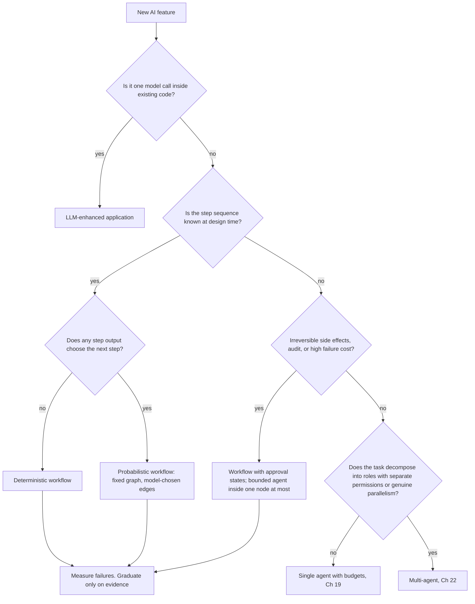
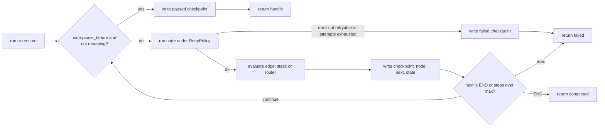
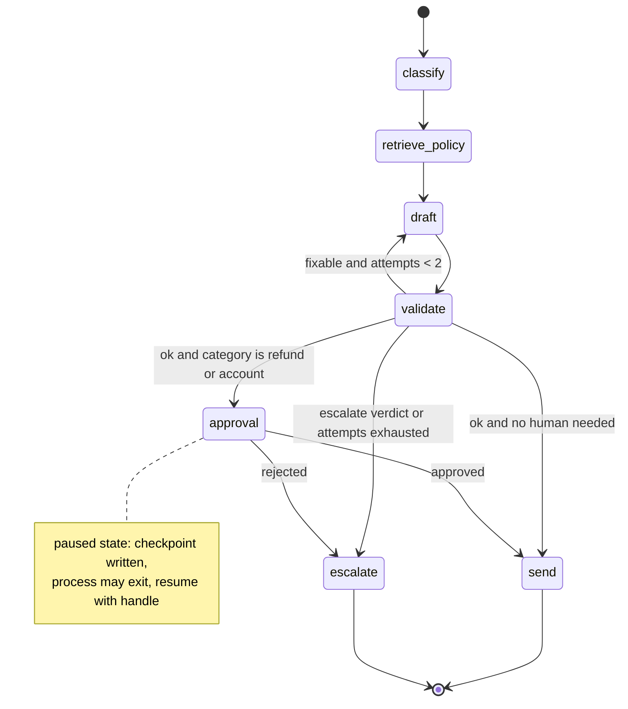

# Chapter 17 — AI Workflows and Orchestration

After this chapter you will be able to place any proposed AI feature on the spectrum from deterministic workflow to multi-agent system, justify the placement with a short written argument, and implement the chosen design as an explicit graph with typed state, per-step error policy, checkpoints, and a human-approval pause that survives a process restart. The code is a plain-Python workflow engine of about 250 lines and the Northwind ticket-triage workflow built twice on top of it: once as a fixed pipeline, once as a graph with conditional edges. Everything runs offline against a scripted fake model (`book/projects/examples/ch17/`).

## Why this matters

Most AI features that survive contact with production are workflows, not agents. A support reply that is classified, grounded in a policy, drafted, checked, and approved is five steps whose order never changes. The model does real work in three of them, but it never decides what happens next. Teams that build this as an autonomous agent pay for the freedom every day: the model rediscovers the same five steps on each ticket, sometimes in a different order, sometimes skipping validation, and every incident review starts with "what did it decide to do this time?"

The opposite mistake is just as expensive. A workflow with a hard-coded path breaks the moment a case needs a step the designer did not anticipate, and the usual repair is a growing thicket of special-case branches that nobody can test. Knowing where a given problem sits on the spectrum, and being able to show the evidence for that placement, is the core skill of this chapter. A useful rule of thumb: build the simplest non-agent baseline first, measure, and add an agent loop only when the action sequence cannot be predetermined.

Orchestration is also where reliability is engineered. Retries, fallbacks, checkpoints, approval gates, and budgets live between the model calls, not inside them. Chapter 3 gave you a client that retries one call. This chapter gives you the layer that decides what a failed call means for the whole job.

## Mental model

> **Mental model:** Agents add nondeterminism and cost; prefer deterministic workflows where the path is known.

The useful way to see the spectrum is a single question asked at every step: *who decides what happens next?* In a deterministic workflow, code decides, and the model only fills in values. In a probabilistic workflow, the model emits a value and code maps that value onto one of a fixed set of edges. In an agent, the model names the next action itself, and code only checks whether it is allowed. The further right you move, the more of the control flow lives in a probability distribution instead of in a file you can read.

A second framing that pays off in implementation: a workflow is a state machine whose state is a typed record. Every step is a function from state to state. Every edge is either a constant or a pure function of the state. Once you see it this way, checkpoints are just serialized state, replay is just re-reading the checkpoint log, a human approval is just a state the machine waits in, and tests are just assertions about which edge a given state selects. None of this needs a framework; it needs discipline about where decisions live.

## Core concepts

### The spectrum, with precise definitions

The five positions below differ in exactly one thing: how much of the control flow the model owns. The definitions are operational, so you can classify a design by reading its code. "Deterministic" and "probabilistic" describe the *path*, not the outputs: a deterministic workflow may contain a model step whose text varies from run to run, as long as that text never changes which step runs next. They are listed in order of increasing complexity, which is also the order you should try them in.

**LLM-enhanced application.** Ordinary software that calls the model as a function: `summary = summarize(ticket)` inside a request handler, `tags = suggest_tags(doc)` inside a save hook. Control flow belongs entirely to the application; the model returns a value that the application uses or discards. It is often the right choice. What separates it from the deterministic workflow below is architectural rather than logical: there is no separate orchestration layer at all, and the model call is typically synchronous, in the request path, and subject to the application's own timeout. Properties: simplest to build and operate; latency is bounded by one call; the whole AI surface is one function with one contract to test.

**Deterministic workflow.** Either no model is involved, or the model runs inside a fixed step whose output is validated against a schema before anything else happens. The path through the steps is fully known at design time. Example: Northwind's nightly job that reads new tickets, asks the model for a category from a closed enum, rejects anything outside the enum, and writes the result to a column. The model is a classifier; the workflow would be the same shape with a regex in its place. Properties: reproducible path, failures are local to one step, tests are ordinary unit tests plus a golden set for the model step.

**Probabilistic workflow.** The graph of steps is fixed, but at one or more points the model's output selects which edge is taken. The set of possible paths is finite and enumerable; which one a given input takes is not known until runtime. Example: the triage workflow in this chapter. A validation step returns `ok`, `fixable`, or `escalate`, and code maps those three values to three edges. The model influences the route, but it cannot invent a fourth destination. Properties: every path can be drawn and tested, but path distribution becomes a production metric you must watch, because a prompt change can silently shift traffic from the cheap edge to the expensive one.

**Agent.** The model chooses actions in a loop. At each iteration it reads the current state and observations, picks a tool or decides to stop, and the harness executes the choice and feeds back the result. The action sequence is not known at design time, and termination is itself a judgment. Chapter 19 builds this loop. Properties: handles paths nobody anticipated; cost and latency are variable per task; failures include loops, drift, and wrong stopping, which are failures of control rather than of any single step.

**Multi-agent.** Several such loops with distinct roles, contexts, or permission domains, coordinated by a supervisor loop or by a fixed protocol. Chapter 22 covers when this is justified: genuine parallelism, separate permission domains, or independent verification. Properties: everything in the agent column multiplied by the number of agents, plus coordination failures and duplicated tokens.

| Position | Who picks the next step | Paths known at design time | Typical failure | Primary test |
|---|---|---|---|---|
| LLM-enhanced application | Application code | One | Bad value from one call | Unit test with a fake model |
| Deterministic workflow | Orchestration code | One | One step fails or returns invalid output | Step tests plus golden set |
| Probabilistic workflow | Code, from a validated model value | Finite, enumerable | Wrong edge chosen; path mix drifts | Router tests plus path-distribution monitoring |
| Agent | Model, checked by policy | Open | Loop, drift, premature or late stop | Trajectory tests, budgets, replay |
| Multi-agent | Supervisor model plus protocol | Open | Coordination, duplicated work, inconsistent state | Contract tests per agent, end-to-end traces |

A design often mixes positions: a probabilistic workflow may contain one node that is itself a bounded agent with a budget of a few steps. That is fine, and it is usually better than making the whole system an agent to accommodate one open-ended sub-task.

### A decision framework

Six questions decide most cases. Answer them for the concrete feature, not for the product vision.

| Criterion | Pushes toward a workflow | Pushes toward an agent |
|---|---|---|
| Is the action sequence known? | Yes, or known up to a few enumerable branches | No; the steps depend on what earlier steps reveal |
| Are side effects involved? | Yes, and they must be gated at fixed points | Side effects are read-only or trivially reversible |
| Is the output verifiable? | Verifiable by code or a human at a fixed step | Only verifiable by iterating against the environment |
| Latency and cost budget | Tight; every call must be accounted for | Loose; variable spend per task is acceptable |
| Audit requirements | Allowed transitions must be enumerable and reviewable | Audit of the trajectory after the fact is enough |
| Cost of a failure | High; a wrong action is expensive or irreversible | Low; a failed attempt can be retried or discarded |

Any "pushes toward a workflow" answer in the side-effects, audit, or failure-cost rows is close to decisive on its own. A regulated process with irreversible actions is a workflow with an approval state even when the sequence is somewhat variable, because the audit requirement is the binding constraint. Conversely, an agent is justified only when the first row says "no" and none of the others say "stop."



Note the final node. The framework is applied at least twice: once before building, once after a few weeks of failure data. Section "When to graduate to an agent" describes what that evidence looks like.

**The rule: start at the simplest position that can meet the acceptance bar, and move one position at a time on evidence.** The ladder, from least to most control flow owned by the model, is: LLM-enhanced application, deterministic workflow, probabilistic workflow, single agent, multi-agent. Each step to the right buys flexibility and costs predictability, latency, money, and debuggability, so each step needs a reason you can write down: a failure the current position cannot fix, measured on real cases. "The model is smart enough to figure out the steps" is not a reason; it describes every position on the ladder. The default answer for a new feature is the leftmost position the flowchart allows, and a proposal further right carries the burden of proof.

Applied to five Northwind features, the questions place them like this. The deciding question is the one whose answer rules out the position to the left.

| Feature | Position | Deciding question and answer |
|---|---|---|
| Suggest tags when an employee saves a runbook | LLM-enhanced application | One model call inside an existing save handler; nothing else happens |
| Nightly invoice extraction into the ledger staging table (Project 1) | Deterministic workflow | Fixed steps: parse, extract, validate, stage; the model fills fields, never picks a step |
| Ticket triage with redraft, approval, and escalation (this chapter) | Probabilistic workflow | Fixed graph, but the validator's verdict chooses among three edges; refunds touch money, so approval is a fixed state |
| Incident research across runbooks, metrics, and past incidents (Project 5) | Single agent with budgets | Which system to consult next depends on what the last one showed; actions are read-only |
| Multi-part research questions with independent verification (Project 6) | Single agent plus a verifier by default; multi-agent only when wall-clock time or separate permission domains require it | Sub-questions are independent and could run in parallel, but Chapter 22's benchmark shows the team only ties a single agent with a verifier on quality and costs more |

The last row is the ladder rule working as intended. The problem has the shape that invites a multi-agent design, and the measurement says the extra position buys nothing on quality: the whole gain came from the verification step, which a single agent can also have. What remains is a latency argument, which you make with a latency budget, not with an architecture diagram.

### Prefer the simplest architecture: the arithmetic

Every model call you add has three costs that compound: latency, money, and a new place to fail. The arithmetic is simple and worth doing on paper before any design review.

**Latency adds.** A chain of four sequential calls, each with a median of 1.5 s, has a median near 6 s. The tail is worse than the sum of medians suggests, because each call's tail is independent and the chain's p95 is dominated by whichever call happened to be slow. If a single-call feature meets an 8 s p95 target with room to spare, the same model in a four-step chain usually does not.

**Cost adds, and context grows.** In a chain the input of step k includes outputs of earlier steps, so tokens per call grow along the chain. In an agent loop the growth is worse: the whole history is replayed at every iteration, so total tokens grow roughly with the square of the number of steps until compaction (Chapter 5) kicks in.

**Reliability multiplies.** If each step independently succeeds with probability p, the whole chain succeeds with probability p^n. The table assumes independence, which is optimistic because a mediocre draft makes validation harder.

| Per-step success p | n = 1 | n = 2 | n = 4 | n = 6 |
|---|---|---|---|---|
| 0.99 | 0.990 | 0.980 | 0.961 | 0.941 |
| 0.97 | 0.970 | 0.941 | 0.885 | 0.833 |
| 0.95 | 0.950 | 0.903 | 0.815 | 0.735 |
| 0.90 | 0.900 | 0.810 | 0.656 | 0.531 |

A six-step chain of individually "pretty good" steps at 0.95 fails one job in four. There are also n minus 1 handoffs, each a place where a schema mismatch or a truncated output can break the next step without any model error at all.

Decomposition is still often right, because narrowing a task raises its per-step p. A classifier asked for one label from four is far more reliable than a single prompt asked to classify, retrieve, and draft at once, and the chain's p^n can beat the monolith's single p. The point of the arithmetic is not "never chain." It is that the gain in per-step reliability has to be measured and has to pay for the multiplied latency and cost. If you cannot show that measurement, the one-call design wins by default.

### Orchestration patterns in plain Python

Every workflow in practice is composed of seven patterns. Naming them lets a reviewer see at a glance what a design costs. The implementations below are from `patterns.py`; the engine in the next section uses the same ideas with checkpoints added.

**Sequence.** Steps run in order, each consuming the previous output. Cost: n calls, n failure points, latency is the sum. Use when the order is fixed and each step needs the previous result.

**Branch.** A decision function picks one of several steps. In a probabilistic workflow the decision function reads a validated model output; the function itself is code. Cost: one extra decision; the branches are now paths you must test and monitor separately.

**Parallel fan-out and fan-in.** Independent steps run concurrently with `asyncio.gather` and a semaphore for provider rate limits; a fan-in step merges results. Latency drops from the sum to the slowest branch. The design decision is in the fan-in: what does a partial result mean? Returning exceptions as values rather than raising forces that question into the code.

**Map-reduce over documents.** The same prompt applied to each of many chunks, followed by one reduce call over the mapped outputs. It is fan-out with a uniform mapper. The failure semantics differ from general fan-out: a summary over a partial set of documents is a different and usually wrong answer, so the implementation raises on the first mapper failure instead of reducing a subset.

**Retry with policy.** Bounded attempts, backoff, and above all a list of which errors are retryable. Retrying a validation failure with the same input is a common waste in production workflows. Chapter 29 covers backoff and circuit breakers in depth; here the pattern is the per-step policy object.

**Fallback.** A second path when the primary fails for a listed reason: a cheaper model, a cached answer, a deterministic template, or a human. The listed reasons matter. Falling back on a bug in your own code hides the bug. (The `retry` and `fallback` helpers below default to catching every exception to keep the listing short; in production, pass the retryable classes explicitly.)

**Human approval as a paused state.** The workflow reaches a state, persists it, and stops. A person decides later, in another process, and the workflow resumes from the persisted state. This cannot be done with a function call that blocks until someone clicks, because the process may not live that long. It is the pattern that forces the state-machine view, and it is why the triage pipeline cannot do it and the triage graph can.

```python
# path: book/projects/examples/ch17/patterns.py
"""Orchestration patterns as plain Python functions.

Each pattern is a few lines. The value is not the code; it is naming the
pattern so that a reviewer can see which one a workflow uses and what it
costs: sequence (n calls, n failure points), branch (one extra decision),
fan-out (latency of the slowest branch), map-reduce (n maps + 1 reduce),
retry (bounded attempts), fallback (second path, usually cheaper).
"""
from __future__ import annotations

import asyncio
from collections.abc import Awaitable, Callable, Iterable, Sequence
from typing import Any, TypeVar

T = TypeVar("T")
R = TypeVar("R")


def sequence(*steps: Callable[[T], T]) -> Callable[[T], T]:
    """Run steps in order, feeding each output into the next."""

    def run(state: T) -> T:
        for step in steps:
            state = step(state)
        return state

    return run


def branch(router: Callable[[T], str], routes: dict[str, Callable[[T], T]],
           default: Callable[[T], T] | None = None) -> Callable[[T], T]:
    """Pick one of several steps based on a decision function."""

    def run(state: T) -> T:
        key = router(state)
        step = routes.get(key, default)
        if step is None:
            raise KeyError(f"no route for {key!r} and no default")
        return step(state)

    return run


async def fan_out(tasks: Sequence[Callable[[], Awaitable[R]]], *,
                  max_concurrency: int = 8) -> list[R | BaseException]:
    """Run independent coroutines concurrently; return results in input order.

    Failures are returned, not raised, so the fan-in step decides what a
    partial result means for the workflow.
    """
    sem = asyncio.Semaphore(max_concurrency)

    async def guarded(task: Callable[[], Awaitable[R]]) -> R:
        async with sem:
            return await task()

    return list(await asyncio.gather(*(guarded(t) for t in tasks), return_exceptions=True))


async def map_reduce(items: Iterable[T], mapper: Callable[[T], Awaitable[R]],
                     reducer: Callable[[list[R]], Any], *, max_concurrency: int = 8) -> Any:
    """Map each item concurrently (one model call each), then reduce once.

    Raises the first mapper failure: a summary over a partial set of
    documents is a different, usually wrong, answer.
    """
    results = await fan_out([lambda i=i: mapper(i) for i in items], max_concurrency=max_concurrency)
    failures = [r for r in results if isinstance(r, BaseException)]
    if failures:
        raise failures[0]
    return reducer(results)  # type: ignore[arg-type]


def retry(fn: Callable[[], R], *, attempts: int = 3,
          retry_on: tuple[type[BaseException], ...] = (Exception,),
          sleep: Callable[[float], None] | None = None, base_delay_s: float = 0.0) -> R:
    """Call fn up to `attempts` times; only `retry_on` errors are retried."""
    last: BaseException | None = None
    for attempt in range(1, attempts + 1):
        try:
            return fn()
        except retry_on as exc:
            last = exc
            if attempt < attempts and sleep is not None:
                sleep(base_delay_s * 2 ** (attempt - 1))
    assert last is not None
    raise last


def fallback(primary: Callable[[], R], secondary: Callable[[], R],
             on: tuple[type[BaseException], ...] = (Exception,)) -> R:
    """Try the primary path; on a listed error use the secondary path."""
    try:
        return primary()
    except on:
        return secondary()
```

### Workflows as explicit state machines with typed state

The state between steps is a pydantic model. This buys four things at once. The schema is a contract at every handoff, so a step that produces an unexpected shape fails at the boundary with a readable error instead of three steps later. The state serializes to JSON, so it can be checkpointed and replayed. Fields have types and defaults, so a router can be written and tested against a hand-built state without running any step. And the model's output enters the state only through a validated field, which is the trust boundary: the model never names a node.

Rules for designing the state record:

- **Append, do not overwrite, where history matters.** A `log` list and a `draft_attempts` counter let routers make decisions about retries and let a human see what happened. Overwriting the draft is fine; losing the fact that there were two drafts is not.
- **Keep it small and flat.** The state is written to the checkpoint store after every node. Large blobs (full documents, raw retrieval results) belong in object storage with a reference in the state.
- **Store decisions, not just values.** `approved: bool | None` with `None` meaning "not yet asked" lets the same state answer "are we waiting on a human?" without a second table.
- **Make derived values recomputable.** If a field can be recomputed from others, consider not storing it; stale derived fields are a classic replay bug.
- **Carry tenancy and identity.** Northwind states carry `tenant`. Every step that retrieves or sends must read it; a checkpoint resumed in another tenant's context is a leakage path.

### Checkpointing and resumption

A checkpoint is the serialized state plus two pieces of control information: which node just ran and which node runs next. The engine writes one after every node. That cadence gives three capabilities.

**Resume after a crash.** If the process dies between nodes, a new process loads the latest checkpoint and continues from `next_node`. Earlier steps, including their model calls, are not repeated. If the process dies inside a node, the node is repeated. This is at-least-once execution: a node may run more than once, but never zero times, which is harmless for pure steps and dangerous for side effects. Side-effecting nodes must therefore be idempotent, exactly as Chapter 16 describes for tool calls.

The engine provides the key: `step_key()` returns `run_id:node:visit`, where `visit` counts how many times that node already completed in this run. The sequence number would be the wrong ingredient, because a failed attempt writes its own checkpoint and consumes a sequence number, so the re-execution after a crash would get a different key and the duplicate would go through. With the visit count, a re-executed `send` presents the same key and the sender suppresses it, while a node legitimately visited twice, such as `draft` in a redraft loop, gets a new key each time.

**Pause for a human.** A paused checkpoint is a checkpoint whose `next_node` is the approval node and whose status says so. Resuming applies the human's decision to the state and continues. The decision must be bound to the exact state the human saw. The `ResumeHandle` therefore carries the paused checkpoint's sequence number and a hash of its state, and `resume` refuses with `StaleHandleError` if the latest checkpoint is no longer that pause or if the stored state no longer hashes to the same value. Show the approver the state the hash was computed from, and the approval cannot be applied to a draft they never read.

**Replay for debugging and evaluation.** The checkpoint log is a sequence of states. Reading it answers "what did the state look like after `validate` on run 7" without re-running anything. Chapter 19 extends this into counterfactual replay for agents, where a new prompt is run over recorded observations.

Checkpoints must be written by the engine, not by steps, and must be written after the step completes, not before. Writing before gives a checkpoint that claims a step ran when it did not. The one exception is the paused checkpoint, which is written before the approval node by design, because the approval node's job is to wait.

### Error classes per step

A step can fail in five distinct ways, and the orchestration policy differs for each. Collapsing them into one `except Exception` is a common source of runaway cost in workflows.

| Error class | Example | Right response | Wrong response |
|---|---|---|---|
| Transient | Timeout, rate limit, provider 5xx | Retry with backoff, bounded | Fail the whole run on first hit |
| Validation | Output fails schema or business check | Route: re-draft with the error in context, or escalate | Retry with the same input |
| Semantic | Output is valid but wrong (misread the ticket) | Detect with a validator step; route | Nothing, because no exception was raised |
| Fatal | Bug in our code, bad configuration | Stop, keep state, alert | Retry; fallback that masks the bug |
| Impossible | Task cannot be done with available tools or data | Escalate to a human with context | Loop until budget is gone |

The engine encodes the first, second, and fourth as exception classes; their `retryable` flag documents intent, and the retry policy's `retry_on` on each node decides what is actually retried. Semantic errors do not raise; they are caught by a validation node that writes a verdict into the state, and a router acts on the verdict. Impossible tasks surface as repeated validation failures and are caught by an attempt counter in the router. The pattern is consistent: exceptions are for the engine, verdicts are for the graph.

## How it works

The engine's run loop is short enough to hold in your head, which is the point of writing it before adopting a library that hides it.

1. `run` creates a `run_id` and calls `_execute` at the entry node with a step counter at zero.
2. For the current node: if it is marked `pause_before` and the run was not resumed with a human decision, write a paused checkpoint whose `next_node` is this node and return a `RunResult` with status `paused` and a `ResumeHandle`.
3. Otherwise run the node under its retry policy. Each attempt calls the step, awaits it if it returned an awaitable, and on an exception checks two conditions: is this exception type in `retry_on`, and are attempts left. If either is false the node fails; the engine writes a failed checkpoint that still points at this node and returns `failed` with the error.
4. On success, evaluate the edge. A static edge is a string; a router is a function of the new state that returns a node name or `END`. The target is validated against the node table, so a router bug surfaces as a `ValueError` at the edge, not as a silent end.
5. Write a checkpoint recording this node, the chosen next node, and the serialized state. Increment the sequence and the step counter. If the counter reaches `max_steps`, fail: a graph with a cycle must still terminate.
6. Repeat until the current node is `END`.

Two details of step 3 matter. Each attempt receives a deep copy of the state, so a step that mutates a field and then raises cannot leak a half-applied change into the retry or into the failed checkpoint. And while a node runs, `step_key()` returns its idempotency key, and the node runs inside a `workflow.node` span when the graph was given a tracer (any object with `span(name, **attributes)`, such as `aie_core`'s tracers), carrying attempts, status, and the chosen next node.

Four entry points use the checkpoint log:

- `resume` loads the latest checkpoint, verifies it is paused at the node the handle names and that its sequence number and state hash match the handle, rebuilds the state through pydantic validation, applies the node's `on_decision` function with the human's decision, and re-enters `_execute` at that node with `skip_pause=True` so the approval node runs once instead of pausing again.
- `resume_from_checkpoint` continues from the latest checkpoint without a decision, for the crash case.
- `aresume` and `aresume_from_checkpoint` are async twins for callers that already run an event loop, such as a FastAPI handler; the sync versions call `asyncio.run` and fail inside a running loop.
- `replay` reads the history and validates each stored state back into the state type.



## Architecture

The triage graph has seven nodes and two routers. Three nodes call the model, one is a deterministic lookup, one is a paused approval state, and two are terminal actions. The approval requirement is decided by code from the category, not by the model: refunds and account changes are side effects a human signs off on.



The trust boundary runs through `validate` and the two routers. Model text enters the state as `draft` and as a parsed `verdict`; it becomes control flow only after code has turned it into one of three enumerated values and checked the attempt counter. The `send` node is the only irreversible action, it is never retried by the engine, and it is reached only through `validate` returning `ok` and, for sensitive categories, a recorded human decision.

## Implementation

The chapter's code is six files plus tests. The engine knows nothing about tickets; the domain knows nothing about graphs. The pipeline and the graph are two thin orchestration layers over the same step functions, so any difference in behavior between them is attributable to orchestration alone.

```
book/projects/examples/ch17/
├── workflow_engine.py   # Graph, Step, RetryPolicy, Checkpointer, pause/resume, replay, step_key
├── patterns.py          # sequence, branch, fan_out, map_reduce, retry, fallback
├── triage_domain.py     # TriageState, six step functions, FakeModel, policies
├── triage_pipeline.py   # fixed pipeline with synchronous approval
├── triage_graph.py      # the same workflow as a Graph with routers and a pause
├── compare.py           # orchestration overhead vs model time
├── test_ch17.py         # offline tests
└── README.md
```

Run from the repository root:

```bash
.venv/bin/python -m pytest book/projects/examples/ch17 -q
```

### The engine

Read it in the order of the run loop above: the error classes, the idempotency key, the retry policy, checkpoints, then `Graph` itself.

```python
# path: book/projects/examples/ch17/workflow_engine.py
"""A small, explicit workflow engine: typed state, nodes, conditional edges,
per-node retry policy, checkpoints, and pause/resume for human approval.

The engine is deliberately plain Python. Everything a library such as LangGraph
does for you is visible here in about 250 lines of code.
"""
from __future__ import annotations

import asyncio
import contextlib
import contextvars
import hashlib
import inspect
import json
import time
import uuid
from collections import Counter
from dataclasses import dataclass, field
from typing import Any, Awaitable, Callable, Generic, Literal, Protocol, TypeVar

from pydantic import BaseModel

END = "__end__"
S = TypeVar("S", bound=BaseModel)
Status = Literal["completed", "paused", "failed"]


# --- error classes a step may raise ---------------------------------------
class StepError(Exception):
    """Base class. `retryable` documents whether a retry can help; a node's `retry_on` decides."""

    retryable: bool = False


class TransientError(StepError):
    """Infrastructure hiccup: timeout, rate limit, 5xx. Retry is reasonable."""

    retryable = True


class StepValidationError(StepError):
    """The step produced output that failed validation. Retrying the same
    input rarely helps; the graph should route, not loop blindly."""


class FatalError(StepError):
    """Do not retry, do not continue. Preserve state for a human."""


class StaleHandleError(ValueError):
    """The handle no longer matches the paused checkpoint: refuse to apply the decision."""


# --- idempotency key for side-effecting nodes -------------------------------
_STEP_KEY: contextvars.ContextVar[str] = contextvars.ContextVar("workflow_step_key")


def step_key() -> str:
    """Stable key for the node now running: `run_id:node:visit`.

    `visit` counts earlier *successful* runs of the same node in this run, so a
    node re-executed after a crash or a failed attempt gets the same key, and a
    node legitimately visited twice (a redraft loop) gets a new one.
    """
    return _STEP_KEY.get()


def state_hash(state: dict[str, Any]) -> str:
    return hashlib.sha256(json.dumps(state, sort_keys=True).encode()).hexdigest()[:16]


# --- step and policy ------------------------------------------------------
class Step(Protocol[S]):
    def __call__(self, state: S) -> S | Awaitable[S]: ...


@dataclass(frozen=True)
class RetryPolicy:
    max_attempts: int = 1
    base_delay_s: float = 0.0
    max_delay_s: float = 2.0
    retry_on: tuple[type[BaseException], ...] = (TransientError,)

    def delay(self, attempt: int) -> float:
        return min(self.max_delay_s, self.base_delay_s * (2 ** (attempt - 1)))


# --- checkpoints ----------------------------------------------------------
@dataclass(frozen=True)
class Checkpoint:
    run_id: str
    seq: int
    node: str          # node that just finished (or paused/failed before running)
    next_node: str     # where execution continues
    status: Status | Literal["running"]
    state: dict[str, Any]
    ts: float = field(default_factory=time.time)


class Checkpointer(Protocol):
    def save(self, cp: Checkpoint) -> None: ...
    def latest(self, run_id: str) -> Checkpoint | None: ...
    def history(self, run_id: str) -> list[Checkpoint]: ...


class InMemoryCheckpointer:
    def __init__(self) -> None:
        self._log: dict[str, list[Checkpoint]] = {}

    def save(self, cp: Checkpoint) -> None:
        self._log.setdefault(cp.run_id, []).append(cp)

    def latest(self, run_id: str) -> Checkpoint | None:
        log = self._log.get(run_id)
        return log[-1] if log else None

    def history(self, run_id: str) -> list[Checkpoint]:
        return list(self._log.get(run_id, []))


# --- run result -----------------------------------------------------------
@dataclass
class StepRecord:
    node: str
    attempts: int
    duration_ms: float
    error: str | None = None


@dataclass(frozen=True)
class ResumeHandle:
    run_id: str
    node: str                       # the approval node waiting for a decision
    seq: int | None = None          # seq of the paused checkpoint the human saw
    state_hash: str | None = None   # hash of the state the human saw


@dataclass
class RunResult(Generic[S]):
    run_id: str
    status: Status
    state: S
    trace: list[StepRecord]
    handle: ResumeHandle | None = None
    error: str | None = None


# --- graph ----------------------------------------------------------------
@dataclass
class _Node:
    fn: Step
    retry: RetryPolicy
    pause_before: bool
    on_decision: Callable[[Any, Any], Any] | None


class Graph(Generic[S]):
    """Directed graph of steps over one pydantic state type.

    Nodes receive the state and return a new state (or mutate and return it).
    Edges are static (`add_edge`) or conditional (`add_router`: a function of
    the state that returns the next node name or END).
    """

    def __init__(self, state_type: type[S], checkpointer: Checkpointer | None = None,
                 max_steps: int = 50, tracer: Any | None = None) -> None:
        self.state_type = state_type
        self.checkpointer = checkpointer or InMemoryCheckpointer()
        self.max_steps = max_steps
        self.tracer = tracer   # anything with .span(name, **attrs), e.g. an aie_core Tracer
        self._nodes: dict[str, _Node] = {}
        self._edges: dict[str, str | Callable[[S], str]] = {}
        self._entry: str | None = None

    # building --------------------------------------------------------
    def add_node(self, name: str, fn: Step, *, retry: RetryPolicy = RetryPolicy(),
                 pause_before: bool = False,
                 on_decision: Callable[[S, Any], S] | None = None) -> "Graph[S]":
        if name in self._nodes or name == END:
            raise ValueError(f"duplicate or reserved node name: {name}")
        self._nodes[name] = _Node(fn, retry, pause_before, on_decision)
        if self._entry is None:
            self._entry = name
        return self

    def add_edge(self, src: str, dst: str) -> "Graph[S]":
        self._check(src); self._check(dst)
        self._edges[src] = dst
        return self

    def add_router(self, src: str, router: Callable[[S], str]) -> "Graph[S]":
        self._check(src)
        self._edges[src] = router
        return self

    def set_entry(self, name: str) -> "Graph[S]":
        self._check(name)
        self._entry = name
        return self

    def _check(self, name: str) -> None:
        if name != END and name not in self._nodes:
            raise ValueError(f"unknown node: {name}")

    def _next(self, node: str, state: S) -> str:
        edge = self._edges.get(node, END)
        target = edge(state) if callable(edge) else edge
        self._check(target)
        return target

    # running ----------------------------------------------------------
    def run(self, state: S, run_id: str | None = None) -> RunResult[S]:
        return asyncio.run(self.arun(state, run_id))

    async def arun(self, state: S, run_id: str | None = None) -> RunResult[S]:
        if self._entry is None:
            raise ValueError("graph has no nodes")
        run_id = run_id or uuid.uuid4().hex[:12]
        return await self._execute(run_id, self._entry, state, seq=0, trace=[])

    def resume(self, handle: ResumeHandle, decision: Any) -> RunResult[S]:
        """Continue a paused run with a human decision."""
        return asyncio.run(self.aresume(handle, decision))

    async def aresume(self, handle: ResumeHandle, decision: Any) -> RunResult[S]:
        cp = self.checkpointer.latest(handle.run_id)
        if cp is None or cp.status != "paused" or cp.next_node != handle.node:
            raise StaleHandleError("no paused checkpoint matches this handle")
        if handle.seq is not None and cp.seq != handle.seq:
            raise StaleHandleError(f"handle is for pause seq {handle.seq}, run is paused at {cp.seq}")
        if handle.state_hash is not None and state_hash(cp.state) != handle.state_hash:
            raise StaleHandleError("paused state changed since the approver saw it")
        state = self.state_type.model_validate(cp.state)
        node = self._nodes[handle.node]
        if node.on_decision is not None:
            state = node.on_decision(state, decision)
        return await self._execute(handle.run_id, handle.node, state,
                                   seq=cp.seq + 1, trace=[], skip_pause=True)

    def resume_from_checkpoint(self, run_id: str) -> RunResult[S]:
        """Continue after a crash from the last durable checkpoint."""
        return asyncio.run(self.aresume_from_checkpoint(run_id))

    async def aresume_from_checkpoint(self, run_id: str) -> RunResult[S]:
        cp = self.checkpointer.latest(run_id)
        if cp is None:
            raise ValueError(f"no checkpoint for run {run_id}")
        if cp.status == "completed":
            return RunResult(run_id, "completed", self.state_type.model_validate(cp.state), [])
        state = self.state_type.model_validate(cp.state)
        return await self._execute(run_id, cp.next_node, state, seq=cp.seq + 1, trace=[])

    def replay(self, run_id: str) -> list[tuple[str, S]]:
        """States as they were after each node, from the checkpoint log."""
        return [(cp.node, self.state_type.model_validate(cp.state))
                for cp in self.checkpointer.history(run_id)]

    async def _execute(self, run_id: str, current: str, state: S, *, seq: int,
                       trace: list[StepRecord], skip_pause: bool = False) -> RunResult[S]:
        steps = 0
        visits = Counter(cp.node for cp in self.checkpointer.history(run_id)
                         if cp.status in ("running", "completed"))
        while current != END:
            if steps >= self.max_steps:
                self._save(run_id, seq, current, current, "failed", state)
                return RunResult(run_id, "failed", state, trace, error="max_steps exceeded")
            node = self._nodes[current]
            if node.pause_before and not skip_pause:
                cp = self._save(run_id, seq, current, current, "paused", state)
                handle = ResumeHandle(run_id, current, seq=seq, state_hash=state_hash(cp.state))
                return RunResult(run_id, "paused", state, trace, handle=handle)
            skip_pause = False
            token = _STEP_KEY.set(f"{run_id}:{current}:{visits[current]}")
            try:
                with self._span(run_id, current) as span:
                    record, state, err = await self._run_node(current, node, state)
                    nxt = current if err is not None else self._next(current, state)
                    if span is not None:
                        span.set_attribute("workflow.attempts", record.attempts)
                        span.set_attribute("workflow.status", "failed" if err else "ok")
                        span.set_attribute("workflow.next_node", nxt)
            finally:
                _STEP_KEY.reset(token)
            trace.append(record)
            if err is not None:
                self._save(run_id, seq, current, current, "failed", state)
                return RunResult(run_id, "failed", state, trace, error=f"{current}: {err}")
            self._save(run_id, seq, current, nxt, "completed" if nxt == END else "running", state)
            visits[current] += 1
            seq += 1; steps += 1; current = nxt
        return RunResult(run_id, "completed", state, trace)

    def _span(self, run_id: str, node: str) -> Any:
        if self.tracer is None:
            return contextlib.nullcontext(None)
        return self.tracer.span("workflow.node", run_id=run_id, node=node)

    async def _run_node(self, name: str, node: _Node, state: S) -> tuple[StepRecord, S, str | None]:
        started = time.perf_counter()
        attempt = 0
        while True:
            attempt += 1
            try:
                # Each attempt gets a copy: a step that mutates state and then raises
                # must not leak half-applied changes into the retry or the checkpoint.
                result = node.fn(state.model_copy(deep=True))
                if inspect.isawaitable(result):
                    result = await result
                ms = (time.perf_counter() - started) * 1000
                return StepRecord(name, attempt, ms), result, None
            except Exception as exc:  # noqa: BLE001 - we classify below
                can_retry = isinstance(exc, node.retry.retry_on) and attempt < node.retry.max_attempts
                if not can_retry:
                    ms = (time.perf_counter() - started) * 1000
                    return StepRecord(name, attempt, ms, error=repr(exc)), state, repr(exc)
                await asyncio.sleep(node.retry.delay(attempt))

    def _save(self, run_id: str, seq: int, node: str, nxt: str, status: Any, state: S) -> Checkpoint:
        cp = Checkpoint(run_id, seq, node, nxt, status, state.model_dump(mode="json"))
        self.checkpointer.save(cp)
        return cp
```

### The domain: state, steps, and a scripted model

The step functions take the state and a `Model`, which in this chapter is any callable `(task, prompt) -> str`. In the full Northwind stack the callable wraps `ModelGateway.complete` from `aie_core` (Chapter 3) and the fake is `FakeLLM(handler=...)`; the step functions do not change. Policies are a dictionary standing in for the retrieval layer of Part IV.

```python
# path: book/projects/examples/ch17/triage_domain.py
"""Shared domain for the Northwind ticket-triage example.

Both the fixed pipeline and the graph import from here, so the comparison
between the two is about orchestration only, not about step logic.
"""
from __future__ import annotations

import json
import time
from collections.abc import Callable
from dataclasses import dataclass, field
from typing import Literal

from pydantic import BaseModel, Field

Category = Literal["refund", "shipping", "account", "other"]
Verdict = Literal["ok", "fixable", "escalate"]

# A model is just a callable in this chapter. In the full stack this is
# `gateway.complete(CompletionRequest(...))` from aie_core; see Chapter 3.
Model = Callable[[str, str], str]  # (task, prompt) -> text

POLICIES: dict[str, str] = {
    "refund": "Retail refund policy: full refund within 30 days with receipt; "
              "store credit up to 90 days. Never promise a refund for opened software.",
    "shipping": "Logistics policy: standard delivery 3-5 business days; "
                "delays over 7 days qualify for free re-shipment.",
    "account": "Account policy: identity must be verified before any account change; "
               "never share account details in a reply.",
}


class ValidationReport(BaseModel):
    verdict: Verdict
    reasons: list[str] = Field(default_factory=list)


class TriageState(BaseModel):
    ticket_id: str
    tenant: Literal["retail", "logistics"]
    text: str
    category: Category | None = None
    policy: str | None = None
    draft: str | None = None
    report: ValidationReport | None = None
    draft_attempts: int = 0
    approved: bool | None = None
    approval_note: str | None = None
    sent: bool = False
    outcome: Literal["sent", "escalated"] | None = None
    log: list[str] = Field(default_factory=list)


@dataclass
class ModelCall:
    task: str
    duration_ms: float


@dataclass
class FakeModel:
    """Scripted model. `scripts[task]` is a list of replies consumed in order;
    the last reply is repeated when the list is exhausted."""

    scripts: dict[str, list[str]]
    simulated_latency_ms: float = 0.0
    calls: list[ModelCall] = field(default_factory=list)
    _cursor: dict[str, int] = field(default_factory=dict)

    def __call__(self, task: str, prompt: str) -> str:
        started = time.perf_counter()
        replies = self.scripts[task]
        idx = min(self._cursor.get(task, 0), len(replies) - 1)
        self._cursor[task] = idx + 1
        if self.simulated_latency_ms:
            time.sleep(self.simulated_latency_ms / 1000)
        self.calls.append(ModelCall(task, (time.perf_counter() - started) * 1000))
        return replies[idx]


# --- the six steps, as pure functions of (state, model) ---------------------
def classify(state: TriageState, model: Model) -> TriageState:
    raw = model("classify", f"Classify this support ticket into refund/shipping/account/other:\n{state.text}")
    category = raw.strip().lower()
    if category not in ("refund", "shipping", "account", "other"):
        raise ValueError(f"classifier returned an unknown label: {raw!r}")
    state.category = category  # type: ignore[assignment]
    state.log.append(f"classified as {category}")
    return state


def retrieve_policy(state: TriageState) -> TriageState:
    """Deterministic step: no model involved. A dict stands in for retrieval."""
    assert state.category is not None
    state.policy = POLICIES.get(state.category, "No specific policy; answer generically and offer escalation.")
    state.log.append("policy retrieved")
    return state


def draft_reply(state: TriageState, model: Model) -> TriageState:
    prompt = (f"Policy:\n{state.policy}\n\nTicket:\n{state.text}\n\n"
              f"Write a short reply. Previous validation: {state.report.model_dump() if state.report else 'none'}")
    state.draft = model("draft", prompt)
    state.draft_attempts += 1
    state.log.append(f"draft #{state.draft_attempts}")
    return state


def validate(state: TriageState, model: Model) -> TriageState:
    """Two layers: deterministic checks first, model judgment second."""
    reasons: list[str] = []
    assert state.draft is not None
    if "guarantee" in state.draft.lower() or "promise" in state.draft.lower():
        reasons.append("draft makes a promise the policy does not allow")
    if state.category == "account" and "@" in state.draft:
        reasons.append("draft may leak account data")
    raw = model("validate", f"Policy:\n{state.policy}\nDraft:\n{state.draft}\nReturn JSON {{verdict, reasons}}.")
    judged = json.loads(raw)
    verdict: Verdict = judged["verdict"]
    reasons.extend(judged.get("reasons", []))
    if reasons and verdict == "ok":
        verdict = "fixable"
    state.report = ValidationReport(verdict=verdict, reasons=reasons)
    state.log.append(f"validated: {verdict}")
    return state


def needs_human(state: TriageState) -> bool:
    """Policy decision in code, not in the model: account changes and refunds
    are side effects a human signs off on."""
    return state.category in ("account", "refund")


# (ticket_id, body, idempotency_key): the sender must deliver at most once per key.
Sender = Callable[[str, str, str], None]


def send(state: TriageState, sender: Sender, key: str | None = None) -> TriageState:
    """The only irreversible step. The key lets the sender suppress a duplicate
    when the step is re-executed after a crash or an ambiguous failure."""
    assert state.draft is not None
    sender(state.ticket_id, state.draft, key or f"{state.ticket_id}:send")
    state.sent = True
    state.outcome = "sent"
    state.log.append("sent")
    return state


def escalate(state: TriageState) -> TriageState:
    state.outcome = "escalated"
    state.log.append("escalated to a human agent")
    return state
```

### The same workflow as a fixed pipeline

Watch where approval happens; it is the one thing this version cannot do well.

```python
# path: book/projects/examples/ch17/triage_pipeline.py
"""Ticket triage as a fixed pipeline: classify -> retrieve policy -> draft ->
validate -> approve/send. Control flow is ordinary Python. There is no
engine, no graph, and therefore no way to pause: the approver must answer
synchronously, inside the request.
"""
from __future__ import annotations

import time
from collections.abc import Callable
from dataclasses import dataclass, field

from triage_domain import (FakeModel, Model, Sender, TriageState, classify, draft_reply, escalate,
                           needs_human, retrieve_policy, send, validate)

MAX_DRAFTS = 2


@dataclass
class PipelineMetrics:
    step_ms: dict[str, float] = field(default_factory=dict)
    model_ms: float = 0.0

    @property
    def total_ms(self) -> float:
        return sum(self.step_ms.values())

    @property
    def orchestration_overhead_ms(self) -> float:
        """Wall time not spent waiting on the model: our code, serialization, I/O."""
        return self.total_ms - self.model_ms


def run_pipeline(state: TriageState, model: Model, approver: Callable[[TriageState], bool],
                 sender: Sender,
                 metrics: PipelineMetrics | None = None) -> TriageState:
    metrics = metrics if metrics is not None else PipelineMetrics()

    def timed(name: str, fn: Callable[[], TriageState]) -> TriageState:
        t0 = time.perf_counter()
        result = fn()
        metrics.step_ms[name] = metrics.step_ms.get(name, 0.0) + (time.perf_counter() - t0) * 1000
        return result

    state = timed("classify", lambda: classify(state, model))
    state = timed("retrieve_policy", lambda: retrieve_policy(state))

    while True:
        state = timed("draft", lambda: draft_reply(state, model))
        state = timed("validate", lambda: validate(state, model))
        assert state.report is not None
        if state.report.verdict == "ok":
            break
        if state.report.verdict == "escalate" or state.draft_attempts >= MAX_DRAFTS:
            return timed("escalate", lambda: escalate(state))

    if needs_human(state):
        decision = timed("approve", lambda: _apply_decision(state, approver(state)))
        if not decision.approved:
            return timed("escalate", lambda: escalate(state))

    if isinstance(model, FakeModel):
        metrics.model_ms = sum(c.duration_ms for c in model.calls)
    return timed("send", lambda: send(state, sender))


def _apply_decision(state: TriageState, approved: bool) -> TriageState:
    state.approved = approved
    state.log.append(f"approval: {'yes' if approved else 'no'}")
    return state
```

### The same workflow as a graph

Compare the approval node and the two routers with the pipeline's inline branches.

```python
# path: book/projects/examples/ch17/triage_graph.py
"""The same triage workflow as an explicit graph with conditional edges.

What changes compared with the pipeline: the approval step is a paused
state with a resumable handle, retries are a per-node policy instead of
try/except, every transition is checkpointed, and the branching rules are
one routing function you can unit-test without running any step.
"""
from __future__ import annotations

from triage_domain import (Model, Sender, TriageState, classify, draft_reply, escalate, needs_human,
                           retrieve_policy, send, validate)
from workflow_engine import END, Checkpointer, Graph, RetryPolicy, step_key

MAX_DRAFTS = 2


def route_after_validate(state: TriageState) -> str:
    assert state.report is not None
    if state.report.verdict == "ok":
        return "approval" if needs_human(state) else "send"
    if state.report.verdict == "fixable" and state.draft_attempts < MAX_DRAFTS:
        return "draft"
    return "escalate"


def route_after_approval(state: TriageState) -> str:
    return "send" if state.approved else "escalate"


def record_decision(state: TriageState, decision: dict) -> TriageState:
    state.approved = bool(decision.get("approved"))
    state.approval_note = decision.get("note")
    state.log.append(f"approval: {'yes' if state.approved else 'no'}")
    return state


def build_triage_graph(model: Model, sender: Sender,
                       checkpointer: Checkpointer | None = None,
                       model_retry: RetryPolicy = RetryPolicy(max_attempts=3),
                       tracer: object | None = None) -> Graph[TriageState]:
    g: Graph[TriageState] = Graph(TriageState, checkpointer=checkpointer, max_steps=20, tracer=tracer)
    g.add_node("classify", lambda s: classify(s, model), retry=model_retry)
    g.add_node("retrieve_policy", retrieve_policy)
    g.add_node("draft", lambda s: draft_reply(s, model), retry=model_retry)
    g.add_node("validate", lambda s: validate(s, model), retry=model_retry)
    # The approval node itself does nothing; the engine pauses before it and
    # applies the human decision through `on_decision` when resumed.
    g.add_node("approval", lambda s: s, pause_before=True, on_decision=record_decision)
    # Side effect: no retry policy, and a key that is stable across re-execution.
    g.add_node("send", lambda s: send(s, sender, key=step_key()))
    g.add_node("escalate", escalate)

    g.add_edge("classify", "retrieve_policy")
    g.add_edge("retrieve_policy", "draft")
    g.add_edge("draft", "validate")
    g.add_router("validate", route_after_validate)
    g.add_router("approval", route_after_approval)
    g.add_edge("send", END)
    g.add_edge("escalate", END)
    return g
```

### Tests

The full test file is on disk; the tests below are the ones that demonstrate the chapter's claims: pause and resume across "processes," checkpoint replay after a crash, routers tested without running steps, refusal of a stale approval, and at-most-once delivery when `send` is re-executed. `Sent` is a sender fake that records every key and delivers at most once per key.

```python
# path: book/projects/examples/ch17/test_ch17.py  (excerpt; full file on disk)
def test_graph_pauses_for_approval_and_resumes() -> None:
    model = FakeModel({"classify": ["refund"], "draft": ["Refund issued within 30 days."], "validate": [OK]})
    sent = Sent()
    cps = InMemoryCheckpointer()
    g = build_triage_graph(model, sent, checkpointer=cps)

    paused = g.run(refund_ticket(), run_id="run-approve")
    assert paused.status == "paused" and paused.handle is not None and paused.handle.node == "approval"
    assert sent.messages == [], "nothing is sent while a human has not decided"
    assert cps.latest("run-approve").status == "paused"

    # ...minutes or days later, in a different process:
    g2 = build_triage_graph(model, sent, checkpointer=cps)
    done = g2.resume(paused.handle, {"approved": True, "note": "ok per policy"})
    assert done.status == "completed" and done.state.outcome == "sent"
    assert done.state.approval_note == "ok per policy" and len(sent.messages) == 1
    assert [c.task for c in model.calls] == ["classify", "draft", "validate"], "resume re-runs no model step"


def test_checkpoint_replay_and_resume_after_crash() -> None:
    model = FakeModel({"classify": ["shipping"], "draft": ["Re-shipping now."], "validate": [OK]})
    sent = Sent()
    cps = InMemoryCheckpointer()
    crash = {"armed": True}

    def crashing_draft(task: str, prompt: str) -> str:
        if task == "draft" and crash["armed"]:
            crash["armed"] = False
            raise FatalError("process killed mid-step")
        return model(task, prompt)

    g = build_triage_graph(crashing_draft, sent, checkpointer=cps)
    first = g.run(shipping_ticket(), run_id="run-crash")
    assert first.status == "failed" and "FatalError" in (first.error or "")
    assert [n for n, _ in g.replay("run-crash")] == ["classify", "retrieve_policy", "draft"]
    assert cps.latest("run-crash").next_node == "draft", "failed checkpoint points at the step to redo"

    # New process: same checkpointer, fixed model. Continue from the last durable state.
    g2 = build_triage_graph(model, sent, checkpointer=cps)
    second = g2.resume_from_checkpoint("run-crash")
    assert second.status == "completed" and second.state.outcome == "sent"
    assert [c.task for c in model.calls] == ["classify", "draft", "validate"], "classify was not re-run"


def test_graph_branch_rules_are_testable_without_running_steps() -> None:
    s = refund_ticket()
    s.category = "refund"; s.draft_attempts = 1
    s.report = ValidationReport(verdict="ok")
    assert route_after_validate(s) == "approval"
    s.report = ValidationReport(verdict="fixable")
    assert route_after_validate(s) == "draft"
    s.draft_attempts = 2
    assert route_after_validate(s) == "escalate"


def test_resume_refuses_a_stale_approval_handle() -> None:
    model = FakeModel({"classify": ["refund"], "draft": ["Refund issued within 30 days."], "validate": [OK]})
    sent, cps = Sent(), InMemoryCheckpointer()
    g = build_triage_graph(model, sent, checkpointer=cps)
    paused = g.run(refund_ticket(), run_id="run-stale")
    assert paused.handle is not None and paused.handle.state_hash is not None
    cps.latest("run-stale").state["draft"] = "Refund guaranteed, no receipt needed."  # changed after review
    with pytest.raises(StaleHandleError):
        g.resume(paused.handle, {"approved": True})
    assert sent.messages == [], "the human approved a draft that is no longer the one to send"


def test_send_reexecuted_after_ambiguous_failure_delivers_once() -> None:
    model = FakeModel({"classify": ["shipping"], "draft": ["Re-shipping now."], "validate": [OK]})
    sent, cps = Sent(fail_after_delivery=1), InMemoryCheckpointer()
    g = build_triage_graph(model, sent, checkpointer=cps)
    first = g.run(shipping_ticket(), run_id="run-dup")
    assert first.status == "failed" and "send" in (first.error or "")
    second = g.resume_from_checkpoint("run-dup")
    assert second.status == "completed"
    assert len(sent.keys) == 2 and sent.keys[0] == sent.keys[1] == "run-dup:send:0"
    assert len(sent.messages) == 1, "same key, so the second execution was suppressed"
```

## Code walkthrough

**Steps are state-to-state functions; the model is a parameter.** `classify(state, model)` and friends take the model explicitly instead of importing a client. That is what makes the fake trivial and what lets the pipeline and the graph share them unchanged. The graph wraps them in lambdas to bind the model, because the engine's `Step` protocol takes only the state.

**Routers are the whole branching logic, and they are pure.** `route_after_validate` reads three fields and returns a node name. The test that exercises every branch builds states by hand and never calls the model. When product asks "what happens to a refund whose second draft is still not acceptable," the answer is one function, not a trace.

**Validation layers code before the model.** `validate` runs deterministic checks first (no promises, no account data), then asks the model for a judgment, then merges: if code found a reason, a model verdict of `ok` is downgraded to `fixable`. The model cannot overrule a rule. The parsed verdict is typed as a `Literal`, so an unexpected value fails at the pydantic boundary when the `ValidationReport` is built.

**The approval node is a pause, not a function.** It is registered with `pause_before=True` and an `on_decision` callback. The engine writes a paused checkpoint and returns a handle; nothing waits. `resume` applies the decision through `record_decision`, which writes `approved` and `approval_note` into the state, and then executes the node, which is the identity. The router after it reads `approved`. This is the approval pattern from Chapter 16 applied at the workflow level: the handle carries the hash of the persisted state, draft included, and `resume` refuses if it changed.

**Retry is a policy on model nodes only.** `classify`, `draft`, and `validate` get `RetryPolicy(max_attempts=3)` with the default `retry_on=(TransientError,)`. `retrieve_policy` is a dictionary lookup and needs none. `send` has none on purpose: a transient error after a message may have gone out must not be answered with a second message. The right fix for `send` is idempotency inside the sender, not retry in the engine, so the node passes `step_key()` to the sender, whose contract is at most one delivery per key. `test_send_reexecuted_after_ambiguous_failure_delivers_once` makes the sender time out after delivering, resumes the run, and asserts that both executions carried `run-dup:send:0` and that one message went out.

**Checkpoints carry `next_node`, and a failed checkpoint points at the failing node.** This is what makes `resume_from_checkpoint` correct after a crash: the engine redoes the node that did not complete and nothing before it. The replay test shows `classify` called exactly once across the crash and the resume.

**The pipeline blocks on approval.** `run_pipeline` takes an `approver` callable and waits for it. In a test that is a lambda; in production it would have to be a blocking HTTP call to a human, which is absurd for anything that takes longer than a request timeout. The pipeline is not wrong for the shipping path, which has no approval, and it is simpler to read. It is wrong for the refund path, and the fix is the graph.

**`max_steps` is the loop guard.** The `validate` to `draft` cycle is bounded by `draft_attempts` in the router, but a bug in a router could still cycle. The engine refuses to run more than `max_steps` nodes and records why. Every graph with a cycle needs both guards: a domain-level counter the router reads, and an engine-level ceiling.

## Measuring orchestration overhead separately from model quality

A workflow has two latency components: time waiting for the model and time spent in everything else, including your step code, serialization, checkpoint writes, queue hops, and the retry sleeps. Reporting them as one number hides regressions in the one you control. `compare.py` runs both implementations over twenty tickets with a scripted model whose latency is simulated and prints the two components separately (run it from `book/projects/examples/ch17` with `../../../../.venv/bin/python compare.py`). On a laptop the 5 ms-latency block looks like this (illustrative, from one run; the 0 ms block is omitted):

```
simulated model latency 5 ms per call, 20 tickets
impl         wall_ms  model_ms  overhead_ms  calls  ckpts
pipeline       369.3     366.7          2.5     60      0
graph          383.9     368.0         15.9     60    100
```

Three things to read off. The graph wrote one hundred checkpoints for twenty runs, five per run, which is the price of being resumable. Its overhead is about a millisecond per run (the per-attempt state copy and the checkpoint serialization dominate), which is nothing next to a real model call measured in hundreds of milliseconds, but it is a number you can put an alert on. And both made the same sixty model calls on the same path, so a comparison of their quality is meaningless; the model and the prompts are identical. Quality is measured with the golden set from Chapter 24 against the step functions; overhead is measured here. Keep the two dashboards apart, because the same engineer rarely owns both.

In production, instrument these per run and per node, using the tracer from Chapter 31:

- `orchestration_ms` and `model_ms` as separate span attributes, with the retry sleeps counted in orchestration.
- `attempts` per node, so a provider degradation shows up as rising attempts before it shows up as failures.
- Path taken as a label, so the fraction of runs hitting `escalate` or `approval` is a time series. A prompt change that doubles escalations is a quality regression that no per-step metric will show.
- Pause duration for approval states. A queue of paused runs growing without bound is an operational problem, not a model problem.
- Checkpoint size and write latency, since state records tend to grow as features are added.

## When to graduate to an agent

The decision to replace a workflow, or one node of it, with an agent loop should come from failure analysis, not from the availability of a new framework. The procedure: build the fixed version, run it, and look at how it fails.

Collect a few weeks of runs and classify every failure. Two buckets matter. In the first, a step did the wrong thing: the classifier mislabeled, the draft violated policy, retrieval returned the wrong document. These are fixed inside the step with better prompts, better retrieval, or a validator, and they argue for keeping the workflow. In the second, the path was wrong: the case needed a step the graph does not have, or needed a step in an order the graph does not allow, or needed information from a system the graph never consults. If the second bucket is small, add a branch. If it is large and its contents are heterogeneous, the action sequence genuinely cannot be predetermined, and that is the evidence an agent requires.

Then run a comparison. Implement the open-ended part as a bounded agent (Chapter 19) inside one node, keep the rest of the graph, and measure against the fixed version on the same cases: success rate, average model calls per case, p95 latency, cost per successful case, and the time your team spends diagnosing a failure. The last one is rarely measured and usually decisive; a trace of a graph run reads top to bottom, while a trace of an agent run has to be reconstructed. Graduate only if the agent wins on success rate by enough to pay for what it loses on the other four, and graduate the smallest possible part. A triage workflow that needs an agent to gather context from three systems in a case-dependent order still does not need an agent to send the reply.

## How LangGraph-style libraries map onto this

Graph-based orchestration libraries, of which LangGraph is the best known at the time of writing, are this chapter's engine with a persistence layer, streaming, and tooling attached. The mapping is nearly one to one. A typed state with reducers (functions that merge a node's partial update into the state) corresponds to `TriageState`; nodes are functions from state to state updates; static and conditional edges correspond to this engine's `add_edge` and `add_router`; a checkpointer with pluggable backends is the `Checkpointer` protocol; an interrupt before a node is `pause_before`, and resuming with a command is `resume` with a decision. What a library adds is real: durable checkpoint stores, token streaming out of nodes, parallel branches with state merging, subgraphs, visualization, and time-travel debugging over the checkpoint log.

What a library does not change is where the decisions live. If a node lets model output name the next node directly, the graph is an agent with extra steps, no matter what the library calls it. Evaluate any such library on five criteria: whether you can see the state, the prompts, and the retry behavior; whether checkpoints are durable and portable; how it tests; how it deploys; and how hard it is to leave. Chapter 23 applies those criteria across the major frameworks. Having built the 250-line version, you can read a framework's checkpoint schema and know whether it is doing something you could not.

## Production considerations

**Latency.** Sequential nodes add; parallel branches cost the slowest one. Budget per node, not per run, and put the budget in the `CompletionRequest` timeout so a slow model call fails into the retry policy instead of hanging the run. For user-facing workflows, stream the user-visible node (the draft) and run validation on the complete text; Chapter 30 covers how to hide the rest of the chain behind the first visible tokens.

**Cost.** Record tokens per node and per path. The expensive edges are the ones that loop: a redraft doubles the draft and validation spend. Cap loops with counters in the router and with `max_steps` in the engine, and alert when the redraft fraction moves. A fallback to a cheaper model on a transient error is a cost control as much as a reliability one.

**Security.** The model's text becomes control flow only through validated enums. Tool-like nodes (`send`) enforce authorization in code and bind approvals to a persisted state that includes the exact arguments; the approver sees the same draft the sender will send. Tenant identity travels in the state and is checked by every node that reads or writes tenant data; a checkpoint is data, and resuming it must re-establish the caller's identity, not trust the stored one. Checkpoint stores contain drafts and ticket text, so they inherit the retention and access rules of the source data. Chapter 26 covers the injection paths through retrieved policy text; a validator node is a reasonable place for an output guardrail from Chapter 27.

**Operations.** Replace `InMemoryCheckpointer` with a durable store keyed by `run_id` (a relational table is enough: run_id, seq, node, next_node, status, state JSON, timestamp). Give every run an idempotency key at submission (a client-supplied key, distinct from the per-node `step_key`) so a retried HTTP request does not start two runs. Version the graph definition and store the version in the checkpoint; resuming a run paused under graph version 3 with graph version 4 must be a deliberate decision with a migration, because node names and state fields may have changed. Expire paused runs and route expired ones to a dead-letter queue (a holding table for runs that need manual attention) with the state attached. Emit one span per node with the attributes listed in the measurement section (the engine's `workflow.node` span is the starting point), and a run-level span that carries the path. Two concurrency rules apply once runs live in a shared store. Make `(run_id, seq)` unique, so two workers resuming the same paused run cannot both write the next checkpoint: the loser's insert fails and it abandons the run. And compute the visit counts behind `step_key()` from the store, as the engine does from `history`, never from process memory.

## Common mistakes

- **Building an agent for a fixed sequence.** The model rediscovers the pipeline on every request, with variable order and skipped validation. The telltale is a system prompt that describes the steps in order.
- **Letting the model name the next node.** A router that returns whatever string the model emitted turns a graph into an agent without any of an agent's safeguards. Routers map validated values to a closed set of edges.
- **One `except Exception` with a retry.** Validation and fatal errors get retried with the same input; cost climbs and nothing improves. Classify errors and retry only transient ones.
- **Retrying side effects.** A `send` wrapped in a retry policy double-sends on a timeout after delivery. Make the sender idempotent and give the node no retry.
- **Approval as a blocking call.** It works in tests and in demos and fails as soon as a reviewer takes longer than the request timeout. Approval is a persisted paused state.
- **Writing the checkpoint before the step.** The log claims progress that did not happen, and a resume skips the step. Checkpoint after completion; pause is the only exception.
- **Reporting one latency number.** Model time and orchestration time have different owners and different fixes.
- **Unbounded cycles.** A redraft loop with no counter in the router and no ceiling in the engine runs until the budget is gone. Use both.

## Failure modes

Each entry names the failure, how it appears in telemetry, and the test that catches it before production.

**Path drift after a prompt change.** The validator prompt is edited and the fraction of runs taking the `fixable` edge doubles. Per-step metrics stay green because every step "succeeded." Telemetry: path label distribution per graph version; alert on the escalate and redraft fractions. Test: a golden set with expected paths, run in CI on every prompt change, asserting the path and not just the final output.

**Double side effect after resume.** A crash inside `send` after delivery and before the checkpoint; the resume re-runs `send`. Telemetry: sender idempotency-key collisions, customer complaints about duplicate messages. Test: `test_send_reexecuted_after_ambiguous_failure_delivers_once`, a sender fake that records keys, fails after delivery, and is resumed; it asserts exactly one message for that key.

**Stale approval.** The draft is regenerated between pause and resume (for example a redeploy re-runs the draft node) and the human's "yes" is applied to text they never saw. Telemetry: `StaleHandleError` count on resume, and the state hash recorded at pause next to the one presented at resume. Test: `test_resume_refuses_a_stale_approval_handle` pauses, mutates the stored draft, resumes, and asserts the refusal and that nothing was sent.

**Retry storm on a provider incident.** Three model nodes with three attempts each turn a rate-limit incident into up to three times the model traffic per run, and 27 calls instead of 3 once the gateway's own retries are counted (see Tradeoffs). The engine's backoff is plain exponential; add jitter before relying on it under load. Telemetry: attempts per node rising before failures do. Test: a model fake that raises `TransientError` for a window and an assertion on total calls per run with the circuit breaker from Chapter 29 engaged.

**Checkpoint schema mismatch.** A field is renamed in `TriageState`; runs paused under the old schema fail pydantic validation on resume. Telemetry: resume failures grouped by graph version. Test: a stored checkpoint fixture from the previous version resumed by the current graph, asserting either success through a migration or a clean, labeled refusal.

**Silent partial fan-in.** A map-reduce over documents swallows one failed mapper and summarizes the rest. Telemetry: mapper failure count versus reduce count per run. Test: one mapper raises; assert the run fails rather than completing with a shorter summary.

## Tradeoffs

**Pipeline versus graph.** The pipeline is shorter, reads top to bottom, and needs no engine. It cannot pause, it cannot resume after a crash without re-running everything, its branching is interleaved with its steps, and its retry handling is ad hoc. For a workflow with no approval and no need for resumption, the pipeline is the right answer and the graph is overhead. The graph earns its weight the moment either requirement appears.

**Checkpoint every node versus checkpoint at milestones.** Per-node checkpoints give the finest resume granularity and the best replay, at the cost of a write per node and a store that fills with intermediate states. Milestone checkpoints cut writes but re-run more on resume. The chapter's engine checkpoints every node because the state is small; a workflow that carries large states should move them out of the record first rather than checkpoint less often.

**Deterministic validator versus model validator versus both.** Code checks are cheap, fast, and auditable but catch only what you anticipated. A model judge catches more and costs a call per draft. The chapter layers them and lets code override the model, which is the usual production compromise; Chapter 24 covers calibrating the model judge.

**Retry in the gateway versus retry in the engine.** The gateway's retry (Chapter 3) handles a single call's transient errors and is invisible to the workflow. The engine's retry handles the step as a unit and is visible in the trace. Having both is correct as long as the total attempt count is bounded and understood: three gateway attempts inside each of three engine attempts is nine calls per node, twenty-seven across the three model nodes.

**Flexibility versus auditability.** Every router you replace with model judgment widens the set of possible paths and narrows what you can promise an auditor. For a regulated process the enumerable graph is a feature, and the cost is handling the unanticipated case by escalation to a human rather than by model improvisation.

## Evaluation and testing

Test the three layers separately, because they fail separately.

**Step functions** are tested with a scripted model and a hand-built state, one behavior per test. Write tests such as: `classify` rejects an unknown label; `validate` downgrades `ok` to `fixable` when code finds a reason; `retrieve_policy` falls back to the generic policy for `other`. These are unit tests and run in milliseconds.

**Routers** are tested exhaustively against hand-built states. Every edge out of every router gets at least one test, including the boundary of the attempt counter. This suite is cheap and encodes the product rules, so write it first.

**The engine** is tested with toy state types, as the `test_engine_*` tests do: sequence and branch produce the expected path; retry exhaustion records attempts and writes a failed checkpoint; validation errors are not retried; `max_steps` terminates a cycle. Pausing and resuming, crash recovery without repeating completed nodes, and replay are covered on the triage graph by the `test_graph_*` and `test_checkpoint_*` tests.

**The whole graph** is tested end to end with the fake model on a golden set of tickets, each with an expected path and an expected outcome. The assertion is on the path, not only the outcome, so that drift is caught. Run this in CI on every change to a prompt, a router, or the graph definition.

Quality of the model steps is evaluated separately, with the evaluation harness from Chapter 24 and the task-specific evaluators from Chapter 25, against real or synthetic tickets and a real model, marked `@pytest.mark.integration` and skipped by default. Orchestration overhead is measured with the method from the measurement section and tracked as a latency budget line, not as a quality metric.

## Exercises

### Knowledge questions

**K1.** Define the five positions on the spectrum in one sentence each, using only the question "who decides the next step." Give one Northwind example per position that is not in this chapter.

**K2.** A chain has five model steps with per-step success probabilities 0.99, 0.98, 0.97, 0.99, and 0.95. What is the chain's success probability under independence? Name two reasons the real figure differs, one in each direction.

**K3.** Explain why the paused checkpoint is written before the approval node while every other checkpoint is written after its node. What goes wrong if you write all checkpoints before their nodes?

**K4.** Which of the five error classes does the engine represent as exceptions, and which as state? Why does the semantic class have to be state?

**K5.** A colleague proposes a router that returns the node name produced by the model in a `next_step` JSON field. Classify the resulting system on the spectrum and name the safeguard that is lost.

**K6.** Order the five positions from simplest to most complex and state the rule for moving from one to the next. Why is "the model is capable enough to figure out the steps" not evidence for moving right?

### Engineering questions

**E1.** Design the state record for a Northwind invoice-processing workflow (extract, validate totals, match to purchase order, approve over a threshold, post to the ledger). List fields, types, and which fields are append-only. State which node is irreversible and what idempotency key it uses.

**E2.** The triage graph is to run on a queue with at-least-once delivery. Describe where duplicate deliveries can start a second run of the same ticket and how you prevent it, both at submission and inside the `send` node.

**E3.** Propose a schema for a durable `Checkpointer` on PostgreSQL. Include the graph version, and describe the behavior when a run paused under version 3 is resumed by version 4 in which `approval` was renamed `review`.

**E4.** The team wants to parallelize `retrieve_policy` and a new `lookup_customer_history` node. Rewrite the relevant part of the graph using fan-out and fan-in and specify what the fan-in does when one branch raises `TransientError`.

### Practical exercises

**P1.** Add a `fallback_model` to `build_triage_graph`: when `draft` exhausts its retries with `TransientError`, run the draft once more against a second model callable before failing. Add a test with a primary that always raises and a secondary that succeeds, and assert the trace shows the attempts.

**P2.** Implement `JsonlCheckpointer` that appends checkpoints to a file and reconstructs `latest` and `history` from it. Replace `InMemoryCheckpointer` in the crash test so the two "processes" share only the file.

**P3.** Add a `path` attribute to `RunResult` (the list of node names visited) and extend `compare.py` to print the path distribution over a set of twenty mixed tickets (shipping, refund, account, and one with a scripted `escalate` verdict). Write a golden-path test that asserts the expected path for each ticket.

**P4.** Build a miniature "deterministic workflow versus agent graph" comparison: implement a bounded three-step agent node (Chapter 19 style, with the fake model choosing between "retrieve more" and "draft") and run both designs over the same twenty tickets, reporting success rate, average model calls, and total simulated latency.

### Debugging exercises

**D1.** A trace shows a run with `draft` attempts equal to 3, `validate` attempts equal to 3, and then `failed` with `TransientError`. The provider status page shows a two-minute incident. The on-call engineer proposes raising `max_attempts` to 6. Diagnose the actual problem and name the change you would make instead, with the telemetry that would confirm it.

**D2.** Customers of the `logistics` tenant report that two identical replies arrived four minutes apart for the same ticket. The checkpoint log for that run contains two checkpoints for `send`, the first with status `failed` and no error text and the second with status `completed`. Reconstruct what happened and name the two defects.

**D3.** After a deploy, the fraction of runs ending in `escalate` rises from 4 percent to 19 percent while every per-node success metric is unchanged and the eval suite is green. Which change in the deploy is the likely cause, which metric found it, and what was missing from the eval suite?

## Key takeaways

- The spectrum from LLM-enhanced application to multi-agent system is defined by one question: who decides the next step. Classify designs by reading where that decision lives in the code, start at the simplest position that meets the bar, and move right one position at a time only on measured evidence.
- A probabilistic workflow is a fixed graph whose edges are chosen by validated model output. The model influences the route but cannot invent a destination; routers map enumerated values to a closed set of edges.
- Chains multiply: latency and cost add, success probability compounds as p^n. Decompose only when the gain in per-step reliability is measured and pays for the added calls.
- Seven patterns cover orchestration: sequence, branch, fan-out and fan-in, map-reduce, retry with a policy, fallback on listed errors, and human approval as a persisted paused state.
- Typed state between steps is the contract at every handoff, the unit of checkpointing, and the input to testable routers. Keep it small, keep history where routers need it, carry tenant identity.
- Checkpoint after every node with the next node recorded. Resumption is at-least-once per node, so side-effecting nodes must be idempotent and must not be retried by the engine.
- Classify errors: retry transient ones, route validation ones, stop on fatal ones, escalate impossible ones. Semantic errors are verdicts in state, not exceptions.
- Measure orchestration overhead separately from model quality, and track path distribution as a first-class metric; it catches regressions no per-step metric can.
- Graduate to an agent only when failure analysis shows the path itself, not any single step, is what fails, and graduate the smallest node that needs it.
- Graph libraries are this engine with persistence and tooling. Evaluate them on visibility of state, prompts, and retries; durability of checkpoints; testability; and exit cost.
