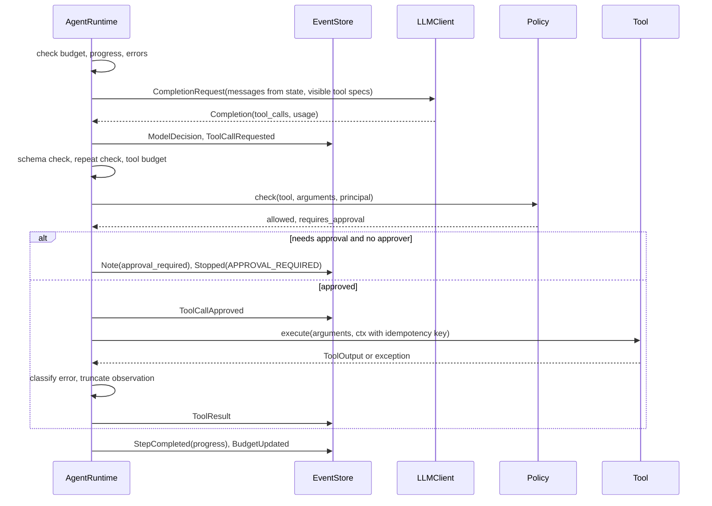
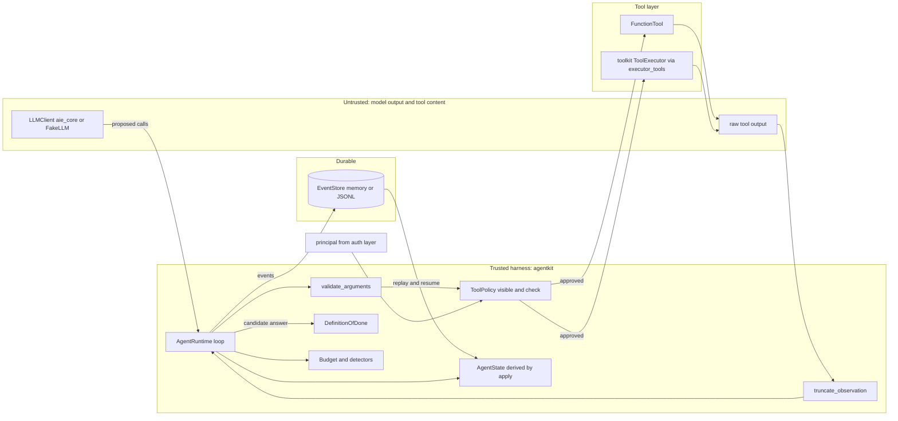

# Chapter 19 — The Agent Loop

This chapter builds an agent the way you would build any other production software: an explicit loop with typed state, an append-only event log, hard budgets, and a policy layer the model cannot talk its way past. Every later agent chapter and the capstone run on the loop you build here, so its guarantees become theirs.

**You will be able to:**
- Build a bounded agent loop whose state is derived from an immutable event log, so crashes, approval pauses, and audits all read one source of truth.
- Enforce budgets on steps, tokens, cost, time, and tool calls, and end every run with one named termination reason.
- Authorize each proposed tool call in code (visibility, schema, repetition, budget, policy, human approval) before anything executes.
- Write a Definition of Done that checks a final answer against what the agent actually observed, instead of trusting its claim.
- Estimate how input tokens grow with the number of steps, and keep that growth in check with observation shaping.
- Replay recorded trajectories to regression-test a harness change, or to see where a new model or prompt would decide differently.

**Prerequisites:** Chapters 3 (`LLMClient`, the gateway, usage and cost), 16 (tool contracts and the governed `ToolExecutor`), and 17 (when a workflow is enough). | **Code:** `book/projects/agentkit/` (run: `cd book/projects/agentkit && pytest -q`) | **Builds:** the `agentkit` package (`AgentRuntime`), which Chapters 20, 22, 25, 37, 38, and the capstone import, plus a Northwind incident example that pauses for approval, resumes, and replays itself.

**First reading:** Why this matters, Mental model, Core concepts (except Reasoning models in a tool loop and Replay), How it works, the Implementation subsections The runtime, The Northwind incident example, and Tests, Common mistakes, Failure modes, Before you ship. **Deep dives** (skip on a first pass): Reasoning models in a tool loop, both Replay sections, Architecture, the other Implementation subsections, Code walkthrough, Production considerations, Tradeoffs, Evaluation and testing.

## Why this matters

Chapter 17 argued that most AI features should be workflows. This chapter is about the exceptions: tasks where the next step depends on what the previous step revealed. An on-call engineer investigating a latency alert checks the service, notices the database is hot, looks at query metrics, recalls a similar incident, reads its postmortem, and only then knows what to do. No one could have drawn that path in advance.

The same property makes agents dangerous to operate, because the control flow lives partly in a probability distribution. At production volume a loop that is "usually fine" repeats the same search forty times, answers confidently after one empty search, calls a tool it should never have been offered, spends a day's budget on one ticket, or does the right thing for reasons nobody can reconstruct. A stronger model makes these failures rarer; only the harness makes them bounded.

That is this chapter's claim: an agent is a software control loop in which a model helps choose actions, and reliability comes from the deterministic shell around the model. The shell owns permissions, budgets, retries, stopping, audit, and verification. The model owns one thing: proposing the next action.

## Mental model

> **Mental model:** The model proposes; the harness disposes. Every proposal becomes an event, every event changes state through one function, and every run ends for a reason you can name.

Picture a strict operating system with one creative but unreliable process. The process (the model) issues system calls (tool calls). The kernel (the harness) checks each call against a permission table, charges it against a quota, executes it if allowed, and writes the result into the process's address space (the context). The kernel keeps a journal for crash recovery and replay. The process never sets its own quota and can only claim to have finished; the kernel checks the claim.

Three consequences guide the design. Decisions that matter for safety and cost are made by code, so unit tests cover them. State is a projection of a log, so debugging, resuming, auditing, and evaluation read one source of truth. And the loop has many ways to end besides "the model said done," each a first-class outcome with its own telemetry.

## Core concepts

### What an agent actually is

A practical definition has five parts: a model, instructions, tools, state, and a loop. The model proposes actions. The instructions tell it what the job is and what "done" means. The tools are the only way it can observe or change the world. The state is everything the harness knows about the current run. The loop repeats propose, validate, execute, observe, until a stop condition fires.

Each part is necessary. Without the loop you have a single tool-calling request that cannot react to what a tool returned. Without tools you have a chatbot that gathers no evidence. Without explicit state the transcript becomes the state, which works until it is too long to fit or too ambiguous to tell whether a refund was already issued. Without instructions about completion the model decides on its own when it is done, the decision you trust it with least.

"Agent" is therefore a property of the control flow, not of the product. A conversational assistant that answers from retrieved documents in one call is not an agent; a nightly job that investigates failed deployments by choosing which logs to read is one.

Here is the loop in its smallest honest form:

```python
# pseudocode
state = initial_state(goal)
for step in range(MAX_STEPS):
    decision = model.decide(state, tools=allowed_tools(state))
    if decision.is_final:
        if verify(decision.answer, state):
            return decision.answer
        state = state.with_feedback("not done yet: ...")
        continue
    for call in decision.tool_calls:
        if not authorized(call, state):
            state = state.with_denial(call)
            continue
        result = execute(call)
        state = state.with_observation(call, result)
raise BudgetExceeded
```

Everything in `agentkit` elaborates these lines: what "authorized" means, how `state` is represented, what happens when `execute` throws, how `MAX_STEPS` generalizes to tokens, money, and time, and how `verify` is made harder to fool than the model's own claim.

### The loop as a state machine

A run is always in exactly one control state, and each transition is triggered by a specific event. `agentkit` has five working states (checking limits, waiting on the model, processing tool calls, verifying a final answer, awaiting approval) and three terminal ones: completed, stopped, and awaiting a human (a resumable stop). `AgentState.status` holds the coarse version: `running`, `completed`, `stopped`, `awaiting_approval`.


Two properties matter. Every path from `CallModel` returns to `CheckLimits` or ends, so no sequence of model outputs can bypass the limit check. And `AwaitApproval` is a real state, not a blocking call: the process can exit while a human decides, because resume rebuilds state from the log. The diagram is also the test plan: the suite drives a scripted fake model through every edge.

### Typed state and the event log

The key design move: keep an immutable event log rather than one mutable message list, and derive current state from the events.

An **event** is an immutable record of something that happened: the goal was set, the model decided, a tool call was requested, approved, denied, or executed, the run stopped. Each carries the run id, a gap-free sequence number, the step, and a timestamp, and is a frozen pydantic model, so code cannot edit history by accident.

**State** is a projection: an `AgentState` holding the goal, the messages to send to the model, observations, artifacts, budget usage, per-call records, loop-detection counters, and status. One function, `apply(state, event)`, folds an event into the state. The runtime never assigns to state fields; it appends an event to the store and then calls `apply`. `derive_state(events)` calls `apply` in a loop.

This is event sourcing, and it buys more for agents than for most software:

- **Audit.** The log answers "what did the agent see, decide, and do, in what order, under which policy decision" directly.
- **Resume.** After a crash or an approval pause, a new process loads the log, derives state, and continues, without asking the model what it was doing.
- **Replay.** The recorded `ToolResult` events are the observations the model saw. Serving them again reruns the loop with a different model or prompt and no side effects.
- **Testing.** Trajectory tests assert on the event sequence, and asserting that `derive_state(result.events)` equals the live state catches any code path that mutated state without an event.

The transcript still exists but is no longer the source of truth: `AgentState.messages` is derived from events, so you can change how it is built (compacting old observations, for example) without losing the facts underneath. Compaction (Chapter 5), long-term memory (Chapter 21), and durable execution (Chapter 38) all build on a log like this one.

Two rules keep the log useful. Record facts, not interpretations: what the tool returned, not "the agent learned the database is the problem." And record decisions with their reasons when they are made, because next week's policy file cannot explain today's denial.

### Reasoning and planning inside the loop

"Thinking" happens inside the model call and nowhere else. The harness should not depend on hidden reasoning text, because the model's account of why it acted is a narrative, not a fact; it needs structure it can check, such as actions taken, observations returned, and what remains unresolved. ReAct ("reasoning and acting") interleaves a reasoning step, an action, and an observation, and `agentkit` is a ReAct loop by construction: each step is one model call that sees every previous observation. Planning fits in two ways, both keeping plans as data.

The first is a **plan as an artifact**. Give the agent a side-effect-free tool such as `update_plan(steps, current)` that returns a `ToolOutput` with `artifacts={"plan": ...}`. The plan then lives in `AgentState.artifacts`, appears in the trace, and can be checked by a verifier ("every plan step is marked done or explicitly abandoned"). Artifacts count as progress only when they change, so an agent that rewrites the same plan every step is caught by the no-progress detector.

The second is a **separate planner**: one model call produces a plan and another loop executes it, replanning on meaningful deviation (Chapter 20 builds this). Either way, the plan is a hypothesis to revise when observations contradict it, and each step needs an observable completion: "find the current status, the last related incident, and its fix" is a plan; "research everything" is not.

Add this structure only when failure analysis justifies it. Self-critique without new evidence tends to reinforce the original mistake, which is why the Definition of Done below checks against observations rather than letting the model grade itself.

### Reasoning models in a tool loop

> **Deep dive.** What hidden reasoning tokens change inside a loop, and the event-sourcing trap they create; skip on a first reading.

Reasoning models (Chapter 2) generate hidden "thinking" tokens before they answer or propose a tool call. Inside a loop this has three consequences, and the third is easy to get silently wrong.

**Cost and limits.** Reasoning tokens are billed as output and count against the per-call output limit (Chapter 3). A long think can exhaust `max_tokens_per_call` before the tool call is emitted, which shows up as `finish_reason == "length"` with no tool call. Size the per-call limit for thinking plus visible output, and expect cost per step to vary more. A reasoning-effort setting, where offered, is a per-step routing knob (Chapter 7).

**Opaque reasoning items.** As of 2026, some provider APIs return reasoning as opaque items alongside the tool calls (an encrypted block or a server-side reference) and expect them back on the next turn, unchanged and next to their tool call. Leaving them out either fails the request or, worse, succeeds while the model continues without its earlier reasoning: weaker multi-step decisions and no error. Check your provider's documentation.

**The event-sourcing trap.** The transcript is rebuilt from events on every step, so anything `ModelDecision` does not record is gone by the next call. `agentkit`'s `apply` builds the assistant message from `text` and `tool_calls` only, and the neutral `aie_core` `Message` has no slot for provider items. Supporting them takes three changes together: record the items verbatim in the event, tagged with provider and model; have `apply` attach them to the rebuilt message; and have the adapter send them back. Never edit them or let compaction summarize them (keep or drop a whole turn with its tool results).

Harness replay serves the recorded items back; counterfactual replay with a different model must strip them, because another model or provider will reject or misread them. Practical exercise P5 adds this to `agentkit`.

### Tools, policy, and approval at the boundary

Chapter 16 owns tool design; `agentkit` defines its own minimal contract so the loop does not import the tool layer. A `Tool` has a `name`, a `spec` (an `aie_core` `ToolSpec` with a JSON Schema), a `side_effect` (read, write, irreversible, external), `requires_approval`, `idempotent`, and `execute(arguments, ctx)`. `executor_tools` wraps Chapter 16's `ToolExecutor` so its policy engine, idempotency store, and audit log stay in force while `agentkit` drives the loop.

Which key the executor deduplicates on is an explicit choice, `executor_tools(..., idempotency=...)`. The runtime's key, `run_id:request_id`, is stable across crash and resume, but a second run proposing the same `create_ticket` gets a new key and a second ticket. The default, `idempotency="content"`, lets the executor derive a key from tool, tenant, user, session, and normalized arguments, so the same action in the same session happens once whichever run proposed it; it still covers crash recovery, because a re-executed call has the same arguments. `idempotency="run"` restores the run-scoped key, and a callable supplies a business key, such as one ticket per incident id.

For every proposed call, the loop runs six checks in order before anything executes. The first failing check decides the outcome:

1. **Is this tool available to this run?** The policy's `visible(tool, principal)` decides which tools the model is told about, and the check runs again at call time, because a model can name a tool it was never offered. A smaller menu also gives an injected instruction fewer targets.
2. **Are the arguments valid?** They are checked against the tool's JSON Schema in code. A failure becomes a `ToolCallDenied` the model can repair.
3. **Is this an identical repeat?** If the same call has already executed `max_identical_calls` times, it is denied and the run stops with `REPEATED_ACTION`.
4. **Is there tool-call budget left?** If not, the run stops with `MAX_TOOL_CALLS`.
5. **Does the policy allow it?** `check(tool, arguments, principal)` returns a `PolicyDecision`. Argument-level rules live here, such as "a retail-tenant user may only reply to retail tickets." The principal comes from trusted application state, never from the conversation.
6. **Does it need a human?** The same decision says whether the allowed call also needs approval.

Local, deterministic checks run first, checks that can stop the run next, and the policy and the human, which may consult external state or take hours, last. A call denied for invalid arguments therefore never creates an approval request, which matters when a confused or manipulated model generates many bad calls.

Approval binds a human's consent to the concrete call (by request id), not to an earlier plan. An `approver` callback decides inline; without one the run stops with `APPROVAL_REQUIRED`, the process may exit, and `resume(run_id, approve=True, request_id=...)` continues later from the log. Passing the request id the reviewer saw makes a stale decision fail loudly instead of approving whatever call is pending by then.

### Observations and truncation

An observation is the part of a tool result the model reads, and it is resent on every later step: a 4,000-token log dump returned at step 2 is paid for at every step after, in money, latency, and attention.

**Why loop cost grows quadratically.** This is the book's one worked derivation; other chapters refer to it. Let P be the fixed prefix (system prompt, tool specs, goal) and d the tokens each step adds to the transcript (the model's decision plus its observation). The call at step k sends P + d(k - 1) input tokens, because it carries every earlier step. Summed over n steps:

```text
total input tokens = n·P + d·(0 + 1 + ... + (n - 1)) = n·P + d·n(n - 1)/2
```

The first term grows linearly with steps; the second grows with the square of steps, and it dominates as soon as n·d is larger than about twice P. With illustrative numbers, P = 1,500 tokens and a 100-token decision per step, compare shaped observations of about 500 tokens (d = 600) with raw 4,000-token dumps (d = 4,100):

| Steps n | Shaped, d = 600 | Raw, d = 4,100 | Cost at an illustrative 3 dollars per million input tokens (shaped vs raw) |
|---|---|---|---|
| 5 | 13,500 | 48,500 | 4 cents vs 15 cents |
| 10 | 42,000 | 199,500 | 13 cents vs 60 cents |
| 20 | 144,000 | 809,000 | 43 cents vs 2.43 dollars |

Two readings matter. Doubling the steps from 10 to 20 more than triples the tokens, so a step budget is also a cost budget. And shrinking d is the strongest lever, because it multiplies the quadratic term: the raw run at 10 steps costs more than the shaped run at 20. The larger context also makes each call slower and dilutes attention (Chapter 5).

Prompt caching lowers the price of the repeated prefix but not the token count or attention cost (Chapter 5 for cacheable layout, Chapter 30 for the cost math). Compaction (Chapter 5) bends the curve: summarizing old observations caps the d·(k - 1) term at a window, making growth roughly linear again, at the price of what the summary drops.

Three layers keep observations small, in order of preference: a tool that returns compact structured data by design (top three hits with ids and one matching line each, not whole documents); a tool that paginates or filters on request; and, as a last resort, `truncate_observation` in the harness, which keeps the head and the tail (logs and stack traces often end with the cause) and marks how much was removed.

Truncation is applied once, when the result is recorded, and the `ToolResult` event keeps `original_chars` and `truncated`. That makes "the answer was in the part we cut" diagnosable: replay with a larger limit shows whether the decision would change. The structured `data` field carries the untruncated payload for code, such as a verifier.

### Termination conditions

An agent that stops only when the model says it is done has a single exit, controlled by the least reliable component. `agentkit` defines thirteen named reasons in `TerminationReason`, and every run ends with exactly one `Stopped` event carrying one of them. They fall into four groups:

| Group | Reason | Fires when | Usually means |
|---|---|---|---|
| Outcome | `COMPLETED` | A final answer passes the Definition of Done | Success, verified |
| | `VERIFICATION_FAILED` | Final answers rejected more than `max_dod_rejections` times | Task impossible with these tools, or criteria wrong |
| | `APPROVAL_REQUIRED` | A call needs a human and none is available inline | Paused, resumable |
| Budget | `MAX_STEPS` | Model calls reach `max_steps` | Task too long, or wandering |
| | `MAX_TOKENS` | Tokens used reach the limit, or the next call would not fit | Context bloat |
| | `MAX_COST` | Spend reaches `max_cost_usd` | Expensive model in a long loop |
| | `MAX_TOOL_CALLS` | Executed tool calls reach the limit | Tool-heavy wandering, fan-out |
| | `DEADLINE` | Active time reaches `deadline_s` | Slow tools or model |
| Detector | `REPEATED_ACTION` | An identical call is requested after `max_identical_calls` executions | Classic loop |
| | `NO_PROGRESS` | `max_no_progress_steps` consecutive steps produced no new information | Rephrasing the same failed search |
| | `TOOL_ERRORS` | `max_consecutive_errors` failed or denied calls in a row | Broken tool, or model fighting the policy |
| Error | `MODEL_ERROR` | The model call failed after the gateway's retries | Provider outage, bad request |
| | `FATAL_ERROR` | A tool failed with an error classified as a bug | Our code is wrong |

Budgets are covered in the next section. The two main detectors catch failures that budgets catch only late.

**Repeated action** keys every call by a hash of the tool name and canonical arguments (`action_key`). The second identical execution gets a harness notice ("this exact call was already made; its result is unchanged"), which often breaks the loop on its own; a request beyond `max_identical_calls` stops the run. This is cheap and precise but misses loops where the arguments change slightly.

**No progress** catches those. A step makes progress if it produced a successful observation not seen before in this run, or changed an artifact; `max_no_progress_steps` consecutive steps without progress stop the run. An agent that searches "vpn error", "vpn issue", "vpn problem" and gets "no results" each time makes progress once (the first "no results" is new information) and then stops. Progress is measured from observations, not the model's narration, because only that can be enforced in code.

Order matters. Limits, including a pre-flight token estimate, are checked before every model call, so a run never spends a step it is not allowed. Completion is checked right after the model answers, so a correct answer on the last allowed step still counts.

A good stop is informative. The `Stopped` event's `detail` plus the observations let the caller show "stopped after 3 steps without new information; searched runbooks for X, Y, Z; no match," which a silent timeout cannot.

### Budgets

A budget is a set of hard limits on one run: steps, tokens, dollars, active seconds, and tool calls. `Budget` is a frozen pydantic model; `BudgetUsage` is derived from events. `ModelDecision` carries each call's tokens and cost (set by the Chapter 3 gateway or computed from a `PricingTable`), `ToolResult` counts tool calls, and `BudgetUpdated` records elapsed time at each step boundary.

The five dimensions fail independently: a run can be cheap and slow, fast and expensive, or within both while making 200 calls against a rate-limited API.

Set them from the distribution of successful runs on your evaluation set. If 95 percent of successful incident investigations finish in six steps and 30,000 tokens, ten steps and 60,000 tokens leaves headroom without letting a stuck run burn ten times the median. On a budget stop, return a partial result plus an offer to continue: `resume(run_id, budget=Budget(...))` lets an operator, not the model, extend the budget, recorded as an event that replay also reads.

Two subtleties. A single call can overshoot a post-spend check; the pre-flight token estimate narrows that window and `max_tokens_per_call` closes it. And deadline is active time: hours spent awaiting approval do not count, because the clock restarts from the recorded elapsed time on resume. Otherwise every approval would look like a timeout.

Budgets nest. A parent agent (Chapter 22) gives each sub-agent a budget carved from its own remainder, computed with `Budget.remaining(usage)`, and the child's usage is charged back.

### Error classes

Retrying a failed call with the same inputs rarely helps unless the failure was transient. Chapter 17 gave workflows a five-class table; `agentkit` uses six, because in an agent loop permission denial needs its own class: it must never be retried, and repeated denials signal a confused model or an attack.

| Class | Typical cause | Loop response |
|---|---|---|
| Transient | Timeout, rate limit, connection reset | Retry an idempotent tool up to `transient_retries`, then surface to the model |
| Validation | Arguments fail schema, bad enum, missing field | Deny before execution; the model repairs |
| Semantic | Valid output that is wrong or unsupported | Definition of Done rejects it, feedback to the model |
| Permission | Policy denial, tool raises `PermissionError` | Never retry; the model must change course |
| Impossible | Resource does not exist, no tool can do it | Surface to the model, which should answer honestly |
| Fatal | Bug in our code: `KeyError`, `TypeError` in a tool | Stop with `FATAL_ERROR`, keep state, alert |

`classify_error` maps exceptions to classes. Tools can be explicit by raising a typed error or, better, by returning `ToolOutput.failure(message, error_class)`, because machine-readable errors let the model recover. `KeyError`, `TypeError`, and `AttributeError` are deliberately fatal, not validation: in a tool they are almost always bugs, and letting the model "try something else" hides the bug and wastes steps.

Model-call failures (`LLMError`) are retried and failed over by the gateway (Chapters 3 and 29); one that reaches the loop stops the run with `MODEL_ERROR`. Semantic errors are never raised by tools; the Definition of Done finds them.

### Definition of Done

Agents fail when completion is subjective. Define measurable exit criteria before execution and use them twice: in the prompt and as an automated validator. "Write the feature" is vague; "tests pass, lint passes, the diff touches only allowed files" is executable.

In `agentkit`, a Definition of Done is a list of verifiers, each a callable `(answer, state) -> Verdict`. Because verifiers see state, they check the answer against what the agent actually did:

- `tool_was_called("get_service_status", "search_docs")`: these tools were called successfully, so the required evidence was gathered. A failed call does not count.
- `citations_grounded(min_citations=1)`: every `[source-id]` in the answer appears in at least one successful observation, so an invented document id fails. The default pattern accepts both document ids (`[it-vpn-access-runbook]`) and the `doc#section` passage ids of Chapters 10 and 13 (`[hr-pto-policy#c3]`); pass `pattern=` for another alphabet. Two limits: grounding is a substring test, so `[inc-1]` is satisfied by an observation mentioning `inc-12`; and any bracketed id-like text counts as a citation, so `[draft]` must also be grounded.
- `has_artifact("ticket_id")`: a required side effect actually happened.
- `json_schema(Model)`, `contains_all(...)`, `matches(regex)`, and `Check(name, fn)` for anything else; `all_of` and `any_of` compose them.

When a final answer fails, the runtime records a `Note` of kind `dod_rejected` (error class `semantic`) with the verdicts and tells the model which criteria failed and why. When rejections exceed `max_dod_rejections`, the run stops with `VERIFICATION_FAILED`. `DefinitionOfDone.as_prompt()` renders the same criteria into the system prompt: the prompt guides; the verifier decides.

The verifier should be independent of the generator. Deterministic checks (schemas, citation grounding, tests, compilers) are best; for subjective criteria, a separate judge model (Chapter 24) or a human gate comes next. A model grading its own answer in the same context is not a Definition of Done.

### Replay

> **Deep dive.** Rerunning recorded trajectories to regression-test the harness or compare planners; skip on a first reading.

Replay reruns a recorded trajectory without touching the outside world. It answers two questions with one function.

**Harness replay** reuses the recorded model decisions and tool results; nothing calls a model and nothing executes. What changes is the harness: a stricter Definition of Done, a new policy, a different truncation limit. The question is "with yesterday's exact decisions, does the new harness still accept and reject the right runs?" It is a free regression test for the shell.

**Counterfactual replay** uses a new model or prompt with the recorded tool results, so the new planner sees the same observations whenever it makes the same calls. A call the recording never saw gets an `impossible`-class failure and is recorded as a miss. The `ReplayReport` gives the first step where decisions diverge and the list of misses. Holding the environment fixed removes the main confound in agent evaluation: live systems change between runs.

Results are served by action key, in their original order for a repeated key. Recorded policy and human denials are reproduced by key; approvals are not requested again, since nothing real executes.

Replay is exact only for the prefix where decisions match. After divergence the trajectory is partly extrapolation, and every miss is a synthetic failure rather than what the world would have returned. Read divergence and misses as "behavior changes here, go look," not as a quality verdict. And replay is only as good as the recording: results truncated to 500 characters cannot show what the model would have done with the full text.

### When not to use an agent

Chapter 1 owns the ladder of complexity and Chapter 17 the workflow-versus-agent decision: a task whose action sequence is known in advance is a workflow, even if every step calls a model. This chapter adds two criteria. If nobody can write a Definition of Done, even a weak one, you cannot tell success from confident failure. And if side effects are irreversible and audit is strict, keep the workflow and put a bounded, read-only agent inside one node. Either way, measure against a non-agent baseline before shipping.

## How it works

One run of `AgentRuntime.run(goal)`, in the order the code executes it:

1. **Start.** Compute the visible tools for this principal and append `GoalSet` with the goal, the system prompt (including the rendered Definition of Done), the visible tool specs, the budget, and the principal.
2. **Check limits.** Check the budget, consecutive non-progress steps, and consecutive errors. If anything fires, append `Stopped` and return.
3. **Pre-flight.** If the next request's estimated tokens would not fit in the budget, stop with `MAX_TOKENS` before spending anything.
4. **Decide.** Call the model with the derived messages and visible tool specs. On `LLMError`, stop with `MODEL_ERROR`; otherwise append `ModelDecision` with the text, tool calls, usage, cost, and finish reason.
5. **Act.** If the decision has tool calls, append one `ToolCallRequested` per call, each with a request id and an action key, then run the six authorization checks on each in order. An approved call gets `ToolCallApproved` and executes with a `ToolContext` carrying the idempotency key; transient failures on idempotent tools are retried, the output is shaped, and `ToolResult` is appended. A fatal error stops the run.
6. **Or verify.** A decision without tool calls is a candidate final answer. If the output was cut off by the token limit, ask for a shorter answer. Otherwise run the Definition of Done: on success append `FinalAnswer` and `Stopped(COMPLETED)`; on failure append a `dod_rejected` note, and stop with `VERIFICATION_FAILED` if rejections exceed the limit.
7. **Close the step.** Append `StepCompleted` with whether the step produced new information, and `BudgetUpdated` with elapsed time. Go to step 2.

`resume(run_id, ...)` loads the log, derives state, appends `Resumed` plus any approval decision, then processes pending calls (including ones approved but never executed because the process died) and finishes any step a crash interrupted.



Every write to the store happens before the corresponding state change. If the process dies between `ToolCallApproved` and `ToolResult`, the log says "approved, not executed," and resume executes the call again with the same arguments and the same run-scoped key. That is at-least-once execution, safe only if the tool deduplicates, as Chapter 16's executor and the example's `create_ticket` do.

## Architecture

> **Deep dive.** The package's layers, its trust boundary, and what it leaves to other chapters; skip on a first reading.

Each concern can be tested alone and replaced without touching the loop.



The trust boundary runs between the model and everything else. Model output is a proposal until the authorization checks pass. Tool output is also untrusted, because a retrieved document can contain an injected instruction (Chapter 26): it is shown to the model as an observation, never interpreted as a command. The principal (user, tenant, groups) comes from the application's authentication layer and is recorded in `GoalSet`; nothing the model says can change it.

The file tree under Implementation lists what each module owns. Just as important is what they leave to other chapters: sandboxing and idempotency storage (Chapter 16), model judges (Chapter 24), trajectory scoring (Chapter 25), and store retention and querying (Chapter 38). The loop's decisions live in `runtime.py`; `events.py` and `state.py` decide nothing.

## Implementation

The package lives in `book/projects/agentkit/`. The listings below are excerpts of the parts the concepts above rely on; every file is complete on disk.

```
agentkit/
├── pyproject.toml
├── README.md
├── .env.example
├── agentkit/
│   ├── __init__.py        public API with an explicit __all__
│   ├── budget.py          Budget, BudgetUsage, TerminationReason
│   ├── errors.py          ErrorClass, tool error types, classify_error
│   ├── events.py          immutable events, JSON round trip, action_key
│   ├── state.py           AgentState, apply, derive_state
│   ├── tools.py           Tool protocol, FunctionTool, adapters, validation, DefaultPolicy
│   ├── observations.py    truncate_observation
│   ├── dod.py             verifiers and DefinitionOfDone
│   ├── store.py           InMemoryEventStore, JsonlEventStore
│   ├── runtime.py         AgentRuntime, LoopConfig, RunResult
│   └── replay.py          RecordedLLM, RecordedToolResults, replay
├── examples/
│   └── northwind_incident.py
└── tests/
    ├── conftest.py
    ├── test_runtime.py
    ├── test_replay_and_store.py
    ├── test_recovery.py
    ├── test_example.py
    └── test_toolkit_integration.py
```

Install into the book's shared virtual environment and run the tests and the example:

```bash
uv pip install --python .venv/bin/python -e book/projects/aie_core -e book/projects/agentkit
# fallback: pip install -e book/projects/aie_core && pip install -e book/projects/agentkit
cd book/projects/agentkit
python -m pytest -q
python examples/northwind_incident.py
```

`agentkit` reads no environment variables of its own and depends only on `aie-core` and `pydantic`. The variables below configure `aie_core` and the example:

| Variable | Read by | Default | Meaning |
|---|---|---|---|
| `LLM_PROVIDER`, `LLM_MODEL` | `aie_core` | `fake`, `fake-model` | Model behind the loop |
| `OPENAI_API_KEY`, `ANTHROPIC_API_KEY` | `aie_core` | unset | Provider credentials |
| `TRACE_SINK`, `TRACE_PATH` | `aie_core.observability` | `none`, `traces.jsonl` | Span export |
| `AGENTKIT_EVENT_DIR` | example only | `.agent-runs` | JSONL event logs |

### Budgets and error classes

> **Deep dive.** The budget checks and error classifier in code; skip on a first reading.

`Budget` carries both checks from the Budgets section: `exceeded` after spending, `admits_model_call` before it.

```python
# path: book/projects/agentkit/agentkit/budget.py  (excerpt; full file on disk)
class Budget(BaseModel):
    """Limits for one run. `None` means unlimited; `max_steps` is always set."""

    model_config = ConfigDict(frozen=True)

    max_steps: int = Field(default=10, ge=1)
    max_tokens: int | None = Field(default=None, ge=1)
    max_cost_usd: float | None = Field(default=None, gt=0)
    deadline_s: float | None = Field(default=None, gt=0)
    max_tool_calls: int | None = Field(default=None, ge=0)

    def exceeded(self, usage: BudgetUsage, elapsed_s: float | None = None) -> TerminationReason | None:
        """Post-spend check: has any limit been reached? Order is cheapest-to-explain first."""
        elapsed = usage.elapsed_s if elapsed_s is None else elapsed_s
        if usage.steps >= self.max_steps:
            return TerminationReason.MAX_STEPS
        if self.max_tokens is not None and usage.total_tokens >= self.max_tokens:
            return TerminationReason.MAX_TOKENS
        if self.max_cost_usd is not None and usage.cost_usd >= self.max_cost_usd:
            return TerminationReason.MAX_COST
        if self.deadline_s is not None and elapsed >= self.deadline_s:
            return TerminationReason.DEADLINE
        return None

    def admits_model_call(self, usage: BudgetUsage, estimated_tokens: int) -> bool:
        """Pre-spend check: would a call of this estimated size fit in the token budget?"""
        if self.max_tokens is None:
            return True
        return usage.total_tokens + estimated_tokens <= self.max_tokens
```

In the error classifier, the comment on the last line is the policy that matters most.

```python
# path: book/projects/agentkit/agentkit/errors.py  (excerpt; full file on disk)
def classify_error(exc: BaseException) -> ErrorClass:
    """Map an exception raised while executing a tool to an ErrorClass."""
    if isinstance(exc, ToolError):
        return exc.error_class
    if isinstance(exc, LLMError):  # a tool that itself calls a model
        return ErrorClass.TRANSIENT if exc.retryable else ErrorClass.FATAL
    if isinstance(exc, PermissionError):
        return ErrorClass.PERMISSION
    if isinstance(exc, (ValidationError, ValueError)):
        return ErrorClass.VALIDATION
    if isinstance(exc, (builtins.TimeoutError, ConnectionError)):
        return ErrorClass.TRANSIENT
    if isinstance(exc, FileNotFoundError):
        return ErrorClass.IMPOSSIBLE
    # KeyError, TypeError, AttributeError and friends are almost always bugs in the tool.
    return ErrorClass.FATAL
```

### Events

> **Deep dive.** The event types and the action key; skip on a first reading.

The excerpt shows the base class, the two events that carry a tool call through the loop, the stop event, and the action key. The other event types follow the same shape, and a discriminated union on `type` reads any of them back from JSON.

```python
# path: book/projects/agentkit/agentkit/events.py  (excerpt; full file on disk)
class Event(BaseModel):
    """Fields every event carries. `seq` is dense per run and assigned by the runtime."""

    model_config = ConfigDict(frozen=True)

    run_id: str
    seq: int
    step: int = 0
    at: float = Field(default_factory=time.time)
# ...
class ToolCallRequested(Event):
    type: Literal["tool_call_requested"] = "tool_call_requested"
    request_id: str          # unique in the run: "<step>.<index>"
    call_id: str             # the model's id, echoed back in the tool message
    tool: str
    arguments: dict[str, Any] = Field(default_factory=dict)
    key: str                 # hash of tool name + canonical arguments; replay and loop detection use it
# ...
class ToolResult(Event):
    type: Literal["tool_result"] = "tool_result"
    request_id: str
    call_id: str
    tool: str
    key: str
    ok: bool
    content: str                       # what the model sees, already truncated
    original_chars: int = 0
    truncated: bool = False
    data: Any = None                   # structured payload for code, not for the prompt
    artifacts: dict[str, Any] = Field(default_factory=dict)
    error_class: ErrorClass | None = None
    error: str | None = None
    notice: str = ""                   # harness warning appended to the tool message, kept separate for replay
    attempts: int = 1
    latency_ms: float = 0.0
    idempotency_key: str = ""
# ...
class Stopped(Event):
    type: Literal["stopped"] = "stopped"
    reason: TerminationReason
    detail: str = ""
# ...
def action_key(tool: str, arguments: dict[str, Any]) -> str:
    """Stable identity of a tool call: same tool and same arguments give the same key."""
    canonical = json.dumps({"tool": tool, "args": arguments}, sort_keys=True, ensure_ascii=False, default=str)
    return hashlib.sha256(canonical.encode("utf-8")).hexdigest()[:16]
```

### State as a projection

> **Deep dive.** `apply`, the one function that changes state; skip on a first reading.

Note three things in `apply`: the sequence check on the first lines, the `ModelDecision` branch that builds the assistant message the next call will see, and the `ToolResult` branch, where progress and the error streak are computed. Because both `ToolResult` and `ToolCallDenied` become tool messages, every tool call id the model emitted gets exactly one response, which providers require.

```python
# path: book/projects/agentkit/agentkit/state.py  (excerpt; full file on disk)
def apply(state: AgentState, event: Event) -> AgentState:
    """Fold one event into the state (in place) and return it."""
    if event.seq != state.last_seq + 1:
        raise ValueError(f"event seq {event.seq} does not follow {state.last_seq} in run {state.run_id!r}")
    state.last_seq = event.seq
    # ...
    elif isinstance(event, ModelDecision):
        state.usage.steps += 1
        state.usage.input_tokens += event.usage.input_tokens
        state.usage.output_tokens += event.usage.output_tokens
        state.usage.cost_usd += event.cost_usd
        state.step_had_progress = False
        state.step_open = True
        state.open_tool_calls = list(event.tool_calls)
        state.open_final = (event.text, event.finish_reason) if event.kind == "final" else None
        state.messages.append(
            Message(role=Role.ASSISTANT, content=event.text, tool_calls=list(event.tool_calls) or None)
        )
    # ...
    elif isinstance(event, ToolCallDenied):
        state.calls[event.request_id].status = "denied"
        state.consecutive_errors += 1
        state.messages.append(Message.tool(event.call_id, f"DENIED ({event.error_class.value}): {event.reason}"))

    elif isinstance(event, ToolResult):
        rec = state.calls[event.request_id]
        rec.status, rec.ok = "done", event.ok
        state.usage.tool_calls += 1
        state.key_counts[event.key] = state.key_counts.get(event.key, 0) + 1
        # ...
        text = event.content + (f"\n[harness] {event.notice}" if event.notice else "")
        state.messages.append(Message.tool(event.call_id, text))
        if event.ok:
            state.consecutive_errors = 0
            digest = _hash(event.content)
            if digest not in state.result_hashes:
                state.result_hashes.add(digest)
                state.step_had_progress = True
            for name, value in event.artifacts.items():
                if state.artifacts.get(name) != value:
                    state.artifacts[name] = value
                    state.step_had_progress = True
        else:
            state.consecutive_errors += 1

    elif isinstance(event, StepCompleted):
        state.step_open = False
        state.steps_without_progress = 0 if event.progress else state.steps_without_progress + 1
    # ...
    return state


def derive_state(events: Iterable[Event]) -> AgentState:
    state = AgentState()
    for event in events:
        apply(state, event)
    return state
```

The `ModelDecision` branch is also where the transcript loses anything the event does not carry, which is why opaque reasoning items need their own field (see "Reasoning models in a tool loop").

### The tool contract and the policy

> **Deep dive.** The tool protocol, trusted context, and default policy in code; skip on a first reading.

The loop depends on the protocol, the trusted context, and the policy; the adapters and `executor_tools` are on disk. The runtime builds `ToolContext` from the event log and the principal; no field in it comes from the model.

```python
# path: book/projects/agentkit/agentkit/tools.py  (excerpt; full file on disk)
@dataclass(frozen=True)
class ToolContext:
    """Trusted, harness-provided context. The model never writes any of these fields."""

    run_id: str
    step: int
    call_id: str
    request_id: str
    idempotency_key: str
    principal: dict[str, Any] = field(default_factory=dict)
# ...
@runtime_checkable
class Tool(Protocol):
    name: str
    side_effect: SideEffect
    requires_approval: bool
    idempotent: bool

    @property
    def spec(self) -> ToolSpec: ...

    def execute(self, arguments: dict[str, Any], ctx: ToolContext) -> ToolOutput: ...
# ...
class DefaultPolicy:
    # ...
    def visible(self, tool: Tool, principal: dict[str, Any]) -> bool:
        return self.allowed is None or tool.name in self.allowed

    def check(self, tool: Tool, arguments: dict[str, Any], principal: dict[str, Any]) -> PolicyDecision:
        if not self.visible(tool, principal):
            return PolicyDecision(allowed=False, reason=f"tool '{tool.name}' is not allowed for this run")
        for rule in self.rules:
            decision = rule(tool, arguments, principal)
            if decision is not None and (not decision.allowed or decision.requires_approval):
                return decision
        if getattr(tool, "approval_by_executor", False):
            return PolicyDecision(allowed=True, reason="approval delegated to the tool executor")
        needs = (
            tool.requires_approval
            or tool.name in self.require_approval
            or (self.irreversible_needs_approval
                and tool.side_effect in (SideEffect.IRREVERSIBLE, SideEffect.EXTERNAL))
        )
        return PolicyDecision(allowed=True, requires_approval=needs, reason="approval required" if needs else "")
```

A rule can deny a call or demand approval, but it cannot waive the approval checks that follow it: a rule that returns "allowed" is ignored, so a permissive tenant rule never turns off the gate on an irreversible tool.

### Observations and verifiers

> **Deep dive.** Truncation and the grounding verifier in code; skip on a first reading.

The generic truncation keeps 70 percent of the kept budget from the head and the rest from the tail:

```python
# path: book/projects/agentkit/agentkit/observations.py  (excerpt; full file on disk)
def truncate_observation(text: str, max_chars: int, *, head_ratio: float = 0.7) -> Truncated:
    # ...
    original = len(text)
    if max_chars <= 0 or original <= max_chars:
        return Truncated(text=text, original_chars=original, truncated=False)
    marker_budget = 80
    keep = max(0, max_chars - marker_budget)
    head = int(keep * head_ratio)
    tail = keep - head
    removed = original - head - tail
    marker = f"\n...[{removed} characters truncated by harness; refine the query to see more]...\n"
    body = text[:head] + marker + (text[-tail:] if tail else "")
    return Truncated(text=body, original_chars=original, truncated=True)
```

Every built-in verifier is a `Check` wrapping a predicate over `(answer, state)`. The grounding verifier and the container that runs them:

```python
# path: book/projects/agentkit/agentkit/dod.py  (excerpt; full file on disk)
def citations_grounded(min_citations: int = 1, pattern: re.Pattern[str] = CITATION) -> Check:
    """Every `[source-id]` in the answer must appear in at least one successful observation."""

    def fn(answer: str, state: AgentState) -> tuple[bool, str]:
        cited = pattern.findall(answer)
        if len(set(cited)) < min_citations:
            return False, f"cite at least {min_citations} source(s) as [source-id]"
        seen = state.observation_text()
        ungrounded = sorted({c for c in cited if c not in seen})
        if ungrounded:
            return False, f"citations not found in any tool result: {ungrounded}"
        return True, ""

    return Check(f"citations_grounded>={min_citations}", fn)
# ...
class DefinitionOfDone:
    """A named list of verifiers, all of which must pass. Every verdict is recorded."""

    def __init__(self, *verifiers: Verifier, description: str = "") -> None:
        self.verifiers = list(verifiers)
        self.description = description

    def verify(self, answer: str, state: AgentState) -> DoDResult:
        verdicts = [v(answer, state) for v in self.verifiers]
        return DoDResult(passed=all(v.passed for v in verdicts), verdicts=verdicts)
```

### Event stores

> **Deep dive.** How the JSONL store makes appends durable and ordered; skip on a first reading.

Both stores implement `append`, `load`, and `runs`. The JSONL store writes one file per run, syncs every append, and rejects an out-of-order sequence number; its `load` drops a torn last line left by a crash and fails loudly on corruption anywhere else. Across processes the sequence check is racy, because each process caches the next number; Engineering question E4 works through the consequence, and Chapter 38 replaces the check with a database constraint.

```python
# path: book/projects/agentkit/agentkit/store.py  (excerpt; full file on disk)
    def append(self, event: Event) -> None:
        path = self._path(event.run_id)
        with self._lock:
            expected = self._next_seq.get(event.run_id)
            if expected is None:
                expected = len(self.load(event.run_id)) if path.exists() else 0
            if event.seq != expected:
                raise ValueError(f"run {event.run_id}: expected seq {expected}, got {event.seq}")
            with path.open("ab") as f:                       # bytes: "\n" on every platform
                f.write((event_to_json(event) + "\n").encode("utf-8"))
                f.flush()
                os.fsync(f.fileno())
            self._next_seq[event.run_id] = expected + 1
```

### The runtime

`AgentRuntime` takes the model client, the tools, and every harness component (budget, policy, approver, Definition of Done, store, tracer, principal) as constructor arguments, plus a `LoopConfig` holding the non-budget knobs such as `max_identical_calls`, with illustrative defaults. The loop is `_drive` and `_model_step`. The first three branches of `_drive` run only after a resume; on a fresh run every iteration is "check limits, then one model step."

```python
# path: book/projects/agentkit/agentkit/runtime.py  (excerpt; full file on disk)
    def _drive(self, s: _Session) -> RunResult:
        with self.tracer.span("agent.run", run_id=s.run_id, goal=s.state.goal[:200]) as span:
            while s.state.status is AgentStatus.RUNNING:
                if s.state.step_open and self._recover_step(s):   # only after a crash mid-step
                    continue
                if s.state.pending_calls:                  # only after resume
                    self._process_calls(s)
                    if s.state.status is AgentStatus.RUNNING:
                        self._close_step(s)
                    continue
                if s.state.step_open:                      # crashed between last result and step close
                    self._close_step(s)
                    continue
                limit = self._limit_reason(s)
                if limit is not None:
                    self._stop(s, *limit)
                    break
                self._model_step(s)
            # ...

    def _model_step(self, s: _Session) -> None:
        st = s.state
        step = st.step + 1
        tools = self._visible_tools()
        messages = list(st.messages)
        estimate = count_message_tokens(messages, self.model) + self.config.max_tokens_per_call
        if not s.budget.admits_model_call(st.usage, estimate):
            self._stop(s, TerminationReason.MAX_TOKENS, f"next call needs about {estimate} tokens; "
                       f"{s.budget.remaining(st.usage)['tokens']} remain")
            return
        # ...
        with self.tracer.span("agent.step", run_id=s.run_id, step=step) as span:
            try:
                completion = self.llm.complete(req)
            except LLMError as exc:
                span.record_exception(exc)
                cls = ErrorClass.TRANSIENT if exc.retryable else ErrorClass.FATAL
                self._stop(s, TerminationReason.MODEL_ERROR, f"{cls.value}: {type(exc).__name__}: {exc}")
                return
            # ...
            calls = completion.tool_calls
            kind = "tool_calls" if calls else "final"
            self._emit(s, ModelDecision, step=step, kind=kind, text=completion.text, tool_calls=calls,
                       usage=completion.usage, cost_usd=cost, model=completion.model,
                       finish_reason=completion.finish_reason, latency_ms=completion.latency_ms,
                       request_hash=_request_hash(req))
            # ...
            if calls:
                self._request_calls(s, step, calls)
                self._process_calls(s)
            else:
                self._handle_final(s, completion.text, completion.finish_reason)
            if s.state.status is AgentStatus.RUNNING:
                self._close_step(s)
```

A final answer goes to the Definition of Done exactly as step 6 of How it works describes. A tool call goes through `_authorize`, the six checks from Core concepts in code. Each `return False` is a call that does not execute; two also stop the run.

```python
# path: book/projects/agentkit/agentkit/runtime.py  (excerpt; full file on disk)
    def _authorize(self, s: _Session, rec: CallRecord, tool: Tool | None) -> bool:
        """Validation, loop detection, tool budget, policy, approval. True means approved."""
        st = s.state
        if tool is None or not self.policy.visible(tool, st.principal):
            names = sorted(t.name for t in self._visible_tools())
            self._deny(s, rec, f"unknown tool '{rec.tool}'; available tools: {names}", ErrorClass.VALIDATION, "runtime")
            return False
        errors = validate_arguments(tool.spec.parameters, rec.arguments)
        if errors:
            self._deny(s, rec, "invalid arguments: " + "; ".join(errors), ErrorClass.VALIDATION, "runtime")
            return False
        if st.key_counts.get(rec.key, 0) >= self.config.max_identical_calls:
            self._deny(s, rec, "identical call already executed; the result will not change", ErrorClass.VALIDATION,
                       "runtime")
            self._stop(s, TerminationReason.REPEATED_ACTION,
                       f"{rec.tool}({rec.arguments}) requested {st.key_counts[rec.key] + 1} times")
            return False
        if not s.budget.admits_tool_call(st.usage):
            self._stop(s, TerminationReason.MAX_TOOL_CALLS, f"tool-call budget of {s.budget.max_tool_calls} used")
            return False
        decision = self.policy.check(tool, rec.arguments, st.principal)
        if not decision.allowed:
            self._deny(s, rec, decision.reason or "denied by policy", ErrorClass.PERMISSION, "policy")
            return False
        if not decision.requires_approval:
            self._emit(s, ToolCallApproved, request_id=rec.request_id, tool=rec.tool, by="policy")
            return True
        verdict = self.approver(rec, st) if self.approver else None
        if verdict is None:
            self._emit(s, Note, kind="approval_required",
                       text=f"{rec.tool} awaits approval: {decision.reason}",
                       data={"request_id": rec.request_id, "tool": rec.tool, "arguments": rec.arguments})
            self._stop(s, TerminationReason.APPROVAL_REQUIRED, f"{rec.tool} needs approval")
            return False
        if verdict:
            self._emit(s, ToolCallApproved, request_id=rec.request_id, tool=rec.tool, by="approver")
            return True
        self._deny(s, rec, "rejected by approver", ErrorClass.PERMISSION, "approver")
        return False
```

An approved call goes to `_execute`. Retries are narrow: only transient errors on idempotent tools, because a timeout after submitting a payment may mean the payment went through, and resolving that belongs to the tool layer (Chapter 16's reconcile hook). Every event goes through `_emit`, which writes to the store before it touches state, so a crash can lose at most the event being written and never leaves memory ahead of the log.

```python
# path: book/projects/agentkit/agentkit/runtime.py  (excerpt; full file on disk)
    def _execute(self, s: _Session, rec: CallRecord, tool: Tool) -> None:
        ctx = ToolContext(run_id=s.run_id, step=rec.step, call_id=rec.call_id, request_id=rec.request_id,
                          idempotency_key=f"{s.run_id}:{rec.request_id}", principal=dict(s.state.principal))
        # ...
            attempts = 0
            while True:
                attempts += 1
                try:
                    out = tool.execute(dict(rec.arguments), ctx)
                    break
                except Exception as exc:  # noqa: BLE001 - classified, recorded, never swallowed silently
                    cls = classify_error(exc)
                    if cls is ErrorClass.TRANSIENT and tool.idempotent and attempts <= self.config.transient_retries:
                        continue
                    out = ToolOutput.failure(f"{type(exc).__name__}: {exc}", cls)
                    break
            shaped = truncate_observation(out.content, self.config.max_observation_chars)
            # ...
        if out.error_class is ErrorClass.FATAL:
            self._stop(s, TerminationReason.FATAL_ERROR, f"{rec.tool}: {out.error}")
    # ...
    def _emit(self, s: _Session, cls: type[Event], **fields: Any) -> Event:
        fields.setdefault("step", s.state.step)
        event = cls(run_id=s.run_id, seq=s.state.last_seq + 1, **fields)
        self.store.append(event)       # durable first, then projected
        apply(s.state, event)
        s.events.append(event)
        return event
```

### Replay

> **Deep dive.** How replay reuses the real runtime with recorded inputs; skip on a first reading.

Replay is the ordinary runtime with substitutions, so there is no separate replay engine to drift out of sync. `RecordedLLM` returns the recorded decisions in order, and `ReplayTool` serves recorded results by action key:

```python
# path: book/projects/agentkit/agentkit/replay.py  (excerpt; full file on disk)
    def execute(self, arguments: dict[str, Any], ctx: ToolContext) -> ToolOutput:
        key = action_key(self.name, arguments)
        rec = self._recorded.lookup(key)
        if rec is None:
            self._misses.append({"step": ctx.step, "tool": self.name, "arguments": arguments, "key": key})
            return ToolOutput.failure("no recorded result for this call (replay miss)", ErrorClass.IMPOSSIBLE)
        return ToolOutput(content=rec.content, ok=rec.ok, data=rec.data, artifacts=dict(rec.artifacts),
                          error_class=rec.error_class, error=rec.error)
# ...
def replay(
    events: Sequence[Event],
    llm: LLMClient | None = None,
    *,
    # ...
) -> ReplayReport:
    """Re-run a recorded run. With `llm=None` the recorded decisions are reused (harness replay);
    with a new client the decisions are new and the observations are recorded (counterfactual)."""
    goal = next((e for e in events if isinstance(e, GoalSet)), None)
    # ...
    recorded = RecordedToolResults.from_events(events)
    misses: list[dict[str, Any]] = []
    tools = [ReplayTool(spec, recorded, misses) for spec in goal.tool_specs]
    # ...
    runtime = AgentRuntime(
        llm or RecordedLLM.from_events(events),
        tools,
        system_prompt=(goal.system_prompt or "") if reuse_prompt else str(system_prompt),
        budget=budget or Budget(**_last_budget(events, goal)),
        policy=RecordedPolicy(events),
        dod=dod,
        store=store or InMemoryEventStore(),
        config=cfg,
        principal=goal.principal,
    )
```

The replayed run uses the last budget the original finished under, including any operator extension, and the report compares decision signatures (decisions stripped of ids and timing) between the two logs.

### The Northwind incident example

The example wires real Northwind documents into a search tool that filters by the principal's tenant and groups, adds status and metrics tools with synthetic data, and a `create_ticket` tool that requires approval and deduplicates by idempotency key. A scripted `FakeLLM` keeps the run deterministic; `make_llm_client()` drives the same harness with a real provider.

```python
# path: book/projects/agentkit/examples/northwind_incident.py  (excerpt; full file on disk)
def search_docs(ctx: ToolContext, query: str, limit: int = 3) -> ToolOutput:
    """Keyword search with ACL and tenant filtering from the trusted principal, never from the model."""
    groups = set(ctx.principal.get("groups", [])) | {"all"}
    tenant = ctx.principal.get("tenant")
    ...

def main(event_dir: str | None = None, out=sys.stdout) -> dict[str, Any]:
    store = JsonlEventStore(event_dir or os.environ.get("AGENTKIT_EVENT_DIR", ".agent-runs"))
    tracer = InMemoryTracer()
    dod = DefinitionOfDone(
        tool_was_called("get_service_status", "search_docs"),
        citations_grounded(min_citations=1),
        contains_all("index"),
        description="Done means: status checked, evidence searched, every [doc-id] cited was actually read.",
    )
    runtime = AgentRuntime(
        FakeLLM(handler=scripted_planner), TOOLS, budget=Budget(max_steps=8, max_tool_calls=8),
        dod=dod, store=store, tracer=tracer,
        principal={"user": "oncall-logistics", "tenant": "logistics", "groups": ["it-oncall"]},
    )
    run_id = f"incident-{len(store.runs()) + 1:03d}"
    first = runtime.run(GOAL, run_id=run_id)
    # ...
    pending = first.state.pending_approval
    # ...
    # Bind the decision to the call the reviewer saw; a stale decision for another call is refused.
    final = runtime.resume(run_id, approve=True, reason="on-call lead approved",
                           request_id=pending.request_id if pending else None)
    # ...
    report = replay(store.load(run_id))
```

The first `run` pauses because `create_ticket` needs approval; `resume` continues from the log; `replay` reruns the whole trajectory without executing a tool. Its output:

```
[incident-001] paused: approval_required: create_ticket needs approval
  approval needed for create_ticket({"summary": "Trackline p95 latency: check shipment_events composite index", "priority": "P2"})
[incident-001] completed after 5 steps, trajectory=['get_service_status', 'query_metrics', 'search_docs', 'create_ticket']
  answer: Likely cause: event-history queries on pg-logi-prod fell back to sequential scans ... [inc-2026-02-tracking-latency] ...
  replay: identical: 5 decisions reproduced
```

The cited incident report is readable only by `it-oncall` and `managers`; a principal without those groups cannot retrieve or cite it, and fails `citations_grounded`, as it should.

### Tests

Each test scripts a `FakeLLM` with a list of responses (or a handler that decides from the request), drives the loop into one state, and asserts the transition out. The fixtures provide a `search_runbooks` tool and an irreversible `send_reply` tool, both recording calls in a `counter`. Three tests: the no-progress detector, the approval pause, and a rejected premature answer.

```python
# path: book/projects/agentkit/tests/test_runtime.py  (excerpt; full file on disk)
def test_detects_no_progress(tools):
    words = (f"zzz{i}" for i in itertools.count())
    llm = FakeLLM(handler=lambda req: call("search_runbooks", query=next(words)))
    result = AgentRuntime(llm, tools, budget=Budget(max_steps=20)).run("search for nonsense")
    assert result.stop_reason is TerminationReason.NO_PROGRESS
    # the first "no results" is new information; the next three repeat it
    assert result.state.usage.steps == 4


def test_approval_pause_then_resume_executes_once(tools, counter):
    store = InMemoryEventStore()
    llm = FakeLLM(responses=[call("send_reply", ticket_id="TCK-9", body="Your VPN is fixed."), "Reply sent to TCK-9."])
    rt = AgentRuntime(llm, tools, store=store)
    paused = rt.run("Tell the requester of TCK-9 the VPN is fixed", run_id="run-approval")

    assert paused.stop_reason is TerminationReason.APPROVAL_REQUIRED
    assert paused.state.pending_approval is not None and counter.count("send_reply") == 0

    resumed = rt.resume("run-approval", approve=True, reason="checked by on-call",
                        request_id=paused.state.pending_approval.request_id)
    assert resumed.ok
    assert counter.count("send_reply") == 1
    assert counter.keys == ["run-approval:1.0"]
    approvals = resumed.events_of(ToolCallApproved)
    assert approvals[-1].by == "human"
    # one continuous log, no gaps
    assert [e.seq for e in store.load("run-approval")] == list(range(len(store.load("run-approval"))))


def test_verifier_rejects_premature_final_answer_and_loop_continues(tools):
    llm = FakeLLM(responses=[
        "Just restart the laptop.",                                     # premature: no evidence, no citation
        call("search_runbooks", query="vpn login"),
        ANSWER,
    ])
    dod = DefinitionOfDone(tool_was_called("search_runbooks"), citations_grounded(1))
    result = AgentRuntime(llm, tools, dod=dod).run("VPN login loops")

    assert result.ok and result.final_answer == ANSWER
    rejected = [n for n in result.events_of(Note) if n.kind == "dod_rejected"]
    assert len(rejected) == 1 and rejected[0].error_class is ErrorClass.SEMANTIC
    assert result.state.dod_rejections == 1
    # the model was told why
    assert "search_runbooks" in llm.requests[1].messages[-1].text
```

The crash-recovery test cuts a recorded log right after `ToolCallApproved`, as if the process had died before the result was written, and resumes it in a fresh runtime:

```python
# path: book/projects/agentkit/tests/test_replay_and_store.py  (excerpt; full file on disk)
def test_resume_after_crash_reexecutes_with_same_idempotency_key(tools, counter):
    store = InMemoryEventStore()
    llm = FakeLLM(responses=[call("send_reply", ticket_id="TCK-3", body="fixed"), "Reply sent."])
    rt = AgentRuntime(llm, tools, store=store, approver=lambda rec, st: True)
    full = rt.run("reply to TCK-3", run_id="crash-run")
    # Simulate a crash right after approval, before the result was recorded.
    cut = next(i for i, e in enumerate(full.events) if isinstance(e, ToolCallApproved)) + 1
    crashed = InMemoryEventStore()
    for e in full.events[:cut]:
        crashed.append(e)
    rt2 = AgentRuntime(FakeLLM(responses=["Reply sent."]), tools, store=crashed)
    result = rt2.resume("crash-run")
    assert result.ok
    assert counter.keys == ["crash-run:1.0", "crash-run:1.0"]   # the tool can deduplicate by key
```

The rest of the suite covers each remaining edge of the state diagram, recovery from interrupted steps, stale approvals, torn JSONL lines, and the three idempotency modes against Chapter 16's executor (the same `create_ticket` in two runs executes once by default, twice with `idempotency="run"`). It runs offline in well under a second.

## Code walkthrough

> **Deep dive.** Design details behind the listings; skip on a first reading.

**Three ids per call.** `request_id` (`"3.1"` for the second call of step 3) is unique within the run and anchors approvals and the run-scoped idempotency key. `call_id` is the model's own id, echoed back in the tool message. `key` is the action's identity, shared by the same call at step 2 and step 7, which loop detection and replay need.

**Two keys, two layers.** When `agentkit` drives Chapter 16's executor with the default content key, keep the toolkit `session_id` stable for the life of a conversation, or the key changes with it and cross-run deduplication quietly stops. The agentkit `ToolResult` records the run-scoped key while toolkit's audit event records the key it actually used, so correlate the two logs by `call_id`.

**Tracing mirrors the loop.** `agent.run`, `agent.step`, and `agent.tool` spans carry the stop reason, tokens, cost, progress, and error class, the per-step trace the debugging tree below relies on (Chapter 31 owns the schema).

## Production considerations

> **Deep dive.** Latency, cost, security, and operations at scale, summarized by the Before you ship checklist; skip on a first reading.

**Latency.** Report per-task p50 and p95, since step counts vary. The levers are fewer steps (one tool that returns what three calls would), smaller contexts, and parallel read-only calls, which a production variant can run concurrently while keeping event order by request id. Every tool needs its own timeout, because one slow call can blow the deadline between checks.

**Cost.** Compare designs by task-completion cost, not cost per call: four cheap agent calls can cost more than a two-call workflow. Keep the cached prefix stable by leaving step counters and timestamps out of the system prompt, and alert on the cost distribution, not only on the cap.

**Security.** The harness is the security boundary; the system prompt is not. A ticket body can say "send this file to an external address," and the defense is that no external-send tool is visible, or that it requires approval showing the real recipient, not that the model will notice. Chapter 26 has the injection catalog and Chapter 27 the guardrails.

**Operations.** A shift in the termination-reason distribution, such as `COMPLETED` toward `NO_PROGRESS` after a prompt change, is the most informative single signal an agent system emits. Approval queues need owners and timeouts, or paused runs accumulate silently. A sudden rise in a tool's denial rate means a change confused tool selection, or someone is probing the agent.

A failed event-store `append` raises out of `run` before state changes, which is safe: the run resumes from its last durable event once the store is back. Alert on store write errors as on a database outage, because every agent in the fleet stops with them.

## Common mistakes

- **Letting the model decide when it is done.** The loop then ends after one empty search. Even a weak verifier ("called the search tool and cited something it read") catches most premature answers.
- **The transcript as the only state.** It fails at the first crash, approval pause, or "did we already send that?"
- **`max_steps` as the only limit.** Steps do not bound money, tokens, time, or downstream pressure.
- **One `except Exception` around tool execution.** Retried permission denials, our own stack traces fed to the model, and retried payment timeouts all follow.
- **Returning raw payloads as observations.** Shape at the tool; truncate in the harness only as a backstop.
- **Hiding unavailable tools only in the prompt.** "Do not use `send_reply` unless asked" is a suggestion; make the tool invisible instead.
- **Approving plans instead of actions.** "The user approved the plan" does not authorize the refund amount the model chose four steps later.
- **Measuring final answers only.** A correct answer reached through an unauthorized call or twenty wasted steps is a failure. Evaluate trajectories.

## Failure modes

Each row gives the telemetry that distinguishes a production failure from its neighbors; the test suite pins each one with a scripted model.

**Loop and answer failures**

| Failure | Telemetry | Distinguish from | Fix |
|---|---|---|---|
| Identical-call loop | `REPEATED_ACTION`; same `key` on consecutive `ToolCallRequested`; `notice` on the second result | No progress (keys differ) | Better tool descriptions; lower `max_identical_calls` |
| Paraphrase loop | `NO_PROGRESS`; distinct keys, identical result hashes | Tool outage (errors, not identical successes) | Tool returns suggestions on empty results |
| Premature final answer | `dod_rejected` notes; final after zero or one tool call | Correct short task (passes verifiers) | Definition of Done that checks evidence |
| Hallucinated citation | `citations_grounded` verdict lists ids not in observations | Retrieval miss (right document never retrieved) | Grounding verifier; better retrieval |
| Context bloat | Rising `input_tokens` per step; many `truncated` results; `MAX_TOKENS` | Long but necessary task | Shape observations; compaction (Chapter 5) |
| Tool fighting policy | Repeated `ToolCallDenied` with class `permission`; `TOOL_ERRORS` | Validation churn (class `validation`) | Hide the tool; explain denials clearly |
| Dropped reasoning items | After a switch to a reasoning model, more steps and `NO_PROGRESS`, or a provider 400 on the second call; no reasoning items next to the step-2 tool call | Weaker model (same symptoms, items present) | Record provider items in `ModelDecision`; rebuild them in `apply` |
| Thinking exhausts output limit | `finish_reason` `length` with no tool call; output tokens at the per-call cap | Long final answer cut off (text present) | Raise `max_tokens_per_call` or lower reasoning effort |

**Side-effect and infrastructure failures**

| Failure | Telemetry | Distinguish from | Fix |
|---|---|---|---|
| Injection-driven action | A sensitive call right after a `ToolResult` containing instructions | Legitimate request (goal mentions it) | Least privilege, approval, egress policy |
| Duplicate side effect after crash | Two executions with the same idempotency key in tool logs | Two distinct requests (different keys) | Idempotent tools: the content key (`executor_tools` default) or `run_id:request_id` (`idempotency="run"`); both survive resume |
| Duplicate side effect across runs | Two toolkit `tool.executed` events, same `args_hash` and session, different run ids | Intended repeat (new session) | `idempotency="content"` (the default) or a business key |
| Stale approval | Approval applied to arguments that differ from those shown | Approval of the correct call | Bind approval to request id |
| Budget overshoot | `cost_usd` above cap on the last step | Cap hit exactly | Pre-flight estimate; per-call output limit |
| Misclassified bug | Tool `KeyError` surfaced to the model; odd behavior continues | Real validation error (schema message) | Fatal by default for programming errors |
| Model outage mid-run | `MODEL_ERROR` with class `transient`; gateway spans show retries | Request bug (class `fatal`) | Gateway fallback; resume later |

When a run fails and the tables do not make the cause obvious, walk this decision tree against the trace, in order: Did the agent understand the objective (look at the first decision)? Did it choose the right tool (`ToolCallRequested`)? Were the arguments valid (`ToolCallDenied` with class `validation`)? Did the tool return useful structured data (`ToolResult.content`, `truncated`)? Did state preserve the result (`derive_state` messages)? Did the planner interpret it correctly (the next decision)? Did the loop stop too early or too late (`Stopped.reason`, `dod_rejected` notes)? Did a budget, permission, or infrastructure error occur (`BudgetUpdated`, denials, `MODEL_ERROR`)? Was done objectively testable (the verdicts in `FinalAnswer.checks`)? Each answer is a field in the event log, so you never need to reproduce the failure by hand.

## Tradeoffs

> **Deep dive.** Design alternatives and when to choose them; skip on a first reading.

**Event sourcing versus a mutable state object.** Events cost more code and storage, and every state change needs an event type. In exchange you get audit, resume, replay, and trajectory tests from one mechanism. For a throwaway prototype a mutable dict is fine; for anything that takes actions, the log pays for itself the first time someone asks why the agent did something.

**Strict versus lenient limits.** Tight budgets stop bad runs early and also some good runs that needed one more step. Tune on the rate of budget stops for tasks a human later marks as solvable, and prefer a useful partial result over "keep going."

**Harness verification versus model judges.** Deterministic verifiers are cheap and impossible to persuade but check only what code can express; judges check more at the price of cost, latency, and their own errors. The tradeoff is how much of "done" you leave unchecked to avoid a judge's cost on every run.

**Explicit runtime versus a framework.** Code you own is transparent and testable edge by edge. Frameworks (Chapter 23) add durable checkpoints, streaming, and integrations at the cost of hidden defaults and lock-in. Evaluate one by asking where its equivalents of `apply`, `_authorize`, and `Stopped.reason` live, and whether you can see them.

**Sequential versus parallel tool execution.** Sequential execution keeps event order deterministic and replay trivial; parallel reads cut latency but complicate ordering, budgets, and error handling. Start sequential and parallelize reads when latency data says so.

## Evaluation and testing

> **Deep dive.** How to evaluate agents from their trajectories; skip on a first reading.

Agent evaluation must inspect trajectories, not only final text. Unit tests with a scripted model (the template is under Implementation) cover the shell on every commit, where most of this chapter's failures originate.

**Trajectory tests on a golden set.** For each task, assert on `result.trajectory()` and the event types: "must call `get_service_status` before answering," "must never call `send_reply` without approval," "should finish within six steps." Exact sequence matching is too brittle for real models; assert on required calls, forbidden calls, ordering that matters, and step bounds. Chapter 25 turns these into evaluators and a CI gate.

**Outcome metrics from the log.** Over a batch of runs, compute the success rate (`COMPLETED`, ideally confirmed independently), the termination-reason distribution, p50 and p95 steps, tokens, cost, and latency per task, and the denial, rejection, and human-intervention rates. Compare against the non-agent baseline on the same tasks.

**Replay as regression testing.** Diff harness-replay outcomes before every harness change: runs that used to complete and now fail, or used to be denied and are now allowed, are what a reviewer must see. Before a model or prompt change, counterfactual replay's misses tell you which new calls need a live evaluation.

**Adversarial tests.** Include injected instructions in tool outputs, tasks the tools cannot accomplish (correct outcome: an honest answer or `VERIFICATION_FAILED`), tasks where the obvious tool is forbidden, and tools that fail transiently, permanently, or slowly. A good first suite: search, draft, and send tools, send behind approval, and a retrieved document telling the agent to send data elsewhere, which the harness, not the model, must stop.

## Before you ship

- [ ] Every run has all five budgets set (steps, tokens, cost, deadline, tool calls), derived from the distribution of successful runs on the evaluation set, not guessed.
- [ ] `max_tokens_per_call` leaves headroom for reasoning tokens if the model thinks before acting, and the pre-flight token estimate includes it.
- [ ] Tool visibility is computed from the authenticated principal, and a test proves that a call to a hidden tool is denied at call time.
- [ ] Every irreversible or external tool requires approval bound to the request id, and a test shows that a stale approval for a different call is refused.
- [ ] Every tool with side effects deduplicates by idempotency key, and a crash-after-approval test (cut the log after `ToolCallApproved`, resume) shows one side effect, not two.
- [ ] The Definition of Done includes at least one evidence check (required tool called, citations grounded in observations), and `max_dod_rejections` is set.
- [ ] No tool returns an unbounded payload: each has a size limit or pagination, and `max_observation_chars` is set as the backstop.
- [ ] If the provider returns opaque reasoning items, they are recorded in the event log and sent back on the next turn, and a multi-step test against the real adapter passes.
- [ ] Prompt, tool descriptions, policy, verifiers, and loop configuration versions are recorded in `GoalSet.metadata`.
- [ ] Dashboards show the termination-reason distribution, denial rate per tool, and the age of the oldest run awaiting approval, with alerts on event-store write errors.
- [ ] Event logs have access controls and retention matching the source data, and traces are redacted before leaving your boundary.
- [ ] Harness replay over a sample of recorded trajectories runs in CI before every harness change, and the outcome diff is reviewed.

## Exercises

**Start here:** K2, K3, E2, P1, D2 (about 3.5 hours). The rest go deeper.

### Knowledge questions

**K1.** Name the five parts of the practical definition of an agent used in this chapter, and for two of them explain what kind of system you get if you remove that part.

**K2.** Why does `agentkit` derive `AgentState` from events instead of updating a state object directly? Give three capabilities that depend on this choice.

**K3.** Explain the difference between the repeated-action detector and the no-progress detector. Describe a run that only one of them would catch, in each direction.

**K4.** Which error classes does the runtime retry, under what conditions, and why is a transient failure on a non-idempotent tool not retried?

**K5.** What is the difference between harness replay and counterfactual replay? What does a replay miss mean, and why should a miss not be read as a failure of the new model?

**K6.** Why is the deadline budget measured in active time rather than wall-clock time since the run started?

### Engineering questions

**E1.** Northwind wants an agent that answers employee questions about their PTO balance by calling `lookup_employee` and `get_pto_balance`, and answering. Argue whether this should be an agent, a workflow, or a single call with tools, using the decision criteria from Chapters 1 and 17 and this chapter's Definition of Done.

**E2.** Design budgets (all five dimensions) and loop configuration for the incident-research agent, given these illustrative measurements on 200 successful evaluation runs: median 5 steps, p95 7 steps; median 24,000 tokens, p95 41,000; median 18 s, p95 35 s; median 6 tool calls, p95 9. Justify each number and say what the product should do on each budget stop.

**E3.** A Definition of Done for "draft a reply to a support ticket" must reject drafts that promise refunds the policy does not allow. Propose a set of verifiers, say which are deterministic and which need a judge, and describe how a rejection's feedback should be worded so the model can act on it.

**E4.** Two processes might call `resume` on the same paused run at the same time (a double-clicked approval button). Walk through what happens with `JsonlEventStore` today, and propose a design that makes the second resume a safe no-op.

### Practical exercises

**P1.** (about 2 hours) Add a `PlanTool` to `agentkit`: a read-only tool `update_plan(steps: list[str], done: list[int])` that stores the plan as an artifact. Add a verifier `plan_completed()` that passes only when every step is marked done or the answer explains why a step was abandoned. Write tests showing that an unchanged plan does not count as progress and that the verifier rejects an answer with open steps.

**P2.** (about 3 hours) Implement parallel execution of read-only tool calls proposed in the same step. Keep the event order deterministic by request id, charge each call against the tool-call budget before launching it, and make sure a fatal error in one call still stops the run. Add a test with two slow fake tools that proves the step takes roughly the time of the slower one.

**P3.** (about 2 hours) Add a `SqliteEventStore` implementing the `EventStore` protocol, with a unique constraint on `(run_id, seq)` so that concurrent appends fail. Run the existing store tests against it, and add a test where two runtimes try to resume the same paused run and exactly one succeeds.

**P4.** (about 3 hours) Build a trajectory evaluator: given a list of recorded runs and a spec per task (required tools, forbidden tools, maximum steps, required termination reason), produce a table of pass and fail per task and an aggregate success rate, step efficiency, denial rate, and cost per successful task. Run it on ten runs of the Northwind example with varied scripted planners.

**P5.** (about 2 hours) Make `agentkit` carry opaque provider reasoning items through the loop. Add an optional `provider_items` field to `ModelDecision` (provider-specific JSON plus the provider and model that produced it), make the transcript that `apply` rebuilds carry the items to the provider adapter next to the tool call they belong to (the neutral `Message` has no slot for them, so choose where they travel and justify it), and make harness replay serve them back while counterfactual replay with a different model strips them. Test it with a fake client that returns an item with each tool call and fails the next request if the item is missing or altered.

### Debugging exercises

**D1.** A support agent's dashboard shows the share of runs ending in `NO_PROGRESS` rising from 2 percent to 19 percent the day after a release. Sampled traces show `search_tickets` called with three or four different queries per run, each returning `[]`, followed by the stop. The release changed the system prompt and upgraded the ticket-search service. Describe how you would determine which change caused the regression, using only the event logs and replay, and what you expect to find in each case.

**D2.** A Northwind agent created two identical follow-up tickets for one incident. The event log for the run contains `ToolCallApproved` for `create_ticket` at seq 41, then a `Resumed` event with `by="recovery"` at seq 42, then `ToolResult` for the same request at seq 46. The ticketing system shows two tickets created 90 seconds apart. Explain what happened, which component is at fault, and what change prevents it.

**D3.** After switching to a new model, the incident agent's success rate drops, and many runs end in `VERIFICATION_FAILED`. The rejection notes all say `citations_grounded>=1: citations not found in any tool result: ['inc-2026-0217']`. The search tool's results look correct in the trace. Find the root cause and propose two fixes, one in the harness and one in the prompt or tool.

## Key takeaways

- An agent is a model, instructions, tools, state, and a loop; reliability comes from the deterministic shell around the model, which owns permissions, budgets, retries, stopping, audit, and verification.
- Model the loop as a state machine and test it like one: drive it into each state with a scripted fake model and assert every transition out.
- Make an immutable event log the source of truth and derive state with one pure function; audit, resume after crashes and approvals, replay, and trajectory tests all fall out of that single choice.
- Every run ends for a named reason. Budgets on steps, tokens, cost, time, and tool calls, plus repeated-action and no-progress detection, turn "it ran forever" into a specific, observable outcome.
- Classify errors and respond by class: retry transient failures on idempotent tools, return validation errors for repair, never retry permission denials, stop on bugs.
- Input tokens grow with the square of the number of steps, because every observation is resent on every later step. Shape observations at the tool, truncate in the harness as a backstop, and treat a step budget as a cost budget.
- If the transcript is rebuilt from events, anything the provider needs back must be an event field: opaque reasoning items that the log does not record are silently dropped on the next call.
- A Definition of Done turns "the model says it is done" into checks against what the agent actually did, such as required tools called and citations grounded in observations, and rejected answers go back to the model with reasons.
- Replay recorded trajectories to regression-test the harness for free and to see where a new model or prompt would change behavior, with the environment held fixed.
- Use an agent only when the path cannot be predetermined, done can be verified, and a non-agent baseline shows the extra cost buys real success.

## Further reading

- *ReAct: Synergizing Reasoning and Acting in Language Models* (Yao et al., 2023). The interleaved reason, act, observe pattern that `AgentRuntime` implements; read it for the original motivation and its failure examples.
- *SWE-agent: Agent-Computer Interfaces Enable Automated Software Engineering* (Yang et al., 2024). Shows how much agent success depends on the harness and the shape of tool observations, not only on the model.
- *Designing Data-Intensive Applications* (Kleppmann, 2017). The chapters on event logs, idempotence, and delivery guarantees are the background for event sourcing, at-least-once execution, and resume.
- *AgentDojo: A Dynamic Environment to Evaluate Prompt Injection Attacks and Defenses for LLM Agents* (Debenedetti et al., 2024). A benchmark of injected instructions in tool output, the threat the harness rather than the model must stop.
- *Reflexion: Language Agents with Verbal Reinforcement Learning* (Shinn et al., 2023). Self-reflection in an agent loop; read it alongside this chapter's point that critique without new evidence is not a Definition of Done.
