# Chapter 20 — Agent Architectures

Once one agent loop works, every request for more (parallel checks, specialist agents, self-review) is a change of architecture that moves success rate, cost, latency, and debuggability at once. This chapter covers nine patterns (ReAct, router, planner-executor, supervisor and workers, hierarchical agents, reflection, evaluator-optimizer, parallel agents, and sequential workflows with agents inside), shows how to choose among them from evidence rather than fashion, and builds Project 5, the Northwind incident-research agent.

**You will be able to:**
- Choose an architecture with a decision procedure that starts from the simplest design and adds structure only in response to a named failure.
- Count best-case, typical, and worst-case model calls for a design before building it, and compare its token growth against a ReAct baseline.
- Implement each pattern as a composition of bounded `AgentRuntime` runs, single calls, and code, without writing a second agent loop.
- Build a planner-executor that validates typed plans and replans only when a deterministic deviation rule fires, within a replan budget.
- Build an evaluator-optimizer with deterministic checks before a judge, best-so-far protection, and plateau stops, and gate an irreversible action on human approval.
- Evaluate an architecture at three levels (outcome against a baseline, trajectory from events, each decision-maker as what it is) and replay recorded runs in CI.

**Prerequisites:** Chapters 17 (workflows, fan-out, the ladder from chain to agent) and 19 (`AgentRuntime`, budgets, Definition of Done, approval, replay). | **Code:** `book/projects/examples/ch20/` and `book/projects/p5-incident-agent/` (run: `cd book/projects/examples/ch20 && pytest -q`, then `cd ../../p5-incident-agent && pytest -q`) | **Builds:** Project 5, a planner-executor that searches runbooks and past incidents, reads metrics and deploy history, writes a cited report in an evaluator-optimizer loop, and posts it only after a human approves.

**First reading:** Why this matters, Mental model, The patterns at a glance, Choosing and composing, The shared pieces, ReAct, Planner-executor and replanning, Reflection, Evaluator-optimizer, How it works, The deterministic Definition of Done and the deviation rules, Code walkthrough, Before you ship. **Deep dives** (skip on a first pass): the Router, Supervisor and workers, Hierarchical agents, Parallel agents, and Sequential workflows sections; Architecture; the other Implementation subsections; Production considerations.

## Why this matters

Chapter 19 gave you one well-behaved loop. Then the on-call team wants the incident agent to check three systems at once, a product manager wants a "triage agent" that hands work to specialists, and someone wants the agent to review its own drafts. Each request changes four numbers at once: how often the task succeeds, how many model calls it takes, how long the user waits, and how hard the next incident review will be.

Teams get this wrong in two ways. The first treats architecture as a capability upgrade, but a supervisor adds a routing decision that can be wrong and a hand-off that loses context; reflection without new evidence reinforces the original mistake; a plan written before the first observation can go stale by step two. The second is never measuring against the simpler alternative, so a design costing four times a plain ReAct loop survives unexamined.

The principle: choose a pattern by the task's dependencies and by how its output can be verified, and add structure only when failure analysis justifies it.

## Mental model

> **Mental model:** An architecture decides who owns each decision, the model or the code, and how many model calls sit on the critical path. Every pattern is a different answer to those two questions.

Draw any agent system as a set of decisions (which tool next, which specialist, what the plan is, whether the answer is good enough, whether to stop) and ask who makes each. In a ReAct loop the model makes almost all of them inside one context. A router moves "which specialist" to the front and makes it once. A planner-executor moves "what are the steps" into a reviewable artifact and gives "when to change the plan" to deterministic rules. A supervisor turns delegation into a tool call the harness can count. An evaluator-optimizer gives "is it good enough" to an independent evaluator and "try again or stop" to code.

The second question is arithmetic. Every call on the critical path adds latency and a chance of error, and every call adds cost. As in Chapter 17's chains, success probabilities multiply, except that here the number of calls is itself random. Count the calls in the best, typical, and worst case the budgets allow. If you cannot state the worst case, there is an unbounded loop somewhere, and production traffic will reach it.

No pattern needs a new loop. Each composes bounded `AgentRuntime` runs, single calls, and code; a pattern with its own "call the model, run the tools" loop has rebuilt the harness without its budgets, policy, events, and replay.

## Core concepts

This section starts with the decision: the nine patterns in one line each, a table of costs, and a procedure for choosing. The pattern sections after it are reference, each with structure, when to use it, failure modes, cost, and evaluation.

### The patterns at a glance

- **ReAct:** one agent decides every next tool call from the whole transcript.
- **Router:** rules or one classification call pick exactly one specialist agent.
- **Planner-executor:** a typed plan is written first; each step runs as a small agent; rules decide when to replan.
- **Supervisor and workers:** an agent whose only tools delegate self-contained sub-tasks to worker agents.
- **Hierarchical agents:** supervisors whose workers are other supervisors.
- **Reflection:** a critic inside the Definition of Done (DoD) rejects drafts, and the same agent revises in context.
- **Evaluator-optimizer:** controller code loops a generator against an independent evaluator and keeps the best candidate.
- **Parallel agents:** independent branch agents run concurrently and a fan-in policy merges them.
- **Sequential workflow with agents inside:** a fixed chain of steps where only the open-ended step is an agent.

`compare.py` runs all nine patterns on one Northwind task ("Trackline lookups are slow; find the likely cause and the documented fix") with the same fixture tools and a scripted model. The counts show each structure's shape, not real costs; on a real provider the ratios move, but the ordering rarely does.

| Pattern | Who decides the next step | Model calls (scripted, illustrative) | Agent runs | Tool calls | Critical-path latency |
|---|---|---|---|---|---|
| ReAct | model, every step | 5 | 1 | 4 | sum of steps |
| Router | rules, then model once; specialist after | 6 | 1 | 4 | one short call plus specialist |
| Planner-executor | planner up front; rules decide replans | 8 | 3 | 3 | plan + steps + synthesis |
| Supervisor/worker | supervisor model via delegate tools | 9 | 3 | 6 | supervisor steps plus workers |
| Hierarchical | supervisors at every level | 13 | 5 | 8 | grows with depth |
| Reflection | model, critic in the DoD | 8 | 1 | 4 | plus one critic and one revision per round |
| Evaluator-optimizer | controller in code, independent evaluator | 12 | 2 | 8 | rounds times generator |
| Parallel | code fans out; aggregator merges | 7 | 3 | 3 | slowest branch plus merge |
| Sequential | code, fixed order; agent inside one step | 7 | 1 | 4 | sum of steps |

Each extra call must buy something specific: least privilege (router), a reviewable plan and linear token growth (planner-executor), context isolation (supervisor), or quality, which the two loops deliver only when their feedback carries information the generator lacked.

### Choosing and composing

Start from the simplest design and add structure only in response to a named failure, as in Chapter 17's ladder:

1. If one call with retrieval and validation solves it, stop (Chapter 1 covers when not to build an agent).
2. If the stages are known, build a sequential workflow. Make one stage an agent only if its path cannot be enumerated.
3. For that agent, start with ReAct, good tool descriptions, and a real Definition of Done.
4. If requests split into categories needing different tools or permissions, put a router in front.
5. If runs lose the objective on long horizons, or a plan must be reviewed before acting, move to planner-executor and write the deviation rules.
6. If outputs miss checkable criteria, add an evaluator, deterministic checks first; prefer an evaluator-optimizer over in-loop reflection when you need plateau stops or independent judging.
7. If independent sub-tasks dominate latency, fan them out.
8. Only if sub-tasks need isolated contexts or separate permission domains, and a single-agent baseline loses, use a supervisor. Use a hierarchy only when a flat supervisor demonstrably cannot choose well.

Real systems compose patterns, each layer bounded and measured separately. Project 5 is a sequential workflow of a planner-executor, an evaluator-optimizer, and an approval-gated action.

### The shared pieces

All nine patterns live in one small package. Every agent is built by one factory, every system prompt carries a role tag so traces and test models can tell agents apart, and a metering wrapper counts calls and tokens per role. Every pattern returns a `PatternResult`.

```python
# path: book/projects/examples/ch20/patterns/common.py  (excerpt; full file on disk)
@dataclass
class PatternResult:
    """What every pattern returns: the answer, every agent run it made, and pattern-specific data."""

    pattern: str
    ok: bool
    answer: str | None
    runs: list[RunResult] = field(default_factory=list)
    detail: str = ""
    data: dict[str, Any] = field(default_factory=dict)
    # ... tool_calls, agent_steps, trajectory() aggregate over runs


def make_agent(
    llm: LLMClient,
    # ... tools, role, instructions, budget, dod, store, config, principal
) -> AgentRuntime:
    """One bounded agent. Every pattern builds its agents through this function."""
    return AgentRuntime(llm, list(tools), system_prompt=role_prompt(role, instructions),
                        budget=budget or Budget(max_steps=5, max_tool_calls=5), dod=dod, store=store,
                        config=config, principal=principal)
```

The tools are a tiny in-memory Northwind world (`fixtures.py`) whose results start every fact with a citation key such as `[metric:pg-logi-prod.seq_scans_per_s]`, which Chapter 19's `citations_grounded` checks. Tests use a `Script` helper that maps each role to a small function.

### ReAct

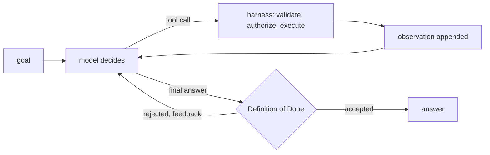

**Structure.** ReAct, short for reasoning and acting, interleaves a decision, an action, and an observation until the objective is met. One model sees the whole transcript and picks the next tool call or the final answer. `AgentRuntime` is a ReAct loop by construction, so the pattern is just configuration.

```python
# path: book/projects/examples/ch20/patterns/react.py  (excerpt; full file on disk)
REACT_INSTRUCTIONS = (
    "Work in short cycles: decide what you still need to know, call one tool, read the result. "
    "Keep the objective, what you have learned, and what is still unknown in mind at every step. "
    "Stop as soon as the evidence answers the objective; cite every fact as [source-id]."
)

# ... def react(llm, goal, tools, *, budget, dod, store, config, principal) -> PatternResult:
    runtime = make_agent(llm, tools, role="react", instructions=REACT_INSTRUCTIONS,
                         budget=budget or Budget(max_steps=6, max_tool_calls=6), dod=dod, store=store,
                         config=config, principal=principal)
    run = runtime.run(goal)
    return PatternResult("react", run.ok, run.final_answer, [run],
                         detail=run.stop_reason.value if run.stop_reason else "")
```

**When to use it.** ReAct is the default agent: the next action depends on the last observation, the horizon is a handful of tool calls, the tool set fits one prompt, and one context window holds the whole investigation. It has the fewest moving parts, loses nothing in hand-offs, and its trace reads top to bottom.

**Failure modes.** *Wandering*: without a clear completion criterion the model keeps gathering evidence until `REPEATED_ACTION`, `NO_PROGRESS`, or a budget stops it. *Local myopia*: on long tasks the model optimizes the next step and answers a narrower question than the one asked. *Context growth*: late steps are slow, expensive, and prone to ignoring early evidence. *Premature completion*: answering after one search, which the Definition of Done exists to reject.

**Cost profile.** Calls equal steps, typically tool calls plus one. Input tokens grow roughly quadratically with steps because each call resends the transcript. This chapter reuses Chapter 19's worked table ("Observations and truncation"): with its illustrative P = 1,500-token prefix and d = 600 tokens added per step, ReAct uses about 13,500 input tokens at 5 steps, 42,000 at 10, and 144,000 at 20. Latency is the sum of step latencies.

**Evaluation.** Answer quality plus trajectory metrics: tool-selection accuracy, redundant calls, steps to completion, and termination reasons. A rise in `NO_PROGRESS` stops after a prompt change is a regression even if completed answers look fine.

### Router

> **Deep dive.** Routing requests to specialist agents with a closed label set; skip on a first reading.

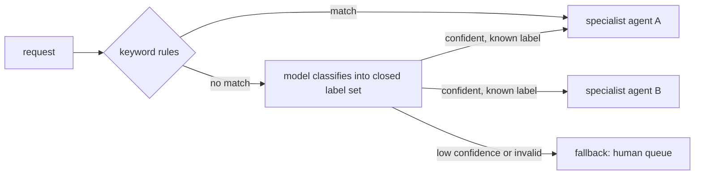

**Structure.** A router classifies the request once and hands it to exactly one specialist agent with its own tools, prompt, and budget, the agent-level cousin of Chapter 7's model router. Rules run first; the model is asked only when none matches, the response schema closes its label set, and low-confidence or malformed decisions go to a fallback.

```python
# path: book/projects/examples/ch20/patterns/router.py  (excerpt; full file on disk)
class AgentRouter:
    # ... __init__ stores specialists, rules, min_confidence, fallback
        names = tuple(self.specialists) + (fallback,)
        # The label space is closed: the schema itself rejects a route that does not exist.
        self._schema: type[BaseModel] = create_model(
            "RouteDecision",
            route=(Literal[names], ...),  # type: ignore[valid-type]
            confidence=(float, Field(ge=0.0, le=1.0)),
            reason=(str, ""),
        )

    def classify(self, request: str) -> tuple[str, str, float]:
        """Return (route, decided_by, confidence)."""
        for rule in self.rules:
            if rule.matches(request):
                return rule.route, "rule", 1.0
        # ... build a system prompt listing each specialist's name and description
        try:
            decision: Any = ask_structured(self.llm, "router", system, request, self._schema)
        except MalformedResponseError:
            return self.fallback, "fallback:malformed", 0.0
        if decision.route != self.fallback and decision.confidence < self.min_confidence:
            return self.fallback, "fallback:low_confidence", decision.confidence
        return decision.route, "model", decision.confidence

    # ... run(): classify, then one make_agent(...) run of the chosen specialist, or a fallback result
```

Self-reported confidence is a weak signal, so calibrate the threshold on a labeled set and prefer rules where the category is obvious.

**When to use it.** Requests fall into a few categories that need genuinely different tools, permissions, or instructions: HR questions, IT access problems, and incident investigations at Northwind. Each specialist gets least privilege by construction (the HR specialist cannot see incident tools), for one extra call at most and none for rule-matched requests.

**Failure modes.** *Misroute*: a specialist run ending in `NO_PROGRESS` or `VERIFICATION_FAILED` after a marginal-confidence route. *Mixed requests*: "my VPN is broken and I need my PTO balance" belongs to two routes; a single-label router answers half. *Label drift*: a new category is forced into the closest old label. *Fallback flood*: a threshold set too high sends most traffic to humans.

**Cost and evaluation.** One classification call (often a small model) plus the specialist's run. Treat the router as a classifier (Chapter 24): a confusion matrix over routes, the fallback rate, and accuracy as a function of the threshold. Then measure end-to-end success per route, because a correct route to a weak specialist still fails.

### Planner-executor and replanning

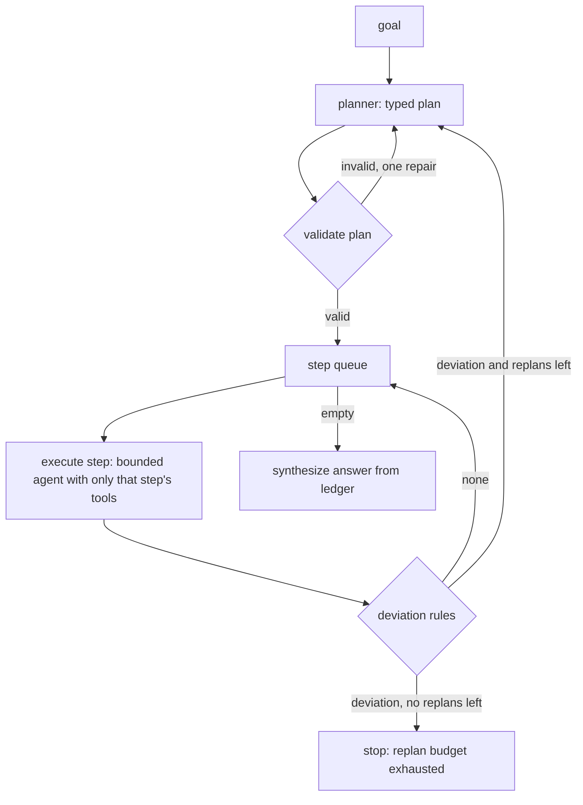

**Structure.** A planner writes a bounded, typed plan before any tool runs. Each step executes as its own small agent that sees only the tools the step names and only the findings it depends on. After each step, deterministic deviation rules decide whether the plan still holds; when one names a deviation, the planner is consulted again with the completed steps, the remaining queue, and the reason, up to a replan budget. A final synthesis call writes the answer from the ledger of findings.

A plan held as data can be validated before anything runs (unknown tools, duplicate ids, dependencies on steps that do not run earlier, which rules out cycles), shown to a human, and diffed. A useful plan is bounded and every step is verifiable (Chapter 19, "Reasoning and planning inside the loop").

```python
# path: book/projects/examples/ch20/patterns/planner_executor.py  (excerpt; full file on disk)
class PlanStep(BaseModel):
    id: str = Field(pattern=r"^s[0-9]+$")
    objective: str = Field(min_length=8)
    tools: list[str] = Field(min_length=1, max_length=2)
    target: str | None = None                 # the entity the step is about, e.g. a service name
    depends_on: list[str] = Field(default_factory=list)


# ... validate_plan(): unique ids, known tools, and every dependency completed or earlier in the list


    # ... PlannerExecutor.run(), after the first plan() call:
        queue = list(plan.steps)
        while queue:
            if len(done) >= self.max_steps:
                return self._result(False, None, done, plans, f"executed {len(done)} steps; step cap reached")
            step = queue.pop(0)
            outcome = self.execute(goal, step, done, f"{run_id}{SEP}{step.id}-{len(done) + 1}")
            done.append(outcome)
            reason = next((r for rule in self.deviation_rules if (r := rule(outcome, queue))), None)
            if reason is None:
                continue
            if replans >= self.max_replans:
                return self._result(False, None, done, plans, f"replan budget exhausted after: {reason}")
            replans += 1
            try:
                plan = self.plan(goal, done, reason)
            except MalformedResponseError as exc:
                return self._result(False, None, done, plans, f"replanning failed: {exc}")
            plans.append(plan)
            finished = {o.step.id for o in done}
            queue = [s for s in plan.steps if s.id not in finished]
        # ... one synthesis call writes the answer from the findings ledger
```

In the loop, a deviation rule returns a reason or nothing, completed steps are never rerun, and every exit names why it stopped. On disk, `plan` allows one repair round that quotes validation errors back.

**Replanning on deviation, not on every step.** A replan is a model call that can drop a step about to succeed, reorder dependencies, or chase the latest observation. So consult the planner only when a rule names a meaningful deviation. Useful rules are concrete and cheap: a step failed; a search returned nothing; a step revealed an entity the plan never mentions (Project 5's rule: an anomalous dependency no planned step examines); a precondition of a later step is now false. The planner sees the rule's reason string, which makes replans explainable in the trace.

**When to use it.** Long tasks where a reactive loop loses the objective, or steps that need review, different permissions, or their own budgets.

**Failure modes.** *Stale plan*: the environment changed and no rule noticed; steps succeed mechanically but answer the wrong question. *Over-planning*: twelve steps for a three-step task. *Replan thrash*: a rule that fires too easily, so `replans` sits near the budget on most runs. *Lost context between steps*: `depends_on` was wrong. *Invalid plans*: caught by validation before execution.

**Cost profile.** One planning call, two calls per step (call the tool, report), one synthesis call, plus one per replan. Keep Chapter 19's d = 600 and assume a 700-token step prompt (the second call also carries the step's 600 tokens) and 1,500-token planning and synthesis calls. Each step then costs about 2,000 input tokens however many came before (illustrative):

| Steps | ReAct (Chapter 19's table) | Planner-executor |
|---|---|---|
| 5 | 13,500 | 13,000 |
| 10 | 42,000 | 23,000 |
| 20 | 144,000 | 43,000 |

At five steps the two are even; the gap opens with length. Latency follows the same shape.

**Evaluation.** Plan validity; plan quality against gold step sets; whether replans helped (success on runs with a replan versus similar runs without); per-step success; and end-to-end success against a ReAct baseline.

### Supervisor and workers

> **Deep dive.** Delegation as a bounded tool call with a spawn budget; skip on a first reading.

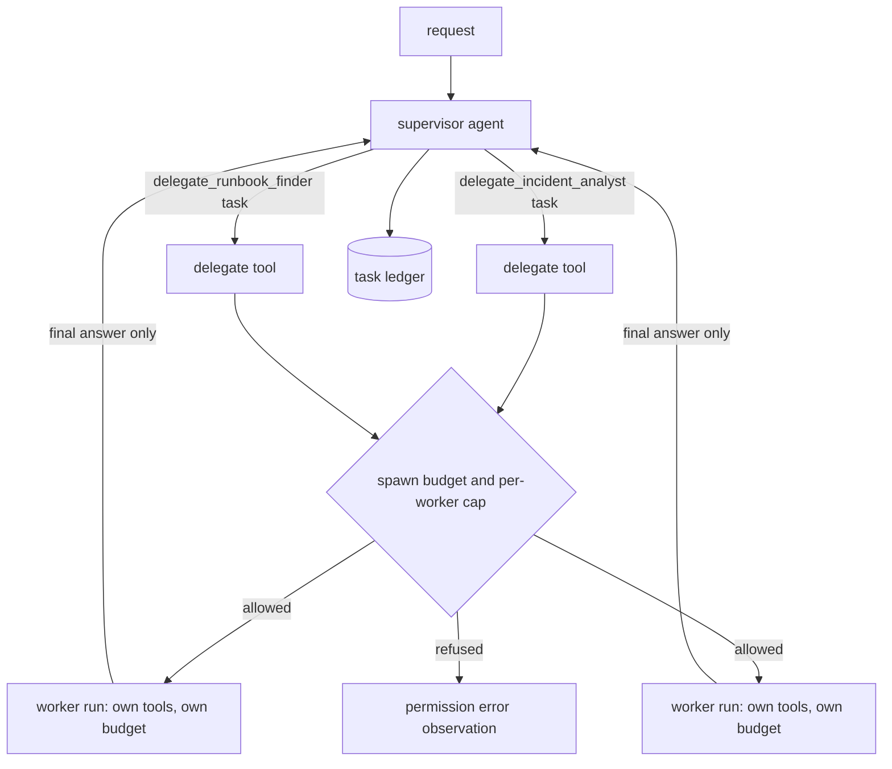

**Structure.** A supervisor is an agent whose only tools are "delegate to worker X." Each delegation starts a bounded child `AgentRuntime` with its own tools, prompt, budget, and Definition of Done. The supervisor sees only the worker's final answer; that context isolation is the point of the pattern. A ledger records every delegation, and child run ids derive from the parent's (`supervisor.incident_analyst-1`).

The book-wide separator rule: `.` (the `SEP` constant) separates levels, `-` joins words inside a segment, and `/` is never used because the event store turns run ids into file names. Depth is the number of dots.

```python
# path: book/projects/examples/ch20/patterns/supervisor.py  (excerpt; full file on disk)
class Supervisor:
    # ... constructor and run() on disk; SpawnBudget.acquire(depth) returns a refusal reason or None
    def _delegate_tool(self, member: Member) -> FunctionTool:
        def delegate(ctx: ToolContext, task: str) -> ToolOutput:
            used = sum(1 for e in self.ledger if e.member == member.name and e.parent_run_id == ctx.run_id)
            if used >= self.max_delegations:
                return ToolOutput.failure(f"{member.name} already received {used} tasks in this run",
                                          ErrorClass.PERMISSION)
            depth = ctx.run_id.count(SEP) + 1
            refused = self.spawn.acquire(depth)
            if refused:
                return ToolOutput.failure(refused, ErrorClass.PERMISSION)
            child_id = f"{ctx.run_id}{SEP}{member.name}-{used + 1}"
            run = self._run_member(member, task, child_id, ctx)
            # ... append a LedgerEntry for this delegation
            if not run.ok:
                return ToolOutput.failure(f"{member.name} stopped with {run.stop_reason.value if run.stop_reason else '?'}:"
                                          f" {run.detail}", ErrorClass.SEMANTIC)
            return ToolOutput(content=f"[{member.name} result] {run.final_answer}", data={"child_run_id": child_id})
        # ... wrapped as FunctionTool(f"delegate_{member.name}", ...) with a required "task" string
```

Because delegation is a tool call, validation, the identical-call detector, the tool-call budget, and the event log apply to hand-offs for free. The pattern adds only a tree-wide spawn budget and a per-worker cap. A failed worker returns a `semantic` failure observation, so the supervisor learns why instead of paraphrasing an empty answer as a finding.

**When to use it.** Sub-tasks need different tools or permission domains; their intermediate work is large and the parent only needs a summary; or they can be evaluated and owned separately. This is the minimal form; Chapter 22 adds what a team needs: typed envelopes ("Message contracts"), a shared budget ("Budgets at parent and child"), trace ids across processes ("Trace propagation"), and dispatch in code.

**Failure modes.** *Redundant delegation*: the same question twice, reworded; the per-worker cap and ledger expose it. *Context loss at the hand-off*: "check the thing we discussed" means nothing to a worker. *Runaway spawning*: the spawn budget refuses with a permission error the supervisor can read. *Paraphrase drift*: the supervisor drops worker citations; requiring `citations_grounded` on its answer catches it, because worker answers are its observations.

**Cost and evaluation.** Supervisor steps (delegations plus one) plus the worker runs, usually more than ReAct by the supervisor's own calls. Measure delegation accuracy against labels, redundant delegations, and cost and success against a single-agent baseline with the union of tools; without that baseline you cannot tell whether the supervisor paid for itself.

### Hierarchical agents

> **Deep dive.** Supervisors of supervisors and the limits they need; skip on a first reading.

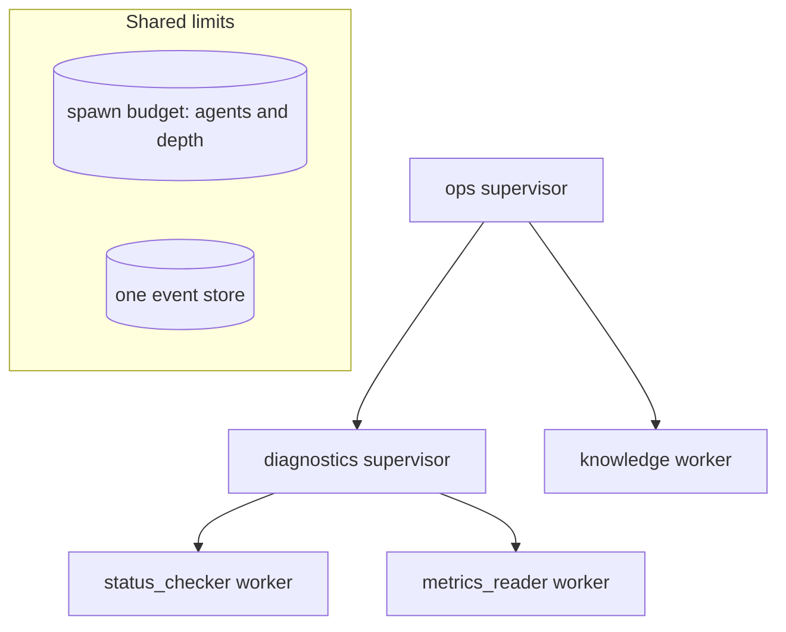

**Structure.** Supervisors whose members are other supervisors; a `Supervisor` is a valid member of another `Supervisor`, so no new mechanism is needed. The hierarchy adds shared limits (one `SpawnBudget`, by default ten agents and depth three, and one event store) and run ids that encode the path from the root (`ops.diagnostics-1.status_checker-1`).

```python
# path: book/projects/examples/ch20/patterns/hierarchical.py  (excerpt; full file on disk)
def build_tree(llm: LLMClient, team: Team, *, spawn: SpawnBudget | None = None,
               store: EventStore | None = None) -> Supervisor:
    members = [build_tree(llm, m, spawn=spawn, store=store) if isinstance(m, Team) else m for m in team.members]
    return Supervisor(llm, members, name=team.name, description=team.description, budget=team.budget,
                      spawn=spawn, store=store)
```

**When to use it, and what it costs.** Rarely: only when one supervisor's menu of workers is too long to choose from and sub-teams share context the root does not need. It is the most expensive pattern (thirteen calls to ReAct's five in the table), and every supervisor failure multiplies by depth. *Telephone effect*: details and citations erode as each level summarizes. *Spawn explosion*: agents grow with branching factor to the power of depth, so the shared spawn budget is not optional. *Latency stacking*: each level adds at least two sequential calls.

**Evaluation.** Supervisor metrics per level, citation survival from leaf to root, and a comparison against a flat supervisor with the same leaves. If the flat version is as good, flatten. Chapter 22 ("Coordination patterns") covers multi-agent team structures.

### Reflection

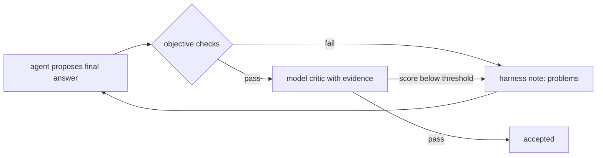

**Structure.** Reflection adds critique and revision. In `agentkit` the critic lives in the Definition of Done. A rejected answer becomes a harness note the model reads on its next step, with every observation still in context, so a revision costs one more call rather than a new run.

```python
# path: book/projects/examples/ch20/patterns/reflection.py  (excerpt; full file on disk)
    # ... CriticCheck: a Definition-of-Done verifier that runs objective checks, then a model critic
    def __call__(self, answer: str, state: AgentState) -> Verdict:
        problems = [p for check in self.objective for p in check(answer, state)]
        if problems:   # cheap, trustworthy signals first; no model call spent on a known-bad answer
            self.history.append({"kind": "objective", "problems": problems})
            return Verdict(self.name, False, "objective checks failed: " + "; ".join(problems))
        evidence = state.observation_text()[-6000:]
        try:
            c: Any = ask_structured(self.llm, "critic", CRITIC_SYSTEM,
                                    f"Criteria: {self.criteria}\n<evidence>\n{evidence}\n</evidence>\n"
                                    f"<answer>\n{answer}\n</answer>", Critique)
        except MalformedResponseError:
            return Verdict(self.name, False, "critic unavailable; answer not accepted")
        self.history.append({"kind": "critic", "score": c.score, "problems": c.problems})
        if c.score >= self.pass_score:
            return Verdict(self.name, True)
        return Verdict(self.name, False, f"score {c.score}/5; problems: {c.problems}; fix: {c.fix}")
```

Self-critique without new evidence mostly consumes tokens, and a model critiquing itself in the same context tends to reinforce its own misconception. Reflection helps when the critique has an objective signal: tests, a schema, retrieved evidence, an independent model. So the critic here is a separate call that sees the observations, after cheap objective checks.

**When to use it.** The output has checkable properties the generator tends to miss on the first pass: a required element, a citation per claim, consistency with the evidence. Coding agents are the clearest case, where the "critic" is the test suite.

**Failure modes.** *Sycophantic critic*: near-100 percent first-pass acceptance. *Contrarian critic*: `VERIFICATION_FAILED` on answers a human rates as fine. *Self-agreement*: the same model agrees with itself; use a different prompt, ideally a different model. *Oscillation*: the revision fixes one criterion and breaks another. *Token burn*: each rejected round resends the full transcript.

**Cost and evaluation.** One critic call per answer that passes the objective checks, plus one full-transcript generator step per revision. Measure the paired difference between first drafts and accepted answers on the same cases, judged independently (Chapter 24's paired bootstrap), plus revisions per run and critic agreement with humans. If accepted answers are not better than first drafts, the critic adds cost without quality.

### Evaluator-optimizer

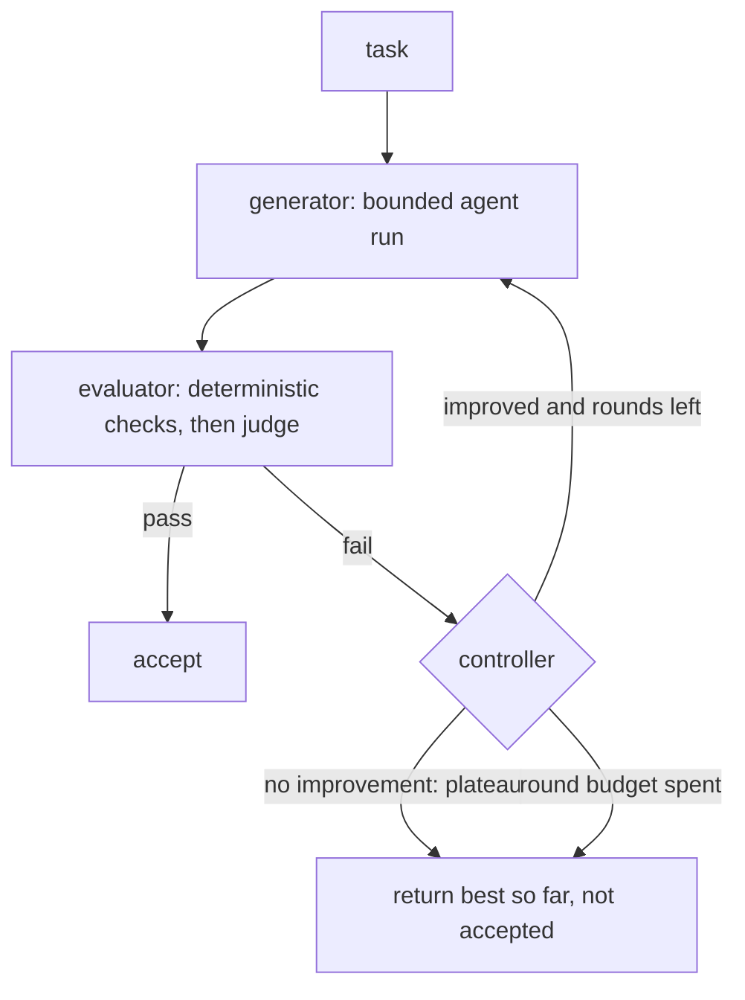

**Structure.** A generator produces a candidate, a separate evaluator scores it, and a controller in code decides: accept, revise with the feedback, or stop. It differs from reflection in three ways. The evaluator is independent (different prompt, often a different model, deterministic checks first). The controller owns the loop, so it can stop on pass, round budget, or plateau (no meaningful improvement for a set number of rounds). And the best candidate so far is kept, so a late regression never replaces a good draft.

```python
# path: book/projects/examples/ch20/patterns/evaluator_optimizer.py  (excerpt; full file on disk)
    # ... checks_then_judge(): deterministic checks gate; the judge scores only candidates that pass them
    def evaluate(candidate: str) -> Evaluation:
        problems = [p for c in checks if (p := c(candidate))]
        if problems:
            return Evaluation(passed=False, score=0.0, feedback=problems)
        # ... otherwise one structured judge call; a broken judge fails the round, the best draft survives


    # ... EvaluatorOptimizer.run(): the controller owns the loop
        for round_no in range(1, self.max_rounds + 1):
            candidate, run = self.generate(previous, feedback, round_no)
            # ... record the run; a generator that produces nothing ends the loop
            ev = self.evaluate(candidate)
            self.rounds.append({"round": round_no, "score": ev.score, "passed": ev.passed, "feedback": ev.feedback})
            improved = best is None or ev.score >= best[0] + self.min_improvement
            if best is None or ev.score > best[0]:
                best = (ev.score, candidate)
            if ev.passed:
                return self._result(True, (ev.score, candidate), runs, f"accepted in round {round_no}")
            stale = 0 if improved else stale + 1
            if stale >= self.patience and round_no > 1:
                return self._result(False, best, runs, f"plateau after round {round_no}")
            previous, feedback = candidate, ev.feedback
        return self._result(False, best, runs, f"round budget of {self.max_rounds} exhausted")
```

Deterministic checks go first because they are free and exact and make the most useful feedback; the judge runs only on candidates that pass them, and must be calibrated against humans (Chapter 24) before its threshold means anything.

One subtlety: each round of `agent_generator` is a fresh agent run, so tools execute again unless you memoize read-only results or hand over the previous evidence. In the comparison table the evaluator-optimizer made eight tool calls to ReAct's four, because round two re-gathered everything. Project 5 avoids this by gathering evidence once (planner-executor) and repeating only the writing.

**When to use it.** Criteria are explicit and checkable, first attempts often miss them, and feedback is actionable: reports with required structure, SQL that must parse, code against tests.

**Failure modes.** *Goodhart*: the generator satisfies the evaluator rather than the task, for example with grounded but irrelevant citations. *Uninformative feedback*: "make it better" produces random changes and a plateau. *Evaluator drift*: pass rates move when the judge changes, not the quality. *Infinite polish*: without a plateau rule, the round budget goes on marginal gains.

**Cost profile.** Rounds times generator cost, plus the judge on candidates that reach it. Rounds are sequential, so the round budget is also a latency budget.

**Evaluation.** Pass rate by round, plateau rate, evaluator calibration against humans (agreement and Cohen's kappa), and cost per accepted output. The share of accepted outputs a human rejects is the evaluator's false-pass rate, which bounds how much you can trust the loop.

### Parallel agents: fan-out and fan-in

> **Deep dive.** Branch agents in a thread pool and the fan-in policy; skip on a first reading.

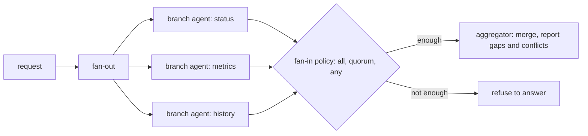

**Structure.** Chapter 17's fan-out with an agent in each branch, merged by a fan-in step under an explicit completeness policy. `AgentRuntime` is synchronous, so branches run in a thread pool sized to respect provider rate limits. With a tracer, submit each branch through `contextvars.copy_context().run`, as Chapter 22 does; a thread pool does not inherit the context variables that link spans, so each branch would start an orphan trace.

```python
# path: book/projects/examples/ch20/patterns/parallel.py  (excerpt; full file on disk)
def _enough(ok: int, total: int, require: Require) -> bool:
    return total > 0 and {"all": ok == total, "quorum": ok * 2 > total, "any": ok >= 1}[require]


    # ... inside fan_out(): run_branch builds one make_agent(...) per branch with run id f"{run_id}{SEP}{b.name}"
    with ThreadPoolExecutor(max_workers=max_workers) as pool:
        futures = [pool.submit(run_branch, b) for b in branches]
    results: list[tuple[Branch, RunResult | None, str]] = []
    for b, f in zip(branches, futures):           # results in branch order, never completion order
        try:
            results.append((b, f.result(), ""))
        except Exception as exc:  # noqa: BLE001 - a crashed branch is a failed branch, recorded with its cause
            results.append((b, None, f"{type(exc).__name__}: {exc}"))
    # ... succeeded, missing, per-branch status
    if not _enough(len(succeeded), len(branches), require):
        return PatternResult("parallel", False, None, runs,
                             detail=f"{len(succeeded)}/{len(branches)} branches succeeded; require={require}", data=data)
    answer = merge(succeeded, missing) if merge else _synthesize(llm, request, succeeded, missing)
```

The design decision lives in the fan-in. `require="all"` refuses to answer if any branch failed, right when a partial answer is a wrong answer (a compliance check across three systems). `"quorum"` needs a strict majority, for redundant branches that check the same thing differently. `"any"` answers from whatever succeeded but names the missing branches. The aggregator is told to report disagreements rather than pick a winner silently, and it receives results in branch order, so its input and the trace are deterministic.

**When to use it, and what it costs.** Independent sub-tasks where latency matters, such as checking service health, metrics, and incident history at once. Latency drops to the slowest branch plus the merge; cost does not drop at all. *Hidden dependencies* (a branch guessed what another would find), *contradictions* merged silently, *rate-limit storms* without a pool limit, and *silent partials* (a confident answer from two of three branches) are the failures to test for.

**Evaluation.** Per-branch success, partial-answer rate under each policy, seeded contradictions the merge must report, and p95 latency against the sequential version.

### Sequential workflows with agents in the steps

> **Deep dive.** A fixed chain with one agent step; skip on a first reading.

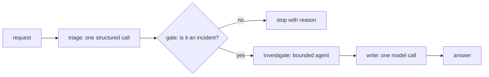

**Structure.** A chain whose order is fixed by code; each step is a single call, an agent, or plain code, with typed state between steps and an optional gate after each. The agent sits inside the one open-ended step, following Chapter 17's advice to graduate the smallest node that needs an agent, not the whole workflow.

```python
# path: book/projects/examples/ch20/patterns/sequential.py  (excerpt; full file on disk)
    # ... agent_step(): one bounded agent inside a chain step
    def fn(state: State) -> State:
        runtime = make_agent(llm, tools, role=name, instructions=instructions, budget=budget, dod=dod, store=store)
        run = runtime.run(goal(state))
        ctx.runs.append(run)
        if not run.ok:
            raise StepFailed(name, f"agent stopped with {run.stop_reason.value if run.stop_reason else '?'}: {run.detail}")
        return {**state, output: run.final_answer}


    # ... run_chain(): fixed order, a gate after each step, a step failure ends the chain
    for step in steps:
        try:
            state = step.fn(state)
        except StepFailed as exc:
            return PatternResult("sequential", False, None, ctx.runs, detail=str(exc), data={"path": path, "state": state})
        path.append(step.name)
        problem = step.gate(state) if step.gate else None
        if problem:
            return PatternResult("sequential", False, None, ctx.runs, detail=f"gate after {step.name}: {problem}",
                                 data={"path": path, "state": state})
```

**When to use it.** Most of the time when someone asks for "an agent." If you can name the stages (triage, investigate, write, review), make them a chain and let only the unpredictable stage be an agent.

**Failure modes.** *Error propagation*: a wrong triage label sends a request down the wrong chain; gates mitigate it. *Rigidity*: a case needs a stage the chain lacks. *Agent step failure*: treat an incomplete agent run as a step failure, not `None` passed downstream.

**Cost and evaluation.** Cost and latency are the sum of steps. Measure per-step metrics (the triage confusion matrix, the agent step's trajectory metrics), gate rejection rates, path distribution, and end-to-end success.

## How it works

Project 5 is the Northwind incident-research agent. An alert fires, the on-call engineer asks for an investigation, and the system returns a cited report that an incident commander must approve before it is posted to `#incidents`. Here is one investigation of the sample Trackline latency alert.

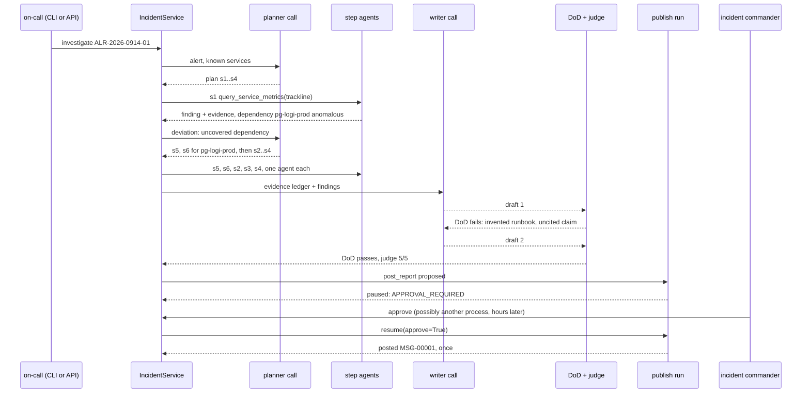

1. **Plan.** The planner sees the alert and the known services and returns a typed plan: read Trackline's metrics, list its recent deploys, search past incidents, search runbooks. Validation rejects unknown services, repeated steps, a missing runbook search, and plans over the step budget, with one repair round.
2. **Execute a step.** Each step is its own `AgentRuntime` with one tool, a three-step budget, and a Definition of Done: the tool was called, and the finding cites what it observed or says it found nothing. The first step flags Trackline's p95, error rate, and webhook retries, and reports dependency `pg-logi-prod` as anomalous.
3. **Replan on a deviation.** The rule `uncovered_dependency` sees that no planned step examines `pg-logi-prod` and returns a reason. Given the completed step, the queue, and the reason, the planner inserts two database steps (metrics, then deploys) ahead of the rest. That is the only replan.
4. **Finish the plan.** The remaining steps find that sequential scans on the database rose about seventy-fold after a migration at 05:15, and a February postmortem describes the same pattern. Each tool returns structured sources that the orchestrator folds into an evidence ledger; nothing is parsed from model text.
5. **Write and check.** The writer turns the ledger and findings into six sections, citing a ledger id in every claim. The deterministic Definition of Done checks those citations and that the recommended runbook exists and was retrieved. The first draft recommends `it-db-index-rebuild-runbook`, which does not exist, and drops a citation, so the checker returns four problems: one `uncited_claim` and three caused by the invented runbook (`unknown_citation`, `runbook_not_in_catalog`, `runbook_missing`).
6. **Revise and judge.** The writer revises, the second draft passes, and only then does the rubric judge read it.
7. **Pause for approval.** A publish run starts whose only tool, `post_report`, is marked `EXTERNAL`. The default policy requires approval for external side effects, so the run stops with `APPROVAL_REQUIRED` after recording the proposed call. Nothing is posted yet.
8. **Resume and post once.** When the incident commander approves, possibly from another process hours later, the service rebuilds the run from its event log and resumes it. The tool executes once, with an idempotency key derived from the run and request ids.

## Architecture

> **Deep dive.** Project 5's trust boundaries and investigation state machine; skip on a first reading.

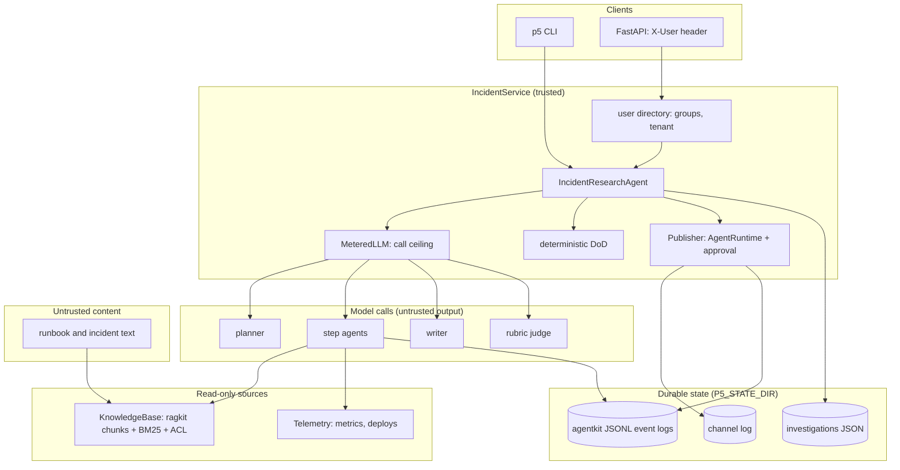

Three boundaries matter. **Identity** enters only through the server-side directory: the API maps the `X-User` header (a stand-in for your authentication proxy) to groups and a tenant, and tools read the principal from `ToolContext`, never from model arguments. **Retrieved documents** are escaped and wrapped in `<untrusted_data>` markers (Chapter 26), but the real protection is structural: no agent that reads documents has the one tool with a side effect. **Model output** never reaches the channel unreviewed: the publish tool reads the report from the store by investigation id, so what the human approved is byte for byte what gets posted.

An investigation moves through a small state machine; only `awaiting_approval` accepts a decision.

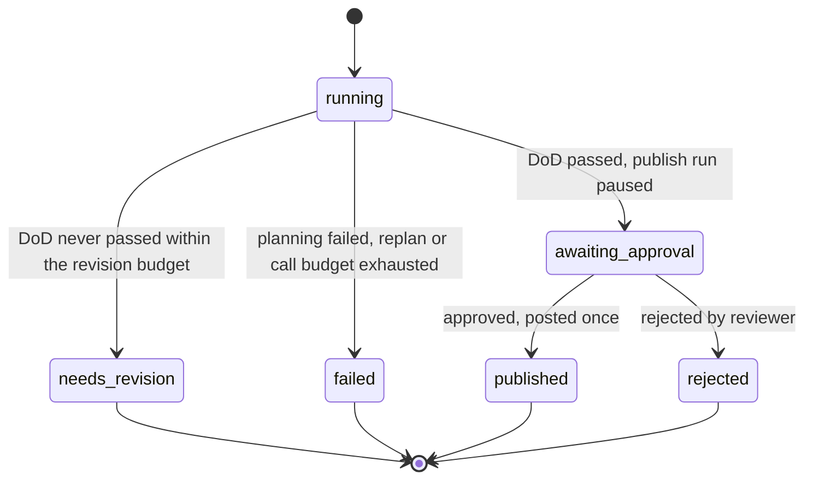

The judge is absent from the state machine on purpose. The deterministic Definition of Done is the hard gate; the judge is advisory: it drives revisions, and its verdict is attached to the record so the approver sees "judge: 3/5, cause lacks an independent signal" next to the report. A judge as hard gate would turn its false negatives into missing reports during an incident.

## Implementation

### Layout and configuration

> **Deep dive.** Project files and the limits you can tune; skip on a first reading.

```
book/projects/p5-incident-agent/
  pyproject.toml  .env.example  Dockerfile  README.md
  data/alerts.json  data/telemetry.json
  incident_agent/
    config.py  tools.py  judge.py  agent.py  service.py  cli.py  api.py
    domain/   models.py  report.py  dod.py  deviation.py
    adapters/ corpus.py  telemetry.py  channel.py  store.py  metering.py  cassette.py  scripted.py
  tests/      test_tools_and_corpus.py  test_dod.py  test_trajectory.py  test_evaluator_optimizer.py
              test_approval.py  test_replay.py  test_api_cli.py
```

With `LLM_PROVIDER=fake`, the default, a scripted model plays every role offline. The README lists install, run, and Docker commands.

| Variable | Default | Meaning |
|---|---|---|
| `LLM_PROVIDER`, `LLM_MODEL`, provider keys | `fake` | model for every role |
| `P5_STATE_DIR` | `.p5-state` | records, event logs, channel log |
| `P5_MAX_PLAN_STEPS` | 8 | steps per investigation, across replans |
| `P5_MAX_REPLANS` | 2 | replans before the investigation fails |
| `P5_MAX_REVISIONS` | 3 | writer rounds |
| `P5_MIN_IMPROVEMENT` | 0.05 | score gain that counts as progress |
| `P5_JUDGE_PASS_SCORE` | 4 | judge pass score, 1 to 5 |
| `P5_JUDGE_MODEL` | unset | a different model for the judge |
| `P5_STEP_MAX_STEPS`, `P5_STEP_MAX_TOOL_CALLS` | 3, 2 | budget of each step agent |
| `P5_MAX_LLM_CALLS` | 60 | model-call ceiling per investigation, all roles |
| `P5_CHANNEL` | `#incidents` | where approved reports go |

### Tools

> **Deep dive.** How research tools wrap untrusted text and return structured sources; skip on a first reading.

Four read-only research tools are built per investigation, bound to the alert's time window, plus one external tool for publishing. Searches rank section chunks with BM25, filter by ACL before anything leaves the knowledge base, and return the best chunk per document, since the document id is the citation unit.

```python
# path: book/projects/p5-incident-agent/incident_agent/tools.py  (excerpt; full file on disk)
def untrusted(source: str, text: str) -> str:
    """Wrap retrieved text as data. Escaping keeps the text from closing the wrapper early."""
    safe = text.replace("&", "&amp;").replace("<", "&lt;").replace(">", "&gt;")
    return f'<untrusted_data source="{source}">{safe}</untrusted_data>'


def research_tools(kb: KnowledgeBase, telemetry: Telemetry, alert: Alert, *, k: int = 3) -> list[FunctionTool]:
    as_of = alert.fired_at

    def search(kind: str) -> Callable[..., ToolOutput]:
        def run(ctx: ToolContext, query: str) -> ToolOutput:
            hits = kb.search(kind, query, ctx.principal, k)         # ACL from the trusted principal
            lines, items = [], []
            for h in hits:
                lines.append(f"[{h.doc_id}] {h.title} > {h.section}\n{untrusted(h.doc_id, h.text[:600])}")
                items.append(Evidence(id=h.doc_id, kind=kind, title=h.title, text=h.text[:600]))  # type: ignore[arg-type]
            return _evidence_output(lines, items)
        return run
    # ... query_service_metrics also reports each dependency as normal or ANOMALOUS;
    # ... get_recent_deploys lists deploys and migrations in a window before as_of


def publish_tool(channel: Channel, load: Callable[[str], Investigation | None]) -> FunctionTool:
    def post_report(ctx: ToolContext, investigation_id: str, channel_name: str) -> ToolOutput:
        inv = load(investigation_id)
        if inv is None or inv.report is None:
            return ToolOutput.failure(f"no report for investigation {investigation_id!r}", ErrorClass.IMPOSSIBLE)
        msg_id = channel.post(channel_name, f"Incident report {inv.alert.id}: {inv.alert.rule}", inv.report,
                              idempotency_key=ctx.idempotency_key)
        return ToolOutput(content=f"posted {msg_id} to {channel_name}", artifacts={"message_id": msg_id})
    # ... the FunctionTool declares the side-effect class and approval:
        post_report, side_effect=SideEffect.EXTERNAL, requires_approval=True, idempotent=True, pass_context=True)
```

With Chapter 16's governed tool layer, wrap its executor with `agentkit.executor_tools(executor, ctx)` instead of `FunctionTool`; its policy, idempotency store, and audit log stay in force.

### The deterministic Definition of Done and the deviation rules

The report contract fits in a sentence: six named sections; every sentence or bullet in Summary, Impact, Timeline, and Likely cause cites at least one source; every citation is a source this investigation observed; the recommended runbook exists and was retrieved. The checker returns named problems whose messages double as revision feedback.

```python
# path: book/projects/p5-incident-agent/incident_agent/domain/dod.py  (excerpt; full file on disk)
def check_report(report: str, evidence_ids: Iterable[str], runbook_catalog: Iterable[str]) -> list[Problem]:
    evidence, catalog = set(evidence_ids), set(runbook_catalog)
    sections = parse_sections(report)
    problems: list[Problem] = []

    # ... missing_section for each required section that is absent or empty

    for name in CLAIM_SECTIONS:
        for claim in claims(sections.get(normalize_heading(name), "")):
            if not cited(claim):
                problems.append(Problem(code="uncited_claim", message=f"{name}: claim has no [source-id]: {claim[:120]!r}"))

    for source in sorted(set(cited(report))):
        if source not in evidence:
            problems.append(Problem(code="unknown_citation",
                                    message=f"[{source}] is not a source this investigation observed"))

    body = sections.get(normalize_heading("Recommended runbook"), "")
    if body:
        named = cited(body)
        runbooks = [n for n in named if n in catalog]
        # ... runbook_not_in_catalog, runbook_missing, runbook_ambiguous, then:
        for n in runbooks:
            if n not in evidence:
                problems.append(Problem(code="runbook_not_retrieved",
                                        message=f"runbook [{n}] exists but was never retrieved in this investigation"))
    return problems
```

What counts as a claim is defined in `report.py`: each bullet is one claim, prose splits into sentences at a period followed by a capital letter (so version numbers survive), and table rows are skipped. It is crude on purpose: a reviewer can check it by eye, and it catches the common failure, an unsupported inference written as fact.

The deviation rules are as small: each reads the finished step, its tools' data, and the planned steps, and returns a reason or nothing (a third, `step_failed`, is on disk).

```python
# path: book/projects/p5-incident-agent/incident_agent/domain/deviation.py  (excerpt; full file on disk)
def no_evidence(rec: StepRecord, data: list[dict[str, Any]], planned: list[PlanStep]) -> str | None:
    if rec.ok and rec.step.tool.startswith("search_") and not rec.evidence_ids:
        return f"step {rec.step.id} ({rec.step.tool} '{rec.step.target}') returned no evidence"
    return None


def uncovered_dependency(rec: StepRecord, data: list[dict[str, Any]], planned: list[PlanStep]) -> str | None:
    """A metrics step found an anomalous dependency that no planned step will look at."""
    covered = {s.target for s in planned if s.tool == "query_service_metrics"}
    for d in data:
        for dep in d.get("anomalous_dependencies", []):
            if dep not in covered:
                return (f"dependency {dep} of {rec.step.target} is anomalous and no step examines it; "
                        f"add query_service_metrics and get_recent_deploys for {dep}")
    return None
```

Note what `no_evidence` does not fire on: a deploy query that finds no deploys. "No change shipped to this service" is evidence, and replanning on it would be thrash.

### The orchestrator

> **Deep dive.** How `IncidentResearchAgent` specializes the two patterns; skip on a first reading.

`IncidentResearchAgent` runs the planner-executor, with domain validation and the evidence ledger, then the evaluator-optimizer, which repeats only the writing.

```python
# path: book/projects/p5-incident-agent/incident_agent/agent.py  (excerpt; full file on disk)
    def investigate(self, inv: Investigation) -> Investigation:
        with self.tracer.span("incident.investigate", investigation=inv.id, alert=inv.alert.id):
            tools = {t.name: t for t in research_tools(self.kb, self.telemetry, inv.alert)}
            # ... first plan; a planning failure ends the investigation as failed
            queue = list(plan.steps)
            while queue:
                if len(inv.steps) >= self.limits.max_plan_steps:
                    return self._fail(inv, f"step cap of {self.limits.max_plan_steps} reached")
                step = queue.pop(0)
                rec, data = self.execute(inv, step, tools[step.tool])
                inv.steps.append(rec)
                planned = [s.step for s in inv.steps] + queue
                reason = next((r for rule in self.rules if (r := rule(rec, data, planned))), None)
                if reason is None:
                    continue
                inv.deviations.append(reason)
                if len(inv.plans) - 1 >= self.limits.max_replans:
                    return self._fail(inv, f"replan budget exhausted: {reason}")
                # ... replan with the remaining queue and the reason; a replanning failure fails the investigation
                inv.plans.append(plan)
                queue = list(plan.steps)
            self.write_and_evaluate(inv)
        return inv

    def execute(self, inv: Investigation, step: PlanStep, tool: FunctionTool) -> tuple[StepRecord, list[dict[str, Any]]]:
        # ... one AgentRuntime per step, with exactly one tool, then fold the tool's sources into the ledger:
        data = [e.data for e in run.events_of(ToolResult) if e.ok and isinstance(e.data, dict)]
        ids: list[str] = []
        for d in data:
            for src in d.get("sources", []):
                ev = Evidence(**{**src, "step": step.id})
                inv.evidence.setdefault(ev.id, ev)
                ids.append(ev.id)
```

Because the ledger is built from the tools' structured `sources`, a citation the model invents cannot enter it.

`write_and_evaluate` (on disk) is the evaluator-optimizer loop with `check_report` as the deterministic check. A best report that still has Definition-of-Done problems ends as `needs_revision`; one without problems moves to `awaiting_approval`. Its scoring function, `round_score`, ranks any report that fails the Definition of Done below any that passes, fewer problems above more, and passing reports by the judge's score. The weights are illustrative; what matters is that "best so far" has a testable definition.

The judge is `evalkit`'s `LLMJudge` (Chapter 24) with one rubric: is the cause supported by the cited evidence, is observation separated from inference, are the next steps specific and safe. It sees the evidence ledger, so it judges support, not style.

### Publishing behind an approval

> **Deep dive.** The publish run that pauses for approval and resumes from its log; skip on a first reading.

The publish step has no decision to make, so its "model" is a function that always proposes the same `post_report` call. `AgentRuntime` supplies what an irreversible action needs: a durable log, a policy check, an approval pause that survives a restart, an idempotency key, and resume.

```python
# path: book/projects/p5-incident-agent/incident_agent/agent.py  (excerpt; full file on disk)
class Publisher:
    # ... __init__(channel, load, event_store, channel_name, tracer):
        self.runtime = AgentRuntime(
            PublishProposer(), [publish_tool(channel, load)],
            system_prompt=role("publisher", "Post the approved report."),
            budget=Budget(max_steps=3, max_tool_calls=1),
            dod=DefinitionOfDone(any_of(tool_was_called("post_report"), contains_all("rejected"))),
            store=event_store, tracer=tracer)

    def request(self, inv: Investigation) -> RunResult:
        goal = json.dumps({"investigation_id": inv.id, "channel": self.channel_name})
        return self.runtime.run(goal, run_id=f"{inv.id}.publish", metadata={"investigation": inv.id})

    def decide(self, run_id: str, *, approve: bool, reviewer: str, reason: str) -> RunResult:
        return self.runtime.resume(run_id, approve=approve, reason=f"{reviewer}: {reason}".strip())
```

`IncidentService.investigate` saves the record before requesting publication and checks that the publish run actually paused; any other ending marks the investigation failed. `decide` accepts only `awaiting_approval`, requires the reviewer to be on-call staff in the alert's tenant, and resumes the run. The CLI and the FastAPI app are thin shells over these two methods.

### Tests

> **Deep dive.** Trajectory and replay tests specific to agents; skip on a first reading.

The suite runs offline. Trajectory tests assert the path an investigation took; replay tests assert that recorded runs reproduce.

```python
# path: book/projects/p5-incident-agent/tests/test_trajectory.py  (excerpt; full file on disk)
EXPECTED_MAIN = [
    ("query_service_metrics", "trackline"),
    ("query_service_metrics", "pg-logi-prod"),       # inserted by the replan
    ("get_recent_deploys", "pg-logi-prod"),          # inserted by the replan
    ("get_recent_deploys", "trackline"),
    ("search_incidents", "trackline latency degradation"),
    ("search_runbooks", "production incident response stabilise"),
]


def test_main_alert_replans_once_to_examine_the_anomalous_dependency(service):
    inv = service.investigate(MAIN, "oncall-logistics")
    assert inv.status is Status.AWAITING_APPROVAL
    assert inv.trajectory() == EXPECTED_MAIN
    assert len(inv.plans) == 2 and len(inv.deviations) == 1
    assert inv.deviations[0].startswith("dependency pg-logi-prod of trackline is anomalous")
    assert [s.ok for s in inv.steps] == [True] * 6
    assert "deploy:CHG-2026-0907" in inv.evidence and "[deploy:CHG-2026-0907]" in inv.report
```

A companion test sets `max_replans=0` and asserts the investigation fails closed: no report, no publish run, one step executed.

```python
# path: book/projects/p5-incident-agent/tests/test_replay.py  (excerpt; full file on disk)
def test_every_step_replays_identically_without_executing_tools(service, telemetry):
    inv = service.investigate(MAIN, "oncall-logistics")
    before = telemetry.queries
    for step in inv.steps:
        report = replay(service.event_store.load(step.run_id))
        assert report.identical, (step.run_id, report.summary())
    assert telemetry.queries == before


def test_cassette_detects_a_prompt_change(make_service, tmp_path, monkeypatch):
    tape = tmp_path / "tape.jsonl"
    make_service(RecordingLLM(scripted_llm(), tape)).investigate(MAIN, "oncall-logistics")
    monkeypatch.setattr(agent_module, "WRITER_SYSTEM", agent_module.WRITER_SYSTEM + " Be brief.")
    replayer = ReplayLLM(tape)
    inv = make_service(replayer).investigate(MAIN, "oncall-logistics")
    assert inv.status is Status.FAILED and "CassetteMiss" in inv.detail
    assert len(replayer.misses) == 1                 # planning and execution replayed; the writer call is new
```

Step replay uses `agentkit.replay` on each step's event log. Planner, writer, and judge calls sit outside any agent loop, so the cassette in `adapters/cassette.py` records every completion keyed by a request hash and serves it back. A request the cassette has never seen is reported as a miss that pinpoints which prompt changed.

## Code walkthrough

Run it from the project directory:

```bash
cd book/projects/p5-incident-agent
python -m pytest -q                                    # all offline
p5 investigate ALR-2026-0914-01 --user oncall-logistics
```

```text
inv-alr-2026-0914-01-05113e  status=awaiting_approval
trajectory: query_service_metrics(trackline) -> query_service_metrics(pg-logi-prod) -> get_recent_deploys(pg-logi-prod) -> get_recent_deploys(trackline) -> search_incidents(trackline latency degradation) -> search_runbooks(production incident response stabilise)
replans: 1; deviations: ['dependency pg-logi-prod of trackline is anomalous and no step examines it; add query_service_metrics and get_recent_deploys for pg-logi-prod']
round 1: score=0.25 dod_problems=4
round 2: score=1.00 dod_problems=0 judge=5/5
usage: {"model_calls": 17, "by_role": {"planner": 2, "executor": 12, "writer": 2, "judge": 1}, "tokens": 12245}
```

The trajectory shows the replan: two `pg-logi-prod` steps jumped ahead of the planned ones, for the reason on the deviation line. The rounds show four Definition-of-Done problems in the first draft, none in the second, and a judge call only on the second. Twelve of seventeen calls are step agents, because each step is a two-call run (call the tool, report).

The accepted report's Likely cause section reads, in part: "The migration CHG-2026-0907 preceded the degradation [deploy:CHG-2026-0907]. Database signals moved with it: pg-logi-prod.seq_scans_per_s baseline 12/s, at 06:10 UTC 880/s (x73.3) [metric:pg-logi-prod.seq_scans_per_s]. This matches a past incident in which a migration dropped a composite index and queries fell back to sequential scans [inc-2026-02-tracking-latency]. Confidence is moderate: the index loss is inferred, not yet confirmed [metric:pg-logi-prod.seq_scans_per_s]." The recommended `it-incident-response-runbook` exists and was retrieved; the failover runbook the search also surfaced is not recommended, because replication lag stayed below its floor.

Approve it from a second shell and replay it:

```bash
p5 approve inv-alr-2026-0914-01-05113e --user ic-logistics --reason "matches dashboards"
p5 replay inv-alr-2026-0914-01-05113e
```

```text
inv-alr-2026-0914-01-05113e  status=published  message=MSG-00001
inv-alr-2026-0914-01-05113e.s1: identical: 2 decisions reproduced
inv-alr-2026-0914-01-05113e.s5: identical: 2 decisions reproduced
...
```

The approval ran in a new process, rebuilding the run from `.p5-state/events/<id>.publish.jsonl`. Approving again is refused, and the channel still holds one message.

## Production considerations

> **Deep dive.** Latency, cost metering, and scaling for Project 5; skip on a first reading.

**Latency.** Project 5's seventeen sequential calls, at an illustrative one to three seconds each, suit an asynchronous investigation, not a chat reply. Two changes cut latency without changing behavior: run independent steps concurrently (a `depends_on` field on `PlanStep` would let metrics and deploys for one service run together), and let steps whose tool output is already the finding skip the second "report" call. In production the API should return 202 with a status URL and run the investigation on a queue (Chapter 28 designs the job protocol, Chapter 29 the queue).

**Cost.** `MeteredLLM` attributes calls to every role and enforces one ceiling across them; a separate judge model joins it through `MeteredLLM.share`, since a second meter would silently double the ceiling. Chapter 30 turns these counts into a cost model.

**Security.** ACLs apply before results leave the knowledge base, so an unreadable document never appears even as a title. A four-eyes rule (approver differs from requester) is a one-line addition worth making for higher-impact actions.

**Operations.** Each agent run logs under a derived run id (`<investigation>.<step>`), so an investigation's runs sort together. The single API worker is deliberate, since approvals resume runs from files; scaling out needs a shared event store and run-level locking (Chapter 38).

## Common mistakes

- **Choosing the architecture before the baseline.** Without a single ReAct agent with the same tools to compare against, you cannot show the extra calls bought anything.
- **Replanning on every step.** It doubles calls and makes plans chase the latest observation.
- **Unbounded fan-out.** One branch per item without a concurrency limit meets provider rate limits during an incident.
- **Letting the model retype the approved artifact.** Pass a reference and read the artifact from the store, so what is posted is what was approved.

## Failure modes

| Failure | How it shows in telemetry | How to test for it |
|---|---|---|
| Wandering ReAct loop | runs ending `NO_PROGRESS` or `REPEATED_ACTION`; tool calls per run creeping up | scripted model repeats a call; assert stop reason and tool-call count |
| Misroute | specialist runs ending `VERIFICATION_FAILED` after marginal route confidence | labeled routing set; confusion matrix in CI |
| Stale plan | steps succeed, answer is narrower than the question; no deviations logged | step one reveals a new entity; assert a replan and the new step |
| Replan thrash | replans near the budget; failures with "replan budget exhausted" | `max_replans=0` fails closed; replan rate per release |
| Invented runbook or citation | `runbook_not_in_catalog` or `unknown_citation` in round records | DoD unit tests with invented ids; assert the round sequence |
| Uncited inference | `uncited_claim`; judge flags "cause lacks an independent signal" | DoD test removing one citation; judge calibration set with weak causes |
| Writer plateau | `needs_revision` with "plateau after round 2" | writer ignores feedback; assert status and refused approval |
| Supervisor runaway | spawn-budget refusals; agents per run at the cap | supervisor delegates every step; assert ledger length |
| Silent partial merge | fewer sources than branches; `missing` non-empty | `require="all"` and `"quorum"` with one failing branch |
| Duplicate side effect | two channel messages for one investigation | approve twice; replay with the same key; assert one message |
| Cross-tenant leak | a retail document id in a logistics investigation's evidence | knowledge-base ACL tests; tenant checks on investigate, read, decide |

Two of these are easy to misdiagnose. A stale plan produces no errors; the tell is an evidence ledger with no source about the entity the first step surfaced, and the fix is a deviation rule, not a better prompt. A writer plateau looks like a model-quality problem but is usually uninformative feedback: if the same problem codes recur every round, fix the feedback text for that code.

## Tradeoffs

**Adaptivity versus predictability.** ReAct adapts at every step and is the hardest to predict; a sequential workflow is fully predictable and cannot adapt. Planner-executor adapts only at named deviations, which is why it suits regulated or reviewed work.

**Context sharing versus isolation.** One agent loses nothing at hand-offs, but its context grows without bound; supervisors and per-step agents keep contexts small at the price of hand-off loss and more calls.

**Quality loops versus latency and cost.** Each round adds a generation and an evaluation to the critical path; a loop that rarely improves the outcome should be removed, not tuned.

**Hard gates versus advisory signals.** Deterministic checks make good gates because their errors are rare and explainable; model judges make good signals and poor gates (see Architecture).

## Evaluation and testing

Evaluate at three levels, kept separate so a regression points at its layer.

**Outcome.** The task's own metric on a frozen set: for Project 5, correct cause and valid runbook against gold labels per alert, plus the DoD pass rate. Compare against the simplest baseline with paired statistics (Chapter 24), with cost per successful case and p95 latency next to success rate.

**Trajectory.** Assertions about the path, read from events: the tool and target sequence, the replans and their reasons, which tools each step agent could see, that publishing never ran before approval. They are cheap and catch a right answer reached through a step that should not have been allowed.

**Components.** Each decision-maker as what it is, using the Evaluation paragraph of its pattern above; for Project 5, add deviation-rule precision (did a replan change the outcome) and a unit test per DoD problem code.

Replay ties the levels together. Harness replay of recorded step runs shows whether a new verifier, policy, or truncation limit changes what is accepted. Counterfactual replay runs a new planner or prompt against recorded observations and reports where decisions diverge. The cassette replays whole investigations and names the first prompt that changed.

Project 5's release gate: offline tests and cassette replays pass, and DoD pass rate, judge agreement, and model calls per investigation hold at the previous release's level.

## Before you ship

- [ ] A single-agent ReAct baseline with the same tools has been run on the same frozen case set, and the chosen architecture beats it on success rate by a margin you fixed in advance, with cost per successful case and p95 latency reported next to it.
- [ ] Best-case, typical, and worst-case model calls per request are written down, and the worst case is bounded by explicit settings (step, tool-call, replan, revision, spawn, and per-request call ceilings such as `P5_MAX_LLM_CALLS`).
- [ ] No pattern code calls the model and executes tools in its own loop; every agent is an `AgentRuntime` built through one factory.
- [ ] Plans are validated (known tools, unique ids, dependencies earlier in the list) before any step runs, with one repair round and a fail-closed path tested by `max_replans=0`.
- [ ] Each deviation rule has a unit test that shows it fires on its case and stays silent on a near miss (for example, a deploy query that finds nothing).
- [ ] Every agent, including the judge on a separate model, is metered against one shared call ceiling, and usage is recorded per role.
- [ ] The deterministic Definition of Done has a unit test for every problem code, and it is the only hard gate before approval; the judge's verdict is shown to the approver, not used to block.
- [ ] The judge has been calibrated against human labels (agreement and Cohen's kappa) before its pass score is trusted.
- [ ] The irreversible tool is unavailable to every agent that reads untrusted content, takes an artifact reference rather than its text, requires approval, carries an idempotency key, and has a test that approving twice posts once.
- [ ] Parallel branches run under a concurrency limit, results merge in branch order, and the fan-in policy (`all`, `quorum`, `any`) is chosen per use and tested with one failing branch.
- [ ] Trajectory tests for each scripted scenario and a cassette replay of recorded investigations run in CI on every prompt, model, or harness change.
- [ ] Dashboards alert on the distribution of statuses and termination reasons (`needs_revision`, "replan budget exhausted", `NO_PROGRESS`), not only on errors.

## Exercises

**Start here:** K1, K3, E2, P2, D1 (about 5 hours). The rest go deeper.

### Knowledge questions

**K1.** For each of the nine patterns, name who owns the "what happens next" decision and give the number of sequential model calls on the critical path in the best case.

**K2.** Why does ReAct's input-token cost grow roughly quadratically with the number of steps while planner-executor's grows roughly linearly? State the assumption under which the advantage disappears.

**K3.** Explain the difference between reflection and evaluator-optimizer in terms of who owns the loop, what the evaluator can see, and which stop rules each can implement.

**K4.** In Project 5, why is the deterministic Definition of Done a hard gate while the rubric judge is advisory? Describe the failure you would introduce by reversing them.

**K5.** What does each fan-in policy (`all`, `quorum`, `any`) assume about the relationship between branches? Give a Northwind example for each.

**K6.** Why does the publish tool take an investigation id rather than the report text as an argument?

### Engineering questions

**E1.** The Northwind HR team wants an assistant that answers policy questions, files leave requests, and escalates harassment reports to a human. Choose an architecture, draw its structure, list each agent's tools and side-effect classes, and state where approval is required.

**E2.** Design two more deviation rules for Project 5 and specify their inputs, the reason string, and a test that shows each fires exactly when it should. One must use the deploy data.

**E3.** Project 5's seventeen sequential calls are too slow for a team that wants a draft within thirty seconds. Beyond the two changes named under Production considerations, propose changes that reduce critical-path calls without removing per-step isolation or the Definition of Done, and estimate the new call count on the critical path.

**E4.** A product manager proposes a three-level hierarchy (platform lead, tier leads, specialists) for incident research. Write the evaluation plan that would justify or reject it against Project 5, including the baseline, metrics, and decision rule.

### Practical exercises

**P1.** (about 3 hours) Add plan-driven parallelism to `IncidentResearchAgent`: add a `depends_on` field to its `PlanStep`, then execute steps whose dependencies are satisfied concurrently, with a configurable worker limit, keeping the trajectory recorded in plan order. Add a test asserting the same evidence ledger as the sequential version and fewer sequential rounds.

**P2.** (about 90 min) Implement memoization for read-only tools in `patterns/evaluator_optimizer.py` so that round two of `agent_generator` reuses round one's observations for identical calls. Show with `Meter` and tool counters that tool calls drop while answers are unchanged.

**P3.** (about 60 min) Add a four-eyes rule to `IncidentService.decide` (the approver must differ from the requester) and an audit field recording both. Cover it in the service, CLI, and API tests.

**P4.** (about 2 hours, needs a provider key) Record a cassette from a real provider for both sample alerts, commit it, and add a CI test that replays it. Then change the planner prompt and capture the miss report.

### Debugging exercises

**D1.** After a release, 30 percent of investigations end `failed` with "replan budget exhausted: step s3 (search_incidents 'pg-logi-prod seq scans after CHG-2026-0907') returned no evidence." Investigations of the same alerts passed the week before. What changed, and what do you check in the plans and step records to confirm it?

**D2.** A supervisor-based variant of the incident agent produces reports whose citations point only at `[incident_analyst result]` and never at metric or deploy ids, and the Definition of Done rejects every draft. Diagnose the cause from the ledger and event logs and propose the fix.

**D3.** In a variant, the publish run is driven by a real model with the default `LoopConfig` and no tool-call limit, and an `approver` callback approves any `post_report` call for an investigation a human has already approved, "so reviewers are not asked twice." The channel shows two identical reports for one investigation, posted eleven minutes apart. The record shows `published` with the second message id, and the publish run's event log shows a `Resumed` event by "recovery" followed by a second `post_report` request with a new request id and a second `ToolResult`. Reconstruct what happened and name the defects.

## Key takeaways

- An architecture is a choice of who owns each decision, model or code, and how many model calls sit on the critical path. Count best, typical, and worst cases before building.
- Every pattern is a composition of bounded `AgentRuntime` runs, single calls, and code. A pattern with its own model-and-tools loop has thrown away budgets, policy, events, and replay.
- ReAct is the default agent. Add a router for categories that need different tools, planner-executor for long or reviewed tasks, and supervisors only when isolated contexts beat a single-agent baseline.
- Plans are hypotheses held as data. Validate them before execution and replan only when a deterministic rule names a concrete deviation, within a replan budget.
- Quality loops help only when feedback carries new information. Put deterministic checks first, an independent judge second, keep the best candidate, and stop on plateau.
- Fan-out buys latency, not cost; the design decision is the fan-in policy and how missing or conflicting branches are reported.
- Gate irreversible actions on deterministic checks and human approval, pass artifacts by reference, and make the side effect idempotent so resume and retries cannot duplicate it.
- Evaluate at three levels: outcome against a baseline, trajectory from events, and each decision-maker as what it is. Replay recorded runs and cassettes to test harness, prompt, and model changes without touching live systems.

## Further reading

- *ReAct: Synergizing Reasoning and Acting in Language Models* (Yao et al., 2023). The original interleaving of reasoning and tool actions that `AgentRuntime` implements with budgets and a Definition of Done.
- *Reflexion: Language Agents with Verbal Reinforcement Learning* (Shinn et al., 2023). Reflection with an external signal; read it for when self-critique works and why the signal matters.
- *Self-Refine: Iterative Refinement with Self-Feedback* (Madaan et al., 2023). The generate, critique, revise loop; compare its gains with this chapter's caution about critique without new evidence.
- *Judging LLM-as-a-Judge with MT-Bench and Chatbot Arena* (Zheng et al., 2023). The biases to calibrate out of the judge in an evaluator-optimizer loop.
- *Improving Factuality and Reasoning in Language Models through Multiagent Debate* (Du et al., 2023). A multi-agent design whose gains come with many more calls; useful context before Chapter 22.
