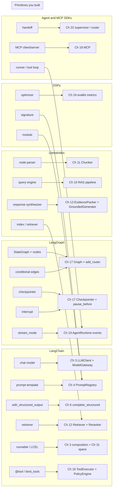
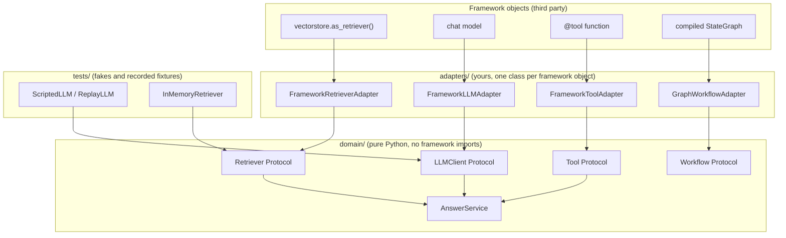

# Chapter 23 — Frameworks

LLM frameworks package the primitives you built in Chapters 3 to 19 behind their own vocabulary, and
they make choices on your behalf. This chapter teaches you to see each framework concept as a
primitive you already own, so you can adopt a framework for what it adds without inheriting what it
hides.

**You will be able to:**
- Translate any framework concept into a primitive from this book: a prompt template is Chapter 4's
  registry entry, a runnable chain is function composition with a log, a state graph is Chapter
  17's `Graph`, a query engine is Chapter 10's pipeline, a DSPy optimizer is a metric-driven search
  over prompt contents.
- Find the defaults, retries, and prompt text a framework hides, and make each one explicit.
- Score a framework, a provider agent SDK, and plain primitives against ten selection criteria with
  your own weights.
- Keep domain logic framework-independent with ports and adapters.
- Test a framework-backed component from recorded fixtures and migrate off a framework without
  rewriting the domain.

**Prerequisites:** Chapters 3 and 4 (gateway, prompt registry), 10 to 13 (the RAG pipeline), 16, 17,
and 19 (tool executor, workflow engine, agent loop). | **Code:** `book/projects/examples/ch23/`
(run: `cd book/projects/examples/ch23 && pytest -q`) | **Builds:** a composable pipeline, a typed
prompt specification with a metric-driven optimizer, and a ports-and-adapters layout with
record-and-replay LLM fixtures.

**First reading:** Why this matters, Mental model, Core concepts (The primitive ledger, LangChain,
LangGraph, LlamaIndex, DSPy, Provider agent SDKs and MCP SDKs), How it works, Ports, adapters, and
recorded fixtures, Framework selection criteria (with its worked example), Keeping domain logic
framework-independent, Failure modes, Before you ship. **Deep dives** (skip on a first pass): The
landscape as of 2026, Observability frameworks, A runnable pipeline, A typed prompt specification
with an optimizer, Code walkthrough, Prototype with the framework, ship the primitives, Migration
strategy.

## Why this matters

Frameworks are where most teams start and where many get stuck. Six months after a working agent in
an afternoon, nobody can say which prompt text production sends, because the framework assembled it
from three templates and a default system message. An unconfigured retry policy has been tripling
the cost of failed calls. An upgrade changed how tool results are formatted and quality dropped with
no change in the repository. None of these are failures of the framework; they are failures of
understanding what it was doing on the team's behalf.

Framework APIs change; the primitives do not, and you have already built and tested every one. This
chapter gives you the discipline to use a framework without losing sight of what it hides.

## Mental model

> **Mental model:** Reliability is engineered around the model, not expected from it. A framework is
> someone else's engineering around the model. Adopt it where their choices match yours, and make
> every hidden choice visible before it reaches production.

Treat every framework concept with a fixed three-question discipline:

1. **Which primitive is this?** Name the thing you built, with its chapter, and picture the
   plain-Python version. If you cannot, you are not ready to use the framework's version.
2. **How does the framework express it?** Learn the vocabulary: runnable, node, query engine,
   signature, handoff. Vocabulary is cheap and is where most of the perceived complexity lives.
3. **What does it add, and what does it hide?** Value is almost always persistence, streaming,
   tracing, or ecosystem. Hidden cost is almost always defaults you did not choose, retries you did
   not configure, or prompt text you did not write.

A component whose primitive you can name is a component you can replace, so the three questions
also give you a migration plan.

A second idea organizes the architecture advice: your domain owns its interfaces (`Retriever`,
`LLMClient`, `Tool` as Protocols), and framework objects live only in adapters that translate into
them. Chapter 32 applies this ports-and-adapters pattern to the whole application.

## Core concepts

### The primitive ledger

Every row is something you have implemented and tested.

| Primitive | Chapter | Name in this book | Framework words for it |
|---|---|---|---|
| Provider-neutral model call with retries, fallback, cache | 3 | `LLMClient`, `ModelGateway` | chat model, `with_retry`, `with_fallbacks` |
| Versioned prompt with rendering and tests | 4 | `PromptRegistry` | prompt template, signature |
| Context assembly under a token budget | 5 | `ContextBuilder` | memory, session |
| Schema-validated output with repair loop | 6 | `complete_structured` | output parser, `with_structured_output` |
| Splitting documents into retrievable units | 11 | `Chunker` | text splitter, node parser |
| Dense, lexical, hybrid retrieval and reranking | 12 | `HybridRetriever`, `Reranker` | retriever, index, postprocessor |
| Packing evidence and generating a cited answer | 13 | `EvidencePacker`, `GroundedGenerator` | response synthesizer, query engine |
| Tool schema, policy, idempotency, approval | 16 | `ToolRegistry`, `PolicyEngine`, `ToolExecutor` | `@tool`, `bind_tools`, function tool |
| Typed state, nodes, routers, checkpoints, pause | 17 | `Graph`, `Checkpointer`, `ResumeHandle` | `StateGraph`, checkpointer, interrupt |
| Tool discovery and invocation over a protocol | 18 | MCP client and server | MCP SDK |
| Loop with events, budgets, termination, replay | 19 | `AgentRuntime` | agent, runner, session |
| Metrics, datasets, judges, statistics | 24 | `evalkit` | evaluator, metric, optimizer objective |
| Spans with prompt, tokens, cost, evidence IDs | 31 | `Tracer`, `Span`, `AITracer` | tracing SDK, callbacks |

The framework sections describe APIs and defaults at the time of writing. They change between
releases, so confirm each claim against current documentation and source code.

### The landscape as of 2026

> **Deep dive.** A category map for placing a library you have never seen; skip on a first reading.

Product names churn faster than categories. When a new library appears, place it in a row, then
read its documentation with that row's "hides" column as your checklist.

| Category | Examples (as of 2026) | Ledger rows it absorbs | What it adds | What it hides |
|---|---|---|---|---|
| Provider agent SDKs | for example OpenAI Agents SDK, Claude Agent SDK, Google Agent Development Kit | Ch 19 loop, Ch 22 handoffs, Ch 5 and 21 sessions, Ch 31 tracing | a short path to a working tool loop, provider-hosted tools, tracing into the provider's console | policy and approval layer, budgets, compaction policy, coupling to one provider's features |
| Graph orchestration libraries | for example LangGraph | Ch 17 graph, checkpoints, pause; parts of Ch 19 | persistence backends, interrupts, multiplexed streaming | reducer semantics, checkpoint granularity, node re-execution on resume |
| Composition and integration frameworks | for example LangChain, LlamaIndex | Ch 3 to 13: clients, templates, parsers, chunkers, retrievers, synthesizers | integrations with many stores, loaders, and providers | defaults (`k`, chunk size, retries) and shipped prompt text |
| Typed agent frameworks | for example Pydantic AI | Ch 6 structured output, Ch 16 tool schemas, Ch 19 loop | output and tool schemas derived from type hints, test models | how many times invalid output is re-asked, and the text of the re-ask |
| Multi-agent and role frameworks | for example CrewAI, Microsoft Agent Framework | Ch 22 topologies, Ch 17 workflows | role, task, and conversation abstractions | delegation prompts, per-agent budgets, trace boundaries between agents |
| Prompt programming and optimization | for example DSPy | Ch 4 prompt contracts, Ch 24 metrics | metric-driven search over prompt contents | the compiled prompt text |
| Hosted agent runtimes | provider-managed agent services and cloud agent platforms | Ch 19 loop, Ch 16 sandboxed execution, Ch 21 memory, Ch 38 durable state | hosting, scaling, sandboxes, stored sessions, no servers to run | where state and data live, the execution log, network egress |
| Durable execution engines | for example Temporal-style workflow engines | Ch 38 log, lease, timer, signal | crash-proof long-running runs | determinism rules your code must follow (see Chapter 38) |

Three patterns matter more than any row. The closer a product is to a runtime you call, the more it
adds and hides: a hosted runtime removes operations work and your event log. Provider-hosted tools
run outside your `ToolExecutor` (see Chapter 16). And every category leaves tool policy, budget, and
evaluation to you. The examples column ages fast; the other columns do not.

### LangChain

LangChain is a broad application framework: model wrappers, prompt templates, output parsers,
retrievers, tools, and a composition layer, LCEL (LangChain Expression Language), that pipes them
together with `|`. Its value is ecosystem breadth. Its typical cost is architecture by abstraction:
stacking components without understanding the data flow between them.

**Chat models.** The primitive is Chapter 3's `LLMClient` behind a `ModelGateway`:

```python
# reminder: Chapter 3 primitive
req = CompletionRequest(messages=[Message.system(sys_text), Message.user(user_text)],
                        temperature=0.0, max_tokens=400)
completion = gateway.complete(req)   # retries, fallback chain, cost accounting happen here
completion.text; completion.usage.input_tokens
```

The framework expresses it as a chat-model object:

```python
# API shape at the time of writing; check current docs
model = init_chat_model("provider:model-name", temperature=0)
ai_message = model.invoke([("system", sys_text), ("human", user_text)])
ai_message.content; ai_message.usage_metadata
```

Added: many providers behind one interface, async and batch variants, normalized usage metadata.
Hidden: default retry count and backoff, default timeout, content-filter error mapping, and
sometimes a default `max_tokens`. Read the wrapper's source for those four values and set them.

**Prompt templates.** `ChatPromptTemplate.from_messages([...])` is the rendering half of Chapter 4's
registry entry. Hidden: there is no version, so prompt text lives wherever the object is built,
including inside prebuilt chains. Every prompt that reaches a model still needs a name and a version
in your registry.

**Output parsers and structured output.** `model.with_structured_output(Schema)` is the happy path
of Chapter 6's `complete_structured`. Hidden: which provider strategy was chosen (native structured
output, tool-call coercion, or JSON mode), whether any repair happens on failure (typically it
raises), and what happens to refusal and truncation.

**Retrievers.** A framework retriever, `invoke(query) -> list[Document]`, is Chapter 12's
`Retriever`. Hidden: the hybrid fusion algorithm, the default `k`, whether metadata filters apply
before or after the vector search (which changes recall), and whether scores are returned at all.
Without scores you lose Chapter 14's stage isolation, the most important debugging tool in RAG.

**Runnables and LCEL.** A runnable has `invoke`, `batch`, `stream`, async twins, `|` for sequences,
and a dict literal for fan-out. The primitive is function composition with a uniform calling
convention:

```python
# reminder: this is all `prompt | model | parser` means
def chain(x):
    return parser(model(prompt(x)))
```

```python
# API shape at the time of writing; check current docs
chain = prompt | model | StrOutputParser()
chain.invoke({"question": q}); chain.batch([...]); chain.stream({"question": q})
chain = chain.with_retry(stop_after_attempt=3).with_fallbacks([other_chain])
```

Added: a span per step, streaming, parallel `batch`, free async. Hidden: `with_retry` retries the
whole wrapped runnable, so a parser failure re-pays for the model call; the retried exception
classes default to everything; and attempts are invisible in cost accounting unless traced.

**Tools.** The `@tool` decorator derives a schema from a signature and docstring. Hidden:
everything after the model proposes a call. The decorator knows nothing of Chapter 16's side-effect
class, approval, idempotency, or permission, and a prebuilt agent that executes the proposal
directly removes the "code authorizes" half of "the model proposes, code authorizes" (Chapter 1).
Use the schema generation; keep execution in your `ToolExecutor`.

### LangGraph

LangGraph models a workflow as a graph over typed state with checkpoints and human interrupts: the
docstring of Chapter 17's `workflow_engine.py`. Chapter 19's event log, budgets, and termination
conditions are largely left to you.

**StateGraph and nodes.** The primitive is Chapter 17's `Graph` over a pydantic state:

```python
# reminder: Chapter 17 primitive
class TriageState(BaseModel):
    ticket: str; category: str | None = None; draft: str | None = None; approved: bool = False

g = Graph(TriageState, checkpointer=InMemoryCheckpointer())
g.add_node("classify", classify).add_node("draft", draft)
g.add_node("approve", lambda s: s, pause_before=True, on_decision=apply_decision)
g.add_edge("classify", "draft").add_edge("draft", "approve").add_edge("approve", END)
```

LangGraph uses a `TypedDict` state whose fields may carry reducers (functions that merge a node's
partial update into the existing value), and nodes return partial updates:

```python
# API shape at the time of writing; check current docs
class State(TypedDict):
    ticket: str
    messages: Annotated[list, add_messages]   # reducer: append, dedupe by id
    category: str | None

builder = StateGraph(State)
builder.add_node("classify", classify)        # returns {"category": ...}
builder.add_edge(START, "classify")
```

Added: parallel branches that write the same key are well-defined. Hidden: merge semantics live in
the annotation, so a reader of the node cannot tell whether a returned list replaces or appends.
Document each reducer, and define the domain state schema yourself.

**Conditional edges.** `add_conditional_edges` is Chapter 17's `add_router` with an explicit label
map for drawing the graph. Both are pure functions of state, testable without a model.

**Checkpointers.** The primitive is Chapter 17's `Checkpointer` and its resume paths after a pause
and after a crash. Added: production backends (for example PostgreSQL and Redis savers), state
history, and forking a run. Hidden: the granularity (per node, or per super-step: one round of
parallel nodes), state serialization, and whether the side effect in the node running at crash time
completed. The checkpointer gives you the state; Chapter 16's `IdempotencyStore` tells you whether
the action happened.

**Interrupts.** The primitive is `pause_before=True` and a `ResumeHandle`; LangGraph calls
`interrupt(payload)` inside a node. Added: the pause is durable because it is a checkpoint. Hidden:
on resume, the node that called `interrupt` re-executes from its beginning, so code before the call
runs twice. Make side effects before an interrupt idempotent (keyed with Chapter 17's `step_key()`)
or move them to an earlier node.

**Streaming of state.** `graph.stream(..., stream_mode=...)` yields full state per node, per-node
updates, or token deltas. Choose early: full-state snapshots are expensive for large states, and
token deltas alone cannot show which node is running.

### LlamaIndex

LlamaIndex restates Chapters 11 to 13 directly, which makes it the easiest framework to map and the
one where hidden prompt text matters most. The primitive is Chapter 10's pipeline:

```python
# reminder: Chapters 10-13 primitives
chunks = chunker.split(document)                        # Ch 11
passages = retriever.retrieve(query, k=8)               # Ch 12 (hybrid + rerank inside)
evidence = packer.pack(passages, budget_tokens=3000)    # Ch 13
answer = generator.generate(query, evidence)            # Ch 13: cite or abstain
```

**Documents and nodes.** `Document` is Chapter 11's document model; `TextNode` is the chunk, with
metadata and neighbor links. Hidden: by default a node's metadata is injected into both the text the
model sees and the text the embedder sees. Unless you set the exclusion lists, your embeddings
include file paths and your context includes modification dates.

**Node parsers and indices.** Node parsers are Chapter 11's `Chunker` strategies; their hidden cost
is the default chunk size and overlap, the two numbers that move retrieval metrics most. Indices
hide the embedding model unless set globally, and `from_documents` runs the parser and embedder as a
side effect of constructing an object.

**Query engines and response synthesizers.** A query engine is Chapter 10's pipeline in one object:
retrieve, post-process, synthesize. The synthesizer is Chapter 13's `EvidencePacker` plus
`GroundedGenerator`, with modes for fitting evidence into the budget: compact packs as many chunks as
fit per call; refine makes one call per chunk and asks the model to improve the previous answer;
tree-summarize summarizes hierarchically.

Each mode carries default prompt text that tells the model how to use evidence and whether it may
answer from prior knowledge. That is Chapter 13's grounded contract, which you wrote and tested.
Extract the synthesizer's template, version it in your registry, and pass it back in explicitly.
Refine mode's one call per chunk is a cost multiplier your budget must see.

### DSPy

DSPy is different in kind: it separates the specification of a model call from its prompt text,
then searches for prompt text that maximizes a metric on data.

**Signatures.** The primitive is a Chapter 4 prompt contract reduced to its typed skeleton: typed
input and output fields, one sentence of instruction, no literal wording. This chapter's
`signature.py` renders such a spec and parses the result by field label:

```python
# reminder: the primitive, from this chapter's signature.py
TRIAGE = Signature(instruction="Classify a Northwind support ticket.",
                   inputs=(Field("ticket", "the ticket text"),),
                   outputs=(Field("category", "one of: access, billing, hardware"),
                            Field("urgent", "true if the user is blocked", bool)))
prompt = TRIAGE.render({"ticket": text}, demos=[...])
result = TRIAGE.parse(llm(prompt))          # {"category": "billing", "urgent": False}
```

```python
# API shape at the time of writing; check current docs
class TriageTicket(dspy.Signature):
    """Classify a Northwind support ticket."""
    ticket: str = dspy.InputField(desc="the ticket text")
    category: Literal["access", "billing", "hardware"] = dspy.OutputField()
```

**Modules.** A module turns a signature into a strategy: `Predict` renders and parses once;
`ChainOfThought` adds a reasoning field before the answer. Added: the strategy is swappable without
rewriting prompts. Hidden: the prompt text itself, by design. Dump the compiled prompt into your
registry if production prompt text must be versioned and reviewed.

**Optimizers.** An optimizer takes a module, training examples, and a metric
`(example, prediction) -> score`, and returns a module whose prompts score higher. The simplest
bootstraps few-shot demonstrations: run the module on the training set, keep examples the metric
accepted, try subsets as demonstrations, measure on a held-out set. Others also propose instruction
wordings. "Prompt optimization against a metric" means exactly this search over prompt contents. It
is not fine-tuning; the weights do not change, the prompt does.

Four evaluation requirements follow from Chapter 24:

- **A faithful metric**, because the optimizer maximizes whatever you hand it.
- **Enough labeled examples**: dozens for demonstration bootstrapping, hundreds for instruction
  search. A metric on twelve examples has a confidence interval wider than the improvement you seek.
- **A frozen holdout** the optimizer never sees; selecting demonstrations on the set you report on is
  leakage.
- **A re-run when the model changes**, because the compiled prompt is tuned to one model.

Treat a compiled module as a build artifact: built from a dataset version and a model version, and
promoted through the CI evaluation gate (Chapter 25) like any prompt change.

### Provider agent SDKs and MCP SDKs

Provider agent SDKs share three concepts.

**The tool loop.** A runner sends the conversation to the model, executes proposed tool calls,
appends results, and repeats until the model stops or a step limit is hit. The primitive is Chapter
19's loop:

```python
# pseudocode: Chapter 19's AgentRuntime.run, simplified (names from agentkit)
append(GoalSet(goal))
while state.status is RUNNING:                       # stops on a TerminationReason
    if (reason := budget.exceeded(usage)): stop(reason)   # MAX_STEPS, MAX_COST, DEADLINE, ...
    completion = llm.complete(CompletionRequest(messages=state.messages, tools=visible_specs))
    append(ModelDecision(...)); append(BudgetUpdated(...))
    if not completion.tool_calls:                    # a final answer is a claim
        verdict = dod.verify(completion.text, state) # Definition of Done decides
        append(FinalAnswer(...) if verdict.passed else Note(kind="dod_rejected"))
        continue
    for call in completion.tool_calls:
        append(ToolCallRequested(call))
        decision = policy.check(tool, call.arguments, principal)  # agentkit ToolPolicy protocol
        if not decision.allowed: append(ToolCallDenied(...)); continue
        if decision.requires_approval and approver is None: stop(APPROVAL_REQUIRED)
        append(ToolCallApproved(...)); append(ToolResult(tool.execute(...)))
    append(StepCompleted(...))
```

The SDK version has none of the policy layer, budget, or event log; it typically offers a hook around
tool execution. Use the hook to route every call through your `ToolExecutor`; never let the SDK call
your functions directly.

**Handoffs.** One agent transfers the conversation to another through a tool call: Chapter 22's
supervisor-worker or router pattern. Hidden: budget and trace boundaries between agents, which are
yours to enforce because the SDK sees one conversation.

**Sessions.** A session stores conversation history, with the SDK deciding how much is kept and
whether it is compacted. Check that policy against your context budget (Chapter 5).

The MCP SDKs map one to one onto Chapter 18 and get protocol details right. Hidden: trust. A tool
description arriving over MCP is untrusted text (Chapter 26) that the SDK shows the model as
received; filtering and allow-listing stay in your code.

### Observability frameworks

> **Deep dive.** How vendor tracing SDKs map onto Chapter 31's tracer; skip on a first reading.

LLM tracing SDKs record a span per model call, tool call, retrieval, and chain step, and ship them
to a UI: Chapter 31's `Tracer`. Hidden: redaction (usually none, so prompts with customer data leave
your network), sampling (usually none, so cost scales with traffic), and attribute names that do not
match Chapter 31's schema. Make the vendor SDK one `Tracer` implementation behind your own, so the
UI is a convenience and not a dependency.

## How it works

Every framework section above follows one pattern: four kinds of value, three kinds of hidden cost.

The value:

- **Persistence.** Checkpointers, sessions, and thread stores with well-exercised backends; usually
  the strongest argument for an orchestration framework.
- **Streaming.** Token deltas and step events propagated through every layer for you.
- **Tracing.** Automatic spans for every framework object, with a UI.
- **Ecosystem.** Integrations with stores, loaders, providers, and tools: the value that attracts
  teams and decays fastest.

The hidden cost:

- **Defaults.** Every number you set deliberately (chunk size, `k`, timeout, retry count,
  `max_tokens`, temperature, history length) has a framework default, right for demos and wrong for
  your workload. List them, set them, test them.
- **Retries.** Frameworks retry at several layers: provider wrapper, runnable, graph node, sometimes
  the tool. Three attempts at each of three layers is twenty-seven on a persistent failure, in your
  bill and nowhere in your code. Keep one budgeted layer (Chapter 29) and disable the rest.
- **Prompt text.** Prebuilt agents, synthesizers, structured-output coercion, and optimizers ship
  prompt text that shapes behavior and escapes Chapter 4's registry and code review unless
  extracted.

## Architecture

The first diagram is the chapter's thesis: framework vocabulary on the left, primitives you own on
the right.



The second shows where framework objects may live. Arrows point inward: a framework upgrade changes
the top row and possibly the adapters; the domain and its tests do not move.



## Implementation

Three plain-Python modules under `book/projects/examples/ch23/`, each with offline tests and no
framework imports.

### A runnable pipeline (`runnable.py`)

> **Deep dive.** The LCEL operators rebuilt in plain Python, with visible retry attempts; skip on a
> first reading.

Every step shares one calling convention; `Sequence` and `Retrying` are the operators worth
reading. `RunLog` records each step execution with its attempt number.

```python
# path: book/projects/examples/ch23/runnable.py (excerpt; full file on disk)
class Runnable(Generic[In, Out]):
    name: str = "runnable"

    def invoke(self, x: In, log: RunLog | None = None) -> Out:
        raise NotImplementedError

    def batch(self, xs: list[In], log: RunLog | None = None) -> list[Out]:
        return [self.invoke(x, log) for x in xs]

    def stream(self, x: In, log: RunLog | None = None) -> Iterator[Out]:
        yield self.invoke(x, log)   # default: one chunk; real steps override

    def __or__(self, other: "Runnable[Out, Any] | Callable[[Out], Any]") -> "Sequence":
        return Sequence([self, coerce(other)])

    def with_retry(self, max_attempts: int = 3, retry_on: tuple[type[BaseException], ...] = (Exception,),
                   base_delay_s: float = 0.0) -> "Retrying":
        return Retrying(self, max_attempts, retry_on, base_delay_s)

# ...

class Sequence(Runnable[Any, Any]):
    name = "sequence"

    def __init__(self, steps: list[Runnable]) -> None:
        self.steps = steps

    def invoke(self, x: Any, log: RunLog | None = None) -> Any:
        for step in self.steps:
            x = step.invoke(x, log)
        return x

    def __or__(self, other: Runnable | Callable) -> "Sequence":
        return Sequence([*self.steps, coerce(other)])   # flatten instead of nesting

# ...

class Retrying(Runnable[In, Out]):
    # ...
    def invoke(self, x: In, log: RunLog | None = None) -> Out:
        attempt = 0
        while True:
            attempt += 1
            t0 = time.perf_counter()
            try:
                out = self.inner.invoke(x, log)
                if log is not None and attempt > 1:
                    log.record(self.name, x, out, (time.perf_counter() - t0) * 1000, attempt)
                return out
            except self.retry_on as exc:
                if log is not None:   # every failed attempt is visible, including the last one
                    log.record(self.name, x, f"error: {exc!r}", (time.perf_counter() - t0) * 1000, attempt)
                if attempt >= self.max_attempts:
                    raise
                time.sleep(self.base_delay_s * (2 ** (attempt - 1)))


def coerce(obj: Runnable | Callable | Mapping) -> Runnable:
    if isinstance(obj, Runnable):
        return obj
    if isinstance(obj, Mapping):
        return Parallel(obj)
    if callable(obj):
        return Lambda(obj)
    raise TypeError(f"cannot coerce {type(obj).__name__} to Runnable")
```

### A typed prompt specification with an optimizer (`signature.py`)

> **Deep dive.** DSPy's signature, module, and few-shot optimizer in plain Python; skip on a first
> reading.

A `Signature` is the stable spec: an instruction and typed input and output fields. `render` turns it
into prompt text; `parse` reads the completion back by field label and rejects an unrecognized
boolean rather than reading it as `False`.

```python
# path: book/projects/examples/ch23/signature.py (excerpt; full file on disk)
@dataclass(frozen=True)
class Signature:
    """What goes in, what comes out, and one sentence of instruction.
    Prompt wording lives in the Module, not here: the spec is stable, the
    rendering is swappable. This is the property Chapter 4's registry wants."""

    instruction: str
    inputs: tuple[Field, ...]
    outputs: tuple[Field, ...]

    def render(self, values: dict[str, Any], demos: Sequence[dict[str, Any]] = ()) -> str:
        lines = [self.instruction, "", "Fields:"]
        for f in self.inputs + self.outputs:
            lines.append(f"- {f.name}: {f.desc}")
        for ex in demos:
            lines.append("")
            lines += [f"{f.name}: {ex[f.name]}" for f in self.inputs + self.outputs]
        lines.append("")
        lines += [f"{f.name}: {values[f.name]}" for f in self.inputs]
        lines.append(f"{self.outputs[0].name}:")
        return "\n".join(lines)
    # ... parse(text) -> dict: one typed value per output field, by label
```

The module and the optimizer are where DSPy's idea lives. Demonstrations are state of the module;
the optimizer, `BootstrapFewShot`, searches over them with a metric and never touches the signature.

```python
# path: book/projects/examples/ch23/signature.py (excerpt; full file on disk)
@dataclass
class Predict:
    """The simplest Module: render, call, parse. Demos are *state* of the
    module that an optimizer may set; the signature never changes."""

    signature: Signature
    llm: LLMFn
    demos: list[dict[str, Any]] = field(default_factory=list)
    calls: int = 0

    def __call__(self, **inputs: Any) -> dict[str, Any]:
        self.calls += 1
        completion = self.llm(self.signature.render(inputs, self.demos))
        result = self.signature.parse(completion)
        return result

# ...

    def compile(self, module: Predict, train: Sequence[dict[str, Any]],
                dev: Sequence[dict[str, Any]]) -> Predict:
        input_names = [f.name for f in module.signature.inputs]
        candidates: list[dict[str, Any]] = []
        for ex in train:
            pred = module(**{k: ex[k] for k in input_names})
            if self.metric(ex, pred) >= self.threshold:
                candidates.append({**{k: ex[k] for k in input_names}, **pred})
        best_demos, best_score = list(module.demos), self.evaluate(module, dev)   # keep what was scored
        for n in range(1, min(self.max_demos, len(candidates)) + 1):
            trial = Predict(module.signature, module.llm, demos=candidates[:n])
            score = self.evaluate(trial, dev)
            if score > best_score:
                best_demos, best_score = candidates[:n], score
        return Predict(module.signature, module.llm, demos=best_demos)
```

### Ports, adapters, and recorded fixtures (`ports.py`)

The domain owns three Protocols and one service, `AnswerService`, a cite-or-abstain answerer. The
adapter is the only class that speaks the framework's vocabulary. `ReplayLLM` serves recorded
completions keyed by a hash of the prompt.

```python
# path: book/projects/examples/ch23/ports.py (excerpt; full file on disk)
# --- ports (owned by the domain) -----------------------------------------
@runtime_checkable
class Retriever(Protocol):
    def retrieve(self, query: str, k: int) -> list[Passage]: ...


@runtime_checkable
class LLMClient(Protocol):
    def complete(self, prompt: str) -> str: ...


@runtime_checkable
class Tool(Protocol):
    name: str
    def run(self, arguments: dict[str, Any]) -> str: ...

# ...

# --- adapter: framework -> port ------------------------------------------
class FrameworkRetrieverAdapter:
    def __init__(self, inner: FrameworkRetrieverLike) -> None:
        self._inner = inner

    def retrieve(self, query: str, k: int) -> list[Passage]:
        docs = self._inner.get_relevant_documents(query)[:k]
        return [Passage(id=d.metadata["id"], text=d.page_content,
                        source=d.metadata.get("source", "unknown"),
                        score=float(d.metadata.get("score", 0.0))) for d in docs]

# ...

@dataclass
class ReplayLLM:
    """Serve recorded completions. A prompt that was never recorded is a
    *test failure*, not a silent miss: it means the prompt text changed."""
    path: Path

    def complete(self, prompt: str) -> str:
        table = json.loads(self.path.read_text())
        try:
            return table[_key(prompt)]
        except KeyError as exc:
            raise LookupError(f"no recorded completion for prompt hash {_key(prompt)}; "
                              "the prompt text changed, re-record or update the fixture") from exc
```

`FrameworkRetrieverLike` stands in for a third-party retriever. `RecordingLLM`, the other half of
the fixture pair, wraps a live client and writes each prompt hash with its completion. The key test
records one prompt and then sends a different one:

```python
# path: book/projects/examples/ch23/test_ports.py (excerpt; full file on disk)
def test_replay_fails_loudly_when_prompt_text_drifts(tmp_path: Path) -> None:
    fixture = tmp_path / "answers.json"
    retriever = FrameworkRetrieverAdapter(FrameworkRetrieverLike(DOCS))
    RecordingLLM(ScriptedLLM("ok [it-07]"), fixture).complete("old prompt")
    svc = AnswerService(retriever, ReplayLLM(fixture))
    with pytest.raises(LookupError, match="prompt text changed"):
        svc.answer("who handles vpn outages")
```

A silent fallback would hide exactly the drift the fixture exists to catch.

```bash
cd book/projects/examples/ch23 && pytest -q
```

## Code walkthrough

> **Deep dive.** The non-obvious design choices in the three modules; skip on a first reading.

**Flattening makes the trace readable.** `Sequence.__or__` appends instead of nesting, so the log is
a flat list of named steps. `stream` defaults to one chunk because only the model step truly
streams; every later step must be stream-aware or force a join.

**Retries announce themselves.** The tests assert a `TimeoutError` is retried, a `ValueError` is
not, and the final entry carries `attempt == 3`. Retries visible only as duplicated spans cannot
answer "how much did retries cost this week".

**The optimizer's effect is observable.** The fake model misclassifies a "laptop" ticket until a
demonstration appears, so dev accuracy moves from one half to one. When nothing improves, the
compiled module keeps its starting demos.

**Name checks are not contracts.** `isinstance` against a `runtime_checkable` Protocol confirms only
that method names exist; contract tests check return values, such as the prompt containing
`[hr-01]` and not `page_content`. Fixtures are re-recorded by an `@pytest.mark.integration` test that
runs only when a provider key is present.

## Framework selection criteria

Score each criterion from 0 to 2 for the framework as you would use it, not as its README describes
it, and weight by what matters to your system. The last column says how to measure.

| Criterion | 0 | 1 | 2 | How to verify |
|---|---|---|---|---|
| State transparency | opaque or spread across objects | inspectable with effort | one typed object you define, readable at every step | dump state between two nodes; can you diff it? |
| Persistence and checkpointing | in-memory only | pluggable, your backend community-maintained | first-class backend you already run, with history | kill the process mid-run; resume; count duplicated side effects |
| Streaming | final result only | token deltas only | token deltas and step events, multiplexed | wire to a UI and show which node is running |
| Tracing | prints | vendor UI only | emits through your tracer with your attribute names | find prompt version and evidence IDs on one span |
| Retry semantics | hidden, stacked | configurable per layer | one layer, budgeted, attempts visible | force a persistent failure; count model calls billed |
| Testability with fakes | needs network | fake model object exists | every port fakeable, recorded fixtures supported | run the suite with the network off |
| Deployment model | requires vendor runtime | in-process with optional service | plain library, no required service | list the processes a deploy adds |
| Ecosystem fit | your store or provider missing | present but lagging | present and maintained | check the integration's last change and open issues |
| Upgrade churn | breaking changes per minor release | deprecations with migration notes | stable core, versioned extensions | read two release notes; count breaking items |
| Lock-in | domain types are framework types | adapters possible but thin | ports and adapters already clean | count framework imports outside `adapters/` |

A regulated workflow weights transparency and persistence heavily; an internal prototype weights
ecosystem fit. Score "plain primitives" as a row too: for a small deterministic workflow it usually
wins, and frameworks pay off for durable state, checkpointing, tool ecosystems, or standardized
instrumentation.

### Worked example: scoring Project 5

Project 5, Northwind's incident-research agent (Chapter 20), writes a cited report and posts it only
after an on-call engineer approves; the approval can wait hours, through deploys and pod restarts.
Its tests replay whole trajectories offline from recorded cassettes. Three candidates, each scored
as the team would actually use it:

- **Primitives:** `agentkit`, `toolkit`, and `evalkit` as built in Chapters 16 to 24.
- **Graph library:** a graph orchestration library with its PostgreSQL checkpointer, tools still
  executed through `ToolExecutor`.
- **Provider SDK:** a provider agent SDK, with its tool hook routed through `ToolExecutor`.

Weights run from 1 to 3. State transparency (the approver reads state at the pause), persistence
(the approval outlives a process), and testability (replay is how Project 5 is evaluated) get 3.
Ecosystem gets 1, because every tool is internal.

| Criterion | Weight | Primitives | Graph library | Provider SDK |
|---|---|---|---|---|
| State transparency | 3 | 2 | 1 | 1 |
| Persistence and checkpointing | 3 | 1 | 2 | 1 |
| Streaming | 1 | 1 | 2 | 2 |
| Tracing | 2 | 2 | 1 | 1 |
| Retry semantics | 2 | 2 | 1 | 1 |
| Testability with fakes | 3 | 2 | 1 | 1 |
| Deployment model | 1 | 2 | 2 | 2 |
| Ecosystem fit | 1 | 0 | 2 | 1 |
| Upgrade churn | 2 | 2 | 1 | 1 |
| Lock-in | 2 | 2 | 1 | 0 |
| **Weighted total (max 40)** | | **34** | **26** | **20** |

The reasons behind the less obvious cells:

- **Primitives, persistence 1:** resume exists, but the store is JSON files; a PostgreSQL version
  is yours to write and operate.
- **Graph library, transparency 1 and testability 1:** merge rules live in reducer annotations, and
  whole-trajectory cassette replay is yours to add.
- **Provider SDK, lock-in 0 and persistence 1:** run items, hosted tools, and tracing assume one
  provider, and a pending approval must still be serialized and resumed by your code.

Conclusion: keep the primitives for Project 5, with two cautions. The primitives are already built,
so their row carries no build cost; for a team starting from nothing the gap would shrink. And the
result hinges on one cell: if approvals must survive days and nobody wants to own a PostgreSQL event
store, persistence decides. Then adopt the graph library's checkpointer behind a `Workflow` port
(engineering question E3) rather than switching wholesale. The provider SDK would win a different
brief: a prototype weighted on ecosystem and time to first demo.

## Keeping domain logic framework-independent

Ports and adapters applied to an LLM application means four rules.

1. **The domain defines the Protocols** (`Retriever`, `LLMClient`, `Tool`, `Workflow`, `Tracer`)
   with only the methods it calls. A `Retriever` port says `retrieve(query, k) -> list[Passage]`,
   not `invoke`, and never returns a framework `Document`.
2. **Framework objects are constructed only in adapters and the composition root** (FastAPI
   startup, CLI entry). Make that a lint rule.
3. **Domain types cross the boundary; framework types do not.** A few lines per adapter buy the
   ability to remove the framework without touching domain code or tests.
4. **Prompt text, policies, and budgets are domain.** Even when a framework renders the prompt or
   runs the loop, the text, the tool policy, and the budgets come from your code. The framework
   executes; it does not decide.

Yes, this duplicates the framework's abstractions by a thin layer. That is the point: its
abstractions change on its schedule, yours on yours.

## Prototype with the framework, ship the primitives

> **Deep dive.** When in a project's life to adopt or drop a framework; skip on a first reading.

A pattern that works for many teams: prototype with a framework to learn the problem, recording
traces throughout. Then write the domain with your primitives, porting decisions, not code (the
validated chunk size, the graph shape, the extracted prompts). Keep the framework, behind an
adapter, only where it earned its place in the scoring table, typically persistence and streaming.
The opposite also works: a team with mature primitives adopts a framework late for one capability.
What fails is building production from framework objects on day one.

## Migration strategy

> **Deep dive.** A six-step procedure for moving off or between frameworks; skip on a first reading.

Migrating off a framework is mechanical when the ports exist and a rewrite when they do not.

1. **Freeze behavior with recorded fixtures.** Record prompt-to-completion pairs and retrieval
   results on representative inputs, as `RecordingLLM` does. Both implementations must pass them.
2. **Extract the hidden text** into the registry. The fixtures still pass; only its location
   changed.
3. **Introduce the port and adapter** so the domain depends on the Protocol. Run the fixtures.
4. **Implement the port with your primitives.** Each fixture difference is either a bug in the new
   implementation or hidden behavior of the old one (a default `k`, a retry layer, metadata
   injection, a prompt suffix). Decide which to keep, make it configuration, and update fixtures
   deliberately.
5. **Switch with a flag, compare in shadow** (Chapter 32), using Chapter 24's metrics, then flip.
6. **Delete the adapter** and the dependency from the lockfile and the lint allow-list.

## Production considerations

Most production controls are items in Before you ship. Two need more than a checkbox. **Latency**
from a framework is rarely composition overhead; it is indirect (refine mode's call per chunk, a
stacked retry, unbounded session history), so measure per-stage latency with the framework in place
(Chapter 30). **Cost** is accounted from your gateway or tracer, not the framework's counter; where
the framework accepts a custom client, pass it your `ModelGateway`.

## Common mistakes

**Architecture by abstraction.** Stacking components from a tutorial without being able to draw the
data flow. If you cannot name the primitive under each object, learn it before shipping.

**Hidden prompt text in production.** Detect it by diffing the prompt that reached the model (from
your trace) against your registry.

**Letting the framework own the state type.** Reducers encoding business rules leave with the
framework. Define state as your pydantic model and adapt.

**Treating the demo as the design.** Twenty lines that build a RAG pipeline are twenty lines that
chose a chunk size, a `k`, a prompt, and a synthesis mode for you.

## Failure modes

**Stacked-retry cost spike.** Signature: model calls per request rise sharply during a provider
incident while request volume is flat; your code shows one retry layer. Test: inject
`ProviderUnavailableError` on every call in a fake client; assert total attempts equal your single
policy's `max_attempts`.

**Interrupt double-execution.** Signature: a side-effecting call before an `interrupt` appears twice
in the tool audit log with the same run ID, once before the pause and once after resume. Test: a
counting fake tool before a pause node, resume, assert count is one. Fix: move side effects after the
pause or make them idempotent with Chapter 16's keys.

**Hidden metadata in the embedding.** Signature: retrieval is good on queries that mention file names
and poor on semantic queries; the embedded text in the trace contains paths and dates. Test: assert
the text passed to the embedding client equals the chunk text and nothing else.

**Prompt drift after upgrade.** Signature: eval scores shift after a dependency bump; the prompt hash
on model-call spans changes while the registry version does not. Test: the replay suite fails with
`LookupError`.

**Retriever without scores.** Signature: the retrieval span has IDs but no scores, so Chapter 14's
metrics cannot be computed. Test: the adapter contract test asserts each score was actually
returned; defaulting a missing score to 0.0, as the minimal adapter in `ports.py` does, passes
silently.

**Session history growth.** Signature: input tokens per turn, and time-to-first-token with them,
grow linearly across a conversation. Test: a twenty-turn fake conversation stays within Chapter 5's
budget.

## Tradeoffs

- **Speed of first version against understanding:** frameworks win the first and cost the second
  unless you follow the three-question discipline.
- **Ecosystem breadth against maintenance surface:** every integration you do not use is still in
  your dependency tree and on your image.
- **Uniform abstractions against stage visibility:** a query engine is one call, and one span unless
  the framework exposes its stages.
- **Free durable execution against side-effect discipline:** a checkpointer resumes state; only your
  idempotency layer makes resumption safe.
- **Prompt optimization against evaluation debt:** compilation pays off with labeled data and a
  holdout, and misleads without them.

Each is a cost to weigh in the scoring table, not a reason to avoid frameworks.

## Evaluation and testing

Testing a framework-backed component has three layers:

- **Contract tests for adapters**, offline over a small in-memory framework object: types, score
  presence, `k` respected, empty results.
- **Recorded-fixture tests for behavior**: the migration safety net and the version-drift detector.
  Re-record only in a reviewed change that shows the diff.
- **Evaluation with `evalkit` on the whole path** (Chapter 24), through both paths when both exist,
  with per-case deltas. A framework that does not expose retrieval separately from generation blocks
  Chapter 14's stage isolation; count that against it.

Also write one test per framework default you discovered, so that when the framework changes one, a
test says which.

## Before you ship

- [ ] Every framework dependency is pinned to an exact version, and the lockfile is reviewed on
  upgrade.
- [ ] A dump of every framework default you rely on (chunk size, `k`, timeout, retry count,
  `max_tokens`, temperature, history length) exists, and each value is set explicitly in your
  settings.
- [ ] Retries are enabled at exactly one layer; a test with a fake client that always raises
  `ProviderUnavailableError` asserts total model calls equal that layer's `max_attempts`.
- [ ] Every prompt the framework sends (synthesizer templates, agent system messages,
  structured-output instructions) is extracted, versioned in the registry, and passed back in
  explicitly; the prompt hash on model-call spans matches the registry version.
- [ ] Every tool call, including those proposed through an SDK or prebuilt agent, executes through
  `ToolExecutor`; provider-hosted tools are either disabled or explicitly allow-listed (Chapter 16).
- [ ] A grep for the framework's package outside `adapters/` and the composition root returns
  nothing, enforced as a lint rule in CI.
- [ ] Each adapter has a contract test: types, `k` respected, empty results, and real scores
  returned (not defaulted).
- [ ] A recorded-fixture replay suite runs offline on every dependency update and fails with
  `LookupError` on prompt drift.
- [ ] Side effects before any pause or interrupt are idempotent or moved after it; a counting fake
  tool proves one execution across pause and resume.
- [ ] Framework retrievers apply ACL filters before scoring, verified by a test run as a user
  without access (Chapter 15).
- [ ] Tracing exports go through your `Tracer` with redaction and sampling configured; no vendor SDK
  exports raw prompts by default.
- [ ] A session or history policy keeps input tokens within Chapter 5's budget over a twenty-turn
  test conversation.

## Exercises

**Start here:** K1, K5, E1, P4, D2 (about 4 hours). The rest go deeper.

### Knowledge questions

**K1.** For each of the following, name the chapter and primitive it maps to and one thing the
framework version hides: a LangChain retriever, a LangGraph checkpointer, a LlamaIndex response
synthesizer in refine mode, a DSPy optimizer, an agent SDK handoff.

**K2.** Explain why `with_retry` on a composed runnable can cost more than a retry inside the model
client, and where in this book retries are supposed to live.

**K3.** A LangGraph node performs a side effect and then calls `interrupt`. Describe what happens on
resume and two ways to make it safe.

**K4.** "Prompt optimization against a metric" in DSPy changes what, and does not change what? List
the four evaluation requirements the chapter attaches to it.

**K5.** State the four things a framework typically adds and the three it typically hides. For each
hidden item, name the telemetry that would reveal it.

**K6.** A vendor offers a hosted agent runtime: you upload tools and instructions, and it runs the
loop, stores sessions, and executes code in its sandbox. Which rows of the primitive ledger does it
absorb, which selection criterion is it most likely to score 0 on, and which three responsibilities
stay with you regardless?

### Engineering questions

**E1.** Northwind's HR knowledge assistant (Project 3) must never show a passage to a user outside
its ACL, must cite every claim, and must support Chapter 14's stage-isolated evaluation. Using the
scoring table, score three candidates: plain `ragkit` primitives (Chapters 10 to 15), a retrieval
framework with a query engine, and a hosted agent runtime with built-in file search. State your
weights, justify the two criteria you weighted highest, and name the one finding that would change
your conclusion.

**E2.** A team uses a framework's query engine for the HR knowledge base. Retrieval quality is good
but answers sometimes include facts not in the evidence. Propose a diagnosis path using this chapter's
tools (extract hidden text, fixtures, stage isolation) and say which chapter's contract the fix comes
from.

**E3.** Design the `Workflow` port for Northwind Assist so that both Chapter 17's `Graph` and a
compiled LangGraph can implement it. Specify the methods, the state type that crosses the boundary,
and how a `ResumeHandle` is represented in both.

**E4.** Your observability vendor's SDK auto-instruments the framework and exports prompts verbatim.
Specify the adapter that maps its spans to Chapter 31's attribute schema with redaction and sampling,
and say which attributes must never be dropped.

### Practical exercises

**P1.** (about 90 min) Extend `runnable.py` with a stream-aware `Sequence.stream` that propagates chunks through
steps that declare themselves stream-safe and joins before steps that do not. Add tests showing a
model-like step streaming three chunks through an upper-casing step and being joined before a JSON
parsing step.

**P2.** (about 60 min) Extend `signature.py` with a `ChainOfThought` module that adds a `reasoning` output field
before the first declared output, and show with a fake model and the existing optimizer whether it
improves the dev score on the triage signature. Keep the signature object unchanged.

**P3.** (about 2 hours) Write an adapter that makes Chapter 17's `Graph` implement the `Workflow` port from E3, and a
second adapter over a hand-written stand-in for a compiled state graph (do not install the framework).
Write one contract test suite that both adapters pass, including pause and resume.

**P4.** (about 60 min) Build a `RecordingRetriever` / `ReplayRetriever` pair in the style of `ports.py`, record a
fixture over the `FrameworkRetrieverLike` stand-in, then change the stand-in's default `k` and show
the replay test detecting the change.

### Debugging exercises

**D1.** After a dependency upgrade, Northwind's ticket-triage eval accuracy drops from 0.91 to 0.84
(illustrative numbers) with no change in the repository. The prompt registry version on model-call
spans is unchanged, but the prompt hash attribute differs from last week's traces. No retries are
visible. Diagnose, name the telemetry that confirms it, and say what should have caught it before
deploy.

**D2.** During a provider incident, the cost dashboard shows nine model calls per failed request. The
code configures a `ModelGateway` with `max_attempts=3`; the orchestration framework's node has its
default retry policy of three attempts. Explain the nine, identify
which layer should keep retries, and state the test that would have shown this.

**D3.** An approval workflow built on a graph framework occasionally creates two tickets for one
incident. The audit log shows both `create_ticket` calls carry the same run ID; one precedes a pause
checkpoint and one follows the resume. Name the mechanism, the fix, and the test.

## Key takeaways

- Every framework concept is a primitive you built: name it, picture the plain-Python version, then
  learn the vocabulary.
- Frameworks add persistence, streaming, tracing, and ecosystem. They hide defaults, retries, and
  prompt text. Make every hidden item explicit before production.
- LCEL-style composition is function composition with a calling convention and a log. Retry wrappers
  on chains re-run the whole chain and must be visible in cost accounting.
- A state graph framework is Chapter 17's engine with production backends. Only idempotency makes
  resumption safe, and interrupts re-execute the node that paused.
- Retrieval frameworks restate Chapters 11 to 13 and ship the grounding prompt. Extract it into your
  registry; insist on stage boundaries and scores so Chapter 14's evaluation works.
- DSPy-style compilation is a search over prompt contents driven by a metric and data. It needs a
  faithful metric, enough examples, a frozen holdout, and a re-run on model change.
- Agent SDKs run the tool loop without your policy layer; route execution through your
  `ToolExecutor`. MCP SDKs handle protocol correctness, not trust.
- Learn categories, not product names: each category absorbs predictable ledger rows and hides
  predictable choices. Score candidates on the ten criteria as you would use them, with your
  weights; plain primitives are a row in the table.
- Your domain owns the `Retriever`, `LLMClient`, and `Tool` Protocols; framework objects live in
  adapters. A grep for the framework outside `adapters/` should return nothing.
- Recorded fixtures that fail loudly on prompt drift are the migration safety net and the
  version-drift detector. Re-record deliberately, under review.

## Further reading

- *DSPy: Compiling Declarative Language Model Calls into Self-Improving Pipelines* (Khattab et al.,
  2023): the original argument for separating signatures from prompt text and optimizing against a
  metric.
- LangGraph documentation: read the persistence, interrupt, and streaming pages with Chapter 17's
  engine beside you; they map one to one.
- LlamaIndex documentation: the response synthesizer and node parser pages show the defaults and
  prompt templates this chapter tells you to extract.
- LangChain documentation: the runnable interface and retry/fallback pages, read for what the
  wrappers retry and when.
- MCP Python SDK: a compact reference implementation to compare with Chapter 18's minimal client and
  server.
- *OpenTelemetry Semantic Conventions for Generative AI*: the attribute names to map framework
  tracing onto, so dashboards survive a framework change.
