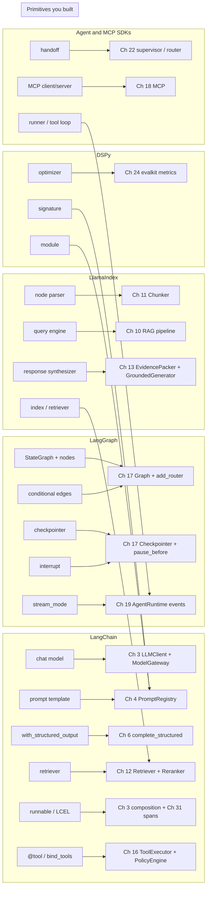
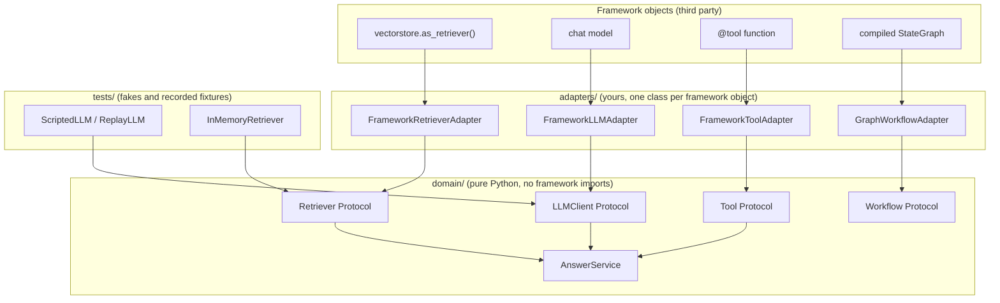

# Chapter 23 — Frameworks

After this chapter you will be able to read any LLM framework's documentation and translate each
concept into a primitive you already built: a prompt template is Chapter 4's registry entry, a
runnable chain is function composition with a logging convention, a state graph is Chapter 17's
`Graph`, a query engine is Chapter 10's retrieve-pack-generate pipeline, a DSPy optimizer is a
search over prompt contents (few-shot demonstrations, sometimes instructions) driven by Chapter 24's
metrics. You will be able to score a framework against ten selection criteria, keep your domain
logic independent of whichever one you adopt, test a framework-backed component from recorded
fixtures, and migrate off a framework without rewriting the domain. The code lives in
`book/projects/examples/ch23/`: a composable pipeline that shows what LCEL-style composition does
under the hood, a typed prompt specification with a metric-driven optimizer that shows DSPy's idea,
and a ports-and-adapters layout with a record-and-replay LLM fixture.

## Why this matters

Frameworks are where most teams start and where many get stuck. The start is reasonable: a chat
model wrapper, a prompt template, a vector store integration, and an agent loop in an afternoon. The
getting stuck has a recognizable shape. Six months in, nobody can say which prompt text production
actually sends, because the framework assembled it from three templates and a default system message.
A retry policy nobody configured has been tripling the cost of failed calls. An upgrade changed how
tool results are formatted and quality dropped with no change in the repository. An engineer wants to
add a human-approval step and finds the agent abstraction has no seam for it. None of these are
failures of the framework. They are failures of understanding what the framework was doing on the
team's behalf.

The principle is blunt: agent frameworks are useful only after you understand
the underlying primitives, because framework APIs change and the primitives do not. This book took
that literally. Between Chapter 3 and Chapter 19 you wrote, with tests, every component a framework
offers: client and gateway, prompt registry, structured output, chunkers, retrieval, grounded
generation, tool registry, workflow engine, MCP, and agent runtime. The purpose of this chapter is not
to teach you the frameworks from scratch. It is to show that you already know them, and to give you the
discipline to use one without losing sight of what it hides.

> **Mental model:** Reliability is engineered around the model, not expected from it. A framework is
> someone else's engineering around the model. Adopt it where their choices match yours, and make
> every hidden choice visible before it reaches production.

## Mental model

Treat every framework concept with a fixed three-question discipline:

1. **Which primitive is this?** Name the thing you built, with its chapter, and picture the
   plain-Python version. If you cannot, you are not ready to use the framework's version.
2. **How does the framework express it?** Learn the vocabulary: runnable, node, query engine,
   signature, handoff. Vocabulary is cheap and is where most of the perceived complexity lives.
3. **What does it add, and what does it hide?** Added value is almost always one of four things:
   persistence, streaming, tracing, or ecosystem. Hidden cost is almost always one of three: defaults
   you did not choose, retries you did not configure, and prompt text you did not write.

The three questions turn framework evaluation into an engineering review and give you a migration
plan for free: a component whose primitive you can name is a component you can replace.

A second idea organizes the architecture advice. Your domain owns its interfaces: Northwind Assist's
domain defines `Retriever`, `LLMClient`, and `Tool` as Protocols with exactly the methods it needs.
Framework objects never appear in the domain; they live in adapters, one class per framework object,
that translate the framework's vocabulary into yours. Chapter 32 develops ports and adapters for the
whole application; here we apply it to the one boundary between you and the framework.

## Core concepts

### The primitive ledger

Every row is something you have implemented and tested. Keep the table open while reading the
framework sections; each is a walk through part of it.

| Primitive | Chapter | Name in this book | Framework words for it |
|---|---|---|---|
| Provider-neutral model call with retries, fallback, cache | 3 | `LLMClient`, `ModelGateway` | chat model, `with_retry`, `with_fallbacks` |
| Versioned prompt with rendering and tests | 4 | `PromptRegistry` | prompt template, signature |
| Context assembly under a token budget | 5 | `ContextBuilder` | memory, session |
| Schema-validated output with repair loop | 6 | `complete_structured` | output parser, `with_structured_output` |
| Splitting documents into retrievable units | 11 | `Chunker` | text splitter, node parser |
| Dense, lexical, hybrid retrieval and reranking | 12 | `HybridRetriever`, `Reranker` | retriever, index, postprocessor |
| Packing evidence and generating a cited answer | 13 | `EvidencePacker`, `GroundedGenerator` | response synthesizer, query engine |
| Tool schema, policy, idempotency, approval | 16 | `ToolRegistry`, `PolicyEngine`, `ToolExecutor` | `@tool`, `bind_tools`, function tool |
| Typed state, nodes, routers, checkpoints, pause | 17 | `Graph`, `Checkpointer`, `ResumeHandle` | `StateGraph`, checkpointer, interrupt |
| Tool discovery and invocation over a protocol | 18 | MCP client and server | MCP SDK |
| Loop with events, budgets, termination, replay | 19 | `AgentRuntime` | agent, runner, session |
| Metrics, datasets, judges, statistics | 24 | `evalkit` | evaluator, metric, optimizer objective |
| Spans with prompt, tokens, cost, evidence IDs | 31 | `Tracer`, `Span`, `AITracer` | tracing SDK, callbacks |

The framework sections below describe each library's API and defaults at the time of writing.
Names, defaults, and module layout change between releases, so treat each specific claim as
something to confirm against current documentation and source code, which is the habit this chapter
teaches.

### LangChain

LangChain is a broad application framework: model wrappers, prompt templates, output parsers,
retrievers, tools, and a composition layer, LCEL (LangChain Expression Language), that pipes them
together with `|`. Its value is ecosystem breadth. Its typical cost is what this chapter calls
architecture by abstraction: stacking components without understanding the data flow between them.

**Chat models.** The primitive is Chapter 3's `LLMClient` behind a `ModelGateway`:

```python
# reminder: Chapter 3 primitive
req = CompletionRequest(messages=[Message.system(sys_text), Message.user(user_text)],
                        temperature=0.0, max_tokens=400)
completion = gateway.complete(req)   # retries, fallback chain, cost accounting happen here
completion.text; completion.usage.input_tokens
```

The framework expresses it as a chat-model object:

```python
# API shape at the time of writing; check current docs
model = init_chat_model("provider:model-name", temperature=0)
ai_message = model.invoke([("system", sys_text), ("human", user_text)])
ai_message.content; ai_message.usage_metadata
```

Added: many providers behind one interface, async and batch variants, normalized usage metadata.
Hidden: default retry count and backoff, default timeout, how a content-filter error is mapped, and
in some integrations a default `max_tokens`. Each is a number you set deliberately in Chapter 3; read
the wrapper's source code for those four values and set them explicitly.

**Prompt templates.** The primitive is Chapter 4's registry entry: a named, versioned template with
declared variables, rendered with escaping, covered by golden tests, its version on every trace.
`ChatPromptTemplate.from_messages([...])` with `{variable}` placeholders expresses the rendering half.
Added: composition of message lists and a placeholder for conversation history. Hidden: nothing about
the text, but there is no notion of a version, so prompt text lives wherever the Python object is
constructed, scattered across modules and inside prebuilt chains. Chapter 4's rule stands: every
prompt that reaches a model has a name and a version in your registry, whoever renders it.

**Output parsers and structured output.** The primitive is Chapter 6's `complete_structured`: send a
JSON Schema via `response_schema`, validate with pydantic, re-ask with the validation error, raise
`MalformedResponseError` when attempts are exhausted. `model.with_structured_output(Schema)`
expresses the happy path. Added: a provider-specific strategy (native structured output, tool-call
coercion, or JSON mode) chosen for you. Hidden: which strategy, whether any repair happens on failure
(typically it raises), and what happens to refusal and truncation. Output parsers that regex a format
out of free text are what Chapter 6 told you not to do when the provider can constrain output.

**Retrievers.** The primitive is Chapter 12's `Retriever` protocol, `retrieve(RetrievalQuery) ->
RetrievalResult`, whose result carries scored hits per stage and a trace, so fusion and reranking
are visible. A framework retriever is any object
with `invoke(query) -> list[Document]`, a `Document` having `page_content` and `metadata`;
`vectorstore.as_retriever(search_kwargs={"k": 4})` makes one from a store. Added: a large catalog of
integrations behind one call. Hidden: the fusion algorithm for hybrid search, the default `k`, whether
metadata filters apply before or after the vector search (which changes recall), and whether scores
are returned at all. Chapter 14's stage isolation needs those scores and that boundary; an integration
that hides them has cost you the most important debugging capability in RAG.

**Runnables and LCEL.** The composition layer is the part most worth understanding because it is the
smallest. A runnable has `invoke`, `batch`, `stream`, async twins, the `|` operator for sequences,
and a dict literal for fan-out. The primitive is function composition with a uniform calling
convention:

```python
# reminder: this is all `prompt | model | parser` means
def chain(x):
    return parser(model(prompt(x)))
```

```python
# API shape at the time of writing; check current docs
chain = prompt | model | StrOutputParser()
chain.invoke({"question": q}); chain.batch([...]); chain.stream({"question": q})
chain = chain.with_retry(stop_after_attempt=3).with_fallbacks([other_chain])
```

Added: every step gets a span with inputs and outputs, `stream` propagates token
deltas through the pipeline, `batch` parallelizes, async comes free. Hidden: `with_retry` retries the
whole wrapped runnable, so a chain re-renders the prompt and re-pays for the model call even when a
cheap parser failed; the retried exception classes default to everything; and attempts are invisible
in cost accounting unless the tracer records them. The `runnable.py` example builds the same
operators in about a hundred lines so you can see exactly where attempts are logged.

**Tools.** The primitive is Chapter 16: a `ToolSpec`, a registry, argument validation outside the
model, a policy that classifies side effects and requires approval for irreversible ones,
idempotency keys, timeouts, result truncation. The `@tool` decorator derives the schema from a
signature and docstring; `model.bind_tools(tools)` attaches the specs to the request. Added: schema
generation and a convenient loop in prebuilt agents. Hidden: everything after the model proposes a
call. The decorator has no concept of side-effect class, approval, idempotency, or permission, and a
prebuilt agent that executes directly from the proposal has removed the "code authorizes" half of
the book's sixth mental model ("the model proposes, code authorizes," Chapter 1). Use the schema
generation; keep execution in your `ToolExecutor`, which owns validation, policy, approval, and
idempotency for every tool in the `ToolRegistry`.

### LangGraph

LangGraph models a workflow as a graph over typed state: nodes read and write state, edges choose
the next node, a checkpointer persists state after every step, interrupts pause for a human. That is
the docstring of Chapter 17's `workflow_engine.py`, which does the same in about 250 lines; Chapter
19's `AgentRuntime` adds the event log, budgets, and termination conditions that LangGraph largely
leaves to you.

**StateGraph and nodes.** The primitive is `Graph(state_type)` with `add_node(name, fn)` over a
pydantic state:

```python
# reminder: Chapter 17 primitive
class TriageState(BaseModel):
    ticket: str; category: str | None = None; draft: str | None = None; approved: bool = False

g = Graph(TriageState, checkpointer=InMemoryCheckpointer())
g.add_node("classify", classify).add_node("draft", draft)
g.add_node("approve", lambda s: s, pause_before=True, on_decision=apply_decision)
g.add_edge("classify", "draft").add_edge("draft", "approve").add_edge("approve", END)
```

LangGraph uses a `TypedDict` state whose fields may carry reducers (functions that merge a node's
partial update into the existing value), and nodes return partial updates:

```python
# API shape at the time of writing; check current docs
class State(TypedDict):
    ticket: str
    messages: Annotated[list, add_messages]   # reducer: append, dedupe by id
    category: str | None

builder = StateGraph(State)
builder.add_node("classify", classify)        # returns {"category": ...}
builder.add_edge(START, "classify")
```

Added: reducers make parallel branches that write the same key well-defined, and partial updates make
nodes shorter. Hidden: merge semantics live in the annotation, so a reader of the node cannot tell
whether a returned list replaces or appends. Document each reducer where you declare the state, and
define the domain state schema yourself: the library should orchestrate your
design, not become it.

**Conditional edges.** The primitive is `add_router(src, fn)` with `fn: (S) -> str`. LangGraph's
`add_conditional_edges("node", router, {"label": "target"})` is the same with an explicit map the
framework uses to draw the graph. Both are pure functions of state, which is what makes them
unit-testable without a model.

**Checkpointers.** The primitive is Chapter 17's `Checkpointer` protocol (`save`, `latest`,
`history`), called after every node, and the two resume paths built on it: `resume(handle,
decision)` after a human pause and `resume_from_checkpoint(run_id)` after a crash. LangGraph
attaches the checkpointer at `compile(checkpointer=...)` and keys it by a `thread_id` in the
invocation config. Added: production backends (for example PostgreSQL and Redis savers), state
history, and forking a run from an earlier checkpoint. Hidden: the granularity (per node, or per
super-step: one round of parallel nodes), the serialization of your state, and the fact that a
checkpoint does not know whether the side effect inside the node running at crash time completed.
Chapter 19's rule applies: the event log records tool request, approval, result, and idempotency
key, so on restart the harness determines whether an action completed instead of asking the model. A
checkpointer gives you the state; Chapter 16's `IdempotencyStore` gives you the answer.

**Interrupts and human-in-the-loop.** The primitive is `pause_before=True` on a node, a
`ResumeHandle` returned to the caller, and `on_decision` to fold the human's answer into state.
LangGraph expresses it declaratively (`interrupt_before=["approve"]` at compile) or by calling
`interrupt(payload)` inside a node; the caller resumes with a command carrying the human's value.
Added: the pause is durable because it is a checkpoint. Hidden: on resume, the node that called
`interrupt` re-executes from its beginning, so code before the call runs twice. Side effects before
an interrupt must be idempotent or moved to an earlier node: Chapter 17's double-execution hazard,
made easy to forget. Chapter 17's `step_key()` shows the key to use, one that stays the same when
the same visit to a node is re-executed.

**Streaming of state.** The primitive is Chapter 17's per-node `StepRecord` trace and Chapter 19's
per-step event stream, surfaced as server-sent events. `graph.stream(input, config, stream_mode=...)`
yields full state after each node, per-node updates, or token deltas. Added: one call that multiplexes
node-level and token-level events. Hidden: little, but choose the mode early; full-state snapshots are
expensive for large states, and token deltas alone cannot show which node is running.

### LlamaIndex

LlamaIndex is organized around retrieval, and its object model restates Chapters 11 to 13 directly.
That makes it the easiest framework to map and the one where hidden prompt text matters most. The
primitive for the whole stack is Chapter 10's pipeline:

```python
# reminder: Chapters 10-13 primitives
chunks = chunker.split(document)                        # Ch 11
passages = retriever.retrieve(query, k=8)               # Ch 12 (hybrid + rerank inside)
evidence = packer.pack(passages, budget_tokens=3000)    # Ch 13
answer = generator.generate(query, evidence)            # Ch 13: cite or abstain
```

**Documents and nodes.** `Document` is Chapter 11's document model; `TextNode` is the chunk, with
`metadata` and relationships (previous, next, parent). Added: the relationship graph makes
parent-child and window retrieval configuration rather than a build. Hidden: by default a node's
metadata is injected into both the text the model sees and the text the embedder sees, with separate
exclusion lists. If you did not know that, your embeddings include file paths and your context
includes modification dates. Chapter 5 says every byte in the prompt was chosen; check what the node
parser put there.

**Node parsers.** Chapter 11's `Chunker` strategies: sentence, token-window, Markdown- and
code-aware, semantic, hierarchical. Added: many strategies in one package. Hidden: default chunk size
and overlap, the two numbers Chapter 11 showed move retrieval metrics most. They belong in your
configuration.

**Indices.** A storage structure plus a retrieval strategy: a vector index (Chapter 9), a keyword
table (Chapter 12's `BM25Index`), a summary index, a tree index, a knowledge-graph index (Chapter
37). Added: non-vector shapes you did not build. Hidden: the embedding model unless set globally, and
the fact that `from_documents` runs the parser and the embedder as a side effect of constructing an
object.

**Retrievers, query engines, response synthesizers.** `index.as_retriever(similarity_top_k=4)` is
Chapter 12's retriever. A query engine is Chapter 10's pipeline in one object: retrieve, post-process
(rerank, filter), synthesize. The synthesizer is Chapter 13's `EvidencePacker` plus
`GroundedGenerator`, and it is where the hidden prompt lives. Its modes are strategies for fitting
evidence into the budget: compact packs as many chunks as fit per call; refine makes one call per
chunk and asks the model to improve the previous answer; tree-summarize summarizes hierarchically.

Each mode carries default prompt text, and that text is what tells the model how to use evidence and
whether it may answer from prior knowledge. Chapter 13's grounded contract (data is not instructions;
cite or abstain) is a prompt you wrote and tested. Pull the synthesizer's template out, version it in
your registry, and pass it back in explicitly. Treat refine mode's one-call-per-chunk as a cost
multiplier Chapter 30's budget must see.

### DSPy

DSPy is different in kind. The other frameworks compose calls; DSPy separates the specification of a
model call from its prompt text, then searches for prompt text that maximizes a metric on data.

**Signatures.** The primitive is a Chapter 4 prompt contract reduced to its typed skeleton: named
input fields, typed output fields, one sentence of instruction, no literal wording. The `signature.py`
example renders such a spec into a prompt and parses the result back by field labels:

```python
# reminder: the primitive, from this chapter's signature.py
TRIAGE = Signature(instruction="Classify a Northwind support ticket.",
                   inputs=(Field("ticket", "the ticket text"),),
                   outputs=(Field("category", "one of: access, billing, hardware"),
                            Field("urgent", "true if the user is blocked", bool)))
prompt = TRIAGE.render({"ticket": text}, demos=[...])
result = TRIAGE.parse(llm(prompt))          # {"category": "billing", "urgent": False}
```

```python
# API shape at the time of writing; check current docs
class TriageTicket(dspy.Signature):
    """Classify a Northwind support ticket."""
    ticket: str = dspy.InputField(desc="the ticket text")
    category: Literal["access", "billing", "hardware"] = dspy.OutputField()
```

**Modules.** A module turns a signature into a strategy. `Predict` renders and parses once;
`ChainOfThought` adds a reasoning field before the answer; a custom `Module` composes several in
`forward`, which is Chapter 4's decomposition with the prompt text factored out. Added: the strategy
is swappable without rewriting prompts. Hidden: the prompt text itself, by design. DSPy owns field
formatting, output-format instructions, and demonstration layout. Ask the module for its compiled
prompt and store that in the registry if you want Chapter 4's guarantee that production prompt text is
versioned and reviewed.

**Optimizers.** An optimizer takes a module, a training set of input-output examples, and a metric
`(example, prediction) -> score`, and returns a module whose prompts score higher. The simplest
bootstraps few-shot demonstrations: run the module on the training set, keep examples the metric
accepted, try subsets as demonstrations, measure on a held-out set. More elaborate ones also propose
instruction wordings with a model and search over the combination. "Prompt optimization against a
metric" means exactly this: a search over prompt contents driven by a metric and data. It is not
fine-tuning; the weights do not change, the prompt does.

Four evaluation requirements follow from Chapter 24. A metric that is a faithful proxy for what you
care about, because the optimizer maximizes whatever you hand it. Enough labeled examples, dozens for
demonstration bootstrapping and hundreds for instruction search, because a metric on twelve examples
has a confidence interval wider than the improvement you seek. A frozen holdout the optimizer never
sees, because selecting demonstrations on the set you report on is Chapter 24's leakage. And a re-run
when the model changes, because the compiled prompt is tuned to one model.

Treat a compiled module as a build artifact: produced by a reproducible job from a dataset version
and a model version, stored under a version, promoted through Chapter 25's CI gate like any prompt
change.

### Provider agent SDKs and MCP SDKs

Provider agent SDKs vary in vocabulary but share three concepts.

**The tool loop.** An agent object holds instructions and tools; a runner sends the conversation to
the model, executes proposed tool calls, appends results, repeats until the model stops or a step
limit is hit. The primitive is Chapter 19's loop:

```python
# pseudocode: Chapter 19's AgentRuntime.run, simplified (names from agentkit)
append(GoalSet(goal))
while state.status is RUNNING:                       # stops on a TerminationReason
    if (reason := budget.exceeded(usage)): stop(reason)   # MAX_STEPS, MAX_COST, DEADLINE, ...
    completion = llm.complete(CompletionRequest(messages=state.messages, tools=visible_specs))
    append(ModelDecision(...)); append(BudgetUpdated(...))
    if not completion.tool_calls:                    # a final answer is a claim
        verdict = dod.verify(completion.text, state) # Definition of Done decides
        append(FinalAnswer(...) if verdict.passed else Note(kind="dod_rejected"))
        continue
    for call in completion.tool_calls:
        append(ToolCallRequested(call))
        decision = policy.check(tool, call.arguments, principal)  # agentkit ToolPolicy protocol
        if not decision.allowed: append(ToolCallDenied(...)); continue
        if decision.requires_approval and approver is None: stop(APPROVAL_REQUIRED)
        append(ToolCallApproved(...)); append(ToolResult(tool.execute(...)))
    append(StepCompleted(...))
```

Every `append` writes to the event store before state changes, which is what makes `replay` and
`resume` possible. With `executor_tools`, `tool.execute` is Chapter 16's `ToolExecutor`, so
permission, approval binding, and idempotency stay in `toolkit`.

The SDK version has none of the policy layer, budget, or event log; it typically offers a hook around
tool execution. Use the hook to route every call through your `ToolExecutor` so approval, idempotency,
and side-effect classification survive. Do not let the SDK call your functions directly.

**Handoffs.** One agent transfers the conversation to another, expressed as a tool whose execution
switches the active agent. This is Chapter 22's supervisor-worker or router pattern. Added: a tidy
split of instructions and tool sets by role. Hidden: budget and trace boundaries between agents.
Chapter 22's rule that budgets exist at parent and child and that a trace ID propagates across the
handoff is yours to enforce, because the SDK sees one conversation.

**Sessions.** A session stores conversation history so the next turn does not resend it: Chapter 5's
context input plus Chapter 21's conversation memory, with the SDK deciding how much history is kept
and whether it is compacted. Check that policy against your budget.

The MCP SDKs are thinner and map one to one onto Chapter 18: a server decorates functions as tools,
resources, or prompts; a client connects over stdio or HTTP, lists tools, calls them. Added:
correctness on protocol details (capability negotiation, framing, schema conventions) your minimal
implementation covered only partly. Hidden: the trust question. A tool description arriving over MCP
is untrusted text (Chapter 26), and the SDK presents it to the model as received. Filtering and
allow-listing stay in your code.

### Observability frameworks

Tracing SDKs for LLM applications (the ones bundled with the orchestration frameworks above, and
vendor-neutral ones built on OpenTelemetry's GenAI semantic conventions) record a span per model
call, tool call, retrieval, and chain step, with prompt, completion, tokens, and cost as attributes,
and ship them to a UI. The primitive is Chapter 31's trace model and `aie_core.observability`: a
`Tracer` yielding `Span` objects with the attribute schema Chapter 31 fixes (prompt version, model,
tokens, cost, cache hits, evidence IDs, policy results, eval scores).

Added: automatic instrumentation of the framework's objects, a UI, dataset collection from traces,
often an evaluation harness joining online traces with offline scores. Hidden: redaction (by default
usually none, so prompts with customer data leave your network), sampling (usually none, so cost
scales with traffic), and attribute names that will not match Chapter 31's schema unless you map
them. Emit spans through your own `Tracer` with your attribute names, and make the vendor SDK one
`Tracer` implementation behind it. Then the UI is a convenience and not a dependency.

## How it works

A framework adds value in four ways and hides cost in three. Knowing the pattern lets you evaluate a
framework you have never seen.

**Persistence.** Checkpointers, sessions, and thread stores give durable state across processes. You
built the interface in Chapter 17; the framework supplies backends exercised by many users. This is
usually the strongest argument for adopting an orchestration framework.

**Streaming.** Propagating token deltas and step events through a composed pipeline is plumbing you
would otherwise thread through every layer.

**Tracing.** Automatic spans for every framework object, with a UI. Valuable in development; in
production, map onto your schema so dashboards do not depend on one vendor's names.

**Ecosystem.** Integrations with stores, loaders, providers, and tools: the value that attracts
teams and decays fastest, because the integration you need is often the one that lags.

**Defaults.** Every number you set deliberately (chunk size, `k`, timeout, retry count,
`max_tokens`, temperature, history length) has a default somewhere in the framework, right for demos
and wrong for your workload. List them, set them, test them.

**Retries.** Frameworks retry at several layers: provider wrapper, runnable, graph node, sometimes
the tool. Three attempts at each of three layers is twenty-seven on a persistent failure, with the
cost in your bill and nowhere in your code. Chapter 29 explains why retries belong at exactly one
budgeted layer; find the framework's layers and disable all but one.

**Prompt text.** Prebuilt agents, query engines, synthesizers, structured-output coercion, and
optimizers all ship prompt text that is part of your system's behavior and invisible to code review
unless extracted. Frameworks are the main way prompts escape Chapter 4's registry.

## Architecture

The first diagram is the chapter's thesis: framework vocabulary on the left, primitives you own on
the right.



The second shows where framework objects may live. Arrows point inward: a framework upgrade changes
the top row and possibly the adapters; the domain and its tests do not move.



## Implementation

Three plain-Python modules under `book/projects/examples/ch23/`, each with offline tests. None
imports a framework; they show the primitive side of the mapping. Each file is short enough to
show in full.

### A runnable pipeline (`runnable.py`)

```python
# path: book/projects/examples/ch23/runnable.py
"""What LCEL-style composition does under the hood, in plain Python.

A `Runnable` is a function with a uniform calling convention (`invoke`,
`batch`, `stream`) and composition operators. `a | b` builds a sequence;
a dict of runnables builds a fan-out. Retries are a wrapper, not magic.
Nothing here is specific to LLMs: the "framework" is about a hundred lines of glue.
"""
from __future__ import annotations

import time
from dataclasses import dataclass, field
from typing import Any, Callable, Generic, Iterator, Mapping, TypeVar

In = TypeVar("In")
Out = TypeVar("Out")


@dataclass
class RunLog:
    """Every step records what it saw. This is the 'tracing' a framework
    gives you for free; here it is explicit so you can see what is logged."""

    events: list[dict[str, Any]] = field(default_factory=list)

    def record(self, name: str, inp: Any, out: Any, ms: float, attempt: int) -> None:
        self.events.append({"step": name, "input": inp, "output": out,
                            "latency_ms": round(ms, 3), "attempt": attempt})


class Runnable(Generic[In, Out]):
    name: str = "runnable"

    def invoke(self, x: In, log: RunLog | None = None) -> Out:
        raise NotImplementedError

    def batch(self, xs: list[In], log: RunLog | None = None) -> list[Out]:
        return [self.invoke(x, log) for x in xs]

    def stream(self, x: In, log: RunLog | None = None) -> Iterator[Out]:
        yield self.invoke(x, log)   # default: one chunk; real steps override

    def __or__(self, other: "Runnable[Out, Any] | Callable[[Out], Any]") -> "Sequence":
        return Sequence([self, coerce(other)])

    def with_retry(self, max_attempts: int = 3, retry_on: tuple[type[BaseException], ...] = (Exception,),
                   base_delay_s: float = 0.0) -> "Retrying":
        return Retrying(self, max_attempts, retry_on, base_delay_s)


class Lambda(Runnable[In, Out]):
    def __init__(self, fn: Callable[[In], Out], name: str | None = None) -> None:
        self.fn, self.name = fn, name or getattr(fn, "__name__", "lambda")

    def invoke(self, x: In, log: RunLog | None = None) -> Out:
        t0 = time.perf_counter()
        out = self.fn(x)
        if log is not None:
            log.record(self.name, x, out, (time.perf_counter() - t0) * 1000, attempt=1)
        return out


class Sequence(Runnable[Any, Any]):
    name = "sequence"

    def __init__(self, steps: list[Runnable]) -> None:
        self.steps = steps

    def invoke(self, x: Any, log: RunLog | None = None) -> Any:
        for step in self.steps:
            x = step.invoke(x, log)
        return x

    def __or__(self, other: Runnable | Callable) -> "Sequence":
        return Sequence([*self.steps, coerce(other)])   # flatten instead of nesting


class Parallel(Runnable[Any, dict[str, Any]]):
    """Fan-out: run every branch on the same input, collect a dict."""
    name = "parallel"

    def __init__(self, branches: Mapping[str, Runnable | Callable]) -> None:
        self.branches = {k: coerce(v) for k, v in branches.items()}

    def invoke(self, x: Any, log: RunLog | None = None) -> dict[str, Any]:
        return {k: r.invoke(x, log) for k, r in self.branches.items()}


class Retrying(Runnable[In, Out]):
    def __init__(self, inner: Runnable[In, Out], max_attempts: int,
                 retry_on: tuple[type[BaseException], ...], base_delay_s: float) -> None:
        self.inner, self.max_attempts, self.retry_on, self.base_delay_s = inner, max_attempts, retry_on, base_delay_s
        self.name = f"retry({inner.name})"

    def invoke(self, x: In, log: RunLog | None = None) -> Out:
        attempt = 0
        while True:
            attempt += 1
            t0 = time.perf_counter()
            try:
                out = self.inner.invoke(x, log)
                if log is not None and attempt > 1:
                    log.record(self.name, x, out, (time.perf_counter() - t0) * 1000, attempt)
                return out
            except self.retry_on as exc:
                if log is not None:   # every failed attempt is visible, including the last one
                    log.record(self.name, x, f"error: {exc!r}", (time.perf_counter() - t0) * 1000, attempt)
                if attempt >= self.max_attempts:
                    raise
                time.sleep(self.base_delay_s * (2 ** (attempt - 1)))


def coerce(obj: Runnable | Callable | Mapping) -> Runnable:
    if isinstance(obj, Runnable):
        return obj
    if isinstance(obj, Mapping):
        return Parallel(obj)
    if callable(obj):
        return Lambda(obj)
    raise TypeError(f"cannot coerce {type(obj).__name__} to Runnable")
```

### A typed prompt specification with an optimizer (`signature.py`)

```python
# path: book/projects/examples/ch23/signature.py
"""DSPy's core idea in plain Python: a typed prompt *specification*
(a Signature) that a Module renders into prompt text and parses back, plus
an Optimizer that picks few-shot demonstrations by a metric.

The model client is any `Callable[[str], str]`. No framework imports.
"""
from __future__ import annotations

import re
from dataclasses import dataclass, field
from typing import Any, Callable, Sequence

LLMFn = Callable[[str], str]


@dataclass(frozen=True)
class Field:
    name: str
    desc: str
    kind: type = str          # str, int, float, bool; parse happens in `parse`


@dataclass(frozen=True)
class Signature:
    """What goes in, what comes out, and one sentence of instruction.
    Prompt wording lives in the Module, not here: the spec is stable, the
    rendering is swappable. This is the property Chapter 4's registry wants."""

    instruction: str
    inputs: tuple[Field, ...]
    outputs: tuple[Field, ...]

    def render(self, values: dict[str, Any], demos: Sequence[dict[str, Any]] = ()) -> str:
        lines = [self.instruction, "", "Fields:"]
        for f in self.inputs + self.outputs:
            lines.append(f"- {f.name}: {f.desc}")
        for ex in demos:
            lines.append("")
            lines += [f"{f.name}: {ex[f.name]}" for f in self.inputs + self.outputs]
        lines.append("")
        lines += [f"{f.name}: {values[f.name]}" for f in self.inputs]
        lines.append(f"{self.outputs[0].name}:")
        return "\n".join(lines)

    def parse(self, text: str) -> dict[str, Any]:
        """Read `name: value` sections for every output field, typed."""
        out: dict[str, Any] = {}
        names = [f.name for f in self.outputs]
        # The prompt ends with "<first output>:", so the completion usually starts with its value.
        # Restore the label so the first match of every label is the model's real answer, not a
        # later demo-style block the model went on to write.
        labels = "|".join(map(re.escape, names))
        if not re.match(rf"\s*(?:{labels}):", text):
            text = f"{names[0]}: {text}"
        for f in self.outputs:
            pattern = rf"(?:^|\n){f.name}:\s*(.*?)(?=\n(?:{labels}):|\Z)"
            m = re.search(pattern, text.lstrip(), flags=re.S)
            if m is None:
                raise ValueError(f"field {f.name!r}: missing from the completion")
            out[f.name] = _coerce(m.group(1).strip(), f.kind, f.name)
        return out


def _coerce(raw: str, kind: type, name: str) -> Any:
    try:
        if kind is bool:   # strict: an unrecognized value is an error, never a silent False
            token = raw.split()[0].strip(".,;:!*").lower() if raw.split() else ""
            if token in {"true", "yes", "1"}:
                return True
            if token in {"false", "no", "0"}:
                return False
            raise ValueError(raw)
        return kind(raw)
    except ValueError as exc:
        raise ValueError(f"field {name!r}: cannot parse {raw!r} as {kind.__name__}") from exc


@dataclass
class Predict:
    """The simplest Module: render, call, parse. Demos are *state* of the
    module that an optimizer may set; the signature never changes."""

    signature: Signature
    llm: LLMFn
    demos: list[dict[str, Any]] = field(default_factory=list)
    calls: int = 0

    def __call__(self, **inputs: Any) -> dict[str, Any]:
        self.calls += 1
        completion = self.llm(self.signature.render(inputs, self.demos))
        result = self.signature.parse(completion)
        return result


Metric = Callable[[dict[str, Any], dict[str, Any]], float]   # (example, prediction) -> score


@dataclass
class BootstrapFewShot:
    """Optimizer: run the module over a train set, keep the demonstrations the
    metric accepts, then choose the demo subset that scores best on a dev set.
    'Compiling' a prompt means exactly this: a search over prompt *contents*
    driven by a metric and data, nothing more mysterious."""

    metric: Metric
    max_demos: int = 3
    threshold: float = 1.0

    def compile(self, module: Predict, train: Sequence[dict[str, Any]],
                dev: Sequence[dict[str, Any]]) -> Predict:
        input_names = [f.name for f in module.signature.inputs]
        candidates: list[dict[str, Any]] = []
        for ex in train:
            pred = module(**{k: ex[k] for k in input_names})
            if self.metric(ex, pred) >= self.threshold:
                candidates.append({**{k: ex[k] for k in input_names}, **pred})
        best_demos, best_score = list(module.demos), self.evaluate(module, dev)   # keep what was scored
        for n in range(1, min(self.max_demos, len(candidates)) + 1):
            trial = Predict(module.signature, module.llm, demos=candidates[:n])
            score = self.evaluate(trial, dev)
            if score > best_score:
                best_demos, best_score = candidates[:n], score
        return Predict(module.signature, module.llm, demos=best_demos)

    def evaluate(self, module: Predict, dataset: Sequence[dict[str, Any]]) -> float:
        input_names = [f.name for f in module.signature.inputs]
        if not dataset:
            return 0.0
        scores = [self.metric(ex, module(**{k: ex[k] for k in input_names})) for ex in dataset]
        return sum(scores) / len(scores)
```

### Ports, adapters, and recorded fixtures (`ports.py`)

```python
# path: book/projects/examples/ch23/ports.py
"""Ports and adapters for a framework-independent domain.

The domain (`AnswerService`) depends only on three Protocols it owns:
`Retriever`, `LLMClient`, `Tool`. Framework objects are wrapped in adapters
that live outside the domain. A `RecordingLLM` / `ReplayLLM` pair shows how a
framework-backed component is tested from recorded fixtures without the
framework or the network present.
"""
from __future__ import annotations

import hashlib
import json
import re
from dataclasses import dataclass, field
from pathlib import Path
from typing import Any, Protocol, runtime_checkable

from pydantic import BaseModel


# --- domain types ---------------------------------------------------------
class Passage(BaseModel):
    id: str
    text: str
    source: str
    score: float = 0.0


class Answer(BaseModel):
    text: str
    citations: list[str]
    abstained: bool = False


# --- ports (owned by the domain) -----------------------------------------
@runtime_checkable
class Retriever(Protocol):
    def retrieve(self, query: str, k: int) -> list[Passage]: ...


@runtime_checkable
class LLMClient(Protocol):
    def complete(self, prompt: str) -> str: ...


@runtime_checkable
class Tool(Protocol):
    name: str
    def run(self, arguments: dict[str, Any]) -> str: ...


# --- domain service -------------------------------------------------------
@dataclass
class AnswerService:
    retriever: Retriever
    llm: LLMClient
    k: int = 4

    def answer(self, question: str) -> Answer:
        passages = self.retriever.retrieve(question, self.k)
        if not passages:
            return Answer(text="I could not find this in the knowledge base.", citations=[], abstained=True)
        evidence = "\n".join(f"[{p.id}] {p.text}" for p in passages)
        prompt = ("Answer only from the evidence. Cite passage ids in square brackets. "
                  "If the evidence is insufficient, reply exactly: INSUFFICIENT\n\n"
                  f"Evidence:\n{evidence}\n\nQuestion: {question}\nAnswer:")
        text = self.llm.complete(prompt).strip()
        bracketed = {i.strip() for group in re.findall(r"\[([^\]]+)\]", text) for i in group.split(",")}
        cited = [p.id for p in passages if p.id in bracketed]   # [hr-01] and [hr-01, hr-02] both count
        if text.rstrip(".! ").upper() == "INSUFFICIENT" or not cited:   # an uncited answer is not an answer
            return Answer(text="The knowledge base does not cover this.", citations=[], abstained=True)
        return Answer(text=text, citations=cited)


# --- a stand-in for a framework object ------------------------------------
class FrameworkRetrieverLike:
    """Pretend third-party class with its own vocabulary: `get_relevant_documents`
    returns objects with `page_content` and `metadata`, modeled on an older retriever API;
    check current docs. We never let this type cross into the domain."""

    def __init__(self, docs: list[dict[str, Any]]) -> None:
        self._docs = docs

    def get_relevant_documents(self, query: str) -> list[Any]:
        words = set(query.lower().split())
        hits = [d for d in self._docs if words & set(d["page_content"].lower().split())]
        return [type("Doc", (), d)() for d in hits]


# --- adapter: framework -> port ------------------------------------------
class FrameworkRetrieverAdapter:
    def __init__(self, inner: FrameworkRetrieverLike) -> None:
        self._inner = inner

    def retrieve(self, query: str, k: int) -> list[Passage]:
        docs = self._inner.get_relevant_documents(query)[:k]
        return [Passage(id=d.metadata["id"], text=d.page_content,
                        source=d.metadata.get("source", "unknown"),
                        score=float(d.metadata.get("score", 0.0))) for d in docs]


# --- recorded fixtures ----------------------------------------------------
def _key(prompt: str) -> str:
    return hashlib.sha256(prompt.encode()).hexdigest()[:16]


@dataclass
class RecordingLLM:
    """Wrap a live client once, record prompt -> completion to a JSON file."""
    inner: LLMClient
    path: Path
    _cache: dict[str, str] = field(default_factory=dict)

    def __post_init__(self) -> None:
        if self.path.exists():   # add to earlier recordings instead of replacing them
            self._cache.update(json.loads(self.path.read_text()))

    def complete(self, prompt: str) -> str:
        out = self.inner.complete(prompt)
        self._cache[_key(prompt)] = out
        tmp = self.path.with_suffix(self.path.suffix + ".tmp")
        tmp.write_text(json.dumps(self._cache, indent=2, sort_keys=True))
        tmp.replace(self.path)   # a crash mid-write never leaves a half-written fixture file
        return out


@dataclass
class ReplayLLM:
    """Serve recorded completions. A prompt that was never recorded is a
    *test failure*, not a silent miss: it means the prompt text changed."""
    path: Path

    def complete(self, prompt: str) -> str:
        table = json.loads(self.path.read_text())
        try:
            return table[_key(prompt)]
        except KeyError as exc:
            raise LookupError(f"no recorded completion for prompt hash {_key(prompt)}; "
                              "the prompt text changed, re-record or update the fixture") from exc
```

```bash
.venv/bin/python -m pytest book/projects/examples/ch23 -q
```

## Code walkthrough

**Composition is flattening plus a calling convention.** `Sequence.__or__` appends to the step list
instead of nesting, which is the whole trick behind a readable trace: a flat list of named steps,
each recorded once in `RunLog`. `coerce` is why a bare function or a dict literal can appear to the
right of `|`. `stream` defaults to one chunk: in a real pipeline only the model step streams, and
every later step must be stream-aware or force a join, which is why "streaming through a JSON
parser" is a limitation many frameworks document.

**Retries announce themselves.** `Retrying.invoke` logs every failed attempt with its error, and the
attempt that finally succeeds, so a persistent failure leaves three entries rather than none. The
tests assert a `TimeoutError` is retried, a `ValueError` is not, and the final log entry carries
`attempt == 3`. A framework retry visible only as duplicated model-call spans cannot
answer "how much did retries cost this week".

**A signature is stable; demonstrations are module state.** `Signature` is frozen; `Predict.demos`
is mutable. The optimizer never touches the signature; it builds new `Predict` instances and keeps the
one that scores best on `dev`. The fake model misclassifies a "laptop" ticket until a demonstration
appears in the prompt, so dev accuracy moving from one half to one is the optimizer's effect made
observable. A second test checks that when nothing improves, the compiled module keeps the demos it
started with (none, in that test) rather than adding tokens for no gain.

**The adapter is the only place framework vocabulary appears.** `FrameworkRetrieverAdapter` reads
`page_content` and `metadata` from a stand-in framework document and emits a domain `Passage`; the
test asserts the prompt the model received contains `[hr-01]` and not `page_content`. The
`runtime_checkable` Protocols make `isinstance` the cheapest contract test an adapter can have, though
it checks only that the method names exist, not their signatures or return types; the contract
tests do the rest.

**Recorded fixtures key on prompt text.** `RecordingLLM` wraps a live client once and writes prompt
hash to completion; `ReplayLLM` raises `LookupError` on a missing prompt. The last test matters most:
changing the prompt after recording makes replay fail with a message that says why. A silent fallback
would hide exactly the drift you are testing for. In Northwind Assist, fixtures are re-recorded by an
`@pytest.mark.integration` test that runs only when a provider key is present.

## Framework selection criteria

Score each criterion from 0 to 2 for the framework as you would use it, not as its README describes
it, and weight by what matters to the system you are building. The last column says how to measure
rather than guess.

| Criterion | 0 | 1 | 2 | How to verify |
|---|---|---|---|---|
| State transparency | opaque or spread across objects | inspectable with effort | one typed object you define, readable at every step | dump state between two nodes; can you diff it? |
| Persistence and checkpointing | in-memory only | pluggable, your backend community-maintained | first-class backend you already run, with history | kill the process mid-run; resume; count duplicated side effects |
| Streaming | final result only | token deltas only | token deltas and step events, multiplexed | wire to a UI and show which node is running |
| Tracing | prints | vendor UI only | emits through your tracer with your attribute names | find prompt version and evidence IDs on one span |
| Retry semantics | hidden, stacked | configurable per layer | one layer, budgeted, attempts visible | force a persistent failure; count model calls billed |
| Testability with fakes | needs network | fake model object exists | every port fakeable, recorded fixtures supported | run the suite with the network off |
| Deployment model | requires vendor runtime | in-process with optional service | plain library, no required service | list the processes a deploy adds |
| Ecosystem fit | your store or provider missing | present but lagging | present and maintained | check the integration's last change and open issues |
| Upgrade churn | breaking changes per minor release | deprecations with migration notes | stable core, versioned extensions | read two release notes; count breaking items |
| Lock-in | domain types are framework types | adapters possible but thin | ports and adapters already clean | count framework imports outside `adapters/` |

The weights are yours: a regulated workflow weights transparency and persistence heavily; an internal
prototype weights ecosystem fit and little else. And "plain Python with your own primitives" is a
legitimate row to score alongside the frameworks. For a small deterministic workflow it usually wins,
and frameworks pay off when you need durable state, branching,
checkpointing, tool ecosystems, or standardized instrumentation.

## Keeping domain logic framework-independent

Ports and adapters applied to an LLM application means four rules.

**The domain defines the Protocols.** `Retriever`, `LLMClient`, `Tool`, `Workflow`, `Tracer`, each
declared in `domain/` with the methods the domain calls and nothing more. A `Retriever` port says
`retrieve(query, k) -> list[Passage]`; it does not say `invoke` or `get_relevant_documents` and does
not return a framework `Document`.

**Framework objects are constructed in adapters and the composition root only.** An adapter wraps one
framework object and implements one port. The composition root (FastAPI startup, CLI entry) is the
only other place a framework is imported. A grep for the framework's package outside `adapters/` and
the composition root should return nothing; make that grep a lint rule.

**Domain types cross the boundary; framework types do not.** The adapter converts on the way in and
out. This costs a few lines per adapter and buys the ability to swap or remove the framework without
touching domain code or domain tests.

**Prompt text, policies, and budgets are domain.** Even when a framework renders the prompt or runs
the loop, the text comes from your registry, the tool policy from your `PolicyEngine`, the step and
cost budgets from your settings. The framework executes; it does not decide.

The usual objection is that this duplicates the framework's abstractions. It does, by a thin layer,
and the duplication is the point: the framework's abstractions change on its schedule, yours on yours.

## Prototype with the framework, ship the primitives

A pattern that works for many teams has three phases. Prototype with a framework to learn the
problem: which retrieval strategy helps, whether the workflow needs branching, what the tools should
be. Record traces throughout, because they tell you what the framework did for you. Then write the
domain with your primitives, porting the decisions and not the code: the chunk size you validated, the
graph shape, the prompts you extracted from the framework's templates and put under version. Finally,
keep the framework where it earned its place by the scoring table, typically for persistence and
streaming in a durable workflow, behind an adapter.

The opposite pattern is sometimes right. A team with mature primitives adopts a framework late, for
one capability it does not want to build: durable checkpointing with a hosted backend, or document
loaders for a one-time migration. The rule is the same in both directions: the framework enters
through an adapter, scored against the table, for a named reason.

The pattern that does not work is architecture by abstraction: building production out of framework
objects from day one because they were there, and discovering the hidden choices in production.

## Migration strategy

Migrating off a framework, or between two, is mechanical when the ports exist and a rewrite when they
do not, so the first step of any migration is to create them.

1. **Freeze behavior with recorded fixtures.** For each framework-backed component, record
   prompt-to-completion pairs and retrieval results on representative inputs, as `RecordingLLM`
   does. Both old and new implementations must pass them.
2. **Extract the hidden text.** Dump every prompt the framework assembled: synthesizer templates,
   agent system messages, structured-output instructions. Version each in the registry. The fixtures
   still pass, because the text has not changed, only its location.
3. **Introduce the port and adapter.** Wrap the framework object so the domain depends on the
   Protocol. Run the fixtures.
4. **Implement the port with your primitives.** Usually this is adapting a class from an earlier
   chapter. Differences in the fixtures are either bugs in the new implementation or hidden behavior
   of the old one that you have now found. Decide which to keep; update fixtures deliberately.
5. **Switch with a flag, compare in shadow.** Chapter 32's flags and shadow experiments: run both on
   live traffic, compare with Chapter 24's metrics, flip.
6. **Delete the adapter** and the dependency from the lockfile and the lint allow-list.

Step 4 is where migrations surface what the framework hid: a default `k`, a retry layer, metadata
injection, a prompt suffix. Each becomes a line in your configuration from then on.

## Production considerations

**Latency.** Composition overhead is negligible per step. The real latency cost is indirect: a
refine-mode synthesizer makes one call per chunk, a stacked retry turns one failure into many, a
session that resends unbounded history grows input tokens every turn. Measure time-to-first-token and
per-stage latency (Chapter 30) with the framework in place, not from its benchmarks.

**Cost.** Hidden retries and hidden prompt text are the two leaks. Account cost from your gateway or
tracer, not the framework's counter, so every model call is attributed to a request regardless of
which layer issued it. If the framework calls the provider directly, configure your `ModelGateway` as
its client where the framework accepts a custom client, often through a constructor argument.

**Security.** Prebuilt agents execute tool calls directly; MCP tool descriptions arrive untrusted;
framework retrievers may ignore ACL filters unless configured as pre-filters; tracing SDKs export
prompts containing customer data. Each control has a chapter (16, 26, 15, 31); confirm the framework
path honors the same controls as your primitive path, with a test per control.

**Operations.** Pin framework versions exactly. Read release notes before upgrading and run the
recorded-fixture suite after; a prompt-text change inside the framework surfaces as a `LookupError`
in replay. Keep a dependency inventory including transitive dependencies; a vulnerability in a loader
you do not use is still on your image.

## Common mistakes

**Architecture by abstraction.** Stacking components from a tutorial without being able to draw the
data flow. If you cannot name the primitive under each object, stop and learn it before shipping.

**Hidden prompt text in production.** Behavior depends on a template inside a dependency nobody has
read. Detect by diffing the prompt that reached the model (from your trace) against your registry.

**Silent retries.** Several layers retry; the bill shows calls the code does not. The detection test
is under Failure modes (stacked-retry cost spike).

**Version drift.** A dependency upgrade changes tool-result formatting, a default `k`, or a template,
and quality shifts with no change in your repository. Failure modes (prompt drift after upgrade) gives
the signature and test; Chapter 25's eval gate is the second net.

**Letting the framework own the state type.** Domain state as the framework's dict, with reducers
encoding business rules; when the framework changes, the rules go with it. Define state as your
pydantic model and adapt.

**Treating the demo as the design.** Twenty lines that build a RAG pipeline are twenty lines that
chose a chunk size, a `k`, a prompt, and a synthesis mode for you.

## Failure modes

**Stacked-retry cost spike.** Signature: model calls per request rise sharply during a provider
incident while request volume is flat; your code shows one retry layer. Test: inject
`ProviderUnavailableError` on every call in a fake client; assert total attempts equal your single
policy's `max_attempts`.

**Interrupt double-execution.** Signature: a side-effecting call before an `interrupt` appears twice
in the tool audit log with the same run ID, once before the pause and once after resume. Test: a
counting fake tool before a pause node, resume, assert count is one. Fix: move side effects after the
pause or make them idempotent with Chapter 16's keys.

**Hidden metadata in the embedding.** Signature: retrieval is good on queries that mention file names
and poor on semantic queries; the embedded text in the trace contains paths and dates. Test: assert
the text passed to the embedding client equals the chunk text and nothing else.

**Prompt drift after upgrade.** Signature: eval scores shift after a dependency bump; the prompt hash
on model-call spans changes while the registry version does not. Test: the replay suite fails with
`LookupError`.

**Retriever without scores.** Signature: Chapter 14's retrieval metrics cannot be computed; the
retrieval span has IDs but no scores. Test: the adapter contract test asserts each `Passage` has a
score the framework actually returned (an adapter that defaults a missing score to 0.0, as the
minimal one in `ports.py` does, would pass silently), so an integration that returns none fails when
you integrate it, not in production.

**Session history growth.** Signature: input tokens per turn grow linearly across a conversation and
time-to-first-token with them. Test: run a twenty-turn fake conversation through the session; assert
input tokens stay within Chapter 5's budget.

## Tradeoffs

Speed of first version against understanding of the system: frameworks win the first and cost the
second unless you follow the three-question discipline. Ecosystem breadth against maintenance
surface: every integration you do not use is still in your dependency tree. Uniform abstractions
against stage visibility: a query engine is one call, and one call is one span unless the framework
exposes its stages. Durable execution for free against side-effect discipline: a checkpointer resumes
state; only your idempotency layer makes resumption safe. Metric-driven prompt optimization against
evaluation debt: compilation pays off exactly when you have the labeled data and the holdout to
support it, and misleads when you do not. None of these is a reason to avoid frameworks; each is a cost
to weigh in the scoring table.

## Evaluation and testing

Testing a framework-backed component has three layers, matching the three questions.

**Contract tests for adapters.** For each port, construct the adapter over a small in-memory
framework object and assert the port's contract: types, score presence, `k` respected,
empty-result behavior. These run offline and catch integration drift at upgrade time.

**Recorded-fixture tests for behavior.** `RecordingLLM` and `ReplayLLM`, or their retrieval
equivalents, freeze behavior on representative inputs. They are the migration safety net and the
version-drift detector. Re-record deliberately, in a reviewed change, with the diff of recorded
completions visible in the review.

**Evaluation with `evalkit` on the whole path.** Chapter 24's datasets and metrics, through the
framework path and the primitive path when both exist, with per-case deltas. For retrieval, Chapter
14's stage isolation requires the framework to expose retrieval results separately from generation;
if it does not, that is a finding against it in the scoring table. For compiled modules, the
requirements are those in the DSPy section: faithful metric, enough examples, frozen holdout, re-run
on model change.

Finally, test the hidden choices explicitly: one test per default you discovered, so that when the
framework changes one, a test says which.

## Exercises

### Knowledge questions

**K1.** For each of the following, name the chapter and primitive it maps to and one thing the
framework version hides: a LangChain retriever, a LangGraph checkpointer, a LlamaIndex response
synthesizer in refine mode, a DSPy optimizer, an agent SDK handoff.

**K2.** Explain why `with_retry` on a composed runnable can cost more than a retry inside the model
client, and where in this book retries are supposed to live.

**K3.** A LangGraph node performs a side effect and then calls `interrupt`. Describe what happens on
resume and two ways to make it safe.

**K4.** "Prompt optimization against a metric" in DSPy changes what, and does not change what? List
the four evaluation requirements the chapter attaches to it.

**K5.** State the four things a framework typically adds and the three it typically hides. For each
hidden item, name the telemetry that would reveal it.

### Engineering questions

**E1.** Northwind's incident-research agent (Project 5) must pause for approval before any
`create_ticket` call and survive a pod restart mid-run. Using the scoring table, score plain primitives
(Chapters 16, 17, 19) against an orchestration framework with a hosted checkpointer. State your weights
and justify the two criteria you weighted highest.

**E2.** A team uses a framework's query engine for the HR knowledge base. Retrieval quality is good
but answers sometimes include facts not in the evidence. Propose a diagnosis path using this chapter's
tools (extract hidden text, fixtures, stage isolation) and say which chapter's contract the fix comes
from.

**E3.** Design the `Workflow` port for Northwind Assist so that both Chapter 17's `Graph` and a
compiled LangGraph can implement it. Specify the methods, the state type that crosses the boundary,
and how a `ResumeHandle` is represented in both.

**E4.** Your observability vendor's SDK auto-instruments the framework and exports prompts verbatim.
Specify the adapter that maps its spans to Chapter 31's attribute schema with redaction and sampling,
and say which attributes must never be dropped.

### Practical exercises

**P1.** Extend `runnable.py` with a stream-aware `Sequence.stream` that propagates chunks through
steps that declare themselves stream-safe and joins before steps that do not. Add tests showing a
model-like step streaming three chunks through an upper-casing step and being joined before a JSON
parsing step.

**P2.** Extend `signature.py` with a `ChainOfThought` module that adds a `reasoning` output field
before the first declared output, and show with a fake model and the existing optimizer whether it
improves the dev score on the triage signature. Keep the signature object unchanged.

**P3.** Write an adapter that makes Chapter 17's `Graph` implement the `Workflow` port from E3, and a
second adapter over a hand-written stand-in for a compiled state graph (do not install the framework).
Write one contract test suite that both adapters pass, including pause and resume.

**P4.** Build a `RecordingRetriever` / `ReplayRetriever` pair in the style of `ports.py`, record a
fixture over the `FrameworkRetrieverLike` stand-in, then change the stand-in's default `k` and show
the replay test detecting the change.

### Debugging exercises

**D1.** After a dependency upgrade, Northwind's ticket-triage eval accuracy drops from 0.91 to 0.84
(illustrative numbers) with no change in the repository. The prompt registry version on model-call
spans is unchanged, but the prompt hash attribute differs from last week's traces. No retries are
visible. Diagnose, name the telemetry that confirms it, and say what should have caught it before
deploy.

**D2.** During a provider incident, the cost dashboard shows nine model calls per failed request. The
code configures a `ModelGateway` with `max_attempts=3`; the orchestration framework's node has its
default retry policy of three attempts. Explain the nine, identify
which layer should keep retries, and state the test that would have shown this.

**D3.** An approval workflow built on a graph framework occasionally creates two tickets for one
incident. The audit log shows both `create_ticket` calls carry the same run ID; one precedes a pause
checkpoint and one follows the resume. Name the mechanism, the fix, and the test.

## Key takeaways

- Every framework concept is a primitive you built: name it, picture the plain-Python version, then
  learn the vocabulary.
- Frameworks add persistence, streaming, tracing, and ecosystem. They hide defaults, retries, and
  prompt text. Make every hidden item explicit before production.
- LCEL-style composition is function composition with a calling convention and a log. Retry wrappers
  on chains re-run the whole chain and must be visible in cost accounting.
- A state graph framework is Chapter 17's engine with production backends. Only idempotency makes
  resumption safe, and interrupts re-execute the node that paused.
- Retrieval frameworks restate Chapters 11 to 13 and ship the grounding prompt. Extract it into your
  registry; insist on stage boundaries and scores so Chapter 14's evaluation works.
- DSPy-style compilation is a search over prompt contents driven by a metric and data. It needs a
  faithful metric, enough examples, a frozen holdout, and a re-run on model change.
- Agent SDKs run the tool loop without your policy layer; route execution through your
  `ToolExecutor`. MCP SDKs handle protocol correctness, not trust.
- Score frameworks on the ten criteria as you would use them, with your weights. Plain primitives
  are a row in the table.
- Your domain owns the `Retriever`, `LLMClient`, and `Tool` Protocols; framework objects live in
  adapters. A grep for the framework outside `adapters/` should return nothing.
- Recorded fixtures that fail loudly on prompt drift are the migration safety net and the
  version-drift detector. Re-record deliberately, under review.
