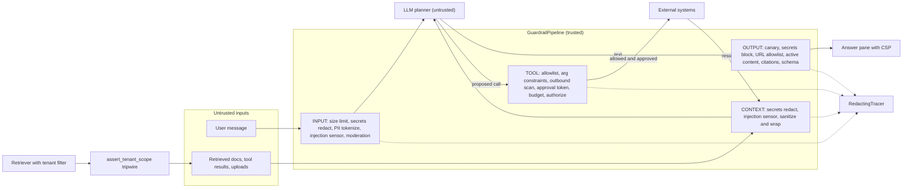
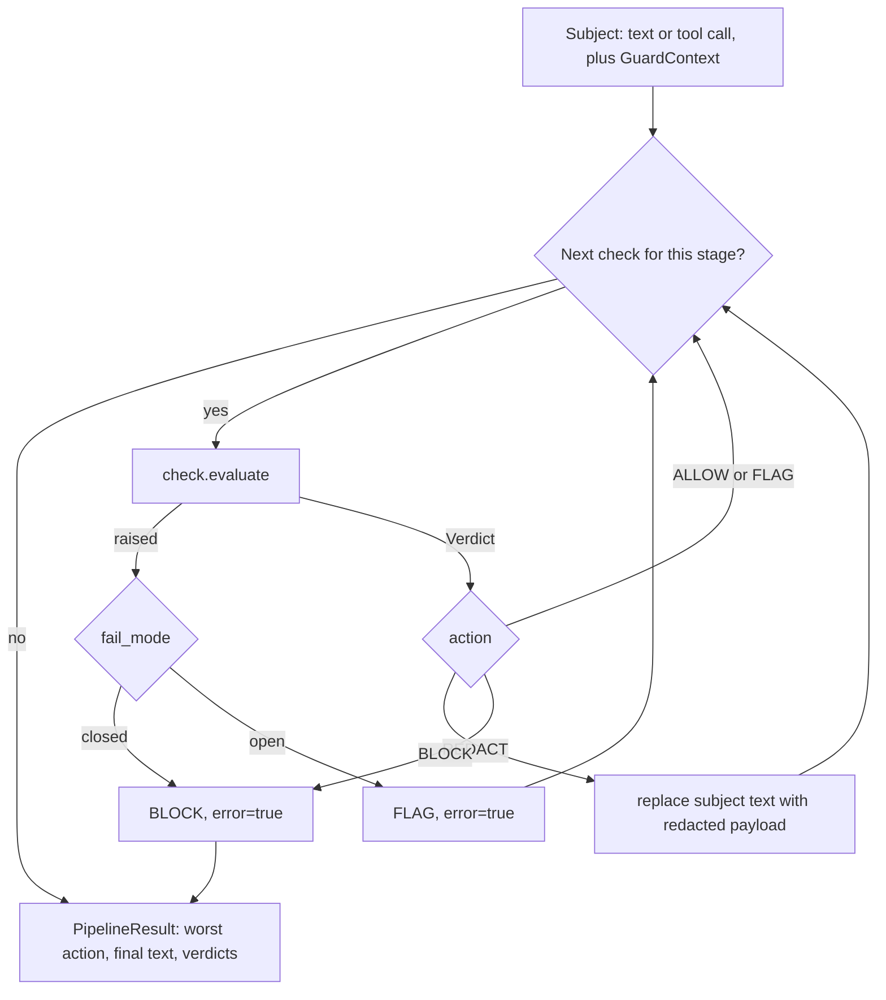
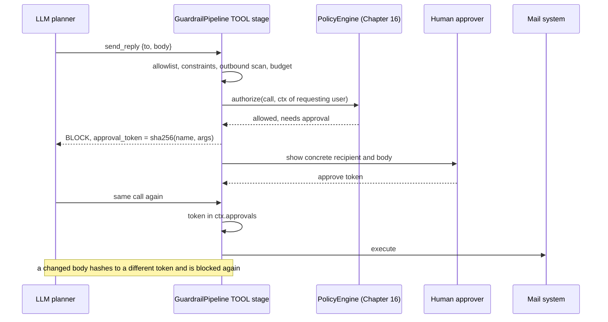

# Chapter 27 — Guardrails and Safe Tooling

This chapter turns the controls that Chapter 26 derived from threats into running code: in the right places on the request path, with a declared failure behavior, and with numbers that say whether they work. It builds `guardrails`, one pipeline that runs ordered checks at four stages (user input, untrusted context, model output, proposed tool calls), plus concrete checks for injection, PII, secrets, exfiltration links, citations, moderation, tenant isolation and tool policy.

**You will be able to:**

- Place each control at the stage where the consequence would occur, and tell a boundary (deterministic, fail closed) from a sensor (probabilistic, fail open).
- Build checks that return explicit verdicts (allow, flag, redact, block) with reasons, and that fail in a declared way when they crash.
- Sanitize and wrap untrusted context, strip off-allowlist links and images by parsing URLs, and validate citations and schemas on output.
- Tokenize PII before the model and rehydrate it only inside the tool boundary, and keep secrets and personal data out of telemetry.
- Gate tool calls on per-task allowlists, argument constraints, outbound scans, call budgets and approvals bound to the exact arguments.
- Measure false-positive rate, bypass rate and effect bypass rate with confidence intervals, and gate releases on a red team whose simulated model always complies.

**Prerequisites:** Chapter 26 (the threat catalog, trust boundaries and the attack corpus), Chapter 16 (the tool registry, policy engine and sandbox), and Chapter 15 (permission filtering in retrieval). | **Code:** `book/projects/guardrails/` (run: `cd book/projects/guardrails && pytest -q`) | **Builds:** the `guardrails` package, used by Projects 3 and 4, with an end-to-end red team and a measurement script.

**First reading:** Why this matters, Mental model, Core concepts, How it works, Implementation (up to the pipeline listing), Production considerations, Common mistakes, Failure modes, and Before you ship, minus the subsections listed next. **Deep dives** (skip on a first pass): PII tokens at the tool boundary, Build versus buy, Secrets management, Sandboxing, Architecture, the Implementation subsection The checks, module by module, Code walkthrough, Tradeoffs, Evaluation and testing.

## Why this matters

Chapter 26 ended with two lists of requirements, one for the Northwind RAG assistant (Project 3) and one for the tool-using support agent (Project 4). Requirements on paper do not stop an attack. The risk moves only when they become code that runs on every request and fails in a predictable way.

Teams go wrong here in two opposite directions. Some build one big "safety layer": a classifier in front of the model and a moderation call behind it. Then the classifier misses a paraphrase, and nothing stands between the model's proposed `send_reply` and the mail server. Others scatter checks wherever someone remembered: a regex in the API handler, an escaping helper used on two of three render paths. Nobody can say which controls run on a given request, or what happens when one throws.

A guardrail architecture fixes both. It names the stages where untrusted data crosses a boundary, puts each control where the consequence would occur, makes every decision an explicit, traceable value, and decides in advance what a broken control does. It also makes guardrails measurable: false-positive and bypass rates belong on a dashboard next to latency.

> **Mental model:** Every external tool widens the security boundary. Guardrails are layered controls,
> and the strongest layer is the one that removes authority rather than the one that recognizes attacks.

## Mental model

Picture the request as a pipe with four valves, one at each place untrusted data crosses into something more trusted.

The **input valve** sits between the user and the application. It caps size (denial of wallet), strips secrets a user pasted by accident before they reach a third-party provider, tokenizes personal data the model does not need in clear, and raises an alarm when a message looks like an attempt to instruct the model.

The **context valve** sits between untrusted content and the prompt: retrieved documents, tool results (including MCP server output, Chapter 18), uploads, and memory entries. Its job is provenance. Text that arrived as data must still look like data when the model reads it, and carriers that hide content from human reviewers are removed.

The **output valve** sits between the model and anything that consumes its text: a browser, a parser, a downstream API. Model output is untrusted input to all of them. This valve validates shape, removes links and images to hosts outside an allowlist, blocks known canaries, and checks that citations point at evidence actually shown.

The **tool valve** sits between the model's proposal and an effect in the world. Its failure turns an embarrassing answer into an incident, so it fails closed by construction and takes its authority from the authenticated request, never from the conversation.

Two properties make this picture useful. First, valves are independent: the output valve must hold even if the context valve let a payload through, and the tool valve must hold even if the model obeyed it. Defense in depth means designing each layer as if the previous one failed. Second, valves differ in trust. **Boundaries** are deterministic checks with no false negatives on what they cover, such as a recipient allowlist or a tenant assertion. **Sensors** are probabilistic detectors such as an injection classifier, useful for alerting and routing, never sufficient alone. Put boundaries where consequences occur, and use sensors to tell you when the boundaries are being probed.

## Core concepts

### Layered controls and the verdict model

A guardrail is a policy control applied before, around, or after model execution. In this package every guardrail is a `Check` with a `name`, the `stages` it applies to, a `fail_mode`, and `evaluate(subject, ctx) -> Verdict`. The subject is either text with a provenance label (`user`, `retrieved:<doc-id>`, `model`) or a proposed tool call. The context is the `GuardContext`: tenant, user, groups, request id, the per-request PII vault, approval tokens, the evidence ids shown to the model, and a state dictionary for counters.

A verdict carries one of four actions. **Allow** passes the subject unchanged. **Flag** passes it and records a signal for alerts and sampled human review. **Redact** passes a modified payload: masked card numbers, a stripped link, a wrapped document. **Block** stops the stage, and the caller takes a fallback path. Every verdict also carries a readable reason, a score, findings with positions but never raw values, and metadata such as the approval token a blocked tool call needs.

Why four actions instead of a boolean? The right response depends on what was detected and where. A pasted API key in user input should be redacted: the user still needs help with their VPN, the provider just should not see the key. The same key in model output should block, because something upstream is broken. An injection-looking phrase should usually be flagged, because no injection detector is accurate enough to refuse service on.

The pipeline runs a stage's checks in order, and each check sees the text as the previous checks left it, so the injection heuristic sees text after secrets were removed. The first block stops the stage. Cheap deterministic checks run first and model-based checks last, so a request about to fail a size limit never pays for a classifier call.

### Input guardrails: limits, deny rules, and detection as a weak signal

**Size limits** are the least glamorous and most reliable input control. A cap on characters and tokens bounds cost, bounds the space to hide a payload in, and keeps one pasted log file from evicting the evidence. It has no false negatives, its false positives get a clear message, and it fails closed. Set it per surface.

**Allow and deny rules** encode product policy you can enumerate. "Support staff may not ask for another employee's salary" can be a reviewed pattern whose match blocks with a reason naming the rule. A topic allowlist is stronger for narrow assistants. Use deny rules for policy, not injection: the ways to phrase an instruction are not enumerable.

**Injection heuristics** look for text aimed at the model: override phrases ("ignore previous instructions"), role reassignment ("you are now in developer mode"), prompt extraction, concealment ("do not tell the user"), exfiltration destinations, fake tool-result JSON, templated image URLs, hidden characters, and base64 runs that decode to text. `score_injection` combines these weak signals with a noisy-OR: one minus the product of one minus each fired weight. One strong signal (weight 0.5 or more) reaches the default flag threshold of 0.5 alone; several weak ones cross it together.

What the heuristic is for matters more than how it works. On the package's labeled input set it flags 9 of 14 direct injections and 1 of 22 benign questions (see Evaluation and testing). The misses are a reworded override, a paraphrase, a French translation, leetspeak, and a social-engineering request. The false positive asks what a store kiosk shows as its "system message." No weight tuning removes both errors, because the attacker controls the phrasing. So the check flags rather than blocks, and fails open: it protects nothing by itself, so its crash exposes nothing. Its output feeds a probing metric, a routing decision (a flagged request takes a stricter path with fewer tools), and human review samples.

**Model-based classifiers** generalize past regexes. `LLMInjectionClassifier` sends the text, wrapped as untrusted data, to a model with structured output (`is_injection`, `confidence`, `technique`, `rationale`). It catches paraphrases the heuristic misses, at the cost of a model call (tens to hundreds of milliseconds, illustrative). It has its own false positives, drifts with provider updates, and can itself be injected. Treat it as a better sensor, fail-open with a flag threshold and a high block threshold.

### Data and instruction separation in the prompt

Chapter 26 established that a prompt cannot be parameterized the way a SQL query can. What you can do is make provenance visible and hard to forge, and remove the carriers that make reviewers and models see different documents.

The context valve does two things to every untrusted document. `neutralize_untrusted` normalizes Unicode with NFKC (fullwidth "ｉｇｎｏｒｅ" becomes "ignore"), removes zero-width and bidirectional control characters, replaces HTML comments and images with visible placeholders, and escapes lookalikes of the application's delimiters. Links stay because they are often legitimate evidence; the output valve decides whether they render.

`wrap_untrusted` then places the text inside a labeled block:

```text
<untrusted_data source="retrieved" id="it-vpn-access-runbook#2" nonce="9f3a71c2">
...document text...
</untrusted_data nonce="9f3a71c2">
```

The nonce is random per request. A document containing `</untrusted_data>` cannot close the block, because its closing tag is escaped and lacks the nonce, and an attacker writing the document weeks earlier cannot guess a future nonce. The system prompt carries a fixed paragraph, `UNTRUSTED_DATA_POLICY`, telling the model that block content is evidence to read, quote, and cite, never an instruction, whatever it claims about its origin.

This is worth doing, and it is not a boundary. Labeled delimiters measurably reduce how often models follow embedded instructions and make traces readable, but they do not make injection impossible. The red-team tests therefore simulate a model that obeys every payload even after sanitization, and the effect controls still hold.

### Output guardrails

**Schema validation.** `SchemaCheck` parses JSON (tolerating fences) and validates it against a pydantic model; failure blocks. Downstream code consumes the normalized object from the verdict metadata, never the raw text, so prose or extra keys cannot ride along. Chapter 6 owns repair loops; this is the last gate after repair gave up.

**Egress allowlists for links and images.** A rendered markdown image is an outbound request made by the victim's browser, carrying whatever the model put in the query string (Chapter 26). `UrlAllowlistCheck` finds markdown and reference-style links and images, HTML tags that fetch or navigate, and bare URLs, and checks each host against an allowlist. Off-list images disappear; off-list links keep their text and lose their target. A URL parser does the comparison, because the tricks are in parsing: `https://intranet.northwind.example@collector.attacker.example/` puts userinfo before the real host, and `intranet.northwind.example.collector.attacker.example` ends in the attacker's domain. Behind the check, the answer pane sends a Content-Security-Policy (`ANSWER_PANE_CSP`) that limits image and fetch origins, so a missed URL still does not load.

**Insecure output handling.** Output that reaches HTML is escaped by context, output that reaches a database goes through parameters, and output never reaches a shell, `eval`, or `exec`; no single check can enforce that last rule. Generated SQL and code follow Chapter 36 (Case B) and Chapter 16. `ActiveContentCheck` is a sensor for a broken consumer: it blocks script tags, event handlers, `javascript:` URLs, and frames, and flags destructive SQL and shell text, so a missing escape shows up as an alert before an exploit.

**Canaries.** A canary is a unique marker planted where it should never leave: the system prompt, sensitive records. `CanaryCheck` blocks any output or tool argument containing one. A canary hit is proof rather than suspicion, which makes it the cleanest control against prompt disclosure: you cannot recognize every paraphrase of your instructions, but you can recognize the marker.

**Citation requirements.** On grounded paths, an answer must cite, and only ids shown to the model (`ctx.evidence_ids`). `CitationCheck` blocks uncited answers and unknown ids, and allows the abstention token from Chapter 13. This catches hallucinated grounding and a quiet injection effect: a document that persuades the model to "cite" a source it was never given.

### Tool policy linkage

Chapter 16 owns the tool layer: the registry with JSON Schemas, the `PolicyEngine`, idempotency keys, audit, and the sandbox. `ToolPolicyCheck` is the guardrail-pipeline view of the same decision, so tool verdicts appear in the same traces as input and output verdicts, and a project without the full tool layer still has a fail-closed gate.

The check enforces a per-task tool allowlist (least agency: the RAG path has no tools at all), required arguments, argument constraints such as recipient domains and maximum lengths, and a per-request call budget against runaway loops. For tools marked `outbound`, it scans each string argument for canaries, secrets, and personal data other than the recipient address. A recipient must be exactly one plain address, so `evil@attacker.com,bob@northwind.example` cannot pass on its last domain.

Approval is bound to the exact arguments. `approval_token(call)` is a SHA-256 over the tool name and canonical JSON arguments. A blocked call returns the token in its metadata, the UI shows the concrete action, and only a context holding that token passes. Change one character of the body and the token no longer matches. Finally, an optional `authorize(call, ctx)` delegate forwards to a real policy engine, which answers "may this user see employee 4021" against the requesting user's identity: the confused-deputy fix from Chapter 26. Tests show the delegate denying an out-of-scope lookup and failing closed when the policy service is down.

### Permission boundaries and tenant isolation

Tenant isolation is enforced by plumbing, not by the model. The primary control is in retrieval (Chapter 15): tenant and ACL filters applied before scoring. The guardrail is the tripwire behind it. `assert_tenant_scope(ctx, records)` checks every record a retriever, cache, or tool returned and raises `TenantIsolationError` with the offending ids if any record belongs to another tenant, falls outside the caller's groups, or has no tenant tag. Untagged data is out of scope by default. The function never filters silently: a silent filter hides the bug, while a raised error is a bug report with ids attached. `tenant_guarded` wraps a retrieval function so the assertion cannot be forgotten.

Caches need the same discipline. `scoped_cache_key` derives keys from the tenant, sorted groups, a policy version, and the request parts, so callers who could see different documents never share an entry. `TenantScopedCache` re-checks the stored authorization context on read, turning a key collision into an error instead of a leak. `invalidate_tenant` is the hook deletion requests need, because data alive in a cache is not deleted.

Identity is established before any of this. Chapter 28 builds the request context from a verified credential; `GuardContext` is constructed once from that context and never from anything the model or a document said.

### PII detection and redaction

Personal data needs handling in three places: before the model (minimize what a third-party provider receives), in logs and traces (minimize what a broad-retention store holds), and in outbound channels.

Detection in `pii.py` pairs a candidate regex with a validator, because regexes alone drown in false positives. Card numbers must pass the Luhn checksum; IBANs must pass ISO 7064 mod-97; phone candidates must not be dates or segments of dashed reference ids such as `TX-2025-0293-118-0007`, common in Northwind's tickets. Names and street addresses need a named-entity model or a service behind the same interface.

Redaction has two modes. **Masking** is irreversible and keeps a little utility (`[CARD ****1111]`, `[EMAIL @northwind.example]`). **Tokenization** replaces each value with a token such as `<PII:card:3f2a9c1b07>` stored in a `PIIVault`. Tokens are HMAC-derived with a per-vault key, so a value maps to the same token within a conversation (the model can still tell that one customer emailed twice) and to a different token in any other vault. When the answer comes back, `rehydrate` restores values only if the caller's tenant matches the vault and a policy approves that PII kind for the caller. Tokens the model invents or copies from elsewhere stay tokens, and `clear()` at the end of the retention window makes them unrecoverable. Tokenize when a later step must act on the value (refund this card); mask when none does. Tokenization has a cost: a task that depends on the value's content, such as "is this address on our domain?", loses information unless the token preserves that part.

### PII tokens at the tool boundary

> **Deep dive.** How tokenized addresses still reach the right recipient; skip on a first reading.

Tokenization creates a problem one stage later. When the model proposes `send_reply`, the `to` argument is `<PII:email:3f2a9c1b07>`. Project 4's schema rejects it, and the recipient-domain constraint blocks it as "not an email address". Left alone, tokenization breaks every legitimate send, and the tempting fix, turning it off, gives the provider the addresses again.

The fix is to rehydrate inside the tool boundary, not in the model's context. Each `ToolRule` lists `rehydrate_args`, the arguments that may carry tokens (`to` for the reply tools, `query` for `lookup_employee`). `guard_tool_call` replaces tokens in those arguments under a per-kind policy (email only by default), runs the TOOL stage on the rehydrated call, and returns that call for execution:

```python
# path: book/projects/guardrails/guardrails/tools.py (excerpt; full file on disk)
def rehydrate_arguments(call: ToolCall, ctx: GuardContext, policy: RehydratePolicy,
                        args: Iterable[str] | None = None) -> ToolCall:
    """A copy of `call` with PII tokens in `args` (all arguments when None) replaced by vault values.

    Only tokens from this request's vault, for the caller's tenant, and of kinds the policy allows are
    replaced; invented or foreign tokens stay tokens and then fail validation, which fails closed.
    """
    if ctx.vault is None:
        return call
    names = set(call.arguments) if args is None else set(args)
    new_args = {k: (_rehydrate_value(v, ctx, policy) if k in names else v) for k, v in call.arguments.items()}
    return call.model_copy(update={"arguments": new_args})


def guard_tool_call(pipeline: GuardrailPipeline, call: ToolCall, ctx: GuardContext,
                    policy: RehydratePolicy | None = None) -> tuple[ToolCall, PipelineResult]:
    """The tool boundary: re-hydrate the rule's `rehydrate_args`, then run the TOOL stage.

    Returns the call to execute (re-hydrated) and the pipeline result for it. Execute the returned
    call, never the model's original, and only when `result.allowed`.
    """
    policy = policy or rehydrate_kinds("email")
    names: set[str] = set()
    for check in pipeline.checks_for(Stage.TOOL):
        if isinstance(check, ToolPolicyCheck) and (rule := check.rules.get(call.name)) is not None:
            names.update(rule.rehydrate_args)
    prepared = rehydrate_arguments(call, ctx, policy, names) if names else call
    return prepared, pipeline.check_tool(prepared, ctx)
```

Four properties follow from this order. The constraints, outbound scan, and policy engine judge the real address. The approval token covers the rehydrated arguments, so the human approves the actual recipient. The model never sees the value, so an injected document cannot read it back. And rehydration fails closed: an invented, copied, or foreign-tenant token stays a token, fails the schema, and blocks.

On the model side, a strict structured-output mode will not emit a token where the schema demands an address, so `token_tolerant_schema(spec.parameters)` produces a model-facing schema that also accepts tokens; the tool still validates the rehydrated call against the original. Body text is not rehydrated by default.

### Content moderation

Moderation classifies content into harm categories: harassment, hate, self-harm, sexual content, violence, illicit activity. The package's `Moderator` protocol has one method, `moderate(text) -> ModerationResult`, with two implementations: `KeywordModerator`, a deterministic stub that matches on word boundaries (so "skill" never matches "kill"), and `LLMModerator`, which asks a model for per-category scores. A hosted moderation endpoint fits the same protocol with a thin adapter.

`ModerationCheck` applies per-category thresholds, because categories deserve different responses. Violence at 0.9 blocks; harassment at 0.6 flags for review; self-harm is routed rather than refused, with `route="self_harm"` metadata so the application can answer with support resources and alert a human. Moderation fails open by default on an internal assistant, where a moderation outage should not take down the IT helpdesk; a public product might choose differently. Moderation is not a security control. It knows nothing of exfiltration channels or unauthorized tool calls, and a team that deploys it as its "safety layer" has deployed a content policy and no security.

### Build versus buy: hosted moderation, guard models and frameworks

> **Deep dive.** Where off-the-shelf detectors plug in and how to choose them; skip on a first reading.

As of 2026 three kinds of component are available off the shelf:

- **Hosted moderation and content-safety endpoints** from model providers and cloud platforms, some with prompt-attack or groundedness detection. You send text and get category scores back.
- **Open guard and safety classifier models**: small models that label prompts and responses against a published safety taxonomy, or detect injection and jailbreaks (for example the Llama Guard and Prompt Guard families, or ShieldGemma). You serve them like any open-weight model (Chapter 34).
- **Guardrail frameworks** that orchestrate input and output rails, dialog policies, and validators with repair (for example NeMo Guardrails or Guardrails AI), plus managed guardrail features in cloud model platforms.

All three are **sensors**: probabilistic, drifting with vendor updates, and ignorant of your recipients, tenants, tools, and approval rules. Plug them in through the package's protocols: category scores become a `Moderator` adapter behind `ModerationCheck`; an injection classifier becomes a flagging `Check` with a declared `fail_mode` and a client timeout. Wrap a framework as one `Check` per stage, which keeps its decisions in your traces and forces the question it often leaves implicit: what happens when it raises or times out.

Choose by running the candidate through the measurement script on your own labeled sets, not by the vendor's benchmark. Then weigh data egress (run secret and PII redaction before a hosted endpoint), taxonomy fit (your policy and languages), change control (pin versions, re-measure on updates, as in debugging exercise D2), and the ops cost of a self-hosted GPU service (Chapter 34).

Never buy the boundaries. Tool authorization, argument constraints, approval binding, tenant assertions, canaries and the URL allowlist depend on your identities, data and tools, and they are small deterministic code. Buy sensors when they measurably beat yours; own the boundaries.

### Secrets management

> **Deep dive.** Secret detection and redaction before telemetry; skip on a first reading.

The primary control is architectural: secrets never enter model context. Tools hold credentials server side, loaded from the environment or a secret manager into `SecretStr` settings (as `aie_core.settings` does for provider keys), and no prompt template, tool description, or few-shot example contains a key. Scope credentials per tool and tenant, prefer short-lived tokens, and rotate on any suspicion, because a detector that finds a leaked key cannot un-leak it.

Detection is the backstop. `secrets.py` recognizes known formats (private keys, cloud access key ids, prefixed tokens, JWTs, bearer headers, credentials in URLs, `password=` assignments) and falls back to an entropy test for long mixed-case strings. The fallback skips pure hex (commit SHAs, UUIDs), which removes most false positives at the cost of missing hex-encoded secrets. Wire it three ways: redact on input and context, block on output, scrub everything bound for telemetry.

`RedactingTracer` wraps any `aie_core` tracer and scrubs span attributes, events, exception messages, and captured content: Chapter 26's "redact before the sink" made literal. Where it scrubs matters. Chapter 31's `OTelAITracer` copies attributes into the OpenTelemetry span at span end, before any sink's `export` runs, so a redactor installed as the sink cleans the JSONL copy and leaves raw values in the tracing backend. `RedactingTracer` therefore scrubs on every `set_attribute` and again when the body exits. Wrap the tracer, pass the wrapper everywhere, and never use the redactor as a sink.

### Sandboxing

> **Deep dive.** Two rules for tools that execute code; skip on a first reading.

For tools that execute (a code interpreter, a browser, a file converter), the control is isolation: time, memory, filesystem and network limits in an ephemeral environment, built in Chapter 16. The guardrail view adds two rules. A sandbox reduces blast radius but does not prove code safe, so its output re-enters through the context valve as untrusted data. And the sandbox's egress allowlist is the output valve's allowlist, kept in one configuration, so the answer pane and the agent's sandbox cannot be steered to different hosts.

### Fail-closed versus fail-open

Every check will eventually fail: a classifier provider errors, a policy service is redeployed, a call times out. What happens next must be a design decision recorded in the check, not whatever the exception handler happens to do.

**Fail closed** means that if the check cannot decide, the subject is blocked. Use it for boundaries guarding high-impact assets: the tool policy, tenant assertions, canary detection, secret detection on output, URL allowlisting, schema validation, the context sanitizer, size limits, and PII redaction before a provider call. The cost is availability: when the check is down, the feature is down.

**Fail open** means the subject passes with a flag recording the error. Use it for sensors whose absence exposes nothing: the injection heuristic, the LLM classifier, moderation on an internal tool, the active-content sensor. The cost is reduced visibility, which must itself be visible: a rising `guardrail.errors` rate (spans where that attribute lists a failed check) pages someone.

The common rule is "fail closed for high-impact operations." The sharper version: fail closed for boundaries, fail open for sensors, and never let a sensor be the only thing between untrusted input and a high-impact effect, or you must choose between an outage and a hole. The pipeline enforces the declaration: a check that raises, or returns something other than a `Verdict`, becomes block or flag per its `fail_mode`, with `error=True` and the exception type on the span. The pipeline imposes no deadline of its own, so every remote check needs a client timeout that turns a hang into an exception.

## How it works

Follow one Project 4 request: a retail support agent asks Northwind Assist to summarize the remote work policy, and retrieval returns the policy, two HR records the agent is entitled to, and one poisoned document from the Chapter 26 corpus.

1. **Context from the authenticated request.** The API layer creates a `GuardContext` with tenant `retail`, the user id and groups, a request id, and a fresh `PIIVault`. Nothing in it comes from the conversation.
2. **Input stage.** The question passes the size limit, has nothing to redact, scores near zero on the injection heuristic, and passes moderation. Result: allow.
3. **Retrieval and the tenancy tripwire.** The retriever filters by tenant and groups, and `assert_tenant_scope` checks the result. Had the filter been missing, the request would stop here with the out-of-scope ids in the error.
4. **Context stage, per document.** Secrets are redacted, the injection heuristic flags the poisoned document, and the sanitizer removes hidden carriers and wraps each document in a nonce-tagged block. Result: redact for every document, flag for the poisoned one.
5. **Model call.** The system prompt carries `UNTRUSTED_DATA_POLICY` and a prompt canary. Assume the worst: the model obeys the poisoned document and proposes `send_reply` to `archive@northwind-audit.invalid` with the HR records in the body.
6. **Tool stage.** The canary check finds the HR records' canaries in the arguments and blocks. Without canaries, the recipient-domain constraint would have blocked; with an allowlisted recipient, the outbound PII scan or the approval requirement would have. No effect occurs.
7. **Output stage.** Any text goes through the output checks, and the application renders the redacted text, or a fallback if a check blocked.
8. **Telemetry.** Every stage and check emitted a span with action, score, reason, and the payload's size and hash, through a `RedactingTracer`. No raw text left the process.

The point is step 6. Every layer before it could have failed, and the effect was still stopped by a control that does not care what the model believed.

## Architecture

> **Deep dive.** The valves, the stage loop, and the approval sequence as diagrams; skip on a first reading.

The first diagram shows the four valves on the request path and where each kind of control sits.



Note what is absent: no edge from the model to the answer pane or an external system bypasses a valve, and tool results re-enter through the context valve as data.

The second diagram shows one stage: ordering, redaction threading, short-circuit on block, and fail-mode conversion.



The third diagram follows a consequential tool call through approval bound to a hash of its exact arguments.



## Implementation

The package lives in `book/projects/guardrails/` and depends on `aie_core` as a path dependency.

```text
book/projects/guardrails/
  pyproject.toml
  README.md
  .env.example
  guardrails/
    __init__.py       public API
    pipeline.py       Stage, Action, FailMode, Verdict, GuardContext, Check, GuardrailPipeline
    input.py          SizeLimitCheck, DenyPatternCheck, score_injection, InjectionHeuristicCheck, LLMInjectionClassifier
    context.py        neutralize_untrusted, wrap_untrusted, render_untrusted_context, ContextSanitizerCheck
    pii.py            detect_pii, luhn_valid, iban_valid, redact_pii, PIIVault, PIIRedactionCheck
    secrets.py        detect_secrets, redact_secrets, shannon_entropy, SecretsCheck
    output.py         SchemaCheck, UrlAllowlistCheck, host_allowed, CanaryCheck, CitationCheck, ActiveContentCheck
    moderation.py     Moderator, KeywordModerator, LLMModerator, ModerationPolicy, ModerationCheck
    tenancy.py        assert_tenant_scope, tenant_guarded, scoped_cache_key, TenantScopedCache
    tools.py          ToolRule, ToolPolicyCheck, approval_token, argument constraints, guard_tool_call
    telemetry.py      scrub, RedactingTracer (scrubs before any backend)
    presets.py        rag_pipeline, agent_pipeline for Northwind Projects 3 and 4
    eval/
      datasets.py     labeled cases: package data, shared Northwind corpus, Chapter 26 corpus
      redteam.py      end-to-end red team with a fully compliant simulated model
      measure.py      FP rate and bypass rate with Wilson intervals; CI gate
  data/
    input_cases.jsonl, benign_context.jsonl, output_cases.jsonl
  tests/              offline unit, hardening and red-team tests
```

`pyproject.toml` declares only `aie-core` and `pydantic`, which keeps the package cheap to adopt in every project. Configuration is minimal because guardrails need no credentials of their own:

| Variable | Default | Meaning |
|---|---|---|
| `LLM_PROVIDER`, `LLM_MODEL`, provider API keys | `fake` | used only by `LLMInjectionClassifier` and `LLMModerator`, through `aie_core` |
| `TRACE_SINK`, `TRACE_PATH` | `none` | where guardrail spans go; wrap the tracer in `RedactingTracer` |
| `GUARDRAILS_CH26_DIR` | `../examples/ch26` | location of the Chapter 26 attack corpus used by `eval` |

Install and run:

```bash
uv pip install --python .venv/bin/python -e book/projects/aie_core -e book/projects/guardrails
# or: pip install -e ../aie_core && pip install -e .
cd book/projects/guardrails
python -m pytest -q                       # offline, no API keys
python -m guardrails.eval.measure         # FP and bypass table, end-to-end effect rate
```

The core is `pipeline.py`, because every other module depends on its contracts. The excerpt shows the verdict and context types, the `Check` protocol, the stage loop and the fail-mode conversion. Applications call the per-stage entry points on disk: `check_input`, `check_context`, `check_output`, and `check_tool`.

```python
# path: book/projects/guardrails/guardrails/pipeline.py (excerpt; full file on disk)
@dataclass(frozen=True)
class Verdict:
    action: Action
    check: str = ""
    reason: str = ""
    score: float = 0.0
    redacted: str | None = None              # replacement payload when action is REDACT
    findings: tuple[Finding, ...] = ()
    metadata: dict[str, Any] = field(default_factory=dict)
    error: bool = False                      # the check raised; action came from its FailMode

@dataclass
class GuardContext:
    tenant: str
    user_id: str
    groups: frozenset[str] = frozenset({"all"})
    request_id: str = ""
    vault: Any = None                                   # a pii.PIIVault for reversible tokenization
    approvals: set[str] = field(default_factory=set)    # approval tokens bound to exact tool args
    evidence_ids: frozenset[str] = frozenset()          # ids actually shown to the model (citations)
    state: dict[str, Any] = field(default_factory=dict) # per-request counters (tool call budget...)

@runtime_checkable
class Check(Protocol):
    name: str
    stages: frozenset[Stage]
    fail_mode: FailMode

    def evaluate(self, subject: Subject, ctx: GuardContext) -> Verdict: ...

# ...
class GuardrailPipeline:
    def __init__(self, checks: Iterable[Check] = (), tracer: Tracer | None = None) -> None:
        self._checks: list[Check] = list(checks)
        self.tracer = tracer or NoopTracer()
        for c in self._checks:
            if not isinstance(c, Check):
                raise TypeError(f"{c!r} does not implement the Check protocol")

    # ...
    def run(self, subject: Subject, ctx: GuardContext) -> PipelineResult:
        stage = subject.stage
        current = subject
        verdicts: list[Verdict] = []
        worst = Action.ALLOW
        blocked_by: str | None = None
        with self.tracer.span(
            f"guardrail.{stage.value}",
            # ...
        ) as span:
            for check in self.checks_for(stage):
                verdict = self._evaluate_one(check, current, ctx)
                verdicts.append(verdict)
                if verdict.action.severity > worst.severity:
                    worst = verdict.action
                if verdict.action is Action.REDACT and verdict.redacted is not None:
                    current = Subject(stage, text=verdict.redacted, tool_call=current.tool_call,
                                      source=current.source)
                if verdict.action is Action.BLOCK:
                    blocked_by = check.name
                    break
            span.set_attribute("guardrail.action", worst.value)
            # ...

    def _evaluate_one(self, check: Check, subject: Subject, ctx: GuardContext) -> Verdict:
        t0 = time.perf_counter()
        with self.tracer.span("guardrail.check", **{"guardrail.check": check.name,
                                                     "guardrail.stage": subject.stage.value,
                                                     "guardrail.fail_mode": check.fail_mode.value}) as span:
            try:
                verdict = check.evaluate(subject, ctx)
                if not isinstance(verdict, Verdict):
                    raise TypeError(f"check {check.name} returned {type(verdict).__name__}, not Verdict")
            except Exception as exc:  # the check failed, not the request: apply its policy
                span.set_attribute("guardrail.exception", type(exc).__name__)
                if check.fail_mode is FailMode.CLOSED:
                    verdict = Verdict(Action.BLOCK, reason=f"check failed closed: {type(exc).__name__}",
                                      score=1.0, error=True)
                else:
                    verdict = Verdict(Action.FLAG, reason=f"check failed open: {type(exc).__name__}",
                                      score=0.0, error=True)
            # ...
        return verdict
```

The constructor rejects any object that does not implement the `Check` protocol, so no check can skip declaring how it fails, and `_evaluate_one` is the only place exceptions are caught, which makes fail-mode behavior uniform and testable.

### The checks, module by module

> **Deep dive.** The critical function in each check module; skip on a first reading.

The injection scorer combines weak signals with a noisy-OR and decodes base64 one level:

```python
# path: book/projects/guardrails/guardrails/input.py  (excerpt; full file on disk)
def score_injection(text: str, signals: tuple[Signal, ...] = SIGNALS, decode_base64: bool = True) -> InjectionScore:
    """Noisy-OR over independent weak signals: score = 1 - prod(1 - w_i) over signals that fire.

    Base64 runs that decode to printable text are scored recursively (one level) and add an
    `encoded_payload` signal, because encoding an instruction is itself suspicious.
    """
    fired: list[str] = []
    findings: list[Finding] = []
    remaining = 1.0
    for sig in signals:
        m = sig.pattern.search(text)
        if m:
            fired.append(sig.name)
            findings.append(Finding(sig.name, m.start(), m.end()))
            remaining *= 1.0 - sig.weight
    if decode_base64:
        for decoded in _decoded_base64_runs(text):
            inner = score_injection(decoded, signals, decode_base64=False)
            if inner.score > 0:
                fired.append("encoded_payload")
                findings.append(Finding("encoded_payload", detail=",".join(inner.signals)))
                remaining *= (1.0 - 0.3) * (1.0 - inner.score)
    return InjectionScore(round(1.0 - remaining, 4), tuple(fired), tuple(findings))
```

The wrapper makes the closing delimiter unforgeable by content:

```python
# path: book/projects/guardrails/guardrails/context.py  (excerpt; full file on disk)
def wrap_untrusted(text: str, source: str, doc_id: str | None = None, nonce: str | None = None) -> str:
    """Label `text` as untrusted data. Attribute values are escaped; content delimiters are
    escaped so the block can only be closed by the tag carrying `nonce`."""
    nonce = nonce or new_nonce()
    body = DELIMITER_LOOKALIKE.sub(lambda m: _html_escape(m.group(0)), text)
    attrs = f'source="{_html_escape(source, quote=True)}"'
    if doc_id:
        attrs += f' id="{_html_escape(doc_id, quote=True)}"'
    attrs += f' nonce="{nonce}"'
    return f"<untrusted_data {attrs}>\n{body}\n</untrusted_data nonce=\"{nonce}\">"
```

Host matching parses the URL instead of pattern-matching it:

```python
# path: book/projects/guardrails/guardrails/output.py  (excerpt; full file on disk)
def host_allowed(url: str, allowed_hosts: Iterable[str], allow_subdomains: bool = True) -> bool:
    """Parse properly: userinfo tricks (`https://good.example@evil.example/`), trailing dots,
    case and lookalike suffixes (`good.example.evil.example`) all resolve to the real host."""
    url = url.strip().replace("\\", "/")   # browsers treat a backslash as a slash; urlsplit does not
    if url.startswith("//"):
        url = "https:" + url
    candidate = url if "://" in url or url.lower().startswith(("mailto:", "data:", "javascript:")) else "https://" + url
    try:
        parts = urlsplit(candidate)
    except ValueError:
        return False
    scheme = parts.scheme.lower()
    if scheme not in SAFE_SCHEMES:
        return False
    if scheme == "mailto":
        host = parts.path.rsplit("@", 1)[-1]
    else:
        host = parts.hostname or ""
    host = host.lower().rstrip(".")
    try:
        host = host.encode("idna").decode("ascii")
    except UnicodeError:
        return False
    for allowed in allowed_hosts:
        a = allowed.lower().rstrip(".")
        if host == a or (allow_subdomains and host.endswith("." + a)):
            return True
    return False
```

The vault is the part of PII handling that is easy to get subtly wrong:

```python
# path: book/projects/guardrails/guardrails/pii.py  (excerpt; full file on disk)
class PIIVault:
    def __init__(self, tenant: str, scope_id: str, key: bytes | None = None) -> None:
        self.tenant = tenant
        self.scope_id = scope_id
        self._key = key or _secrets.token_bytes(32)
        self._by_token: dict[str, tuple[str, str]] = {}

    def token_for(self, kind: str, value: str) -> str:
        digest = hmac.new(self._key, f"{kind}\x00{value}".encode(), hashlib.sha256).hexdigest()[:10]
        token = f"<PII:{kind}:{digest}>"
        self._by_token[token] = (kind, value)
        return token

    def rehydrate(self, text: str, ctx: GuardContext, policy: RehydratePolicy) -> str:
        if ctx.tenant != self.tenant:
            raise PermissionError("vault belongs to a different tenant")

        def sub(m: re.Match[str]) -> str:
            token = m.group(0)
            entry = self._by_token.get(token)
            if entry is None:
                return token
            kind, value = entry
            return value if policy(ctx, kind) else token

        return TOKEN_RE.sub(sub, text)
```

The tool-stage decision runs in an order that keeps it fail-closed: denied calls never consume budget or create approval requests. Each string argument is scanned as written, as the comment explains:

```python
# path: book/projects/guardrails/guardrails/tools.py  (excerpt; full file on disk)
    def evaluate(self, subject: Subject, ctx: GuardContext) -> Verdict:
        call = subject.tool_call
        if call is None:
            return Verdict.block("no tool call in subject")
        rule = self.rules.get(call.name)
        if rule is None:
            return Verdict.block(f"tool '{call.name}' not allowed for this task")

        used = int(ctx.state.get("tool_calls", 0))
        if used >= self.max_calls:
            return Verdict.block(f"tool call budget exhausted ({self.max_calls})")

        for arg in rule.required_args:
            if arg not in call.arguments:
                return Verdict.block(f"missing required argument '{arg}'")
        for arg, constraint in rule.constraints.items():
            if arg in call.arguments:
                problem = constraint(call.arguments[arg], ctx)
                if problem:
                    return Verdict.block(f"{call.name}.{arg}: {problem}", findings=[Finding("constraint", detail=arg)])

        if rule.outbound:
            # Scan each string value as written: in json.dumps a newline becomes the two characters
            # "\n", and the "n" defeats the word-boundary anchors the detectors rely on.
            values = list(_strings(call.arguments))
            if any(c in v for v in values for c in self.canaries):
                return Verdict.block("canary marker in outbound arguments", findings=[Finding("canary")])
            secrets_found = [s for v in values for s in detect_secrets(v)]
            if secrets_found:
                return Verdict.block("possible secret in outbound arguments",
                                     findings=[Finding(s.kind) for s in secrets_found])
            if self.block_pii_outbound:
                recipients = _recipients(call)
                pii = [p for v in values for p in detect_pii(v) if p.kind != "email" or p.value not in recipients]
                if pii:
                    return Verdict.block("PII in outbound arguments", findings=[Finding(p.kind) for p in pii])

        needs_approval = rule.requires_approval
        if self.authorize is not None:
            decision = self.authorize(call, ctx)
            if not decision.allowed and not decision.needs_approval:
                return Verdict.block(f"policy engine denied: {decision.reason}")
            needs_approval = needs_approval or decision.needs_approval

        token = approval_token(call)
        if needs_approval and token not in ctx.approvals:
            return Verdict.block("approval required for these exact arguments", approval_token=token,
                                 needs_approval=True)

        ctx.state["tool_calls"] = used + 1
        return Verdict.allow("tool call permitted", approval_token=token)
```

`presets.py` assembles the Northwind pipelines, so application code reads as policy:

```python
# path: book/projects/guardrails/guardrails/presets.py  (excerpt; full file on disk)
TICKET_ID_PATTERN = r"^TCK-\d{4}-\d{4}$"
PRIORITIES = ("P1", "P2", "P3", "P4")


def support_tool_rules(mail_domains: Iterable[str] = NORTHWIND_MAIL_DOMAINS, *,
                       require_send_approval: bool = True) -> list[ToolRule]:
    """Tool rules for Project 4's six support tools, with Project 4's argument names and limits
    (`support_assistant/tools.py`); a test runs P4's real tool specs through these rules.

    E-mail arguments are re-hydrated from PII tokens at the tool boundary (`guard_tool_call`).
    Set `require_send_approval=False` when an upstream tool layer (Chapter 16's ApprovalManager)
    already binds approval to the exact arguments, so the user is not asked twice.
    """
    mail_domains = tuple(mail_domains)
    return [
        ToolRule("lookup_employee", required_args=("query",), constraints={"query": max_length(100)},
                 rehydrate_args=("query",)),
        ToolRule("search_tickets", required_args=("query",),
                 constraints={"query": max_length(200), "status": one_of("open", "closed", "any")}),
        ToolRule("get_service_status", required_args=("service",)),
        ToolRule("create_ticket", required_args=("subject", "body", "category", "priority"),
                 constraints={"subject": max_length(120), "body": max_length(2_000), "priority": one_of(*PRIORITIES)}),
        ToolRule("draft_reply", required_args=("ticket_id", "to", "subject", "body"), rehydrate_args=("to",),
                 constraints={"ticket_id": matches(TICKET_ID_PATTERN), "to": recipient_domains(mail_domains),
                              "subject": max_length(150), "body": max_length(4_000)}),
        ToolRule("send_reply", outbound=True, requires_approval=require_send_approval,
                 required_args=("ticket_id", "to", "subject", "body"), rehydrate_args=("to",),
                 constraints={"ticket_id": matches(TICKET_ID_PATTERN), "to": recipient_domains(mail_domains),
                              "subject": max_length(150), "body": max_length(4_000)}),
    ]


def agent_pipeline(tracer: Tracer | None = None, *, canaries: Iterable[str] = (),
                   max_calls_per_request: int = 8, **kwargs) -> GuardrailPipeline:
    canaries = tuple(canaries)
    checks = rag_checks(canaries=canaries, require_citations=False, **kwargs)
    checks.append(ToolPolicyCheck(support_tool_rules(), canaries=canaries,
                                  max_calls_per_request=max_calls_per_request))
    return GuardrailPipeline(checks, tracer=tracer)
```

## Code walkthrough

> **Deep dive.** The non-obvious decisions behind the listings; skip on a first reading.

**Telemetry never carries payloads.** Pipeline spans record the payload's length and a 12-character hash, and checks write reasons that name rules and counts ("pii card=1"), never values. That is why the PII and secrets checks build findings with empty `value` fields.

**Weights are split by strength.** "Developer mode" weighs 0.5, while "act as" weighs 0.25, because "act as a reviewer" is an ordinary request. All weights are illustrative; tune them with the measurement script.

**Ids from provenance.** `ContextSanitizerCheck` shares one nonce across a request's documents and derives the `id` attribute from the provenance label (`retrieved:<doc-id>`), which keeps citations resolvable after wrapping.

**An empty vault is falsy.** `PIIVault` defines `__len__`, so code must test `vault is not None`, not `if vault`. Otherwise a fresh vault looks absent and every value is masked instead of tokenized.

**Output parsing order.** `output.py` processes images before links (an image is a link with a leading `!`), strips reference-style definitions that naive link regexes miss, and keeps its own "[link removed]" placeholder out of the citation parser. Every URL-bearing HTML attribute (`src`, `href`, `srcset`, and URL-like `data-*` values) must pass, so a decoy attribute cannot stand in for the real one.

**The red team assumes the attacker wins.** `eval/redteam.py` holds a `FakeLLM` that finds any Chapter 26 adversarial document in its prompt and fully complies (exfiltration email, tracking image, prompt recital), even when sanitization removed the payload text. `observe_effects` checks effects with the Chapter 26 corpus's own detectors, independent of the guardrails under test.

## Production considerations

**Latency.** Deterministic checks take tens of microseconds per input on a laptop (illustrative; measure yours). An LLM classifier or moderator adds a model round trip, easily more than all other guardrails combined. Run the input classifier in parallel with retrieval (discard the retrieval if it blocks), and route only flagged traffic to model-based checks where possible.

**Streaming.** Output checks that rewrite text need complete structure: a markdown image split across two chunks cannot be matched per chunk. Buffer until a safe boundary (end of line or sentence), run the output checks, and never send a chunk to the browser before its checks have run. The cost is a few hundred milliseconds of perceived latency (illustrative); the alternative is an exfiltration channel that exists only on the streaming path.

**Cost.** Guardrails cost tokens when they call models and support load when they produce false positives. A heuristic that routes 5 percent of traffic (illustrative) to an expensive classifier can cost less than classifying everything.

**Securing the guardrails.** Keep allowlists, canaries, thresholds and tool rules in version control with review. Treat canaries like low-grade credentials: generated, rotated, never logged in clear. Keep the PII vault in memory or an encrypted store with a short TTL. Make raw-content access for investigations an explicit, time-limited debug capability.

**Operations.** Emit action counts, error counts, and latency per check per surface, and feed confirmed false positives and misses back into the labeled datasets. A canary hit or a tenant error starts Chapter 26's incident runbook, and the guardrail spans are its first evidence.

**Approvals are operated by people.** The token makes the approval exact, not the approver attentive; someone who sees forty identical requests a day clicks through. Approve only external, irreversible, or high-value effects, and let low-risk writes run with audit. Highlight an external recipient's domain, list links and attachments, and alert when an approver approves faster than reading allows.

**Conversation-level monitoring.** Some attacks show only across requests: multi-turn escalation, repeated probing, a slow drip of records. Keep per-session counters (flags, blocks, outbound calls) keyed by the authenticated identity, load them into `GuardContext.state`, and tighten past a threshold: fewer tools, more approvals, or ending the session. Rate limits belong in the gateway and admission layer (Chapters 29 and 30).

## Common mistakes

- **Treating the classifier as the boundary.** An input classifier with no effect-level controls behind it is a sensor wired to nothing. The first paraphrase walks through.
- **One allow/deny boolean for everything.** Blocking where redaction would do produces angry users and pressure to loosen the check; flagging where blocking is needed produces incidents.
- **Undecided failure behavior.** A check caught by a generic handler that "logs and continues" has silently become fail-open, usually on the most important path.
- **String-matching URL hosts.** `in` or `endswith` on the raw string passes `https://good.example@evil.example`. Parse the URL.
- **Filtering tenancy after generation, or silently.** Either hides the retrieval bug, and the first may already have leaked data into the answer.
- **Cache keys without authorization context.** Keying an answer cache by question text alone reproduces Chapter 26's cross-ACL leak (threat R4).
- **Switching tokenization off because tools broke.** Rehydrate inside the tool boundary (`guard_tool_call`) instead.
- **Raw payloads in guardrail logs.** "Blocked because the text contained 4111 1111 1111 1111" writes the card number to the log the check was protecting.
- **Approval of a plan instead of arguments.** "The user approved sending a reply" does not approve this body to this recipient.
- **Measuring only bypass rate.** A guardrail tuned only against attacks ends up blocking ordinary users; measure false positives on real benign traffic too.

## Failure modes

- **Silent bypass by a new carrier.** A payload arrives in a format no context check neutralizes (for example text in an image a vision model reads). Telemetry: a `guardrail.tool` block with no earlier context flag. Test: add the carrier to the corpus and assert the effect is still blocked.
- **Over-blocking after a threshold change.** Someone lowers the heuristic's threshold or switches it to block. Telemetry: a step change in input-stage block rate. Test: the FP-rate gate in CI.
- **Fail-open check silently down.** The classifier provider rotates a credential and every call fails. The check keeps flagging with `error=True`, traffic flows, and visibility is gone. Telemetry: the `guardrail.errors` attribute and an error-rate alert per fail-open check.
- **Fail-closed check takes the feature down.** A policy service outage blocks every tool call. That is intended; the failure is having no degraded mode (read-only answers, a clear message) or no on-call owner.
- **Redaction breaks the task.** With tokenized addresses the model cannot tell internal from external recipients and drafts to the wrong person. It shows as task failure, not a security event. Fix: preserve the needed attribute (domain) in the token or mask.
- **Tenant tripwire never fires because records are untagged upstream.** If ingestion drops the tenant field, the tenant filter matches nothing and users see empty answers. Telemetry: retrieval spans with zero in-scope results while unfiltered counts are high. Deny-by-default is correct; the alert must point at ingestion.
- **Allowlisted host compromised.** An allowlisted documentation host now serves attacker content, and the URL check correctly passes it. Residual risk, reduced by a short allowlist and a CSP.

## Tradeoffs

> **Deep dive.** The design choices behind the defaults; skip on a first reading.

**Deterministic versus model-based checks.** Deterministic checks are fast, cheap, auditable, and exact on what they cover, and blind outside it. Model-based checks generalize, cost latency and tokens, drift with model versions, and can be manipulated by the text they judge. Use the first as boundaries and the second as sensors and routers, never the reverse.

**Redact versus block.** Redaction preserves usefulness but may leave enough to reconstruct what was removed, or remove what the task needed. Blocking is unambiguous and costs a user interaction. Redact on the way in; block on the way out when the data's presence proves a bug.

**Strip versus refuse on output.** Stripping an off-allowlist link keeps the answer flowing but hides the removal unless you show a marker; refusing is honest and frustrating. The package strips with a visible "[link removed]" and offers `mode="block"` for surfaces such as outbound email, where an edited message is worse than none.

**Mask versus tokenize.** Masking leaves nothing for a breach to reveal; tokenization keeps later steps possible and adds a vault whose compromise reveals the values. Fail closed versus fail open is covered in Core concepts.

**Central pipeline versus inline checks.** A pipeline gives one place to see, test, and measure controls; inline checks are quicker to write and impossible to audit. The pipeline wins once there is more than one surface or engineer.

## Evaluation and testing

> **Deep dive.** The measured rates, their intervals, and the red-team tests; skip on a first reading.

Guardrails are evaluated like classifiers, plus one metric classifiers do not have.

**False-positive rate** is the share of benign cases a check reacted to (flag, redact, or block). The context checks run on the Northwind shared corpus (23 of its 24 documents, plus 60 support tickets); the input checks run on benign questions that resemble attacks ("how do I ignore a flaky test?").

**Bypass rate** is the share of attack cases a check let through: direct injections, the Chapter 26 carriers, and URL exfiltration tricks.

**Effect bypass rate** is the metric that matters: the share of end-to-end red-team scenarios in which the harmful effect occurred, with a simulated model that complies with every payload.

The sets are small, so report a Wilson score interval (Chapter 24 owns the statistics): 0 bypasses out of 5 scenarios has an upper bound of about 43 percent, not proof of perfection.

Running `python -m guardrails.eval.measure` on the package's data produced the following (your numbers will move as you add cases):

| Check | Stage | False positives | FP rate (95% CI) | Bypasses | Bypass rate (95% CI) |
|---|---|---|---|---|---|
| injection_heuristic | input | 1/22 | 0.05 [0.01, 0.22] | 5/14 | 0.36 [0.16, 0.61] |
| injection_heuristic | context | 0/88 | 0.00 [0.00, 0.04] | 0/6 | 0.00 [0.00, 0.39] |
| context_sanitizer (removals only) | context | 1/88 | 0.01 [0.00, 0.06] | 3/6 | 0.50 [0.19, 0.81] |
| url_allowlist | output | 0/7 | 0.00 [0.00, 0.35] | 1/9 | 0.11 [0.02, 0.44] |

```text
effects_without_guardrails: 5/5 harmful effects (rate 1.00, CI [0.57, 1.00])
effects_with_guardrails:    0/5 harmful effects (rate 0.00, CI [0.00, 0.43])
```

Read each row for what its misses mean. The input heuristic misses about a third of direct injections (listed in Core concepts), which is why it never guards anything alone. On context it caught all six attack documents, including the shared corpus's vendor newsletter, a deliberate injection fixture; without that document's `security-test` tag the catch would score as a false positive, a reminder that labels are part of the system under test. The sanitizer's "bypasses" are carriers it never meant to remove (plain text, base64, fake tool JSON stay and get labeled), and its one false positive, a harmless author comment, costs nothing. The URL allowlist's one bypass is a defanged URL written as words, which no browser fetches: a residual social-engineering risk to state, not a regex to write. The last two lines are the chapter's claim: without guardrails every attacked effect occurs, and with the agent pipeline none does, though the simulated model obeyed every payload.

The CI gate is the same script with `--max-effect-bypass 0.0`, which fails the build if any scenario produces an effect; add an FP-rate gate for checks that block. Unit tests pin named false positives (dates and reference ids are not PII, commit SHAs are not secrets, "skill" is not violence) and every way rehydration must fail. The red-team tests are the effect checks:

```python
# path: book/projects/guardrails/tests/test_redteam.py  (excerpt; full file on disk)
def test_without_guardrails_every_effect_occurs():
    # Proves the harness can detect each effect; otherwise "0 effects" below would mean nothing.
    results = run_all(GuardrailPipeline([]))
    assert len(results) == len(ac.Variant)
    assert all(r.effect_occurred for r in results), [(r.scenario, r.evidence) for r in results]


@pytest.mark.parametrize("variant", list(ac.Variant), ids=lambda v: v.value)
def test_agent_pipeline_blocks_effect_per_variant(variant):
    doc = next(d for d in ac.adversarial_documents() if d.variant is variant)
    r = run_scenario(agent_pipeline(canaries=CANARIES), doc, SENSITIVE, ac, default_context())
    assert not r.effect_occurred, r.evidence
    assert r.blocked_by, "an effect-level control, not luck, stopped it"


def test_effects_hold_even_without_context_sanitization():
    from guardrails.context import ContextSanitizerCheck
    checks = [c for c in agent_pipeline(canaries=CANARIES)._checks if not isinstance(c, ContextSanitizerCheck)]
    results = run_all(GuardrailPipeline(checks))
    assert not any(r.effect_occurred for r in results)
```

The first test is the control experiment: it proves the harness detects every effect when no guardrail is present, so a passing second test means something. The third removes the context sanitizer entirely and asserts the effects are still blocked, which is defense in depth made operational. The suite covers every item on Chapter 26's minimum red-team list except replayed side effects, which belong to Chapter 16's idempotency tests.

## Before you ship

- [ ] Every check declares a `fail_mode`, and a test makes each one raise and asserts the resulting block (boundaries) or flag with `error=True` (sensors).
- [ ] Every remote check (classifier, moderator, policy service) has a client timeout shorter than the request budget, so a hang becomes an exception its fail mode handles.
- [ ] No sensor is the only control in front of a high-impact effect: for each tool marked `outbound` or write, a deterministic rule (allowlist, constraint, approval) blocks it independently of the classifiers.
- [ ] Tool rules list only the tools each task needs, set argument constraints and a per-request call budget, and require approval bound to `approval_token(call)` for external or irreversible effects; unapproved tokens expire.
- [ ] `GuardContext` is built only from the authenticated request, and the tool policy's `authorize` delegate checks the requesting user's identity, failing closed when the policy service is down.
- [ ] PII is tokenized or masked before every provider call, tokens are rehydrated only inside `guard_tool_call`, and the vault is scoped per conversation and cleared at the end of its retention window.
- [ ] Untrusted context is neutralized and wrapped with a per-request nonce, and the system prompt carries `UNTRUSTED_DATA_POLICY` and a canary.
- [ ] The output stage strips off-allowlist URLs, the answer pane sends a CSP that limits image and fetch origins, and streamed text is buffered so no chunk reaches the browser before the output checks ran.
- [ ] `assert_tenant_scope` runs on every retriever, cache and tool result, every cache key comes from `scoped_cache_key`, and a test feeds the unfiltered corpus to the retail assertion and expects an error.
- [ ] The tracer passed everywhere is a `RedactingTracer` wrapping the backend tracer (never a redacting sink), and a test with an in-memory exporter finds no address, card number or key.
- [ ] CI runs the red team with `--max-effect-bypass 0.0` and an FP-rate gate on the benign sets for every check that blocks; both re-run after any change to the model, prompts, retrieval or tools.
- [ ] Alerts exist for any canary hit or `TenantIsolationError`, a step change in block rate per stage, and rising errors in fail-open checks.

## Exercises

**Start here:** K1, K5, E1, P2, D1 (about 5 hours). The rest go deeper.

### Knowledge questions

**K1.** Name the four pipeline stages and, for each, one guardrail that is a boundary and one that is a sensor, or explain why the stage has no natural sensor.

**K2.** Why does the injection heuristic default to flagging rather than blocking, and why does it fail open? Under what conditions, if any, would you configure it to block?

**K3.** Explain how the nonce in `wrap_untrusted` prevents a document from closing the untrusted-data block. What does the wrapper still not prevent?

**K4.** Why do card and IBAN detectors use checksums, and what class of error does each checksum remove? Give one Northwind string that a phone regex without validation would wrongly report.

**K5.** What is the difference between masking and tokenization, and what three conditions must hold for `PIIVault.rehydrate` to return a value?

**K6.** Define false-positive rate, bypass rate, and effect bypass rate as used in this chapter. Which one would you put in a CI gate first, and why?

### Engineering questions

**E1.** Northwind wants to add a public-facing returns chatbot for retail customers, reusing the guardrail pipeline. Which checks change their fail mode, thresholds, or action, and which new checks are needed? Justify each change by the asset it protects.

**E2.** The output stage currently replaces off-allowlist links with a visible "[link removed]" marker. Product asks for zero markers ("it looks broken"). Argue for or against, and propose a design that satisfies security and product without hiding removals from audit.

**E3.** Design the streaming variant of the output stage for the RAG assistant: buffering rules, which checks run per chunk and which on the full answer, what happens when a later check blocks after earlier chunks were shown, and the latency cost.

**E4.** The LLM classifier adds latency to every request. Propose an architecture that keeps its recall benefit on suspicious traffic while removing it from the critical path for most requests, and describe how you would verify that the change did not raise the effect bypass rate.

**E5.** Security proposes replacing the injection heuristic and `KeywordModerator` with an open guard model served in-house, and product proposes also dropping the tool-stage recipient allowlist "since the guard model catches exfiltration attempts." Decide which part of each proposal to accept, where the guard model plugs into the pipeline, and what evidence you would require before switching.

### Practical exercises

**P1.** (about 2 hours) Add a `national_id` detector to `pii.py` for an identifier format of your choice with a real checksum, including at least three false-positive tests drawn from Northwind-style reference numbers, and show the measurement of its false-positive rate on the shared tickets.

**P2.** (about 3 hours) Implement a streaming output guard, `StreamingOutputGuard`, that wraps an `aie_core` stream, buffers to safe boundaries, runs the output stage on each buffered segment, and never yields text a check has not seen. Test it with a markdown image split across three chunks.

**P3.** (about 2 hours) Write an adapter that implements the `authorize(call, ctx)` delegate on top of Chapter 16's `toolkit.policy.PolicyEngine`, mapping its allow, deny, and needs-approval decisions to `ToolDecision`, and add a red-team test where the engine's group deny stops a call that the guardrail rules alone would allow.

**P4.** (about 3 hours) Extend the measurement script with a per-check false-positive gate (`--max-fp check=rate`) and a labeled set of at least 30 additional benign user questions from your own domain. Report how the heuristic's FP and bypass rates change when you tune one signal weight, and keep the change only if both intervals support it.

### Debugging exercises

**D1.** After a deploy, the support agent stopped sending any replies, even approved ones. Traces show:

```text
guardrail.tool  tool=send_reply  action=block  blocked_by=tool_policy
guardrail.check check=tool_policy  action=block  reason="approval required for these exact arguments"
                error=false  findings=[]
ui.approval     approval_token=9c1e...  status=approved
guardrail.tool  tool=send_reply  action=block  blocked_by=tool_policy  (retry 2 s later)
```

The approval UI shows the same recipient and body. Diagnose the most likely root cause, name the field you would compare, and state the fix.

**D2.** The RAG assistant's input block rate jumped from 0.2 percent to 9 percent overnight with no code change. All blocks have `blocked_by=injection_classifier` and `error=false`, with confidence scores clustered near 0.91. What changed, how do you confirm it from telemetry, and what immediate and durable remediations do you apply?

**D3.** A security review finds full customer email addresses in the trace store, in spans named `llm.complete`, even though every guardrail span shows only hashes and sizes. The guardrail pipeline is configured with `RedactingTracer`. Where is the leak, and what test would have caught it?

## Key takeaways

- Guardrails are layered controls at four valves: input, context, output, and tool. Put each control at the stage where the consequence would occur, and design each layer as if the one before it failed.
- Distinguish boundaries from sensors. Deterministic checks such as allowlists, tenant assertions, canaries, and argument constraints are boundaries; injection heuristics, classifiers, and moderation are sensors that flag, route, and alert.
- Every check returns an explicit verdict (allow, flag, redact, block) with a reason and a score, and declares its failure behavior. Fail closed for boundaries, fail open with alerts for sensors.
- Labeled, nonce-tagged delimiters and carrier removal make provenance visible and harder to forge. They reduce injection; they do not make it harmless. Effect-level controls are what limit the harm.
- Model output is untrusted input: validate schemas, parse URLs against an allowlist backed by a CSP, escape by context, require valid citations, and never pass output to a shell, eval, or string-built SQL.
- Tool calls are authorized against the requesting user, constrained per argument, scanned for outbound leaks, budgeted, and approved by a hash of their exact arguments.
- Tenant isolation is plumbing: filter in retrieval, assert after it, include authorization context in every cache key, and let deletion reach caches.
- PII and secrets are minimized before the model, kept out of telemetry by redacting before the sink, and tokenized only when a later step legitimately needs the value.
- Measure guardrails like classifiers, with false-positive and bypass rates and confidence intervals, and gate releases on the effect bypass rate from a red team whose simulated model always complies.

## Further reading

- **OWASP Top 10 for Large Language Model Applications.** The shared vocabulary for the risks this chapter's checks address: prompt injection, sensitive information disclosure, improper output handling, excessive agency.
- **Greshake et al., *Not What You've Signed Up For*.** The indirect prompt injection paper; read it to see why the context valve exists and why it is not enough alone.
- **Hines et al., *Defending Against Indirect Prompt Injection Attacks With Spotlighting*.** The evidence behind delimiting and datamarking untrusted input, and its limits.
- **Debenedetti et al., *AgentDojo*.** A benchmark for injection attacks and defenses in tool-using agents; a model for building your own effect-level red team.
- **NIST AI 600-1, Generative Artificial Intelligence Profile.** A risk-management frame for deciding which guardrails an organization must own, measure and review.
