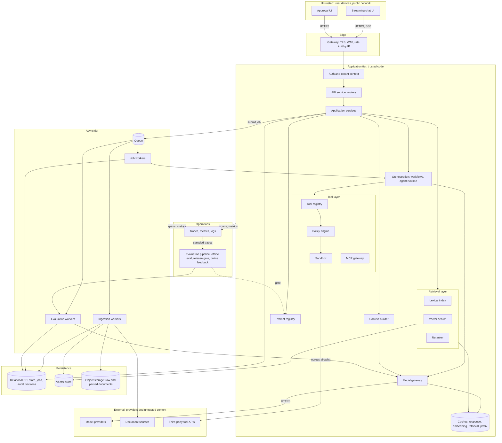
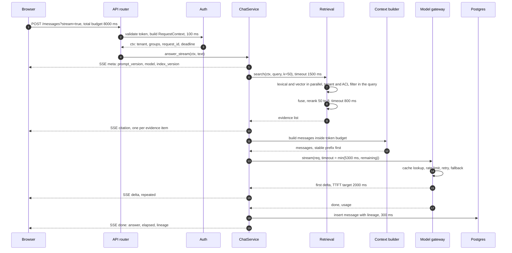
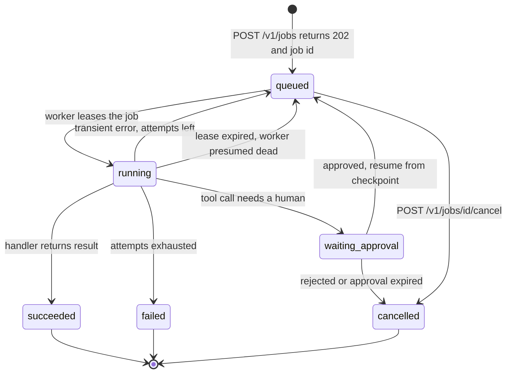
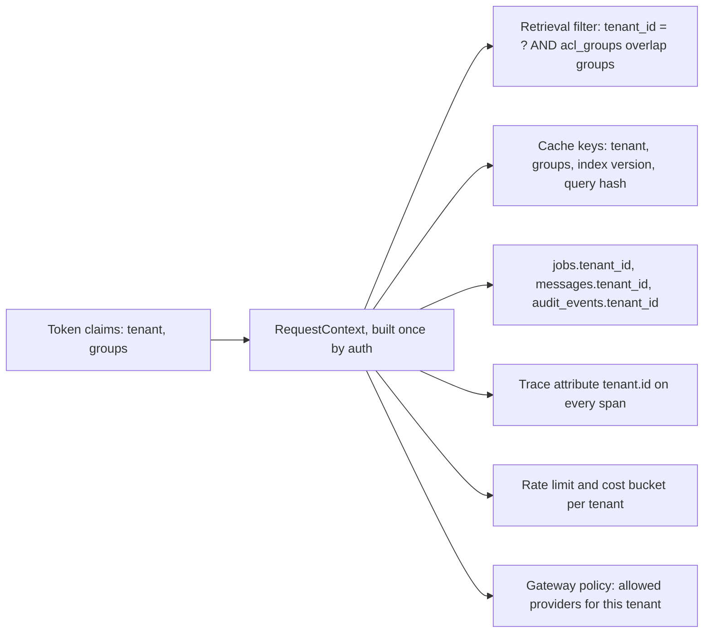
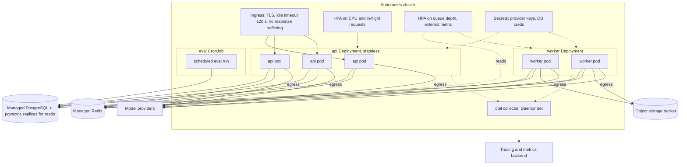

# Chapter 28 — AI Application Architecture

This chapter draws the whole system: every component between a user's keystroke and a grounded, audited, streamed answer, with the trust boundary, timeout and versions each one owes its neighbors. It is the map that Chapters 29 to 32 fill in with reliability, performance, observability and engineering practice.

**You will be able to:**

- Draw a reference architecture for an AI application and name, for every component, what it owns, its interface, what breaks without it, and the chapter that builds it.
- Split a request's latency target into per-stage timeouts carried by one budget, and emit versions and citations before the expensive work.
- Decide when a request becomes a job, and design the job protocol: `202` with an id, idempotent submission, leases, bounded retries, cancellation as a state.
- Place the tenant id so it cannot be lost: in the credential, the context object, retrieval filters, cache keys, every tenant-owned row and every span.
- Choose a transport per interaction (request/response, SSE, WebSocket, polling, webhook) and record the lineage that makes any answer reproducible.
- Sketch the development and production topology, and write architecture fitness tests that keep the layering from eroding.

**Prerequisites:** Chapter 3 (the `aie_core` model gateway), Chapters 12 and 15 (retrieval and production RAG), Chapter 16 (tool policy and approvals), and Chapter 26 (why untrusted text needs its own boundary). | **Code:** `book/projects/examples/ch28/` (run: `cd book/projects/examples/ch28 && pytest -q`) | **Builds:** a runnable FastAPI skeleton of the layering with in-memory adapters, a Docker Compose topology, and a relational schema for state and lineage.

## Why this matters

Most AI applications begin as a script: a prompt, a provider call, a `print`. The script becomes an endpoint, the endpoint grows a retrieval step, the retrieval step grows a cache, the cache grows a bug where one tenant sees another tenant's cached answer. Nothing in that sequence was a bad decision on its own. The problem is that the system was never drawn, so nobody noticed that the cache key, the retrieval filter, and the authorization check each had their own idea of who the user was.

An AI application is a distributed system with one unusually expensive, unusually slow, and probabilistic dependency in the middle. Everything that distributed-systems engineering already knows applies: timeouts, idempotency, queues, versioning, observability. The model adds three things that ordinary web architecture does not have to deal with. First, the dominant latency sits in a dependency you do not control and cannot speed up, so the architecture must be built around a budget rather than around hope. Second, behavior changes without a code deploy: a new prompt version, a re-embedded index, a provider's silent model update. You therefore need to record versions that web applications never had to record. Third, untrusted text flows through the system and can carry instructions, so the trust boundaries run through the data path, not only around the network edge (Chapter 26).

This chapter exists so that you can make the architectural decisions once, explicitly, and then implement each component in isolation knowing what it owes to its neighbors.

## Mental model

> **Mental model:** Production AI is primarily a systems-engineering problem. The model is one dependency among auth, API, queues, storage, retrieval, tools, observability, and UI.

Three images are worth keeping while reading the rest of the chapter.

**Every arrow is three things.** In the reference diagram below, each edge between components carries a timeout (how long the caller waits), a version (which contract the two sides agree on), and a trust decision (whether the data crossing the arrow may carry instructions). When you review an architecture, pick any arrow and ask for those three facts. If one is missing, that arrow is where the next incident is likely to start.

**Two tiers, two clocks.** The synchronous tier serves a human who is waiting and lives under a deadline measured in seconds. The asynchronous tier serves jobs that nobody is watching in real time and lives under a budget measured in attempts and cost. Work that belongs to the slow clock must never run on the fast one; an ingestion job or a batch evaluation that executes inside an HTTP handler is a bug even when it works.

**State lives in the database, not in the conversation.** The transcript is what the model saw. The application's facts (which documents were retrieved, which tool was approved, which prompt version produced the answer, what the job's status is) live in typed records with foreign keys to versions. The model can forget or misreport; a typed record can be queried and checked.

## Core concepts

### The reference architecture

The diagram shows a complete AI application for an internal assistant such as Northwind Assist. Solid boxes are components you write or configure. Subgraphs mark deployment tiers and trust boundaries. Everything inside `Untrusted` can lie to you; everything inside `External` can lie to you and also go down.



Read it in three passes. First the synchronous spine: UI to gateway to auth to API to services, which fan out to prompt registry, context builder, retrieval, and the model gateway, and write state to the relational database. Second the asynchronous loop: services submit jobs to the queue; ingestion workers pull documents from sources into object storage and the vector store; job workers run long orchestrations; evaluation workers score outputs. Third the operations plane, drawn dotted because it observes rather than participates: every tier emits spans and metrics, the evaluation pipeline consumes sampled traces and gates prompt releases.

Two boundaries deserve a sentence each. The line between `Untrusted` and `Edge` is the one every web application has. The line between `App` and `External` is the one AI applications add: documents pulled by ingestion workers and results returned by third-party tools are data that may contain instructions, and the sandbox is the only component permitted to reach outward on the tool side (Chapter 27 on egress allowlists).

### Components: responsibility, interface, and what breaks without them

The table gives every component the same four facts: what it owns, the interface it exposes to its neighbors, what fails if you leave it out, and where in the book it is built. Read the "breaks without it" column as the test you would write to show the component is needed.

| Component | Owns | Interface | What breaks without it | Chapter |
|---|---|---|---|---|
| Streaming chat UI | Rendering partial output, citations, reconnecting a dropped stream | Consumes typed SSE events (`meta`, `citation`, `delta`, `done`, `error`); remembers the last event id | The user waits for the full completion; time-to-first-token stops mattering | 39 |
| Approval UI | Showing a proposed side effect with its exact arguments; recording a decision bound to them | Reads pending approvals; posts approve or reject with the arguments hash | "Human in the loop" becomes a chat message the model can be tricked into answering itself (Ch 26) | 16, 38 |
| Gateway | TLS, coarse rate limits by network identity, request size limits; the only component that sees raw client IPs | Standard reverse proxy | One abusive client exhausts the model budget before any tenant quota applies | assumed |
| Auth and tenant context | Turning a credential into one `RequestContext` | A dependency every router calls first | Layers parse identity independently and drift | 27, 39 |
| API service | HTTP: routing, validation, status codes, SSE framing, cancellation on disconnect; no business rules | Calls services with a context and typed inputs | Logic is untestable without an HTTP client and is reimplemented for CLI, batch and eval | this chapter |
| Application services | The request path end to end: budget, retrieval, context, model call, persistence with lineage | Methods taking `RequestContext`, returning typed results or event iterators | Nobody owns the timeout budget | this chapter, 32 |
| Prompt registry | Prompt templates as versioned, tested artifacts | `get(name) -> PromptVersion`; the version id lands on every message | You cannot answer "which users got the bad prompt?" | 4 |
| Context builder | The model's input within a token budget, stable prefix first | `build(prompt, history, evidence, budget) -> list[Message]` | Context grows until it fails on length, or evidence is cut from the middle | 5 |
| Retrieval layer | Query plus context to ranked evidence, tenant and ACL filter inside the search | `search(ctx, query, k) -> list[Evidence]` | Missed identifiers (no lexical leg), noisy top results (no reranker), leaks or short lists (post-filtering) | 12, 15 |
| Tool layer | Tool registry, policy engine, sandbox with egress allowlist, MCP gateway for external tool servers (Chapter 18) | `propose(call) -> Decision`, `execute(call) -> ToolResult`, both audited | The model's proposal is the authorization; a URL-fetching tool is an exfiltration channel | 16, 18, 27 |
| Orchestration | Workflows as state machines; the agent loop with budgets and termination | `run(workflow_or_agent, inputs, ctx)`, checkpointed in the jobs table | Control flow lives in prompt text and cannot be tested, replayed or resumed | 17, 19, 38 |
| Model gateway | Retries, fallback, rate limits, concurrency caps, response cache, cost accounting, spans | The `aie_core` `LLMClient` protocol | Every caller retries differently; a provider incident becomes a retry storm | 3 |
| Persistence | Relational state, vectors, raw documents | SQL, filtered nearest-neighbor search, object keys | State dies with the process; raw documents bloat the database | 9, 11, 15 |
| Queue and workers | Accepting work separately from executing it | Submit, lease, ack or nack | Long work holds HTTP connections and dies on deploy | 29 |
| Caches | Response, embedding, retrieval and prefix caches | `get`/`set` on scoped keys | Repeated embedding and retrieval dominate cost; a bad key leaks across tenants | 30 |
| Observability | Spans per stage, metrics, redacted logs | A `Tracer` injected everywhere, correlation id in the context | A quality regression is invisible, then undebuggable | 31 |
| Evaluation pipeline | Datasets, evaluators, the release gate, online sampling | Evaluation runs are jobs that reference the versions under test | Every prompt edit is an untested deploy; the dataset drifts from real traffic | 24, 25 |

Most rows need no more than that. Five components hide a decision that is easy to get wrong.

**Auth and tenant context.** The `RequestContext` carries tenant id, user id, group memberships, request id and, in a production service, the deadline (the skeleton keeps the deadline in a separate `Budget`; see the synchronous request path). Nothing below the router layer may re-derive identity from headers. Without that rule, the symptom is a retrieval filter that uses one tenant field and a cache key that uses another. The skeleton's stub reads tenant and groups from the bearer token only; the capstone (Chapter 39) validates real JWTs, and Chapter 27 supplies the tenant-scoped cache keys and guardrails.

**Application services and ports.** Services depend on ports (Protocols that describe what a service needs), never on adapters (the concrete implementations behind them). That one rule is what lets the whole request path run in tests with in-memory stubs and lets a later chapter swap an adapter without touching the service. Chapter 32 covers the clean-architecture rationale.

**Persistence.** Three stores with different jobs. The relational database holds conversations, messages, jobs, documents, chunk metadata, evaluation runs, audit events and the version tables they reference. The vector store (pgvector in this book, or a dedicated engine) holds embeddings for filtered nearest-neighbor search. Object storage holds raw documents and parsed text, which are large, immutable and rarely read; keeping them makes re-parsing after a parser fix possible.

**Queue and workers.** There are three worker pools because their load profiles differ: ingestion is bursty and I/O bound, job workers run long orchestrations and need checkpointing, evaluation workers are scheduled and tolerant of delay. With one shared pool, a backlog of evaluation runs delays a user's document from becoming searchable.

**Caches.** Four caches, four keys. The response cache keys on the full normalized request plus tenant and versions; the embedding cache on text hash plus embedding model; the retrieval cache on tenant, groups, index version and query hash; the prompt-prefix cache is the provider's and is earned by keeping the prefix stable (Chapter 5). A cache whose key misses one of the variables that change its answer is the fastest way to leak data across tenants.

### Trust boundaries in the data path

Classic web security draws one boundary: outside versus inside. AI applications draw at least four, and three of them run through the application tier rather than around it.

The *user boundary* is the classic one. Request bodies are validated, identity is established, and nothing else is trusted.

The *content boundary* separates instructions from data. Retrieved chunks, tool results, and uploaded documents enter the prompt as data blocks labeled as such, and the system prompt tells the model that data blocks cannot issue instructions (Chapter 4 on labeling, Chapter 26 on why this is necessary but not sufficient). Architecturally this means the context builder is the component that enforces the labeling, and nothing else may concatenate untrusted text into the prompt.

The *action boundary* separates proposing from doing. The model emits a tool call; the policy engine decides; the sandbox executes. The model never holds a credential and never reaches the network directly. In the diagram this is the chain from tool registry through policy engine to sandbox, and the single egress arrow from the sandbox.

The *provider boundary* governs what leaves your network. Prompts cross it; so does any document text you retrieve into context. Data-residency rules, PII redaction before the model call, and the choice of a self-hosted model for sensitive tenants all live at the model gateway (Chapter 27, Chapter 34).

## How it works

### The synchronous request path

The request path is a fixed sequence of stages with a budget attached to each. The illustrative plan below divides the 8-second completion target among the stages: 0.1 s for auth, 1.5 s for retrieval, 0.8 s for reranking, 5.3 s for the model stream, and 0.3 s for persistence, 8.0 s in total. Chapter 30 explains how to derive the numbers from measurements; here the point is that the numbers exist and are enforced in code.



Three mechanisms make the budget real rather than decorative.

**The deadline is created once, then carried.** One budget starts when the request enters the service, and every later stage asks it for an allowance: the planned figure capped by whatever remains. If retrieval took its full 1.5 seconds and reranking its full 0.8, the model is still allowed 5.3 seconds because the plan reserved them; if retrieval overruns its 1.5 seconds, `wait_for` stops it there and the stream ends with an `error` event naming the stage rather than a silent 30-second hang; if an earlier step with no timeout of its own consumed 4 seconds, the model gets the 4 seconds that are left instead of its planned 5.3. The skeleton's `Budget` class implements exactly this inside one process, created at the top of `ChatService.answer_stream`, and the test `test_budget_caps_stage_timeout_by_remaining_time` pins the arithmetic. When a stage runs in another process (a retrieval service, a tool executor, a worker), the remaining time must travel with the call; Chapter 29's `Deadline` sends it as remaining milliseconds in a header, and in a production service it is computed at the edge and stored in `RequestContext`. The same idea appears three times in the book, each at a different scope: this chapter's `Budget` is the request-level budget of the API skeleton, Chapter 29's `reliability.Deadline` is the production deadline propagated across services with cancellation, and Chapter 30's `StageTimeouts` splits a latency budget into per-stage timeouts inside one process.

**Metadata is emitted before the expensive work.** The `meta` event carries the prompt version, model, and index version to the client before retrieval starts. If the stream later dies, the client (and the trace) already know which versions were involved. Citations go out as soon as evidence is known, so the UI can render sources while tokens arrive.

**Timeouts are not targets.** The plan's figures are outer bounds that turn a failure into a fast, named error. They are not what a healthy request spends. The p95 targets (first token under 2 seconds, completion under 8) are met by typical stage latencies far below the timeouts, for example (illustrative): auth 20 ms, retrieval 250 ms, rerank 150 ms, model time to first token 1.1 s, which puts the user's first token at about 1.5 s, and 300 output tokens at 15 ms each, which adds 4.5 s for a completion near 6 s.

A request that runs into a stage timeout has already missed its p95 target; the timeout only guarantees that it fails within the total. Size timeouts from the tail you are willing to wait for (Chapter 30 derives both sets of numbers from traces), and alert on stage p95 against target, not on timeouts firing.

**Cancellation propagates.** If the browser closes the tab, the router notices the disconnect on its next write and stops iterating the service's generator; closing the generator cancels the model stream inside the gateway, which stops paying for tokens nobody will read. Without this, an abandoned chat window continues to consume model budget until the completion finishes.

### Streaming inside the request path

Streaming does not reduce total latency or cost; it moves the moment the user sees something from the end of the request to roughly the time-to-first-token, which is why that target exists as a separate objective.

The event vocabulary matters more than the transport. A stream of bare text deltas forces the client to parse citations out of prose and gives it no way to know whether the stream ended or was cut off. The skeleton uses five event types: `meta` (versions and request id), `citation` (one per evidence item, before any text), `delta` (text with a monotonically increasing id for `Last-Event-ID` resumption), `done` (full answer, elapsed time, and lineage; a real gateway adds token usage), and `error` (stage name and message). The persisted message is written from the server's accumulated deltas, never from what the client reports back; the client is untrusted and may have missed frames.

### The asynchronous job model

Some work does not fit a request. Ingesting a 400-page PDF, running an evaluation over 2,000 cases, executing an agent that will take 40 tool calls, or anything that needs a human approval in the middle: all of these exceed what a browser, a load balancer, or a deploy rolling restart will tolerate holding open. The job model separates acceptance from execution.



The protocol seen by the client is: submit, receive `202 Accepted` with a job id and a `Location` header, then learn about progress by one of three means. Polling `GET /v1/jobs/{id}` is simplest and works through any proxy. Subscribing to `GET /v1/jobs/{id}/events` as an SSE stream gives push semantics for a UI that is waiting. A webhook delivered to a `callback_url` on reaching a terminal state suits machine clients. The skeleton offers all three because they serve different callers, not because a system needs all three.

Four properties make the model safe under real failure.

*Idempotent submission.* The client sends an `Idempotency-Key`; a repeated submission with the same key and tenant returns the original job with `200` instead of creating a duplicate. Retrying a `POST` after a network error is therefore safe.

*At-least-once execution with idempotent handlers.* A worker leases a job for a bounded time. If the worker dies, the lease expires and another worker picks the job up. The handler may therefore run twice; it must be written so that the second run is harmless (upsert by content hash, check for an existing side effect before performing it). Exactly-once is not available at reasonable cost; design for at-least-once and make duplicates cheap.

*Bounded retries.* The job carries `attempts` and `max_attempts`. A transient failure re-queues; exhaustion fails the job with the error recorded. Without the bound, a job whose payload is malformed is retried forever and poisons the queue.

*Cancellation as a state, not a signal.* Cancelling sets the state; a worker that dequeues a cancelled job skips it. A worker already running the job re-reads the state when the handler returns or fails and keeps `cancelled` rather than overwriting it; a long handler can also check at its own checkpoints and stop early. There is no reliable way to interrupt a worker mid-model-call from outside, so the design accepts that cancellation takes effect at the next checkpoint.

When should a request become a job? When any of these holds: expected duration above a few seconds beyond the model call itself; a human approval in the path; a side effect that must survive the client disconnecting; or work whose result is needed later rather than now. Interactive chat stays synchronous even when it takes 6 seconds, because the user is present and streaming makes the wait tolerable. An agent run that will take two minutes becomes a job even if the user is present, and the UI subscribes to its events.

### Multi-tenancy: where the tenant id flows

Northwind has two tenants, `retail` and `logistics`, and a zero cross-tenant leakage target. Tenancy is not a feature of one component; it is a value that must reach every component that stores, caches, retrieves, or reports on data. The architecture question is where the value originates and how it travels.



Five placements follow from the diagram, and each has a test.

The tenant id *originates in the credential* and is copied into `RequestContext` exactly once. No component, the auth dependency included, reads it from a client-supplied field such as an `X-Tenant-Id` header, a query parameter, or the request body. Test: a request whose headers or body claim a different tenant than its token is served under the token's tenant; the skeleton's `test_tenant_comes_from_the_token_not_from_headers` sends a `retail` token with `X-Tenant-Id: logistics` and gets retail evidence.

It *enters retrieval as a filter inside the query*, not as a post-filter over results. With pgvector this is a `WHERE tenant_id = $1 AND acl_groups && $2` clause alongside the nearest-neighbor order, so the index returns `k` permitted results rather than `k` results of which some are discarded (Chapter 9 covers filtered-search mechanics, Chapter 15 owns authorization in retrieval). Test: a corpus with identical text under two tenants; each tenant's query returns only its own chunk. The skeleton's `test_retrieval_is_tenant_scoped_and_so_is_history` is the in-memory version.

It *is part of every cache key*, together with the group set and the version of the thing being cached. A retrieval cache keyed on query alone returns tenant A's chunks to tenant B. Test: `test_retrieval_cache_key_includes_tenant_groups_and_index` checks that the three keys differ.

It *is a column on every tenant-owned row*, denormalized onto `messages`, `chunks`, `jobs`, and `audit_events` even though it could be joined, so that row-level filters never depend on a join being present. Whether you also enable the database's row-level security is a defense-in-depth decision; the application filter is mandatory either way.

It *is a span attribute* on every trace, so that a leakage investigation can ask "show me every retrieval span where the returned chunk's tenant differed from the request's tenant" and get an answer from telemetry rather than from a code audit (Chapter 31).

The one genuine design choice is per-tenant namespaces versus a shared index with filters: isolation by construction against one deployment to tune. Chapter 15 owns that decision and its operational trade-offs; whichever you choose, the five placements and their tests still apply.

## Architecture

### Data architecture and lineage

A web application's output is determined by its code and its database. An AI application's output is additionally determined by at least seven artifacts that change on their own schedules, and a request you cannot reproduce is a request you cannot debug. The table lists what must be versioned, why it changes the output, and where the version is recorded.

| Artifact | Why it changes output | Version record | Referenced from |
|---|---|---|---|
| Prompt template | Wording, examples, output schema | `prompt_versions` (name, version, template hash) | `messages`, `evaluation_runs` |
| Chat model | Provider updates, pinning, fallback | `model_versions` (provider, model, kind) | `messages`, `evaluation_runs` |
| Embedding model | Changes the geometry of the whole index | `model_versions` with `kind = 'embedding'` | `index_versions` |
| Index build | Chunker config, embedding model, corpus snapshot | `index_versions` (status: building, active, retired) | `chunks`, `messages`, `evaluation_runs` |
| Tool schema | Argument names and constraints the model sees | `tool_schema_versions` (JSON Schema, side-effect class) | `audit_events`, `messages.tool_calls` |
| Policy | What is allowed, what needs approval | `policy_versions` (rules) | `messages`, `audit_events`, `evaluation_runs` |
| Evaluator | Rubric and judge model change what "pass" means | `evaluator_versions` (rubric hash, judge model) | `evaluation_runs` |

The rule that follows: an assistant message is a row with foreign keys to the prompt, model, index, and policy that produced it, plus the list of chunk ids it was shown. An evaluation run is a row with foreign keys to the exact versions under test. With those two facts you can answer the lineage questions of Chapter 1 with SQL: which conversations were affected by prompt version 3; whether the quality drop coincides with the index rebuild; which answers cited a chunk from a document that was later deleted.

Documents need three levels rather than one. A *document* is the logical unit the user recognizes, with its ACL and a soft-delete flag. A *document version* is one parsed snapshot, identified by content hash so that an unchanged document is never re-ingested. A *chunk* belongs to a document version *and* an index version, which is what lets two indexes built with different embedding models coexist while you migrate; the old index stays `active` until the new one passes evaluation, then the old index is `retired` and its chunks are dropped. Raw bytes and parsed text live in object storage, referenced by key; the database holds metadata and embeddings only.

The full schema is in `book/projects/examples/ch28/schema.sql`: the six version tables (chat and embedding models share `model_versions`), conversations, documents, document versions, chunks, evaluation runs and results, and their indexes. The excerpt shows the three tables that carry lineage, state and audit.

```sql
-- path: book/projects/examples/ch28/schema.sql (excerpt; full file on disk)
CREATE TABLE messages (
    id                 UUID PRIMARY KEY,
    conversation_id    UUID NOT NULL REFERENCES conversations(id) ON DELETE CASCADE,
    tenant_id          TEXT NOT NULL,            -- denormalized so row-level filters never join
    seq                INT  NOT NULL,            -- order inside the conversation
    role               TEXT NOT NULL CHECK (role IN ('system', 'user', 'assistant', 'tool')),
    content            TEXT NOT NULL,
    content_hash       TEXT NOT NULL,
    -- lineage: NULL for user messages, populated for assistant messages
    request_id         TEXT,
    trace_id           TEXT,
    prompt_version_id  BIGINT REFERENCES prompt_versions(id),
    model_version_id   BIGINT REFERENCES model_versions(id),
    index_version_id   BIGINT REFERENCES index_versions(id),
    policy_version_id  BIGINT REFERENCES policy_versions(id),
    evidence_chunk_ids UUID[] NOT NULL DEFAULT '{}',
    tool_calls         JSONB,                    -- [{name, args_hash, tool_schema_version_id, result_hash}]
    usage              JSONB,                    -- {input_tokens, output_tokens, cached_input_tokens, cost_usd}
    latency_ms         INT,
    created_at         TIMESTAMPTZ NOT NULL DEFAULT now(),
    UNIQUE (conversation_id, seq)
);

-- ---------------------------------------------------------------------- jobs ----

CREATE TABLE jobs (
    id              UUID PRIMARY KEY,
    tenant_id       TEXT NOT NULL,
    type            TEXT NOT NULL,               -- 'ingest_document' | 'evaluate' | 'agent_run'
    state           TEXT NOT NULL CHECK (state IN ('queued', 'running', 'waiting_approval',
                                                   'succeeded', 'failed', 'cancelled')),
    payload         JSONB NOT NULL,
    result          JSONB,
    error           TEXT,
    attempts        INT NOT NULL DEFAULT 0,
    max_attempts    INT NOT NULL DEFAULT 3,
    idempotency_key TEXT,
    callback_url    TEXT,
    leased_by       TEXT,                        -- worker instance id
    lease_until     TIMESTAMPTZ,                 -- expired lease => job is re-queued
    created_at      TIMESTAMPTZ NOT NULL DEFAULT now(),
    updated_at      TIMESTAMPTZ NOT NULL DEFAULT now(),
    UNIQUE (tenant_id, idempotency_key)
);

...

CREATE TABLE audit_events (
    id                     BIGSERIAL PRIMARY KEY,
    tenant_id              TEXT NOT NULL,
    actor_type             TEXT NOT NULL CHECK (actor_type IN ('user', 'system', 'agent', 'approver')),
    actor_id               TEXT NOT NULL,
    request_id             TEXT,
    conversation_id        UUID,
    job_id                 UUID,
    event_type             TEXT NOT NULL,        -- 'tool.proposed' | 'tool.approved' | 'tool.executed' |
                                                 -- 'policy.denied' | 'document.deleted' | 'prompt.released'
    tool_name              TEXT,
    tool_schema_version_id BIGINT REFERENCES tool_schema_versions(id),
    policy_version_id      BIGINT REFERENCES policy_versions(id),
    arguments_hash         TEXT,                 -- approval binds to these exact arguments
    payload                JSONB NOT NULL DEFAULT '{}',
    created_at             TIMESTAMPTZ NOT NULL DEFAULT now()
);

-- Hard rule, enforced in application code and by this constraint: no UPDATE/DELETE on audit.
CREATE RULE audit_events_no_update AS ON UPDATE TO audit_events DO INSTEAD NOTHING;
CREATE RULE audit_events_no_delete AS ON DELETE TO audit_events DO INSTEAD NOTHING;
```

Two design notes. The audit table is append-only, enforced with rules that turn `UPDATE` and `DELETE` into no-ops, because an audit trail that the application can edit is not an audit trail. And `arguments_hash` on audit events is what binds a human approval to the exact arguments the model proposed; if the model re-proposes with different arguments, the hash differs and the approval does not carry over (Chapter 16).

### Transport choices

The transport decision is made per interaction, not per application. A chat answer, a job status, an approval, and a voice session have different directionality and latency needs, and the simplest transport that satisfies them is the right one.

| Transport | Direction | Fits | Reconnect | Backpressure | Auth renewal | Proxies and load balancers |
|---|---|---|---|---|---|---|
| HTTP request/response | Client to server, one reply | Short operations: submit job, approve, fetch history | Retry the request; needs idempotency key for writes | Natural: one request, one response | Per request | Universal |
| Polling | Client asks repeatedly | Job status for machine clients, low-frequency updates | Trivial | Client controls rate; server pays for empty polls | Per request | Universal |
| Long-polling | Client waits up to N seconds for a change | Status updates where SSE is blocked | Reissue after timeout or response | Server holds one connection per waiter | Per request | Works if idle timeouts exceed N |
| Server-Sent Events | Server to client stream over HTTP | Token streaming, job event feeds, approval notifications | Built in: browser `EventSource` retries and sends `Last-Event-ID` | Server-side only: slow clients fill the socket buffer; detect and drop | Cannot renew mid-stream; stream lifetime must fit token lifetime, or reconnect with a fresh token | Needs buffering disabled, idle timeouts raised; HTTP/1.1 limits connections per host |
| WebSocket | Full duplex | Voice, collaborative editing, interactive agent sessions with client-side events | Application-level: you write reconnect, resume, and heartbeat | Application-level: you implement flow control messages | Application-level: send a renewed token as a message | Needs upgrade support end to end; some corporate proxies block it |

Four operational details matter more in practice than the table suggests.

*Reconnect.* SSE gets reconnection free from the browser, including `Last-Event-ID`. Whether the server can honor it depends on whether it kept the stream's frames. For a chat answer, the pragmatic choice is: the server accumulates the full answer anyway in order to persist it, so a reconnect within a short window can replay from the message row; after that window the client fetches the persisted message. For a WebSocket you build all of this yourself, which is the main reason to prefer SSE when one direction suffices.

*Backpressure.* A client on a slow link cannot consume tokens as fast as the model produces them. With SSE the kernel socket buffer absorbs the difference and then the server's write blocks; the router must notice (write timeout) and either drop the client or pause the model stream. Pausing is rarely worth it because the model keeps billing; dropping and letting the client fetch the persisted answer is simpler.

*Auth renewal.* A streamed answer lives for seconds and a token for minutes, so chat is unaffected. A job event feed that stays open for an hour outlives the token; the server should close the stream when the token expires and let the client reconnect with a fresh one, which SSE handles gracefully and WebSocket requires you to design.

*Proxies.* Response buffering in reverse proxies is the most common reason "streaming works locally and not in staging". Set `Cache-Control: no-cache` and `X-Accel-Buffering: no` on every event stream, as the skeleton's chat stream does, which covers common proxies; you still need idle timeouts above your longest expected stream, and a heartbeat comment line (`: ping`) every 15 to 30 seconds for streams that may be silent, such as a job feed waiting for a worker.

*The decision rule.* Request/response for anything that completes in under a second or two. SSE for anything the server pushes and the client only acknowledges, which covers token streams and job events. WebSocket only when the client must send frequent messages during the session (voice audio frames, barge-in signals, live cursor positions). Polling for machine clients that cannot hold connections, with the webhook as the push alternative. "The UI is real-time" is not a reason for WebSocket; most real-time UIs are one-directional.

### Deployment topology

**Development.** Five containers are enough to run the whole reference architecture locally: the API, a worker from the same image with a different entry point, PostgreSQL with pgvector (serving as both relational store and vector store), Redis (queue, rate-limit buckets, caches), and an OpenTelemetry collector that prints spans so you can see your traces without a backend. Object storage is a local directory at this stage. The Compose file is in the Implementation section.

**Production.** The shape stays the same; the properties change.



The API pods are stateless so they can scale on CPU and in-flight requests, and so a rolling deploy only cuts streams that were open on the old pods, which the clients reconnect. Sticky sessions are unnecessary because conversation state is in the database; if you find yourself needing them, state has leaked into process memory. The worker deployment scales on queue depth through an external metric: at zero depth it can scale to a floor of one, under a burst of ingestion it scales to the ceiling set by your database's write capacity and the provider's embedding rate limit, which is the real bottleneck rather than CPU. Evaluation runs are a scheduled job rather than a long-lived deployment, because they are periodic and tolerate delay.

The database and Redis are managed services with backups and replicas; running them yourself rarely pays off for this workload. Secrets reach pods as mounted secrets, never as image layers or environment literals in manifests. Egress to model providers goes through a network policy that allows only the provider endpoints, which is also where you enforce data residency per tenant.

The two numbers to size first are the ingress idle timeout (above your longest stream, with heartbeats for silent ones) and the worker concurrency per pod (bounded by the provider's rate limit divided by pod count, since every worker pod shares the same quota). Chapter 29 treats admission control and backpressure; Chapter 34 covers the case where a model is served inside the cluster.

## Implementation

The example directory holds eleven files. `api_skeleton.py` is the application in four layers; `test_ch28.py` exercises it offline and `test_hardening.py` pins its edge cases (cancellation during a run, per-user history, concurrent idempotent submission, public-HTTPS callbacks, bounded payloads); `reliability_bridge.py` and `test_bridge.py` run its jobs on Chapter 29's queue and worker; `schema.sql` is the relational schema above; `docker-compose.yml`, `otel-collector.yaml`, `Dockerfile`, `requirements.txt`, and `.env.example` are the development topology. The skeleton uses in-memory adapters deliberately, so that the layering is visible without any infrastructure; the chapters that own each component replace an adapter without touching the services.

```
book/projects/examples/ch28/
├── api_skeleton.py       routers -> application services -> ports -> adapters
├── test_ch28.py          offline request-path and job tests (fastapi TestClient)
├── reliability_bridge.py jobs table + Chapter 29 JobQueue and Worker
├── test_bridge.py        offline tests of the bridge (skipped without reliability)
├── test_hardening.py     edge cases (cancel, ownership, idempotency, egress)
├── schema.sql            versions, conversations, messages, jobs, documents, chunks, eval, audit
├── docker-compose.yml    api, worker, postgres+pgvector, redis, otel-collector
├── otel-collector.yaml   OTLP in, debug out, prompt text redacted
├── Dockerfile
├── requirements.txt
└── .env.example
```

| Variable | Purpose | Default |
|---|---|---|
| `LLM_PROVIDER`, `LLM_MODEL` | Provider and model for the gateway | `fake`, `fake-model` |
| `EMBEDDING_MODEL` | Embedding model recorded in index versions | `fake-embedding` |
| `OPENAI_API_KEY`, `ANTHROPIC_API_KEY` | Provider credentials, from `.env` only | empty |
| `POSTGRES_PASSWORD` | Database password, required by Compose | none: set it in `.env` |
| `DATABASE_URL` | PostgreSQL with pgvector | compose-internal URL |
| `REDIS_URL` | Queue, caches, rate limits | compose-internal URL |
| `OTEL_EXPORTER_OTLP_ENDPOINT` | Where spans go | collector in compose |
| `REQUEST_BUDGET_S` | Total synchronous budget | `8` |
| `WORKER_CONCURRENCY` | Jobs in flight per worker process | `2` |

Run the tests and the stack:

```bash
cd book/projects/examples/ch28
python -m pytest -q                    # offline, no network or API keys
cp .env.example .env                   # then set POSTGRES_PASSWORD
docker compose up --build              # api on :8000, collector prints spans
curl -N -H 'Authorization: Bearer alice@retail:all,hr' \
     -H 'Content-Type: application/json' -d '{"text":"annual leave policy"}' \
     'http://localhost:8000/v1/conversations/c1/messages?stream=true'
```

The Compose file defines the five development containers. The excerpt shows the parts that carry an architectural decision: the API and the worker are one image with two entry points, workers scale by replica count, and Redis refuses to evict because it holds the queue. Environment, health checks, Postgres and the collector are on disk.

```yaml
# path: book/projects/examples/ch28/docker-compose.yml (excerpt; full file on disk)
# Development topology for an AI application (Chapter 28).
#
#   api            stateless FastAPI process; serves HTTP and SSE
#   worker         same image, different entry point; drains the job queue
#   postgres       relational state + pgvector (conversations, jobs, chunks, audit)
#   redis          queue, rate-limit buckets, retrieval/embedding caches
#   otel-collector receives traces/metrics from api and worker, prints them
#
# Secrets come from .env (see .env.example). Nothing here is production-grade:
# no TLS, no replicas, no persistent backups. Production is sketched in the chapter.

name: northwind-assist-dev

services:
  api:
    build: .
    command: ["python", "api_skeleton.py"]
    # ...

  worker:
    build: .
    command: ["python", "api_skeleton.py", "worker"]
    # ...
    deploy:
      replicas: 1   # scale with: docker compose up --scale worker=3

  # ...

  redis:
    image: redis:7-alpine
    # noeviction: Redis holds the job queue, and an eviction policy would silently drop queued jobs.
    # A cache that may evict belongs in a separate instance.
    command: ["redis-server", "--maxmemory", "256mb", "--maxmemory-policy", "noeviction"]
    ports:
      - "127.0.0.1:6379:6379"
```

The skeleton is about 800 lines and is written to disk in full; the excerpts below are the parts that carry the architecture. First the context and budget objects that every stage receives.

```python
# path: book/projects/examples/ch28/api_skeleton.py (excerpt; full file on disk)
@dataclass(frozen=True)
class RequestContext:
    # ...
    tenant_id: str
    user_id: str
    groups: tuple[str, ...]
    request_id: str


class Budget:
    # ...
    STAGE_PLAN_S: dict[str, float] = {
        "auth": 0.10,
        "retrieve": 1.50,
        "rerank": 0.80,
        "model_ttft": 2.00,
        "model_total": 5.30,
        "persist": 0.30,
    }

    def __init__(self, total_s: float, clock: Callable[[], float] = time.monotonic) -> None:
        self.total_s = total_s
        self._clock = clock
        self._start = clock()

    def remaining_s(self) -> float:
        return max(0.0, self.total_s - self.elapsed_s())

    def stage_timeout(self, stage: str) -> float:
        planned = self.STAGE_PLAN_S[stage]
        return max(0.0, min(planned, self.remaining_s()))
```

Then the ports. Services depend on these Protocols and nothing else; the in-memory adapters, and later `aie_core`'s gateway, pgvector, and Redis, satisfy them.

```python
# path: book/projects/examples/ch28/api_skeleton.py (excerpt; full file on disk)
class ModelPort(Protocol):
    model_name: str

    def stream(self, system: str, user: str, evidence: list[Evidence]) -> AsyncIterator[str]: ...


class RetrieverPort(Protocol):
    embedding_model: str
    index_version: str

    async def search(self, ctx: RequestContext, query: str, k: int) -> list[Evidence]: ...


class PromptRegistryPort(Protocol):
    def get(self, name: str) -> PromptVersion: ...


class ConversationRepoPort(Protocol):
    def append(self, message: StoredMessage) -> None: ...

    def history(self, ctx: RequestContext, conversation_id: str) -> list[StoredMessage]: ...


class JobRepoPort(Protocol):
    def save(self, job: Job) -> None: ...

    def get(self, job_id: str) -> Job | None: ...

    def find_by_idempotency_key(self, tenant_id: str, key: str) -> Job | None: ...


class JobQueuePort(Protocol):
    def enqueue(self, job_id: str) -> None: ...

    def dequeue(self) -> str | None: ...

    def depth(self) -> int: ...
```

The chat service is the synchronous request path from the sequence diagram, as one async generator of typed events.

```python
# path: book/projects/examples/ch28/api_skeleton.py (excerpt; full file on disk)
    async def answer_stream(
        self, ctx: RequestContext, conversation_id: str, text: str
    ) -> AsyncIterator[dict[str, Any]]:
        # ...
        budget = Budget(self.total_budget_s)
        prompt = self.prompts.get("assist.answer")
        # ... persist the user message (on disk)
        yield {
            "event": "meta",
            "data": {
                "request_id": ctx.request_id,
                "prompt_version": f"{prompt.name}@{prompt.version}",
                "model": self.model.model_name,
                "index_version": self.retriever.index_version,
            },
        }
        try:
            evidence = await self._retrieve(ctx, text, budget)
        except StageTimeout as exc:
            yield {"event": "error", "data": {"stage": exc.stage, "message": str(exc)}}
            return

        for ev in evidence:
            yield {"event": "citation", "data": {"chunk_id": ev.chunk_id, "document_id": ev.document_id}}

        parts: list[str] = []
        seq = 0
        try:
            async with asyncio.timeout(budget.stage_timeout("model_total")):
                async for delta in self.model.stream(prompt.system_text, text, evidence):
                    seq += 1
                    parts.append(delta)
                    yield {"event": "delta", "id": seq, "data": {"text": delta}}
        except TimeoutError:
            yield {"event": "error", "data": {"stage": "model_total", "message": "model exceeded its budget"}}
            return

        answer = "".join(parts)
        lineage = Lineage(
            prompt_name=prompt.name,
            prompt_version=prompt.version,
            model=self.model.model_name,
            embedding_model=self.retriever.embedding_model,
            index_version=self.retriever.index_version,
            policy_version=self.policy_version,
            evidence_chunk_ids=[e.chunk_id for e in evidence],
            request_id=ctx.request_id,
        )
        self.conversations.append(
            StoredMessage(
                id=str(uuid.uuid4()),
                conversation_id=conversation_id,
                tenant_id=ctx.tenant_id,
                user_id=ctx.user_id,
                role="assistant",
                content=answer,
                created_at=now_iso(),
                lineage=lineage,
            )
        )
        yield {
            "event": "done",
            "data": {"answer": answer, "elapsed_ms": round(budget.elapsed_s() * 1000, 1), "lineage": lineage.model_dump()},
        }
```

The router turns events into SSE frames and stops on disconnect; the same generator, drained, serves the non-streaming variant.

```python
# path: book/projects/examples/ch28/api_skeleton.py (excerpt; full file on disk)
def sse(event: str, data: dict[str, Any], event_id: int | None = None) -> str:
    head = f"id: {event_id}\n" if event_id is not None else ""
    return f"{head}event: {event}\ndata: {json.dumps(data, separators=(',', ':'))}\n\n"

    # ...
    @app.post("/v1/conversations/{conversation_id}/messages")
    async def post_message(
        conversation_id: str,
        body: MessageIn,
        request: Request,
        ctx: RequestContext = Depends(request_context),
        stream: bool = False,
    ) -> Response:
        events = chat.answer_stream(ctx, conversation_id, body.text)
        if stream:

            async def body_iter() -> AsyncIterator[str]:
                try:
                    async for ev in events:
                        if await request.is_disconnected():
                            break  # client went away: stop generating
                        yield sse(ev["event"], ev["data"], ev.get("id"))
                finally:
                    await events.aclose()  # closing the generator cancels the model stream now, not at GC

            return StreamingResponse(
                body_iter(),
                media_type="text/event-stream",
                headers={"Cache-Control": "no-cache", "X-Accel-Buffering": "no", "X-Request-Id": ctx.request_id},
            )

        final: dict[str, Any] | None = None
        async for ev in events:
            if ev["event"] == "error":
                raise HTTPException(status.HTTP_504_GATEWAY_TIMEOUT, ev["data"])
            if ev["event"] == "done":
                final = ev["data"]
        assert final is not None
        return Response(
            content=json.dumps(final), media_type="application/json", headers={"X-Request-Id": ctx.request_id}
        )
```

Finally the worker, which is the whole async job model in about thirty lines.

```python
# path: book/projects/examples/ch28/api_skeleton.py (excerpt; full file on disk)
    async def run_once(self) -> Job | None:
        job_id = self.queue.dequeue()
        if job_id is None:
            return None
        job = self.repo.get(job_id)
        if job is None or job.state is JobState.CANCELLED:
            return job
        job.state = JobState.RUNNING
        job.attempts += 1
        self.repo.save(job)
        try:
            handler = self.handlers[job.type]
            result = await handler(job)
            if self._cancelled(job.id):
                return self.repo.get(job.id)   # cancellation is a state: do not overwrite it
            job.result, job.state = result, JobState.SUCCEEDED
        except Exception as exc:  # noqa: BLE001 - the worker is the last line of defense
            if self._cancelled(job.id):
                return self.repo.get(job.id)
            job.error = f"{type(exc).__name__}: {exc}"
            if job.attempts < job.max_attempts:
                job.state = JobState.QUEUED
                self.queue.enqueue(job.id)
            else:
                job.state = JobState.FAILED
        self.repo.save(job)
        if job.state in TERMINAL_STATES and job.callback_url:
            await self.webhook.notify(job.callback_url, {"job_id": job.id, "state": job.state.value})
        return job

    def _cancelled(self, job_id: str) -> bool:
        current = self.repo.get(job_id)
        return current is not None and current.state is JobState.CANCELLED
```

### Swapping the skeleton's adapters for the book's packages

The skeleton is self-contained, so its ports are deliberately small and shaped for this chapter. Each one has a production implementation elsewhere in the book, and most need a thin adapter rather than a direct substitution, because the package's interface is richer than the port.

| Skeleton port or gap | Production implementation | What the adapter does |
|---|---|---|
| `ModelPort.stream` | `aie_core` `ModelGateway.astream` (Chapter 3), with Chapter 5's `ContextBuilder` producing the messages | builds a `CompletionRequest` with `timeout_s` from the budget, yields `text_delta` text, turns an `error` event into the stage error |
| `RetrieverPort.search` | `ragkit.retrieval.RetrievalPipeline` (Chapter 12) over Project 3's index | maps `RequestContext` to a ragkit `Principal`, maps `ScoredChunk` to `Evidence`, reads the index version from the namespace |
| `PromptRegistryPort.get` | Chapter 4's `PromptRegistry` | returns the active version; `prompt.id@version` goes into lineage |
| `RetrievalCachePort` | Chapter 30's `RetrievalCache` with a `Scope` | the key gains the ACL-scope hash and retriever configuration |
| `JobQueuePort` and `Worker` | `reliability.JobQueue` and `reliability.Worker` (Chapter 29) | `reliability_bridge.py`, below |
| no tool port yet | `toolkit` `ToolRegistry`, `PolicyEngine`, `ToolExecutor` (Chapter 16) | the action boundary: propose, decide, execute, audit |
| no orchestration port yet | Chapter 17's workflow engine, `agentkit.AgentRuntime` (Chapter 19), Chapter 38's `DurableRunner` for long agent jobs | agent runs become jobs whose events stream to the UI |
| no guardrail port yet | `guardrails.GuardrailPipeline` (Chapter 27) | input, context, output, and tool checks around the request path |
| no tracer yet | Chapter 31's `AITracer` or `OTelAITracer`, passed to every component including the gateway | one tracer per request; do not mix it with plain `aie_core` tracers |
| no admission control yet | `reliability.AdmissionController` and `DegradePolicy` (Chapter 29) | decides at the door, before `ChatService` spends anything |

The job port is the one that is not a drop-in. `JobQueuePort` moves bare job ids, `enqueue(job_id)` and `dequeue() -> job_id`, and keeps every fact about a job in the jobs table. Chapter 29's queue owns delivery state instead: `lease` returns a `Lease` that must be acked or nacked, retries are scheduled with backoff, and poison jobs go to dead letters. A bare `dequeue` cannot express a lease, so wrapping one interface in the other would silently lose at-least-once delivery. `reliability_bridge.py` splits the responsibilities. The jobs table stays the record the API shows. `ReliabilityJobQueue` implements only the submission half of the port and refuses `dequeue`. The skeleton's `Worker` is replaced by Chapter 29's, with a handler wrapper that mirrors each attempt into the jobs table:

```python
# path: book/projects/examples/ch28/reliability_bridge.py  (excerpt; full file on disk)
class ReliabilityJobQueue:
    """Submission side of Chapter 28's ``JobQueuePort``, backed by a ``reliability.JobQueue``."""

    def __init__(self, queue: JobQueue, repo: JobRepoPort) -> None:
        self.queue = queue
        self.repo = repo

    def enqueue(self, job_id: str) -> None:
        job = self.repo.get(job_id)
        # The repo's job id is the delivery idempotency key: enqueueing one job twice delivers it once.
        self.queue.enqueue(
            KIND,
            {"job_id": job_id},
            idempotency_key=job_id,
            tenant_id=job.tenant_id if job else None,
            max_attempts=job.max_attempts if job else 3,
        )

    def dequeue(self) -> str | None:
        raise NotImplementedError(
            "delivery goes through reliability.Worker: a bare dequeue can be neither leased nor acked"
        )
```

```python
# path: book/projects/examples/ch28/reliability_bridge.py  (excerpt: the handler bridge_handler returns)
    def handle(delivery: DeliveryJob, ctx: JobContext) -> Any:
        job = repo.get(str(delivery.payload.get("job_id")))
        if job is None:
            raise PermanentJobError(f"job {delivery.payload.get('job_id')} is not in the jobs table")
        if job.state in TERMINAL_STATES:
            # Cancelled before delivery, or a redelivery after success: ack without running again.
            return {"skipped": job.state.value}
        job.state = JobState.RUNNING
        job.attempts = delivery.attempts
        repo.save(job)
        try:
            # Bound the run by the delivery's deadline, so a hung handler cannot outlive its lease
            # and be leased (and run) a second time alongside itself. Work that finished is recorded
            # even if a shutdown arrived meanwhile: discarding it would only force a rerun.
            result = asyncio.run(asyncio.wait_for(handlers[job.type](job), timeout=ctx.deadline.remaining()))
        except Exception as exc:
            current = repo.get(job.id)
            if current is not None and current.state is JobState.CANCELLED:
                raise PermanentJobError(f"job {job.id} was cancelled while running") from exc
            job.error = f"{type(exc).__name__}: {exc}"
            final = not classify(exc) or delivery.attempts >= delivery.max_attempts
            job.state = JobState.FAILED if final else JobState.QUEUED
            repo.save(job)
            _notify(webhook, job)
            raise
        current = repo.get(job.id)
        if current is not None and current.state is JobState.CANCELLED:
            return {"cancelled_during_run": True}  # cancellation is a state: do not overwrite it
        job.result, job.state = result, JobState.SUCCEEDED
        repo.save(job)
        _notify(webhook, job)
        return result
```

Two consequences follow. The error semantics change: Chapter 29's worker classifies the skeleton's `ValueError` for a missing payload as deterministic and dead-letters the job after one attempt, where the skeleton ran it three times, which is the better behavior for a payload that will never parse. And a worker that crashes on the final attempt never reaches the wrapper's `except` branch, so the queue dead-letters the job while the jobs table still says `running`. `reconcile_dead_letters` closes that gap by marking such rows `failed`; run it on a schedule and alert on what it returns. The tests in `test_bridge.py` cover success, deterministic failure, retry with backoff, cancellation (before and during a run), the crash on the final attempt, idempotent submission, and one retry classifier shared by queue and jobs table.

## Code walkthrough

Start at the bottom of the file, in `build_app` (on disk). It constructs adapters, injects them into services, and registers routers. Nothing else in the file constructs an adapter; this is the one place where the real deployment swaps `InMemoryRetriever` for a pgvector-backed hybrid retriever (Chapter 12) and `FakeModel` for `aie_core`'s `ModelGateway` (Chapter 3). The tests call `build_app` with a `FakeModel` and a `RecordingWebhook`, which is how the layering pays for itself: the entire request path is tested with no infrastructure.

Follow a request. `request_context` (on disk) is the only function that reads identity headers; it returns a frozen `RequestContext`. The router hands the context to `ChatService.answer_stream`, which creates a `Budget`, fetches the active prompt version, persists the user message, and emits `meta`. The private `_retrieve` (on disk) computes the cache key from tenant, groups, index version, and query hash, consults the retrieval cache, and otherwise calls the retriever under `asyncio.wait_for` with the stage's timeout. `InMemoryRetriever.search` (on disk) applies the tenant filter inside its loop, which is the in-memory analogue of the `WHERE tenant_id = $1` clause in SQL. The model stream runs under `asyncio.timeout` with whatever the budget allows; each delta is numbered. After the stream, the assistant message is persisted with a `Lineage` object listing every version involved, and `done` carries the same lineage to the client.

Now follow a job. `JobService.submit` (on disk) checks the idempotency key within the tenant, saves the job as `queued`, and enqueues its id. `JobService.get` returns `None` for a job owned by another tenant, so the router answers `404` identically for missing and foreign jobs, which avoids confirming the job's existence. `Worker.run_once` is what a worker process runs in a loop; the test harness calls it directly, which makes failure sequences deterministic: `test_failed_job_is_retried_then_fails` drives a malformed job through `queued`, `queued`, `failed` and checks the recorded error.

The three things the skeleton deliberately leaves out are the things later chapters own. There is no `ContextBuilder` because the fake model takes raw strings (Chapter 5). There is no policy engine or tool call because the chat path here has no tools (Chapter 16). And with in-memory adapters the queue is a `deque` inside the API process, so the Compose `worker` container runs but receives no work. The topology becomes functional when the jobs table moves to PostgreSQL and delivery moves to Chapter 29's `RedisJobQueue` through `reliability_bridge.py`, as described above. The point of the skeleton is the shape, and every seam where a real component plugs in is a Protocol.

## Northwind Assist on the reference architecture

Mapping the running example onto the diagram makes every box concrete and shows which chapters' projects end up where.

The *frontend* is a chat page with streaming and a side panel for approvals: when the support assistant proposes `send_reply`, the draft and recipient appear in the panel with approve and reject buttons bound to the arguments hash (Chapter 16's Project 4 supplies the policy; Chapter 39 supplies the page). *Auth* validates Northwind's SSO token and reads tenant (`retail` or `logistics`) and groups (`all`, `hr`, `it-oncall`) from its claims. The *API* exposes conversations, messages, jobs, approvals, and documents. *Application services* are `ChatService` for grounded answers, `ExtractionService` for invoices and tickets (Project 1), and `AgentService` for incident research (Project 5), which always runs as a job.

The *prompt registry* holds `assist.answer`, `ticket.extract`, `incident.plan`, and `incident.report`, each with golden tests from Chapter 4. The *context builder* allocates the token budget as system prompt, compacted conversation state, then evidence, with the stable system prefix first to earn provider prefix caching. The *retrieval layer* is Project 3: pgvector plus a lexical index over HR policies, IT runbooks, product documentation, incident reports, and tickets, filtered by tenant and `acl_groups`, fused and reranked; the index version is `knowledge@idx-YYYY-MM`.

The *tool layer* registers the seven Northwind tools. `lookup_employee`, `search_tickets`, `get_service_status`, and `query_metrics` are reads and need no approval, but `query_metrics` runs only against the semantic layer's read-only connection. `create_ticket` and `draft_reply` are reversible writes with idempotency keys. `send_reply` is external and irreversible, so the policy engine always routes it through approval; the job enters `waiting_approval` and resumes from its checkpoint when the approver acts. *Orchestration* runs the extraction pipeline as a deterministic workflow (classify, extract, validate, route to review) and the incident researcher as an agent with a step budget and a Definition of Done (Chapters 17, 19, 20).

*Persistence* is PostgreSQL for everything relational and vector, object storage for raw documents and parsed text. *Queues and workers* handle document ingestion when a policy is updated on the intranet, agent runs, and nightly evaluation. *Caches* are the embedding cache (keyed by text hash and embedding model), the retrieval cache (keyed as described above), and the gateway's exact-match response cache for repeated identical questions within a tenant. *Observability* tags every span with tenant, prompt version, model, index version, and cost; a dashboard slices p95 time-to-first-token and completion by tenant against the targets of 2 and 8 seconds. The *evaluation pipeline* gates prompt and index releases on the RAG gold set from Chapter 14 and the trajectory suite from Chapter 25, and samples 1 percent of production answers for a groundedness judge whose failures become new gold cases.

The zero-leakage target is met by five placements of the tenant id, each with a test in the capstone's security suite. The latency targets are met by the budget in `ChatService` and the parallel lexical and vector legs in retrieval. The cost ceiling is met by the gateway's cost accounting per tenant and the router that sends classification to a small model (Chapter 7).

## Production considerations

**Latency.** The budget is the architecture's latency contract; measure each stage against its allowance and alert on the stage, not on the total. Retrieval and reranking run in parallel where possible (lexical and vector legs concurrently, rerank only on the fused top candidates). The model gateway's time-to-first-token is the number to watch in provider incidents, because it rises first. Size ingress idle timeouts and heartbeats as described under Deployment topology.

**Cost.** Every component that calls a provider (gateway, embedding in ingestion workers, judge models in evaluation workers) records usage on the row it produced, so cost per successful task is a `SUM` over `messages.usage` and `evaluation_runs.summary` by tenant and day (Chapter 30). Caches are placed by cost: the embedding cache saves the most in ingestion, the retrieval cache the most in chat, the response cache the least and with the most correctness risk. Worker concurrency is bounded by provider rate limits shared across all pods, not by CPU.

**Security.** Each of the four trust boundaries has an enforcing component and a CI test (Chapter 27). Mounted secrets, the append-only audit table and approvals bound to argument hashes complete the picture.

**Operations.** Index rebuilds are deployments with a `building`, `active`, `retired` lifecycle and an evaluation gate between the first two. Prompt releases are the same. A provider change is a config change with a model version row and an evaluation run referencing it. Rollback means pointing the active version back, which is why versions are rows. Container images follow the same rule: the development Compose file uses floating tags such as `latest` for convenience, while production manifests pin every image by version or digest, so that a collector or database upgrade is a reviewed change rather than a side effect of a restart. Dashboards show queue depth and lease age for the async tier, because a backlog is invisible in HTTP metrics. On-call runbooks list degraded modes: disable reranking, reduce `k`, switch to the fallback model, or answer from cache only, each as a flag (Chapter 29).

## Common mistakes

Each of these is an architectural choice rather than a line-level bug, which is why it survives code review.

**The monolithic prompt script.** One function builds a prompt string, calls the provider, parses the answer, and returns. Retrieval, policy, and formatting all live inside the string. The symptom is that no stage can be tested, measured, or swapped alone; a quality regression after a prompt edit cannot be localized because there is one span. The fix is the layering of this chapter: the prompt becomes a registry entry, the stages become services with spans, the provider call goes behind the gateway.

**Model calls from the frontend.** The browser holds the provider key (or a thin proxy that forwards anything) and talks to the model directly, because it was faster to build. The symptom is that there is no place to put the tenant filter, the policy engine, the budget, or the audit record, and the key leaks the first time someone opens developer tools. All model calls go through the backend gateway; the frontend speaks only your API.

**Business logic inside prompts.** "If the customer is a premium tier, offer a 20 percent refund; otherwise 10 percent" written in the system prompt. The symptom is that a rule change is a prompt change, which is untested unless the prompt registry has a golden case for it, and the model applies the rule probabilistically. Rules that must hold deterministically live in code (the policy engine, the validator, the workflow) and the prompt is told the result, not the rule.

**State only in the conversation transcript.** Which documents were retrieved, whether the tool was approved, what the user's tenant is: all inferred from earlier messages. The symptom is that the model can be convinced that approval was granted, that a compaction step drops the fact, and that nothing can be queried without re-reading transcripts. State lives in typed records: `messages.evidence_chunk_ids`, `audit_events`, `jobs.state`.

**Long work in the request.** Ingestion or a 40-step agent inside an HTTP handler, "because it usually finishes". The symptom is that deploys kill in-flight work and load balancers time it out at 60 seconds. Long work becomes a job; the table, queue, workers and status protocol it costs are what buy survival across deploys, retries, cancellation and approval states.

## Failure modes

| Failure | How it shows in telemetry | How to test for it |
|---|---|---|
| Retrieval stage overruns and starves the model | Retrieval span near its timeout; model span short; `error` events with `stage=retrieve` or very short answers | Inject a slow retriever; assert the stream ends with a stage-named error inside the total budget |
| Stream disconnect leaves cost running | Model spans that outlive their parent request span; usage recorded for messages that were never persisted as `done` | Close the client mid-stream; assert the model stream is cancelled and no further usage is recorded |
| Proxy buffers SSE | Time-to-first-token at the client equals completion time while server-side TTFT is normal | Synthetic client behind the real ingress measuring first-byte time |
| Duplicate job execution after worker crash | Two `running` transitions for one job id; duplicate side effects in `audit_events` | Kill a worker mid-handler; assert the handler's second run is a no-op by content hash |
| Poison job retried forever | A job id cycling `queued` to `running`; queue depth never reaching zero | Submit a malformed payload; assert `failed` after `max_attempts` |
| Cache leak across tenants | Retrieval spans where returned `chunk.tenant_id` differs from `request.tenant_id` | Identical query under two tenants with a warm cache; assert disjoint chunk ids |
| Version drift (provider updates the model under a fixed name) | Quality metric drops with no change in `prompt_version_id`, `index_version_id`, or git SHA | Scheduled evaluation run against the pinned model, alert on delta |
| Approval replayed with different arguments | `tool.executed` audit event whose `arguments_hash` has no matching `tool.approved` | Re-propose with changed arguments after an approval; assert policy denies |
| Index rebuild activated without gate | `index_versions.status` flips to `active` with no `evaluation_runs` row referencing it | Release script asserts a passing run exists before activation |
| Worker pool starved by one job type | Queue depth high for `ingest_document`, zero for `evaluate`, with evaluation workers idle | Load test with a mixed backlog; assert `evaluate` jobs keep completing while `ingest_document` is backlogged |

## Tradeoffs

**One database or three.** PostgreSQL with pgvector as both relational and vector store means one backup, one connection pool, and transactional writes of chunk metadata with embeddings. It costs vector-search throughput and index build time at tens of millions of vectors. The book's position is one database until measurements say otherwise (Chapter 9 has the decision matrix).

**Streaming or not.** Streaming adds event design, reconnect handling, and a proxy configuration burden. It buys perceived latency. Any interaction with a waiting human and a completion over about two seconds should stream; batch and machine clients should not.

**Synchronous evaluation gate or asynchronous.** A gate in CI blocks a release until a run passes, which slows prompt iteration to the eval's duration. An asynchronous gate lets the release proceed and alerts on failure, which is faster and riskier. Use the synchronous gate for prompts and indexes that affect the main path, asynchronous checks for everything else.

**Framework or primitives.** A framework supplies many of these boxes pre-wired. It saves time and hides the seams, which matters exactly when a seam is where the bug is. Chapter 23 maps framework concepts onto the primitives built here so the choice is informed rather than default.

## Evaluation and testing

Architecture is tested at three levels, and the skeleton's suite is the first.

**Contract tests per port.** Every adapter that implements a port runs the same test suite as the in-memory stub: the pgvector retriever must pass the tenant-isolation test the `InMemoryRetriever` passes, and jobs delivered through the bridge must pass the same cancellation and webhook tests as jobs run by the skeleton's worker. Where an adapter changes semantics on purpose, as the bridge does for deterministic failures, the test states the new behavior instead of being deleted. This is what lets the adapters from Chapters 15 and 29 replace the in-memory stubs with confidence. In pytest this is a parametrized fixture over adapter factories, with the infrastructure-backed ones marked `integration` and skipped by default.

**Request-path tests with fakes.** The tests in `test_ch28.py` are sentences from this chapter made executable: identity comes only from the token; the stream carries the event vocabulary with resumable ids; retrieval, history, cache keys, and jobs are tenant-scoped (and `test_hardening.py` adds history scoped to user); the budget caps stage timeouts and overruns end the stream with a named error; jobs follow the state machine through success, bounded retry, cancellation, idempotent resubmission, and webhooks.

**Architecture fitness tests.** A few checks that keep the layering honest over time. An import-linter rule that application-service modules import nothing from adapter modules (for the single-file skeleton, the `ast` check of exercise P4 plays this role). A test that greps route handlers for provider SDK imports and fails if it finds any. A test that every table with tenant-owned data has a `tenant_id` column (query `information_schema.columns`). A trace-based check in staging that every span under a request carries `tenant.id` and `prompt.version`. None of these test behavior; they test that the architecture has not quietly eroded.

Beyond tests, the architecture is evaluated by whether it can answer the lineage questions quickly during an incident. A useful drill: pick a message id from yesterday and time how long it takes to produce its prompt version, model, index version, evidence chunks, policy version, tool calls with approvals, cost, and trace. If the answer is a single SQL query and a trace link, the data architecture is doing its job.

## Before you ship

- [ ] Every edge in the architecture diagram has a written timeout, a contract version and a trust decision; reviewers can point to each.
- [ ] One request budget is created at the service entry, every stage timeout is the planned figure capped by the remaining time, and a test with a slow retriever asserts a stage-named `error` event inside the total.
- [ ] Remaining time crosses process boundaries (header or job field), and stage p95 latency is alerted against its allowance, not on timeouts firing.
- [ ] Closing the client mid-stream cancels the model call; a test asserts no further usage is recorded.
- [ ] Every event stream sets `Cache-Control: no-cache` and `X-Accel-Buffering: no`, silent streams send a heartbeat every 15 to 30 seconds, and a synthetic client behind the real ingress measures time-to-first-byte.
- [ ] The tenant id is read only from the verified credential; a test sends a conflicting `X-Tenant-Id` header and is served under the token's tenant.
- [ ] Retrieval filters on tenant and groups inside the query, and every cache key includes tenant, groups and the version of what is cached, each pinned by a test.
- [ ] Every tenant-owned table has a `tenant_id` column (checked against `information_schema.columns` in CI) and every span carries `tenant.id` and `prompt.version`.
- [ ] Each assistant message row references its prompt, model, index and policy versions and lists its evidence chunk ids; the lineage drill for a random message takes one query and one trace link.
- [ ] Job submission honors `Idempotency-Key` per tenant, handlers are idempotent under redelivery, `max_attempts` is bounded, cancellation is a state that a finishing worker does not overwrite, and dead-lettered jobs are reconciled into the jobs table.
- [ ] `callback_url` accepts only public HTTPS hosts and is re-checked at delivery; job payloads have a size limit.
- [ ] The Redis instance that holds the queue runs with `noeviction`, production images are pinned by version or digest, and index or prompt activation requires a passing evaluation run that references it.

## Exercises

**Start here:** K1, K3, E2, P1, D2 (about 4 hours). The rest go deeper.

### Knowledge questions

**K1.** Name the four trust boundaries in an AI application's data path, the component that enforces each, and one attack that crosses each if the component is missing.

**K2.** The sequence diagram reserves 1.5 seconds for retrieval and 5.3 seconds for the model stream inside an 8-second total. Explain why `Budget.stage_timeout` returns the planned figure capped by remaining time rather than simply the remaining time, and what would go wrong if it returned only the planned figure or only the remaining time.

**K3.** List the seven artifacts that must be versioned to reproduce an answer, and for each say which table references it. Which of them can change without any deploy on your side?

**K4.** Under what conditions can a Server-Sent Events client actually resume after reconnecting with `Last-Event-ID`? What must the server have done, and what is the pragmatic alternative for a chat answer?

**K5.** Why does `JobService.get` return `404` for a job owned by another tenant instead of `403`? What information would `403` leak?

**K6.** State the decision rule for request/response versus SSE versus WebSocket versus polling in two sentences, and give one interaction in Northwind Assist for each.

### Engineering questions

**E1.** Northwind adds a third tenant with strict data-residency rules: its documents and prompts may not leave a specific region. Which components of the reference architecture change, which tables gain a column or a row, and where does the per-tenant provider decision live?

**E2.** The embedding model is being replaced. Design the migration using `index_versions` and `chunks`: which states does the new index pass through, what runs in the workers, which evaluation gates activation, and how is retrieval routed during the overlap? What is the storage cost of the overlap?

**E3.** A product manager asks for "live typing indicators and the ability to interrupt the assistant mid-answer". Decide whether this requires WebSocket. Specify the transport per feature and the server-side changes to cancellation.

**E4.** The worker pool is one deployment with one queue. Ingestion bursts delay agent jobs by minutes. Redesign the async tier: how many queues or pools, what each scales on, and what metric tells you the redesign worked.

### Practical exercises

**P1.** (about 3 hours) Replace `InMemoryJobQueue` and `InMemoryJobRepo` in the skeleton with SQLite-backed adapters (standard library only) that implement leasing with `lease_until`, so that a job whose lease has expired is returned to `queued`. Make the existing tests pass unchanged and add one that simulates a dead worker.

**P2.** (about 90 min) Add a `ContextBuilderPort` to the skeleton and an in-memory adapter that enforces a token budget (use a word count as the token estimate) with the order: system prompt, history, evidence. Emit a `context` SSE event with the number of evidence items that fit and the number dropped. Test that dropping happens from the lowest-scored evidence.

**P3.** (about 60 min) Implement `GET /v1/conversations/{id}/messages/{message_id}/lineage` that returns the stored lineage plus a synthesized "reproduce" payload: prompt version, model, index version, and chunk ids. Write a test that the payload for two tenants' messages with the same conversation id never crosses.

**P4.** (about 45 min) Write an architecture fitness test: parse `api_skeleton.py` with the `ast` module and fail if any function defined under the routers section references a name from the adapters section directly (not via `build_app`). Document the rule in a comment at the top of the test.

### Debugging exercises

**D1.** After a deploy, p95 time-to-first-token measured in the browser jumps from 1.4 seconds to 7.9 seconds, while the server-side `model.ttft_ms` attribute is unchanged at about 1.1 seconds and total completion is unchanged. The deploy included a new ingress controller version. Diagnose, and name the single header or setting you would check first.

**D2.** A support engineer reports that a `logistics` user saw a leave-policy answer stating "25 days per year, carry over up to 5 days", which is the `retail` policy. Traces show the retrieval span for that request returned chunk `ret-pol-001` with `request.tenant_id=logistics`, and the span has `cache.hit=true`. The retrieval query itself, when replayed, returns only `log-pol-001`. Name the root cause and the two lines of code to inspect.

**D3.** Nightly, the `ingest_document` queue depth climbs to about 4,000 and never returns to zero, and the same 12 job ids appear in worker logs every few seconds with `state=running`. Workers are healthy and other job types complete. Explain the mechanism, name the two fields on the jobs table that should have prevented it, and say what you would change.

## Key takeaways

- An AI application is a distributed system with one expensive, probabilistic dependency; draw it once, with every edge carrying a timeout, a version, and a trust decision.
- The synchronous tier serves a waiting human under a per-stage budget carried in the request context; the asynchronous tier serves jobs under attempts and cost. Work on the wrong clock is an architectural bug.
- The request path emits versions before the expensive work, citations before text, and a terminal `done` or `error` event; the persisted answer comes from the server's accumulation, never from the client.
- Jobs are accepted with `202` and an id, executed at least once by idempotent handlers under bounded retries and leases, cancelled by state, and observed by polling, SSE, or webhook.
- Seven artifacts determine an answer beyond code: prompt, model, embedding model, index, tool schema, policy, evaluator. Each is a row; messages and evaluation runs hold foreign keys to them.
- The tenant id originates in the credential, lives in one context object, and reaches retrieval filters, cache keys, every tenant-owned row, and every span. Each placement has a test.
- Choose transports per interaction: request/response for short operations, SSE for anything the server pushes one way, WebSocket only when the client also streams, polling or webhooks for machine clients.
- Trust boundaries run through the data path: validation at the API, labeling in the context builder, policy and sandbox in the tool layer, redaction and residency at the gateway.
- Development is five containers; production is the same shape with stateless API pods, workers scaled on queue depth, managed data stores, mounted secrets, and egress limited to providers.
- The anti-patterns to refuse are the monolithic prompt script, model calls from the frontend, business rules inside prompts, state only in the transcript, and long work inside a request.

## Further reading

- **Kleppmann, *Designing Data-Intensive Applications*.** Queues, idempotence, delivery guarantees and derived data: the theory behind this chapter's job model and lineage tables.
- **Sculley et al., *Hidden Technical Debt in Machine Learning Systems*.** The short argument for why the model is the small box in the diagram and the surrounding system is where the work is.
- **Dean and Barroso, *The Tail at Scale*.** Why per-stage budgets and tail latency, not averages, decide whether a fan-out request path meets its target.
- **Nygard, *Release It!*** Timeouts, bulkheads and stability anti-patterns, the vocabulary behind the stage budget and separate worker pools.
- **Server-sent events, HTML Living Standard.** The normative wording for event ids, `Last-Event-ID` and reconnection that the streaming design relies on.
