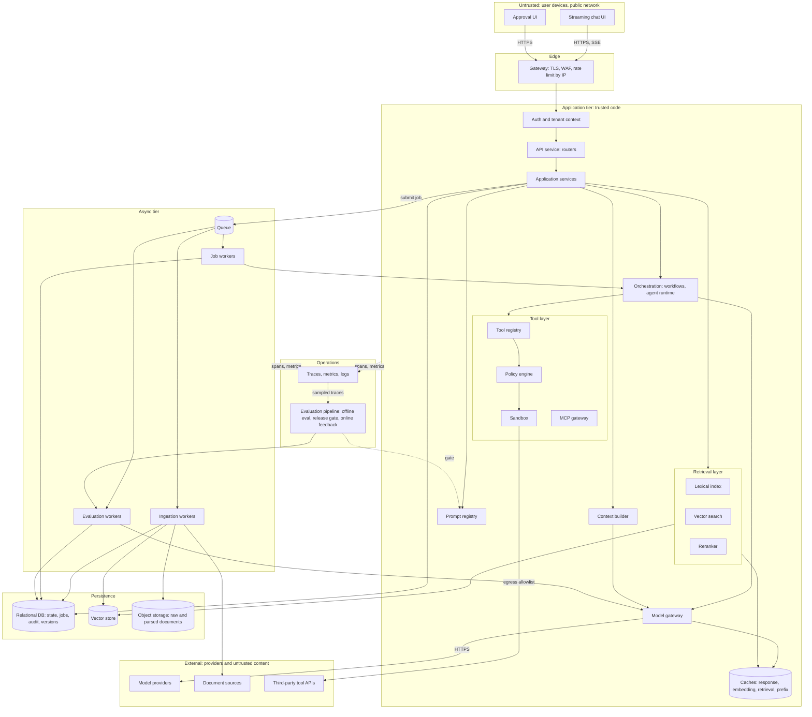
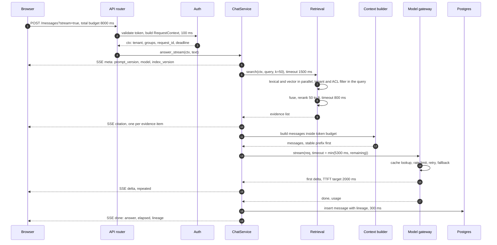
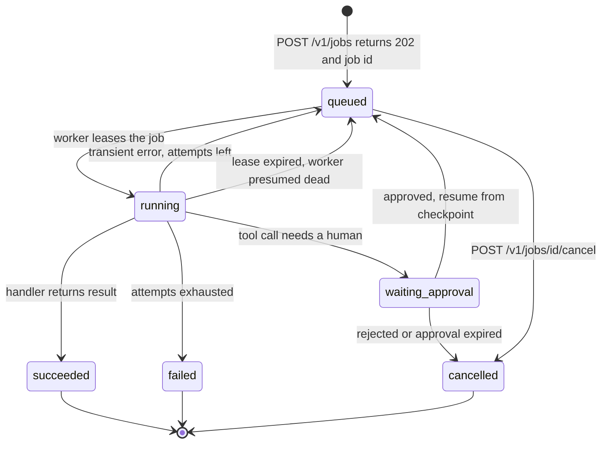
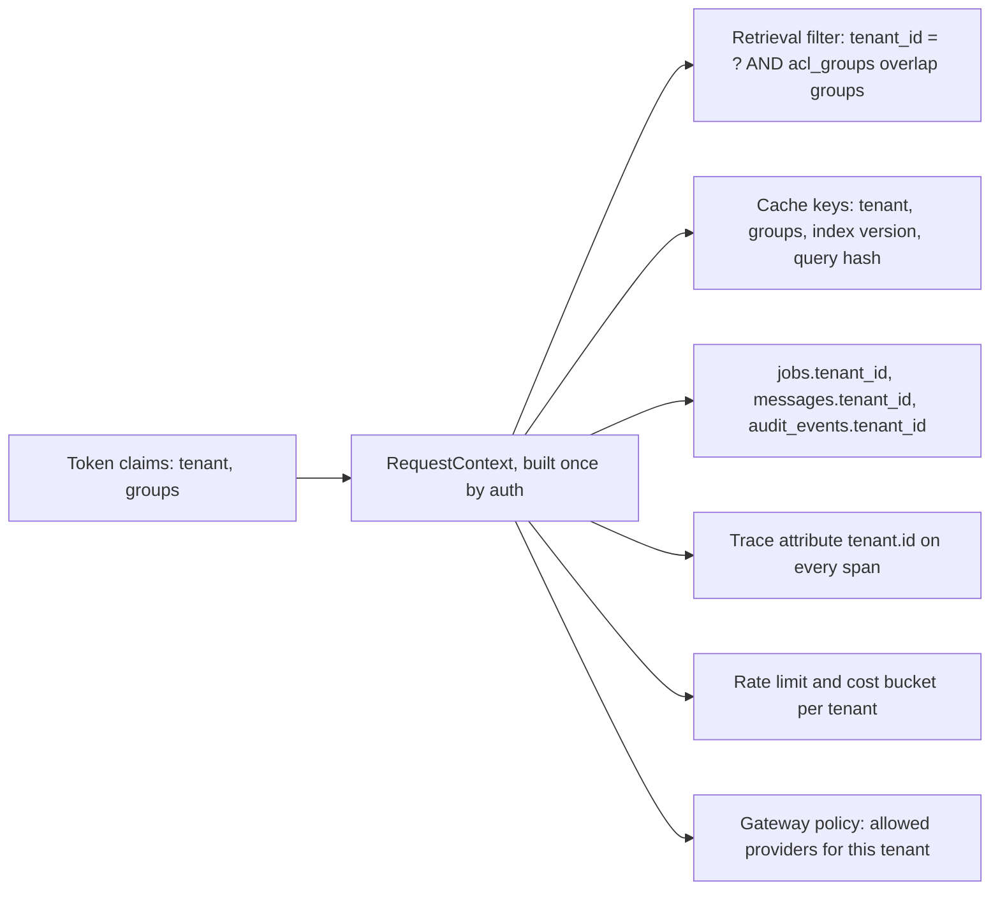
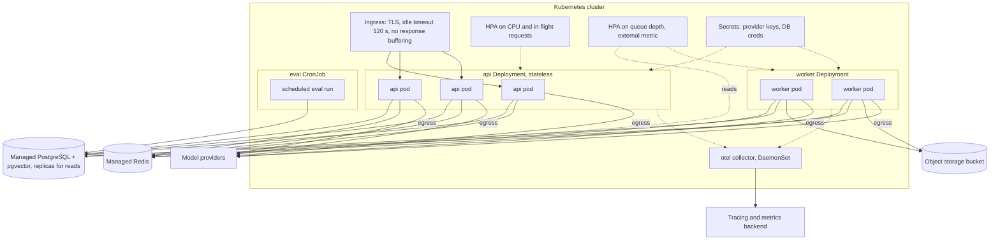

# Chapter 28 — AI Application Architecture

This chapter draws the whole system: every component between a user's keystroke and a grounded, audited, streamed answer, with the trust boundary, timeout and versions each one owes its neighbors. It is the map that Chapters 29 to 32 fill in with reliability, performance, observability and engineering practice.

**You will be able to:**

- Draw a reference architecture for an AI application and name, for every component, what it owns, its interface, what breaks without it, and the chapter that builds it.
- Split a request's latency target into per-stage timeouts carried by one budget, and emit versions and citations before the expensive work.
- Decide when a request becomes a job, and design the job protocol: `202` with an id, idempotent submission, leases, bounded retries, cancellation as a state.
- Place the tenant id so it cannot be lost: in the credential, the context object, retrieval filters, cache keys, every tenant-owned row and every span.
- Choose a transport per interaction (request/response, SSE, WebSocket, polling, webhook) and record the lineage that makes any answer reproducible.
- Sketch the development and production topology, and write architecture fitness tests that keep the layering from eroding.

**Prerequisites:** Chapter 3 (the `aie_core` model gateway), Chapters 12 and 15 (retrieval and production RAG), Chapter 16 (tool policy and approvals), and Chapter 26 (why untrusted text needs its own boundary). | **Code:** `book/projects/examples/ch28/` (run: `cd book/projects/examples/ch28 && pytest -q`) | **Builds:** a runnable FastAPI skeleton of the layering with in-memory adapters, a Docker Compose topology, and a relational schema for state and lineage.

**First reading:** Why this matters, Mental model, Core concepts, How it works, Data architecture and lineage, Implementation (up to the worker listing), Failure modes, and Before you ship. **Deep dives** (skip on a first pass): Transport choices, Deployment topology, Swapping the skeleton's adapters for the book's packages, Code walkthrough, Northwind Assist on the reference architecture, Production considerations, Tradeoffs, Evaluation and testing.

## Why this matters

Most AI applications begin as a script: a prompt, a provider call, a `print`. The script becomes an endpoint, which grows a retrieval step, which grows a cache, which grows a bug where one tenant sees another's cached answer. No single step was wrong. The system was never drawn, so nobody noticed that the cache key, the retrieval filter and the authorization check each had their own idea of who the user was.

An AI application is a distributed system with one expensive, slow, probabilistic dependency in the middle. Timeouts, idempotency, queues, versioning and observability all still apply. The model adds three things ordinary web architecture does not face:

- The dominant latency sits in a dependency you cannot speed up, so the architecture is built around a budget.
- Behavior changes without a code deploy (a new prompt, a re-embedded index, a provider's silent model update), so you record versions web applications never needed.
- Untrusted text can carry instructions, so trust boundaries run through the data path, not only around the network edge (Chapter 26).

This chapter makes the architectural decisions once, so each component can be built knowing what it owes its neighbors.

## Mental model

> **Mental model:** Production AI is primarily a systems-engineering problem. The model is one dependency among auth, API, queues, storage, retrieval, tools, observability, and UI.

Keep three images in mind.

**Every arrow is three things.** Each edge in the reference diagram carries a timeout (how long the caller waits), a version (the contract both sides agree on), and a trust decision (whether its data may carry instructions). Pick any arrow and ask for all three; a missing one marks where the next incident will likely start.

**Two tiers, two clocks.** The synchronous tier serves a waiting human under a deadline in seconds. The asynchronous tier serves unwatched jobs under a budget in attempts and cost. Ingestion or batch evaluation inside an HTTP handler is a bug even when it works.

**State lives in the database, not in the conversation.** The transcript is what the model saw. The application's facts (documents retrieved, tools approved, prompt version, job status) live in typed records with foreign keys to versions, which can be queried; the model can forget or misreport.

## Core concepts

### The reference architecture

The diagram shows a complete AI application for an internal assistant such as Northwind Assist. Boxes are components you write or configure; subgraphs mark deployment tiers and trust boundaries. Everything inside `Untrusted` can lie to you; everything inside `External` can lie to you and also go down.



Read it in three passes:

1. **The synchronous spine.** UI, gateway, auth, API and services, which fan out to prompts, context, retrieval and the model gateway, and write state to the database.
2. **The asynchronous loop.** Services submit jobs; workers ingest documents, run long orchestrations and score outputs.
3. **The operations plane**, dotted because it observes. Every tier emits spans; the evaluation pipeline consumes sampled traces and gates prompt releases.

The `Untrusted`/`Edge` line is the one every web application has. The `App`/`External` line is the one AI applications add: ingested documents and third-party tool results are data that may contain instructions, and on the tool side only the sandbox may reach outward (Chapter 27 on egress allowlists).

### Components: responsibility, interface, and what breaks without them

Each row gives what a component owns, its interface, what fails without it, and the chapter that builds it. Read "what breaks" as the test that proves the component is needed.

| Component | Owns | Interface | What breaks without it | Chapter |
|---|---|---|---|---|
| Streaming chat UI | Rendering partial output and citations; reconnecting a dropped stream | Typed SSE events; remembers the last event id | The user waits for the full completion | 39 |
| Approval UI | Showing a proposed side effect with its exact arguments; recording a decision bound to them | Approve or reject with the arguments hash | "Human in the loop" becomes a chat message the model can be tricked into answering (Ch 26) | 16, 38 |
| Gateway | TLS, coarse rate limits by network identity, size limits | Reverse proxy | One abusive client exhausts the model budget before any tenant quota applies | assumed |
| Auth and tenant context | Turning a credential into one `RequestContext` | A dependency every router calls first | Layers parse identity independently and drift | 27, 39 |
| API service | Routing, validation, status codes, SSE framing, disconnect handling; no business rules | Calls services with a context and typed inputs | Logic is untestable without HTTP and reimplemented for CLI, batch and eval | this chapter |
| Application services | The request path: budget, retrieval, context, model call, persistence with lineage | Methods taking `RequestContext`, returning typed results or event iterators | Nobody owns the timeout budget | this chapter, 32 |
| Prompt registry | Prompts as versioned, tested artifacts | `get(name) -> PromptVersion` | You cannot answer "which users got the bad prompt?" | 4 |
| Context builder | The model's input within a token budget, stable prefix first | `build(prompt, history, evidence, budget)` | Context fails on length, or evidence is cut from the middle | 5 |
| Retrieval layer | Ranked evidence, with tenant and ACL filter inside the search | `search(ctx, query, k) -> list[Evidence]` | Missed identifiers, noisy top results, or leaks from post-filtering | 12, 15 |
| Tool layer | Registry, policy engine, sandbox with egress allowlist, MCP gateway (Ch 18) | `propose(call)`, `execute(call)`, both audited | The model's proposal becomes the authorization | 16, 18, 27 |
| Orchestration | Workflows as state machines; the agent loop with budgets | `run(workflow_or_agent, inputs, ctx)`, checkpointed | Control flow lives in prompt text and cannot be tested or resumed | 17, 19, 38 |
| Model gateway | Retries, fallback, rate limits, response cache, cost accounting, spans | The `aie_core` `LLMClient` protocol | A provider incident becomes a retry storm | 3 |
| Persistence | Relational state, vectors, raw documents | SQL, filtered nearest-neighbor search, object keys | State dies with the process | 9, 11, 15 |
| Queue and workers | Accepting work separately from executing it | Submit, lease, ack or nack | Long work holds HTTP connections and dies on deploy | 29 |
| Caches | Response, embedding, retrieval, prefix | `get`/`set` on scoped keys | Repeated embedding and retrieval dominate cost | 30 |
| Observability | Spans per stage, metrics, redacted logs | An injected `Tracer`; correlation id in the context | A quality regression is invisible, then undebuggable | 31 |
| Evaluation pipeline | Datasets, evaluators, release gate, online sampling | Runs are jobs referencing the versions under test | Every prompt edit is an untested deploy | 24, 25 |

Five components hide a decision that is easy to get wrong.

**Auth and tenant context.** `RequestContext` carries tenant id, user id, groups, request id and, in production, the deadline (the skeleton keeps it in a separate `Budget`). Nothing below the router re-derives identity from headers, or the retrieval filter and cache key drift apart. Chapter 39 validates real JWTs.

**Application services and ports.** Services depend on ports (Protocols that describe what a service needs), never on adapters (the concrete implementations). That rule lets the request path run in tests with in-memory stubs and lets a later chapter swap an adapter without touching the service (Chapter 32).

**Persistence.** Three stores: the relational database for state, audit and version tables; the vector store (pgvector here) for embeddings; object storage for raw documents and parsed text, which are large, immutable and rarely read, and make re-parsing after a parser fix possible.

**Queue and workers.** Three pools, because load profiles differ: ingestion is bursty and I/O bound, job workers run long checkpointed orchestrations, evaluation workers are scheduled and delay tolerant. With one shared pool, an evaluation backlog delays a user's document from becoming searchable.

**Caches.** Four caches, four keys. Response cache: normalized request plus tenant and versions. Embedding cache: text hash plus embedding model. Retrieval cache: tenant, groups, index version and query hash. Prompt-prefix cache: the provider's, earned by keeping the prefix stable (Chapter 5). A key that misses any variable that changes the answer is the fastest way to leak data across tenants.

### Trust boundaries in the data path

Classic web security draws one boundary, outside versus inside. AI applications draw at least four, three of them through the application tier.

- **User boundary.** The classic one: request bodies are validated, identity is established, nothing else is trusted.
- **Content boundary.** Instructions versus data. Retrieved chunks, tool results and uploads enter the prompt as labeled data blocks (Chapter 4; Chapter 26 on why labeling is necessary but not sufficient). The context builder applies the labels; nothing else may concatenate untrusted text into the prompt.
- **Action boundary.** Proposing versus doing. The model emits a tool call, the policy engine decides, the sandbox executes; the model never holds a credential or reaches the network.
- **Provider boundary.** What leaves your network: prompts and any document text retrieved into them. Data-residency rules, PII redaction and the choice of a self-hosted model for sensitive tenants live at the model gateway (Chapters 27 and 34).

Chapter 26 counts five boundaries and Chapter 27 four valves; they name the same edges at different granularity.

| This chapter | Chapter 26 boundary | Chapter 27 valve | Enforcing component |
|---|---|---|---|
| User | User to application | Input valve | API validation, auth dependency |
| Content | Retrieval corpus to prompt (tool results re-enter here too) | Context valve | Context builder |
| Action | Model to tool; tool to external system | Tool valve | Policy engine, sandbox egress allowlist |
| Provider | No separate boundary | Input valve (secret and PII redaction before the call) | Model gateway (redaction, residency routing) |
| No separate boundary | No separate boundary | Output valve | Application services, before rendering or parsing |
| No separate boundary | Application to telemetry | Not a valve | `RedactingTracer` (Chapter 27) |

Whatever the names, every row needs one deterministic component that enforces it.

## How it works

### The synchronous request path

The request path is a fixed sequence of stages, each with a budget. The illustrative plan divides the 8-second completion target: 0.1 s auth, 1.5 s retrieval, 0.8 s reranking, 5.3 s model stream, 0.3 s persistence. Chapter 30 derives such numbers from measurements; here the point is that they exist and are enforced in code.



Four mechanisms make the budget real rather than decorative.

**The deadline is created once, then carried.** One budget starts at the service entry, and each stage gets the planned figure capped by whatever remains. A retrieval overrun stops at 1.5 seconds and ends the stream with an `error` event naming the stage, not a silent 30-second hang. If an untimed earlier step used 4 seconds, the model gets the 4 left, not its planned 5.3. The skeleton's `Budget` does this in one process; across processes the remaining time travels with the call (Chapter 29's `Deadline`).

**Metadata is emitted before the expensive work.** The `meta` event carries prompt version, model and index version before retrieval starts, so a dead stream still identifies its versions. Citations go out as soon as evidence is known.

**Timeouts are not targets.** The plan's figures are outer bounds that turn a failure into a fast, named error. A healthy request spends far less (illustrative): auth 20 ms, retrieval 250 ms, rerank 150 ms and model time to first token 1.1 s put the first token at about 1.5 s; 300 output tokens at 15 ms each add 4.5 s, for a completion near 6 s. A request that hits a stage timeout has already missed its p95 target, so alert on stage p95 against target, not on timeouts firing.

**Cancellation propagates.** When the browser closes the tab, the router notices on its next write and closes the service's generator, which cancels the model stream inside the gateway. Without this, an abandoned chat window keeps paying for tokens until the completion finishes.

### Streaming inside the request path

Streaming does not reduce total latency or cost; it moves the moment the user sees something from the end of the request to roughly the time to first token (Chapter 2 separates server-side TTFT from perceived wait).

The event vocabulary matters more than the transport: bare text deltas cannot carry citations or say whether the stream ended or was cut off. The skeleton uses five events:

- `meta`: versions and request id.
- `citation`: one per evidence item, before any text.
- `delta`: text, with an increasing id for `Last-Event-ID` resumption.
- `done`: full answer, elapsed time and lineage (a real gateway adds token usage).
- `error`: stage name and message.

The persisted message comes from the server's accumulated deltas, never from what the client reports; the client is untrusted and may have missed frames.

### The asynchronous job model

Ingesting a 400-page PDF, evaluating 2,000 cases, an agent run with 40 tool calls, anything that waits on a human approval: these exceed what a browser, a load balancer or a rolling deploy will hold open. The job model separates acceptance from execution.



The client submits and receives `202 Accepted` with a job id and a `Location` header, then follows progress by polling `GET /v1/jobs/{id}`, by SSE on `GET /v1/jobs/{id}/events` (for a waiting UI), or by a webhook to its `callback_url` (for machine clients).

Four properties make the model safe under real failure.

*Idempotent submission.* A repeated submission with the same `Idempotency-Key` and tenant returns the original job with `200` instead of a duplicate, so retrying a `POST` after a network error is safe.

*At-least-once execution with idempotent handlers.* A worker leases a job for a bounded time; if it dies, another worker takes the job when the lease expires. The handler may therefore run twice and must make the second run harmless (upsert by content hash, check for an existing side effect first).

*Bounded retries.* `attempts` and `max_attempts` bound the loop. Without them, a malformed payload is retried forever and poisons the queue.

*Cancellation as a state, not a signal.* Cancelling sets the state. A worker skips a cancelled job; one already running it re-reads the state when the handler finishes and keeps `cancelled`. Cancellation takes effect at the next checkpoint, since nothing can reliably interrupt a model call from outside.

**When a request becomes a job:** expected duration more than a few seconds beyond the model call, a human approval in the path, a side effect that must survive the client disconnecting, or a result needed later rather than now. Interactive chat stays synchronous even at 6 seconds, because the user is present and streaming makes the wait tolerable. A two-minute agent run becomes a job even with the user present, and the UI subscribes to its events.

### Multi-tenancy: where the tenant id flows

Northwind has two tenants, `retail` and `logistics`, and a zero cross-tenant leakage target. Tenancy is not a feature of one component; it is a value that must reach everything that stores, caches, retrieves or reports on data. The question is where it originates and how it travels.



Five placements follow, each with a test.

1. **It originates in the credential** and is copied into `RequestContext` once. Nothing reads it from an `X-Tenant-Id` header, a query parameter or the body. Test: `test_tenant_comes_from_the_token_not_from_headers` sends a `retail` token with `X-Tenant-Id: logistics` and gets retail evidence.
2. **It enters retrieval as a filter inside the query**, not a post-filter, so the index returns `k` permitted results (with pgvector, `WHERE tenant_id = $1 AND acl_groups && $2`; Chapter 15 owns retrieval authorization). Test: identical text under two tenants; each query returns only its own chunk.
3. **It is part of every cache key**, with the group set and the version of what is cached. A retrieval cache keyed on query alone returns tenant A's chunks to tenant B. Test: `test_retrieval_cache_key_includes_tenant_groups_and_index`.
4. **It is a column on every tenant-owned row**, denormalized onto `messages`, `chunks`, `jobs` and `audit_events` so row filters never depend on a join. Database row-level security is optional defense in depth; the application filter is mandatory.
5. **It is a span attribute**, so a leakage investigation can ask telemetry for every retrieval span whose returned chunk's tenant differed from the request's (Chapter 31).

Per-tenant namespaces versus a shared filtered index is Chapter 15's decision; the five placements apply either way.

## Architecture

### Data architecture and lineage

A web application's output depends on its code and database. An AI application's output also depends on at least seven artifacts that change on their own schedules, and a request you cannot reproduce is one you cannot debug.

| Artifact | Why it changes output | Version record | Referenced from |
|---|---|---|---|
| Prompt template | Wording, examples, output schema | `prompt_versions` (name, version, template hash) | `messages`, `evaluation_runs` |
| Chat model | Provider updates, pinning, fallback | `model_versions` (provider, model, kind) | `messages`, `evaluation_runs` |
| Embedding model | Changes the geometry of the whole index | `model_versions` with `kind = 'embedding'` | `index_versions` |
| Index build | Chunker config, embedding model, corpus snapshot | `index_versions` (status: building, active, retired) | `chunks`, `messages`, `evaluation_runs` |
| Tool schema | Argument names and constraints the model sees | `tool_schema_versions` (JSON Schema, side-effect class) | `audit_events`, `messages.tool_calls` |
| Policy | What is allowed, what needs approval | `policy_versions` (rules) | `messages`, `audit_events`, `evaluation_runs` |
| Evaluator | Rubric and judge model change what "pass" means | `evaluator_versions` (rubric hash, judge model) | `evaluation_runs` |

The rule: an assistant message row has foreign keys to the prompt, model, index and policy that produced it, plus the chunk ids it was shown; an evaluation run row has foreign keys to the versions under test. Lineage questions become SQL: which conversations got prompt version 3, whether the quality drop coincides with the index rebuild.

Documents need three levels:

- A **document** is the logical unit the user recognizes, with its ACL and a soft-delete flag.
- A **document version** is one parsed snapshot, identified by content hash so an unchanged document is never re-ingested.
- A **chunk** belongs to a document version *and* an index version, so two indexes built with different embedding models can coexist during a migration. The old index stays `active` until the new one passes evaluation, then becomes `retired` and its chunks are dropped.

Raw bytes and parsed text live in object storage by key; the database holds metadata and embeddings. The full schema is in `book/projects/examples/ch28/schema.sql` (six version tables, since chat and embedding models share `model_versions`). The excerpt shows the three tables that carry lineage, state and audit.

```sql
-- path: book/projects/examples/ch28/schema.sql (excerpt; full file on disk)
CREATE TABLE messages (
    id                 UUID PRIMARY KEY,
    conversation_id    UUID NOT NULL REFERENCES conversations(id) ON DELETE CASCADE,
    tenant_id          TEXT NOT NULL,            -- denormalized so row-level filters never join
    seq                INT  NOT NULL,            -- order inside the conversation
    role               TEXT NOT NULL CHECK (role IN ('system', 'user', 'assistant', 'tool')),
    content            TEXT NOT NULL,
    content_hash       TEXT NOT NULL,
    -- lineage: NULL for user messages, populated for assistant messages
    request_id         TEXT,
    trace_id           TEXT,
    prompt_version_id  BIGINT REFERENCES prompt_versions(id),
    model_version_id   BIGINT REFERENCES model_versions(id),
    index_version_id   BIGINT REFERENCES index_versions(id),
    policy_version_id  BIGINT REFERENCES policy_versions(id),
    evidence_chunk_ids UUID[] NOT NULL DEFAULT '{}',
    tool_calls         JSONB,                    -- [{name, args_hash, tool_schema_version_id, result_hash}]
    usage              JSONB,                    -- {input_tokens, output_tokens, cached_input_tokens, cost_usd}
    latency_ms         INT,
    created_at         TIMESTAMPTZ NOT NULL DEFAULT now(),
    UNIQUE (conversation_id, seq)
);

-- ---------------------------------------------------------------------- jobs ----

CREATE TABLE jobs (
    id              UUID PRIMARY KEY,
    tenant_id       TEXT NOT NULL,
    type            TEXT NOT NULL,               -- 'ingest_document' | 'evaluate' | 'agent_run'
    state           TEXT NOT NULL CHECK (state IN ('queued', 'running', 'waiting_approval',
                                                   'succeeded', 'failed', 'cancelled')),
    payload         JSONB NOT NULL,
    result          JSONB,
    error           TEXT,
    attempts        INT NOT NULL DEFAULT 0,
    max_attempts    INT NOT NULL DEFAULT 3,
    idempotency_key TEXT,
    callback_url    TEXT,
    leased_by       TEXT,                        -- worker instance id
    lease_until     TIMESTAMPTZ,                 -- expired lease => job is re-queued
    created_at      TIMESTAMPTZ NOT NULL DEFAULT now(),
    updated_at      TIMESTAMPTZ NOT NULL DEFAULT now(),
    UNIQUE (tenant_id, idempotency_key)
);

...

CREATE TABLE audit_events (
    id                     BIGSERIAL PRIMARY KEY,
    tenant_id              TEXT NOT NULL,
    actor_type             TEXT NOT NULL CHECK (actor_type IN ('user', 'system', 'agent', 'approver')),
    actor_id               TEXT NOT NULL,
    request_id             TEXT,
    conversation_id        UUID,
    job_id                 UUID,
    event_type             TEXT NOT NULL,        -- 'tool.proposed' | 'tool.approved' | 'tool.executed' |
                                                 -- 'policy.denied' | 'document.deleted' | 'prompt.released'
    tool_name              TEXT,
    tool_schema_version_id BIGINT REFERENCES tool_schema_versions(id),
    policy_version_id      BIGINT REFERENCES policy_versions(id),
    arguments_hash         TEXT,                 -- approval binds to these exact arguments
    payload                JSONB NOT NULL DEFAULT '{}',
    created_at             TIMESTAMPTZ NOT NULL DEFAULT now()
);

-- Hard rule, enforced in application code and by this constraint: no UPDATE/DELETE on audit.
CREATE RULE audit_events_no_update AS ON UPDATE TO audit_events DO INSTEAD NOTHING;
CREATE RULE audit_events_no_delete AS ON DELETE TO audit_events DO INSTEAD NOTHING;
```

The audit table is append-only, because an audit trail the application can edit is not an audit trail. `arguments_hash` binds a human approval to the exact arguments proposed; if the model re-proposes with different arguments, the approval does not carry over (Chapter 16).

### Transport choices

> **Deep dive.** Per-transport reconnect, backpressure, auth renewal and proxy behavior; skip on a first reading.

Choose the transport per interaction, not per application; the simplest one that fits the direction and latency need wins.

| Transport | Direction | Fits | Reconnect | Proxies and load balancers |
|---|---|---|---|---|
| HTTP request/response | Client to server, one reply | Submit job, approve, fetch history | Retry; writes need an idempotency key | Universal |
| Polling | Client asks repeatedly | Job status for machine clients | Trivial; server pays for empty polls | Universal |
| Long-polling | Client waits up to N seconds for a change | Status updates where SSE is blocked | Reissue after timeout or response | Works if idle timeouts exceed N |
| Server-Sent Events | Server to client over HTTP | Token streams, job event feeds, approval notifications | Built in: `EventSource` retries with `Last-Event-ID` | Buffering disabled, idle timeouts raised; HTTP/1.1 caps connections per host |
| WebSocket | Full duplex | Voice, collaborative editing, interactive agent sessions | You write reconnect, resume, heartbeat, flow control and token renewal | Needs upgrade support end to end; some corporate proxies block it |

Four operational details matter more than the table suggests.

*Reconnect.* The server can honor `Last-Event-ID` only if it kept the frames. For chat it accumulates the answer anyway to persist it, so a reconnect within a short window replays from the message row; after that the client fetches the persisted message.

*Backpressure.* On a slow link the socket buffer fills and the server's write blocks; a write timeout drops the client, who fetches the persisted answer. Pausing the model is rarely worth it, because it keeps billing.

*Auth renewal.* A streamed answer lives for seconds and a token for minutes, so chat is unaffected. A job feed open for an hour outlives the token; the server closes the feed when the token expires and the client reconnects with a fresh one, which SSE handles gracefully and WebSocket makes you design.

*Proxies.* Proxy buffering is why streaming works locally and not in staging. Set `Cache-Control: no-cache` and `X-Accel-Buffering: no` on every event stream, keep idle timeouts above your longest stream, and send a `: ping` heartbeat every 15 to 30 seconds on streams that may be silent.

**The decision rule.** Request/response for anything that completes in a second or two. SSE for anything the server pushes and the client only acknowledges: token streams and job events. WebSocket only when the client must send frequent messages during the session (voice frames, barge-in, live cursors). Polling or webhooks for machine clients that cannot hold connections. "The UI is real-time" is not a reason for WebSocket; most real-time UIs are one-directional.

### Deployment topology

> **Deep dive.** The development and production topologies and what to size first; skip on a first reading.

**Development.** Five containers run everything locally: API, worker (same image, different entry point), PostgreSQL with pgvector, Redis (queue, rate limits, caches) and an OpenTelemetry collector that prints spans. Object storage is a local directory.

**Production.** The shape stays the same; the properties change.



API pods are stateless: they scale on CPU and in-flight requests, and a rolling deploy cuts only streams on old pods, which clients reconnect. Needing sticky sessions means state leaked into process memory. Workers scale on queue depth up to a ceiling set by database write capacity and the provider's embedding rate limit, not CPU. Evaluation is a scheduled job. Data stores are managed services, secrets are mounted (never baked into images or manifests), and a network policy limits egress to provider endpoints, which is also where per-tenant residency is enforced. Production pins every image by version or digest.

Size two numbers first: the ingress idle timeout (above your longest stream, with heartbeats) and worker concurrency per pod (the provider's rate limit divided by pod count, since all pods share one quota). Chapter 29 covers admission control and backpressure; Chapter 34 covers serving a model inside the cluster.

## Implementation

The skeleton uses in-memory adapters so the layering is visible without infrastructure; owning chapters replace adapters without touching services.

```
book/projects/examples/ch28/
├── api_skeleton.py       routers -> application services -> ports -> adapters
├── test_ch28.py          offline request-path and job tests (fastapi TestClient)
├── reliability_bridge.py jobs table + Chapter 29 JobQueue and Worker
├── test_bridge.py        offline tests of the bridge (skipped without reliability)
├── test_hardening.py     edge cases (cancel, ownership, idempotency, egress)
├── schema.sql            versions, conversations, messages, jobs, documents, chunks, eval, audit
├── docker-compose.yml    api, worker, postgres+pgvector, redis, otel-collector
├── otel-collector.yaml   OTLP in, debug out, prompt text redacted
├── Dockerfile
├── requirements.txt
└── .env.example
```

| Variable | Purpose | Default |
|---|---|---|
| `LLM_PROVIDER`, `LLM_MODEL` | Provider and model for the gateway | `fake`, `fake-model` |
| `EMBEDDING_MODEL` | Embedding model recorded in index versions | `fake-embedding` |
| `OPENAI_API_KEY`, `ANTHROPIC_API_KEY` | Provider credentials, from `.env` only | empty |
| `POSTGRES_PASSWORD` | Database password, required by Compose | none: set it in `.env` |
| `DATABASE_URL` | PostgreSQL with pgvector | compose-internal URL |
| `REDIS_URL` | Queue, caches, rate limits | compose-internal URL |
| `OTEL_EXPORTER_OTLP_ENDPOINT` | Where spans go | collector in compose |
| `REQUEST_BUDGET_S` | Total synchronous budget | `8` |
| `WORKER_CONCURRENCY` | Jobs in flight per worker process | `2` |

Run the tests and the stack:

```bash
cd book/projects/examples/ch28
python -m pytest -q                    # offline, no network or API keys
cp .env.example .env                   # then set POSTGRES_PASSWORD
docker compose up --build              # api on :8000, collector prints spans
curl -N -H 'Authorization: Bearer alice@retail:all,hr' \
     -H 'Content-Type: application/json' -d '{"text":"annual leave policy"}' \
     'http://localhost:8000/v1/conversations/c1/messages?stream=true'
```

The Compose excerpt shows the architectural decisions: API and worker are one image with two entry points, workers scale by replica count, and Redis refuses to evict because it holds the queue.

```yaml
# path: book/projects/examples/ch28/docker-compose.yml (excerpt; full file on disk)
# Development topology for an AI application (Chapter 28).
#
#   api            stateless FastAPI process; serves HTTP and SSE
#   worker         same image, different entry point; drains the job queue
#   postgres       relational state + pgvector (conversations, jobs, chunks, audit)
#   redis          queue, rate-limit buckets, retrieval/embedding caches
#   otel-collector receives traces/metrics from api and worker, prints them
#
# Secrets come from .env (see .env.example). Nothing here is production-grade:
# no TLS, no replicas, no persistent backups. Production is sketched in the chapter.

name: northwind-assist-dev

services:
  api:
    build: .
    command: ["python", "api_skeleton.py"]
    # ...

  worker:
    build: .
    command: ["python", "api_skeleton.py", "worker"]
    # ...
    deploy:
      replicas: 1   # scale with: docker compose up --scale worker=3

  # ...

  redis:
    image: redis:7-alpine
    # noeviction: Redis holds the job queue, and an eviction policy would silently drop queued jobs.
    # A cache that may evict belongs in a separate instance.
    command: ["redis-server", "--maxmemory", "256mb", "--maxmemory-policy", "noeviction"]
    ports:
      - "127.0.0.1:6379:6379"
```

The skeleton is about 800 lines on disk. First the context and budget every stage receives; `test_budget_caps_stage_timeout_by_remaining_time` pins `stage_timeout`.

```python
# path: book/projects/examples/ch28/api_skeleton.py (excerpt; full file on disk)
@dataclass(frozen=True)
class RequestContext:
    # ...
    tenant_id: str
    user_id: str
    groups: tuple[str, ...]
    request_id: str


class Budget:
    # ...
    STAGE_PLAN_S: dict[str, float] = {
        "auth": 0.10,
        "retrieve": 1.50,
        "rerank": 0.80,
        "model_ttft": 2.00,
        "model_total": 5.30,
        "persist": 0.30,
    }

    def __init__(self, total_s: float, clock: Callable[[], float] = time.monotonic) -> None:
        self.total_s = total_s
        self._clock = clock
        self._start = clock()

    def remaining_s(self) -> float:
        return max(0.0, self.total_s - self.elapsed_s())

    def stage_timeout(self, stage: str) -> float:
        planned = self.STAGE_PLAN_S[stage]
        return max(0.0, min(planned, self.remaining_s()))
```

Then the ports, which the in-memory adapters (and later `aie_core`'s gateway, pgvector and Redis) satisfy.

```python
# path: book/projects/examples/ch28/api_skeleton.py (excerpt; full file on disk)
class ModelPort(Protocol):
    model_name: str

    def stream(self, system: str, user: str, evidence: list[Evidence]) -> AsyncIterator[str]: ...


class RetrieverPort(Protocol):
    embedding_model: str
    index_version: str

    async def search(self, ctx: RequestContext, query: str, k: int) -> list[Evidence]: ...


class PromptRegistryPort(Protocol):
    def get(self, name: str) -> PromptVersion: ...


class ConversationRepoPort(Protocol):
    def append(self, message: StoredMessage) -> None: ...

    def history(self, ctx: RequestContext, conversation_id: str) -> list[StoredMessage]: ...


class JobRepoPort(Protocol):
    def save(self, job: Job) -> None: ...

    def get(self, job_id: str) -> Job | None: ...

    def find_by_idempotency_key(self, tenant_id: str, key: str) -> Job | None: ...


class JobQueuePort(Protocol):
    def enqueue(self, job_id: str) -> None: ...

    def dequeue(self) -> str | None: ...

    def depth(self) -> int: ...
```

The chat service is the sequence diagram as one async generator of typed events. The elided `_retrieve` builds the cache key from tenant, groups, index version and query hash, then calls the retriever under the stage timeout.

```python
# path: book/projects/examples/ch28/api_skeleton.py (excerpt; full file on disk)
    async def answer_stream(
        self, ctx: RequestContext, conversation_id: str, text: str
    ) -> AsyncIterator[dict[str, Any]]:
        # ...
        budget = Budget(self.total_budget_s)
        prompt = self.prompts.get("assist.answer")
        # ... persist the user message (on disk)
        yield {
            "event": "meta",
            "data": {
                "request_id": ctx.request_id,
                "prompt_version": f"{prompt.name}@{prompt.version}",
                "model": self.model.model_name,
                "index_version": self.retriever.index_version,
            },
        }
        try:
            evidence = await self._retrieve(ctx, text, budget)
        except StageTimeout as exc:
            yield {"event": "error", "data": {"stage": exc.stage, "message": str(exc)}}
            return

        for ev in evidence:
            yield {"event": "citation", "data": {"chunk_id": ev.chunk_id, "document_id": ev.document_id}}

        parts: list[str] = []
        seq = 0
        try:
            async with asyncio.timeout(budget.stage_timeout("model_total")):
                async for delta in self.model.stream(prompt.system_text, text, evidence):
                    seq += 1
                    parts.append(delta)
                    yield {"event": "delta", "id": seq, "data": {"text": delta}}
        except TimeoutError:
            yield {"event": "error", "data": {"stage": "model_total", "message": "model exceeded its budget"}}
            return

        answer = "".join(parts)
        lineage = Lineage(
            prompt_name=prompt.name,
            prompt_version=prompt.version,
            model=self.model.model_name,
            embedding_model=self.retriever.embedding_model,
            index_version=self.retriever.index_version,
            policy_version=self.policy_version,
            evidence_chunk_ids=[e.chunk_id for e in evidence],
            request_id=ctx.request_id,
        )
        self.conversations.append(
            StoredMessage(
                id=str(uuid.uuid4()),
                conversation_id=conversation_id,
                tenant_id=ctx.tenant_id,
                user_id=ctx.user_id,
                role="assistant",
                content=answer,
                created_at=now_iso(),
                lineage=lineage,
            )
        )
        yield {
            "event": "done",
            "data": {"answer": answer, "elapsed_ms": round(budget.elapsed_s() * 1000, 1), "lineage": lineage.model_dump()},
        }
```

The router turns events into SSE frames and stops on disconnect; the same generator, drained, serves the non-streaming variant.

```python
# path: book/projects/examples/ch28/api_skeleton.py (excerpt; full file on disk)
def sse(event: str, data: dict[str, Any], event_id: int | None = None) -> str:
    head = f"id: {event_id}\n" if event_id is not None else ""
    return f"{head}event: {event}\ndata: {json.dumps(data, separators=(',', ':'))}\n\n"

    # ...
    @app.post("/v1/conversations/{conversation_id}/messages")
    async def post_message(
        conversation_id: str,
        body: MessageIn,
        request: Request,
        ctx: RequestContext = Depends(request_context),
        stream: bool = False,
    ) -> Response:
        events = chat.answer_stream(ctx, conversation_id, body.text)
        if stream:

            async def body_iter() -> AsyncIterator[str]:
                try:
                    async for ev in events:
                        if await request.is_disconnected():
                            break  # client went away: stop generating
                        yield sse(ev["event"], ev["data"], ev.get("id"))
                finally:
                    await events.aclose()  # closing the generator cancels the model stream now, not at GC

            return StreamingResponse(
                body_iter(),
                media_type="text/event-stream",
                headers={"Cache-Control": "no-cache", "X-Accel-Buffering": "no", "X-Request-Id": ctx.request_id},
            )

        final: dict[str, Any] | None = None
        async for ev in events:
            if ev["event"] == "error":
                raise HTTPException(status.HTTP_504_GATEWAY_TIMEOUT, ev["data"])
            if ev["event"] == "done":
                final = ev["data"]
        assert final is not None
        return Response(
            content=json.dumps(final), media_type="application/json", headers={"X-Request-Id": ctx.request_id}
        )
```

Finally the worker: the whole job model in about thirty lines. The test harness calls `run_once` directly, which makes failure sequences deterministic.

```python
# path: book/projects/examples/ch28/api_skeleton.py (excerpt; full file on disk)
    async def run_once(self) -> Job | None:
        job_id = self.queue.dequeue()
        if job_id is None:
            return None
        job = self.repo.get(job_id)
        if job is None or job.state is JobState.CANCELLED:
            return job
        job.state = JobState.RUNNING
        job.attempts += 1
        self.repo.save(job)
        try:
            handler = self.handlers[job.type]
            result = await handler(job)
            if self._cancelled(job.id):
                return self.repo.get(job.id)   # cancellation is a state: do not overwrite it
            job.result, job.state = result, JobState.SUCCEEDED
        except Exception as exc:  # noqa: BLE001 - the worker is the last line of defense
            if self._cancelled(job.id):
                return self.repo.get(job.id)
            job.error = f"{type(exc).__name__}: {exc}"
            if job.attempts < job.max_attempts:
                job.state = JobState.QUEUED
                self.queue.enqueue(job.id)
            else:
                job.state = JobState.FAILED
        self.repo.save(job)
        if job.state in TERMINAL_STATES and job.callback_url:
            await self.webhook.notify(job.callback_url, {"job_id": job.id, "state": job.state.value})
        return job

    def _cancelled(self, job_id: str) -> bool:
        current = self.repo.get(job_id)
        return current is not None and current.state is JobState.CANCELLED
```

### Swapping the skeleton's adapters for the book's packages

> **Deep dive.** Which package replaces each port, and how the job port bridges to Chapter 29's queue; skip on a first reading.

The skeleton's ports are deliberately small. Each has a production implementation elsewhere in the book, usually behind a thin adapter because the package's interface is richer than the port.

| Skeleton port or gap | Production implementation | What the adapter does |
|---|---|---|
| `ModelPort.stream` | `aie_core` `ModelGateway.astream` (Chapter 3), messages from Chapter 5's `ContextBuilder` | sets `timeout_s` from the budget; maps an `error` event to the stage error |
| `RetrieverPort.search` | `ragkit.retrieval.RetrievalPipeline` (Chapter 12) | maps `RequestContext` to a `Principal` and `ScoredChunk` to `Evidence` |
| `PromptRegistryPort.get` | Chapter 4's `PromptRegistry` | returns the active version for lineage |
| `RetrievalCachePort` | Chapter 30's `RetrievalCache` with a `Scope` | adds the ACL-scope hash and retriever configuration to the key |
| `JobQueuePort` and `Worker` | `reliability.JobQueue` and `Worker` (Chapter 29) | `reliability_bridge.py`, below |
| no tool port yet | `toolkit` `ToolRegistry`, `PolicyEngine`, `ToolExecutor` (Chapter 16) | the action boundary |
| no orchestration port yet | Chapter 17's workflows, `agentkit.AgentRuntime` (Chapter 19), Chapter 38's `DurableRunner` | agent runs become jobs whose events stream to the UI |
| no guardrail port yet | `guardrails.GuardrailPipeline` (Chapter 27) | checks at the four valves |
| no tracer yet | Chapter 31's `AITracer` or `OTelAITracer` | one tracer per request, passed to every component |
| no admission control yet | `reliability.AdmissionController`, `DegradePolicy` (Chapter 29) | decides at the door, before `ChatService` spends anything |

The job port is not a drop-in. `JobQueuePort` moves bare job ids, while Chapter 29's queue owns delivery state (a `Lease` to ack or nack, backoff, dead letters) that a bare `dequeue` cannot express. `reliability_bridge.py` therefore keeps the jobs table as the record the API shows, implements only submission and refuses `dequeue`, and lets Chapter 29's `Worker` run a handler that mirrors each attempt into the jobs table.

```python
# path: book/projects/examples/ch28/reliability_bridge.py  (excerpt; full file on disk)
class ReliabilityJobQueue:
    """Submission side of Chapter 28's ``JobQueuePort``, backed by a ``reliability.JobQueue``."""

    def __init__(self, queue: JobQueue, repo: JobRepoPort) -> None:
        self.queue = queue
        self.repo = repo

    def enqueue(self, job_id: str) -> None:
        job = self.repo.get(job_id)
        # The repo's job id is the delivery idempotency key: enqueueing one job twice delivers it once.
        self.queue.enqueue(
            KIND,
            {"job_id": job_id},
            idempotency_key=job_id,
            tenant_id=job.tenant_id if job else None,
            max_attempts=job.max_attempts if job else 3,
        )

    def dequeue(self) -> str | None:
        raise NotImplementedError(
            "delivery goes through reliability.Worker: a bare dequeue can be neither leased nor acked"
        )
```

```python
# path: book/projects/examples/ch28/reliability_bridge.py  (excerpt: the handler bridge_handler returns)
    def handle(delivery: DeliveryJob, ctx: JobContext) -> Any:
        job = repo.get(str(delivery.payload.get("job_id")))
        if job is None:
            raise PermanentJobError(f"job {delivery.payload.get('job_id')} is not in the jobs table")
        if job.state in TERMINAL_STATES:
            # Cancelled before delivery, or a redelivery after success: ack without running again.
            return {"skipped": job.state.value}
        job.state = JobState.RUNNING
        job.attempts = delivery.attempts
        repo.save(job)
        try:
            # Bound the run by the delivery's deadline, so a hung handler cannot outlive its lease
            # and be leased (and run) a second time alongside itself. Work that finished is recorded
            # even if a shutdown arrived meanwhile: discarding it would only force a rerun.
            result = asyncio.run(asyncio.wait_for(handlers[job.type](job), timeout=ctx.deadline.remaining()))
        except Exception as exc:
            current = repo.get(job.id)
            if current is not None and current.state is JobState.CANCELLED:
                raise PermanentJobError(f"job {job.id} was cancelled while running") from exc
            job.error = f"{type(exc).__name__}: {exc}"
            final = not classify(exc) or delivery.attempts >= delivery.max_attempts
            job.state = JobState.FAILED if final else JobState.QUEUED
            repo.save(job)
            _notify(webhook, job)
            raise
        current = repo.get(job.id)
        if current is not None and current.state is JobState.CANCELLED:
            return {"cancelled_during_run": True}  # cancellation is a state: do not overwrite it
        job.result, job.state = result, JobState.SUCCEEDED
        repo.save(job)
        _notify(webhook, job)
        return result
```

Two consequences follow. A missing-payload `ValueError` is classified deterministic and dead-lettered after one attempt instead of three, the better behavior for a payload that will never parse. And a worker that crashes on the final attempt never reaches the wrapper's `except`, leaving the jobs table at `running`; run `reconcile_dead_letters` on a schedule to mark such rows `failed`, and alert on what it returns.

## Code walkthrough

> **Deep dive.** How `build_app` wires the layers and what the skeleton leaves out; skip on a first reading.

`build_app` (on disk) is the only place that constructs adapters: a real deployment swaps in a pgvector hybrid retriever (Chapter 12) and `aie_core`'s `ModelGateway` (Chapter 3) there, and the tests pass a `FakeModel` and a `RecordingWebhook`. `request_context` is the only function that reads identity headers. `JobService.get` returns `None` for another tenant's job, so the router answers `404` for missing and foreign jobs alike and never confirms a job exists.

The skeleton leaves out what later chapters own: no `ContextBuilder`, because the fake model takes raw strings (Chapter 5), and no policy engine, because the chat path has no tools (Chapter 16). With in-memory adapters the queue is a `deque` inside the API process, so the Compose `worker` container runs but receives no work. The topology becomes functional when the jobs table moves to PostgreSQL and delivery to Chapter 29's `RedisJobQueue` through `reliability_bridge.py`.

## Northwind Assist on the reference architecture

> **Deep dive.** Every box filled in with Northwind's concrete components; skip on a first reading.

- **Frontend:** a streaming chat page with an approvals panel; a proposed `send_reply` shows its draft and recipient with buttons bound to the arguments hash (Chapter 39).
- **Auth:** Northwind's SSO token supplies tenant (`retail` or `logistics`) and groups (`all`, `hr`, `it-oncall`).
- **Application services:** `ChatService` for grounded answers, `ExtractionService` for invoices and tickets (Project 1), `AgentService` for incident research (Project 5), which always runs as a job.
- **Prompt registry:** `assist.answer`, `ticket.extract`, `incident.plan`, `incident.report`, each with golden tests (Chapter 4).
- **Retrieval:** Project 3's hybrid index over policies, runbooks, product docs, incident reports and tickets, filtered by tenant and `acl_groups`.
- **Tools:** four reads with no approval (`lookup_employee`, `search_tickets`, `get_service_status`, and `query_metrics` on a read-only connection); two reversible writes with idempotency keys (`create_ticket`, `draft_reply`); and `send_reply`, irreversible, so its job always enters `waiting_approval` and resumes from its checkpoint.
- **Orchestration:** extraction as a deterministic workflow, incident research as an agent with a step budget and a Definition of Done (Chapters 17, 19, 20).
- **Workers:** ingestion when an intranet policy changes, agent runs, nightly evaluation.
- **Observability and evaluation:** spans tagged with tenant, versions and cost; latency sliced by tenant against the 2 and 8 second targets; releases gated on Chapter 14's gold set and Chapter 25's trajectory suite; 1 percent of answers sent to a groundedness judge.

## Production considerations

> **Deep dive.** Cost attribution, cache placement and release operations beyond the checklist; skip on a first reading.

**Latency.** Run the lexical and vector legs concurrently and rerank only the fused top candidates. In provider incidents watch the gateway's time to first token; it rises first.

**Cost.** Every component that calls a provider records usage on the row it produced, so cost per task is a `SUM` over `messages.usage` and `evaluation_runs.summary` by tenant and day (Chapter 30). The embedding cache saves most in ingestion, the retrieval cache most in chat, and the response cache least, with the most correctness risk.

**Operations.** Index and prompt releases follow a `building`, `active`, `retired` lifecycle; rollback means pointing the active version back, which is why versions are rows. A provider change is a model version row plus an evaluation run. Dashboards show queue depth and lease age, because a backlog is invisible in HTTP metrics. Runbooks list degraded modes as flags: disable reranking, reduce `k`, switch to the fallback model, answer from cache (Chapter 29).

## Common mistakes

Each is an architectural choice rather than a line-level bug, which is why it survives code review.

**The monolithic prompt script.** One function builds a prompt with retrieval, policy and formatting inside, calls the provider and parses. No stage can be tested or swapped alone, and a regression cannot be localized to one of its stages because there is one span.

**Model calls from the frontend.** The browser holds the provider key (or a thin proxy that forwards anything). There is no place for the tenant filter, policy engine, budget or audit record, and the key leaks the first time someone opens developer tools. The frontend speaks only your API.

**Business logic inside prompts.** "Premium tier gets a 20 percent refund, others 10 percent" in the system prompt: a rule change becomes an untested prompt change, applied probabilistically. Deterministic rules live in code; the prompt is told the result.

**State only in the conversation transcript.** Approvals and retrieved documents are inferred from earlier messages, so the model can be convinced approval was granted and compaction can drop the fact. State lives in typed records: `messages.evidence_chunk_ids`, `audit_events`, `jobs.state`.

**Long work in the request.** A 40-step agent inside an HTTP handler "because it usually finishes", until a deploy kills it or a load balancer times it out at 60 seconds. Long work becomes a job.

## Failure modes

| Failure | How it shows in telemetry | How to test for it |
|---|---|---|
| Retrieval overruns and starves the model | Retrieval span near its timeout; short model span; `error` events with `stage=retrieve` | Inject a slow retriever; assert a stage-named error inside the total budget |
| Stream disconnect leaves cost running | Model spans outliving their request span; usage on messages never marked `done` | Close the client mid-stream; assert the model stream is cancelled |
| Proxy buffers SSE | Client time to first token equals completion time; server-side TTFT normal | Synthetic client behind the real ingress measuring first-byte time |
| Duplicate job execution after worker crash | Two `running` transitions for one job; duplicate side effects in `audit_events` | Kill a worker mid-handler; assert the rerun is a no-op by content hash |
| Poison job retried forever | A job id cycling `queued` to `running`; depth never reaches zero | Submit a malformed payload; assert `failed` after `max_attempts` |
| Cache leak across tenants | Retrieval spans where `chunk.tenant_id` differs from `request.tenant_id` | Same query under two tenants with a warm cache; assert disjoint chunk ids |
| Version drift (provider updates a model under a fixed name) | Quality drops with no change in prompt, index or git SHA | Scheduled evaluation against the pinned model; alert on delta |
| Approval replayed with different arguments | `tool.executed` whose `arguments_hash` has no matching `tool.approved` | Re-propose with changed arguments after approval; assert denial |
| Index activated without gate | `index_versions.status` becomes `active` with no `evaluation_runs` row for it | Release script asserts a passing run exists before activation |
| Worker pool starved by one job type | `ingest_document` depth high, `evaluate` zero, evaluation workers idle | Mixed-backlog load test; assert `evaluate` jobs keep completing |

## Tradeoffs

> **Deep dive.** Four architectural choices and when each side wins; skip on a first reading.

**One database or three.** PostgreSQL with pgvector means one backup, one pool and transactional writes of chunks with embeddings, at the cost of vector throughput and build time at tens of millions of vectors. Use one database until measurements say otherwise (Chapter 9).

**Streaming or not.** Streaming costs event design, reconnect handling and proxy configuration, and buys perceived latency. Stream any interaction with a waiting human and a completion over about two seconds; do not stream for batch and machine clients.

**Synchronous evaluation gate or asynchronous.** A blocking CI gate slows iteration to the eval's duration; an asynchronous one releases and alerts, faster and riskier. Block for prompts and indexes on the main path.

**Framework or primitives.** A framework pre-wires many of these boxes and hides the seams, which matters exactly when a seam is where the bug is. Chapter 23 maps framework concepts onto these primitives.

## Evaluation and testing

> **Deep dive.** Contract tests per port, fitness tests and the lineage drill; skip on a first reading.

Architecture is tested at three levels.

**Contract tests per port.** Every adapter runs its in-memory stub's suite: the pgvector retriever must pass `InMemoryRetriever`'s tenant-isolation test. Where an adapter changes semantics on purpose, as the bridge does for deterministic failures, the test states the new behavior. In pytest this is a parametrized fixture over adapter factories, with infrastructure-backed ones marked `integration`.

**Request-path tests with fakes.** `test_ch28.py` and `test_hardening.py` turn this chapter's claims into tests.

**Architecture fitness tests.** They test that the architecture has not quietly eroded, not behavior:

- Application-service modules import nothing from adapter modules (an import-linter rule; for the single-file skeleton, exercise P4's `ast` check).
- Route handlers import no provider SDK.
- Every tenant-owned table has a `tenant_id` column (query `information_schema.columns`).
- In staging, every span under a request carries `tenant.id` and `prompt.version`.

Finally, a drill: pick yesterday's message id and time how long it takes to produce its versions, evidence chunks, tool calls with approvals, cost and trace. One SQL query and one trace link means the data architecture works.

## Before you ship

- [ ] Every edge in the architecture diagram has a written timeout, a contract version and a trust decision; reviewers can point to each.
- [ ] One request budget is created at the service entry, every stage timeout is the planned figure capped by the remaining time, and a test with a slow retriever asserts a stage-named `error` event inside the total.
- [ ] Remaining time crosses process boundaries (header or job field), and stage p95 latency is alerted against its allowance, not on timeouts firing.
- [ ] Closing the client mid-stream cancels the model call; a test asserts no further usage is recorded.
- [ ] Every event stream sets `Cache-Control: no-cache` and `X-Accel-Buffering: no`, silent streams send a heartbeat every 15 to 30 seconds, and a synthetic client behind the real ingress measures time-to-first-byte.
- [ ] The tenant id is read only from the verified credential; a test sends a conflicting `X-Tenant-Id` header and is served under the token's tenant.
- [ ] Retrieval filters on tenant and groups inside the query, and every cache key includes tenant, groups and the version of what is cached, each pinned by a test.
- [ ] Every tenant-owned table has a `tenant_id` column (checked against `information_schema.columns` in CI) and every span carries `tenant.id` and `prompt.version`.
- [ ] Each assistant message row references its prompt, model, index and policy versions and lists its evidence chunk ids; the lineage drill for a random message takes one query and one trace link.
- [ ] Job submission honors `Idempotency-Key` per tenant, handlers are idempotent under redelivery, `max_attempts` is bounded, cancellation is a state that a finishing worker does not overwrite, and dead-lettered jobs are reconciled into the jobs table.
- [ ] `callback_url` accepts only public HTTPS hosts and is re-checked at delivery; job payloads have a size limit.
- [ ] The Redis instance that holds the queue runs with `noeviction`, production images are pinned by version or digest, and index or prompt activation requires a passing evaluation run that references it.

## Exercises

**Start here:** K1, K3, E2, P1, D2 (about 4 hours). The rest go deeper.

### Knowledge questions

**K1.** Name the four trust boundaries in an AI application's data path, the component that enforces each, and one attack that crosses each if the component is missing.

**K2.** The sequence diagram reserves 1.5 seconds for retrieval and 5.3 seconds for the model stream inside an 8-second total. Explain why `Budget.stage_timeout` returns the planned figure capped by remaining time rather than simply the remaining time, and what would go wrong if it returned only the planned figure or only the remaining time.

**K3.** List the seven artifacts that must be versioned to reproduce an answer, and for each say which table references it. Which of them can change without any deploy on your side?

**K4.** Under what conditions can a Server-Sent Events client actually resume after reconnecting with `Last-Event-ID`? What must the server have done, and what is the pragmatic alternative for a chat answer?

**K5.** Why does `JobService.get` return `404` for a job owned by another tenant instead of `403`? What information would `403` leak?

**K6.** State the decision rule for request/response versus SSE versus WebSocket versus polling in two sentences, and give one interaction in Northwind Assist for each.

### Engineering questions

**E1.** Northwind adds a third tenant with strict data-residency rules: its documents and prompts may not leave a specific region. Which components of the reference architecture change, which tables gain a column or a row, and where does the per-tenant provider decision live?

**E2.** The embedding model is being replaced. Design the migration using `index_versions` and `chunks`: which states does the new index pass through, what runs in the workers, which evaluation gates activation, and how is retrieval routed during the overlap? What is the storage cost of the overlap?

**E3.** A product manager asks for "live typing indicators and the ability to interrupt the assistant mid-answer". Decide whether this requires WebSocket. Specify the transport per feature and the server-side changes to cancellation.

**E4.** The worker pool is one deployment with one queue. Ingestion bursts delay agent jobs by minutes. Redesign the async tier: how many queues or pools, what each scales on, and what metric tells you the redesign worked.

### Practical exercises

**P1.** (about 3 hours) Replace `InMemoryJobQueue` and `InMemoryJobRepo` in the skeleton with SQLite-backed adapters (standard library only) that implement leasing with `lease_until`, so that a job whose lease has expired is returned to `queued`. Make the existing tests pass unchanged and add one that simulates a dead worker.

**P2.** (about 90 min) Add a `ContextBuilderPort` to the skeleton and an in-memory adapter that enforces a token budget (use a word count as the token estimate) with the order: system prompt, history, evidence. Emit a `context` SSE event with the number of evidence items that fit and the number dropped. Test that dropping happens from the lowest-scored evidence.

**P3.** (about 60 min) Implement `GET /v1/conversations/{id}/messages/{message_id}/lineage` that returns the stored lineage plus a synthesized "reproduce" payload: prompt version, model, index version, and chunk ids. Write a test that the payload for two tenants' messages with the same conversation id never crosses.

**P4.** (about 45 min) Write an architecture fitness test: parse `api_skeleton.py` with the `ast` module and fail if any function defined under the routers section references a name from the adapters section directly (not via `build_app`). Document the rule in a comment at the top of the test.

### Debugging exercises

**D1.** After a deploy, p95 time-to-first-token measured in the browser jumps from 1.4 seconds to 7.9 seconds, while the server-side `model.ttft_ms` attribute is unchanged at about 1.1 seconds and total completion is unchanged. The deploy included a new ingress controller version. Diagnose, and name the single header or setting you would check first.

**D2.** A support engineer reports that a `logistics` user saw a leave-policy answer stating "25 days per year, carry over up to 5 days", which is the `retail` policy. Traces show the retrieval span for that request returned chunk `ret-pol-001` with `request.tenant_id=logistics`, and the span has `cache.hit=true`. The retrieval query itself, when replayed, returns only `log-pol-001`. Name the root cause and the two lines of code to inspect.

**D3.** Nightly, the `ingest_document` queue depth climbs to about 4,000 and never returns to zero, and the same 12 job ids appear in worker logs every few seconds with `state=running`. Workers are healthy and other job types complete. Explain the mechanism, name the two fields on the jobs table that should have prevented it, and say what you would change.

## Key takeaways

- An AI application is a distributed system with one expensive, probabilistic dependency; draw it once, with every edge carrying a timeout, a version, and a trust decision.
- The synchronous tier serves a waiting human under a per-stage budget carried in the request context; the asynchronous tier serves jobs under attempts and cost. Work on the wrong clock is an architectural bug.
- The request path emits versions before the expensive work, citations before text, and a terminal `done` or `error` event; the persisted answer comes from the server's accumulation, never from the client.
- Jobs are accepted with `202` and an id, executed at least once by idempotent handlers under bounded retries and leases, cancelled by state, and observed by polling, SSE, or webhook.
- Seven artifacts determine an answer beyond code: prompt, model, embedding model, index, tool schema, policy, evaluator. Each is a row; messages and evaluation runs hold foreign keys to them.
- The tenant id originates in the credential, lives in one context object, and reaches retrieval filters, cache keys, every tenant-owned row, and every span. Each placement has a test.
- Choose transports per interaction: request/response for short operations, SSE for anything the server pushes one way, WebSocket only when the client also streams, polling or webhooks for machine clients.
- Trust boundaries run through the data path: validation at the API, labeling in the context builder, policy and sandbox in the tool layer, redaction and residency at the gateway.
- Development is five containers; production is the same shape with stateless API pods, workers scaled on queue depth, managed data stores, mounted secrets, and egress limited to providers.
- The anti-patterns to refuse are the monolithic prompt script, model calls from the frontend, business rules inside prompts, state only in the transcript, and long work inside a request.

## Further reading

- **Kleppmann, *Designing Data-Intensive Applications*.** Queues, idempotence, delivery guarantees and derived data: the theory behind this chapter's job model and lineage tables.
- **Sculley et al., *Hidden Technical Debt in Machine Learning Systems*.** The short argument for why the model is the small box in the diagram and the surrounding system is where the work is.
- **Dean and Barroso, *The Tail at Scale*.** Why per-stage budgets and tail latency, not averages, decide whether a fan-out request path meets its target.
- **Nygard, *Release It!*** Timeouts, bulkheads and stability anti-patterns, the vocabulary behind the stage budget and separate worker pools.
- **Server-sent events, HTML Living Standard.** The normative wording for event ids, `Last-Event-ID` and reconnection that the streaming design relies on.
