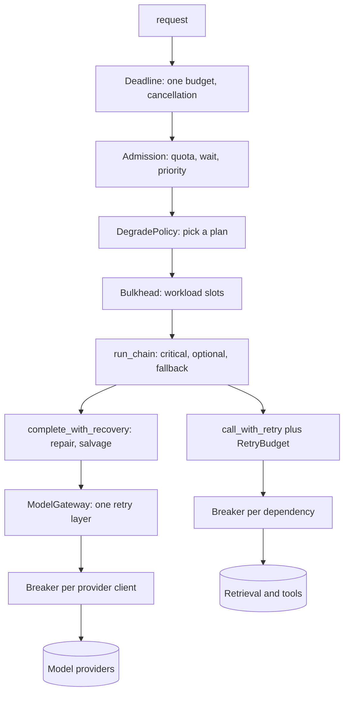
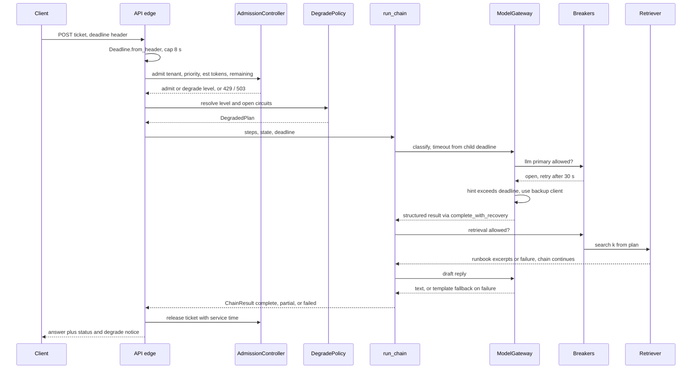
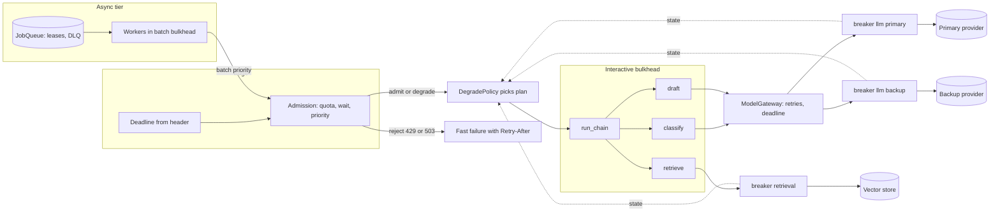
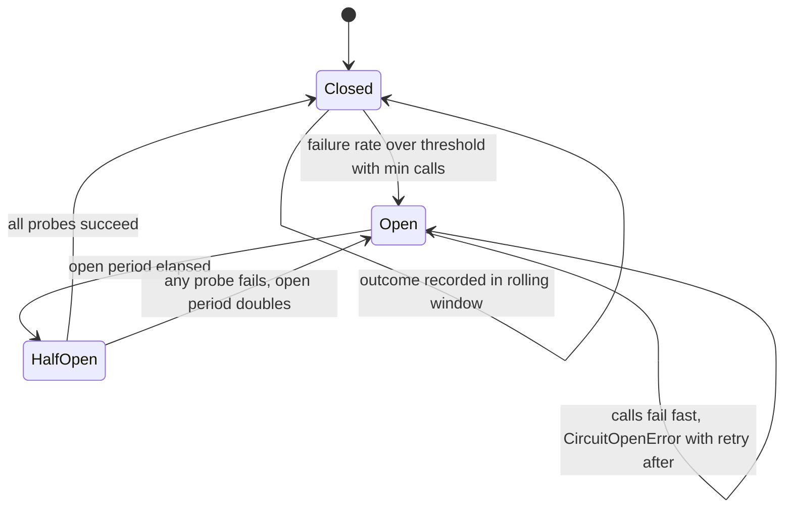
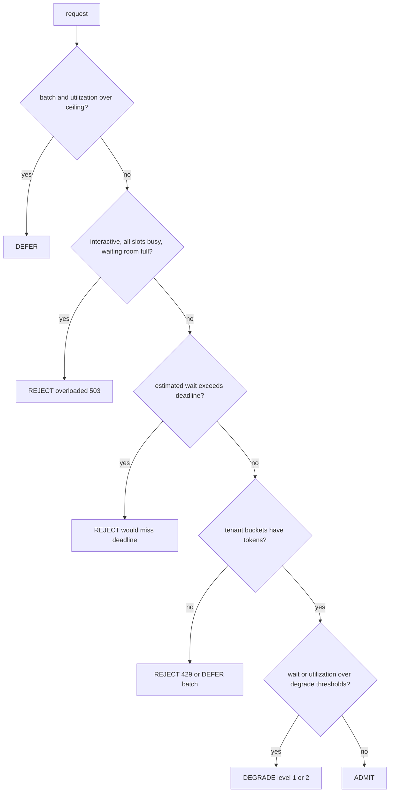

# Chapter 29 — Reliability and Scalability

An AI service fails in more ways than an ordinary web service, because its main dependency is slow, expensive per call, and sometimes returns well-formed garbage. This chapter turns the single-call reliability of Chapter 3 into system-level reliability: budgets, failure domains, overload control, durable background work, and tests that prove the whole thing behaves under injected faults.

**You will be able to:**
- State SLOs for an AI service (availability, time to first token, latency, task success, degraded share) and turn them into error budgets and burn-rate alerts.
- Carry one deadline from the edge through every stage, and contain retry amplification with a single retrying layer and a shared retry budget.
- Isolate failing dependencies with circuit breakers and noisy workloads with bulkheads, and recover usable results from malformed model output.
- Shed load at the door with admission control, per-tenant quotas, and estimated wait, and degrade along pre-tested plans instead of improvising.
- Run long work on a leased job queue with idempotent workers, dead letters, and graceful shutdown.
- Prove all of it with chaos tests that assert invariants, contract tests across queue adapters, and load tests past the knee.

**Prerequisites:** Chapters 3 and 28 (the `ModelGateway`, `RetryPolicy`, and error taxonomy; the job model and ports). | **Code:** `book/projects/reliability/` (run: `cd book/projects/reliability && python -m pytest -q`) | **Builds:** the `reliability` package: deadlines, retry budgets, hedging, circuit breakers, bulkheads, admission control, degradation plans, malformed-output recovery, a partial-failure chain runner, a job queue and worker, SLO arithmetic, and a fault injector, tied together by a Northwind Assist ticket-triage chain.

**First reading:** Why this matters, Mental model, the Core concepts subsections Overview, Minimum viable reliability (week one), Service-level objectives, Retries at system level, Timeouts and deadlines, Fallbacks, Circuit breakers, Provider outages, Admission control, and Graceful degradation, then How it works, Architecture, Code walkthrough, Failure modes, Evaluation and testing, Before you ship. **Deep dives** (skip on a first pass): Hedged requests; Bulkheads; Malformed responses; Partial failures in chains and agents; Idempotency; Concurrency control; Queues, async processing, and workers; Rate limits and quotas per tenant; Implementation.

## Why this matters

Chapter 3 made one model call reliable: `ModelGateway` retries, falls back to a second client, rate-limits, and caches. That is far from sufficient. A Northwind Assist answer is an authentication check, a retrieval query, a rerank, one or two model calls, perhaps a tool call, a validation pass, and a database write; agent paths make ten or forty such calls. Background workers share the same provider quota, and every dependency fails on its own schedule.

Three properties make ordinary failures worse. The dominant dependency is *slow*: with four-second calls, overload quickly becomes user-visible timeouts. It is *expensive*: a retry is a paid generation, and a retry storm shows up on the invoice. And it is *probabilistic*: a call can succeed at the transport level and still return output your code cannot use.

A provider slows down, every request holds its connection for sixty seconds, the worker pool fills, and the orchestrator restarts healthy pods. A nightly evaluation run takes every gateway slot at 9 a.m. A crashed worker's job is redelivered and the customer receives two emails. Three attempts at each of three layers turn a five-minute brownout into 27 times the traffic.

## Mental model

> **Mental model:** Reliability is engineered around the model, not expected from it. Every request carries a budget, every dependency is a failure domain, and every failure has a pre-decided response.

**The budget.** A request enters with a deadline, typically the end-to-end SLO target. Each stage spends from it and hands the remainder downstream; when it runs out, work stops everywhere.

**The failure domain.** A failure domain is a set of calls that fail together: one provider endpoint, one vector store, one ticketing API. Each gets its own breaker, concurrency pool, and plan for what the product does without it, shared by every call site that hits it.

**The door.** The cheapest place to handle overload is the entrance. A request rejected in two milliseconds with a `Retry-After` costs nothing. A request admitted into a saturated system costs a slot and possibly a paid generation, then fails anyway after slowing everyone behind it.

## Core concepts

### Overview: failure classes and the patterns that answer them

Every failure falls into one of a handful of classes, each with one correct first response; the table is the chapter's map.

| Failure class | Example | First response (primitive) |
|---|---|---|
| Transient | connection reset, 5xx, brief 429 | jittered retry at one layer, under a budget (`call_with_retry`, `RetryBudget`) |
| Tail latency | one slow replica or shard | hedge idempotent reads (`ahedged`) |
| Sustained outage | provider returns 503 for ten minutes | fail fast, route to backup, ask less of the survivors (`CircuitBreaker`, `DegradePolicy`) |
| Slowness | calls take 40 s instead of 4 s | a deadline on every call; slow calls count as breaker failures (`Deadline`) |
| Overload | traffic past capacity, a noisy tenant | reject, defer, or degrade at the door; isolate workloads (`AdmissionController`, `Bulkheads`) |
| Deterministic | a document that crashes the parser | fail fast; dead-letter background jobs (`is_retryable`, `JobQueue`) |
| Semantic | HTTP 200 with JSON the schema rejects | repair, fallback model, salvage (`complete_with_recovery`) |
| Partial | step 2 of 3 fails | partial result with per-step status (`run_chain`) |
| Crash and redelivery | worker dies after sending a reply | at-least-once delivery, idempotent effects (leases, `once()`) |
| Cancellation | user closes the tab | propagate so expensive work stops (`Deadline.cancel`) |

Slowness is the most dangerous class: it holds connections, slots, and users while reporting no error.

Two terms recur. *Jitter* randomizes retry delays so clients do not retry in lockstep. A *dead-letter queue* holds jobs that will never succeed on retry, for an operator to inspect. One classifier, `is_retryable`, decides retryable versus final for every dependency.

The patterns compose as layers: outer layers decide whether and how a request runs, inner layers what happens to each call. Order matters. The breaker sits inside the retry layer, so it sees every attempt and its open state ends retries at once.



You do not need every layer on day one; the next subsection names the minimum.

### Minimum viable reliability (week one)

A new AI service needs five protections before its first real traffic, because each prevents an incident that ordinary testing never reveals:

1. **A deadline at the edge**, capped at the route's SLO and passed into every call.
2. **One retry layer per dependency**, drawing on a shared `RetryBudget`.
3. **A circuit breaker per provider**, inside the gateway, so an outage fails over in milliseconds.
4. **A bounded job queue with dead letters** for background work, counting crashes as attempts.
5. **An admission cap**: a per-replica concurrency limit and a bounded waiting room that rejects with 503 and `Retry-After`.

Add everything else when telemetry asks for it:

| Signal | Upgrade (section) |
|---|---|
| p99 far above p95 on a read-only dependency | hedge those reads (Hedged requests) |
| interactive latency rises whenever batch or evaluation jobs run | per-workload pools, batch deferral (Bulkheads) |
| one tenant's burst causes 429s for others | per-tenant token buckets (Rate limits and quotas) |
| the backup provider is overwhelmed after a failover | breaker-driven degrade plans (Graceful degradation) |
| HTTP 200 with unusable JSON fails whole requests | the recovery ladder (Malformed responses) |
| one failed step discards a request's useful work | critical and optional steps (Partial failures) |
| duplicate emails or tickets after redelivery | `once()` and downstream keys (Idempotency) |
| p95 jumps on a small traffic increase, no rejections | estimated-wait shedding (Admission control) |
| availability green while users complain | a degraded-share SLI (Service-level objectives) |

### Service-level objectives for AI services

A service-level indicator (SLI) is a measured ratio of good events to total events. A service-level objective (SLO) is a target for that ratio over a window, for example 99.5% over 30 days, and the error budget is the 0.5% that may be bad. Northwind Assist commits to five indicators (illustrative targets).

| Indicator | Good event | Target |
|---|---|---|
| Availability | answered without a 5xx or timeout, degraded answers included | 99.5% |
| Time to first token | first streamed token within 2 s | 95% of answers |
| Completion latency | full answer within 8 s | 95% of answers |
| Task success | sampled answer judged correct and grounded (Chapter 25) | 85% |
| Degraded share | answers served in any degraded mode | at most 5% |

The last row matters most. Degradation keeps availability high during an incident, so without its own indicator a team can hide a week-long provider problem behind a smaller model and report perfect availability. Admission-control rejections count against availability: to the user, a 503 is an outage whether you chose it or not.

*Burn rate* turns budgets into alerts: the observed bad ratio divided by the budgeted one. With a 99.5% objective, an hour at 2% bad is a burn rate of 4, which would spend a 30-day budget in about a week. Page when both a long and a short window burn above a threshold. The default of `reliability.slo.should_page` is a burn rate of 14.4 over both the last hour and the last five minutes (2% of a 30-day budget in an hour): the long window proves it is not a blip, the short one that it is still happening. A second rule, burn rate 6 over six hours and thirty minutes, opens a ticket for slower leaks. Chapter 31 builds the alert rules.

State latency SLOs per route or output length, since a long report legitimately takes longer than a one-line answer, and treat quality SLOs, measured on delayed samples, as release gates rather than paging signals.

### Retries at system level: amplification and budgets

Retries compose across layers. If the API handler tries the chain three times, the chain tries each step three times, and the gateway tries each call three times, one request during an outage becomes 3 × 3 × 3 = 27 provider calls, arriving when the provider can least serve them. This *retry amplification* keeps the provider's rate limiter engaged long after a brownout ends. Two rules contain it.

**Retry at one layer, the one closest to the failure.** For model calls that is the gateway, which knows the error class and the `Retry-After` hint. For retrieval, rerankers, and tools, the adapter retries through `call_with_retry`, which respects the deadline. Outer layers do not retry.

**Give every retrying layer a budget.** `RetryBudget(ratio=0.1)` deposits a tenth of a token per first attempt and spends one per retry (with a floor of one retry per second for quiet services). At 100 requests per second it allows about ten retries per second, however many layers share it. During an outage, retries become a 10% surcharge instead of a multiplier: `test_retry_amplification_without_and_with_budget` counts 27 calls to a dead dependency through three nested layers without a budget, and one with an empty shared budget.

Retrying is safe only for idempotent operations. A completion has no side effects; a tool call that created a ticket does, and a timeout says nothing about whether the ticket exists. Retry such calls only with an *idempotency key*, a unique id the downstream uses to recognize a repeat and return the first result (Chapter 16); without one, set `retry_on_timeout=False`. The chain runner retries only steps marked `idempotent`.

### Timeouts and deadlines

A timeout bounds one call; a deadline bounds the request. Timeouts compose badly: a handler that calls retrieval with a 5-second timeout and two attempts, then the gateway with a 60-second default and three attempts, can run over three minutes (2 × 5 s plus 3 × 60 s) for a user who gave up at eight seconds.

A `Deadline` is an absolute expiry on a monotonic clock, created once at the edge. Each stage derives what it may spend:

- `child(budget_s)` gives a stage its planned share, capped by what is actually left.
- `reserve_s` keeps time back for work that must follow, such as persisting the answer.
- `check(stage, need_s=...)` refuses to start work that cannot finish usefully, like a 400-millisecond rerank with 100 milliseconds left.
- `apply(request)` stamps the remaining budget onto a `CompletionRequest` as `timeout_s`, from which the gateway derives each attempt's timeout (Chapter 3).

Between processes the deadline travels as remaining milliseconds in a header, never as an absolute timestamp, because machine clocks disagree. The receiver caps what it accepts so a misbehaving caller cannot ask for an hour of work.

Cancellation rides on the same object. When the API notices a client disconnect and calls `cancel("client disconnected")`, the next `check` downstream raises `DeadlineExceeded` and the chain skips the remaining steps; closing a stream tells an inference server to stop generating (Chapter 34). `DeadlineExceeded` is not retryable, because retrying cannot create time.

### Hedged requests

> **Deep dive.** Cutting tail latency on read-only dependencies with a second copy of the call; skip on a first reading.

A hedged request starts a call and, if it has not finished after a delay, starts a second copy against another replica, takes whichever succeeds first, and cancels the other. Tail latency often comes from one slow replica or shard. With the delay at the dependency's p95, at most about 5% of calls send a second copy, and if slow calls are independent, both copies are slow about 0.05 × 0.05 of the time, so p99 moves toward p95 for a few percent of extra load (illustrative, and only as good as the independence assumption).

Hedge only idempotent, read-only calls (a vector search, a reranker, a document fetch), only when slowness is per replica (a hedge against an overloaded dependency adds load where it hurts), and never generations, which pay twice and usually share provider-side queueing.

`ahedged` spends a token from the same `RetryBudget` per hedge, so when every call is slow the budget runs dry and hedging switches itself off.

```python
# path: book/projects/reliability/reliability/retry.py  (excerpt: ahedged, the decision loop)
            done, _ = await asyncio.wait(pending, timeout=timeout, return_when=asyncio.FIRST_COMPLETED)
            for t in done:
                exc = t.exception()
                if exc is None:
                    return t.result()
                last_exc = exc
            if done or not hedging:
                continue
            if deadline is not None and deadline.remaining() <= 0.0:
                continue  # the check at the top of the loop raises DeadlineExceeded
            if budget is not None and not budget.try_spend():
                hedging = False  # out of budget: wait for what is already running
                continue
            hedges += 1
            if on_hedge is not None:
                on_hedge(hedges)
            tasks.append(asyncio.ensure_future(fn()))
            hedging = hedges < max_hedges
```

A hedge rate far above the configured percentile means the delay is below the real p95; a win rate near zero means the slowness is global.

### Fallbacks

A fallback is a second way to produce a result, and each kind belongs to a different component. *Same-capability fallbacks* serve an equivalent model through another provider or region; nothing about the request changes, so the gateway switches silently (Chapter 3). *Capability-changing fallbacks* move to a model with a smaller context window, no tools, or a different data-residency zone. They can break requests the primary would handle, so they belong in the router (Chapter 7). *Degraded-mode fallbacks* change what the product does and are encoded as `DegradedPlan`s below. Evaluate the backup and each plan on a schedule: a fallback exercised only during incidents fails during incidents.

Streams limit every fallback: once the user has seen tokens, a second model would start a different answer in the middle of the first (Chapter 3). When a stream fails after text reached the user, end it with an `error` event, persist the partial text flagged `truncated`, offer a regenerate action, and count it as its own SLI component.

### Circuit breakers

A circuit breaker stops calling a failing dependency and periodically checks whether it has recovered. *Closed* lets calls through and records outcomes. When the failure rate crosses a threshold it goes *open*, and calls fail immediately with `CircuitOpenError` for a cooling period. Then it goes *half-open* and admits a few probes: all succeed and it closes; any fails and it reopens with the period doubled.

The window matters more than the state machine. A consecutive-failure counter trips on noise at low traffic and never at high traffic, where occasional successes reset it. `CircuitBreaker` keeps a ring of time buckets (ten over 30 seconds by default) and trips on a failure *rate* over a *minimum volume*. With `min_calls=20` and a 50% threshold, one failure at 3 a.m. does nothing, and a peak-hour outage trips within seconds. Slow successes can count as failures (`slow_call_s`), because a provider that answers in forty seconds is as broken as one that returns 503.

`default_is_failure` counts dependency faults only. It ignores the caller's own mistakes (`InvalidRequestError`), so one buggy caller cannot open the circuit for everyone. It ignores our own deadline expiry and shedding, which say nothing about the dependency, and malformed output, so a prompt regression that produces bad JSON cannot take the provider away from every feature.

Place breakers by failure domain: for model calls, one `CircuitBreakerClient` per provider deployment inside the gateway (`llm:primary`, `llm:backup`). An open circuit raises a retryable `CircuitOpenError` whose `retry_after_s` is the remaining open time. The gateway refuses to sleep past its deadline, so a 30-second hint against an 8-second deadline sends the request straight to the backup. For retrieval and tools, the chain runner takes breakers from a shared `CircuitBreakerRegistry` by dependency name. Breakers are per process (see Tradeoffs).

### Bulkheads

> **Deep dive.** Isolating workloads that share one provider; skip on a first reading.

A bulkhead partitions concurrency between workloads. In Northwind Assist, a 2,000-case evaluation run that starts at 8:55 can hold every gateway slot when employees arrive. `Bulkheads({"interactive": 32, "batch": 8, "ingestion": 4, "eval": 2})` gives each workload running slots and a waiting room bounded in count and time. A full pool raises `BulkheadFullError` at once and never borrows from a neighbor, since borrowing is the coupling bulkheads exist to prevent. Strict pools waste capacity at night, so give batch a larger pool and let admission control defer it when interactive load rises.

### Malformed responses

> **Deep dive.** Recovering usable output from a call that succeeded but returned garbage; skip on a first reading.

A malformed response arrived intact and cannot be used. Chapter 3's `complete_structured` validates and repairs one call; inside a chain, a step that still fails should not end the run if its output can be recovered. `complete_with_recovery` climbs a ladder, cheapest option first:

1. Validate the output (`OK`).
2. Repair once with the validation error (`REPAIRED`). Success drops sharply after the first repair, and each is a paid call.
3. Try a fallback model without repair (`FALLBACK`). A different model fails differently.
4. Salvage locally (`SALVAGED`, no extra call). For the most common shape, truncation by the token limit, `close_truncated_json` closes strings and brackets and drops a dangling key; otherwise `salvage_partial` keeps each field that validates on its own.
5. Merge valid fields into a safe default (`PARTIAL`), or return the default (`DEFAULT`).
6. Return `FAILED` as a value, so the chain's policy decides.

Every outcome past `REPAIRED` is marked degraded and recorded per step, so it shows up in traces. Transport errors still raise.

### Provider outages

When Northwind's primary provider starts returning 503s at peak, the gateway retries the first requests once and then answers them from the backup; users see a little extra latency and no errors. Within seconds the `llm:primary` failure rate crosses the threshold and the circuit opens. Retry traffic to the primary stops. The degrade policy sees one open model circuit and moves new requests to `REDUCED` (fewer chunks, no rerank, shorter answers), because the backup now carries all traffic on possibly less quota. Probes go to the primary every 30, then 60, then 120 seconds, and when three succeed (`half_open_max_calls`) the plan returns to normal. If the backup fails too, the policy selects `STATIC`: no model calls, help articles and ticket creation still working, and a chaos test asserts model traffic is exactly zero.

Verify in advance that the backup has quota for peak traffic, passes your evaluation set, and has data handling approved for every tenant routed to it (Chapter 7).

### Partial failures in chains and agents

> **Deep dive.** Defined partial results when one step of several fails; skip on a first reading.

When step *k* of *n* fails, the caller needs a defined result. Each step passed to `run_chain` declares whether it is *critical* and, optionally, a *fallback* that produces a weaker substitute. The runner guarantees:

- A step never starts without enough budget; once the deadline is spent, the rest are `SKIPPED`.
- A non-critical failure is recorded and the chain continues (`PARTIAL`).
- A critical failure with a working fallback continues degraded (`PARTIAL`).
- A critical failure without one stops with `FAILED`, returning the accumulated state for display or human handoff.
- Only idempotent steps are retried, and nothing escapes as an exception.

In the Northwind triage chain, classification is critical with no chain-level fallback (its recovery ladder already tries a smaller model). Retrieval is optional. Drafting is critical with a template fallback ("filed as network, priority 2, an engineer will follow up").

Agents need the same discipline with less structure: a tool failure becomes an *observation* for the model ("search_tickets timed out") so it can choose another tool, while a step budget, the deadline, and caps on consecutive failures and repeated calls stay hard limits that end the run with a partial result. Chapter 19 implements these terminations.

### Idempotency

> **Deep dive.** Making repeated requests, retries, and redeliveries harmless; skip on a first reading.

An operation is idempotent if doing it twice equals doing it once. Clients retry `POST`s, gateways retry timeouts, and queues redeliver jobs whose worker's time-limited claim (its *lease*) expired. Three techniques make repetition safe. *Idempotency keys at the entrance* store the first result under a tenant-scoped key and return it on repeats, as `JobQueue.enqueue(idempotency_key=...)` does. *Natural idempotency* writes by deterministic keys, such as upserting chunks by content hash. *Recorded effects* cover the rest: `once(store, f"{job.id}:send_reply", fn)` checks for the key, performs the effect, and records it. A crash between effect and record still repeats the effect, and only a downstream that accepts the same key closes that gap (Chapter 16's tool registry passes keys on side-effecting calls). Exactly-once is not available at reasonable cost: design for *at-least-once* delivery and make duplicates harmless.

### Concurrency control

> **Deep dive.** Sizing concurrency caps with Little's law; skip on a first reading.

*Little's law* relates in-flight work to throughput and latency: in-flight = arrival rate × time in system. At 10 requests per second and 5-second responses, about 50 requests are in flight (illustrative). During a brownout, 15-second calls need 150 slots for the same 10 per second; with a cap of 64, throughput falls to about 4 per second and the excess must queue or be shed, so make the cap explicit and coordinate it with admission control. Size it per replica from the shared provider budget: with a 200-request limit, 4 API replicas, and 2 worker pods (illustrative), start at 40 per replica and 20 per pod, and revisit it when autoscaling adds pods.

### Queues, async processing, and workers

> **Deep dive.** The leased job queue and worker behind background work; skip on a first reading.

This is the queue and worker under Chapter 28's job model. Each of five properties prevents a specific incident:

- **Idempotent enqueue** returns the existing job for a repeated key, so a client retry does not ingest a document twice.
- **Leases**, also called visibility timeouts. A worker holds a job for a fixed time, invisible to other workers; if the worker dies, the job reappears when the lease expires. Long jobs call `ctx.heartbeat()` to extend the lease (not the job's own deadline, `job_timeout_s`).
- **Ack and nack.** `ack` records success. `nack` re-queues with jittered exponential backoff, or dead-letters non-retryable errors at once.
- **Bounded attempts, expired leases included.** A PDF that crashes the parser kills its worker every time and never reaches `nack`. Counting expired leases sends this *poison job* to dead letters after `max_attempts` crashes instead of letting it cycle forever.
- **Dead-letter redrive.** `redrive` returns a fixed job with attempts reset.

The handler runs under a deadline of 80% of the visibility timeout by default. An `ack` after the lease expired records `lease_lost`: harmless with idempotent handlers, an alarm without them. On SIGTERM (sent by a deploy before stopping a pod) the handler's next `ctx.checkpoint()` raises `ShutdownRequested`, and the job is *released* without consuming an attempt, because a deploy is not the job's fault.

### Rate limits and quotas per tenant

> **Deep dive.** Keeping one tenant's burst from spending everyone's capacity; skip on a first reading.

The gateway's `RateLimiter` paces outbound calls (Chapter 3); tenant quotas decide which inbound requests may use that capacity. Without them, one `logistics` script submitting 5,000 classifications a minute leaves `retail` employees with 429s. `AdmissionController` keeps two token buckets per tenant, for requests and for estimated tokens, and a request takes from both or neither. An empty bucket produces `retry_after_s` equal to the refill time: interactive requests get a 429 and batch requests are deferred. Estimate conservatively (prompt tokens plus the full output budget), since a limiter that under-counts does not limit. A token quota times a price is also a spending ceiling, which Chapter 30 builds on.

### Admission control, load shedding, and backpressure

As a server's utilization ρ (the fraction of time it is busy) approaches 1, waiting time grows without bound. In a simple single-server queue, average wait scales with ρ / (1 − ρ): a factor of 1 at 50% utilization, 4 at 80%, 9 at 90%, and 19 at 95%. Past this *knee*, small increases in load produce large increases in latency, and users time out after consuming capacity: throughput falls while the bill rises.

*Admission control* decides at the door whether to accept each request, keeping the system before the knee; turning requests away on purpose to protect the rest is *load shedding*. `AdmissionController.admit` returns one of four actions:

- **Admit** when there is capacity and quota.
- **Degrade** (admit with a cheaper plan) when estimated wait or utilization crosses a threshold, or only a degraded path fits the deadline.
- **Defer** batch work above a utilization ceiling (60% by default).
- **Reject** with 503 when the waiting room is full or even a degraded answer would miss the deadline, or with 429 when the tenant is out of quota.

The key signal is *estimated wait*: queue length × average service time ÷ capacity (Little's law), with service time a moving average of recent requests. With capacity 32 and 4-second service, the replica drains 8 requests per second, so 16 waiting requests mean a 2-second wait (illustrative), and a request with 1.5 seconds of budget left is rejected immediately. Accelerator utilization does not measure what users experience; estimated wait does.

*Backpressure* propagates the same idea upstream: a full stage tells its caller to slow down (a bounded queue, a 429 with `Retry-After`, a deferred job) instead of buffering without limit. The controller runs per replica, so set `capacity` to the replica's share of downstream concurrency.

### Graceful degradation

Graceful degradation trades quality for availability along plans written before the incident, never improvised during one. Each `DegradedPlan` fixes model tier, retrieval depth, reranking, output cap, whether agents and side effects are allowed, and what the user is told.

| Level | What changes | When |
|---|---|---|
| `NORMAL` | full pipeline | healthy |
| `REDUCED` | retrieval k 8 to 4, no rerank, 512-token answers | moderate load, or one model provider down |
| `MINIMAL` | small model tier, k = 3, 384-token answers, no agents | severe load or deadline pressure |
| `STATIC` | no model: help articles, cached answers, ticket link | all model circuits open |

`DegradePolicy.resolve` combines the admission level, open circuits, and operator switches. An open reranker disables reranking, an open retriever sets k to 0, one open model provider forces at least `REDUCED`, and all of them force `STATIC`. Operators can force a floor level or turn on *read-only mode*, which disables every side-effecting tool, the most useful switch during a suspected injection campaign (Chapter 26). The plan names a model *tier* for the router to resolve (Chapter 7) and stamps its level into request metadata for traces and the degraded-share SLI. Every plan needs an evaluation run on file (Chapter 25), so you know how much task success `MINIMAL` costs before you need it.

## How it works

Follow one Northwind Assist ticket-triage request through every primitive.



1. The edge builds the deadline from the caller's header, capped at the route's SLO.
2. Admission control checks the replica's in-flight count, the estimated wait, and the tenant's buckets, and either rejects in microseconds or admits at a degrade level.
3. The degrade policy folds in open circuits and operator switches and produces one plan.
4. The chain runner executes each step under a child deadline. Model steps go through the gateway and its per-client breakers; retrieval goes through its own breaker and, being idempotent, may be retried once within the retry budget.
5. Admission control releases the slot and updates its service-time estimate.

Every decision lands in the trace. Background work is enqueued with an idempotency key (the API returns 202), and a worker runs the same chain in the `batch` bulkhead at batch priority.

## Architecture

Where each protection sits and which failure domain it guards:



Breaker states feed the degrade policy (dotted edges), so new requests stop attempting a failed dependency. The async tier enters through the same admission controller at batch priority, so a job backlog never outcompetes interactive users.

The breaker's state machine:



And the admission decision, in the order the controller evaluates it. Load checks come first because they must not consume tenant quota.



## Implementation

> **Deep dive.** The primitives in code, from the error taxonomy to the chain that composes them; skip on a first reading.

The package layout:

```
book/projects/reliability/
  pyproject.toml          aie-core path dependency; extras: redis, dev (pytest, fakeredis[lua])
  README.md, .env.example
  reliability/
    errors.py  clock.py  deadline.py  retry.py  circuit.py  bulkhead.py
    admission.py  degrade.py  malformed.py  chain.py  queue.py  worker.py  slo.py  chaos.py
  examples/
    ticket_chain.py       Northwind triage chain using every primitive
    worker_main.py        worker process entry point
  tests/                  offline suite; Redis contract tests also run against a real server with -m integration
```

Install and run:

```bash
uv pip install --python .venv/bin/python -e book/projects/aie_core -e "book/projects/reliability[dev]"
cd book/projects/reliability && python -m pytest -q
python -m examples.worker_main --demo
```

Environment variables (all listed in the project README) include `REDIS_URL` (Redis queue; in-memory without it), `WORKER_VISIBILITY_TIMEOUT_S` (lease length, default 120), `JOB_MAX_ATTEMPTS` (5), and `ADMISSION_CAPACITY` and `ADMISSION_MAX_QUEUE` (32 each).

Every primitive takes an injectable `clock` and `sleep`; tests use `ManualClock`, so a five-minute outage runs in microseconds.

The errors extend the `aie_core` taxonomy, so one rule (read `.retryable` and `.retry_after_s`) works everywhere:

```python
# path: book/projects/reliability/reliability/errors.py  (excerpt)
class DeadlineExceeded(LLMTimeoutError):
    """The request's end-to-end budget is spent. Retrying cannot help."""
    default_retryable = False

class CircuitOpenError(ProviderUnavailableError):
    """A breaker refused the call without contacting the dependency."""
    default_retryable = True
    def __init__(self, dependency: str, retry_after_s: float) -> None:
        super().__init__(f"circuit '{dependency}' is open", retry_after_s=retry_after_s, provider=dependency)
        self.dependency = dependency

class Overloaded(RateLimitError):
    """Our own capacity protection rejected the work. `reason` is a stable machine-readable code."""
    default_retryable = True
    def __init__(self, message: str, *, reason: str, retry_after_s: float | None = None) -> None:
        super().__init__(message, retry_after_s=retry_after_s)
        self.reason = reason

def is_retryable(exc: BaseException) -> bool:
    flag = getattr(exc, "retryable", None)
    if isinstance(flag, bool):
        return flag
    return isinstance(exc, (ConnectionError, TimeoutError))  # builtins here, not the aie_core class
```

The deadline:

```python
# path: book/projects/reliability/reliability/deadline.py (excerpt; full file on disk)
class Deadline:
    def __init__(self, expires_at: float, *, name: str = "request", clock: Clock = time.monotonic,
                 parent: "Deadline | None" = None) -> None:
        self.expires_at = expires_at
        self.name = name
        self._clock = clock
        self._parent = parent
        self._cancelled = False
        self._reason: str | None = None

    @classmethod
    def after(cls, seconds: float, *, name: str = "request", clock: Clock = time.monotonic) -> "Deadline":
        return cls(clock() + seconds, name=name, clock=clock)

    def child(self, budget_s: float | None = None, *, fraction: float | None = None,
              reserve_s: float = 0.0, name: str | None = None) -> "Deadline":
        remaining = max(0.0, self.remaining() - reserve_s)
        if fraction is not None:
            remaining *= fraction
        if budget_s is not None:
            remaining = min(remaining, budget_s)
        return Deadline(self._clock() + remaining, name=name or self.name, clock=self._clock, parent=self)

    def remaining(self) -> float:
        own = self.expires_at - self._clock()
        if self._parent is not None:
            own = min(own, self._parent.remaining())
        return max(0.0, own)

    def check(self, stage: str | None = None, *, need_s: float = 0.0) -> None:
        if self.cancelled:
            raise DeadlineExceeded(f"request {self.cancel_reason or 'cancelled'}", stage=stage)
        left = self.remaining()
        if left <= 0.0 or left < need_s:
            raise DeadlineExceeded(f"{left * 1000:.0f} ms left, stage needs {need_s * 1000:.0f} ms", stage=stage)

    def apply(self, req: CompletionRequest) -> CompletionRequest:
        self.check("model")
        left = self.remaining()
        timeout = left if req.timeout_s is None else min(req.timeout_s, left)
        return req.model_copy(update={"timeout_s": timeout})

    def to_header(self) -> dict[str, str]:
        return {HEADER: str(int(self.remaining() * 1000))}
```

The breaker's recording path. Every transition bumps a generation number, and each call carries the generation it was admitted in:

```python
# path: book/projects/reliability/reliability/circuit.py  (excerpt)
    def admit(self) -> int | None:
        """Like `allow`, but return the generation the call was admitted in (None if rejected).
        Pass it back to `record_*` so an outcome from before a state change is not misread as
        a probe result."""
        with self._lock:
            self._maybe_half_open()
            if self._state is CircuitState.CLOSED:
                return self._generation
            if self._state is CircuitState.HALF_OPEN and self._probes_in_flight < self.half_open_max_calls:
                self._probes_in_flight += 1
                return self._generation
            self.rejected += 1
            return None

    def _record(self, *, failed: bool, generation: int | None = None) -> None:
        with self._lock:
            now = self._clock()
            if generation is not None and generation != self._generation:
                return  # admitted before a state change: a straggler, not a probe or a fresh sample
            if self._state is CircuitState.HALF_OPEN:
                self._probes_in_flight = max(0, self._probes_in_flight - 1)
                if failed:
                    self._open_s = min(self.max_open_s, self._open_s * 2)
                    self._transition(CircuitState.OPEN)
                else:
                    self._probe_successes += 1
                    if self._probe_successes >= self.half_open_max_calls:
                        self._transition(CircuitState.CLOSED)
                return
            if self._state is CircuitState.OPEN:
                return  # a straggler from before the trip; ignore
            b = self._bucket(now)
            b.calls += 1
            b.failures += int(failed)
            calls, failures = self._window_totals(now)
            if calls >= self.min_calls and failures / calls >= self.failure_rate_threshold:
                self._transition(CircuitState.OPEN)
```

Breakers inside the gateway, one per provider:

```python
# path: book/projects/reliability/examples/ticket_chain.py  (excerpt: build_gateway)
def build_gateway(primary: LLMClient, backup: LLMClient, breakers: CircuitBreakerRegistry, *,
                  clock: Clock = time.monotonic, sleep: Sleep = time.sleep) -> ModelGateway:
    return ModelGateway(
        primary=CircuitBreakerClient(primary, breakers.get("llm:primary")),
        fallbacks=[CircuitBreakerClient(backup, breakers.get("llm:backup"))],
        retry=RetryPolicy(max_attempts=2, base_delay_s=0.2, max_delay_s=1.0),
        clock=clock, sleep=sleep, default_timeout_s=8.0,
    )
```

The retry budget and the retry helper for non-model dependencies. Note the order of refusals: deadline, classifier, remaining time, then budget.

```python
# path: book/projects/reliability/reliability/retry.py (excerpt; full file on disk)
class RetryBudget:
    def record_request(self) -> None:
        with self._lock:
            self._tokens = min(self.max_tokens, self._tokens + self.ratio)

    def try_spend(self) -> bool:
        with self._lock:
            self._refill_floor()
            if self._tokens >= 1.0 - 1e-9:      # float sums of ratio drift below whole numbers
                self._tokens -= 1.0
            elif self._floor_tokens >= 1.0:
                self._floor_tokens -= 1.0
            else:
                self.retries_denied += 1
                return False
            self.retries_allowed += 1
            return True

def call_with_retry(
    fn: Callable[[], T],
    *,
    policy: RetryPolicy | None = None,
    budget: RetryBudget | None = None,
    deadline: Deadline | None = None,
    classify: Callable[[BaseException], bool] = is_retryable,
    sleep: Sleep = time.sleep,
    rng: random.Random | None = None,
    on_retry: Callable[[int, BaseException, float], None] | None = None,
) -> T:
    policy = policy or RetryPolicy()
    rng = rng or random.Random()
    attempt = 0
    if budget is not None:
        budget.record_request()
    while True:
        attempt += 1
        if deadline is not None:
            deadline.check("retry")
        try:
            return fn()
        except Exception as exc:
            if isinstance(exc, DeadlineExceeded):
                raise
            delay = _plan(policy, exc, attempt, rng, classify)
            if delay is None:
                raise
            if deadline is not None and not deadline.fits(delay):
                raise
            if budget is not None and not budget.try_spend():
                raise
            if on_retry is not None:
                on_retry(attempt, exc, delay)
            sleep(delay)
```

The admission decision, in the order of the flowchart above:

```python
# path: book/projects/reliability/reliability/admission.py (excerpt: AdmissionController.admit; full file on disk)
    def admit(self, req: AdmissionRequest) -> AdmissionDecision:
        cfg = self.config
        with self._lock:
            util = self.utilization()
            wait = self.estimated_wait_s()
            if req.priority is Priority.BATCH and util >= cfg.batch_max_utilization:
                return self._decide(Action.DEFER, "batch_yields_to_interactive", req,
                                    retry_after_s=self._service_s, est_wait_s=wait)
            if req.priority is Priority.INTERACTIVE:
                if len(self._in_flight) >= cfg.capacity and self._queue_length() >= cfg.max_queue:
                    return self._decide(Action.REJECT, "overloaded", req, retry_after_s=wait, est_wait_s=wait)
                if req.deadline_s is not None and wait + self._service_s * 0.5 > req.deadline_s:
                    return self._decide(Action.REJECT, "would_miss_deadline", req, retry_after_s=wait, est_wait_s=wait)

            quota_wait = self._buckets(req.tenant_id).try_take(req.est_tokens)
            if quota_wait > 0.0:
                action = Action.DEFER if req.priority is Priority.BATCH else Action.REJECT
                return self._decide(action, "tenant_quota", req, retry_after_s=quota_wait, est_wait_s=wait)

            level = self.min_degrade_level
            if req.priority is Priority.INTERACTIVE:
                if wait >= cfg.severe_wait_s:
                    level = max(level, 2)
                elif wait >= cfg.degrade_wait_s or util >= cfg.degrade_utilization:
                    level = max(level, 1)
                if req.deadline_s is not None and wait + self._service_s > req.deadline_s:
                    level = max(level, 2)
            ticket = next(self._tickets)
            self._in_flight[ticket] = req.priority
            action = Action.DEGRADE if level > 0 else Action.ADMIT
            reason = "degraded_under_load" if level > 0 else "ok"
            return self._decide(action, reason, req, degrade_level=level, est_wait_s=wait, ticket=ticket)
```

The queue protocol, and the Redis script that reclaims expired leases (dead-lettering poison jobs) and leases the next job atomically:

```python
# path: book/projects/reliability/reliability/queue.py  (excerpt)
class JobQueue(Protocol):
    def enqueue(self, kind: str, payload: dict[str, Any], *, idempotency_key: str | None = None,
                tenant_id: str | None = None, max_attempts: int = 5, delay_s: float = 0.0) -> Job: ...
    def lease(self, visibility_timeout_s: float = 60.0) -> Lease | None: ...
    def extend(self, lease: Lease, visibility_timeout_s: float) -> bool: ...
    def ack(self, lease: Lease, result: Any = None) -> bool: ...
    def nack(self, lease: Lease, error: str, *, retryable: bool = True, delay_s: float | None = None) -> JobState | None: ...
    def release(self, lease: Lease) -> bool: ...
    def get(self, job_id: str) -> Job | None: ...
    def depth(self) -> int: ...
    def dead_letters(self, limit: int = 100) -> list[Job]: ...
    def redrive(self, job_id: str) -> bool: ...

_LEASE = """
local now = tonumber(ARGV[1])
local expired = redis.call('ZRANGEBYSCORE', KEYS[2], '-inf', now)
for _, id in ipairs(expired) do
  local jk = ARGV[4] .. id
  redis.call('ZREM', KEYS[2], id)
  redis.call('HDEL', jk, 'lease_token', 'lease_expires_at')
  local attempts = tonumber(redis.call('HGET', jk, 'attempts'))
  local maxa = tonumber(redis.call('HGET', jk, 'max_attempts'))
  if attempts >= maxa then
    redis.call('HSET', jk, 'state', 'dead', 'last_error', 'lease expired on final attempt')
    redis.call('ZADD', KEYS[3], now, id)
  else
    redis.call('HSET', jk, 'state', 'queued', 'last_error', 'lease expired', 'available_at', ARGV[1])
    redis.call('ZADD', KEYS[1], now, id)
  end
end
if ARGV[5] == 'reclaim_only' then return false end
local ids = redis.call('ZRANGEBYSCORE', KEYS[1], '-inf', now, 'LIMIT', 0, 1)
if #ids == 0 then return false end
local id = ids[1]
local jk = ARGV[4] .. id
local exp = now + tonumber(ARGV[2])
redis.call('ZREM', KEYS[1], id)
redis.call('ZADD', KEYS[2], exp, id)
redis.call('HINCRBY', jk, 'attempts', 1)
redis.call('HSET', jk, 'state', 'leased', 'lease_token', ARGV[3], 'lease_expires_at', tostring(exp))
return id
"""
```

Ack, nack, extend, and release refuse an expired lease even if no other worker has the job yet, because the moment it expired another worker was entitled to take it.

The worker's execution step, where exception classes turn into queue operations:

```python
# path: book/projects/reliability/reliability/worker.py  (excerpt: Worker._execute)
        try:
            with ctx.deadline.scope():
                value = handler(job, ctx)
        except ShutdownRequested:
            self.queue.release(lease)
            return done(WorkOutcome.RELEASED)
        except LeaseLost as exc:
            return done(WorkOutcome.LEASE_LOST, str(exc))  # do not ack or nack: we no longer own it
        except Exception as exc:
            error = f"{type(exc).__name__}: {exc}"
            state = self.queue.nack(lease, error, retryable=self.classify(exc))
            if state is None:
                return done(WorkOutcome.LEASE_LOST, error)
            return done(WorkOutcome.RETRY if state.value == "queued" else WorkOutcome.DEAD, error)
        if not self.queue.ack(lease, value):
            return done(WorkOutcome.LEASE_LOST, "ack after lease expiry")
        return done(WorkOutcome.SUCCEEDED)
```

The chain runner's per-step logic:

```python
# path: book/projects/reliability/reliability/chain.py  (excerpt: run_chain loop body)
        try:
            deadline.check(step.name, need_s=step.min_s)
        except DeadlineExceeded as exc:
            records += [StepRecord(s.name, StepStatus.SKIPPED, error=str(exc)) for s in steps[i:]]
            failed_critical = failed_critical or any(s.critical for s in steps[i:])
            break
        child = deadline.child(step.budget_s, name=step.name)
        ...
        try:
            if step.idempotent:
                value = call_with_retry(attempt, policy=retry_policy, budget=retry_budget, deadline=child, sleep=sleep)
            else:
                value = attempt()
            if isinstance(value, Recovered) and not value.usable:
                raise MalformedResponseError("; ".join(value.errors) or "no usable structured output")
            status, detail = _status_of(value)
            state[step.name] = value
            records.append(StepRecord(step.name, status, clock() - started, detail=detail))
            degraded = degraded or status is not StepStatus.OK
            continue
        except Exception as exc:
            error = f"{type(exc).__name__}: {exc}"
            if step.fallback is not None:
                try:
                    state[step.name] = step.fallback(state, exc)
                    records.append(StepRecord(step.name, StepStatus.FALLBACK, clock() - started, error=error))
                    degraded = True
                    continue
                except Exception as fb_exc:
                    error = f"{error}; fallback {type(fb_exc).__name__}: {fb_exc}"
            state[step.name] = None
            records.append(StepRecord(step.name, StepStatus.FAILED, clock() - started, error=error))
            if step.critical:
                failed_critical = True
                records += [StepRecord(s.name, StepStatus.SKIPPED, error=f"after critical failure of {step.name}")
                            for s in steps[i + 1:]]
                break
            degraded = True
```

And the Northwind chain that composes them:

```python
# path: book/projects/reliability/examples/ticket_chain.py  (excerpt: triage_ticket)
def triage_ticket(ticket: dict[str, Any], svc: TriageServices, deadline: Deadline,
                  admission_level: int = 0) -> ChainResult:
    plan = svc.policy.resolve(admission_level, svc.breakers.open_dependencies())
    state: dict[str, Any] = {"ticket": ticket, "plan": plan}
    if not plan.use_model:
        return ChainResult(status=ChainStatus.FAILED, state=state,
                           steps=[StepRecord(n, StepStatus.SKIPPED, error="static mode: all model circuits open")
                                  for n in ("classify", "retrieve", "draft")])
    steps = [
        Step("classify", _classify(svc, plan), critical=True, budget_s=3.0, min_s=0.5),
        Step("retrieve", _retrieve(svc, plan), critical=False, budget_s=1.5, min_s=0.2,
             dependency="retrieval", idempotent=True),
        Step("draft", _draft(svc, plan), critical=True, min_s=0.5, fallback=_template_reply),
    ]
    return run_chain(steps, state, deadline, breakers=svc.breakers, retry_budget=svc.retry_budget,
                     retry_policy=RetryPolicy(max_attempts=2, base_delay_s=0.1, max_delay_s=0.5),
                     clock=svc.clock, sleep=svc.sleep)
```

Inside `_classify`, one call applies the plan, the deadline, and the recovery ladder: `complete_with_recovery(svc.gateway, deadline.apply(plan.apply(req, svc.models)), TicketClass, repair_attempts=1, fallback_client=svc.small_model)`.

## Code walkthrough

**1. The map: `examples/ticket_chain.py`.** `triage_ticket` decides the plan, short-circuits static mode, then runs the chain; every step closes over the same plan. A new dependency needs a `dependency` name on its `Step` (the runner then calls through that breaker) and `idempotent=True` only if a repeat is harmless.

**2. Breakers: `reliability/circuit.py`.** A slow call admitted before a trip must not close the circuit by finishing late; `test_stragglers_from_before_the_trip_do_not_close_a_half_open_circuit` pins it.

**3. Queue: `tests/test_queue.py`.** One suite parametrized over three adapters (in-memory, fakeredis with Lua, and real Redis behind the `integration` marker): Chapter 28's contract-test pattern applied to the port this chapter owns.

**4. Chaos: `reliability/chaos.py` and `tests/test_chaos_chain.py`.** `FaultPlan` holds time windows of `outage`, `rate_limited`, `slow`, `timeouts`, and `malformed` faults, which `ChaosLLM` and `ChaosFunction` consult before each call; `make_env` wraps the primary, the backup, and the retriever, all on one `ManualClock`. `test_primary_outage_is_absorbed_by_backup_and_breaker_stops_the_bleeding` runs ten tickets through a primary outage: all complete through the backup, the primary sees at most four calls before its circuit opens (the test sets `min_calls=4`), and the last plan carries the reason `open:llm:primary`. The soak test asserts properties rather than outputs:

```python
# path: book/projects/reliability/tests/test_chaos_chain.py (excerpt; full file on disk)
@pytest.mark.parametrize("seed", [1, 2, 3])
def test_random_fault_soak_preserves_invariants(seed):
    env = make_env(
        primary=[outage(0, 10_000, probability=0.3), malformed(0, 10_000, probability=0.1)],
        backup=[outage(0, 10_000, probability=0.1)],
        retrieval=[outage(0, 10_000, probability=0.2)],
        seed=seed,
    )
    statuses = []
    for _ in range(200):
        before = env.model_calls()
        r = env.run()                                    # never raises
        statuses.append(r.status)
        assert env.model_calls() - before <= 13          # bounded amplification per request
        if r.step("classify").status is StepStatus.FAILED:
            assert r.step("draft").status is StepStatus.SKIPPED
        if r.status is ChainStatus.COMPLETE:
            assert r.state["draft"] and all(s.status is StepStatus.OK for s in r.steps)
    assert ChainStatus.COMPLETE in statuses and ChainStatus.PARTIAL in statuses
```

The bound of 13 model calls is the worst case the configuration allows. One gateway call can make four calls (two attempts on each of two clients). Classification can make nine: the first gateway call, one repair through the gateway, and one call to the small fallback model. Drafting can make four more. A change that adds a hidden retry layer breaks the bound and fails this test.

## Production considerations

**Latency.** Put the deadline header on every internal call, including retrieval and tool backends, or they keep working for requests that are already dead.

**Cost.** Report retries, repairs, and fallbacks as their own cost line (`attempt`, `outcome`, `degrade_level` per request).

**Security.** Tenant buckets limit what a compromised credential can spend. Dead-letter queues hold real payloads, so give them the primary store's access control and retention, and keep payloads out of `last_error`.

**Operations.** Page on SLO burn rate and on the primary provider's breaker opening. Open a ticket on dead-letter growth, `lease_lost` for a side-effecting job type, degraded share above target, and sustained retry-budget denials. Autoscale on queue depth and estimated wait, not CPU, because model-bound services idle on CPU while their users wait.

## Common mistakes

- **Timeouts without a deadline.** Each timeout is reasonable; their sum is minutes.
- **A breaker that counts caller errors.** One buggy client opens the circuit for everyone.
- **A breaker on consecutive failures.** It trips on noise at low traffic and never at high traffic.
- **Unbounded queues and waiting rooms.** Overload becomes memory growth and minutes of latency.
- **Shedding on GPU or CPU utilization.** Devices look busy or idle independently of user wait; shed on estimated wait.
- **Fallbacks tested only in incidents.** The backup's quota is too small, or its outputs fail evaluation.
- **Silent capability-changing fallback in the gateway.** The request lands on a model without tools or with a smaller context.

## Failure modes

**Retry storm during a provider brownout.** Cause: several layers retry with no shared budget. Symptom: your outbound request rate rises faster than the provider's error rate, and recovery lags the provider's. Telemetry: spans with `attempt > 1` dominate, retry-budget denials are absent (no budget) or soaring (budget working), and the breaker never opened because each replica stayed below `min_calls`. Fix: one retrying layer plus a shared budget. Test: the amplification test and the soak test's per-request call bound.

**Slow-dependency resource exhaustion.** Symptom: no errors, but p99 climbs, pools fill, and health checks fail. Telemetry: in-flight count at its cap, `queue_ms` rising, breaker closed because slow calls were not counted. Test: a `slow()` fault window with latency above `slow_call_s`, asserting the circuit opens and in-flight stays bounded.

**Fallback overload cascade.** Symptom: the primary goes down, the backup takes all traffic and returns 429s, and both circuits open. Telemetry: backup 429 rate rises right after the primary breaker opens, and no `REDUCED` plan appears in traces. Test: a chaos run with a rate-limited backup (exercise P4).

**Poison job.** Cause: expired leases are not counted as attempts, so a job that kills its worker never reaches `nack` and cycles forever. Symptom: a worker pod restarts every few minutes. Telemetry: one job id in consecutive `job.process` spans with rising attempts and no outcome. Test: `test_poison_job_that_kills_workers_is_dead_lettered`.

**Duplicate side effects after redelivery.** Cause: a non-idempotent handler. Symptom: customers receive two replies. Telemetry: `lease_lost` outcomes on `send_reply` jobs and two `job.process` spans for one job id that both succeeded. Fix: `once()` and downstream keys. Test: `test_redelivered_job_does_not_repeat_side_effect`.

**Queue past the knee.** Symptom: p95 latency jumps from 6 to 40 seconds with only 10% more traffic (illustrative). Telemetry: estimated wait rising faster than offered load, timeouts at the edge, and zero admission rejections (the controller is missing or its capacity too high). Test: the load test under Evaluation and testing.

**Degradation masking an outage.** Symptom: availability is green for a week while users complain. Telemetry: degraded share at 30%, one breaker in the open state for days. Test: an SLO evaluation asserting the `degraded_share` violation fires.

## Tradeoffs

| Decision | Option A | Option B | Choose A when |
|---|---|---|---|
| Breaker state | per process | shared in Redis | almost always; shared state adds a dependency to the protection layer |
| Breaker window | short (10 s), low `min_calls` | long (60 s), high `min_calls` | traffic is high and fast detection matters more than false trips |
| Overload response | reject (503) | queue and wait | the user is interactive and has a deadline; queue for batch work |
| Degrade vs reject | degrade | reject | the degraded plan has a passing evaluation run |
| Bulkhead size | strict per workload | shared pool plus priority | isolation guarantees matter more than utilization |
| Delivery | at-least-once with idempotent handlers | exactly-once machinery | almost always; exactly-once is rarely available at reasonable cost |
| Repair attempts | one | two or more | the second repair's success rate does not pay for its call |

## Evaluation and testing

Test reliability at four levels.

*Unit tests on the state machines*, with `ManualClock`: breaker transitions, deadline arithmetic and cancellation, and admission decisions at each threshold.

*Contract tests on ports*: a new queue backend is done when it passes the shared suite.

*Chaos tests on composed behavior* assert invariants (bounded calls per request, no exceptions, open circuits mean zero traffic) in CI with several seeds.

*Load and game-day tests.* Ramp offered load past capacity and plot p95 latency and shed rate. A working admission controller produces a flat latency line and a rising rejection line past the knee; without one, latency bends toward vertical. Then run a game day: block the primary provider in staging and measure time to circuit open, time to plan change, and SLO burn.

The package suite runs offline in about a second; the real-Redis contract tests need `REDIS_URL` and `-m integration`.

## Before you ship

- [ ] SLOs are written per route for availability, time to first token, completion latency, task success, and degraded share, and the multi-window burn-rate alerts (page and ticket) are deployed and have fired in a test.
- [ ] Each dependency has exactly one retrying layer, every retrying layer draws on a shared `RetryBudget`, and a chaos test asserts a maximum number of model calls per request.
- [ ] A `Deadline` is created at the edge and capped at the route's SLO, every internal call carries the remaining-time header, and every receiver caps what it accepts.
- [ ] A client disconnect cancels the deadline, and a test asserts that downstream steps are skipped and make no model calls.
- [ ] Every failure domain has its own breaker that trips on a failure rate over a minimum volume, with `slow_call_s` below the call timeout; breaker state is exported as a metric and a primary-provider breaker opening pages someone.
- [ ] Side-effecting calls carry idempotency keys or run with `retry_on_timeout=False`, and nothing with a side effect, and no model generation, is hedged.
- [ ] Per-replica admission capacity times the maximum replica count, plus worker concurrency, stays within the provider's concurrency limit.
- [ ] Every queue and waiting room has a maximum length, and a load test past capacity shows flat p95 latency with a rising shed rate.
- [ ] The backup provider's peak-traffic quota is confirmed in writing, its outputs pass the evaluation set, and its data handling is approved for every tenant routed to it.
- [ ] Every `DegradedPlan` has a passing evaluation run on file, and each operator switch (forced level, read-only mode, batch pause) is in the runbook and has been flipped in staging.
- [ ] Expired leases count as attempts, the dead-letter queue has a dashboard, an owner, access control, and retention, and `redrive` has been exercised.
- [ ] The worker's termination grace period exceeds its checkpoint interval, the visibility timeout exceeds p99 handler time (or handlers heartbeat), and a game day has blocked the primary provider in staging.

## Exercises

**Start here:** K2, K3, E1, P4, D1 (about 3 hours). The rest go deeper.

### Knowledge questions

**K1.** Explain why availability, time to first token, completion latency, task success, and degraded share are separate SLIs for Northwind Assist. What goes wrong if degraded answers are simply counted as available and degraded share is not measured?

**K2.** A request passes through four layers that each make up to three attempts. How many calls can one request make to a dead dependency? Describe two mechanisms that bound this and what each one bounds.

**K3.** Why does `default_is_failure` ignore `InvalidRequestError`, `MalformedResponseError`, and `DeadlineExceeded`? Give the incident each exclusion prevents.

**K4.** Why does a deadline travel between services as remaining milliseconds rather than as an absolute timestamp, and why does the receiver cap it?

**K5.** What is the difference between a lease expiring and a `nack`, and why must expired leases count as attempts?

**K6.** Why is estimated wait a better load-shedding signal than accelerator utilization? Use Little's law in your answer.

### Engineering questions

**E1.** The backup provider in Northwind Assist has half the primary's quota. Design what happens, step by step and with which primitives, when the primary goes down at peak, so that the backup is not immediately overwhelmed.

**E2.** You run 6 API replicas and 3 worker pods against a provider limit of 240 concurrent requests and 2 million tokens per minute. Propose per-replica admission capacity, bulkhead sizes, and gateway rate limits, and say what must change when the API autoscales to 12 replicas.

**E3.** An agent in the incident-research workflow calls `search_tickets`, `query_metrics`, and `get_service_status`, and the metrics backend is down. Specify how the agent loop should treat the failure, which limits must be hard, and what the final result looks like.

**E4.** Product wants "exactly one reply email per ticket, guaranteed". Explain what is achievable with the queue and worker in this chapter, where the remaining gap is, and what you would require of the email provider to close it.

### Practical exercises

**P1.** (about 2 hours) Add per-dependency latency tracking to `CircuitBreaker.snapshot()`: p50 and p95 over the rolling window, computed from bucketed histograms rather than stored samples. Add tests that drive known latencies through a `ManualClock`.

**P2.** (about 4 hours) Implement an `AsyncWorker` that runs up to N handlers concurrently on one event loop, preserves graceful shutdown (drain all in-flight jobs, release those that checkpoint), and heartbeats leases automatically at a third of the visibility timeout. Reuse the queue contract tests and add concurrency tests.

**P3.** (about 2 hours) Extend `AdmissionController` to count estimated KV-cache memory instead of request count for a self-hosted model (Chapter 34): each request reserves memory proportional to prompt plus maximum output tokens, and capacity is a memory budget. Show with a test that one 64k-token request blocks as much as sixteen 4k-token requests.

**P4.** (about 90 min) Write a chaos test for the fallback overload cascade: primary out, backup rate-limited above a threshold of concurrent calls. Make the test fail on the current code if the degrade policy does not reduce load, then make it pass.

### Debugging exercises

**D1.** During a provider incident, the dashboard shows the `llm:primary` breaker closed on every replica, provider error rate at 60%, and outbound request rate at four times normal. Each replica sends about 3 calls per second to the provider, retries included, and the breaker is configured with `min_calls=50` and `window_s=10`. Diagnose why the circuit never opened and what the request-rate increase tells you.

**D2.** After a deploy, the dead-letter queue fills with `ingest_document` jobs whose `last_error` is "lease expired on final attempt", although the documents are small and the parser has not changed. The new deploy raised the worker termination grace period from 30 to 120 seconds and lowered `WORKER_VISIBILITY_TIMEOUT_S` from 300 to 60. Traces show handlers taking 70 to 90 seconds because of a new embedding step. What happened?

**D3.** p95 latency for interactive requests is fine at 10:00 and doubles every day at 02:00 and 14:00, although traffic at those times is low. Admission control shows no rejections and utilization below 40%. The nightly and midday evaluation runs start at those times. Identify the missing protection and the telemetry that confirms it.

## Key takeaways

- Write SLOs for availability, time to first token, completion latency, task success, and degraded share. Error budgets and burn rates turn them into decisions and alerts.
- Retry at one layer per dependency, the one closest to the failure, and give every retrying layer a shared budget. Otherwise retries multiply across layers during exactly the incidents they are meant to help. Hedge only idempotent reads, and let the same budget switch hedging off under overload.
- Create one deadline at the edge, hand child budgets to each stage, propagate it as remaining time, and use it for cancellation. Timeouts alone compose into minutes.
- Put circuit breakers per failure domain, trip them on a failure rate over a minimum volume (slow calls included), and place model breakers inside the gateway so that an open circuit sends traffic straight to the backup.
- Same-capability fallbacks live in the gateway, capability-changing fallbacks in the router (Chapter 7), and product-level degradation in pre-tested plans that are evaluated before any incident.
- Chains declare critical and optional steps with fallbacks, and they return partial results with per-step status instead of throwing.
- Design for at-least-once: idempotent enqueue, leases that count as attempts, dead letters with redrive, idempotent handlers, and `once()` plus downstream keys for side effects.
- Shed load at the door using tenant quotas, priority classes, and estimated wait. Keep every queue bounded, and degrade before rejecting when a degraded plan exists.
- Prove reliability with chaos tests that assert invariants under injected faults, contract tests across adapters, and load tests that show flat latency past capacity.

## Further reading

- *Site Reliability Engineering* (Beyer, Jones, Petoff, and Murphy, eds.). The reference for SLOs, error budgets, and handling overload; its companion books cover burn-rate alerting.
- *Timeouts, retries, and backoff with jitter* (Amazon Builders' Library). The practitioner's account of retry amplification, jitter, and why only one layer should retry.
- *The Tail at Scale* (Dean and Barroso). Where tail latency comes from and the original argument for hedged requests.
- *Release It! Design and Deploy Production-Ready Software* (Nygard). Circuit breakers, bulkheads, timeouts, and the stability anti-patterns this chapter guards against.
- *Designing Data-Intensive Applications* (Kleppmann). Delivery guarantees, idempotence, and why exactly-once is so expensive.
