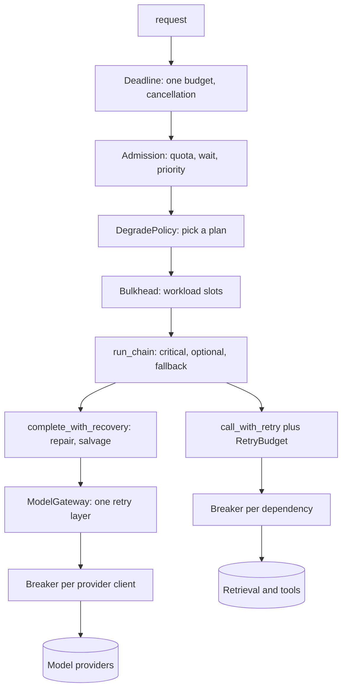
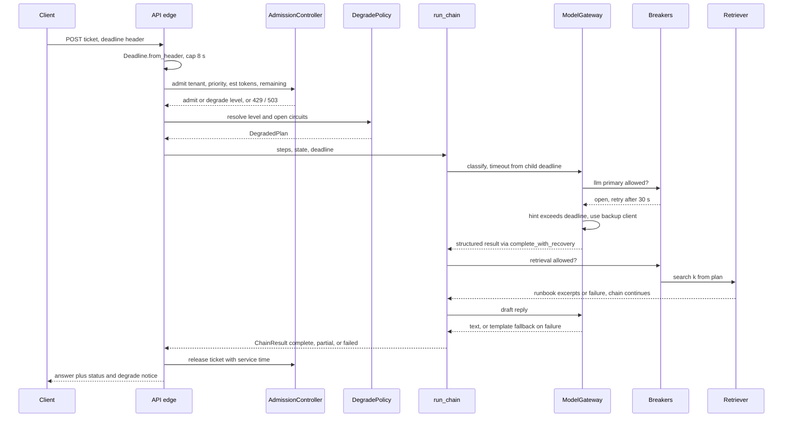
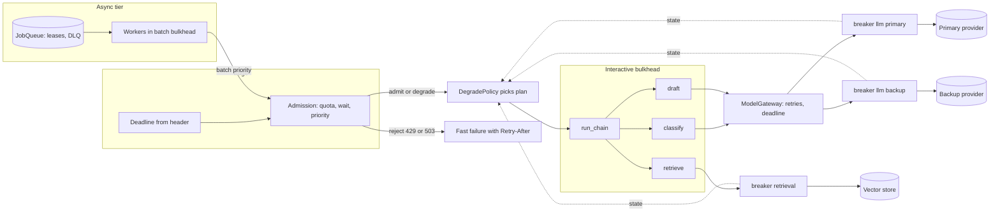
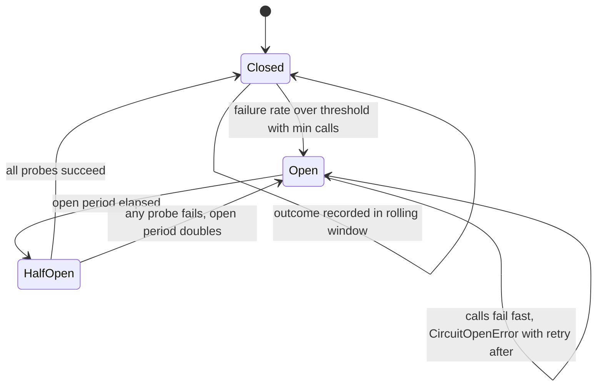
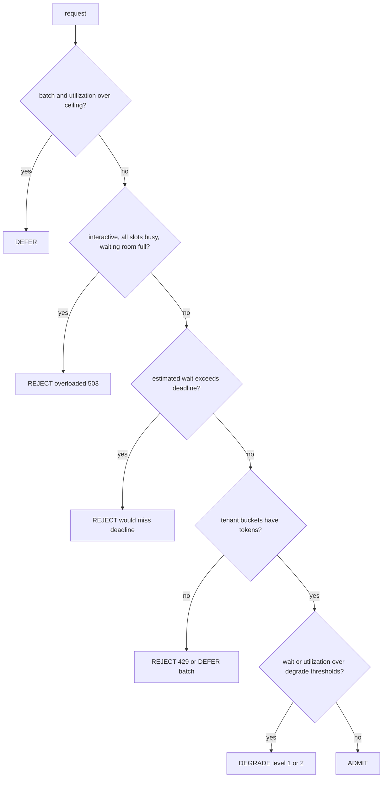

# Chapter 29 — Reliability and Scalability

An AI service fails in more ways than an ordinary web service, because its main dependency is slow, expensive per call, and sometimes returns well-formed garbage. This chapter turns the single-call reliability of Chapter 3 into system-level reliability: budgets, failure domains, overload control, durable background work, and tests that prove the whole thing behaves under injected faults.

**You will be able to:**
- State SLOs for an AI service (availability, time to first token, latency, task success, degraded share) and turn them into error budgets and burn-rate alerts.
- Carry one deadline from the edge through every stage, and contain retry amplification with a single retrying layer and a shared retry budget.
- Isolate failing dependencies with circuit breakers and noisy workloads with bulkheads, and recover usable results from malformed model output.
- Shed load at the door with admission control, per-tenant quotas, and estimated wait, and degrade along pre-tested plans instead of improvising.
- Run long work on a leased job queue with idempotent workers, dead letters, and graceful shutdown.
- Prove all of it with chaos tests that assert invariants, contract tests across queue adapters, and load tests past the knee.

**Prerequisites:** Chapters 3 and 28 (the `ModelGateway`, `RetryPolicy`, and error taxonomy; the job model and ports). | **Code:** `book/projects/reliability/` (run: `cd book/projects/reliability && python -m pytest -q`) | **Builds:** the `reliability` package: deadlines, retry budgets, hedging, circuit breakers, bulkheads, admission control, degradation plans, malformed-output recovery, a partial-failure chain runner, a job queue and worker, SLO arithmetic, and a fault injector, tied together by a Northwind Assist ticket-triage chain.

## Why this matters

Chapter 3 made one model call reliable. `ModelGateway` retries transient errors with jittered backoff under a single deadline, falls back to a second client, rate-limits outbound traffic, and caches. That is necessary and nowhere near sufficient. A Northwind Assist answer is not one model call. It is an authentication check, a retrieval query, a rerank, one or two model calls, perhaps a tool call, a validation pass, and a database write, and the agent paths make ten or forty such calls. Background workers ingest documents and run evaluations on the same provider quota. Every one of those dependencies fails on its own schedule.

Three properties of AI systems make ordinary failures worse than in a typical web service. The dominant dependency is slow: a model call that takes four seconds means every queued request waits in units of seconds, not milliseconds, so overload turns into user-visible timeouts quickly. It is expensive: an uncontrolled retry is not a wasted packet but a paid generation, and a retry storm during a provider incident shows up on the invoice. And it is probabilistic: a call can succeed at the transport level and still return output your code cannot use, a failure that no HTTP status code reports.

The consequences of getting this wrong are concrete. A provider slows down, every request holds its connection for sixty seconds, the API's worker pool fills, and health checks fail, so the orchestrator restarts healthy pods. A nightly evaluation run takes every gateway slot and employees get timeouts at 9 a.m. A worker crashes after sending a reply but before recording it, the job is redelivered, and the customer receives two emails. Three attempts at each of three layers turn a five-minute provider brownout into twenty-seven times the traffic, and the provider's own rate limiter keeps you throttled for an hour after it recovers. None of these is a model problem; each is a reliability problem made sharper by the model's slowness, cost, and unpredictable output.

## Mental model

> **Mental model:** Reliability is engineered around the model, not expected from it. Every request carries a budget, every dependency is a failure domain, and every failure has a pre-decided response.

Hold three images while reading.

**The budget.** A request enters with a deadline, typically the end-to-end SLO target. Each stage spends from it and hands the remainder downstream. When the budget runs out, work stops everywhere at once, because nobody is waiting for the answer anymore.

**The failure domain.** A failure domain is a set of calls that fail together: one provider endpoint, one vector store, one ticketing API. Each failure domain gets its own breaker, its own concurrency pool, and its own plan for what the product does without it. Two call sites that hit the same backend must share that state; otherwise each has to discover the outage alone.

**The door.** The cheapest place to handle overload is the entrance. A request rejected in two milliseconds with a clear `Retry-After` costs nothing. A request admitted into a saturated system costs a queue slot, a connection, possibly a paid generation, and then fails anyway after making everyone behind it slower.

## Core concepts

### Overview: failure classes and the patterns that answer them

Every failure an AI service sees falls into one of a handful of classes, and each class has one correct first response. The table is the map for the rest of the chapter: read down the first column to recognize what is happening, across to see what answers it and where that code lives.

| Failure class | Example | First response | Pattern and module | Owner |
|---|---|---|---|---|
| Transient | connection reset, 5xx, brief 429 | bounded, jittered retry at one layer, idempotent calls only | `RetryPolicy` in the gateway; `call_with_retry` plus `RetryBudget` (`reliability.retry`) | Ch 3, this chapter |
| Tail latency | one slow replica or shard | hedge idempotent reads | `ahedged` (`reliability.retry`) | this chapter |
| Sustained outage | provider returns 503 for ten minutes | fail fast, route to backup, ask less of the survivors | `CircuitBreaker` (`reliability.circuit`), gateway fallback, `DegradePolicy` | Ch 3, Ch 7, this chapter |
| Slowness | calls take 40 s instead of 4 s | a deadline on every call; slow calls count as breaker failures | `Deadline` (`reliability.deadline`), `slow_call_s` | this chapter |
| Overload | traffic past capacity, a noisy tenant | reject, defer, or degrade at the door; isolate workloads | `AdmissionController`, `Bulkheads` | this chapter; Ch 30 for spend |
| Deterministic | bad request, a document that crashes the parser | fail fast; dead-letter background jobs | `is_retryable` (`reliability.errors`), `JobQueue` dead letters | this chapter, Ch 28 |
| Semantic | HTTP 200 with JSON the schema rejects | repair, fallback model, salvage; never a transport retry | `complete_structured`, `complete_with_recovery` (`reliability.malformed`) | Ch 3, Ch 6, this chapter |
| Partial | step 2 of 3 fails | defined partial result with per-step status | `run_chain` (`reliability.chain`); agent-loop limits | this chapter, Ch 17, Ch 19 |
| Crash and redelivery | worker dies after sending a reply | at-least-once delivery with idempotent effects | leases, `once()`, idempotency keys (`reliability.queue`, `reliability.worker`) | this chapter, Ch 16, Ch 38 |
| Cancellation | user closes the tab | propagate so expensive work stops | `Deadline.cancel` | this chapter, Ch 34 |

Slowness deserves a special mention: it is the most dangerous class because it holds connections, slots, and users while reporting no error at all. Sustained outages are the second most dangerous, because the natural reaction, retrying, makes them worse.

Two terms recur. *Jitter* randomizes retry delays so that clients do not retry in lockstep. A *dead-letter queue* is a holding area for jobs that will never succeed on retry, where an operator can inspect and fix them. `reliability.errors.is_retryable` decides retryable versus final for every dependency, and Chapter 28's bridge uses the same classifier for its jobs table. Errors with a `retryable` attribute (the `aie_core` taxonomy and the reliability errors) decide for themselves, builtin connection errors and timeouts are transient, and everything else is not.

The patterns compose as layers around each call. The outer layers decide whether and how a request runs at all, and the inner layers decide what happens to each call inside it. Each layer handles its own failure class and passes the rest outward, which is why the order matters. The breaker sits inside the retry layer, so it sees every attempt and its open state ends the retries at once; a quota check placed before the load check would charge tenants for requests the system then sheds.



The sections below take the layers one at a time, after first defining what "reliable enough" means.

### Service-level objectives for AI services

A service-level indicator (SLI) is a measured ratio of good events to total events. A service-level objective (SLO) is a target for that ratio over a window, for example 99.5% over 30 days, and the error budget is the remaining 0.5% that may be bad. SLOs exist because without them every reliability decision is an argument: whether to add a backup provider, when to shed batch work, whether a degraded answer is acceptable. Northwind Assist commits to five indicators, all with illustrative targets.

| Indicator | Good event | Target |
|---|---|---|
| Availability | answered without a 5xx or timeout, degraded answers included | 99.5% |
| Time to first token | first streamed token within 2 s | 95% of answers |
| Completion latency | full answer within 8 s | 95% of answers |
| Task success | sampled answer judged correct and grounded (Chapter 25) | 85% |
| Degraded share | answers served in any degraded mode | at most 5% |

The last row matters most. Degradation is how you keep availability high during an incident, which is exactly why it needs its own indicator: otherwise a team can hide a week-long provider problem behind a smaller model and report perfect availability while quality drops. Requests rejected by admission control count against availability, because to the user a 503 is an outage whether you chose it or not.

Burn rate turns budgets into alerts: the observed bad ratio divided by the budgeted one. With a 99.5% objective, an hour at 2% bad is a burn rate of 4, which would spend a 30-day budget in about a week. Paging on single bad minutes wakes people for blips, and paging on the 30-day number reports outages after they end. The usual compromise pages when both a short and a long window burn above a threshold. A common starting point, and the default of `reliability.slo.should_page`, is a burn rate of 14.4 over both the last hour and the last five minutes, which spends 2% of a 30-day budget in an hour: the long window proves it is not a blip, the short one proves it is still happening. A second rule, a burn rate of 6 over both the last six hours and the last thirty minutes, opens a ticket for slower leaks. `reliability.slo` implements the arithmetic, and Chapter 31 turns it into metrics and alert rules.

Two cautions apply to AI. State latency SLOs per route or output length, because a long report legitimately takes longer than a one-line answer. And treat quality SLOs, which are measured on delayed samples, as release gates and drift detectors rather than paging signals.

### Retries at system level: amplification and budgets

Chapter 3's gateway bounds retries for one model call. At system level, retries compose. If the API handler makes up to three attempts at the chain, the chain three attempts at each step, and the gateway three attempts at each call, one request during an outage becomes 3 × 3 × 3 = 27 provider calls, arriving when the provider can least serve them. This retry amplification is why a short provider brownout often turns into a long incident: your own traffic keeps the provider's rate limiter engaged. Two rules contain it.

**Retry at one layer, the one closest to the failure.** For model calls that is the gateway, which knows the error class and the `Retry-After` hint. The chain treats a gateway failure as final and applies its failure policy instead of retrying again. For retrieval, rerankers, and tool backends, the adapter retries through `call_with_retry`, which takes its delays from `aie_core`'s `RetryPolicy` and respects the deadline. Outer layers do not retry.

**Give every retrying layer a budget.** `RetryBudget(ratio=0.1)` deposits a tenth of a token per first attempt and spends one per retry, with a floor of one retry per second by default, so a quiet service can still retry. At 100 requests per second it allows about ten retries per second, whatever the failure rate and however many layers share it. Normally every retry is granted. During an outage, retries become a 10% surcharge instead of a multiplier. `test_retry_amplification_without_and_with_budget` counts 27 calls to a dead dependency through three nested layers without a budget, and one with a shared budget that starts empty and has its per-second floor turned off.

Retrying is safe only for idempotent operations, or when the failure happened before any effect. A completion has no side effects, so a retry after a timeout costs money but not correctness. A tool call that created a ticket does have one, and a timeout says nothing about whether the ticket exists. Such calls are retried only with an idempotency key, a unique id sent with the request so the downstream recognizes a repeat and returns the first result instead of acting again (Chapter 16); without one, set `retry_on_timeout=False` and `call_with_retry` will not repeat a call that timed out. The chain runner never retries a step unless it is marked `idempotent`.

### Timeouts and deadlines

A timeout bounds one call; a deadline bounds the request. Timeouts compose badly. A handler that calls retrieval with a 5-second timeout and two attempts, then the gateway with a 60-second default and three attempts, can take over three minutes (2 × 5 s plus 3 × 60 s) after the user gave up at eight seconds, and the work continues after the user has gone.

A `Deadline` is an absolute expiry on a monotonic clock, created once at the edge. Each stage derives what it may spend:

- `child(budget_s)` gives a stage its planned share, capped by what is actually left.
- `reserve_s` keeps time back for work that must follow, such as validation and persisting the answer.
- `check(stage, need_s=...)` refuses to start work that cannot finish usefully, like a 400-millisecond rerank with 100 milliseconds left.
- `apply(request)` stamps the remaining budget onto a `CompletionRequest` as `timeout_s`. The gateway then derives each attempt's timeout and backoff decision from it (Chapter 3), so the system deadline flows into the call deadline.

Between processes the deadline travels as remaining milliseconds in a header, never as an absolute timestamp, because machine clocks disagree. The receiver caps what it accepts so a misbehaving caller cannot ask for an hour of work.

Cancellation rides on the same object. Cancelling a deadline cancels its children. When the API notices a client disconnect and calls `cancel("client disconnected")`, the next `check` anywhere downstream raises `DeadlineExceeded` and the chain marks the remaining steps skipped. In async code, `deadline.run(awaitable)` cancels the awaited task on expiry. Cancelling a stream reader closes the connection, which is what tells an inference server to stop generating and free its KV cache (Chapter 34). Synchronous code checks the deadline at boundaries between steps, tool calls, or chunks. `DeadlineExceeded` is a non-retryable `TimeoutError`, because retrying cannot create time.

### Hedged requests

A retry waits for a failure; a hedge does not. A hedged request starts a call, and if it has not finished after a delay, starts a second copy against another replica and takes whichever succeeds first, cancelling the other. It exists because tail latency often comes from one slow replica, shard, or cache rather than from the dependency as a whole, and a second copy is unlikely to hit the same slowness. With the delay set at the dependency's p95, at most about 5% of calls send a second copy, and if slow calls are independent, the chance that both copies are slow is about 0.05 × 0.05, so the p99 moves toward the p95 for a few percent of extra load (illustrative, and only as good as the independence assumption).

Hedging has three hard conditions. The call must be idempotent and read-only: a vector search, a reranker, `get_service_status`, a document fetch. A hedged `send_reply` is two replies. The slowness must be per replica, not global: when the whole dependency is slow because it is overloaded, a hedge adds load exactly where it hurts. And the cost must be acceptable: a hedged model generation pays for two generations on the hedged share, and provider-side queueing is usually shared by both copies, so hedging model calls rarely pays. Hedge retrieval and read-only tools on the time-to-first-token path; do not hedge generations or anything with a side effect.

`ahedged` enforces the overload condition through the same `RetryBudget` that bounds retries. Each hedge spends a token, so under normal load almost every hedge is granted, and when every call is slow the budget runs dry and hedging switches itself off. It also respects the request's `Deadline`, cancels losing copies so they stop costing, and treats "every copy failed" as a failure to report rather than a reason to send more.

```python
# path: book/projects/reliability/reliability/retry.py  (excerpt: ahedged, the decision loop)
            done, _ = await asyncio.wait(pending, timeout=timeout, return_when=asyncio.FIRST_COMPLETED)
            for t in done:
                exc = t.exception()
                if exc is None:
                    return t.result()
                last_exc = exc
            if done or not hedging:
                continue
            if deadline is not None and deadline.remaining() <= 0.0:
                continue  # the check at the top of the loop raises DeadlineExceeded
            if budget is not None and not budget.try_spend():
                hedging = False  # out of budget: wait for what is already running
                continue
            hedges += 1
            if on_hedge is not None:
                on_hedge(hedges)
            tasks.append(asyncio.ensure_future(fn()))
            hedging = hedges < max_hedges
```

Record hedges as a span attribute and a counter. A hedge rate far above the configured percentile means the delay is set below the real p95 or the dependency's latency has shifted, and a hedge win rate near zero means the slowness is global and the hedges are wasted.

### Fallbacks

A fallback is a second way to produce a result, and the book assigns each kind to a different component. *Same-capability fallbacks* serve the same or an equivalent model through another provider, region, or deployment. Nothing about the request changes, so the gateway switches silently (Chapter 3), with a breaker around each client. *Capability-changing fallbacks* move to a model with a smaller context window, no tools, no vision, or a different data-residency zone. They can break requests the primary would have handled, so they belong in the router's route definitions where compatibility is checked (Chapter 7), never silently in the gateway. *Degraded-mode fallbacks* change what the product does, such as shorter answers, less retrieval, or a template reply. They are product decisions, encoded as `DegradedPlan`s below. Test every fallback continuously: run the evaluation set against the backup and each degraded plan on a schedule, because a fallback exercised only during incidents fails during incidents.

Streams limit every kind of fallback. Chapter 3's gateway retries and falls back only until the first event of a stream arrives; after that it relays, because the caller may already have shown tokens to the user. The same commit point applies at system level. A stream that fails after text reached the user cannot be silently retried or switched to the backup, since the second model would start a different answer in the middle of the first. Two responses work, plus one measurement. End the stream with an `error` event naming the stage, persist the partial text flagged `truncated`, and offer the user a regenerate action, which is a new request and passes admission again. For output the user has not seen yet (a buffered structured answer, a background job), discard the partial and retry the whole call, which is safe because a completion has no side effects. And count mid-stream failures as their own SLI component: they are not timeouts and not 5xx responses, so availability alone misses them.

### Circuit breakers

A circuit breaker stops calling a failing dependency and periodically checks whether it has recovered. Failing fast is cheaper than waiting for a timeout, and a struggling dependency recovers faster when clients stop hammering it. *Closed* lets calls through and records outcomes. When the failure rate crosses a threshold it goes *open*, and calls fail immediately with `CircuitOpenError` for a cooling period. Then it goes *half-open* and admits a few probes: all succeed and it closes, any fails and it reopens with the period doubled, so a still-broken dependency is probed less and less often.

The window matters more than the state machine. A consecutive-failure counter trips on a few unlucky requests at low traffic, and never trips at high traffic because occasional successes reset it. `CircuitBreaker` keeps a ring of time buckets (ten over 30 seconds by default) and trips on a failure *rate* over a *minimum volume*. With `min_calls=20` and a 50% threshold, one failure at 3 a.m. does nothing, and a peak-hour outage trips within seconds. Slow successes can count as failures (`slow_call_s`), because a provider that answers in forty seconds is as broken as one that returns 503, and a breaker that only counts errors never opens during a brownout.

`default_is_failure` counts dependency faults only. It ignores the caller's own mistakes (`InvalidRequestError`), because one buggy caller must not open the circuit for everyone. It ignores our own deadline expiry and shedding, which say nothing about the dependency. And it ignores malformed output and content refusals, which repair and fallback handle; otherwise a prompt regression that produces bad JSON takes the provider away from every feature.

Place breakers by failure domain. For model calls, wrap each client inside the gateway with `CircuitBreakerClient`, one per provider deployment (`llm:primary`, `llm:backup`). An open circuit raises a retryable `CircuitOpenError` whose `retry_after_s` is the remaining open time. The gateway already refuses to sleep past its deadline, so a 30-second hint against an 8-second deadline sends the request straight to the backup, with no change to the gateway. For retrieval and tools, the chain runner takes breakers from a shared `CircuitBreakerRegistry` by dependency name. Breakers are per process: twenty replicas each pay `min_calls` failures to discover an outage. That is usually cheaper than sharing state through Redis, which adds a dependency to the layer that protects you from dependencies. Export breaker state as a metric instead.

### Bulkheads

A bulkhead partitions concurrency so that one workload cannot take capacity another needs. In Northwind Assist, chat, batch classification, ingestion, and evaluation share one provider. Without partitions, a 2,000-case evaluation run that starts at 8:55 holds every gateway slot when employees arrive. `Bulkheads({"interactive": 32, "batch": 8, "ingestion": 4, "eval": 2})` gives each workload running slots and a waiting room bounded in count and time. A full pool raises `BulkheadFullError` at once and never borrows from a neighbor, since borrowing is the coupling bulkheads exist to prevent. An unbounded waiting room is just a queue that hides overload until every waiter times out together. Strict pools waste capacity at night, so give batch a larger pool and let admission control defer batch work when interactive load rises: the bulkhead guarantees isolation and the controller recovers utilization.

### Malformed responses

A malformed response arrived intact and cannot be used. For one call, `aie_core.complete_structured` validates and repairs (Chapter 3), and Chapter 6 builds extraction pipelines on it. Inside a chain, a step that still fails after repair should not end the run if its output can be recovered. `complete_with_recovery` climbs a ladder, cheapest option first:

1. Validate the output (`OK`).
2. Repair once with the validation error (`REPAIRED`). Success drops sharply after the first repair, and each one is a paid call.
3. Try a fallback model without repair (`FALLBACK`). A different model fails differently.
4. Salvage locally. Truncation by the token limit is the most common shape, and `close_truncated_json` closes strings and brackets and drops a dangling key (`SALVAGED`, no extra call). Otherwise `salvage_partial` keeps each field that validates on its own, constraints included.
5. Merge valid fields into a safe default (`PARTIAL`), or return the default (`DEFAULT`).
6. Return `FAILED` as a value, so the chain's policy decides.

Every outcome past `REPAIRED` is marked degraded, and the chain records it per step, so a degraded result shows up in traces instead of masquerading as normal. Transport errors still raise, because they belong to the gateway and the chain policy.

### Provider outages

A provider outage is where the primitives meet. When Northwind's primary provider starts returning 503s at peak, the first requests are retried once by the gateway and then answered by the backup. Users see a little extra latency and no errors. The `llm:primary` breaker records each failure, and within seconds the rate crosses the threshold and the circuit opens. Primary attempts now fail in microseconds with a hint that does not fit the deadline, so retry traffic to the primary stops entirely. The degrade policy sees one open model circuit and moves new requests to `REDUCED` (fewer chunks, no rerank, shorter answers), because the backup carries all traffic and may have less quota. Probes go to the primary every 30, then 60, then 120 seconds, and when enough probes succeed (`half_open_max_calls`, three by default) the plan returns to normal. If the backup fails too, both circuits open and the policy selects `STATIC`: no model calls, help articles, ticket creation still working. A chaos test asserts that model traffic is then exactly zero.

Three things must be verified in advance. The backup needs the quota for peak traffic, which is a contract question. Its outputs must pass your evaluation set, or an availability incident becomes a quality incident. And its data handling must be equivalent, since a different region or terms may make switching a compliance decision, made per tenant in the router (Chapter 7).

### Partial failures in chains and agents

When step *k* of *n* fails, the caller needs a defined result, not a stack trace. `run_chain` asks each step whether it is *critical* and, optionally, for a *fallback* that produces a weaker substitute. The runner guarantees the following:

- A step never starts without enough budget; when the deadline is spent or cancelled, the rest are `SKIPPED`.
- A non-critical failure is recorded and the chain continues (`PARTIAL`).
- A critical failure with a working fallback continues degraded (`PARTIAL`).
- A critical failure without one stops with `FAILED`, but the accumulated state is returned for display, persistence, or human handoff.
- Only idempotent steps are retried, against the shared budget, and nothing escapes as an exception.

In the Northwind triage chain, classification is critical with no chain-level fallback (its recovery ladder already tries a smaller model), since a reply to an unclassified ticket is worse than an honest acknowledgement. Retrieval is optional. Drafting is critical with a template fallback ("filed as network, priority 2, an engineer will follow up"). Chapter 17's engine owns checkpoints and routing, and this runner owns only failure semantics, so a workflow node can call it.

Agents need the same discipline with less structure. A tool failure should usually become an *observation* for the model ("search_tickets timed out") rather than an exception that ends the run, so the model can choose another tool. But some limits must be hard, and the model cannot negotiate them: a step budget, a deadline, a cap on consecutive tool failures, and a cap on repeating one call with the same arguments. Hitting a limit ends the run with a partial result that records what was tried. Chapter 19 implements these terminations, and Chapter 38 covers durable agents.

### Idempotency

An operation is idempotent if doing it twice equals doing it once. Reliability machinery repeats things constantly: clients retry `POST`s, gateways retry timeouts, queues redeliver jobs whose worker's time-limited claim (its lease) has expired. Three techniques make repetition safe. *Idempotency keys at the entrance* store the first result under a tenant-scoped key and return it on repeats; `JobQueue.enqueue(idempotency_key=...)` does this for jobs (Chapter 28 shows the HTTP side). *Natural idempotency* writes by deterministic keys, such as upserting chunks by content hash or setting a status instead of incrementing it. *Recorded effects* cover the rest: `once(store, f"{job.id}:send_reply", fn)` checks for the key, performs the effect, and records it. A crash between the effect and the record still repeats the effect, and only a downstream that accepts the same key closes that gap, which is why Chapter 16's tool registry passes keys on side-effecting calls. Exactly-once execution is not available at reasonable cost. Design for at-least-once delivery, where every job runs one or more times, and make duplicates harmless.

### Concurrency control

Little's law relates in-flight work to throughput and latency: in-flight = arrival rate × time in system. At 10 requests per second and 5-second responses, about 50 requests are in flight (illustrative), which sizes pools, semaphores, and worker counts. Rate limits bound throughput and concurrency limits bound in-flight work, and you need both. When latency rises, the same throughput needs more concurrency: 15-second calls during a brownout need 150 slots for the same 10 per second. With a cap of 64, throughput falls to about 4 per second and the excess must queue or be shed. That is correct behavior, so the cap must be explicit and coordinated with admission control, not discovered when the connection pool runs dry. Size it per replica from the shared provider budget. With a 200-request concurrency limit, 4 API replicas, and 2 worker pods (illustrative), start at 40 per replica and 20 per pod. Revisit the split when autoscaling, because fixed per-pod limits times more pods can exceed the provider's limit at peak.

### Queues, async processing, and workers

Chapter 28 introduced the job model; this chapter builds the queue and worker under it. Chapter 28's skeleton keeps job state in a jobs table and moves bare ids through a small `JobQueuePort` (`enqueue`, `dequeue`). That port cannot express a lease, so `JobQueue` below is not a drop-in for it; Chapter 28's `reliability_bridge.py` keeps the jobs table as the record the API shows and hands delivery to this chapter's queue and worker, bounding each run by the delivery's deadline and sharing one retry classifier between queue and jobs table. Each of five properties prevents a specific incident:

- **Idempotent enqueue** returns the existing job for a repeated key, so a client retry does not ingest a document twice.
- **Leases**, also called visibility timeouts. A worker that takes a job holds it for a fixed time, during which no other worker can see it. If the worker dies, the job reappears when the lease expires, and long jobs call `ctx.heartbeat()` to extend it. A heartbeat extends the lease, not the job's own deadline (`job_timeout_s`), which a worker for long jobs sets explicitly.
- **Ack and nack.** `ack` records success. `nack` re-queues with exponential backoff and jitter from `aie_core`'s `RetryPolicy`, or dead-letters non-retryable errors at once.
- **Bounded attempts, expired leases included.** A PDF that crashes the parser kills its worker every time and never reaches `nack`. Counting expired leases sends this poison job to the dead-letter set after `max_attempts` crashes instead of letting it cycle forever.
- **Dead-letter inspection and redrive.** Dashboards show its size, runbooks name an owner, and `redrive` returns a fixed job with attempts reset.

The worker leases a job, runs the handler under a deadline derived from the lease (80% of the visibility timeout by default), and maps exception classes to queue operations: `PermanentJobError` and other non-retryable errors go straight to dead letters, and transient ones are nacked. If `ack` fails because the lease expired, another worker may be repeating the work. The worker records `lease_lost`, which is harmless with idempotent handlers and a visible alarm without them.

On SIGTERM (the signal a deploy sends before stopping a pod) the worker stops leasing, the current handler reaches its next `ctx.checkpoint()`, which raises `ShutdownRequested`, and the job is *released* without consuming an attempt, because a deploy is not the job's fault. A handler that never checkpoints is still safe, since the lease expires and the job is redelivered.

The queue comes in an in-memory implementation for tests and a Redis implementation for production, and both must pass the same contract suite (see the Code walkthrough).

### Rate limits and quotas per tenant

The gateway's `RateLimiter` paces outbound calls to protect the provider quota (Chapter 3). Tenant quotas decide which inbound requests may use that capacity. Without them, the `logistics` tenant's script that submits 5,000 classifications in a minute leaves `retail` employees with 429s they did nothing to earn. `AdmissionController` keeps two token buckets per tenant, for requests and for estimated tokens, and a request takes from both or neither. An empty bucket produces `retry_after_s` equal to the refill time. Interactive requests are rejected with 429, which tells the caller the quota is theirs to manage. Batch requests are deferred back to their queue. Quotas are checked after the load checks, so a request shed for overload does not also spend quota. Estimate conservatively, with prompt tokens plus the full output budget, since a limiter that under-counts does not limit. A request estimated above the bucket's capacity may still start, but it is charged in full and leaves the bucket in debt, so the next requests wait it off. A token quota times a price is also a spending ceiling, which Chapter 30 builds on.

### Admission control, load shedding, and backpressure

As a server's utilization ρ (the fraction of time it is busy) approaches 1, waiting time grows without bound, and it grows steeply well before that. In a simple single-server queue, average wait scales with ρ / (1 − ρ): a factor of 1 at 50% utilization, 4 at 80%, 9 at 90%, and 19 at 95%. Past this knee, small increases in load produce large increases in latency. With four-second model calls that means users wait tens of seconds and then time out after consuming capacity, so successful throughput falls while the bill rises.

Admission control decides at the door whether to accept each request, and it keeps the system before the knee. Turning requests away on purpose to protect the rest is called load shedding. `AdmissionController.admit` returns one of four actions:

- **Admit** when there is capacity and quota.
- **Degrade** (admit with a cheaper plan) when estimated wait or utilization crosses a threshold, or when only a degraded path would fit the request's deadline.
- **Defer** batch work, which runs only below a utilization ceiling (60% by default) and yields the moment interactive load rises.
- **Reject** with 503 when the waiting room is full, with 503 when even a degraded answer, started after the estimated wait, would miss the request's deadline, or with 429 when the tenant is out of quota.

The key signal is estimated wait, computed from Little's law as queue length × average service time ÷ capacity, with service time tracked as an exponentially weighted moving average (EWMA) of recent requests. With capacity 32 and 4-second service, the replica drains 8 requests per second, so 16 waiting requests mean a 2-second wait (illustrative). A request with 1.5 seconds of budget left is rejected immediately, because admitting it is pure waste. Accelerators and providers can look busy while users wait, or idle while a queue builds upstream. Queue length and estimated wait measure what users experience.

Backpressure propagates the same idea upstream: a full stage tells its caller to slow down instead of buffering. Bounded queues, bulkhead rejections, 429s with `Retry-After`, and deferred jobs are all backpressure. The anti-pattern is the unbounded buffer, which turns overload into memory growth, then a crash that loses everything buffered. Every queue needs a maximum length and every producer a response to "full". The controller runs in-process per replica, so set `capacity` to the replica's share of downstream concurrency. The overload test in the evaluation section should then show p95 latency flat while the shed rate climbs.

### Graceful degradation

Graceful degradation trades quality for availability along plans written before the incident, because a mode improvised during one is an untested path deployed under stress. `DegradedPlan` makes each level explicit: model tier, retrieval depth, reranking, output cap, whether agents and side effects are allowed, whether the model is used at all, and what the user is told.

| Level | What changes | When |
|---|---|---|
| `NORMAL` | full pipeline | healthy |
| `REDUCED` | retrieval k 8 to 4, no rerank, 512-token answers | moderate load, or one model provider down |
| `MINIMAL` | small model tier, k = 3, 384-token answers, no agents | severe load or deadline pressure |
| `STATIC` | no model: help articles, cached answers, ticket link | all model circuits open |

`DegradePolicy.resolve` combines the admission level, open circuits, and operator switches. An open reranker disables reranking, an open retriever sets k to 0, one open model provider forces at least `REDUCED`, and all of them force `STATIC`. Operators can force a floor level or turn on *read-only mode*, which keeps answering but disables every side-effecting tool, the most useful switch during a suspected injection campaign (Chapter 26). The plan names a model *tier*, which the router resolves with its compatibility checks (Chapter 7). It also stamps its level and reasons into request metadata, which feeds traces and the degraded-share SLI. Every plan needs an evaluation run on file (Chapter 25), so you know before the incident how much task success `MINIMAL` costs.

## How it works

Follow one Northwind Assist ticket-triage request through every primitive.



The edge builds the deadline from the caller's header, capped at the route's SLO. Admission control looks at the tenant's buckets, the replica's in-flight count, and the estimated wait, and either rejects in microseconds or admits at a degrade level. The degrade policy folds in open circuits and operator switches and produces one plan. The chain runner executes the steps, each under a child deadline. Model steps go through the gateway, whose per-client breakers turn a provider outage into an immediate switch to the backup. The retrieval step goes through its own breaker and, because it is idempotent, may be retried once within the retry budget. When the chain returns, admission control releases the slot and learns the service time, which updates the wait estimate for the next arrival. Every decision lands in the trace: admission action and reason, plan level and reasons, step statuses, breaker states.

Background work takes the other path. The API enqueues a job with an idempotency key and returns 202. A worker leases the job and runs the same chain (or an ingestion pipeline) inside the `batch` bulkhead. It enters the admission controller with batch priority, so it is deferred whenever interactive load is high. When the handler finishes, the worker acks or nacks the result.

## Architecture

The first diagram shows where each protection sits on the request path and which failure domain it guards.



Breaker states feed the degrade policy (dotted edges), which is how a dependency failure changes what new requests attempt instead of letting each request rediscover it. The async tier enters through the same admission controller with batch priority, so a backlog of jobs can never outcompete interactive users.

The breaker's state machine:



And the admission decision, in the order the controller evaluates it. Load checks come first because they must not consume tenant quota.



## Implementation

The package layout:

```
book/projects/reliability/
  pyproject.toml          aie-core path dependency; extras: redis, dev (pytest, fakeredis[lua])
  README.md, .env.example
  reliability/
    errors.py  clock.py  deadline.py  retry.py  circuit.py  bulkhead.py
    admission.py  degrade.py  malformed.py  chain.py  queue.py  worker.py  slo.py  chaos.py
  examples/
    ticket_chain.py       Northwind triage chain using every primitive
    worker_main.py        worker process entry point
  tests/                  offline suite; Redis contract tests also run against a real server with -m integration
```

Install and run:

```bash
uv pip install --python .venv/bin/python -e book/projects/aie_core -e "book/projects/reliability[dev]"
cd book/projects/reliability && python -m pytest -q
python -m examples.worker_main --demo
```

| Variable | Default | Meaning |
|---|---|---|
| `REDIS_URL` | unset | Redis for `RedisJobQueue`; the worker uses the in-memory queue without it |
| `WORKER_VISIBILITY_TIMEOUT_S` | `120` | lease length before a dead worker's job reappears |
| `WORKER_POLL_INTERVAL_S` | `1.0` | idle sleep between empty polls |
| `JOB_MAX_ATTEMPTS` | `5` | attempts before dead-lettering |
| `ADMISSION_CAPACITY`, `ADMISSION_MAX_QUEUE` | `32`, `32` | per-replica concurrency and waiting room |

Every primitive takes an injectable `clock`, and those that wait take `sleep`. Tests use `ManualClock`, whose `sleep` advances time, so a 30-second open period or a five-minute outage runs in microseconds and never flakes. The full files are on disk; the listings below are the parts that carry the design.

The errors express everything in the `aie_core` taxonomy, so one rule (read `.retryable` and `.retry_after_s`) works everywhere:

```python
# path: book/projects/reliability/reliability/errors.py  (excerpt)
class DeadlineExceeded(LLMTimeoutError):
    """The request's end-to-end budget is spent. Retrying cannot help."""
    default_retryable = False

class CircuitOpenError(ProviderUnavailableError):
    """A breaker refused the call without contacting the dependency."""
    default_retryable = True
    def __init__(self, dependency: str, retry_after_s: float) -> None:
        super().__init__(f"circuit '{dependency}' is open", retry_after_s=retry_after_s, provider=dependency)
        self.dependency = dependency

class Overloaded(RateLimitError):
    """Our own capacity protection rejected the work. `reason` is a stable machine-readable code."""
    default_retryable = True
    def __init__(self, message: str, *, reason: str, retry_after_s: float | None = None) -> None:
        super().__init__(message, retry_after_s=retry_after_s)
        self.reason = reason

def is_retryable(exc: BaseException) -> bool:
    flag = getattr(exc, "retryable", None)
    if isinstance(flag, bool):
        return flag
    return isinstance(exc, (ConnectionError, TimeoutError))  # builtins here, not the aie_core class
```

The deadline, with child budgets, cancellation inherited from parents, and propagation into requests and headers:

```python
# path: book/projects/reliability/reliability/deadline.py (excerpt; full file on disk)
class Deadline:
    def __init__(self, expires_at: float, *, name: str = "request", clock: Clock = time.monotonic,
                 parent: "Deadline | None" = None) -> None:
        self.expires_at = expires_at
        self.name = name
        self._clock = clock
        self._parent = parent
        self._cancelled = False
        self._reason: str | None = None

    @classmethod
    def after(cls, seconds: float, *, name: str = "request", clock: Clock = time.monotonic) -> "Deadline":
        return cls(clock() + seconds, name=name, clock=clock)

    def child(self, budget_s: float | None = None, *, fraction: float | None = None,
              reserve_s: float = 0.0, name: str | None = None) -> "Deadline":
        remaining = max(0.0, self.remaining() - reserve_s)
        if fraction is not None:
            remaining *= fraction
        if budget_s is not None:
            remaining = min(remaining, budget_s)
        return Deadline(self._clock() + remaining, name=name or self.name, clock=self._clock, parent=self)

    def remaining(self) -> float:
        own = self.expires_at - self._clock()
        if self._parent is not None:
            own = min(own, self._parent.remaining())
        return max(0.0, own)

    def check(self, stage: str | None = None, *, need_s: float = 0.0) -> None:
        if self.cancelled:
            raise DeadlineExceeded(f"request {self.cancel_reason or 'cancelled'}", stage=stage)
        left = self.remaining()
        if left <= 0.0 or left < need_s:
            raise DeadlineExceeded(f"{left * 1000:.0f} ms left, stage needs {need_s * 1000:.0f} ms", stage=stage)

    def apply(self, req: CompletionRequest) -> CompletionRequest:
        self.check("model")
        left = self.remaining()
        timeout = left if req.timeout_s is None else min(req.timeout_s, left)
        return req.model_copy(update={"timeout_s": timeout})

    def to_header(self) -> dict[str, str]:
        return {HEADER: str(int(self.remaining() * 1000))}
```

The breaker's core is the recording path: half-open probes decide the next state, and the closed state trips on a rate over a minimum volume in the bucket ring. Every transition bumps a generation number, and each call carries the generation it was admitted in, so a slow call admitted before the trip cannot close a half-open circuit by finishing late. Cancellations (a hedge loser, a deadline, a disconnected stream) count as neutral, never as dependency failures.

```python
# path: book/projects/reliability/reliability/circuit.py  (excerpt)
    def admit(self) -> int | None:
        """Like `allow`, but return the generation the call was admitted in (None if rejected).
        Pass it back to `record_*` so an outcome from before a state change is not misread as
        a probe result."""
        with self._lock:
            self._maybe_half_open()
            if self._state is CircuitState.CLOSED:
                return self._generation
            if self._state is CircuitState.HALF_OPEN and self._probes_in_flight < self.half_open_max_calls:
                self._probes_in_flight += 1
                return self._generation
            self.rejected += 1
            return None

    def _record(self, *, failed: bool, generation: int | None = None) -> None:
        with self._lock:
            now = self._clock()
            if generation is not None and generation != self._generation:
                return  # admitted before a state change: a straggler, not a probe or a fresh sample
            if self._state is CircuitState.HALF_OPEN:
                self._probes_in_flight = max(0, self._probes_in_flight - 1)
                if failed:
                    self._open_s = min(self.max_open_s, self._open_s * 2)
                    self._transition(CircuitState.OPEN)
                else:
                    self._probe_successes += 1
                    if self._probe_successes >= self.half_open_max_calls:
                        self._transition(CircuitState.CLOSED)
                return
            if self._state is CircuitState.OPEN:
                return  # a straggler from before the trip; ignore
            b = self._bucket(now)
            b.calls += 1
            b.failures += int(failed)
            calls, failures = self._window_totals(now)
            if calls >= self.min_calls and failures / calls >= self.failure_rate_threshold:
                self._transition(CircuitState.OPEN)
```

`CircuitBreakerClient` wraps an `LLMClient` so the breaker sits inside the gateway, one per provider:

```python
# path: book/projects/reliability/examples/ticket_chain.py  (excerpt: build_gateway)
def build_gateway(primary: LLMClient, backup: LLMClient, breakers: CircuitBreakerRegistry, *,
                  clock: Clock = time.monotonic, sleep: Sleep = time.sleep) -> ModelGateway:
    return ModelGateway(
        primary=CircuitBreakerClient(primary, breakers.get("llm:primary")),
        fallbacks=[CircuitBreakerClient(backup, breakers.get("llm:backup"))],
        retry=RetryPolicy(max_attempts=2, base_delay_s=0.2, max_delay_s=1.0),
        clock=clock, sleep=sleep, default_timeout_s=8.0,
    )
```

The retry budget and the system-level retry helper for non-LLM dependencies; the delay itself comes from `aie_core`'s `RetryPolicy`:

```python
# path: book/projects/reliability/reliability/retry.py (excerpt; full file on disk)
class RetryBudget:
    def record_request(self) -> None:
        with self._lock:
            self._tokens = min(self.max_tokens, self._tokens + self.ratio)

    def try_spend(self) -> bool:
        with self._lock:
            self._refill_floor()
            if self._tokens >= 1.0 - 1e-9:      # float sums of ratio drift below whole numbers
                self._tokens -= 1.0
            elif self._floor_tokens >= 1.0:
                self._floor_tokens -= 1.0
            else:
                self.retries_denied += 1
                return False
            self.retries_allowed += 1
            return True

def call_with_retry(
    fn: Callable[[], T],
    *,
    policy: RetryPolicy | None = None,
    budget: RetryBudget | None = None,
    deadline: Deadline | None = None,
    classify: Callable[[BaseException], bool] = is_retryable,
    sleep: Sleep = time.sleep,
    rng: random.Random | None = None,
    on_retry: Callable[[int, BaseException, float], None] | None = None,
) -> T:
    policy = policy or RetryPolicy()
    rng = rng or random.Random()
    attempt = 0
    if budget is not None:
        budget.record_request()
    while True:
        attempt += 1
        if deadline is not None:
            deadline.check("retry")
        try:
            return fn()
        except Exception as exc:
            if isinstance(exc, DeadlineExceeded):
                raise
            delay = _plan(policy, exc, attempt, rng, classify)
            if delay is None:
                raise
            if deadline is not None and not deadline.fits(delay):
                raise
            if budget is not None and not budget.try_spend():
                raise
            if on_retry is not None:
                on_retry(attempt, exc, delay)
            sleep(delay)
```

The admission decision. Note the order: load checks, then quota, then the degrade level.

```python
# path: book/projects/reliability/reliability/admission.py (excerpt: AdmissionController.admit; full file on disk)
    def admit(self, req: AdmissionRequest) -> AdmissionDecision:
        cfg = self.config
        with self._lock:
            util = self.utilization()
            wait = self.estimated_wait_s()
            if req.priority is Priority.BATCH and util >= cfg.batch_max_utilization:
                return self._decide(Action.DEFER, "batch_yields_to_interactive", req,
                                    retry_after_s=self._service_s, est_wait_s=wait)
            if req.priority is Priority.INTERACTIVE:
                if len(self._in_flight) >= cfg.capacity and self._queue_length() >= cfg.max_queue:
                    return self._decide(Action.REJECT, "overloaded", req, retry_after_s=wait, est_wait_s=wait)
                if req.deadline_s is not None and wait + self._service_s * 0.5 > req.deadline_s:
                    return self._decide(Action.REJECT, "would_miss_deadline", req, retry_after_s=wait, est_wait_s=wait)

            quota_wait = self._buckets(req.tenant_id).try_take(req.est_tokens)
            if quota_wait > 0.0:
                action = Action.DEFER if req.priority is Priority.BATCH else Action.REJECT
                return self._decide(action, "tenant_quota", req, retry_after_s=quota_wait, est_wait_s=wait)

            level = self.min_degrade_level
            if req.priority is Priority.INTERACTIVE:
                if wait >= cfg.severe_wait_s:
                    level = max(level, 2)
                elif wait >= cfg.degrade_wait_s or util >= cfg.degrade_utilization:
                    level = max(level, 1)
                if req.deadline_s is not None and wait + self._service_s > req.deadline_s:
                    level = max(level, 2)
            ticket = next(self._tickets)
            self._in_flight[ticket] = req.priority
            action = Action.DEGRADE if level > 0 else Action.ADMIT
            reason = "degraded_under_load" if level > 0 else "ok"
            return self._decide(action, reason, req, degrade_level=level, est_wait_s=wait, ticket=ticket)
```

The queue protocol, and the Redis lease script that reclaims expired leases (dead-lettering poison jobs) and leases the next ready job in one atomic step:

```python
# path: book/projects/reliability/reliability/queue.py  (excerpt)
class JobQueue(Protocol):
    def enqueue(self, kind: str, payload: dict[str, Any], *, idempotency_key: str | None = None,
                tenant_id: str | None = None, max_attempts: int = 5, delay_s: float = 0.0) -> Job: ...
    def lease(self, visibility_timeout_s: float = 60.0) -> Lease | None: ...
    def extend(self, lease: Lease, visibility_timeout_s: float) -> bool: ...
    def ack(self, lease: Lease, result: Any = None) -> bool: ...
    def nack(self, lease: Lease, error: str, *, retryable: bool = True, delay_s: float | None = None) -> JobState | None: ...
    def release(self, lease: Lease) -> bool: ...
    def get(self, job_id: str) -> Job | None: ...
    def depth(self) -> int: ...
    def dead_letters(self, limit: int = 100) -> list[Job]: ...
    def redrive(self, job_id: str) -> bool: ...

_LEASE = """
local now = tonumber(ARGV[1])
local expired = redis.call('ZRANGEBYSCORE', KEYS[2], '-inf', now)
for _, id in ipairs(expired) do
  local jk = ARGV[4] .. id
  redis.call('ZREM', KEYS[2], id)
  redis.call('HDEL', jk, 'lease_token', 'lease_expires_at')
  local attempts = tonumber(redis.call('HGET', jk, 'attempts'))
  local maxa = tonumber(redis.call('HGET', jk, 'max_attempts'))
  if attempts >= maxa then
    redis.call('HSET', jk, 'state', 'dead', 'last_error', 'lease expired on final attempt')
    redis.call('ZADD', KEYS[3], now, id)
  else
    redis.call('HSET', jk, 'state', 'queued', 'last_error', 'lease expired', 'available_at', ARGV[1])
    redis.call('ZADD', KEYS[1], now, id)
  end
end
if ARGV[5] == 'reclaim_only' then return false end
local ids = redis.call('ZRANGEBYSCORE', KEYS[1], '-inf', now, 'LIMIT', 0, 1)
if #ids == 0 then return false end
local id = ids[1]
local jk = ARGV[4] .. id
local exp = now + tonumber(ARGV[2])
redis.call('ZREM', KEYS[1], id)
redis.call('ZADD', KEYS[2], exp, id)
redis.call('HINCRBY', jk, 'attempts', 1)
redis.call('HSET', jk, 'state', 'leased', 'lease_token', ARGV[3], 'lease_expires_at', tostring(exp))
return id
"""
```

Ack, nack, extend, and release all begin with the same ownership check: the lease token must match *and* the lease must not have expired. An expired lease is refused even if no other worker has picked the job up yet, because the moment it expired, another worker was entitled to.

The worker's execution step, where exception classes turn into queue operations:

```python
# path: book/projects/reliability/reliability/worker.py  (excerpt: Worker._execute)
        try:
            with ctx.deadline.scope():
                value = handler(job, ctx)
        except ShutdownRequested:
            self.queue.release(lease)
            return done(WorkOutcome.RELEASED)
        except LeaseLost as exc:
            return done(WorkOutcome.LEASE_LOST, str(exc))  # do not ack or nack: we no longer own it
        except Exception as exc:
            error = f"{type(exc).__name__}: {exc}"
            state = self.queue.nack(lease, error, retryable=self.classify(exc))
            if state is None:
                return done(WorkOutcome.LEASE_LOST, error)
            return done(WorkOutcome.RETRY if state.value == "queued" else WorkOutcome.DEAD, error)
        if not self.queue.ack(lease, value):
            return done(WorkOutcome.LEASE_LOST, "ack after lease expiry")
        return done(WorkOutcome.SUCCEEDED)
```

The chain runner's per-step logic:

```python
# path: book/projects/reliability/reliability/chain.py  (excerpt: run_chain loop body)
        try:
            deadline.check(step.name, need_s=step.min_s)
        except DeadlineExceeded as exc:
            records += [StepRecord(s.name, StepStatus.SKIPPED, error=str(exc)) for s in steps[i:]]
            failed_critical = failed_critical or any(s.critical for s in steps[i:])
            break
        child = deadline.child(step.budget_s, name=step.name)
        ...
        try:
            if step.idempotent:
                value = call_with_retry(attempt, policy=retry_policy, budget=retry_budget, deadline=child, sleep=sleep)
            else:
                value = attempt()
            if isinstance(value, Recovered) and not value.usable:
                raise MalformedResponseError("; ".join(value.errors) or "no usable structured output")
            status, detail = _status_of(value)
            state[step.name] = value
            records.append(StepRecord(step.name, status, clock() - started, detail=detail))
            degraded = degraded or status is not StepStatus.OK
            continue
        except Exception as exc:
            error = f"{type(exc).__name__}: {exc}"
            if step.fallback is not None:
                try:
                    state[step.name] = step.fallback(state, exc)
                    records.append(StepRecord(step.name, StepStatus.FALLBACK, clock() - started, error=error))
                    degraded = True
                    continue
                except Exception as fb_exc:
                    error = f"{error}; fallback {type(fb_exc).__name__}: {fb_exc}"
            state[step.name] = None
            records.append(StepRecord(step.name, StepStatus.FAILED, clock() - started, error=error))
            if step.critical:
                failed_critical = True
                records += [StepRecord(s.name, StepStatus.SKIPPED, error=f"after critical failure of {step.name}")
                            for s in steps[i + 1:]]
                break
            degraded = True
```

And the Northwind chain that composes them:

```python
# path: book/projects/reliability/examples/ticket_chain.py  (excerpt: triage_ticket)
def triage_ticket(ticket: dict[str, Any], svc: TriageServices, deadline: Deadline,
                  admission_level: int = 0) -> ChainResult:
    plan = svc.policy.resolve(admission_level, svc.breakers.open_dependencies())
    state: dict[str, Any] = {"ticket": ticket, "plan": plan}
    if not plan.use_model:
        return ChainResult(status=ChainStatus.FAILED, state=state,
                           steps=[StepRecord(n, StepStatus.SKIPPED, error="static mode: all model circuits open")
                                  for n in ("classify", "retrieve", "draft")])
    steps = [
        Step("classify", _classify(svc, plan), critical=True, budget_s=3.0, min_s=0.5),
        Step("retrieve", _retrieve(svc, plan), critical=False, budget_s=1.5, min_s=0.2,
             dependency="retrieval", idempotent=True),
        Step("draft", _draft(svc, plan), critical=True, min_s=0.5, fallback=_template_reply),
    ]
    return run_chain(steps, state, deadline, breakers=svc.breakers, retry_budget=svc.retry_budget,
                     retry_policy=RetryPolicy(max_attempts=2, base_delay_s=0.1, max_delay_s=0.5),
                     clock=svc.clock, sleep=svc.sleep)
```

The classify step calls `complete_with_recovery(svc.gateway, deadline.apply(plan.apply(req, svc.models)), TicketClass, repair_attempts=1, fallback_client=svc.small_model)`. In one line it applies the plan (model tier, output cap, telemetry metadata), the deadline (remaining budget as `timeout_s`), and the malformed-output ladder.

## Code walkthrough

Read the package in the order a request meets it, starting from the example that composes everything.

**1. The map: `examples/ticket_chain.py`.** `build_gateway` shows the breaker placement. `triage_ticket` shows the order of decisions: plan first (from admission level and open circuits), static short-circuit second, chain third. The three step factories each close over the plan, so a degraded request is degraded consistently in every step. Adding a new dependency means three changes in this file and nowhere else: give its `Step` a `dependency` name (the chain runner then takes that breaker from the registry and calls through it), mark it `idempotent` only if a repeat is harmless, and, if its outage should change the plan, name it in `DegradePolicy` the way `retrieval_dependency` and `rerank_dependency` are named.

**2. Breakers: `reliability/circuit.py`.** `CircuitBreakerClient` (on disk) is a thin `LLMClient` wrapper: `complete` goes through `breaker.call`, and `stream` admits once, records a failure if the stream raises, and records a success only when the stream finishes. It translates an open circuit into the retryable `CircuitOpenError` from `errors.py`, which is all the gateway needs to fail over. The generation check in `_record` is the subtle part; `test_stragglers_from_before_the_trip_do_not_close_a_half_open_circuit` and `test_cancellation_is_not_a_dependency_failure` in `tests/test_hardening.py` pin it down.

**3. Bulkheads: `reliability/bulkhead.py`.** `Bulkhead` serves threads and `AsyncBulkhead` serves one event loop. They are separate classes with the same semantics because a release in one world cannot wake a waiter in the other: a thread blocked on a lock never hears an `asyncio.Condition` notify. `Bulkheads(..., use_async=True)` builds the async kind, and an unknown workload name raises `KeyError`, because a typo that silently fell back to a shared pool would remove the isolation.

**4. Queue and worker: `reliability/queue.py`, `reliability/worker.py`.** `InMemoryJobQueue` serves tests. `RedisJobQueue` provides the same semantics across processes, with each state change in one Lua script, so reclaiming expired leases and leasing the next ready job are atomic: two workers polling at once cannot both take the same job. The worker derives the job's deadline from the lease (80% of the visibility timeout unless `job_timeout_s` is set), installs SIGTERM and SIGINT handlers that request shutdown, and gives handlers `ctx.heartbeat()` and `ctx.checkpoint()`, both of which raise `LeaseLost` when the lease is gone. `once()` sits at the bottom of `worker.py`, and its docstring names the irreducible gap between the effect and the record.

The queue tests in `tests/test_queue.py` are one suite parametrized over three adapters: in-memory, Redis through fakeredis with Lua scripting, and real Redis behind the `integration` marker. This is the contract-test pattern from Chapter 28 applied to the port this chapter owns. The subtle case is an `ack` on an expired lease that nobody has re-leased yet. It is tempting to accept it, since no other worker has the job, but the moment the lease expired another worker was entitled to take it. `test_lost_lease_detected_at_checkpoint_and_on_ack` in `tests/test_worker.py` pins the refusal.

**5. Chaos: `reliability/chaos.py` and `tests/test_chaos_chain.py`.** `FaultPlan` holds time windows of `outage`, `rate_limited`, `slow`, `timeouts`, and `malformed` faults, and `ChaosLLM` and `ChaosFunction` consult it before each call. In the test file, `make_env` wraps two `FakeLLM`s in `ChaosLLM` and the retriever in `ChaosFunction`, all sharing one `ManualClock` with the gateway, the breakers, and the deadlines. `test_primary_outage_is_absorbed_by_backup_and_breaker_stops_the_bleeding` runs ten tickets through a primary outage. All ten complete through the backup, the primary sees at most four calls before its circuit opens (the test sets `min_calls=4`; the default is 20), and the last plan carries the reason `open:llm:primary`. The soak test asserts properties rather than outputs:

```python
# path: book/projects/reliability/tests/test_chaos_chain.py (excerpt; full file on disk)
@pytest.mark.parametrize("seed", [1, 2, 3])
def test_random_fault_soak_preserves_invariants(seed):
    env = make_env(
        primary=[outage(0, 10_000, probability=0.3), malformed(0, 10_000, probability=0.1)],
        backup=[outage(0, 10_000, probability=0.1)],
        retrieval=[outage(0, 10_000, probability=0.2)],
        seed=seed,
    )
    statuses = []
    for _ in range(200):
        before = env.model_calls()
        r = env.run()                                    # never raises
        statuses.append(r.status)
        assert env.model_calls() - before <= 13          # bounded amplification per request
        if r.step("classify").status is StepStatus.FAILED:
            assert r.step("draft").status is StepStatus.SKIPPED
        if r.status is ChainStatus.COMPLETE:
            assert r.state["draft"] and all(s.status is StepStatus.OK for s in r.steps)
    assert ChainStatus.COMPLETE in statuses and ChainStatus.PARTIAL in statuses
```

The bound of 13 model calls is the worst case the configuration allows. One gateway call can make four calls (two attempts on each of two clients). Classification can make nine: the first gateway call, one repair through the gateway, and one call to the small fallback model. Drafting can make four more. A change that adds a hidden retry layer breaks the bound and fails this test before it reaches production.

## Production considerations

**Latency.** Every primitive here adds microseconds, not milliseconds; the breaker and admission checks are a lock and some arithmetic. The latency they *save* is what matters: a fail-fast circuit returns in microseconds instead of a 30-second timeout, and a rejected request costs the user a quick retry instead of a long wait. Put the deadline header on every internal call, including retrieval and tool backends, or those services will keep working for requests that are already dead.

**Cost.** Retries, repairs, and fallbacks are paid generations. Track them per request as attributes (`attempt`, `outcome`, `degrade_level`) and in cost reports as their own line. The retry budget is also a cost control: during an outage it caps the surcharge at the configured ratio. Repair once, not three times, unless your evaluation data shows the second repair pays for itself.

**Security.** Read-only mode is a security control: during a suspected injection campaign it removes every side effect while keeping answers flowing. Admission quotas are an abuse control: per-tenant and per-user buckets limit what a compromised credential can spend. Dead-letter queues hold real payloads such as documents, tickets, and personal data, so apply the same access control and retention to them as to the primary store. Do not log full payloads in `last_error`.

**Operations.** Dashboards show, per replica and per failure domain: breaker states and transitions, admission actions by reason, estimated wait, in-flight by priority, bulkhead utilization and rejections, queue depth, oldest-job age, lease-lost count, dead-letter size, degraded share, and burn rates. Alerts follow from the same signals. Page on SLO burn rate (the multi-window rule above) and on a breaker that opens for the primary provider. Open a ticket on dead-letter growth, on any `lease_lost` outcome for a side-effecting job type, on degraded share above its target, on retry-budget denials sustained for more than a few minutes, and on a hedge rate far above its configured percentile. Runbooks list each operator switch (forced degrade level, read-only mode, batch pause) with the command that flips it and the evaluation result for the plan it selects. Worker deployments set the termination grace period longer than the typical checkpoint interval, so draining actually happens. Autoscaling keys on queue depth and estimated wait rather than CPU, because model-bound services are idle on CPU while their users wait.

## Common mistakes

- **Timeouts without a deadline.** Each call has a reasonable timeout, but the sum is minutes. Create the deadline at the edge and derive everything from it.
- **A breaker that counts caller errors.** One client sending malformed requests opens the circuit for everyone. Count dependency faults only.
- **A breaker on consecutive failures.** It trips on noise at low traffic and never trips at high traffic. Use a rate over a minimum volume in a time window.
- **Unbounded queues and waiting rooms.** Overload becomes memory growth and minutes of latency. Bound every queue and define the response to "full".
- **Shedding on GPU or CPU utilization.** Devices look busy or idle independently of user wait. Shed on queue length and estimated wait.
- **Fallbacks tested only in incidents.** The backup provider's quota is too small, or its outputs fail evaluation. Exercise every fallback on a schedule.
- **Silent capability-changing fallback in the gateway.** The request lands on a model without tool support or with a smaller context. Route those through the router's compatibility checks.

## Failure modes

**Retry storm during a provider brownout.** Cause: client, API, chain, and gateway each retry, with no shared budget. Symptom: provider error rate rises, then your outbound request rate rises faster, cost spikes, and recovery lags the provider's. Telemetry: spans with `attempt > 1` dominate, retry-budget denials are absent (no budget) or soaring (budget working), and the breaker never opened because errors were spread across replicas below `min_calls`. Fix: one retrying layer per dependency plus a `RetryBudget`. Test: the amplification test with and without a shared budget, plus a chaos run asserting a maximum of calls per request.

**Slow-dependency resource exhaustion.** Symptom: no errors at first, then p99 latency climbs, worker or thread pools fill, and health checks fail. Telemetry: in-flight count at its cap, `queue_ms` rising, breaker closed because slow calls were not counted. Test: a `slow()` fault window with latency above `slow_call_s`, asserting the circuit opens and in-flight stays bounded.

**Fallback overload cascade.** Symptom: the primary goes down, the backup takes all traffic and starts returning 429s, and both circuits open. Telemetry: backup 429 rate rises right after the primary breaker opens, and no `REDUCED` plan appears in traces. Test: a chaos run with the primary out and a rate-limited backup, asserting the degrade policy reduces load.

**Poison job.** Cause: expired leases are not counted as attempts, so a job that kills its worker never reaches `nack` and cycles forever. Symptom: a worker pod restarts every few minutes and queue throughput drops. Telemetry: the same job id appears in consecutive `job.process` spans with increasing attempts and no outcome, then dead-letter growth. Test: `test_poison_job_that_kills_workers_is_dead_lettered`.

**Duplicate side effects after redelivery.** Cause: a non-idempotent handler under at-least-once delivery. Symptom: customers receive two replies. Telemetry: `lease_lost` outcomes on `send_reply` jobs and two `job.process` spans for one job id that both succeeded. Fix: key effects by job and step with `once()`, and pass downstream idempotency keys. Test: `test_redelivered_job_does_not_repeat_side_effect`.

**Queue past the knee.** Symptom: p95 latency jumps from 6 to 40 seconds with only 10% more traffic (illustrative). Telemetry: estimated wait rising faster than offered load, timeouts at the edge, zero admission rejections, which means the controller is missing or its capacity is set too high. Test: the load test under Evaluation and testing.

**Degradation masking an outage.** Symptom: availability is green for a week while users complain. Telemetry: degraded share at 30%, one breaker in the open state for days. Test: an SLO evaluation asserting the `degraded_share` violation fires.

## Tradeoffs

| Decision | Option A | Option B | Choose A when |
|---|---|---|---|
| Breaker state | per process | shared in Redis | almost always; shared state adds a dependency to the protection layer |
| Breaker window | short (10 s), low `min_calls` | long (60 s), high `min_calls` | traffic is high and fast detection matters more than false trips |
| Overload response | reject (503) | queue and wait | the user is interactive and has a deadline; queue for batch work |
| Degrade vs reject | degrade | reject | the degraded plan has a passing evaluation run |
| Bulkhead size | strict per workload | shared pool plus priority | isolation guarantees matter more than utilization |
| Delivery | at-least-once with idempotent handlers | exactly-once machinery | always, in practice; exactly-once is rarely available at reasonable cost |
| Repair attempts | one | two or more | the second repair's success rate does not pay for its call |

## Evaluation and testing

Reliability claims are tested at four levels.

*Unit tests on the state machines*, with `ManualClock`. Breaker transitions, including the half-open probe limit and the doubling open period. Deadline arithmetic, cancellation inheritance, and header round-trips. Admission decisions at each threshold, including that shed requests do not spend quota. Every test runs in microseconds because time is injected.

*Contract tests on ports.* One suite, many adapters: in-memory, fakeredis, and real Redis behind `-m integration`. A new queue backend is done when it passes the suite, not when it compiles.

*Chaos tests on composed behavior.* `FaultPlan` schedules outages, 429s, latency, and malformed output on the shared clock. The assertions are invariants: bounded calls per request, no exceptions, critical failures skip dependents, open circuits mean zero traffic, partial results carry their step statuses. Run them in CI on every change to the request path, with several seeds.

*Load and game-day tests on the real system.* Ramp offered load past capacity and plot p95 latency and shed rate against offered load. A working admission controller produces a flat latency line and a rising rejection line past the knee. A missing one produces a latency curve that bends toward vertical. Then run a game day: block the primary provider at the network layer in staging and watch the dashboards for the sequence described under provider outages. Measure time to circuit open, time to plan change, and the SLO burn during the event. Repeat after every significant architecture change.

The whole package suite runs offline in about a second, because time is injected everywhere. The deselected tests are the real-Redis contract parameters, which run with `REDIS_URL` set and `-m integration`.

## Before you ship

- [ ] SLOs are written per route for availability, time to first token, completion latency, task success, and degraded share, and the multi-window burn-rate alerts (page and ticket) are deployed and have fired in a test.
- [ ] Each dependency has exactly one retrying layer, every retrying layer draws on a shared `RetryBudget`, and a chaos test asserts a maximum number of model calls per request.
- [ ] A `Deadline` is created at the edge and capped at the route's SLO, every internal call carries the remaining-time header, and every receiver caps what it accepts.
- [ ] A client disconnect cancels the deadline, and a test asserts that downstream steps are skipped and make no model calls.
- [ ] Every failure domain has its own breaker that trips on a failure rate over a minimum volume, with `slow_call_s` below the call timeout; breaker state is exported as a metric and a primary-provider breaker opening pages someone.
- [ ] Side-effecting calls carry idempotency keys or run with `retry_on_timeout=False`, and nothing with a side effect, and no model generation, is hedged.
- [ ] Per-replica admission capacity times the maximum replica count, plus worker concurrency, stays within the provider's concurrency limit.
- [ ] Every queue and waiting room has a maximum length, and a load test past capacity shows flat p95 latency with a rising shed rate.
- [ ] The backup provider's peak-traffic quota is confirmed in writing, its outputs pass the evaluation set, and its data handling is approved for every tenant routed to it.
- [ ] Every `DegradedPlan` has a passing evaluation run on file, and each operator switch (forced level, read-only mode, batch pause) is in the runbook and has been flipped in staging.
- [ ] Expired leases count as attempts, the dead-letter queue has a dashboard, an owner, access control, and retention, and `redrive` has been exercised.
- [ ] The worker's termination grace period exceeds its checkpoint interval, the visibility timeout exceeds p99 handler time (or handlers heartbeat), and a game day has blocked the primary provider in staging.

## Exercises

**Start here:** K2, K3, E1, P4, D1 (about 3 hours). The rest go deeper.

### Knowledge questions

**K1.** Explain why availability, time to first token, completion latency, task success, and degraded share are separate SLIs for Northwind Assist. What goes wrong if degraded answers are simply counted as available and degraded share is not measured?

**K2.** A request passes through four layers that each make up to three attempts. How many calls can one request make to a dead dependency? Describe two mechanisms that bound this and what each one bounds.

**K3.** Why does `default_is_failure` ignore `InvalidRequestError`, `MalformedResponseError`, and `DeadlineExceeded`? Give the incident each exclusion prevents.

**K4.** Why does a deadline travel between services as remaining milliseconds rather than as an absolute timestamp, and why does the receiver cap it?

**K5.** What is the difference between a lease expiring and a `nack`, and why must expired leases count as attempts?

**K6.** Why is estimated wait a better load-shedding signal than accelerator utilization? Use Little's law in your answer.

### Engineering questions

**E1.** The backup provider in Northwind Assist has half the primary's quota. Design what happens, step by step and with which primitives, when the primary goes down at peak, so that the backup is not immediately overwhelmed.

**E2.** You run 6 API replicas and 3 worker pods against a provider limit of 240 concurrent requests and 2 million tokens per minute. Propose per-replica admission capacity, bulkhead sizes, and gateway rate limits, and say what must change when the API autoscales to 12 replicas.

**E3.** An agent in the incident-research workflow calls `search_tickets`, `query_metrics`, and `get_service_status`, and the metrics backend is down. Specify how the agent loop should treat the failure, which limits must be hard, and what the final result looks like.

**E4.** Product wants "exactly one reply email per ticket, guaranteed". Explain what is achievable with the queue and worker in this chapter, where the remaining gap is, and what you would require of the email provider to close it.

### Practical exercises

**P1.** (about 2 hours) Add per-dependency latency tracking to `CircuitBreaker.snapshot()`: p50 and p95 over the rolling window, computed from bucketed histograms rather than stored samples. Add tests that drive known latencies through a `ManualClock`.

**P2.** (about 4 hours) Implement an `AsyncWorker` that runs up to N handlers concurrently on one event loop, preserves graceful shutdown (drain all in-flight jobs, release those that checkpoint), and heartbeats leases automatically at a third of the visibility timeout. Reuse the queue contract tests and add concurrency tests.

**P3.** (about 2 hours) Extend `AdmissionController` to count estimated KV-cache memory instead of request count for a self-hosted model (Chapter 34): each request reserves memory proportional to prompt plus maximum output tokens, and capacity is a memory budget. Show with a test that one 64k-token request blocks as much as sixteen 4k-token requests.

**P4.** (about 90 min) Write a chaos test for the fallback overload cascade: primary out, backup rate-limited above a threshold of concurrent calls. Make the test fail on the current code if the degrade policy does not reduce load, then make it pass.

### Debugging exercises

**D1.** During a provider incident, the dashboard shows the `llm:primary` breaker closed on every replica, provider error rate at 60%, and outbound request rate at four times normal. Each replica sends about 3 calls per second to the provider, retries included, and the breaker is configured with `min_calls=50` and `window_s=10`. Diagnose why the circuit never opened and what the request-rate increase tells you.

**D2.** After a deploy, the dead-letter queue fills with `ingest_document` jobs whose `last_error` is "lease expired on final attempt", although the documents are small and the parser has not changed. The new deploy raised the worker termination grace period from 30 to 120 seconds and lowered `WORKER_VISIBILITY_TIMEOUT_S` from 300 to 60. Traces show handlers taking 70 to 90 seconds because of a new embedding step. What happened?

**D3.** p95 latency for interactive requests is fine at 10:00 and doubles every day at 02:00 and 14:00, although traffic at those times is low. Admission control shows no rejections and utilization below 40%. The nightly and midday evaluation runs start at those times. Identify the missing protection and the telemetry that confirms it.

## Key takeaways

- Write SLOs for availability, time to first token, completion latency, task success, and degraded share. Error budgets and burn rates turn them into decisions and alerts.
- Retry at one layer per dependency, the one closest to the failure, and give every retrying layer a shared budget. Otherwise retries multiply across layers during exactly the incidents they are meant to help. Hedge only idempotent reads, and let the same budget switch hedging off under overload.
- Create one deadline at the edge, hand child budgets to each stage, propagate it as remaining time, and use it for cancellation. Timeouts alone compose into minutes.
- Put circuit breakers per failure domain, trip them on a failure rate over a minimum volume (slow calls included), and place model breakers inside the gateway so that an open circuit sends traffic straight to the backup.
- Same-capability fallbacks live in the gateway, capability-changing fallbacks in the router (Chapter 7), and product-level degradation in pre-tested plans that are evaluated before any incident.
- Chains declare critical and optional steps with fallbacks, and they return partial results with per-step status instead of throwing.
- Design for at-least-once: idempotent enqueue, leases that count as attempts, dead letters with redrive, idempotent handlers, and `once()` plus downstream keys for side effects.
- Shed load at the door using tenant quotas, priority classes, and estimated wait. Keep every queue bounded, and degrade before rejecting when a degraded plan exists.
- Prove reliability with chaos tests that assert invariants under injected faults, contract tests across adapters, and load tests that show flat latency past capacity.

## Further reading

- *Site Reliability Engineering* (Beyer, Jones, Petoff, and Murphy, eds.). The reference for SLOs, error budgets, and handling overload; its companion books cover burn-rate alerting.
- *Timeouts, retries, and backoff with jitter* (Amazon Builders' Library). The practitioner's account of retry amplification, jitter, and why only one layer should retry.
- *The Tail at Scale* (Dean and Barroso). Where tail latency comes from and the original argument for hedged requests.
- *Release It! Design and Deploy Production-Ready Software* (Nygard). Circuit breakers, bulkheads, timeouts, and the stability anti-patterns this chapter guards against.
- *Designing Data-Intensive Applications* (Kleppmann). Delivery guarantees, idempotence, and why exactly-once is so expensive.
