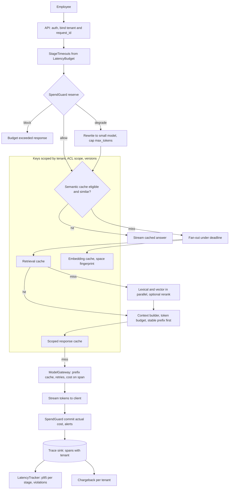
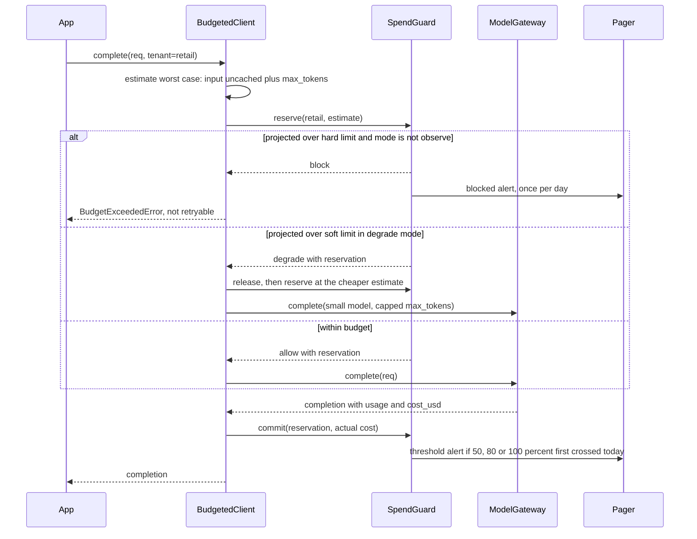
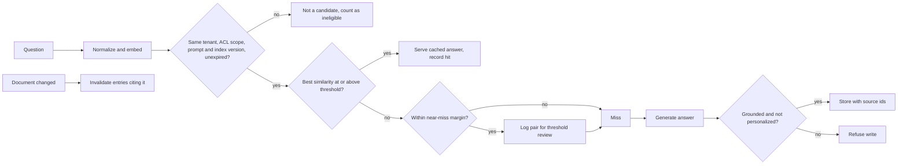

# Chapter 30 — Performance and Cost Engineering

An AI request costs and takes time in proportion to its tokens, its calls and its failures, so performance and cost are designed in, not tuned afterwards. This chapter shows where the time and money in a request go and gives you budgets, scoped caches, a cost model and per-tenant spend controls to keep both within target.

**You will be able to:**
- Break a request's latency into stages and set a latency budget whose stages add up to the TTFT and completion objectives.
- Design cache keys for six layers (prompt prefix, embedding, retrieval, tool result, response, semantic) that cannot leak across tenants or serve stale answers, and lint them in CI.
- Calculate cost per successful task, including retries, failures, human review, amortized infrastructure and the break-even point of provider prompt caching.
- Enforce per-tenant spend limits with reservations, deduplicated alerts and a degrade mode, and attribute every span's spend to a tenant and feature.
- Run independent steps in parallel under a deadline, and choose between streaming, micro-batching and batch APIs.
- Apply optimizations in an order that takes the cheap, safe, large wins first.

**Prerequisites:** Chapter 3 (the `aie_core` gateway, `Usage`, `PricingTable`), Chapter 5 (prompt layout and prefix caching practice), Chapter 7 (routing and cascades). | **Code:** `book/projects/examples/ch30/` (run: `.venv/bin/python -m pytest book/projects/examples/ch30 -q` from the book root) | **Builds:** latency budgets and tracker, scoped caches with a key linter, `CostModel` and chargeback, `SpendGuard`, and a deadline-bound fan-out helper.

**First reading:** Why this matters, Mental model, Core concepts from Latency anatomy through Streaming for perceived latency, The cost model per successful task, An optimization order, How it works, Architecture, Cache layers, Failure modes. **Deep dives** (skip on a first pass): Parallelization, Batching, Retrieval, embedding, and index costs, Routing for cost, Cost monitoring, budgets, alerts and chargeback, Back-of-envelope estimates, and the other Implementation subsections.

## Why this matters

A Northwind Assist answer that takes eleven seconds has failed even when correct; the employee has already asked a colleague. An answer costing four cents is fine until it runs 6,000 times a day across two tenants and finance asks why logistics pays for retail's experiments. Performance and cost are requirements with numbers.

AI systems make them harder to meet in three ways. Cost and latency scale with content, not request count, so "include a bit more context" is a capacity change. The expensive component is probabilistic: a request can fail validation and retry, an agent can take twelve steps instead of three, and a cheap model can be wrong often enough that its savings vanish into human review, so the honest unit is a task that succeeded, not a call. And the obvious optimizations carry correctness hazards: a response cache keyed on the question alone serves an HR-only answer to a warehouse clerk.

This chapter gives you the anatomy, budgets, caches, cost model and controls, plus an order to apply them in.

## Mental model

> **Mental model:** Latency is a sum along the critical path; cost is a product per successful task.

Latency adds up. Each stage on the critical path (the steps that must happen one after another before the user sees something) contributes its time; to shorten the total, make a stage faster, take it off the critical path, or remove it. The user feels two sums: time to first token and time to completion. A latency budget states how much of each sum each stage may use.

Cost multiplies. The cost of one successful task is roughly the token cost per call, times the calls per attempt, times one plus the retry rate, plus fixed fees, all divided by the fraction of attempts that succeed. A modest change in any factor moves the total: halving context halves the largest term, a 20-step agent loop multiplies everything by 20, and a success rate falling from 0.9 to 0.6 raises the cost of every success by half without changing a single price.

## Core concepts

### Latency anatomy

A Northwind Assist answer passes through these stages, each with a different cause and fix:

- **Network and edge.** TLS, load balancer, the client's link: tens of milliseconds you mostly do not control.
- **Admission and queueing.** Rate-limit waits, gateway semaphores, and queueing at the provider or your serving engine. Under load this stage explodes as utilization approaches capacity (Chapter 34). The gateway records it as `queue_ms`.
- **Auth and policy.** Token validation and tenant resolution; small and constant.
- **Retrieval and reranking.** Embedding, search, ACL filtering and fusion, sensitive to index size and cold caches; then a cross-encoder whose cost grows with the candidates scored.
- **Prefill and time to first token (TTFT).** The model reads the whole prompt before emitting anything, so a 9,000-token prompt starts noticeably later than a 4,500-token one. Provider prompt caching shortens prefill for a repeated prefix.
- **Decode and time per output token (TPOT).** Generation is sequential, so completion time after the first token is roughly output length times TPOT.
- **Tools.** Each call is a round trip plus a further model call to read the result; in an agent loop every step is on the critical path.
- **Validation and persistence.** Checks, guardrails, the database write; fast unless a guardrail is a model call.

A useful first-order equation for a single-call answer is:

```text
completion ≈ network + queue + pre-model stages + TTFT + output_tokens × TPOT + post-model stages
TTFT_seen_by_user ≈ network + queue + pre-model stages + model TTFT
```

Worked example, all numbers illustrative: with TPOT of 15 ms, a 300-token answer decodes in 4.5 seconds and a 600-token answer in 9 seconds. Against Northwind's 8-second p95 completion target, the 600-token answer has failed before retrieval has spent a millisecond. Output tokens cost time linearly, and you control their number with `max_tokens` and the answer format you ask for (Chapter 34 covers the mechanics).

Users feel the tail: p95 and p99, the latencies the slowest 5 percent and 1 percent of requests exceed. Measure each stage as a distribution, never a mean.

### Latency budgets

A latency budget allocates an end-to-end objective across stages, so a stage that would eat the whole target (retrieval at six seconds against eight) surfaces in design review rather than in an incident.

Build it in four moves. Start from the objectives: Northwind's are p95 TTFT under 2 seconds and p95 completion under 8 seconds. Mark the stages before the first token, which must also fit the TTFT target. Hold back a reserve of 5 to 10 percent for jitter and one retry. Split the rest by measured need. The chapter's demo gives auth 100 ms, retrieval 600, reranking 300, generation 6,200, persistence 300 and validation 100, plus a 400 ms reserve: 8,000 ms in total, with the stages before the first token using 1,000 ms of the 2,000 ms TTFT target. (Chapter 28's starting plan was looser; measurements move numbers like these.)

Summing per-stage p95s overstates the end-to-end p95, since stages rarely all hit their tails on one request, so the sum is a safe check. If it does not fit, make a stage faster, move it off the critical path, or renegotiate the target; `LatencyBudget.from_measurements` refuses an infeasible split.

Enforce the budget twice. At run time each stage gets `min(its budget, time remaining)` as its timeout, so a slow stage fails into retry or a degraded mode instead of hanging (Chapter 29 carries the deadline across services). Offline, compute per-stage percentiles and violations from traces and look first at the stage with the most. Measure end to end as wall clock, since parallel stages overlap.

### Token budgets

Tokens are the unit both latency and cost are made of. Input tokens drive prefill and input cost; output tokens drive decode and output cost, typically at several times the input price (this book's illustrative prices use 4:1). Reasoning models' hidden thinking tokens are billed as output (Chapter 3), land before the first visible token, and vary by question, so budget them against p95 and set reasoning effort per task by evaluation (Chapter 7).

There are three levels of token budget. Per section within a prompt, enforced by Chapter 5's context builder. Per request, with `max_tokens` and an answer format sized to the need. Per task, because per-request limits do not stop a loop of forty modest calls; this chapter's `TaskTokenBudget` refuses a step the remaining budget cannot cover, so the loop stops with a partial result.

The fleet arithmetic makes this a business concern. Northwind Assist answers about 6,000 questions a day (Chapter 35, Case 1). One thousand extra input tokens per answer is 180 million tokens a month, about 360 USD at the illustrative input price, for a change that looks like "add two more chunks". At 3 requests per second around the clock, the same change costs about 520 USD a day. Extra chunks also add distractors (Chapter 5), so trimming often raises the success rate, which lowers cost per successful task twice.

### Caching layers and their correctness keys

A cache returns a value computed for one input as the value for another input it considers equal, so its correctness lives entirely in the key. The rule: the key includes every factor that changes the correct value, and nothing that does not. A missing factor leaks or serves stale data; a per-request factor (a timestamp, a request id) drives the hit rate, the fraction of lookups answered from the cache, to zero.

An AI request path has six cacheable layers:

| Layer | Caches | Key must include | Main hazard |
|---|---|---|---|
| Prompt prefix | provider's prefill computation | identical token prefix (implicit) | volatile content early in the prompt destroys hits |
| Embedding | text to vector | normalized text, embedding-space fingerprint | vectors from a different model, dimension or prefix |
| Retrieval | query to ranked evidence ids | normalized query, tenant, ACL scope, index version, retriever config | cross-group leakage; stale results after reindex |
| Tool result | read-only tool call to result | tool, arguments, tenant, tool version, TTL | stale status data; side-effecting tools cached by mistake |
| Response | full request to completion | request hash, model, tenant, ACL scope, prompt version, index version | personalization and permissions not in the prompt |
| Semantic | similar question to answer | embedding, tenant, ACL scope, versions, TTL | answering a different question; poisoning |

**Prompt prefix caching** is the provider's reuse of prefill work for a prompt beginning it has recently processed. Your prompt layout earns it (Chapter 5); `Usage.cached_input_tokens` on every gateway span measures it. The economics are this chapter's. Write the prefix's normal input price as 1. Some providers charge a write multiplier `w` when a prefix enters the cache and a read multiplier `r` on each later hit within its lifetime (the TTL); implicit caching has `w = 1`. With illustrative `w = 1.25` and `r = 0.1`:

- **Per prefix.** One write and `n` reads cost `w + n × r` instead of `1 + n`, so caching wins when `n > (w − 1) / (1 − r)`, here 0.28: a single reuse pays.
- **Per request, from traffic.** If the prefix arrives at rate λ and entries live T after last use, a request finds a live entry with probability about `p = 1 − e^(−λT)`. The expected prefix cost per request is `(1 − p) × w + p × r`, which beats 1 when `p > (w − 1) / (w − r)`, here about 0.22 (λT about 0.25). With a 5-minute TTL, a prefix seen once every 20 minutes breaks even; once a minute it costs about 0.11; once an hour about 1.16, more than not caching.
- **On the bill.** Saving = prefix tokens × input price × (1 − expected prefix cost). The prefix is usually a minority of the input: in the ladder below, 800 cached tokens out of 4,500 save 12 percent per success (about 6 percent less at a 95 percent hit rate with the write premium).

Every distinct prefix divides the traffic, so one system prompt per tenant or experiment arm can push low-traffic prefixes below break-even. Measure `p` per prefix from `cached_input_tokens` rather than assuming it.

**Embedding caching** is the safest layer and saves the most during ingestion. The key is the text plus Chapter 8's embedding-space fingerprint; this chapter's `EmbeddingCache` adds text normalization, so "Refund  policy" and "refund policy" share an entry.

**Retrieval caching** saves the most in interactive chat. Cache evidence ids, not text, so permissions are checked again at hydration. The key carries the tenant, the ACL scope (a hash of the caller's sorted groups) and the index version, bumped on every reindex so old entries retire without a scan.

**Tool-result caching** applies only to read-only, idempotent tools such as `get_service_status`, with a TTL matched to how fast the data changes. Caching a side-effecting tool such as `send_reply` would silently skip the side effect.

**Response caching** stores the whole completion. Chapter 3's gateway cache keys on the request and sees scope only through an optional `metadata["cache_scope"]` string. `ScopedResponseCache` adds ACL scope and prompt and index versions as named components the linter can verify, and refuses to cache truncated completions. Hit rates are high only on repeated classification and extraction inputs.

**Semantic caching** reuses an answer for a question whose embedding similarity exceeds a threshold. It can cut cost sharply for FAQ-style traffic, and it has the worst failure mode of any layer: a confident answer to a question the user did not ask. "Can I carry over vacation days" and "can I cash out vacation days" are close in embedding space and have opposite answers. Four rules make it usable. Check eligibility (tenant, ACL scope, versions, TTL) before similarity. Refuse to store personalized ("your laptop return ships Friday") or ungrounded answers. Record each answer's source documents, so a document change invalidates exactly the answers built on it. And tune the threshold on labeled question pairs by false-hit rate (pairs above threshold whose correct answers differ), logging near misses as tuning data.

Caches are also an attack surface: an answer produced by an injected document is replayed to everyone in scope (Chapter 26), so store only validated answers. A cache-key linter turns the key rules into a CI test: each cache class declares its key components, and the linter flags missing scope or version components as errors and per-request components as warnings.

### Streaming for perceived latency

Streaming sends tokens as they are generated. It does not reduce server time to first token or completion time; it cuts the user's perceived wait (Chapter 2), which for a 5-second answer is the difference between "slow" and "fine". The stages before the first token now carry the experience and get the tight budget. Send something useful early: the request id and the citations as soon as retrieval returns, as Chapter 28's request path does.

Streaming collides with validation, because full-output checks run after the user has seen the text. Three designs work: validate per sentence with a small held-back buffer; stream, then retract or annotate on failure, for low-risk content; or stream progress events instead of output for structured or high-risk results (Chapter 27). Streaming also enables cancellation: propagate a closed tab to the model call, or the abandoned stream bills its full output for nobody.

### Parallelization

> **Deep dive.** Fan-out disciplines, tail amplification and speculative prefetch; skip on a first reading.

Independent steps should not wait for each other. Lexical search, vector search and a read-only status check can all start once the query is known, so the critical path costs the slowest, not the sum; several tool calls from one model turn should also run concurrently.

Fan-out needs three disciplines. Give the group a deadline and each step `min(its own timeout, time remaining)`, cancelling stragglers so they stop billing. Separate required steps (no vector results is fatal) from optional ones (no rerank means fused order). And bound concurrency: ten branches at 50 requests per second is 500 concurrent calls against shared rate limits.

Parallelism amplifies tails. If each of N branches finishes within its p95 95 percent of the time, all do so only 0.95^N of the time: with three branches, about 14 percent of requests wait on some branch's tail, nearly three times the single-branch rate. Set per-branch timeouts that cut the tail.

Speculative prefetch starts a read-only call before you know you need it, such as `get_service_status` for the service named in the question. Wasted prefetches are real calls, so count them; a speculative `send_reply` is a bug. Hedged requests (a duplicate sent to a second replica after a delay) make the same trade (Chapter 29).

### Batching

> **Deep dive.** The three mechanisms called batching and when each fits; skip on a first reading.

Three mechanisms share the name. **Micro-batching** in your code coalesces concurrent single items, such as query embeddings, into one call, adding its wait to every request. **Provider batch APIs** process a file of requests within hours at a substantial discount (Chapter 3). **Continuous batching** is what a serving engine does on a GPU (Chapter 34). The rule is who is waiting: if a person is, batch for a few milliseconds at most; if a process with a deadline of hours is (nightly classification, re-embedding, judge runs), batch everything and take the discount.

### The cost model per successful task

Cost per model call is what providers bill, and on its own it misleads. Cost per successful task compares architectures honestly, because it charges each design for its retries, failures and human review:

```text
cost_per_attempt = model_calls × (1 + retry_rate) × cost_per_call(input, cached_input, output)
                 + embeddings + reranking + tool fees + amortized infrastructure
                 + human_review_rate × cost_per_review
cost_per_successful_task = cost_per_attempt / success_rate
```

`model_calls` counts every call, including chain stages, agent steps, judges and guardrails; each retry re-pays the whole input. Infrastructure is the amortized share of what you run yourself (Chapter 34). Human review is often the largest term: a 2 percent review rate at an illustrative 3 USD per review adds 0.06 USD per attempt, twelve times the optimized model cost below. Dividing by the success rate makes failures visible: if one attempt in five fails, every success carries 1.25 attempts of cost.

The model makes counterintuitive comparisons obvious. An agent on a model at one tenth the price, taking 20 steps of 9,000 input and 300 output tokens with a 10 percent retry rate and succeeding 75 percent of the time, costs about 0.060 USD per success. One capable-model call with 6,000 input and 600 output tokens, succeeding 90 percent of the time, costs about 0.019 USD. The test suite asserts this case.

The worked example starts from a naive Northwind Assist answer whose model is already right-sized (order step 2 below) and adds one optimization per row; the order step in each row refers to the optimization order at the end of this section. Prices and rates are illustrative, and success rates are what an evaluation would measure for each variant:

| Row | Optimization (order step) | USD/attempt | USD/success | vs v0 | USD/month |
|---|---|---|---|---|---|
| v0 | naive | 0.02462 | 0.02863 | 0% | 5154 |
| 1 | trim context, cap output (3) | 0.01236 | 0.01404 | −51% | 2527 |
| 2 | stable prefix cached (4) | 0.01086 | 0.01234 | −57% | 2221 |
| 3 | add semantic cache, 8% hits (4) | 0.00999 | 0.01126 | −61% | 2027 |
| 4 | per-request routing, 60% to small model (5) | 0.00484 | 0.00560 | −80% | 1008 |

`demo.py` prints this ladder; the monthly column assumes 6,000 questions a day. The naive version sends 9,000 input tokens (twenty chunks and full history) and allows 600-token answers. Trimming to Chapter 35's budget of 4,500 input and 300 output tokens, with a reranker choosing eight good chunks, halves the cost despite the reranker fee, and fewer distractors raise the success rate slightly. Caching the 800-token stable prefix saves another 12 percent of what remained. The semantic cache saves less than that, with far more correctness risk. Per-request routing of easy questions to a small model halves what remains, because its success rate on them holds up in evaluation. Each percentage depends on the rows above, which shrink the base it acts on.

### Retrieval, embedding, and index costs

> **Deep dive.** The fixed-cost side of the bill, which grows in weight as model costs fall; skip on a first reading.

Once the model bill is trimmed, retrieval is often the next largest line, and most of it is fixed. **Embeddings** are cheap per token: 6,000 daily 20-token questions are cents a month, and a 50-million-token corpus costs about 1 USD to embed at an illustrative 0.02 USD per million. A re-embed's real cost is two index versions held side by side during evaluation, plus build and engineering time. **Reranking** costs candidates times tokens per candidate (50 × 300 = 15,000 tokens per request), so cut the candidate set to the smallest depth that keeps recall (Chapter 14) and put the retrieval cache in front of it. **The index** lives in memory at a fixed monthly cost (Chapter 9), carried as `infra_usd` per attempt: 600 USD a month over 180,000 answers is about 0.0033 USD, about 70 percent on top of the optimized ladder's 0.0048 USD attempt. So re-run the cost model after each optimization, and note that a low-traffic tenant on a dedicated index can cost more per answer than a busy one on a shared, filtered index (Chapter 15).

### Routing for cost

> **Deep dive.** What the cost model adds to Chapter 7's routers and cascades; skip on a first reading.

Chapter 7 owns routers and cascades. The cost model adds three points. A mix is priced as total spend over total successes, so a cheap route with a low success rate drags the whole mix (`CostModel.mix`). A cascade pays twice for every escalation, so its savings depend on the escalation rate. And a misroute's real cost is a silent error, so tune thresholds on end-to-end utility, not router accuracy.

### Cost monitoring, budgets, alerts and chargeback

> **Deep dive.** Attribution, spend limits with reservations, and chargeback; skip on a first reading.

You cannot manage spend you cannot attribute. The gateway's `llm.complete` span records tokens and `cost_usd` but not the tenant, request or feature. `bind(tenant=..., request_id=..., feature=...)` sets context variables at the start of a request, and `AttributingTracer` copies them onto every span exported inside that context. Context variables follow asyncio tasks; thread-pool work must carry them explicitly. Alert on the unattributed share of spend, which should be near zero. Four controls follow.

**Dashboards and anomaly alerts.** Hourly spend per tenant, feature, route and model against a trailing baseline, with the usual causes visible: route-mix shift, rising escalation, falling prompt-cache ratio, more agent steps, retry storms.

**Spend limits.** A per-tenant daily limit in one of three modes: `observe` only alerts while you learn real usage; `degrade` switches to a cheaper model with a smaller output cap past a soft limit and blocks at the hard limit; `enforce` blocks at the hard limit, for contractual caps. If fifty concurrent requests each check remaining budget before any commits, all fifty pass, so the guard reserves each request's worst-case cost (input uncached, full `max_tokens`) and replaces it with the actual cost afterwards. A model missing from the price table is refused, not priced at zero. A failed call releases its reservation, but a timeout after generation started may have been billed, so reconcile against the provider's usage report.

**Alerts.** Fire at 50, 80 and 100 percent of the limit, once per threshold per tenant per day, outside any lock. An alert that fires on every request gets muted.

**Chargeback.** Aggregate per tenant from traces: model spend from `llm.complete` spans, other spend from spans carrying `cost_usd`, and successes from task spans, giving each tenant its cost per successful task. A cache hit has `cost_usd = 0` and the replaced price as `avoided_cost_usd`, which `chargeback` reports as avoided spend, never spend. Allocate shared fixed costs by share of direct spend or another rule finance agrees to, and write the rule down.

### Back-of-envelope estimates

> **Deep dive.** Three weekly estimates; skip on a first reading.

Chapter 35 owns capacity formulas and Chapter 34 owns replica and KV sizing. Three estimates belong here. The cost of a change: tokens added × requests per day × price; 1,000 more input tokens on 6,000 daily answers at an illustrative 2 USD per million is 12 USD a day (`CostModel.what_if` does this for any field). The latency of an output cap: tokens saved × TPOT; 300 tokens at 15 ms is 4.5 seconds at p50, more at p95. The value of a cache: hit rate × cost per miss × volume, minus the cache's cost and false hits; an 8 percent semantic hit rate on 6,000 answers saves about 480 calls a day, less whatever its wrong answers cost in support tickets. And one serving check: 20 requests per second at 4 seconds each is 80 in flight by Little's Law, and at 1.5 GiB of KV cache each, 120 GiB before weights (Chapter 34).

### An optimization order

Applied in the wrong order, optimizations waste weeks and add risk for little gain. This order puts the cheap, safe, large wins first:

1. **Measure first.** Per-stage latency distributions, tokens by prompt section, calls per task, success rate, and cost per successful task by tenant and feature. Evaluate before optimizing, so you see when an optimization costs quality.
2. **Right-size the model.** Choose the smallest model that meets the quality bar per step, by evaluation (Chapter 7); usually the largest single factor in the price.
3. **Trim context and output.** Per-section token budgets, fewer and better chunks, compacted history, capped `max_tokens`, concise formats. This cuts cost and latency together and often improves quality.
4. **Cache.** In order of safety: prompt-prefix layout, embeddings, retrieval, read-only tool results, deterministic exact responses, and semantic caching last, only for repetitive traffic with a measured false-hit rate.
5. **Route per request.** Send easy requests to a cheaper model once a router can be evaluated on the trimmed workload, with a measured misroute cost (Chapter 7).
6. **Parallelize, stream and batch.** Take independent steps off the critical path, stream user-visible output, and move offline work to batch APIs.
7. **Then infrastructure.** Self-hosting, quantization, speculative decoding, dedicated capacity (Chapter 34), which pay only after the steps above have shrunk the workload.

## How it works

Follow one Northwind Assist answer through the pieces. The API boundary resolves tenant and groups and opens `bind(tenant="retail", request_id=..., feature="chat")`. A `StageTimeouts` is created from the budget: 8 seconds in total, 1 second of the 2-second TTFT target before the first token. The `BudgetedClient` around the gateway asks the `SpendGuard` to reserve the worst-case cost; retail is under its soft limit, so the request proceeds (past it, in `degrade` mode, it would go to the small model with a 512-token cap).

Retrieval runs as a fan-out under `timeouts.timeout_for("retrieve")`. The query vector comes from the `EmbeddingCache`; the `RetrievalCache` misses, so lexical and vector search run concurrently, with the reranker optional. The semantic cache, consulted with the same scope and versions, misses and logs a near miss. The gateway streams a prompt with the stable prefix first, and the provider reports 800 cached input tokens. Citations reached the client when retrieval returned; the first token arrives at 1.3 seconds. When the stream ends, the client commits the actual cost and the guard checks alert thresholds, and the validated answer is stored in the semantic cache with its source ids. Offline, the `LatencyTracker` and `chargeback` read the same trace file.

## Architecture

The request path with its budget gates and caches; every cache key below the gateway carries tenant and ACL scope:



The reservation protocol that keeps concurrent requests from jointly overshooting a limit:



The semantic cache decision, where the order of checks is the correctness property:



## Implementation

The code is in `book/projects/examples/ch30/`:

```text
book/projects/examples/ch30/
  README.md          run instructions and file guide
  attribution.py     AttributingTracer, bind(): request-scoped span attributes
  latency.py         LatencyBudget, StageBudget, StageTimeouts, LatencyTracker, percentile
  caching.py         Scope, TTLCache, EmbeddingCache, RetrievalCache, ScopedResponseCache,
                     SemanticCache, lint_cache_key, lint_cache_classes
  cost.py            CostScenario, CostModel, chargeback, load_jsonl
  budgets.py         SpendPolicy, SpendGuard, BudgetedClient, TaskTokenBudget
  parallel.py        fan_out, Step, Prefetcher, MicroBatcher
  demo.py            prints the optimization ladder from this chapter
  test_ch30.py       offline tests
  test_hardening.py  edge cases: unpriced models, failed streams, cancellation, percentiles
```

Run it from the book root:

```bash
uv pip install --python .venv/bin/python -e book/projects/aie_core   # or: pip install -e book/projects/aie_core
.venv/bin/python -m pytest book/projects/examples/ch30 -q
cd book/projects/examples/ch30 && ../../../../.venv/bin/python demo.py
```

Nothing reads environment variables: prices come in as an `aie_core.PricingTable` and spend policies as dataclasses from tenant configuration.

### Attribution

> **Deep dive.** The request-scoped attributes chargeback and latency tracking join on; skip on a first reading.

Everything else depends on this short file. The tracer uses `setdefault`, so a span's own attribute wins over a bound one, and because export runs when a span closes, a span must close inside the `bind` block:

```python
# path: book/projects/examples/ch30/attribution.py
"""Attach request-scoped attributes (tenant, request_id, feature) to every span.

The gateway's `llm.complete` span knows the model, tokens and cost, and current `aie_core`
links it to its parent through trace and span ids, but it does not know which tenant, request
or feature it served. Latency tracking and chargeback both need
that join. `AttributingTracer` wraps any `Tracer` and stamps the attributes bound with
`bind()` onto each span at export time, using a context variable so concurrent asyncio
tasks keep their own values.
"""
from __future__ import annotations

import contextvars
from contextlib import contextmanager
from typing import Any, Iterator

from aie_core.observability import Span, Tracer

_BOUND: contextvars.ContextVar[dict[str, Any]] = contextvars.ContextVar("ch30_bound_attrs", default={})


@contextmanager
def bind(**attributes: Any) -> Iterator[dict[str, Any]]:
    """Bind attributes for the current context; nested binds merge and restore on exit."""
    merged = {**_BOUND.get(), **attributes}
    token = _BOUND.set(merged)
    try:
        yield merged
    finally:
        _BOUND.reset(token)


def bound_attributes() -> dict[str, Any]:
    return dict(_BOUND.get())


class AttributingTracer(Tracer):
    """Delegating tracer: span attributes win over bound ones, so a span can override."""

    def __init__(self, inner: Tracer) -> None:
        self.inner = inner

    def export(self, span: Span) -> None:
        for key, value in _BOUND.get().items():
            span.attributes.setdefault(key, value)
        self.inner.export(span)


__all__ = ["AttributingTracer", "bind", "bound_attributes"]
```

### Latency budgets and the tracker

> **Deep dive.** The budget, its timeouts and the trace audit in code; skip on a first reading.

The budget validates itself on construction, so an infeasible budget cannot exist in the program.

```python
# path: book/projects/examples/ch30/latency.py  (excerpt; full file on disk)
@dataclass(frozen=True)
class StageBudget:
    name: str
    budget_ms: float
    before_first_token: bool = False  # on the TTFT path (auth, retrieval, model prefill...)


@dataclass(frozen=True)
class LatencyBudget:
    total_ms: float
    stages: tuple[StageBudget, ...]
    ttft_ms: float | None = None
    reserve_ms: float = 0.0  # slack held back for network jitter and retries

    def __post_init__(self) -> None:
        names = [s.name for s in self.stages]
        if len(names) != len(set(names)):
            raise BudgetError(f"duplicate stage names: {names}")
        allocated = sum(s.budget_ms for s in self.stages) + self.reserve_ms
        if allocated > self.total_ms + 1e-6:
            raise BudgetError(f"stages plus reserve need {allocated:.0f} ms, total is {self.total_ms:.0f} ms")
        if self.ttft_ms is not None:
            ttft_path = sum(s.budget_ms for s in self.stages if s.before_first_token)
            if ttft_path > self.ttft_ms + 1e-6:
                raise BudgetError(f"first-token path needs {ttft_path:.0f} ms, TTFT target is {self.ttft_ms:.0f} ms")
```

```python
# path: book/projects/examples/ch30/latency.py  (excerpt; full file on disk)
    @classmethod
    def from_measurements(
        cls,
        total_ms: float,
        measured_p95_ms: Mapping[str, float],
        *,
        ttft_ms: float | None = None,
        before_first_token: Iterable[str] = (),
        reserve_fraction: float = 0.1,
    ) -> "LatencyBudget":
        """Derive budgets from measured stage p95s.

        If the measured p95s already fit, each stage gets its p95 plus a proportional share of the
        spare time. If they do not fit, raise: the fix is to make a stage faster or change the
        target, not to hand out budgets the stages cannot meet. Summing p95s overstates the
        end-to-end p95 (stages rarely all hit their tail on one request), so this errs on the safe side.
        """
        usable = total_ms * (1 - reserve_fraction)
        need = sum(measured_p95_ms.values())
        if need > usable:
            worst = max(measured_p95_ms, key=lambda k: measured_p95_ms[k])
            raise BudgetError(
                f"measured stage p95s sum to {need:.0f} ms but only {usable:.0f} ms are usable; "
                f"largest stage is {worst} at {measured_p95_ms[worst]:.0f} ms"
            )
        spare = usable - need
        ttft_set = set(before_first_token)
        stages = tuple(
            StageBudget(name, round(p95 + spare * p95 / need, 1) if need else 0.0, name in ttft_set)
            for name, p95 in measured_p95_ms.items()
        )
        reserve = total_ms - sum(s.budget_ms for s in stages)
        return cls(total_ms=total_ms, stages=stages, ttft_ms=ttft_ms, reserve_ms=reserve)


class StageTimeouts:
    """Turns one request's end-to-end budget into per-stage timeouts inside one process."""

    def __init__(self, budget: LatencyBudget, *, clock: Callable[[], float] = time.monotonic, start: float | None = None) -> None:
        self.budget = budget
        self._clock = clock
        self.start = clock() if start is None else start
        self.expires_at = self.start + budget.total_ms / 1000

    def remaining_ms(self) -> float:
        return max(0.0, (self.expires_at - self._clock()) * 1000)

    def expired(self) -> bool:
        return self.remaining_ms() <= 0

    def timeout_for(self, stage: str) -> float:
        """Seconds to pass as a timeout to the stage: its budget, capped by what is left overall."""
        return min(self.budget[stage].budget_ms, self.remaining_ms()) / 1000
```

`StageTimeouts` only splits one budget inside one process. Chapter 29's `reliability.Deadline` carries the remaining time across services with cancellation, so a production service creates that deadline at the edge and asks `StageTimeouts` only for each stage's share. `timeout_for` returns seconds, ready for `CompletionRequest.timeout_s` or `asyncio.wait_for`, and zero once time is gone, so callers fail fast.

The tracker merges overlapping runs of a stage and computes end to end as wall clock. Its report carries both the end-to-end p95 and the sum of stage p95s: when they are close, the path is serial and every stage's tail reaches the user.

```python
# path: book/projects/examples/ch30/latency.py  (excerpt; full file on disk)
    def report(self) -> LatencyReport:
        per_stage: dict[str, list[float]] = defaultdict(list)
        e2e: list[float] = []
        violations: list[Violation] = []
        budgets = {s.name: s.budget_ms for s in self.budget.stages}
        for request_id, timings in self._timings.items():
            # A stage may run several times (retries, multiple tool calls): count its wall time once,
            # merging overlapping runs, so two parallel 500 ms calls are 500 ms, not 1000.
            stage_ms: dict[str, float] = {}
            by_stage: dict[str, list[StageTiming]] = defaultdict(list)
            for t in timings:
                by_stage[t.stage].append(t)
            for stage, runs in by_stage.items():
                total, cur_start, cur_end = 0.0, None, None
                for t in sorted(runs, key=lambda r: r.start_s):
                    if cur_end is None or t.start_s > cur_end:
                        if cur_end is not None:
                            total += cur_end - cur_start
                        cur_start, cur_end = t.start_s, t.end_s
                    else:
                        cur_end = max(cur_end, t.end_s)
                total += (cur_end - cur_start) if cur_end is not None else 0.0
                stage_ms[stage] = total * 1000
            for stage, ms in stage_ms.items():
                per_stage[stage].append(ms)
                if stage in budgets and ms > budgets[stage]:
                    violations.append(Violation(request_id, stage, ms, budgets[stage]))
            # End to end is wall clock, not the sum: parallel stages overlap.
            begin = min(t.start_s for t in timings)
            finish = max(t.end_s for t in timings)
            total = (finish - begin) * 1000
            e2e.append(total)
            if total > self.budget.total_ms:
                violations.append(Violation(request_id, "end_to_end", total, self.budget.total_ms))
            if self.budget.ttft_ms is not None and request_id in self._first_token:
                ttft = (self._first_token[request_id] - begin) * 1000
                if ttft > self.budget.ttft_ms:
                    violations.append(Violation(request_id, "ttft", ttft, self.budget.ttft_ms))
        p95 = {k: percentile(v, 95) for k, v in per_stage.items()}
        return LatencyReport(
            requests=len(self._timings),
            stage_p50_ms={k: percentile(v, 50) for k, v in per_stage.items()},
            stage_p95_ms=p95,
            stage_p99_ms={k: percentile(v, 99) for k, v in per_stage.items()},
            end_to_end_p95_ms=percentile(e2e, 95),
            sum_of_stage_p95_ms=sum(p95.values()),
            violations=violations,
        )
```

### Cache layers

The scope object and the embedding-space fingerprint are where most key mistakes are prevented:

```python
# path: book/projects/examples/ch30/caching.py  (excerpt; full file on disk)
@dataclass(frozen=True)
class Scope:
    """Who is asking. The ACL scope is a hash of the sorted groups so keys do not leak group names."""

    tenant: str
    groups: frozenset[str]

    @classmethod
    def of(cls, tenant: str, groups: Iterable[str]) -> "Scope":
        return cls(tenant, frozenset(groups))

    @property
    def acl_scope(self) -> str:
        return hashlib.sha256("\x00".join(sorted(self.groups)).encode("utf-8")).hexdigest()[:16]
```

```python
# path: book/projects/examples/ch30/caching.py  (excerpt; full file on disk)
    @property
    def space(self) -> str:
        """Fingerprint of everything besides the text that determines the vector."""
        material = {
            "model": self.model,
            "model_version": self.model_version,
            "dimensions": self.dimensions,
            "instruction_prefix": self.instruction_prefix,
            "text_prep": NORMALIZATION_VERSION,
        }
        return hashlib.sha256(json.dumps(material, sort_keys=True).encode("utf-8")).hexdigest()[:16]

    def key(self, text: str) -> str:
        return make_key("emb", {"space": self.space, "text": normalize_text(text)})
```

The retrieval key puts the tenant in the prefix so a tenant can be purged with one prefix delete:

```python
# path: book/projects/examples/ch30/caching.py  (excerpt; full file on disk)
    def key(self, query: str, scope: Scope, *, index_version: str, retriever_config: str) -> str:
        return make_key(
            f"ret:{scope.tenant}",  # tenant in the prefix enables per-tenant purge
            {
                "query": normalize_text(query),
                "tenant": scope.tenant,
                "acl_scope": scope.acl_scope,
                "index_version": index_version,
                "retriever_config": retriever_config,
            },
        )
```

The scoped response cache layers tenant, ACL scope and versions over `aie_core.cache_key`, and never stores truncated output:

```python
# path: book/projects/examples/ch30/caching.py  (excerpt; full file on disk)
    def complete(self, req: CompletionRequest, scope: Scope, *, prompt_version: str, index_version: str = "none") -> tuple[Completion, bool]:
        if req.temperature > self.max_temperature or req.metadata.get("cache") is False:
            return self.client.complete(req), False
        k = self.key(req, scope, prompt_version=prompt_version, index_version=index_version)
        hit = self.store.get(k)
        if hit is not None:
            self.hits += 1
            return hit, True
        self.misses += 1
        completion = self.client.complete(req)
        if completion.finish_reason in ("stop", "end_turn", "tool_calls", "tool_use"):
            self.store.set(k, completion, self.ttl_s)  # never cache truncated or filtered output
        return completion, False
```

The semantic cache checks eligibility before similarity, refuses personalized and ungrounded writes, and supports version and dependency invalidation. A linear scan is fine for thousands of entries; beyond that, keep the vectors in your vector store with tenant and scope as filter columns (Chapter 9).

```python
# path: book/projects/examples/ch30/caching.py  (excerpt; full file on disk)
    def _eligible(self, e: SemanticEntry, scope: Scope, versions: Mapping[str, str], now: float) -> bool:
        return e.tenant == scope.tenant and e.acl_scope == scope.acl_scope and e.versions == dict(versions) and e.expires_at > now

    def lookup(self, question: str, scope: Scope, versions: Mapping[str, str]) -> SemanticHit | None:
        vec = self.embedder.embed_query(normalize_text(question))
        now = self._clock()
        best: tuple[float, SemanticEntry] | None = None
        best_ineligible = 0.0
        with self._lock:
            for e in self._entries:
                sim = cosine_similarity(vec, e.vector)
                if not self._eligible(e, scope, versions, now):
                    best_ineligible = max(best_ineligible, sim)
                    continue
                if best is None or sim > best[0]:
                    best = (sim, e)
        if best is not None and best[0] >= self.threshold:
            self.stats.hits += 1
            return SemanticHit(best[1].answer, best[0], best[1].entry_id, best[1].question)
        self.stats.misses += 1
        if best_ineligible >= self.threshold:
            self.stats.ineligible += 1
        if best is not None and best[0] >= self.threshold - self.near_miss_margin:
            self.stats.near_misses += 1
            self.stats.near_miss_log.append((question, best[1].question, round(best[0], 4)))
        return None

    def store(
        self,
        question: str,
        answer: str,
        scope: Scope,
        versions: Mapping[str, str],
        *,
        source_ids: Iterable[str] = (),
        personalized: bool = False,
        grounded: bool = True,
    ) -> str | None:
        """Store an answer. Refuses personalized or ungrounded answers: they are wrong for the next asker."""
        if personalized or not grounded:
            self.stats.refused_writes += 1
            return None
        entry = SemanticEntry(
            entry_id=uuid.uuid4().hex[:12],
            question=question,
            vector=self.embedder.embed_query(normalize_text(question)),
            answer=answer,
            tenant=scope.tenant,
            acl_scope=scope.acl_scope,
            versions=dict(versions),
            source_ids=frozenset(source_ids),
            expires_at=self._clock() + self.ttl_s,
        )
        with self._lock:
            self._entries.append(entry)
            if len(self._entries) > self.max_entries:
                self._entries.pop(0)
        return entry.entry_id
```

```python
# path: book/projects/examples/ch30/caching.py  (excerpt; full file on disk)
    def invalidate_sources(self, source_ids: Iterable[str]) -> int:
        """Dependency invalidation: drop every answer that cited a changed or deleted document."""
        changed = set(source_ids)
        with self._lock:
            before = len(self._entries)
            self._entries = [e for e in self._entries if not (e.source_ids & changed)]
            return before - len(self._entries)
```

The linter encodes the key rules as data:

```python
# path: book/projects/examples/ch30/caching.py  (excerpt; full file on disk)
REQUIRED_COMPONENTS: dict[str, frozenset[str]] = {
    "embedding": frozenset({"text", "space"}),  # space = model, version, dimensions, prefix, text prep (Ch 8)
    "retrieval": frozenset({"query", "tenant", "acl_scope", "index_version"}),
    "response": frozenset({"request", "model", "tenant", "acl_scope", "prompt_version"}),
    "semantic": frozenset({"tenant", "acl_scope", "ttl", "version"}),
    "tool": frozenset({"tool", "arguments", "tenant", "tool_version"}),
}
SCOPE_COMPONENTS = frozenset({"tenant", "acl_scope"})
PER_REQUEST_COMPONENTS = frozenset({"request_id", "timestamp", "trace_id", "session_nonce", "now"})


@dataclass(frozen=True)
class LintFinding:
    layer: str
    severity: str  # "error" leaks or serves stale data; "warning" kills the hit rate
    component: str
    message: str


def lint_cache_key(layer: str, components: Iterable[str]) -> list[LintFinding]:
    """Check a cache key definition against the components its layer needs."""
    if layer not in REQUIRED_COMPONENTS:
        raise ValueError(f"unknown cache layer {layer!r}; known: {sorted(REQUIRED_COMPONENTS)}")
    have = set(components)
    findings: list[LintFinding] = []
    for missing in sorted(REQUIRED_COMPONENTS[layer] - have):
        if missing in SCOPE_COMPONENTS:
            msg = f"{layer} key lacks {missing}: two callers with different access can share an entry"
        elif missing == "space":
            msg = f"{layer} key lacks the embedding-space fingerprint: a model, dimension, prefix or text-prep change serves stale vectors"
        elif missing in ("index_version", "prompt_version", "version", "tool_version", "model"):
            msg = f"{layer} key lacks {missing}: entries survive a change that alters the correct value"
        elif missing == "ttl":
            msg = f"{layer} entries have no TTL: answers over changing data never expire"
        else:
            msg = f"{layer} key lacks {missing}: different inputs can collide"
        findings.append(LintFinding(layer, "error", missing, msg))
    for noisy in sorted(have & PER_REQUEST_COMPONENTS):
        findings.append(LintFinding(layer, "warning", noisy, f"{layer} key includes {noisy}: every request is a miss"))
    return findings
```

### The cost model and chargeback

> **Deep dive.** The cost formula and chargeback as code; skip on a first reading.

`CostModel.breakdown` is the cost formula from Core concepts, term by term; `mix` sums weighted spend and weighted successes separately before dividing:

```python
# path: book/projects/examples/ch30/cost.py  (excerpt; full file on disk)
class CostModel:
    def __init__(self, pricing: PricingTable) -> None:
        self.pricing = pricing

    def model_call_usd(self, s: CostScenario) -> float:
        usage = Usage(input_tokens=s.input_tokens, output_tokens=s.output_tokens, cached_input_tokens=s.cached_input_tokens)
        return self.pricing.cost_usd(s.model, usage)

    def breakdown(self, s: CostScenario) -> CostBreakdown:
        calls = s.model_calls * (1 + s.retry_rate)
        components = {
            "llm": self.model_call_usd(s) * calls,
            "embedding": s.embedding_tokens * s.embedding_price_per_1m / 1_000_000,
            "rerank": s.rerank_calls * s.rerank_price_per_call,
            "tools": s.tool_fees_usd,
            "infra": s.infra_usd,
            "human_review": s.human_review_rate * s.human_review_usd,
        }
        per_attempt = sum(components.values())
        # Failed attempts are paid for too. If 1 in 5 attempts fails, each success carries 1.25 attempts.
        return CostBreakdown(s.name, components, per_attempt, per_attempt / s.success_rate)

    def compare(self, baseline: CostScenario, *alternatives: CostScenario) -> list[Comparison]:
        base = self.breakdown(baseline).per_successful_task
        out = []
        for s in (baseline, *alternatives):
            cost = self.breakdown(s).per_successful_task
            out.append(Comparison(s.name, cost, (cost - base) / base * 100 if base else 0.0))
        return sorted(out, key=lambda c: c.per_successful_task)

    def what_if(self, s: CostScenario, **changes: Any) -> CostBreakdown:
        """Re-price a scenario with some fields changed, e.g. what_if(s, input_tokens=s.input_tokens + 1000)."""
        return self.breakdown(s.model_copy(update={"name": f"{s.name}*", **changes}))

    def mix(self, name: str, parts: list[tuple[float, CostScenario]]) -> CostBreakdown:
        """Price a traffic mix, e.g. a router sending 70% of tasks to a small model.

        Cost per successful task of a mix is total spend over total successes, not the average of
        each route's cost per success: a cheap route with a low success rate drags the whole mix.
        """
        weight = sum(w for w, _ in parts)
        if weight <= 0:
            raise ValueError("weights must sum to a positive number")
        components: dict[str, float] = defaultdict(float)
        successes = 0.0
        for w, s in parts:
            b = self.breakdown(s)
            for k, v in b.components.items():
                components[k] += v * w / weight
            successes += s.success_rate * w / weight
        per_attempt = sum(components.values())
        return CostBreakdown(name, dict(components), per_attempt, per_attempt / successes)

    def monthly(self, s: CostScenario, successful_tasks_per_day: float, days: int = 30) -> MonthlyProjection:
        b = self.breakdown(s)
        successes = successful_tasks_per_day * days
        attempts = successes / s.success_rate
        return MonthlyProjection(
            scenario=s.name,
            successful_tasks=successes,
            attempts=attempts,
            total_usd=attempts * b.per_attempt,
            by_component={k: v * attempts for k, v in b.components.items()},
        )
```

Chargeback reads the dicts `JsonlTracer` writes and puts tenantless spans in `_unattributed`. Note the cache-hit branch: a test runs it without a pricing table to prove the hit's value comes from the span itself.

```python
# path: book/projects/examples/ch30/cost.py  (excerpt; full file on disk)
def chargeback(records: Iterable[Mapping[str, Any]], pricing: PricingTable | None = None, *, llm_span: str = "llm.complete", task_span: str = "task") -> ChargebackReport:
    # ...
    tenants: dict[str, TenantUsage] = {}

    def usage_for(tenant: str) -> TenantUsage:
        if tenant not in tenants:
            tenants[tenant] = TenantUsage(tenant)
        return tenants[tenant]

    for rec in records:
        attrs = rec.get("attributes", {})
        t = usage_for(str(attrs.get("tenant") or UNATTRIBUTED))
        feature = str(attrs.get("feature", "unknown"))
        name = rec.get("name")
        if name == llm_span:
            cost = float(attrs.get("cost_usd") or 0.0)
            usage = Usage(
                input_tokens=int(attrs.get("input_tokens", 0)),
                output_tokens=int(attrs.get("output_tokens", 0)),
                cached_input_tokens=int(attrs.get("cached_input_tokens", 0)),
            )
            if cost == 0.0 and pricing is not None and attrs.get("model"):
                cost = pricing.cost_usd(str(attrs["model"]), usage)  # no cost_usd on the span: price it here
            if attrs.get("cache_hit"):
                t.cache_hits += 1
                avoided = attrs.get("avoided_cost_usd")
                t.avoided_usd += float(avoided) if avoided else cost  # no avoided_cost_usd: use the span's cost
                continue
            if rec.get("status") == "error" and not usage.input_tokens:
                continue  # failed before the provider billed anything
            t.model_calls += 1
            t.spend_usd += cost
            t.input_tokens += usage.input_tokens
            t.cached_input_tokens += usage.cached_input_tokens
            t.output_tokens += usage.output_tokens
            t.by_feature[feature] += cost
        elif name == task_span:
            t.tasks += 1
            if attrs.get("success") is True:
                t.successes += 1
        elif attrs.get("cost_usd"):
            cost = float(attrs["cost_usd"])
            t.other_usd += cost
            t.by_feature[feature] += cost
    return ChargebackReport(tenants)
```

### Spend guard

> **Deep dive.** Reservations, degrade and commit in code; skip on a first reading.

Exposure is committed spend plus open reservations, so five concurrent 0.3 USD requests against a 1 USD limit yield three allows and two blocks. Alerts fire outside the lock:

```python
# path: book/projects/examples/ch30/budgets.py  (excerpt; full file on disk)
    def reserve(self, tenant: str, estimate_usd: float) -> Decision:
        """Decide and, unless blocked, hold `estimate_usd` against today's limit."""
        policy = self.policy_for(tenant)
        day = utc_day(self._clock())
        alerts: list[Alert] = []
        with self._lock:
            ledger = self._ledger(tenant, day)
            projected = ledger.exposure + estimate_usd
            limit = policy.daily_limit_usd
            if policy.mode != "observe" and projected > limit:
                if "blocked" not in ledger.alerted:
                    ledger.alerted.add("blocked")
                    alerts.append(Alert(tenant, day, "blocked", 1.0, ledger.committed, limit))
                decision = Decision("block", None, ledger.exposure, limit, f"projected {projected:.4f} > limit {limit:.4f}")
            else:
                action: Action = "allow"
                if policy.mode == "degrade" and projected > limit * policy.soft_limit_fraction:
                    action = "degrade"
                res = Reservation(uuid.uuid4().hex[:12], tenant, day, estimate_usd)
                ledger.reserved[res.id] = estimate_usd
                decision = Decision(action, res, ledger.exposure, limit)
        for a in alerts:
            self.on_alert(a)
        return decision

    def commit(self, reservation: Reservation, actual_usd: float) -> None:
        """Replace the reservation with the actual cost and fire any threshold alerts it crosses."""
        policy = self.policy_for(reservation.tenant)
        alerts: list[Alert] = []
        with self._lock:
            if not reservation.open:
                return
            reservation.open = False
            # The reservation's day, not today's: a request that straddles midnight is charged where it started.
            ledger = self._ledger(reservation.tenant, reservation.day)
            ledger.reserved.pop(reservation.id, None)
            ledger.committed += actual_usd
            for threshold in policy.alert_thresholds:
                tag = f"t{threshold}"
                if ledger.committed >= threshold * policy.daily_limit_usd and tag not in ledger.alerted:
                    ledger.alerted.add(tag)
                    alerts.append(Alert(reservation.tenant, reservation.day, "threshold", threshold, ledger.committed, policy.daily_limit_usd))
        for a in alerts:
            self.on_alert(a)  # outside the lock: a slow pager must not stall every request
```

The client wrapper estimates, admits, degrades and commits. Its streaming path (on disk) commits the usage seen, or the reserved estimate, when a stream stops after output started. A stream that fails before any output (a 429, say) releases its reservation, so an outage leaves no phantom spend.

```python
# path: book/projects/examples/ch30/budgets.py  (excerpt; full file on disk)
    def _priced(self, model: str) -> str:
        # An unknown model prices at $0 and would slip past every limit: refuse instead (fail closed).
        if self.pricing.lookup(model) is None:
            raise InvalidRequestError(f"no price for model {model!r}; refusing unmetered spend")
        return model

    def estimate_usd(self, req: CompletionRequest) -> float:
        """Worst case: every prompt token uncached, the full output budget used."""
        usage = Usage(input_tokens=count_message_tokens(req.messages, req.model), output_tokens=req.max_tokens)
        return self.pricing.cost_usd(self._priced(req.model or self.default_model), usage)

    def _admit(self, req: CompletionRequest) -> tuple[CompletionRequest, Reservation]:
        tenant = req.metadata.get("tenant")
        if not tenant:
            raise InvalidRequestError("request has no tenant in metadata; refusing unattributed spend")
        decision = self.guard.reserve(str(tenant), self.estimate_usd(req))
        if decision.action == "block" or decision.reservation is None:
            raise BudgetExceededError(f"daily budget exhausted for tenant {tenant}: {decision.reason}")
        reservation = decision.reservation
        if decision.action == "degrade" and self.degrade_model:
            degraded = req.model_copy(
                update={
                    "model": self.degrade_model,
                    "max_tokens": min(req.max_tokens, self.degrade_max_tokens),
                    "metadata": {**req.metadata, "budget_degraded": True},
                }
            )
            # Re-reserve at the cheaper estimate so the ledger does not hold the expensive one.
            self.guard.release(reservation)
            redo = self.guard.reserve(str(tenant), self.estimate_usd(degraded))
            if redo.reservation is None:
                raise BudgetExceededError(f"daily budget exhausted for tenant {tenant}: {redo.reason}")
            return degraded, redo.reservation
        return req, reservation

    def _actual_usd(self, completion: Completion, admitted_model: str) -> float:
        raw = completion.raw or {}
        if raw.get("cache_hit"):
            return 0.0
        if "cost_usd" in raw:
            return float(raw["cost_usd"])
        # A router may return a model id the table does not price; the call already happened, so
        # charge it at the admitted model's price rather than failing and leaking the reservation.
        model = completion.model if self.pricing.lookup(completion.model) else admitted_model
        return self.pricing.cost_usd(model, completion.usage)

    def complete(self, req: CompletionRequest) -> Completion:
        admitted, res = self._admit(req)
        try:
            completion = self.inner.complete(admitted)
        except BaseException:
            self.guard.release(res)  # assumes a failed call was not billed; see the chapter for when it is
            raise
        self.guard.commit(res, self._actual_usd(completion, admitted.model or self.default_model))
        return completion
```

### Fan-out under a deadline

> **Deep dive.** The three fan-out disciplines in one function; skip on a first reading.

`fan_out` implements the three disciplines from Parallelization. It stops waiting as soon as a required step fails, and its `finally` block cancels and awaits every pending step, even when the caller itself is cancelled, so nothing keeps billing after the request ends:

```python
# path: book/projects/examples/ch30/parallel.py  (excerpt; full file on disk)
async def fan_out(steps: Mapping[str, Step], *, deadline_s: float, max_concurrency: int | None = None) -> FanOutResult:
    """Run `steps` concurrently; return when all finish or the deadline passes.

    Raises `RequiredStepFailed` if a required step errors or times out. Optional failures are
    reported in the result so the caller can answer in a degraded mode (e.g. without reranking).
    """
    loop = asyncio.get_running_loop()
    start = loop.time()
    end = start + deadline_s
    sem = asyncio.Semaphore(max_concurrency) if max_concurrency else None
    out = FanOutResult()

    async def run(name: str, step: Step) -> Any:
        async def call() -> Any:
            t0 = loop.time()
            try:
                remaining = max(0.0, end - loop.time())
                budget = remaining if step.timeout_s is None else min(step.timeout_s, remaining)
                return await asyncio.wait_for(step.fn(), timeout=budget)
            finally:
                out.step_ms[name] = (loop.time() - t0) * 1000

        if sem is None:
            return await call()
        async with sem:
            return await call()

    tasks = {name: asyncio.create_task(run(name, step), name=name) for name, step in steps.items()}
    required = {tasks[n] for n, s in steps.items() if s.required}
    pending: set[asyncio.Task[Any]] = set(tasks.values())
    try:
        while pending:
            done, pending = await asyncio.wait(pending, timeout=max(0.0, end - loop.time()),
                                               return_when=asyncio.FIRST_EXCEPTION)
            if not done:
                break                                          # the deadline passed
            if any(t in required and not t.cancelled() and t.exception() is not None for t in done):
                break                                          # a required step failed: stop the rest now
    finally:
        # Runs on deadline, on a required failure, and when the caller itself is cancelled (client
        # disconnect): a stopped HTTP call stops costing, and nothing outlives the request.
        for task in pending:
            task.cancel()
        if pending:
            await asyncio.gather(*pending, return_exceptions=True)
    for name, task in tasks.items():
        if task in pending or task.cancelled():
            out.timed_out.append(name)
            continue
        exc = task.exception()
        if isinstance(exc, asyncio.TimeoutError):
            out.timed_out.append(name)  # the step's own timeout fired before the global deadline
        elif exc is not None:
            out.errors[name] = exc
        else:
            out.results[name] = task.result()
    out.elapsed_ms = (loop.time() - start) * 1000
    for name, step in steps.items():
        if step.required and name not in out.results:
            raise RequiredStepFailed(name, out.errors.get(name))
    return out
```

The prefetcher refuses to speculate on anything not registered as read-only and counts the prefetches it throws away:

```python
# path: book/projects/examples/ch30/parallel.py  (excerpt; full file on disk)
class Prefetcher:
    """Speculative execution of read-only calls, keyed by (tool, normalized arguments).

    Only register tools that are read-only and idempotent: a speculative `send_reply` is a bug.
    """

    def __init__(self, read_only_tools: set[str]) -> None:
        self.read_only_tools = set(read_only_tools)
        self._inflight: dict[Hashable, asyncio.Task[Any]] = {}
        self.stats = PrefetchStats()

    @staticmethod
    def key(tool: str, args: Mapping[str, Any]) -> Hashable:
        return (tool, tuple(sorted((k, repr(v)) for k, v in args.items())))

    def start(self, tool: str, args: Mapping[str, Any], fn: Callable[[], Awaitable[Any]]) -> None:
        if tool not in self.read_only_tools:
            raise ValueError(f"refusing to prefetch {tool!r}: not registered as read-only")
        k = self.key(tool, args)
        if k not in self._inflight:
            self._inflight[k] = asyncio.create_task(fn())
            self.stats.started += 1

    async def take(self, tool: str, args: Mapping[str, Any], fn: Callable[[], Awaitable[Any]]) -> Any:
        """Return the prefetched result if one matches, else call `fn` now."""
        task = self._inflight.pop(self.key(tool, args), None)
        if task is not None:
            self.stats.used += 1
            return await task
        self.stats.direct += 1
        return await fn()

    async def cancel_unused(self) -> int:
        tasks = list(self._inflight.values())
        self._inflight.clear()
        for t in tasks:
            t.cancel()
        await asyncio.gather(*tasks, return_exceptions=True)
        self.stats.wasted += len(tasks)
        return len(tasks)
```

## Code walkthrough

Three details are easy to miss in the listings. `make_key` hashes a sorted JSON object under a namespace, so component order never changes a key and a tenant prefix can be purged. `Scope.acl_scope` hashes sorted groups, so group names stay out of keys. And `LatencyReport.worst_stage` ignores the synthetic `end_to_end` and `ttft` violations, which say that something was slow but not what.

## Production considerations

**Latency.** Rising gateway `queue_ms` with flat model latency means a rate limit or concurrency cap, which calls for capacity or admission control (Chapter 29), not a faster model.

**Security.** Spend limits turn a prompt-injected loop or abusive client into a bounded bill (Chapter 26), and fast tenant and source purges serve both poisoning incidents and deletion requests.

**Operations.** The in-memory ledger here would let each replica spend the whole limit, so multi-replica services keep it in Redis or PostgreSQL. Review semantic-cache near misses and false-hit samples on a schedule.

## Common mistakes

- **Caching before trimming.** A semantic cache for a workload whose largest cost is 9,000-token prompts and uncapped answers.
- **Cost per call as the metric.** A cheaper model whose success rate, retries or review rate make each success more expensive.
- **Unbounded output.** No `max_tokens` and no answer format, so the dominant latency term is whatever the model feels like.
- **Counting cache hits as spend.** Summing `cost_usd` over all gateway spans, including hits never billed.
- **Fan-out without cancellation.** Optional branches running past the deadline, consuming rate limit and money.
- **Batching interactive paths.** A 200 ms micro-batch window added to every user's TTFT.

## Failure modes

**Cross-scope cache leak.** An HR-only answer appears for a non-HR user. In telemetry: a cache hit whose request's groups do not cover the cited document's ACL. Root cause: a key without ACL scope, or ACL enforced outside the prompt while the response cache keyed only on the prompt; such a key passes every single-tenant test. Test: the linter and a two-scope miss test.

**Stale answer after reindex.** Answers quote a policy changed an hour ago. In telemetry: hits whose cached `index_version` differs from the current one, or citations to chunk versions that no longer exist. Root cause: no index version in the key, or a long TTL without invalidation. Test: version-bump and source-invalidation tests.

**Semantic false hit.** Users get a fluent answer to a neighboring question. In telemetry: thumbs-down and rephrasings concentrated on semantic hits just above threshold. Root cause: a threshold tuned for hit rate, not false-hit rate. Test: false-hit rate on labeled pairs as a release gate.

**Prefix cache collapse.** Cost per answer rises about 14 percent overnight with no traffic change. In telemetry: `cached_input_tokens / input_tokens` drops after a prompt deploy. Root cause: a volatile value (timestamp, request id, user name) moved into the prefix, or tool definitions reordered. Test: Chapter 5's prefix-stability check in CI.

**Retry storm.** A provider slowdown causes timeouts, retries add load and cost. In telemetry: `attempt` above one on a rising share of spans, cost per request rising while successes fall. Root cause: retries without a budget, or timeouts shorter than normal p99. Test: fault injection against the retry budget (Chapter 29).

**Runaway agent loop.** One task makes forty calls. In telemetry: a long tail in steps per task, single tasks with outsized cost in chargeback. Root cause: no task-level token budget or step cap. Test: a fake model that never finishes, stopped by `TaskTokenBudget`.

**Budget overshoot.** A tenant's daily spend exceeds its limit several times over. In telemetry: many requests admitted in a short window, each seeing the same remaining budget. Root cause: check without reservation, or one in-memory ledger per replica. Test: concurrent and multi-replica reservation tests.

**Tail amplification from fan-out.** p95 rises after adding a branch whose own p95 is fine. In telemetry: end to end equals the slowest branch, and which branch varies. Root cause: more branches without per-branch timeouts. Test: a randomly slow branch and an assertion on group p95.

## Tradeoffs

**Freshness versus hit rate.** Longer TTLs raise hit rates and widen the stale window; invalidation by source id makes long TTLs safe at the cost of tracking citations.

**Semantic versus exact caching.** Exact caching never serves a wrong answer and rarely hits on free text; semantic caching hits far more and sometimes answers the wrong question.

**Speculation versus spend.** Prefetching and hedging cut tails by paying for calls that may be discarded; worth it for read-only calls on the TTFT path with a high use rate.

**Streaming versus validation.** Stream low-risk text; buffer high-risk or structured output.

**Degrade versus block.** Degrading keeps service up at lower quality; blocking protects the budget exactly. Internal tools usually prefer degrade; contractual caps require enforce.

**Batch latency versus throughput.** Bigger batches lower unit cost and raise every item's latency: milliseconds for interactive paths, hours and the discount for offline ones.

**Self-hosting versus per-token pricing.** Self-hosting wins at sustained high utilization once engineer time and idle failover are counted (Chapter 34); the `infra_usd` term makes the two comparable.

## Evaluation and testing

Unit tests cover arithmetic and invariants: infeasible budgets are rejected, every cache misses when any scope or version component changes, the linter flags a naive key, the cost model matches hand-computed numbers including the cheap-agent case, reservations prevent concurrent overshoot, and fan-out costs the maximum, not the sum. `test_hardening.py` adds edge cases such as an unpriced model and a cancelled caller. Timing tests use fake clocks so they do not flake.

Most optimizations can reduce quality, so each one goes through the offline evaluation set (Chapters 24 and 25), and the measured success rate is what enters the cost model. A change that saves 10 percent per call but drops success from 0.90 to 0.75 raises cost per successful task by about 8 percent (0.9 × 0.90 / 0.75 = 1.08), and the extra failures land on users.

Queueing, rate limits, cache hit rates and tails appear only under realistic concurrency and prompt-length mix. Use Chapter 34's load-test protocol against staging with production-like caches, and compare the canary's cost per successful task and stage latencies against control before widening a rollout (Chapter 32).

## Before you ship

- [ ] A `LatencyBudget` with p95 TTFT and completion targets exists in code, constructs without error, and each stage's timeout comes from `StageTimeouts.timeout_for` or Chapter 29's `Deadline`.
- [ ] Dashboards show per-stage p50, p95 and p99 from traces, with an alert on each stage's p95 against its budget, and TTFT is also measured at the client.
- [ ] Every model call has an explicit `max_tokens` sized for the answer format (and for reasoning tokens on reasoning models), and agent or chain tasks run under a `TaskTokenBudget` or step cap.
- [ ] The cache-key linter runs in CI over every cache class, with zero errors; a two-scope test proves each cache misses when tenant or ACL scope differs.
- [ ] Index version, prompt version and embedding-space fingerprint are bumped by the deploy pipeline, and a test proves a version bump retires old cache entries.
- [ ] The semantic cache, if enabled, has a threshold chosen on labeled question pairs, a false-hit rate gate in the release pipeline, source-id invalidation wired to document updates, and refuses personalized and ungrounded writes.
- [ ] The prompt-cache ratio (`cached_input_tokens / input_tokens`) per prompt version is on a dashboard, and a prefix-stability check runs in CI (Chapter 5).
- [ ] Every span carries tenant, request id and feature; the unattributed share of spend is a metric with an alert near zero.
- [ ] Each tenant has a `SpendPolicy` with a mode, a daily limit and alert thresholds; the ledger lives in a shared store when more than one replica runs, and a concurrent-reservation test passes against it.
- [ ] Prices live in versioned configuration, models missing from the price table are refused, and the spend ledger is reconciled daily against the provider's usage export.
- [ ] Fan-out groups have a deadline, per-branch timeouts and a concurrency bound, and a test proves a cancelled caller stops every branch.
- [ ] Every optimization was compared on the offline evaluation set, and the canary reports cost per successful task, not cost per call.

## Exercises

**Start here:** K3, K4, E1, P3, D1 (about 4 hours). The rest go deeper.

### Knowledge questions

**K1.** Explain why the end-to-end p95 latency of a request is usually lower than the sum of its stage p95s, and why the sum is still useful in budgeting.

**K2.** A team says provider prompt caching will cut their cost because "the model will remember the previous conversation". What is wrong with this description, and what actually determines a cache hit?

**K3.** List the components a retrieval-cache key needs for a multi-tenant assistant with document ACLs, and state what goes wrong if each one is missing.

**K4.** Why is cost per successful task a better unit than cost per model call when comparing a single strong-model call with a multi-step agent on a cheaper model?

**K5.** Name the three things called batching in an AI system and the situation in which each one is appropriate.

**K6.** Why does a spend guard need reservations rather than a check of remaining budget before each call?

### Engineering questions

**E1.** Northwind wants to add a guardrail model call after generation that checks every answer for policy violations. It takes 600 ms at p95. Using the chapter's budget (8 s total, 2 s TTFT, streaming answers), where can it go, and what design choices does each placement force?

**E2.** The logistics tenant has a 9 percent semantic-cache hit rate, and retail has 2 percent. Retail's product owner asks to lower the similarity threshold for retail only. What data would you collect before deciding, and what would make you say no?

**E3.** A finance stakeholder asks for chargeback that includes the shared vector database, the platform team's on-call cost and an idle failover GPU. Propose an allocation rule, explain what behavior it encourages in tenants, and name one rule you would avoid.

**E4.** You run three replicas of the API behind a load balancer and the in-memory `SpendGuard`. Describe the failure this causes and design the shared-ledger replacement, including what happens when the ledger store is unavailable.

**E5.** Northwind is considering one system prompt per tenant, each about 3,000 tokens, instead of one shared prompt. The provider charges an illustrative 1.25 times the input price to write a prefix into its cache, 0.1 times to read it, and entries live 5 minutes after their last use. The retail tenant sends about 40 requests an hour and a small tenant about 3 an hour. Estimate the expected prefix cost per request for each tenant with and without the split, and recommend a layout.

### Practical exercises

**P1.** (about 90 min) Extend `LatencyTracker` to report, per stage, the share of end-to-end violations in which that stage itself exceeded its budget. Add a test with synthetic spans where retrieval causes most violations.

**P2.** (about 2 hours) Implement a `ToolResultCache` for read-only tools with per-tool TTLs, a tool-version component, and a refusal to cache any tool not in a read-only registry. Declare its `key_components` and make it pass `lint_cache_key("tool", ...)`.

**P3.** (about 2 hours) Build a threshold-tuning script for `SemanticCache`: given labeled question pairs (same answer or not), compute hit rate and false-hit rate for thresholds from 0.70 to 0.99 using `FakeEmbeddings(vocabulary=...)`, and pick the lowest threshold whose false-hit rate is at or below a target.

**P4.** (about 2 hours) Add an hourly spend anomaly detector to `cost.py`: from trace JSONL, compute spend per tenant per hour and flag hours more than three times the trailing 7-day median for the same hour of the week. Test it with a synthetic spike.

### Debugging exercises

**D1.** After a prompt release, cost per answer rose about 14 percent while traffic, model and average input tokens were unchanged. Traces show `cached_input_tokens` per call fell from about 800 to near zero. The diff of the release shows the system prompt now starts with "You are Northwind Assist. Today is {date} {time}." and tool definitions are emitted from a Python `set`. Diagnose the cause and the fix, and name the telemetry that confirms the fix.

**D2.** A warehouse supervisor in the logistics tenant reports seeing an answer that quotes salary bands, which only HR should see. The retrieval cache hit rate is 35 percent. The retrieval cache key is built from `normalize_text(query)`, `tenant` and `index_version`. ACL filtering happens in the SQL query on a miss. Explain how the leak happened, which spans show it, and what change and test prevent recurrence.

**D3.** Retail's daily limit is 50 USD in `enforce` mode, yet yesterday's committed spend was 210 USD. The guard logged no blocked alert until 14:05, and traces show 4,000 requests admitted between 13:58 and 14:05 from a batch summarization job. The service runs four replicas. Identify the contributing causes and the fixes.

## Key takeaways

- Latency adds along the critical path; budget each stage, mark the ones before the first token, keep a reserve, and enforce budgets as deadlines that propagate into every call.
- Measure latency as per-stage distributions from traces, and end to end as wall clock; the stage with the most budget violations is where to look first.
- Tokens are the unit of both latency and cost. Output tokens dominate completion time; trimming context and capping output is usually the largest, safest optimization.
- A cache is only as correct as its key: include every factor that changes the answer (tenant, ACL scope, index, prompt and embedding-space versions) and nothing per-request, and lint keys in CI.
- Semantic caching has the worst failure mode of any layer; check eligibility before similarity, refuse personalized and ungrounded writes, invalidate by source, and tune the threshold on false-hit rate.
- Streaming moves perceived latency to TTFT; fan-out moves latency to the slowest required branch, at the price of tail amplification.
- Compare designs by cost per successful task, which charges each design for its calls, retries, failures and human review.
- Attribute every span to a tenant and feature, count cache hits as avoided cost rather than spend, and enforce per-tenant limits with reservations, deduplicated alerts and a degrade mode.
- Optimize in order: measure, right-size the model, trim context and output, cache, parallelize and batch, and only then change infrastructure.

## Further reading

- *The Tail at Scale* (Dean and Barroso, 2013): why fan-out amplifies tail latency and how hedged and tied requests cut it; the background for this chapter's parallelization section.
- *A Proof for the Queuing Formula: L = λW* (Little, 1961): the law behind every in-flight and capacity estimate in the back-of-envelope section.
- *Site Reliability Engineering* (Beyer et al., eds., 2016): service-level objectives and error budgets, the frame that latency budgets apply stage by stage.
- *Efficiently Scaling Transformer Inference* (Pope et al., 2023): why prefill and decode cost what they do, which explains the TTFT and TPOT terms in the latency equation.
- *SGLang: Efficient Execution of Structured Language Model Programs* (Zheng et al., 2024): prefix sharing in a serving engine, the self-hosted side of the prompt-cache arithmetic.
