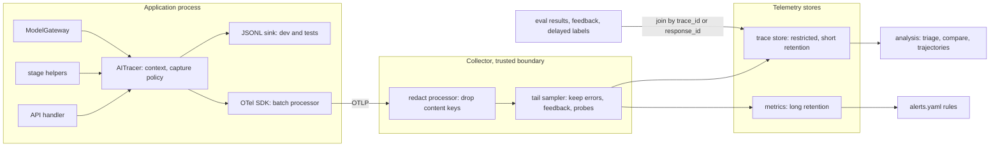
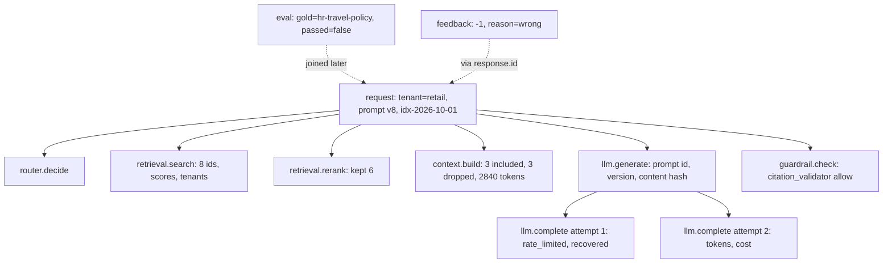
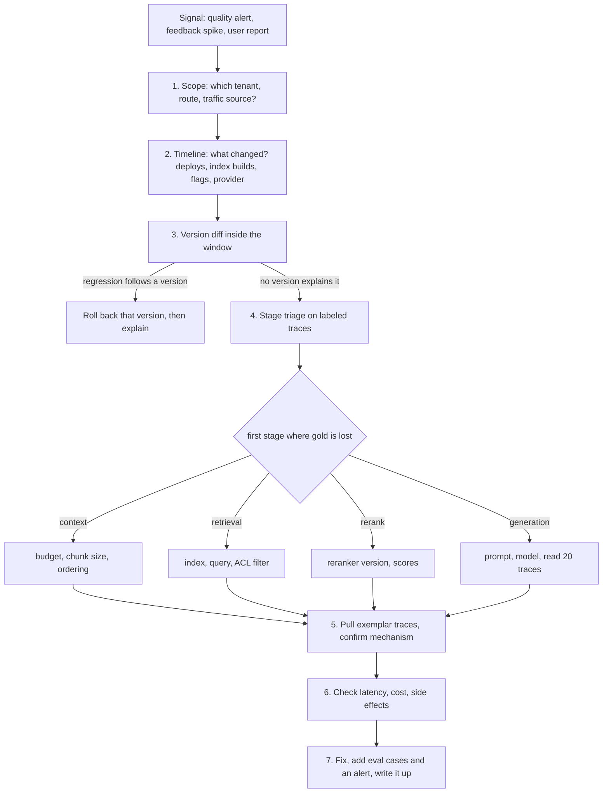

# Chapter 31 — Observability for AI Systems

This chapter instruments an AI application so that any single answer can be reconstructed and any population-level regression can be localized to a stage, a version, or a tenant. AI systems mostly fail with HTTP 200 and a confident wrong answer, so ordinary request logs cannot see their most important failures.

**You will be able to:**

- Define a tracing schema for requests, retrieval, context building, model calls, tools, agent steps, guardrails, and evaluations, with every behavior-changing version on the trace.
- Capture prompts and responses under an explicit privacy policy: keyed hashes by default, sampled and on-error redaction, per-tenant ceilings.
- Wire the instrumentation into OpenTelemetry (the vendor-neutral standard and SDK for traces, metrics, and logs) so spans nest across libraries and services.
- Derive metrics, dashboards, and sample-size-aware alert rules from the same names, and join evaluation results and user feedback to traces by id.
- Diagnose a quality incident with a fixed playbook: scope, version diff, stage triage on the evidence funnel, exemplar traces.
- Test an observability design for diagnostic power by injecting a known fault and checking that the tools localize it.

**Prerequisites:** Chapter 3 (`aie_core.observability` and the model gateway), Chapters 10 and 14 (the RAG debugging tree and evidence metrics), Chapter 24 (failure taxonomies), and Chapter 29 (SLOs and burn rates). | **Code:** `book/projects/examples/ch31/` (run: `cd book/projects/examples/ch31 && pytest -q`) | **Builds:** the `ch31` observability toolkit: `AITracer` with a capture policy, an OpenTelemetry bridge, a trace store with debugging queries, a metric registry with alert rules, and a signal-join CLI.

**First reading:** Why this matters, Mental model, Core concepts, How it works, The tracer and the capture policy, Debugging queries, Metrics and alert rules, Joining signals, The debugging playbook (with its worked incident), Before you ship. **Deep dives** (skip on a first pass): Semantic conventions, OpenTelemetry wiring, Which tracer, wrapped in what order, The trace store, Tests, Code walkthrough.

## Why this matters

A conventional service fails loudly: a null pointer becomes a 500, and the stack trace tells you where to look. An AI system mostly fails quietly. It returns HTTP 200 in 3.8 seconds with a fluent, confidently wrong answer that nothing in the request log distinguishes from a correct one. The model got the wrong evidence, an outdated policy, or a tool result it misread. Debugging that requires the exact context the model saw, and if you did not record it when the request ran, you cannot recover it: indexes are rebuilt, prompts are edited, and model aliases move.

The second reason is change. Prompts, models (sometimes changed by the provider without notice), indexes, chunkers, embedding models, guardrail policies, tool schemas, and flags are all versioned independently, and any of them can degrade quality without a code deploy. Telemetry that records versions lets you see which version a regression follows; telemetry that does not forces you to guess.

The third reason is money and risk. Tokens are the dominant variable cost, and context size, retries, and agent step counts drift. Telemetry is also a liability: a trace that captures full prompts captures whatever users typed. AI observability must record enough to debug semantic failures, in a shape that supports population analysis, and no more than policy allows.

## Mental model

> **Mental model:** AI observability is ordinary distributed tracing plus model, context, and evaluation metadata. The trace answers "what happened to this request"; the metadata answers "why was the answer wrong".

Picture one request as a tree. The root is stamped with who asked (tenant, hashed user id), the route, and the versions in play. Its children are the stages: routing, retrieval, reranking, context building, generation, validation, and for agents a run of steps containing model and tool calls. Each node records duration and status plus what the stage decided: ids returned and dropped, tokens spent, guardrail decisions. Labels that arrive later, such as an evaluation verdict or a thumbs-down, join onto the tree by its id.

Metrics are counts over many trees, cheap enough to keep for everything and to alert on. Traces are individual trees, sampled and kept long enough to debug. Logs are events inside a node, best stored as span events so they keep their context. Debugging is a walk down the tree: find the population that regressed, split by versions, then walk the stages until the gold evidence disappears.

## Core concepts

### Why AI telemetry differs from service telemetry

Request rate, error rate, and duration (the RED method) remain necessary and insufficient. Four properties change what you must record.

**Correctness is not an exit code.** The worst failures are semantic and do not raise, so quality signals from evaluations, judges, probes, and users must attach to the same traces as the operational data.

**The input is constructed, not received.** The model's input is assembled from a template, retrieved chunks, history, memory, and tool outputs. Reproducing an answer needs that context, or the ids and versions to reassemble it (Chapter 1's request lineage, made operational).

**Behavior depends on versioned artifacts outside the code.** Index, chunker, prompt, model, and policy versions belong on every trace, or you cannot tell whether quality dropped for everyone or only for traffic that hit the new thing.

**Cost and latency scale with content.** A context that grows by a thousand tokens is invisible in request counts and obvious in a per-request token histogram, so tokens, retries, and step counts are first-class attributes.

### The trace model

A **trace** is one end-to-end task, identified by a 128-bit trace id. A **span** is one unit of work inside it, with a span id, a parent span id, a name, start and end times, a status, typed attributes, and events. The parent links make the tree. Spans from different services assemble into one tree as long as the trace context is propagated between them, over HTTP with the W3C `traceparent` header.

For Northwind Assist the span vocabulary is fixed in `semconv.py`:

| Span | What it covers | Key attributes |
|---|---|---|
| `request` | one user-visible request, the root | tenant, hashed user, route, traffic source, response id, every version |
| `router.decide` | route and model choice (Chapter 7) | chosen route, model |
| `retrieval.search` | first-stage retrieval | index version, returned ids, scores, tenants |
| `retrieval.rerank` | second-stage ranking | reranker model, kept ids |
| `context.build` | evidence packing (Chapters 5 and 13) | included ids in order, dropped ids, tokens, budget |
| `llm.generate` | one logical generation | prompt id and version, usage, finish reason, captured content |
| `llm.complete` | one provider attempt, from `ModelGateway` | provider, model, tokens, cost, cache hit, attempt number |
| `tool.call` | one tool execution (Chapter 16) | tool name, argument fingerprint, status, approval |
| `agent.run` / `agent.step` | an agent loop and its steps (Chapter 19) | step number, action, cumulative tokens, stop reason |
| `guardrail.check` | one policy decision (Chapter 27) | name, decision, reason, policy version |
| `eval.score` | an inline evaluation, such as an online judge | eval name, score, passed |

The split between `llm.generate` and `llm.complete` is deliberate. A logical generation may take several provider attempts (retries, fallbacks), each with its own latency, error, and possibly model. Cost belongs to the attempts; prompt identity and captured content belong to the logical call. Merging them either double-counts tokens or loses the record of retries.

One vocabulary means one owner of names. Earlier components with their own names, such as Chapter 7's router (`router.complete`) and Chapter 27's guardrail pipeline (`guardrail.action`), should emit this chapter's names at their boundary or have their keys added to the rename map in `normalize()`. Keep `guardrail.errors` as is, because Chapter 27 alerts on its rate.

### What to record, stage by stage

Every attribute should answer a debugging question or feed an aggregation; anything else is noise you pay to store.

**Prompts and responses.** Always record prompt id, version, and a hash of the rendered template. The rendered prompt and response are content, governed by the capture policy below; by default only their length and a keyed hash are kept.

**Model calls.** Record provider, requested and served model (they differ under fallbacks), input, output, and cached tokens, cost, finish reason, attempt number, queue time, and latency. A `finish_reason` of `length` is a truncated answer and deserves its own error class.

**Retrieval results.** Record ids, scores, and the tenant of each item, not text. Ids join against gold evidence, the index manifest, and ACLs, and per-item tenants turn Chapter 28's zero cross-tenant leakage requirement into a telemetry query; the instrumentation marks a violating span `retrieval_contamination` as it is recorded.

**Context assembly.** Record which evidence ids were included, in order, and which were dropped. This separates evidence that never reached the model from evidence it ignored, the distinction the worked incident turns on.

**Tool calls.** Record name, call id, a keyed argument fingerprint, status, side-effect flag, approval state, idempotency key, and result size. The fingerprint detects loops without storing arguments.

**Tokens, latency, cost.** Record these on the stage that spent them; totals derive from stages, not the reverse. A cache hit records `cost_usd=0` and the avoided price separately, or a better cache would look like a cost increase; normalization enforces this at export and load, as Chapter 30's `chargeback()` does.

**Labels.** Evaluations, judges, probes, reviews, and feedback carry the trace id or a client-visible response id and are joined later, unless a judge runs in the request path.

**Agent trajectories.** Each step records its action and cumulative tokens, with the model call and tool call as children; the run records the stop reason. That supports automatic checks: no repeated identical calls past a threshold, no side effect before approval, termination for a stated reason.

### Errors as a taxonomy, not a boolean

`status=error` says that something failed, not what to fix. As with Chapter 24's failure taxonomies, every failing span carries an `error.class` from a closed vocabulary: retrieval miss, retrieval contamination, permission denied, context truncation, unsupported claim, citation mismatch, format error, bad refusal, tool selection, tool argument, tool failure, loop, premature stop, budget exceeded, timeout, rate limited, provider error, content filter, unsafe content. Exceptions are mapped by class name (`RateLimitError` becomes `rate_limited`); semantic failures are marked with `mark_error(span, ErrorClass.LOOP, ...)`.

A rate-limited attempt that was retried successfully is a reliability event, not a quality failure. The trace store keeps `error_classes` (failures that affected the outcome) apart from `recovered_errors` (absorbed by retries or fallbacks). Without the split, every retry inflates the error rate and on-call engineers learn to ignore it.

### Privacy and redaction of telemetry

Telemetry is a copy of your users' data with weaker access controls and more readers. The capture policy in `instrument.py` decides, per span, when the span ends:

| Mode | What is stored for a content field | Use |
|---|---|---|
| `off` | length only | regulated tenants, highest-volume routes |
| `hashed` | length plus a keyed hash (HMAC with a secret salt) | default: dedup and equality without content |
| `redacted` | hash plus pattern-redacted text, truncated | sampled traces and failing spans |
| `full` | hash plus raw text, truncated | short-lived debugging under explicit approval |

Four controls compose. A default mode applies to all traffic. A sample rate upgrades a fraction of traces, chosen by hashing the trace id so every service agrees and no trace is half-captured. An on-error mode upgrades failed spans, the ones you will debug. A per-tenant ceiling is applied last and caps everything: contractual and residency limits override debugging convenience.

The hash is keyed. A plain SHA-256 of an email address can be reversed by hashing likely addresses; an HMAC with a secret salt cannot. The same keyed digest produces `user.hash`, so you can count users and follow a session without storing who they are.

Regex redaction (emails, phones, cards, key shapes, employee ids) is a floor: names and free-text medical descriptions pass straight through. Production systems put a PII detector behind the same `redactor` function and wrap the tracer in Chapter 27's `RedactingTracer`. Exception messages obey the same mode and ceiling. As a second line of defense, Chapter 28's collector deletes every attribute ending in `.content` before the shared store; routes allowed to keep redacted content export through a separate, restricted pipeline. Deletion requests must reach telemetry too, by `user.hash`.

### Metrics, logs, and traces

**Metrics** answer "how often" and "how much" over a few low-cardinality dimensions: tenant, route, prompt version, index version, model. They are cheap, kept for everything, and the only signal to alert on directly. Never put trace ids, user ids, or free text in metric labels: each distinct value creates its own time series, so an unbounded label multiplies the series count (its cardinality) and the bill.

**Traces** answer "what happened to this request" and are sampled. Head sampling decides at the root by trace-id ratio, simply and consistently across services. Tail sampling decides after completion, so it can keep every error and every request with negative feedback, but needs a collector that buffers whole traces. A common arrangement keeps all errored, feedback, and probe traces plus a few percent of the rest.

**Logs** answer "what exactly happened here". Most would-be log lines, such as a validator's reason, belong as span events so they keep their context.

This chapter's code derives metrics from traces so one set of definitions can be tested offline; production emits the same quantities as counters and histograms at request time.

### Online signals

Offline evaluation (Chapters 24 and 25) gates releases. Production supplies imperfect signals:

- **Probes** are golden questions with known gold evidence, sent through production on a schedule and tagged `traffic.source=probe`. They are the only production signal with stage-level ground truth. Exclude them from user-facing metrics and billing.
- **Sampled judges** score a fraction of traffic. Calibrate them against human labels and track agreement over time.
- **User feedback** is biased toward unhappy users, sparse, and delayed: a trend signal, never a level.
- **Behavioral signals** (rephrasing, abandoning, escalating, editing a draft) are plentiful and ambiguous; use them as corroboration.
- **Delayed labels**, such as a ticket reopened a week later, are the closest thing to ground truth, if the id was stored at the point of action.

All of these join to traces by id. The client never sees trace ids, so the API returns a `response.id` that the root span records and feedback references. `join_signals.py` resolves labels to traces and reports how many could not be matched, a direct measure of telemetry gaps.

## How it works

The handler opens the root span with `trace_request`. `AITracer`, in `instrument.py`, keeps the current span in a context variable, so every span opened deeper in the call stack becomes its child without span objects being passed around. Stage helpers open child spans and record each stage's decision, and the gateway, given the same tracer, nests one `llm.complete` per provider attempt under `llm.generate`.

Three details make this work with earlier chapters' code:

1. **Ids.** `AITracer` gives every span a trace id and parent id (OpenTelemetry's ids under `OTelAITracer`). A span without them loads as its own trace, and `completeness()` reports it as a gap.
2. **Key names.** The gateway writes unprefixed keys (`model`, `input_tokens`), mostly after the span opens, so the tracer normalizes at open and close, and the trace store again at load.
3. **Lineage on provider attempts.** The gateway's `llm.complete` span cannot see request metadata. When a span sets a lineage key (version manifest, prompt identity, tenant, route), the tracer copies it into baggage, a dictionary that travels with the trace context, and stamps every `llm.complete` from it. Provider attempts alone can then be grouped by prompt or index version.

When a span ends, the tracer applies the capture policy, classifies exceptions, and hands the span to a sink such as `JsonlTracer`. Offline, `TraceStore` rebuilds the trees, attaches labels, and filters.

## Architecture

The first diagram shows the data path and where content crosses a trust boundary.



Content leaves the process only after the capture policy has run, and the collector redacts again, independently, before any shared store. Labels join late by id.

The second diagram is one Northwind trace, the tree the analysis code walks.



## Implementation

The project layout:

```
book/projects/examples/ch31/
  semconv.py              span names, attribute keys, error taxonomy, GenAI aliases
  instrument.py           AITracer, CapturePolicy, redact, stage helpers, decorators
  otel_setup.py           build_provider, OTelAITracer, tracer_from_env
  trace_store.py          SpanRecord, TraceTree, TraceStore
  analysis.py             debugging queries
  metrics.py              metric registry, alert evaluator
  alerts.yaml             alert rules
  dashboards.md           metric definitions by dashboard panel
  join_signals.py         CLI joining eval results and feedback to traces
  incident_sim.py         synthetic workload driven through the real instrumentation
  incident_walkthrough.py the playbook, end to end
  pyproject.toml, .env.example, README.md
  tests/                  test_instrument.py, test_otel.py, test_analysis.py, test_slo_alerts.py,
                          test_hardening.py
```

Configuration comes from environment variables listed in the README and `.env.example`. The ones you set first are `TRACE_SINK` (`none`, `jsonl`, `otel`), `TRACE_PATH`, `CAPTURE_MODE`, `CAPTURE_SAMPLE_RATE`, and `CAPTURE_SALT`, which is a secret.

### Semantic conventions

> **Deep dive.** The full name vocabulary and how it maps to OpenTelemetry's GenAI conventions; skip on a first reading.

A semantic convention is an agreed name and meaning for each span and attribute. One module owns every name, and everything else imports from it, so names cannot drift. The excerpt includes the mapping to OpenTelemetry's GenAI semantic conventions, the standard's attribute names for model calls:

```python
# path: book/projects/examples/ch31/semconv.py (excerpt; full file on disk)
class SpanName:
    REQUEST = "request"
    ROUTER = "router.decide"
    RETRIEVAL = "retrieval.search"
    RERANK = "retrieval.rerank"
    CONTEXT = "context.build"
    GENERATE = "llm.generate"            # one logical generation: prompt identity + content
    LLM_ATTEMPT = "llm.complete"         # one provider attempt, emitted by aie_core's ModelGateway
    TOOL = "tool.call"
    AGENT_RUN = "agent.run"
    AGENT_STEP = "agent.step"
    GUARDRAIL = "guardrail.check"
    EVAL = "eval.score"


class Attr:
    TENANT = "tenant.id"
    USER_HASH = "user.hash"              # salted hash, never the raw user id
    ROUTE = "app.route"
    RESPONSE_ID = "response.id"          # id shown to the client; feedback references it
    TRAFFIC = "traffic.source"           # "user" | "probe" | "replay" | "eval"
    PROMPT_ID = "prompt.id"
    PROMPT_VERSION = "prompt.version"
    INDEX_VERSION = "index.version"
    CHUNKER_VERSION = "chunker.version"
    LLM_MODEL = "llm.model"
    LLM_INPUT_TOKENS = "llm.usage.input_tokens"
    LLM_COST = "llm.cost_usd"
    RETRIEVAL_IDS = "retrieval.returned_ids"
    CONTEXT_IDS = "context.evidence_ids"
    CONTEXT_DROPPED = "context.dropped_ids"
    CITATION_IDS = "response.citation_ids"
    TOOL_STATUS = "tool.status"          # ok | error | denied | timeout
    AGENT_STOP = "agent.stop_reason"     # done | max_steps | budget | error | escalated
    GUARD_DECISION = "guardrail.decision"  # allow | block | redact | flag
    ERROR_CLASS = "error.class"
    # ... about fifty keys in total


class ErrorClass(str, Enum):
    RETRIEVAL_MISS = "retrieval_miss"
    RETRIEVAL_CONTAMINATION = "retrieval_contamination"
    CONTEXT_TRUNCATION = "context_truncation"
    UNSUPPORTED_CLAIM = "unsupported_claim"
    CITATION_MISMATCH = "citation_mismatch"
    LOOP = "loop"
    RATE_LIMITED = "rate_limited"
    # ... twenty classes in total


GENAI_ALIASES: dict[str, str] = {
    Attr.LLM_PROVIDER: "gen_ai.provider.name",
    Attr.LLM_MODEL: "gen_ai.request.model",
    Attr.LLM_INPUT_TOKENS: "gen_ai.usage.input_tokens",
    Attr.LLM_OUTPUT_TOKENS: "gen_ai.usage.output_tokens",
    Attr.TOOL_NAME: "gen_ai.tool.name",
    Attr.AGENT_NAME: "gen_ai.agent.name",
}
```

Why not adopt the GenAI conventions directly? Many LLM observability tools read them, which argues for aligning, but as of 2026 most GenAI attributes are still in development status and keys have been renamed between releases. A local vocabulary with one mapping table isolates you from that churn. `AITracer(emit_genai_aliases=True)` dual-writes both names; when a key stabilizes, flip the mapping so the standard name is primary, and pin the convention version you emit. Whether content is captured stays your capture policy's decision, whatever the conventions say about where it goes.

### The tracer and the capture policy

`AITracer` subclasses `aie_core`'s `Tracer`, so it is accepted anywhere a `Tracer` is, including `ModelGateway(tracer=...)`. The core is the `span` context manager:

```python
# path: book/projects/examples/ch31/instrument.py (excerpt; full file on disk)
PROPAGATED_KEYS: tuple[str, ...] = (*VERSION_KEYS, "prompt.hash", Attr.TENANT, Attr.ROUTE)


@dataclass
class LinkedSpan(Span):
    """An aie_core Span plus the fields that make a tree: trace id, parent id, resource."""
    trace_id: str = ""
    parent_span_id: str | None = None
    resource: dict[str, Any] = field(default_factory=dict)
    baggage: dict[str, Any] = field(default_factory=dict)   # propagated to children, not exported
    pending_content: dict[str, str] = field(default_factory=dict, repr=False)


_current: ContextVar[LinkedSpan | None] = ContextVar("ch31_current_span", default=None)


class AITracer(Tracer):
    # ...
    @contextmanager
    def span(self, name: str, **attributes: Any) -> Iterator[LinkedSpan]:
        parent = _current.get()
        s = LinkedSpan(
            name=name,
            attributes=normalize(name, attributes),
            start=self.clock(),
            span_id=self._hex(64),
            trace_id=parent.trace_id if parent else self._hex(128),
            parent_span_id=parent.span_id if parent else None,
            resource=dict(self.resource),
            baggage=dict(parent.baggage) if parent else {},
        )
        self._propagate(s)
        handle = self._backend_start(s, parent)
        token = _current.set(s)
        try:
            yield s
        except BaseException as exc:
            s.record_exception(exc)
            s.attributes.setdefault(Attr.ERROR_TYPE, type(exc).__name__)
            s.attributes.setdefault(Attr.ERROR_CLASS, classify_exception(exc).value)
            raise
        finally:
            _current.reset(token)
            s.end = self.clock()
            self._finalize(s)
            self._backend_end(s, handle)
            self.sink.export(s)
```

The order in the `finally` block matters: `_finalize` (on disk) normalizes keys and applies the capture policy, `_backend_end` lets `OTelAITracer` copy attributes to the real OpenTelemetry span, and only then does the sink see the span.

`_propagate` is a separate method because the gateway's streaming path builds its span by hand and passes it to `tracer.export()` when the stream ends. `export()` adopts that span into the current trace and calls `_propagate`, so a streamed attempt carries the same lineage as any other. Consume streams inside the request's spans: one drained after its parent closed is adopted with no parent and no baggage.

The capture policy decides how much content to keep when the span ends, which is why content is offered with `tracer.capture(span, key, value)` rather than written as an attribute:

```python
# path: book/projects/examples/ch31/instrument.py (excerpt; full file on disk)
@dataclass
class CapturePolicy:
    mode: CaptureMode = "hashed"
    sample_rate: float = 0.0
    sampled_mode: CaptureMode = "redacted"
    on_error_mode: CaptureMode | None = "redacted"
    max_chars: int = 4000
    salt: str = "change-me"
    tenant_ceiling: dict[str, CaptureMode] = field(default_factory=dict)
    redactor: Callable[[str], str] = redact

    def decide(self, trace_id: str, tenant: str | None, errored: bool) -> CaptureMode:
        mode: CaptureMode = self.mode
        if self.sample_rate > 0 and _bucket(trace_id) < self.sample_rate:
            mode = max(mode, self.sampled_mode, key=_MODE_RANK.__getitem__)
        if errored and self.on_error_mode:
            mode = max(mode, self.on_error_mode, key=_MODE_RANK.__getitem__)
        ceiling = self.tenant_ceiling.get(tenant or "")
        if ceiling is not None:
            mode = min(mode, ceiling, key=_MODE_RANK.__getitem__)
        return mode

    def digest(self, text: str) -> str:
        # keyed hash: a plain sha256 of an email address is reversible by dictionary attack
        return hmac.new(self.salt.encode(), text.encode(), hashlib.sha256).hexdigest()[:16]

    def render(self, key: str, text: str, mode: CaptureMode) -> dict[str, Any]:
        out: dict[str, Any] = {f"{key}.chars": len(text)}
        if mode == "off":
            return out
        out[f"{key}.hash"] = self.digest(text)
        if mode == "redacted":
            out[f"{key}.content"] = self.redactor(text)[: self.max_chars]
        elif mode == "full":
            out[f"{key}.content"] = text[: self.max_chars]
        return out
```

The stage helpers are thin: each opens a span with the right name, records the stage's decision through a typed handle, and leaves control flow to the caller. Instrumenting a RAG request looks like this:

```python
# illustrative usage; incident_sim.py contains the complete, runnable version
with trace_request(tracer, route="rag.answer", tenant="retail", user_id=user.id,
                   response_id=response_id, versions=manifest):
    with retrieval_span(tracer, query, index_version=manifest["index.version"], top_k=8) as r:
        hits = retriever.search(query, k=8, groups=user.groups)
        r.results([h.id for h in hits], [h.score for h in hits], tenants=[h.tenant for h in hits])
    with rerank_span(tracer, model="rerank-small", candidates=len(hits)) as rr:
        kept = reranker.rerank(query, hits)[:6]
        rr.kept([h.id for h in kept])
    with context_span(tracer, budget_tokens=3000) as c:
        packed = packer.pack(kept, budget=3000)
        c.packed(packed.included_ids, packed.dropped_ids, packed.tokens)
    completion = traced_generation(tracer, gateway, request, prompt_id="rag-answer", prompt_version="8")
    with guardrail_span(tracer, "citation_validator", stage="output", policy_version="cv-3") as g:
        g.decide("allow", "citations resolve to context")
```

Tools get `@traced_tool(tracer, "search_tickets")`, which records the argument fingerprint, captures arguments and result under the policy, and maps `PermissionError` to status `denied` and other exceptions to `tool_failure`. Agents get `agent_run` and `agent_step`; a run ends with `run.stop("done")` or `run.stop("max_steps", error_class=ErrorClass.LOOP)`.

### OpenTelemetry wiring

> **Deep dive.** How the tracer becomes real OpenTelemetry spans; skip on a first reading.

`build_provider` creates a private `TracerProvider` with a parent-based ratio sampler and a batched exporter, so the request path never waits on telemetry. `OTelAITracer` overrides the two backend hooks: at start it opens a real OpenTelemetry span and adopts its ids, so auto-instrumented HTTP and database clients nest under the current stage; at end it copies attributes, events, and status:

```python
# path: book/projects/examples/ch31/otel_setup.py (excerpt; full file on disk)
def build_provider(
    service_name: str,
    *,
    exporter: ExporterKind = "console",
    resource_attributes: dict[str, Any] | None = None,
    endpoint: str | None = None,
    sample_ratio: float = 1.0,
) -> tuple[TracerProvider, SpanExporter | None]:
    """A private TracerProvider (not the global one, so tests stay isolated)."""
    resource = Resource.create({"service.name": service_name, **(resource_attributes or {})})
    # ParentBased: a child follows its parent's decision, so a trace is never half-sampled
    provider = TracerProvider(resource=resource, sampler=ParentBased(TraceIdRatioBased(sample_ratio)))
    span_exporter: SpanExporter | None
    if exporter == "memory":
        span_exporter = InMemorySpanExporter()
        provider.add_span_processor(SimpleSpanProcessor(span_exporter))
    elif exporter == "console":
        span_exporter = ConsoleSpanExporter()
        provider.add_span_processor(BatchSpanProcessor(span_exporter))
    elif exporter == "otlp":
        span_exporter = _otlp_exporter(endpoint)
        provider.add_span_processor(BatchSpanProcessor(span_exporter, max_queue_size=4096, max_export_batch_size=512))
    else:
        span_exporter = None
    return provider, span_exporter


class OTelAITracer(AITracer):
    # ...
    def _backend_start(self, span: LinkedSpan, parent: LinkedSpan | None) -> Any:
        otel_span = self._otel.start_span(span.name, start_time=int(span.start * 1e9))
        ctx = otel_span.get_span_context()
        span.trace_id = format(ctx.trace_id, "032x")
        span.span_id = format(ctx.span_id, "016x")
        token = otel_context.attach(otel_trace.set_span_in_context(otel_span))
        return otel_span, token

    def _backend_end(self, span: LinkedSpan, handle: Any) -> None:
        otel_span, token = handle
        for key, value in span.attributes.items():
            if value is not None:
                otel_span.set_attribute(key, _otel_value(value))
        for ev in span.events:
            otel_span.add_event(str(ev.get("type", "event")), {k: str(v) for k, v in ev.items() if k not in ("type", "time")})
        if span.status == "error":
            otel_span.set_status(Status(StatusCode.ERROR, str(span.attributes.get("error.class", ""))))
        otel_span.end(end_time=int((span.end or span.start) * 1e9))
        otel_context.detach(token)
```

`aie_core`'s own `OTelTracer` creates OpenTelemetry spans only when ours finish, so it cannot express parentage: a child finishes before its parent exists on the OpenTelemetry side. Opening the real span at start makes nesting and cross-service propagation work. `tracer_from_env()` picks the backend from `TRACE_SINK`, so application code is the same everywhere.

### Which tracer, wrapped in what order

> **Deep dive.** How this chapter's tracer composes with the wrappers from Chapters 27 and 30; skip on a first reading.

Several chapters contribute a `Tracer`. The wrapping order decides whether spans nest and whether anything unredacted reaches a backend.

| Tracer | Module | What it does | Where it goes |
|---|---|---|---|
| `JsonlTracer`, `InMemoryTracer`, `NoopTracer` | `aie_core.observability` (Chapter 3) | write, keep, or discard finished spans | innermost: the sink |
| `OTelTracer` | `aie_core.observability` | flat OpenTelemetry spans created at finish | alone, for flat instrumentation; never with `AITracer` |
| `AITracer` | `ch31/instrument.py` | ids, baggage, normalization, capture policy | the core; takes a sink |
| `OTelAITracer` | `ch31/otel_setup.py` | `AITracer` backed by real OpenTelemetry spans | replaces `AITracer` when exporting OTLP |
| `RedactingTracer` | `guardrails.telemetry` (Chapter 27) | scrubs secrets and PII on write and when the span body exits | outermost: the handle the application holds |
| `AttributingTracer` | `ch30/attribution.py` | stamps `bind()` attributes at export | the sink of `AITracer`, wrapping the real sink |

```python
# illustrative composition of the classes in the table
tracer = RedactingTracer(
    OTelAITracer(provider, capture=policy,
                 sink=AttributingTracer(JsonlTracer("traces.jsonl"))))
```

When a span ends, the work runs from the outside in: `RedactingTracer` scrubs attributes, events, and pending content; `AITracer` renders content under the capture policy; `OTelAITracer` copies the now-scrubbed attributes to the OpenTelemetry span; `AttributingTracer` stamps bound attributes; `JsonlTracer` writes. Redaction is outermost in the wrapping and first in the work, so no backend sees raw values.

Two orders break things. `AttributingTracer(AITracer(...))` breaks the tree, because the wrapper opens spans with `aie_core`'s base `span()`, which never sets this chapter's current span, so every span becomes its own trace. And `AttributingTracer` stamps after the OpenTelemetry copy, so bound keys reach the mirror sink but not the OpenTelemetry span. Put keys the backend needs (`tenant.id`, `app.route`) on the root span, where baggage carries them to provider attempts.

### The trace store

> **Deep dive.** How flat span records become trees with orphans and recovered errors; skip on a first reading.

`TraceStore` rebuilds trees from flat span records, as every tracing backend does:

```python
# path: book/projects/examples/ch31/trace_store.py (excerpt; full file on disk)
class TraceTree:
    def __init__(self, trace_id: str, spans: list[SpanRecord]) -> None:
        self.trace_id = trace_id
        self.spans = sorted(spans, key=lambda s: (s.start, s.span_id))
        self.by_id = {s.span_id: s for s in self.spans}
        self.children: dict[str | None, list[SpanRecord]] = defaultdict(list)
        self.orphans: list[SpanRecord] = []
        for s in self.spans:
            if s.parent_span_id is not None and s.parent_span_id not in self.by_id:
                self.orphans.append(s)
                self.children[None].append(s)
            else:
                self.children[s.parent_span_id].append(s)
        roots = self.children.get(None, [])
        real_roots = [s for s in roots if s.parent_span_id is None]
        self.root: SpanRecord | None = (real_roots or roots or [None])[0]
        self.evals: list[dict[str, Any]] = []
        self.feedback: list[dict[str, Any]] = []

    def _recovered(self, s: SpanRecord) -> bool:
        # a failed provider attempt whose parent generation succeeded was retried or fell back
        parent = self.by_id.get(s.parent_span_id or "")
        return s.name == SpanName.LLM_ATTEMPT and parent is not None and not parent.is_error

    @property
    def error_classes(self) -> set[str]:
        return {s.attributes[Attr.ERROR_CLASS] for s in self.spans
                if s.attributes.get(Attr.ERROR_CLASS) and not self._recovered(s)}
```

`TraceStore.filter(...)` takes tenant, route, traffic source, error class, versions, a time range, and a predicate, and returns a new store, so filters chain. `attach_feedback` joins by trace id or response id and keeps unmatched rows. `completeness()` reports, for each required root key, the fraction of traces that lack it, plus the orphan rate: Chapter 1's self-reporting lineage record applied to the whole trace stream.

### Debugging queries

The most useful single query is the evidence funnel. For every labeled trace, it asks whether the gold evidence survived each stage, cumulatively, because a stage cannot recover evidence an earlier stage lost:

```python
# path: book/projects/examples/ch31/analysis.py (excerpt; full file on disk)
def evidence_path(tree: TraceTree) -> dict[str, bool] | None:
    gold = set(tree.gold_ids or [])
    if not gold:
        return None
    retrieval, rerank, context = tree.first(SpanName.RETRIEVAL), tree.first(SpanName.RERANK), tree.first(SpanName.CONTEXT)
    retrieved = gold <= _ids(retrieval.attributes.get(Attr.RETRIEVAL_IDS)) if retrieval else False
    reranked = gold <= _ids(rerank.attributes.get(Attr.RERANK_IDS)) if rerank else retrieved
    in_context = gold <= _ids(context.attributes.get(Attr.CONTEXT_IDS)) if context else reranked
    cited = bool(gold & _ids(tree.get(Attr.CITATION_IDS)))
    passed = bool(tree.eval_passed)
    # survival is cumulative: a stage cannot recover evidence an earlier stage lost
    path = {"retrieved": retrieved}
    path["reranked"] = path["retrieved"] and reranked
    path["in_context"] = path["reranked"] and in_context
    path["cited"] = path["in_context"] and cited
    path["answer_passed"] = passed
    return path


def triage_by_stage(baseline: TraceStore, candidate: TraceStore, *, tolerance: float = 0.05) -> TriageReport:
    fb, fc = gold_funnel(baseline), gold_funnel(candidate)
    cb, cc = _conditional(fb), _conditional(fc)
    drop = {s: cb[s] - cc[s] for s in FUNNEL_STAGES}
    first = next((s for s in FUNNEL_STAGES[:-1] if drop[s] > tolerance), None)
    # ...
```

`_conditional` (on disk) turns the funnel into the probability of surviving each stage given survival of the previous one. Triage compares these conditional rates, not absolute ones, because an absolute drop propagates: if retrieval loses evidence, every later stage looks worse too. The conditional rate isolates the stage where loss begins. The other queries:

- **`compare_versions`** splits a store on any version key and compares quality, latency, tokens, and cost, with bootstrap confidence intervals.
- **`retrieved_not_cited`** lists labeled traces whose gold evidence was retrieved but not cited, with its rank and whether the packer dropped it.
- **`latency_breakdown`** and **`cost_by_tenant`** attribute time and money to stages and tenants.
- **`trajectory_view` and `trajectory_issues`** render an agent run step by step and flag loops and unapproved side effects.

### Metrics and alert rules

`metrics.py` holds a registry of named metrics computed from a store, plus the family `errors.class_rate:<class>`. Each metric declares its sample size: a pass rate over 300 requests of which 12 are labeled is a 12-sample estimate, and `min_samples` must see 12, not 300. Each rule in `alerts.yaml` names a metric, a window, a threshold or a ratio to a preceding baseline window, a minimum sample count, an optional group-by, a severity, and a runbook:

```yaml
# path: book/projects/examples/ch31/alerts.yaml (excerpt; full file on disk)
rules:
  - name: answer_quality_drop
    metric: quality.eval_pass_rate          # probe + sampled-judge traffic only (labeled traces)
    window: 6h
    baseline_window: 24h
    condition: {op: "<", baseline_ratio: 0.92}
    min_samples: 30
    group_by: tenant.id
    severity: page
    runbook: "Chapter 31 playbook, steps 1-4: scope, version diff, stage triage"

  - name: context_truncation_high
    metric: quality.context_truncation_rate
    window: 1h
    condition: {op: ">", threshold: 0.15}
    min_samples: 30
    severity: ticket

  - name: request_p95_slo
    metric: latency.request_p95_ms
    window: 1h
    condition: {op: ">", threshold: 8000}     # p95 completion under 8 s (Northwind target)
    min_samples: 50
    severity: page

  - name: cross_tenant_retrieval
    metric: errors.class_rate:retrieval_contamination
    window: 1h
    condition: {op: ">", threshold: 0.0}
    min_samples: 1                            # one event is an incident
    severity: page
```

Service-level objectives get burn-rate rules rather than plain thresholds (Chapter 29 owns the arithmetic). `slo.availability_burn_rate` is the failed share divided by the error budget, so 1.0 spends a 30-day budget in exactly 30 days. A `confirm_window` makes the rule fire only when a short window breaches as well: the hour proves it is not a blip, the last five minutes prove it is still happening, and the page clears itself when the incident ends.

```yaml
# path: book/projects/examples/ch31/alerts.yaml (excerpt; full file on disk)
  - name: availability_fast_burn
    metric: slo.availability_burn_rate
    window: 1h
    confirm_window: 5m                        # both windows must burn: not a blip, still happening
    condition: {op: ">", threshold: 14.4}
    min_samples: 50
    severity: page
    runbook: "Chapter 29: breaker states, admission rejections, provider errors; then error_distribution()"
```

A burn rate of 14.4 for an hour spends 2% of a 30-day budget. Against the 99.5% availability objective that means 7.2% failed requests. Against the 95% completion objective the same burn would need 72% of requests over 8 seconds, so latency gets a slower ticket-level burn rule, and the p95 threshold rule stays the fast latency signal. If a loose objective pages too late, tighten the objective, not the alert.

The full file also covers feedback, guardrail blocks, cost, agent loops, and telemetry gaps; a test asserts that every metric an alert references exists in the registry.

### Joining signals

`join_signals.py` is a library and a CLI. It accepts evalkit `CaseResult` rows (which carry `trace_id`), flat eval rows, and feedback keyed by `response_id` or `trace_id`, writes one joined row per trace, and reports unmatched labels. `sample_for_review` picks traces for human review: half from flagged traces, the rest stratified by tenant so a small tenant is not drowned out.

```bash
python join_signals.py --traces traces.jsonl --evals eval_results.jsonl \
    --feedback feedback.jsonl --out joined.jsonl
```

### Tests

> **Deep dive.** What each test file pins; skip on a first reading.

The tests run offline in about three seconds. `test_instrument.py` covers tree construction, propagation (streamed attempts included), capture modes, the tenant ceiling, and redaction; `test_otel.py` repeats the instrumentation through the OpenTelemetry SDK. `test_analysis.py` turns the worked incident into assertions:

```python
# path: book/projects/examples/ch31/tests/test_analysis.py (excerpt; full file on disk)
def test_stage_triage_points_at_context_build(store):
    before, after = windows(store)
    report = triage_by_stage(before, after)
    assert report.first_failing_stage == "in_context"
    assert abs(report.baseline["retrieved"] - report.candidate["retrieved"]) < 0.06


def test_prompt_canary_is_not_the_cause(store):
    _, after = windows(store)
    cmp = compare_versions(after, Attr.PROMPT_VERSION, "7", "8")
    point, lo, hi = cmp.pass_rate_diff
    assert lo < 0 < hi                       # no detectable quality difference
    assert cmp.b.mean_output_tokens > cmp.a.mean_output_tokens  # v8 is wordier: a cost effect
```

Run them from the project directory:

```bash
cd book/projects/examples/ch31
../../../../.venv/bin/python -m pytest -q
../../../../.venv/bin/python incident_walkthrough.py
```

## Code walkthrough

> **Deep dive.** How the simulator and walkthrough script produce the incident's data; skip on a first reading.

`incident_sim.py` plays the application through the real instrumentation; the playbook's conclusions come from spans and labels alone.

- **RAG requests.** `_rag` follows the instrumentation pattern shown earlier. The query is hashed, with a redacted copy only on the 5% of traces the policy samples, and `context_span` records what fit the 3,000-token budget. Scripted rate limits produce two `llm.complete` attempts under one `llm.generate`, the first reported as recovered.
- **Agent requests.** `_agent` wraps the same pattern in `agent_run` and `agent_step`; the scripted looping runs end with `run.stop("max_steps", error_class=ErrorClass.LOOP)`.
- **Labels.** `_label` writes probe evals with gold ids, a sampled judge that is wrong on purpose about 8% of the time, and feedback keyed by `response.id`. `join_signals.join` attaches them, generalizing Chapter 25's `join_feedback` to every label source.

`incident_walkthrough.py` loads the store from memory or from the JSONL files and drives the playbook below; the tests assert that both load paths give the same answers.

## The debugging playbook: when output quality degrades

The playbook turns the RAG debugging tree (Chapters 10 and 14) and the agent debugging tree (Chapter 19) into a sequence of queries. Each step narrows the search, and no step involves editing a prompt.



1. **Scope.** Split by tenant, route, and traffic source. One tenant points at its data or configuration; all routes point at something shared, such as the model or gateway.
2. **Timeline.** List what changed near the onset: deploys, prompts, index builds, flags, provider models. Version attributes make the list checkable.
3. **Version diff.** Split the incident window by each version key with more than one value and compare quality, tokens, latency, and cost with confidence intervals. If quality follows a version, roll back first and explain second.
4. **Stage triage.** Compare the evidence funnel before and after on labeled traces; the first stage whose conditional survival rate drops is where to look. For agents, use Chapter 19's trajectory checks instead.
5. **Exemplars.** Read concrete traces. A hypothesis is confirmed when traces show it, not when aggregates are consistent with it.
6. **Collateral.** Check latency, cost, and side effects for the same population.
7. **Close the loop.** Fix the cause, add the failing cases to the evaluation set (Chapter 25), tune the alert that should have caught it, and record the incident.

### Worked incident: the chunker that ate the evidence

The telemetry below comes from `incident_walkthrough.py`: synthetic, with illustrative numbers, but produced by the chapter's real instrumentation and tools.

On 1 October at 09:00, a Northwind release shipped two changes. The index was rebuilt as `idx-2026-10-01` with a new chunker, `c3`, which produces chunks of roughly 900 tokens instead of 380 so policy sections stay together. Prompt `rag-answer` v8, with a reworded answer style, went to a 50% canary. By 15:00 the pager had fired.

**Step 1, what fired.** The alert evaluator at 15:00, each rule over its own window:

```
FIRED page   answer_quality_drop        group=logistics  quality.eval_pass_rate=0.6379 < 0.7769  (n=58)
FIRED page   answer_quality_drop        group=retail     quality.eval_pass_rate=0.5974 < 0.8433  (n=77)
FIRED ticket negative_feedback_spike    group=retail     quality.negative_feedback_rate=0.2353 > 0.2264  (n=68)
FIRED ticket context_truncation_high    group=all        quality.context_truncation_rate=1 > 0.15  (n=76)
quiet: agent_loops, availability_fast_burn, completion_slow_burn, cost_per_request_jump, cross_tenant_retrieval, guardrail_block_surge, request_p95_slo, telemetry_gaps, trace_error_rate
```

The quiet list matters as much as the fired one: latency, cost, errors, SLO burn, and telemetry health are within bounds, so an HTTP-only dashboard would show a healthy service. The pass rates rest on 58 and 77 labeled traces, not the full request counts.

**Step 2, scope.** Both tenants regressed on the RAG route; the unlabeled agent route has flat feedback:

```
retail    rag.answer       pass 0.92 -> 0.60   neg.fb 0.15 -> 0.24   n=256/290
logistics rag.answer       pass 0.84 -> 0.64   neg.fb 0.09 -> 0.14   n=154/162
logistics agent.incident   unlabeled; neg.fb 0.00 -> 0.00   n=26/28
```

A shared cause on the RAG path is likely, and the version attributes give two candidates: the prompt canary and the index rebuild.

**Step 3, version diff.** The prompt canary is a clean experiment, both versions running in the same window on the same index:

```
prompt.version                   7             8
requests                       234           218
labeled                         68            67
eval pass rate               0.618         0.612
neg. feedback rate           0.191         0.224
p50 latency ms                3636          4170
p95 latency ms                4500          5038
input tokens/req              3076          3083
output tokens/req              159           186
cost/req (illus.)          0.00148       0.00153
pass-rate diff (b-a): -0.006  95% CI [-0.168, +0.143]
neg-feedback diff (b-a): +0.033  95% CI [-0.132, +0.198]
```

Both versions sit at the same depressed pass rate and the interval straddles zero, so rolling back the prompt, the reflex, would not help. Separately, v8 produces about 17% more output tokens, worth a ticket but not this incident. The index change is not a clean split, because all post-deploy traffic uses the new index; stage triage resolves that.

**Step 4, stage triage.** On probe traces (the only labeled traces with gold evidence ids), comparing the 24 hours before the deploy with the window after:

```
stage           baseline  candidate  cond. drop
(labeled n)           86        112
retrieved           0.99       0.96        0.03
reranked            0.93       0.93       -0.03
in_context          0.93       0.70        0.25  <-- first failing stage
cited               0.93       0.68        0.03
answer_passed       0.92       0.64        0.28
```

Retrieval still finds the gold document (0.03 is within noise at these sample sizes), and reranking keeps it at the same rate. The loss happens in the context packer. Once the evidence is in context, the model cites it as reliably as before. The model is not ignoring the evidence; the evidence never reaches it.

**Step 5, exemplars.** `retrieved_not_cited` lists traces where retrieval found the gold evidence and the answer did not cite it:

```
31 traces; 26 had gold dropped by the context packer
  624312a9ad6e gold=['hr-travel-policy'] rank=6 in_context=False dropped=True cited=['sec-access-control-policy']
  55a467dd80f4 gold=['hr-expense-policy'] rank=5 in_context=False dropped=True cited=['it-vpn-access-runbook']
  e402fee65abf gold=['hr-pto-policy'] rank=2 in_context=True dropped=False cited=['prod-logistics-route-planner']
  74b753578c9c gold=['it-password-reset-runbook'] rank=4 in_context=False dropped=True cited=['prod-logistics-tracking-api']
```

Every packer drop has gold at rank 4 or beyond, the positions that no longer fit once three chunks fill the budget. The third row is a different failure: gold was in context and the model cited something else. That is the background rate of unsupported answers, present before the deploy too. One exemplar tree:

```
request                  4241.1 ms index.version=idx-2026-10-01
  router.decide             1.9 ms
  retrieval.search        109.5 ms index.version=idx-2026-10-01
  retrieval.rerank         81.2 ms
  context.build             5.2 ms context.tokens=2840 context.dropped_ids=['it-password-reset-runbook', 'hr-remote-work-policy', 'hr-travel-policy']
  llm.generate           4041.2 ms llm.usage.input_tokens=3220
    llm.complete         4041.2 ms index.version=idx-2026-10-01 llm.usage.input_tokens=3220
  guardrail.check           2.1 ms
```

Three chunks used 2,840 of the 3,000-token budget, and the next did not fit; with the old chunker, six 380-token chunks fit comfortably. The traces confirm the mechanism: c3 more than doubled chunk size, the budget did not change, and evidence ranked 4 to 6 is retrieved, reranked, and silently discarded. Note `index.version` on the `llm.complete` span, put there by propagation.

**Step 6, collateral.** Request p95 rose from about 4.5 s to 4.9 s, inside the 8 s target. Cost per request rose about 13% (illustrative prices), below the 25% alert threshold, and cost per *successful* request rose more, because failed answers still cost money:

```
before logistics  cost/req 0.00144  cost/success 0.00150  llm calls/req 1.31
before retail     cost/req 0.00132  cost/success 0.00135  llm calls/req 1.02
after  logistics  cost/req 0.00163  cost/success 0.00184  llm calls/req 1.32
after  retail     cost/req 0.00150  cost/success 0.00168  llm calls/req 1.01
```

**Step 7, close the loop.** The immediate fix is to point the index alias back at `idx-2026-09-15`, which takes minutes because index versions are aliased (Chapter 9). The durable fix is a choice between a larger evidence budget, a packer that takes sections rather than whole chunks, and a smaller chunk size, made on the evaluation set with the funnel as the metric. Three permanent changes follow: probe questions whose gold typically ranks 4 to 6 join the regression set, the release gate (Chapter 25) adds a context-truncation check for index builds, and `context_truncation_high` is promoted from ticket to page during index-build windows.

The agent loop in the same data is a separate, pre-existing issue that the trajectory view shows plainly:

```
trace 5a6608705b678343fc02a5d4e58335b6  tenant=logistics  route=agent.incident
agent=incident-research max_steps=6 stop=max_steps
  step 1: search_tickets      1413 ms  tokens=0
      llm.generate in=1250 out=39
      tool search_tickets(#8b29dbc4f1a1d4dc) -> ok [12 chars]
  step 2: search_tickets      1782 ms  tokens=1289
  ...
  step 6: search_tickets      1474 ms  tokens=10001
issues: loop: search_tickets called 6x with identical arguments (8b29dbc4f1a1); terminated by max_steps after 6 steps
```

The arguments appear only as a keyed hash, because logistics has a `hashed` capture ceiling, yet the loop is unambiguous: identical fingerprints mean identical arguments. Recording structure (tool names, argument fingerprints, step counts) keeps traces useful under a strict privacy policy.

## Production considerations

**Latency.** Creating spans, hashing, and redaction cost microseconds to low milliseconds per span; measure once with capture at `full` on a long prompt. Export runs on a batch processor with a bounded queue that drops spans rather than waiting, so watch the dropped-span counter: silent loss looks like a telemetry gap, not an error.

**Cost.** As an illustrative planning number, a RAG trace with eight content-free spans is a few kilobytes; with redacted prompts and responses it is tens of kilobytes. Keep content to sampled and failing traces, ids instead of text, and short retention for content-bearing spans. Probes cost model tokens: send them at the rate the quality rules' `min_samples` needs, no faster.

**Security.** Telemetry stores need the access model of the data they contain. Key-shape redaction is a last line of defense against logged credentials, not the plan. A tenant with residency requirements needs an in-region telemetry pipeline, and trace data used for fine-tuning (Chapter 33) needs consent filtering at export.

**Operations.** Treat the schema as an API: version it and review changes. Propagate trace context across every hop, including queues (`traceparent` in message headers), workers, and remote tool executors; a missing hop shows up as orphans. Alert on rates with minimum samples and baselines, except for incidents by definition such as cross-tenant retrieval.

## Common mistakes

- **Logging HTTP and calling it observability.** The worked incident fires no latency, error, or cost alert.
- **Recording text instead of ids.** Text is expensive, a privacy problem, and does not join to gold labels or ACLs.
- **Not recording versions,** so every incident starts with guessing what changed.
- **Totals only.** Record per stage and derive totals.
- **Capturing full content, or plain-hashing it, by default.** Use keyed hashes, sampled redaction, and time-boxed full capture.
- **Treating thumbs-down rate as quality.** Probes and calibrated judges measure; feedback corroborates.
- **Tuning prompts before reading traces.** Most "the model ignored the evidence" reports are evidence that never reached the model.

## Failure modes

**Telemetry gaps.** A service stops propagating context, a deploy drops a version attribute, or a full queue drops spans. Symptoms: rising orphan rate, rising missing-key fraction in `completeness()`, rising unmatched feedback in `join_signals`, a nonzero dropped-span counter. The schema contract test catches them before deploy, including an assertion that each request produces one trace id.

**Sampling bias.** Low-ratio head sampling misses rare failures, non-trace-consistent sampling produces half-traces, and tail sampling that keeps only errors hides semantic failures. Symptom: an incident that metrics show but no sampled trace illustrates. Keep all probe, feedback, and errored traces plus a uniform sample.

**Label leakage between traffic types.** Probe, replay, or eval traffic counted as user traffic biases usage and quality metrics. Symptom: an unexpected traffic-source split. Always filter on `traffic.source`.

**Judge drift.** The judge's model alias moves and its pass rate shifts with no system change. Symptom: a pass-rate change that deterministic probe checks do not confirm. Pin judge versions in `eval.name` and track judge-human agreement.

**Privacy regression.** A new route offers raw tool results to `capture` under a policy meant for a less sensitive route. Detect it with a scheduled scan of sampled exported spans that alerts on any unredacted pattern.

**Silent stage regressions.** An index rebuild, chunker change, reranker update, or budget change shifts where evidence is lost while operational metrics stay green. Symptoms: a moving conditional survival rate and a truncation rate that steps at a deploy, as in the worked incident.

## Tradeoffs

| Decision | Option A | Option B | Guidance |
|---|---|---|---|
| Content capture | hashed by default | redacted or full by default | Hashed, with sampled and on-error redaction; full only time-boxed |
| Sampling | head, trace-id ratio | tail, after completion | Head is simpler; tail keeps the interesting traces but needs a buffering collector |
| Attribute names | local vocabulary with alias map | GenAI conventions directly | Local plus aliases while most GenAI attributes are in development status |
| Metrics source | emitted at request time | derived from traces | Emit in production; derive offline to test definitions |
| Evaluation labels | inline judge spans | joined offline records | Joined, unless the judge gates the response |
| Storage | one store | split content and content-free stores | Split: different retention, readers, and cost |
| Build vs buy | OTel plus your own queries | an LLM observability vendor | Either, but instrument through your own `Tracer` and conventions (as Chapter 23 argues for frameworks) so switching is an exporter change |

## Evaluation and testing

Observability code is tested at three levels.

**Mechanics.** Unit tests (see Tests) assert one tree across library boundaries, exact output per capture mode, an unbreakable tenant ceiling, and working redaction.

**Schema contracts.** A contract test runs a representative request of each route, through real service boundaries where possible, and asserts that every root has the required keys, every `llm.complete` has prompt and index versions, and no content key exceeds the configured mode. Run it in CI; it is the cheapest protection against telemetry gaps.

**Diagnostic power.** The strongest test is whether the design localizes injected faults. Inject a known fault into one stage of a simulator or replayed traffic and assert that the tools name that stage, as `test_analysis.py` does for a packing fault. A fuller suite injects one fault per stage. If a fault class cannot be localized from telemetry, the schema is missing something.

Alert rules deserve their own tests: replay a quiet period and assert nothing fires, then an incident and assert the right rules fire for the right groups. In production, track alert precision (the fraction of pages that were real) and tune thresholds and `min_samples` against it.

## Before you ship

- [ ] Every route's root span carries tenant, hashed user, route, traffic source, `response.id`, and every version key (prompt, model, index, chunker, policy); a schema contract test per route asserts it in CI.
- [ ] Every `llm.complete` span carries prompt id, prompt version, and index version through propagation, including streamed attempts; a test drives `ModelGateway.stream` and checks it.
- [ ] A representative request of each route produces exactly one trace id across every service and queue hop it crosses, and the orphan rate in `completeness()` is zero in staging.
- [ ] The capture policy is explicit per environment: default `hashed`, a stated sample rate for `redacted`, on-error mode set, and a tenant ceiling for every tenant with a contractual or residency limit.
- [ ] `CAPTURE_SALT` lives in the secret store, differs from the default, and is not readable by everyone who can read traces.
- [ ] The collector deletes `*.content` attributes before the shared store, and a scheduled scan of sampled exported spans alerts on any unredacted email, phone, card, or key pattern.
- [ ] Content-bearing traces and content-free metrics have separate retention and access lists, reads of content are audited, and a deletion request can find every trace by `user.hash`.
- [ ] Probe traffic runs on a schedule with gold evidence ids, is tagged `traffic.source=probe`, and is excluded from user-facing metrics and billing; its rate yields at least `min_samples` labeled traces per tenant per quality-alert window.
- [ ] Every alert rule names a metric that exists in the registry, has `min_samples` and a runbook pointer, and has been replayed against a quiet period (nothing fires) and an incident (the right rules fire).
- [ ] The exporter's dropped-span counter and the `telemetry_gaps` alert are on the telemetry-health dashboard, and the error panel separates `recovered_errors` from `error_classes`.
- [ ] Sampled judge verdicts record the judge version, and judge-human agreement is tracked on a small labeled stream.
- [ ] The evidence funnel runs on probe traces for every index build and context-budget change before traffic moves to it.

## Exercises

**Start here:** K2, K4, E1, P1, D2 (about 4 hours). The rest go deeper.

### Knowledge questions

**K1.** Why is HTTP status plus duration insufficient to detect the most important failures of a RAG assistant? Name two failure classes that produce a 200 response with normal latency.

**K2.** Explain the difference between the `llm.generate` and `llm.complete` spans, and what goes wrong if you merge them into one.

**K3.** What problem does a keyed hash (HMAC) solve that a plain SHA-256 of the same content does not?

**K4.** Why does stage triage compare conditional survival rates rather than absolute ones?

**K5.** Distinguish head sampling from tail sampling, and give one failure each is prone to in an AI system.

**K6.** Why must probe traffic be tagged and filtered separately from user traffic?

### Engineering questions

**E1.** Northwind's logistics tenant forbids any prompt or response content from leaving the request path, including in redacted form. Specify the capture configuration, collector configuration, and debugging workflow that still let you diagnose a logistics quality incident.

**E2.** Design trace context propagation for an agent whose tool calls are executed by a separate worker service via a message queue. Say which ids travel where, and what telemetry reveals a broken hop.

**E3.** The team wants to add `prompt.hash` and `document_id` as dimensions on the quality metrics "to make drill-down easier". Respond with a design that serves the underlying need without the cost.

**E4.** Decide how evaluation labels should arrive for each of these: a nightly offline eval run, an online groundedness judge sampled on 5% of traffic, and a ticket-reopened signal that arrives up to seven days later. For each, give the join key, the latency, and where the label is stored.

### Practical exercises

**P1.** (about 90 min) Add a `retrieval_miss` semantic check: when a probe trace's gold ids are absent from the retrieval results, the joined record should carry `error.class=retrieval_miss`. Then add an alert rule for its rate.

**P2.** (about 3 hours) Extend `analysis.py` with `compare_index_versions_by_replay`. It takes the labeled traces from before an index change, and a function that re-runs retrieval and packing against a candidate index, and reports the funnel for both. Show that it would have caught the chapter's incident before the release.

**P3.** (about 2 hours) Implement tail-sampling logic as a function over completed trees: keep every trace with an error class, negative feedback, or probe traffic, plus a configurable uniform fraction of the rest. Measure what fraction of the simulated incident's diagnostic findings survive at 1%, 5%, and 20% uniform rates.

**P4.** (about 2 hours) Add time-to-first-token to the instrumentation for streamed generations, without modifying `aie_core`. Add a `latency.ttft_p95_ms` metric and a dashboard row.

### Debugging exercises

**D1.** After a deploy, `telemetry.incomplete_rate` rises from 0 to 0.31, and the missing key is `index.version`. Quality metrics are unchanged. Retrieval spans still carry `index.version`, but root spans do not. What is the likely cause, what is the operational risk if nobody fixes it, and how would you confirm the cause from traces?

**D2.** An on-call engineer reports that `errors.trace_error_rate` doubled overnight to 4%, while quality, feedback, and latency are flat. `error_distribution` shows the growth is entirely `rate_limited`, and the affected traces' `llm.generate` spans have status `ok`. What is happening, what is wrong with the metric, and what should the dashboard show instead?

**D3.** Negative feedback for retail rises 60% on Monday morning. Probes pass at the usual rate, the funnel is unchanged, no version changed, and the judge's pass rate on user traffic falls. `sample_for_review` returns traces whose questions mention a product launched that morning, and their retrieval results contain no document about it. Diagnose the incident and say which telemetry distinguished it from a regression in the system.

## Key takeaways

- AI failures are mostly semantic and silent. Observability must record the context the model saw, the decisions each stage made, and quality labels, not only status codes and durations.
- Model each request as a tree of spans with a fixed vocabulary: request, router, retrieval, rerank, context, generation, provider attempts, tools, agent steps, guardrails. One module should own every name.
- Stamp every version that can change behavior without a code deploy on the root, and propagate lineage keys to provider-attempt spans. Most incidents are answered by splitting on versions.
- Record ids, ranks, token counts, and decisions instead of text. Govern content with an explicit policy: hashed by default, sampled and on-error redaction, per-tenant ceilings, and keyed hashes.
- Classify failures into a taxonomy, and separate recovered transient errors from outcome failures, or the error panel stops meaning anything.
- Metrics carry alerts, traces carry debugging, and labels from probes, judges, users, and delayed outcomes join to traces by id. Probes are the only production signal with stage-level ground truth.
- Debug by narrowing: scope, timeline, version diff, stage triage with conditional survival rates, exemplar traces, collateral effects, then close the loop with eval cases and alerts. Do not edit prompts first.
- Test observability for diagnostic power. Inject a known fault and assert that the tools localize it. Test schema completeness in CI, because telemetry gaps are silent too.

## Further reading

- **OpenTelemetry Semantic Conventions for Generative AI.** The standard attribute names this chapter's alias map targets; check the current status of each key before making it primary.
- **W3C Trace Context.** The `traceparent` header that keeps one trace id across services, queues, and tool executors.
- **OpenTelemetry for Python.** The SDK behind `otel_setup.py`: providers, samplers, batch processors, and exporters.
- **Beyer et al. (eds.), *Site Reliability Engineering*.** SLOs, error budgets, and the alerting philosophy behind burn-rate rules and runbook pointers.
- **Sculley et al., *Hidden Technical Debt in Machine Learning Systems*.** Why monitoring versioned data and configuration, not only code, is the hard part of operating ML systems.
