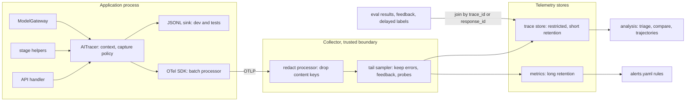
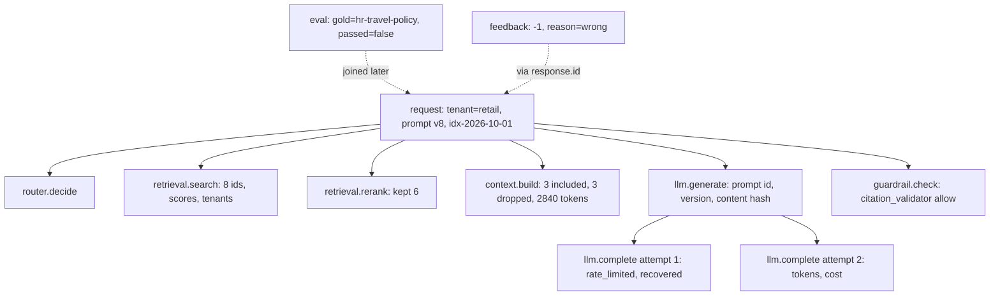
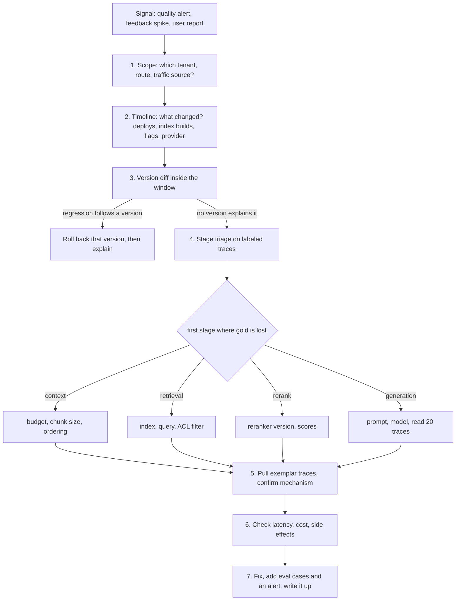

# Chapter 31 — Observability for AI Systems

After this chapter you will be able to instrument an AI application so that any single answer can be reconstructed and any population-level regression can be localized to a stage, a version, or a tenant. You will define a tracing schema for model calls, retrieval, tools, agent steps, guardrails, and evaluations. You will capture prompts and responses under an explicit privacy policy, wire the result into OpenTelemetry (the vendor-neutral standard and SDK for traces, metrics, and logs), and derive metrics, dashboards, and alerts from the same names. Then you will debug a real-looking quality incident with a small set of trace queries. The code lives in `book/projects/examples/ch31/`. It builds on `aie_core.observability` from Chapter 3, and every test runs offline.

## Why this matters

A conventional service fails loudly. A null pointer becomes a 500, a timeout becomes a red line on a latency graph, and the stack trace tells you where to look. An AI system mostly fails quietly. It returns HTTP 200 in 3.8 seconds with a fluent, well-formatted, confidently wrong answer. Nothing in the request log distinguishes that answer from a correct one. The error is semantic: the model was given the wrong evidence, or the right evidence in the wrong order, or an outdated policy, or a tool result it misread. Debugging it requires the exact context the model saw, which documents were retrieved and dropped, which prompt version rendered it, and what the tools returned. If you did not record those things when the request ran, you cannot recover them later. Retrieval indexes are rebuilt, prompts are edited, and model aliases move underneath you.

The second reason is change. An AI application has more independently versioned parts than most services: application code, prompt templates, model versions (sometimes changed by the provider without notice), retrieval indexes, chunkers, embedding models, guardrail policies, tool schemas, and feature flags. Any of these can degrade quality without a code deploy. When the thumbs-down rate rises on Wednesday, the question "what changed?" has a dozen candidate answers. Telemetry that does not record versions forces you to guess. Telemetry that does record them lets you split the population and see which version the regression follows.

The third reason is money and risk. Tokens are the dominant variable cost, and cost per request is shaped by context size, retries, and agent step counts, all of which drift. Telemetry is also a liability. A trace that captures full prompts captures whatever users typed, which includes customer emails, employee records, and pasted secrets. Observability for AI systems is therefore three engineering problems at once: recording enough to debug semantic failures, recording it in a shape that supports population analysis, and recording no more than policy allows.

## Mental model

> **Mental model:** AI observability is ordinary distributed tracing plus model, context, and evaluation metadata. The trace answers "what happened to this request"; the metadata answers "why was the answer wrong".

Picture one user request as a tree. The root is the request, stamped with who asked (tenant, a hashed user id), through which route, and under which versions. Its children are the stages the request passed through: routing, retrieval, reranking, context building, generation, validation, and for agents, a run containing numbered steps that each contain model calls and tool calls. Each node records duration and status, as in any distributed trace. It also records what this stage decided: which document ids it returned, which it dropped, how many tokens it spent, which guardrail decision it made. Labels that arrive later, such as an evaluation verdict, a judge score, or a user's thumbs-down, are joined onto the tree by its id.

With that picture, three kinds of telemetry fall into place. Metrics are counts and distributions over many trees, cheap enough to keep for everything and to alert on. Traces are individual trees, sampled, and kept long enough to debug. Logs are discrete events inside a node, such as a validator's reason string, best stored as span events so that they stay attached to their context. The debugging playbook at the end of this chapter is a walk down the tree: find the population that regressed, split by versions, then walk the stages in order until the gold evidence disappears.

## Core concepts

### Why AI telemetry differs from service telemetry

Request rate, error rate, and duration (the RED method) remain necessary and remain insufficient. Four properties of AI systems change what you must record.

**Correctness is not an exit code.** The most important failures are semantic and do not raise. You need quality signals, from evaluations, judges, probes, and users, attached to the same traces as the operational data. Otherwise you can see that latency is fine and have no idea that a third of answers are wrong.

**The input is constructed, not received.** The model's input is assembled at runtime from a template, retrieved chunks, conversation history, memory, and tool outputs. The user's message is a small fraction of it. To reproduce an answer you need the assembled context, or at least the identifiers and versions needed to reassemble it: prompt id and version, evidence ids in order, and tool results. This is the request lineage idea from Chapter 1, now made operational.

**Behavior depends on versioned artifacts outside the code.** Index version, chunker version, prompt version, model version, and policy version belong on every trace. Without them, the most common incident question cannot be answered: did quality drop for everyone, or only for traffic that hit the new thing?

**Cost and latency scale with content.** A context that grows by a thousand tokens is invisible in request counts and obvious in a per-request token histogram. Tokens, retries, and agent step counts must be first-class attributes.

### The trace model

A **trace** is one end-to-end task, identified by a 128-bit trace id. A **span** is one unit of work inside it, with a span id, a parent span id, a name, start and end times, a status, a bag of typed attributes, and a list of events. The parent links make the tree. Because everything in a request shares the trace id, spans emitted by different services, such as the API, a retrieval service, or a tool executor, assemble into one tree as long as the trace context is propagated between them. Over HTTP this uses the W3C `traceparent` header.

For Northwind Assist the span vocabulary is fixed in `semconv.py`:

| Span | What it covers | Key attributes |
|---|---|---|
| `request` | one user-visible request, the root | tenant, hashed user, route, traffic source, response id, every version |
| `router.decide` | route and model choice (Chapter 7) | chosen route, model |
| `retrieval.search` | first-stage retrieval | index version, top-k, returned ids, scores, tenants, ACL-filtered count |
| `retrieval.rerank` | second-stage ranking | reranker model, kept ids |
| `context.build` | evidence packing under a budget (Chapters 5 and 13) | included ids in order, dropped ids, tokens, budget, truncated flag |
| `llm.generate` | one logical generation | prompt id and version, temperature, token usage, cost, finish reason, captured content |
| `llm.complete` | one provider attempt, emitted by `ModelGateway` | provider, model, tokens, cost, cache hit, attempt number, queue time |
| `tool.call` | one tool execution (Chapter 16) | tool name, call id, argument fingerprint, status, side effect, approval, result size |
| `agent.run` / `agent.step` | an agent loop and its iterations (Chapter 19) | agent name, step number, action, cumulative tokens, stop reason |
| `guardrail.check` | one policy or validator decision (Chapter 27) | name, stage, decision, reason, policy version |
| `eval.score` | an evaluation run inline, such as an online judge | eval name, score, passed, source |

The split between `llm.generate` and `llm.complete` is deliberate. A logical generation may take several provider attempts because of retries or fallbacks, each with its own latency, error, and possibly model. Cost belongs to the attempts. Prompt identity and the captured content belong to the logical call. Merging them either double-counts tokens or loses the record of retries. Two earlier chapters use their own names: Chapter 7's router emits `router.complete`, and Chapter 27's guardrail pipeline writes `guardrail.action`, `guardrail.blocked_by`, and `guardrail.errors`. `semconv.py` does not normalize these keys yet, so either emit this chapter's names from those components or extend `normalize()` to rename them (span names and non-gateway keys are not covered by the legacy map). Keep `guardrail.errors`, because Chapter 27 alerts on its rate.

### What to record, stage by stage

The question for every attribute is: which debugging question does it answer, and which aggregation does it feed? Attributes that answer neither are noise you pay to store.

**Prompts and responses.** Always record the prompt id, the version, and a content hash of the rendered template. These answer "which prompt produced this?" and let you group by version. The rendered prompt and the response text are content. Their capture is governed by the policy described below. By default, record their length and a keyed hash. The hash lets you detect identical prompts across traces without storing them.

**Model calls.** Record provider, requested and served model (they differ under fallbacks and aliases), input, output, and cached-input tokens, cost computed from a versioned pricing table, finish reason, attempt number, queue time, latency, and time to first token for streams. A `finish_reason` of `length` is a truncated answer and deserves an error class of its own.

**Retrieval results.** Record ids and scores, not text. Ids are small, they are not content, and they are joinable: against the gold evidence in an evaluation set, against the index manifest to recover the text, and against ACL metadata to audit permissions. Also record the tenant of each returned item. Chapter 28's requirement of zero cross-tenant leakage then becomes a query over telemetry ("any retrieval span whose returned tenants include one that is neither the requester's nor `shared`") rather than a code audit. The instrumentation in this chapter goes one step further and marks such a span with the `retrieval_contamination` error class as it is recorded.

**Context assembly.** Record which evidence ids were included, in what order, which were dropped, and why. It separates evidence that was retrieved but never shown to the model from evidence that was shown and ignored, the distinction the incident at the end of this chapter turns on. The context manifest from Chapter 5 belongs here, in full.

**Tool calls.** Record name, call id, a keyed fingerprint of the arguments, status, whether the tool has side effects, the approval state, an idempotency key, and result size. The fingerprint is enough to detect loops (the same tool called repeatedly with the same arguments) without storing arguments. Arguments and results are content and follow the capture policy.

**Tokens, latency, cost.** Record these on the stage that spent them, so they can be attributed. Request-level totals are derivable. Stage-level attribution is not, if you only record totals.

Cache hits need care. A hit costs nothing, but its value is real: the price of the call it replaced. The current `aie_core` gateway records `cost_usd=0` and `avoided_cost_usd=<price>` on a cache-hit span. Older versions put the original call's `cost_usd` on the hit, and logs written by them would bill every hit twice, so a better cache would look like a cost increase. The chapter's normalization handles those legacy logs. For any cache-hit span without an avoided-cost key, it moves the cost into `llm.avoided_cost_usd` and sets the spend to zero, both at export and at load. Chapter 30's `chargeback()` applies the same rule and reports avoided spend next to actual spend.

**Evaluation results and feedback.** Offline evaluations, online judges, probe results, human reviews, and user feedback all carry the trace id or a client-visible response id that resolves to it. They arrive minutes to days later and are joined, not emitted inline. The exception is an inline judge running in the request path.

**Agent trajectories.** Each step records its action and cumulative tokens. Its children are the model call that chose the action and the tool call that executed it. The run records the stop reason. With that structure a trajectory can be rendered as a readable list of steps and checked automatically: no repeated identical calls past a threshold, no side effect before approval, termination for a stated reason.

### Errors as a taxonomy, not a boolean

`status=error` says that something failed. It does not say what to fix. Chapter 24 starts every evaluation from a failure taxonomy because named classes turn findings into engineering work, and the same holds for telemetry. Every span that fails, whether through an exception or a semantic check, carries an `error.class` from a closed vocabulary: retrieval miss, retrieval contamination, permission denied, context truncation, unsupported claim, citation mismatch, format error, bad refusal, tool selection, tool argument, tool failure, loop, premature stop, budget exceeded, timeout, rate limited, provider error, content filter, unsafe content. Exceptions are mapped automatically by class name, so `aie_core`'s `RateLimitError` becomes `rate_limited`. Semantic failures are marked explicitly with `mark_error(span, ErrorClass.LOOP, ...)`.

A provider attempt that failed with a rate limit and was retried successfully is a reliability event, not a quality failure. The trace store separates the two: `error_classes` lists failures that affected the outcome, and `recovered_errors` lists those absorbed by retries or fallbacks. Without the separation, every retry inflates the error rate, and on-call engineers learn to ignore it.

### Privacy and redaction of telemetry

Observability data is a copy of your users' data with weaker access controls, longer retention, and more readers. Treat it that way. The capture policy in `instrument.py` makes the decision explicit, per span, at the moment the span ends:

| Mode | What is stored for a content field | Use |
|---|---|---|
| `off` | length only | regulated tenants, highest-volume routes |
| `hashed` | length plus a keyed hash (HMAC with a secret salt) | default: dedup and equality without content |
| `redacted` | hash plus pattern-redacted text, truncated | sampled traces and failing spans |
| `full` | hash plus raw text, truncated | short-lived debugging under explicit approval |

Four controls compose. A default mode applies to all traffic. A sample rate upgrades a deterministic fraction of traces, chosen by hashing the trace id so every service makes the same choice and a trace is never half-captured. An on-error mode upgrades spans that failed, because those are the ones you will debug. A per-tenant ceiling is applied last and caps everything. A tenant whose contract forbids content leaving the request path stays at `hashed` even on errors. The ceiling is last by design: contractual and residency constraints override debugging convenience.

The hash is keyed. A plain SHA-256 of an email address can be reversed by hashing a list of likely addresses. An HMAC with a secret salt cannot, as long as the salt stays in the secret store. The same keyed digest produces the `user.hash` attribute, so you can count distinct users and follow one user's session without storing who they are.

Regex redaction (emails, phone numbers, card numbers, API-key shapes, Northwind employee ids) is a floor, not a guarantee. Names, addresses, and free-text descriptions of medical situations pass straight through pattern matching. Production systems put a PII detector behind the same `redactor` function and wrap the tracer in Chapter 27's `RedactingTracer`. Exception messages and stack traces obey the same capture mode and tenant ceiling: in `hashed` or `off` mode they leave only as a keyed digest. Production systems also keep a second line of defense in the collector: the Chapter 28 collector configuration deletes every attribute whose key ends in `.content` before export, so a misconfigured capture policy on one route cannot push content into the shared store. Routes that are allowed to keep redacted content export through a separate, restricted pipeline.

Telemetry also needs its own access control and retention, covered under production considerations. And a deletion request must reach it: every trace keyed by an erased user's hashed id must be findable and deletable.

### Metrics, logs, and traces

Each signal answers a different question and has a different cost profile.

**Metrics** answer "how often" and "how much", aggregated over time and a few low-cardinality dimensions: tenant, route, prompt version, index version, model. They are cheap, kept for everything, and the only signal you should alert on directly. Never put trace ids, user ids, or free text in metric labels. Each distinct label value creates its own time series, so an unbounded label multiplies the number of series (its cardinality) and the bill follows.

**Traces** answer "what happened to this request". They are expensive per item, so they are sampled. Head sampling decides at the root by trace-id ratio; it is simple and consistent across services. Tail sampling decides after the trace completes, so it can keep every error, every slow request, and every request with negative feedback. It needs a collector that buffers whole traces. A common arrangement keeps 100% of traces with errors or feedback, a few percent of the rest, and every probe trace.

**Logs** answer "what exactly happened at this point". In an AI system most of what would be a log line, such as a validator's reason, a parse failure, or a policy decision, belongs as a span event or attribute so that it stays attached to its context. Free-floating application logs should at least carry the trace id.

This chapter's code derives metrics from traces so that one set of definitions can be tested offline. Production systems emit the same quantities as counters and histograms at request time and use the traces for drill-down. The definitions in `dashboards.md` and the names in `metrics.py` are the shared vocabulary.

### Online signals

Offline evaluation (Chapters 24 and 25) gates releases. Production supplies the real distribution, and with it a set of imperfect signals that must be read with care.

**Probes** are golden questions with known gold evidence, sent through production on a schedule and tagged `traffic.source=probe`. They are the only production signal with ground truth at the stage level. They are how this chapter's playbook can say "the gold document was retrieved but dropped". They cost a small amount of traffic and must be excluded from user-facing metrics and from any billing.

**Sampled judges** score a fraction of user traffic for groundedness or helpfulness. They are an instrument with its own error rate. Calibrate them against human labels and track the agreement rate over time.

**User feedback** is biased toward unhappy users, sparse, and delayed. Thumbs-down rate is a trend signal, never a level. A drop in feedback rate can mean a broken widget.

**Behavioral signals**, such as rephrasing the same question, abandoning the conversation, escalating to a human, or editing a drafted reply before sending it, are plentiful and ambiguous. A longer conversation can indicate engagement or confusion. Use them as corroboration.

**Delayed labels**, such as a ticket reopened a week later or an invoice extraction corrected by finance, are the closest thing to ground truth that production produces. They must be joined back to traces by id, which requires the id to have been stored at the point of action.

All of these join to traces through ids. The client never sees trace ids, so the API returns a `response.id`, the root span records it, and feedback references it. `join_signals.py` resolves feedback and eval results to traces, reports how many labels could not be matched (a direct measure of telemetry gaps), and emits one joined row per trace for dashboards and for downstream uses such as building fine-tuning sets (Chapter 33).

## How it works

The handler opens the root span with `trace_request`. `AITracer`, the chapter's tracer in `instrument.py`, keeps the current span in a context variable, so every span opened deeper in the call stack, in any module, becomes a child without anyone passing span objects around. Stage helpers open child spans and record each stage's decision. The gateway, built with the same tracer, nests one `llm.complete` span per provider attempt under the logical `llm.generate`.

Three details make this composition work with code written before this chapter. The first is the tree itself. Older `aie_core` versions wrote spans with no trace id or parent id, and those spans cannot be assembled into requests. Chapter 30 attributes cost with `AttributingTracer` and `bind()`, which stamp tenant, request id, and feature onto every span. That is enough for chargeback, but not for a tree. The current `aie_core` links its spans through a context variable, and the trace store reads those ids directly. `AITracer` goes further: it propagates ids together with baggage and the capture policy, and under `OTelAITracer` it uses OpenTelemetry's ids, so they match auto-instrumented clients and cross-service `traceparent` propagation. Spans from older versions still load. Each becomes its own single-span trace, and `completeness()` reports them.

The second detail is key names. `aie_core`'s gateway writes unprefixed keys (`model`, `input_tokens`). The tracer normalizes them to the book's names when the span opens and again when it closes, because the gateway sets most of them after opening. The trace store normalizes once more at load, so JSONL files written before this chapter remain queryable.

The third detail is lineage on provider attempts. The gateway's `llm.complete` span cannot see `CompletionRequest.metadata`. Chapter 4's `traced_complete` works around this with a parent `prompt.call` span. The tracer generalizes the fix. Lineage keys (the version manifest, prompt id, version and hash, tenant, route) are copied into baggage, a dictionary of key-value pairs that travels with the trace context, when a span sets them, children inherit the baggage, and every `llm.complete` span is stamped with them. A query over provider attempts alone can then group by prompt version or index version.

When a span ends, the tracer applies the capture policy to any pending content, classifies exceptions, optionally dual-writes GenAI-convention aliases, and hands the finished span to a sink. The sink can be any `aie_core` tracer: `JsonlTracer` for local files, `InMemoryTracer` for tests, or `NoopTracer`. `OTelAITracer` additionally opens a real OpenTelemetry span for each stage, so ids, context propagation, sampling, and export follow the OpenTelemetry SDK.

Offline, `TraceStore` rebuilds the trees, attaches labels, and filters. The analysis functions and metric registry are written against that interface and translate directly to a tracing backend's query language.

## Architecture

The first diagram shows the data path and where content crosses a trust boundary.



Content leaves the request path only after the capture policy has run in-process. The collector applies a second, independent redaction step before anything reaches a shared store. Labels from other systems join late by id.

The second diagram is one Northwind trace, the tree the analysis code walks.



## Implementation

The project layout:

```
book/projects/examples/ch31/
  semconv.py              span names, attribute keys, error taxonomy, GenAI aliases
  instrument.py           AITracer, CapturePolicy, redact, stage helpers, decorators
  otel_setup.py           build_provider, OTelAITracer, tracer_from_env
  trace_store.py          SpanRecord, TraceTree, TraceStore
  analysis.py             debugging queries
  metrics.py              metric registry, alert evaluator
  alerts.yaml             alert rules
  dashboards.md           metric definitions by dashboard panel
  join_signals.py         CLI joining eval results and feedback to traces
  incident_sim.py         synthetic workload driven through the real instrumentation
  incident_walkthrough.py the playbook, end to end
  pyproject.toml, .env.example, README.md
  tests/                  test_instrument.py, test_otel.py, test_analysis.py, test_slo_alerts.py,
                          test_hardening.py
```

Configuration comes from environment variables, documented in the README and `.env.example`: `TRACE_SINK` (`none`, `jsonl`, `otel`), `TRACE_PATH`, `OTEL_SERVICE_NAME`, `OTEL_EXPORTER`, `OTEL_EXPORTER_OTLP_ENDPOINT`, `OTEL_SAMPLE_RATIO`, `EMIT_GENAI_ALIASES`, `CAPTURE_MODE`, `CAPTURE_SAMPLE_RATE`, and `CAPTURE_SALT`. The salt is a secret.

### Semantic conventions

A semantic convention is an agreed name and meaning for each span and attribute, so that every tool reading the telemetry interprets it the same way. One module owns every name. Instrumentation, store, analysis, metrics, and alert rules import from it, so they cannot drift. The full file is on disk; the parts that matter are the vocabulary, the taxonomy, normalization of legacy keys, and the mapping to OpenTelemetry's GenAI semantic conventions, the standard's proposed attribute names for model calls:

```python
# path: book/projects/examples/ch31/semconv.py  (excerpt; full file on disk)
class SpanName:
    REQUEST = "request"
    ROUTER = "router.decide"
    RETRIEVAL = "retrieval.search"
    RERANK = "retrieval.rerank"
    CONTEXT = "context.build"
    GENERATE = "llm.generate"            # one logical generation: prompt identity + content
    LLM_ATTEMPT = "llm.complete"         # one provider attempt, emitted by aie_core's ModelGateway
    TOOL = "tool.call"
    AGENT_RUN = "agent.run"
    AGENT_STEP = "agent.step"
    GUARDRAIL = "guardrail.check"
    EVAL = "eval.score"


class Attr:
    TENANT = "tenant.id"
    USER_HASH = "user.hash"              # salted hash, never the raw user id
    ROUTE = "app.route"
    RESPONSE_ID = "response.id"          # id shown to the client; feedback references it
    TRAFFIC = "traffic.source"           # "user" | "probe" | "replay" | "eval"
    PROMPT_ID = "prompt.id"
    PROMPT_VERSION = "prompt.version"
    INDEX_VERSION = "index.version"
    CHUNKER_VERSION = "chunker.version"
    LLM_MODEL = "llm.model"
    LLM_INPUT_TOKENS = "llm.usage.input_tokens"
    LLM_COST = "llm.cost_usd"
    RETRIEVAL_IDS = "retrieval.returned_ids"
    CONTEXT_IDS = "context.evidence_ids"
    CONTEXT_DROPPED = "context.dropped_ids"
    CITATION_IDS = "response.citation_ids"
    TOOL_STATUS = "tool.status"          # ok | error | denied | timeout
    AGENT_STOP = "agent.stop_reason"     # done | max_steps | budget | error | escalated
    GUARD_DECISION = "guardrail.decision"  # allow | block | redact | flag
    ERROR_CLASS = "error.class"
    # ... about fifty keys in total


class ErrorClass(str, Enum):
    RETRIEVAL_MISS = "retrieval_miss"
    RETRIEVAL_CONTAMINATION = "retrieval_contamination"
    CONTEXT_TRUNCATION = "context_truncation"
    UNSUPPORTED_CLAIM = "unsupported_claim"
    CITATION_MISMATCH = "citation_mismatch"
    LOOP = "loop"
    RATE_LIMITED = "rate_limited"
    # ... twenty classes in total


# Conceptual equivalents in the OpenTelemetry GenAI semantic conventions. CHECK CURRENT
# CONVENTIONS: these names were experimental at the time of writing and may have changed.
GENAI_ALIASES: dict[str, str] = {
    Attr.LLM_PROVIDER: "gen_ai.provider.name",
    Attr.LLM_MODEL: "gen_ai.request.model",
    Attr.LLM_INPUT_TOKENS: "gen_ai.usage.input_tokens",
    Attr.LLM_OUTPUT_TOKENS: "gen_ai.usage.output_tokens",
    Attr.TOOL_NAME: "gen_ai.tool.name",
    Attr.AGENT_NAME: "gen_ai.agent.name",
}
```

Why not adopt the GenAI conventions directly? You may, and for a new system you probably should check them first. At the time of writing they were marked experimental and had renamed keys between releases. A local vocabulary with one mapping table isolates you from that churn. `AITracer(emit_genai_aliases=True)` dual-writes both, so a backend that understands the GenAI keys gets them, and your own queries keep working.

### The tracer and the capture policy

`AITracer` subclasses `aie_core`'s `Tracer`, so it is accepted anywhere a `Tracer` is, including `ModelGateway(tracer=...)`. The core is the `span` context manager:

```python
# path: book/projects/examples/ch31/instrument.py  (condensed excerpt; full file on disk)
@dataclass
class LinkedSpan(Span):
    """An aie_core Span plus the fields that make a tree: trace id, parent id, resource."""
    trace_id: str = ""
    parent_span_id: str | None = None
    resource: dict[str, Any] = field(default_factory=dict)
    baggage: dict[str, Any] = field(default_factory=dict)   # propagated to children, not exported
    pending_content: dict[str, str] = field(default_factory=dict, repr=False)


_current: ContextVar[LinkedSpan | None] = ContextVar("ch31_current_span", default=None)
PROPAGATED_KEYS: tuple[str, ...] = (*VERSION_KEYS, "prompt.hash", Attr.TENANT, Attr.ROUTE)


class AITracer(Tracer):
    @contextmanager
    def span(self, name: str, **attributes: Any) -> Iterator[LinkedSpan]:
        parent = _current.get()
        s = LinkedSpan(
            name=name, attributes=normalize(name, attributes), start=self.clock(),
            span_id=self._hex(64),
            trace_id=parent.trace_id if parent else self._hex(128),
            parent_span_id=parent.span_id if parent else None,
            resource=dict(self.resource),
            baggage=dict(parent.baggage) if parent else {},
        )
        self._propagate(s)                  # lineage keys: baggage down, onto llm.complete
        handle = self._backend_start(s, parent)
        token = _current.set(s)
        try:
            yield s
        except BaseException as exc:
            s.record_exception(exc)
            s.attributes.setdefault(Attr.ERROR_TYPE, type(exc).__name__)
            s.attributes.setdefault(Attr.ERROR_CLASS, classify_exception(exc).value)
            raise
        finally:
            _current.reset(token)
            s.end = self.clock()
            self._finalize(s)               # normalize, apply capture policy, GenAI aliases
            self._backend_end(s, handle)    # OTelAITracer ends the real OTel span here
            self.sink.export(s)
```

`_propagate` copies lineage keys found on a span into its baggage, and stamps every key in the baggage onto an `llm.complete` span that does not set it. It is a separate method because the gateway's streaming path does not use `span()`: it builds its span by hand, because the span must outlive the call that opened it, and hands it to `tracer.export()` when the stream ends. `export()` adopts that span into the current trace and calls `_propagate` too, so a streamed attempt carries tenant, prompt identity, and versions exactly like a non-streamed one. Without that call, streamed attempts could not be grouped by prompt version; `test_streamed_attempt_gets_the_same_propagated_attributes` pins the behavior with `ModelGateway.stream`.

Consume the stream inside the request's spans: a stream drained after its parent span closed is adopted with no parent and no baggage.

The capture policy decides how much content to keep when the span ends, which is why content is offered with `tracer.capture(span, key, value)` rather than written as an attribute:

```python
# path: book/projects/examples/ch31/instrument.py  (excerpt)
@dataclass
class CapturePolicy:
    mode: CaptureMode = "hashed"
    sample_rate: float = 0.0
    sampled_mode: CaptureMode = "redacted"
    on_error_mode: CaptureMode | None = "redacted"
    max_chars: int = 4000
    salt: str = "change-me"
    tenant_ceiling: dict[str, CaptureMode] = field(default_factory=dict)
    redactor: Callable[[str], str] = redact

    def decide(self, trace_id: str, tenant: str | None, errored: bool) -> CaptureMode:
        mode: CaptureMode = self.mode
        if self.sample_rate > 0 and _bucket(trace_id) < self.sample_rate:
            mode = max(mode, self.sampled_mode, key=_MODE_RANK.__getitem__)
        if errored and self.on_error_mode:
            mode = max(mode, self.on_error_mode, key=_MODE_RANK.__getitem__)
        ceiling = self.tenant_ceiling.get(tenant or "")
        if ceiling is not None:
            mode = min(mode, ceiling, key=_MODE_RANK.__getitem__)
        return mode

    def digest(self, text: str) -> str:
        # keyed hash: a plain sha256 of an email address is reversible by dictionary attack
        return hmac.new(self.salt.encode(), text.encode(), hashlib.sha256).hexdigest()[:16]

    def render(self, key: str, text: str, mode: CaptureMode) -> dict[str, Any]:
        out: dict[str, Any] = {f"{key}.chars": len(text)}
        if mode == "off":
            return out
        out[f"{key}.hash"] = self.digest(text)
        if mode == "redacted":
            out[f"{key}.content"] = self.redactor(text)[: self.max_chars]
        elif mode == "full":
            out[f"{key}.content"] = text[: self.max_chars]
        return out
```

The stage helpers are thin. Each opens a span with the right name, records the stage's decision through a typed handle, and leaves control flow to the caller. Instrumenting a RAG request looks like this:

```python
# illustrative usage; incident_sim.py contains the complete, runnable version
with trace_request(tracer, route="rag.answer", tenant="retail", user_id=user.id,
                   response_id=response_id, versions=manifest):
    with retrieval_span(tracer, query, index_version=manifest["index.version"], top_k=8) as r:
        hits = retriever.search(query, k=8, groups=user.groups)
        r.results([h.id for h in hits], [h.score for h in hits], tenants=[h.tenant for h in hits])
    with rerank_span(tracer, model="rerank-small", candidates=len(hits)) as rr:
        kept = reranker.rerank(query, hits)[:6]
        rr.kept([h.id for h in kept])
    with context_span(tracer, budget_tokens=3000) as c:
        packed = packer.pack(kept, budget=3000)
        c.packed(packed.included_ids, packed.dropped_ids, packed.tokens)
    completion = traced_generation(tracer, gateway, request, prompt_id="rag-answer", prompt_version="8")
    with guardrail_span(tracer, "citation_validator", stage="output", policy_version="cv-3") as g:
        g.decide("allow", "citations resolve to context")
```

Tools get a context manager and a decorator. `@traced_tool(tracer, "search_tickets")` wraps a keyword-argument function, records the argument fingerprint, captures arguments and result under the policy, and maps `PermissionError` to status `denied` and other exceptions to `tool_failure`. Agents get `agent_run` and `agent_step`. A run ends with `run.stop("done")` or `run.stop("max_steps", error_class=ErrorClass.LOOP)`.

### OpenTelemetry wiring

`otel_setup.py` builds a private `TracerProvider` with a resource, a parent-based ratio sampler, and an exporter: console for development, OTLP for a collector, in-memory for tests. Network exporters sit behind a batch processor, so the request path never waits on telemetry. `OTelAITracer` overrides two hooks. It starts a real OpenTelemetry span when ours starts, takes its trace and span ids, and attaches it to the OpenTelemetry context. That makes auto-instrumented HTTP and database clients inside the request nest under the current stage. When ours ends, it copies the final attributes, events, and status:

```python
# path: book/projects/examples/ch31/otel_setup.py  (condensed excerpt; full file on disk)
def build_provider(service_name: str, *, exporter: ExporterKind = "console",
                   resource_attributes: dict[str, Any] | None = None, endpoint: str | None = None,
                   sample_ratio: float = 1.0) -> tuple[TracerProvider, SpanExporter | None]:
    resource = Resource.create({"service.name": service_name, **(resource_attributes or {})})
    # ParentBased: a child follows its parent's decision, so a trace is never half-sampled
    provider = TracerProvider(resource=resource, sampler=ParentBased(TraceIdRatioBased(sample_ratio)))
    if exporter == "memory":
        span_exporter = InMemorySpanExporter()
        provider.add_span_processor(SimpleSpanProcessor(span_exporter))
    elif exporter == "console":
        span_exporter = ConsoleSpanExporter()
        provider.add_span_processor(BatchSpanProcessor(span_exporter))
    elif exporter == "otlp":
        span_exporter = _otlp_exporter(endpoint)
        provider.add_span_processor(BatchSpanProcessor(span_exporter, max_queue_size=4096,
                                                       max_export_batch_size=512))
    else:
        span_exporter = None
    return provider, span_exporter


class OTelAITracer(AITracer):
    def _backend_start(self, span: LinkedSpan, parent: LinkedSpan | None) -> Any:
        otel_span = self._otel.start_span(span.name, start_time=int(span.start * 1e9))
        ctx = otel_span.get_span_context()
        span.trace_id = format(ctx.trace_id, "032x")
        span.span_id = format(ctx.span_id, "016x")
        token = otel_context.attach(otel_trace.set_span_in_context(otel_span))
        return otel_span, token

    def _backend_end(self, span: LinkedSpan, handle: Any) -> None:
        otel_span, token = handle
        for key, value in span.attributes.items():
            if value is not None:
                otel_span.set_attribute(key, _otel_value(value))
        for ev in span.events:
            otel_span.add_event(str(ev.get("type", "event")),
                                {k: str(v) for k, v in ev.items() if k not in ("type", "time")})
        if span.status == "error":
            otel_span.set_status(Status(StatusCode.ERROR, str(span.attributes.get("error.class", ""))))
        otel_span.end(end_time=int((span.end or span.start) * 1e9))
        otel_context.detach(token)
```

Compare this with `aie_core`'s own `OTelTracer`, which creates OpenTelemetry spans only when ours finish. That bridge is fine for flat, single-span instrumentation. It cannot express parentage, because a child finishes before its parent exists on the OpenTelemetry side. Opening the real span at start is what makes nesting and cross-service propagation work. `tracer_from_env()` picks the sink from `TRACE_SINK`, so the application code stays the same in development, tests, and production.

### The trace store

`TraceStore` rebuilds trees from flat span records. That is the operation every tracing backend performs, and the one you need when debugging from a JSONL file on a laptop:

```python
# path: book/projects/examples/ch31/trace_store.py  (condensed excerpt; full file on disk)
class TraceTree:
    def __init__(self, trace_id: str, spans: list[SpanRecord]) -> None:
        self.trace_id = trace_id
        self.spans = sorted(spans, key=lambda s: (s.start, s.span_id))
        self.by_id = {s.span_id: s for s in self.spans}
        self.children: dict[str | None, list[SpanRecord]] = defaultdict(list)
        self.orphans: list[SpanRecord] = []
        for s in self.spans:
            if s.parent_span_id is not None and s.parent_span_id not in self.by_id:
                self.orphans.append(s)          # parent never arrived: a telemetry gap
                self.children[None].append(s)
            else:
                self.children[s.parent_span_id].append(s)
        roots = self.children.get(None, [])
        real_roots = [s for s in roots if s.parent_span_id is None]
        self.root = (real_roots or roots or [None])[0]
        self.evals: list[dict[str, Any]] = []
        self.feedback: list[dict[str, Any]] = []

    def _recovered(self, s: SpanRecord) -> bool:
        # a failed provider attempt whose parent generation succeeded was retried or fell back
        parent = self.by_id.get(s.parent_span_id or "")
        return s.name == SpanName.LLM_ATTEMPT and parent is not None and not parent.is_error

    @property
    def error_classes(self) -> set[str]:
        return {s.attributes[Attr.ERROR_CLASS] for s in self.spans
                if s.attributes.get(Attr.ERROR_CLASS) and not self._recovered(s)}
```

`TraceStore.filter(tenant=..., route=..., traffic=..., error_class=..., versions={...}, since=..., until=..., labeled=..., predicate=...)` returns a new store, so filters chain. `attach_evals` joins by trace id. `attach_feedback` joins by trace id or response id and keeps the unmatched rows. `completeness()` reports, for each required root key, the fraction of traces that lack it, plus the orphan rate. This is the Chapter 1 idea of a lineage record that can report its own gaps, applied to the whole trace stream.

### Debugging queries

The most useful single query in this chapter is the evidence funnel. For every labeled trace, it asks whether the gold evidence survived each stage. Survival is cumulative, because a stage cannot recover evidence an earlier stage lost:

```python
# path: book/projects/examples/ch31/analysis.py  (condensed excerpt; full file on disk)
def evidence_path(tree: TraceTree) -> dict[str, bool] | None:
    gold = set(tree.gold_ids or [])
    if not gold:
        return None
    retrieval, rerank, context = tree.first(SpanName.RETRIEVAL), tree.first(SpanName.RERANK), tree.first(SpanName.CONTEXT)
    retrieved = gold <= _ids(retrieval.attributes.get(Attr.RETRIEVAL_IDS)) if retrieval else False
    reranked = gold <= _ids(rerank.attributes.get(Attr.RERANK_IDS)) if rerank else retrieved
    in_context = gold <= _ids(context.attributes.get(Attr.CONTEXT_IDS)) if context else reranked
    cited = bool(gold & _ids(tree.get(Attr.CITATION_IDS)))
    path = {"retrieved": retrieved}
    path["reranked"] = path["retrieved"] and reranked
    path["in_context"] = path["reranked"] and in_context
    path["cited"] = path["in_context"] and cited
    path["answer_passed"] = bool(tree.eval_passed)
    return path


def triage_by_stage(baseline: TraceStore, candidate: TraceStore, *, tolerance: float = 0.05) -> TriageReport:
    fb, fc = gold_funnel(baseline), gold_funnel(candidate)
    cb, cc = _conditional(fb), _conditional(fc)     # P(survive stage | survived previous)
    drop = {s: cb[s] - cc[s] for s in FUNNEL_STAGES}
    first = next((s for s in FUNNEL_STAGES[:-1] if drop[s] > tolerance), None)
    ...
```

The comparison uses conditional survival rates, not absolute ones. An absolute drop propagates downstream: if retrieval loses evidence, every later stage looks worse too. The conditional rate isolates the stage where loss begins. The other queries follow the same shape:

- **`compare_versions`** splits a store on any version key and reports request count, labeled count, pass rate, negative-feedback rate, p50 and p95 latency, tokens, and cost per request. It adds bootstrap confidence intervals for the differences.
- **`retrieved_not_cited`** lists labeled traces whose gold evidence was retrieved but not cited. For each, it gives the gold rank and whether the context packer dropped it.
- **`latency_breakdown`** reports per-stage percentiles and each stage's median share of request time.
- **`cost_by_tenant`** reports cost per request, cost per successful request, and LLM calls per request.
- **`trajectory_view` and `trajectory_issues`** render an agent run step by step and flag loops, side effects without approval, failing tools, and budget terminations.

### Metrics and alert rules

`metrics.py` holds a registry of named metrics computed from a store, plus the parametric family `errors.class_rate:<class>`. Each metric also declares its sample size. A pass rate over 300 requests of which 12 are labeled is a 12-sample estimate, and `min_samples` must see 12, not 300. The alert evaluator reads `alerts.yaml`. Each rule names a metric, a window, either an absolute threshold or a ratio to the same metric over a baseline window just before, a minimum sample count, an optional group-by dimension, a severity, and a runbook pointer:

```yaml
# path: book/projects/examples/ch31/alerts.yaml  (excerpt; full file on disk)
rules:
  - name: answer_quality_drop
    metric: quality.eval_pass_rate          # probe + sampled-judge traffic only (labeled traces)
    window: 6h
    baseline_window: 24h
    condition: {op: "<", baseline_ratio: 0.92}
    min_samples: 30
    group_by: tenant.id
    severity: page
    runbook: "Chapter 31 playbook, steps 1-4: scope, version diff, stage triage"

  - name: context_truncation_high
    metric: quality.context_truncation_rate
    window: 1h
    condition: {op: ">", threshold: 0.15}
    min_samples: 30
    severity: ticket

  - name: request_p95_slo
    metric: latency.request_p95_ms
    window: 1h
    condition: {op: ">", threshold: 8000}     # p95 completion under 8 s (Northwind target)
    min_samples: 50
    severity: page

  - name: cross_tenant_retrieval
    metric: errors.class_rate:retrieval_contamination
    window: 1h
    condition: {op: ">", threshold: 0.0}
    min_samples: 1                            # one event is an incident
    severity: page
```

Service-level objectives get burn-rate rules rather than plain thresholds (Chapter 29 owns the arithmetic). A burn rate measures how fast you are spending the error budget, the share of requests the objective allows to fail. `slo.availability_burn_rate` is the share of failed requests divided by that budget, so 1.0 spends a 30-day budget in exactly 30 days. A rule with a `confirm_window` fires only when a short window breaches as well as the long one: the hour proves it is not a blip, the last five minutes prove it is still happening, and the page stops by itself once the incident ends.

```yaml
# path: book/projects/examples/ch31/alerts.yaml  (excerpt)
  - name: availability_fast_burn
    metric: slo.availability_burn_rate
    window: 1h
    confirm_window: 5m                        # both windows must burn: not a blip, still happening
    condition: {op: ">", threshold: 14.4}
    min_samples: 50
    severity: page
    runbook: "Chapter 29: breaker states, admission rejections, provider errors; then error_distribution()"
```

A burn rate of 14.4 for an hour spends 2% of a 30-day budget. Against the 99.5% availability objective that means 7.2% failed requests. Against the 95% completion objective the same burn would need 72% of requests over 8 seconds, so latency gets a slower ticket-level rule (a burn of 6 over six hours, confirmed over thirty minutes), and the p95 threshold rule stays the fast latency signal. A loose objective tolerates many failures before it pages, and the place to tighten it is the objective, not the alert.

The full file also covers negative feedback, guardrail block surges, cost per request, trace error rate, agent loops, and telemetry gaps. `dashboards.md` defines every metric by panel: quality, latency, cost, errors and safety, and telemetry health. A test asserts that every metric an alert references exists in the registry.

### Joining signals

`join_signals.py` is both a library and a CLI. It accepts evalkit `CaseResult` rows, which carry `trace_id` and dictionaries of scores and pass flags, as well as flat eval rows. It accepts feedback events keyed by `response_id` or `trace_id`. It writes one joined row per trace with versions, tenant, duration, cost, error classes, eval verdict and scores, gold ids, the latest feedback, and the feedback lag. Its summary reports unmatched labels. `sample_for_review` picks traces for human review: half from flagged traces (negative feedback or errors), the rest stratified by tenant so a small tenant is not drowned out.

```bash
python join_signals.py --traces traces.jsonl --evals eval_results.jsonl \
    --feedback feedback.jsonl --out joined.jsonl
```

### Tests

The tests run offline in about three seconds. `test_instrument.py` checks the core mechanics:

- tree construction across the gateway boundary, and legacy key normalization;
- propagation of prompt identity and the version manifest to `llm.complete`, including from a Chapter 4 style `prompt.call` parent;
- recovered retries, and the mapping from exceptions to error classes;
- every capture mode, the tenant ceiling, capture-on-error, and deterministic sampling;
- redaction patterns, keyed hashing, and the cross-tenant contamination check;
- the decorators, adoption of hand-built spans, the JSONL round trip, and GenAI dual-writing.

`test_otel.py` runs the same instrumentation through the OpenTelemetry SDK with an in-memory exporter. It checks parentage, attribute types, error status, the zero-ratio sampler, and the environment factory. `test_analysis.py` turns the incident walk-through below into assertions:

- the expected alerts fire, and the latency, cost, tenant, and telemetry alerts stay quiet;
- the prompt canary shows no detectable quality difference;
- stage triage names `in_context` as the first failing stage;
- most retrieved-but-not-cited traces were dropped by the packer;
- the JSONL path and the in-memory path give the same answer.

`test_slo_alerts.py` checks the burn-rate arithmetic and that a fast-burn rule pages while failures continue and stays quiet once the last five minutes are healthy.

```python
# path: book/projects/examples/ch31/tests/test_analysis.py  (excerpt; full file on disk)
def test_stage_triage_points_at_context_build(store):
    before, after = windows(store)
    report = triage_by_stage(before, after)
    assert report.first_failing_stage == "in_context"
    assert abs(report.baseline["retrieved"] - report.candidate["retrieved"]) < 0.06


def test_prompt_canary_is_not_the_cause(store):
    _, after = windows(store)
    cmp = compare_versions(after, Attr.PROMPT_VERSION, "7", "8")
    point, lo, hi = cmp.pass_rate_diff
    assert lo < 0 < hi                       # no detectable quality difference
    assert cmp.b.mean_output_tokens > cmp.a.mean_output_tokens  # v8 is wordier: a cost effect
```

Run them from the project directory:

```bash
cd book/projects/examples/ch31
../../../../.venv/bin/python -m pytest -q        # 54 passed
../../../../.venv/bin/python incident_walkthrough.py
```

## Code walkthrough

Follow one request through `incident_sim.py`, which plays the application. The root span carries the version manifest. `retrieval_span` hashes the query (and keeps a redacted copy on the 5% of traces the capture policy samples) and records ids, scores, and per-item tenants. `context_span` records what fit the 3,000-token budget and what was dropped. `traced_generation` opens `llm.generate` and calls the gateway. The gateway's `llm.complete` span nests under it. Its legacy keys are renamed at span end, and it is stamped with the inherited prompt and index versions. On the one percent of calls where the scripted model raises a rate limit, the trace shows two attempts, the first one recovered. The simulator then writes probe evals with gold ids, deliberately imperfect judge verdicts, and feedback keyed by `response.id`. The analysis functions never see the simulator's state. Every conclusion comes from spans and joined labels, so the same conclusions must be reachable from production telemetry.

## Production considerations

**Latency.** Instrumentation must not sit on the request's critical path. The in-process work, creating span objects, hashing content, and running regex redaction, costs microseconds to low milliseconds per span. Measure it once with capture set to `full` on a long prompt, the worst case. Export happens on a background batch processor with a bounded queue. When the queue is full, spans are dropped, not awaited. Watch the exporter's dropped-span counter, because silent loss looks like a telemetry gap rather than an error. Redaction of very long contexts can be expensive, so truncate before redacting when the policy allows.

**Cost.** Telemetry volume grows with content capture, span count, and attribute size. A rough planning number is illustrative: a RAG trace with eight content-free spans is a few kilobytes, while the same trace with redacted prompts and responses is tens of kilobytes. Agent traces with dozens of steps are larger still. Control the bill with sampling (content only on sampled and failing traces), id lists instead of text, short retention for content-bearing spans, and metrics for everything that only needs aggregation. Probes cost model tokens. Keep the probe set small and stratified, and send probes at a rate that gives enough labeled samples per alert window per tenant: the `min_samples` of the quality rules.

**Security.** Telemetry stores need the same access model as the data they contain. Restrict who can read content-bearing spans, audit those reads, and keep the capture salt in the secret store. Never log provider API keys or tool credentials. The redaction patterns include key shapes as a last line of defense, not as the plan. Per-tenant ceilings enforce contractual limits. For a tenant with data-residency requirements, the telemetry pipeline itself must stay in-region, which is a deployment decision as much as a code decision. Trace data used for fine-tuning (Chapter 33) needs consent filtering at export time.

**Operations.** Treat the schema as an API. Version it, review changes, and run the schema contract test described under Evaluation and testing. `completeness()` and the `telemetry_gaps` alert catch the deploy that silently stopped stamping `index.version`. Propagate trace context across every hop: queues (put `traceparent` in message headers), background workers, and tool executors in other services. A missing hop shows up as orphans or as traces that end abruptly. Keep dashboards stable, with quality on top. Give every alert a runbook pointer. Alert on rates with minimum sample sizes and baselines, except for events that are incidents by definition, such as cross-tenant retrieval.

## Common mistakes

**Logging HTTP and calling it observability.** Request logs with status codes and durations cannot see semantic failures. The incident below fires no latency, error, or cost alert.

**Recording text instead of ids.** Storing retrieved chunk text in every span is expensive, a privacy problem, and less useful than ids, which join to gold labels, ACLs, and the index manifest.

**Not recording versions.** Without versions on traces, the playbook's version-diff step is impossible, and every incident starts with guessing what changed.

**Totals only.** A trace that records total tokens and total latency cannot attribute either to a stage. Record per stage and derive totals.

**Capturing full content by default.** It feels safe during development and becomes a breach surface in production. Start at hashed, sample redacted, and gate full capture behind an approval and a time limit.

**Plain hashes of personal data.** Unkeyed hashes of emails and user ids can be reversed by hashing a list of guesses; the keyed hash described under privacy cannot.

**Treating thumbs-down rate as quality.** It is a biased, sparse trend signal. Probes and calibrated judges carry the quality measurement, and feedback corroborates it.

**Counting recovered retries as failures.** Keep `recovered_errors` separate from `error_classes`, as described under errors as a taxonomy; otherwise the error panel trains people to ignore it.

**Tuning prompts before reading traces.** The RAG debugging tree from Chapters 10 and 14 exists to prevent this. Most "the model ignored the evidence" reports turn out to be evidence that never reached the model.

## Failure modes

**Telemetry gaps.** A service stops propagating context, so traces fragment into orphans. A deploy drops a version attribute. A full export queue drops spans. These show up in telemetry as a rising orphan rate, a rising missing-key fraction in `completeness()`, rising unmatched feedback in `join_signals`, and an exporter dropped-span counter above zero. The schema contract test under Evaluation and testing catches them before deploy; add an assertion that the request produces a single trace id.

**Sampling bias.** Head sampling at a low ratio misses rare failures. Sampling that is not trace-consistent produces half-traces. Tail sampling that keeps only errors hides semantic failures, which are not errors. The symptom is an incident that metrics show but no sampled trace illustrates. Mitigate by keeping all probe traces, all traces with negative feedback or error classes, and a uniform sample of the rest.

**Label leakage between traffic types.** Probe traffic counted as user traffic inflates usage and can bias quality metrics in either direction. Replay and eval traffic mixed into production dashboards does the same. The symptom is a traffic-source split that does not match expectations. Always filter on `traffic.source`.

**Judge drift.** The online judge's model alias moves, and its pass rate shifts with no change in the system under test. The symptom is a pass-rate change that probes with deterministic checks do not confirm. Pin judge versions, record `eval.name` with the judge version, and track judge-human agreement on a small labeled stream.

**Privacy regression.** A new route offers raw tool results to `capture` with a default policy that was meant for a less sensitive route. Content appears in a store it should not reach. Detect it by scanning sampled exported spans for redaction markers and for unredacted patterns, as a scheduled job that alerts on any hit.

**Silent stage regressions.** An index rebuild, a chunker change, a reranker update, or a context-budget change shifts where evidence is lost. Quality falls while every operational metric stays green. The symptoms are a moving conditional survival rate in the evidence funnel and a context truncation rate that changes step-wise at a deploy. This is the incident below.

## Tradeoffs

| Decision | Option A | Option B | Guidance |
|---|---|---|---|
| Content capture | hashed by default | redacted or full by default | Hashed default with sampled redaction and capture-on-error; full only time-boxed |
| Sampling | head, trace-id ratio | tail, after completion | Head is simpler and cheaper; tail keeps the interesting traces but needs a buffering collector |
| Attribute names | local vocabulary with alias map | GenAI conventions directly | Local plus aliases while the conventions are experimental; re-check periodically |
| Metrics source | emitted at request time | derived from traces | Emit in production; derive offline for testing definitions and ad-hoc analysis |
| Evaluation labels | inline judge spans | joined offline records | Joined records are cheaper and decoupled; inline only when the judge gates the response |
| Storage | one store for all telemetry | split content and content-free stores | Split: different retention, readers, and cost |
| Build vs buy | OTel plus your own queries | an LLM observability vendor | Instrument with OTel either way; a vendor adds UI and evaluation workflows but must accept your schema and redaction |

A vendor platform for LLM tracing is a reasonable choice. Instrument through your own `Tracer` interface and conventions regardless, as Chapter 23 argues for frameworks, so that switching backends is an exporter change and not a re-instrumentation.

## Evaluation and testing

Observability code is tested at three levels.

**Mechanics.** Unit tests assert that spans form one tree across library boundaries, that required keys appear, that legacy keys normalize, that the capture policy produces exactly what each mode promises, that the tenant ceiling cannot be exceeded, and that redaction removes the patterns it claims to remove. `test_hardening.py` adds the edge cases: exception text under the capture ceiling, current API-key shapes, completeness that requires keys on the root, telemetry alerts that see rootless traces, thin baselines that never decide an alert, and a completion burn over served requests only. These are the tests in `test_instrument.py` and `test_otel.py`.

**Schema contracts.** A contract test runs a representative request of each route, through the real service boundaries where possible, and asserts the schema. Every request root has the required keys, every `llm.complete` has prompt and index versions, and no content key appears above the configured mode. Run it in CI. It is the cheapest protection against telemetry gaps.

**Diagnostic power.** The strongest test of an observability design is whether it can localize injected faults. Build a simulator, or replay recorded traffic, inject a known fault into one stage, and assert that the analysis tools name that stage. `test_analysis.py` does this for a context-packing fault. A fuller suite injects one fault per stage: retrieval misses, a reranker that drops gold, a citation mapper that attaches the wrong source, a looping agent, a cross-tenant leak. It then checks that the funnel, the error classes, and the alerts each point at the right place. If a fault class cannot be localized from telemetry, the schema is missing something.

Alert rules deserve their own tests. Replay a quiet period and assert that nothing fires, then replay an incident and assert that the right rules fire for the right groups. The tests check both against the simulated incident. Track the alert precision you see in production, meaning the fraction of pages that were real, and tune thresholds and `min_samples` against it.

## The debugging playbook: when output quality degrades

The playbook turns the RAG debugging tree (Chapters 10 and 14) and the agent debugging tree (Chapter 19) into a sequence of queries. Each step narrows the search, and no step involves editing a prompt.



1. **Scope.** Split the signal by tenant, route, and traffic source. A regression confined to one tenant points at tenant-specific data or configuration. A regression across all routes points at something shared, such as the model, the gateway, or a common prompt fragment.
2. **Timeline.** List everything that changed near the onset: code deploys, prompt publications, index builds, flag flips, provider model updates. The version attributes on traces make this list checkable rather than remembered.
3. **Version diff.** Within the incident window, split traffic by each version key that has more than one value, and compare pass rate, feedback, tokens, latency, and cost with confidence intervals. If quality follows a version, roll it back first and explain it second.
4. **Stage triage.** On labeled traces, compare the evidence funnel before and after. The first stage whose conditional survival rate drops is where to look. For agents, use the trajectory checks instead: tool selection, arguments, loops, approvals, and stop reasons, from Chapter 19's agent debugging tree.
5. **Exemplars.** Pull concrete traces that show the mechanism. Render their trees and read them. A hypothesis is confirmed when the traces show it, not when the aggregates are consistent with it.
6. **Collateral.** Check latency, cost, and side effects for the same population. Quality incidents often carry a cost signature, and fixes can move it.
7. **Close the loop.** Fix the cause, add the failing cases to the evaluation set (Chapter 25), add or tune the alert that should have caught it earlier, and record the incident.

### Worked incident: the chunker that ate the evidence

The telemetry below comes from `incident_walkthrough.py`. It is synthetic, and every number is illustrative, but every step runs the chapter's real tools on spans produced by the real instrumentation.

On 1 October at 09:00, a Northwind release shipped two changes. The retrieval index was rebuilt as `idx-2026-10-01` with a new chunker, `c3`, which produces chunks of roughly 900 tokens instead of 380 so that policy sections stay together. In the same release, prompt `rag-answer` v8, with a reworded answer style, went to a 50% canary. By 15:00 the pager had fired.

**Step 1, what fired.** The alert evaluator, run at 15:00 with each rule over its own window (six hours for the quality rules, one hour for context truncation):

```
FIRED page   answer_quality_drop        group=logistics  quality.eval_pass_rate=0.6379 < 0.7769  (n=58)
FIRED page   answer_quality_drop        group=retail     quality.eval_pass_rate=0.5974 < 0.8433  (n=77)
FIRED ticket negative_feedback_spike    group=retail     quality.negative_feedback_rate=0.2353 > 0.2264  (n=68)
FIRED ticket context_truncation_high    group=all        quality.context_truncation_rate=1 > 0.15  (n=76)
quiet: agent_loops, availability_fast_burn, completion_slow_burn, cost_per_request_jump, cross_tenant_retrieval, guardrail_block_surge, request_p95_slo, telemetry_gaps, trace_error_rate
```

The quiet list matters as much as the fired one. Latency, cost, error rate, SLO burn, and telemetry health are all within bounds. A dashboard built only on HTTP signals would show a healthy service. The pass rates rest on 58 labeled traces for logistics and 77 for retail, not on the full request counts. That is why the rule's sample size is computed per metric.

**Step 2, scope.** Both tenants regressed on the RAG route. The agent route is unlabeled, and its feedback is flat:

```
retail    rag.answer       pass 0.92 -> 0.60   neg.fb 0.15 -> 0.24   n=256/290
logistics rag.answer       pass 0.84 -> 0.64   neg.fb 0.09 -> 0.14   n=154/162
logistics agent.incident   unlabeled; neg.fb 0.00 -> 0.00   n=26/28
```

A shared cause on the RAG path is likely. The timeline step lists two candidates from the version attributes: the prompt canary and the index rebuild.

**Step 3, version diff.** The prompt canary is a clean experiment, since both versions run in the same window on the same index:

```
prompt.version                   7             8
requests                       234           218
labeled                         68            67
eval pass rate               0.618         0.612
neg. feedback rate           0.191         0.224
p50 latency ms                3636          4170
p95 latency ms                4500          5038
input tokens/req              3076          3083
output tokens/req              159           186
cost/req (illus.)          0.00148       0.00153
pass-rate diff (b-a): -0.006  95% CI [-0.168, +0.143]
neg-feedback diff (b-a): +0.033  95% CI [-0.132, +0.198]
```

Both prompt versions sit at the same depressed pass rate, and the interval straddles zero. Rolling back the prompt, which is the reflex, would not have helped. The comparison does surface a separate, real finding: v8 produces about 17% more output tokens and a higher p50 latency. That is worth a ticket for the canary owner, but it is not this incident. The index change is not a clean split, because all post-deploy traffic uses the new index and time is confounded with it. Stage triage resolves that.

**Step 4, stage triage.** On probe traces, the only labeled traces that carry gold evidence ids (the output header says "labeled"), comparing the 24 hours before the deploy with the window after:

```
stage           baseline  candidate  cond. drop
(labeled n)           86        112
retrieved           0.99       0.96        0.03
reranked            0.93       0.93       -0.03
in_context          0.93       0.70        0.25  <-- first failing stage
cited               0.93       0.68        0.03
answer_passed       0.92       0.64        0.28
```

Retrieval still finds the gold document; the 0.03 difference is within noise for these sample sizes. Reranking keeps it at the same rate. The loss happens between reranking and the prompt: the context packer. Once the evidence is in context, the model cites it as reliably as before, with a conditional drop of 0.03. The model is not ignoring the evidence. The evidence never reaches it.

**Step 5, exemplars.** `retrieved_not_cited` lists the traces where retrieval found the gold evidence and the answer did not cite it:

```
31 traces; 26 had gold dropped by the context packer
  624312a9ad6e gold=['hr-travel-policy'] rank=6 in_context=False dropped=True cited=['sec-access-control-policy']
  55a467dd80f4 gold=['hr-expense-policy'] rank=5 in_context=False dropped=True cited=['it-vpn-access-runbook']
  e402fee65abf gold=['hr-pto-policy'] rank=2 in_context=True dropped=False cited=['prod-logistics-route-planner']
  74b753578c9c gold=['it-password-reset-runbook'] rank=4 in_context=False dropped=True cited=['prod-logistics-tracking-api']
```

Every packer drop has gold at rank 4 or beyond, the positions that no longer fit once three chunks fill the budget. The third row is a different failure: gold was in context at rank 2, and the model cited something else. That is the background rate of unsupported answers, present before the deploy too, and it should not be conflated with the incident. One exemplar tree:

```
request                  4241.1 ms index.version=idx-2026-10-01
  router.decide             1.9 ms
  retrieval.search        109.5 ms index.version=idx-2026-10-01
  retrieval.rerank         81.2 ms
  context.build             5.2 ms context.tokens=2840 context.dropped_ids=['it-password-reset-runbook', 'hr-remote-work-policy', 'hr-travel-policy']
  llm.generate           4041.2 ms llm.usage.input_tokens=3220
    llm.complete         4041.2 ms index.version=idx-2026-10-01 llm.usage.input_tokens=3220
  guardrail.check           2.1 ms
```

Three chunks used 2,840 of the 3,000-token budget, and the next chunk did not fit. With the old chunker, six chunks of about 380 tokens fit comfortably. The mechanism is now confirmed from traces: the c3 chunker made chunks more than twice as large, the packer's budget did not change, and evidence ranked 4 to 6 is retrieved, reranked, and then silently discarded. Note also that `index.version` appears on the `llm.complete` span. Propagation lets a query over provider attempts alone group by index version.

**Step 6, collateral.** Latency moved slightly, with request p95 going from about 4.5 s to 4.9 s, well inside the 8 s target, because input tokens grew. Cost per request rose about 13% for both tenants (illustrative prices), below the 25% alert threshold. Cost per *successful* request rose more, for logistics from 0.00150 to 0.00184. Failed answers still cost money, and the denominator shrank:

```
before logistics  cost/req 0.00144  cost/success 0.00150  llm calls/req 1.31
before retail     cost/req 0.00132  cost/success 0.00135  llm calls/req 1.02
after  logistics  cost/req 0.00163  cost/success 0.00184  llm calls/req 1.32
after  retail     cost/req 0.00150  cost/success 0.00168  llm calls/req 1.01
```

**Step 7, close the loop.** The immediate fix is to point the index alias back at `idx-2026-09-15`, which takes minutes because index versions are aliased (Chapter 9). The durable fix is a decision between a larger evidence budget, a packer that takes sections rather than whole chunks, and a smaller chunk size. Make it on the evaluation set, with the funnel as the metric. The incident also leaves three permanent changes. Probe questions whose gold evidence typically ranks 4 to 6 join the regression set. The release gate (Chapter 25) adds a context-truncation check for index builds. The `context_truncation_high` threshold, which fired, gets promoted from ticket to page for index-build windows.

The agent loop in the same data is a separate, pre-existing issue that the trajectory view shows plainly:

```
trace 5a6608705b678343fc02a5d4e58335b6  tenant=logistics  route=agent.incident
agent=incident-research max_steps=6 stop=max_steps
  step 1: search_tickets      1413 ms  tokens=0
      llm.generate in=1250 out=39
      tool search_tickets(#8b29dbc4f1a1d4dc) -> ok [12 chars]
  step 2: search_tickets      1782 ms  tokens=1289
  ...
  step 6: search_tickets      1474 ms  tokens=10001
issues: loop: search_tickets called 6x with identical arguments (8b29dbc4f1a1); terminated by max_steps after 6 steps
```

The arguments appear only as a keyed hash, because logistics has a `hashed` capture ceiling. The loop is still unambiguous, because identical fingerprints mean identical arguments. Recording structure, such as tool names, argument fingerprints, and step counts, is what keeps traces useful under a strict privacy policy.

## Exercises

### Knowledge questions

**K1.** Why is HTTP status plus duration insufficient to detect the most important failures of a RAG assistant? Name two failure classes that produce a 200 response with normal latency.

**K2.** Explain the difference between the `llm.generate` and `llm.complete` spans, and what goes wrong if you merge them into one.

**K3.** What problem does a keyed hash (HMAC) solve that a plain SHA-256 of the same content does not?

**K4.** Why does stage triage compare conditional survival rates rather than absolute ones?

**K5.** Distinguish head sampling from tail sampling, and give one failure each is prone to in an AI system.

**K6.** Why must probe traffic be tagged and filtered separately from user traffic?

### Engineering questions

**E1.** Northwind's logistics tenant forbids any prompt or response content from leaving the request path, including in redacted form. Specify the capture configuration, collector configuration, and debugging workflow that still let you diagnose a logistics quality incident.

**E2.** Design trace context propagation for an agent whose tool calls are executed by a separate worker service via a message queue. Say which ids travel where, and what telemetry reveals a broken hop.

**E3.** The team wants to add `prompt.hash` and `document_id` as dimensions on the quality metrics "to make drill-down easier". Respond with a design that serves the underlying need without the cost.

**E4.** Decide how evaluation labels should arrive for each of these: a nightly offline eval run, an online groundedness judge sampled on 5% of traffic, and a ticket-reopened signal that arrives up to seven days later. For each, give the join key, the latency, and where the label is stored.

### Practical exercises

**P1.** Add a `retrieval_miss` semantic check: when a probe trace's gold ids are absent from the retrieval results, the joined record should carry `error.class=retrieval_miss`. Then add an alert rule for its rate.

**P2.** Extend `analysis.py` with `compare_index_versions_by_replay`. It takes the labeled traces from before an index change, and a function that re-runs retrieval and packing against a candidate index, and reports the funnel for both. Show that it would have caught the chapter's incident before the release.

**P3.** Implement tail-sampling logic as a function over completed trees: keep every trace with an error class, negative feedback, or probe traffic, plus a configurable uniform fraction of the rest. Measure what fraction of the simulated incident's diagnostic findings survive at 1%, 5%, and 20% uniform rates.

**P4.** Add time-to-first-token to the instrumentation for streamed generations, without modifying `aie_core`. Add a `latency.ttft_p95_ms` metric and a dashboard row.

### Debugging exercises

**D1.** After a deploy, `telemetry.incomplete_rate` rises from 0 to 0.31, and the missing key is `index.version`. Quality metrics are unchanged. Retrieval spans still carry `index.version`, but root spans do not. What is the likely cause, what is the operational risk if nobody fixes it, and how would you confirm the cause from traces?

**D2.** An on-call engineer reports that `errors.trace_error_rate` doubled overnight to 4%, while quality, feedback, and latency are flat. `error_distribution` shows the growth is entirely `rate_limited`, and the affected traces' `llm.generate` spans have status `ok`. What is happening, what is wrong with the metric, and what should the dashboard show instead?

**D3.** Negative feedback for retail rises 60% on Monday morning. Probes pass at the usual rate, the funnel is unchanged, no version changed, and the judge's pass rate on user traffic falls. `sample_for_review` returns traces whose questions mention a product launched that morning, and their retrieval results contain no document about it. Diagnose the incident and say which telemetry distinguished it from a regression in the system.

## Key takeaways

- AI failures are mostly semantic and silent. Observability must record the context the model saw, the decisions each stage made, and quality labels, not only status codes and durations.
- Model each request as a tree of spans with a fixed vocabulary: request, router, retrieval, rerank, context, generation, provider attempts, tools, agent steps, guardrails. One module should own every name.
- Stamp every version that can change behavior without a code deploy on the root, and propagate lineage keys to provider-attempt spans. Most incidents are answered by splitting on versions.
- Record ids, ranks, token counts, and decisions instead of text. Govern content with an explicit policy: hashed by default, sampled and on-error redaction, per-tenant ceilings, and keyed hashes.
- Classify failures into a taxonomy, and separate recovered transient errors from outcome failures, or the error panel stops meaning anything.
- Metrics carry alerts, traces carry debugging, and labels from probes, judges, users, and delayed outcomes join to traces by id. Probes are the only production signal with stage-level ground truth.
- Debug by narrowing: scope, timeline, version diff, stage triage with conditional survival rates, exemplar traces, collateral effects, then close the loop with eval cases and alerts. Do not edit prompts first.
- Test observability for diagnostic power. Inject a known fault and assert that the tools localize it. Test schema completeness in CI, because telemetry gaps are silent too.
