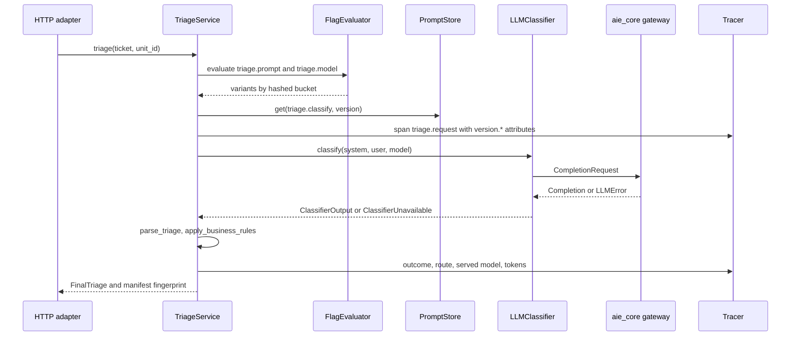
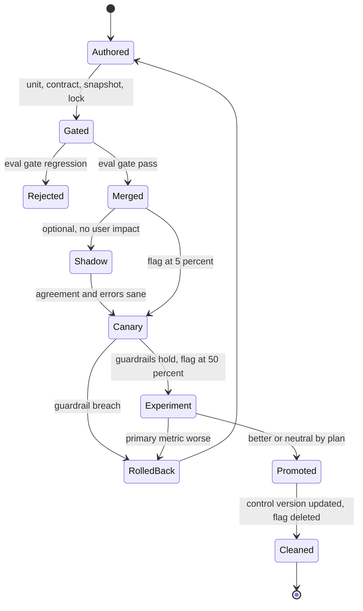
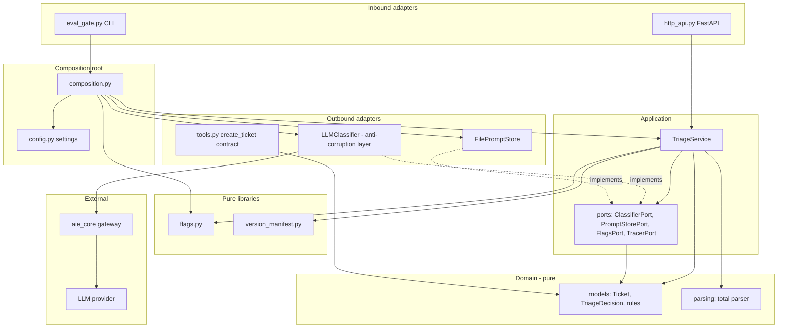
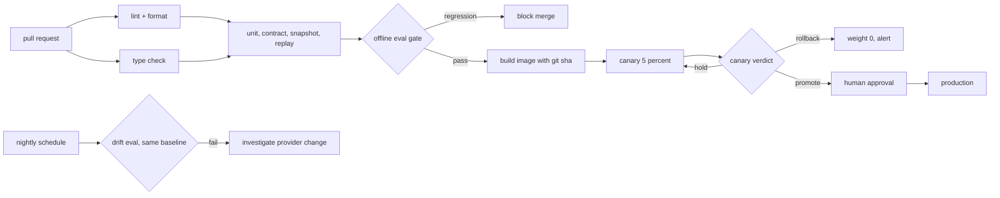

# Chapter 32 — Engineering Practices for AI Systems

This chapter is about the code inside each box of an AI system and the path every change takes to production. Without these practices, a prompt edit, a provider update, or a flag change alters behavior with no record of what changed, no test that notices, and no quick way back.

**You will be able to:**
- Structure an AI feature with ports and adapters so the model is a replaceable adapter behind an anti-corruption layer, and enforce the boundary with a fitness test.
- Test it at every level: property tests for parsers, contract tests for tools, prompt snapshots, recorded HTTP fixtures for provider adapters, and an offline eval gate.
- Version every artifact that changes behavior with a label plus a content hash, and attach a version manifest with a fingerprint to every trace.
- Roll out changes with deterministic, monotonic feature flags, a kill switch, shadow traffic, canaries, and A/B experiments sized before they start.
- Build a CI/CD pipeline that routes code, prompt, and model changes through the right gates, including a nightly drift evaluation.
- Record AI decisions in architecture decision records (ADRs) with evidence, revisit triggers, and rollback.

**Prerequisites:** Chapters 3 (the `aie_core` client and errors), 24 and 25 (evaluators and eval gates), and 28 (the system's components and versioned artifacts). | **Code:** `book/projects/examples/ch32/` (run: `cd book/projects/examples/ch32 && pytest -q`) | **Builds:** the `northwind_triage` package, with GitHub Actions and GitLab CI pipelines and an ADR template.

**First reading:** Why this matters, Mental model, Core concepts (clean architecture, provider abstraction, the test pyramid, fakes and fixtures, versioning, feature flags, experiments), How it works, Implementation: Feature flags, Code walkthrough, Failure modes. **Deep dives** (skip on a first pass): the other Core concepts subsections, Architecture, and the other Implementation subsections.

## Why this matters

Northwind's first triage feature was a 140-line file in `scripts/`. It read a ticket, formatted a prompt with an f-string, called the provider SDK, sliced the reply between the first `{` and the last `}`, and wrote a category back to the ticket system. It worked in the demo. Over the next quarter, four things happened:

- A provider SDK upgrade renamed a response field, and the script crashed every night for a week before anyone noticed.
- Someone edited the prompt to fix one misrouted ticket class and silently broke another. Nothing recorded which prompt had produced which routing.
- A new model was switched on for everyone on a Friday. On Monday nobody could tell whether the jump in human escalations came from the model, the prompt edited the same day, or the re-embedded knowledge base behind the few-shot examples.
- A security ticket was routed as `hardware` because the parser accepted `"category": "Security Report"` with a space and fell through to a default.

None of these is an AI problem; they are software-engineering problems that AI systems make more likely, for three reasons. Behavior lives in artifacts that are not code (prompts, model identifiers, indexes, tool schemas, evaluator rubrics). Behavior changes without a deploy: a provider updates a model, a flag moves, an index is rebuilt. And the central dependency is probabilistic, so one passing example proves little. This chapter adapts a mature team's ordinary disciplines to those three facts.

## Mental model

> **Mental model:** Reliability is engineered around the model, not expected from it. The model proposes; deterministic code validates, decides, records, and rolls back.

**The model is a plugin.** The triage domain (categories, priorities, the rule that security reports always get a human) existed before language models and will outlive the current one, so code that encodes it should not know a model exists. The model enters through one port, like a database or a payment provider, and is translated at the boundary.

**Every output has a bill of materials.** A response was produced by a specific code commit, prompt version, model, index, tool schema set, flag assignment, and configuration. If you cannot list those for a trace, you cannot debug, reproduce, or attribute a change. The version manifest is that bill of materials, and it travels with every request.

**Every change is an experiment until proven otherwise.** A prompt edit is a hypothesis. It passes an offline gate (does it regress?), then a small, deterministic slice of traffic (does it break anything real?), then a measured comparison (is it better?), with a one-step rollback at each stage.

## Core concepts

### Clean architecture for AI applications

Clean architecture (also called hexagonal or ports-and-adapters architecture) organizes code in concentric layers with one rule: source-code dependencies point inward. An inner layer declares what it needs as an interface, a *port*; an outer-layer *adapter* implements it for one technology. For an AI feature the layers are:

- **Domain.** Business vocabulary and rules as pure functions and value types: `Ticket`, `TriageDecision`, `apply_business_rules`, and the parser that turns model text into a validated decision. No I/O, provider types, or frameworks (pydantic is allowed; it validates values).
- **Application.** Use cases such as "triage this ticket for this user." This layer owns the ports, written in its own terms (`ClassifierPort.classify(system, user, model) -> ClassifierOutput`), and decides what happens on failure without knowing about HTTP status codes.
- **Adapters.** Port implementations: `LLMClassifier` on `aie_core`, a file-backed prompt store, a FastAPI router. Inbound adapters (HTTP, queues, CLIs) call use cases; outbound ones (LLM, database) are called by them.
- **Composition root.** The one module that knows every concrete class: it reads configuration, builds adapters, checks consistency, and wires the use case. Tests call it with fakes.

With layers, each of the four incidents lands in exactly one place: the SDK rename in an adapter (caught by adapter tests), the prompt edit in a versioned artifact behind a flag, the model switch in a flag ramp with a manifest on every trace, and the parser bug in the domain (caught by property tests).

When not to: a notebook, a spike, or a batch job that runs twice does not need ports, because layering costs indirection. You need it when the same code has a second, independent reason to change, such as a provider change and a business-rule change.

### Modularity and boundaries

> **Deep dive.** Module boundaries and their fitness test; skip on a first reading.

Layers are horizontal boundaries; modules (triage, retrieval, ingestion) are vertical ones. A module exposes its use cases and ports and hides the rest. Modules share platform code (`aie_core`, tracing, settings) but not domain types, unless a shared kernel is created deliberately and owned by someone.

Boundaries erode unless the build fails when they are crossed. The example's *architecture fitness test* parses every module's imports with `ast` and fails if the domain imports anything beyond the standard library and pydantic, or the application imports an adapter. A wiki diagram does not fail a build; a test does.

### Provider abstraction and anti-corruption layers

`aie_core` (Chapter 3) is a *provider abstraction*: it hides wire formats so one `CompletionRequest` works against several vendors, but it is still LLM-shaped (messages, tokens, finish reasons). An *anti-corruption layer*, a term from domain-driven design, is a translation boundary that keeps another system's concepts out of your domain. `LLMClassifier` is one: `CompletionRequest`, `Completion`, and `LLMError` go in; only `ClassifierOutput` and `ClassifierUnavailable` come out.

The payoff: if Northwind replaces the LLM with a fine-tuned small classifier (Chapter 33) or a gradient-boosted tree, the use case does not change. The layer also normalizes provider quirks: a truncated completion (`finish_reason = "length"`) becomes "classifier unavailable," not a short answer.

Design ports around what the *use case* needs, not what providers offer, to avoid lowest-common-denominator interfaces. If prompt caching helps, the adapter uses it internally; the port never mentions it.

### Testability: the test pyramid for AI systems

Output quality is statistical and cannot be asserted with `==`, so an AI system's test pyramid has different layers. From bottom to top:

1. **Unit tests** for deterministic code: parsers, rules, prompt rendering, flag bucketing, manifest hashing, config. Property-based tests live here.
2. **Contract tests** for agreements at boundaries: tool schema against the handler's validator, adapter encoding and decoding against recorded provider traffic, prompt bytes against the lock. Offline and fast.
3. **Offline evaluation** on a versioned golden dataset, per slice, against a stored baseline. It takes minutes, costs money with a real model, and is the release gate (Chapters 24 and 25 own the evaluators).
4. **Online evaluation** of real traffic: shadow, canary, A/B, sampled judging. Hours to weeks.

Each layer catches what the others miss: unit tests cannot see a worse prompt, and online evaluation is too slow to catch a parser crash. The common failure is an inverted pyramid: no unit tests, a few demo calls to a live model, and production as the real test.

### Fakes, recorded fixtures, and why mocks of SDKs lie

Three kinds of test double test different things.

A **fake** is a working, simplified implementation. `aie_core`'s `FakeLLM` returns scripted responses and records requests. Use it for use-case logic, such as whether a parse error routes to a human. It tests your code's reaction to model output, not its interaction with a provider.

A **recorded fixture** (a *cassette*, after the Ruby library VCR) is a real HTTP exchange captured once and replayed beneath the adapter. Replay exercises the real request encoding, response decoding, and error mapping: the code a fake skips, and what broke in Northwind's SDK incident. Recordings are keyed by a hash of the canonical request, so a changed prompt or parameter produces a loud miss, not a stale answer. Of the three modes (`record`, `replay`, `auto`), CI uses `replay`, so an unrecorded call fails the build.

A **mock of the SDK** (`MagicMock` returning `.choices[0].message.content`) encodes your belief about the SDK. When the SDK changes, the mock does not, and tests keep passing. Avoid it.

Fixtures cost re-recording churn, are one day's output rather than quality evidence, and can leak secrets, so the transport never writes credential headers and cassettes are reviewed in pull requests (merge requests in GitLab) like code.

### Property-based tests for parsers and validators

> **Deep dive.** Invariants for model-output parsers; skip on a first reading.

Model output is adversarial input. A property-based test states an invariant, lets a library (hypothesis, in Python) generate hundreds of inputs, and shrinks any failure to a minimal counterexample. Good properties:

- **Totality.** Any string yields a valid decision or `ParseError`, never `KeyError`, `TypeError`, or `RecursionError`. A `bool` priority and a NaN confidence are pinned as `@example` cases.
- **Round trip.** A valid decision wrapped in prose or code fences parses back to itself.
- **Idempotent normalization.** `"p2"` and `"P2"` both normalize to `"P2"`.
- **Business invariants.** Rules never lower urgency; a security report always routes to a human.

### Contract tests for tools

> **Deep dive.** Schema-handler agreement for tools; skip on a first reading.

The model sees a tool's JSON Schema; the executor validates arguments against its own model. If the two drift (the schema says `priority` is a string, the handler expects an integer), the model's correct call fails in production. The example derives the schema from the handler's pydantic model, so drift is impossible by construction. Tests cover the rest: `additionalProperties: false`, idempotent retries for write tools, tenant-scoped keys, and a lock that fails a schema edit without a version bump (Chapter 16 owns the registry).

### Snapshot tests for prompts

> **Deep dive.** Catching accidental prompt changes; skip on a first reading.

A refactor of a template or its escaping can change the bytes a model receives without anyone editing the prompt. A snapshot test renders each prompt version with a fixed input and diffs it against a committed file; it detects change, and the eval gate judges quality. An immutability lock (a hash per published version) makes editing `1.0.0` in place fail, so the author creates `1.0.1` (Chapter 4 builds the full registry).

### Versioning every artifact

Chapter 28 lists the seven artifacts that change an AI system's output (prompt, chat model, embedding model, index build, tool schema, policy, evaluator). Add datasets, since ten new golden cases change every metric. What makes versioning work:

- **Labels plus hashes.** `1.1.0` is a claim; `1.1.0#3edba2c34b45` is evidence. The hash stops in-place edits; the label keeps it readable.
- **Pin dated model identifiers** where offered, and record the model the provider says it served (`llm.served_model`), which aliases and fallbacks can change.
- **Embedding model and index version travel together**, because a query must be embedded with the index's model (Chapter 8).
- **Evaluators and datasets are versioned by content.** A rubric edit changes what "pass" means, and the gate refuses a baseline built on a different dataset hash.

The *version manifest* collects all of this, plus code identity, flag assignments, and behavior-relevant configuration, into one immutable record. It is built at startup and refined per request with the flag-selected prompt and model. Its *fingerprint*, a hash of the canonical JSON, identifies the exact system that produced an output. The manifest goes onto every span as `version.*` attributes (plus Chapter 31's `prompt.version` and `llm.model`) and into every evaluation report. There, `changed_components` warns when more than one component changed, because attribution is then lost.

### Configuration management

> **Deep dive.** Validated settings and secrets; skip on a first reading.

Configuration is what differs between environments or changes without a code change. Three rules:

- **Typed, in one place, validated at startup.** `AppSettings` (pydantic-settings) enforces environment rules, and `load_settings` reports every problem at once, at boot rather than on the first request. The composition root adds I/O checks: every configured prompt version exists and is locked, and every flag variant that can get traffic maps to a configured value.
- **Secrets are never configuration files.** They come from the environment or a secret manager, typed `SecretStr` to stay out of logs and errors.
- **Separate behavior from code identity.** The image bakes in `TRIAGE_GIT_SHA`; prompt and model selection come from configuration and flags at runtime, so a rollout needs no build and a rollback no deploy.

### Feature flags and gradual rollout

A feature flag decides, per request, which variant runs: a prompt version, a model, a setting, or whether a feature runs at all. AI rollouts need:

- **Deterministic assignment by a stable unit.** Hashing `salt:unit_id` with SHA-256 into 10,000 buckets gives a user the same variant on every replica, retry, and replay, with no lookup. Per-request randomization would show one user two classifiers in a conversation.
- **Monotonic ramps.** Buckets are compared against cumulative thresholds with control last, so ramping a treatment from 5% to 20% keeps the original 5%, and early exposure data stays valid.
- **Independent salts per flag.** Shared salts put the same users in both experiments' treatments, confounding them. The salt defaults to the flag name; a test checks that about 25%, not 50%, of users land in both treatments of two 50% flags.
- **A kill switch** that returns everyone to the safe variant in one change, without a deploy. Snapshots are immutable, so no request sees half an update.
- **Fail safe.** An unknown flag returns control with `reason = "unknown_flag"` rather than raising.
- **Overrides** keyed by unit id, for QA and dogfooding.

Each live flag is a code path that must work both ways; delete it within a sprint of full rollout.

### Experiments: A/B, shadow, canary

Three techniques answer three different questions.

**Shadow traffic** answers "does the candidate behave sanely on real inputs?" It runs on a copy of each request; its output is compared and discarded. You pay for both calls, and side effects (tool writes, emails) must be disabled. Agreement rate is a smoke signal, not a quality metric.

**Canary** answers "is it safe?" A small share of traffic (1 to 5%) gets the new version. Guardrails (error rate, latency, cost, safety violations) are compared with the baseline over a fixed window, against criteria written *before* it starts. A hard breach rolls back immediately, even on small samples: one cross-tenant leak is enough. Too little data yields `hold`, not a guess.

**A/B experiment** answers "is it better?" Users are split (often 50/50), a primary metric gets a significance test, and guardrails must not regress. Write down beforehand the hypothesis, metrics, minimum practical effect, randomization unit, duration, and stop conditions, and change one component only.

Sample size is where most AI experiments go wrong. For a proportion metric such as "ticket routed correctly per agent feedback," the per-arm sample size to detect an absolute change *d* from baseline *p* with significance α and power 1−β is approximately

```text
n = (z_{1-α/2} * sqrt(2 * p̄ * (1 - p̄)) + z_{1-β} * sqrt(p1(1-p1) + p2(1-p2)))^2 / d^2
```

where p̄ is the mean of the two proportions. With an illustrative baseline of 80% correct routing, α = 0.05, power 0.8:

| Effect to detect | Units per arm |
|---|---|
| +5 points | 906 |
| +3 points | 2,629 |
| +1 point | 24,641 |

A third of the effect needs roughly nine times the traffic. At an illustrative 1,200 tickets a day, a 50/50 test for +3 points needs about 4.4 days; at a 5% canary split it would take about 44. That is why canaries guard safety and A/B tests measure improvement.

Two corrections matter. If one user produces many tickets, observations are correlated: count by the randomization unit, or inflate *n* by the design effect (the variance multiplier that within-unit correlation causes). And stopping a running test the moment p < 0.05 inflates false positives: fix the duration in advance or use a sequential method.

### CI/CD for AI changes

> **Deep dive.** The pipeline gates; skip on a first reading.

An AI change can be code, a prompt, a model identifier, a dataset, an index build, or a flag. The pipeline routes each through these gates:

1. **Lint, format, and type check** (ruff, mypy strict): the most bugs per second.
2. **Unit and contract tests**, including snapshots, both locks, the fitness test, and cassettes in `replay` mode.
3. **Offline eval gate** per slice against the baseline; critical slices (security-report recall, P1 recall) may not regress at all. It exits 1 on regression and 2 when no comparable baseline exists (different dataset or provider). Read thresholds and baselines from the default branch, as Chapter 25 does, so a pull request cannot loosen its own gate; this example reads the checkout under test, which trusts the author.
4. **Build** an image with code identity baked in.
5. **Canary**: deploy at a small weight, wait the window, compute a verdict, and roll back on failure. A `hold` (exit 3) also rolls back, because a pipeline cannot wait open-ended. Size the window from real traffic: the example's 30 minutes and 400 requests assume far more than an illustrative 1,200 tickets a day.
6. **Promote** behind a protected environment with human approval.
7. **Nightly drift evaluation**: the same gate with no code change. A failure with an unchanged manifest means the provider moved.

Pull request pipelines never get provider keys, so they run the gate on a simulated model, which still catches parser, wiring, and rule regressions. The default branch and nightly runs use the real provider, each provider against its own baseline file.

### Architecture decision records for AI decisions

> **Deep dive.** What an AI decision record adds; skip on a first reading.

An architecture decision record (ADR) is a short file in the repository that captures one decision, its context, alternatives, and consequences. AI decisions decay (this quarter's model choice may be wrong next quarter), so the template adds **Evidence** (dataset and evaluator versions, manifest fingerprints, experiment ids), **Revisit when** (a metric threshold, a provider change, a date), and **Rollback** (the flag or pin that undoes it). Write one for model, retrieval, chunking, guardrail, framework (Chapter 23), and retention decisions.

### The scripts-folder anti-pattern

> **Deep dive.** Tools as package entry points; skip on a first reading.

Every AI team grows a `scripts/` folder (`run_eval.py`, `reembed_all.py`), each script with its own client, prompt string, and parsing, so the evaluation evaluates code that does not ship. Keep command-line tools, but as entry points into the package: the `triage-eval` console script calls the same composition root as the HTTP service.

### A code review checklist for AI code

> **Deep dive.** A ready-made review checklist; skip on a first reading.

Reviewers of AI changes need questions ordinary review does not ask. Northwind attaches these to its pull request template:

- **Boundaries.** Do the domain and application stay free of provider SDKs, `aie_core`, httpx, and frameworks? Is model output parsed by a total function with no default category? Are business rules (floors, approvals, routing) in code, not only in the prompt?
- **Versioning.** Is a changed prompt a new version with an updated lock and snapshot? Are tool and schema description edits reviewed as prompt changes, and does a schema change bump the tool version and lock? If more than one manifest component changed, is the bundling justified in the description or an ADR?
- **Evaluation.** Is there an eval report for this exact manifest fingerprint with no critical-slice regression? Were new production failures added to the golden set or as `@example`s? Were cassettes re-recorded deliberately, with the diff reviewed?
- **Rollout.** Is new behavior behind a flag with a safe variant, a kill switch, and a written canary policy? Are the randomization unit and a feasible sample size stated? Does every new decision get a span attribute?
- **Security and cost.** Does untrusted text reach only the user message, inside delimiters input cannot close or reopen, nested and case variants included (Chapter 26)? Are new secrets typed and absent from logs, errors, and fixtures? Is the cost guardrail updated for any growth in context, calls, or retries (Chapter 30)?

## How it works

A triage request flows through the layers in five steps:

1. The HTTP adapter validates JSON into a `Ticket` and calls `TriageService.triage(ticket, unit_id)`.
2. The service evaluates two flags for the user, picks a prompt version and model, and extends the startup manifest with them.
3. It opens a `triage.request` span carrying the `version.*` attributes and the fingerprint.
4. It renders the prompt (untrusted ticket text only in the user message, delimiter look-alikes stripped), calls the classifier port, parses with the total parser, and applies business rules.
5. On `ClassifierUnavailable` or `ParseError` it returns the safe fallback (human review, P3). It records the outcome and returns the decision with the fingerprint.



A prompt change follows the second diagram. `1.1.0.md` passes the gates but serves no traffic until the `triage.prompt` flag ramps 0 → 5% (canary) → 50% (A/B) → 100%; then `1.1.0` becomes control and the flag is deleted.



## Architecture

> **Deep dive.** The import graph and pipeline as diagrams; skip on a first reading.

The dependency diagram shows the rule the fitness test enforces; arrows are imports. Nothing points outward from the domain, and only adapters and the composition root import `aie_core`, httpx, or FastAPI.



The pipeline diagram shows each gate and where each failure goes.



## Implementation

The project tree:

```text
book/projects/examples/ch32/
  northwind_triage/
    domain/models.py, parsing.py          pure vocabulary, rules, parser
    application/ports.py, triage_service.py
    adapters/llm_classifier.py, prompt_store.py, tools.py, http_api.py, simulated_model.py
    prompt_files/triage.classify/1.0.0.md, 1.1.0.md, prompts.lock
    version_manifest.py  flags.py  record_replay.py  experiments.py
    config.py  composition.py  eval_gate.py
  eval/golden.jsonl  eval/baseline.json
  flags/prod.json
  tests/  (13 test modules, cassettes/, snapshots/, tool_schemas.lock)
  ci/github-actions.yml  ci/gitlab-ci.yml
  adr/0001-template.md  adr/0002-classifier-port-and-recorded-fixtures.md
  Dockerfile  pyproject.toml  .env.example  README.md
```

Install and test from the book root:

```bash
uv pip install --python .venv/bin/python -e book/projects/aie_core -e "book/projects/examples/ch32[dev]"
.venv/bin/python -m pytest book/projects/examples/ch32 -q
```

The variables that matter here (the full list is in the README and `.env.example`):

| Variable | Default | Meaning |
|---|---|---|
| `LLM_PROVIDER`, `LLM_MODEL` | `fake`, `fake-model` | provider and control model, from `aie_core` settings |
| `TRIAGE_ENVIRONMENT` | `dev` | staging and prod forbid the fake provider and require a git sha and flag file |
| `TRIAGE_PROMPT_CONTROL_VERSION` | `1.0.0` | prompt served to control |
| `TRIAGE_PROMPT_TREATMENT_VERSION` | unset | prompt served to the `treatment` variant |
| `TRIAGE_MODEL_CANDIDATE` | unset | model served to the `candidate` variant |
| `TRIAGE_FLAGS_PATH` | unset | JSON flag snapshot |
| `CASSETTE_MODE` | `replay` | record/replay mode for provider fixtures |

### Ports

> **Deep dive.** The ports in code; skip on a first reading.

`PromptVersion` hashes its own content, so its label is always `version#hash`.

```python
# path: book/projects/examples/ch32/northwind_triage/application/ports.py (excerpt; full file on disk)
@dataclass(frozen=True)
class ClassifierOutput:
    text: str
    served_model: str          # what the provider says it actually ran
    provider: str
    input_tokens: int
    output_tokens: int
    latency_ms: float


class ClassifierUnavailable(Exception):
    """The classifier could not produce output. Raised by adapters; the application decides
    what to do (here: route to a human)."""

    def __init__(self, reason: str, retryable: bool = False) -> None:
        super().__init__(reason)
        self.reason = reason
        self.retryable = retryable


class ClassifierPort(Protocol):
    def classify(self, *, system: str, user: str, model: str) -> ClassifierOutput: ...


_TICKET_TAG = re.compile(r"<\s*/?\s*ticket\b[^>]*>", re.IGNORECASE)


def strip_delimiters(text: str) -> str:
    # ... docstring: one pass is not enough, '</tic</ticket>ket>' would leave '</ticket>'
    while True:
        cleaned = _TICKET_TAG.sub("", text)
        if cleaned == text:
            return cleaned
        text = cleaned


@dataclass(frozen=True)
class PromptVersion:
    id: str
    version: str
    system: str
    user_template: str  # string.Template syntax: $subject, $body, $tenant

    @property
    def sha(self) -> str:
        return hashlib.sha256(f"{self.system}\n---\n{self.user_template}".encode()).hexdigest()[:12]

    @property
    def label(self) -> str:
        return f"{self.version}#{self.sha}"

    def render(self, ticket: Ticket) -> tuple[str, str]:
        # Untrusted ticket text goes only into the user message, inside delimiters, and
        # safe_substitute never evaluates anything (see Chapter 26 on injection).
        user = Template(self.user_template).safe_substitute(
            subject=strip_delimiters(ticket.subject),
            body=strip_delimiters(ticket.body),
            tenant=ticket.tenant,
        )
        return self.system, user


class PromptStorePort(Protocol):
    def get(self, prompt_id: str, version: str) -> PromptVersion: ...

# ... FlagsPort, SpanPort, TracerPort: one-method protocols (on disk)
```

### The anti-corruption layer

> **Deep dive.** The translating adapter in code; skip on a first reading.

Every `LLMError` and abnormal finish leaves as `ClassifierUnavailable`.

```python
# path: book/projects/examples/ch32/northwind_triage/adapters/llm_classifier.py (excerpt; full file on disk)
# ... imports from aie_core and the application ports
TRIAGE_JSON_SCHEMA = TriageDecision.model_json_schema()


class LLMClassifier:
    def __init__(self, client: LLMClient, *, max_tokens: int = 300, timeout_s: float = 8.0,
                 use_response_schema: bool = True) -> None:
        # ... stores the four arguments on self

    def classify(self, *, system: str, user: str, model: str) -> ClassifierOutput:
        req = CompletionRequest(
            messages=[Message.system(system), Message.user(user)],
            model=model,
            temperature=0.0,
            max_tokens=self.max_tokens,
            response_schema=TRIAGE_JSON_SCHEMA if self.use_response_schema else None,
            timeout_s=self.timeout_s,
            metadata={"use_case": "triage"},
        )
        try:
            completion = self.client.complete(req)
        except LLMError as exc:
            raise ClassifierUnavailable(f"{type(exc).__name__}: {exc}",
                                        retryable=getattr(exc, "retryable", False)) from exc
        if completion.finish_reason not in {"stop", "end_turn", "tool_calls"}:
            # Truncated output ("length") is a failure to classify, not a short answer.
            raise ClassifierUnavailable(f"finish_reason={completion.finish_reason}")
        return ClassifierOutput(
            text=completion.text,
            served_model=completion.model,
            provider=completion.provider,
            input_tokens=completion.usage.input_tokens,
            output_tokens=completion.usage.output_tokens,
            latency_ms=completion.latency_ms,
        )
```

### The use case

> **Deep dive.** The triage method and business rules in code; skip on a first reading.

```python
# path: book/projects/examples/ch32/northwind_triage/application/triage_service.py (excerpt)
    def triage(self, ticket: Ticket, unit_id: str) -> TriageResult:
        version, model, assignments = self._select(unit_id)
        prompt = self.prompts.get(self.config.prompt_id, version)
        manifest = self.base_manifest.with_updates(
            prompts={prompt.id: prompt.label},
            models={"classifier": model},
            flags=assignments,
        )
        with self.tracer.span("triage.request", ticket_id=ticket.id, tenant=ticket.tenant,
                              **manifest.as_span_attributes(), **manifest.as_semconv_attributes()) as span:
            system, user = prompt.render(ticket)
            try:
                out = self.classifier.classify(system=system, user=user, model=model)
            except ClassifierUnavailable as exc:
                result = fallback_triage(ticket, f"classifier unavailable: {exc.reason}")
                span.set_attribute("triage.outcome", "classifier_unavailable")
                span.set_attribute("triage.route", result.route)
                return TriageResult(result, manifest, "classifier_unavailable")

            span.set_attribute("llm.served_model", out.served_model)
            span.set_attribute("llm.input_tokens", out.input_tokens)
            span.set_attribute("llm.output_tokens", out.output_tokens)
            try:
                decision = parse_triage(out.text)
            except ParseError as exc:
                result = fallback_triage(ticket, f"unparseable classifier output: {exc}")
                span.set_attribute("triage.outcome", "parse_error")
                span.set_attribute("triage.route", result.route)
                return TriageResult(result, manifest, "parse_error")

            result = apply_business_rules(ticket, decision)
            span.set_attribute("triage.outcome", "ok")
            span.set_attribute("triage.category", decision.category.value)
            span.set_attribute("triage.priority", result.priority.value)
            span.set_attribute("triage.route", result.route)
            span.set_attribute("triage.confidence", decision.confidence)
            return TriageResult(result, manifest, "ok")
```

The business rules are plain domain functions a reviewer can read without the prompt:

```python
# path: book/projects/examples/ch32/northwind_triage/domain/models.py (excerpt; full file on disk)
MIN_URGENCY: dict[Category, Priority] = {
    Category.SECURITY_REPORT: Priority.P2,
    Category.POS_PAYMENTS: Priority.P3,
}
AUTO_ROUTE_MIN_CONFIDENCE = 0.6
ALWAYS_HUMAN: frozenset[Category] = frozenset({Category.SECURITY_REPORT})


def apply_business_rules(ticket: Ticket, decision: TriageDecision) -> FinalTriage:
    reasons: list[str] = []
    priority = decision.priority
    floor = MIN_URGENCY.get(decision.category)
    if floor is not None and priority.urgency < floor.urgency:
        reasons.append(f"priority raised from {priority.value} to {floor.value} by category floor")
        priority = floor

    route: Route = "auto"
    if decision.category in ALWAYS_HUMAN:
        route = "human_review"
        reasons.append(f"{decision.category.value} always gets a human")
    if decision.confidence < AUTO_ROUTE_MIN_CONFIDENCE:
        route = "human_review"
        reasons.append(f"confidence {decision.confidence:.2f} below {AUTO_ROUTE_MIN_CONFIDENCE}")
    return FinalTriage(
        ticket_id=ticket.id,
        category=decision.category,
        priority=priority,
        route=route,
        reasons=tuple(reasons),
    )
```

### The version manifest

> **Deep dive.** The manifest in code; skip on a first reading.

```python
# path: book/projects/examples/ch32/northwind_triage/version_manifest.py (excerpt)
def versioned(version: str, content: str | bytes | None = None) -> str:
    """'1.1.0#3f9a0c2b7d1e': a human label plus the hash of what the label points at."""
    return f"{version}#{content_hash(content)}" if content is not None else version


class VersionManifest(BaseModel):
    model_config = ConfigDict(frozen=True)

    schema_version: int = 1
    app: str
    app_version: str
    git_sha: str
    environment: str
    prompts: dict[str, str] = Field(default_factory=dict)        # prompt id -> version#hash
    models: dict[str, str] = Field(default_factory=dict)         # role -> provider/model
    embedding_model: str | None = None
    index_version: str | None = None
    datasets: dict[str, str] = Field(default_factory=dict)       # dataset -> version#hash
    evaluators: dict[str, str] = Field(default_factory=dict)     # evaluator -> version#hash
    tool_schemas: dict[str, str] = Field(default_factory=dict)   # tool -> version#hash
    flags: dict[str, str] = Field(default_factory=dict)          # flag -> assigned variant
    config: dict[str, str] = Field(default_factory=dict)         # behavior-relevant settings

    def fingerprint(self) -> str:
        return content_hash(self.canonical_json(), length=16)

    def as_span_attributes(self, prefix: str = "version") -> dict[str, str]:
        attrs = {f"{prefix}.{k}": v for k, v in self.flatten().items()}
        attrs[f"{prefix}.fingerprint"] = self.fingerprint()
        return attrs

    def changed_components(self, other: "VersionManifest") -> set[str]:
        """Top-level components that differ: {'prompts', 'models'} means two things changed."""
        return {key.split(".")[0] for key in self.diff(other)}
```

### Feature flags

The excerpt shows bucketing, the flag's fields, evaluation in precedence order, and the kill switch. `evaluate` has no I/O, so it is cheap on every request and a replay reproduces the same assignment.

```python
# path: book/projects/examples/ch32/northwind_triage/flags.py (excerpt; full file on disk)
BUCKETS = 10_000  # basis points: 1 bucket = 0.01% of traffic


def bucket(unit_id: str, salt: str) -> int:
    """Map a unit (user, tenant, conversation) to [0, BUCKETS). Uniform and stable."""
    digest = hashlib.sha256(f"{salt}:{unit_id}".encode("utf-8")).digest()
    return int.from_bytes(digest[:8], "big") % BUCKETS


class FlagConfig(BaseModel):
    """One flag. Allocations are ordered; the LAST one should be the control so that
    increasing a treatment percentage only moves users out of control, never between
    treatments."""

    model_config = ConfigDict(frozen=True)

    name: str
    allocations: tuple[Allocation, ...]
    salt: str | None = None            # defaults to the flag name; change it to re-shuffle
    kill_switch: bool = False
    safe_variant: str = "control"      # served when killed, unknown, or disabled
    overrides: dict[str, str] = Field(default_factory=dict)  # unit id -> variant (QA, dogfood)
    environments: tuple[str, ...] = ()  # empty = all environments

    # ... validator: unique variants, allocations sum to 100, safe and override variants exist


class FlagEvaluator:
    """Evaluates flags from an immutable snapshot of configs. Never raises in the request path:
    an unknown flag returns the safe variant, because a typo in a flag name must not take the
    service down."""

    # ... from_dict, from_file, config

    def evaluate(self, name: str, unit_id: str) -> Assignment:
        cfg = self._configs.get(name)
        if cfg is None:
            return Assignment(flag=name, variant="control", reason="unknown_flag")
        if cfg.kill_switch:
            return Assignment(flag=name, variant=cfg.safe_variant, reason="kill_switch")
        if cfg.environments and self.environment not in cfg.environments:
            return Assignment(flag=name, variant=cfg.safe_variant, reason="disabled_environment")
        if unit_id in cfg.overrides:
            return Assignment(flag=name, variant=cfg.overrides[unit_id], reason="override")
        b = bucket(unit_id, cfg.effective_salt)
        threshold = 0.0
        for alloc in cfg.allocations:
            threshold += alloc.percent * BUCKETS / 100.0
            if b < threshold:
                return Assignment(flag=name, variant=alloc.variant, reason="allocation", bucket=b)
        # Floating-point remainder: fall through to the last allocation.
        return Assignment(flag=name, variant=cfg.allocations[-1].variant, reason="allocation", bucket=b)

    def kill(self, name: str) -> "FlagEvaluator":
        """Return a new evaluator with the flag killed. Snapshots are immutable so that one
        request never sees half an update."""
        cfg = self._configs[name]
        return FlagEvaluator({**self._configs, name: cfg.model_copy(update={"kill_switch": True})},
                             self.environment)

    # ... ramp() and snapshot_hash() (on disk)
```

The production flag file, with the prompt treatment at a 5% canary and the model candidate unexposed:

```jsonc
// path: book/projects/examples/ch32/flags/prod.json (excerpt; full file on disk)
{
  "triage.prompt": {
    "allocations": [
      {"variant": "treatment", "percent": 5},
      {"variant": "control", "percent": 95}
    ],
    "kill_switch": false,
    "overrides": {"qa-triage-1": "treatment"}
  },
  "triage.model": {
    "allocations": [
      {"variant": "candidate", "percent": 0},
      {"variant": "control", "percent": 100}
    ],
    "kill_switch": false
  }
}
```

### Record and replay

> **Deep dive.** The cassette transport in code; skip on a first reading.

Re-recording replaces the old exchange, so replay never serves a stale one, and `unused_keys` finds recordings no test replayed.

```python
# path: book/projects/examples/ch32/northwind_triage/record_replay.py (excerpt; full file on disk)
SENSITIVE_HEADERS = frozenset({"authorization", "x-api-key", "api-key", "cookie", "set-cookie",
                               "openai-organization", "x-request-id"})
# ...

class RecordReplayTransport(httpx.BaseTransport):
    # ... __init__ loads the cassette; _load and _save read and write JSON

    # ------------------------------------------------------------------ matching
    def _canonical_body(self, request: httpx.Request) -> str:
        raw = request.content.decode("utf-8", errors="replace") if request.content else ""
        try:
            body = json.loads(raw) if raw else None
        except json.JSONDecodeError:
            return raw
        if isinstance(body, dict):
            body = {k: v for k, v in body.items() if k not in self.ignore_body_fields}
        return json.dumps(body, sort_keys=True, separators=(",", ":"), ensure_ascii=False)

    def key_for(self, request: httpx.Request) -> str:
        material = f"{request.method}\n{request.url.path}\n{self._canonical_body(request)}"
        return hashlib.sha256(material.encode("utf-8")).hexdigest()[:20]

    # ------------------------------------------------------------------ transport
    def handle_request(self, request: httpx.Request) -> httpx.Response:
        key = self.key_for(request)
        with self._lock:
            recorded = self._entries.get(key)
            if recorded and self.mode in ("replay", "auto"):
                i = self._cursor.get(key, 0)
                self._cursor[key] = i + 1
                return self._to_response(recorded[min(i, len(recorded) - 1)], request)
        if self.mode == "replay":
            raise CassetteMiss(
                f"no recording for {request.method} {request.url.path} (key {key}) in {self.path}. "
                f"The request changed (prompt, model, parameters) or was never recorded. "
                f"Re-record deliberately with CASSETTE_MODE=record and review the diff.")
        return self._record(key, request)

    def _record(self, key: str, request: httpx.Request) -> httpx.Response:
        upstream = self.upstream or httpx.HTTPTransport()
        response = upstream.handle_request(request)
        content = response.read()
        # ... build the entry: scrubbed request body, response minus credential headers
        with self._lock:
            if self.mode == "record" and key not in self._rerecorded:
                # Re-recording replaces the old exchange; appending would let replay keep serving it.
                self._entries[key] = []
                self._rerecorded.add(key)
            self._entries.setdefault(key, []).append(entry)
            self._save()
        # ... return the live response to the caller

    # ------------------------------------------------------------------ audit
    def unused_keys(self) -> list[str]:
        """Recordings no test replayed: stale fixtures that should be deleted."""
        return sorted(k for k in self._entries if k not in self._cursor)
```

### Configuration validated at startup

> **Deep dive.** The environment rules in code; skip on a first reading.

This validator stops a deployed service from booting on the fake provider, without a git sha, without a prod flag file, or with treatment equal to control, and reports every violation at once.

```python
# path: book/projects/examples/ch32/northwind_triage/config.py (excerpt)
class AppSettings(BaseSettings):
    model_config = SettingsConfigDict(env_prefix="TRIAGE_", env_file=".env", extra="ignore",
                                      frozen=True)

    environment: Environment = "dev"
    git_sha: str = "unknown"
    prompt_control_version: str = "1.0.0"
    prompt_treatment_version: str | None = None
    flags_path: Path | None = None
    classifier_timeout_s: float = Field(default=8.0, gt=0, le=60)
    llm: LLMSettings = Field(default_factory=LLMSettings)
    # ... app_version, prompt_id, model_candidate, prompt_dir, dataset and evaluator versions

    @model_validator(mode="after")
    def _environment_rules(self) -> "AppSettings":
        problems: list[str] = []
        deployed = self.environment in {"staging", "prod"}
        if deployed and self.llm.llm_provider == "fake":
            problems.append("LLM_PROVIDER=fake is not allowed in staging/prod")
        if deployed and self.git_sha == "unknown":
            problems.append("TRIAGE_GIT_SHA must be set in staging/prod (it goes into every trace)")
        # ... a selected provider without its API key is also a problem
        if self.environment == "prod" and self.flags_path is None:
            problems.append("TRIAGE_FLAGS_PATH is required in prod (no implicit 100% rollouts)")
        if self.prompt_treatment_version == self.prompt_control_version:
            problems.append("prompt treatment version equals control; the experiment measures nothing")
        if problems:
            raise ValueError("; ".join(problems))
        return self
```

### Property tests

> **Deep dive.** The parser properties in code; skip on a first reading.

The first test proves the parser is total over arbitrary text; the second proves any valid decision survives being wrapped in prose and code fences.

```python
# path: book/projects/examples/ch32/tests/test_parsing_properties.py (excerpt)
decisions = st.builds(
    TriageDecision,
    category=st.sampled_from(list(Category)),
    priority=st.sampled_from(list(Priority)),
    confidence=st.floats(min_value=0.0, max_value=1.0, allow_nan=False),
    rationale=st.text(max_size=200),
)
noise = st.text(alphabet=st.characters(blacklist_characters="{}", blacklist_categories=("Cs",)), max_size=80)
wrappers = st.sampled_from(["{}", "```json\n{}\n```", "Here is the result:\n{}", "{}\nHope this helps!",
                            "```\n{}\n```\nLet me know."])


@given(st.text())
@example('{"category": "hardware", "priority": "P2", "confidence": NaN}')
@example('{"category": "hardware", "priority": true, "confidence": 0.5}')
@example("[" * 5000)
def test_parser_total_function(text: str) -> None:
    """Any string: a decision or ParseError. Never KeyError, TypeError, RecursionError."""
    try:
        result = parse_triage(text)
    except ParseError:
        return
    assert isinstance(result, TriageDecision)


@given(decisions, noise, noise, wrappers)
def test_round_trip_through_prose_and_fences(decision: TriageDecision, before: str, after: str,
                                             wrapper: str) -> None:
    text = before + wrapper.replace("{}", render_decision(decision)) + after
    assert parse_triage(text) == decision
```

### Tool contract tests

> **Deep dive.** Tool contracts in code; skip on a first reading.

These tests prove the advertised schema is the validator's, a schema edit needs a version bump, and a repeated write creates nothing new.

```python
# path: book/projects/examples/ch32/tests/test_tool_contracts.py (excerpt)
@pytest.mark.parametrize("contract", CONTRACTS, ids=lambda c: c.name)
def test_advertised_schema_is_generated_from_validator(contract) -> None:
    assert contract.spec().parameters == contract.args_model.model_json_schema()


@pytest.mark.parametrize("contract", CONTRACTS, ids=lambda c: c.name)
def test_schema_change_requires_version_bump(contract) -> None:
    locked = json.loads(LOCK.read_text())
    key = f"{contract.name}@{contract.version}"
    assert key in locked, f"{key} not in tool_schemas.lock: new version? add it deliberately"
    assert locked[key] == contract.schema_hash(), (
        f"{contract.name} schema changed but version is still {contract.version}")


def test_write_tools_are_idempotent() -> None:
    repo = InMemoryTicketRepo()
    handler = make_create_ticket_handler(repo)
    args = dict(CREATE_TICKET.valid_examples[0])
    first, second = handler(args), handler(args)
    assert first["ticket_id"] == second["ticket_id"]
    assert (first["created"], second["created"]) == (True, False)
```

### Prompt snapshots

> **Deep dive.** The snapshot test in code; skip on a first reading.

```python
# path: book/projects/examples/ch32/tests/test_prompt_snapshots.py (excerpt)
@pytest.mark.parametrize("prompt", STORE.all_versions(), ids=lambda p: f"{p.id}@{p.version}")
def test_rendered_prompt_matches_snapshot(prompt) -> None:
    system, user = prompt.render(FIXED_TICKET)
    rendered = f"=== system ===\n{system}\n=== user ===\n{user}\n"
    path = SNAPSHOTS / f"{prompt.id}@{prompt.version}.txt"
    if os.environ.get("UPDATE_SNAPSHOTS") == "1":
        path.write_text(rendered, encoding="utf-8")
    if not path.exists():
        # Never create a missing snapshot implicitly: in CI that would pass a prompt nobody reviewed.
        pytest.fail(f"no snapshot for {prompt.id}@{prompt.version}; create it with UPDATE_SNAPSHOTS=1 and commit it")
    assert rendered == path.read_text(encoding="utf-8"), (
        f"rendered prompt for {prompt.id}@{prompt.version} changed; review and re-run with UPDATE_SNAPSHOTS=1")
```

A missing snapshot fails rather than being written, or CI would pass a prompt nobody reviewed. The same file's delimiter property test catches a one-pass `replace`, which turns `</tic</ticket>ket>` back into `</ticket>`.

### Experiment arithmetic and the canary verdict

> **Deep dive.** The canary verdict in code; skip on a first reading.

This function proves the canary rules run in order: a guardrail breach rolls back at any sample size, too few requests holds, and a success-rate drop rolls back only when it is both too large and statistically real.

```python
# path: book/projects/examples/ch32/northwind_triage/experiments.py (excerpt; full file on disk)
def canary_decision(baseline: ArmStats, canary: ArmStats, policy: CanaryPolicy | None = None) -> CanaryDecision:
    policy = policy or CanaryPolicy()
    breaches: list[str] = []
    # Guardrails that can roll back on little data: safety is zero-tolerance.
    if canary.safety_violations > policy.max_safety_violations:
        breaches.append(f"safety violations {canary.safety_violations} > {policy.max_safety_violations}")
    if canary.requests and canary.error_rate - baseline.error_rate > policy.max_error_rate_increase:
        breaches.append(f"error rate {canary.error_rate:.3f} vs {baseline.error_rate:.3f}")
    # ... the same shape for p95 latency and cost per request, as ratios to the baseline
    if breaches:
        return CanaryDecision(action="rollback", reasons=breaches)

    if canary.requests < policy.min_requests:
        return CanaryDecision(action="hold", reasons=[f"{canary.requests} < {policy.min_requests} requests"])

    test = two_proportion_test(baseline.task_successes, baseline.requests,
                               canary.task_successes, canary.requests, policy.alpha)
    # Roll back only when the drop is both larger than tolerated and statistically real.
    if test.ci_high < 0 and -test.diff > policy.max_success_drop:
        return CanaryDecision(action="rollback", reasons=[
            f"success rate dropped {test.diff:+.3f} (95% CI {test.ci_low:+.3f}..{test.ci_high:+.3f})"])
    if test.ci_low < -policy.max_success_drop:
        return CanaryDecision(action="hold", reasons=[
            f"cannot yet exclude a drop larger than {policy.max_success_drop} "
            f"(CI low {test.ci_low:+.3f}); keep collecting"])
    return CanaryDecision(action="promote", reasons=[
        f"success {test.diff:+.3f} (CI {test.ci_low:+.3f}..{test.ci_high:+.3f}); guardrails within limits"])
```

### The CI pipeline

> **Deep dive.** The eval-gate job in code; skip on a first reading.

The workflow has one job per stage above (lint and type check run as two parallel jobs). The excerpt is the eval gate, where the secrets policy meets the per-provider baselines:

```yaml
# path: book/projects/examples/ch32/ci/github-actions.yml (excerpt; full file on disk)
# Copy to .github/workflows/triage.yml. Stages: lint -> typecheck -> unit/contract -> offline eval
# gate -> build -> canary -> promote, plus a nightly eval that runs even when no code changed,
# because providers change models underneath you.
# Deployment commands (helm, the metrics export) are environment-specific placeholders.
# ...
jobs:
  # ... lint, typecheck, unit
  offline-eval:
    # Pull requests from forks never see secrets, so they run the gate on the simulated model;
    # main and nightly runs use the real provider. Each compares against its provider's baseline (eval/baseline.json for fake,
    # eval/baseline-openai.json for openai); until a reviewed change creates the openai one with
    # --write-baseline, real-provider runs exit 2 (fail closed).
    needs: unit
    runs-on: ubuntu-latest
    timeout-minutes: 20
    env:
      LLM_PROVIDER: ${{ github.event_name == 'pull_request' && 'fake' || 'openai' }}
      LLM_MODEL: ${{ vars.TRIAGE_MODEL || 'fake-model' }}
      OPENAI_API_KEY: ${{ github.event_name != 'pull_request' && secrets.OPENAI_API_KEY || '' }}
    steps:
      - uses: actions/checkout@v4
      - uses: actions/setup-python@v5
        with: { python-version: "${{ env.PYTHON_VERSION }}", cache: pip }
      - run: pip install -e ../../aie_core -e .
      - name: Eval gate (candidate prompt)
        run: >
          python -m northwind_triage.eval_gate
          --prompt-version "${{ vars.TRIAGE_CANDIDATE_PROMPT || '1.1.0' }}"
          --report reports/eval.json
      - uses: actions/upload-artifact@v4
        if: always()
        with: { name: eval-report, path: "${{ env.WORKDIR }}/reports/eval.json" }
  # ... build, canary, promote, nightly-drift
```

`ci/gitlab-ci.yml` is the same pipeline for GitLab CI.

### ADR template

> **Deep dive.** The ADR template; skip on a first reading.

```markdown
<!-- path: book/projects/examples/ch32/adr/0001-template.md (excerpt; full file on disk) -->
# ADR NNNN: <decision in one line, imperative>

<!-- ... Status, Date, Deciders, Components affected; then Context, Decision, Alternatives considered -->

## Evidence

- Offline eval: dataset `<name@version#hash>`, evaluator `<name@version#hash>`, results per slice.
- Online: experiment or canary id, primary metric, guardrails, sample size, duration.
- Version manifest fingerprint(s) of what was compared.

<!-- ... Consequences -->

## Revisit when

Concrete triggers that reopen this decision: a metric threshold, a provider change, a new
requirement, a date. AI decisions decay faster than most; every ADR here names its trigger.

## Rollback

How to undo it, how long that takes, and which flag or version pin performs it.
```

`adr/0002-classifier-port-and-recorded-fixtures.md` is a filled example.

## Code walkthrough

**Start at the composition root.** `composition.build_service` is the only function that names concrete classes. Its `check_consistency` step fails at boot when a flag sends traffic to `treatment` but no treatment prompt is configured. Otherwise the service would silently serve control, and the experiment would compare control with control for weeks.

**The parser scans; it does not use a regex.** Braces inside strings (`"rationale": "matched {x}"`) and escaped quotes defeat regexes, so `extract_json_object` is a small scanner. Normalizers reject booleans explicitly because `bool` is a subclass of `int` in Python.

**Notice what the adapter request contains.** The request carries `TriageDecision`'s JSON Schema, whose docstring becomes the schema description, so editing the docstring causes a `CassetteMiss` in CI. That is correct: the model reads the description, so review it like a prompt.

**The eval gate evaluates the shipping code.** `eval_gate.evaluate` builds the service exactly as the HTTP entry point does. A baseline from a different dataset exits 2: a three-point drop on a dataset that gained ten hard cases is not a regression.

**Shadow runs never touch the response.** `run_shadow` returns the primary's outputs and swallows every shadow exception. It is synchronous for testing; in production the shadow runs asynchronously from a queue, with tools disabled.

## Production considerations

**Latency.** Layering adds microseconds and a flag costs one SHA-256. What matters is the classifier timeout (8 s by default, in the manifest) and asynchronous shadow traffic.

**Cost.** Shadow traffic doubles spend for its share. Nightly drift evaluation on 60 cases is cheap; on 5,000 cases with an LLM judge, sample or tier it (Chapter 30).

**Security.** The manifest goes into traces, so it holds versions and hashes, never secrets. Flag overrides keyed by user id can be personal data; keep them short-lived.

**Operations.** During an incident, on-call needs the serving fingerprints, the one that correlates with the bad metric, and a one-step rollback. Version attributes make the first two a group-by query (Chapter 31); flags roll back prompts and models, and the canary weight rolls back code.

## Common mistakes

Most mistakes are review checklist questions left unasked. Two are common enough to name:

- **Calling a 5% canary an A/B test.** It lacks the power to show a few points of improvement.
- **Comparing against a baseline built on a different dataset** and calling the difference a regression or an improvement.

## Failure modes

**Silent fallback to control.** A flag sends traffic to an unknown variant, defensive code serves control, and dashboards show two identical arms. Telemetry: spans show `version.flags.triage.prompt = treatment` with `version.prompts.triage.classify` equal to the control label. Prevention: the startup consistency check.

**Stale cassette after a prompt change.** Local runs in `auto` mode append recordings for new prompts and keep the old ones, so cassettes fill with dead entries. Telemetry: `RecordReplayTransport.unused_keys()` is non-empty after the suite. Prevention: `replay` in CI, and a test asserting no unused keys.

**Parser fallthrough.** Output like `"category": "Security Report"` or `"priority": 2` crashes the parser or defaults to a harmless-looking category. Telemetry: a spike in `triage.outcome = parse_error`, or a category shift with no prompt change. Prevention: normalizers, the totality property test, and no default category.

**Provider model drift.** The provider updates the model behind an alias; no deploy happened. Telemetry: `llm.served_model` changes on spans, and the nightly drift eval fails with every other component unchanged. Response: pin dated identifiers, re-baseline, or roll forward with a deliberate experiment.

**Attribution loss.** Prompt `1.1.0`, a new model, and a rebuilt index ship the same day; escalations rise. Telemetry: the manifest diff shows three changed components. Response: roll back to the last single-component state and reintroduce changes one at a time, each behind a flag.

**Correlated experiments.** Two flags share a salt, so the model and prompt experiments treat the same users. Both appear to win, yet the combination performs worse than either alone. Telemetry: cross-tabulating the two flag attributes shows near-perfect correlation. Prevention: per-flag salts.

**Canary that never decides.** The minimum sample exceeds what the window delivers at 5%, so the verdict stays `hold` and someone promotes manually "because it looked fine." Prevention: compute expected requests before choosing weight and window, and give `hold` a timeout that escalates to a recorded human decision (the example pipelines simply roll back).

**Config drift between environments.** Staging runs prompt `1.1.0`, prod runs `1.0.0`, and a staging eval is cited as evidence for prod. Telemetry: the `/v1/version` endpoint and the manifest fingerprints differ. Prevention: ADRs and release notes cite manifest fingerprints, not environment names.

## Tradeoffs

| Decision | Option A | Option B | Choose A when |
|---|---|---|---|
| Structure | Ports and adapters | Single module | the feature will outlive a quarter or has two reasons to change |
| Flag storage | File snapshot in repo | Flag service | few flags, reviewed in pull requests; a service when non-engineers ramp flags or kills must be instant |
| Randomization unit | User | Request | the experience must be consistent; request only for stateless, single-shot features |
| Online step | Shadow first | Canary first | the candidate is a new model or risky prompt and doubled cost for a slice is affordable |

The deepest trade-off is speed against attribution. One component per release, each behind a flag, is slower than shipping everything at once, until an incident whose cause cannot be attributed takes weeks to untangle. Bundle only when an ADR accepts the cost.

## Evaluation and testing

Test the practices themselves: each needs a test that fails if it silently stops working. Beyond those named in Core concepts:

| Practice | Test that guards it |
|---|---|
| Dependency rule | the fitness test, plus a test proving it catches a planted violation |
| Adapters | replayed recordings, including a recorded 503 so error mapping runs offline |
| Flags | allocation within tolerance over 20,000 users, monotonic ramp, kill switch, independent salts |
| Manifest | any component change changes the fingerprint, and the diff names it |
| Eval gate | fails on regression and on unparseable output, refuses incomparable baselines |

The suite runs offline in a couple of seconds; one deselected `integration` test re-records a cassette against a real provider.

## Before you ship

- [ ] The architecture fitness test runs in CI and fails if the domain or application imports a provider SDK, `aie_core`, httpx, or a framework.
- [ ] The model-output parser has a totality property test, and every parse failure seen in staging is pinned as an `@example`.
- [ ] Every servable prompt version has a committed snapshot and a lock entry; a missing snapshot fails.
- [ ] Every tool schema is generated from its validator, and the lock fails a schema change without a version bump.
- [ ] Provider keys exist only in protected CI variables for the default branch and scheduled runs.
- [ ] Adapter tests replay cassettes with `CASSETTE_MODE=replay` in CI; cassettes hold no credentials or PII and no unused recordings.
- [ ] Startup validation rejects the fake provider, a missing git sha, and a missing prod flag file, and every flag variant with traffic maps to a configured value.
- [ ] Every request span carries the `version.*` attributes, the fingerprint, and `llm.served_model`, and a group-by on the fingerprint works.
- [ ] Every new behavior sits behind a flag with a safe variant and a kill switch, and the runbook entry for killing it is written.
- [ ] The canary policy (guardrails, window, `min_requests`) is written before the canary starts, and the window can deliver `min_requests` at the planned weight.
- [ ] The experiment plan states the randomization unit, primary metric, guardrails, and a sample size that the planned split can reach.
- [ ] The eval gate blocks merge on any critical-slice regression, refuses an incomparable baseline, and reports the manifest fingerprint.
- [ ] The nightly drift job runs against the real provider with its own baseline, and someone is alerted when it fails.

## Exercises

**Start here:** K3, K5, E2, P2, D1 (about 3 hours). The rest go deeper.

### Knowledge questions

**K1.** State the dependency rule of clean architecture and name, for each of the four layers in the triage example, one thing it may import and one thing it may not.

**K2.** What is the difference between a provider abstraction such as `aie_core` and an anti-corruption layer such as `LLMClassifier`? Why does a system need both?

**K3.** Explain why a mock of a provider SDK can keep passing after a breaking SDK change, while a recorded HTTP fixture fails. What does each still fail to tell you?

**K4.** Why must percentage rollout be deterministic by a stable unit and monotonic under ramping? What goes wrong in analysis if either property is missing?

**K5.** A team says its 5% canary "proved" that a new prompt improves routing accuracy by two points. What is wrong with the claim?

**K6.** List the artifacts a version manifest should contain for a RAG answer service (not triage), and explain why the embedding model and the index version must be recorded together.

### Engineering questions

**E1.** Northwind wants to replace the LLM classifier with a fine-tuned small model for categories it handles well and keep the LLM for the rest. Describe the changes by layer and file, and which tests change.

**E2.** Design the experiment plan for switching the triage model: hypothesis, primary metric, guardrails, randomization unit, sample size reasoning at an illustrative 1,200 tickets per day with an 80% baseline and a three-point minimum effect, duration, stop conditions, and rollback.

**E3.** Your organization forbids provider keys in any CI job triggered by a pull request. Design an offline evaluation strategy that still catches prompt regressions before merge, and state what it cannot catch.

**E4.** Write the code review checklist you would apply to a pull request that changes a prompt, a tool schema, and the parser in one change. What would you ask the author to split, and why?

### Practical exercises

**P1.** (about 2 hours) Add an `embedding_model` and `index_version` to the triage manifest by introducing a retrieval port that fetches similar past tickets as few-shot examples. Record both on spans and add a test that a changed index version changes the fingerprint and appears in `changed_components`.

**P2.** (about 90 min) Extend `FlagEvaluator` with a tenant-level override so that the `logistics` tenant can be excluded from an experiment entirely, regardless of user bucket. Add tests for precedence (kill switch, environment, tenant exclusion, user override, allocation).

**P3.** (about 2 hours) Add a `--slice tenant` option to the eval gate that reports and gates per-tenant accuracy, failing if any tenant regresses by more than the tolerance even when the aggregate improves.

**P4.** (about 60 min) Write a hypothesis property test for `RecordReplayTransport.key_for`: reordering JSON keys and changing ignored fields never changes the key; changing any non-ignored field always does.

### Debugging exercises

**D1.** After a release, the triage dashboard shows the `treatment` and `control` arms of the prompt experiment with identical category distributions and identical token counts for two weeks. The flag file shows 50% treatment. Spans show `version.flags.triage.prompt = treatment` on half of the requests. Diagnose the cause and name the check that would have caught it at startup.

**D2.** CI starts failing in the unit stage with `CassetteMiss: no recording for POST /v1/chat/completions`. The pull request only edits the docstring of `TriageDecision` and a comment in the prompt store. Explain the failure, decide whether it is a bug, and describe the correct fix.

**D3.** The nightly drift job fails on `recall.security_report` (from 0.83 to 0.67). No commits landed in a week. The manifest fingerprint of the nightly report is identical to the baseline's. Spans from production over the same week show `llm.served_model` changing from one dated identifier to another on Tuesday. What happened, what is the immediate mitigation, and what would you change so that this is caught on Tuesday rather than days later?

## Key takeaways

- Put the domain at the center and the model at the edge: the use case depends on a port written in its own terms, and an anti-corruption layer translates provider types and errors at the boundary.
- Enforce boundaries with a fitness test, not a diagram.
- Test in four layers: unit and property tests for deterministic code, contract tests for tools, prompts, and adapters, an offline eval gate for quality, and online evaluation for real traffic.
- Use fakes for logic and recorded HTTP fixtures for adapters; never mock the provider SDK.
- Version every artifact with a label and a content hash, and attach a version manifest with a fingerprint to every trace and every evaluation report.
- Validate configuration at startup, collect every problem, keep secrets typed and out of messages, and separate code identity from runtime behavior selection.
- Roll out with deterministic, monotonic, independently salted flags and a kill switch; shadow for sanity, canary for safety, A/B for improvement, with sample sizes computed before starting.
- Change one component at a time; when attribution is lost, debugging becomes guessing.
- Run the same eval gate in CI and nightly; a nightly failure with an unchanged manifest means the provider moved.
- Ship tools as package entry points, not a scripts folder, and record AI decisions in ADRs with evidence, revisit triggers, and rollback.

## Further reading

- *Hidden Technical Debt in Machine Learning Systems* (Sculley et al., 2015): the short classic on why the model is the small part of the system, and on the glue code and configuration debt this chapter's structure prevents.
- *Domain-Driven Design* (Evans, 2003): the original account of the anti-corruption layer used here to keep provider concepts out of the domain.
- *Documenting Architecture Decisions* (Nygard, 2011): the proposal that started ADRs; read it before adapting the template.
- *Trustworthy Online Controlled Experiments* (Kohavi, Tang, and Xu, 2020): randomization units, sample sizes, peeking, and guardrail metrics in far more depth than one chapter can give.
- Hypothesis documentation: strategies, `@example`, and shrinking, for writing property tests against model output.
