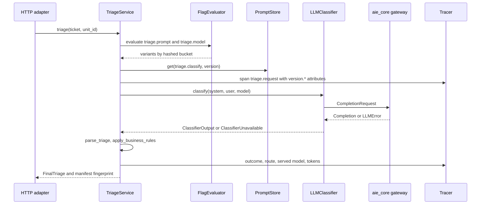
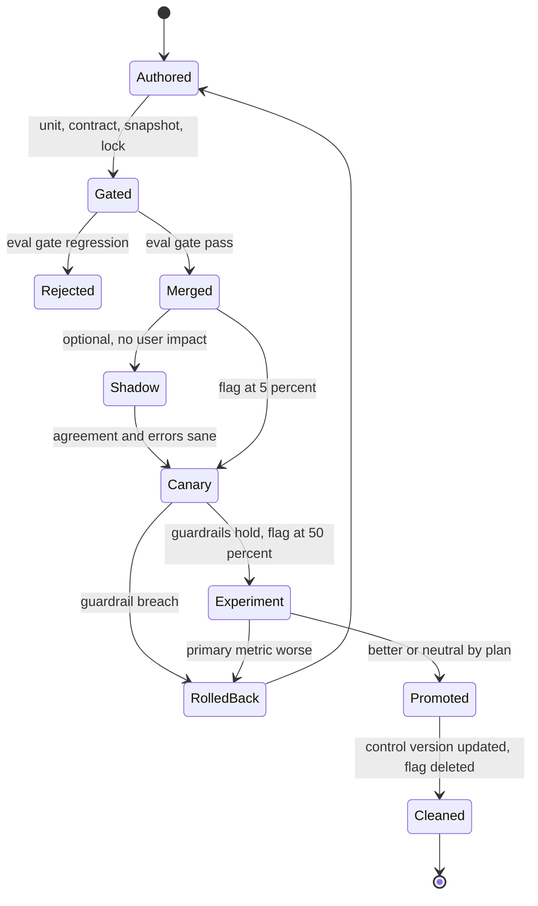
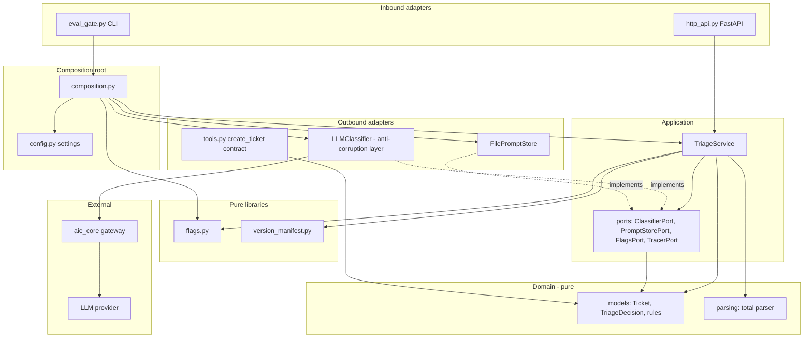

# Chapter 32 — Engineering Practices for AI Systems

After this chapter you will be able to structure an AI feature so that the model is a replaceable adapter instead of the center of the code, test it at every level from pure functions to live traffic, version every artifact that can change its behavior, and ship changes through flags, experiments, canaries, and a pipeline with an evaluation gate. The chapter builds `book/projects/examples/ch32/`: a ticket-triage service for Northwind Assist with a domain/application/ports/adapters layout, a version manifest attached to every trace, deterministic percentage rollout with a kill switch, an httpx transport that records and replays provider calls, property tests with hypothesis, contract tests for tools, prompt snapshots, an offline eval gate, experiment arithmetic, complete GitHub Actions and GitLab CI pipelines, and an ADR template.

## Why this matters

Northwind's first triage feature was a 140-line file in `scripts/`. It read a ticket, formatted a prompt with an f-string, called the provider SDK, sliced the reply between the first `{` and the last `}`, and wrote a category back to the ticket system. It worked in the demo. Over the next quarter, four things happened. A provider SDK upgrade renamed a response field and the script crashed every night for a week before anyone noticed. Someone edited the prompt to fix one misrouted ticket class and silently broke another; there was no record of which prompt had produced which routing. A new model was switched on for everyone on a Friday, and on Monday nobody could tell whether the jump in human escalations came from the model, the prompt edited the same day, or the re-embedded knowledge base that the prompt's few-shot examples were pulled from. Finally, a security ticket was routed as `hardware` because the parser accepted `"category": "Security Report"` with a space and fell through to a default.

None of these is an AI problem. They are software-engineering problems that AI systems make more likely, for three reasons. Behavior lives in artifacts that are not code: prompts, model identifiers, embedding models, indexes, tool schemas, evaluator rubrics. Behavior changes without a deploy: a provider updates a model, a flag moves, an index is rebuilt. And the central dependency is probabilistic, so a single passing example proves little. The practices in this chapter are the ordinary disciplines of a mature engineering team (layering, testing, versioning, configuration, gradual rollout, CI/CD, design records, code review) adapted to those three facts.

Chapter 28 drew the system. This chapter is about the code inside each box and the path every change takes to production.

## Mental model

> **Mental model:** Reliability is engineered around the model, not expected from it. The model proposes; deterministic code validates, decides, records, and rolls back.

Hold three images while reading.

**The model is a plugin.** The domain of ticket triage (categories, priorities, the rule that security reports always get a human) existed before language models and will outlive the current one. Code that encodes the domain should not know that a model exists. The model enters through one port, like a database or a payment provider, and is translated at the boundary.

**Every output has a bill of materials.** A response was produced by a specific code commit, prompt version, model, index, tool schema set, flag assignment, and configuration. If you cannot list those for any trace, you cannot debug, reproduce, or attribute a change. The version manifest is that bill of materials, and it travels with every request.

**Every change is an experiment until proven otherwise.** A prompt edit is a hypothesis about behavior. It goes through an offline gate (does it regress the golden set?), then exposure to a small, deterministic slice of traffic (does it break anything real?), then a measured comparison (is it better?), then promotion, with a one-step rollback at each stage.

## Core concepts

### Clean architecture for AI applications

Clean architecture (also called hexagonal or ports-and-adapters architecture) organizes code in concentric layers with one rule: source-code dependencies point inward. Inner layers define what they need as interfaces; outer layers implement them.

For an AI feature the layers are:

- **Domain.** The business vocabulary and rules, as pure functions and value types: `Ticket`, `Category`, `Priority`, `TriageDecision`, `apply_business_rules`, and the parser that turns model text into a validated decision. No I/O, no provider types, no framework imports. pydantic is acceptable here because it is a value-validation library, not infrastructure.
- **Application.** Use cases that orchestrate the domain: "triage this ticket for this user." This layer owns the ports, interfaces written in its own terms (`ClassifierPort.classify(system, user, model) -> ClassifierOutput`), and decides what happens on failure. It knows that classification can fail; it does not know about HTTP status codes.
- **Adapters.** Implementations of ports for specific technologies: an `LLMClassifier` built on `aie_core`, a file-backed prompt store, a FastAPI router, a tool executor. Inbound adapters (HTTP, queue consumers, CLIs) call use cases; outbound adapters (LLM, database, vector store) are called by them.
- **Composition root.** The one module that knows every concrete class. It reads configuration, builds adapters, checks consistency, and wires the use case. Tests call it with fakes.

Why bother for something as small as triage? Because each of the four incidents above lands in exactly one layer once the layers exist. The SDK rename is an adapter bug caught by adapter tests. The prompt edit is a versioned artifact behind a flag. The model switch is a flag ramp with a manifest on every trace. The parser bug is a domain bug caught by property tests. In the script, all four were the same 140 lines.

When not to: a one-off analysis notebook, a throwaway spike, or a batch job that will run twice does not need ports. The cost of layering is indirection: more files, more names, a newcomer has to find the composition root. The signal that you need it is the second reason to change. When the same code must change because the provider changed and because the business rule changed, separate those reasons.

### Modularity and boundaries

Layers are horizontal boundaries. Modules are vertical ones: triage, retrieval, answer generation, and ingestion are separate features with separate domains. Two rules keep them apart. A module exposes a small public interface (its use cases and ports) and hides the rest. And modules share platform code (the `aie_core` gateway, tracing, settings) but not domain types; if retrieval and triage both need a `Ticket`, each defines the fields it needs, or a shared kernel module is created deliberately and owned by someone.

Boundaries rot unless enforced. A diagram in a wiki does not fail a build; a test does. The example ships an architecture fitness test that parses every module's imports with `ast` and fails if the domain imports anything but the standard library and pydantic, or if the application imports an adapter. It runs in the unit stage in under a second. Tools such as import-linter do the same at larger scale.

### Provider abstraction and anti-corruption layers

There are two abstractions, and confusing them is a common mistake. `aie_core` (Chapter 3) is a *provider abstraction*: it hides wire formats so that the same `CompletionRequest` works against several vendors. It is still LLM-shaped: messages, roles, tokens, finish reasons. An *anti-corruption layer* (a term from domain-driven design) is a translation boundary that keeps another model's concepts out of yours. `LLMClassifier` is one: `CompletionRequest`, `Completion`, and the `LLMError` taxonomy go in, and only `ClassifierOutput` and `ClassifierUnavailable` come out.

The payoff appears when the implementation behind the port is not an LLM at all. If Northwind later fine-tunes a small classifier and serves it over HTTP (Chapter 33), or replaces the model with a gradient-boosted tree for the easy 80% of tickets, the use case does not change. The anti-corruption layer is also where provider quirks are normalized: a truncated completion (`finish_reason = "length"`) becomes "classifier unavailable," not a short answer; a rate-limit error becomes a retryable failure the application maps to "route to a human."

The trade-off is lowest-common-denominator design. If a port exposes only what every provider supports, you lose provider-specific features. The answer is that ports expose what the *use case* needs, not what providers offer. If the use case benefits from a provider's prompt caching, the adapter uses it internally; the port does not mention it.

### Testability: the test pyramid for AI systems

A classic test pyramid has many unit tests, fewer integration tests, and few end-to-end tests. AI systems need a pyramid with different layers, because the most important property, output quality, is statistical and cannot be asserted with `==`.

From bottom to top:

1. **Unit tests** cover deterministic code: parsers, business rules, prompt rendering, flag bucketing, manifest hashing, config validation. Thousands of cases per second. Property-based tests live here.
2. **Contract tests** check agreements at boundaries: the tool schema the model sees matches the validator the handler uses; the adapter correctly encodes requests and decodes responses for a real provider format (recorded fixtures); a prompt version's bytes match the lock. They run offline and fast.
3. **Offline evaluation** runs the system on a versioned golden dataset and computes quality metrics per slice, compared with a stored baseline. Minutes, costs money when it uses a real model, and is the release gate (Chapters 24 and 25 own the evaluators; this chapter owns where the gate sits).
4. **Online evaluation** measures real traffic: shadow comparisons, canary guardrails, A/B experiments, sampled judging of production traces. Hours to weeks.

Each layer catches failures the others cannot. Unit tests cannot tell you a prompt got worse. Offline evaluation cannot tell you that real tickets differ from the golden set. Online evaluation is too slow and too expensive to catch a parser crash. The common failure is an inverted pyramid: no unit tests, a handful of "does the demo still work" calls to a live model, and production as the real test.

### Fakes, recorded fixtures, and why mocks of SDKs lie

There are three ways to replace a model in a test, and they test different things.

A **fake** is a working, simplified implementation. `aie_core`'s `FakeLLM` returns scripted responses or calls a handler, and records every request. Use it to test use-case logic: does a parse error route to a human, does the kill switch select the control prompt, is temperature zero. A fake tests your code's reaction to model output, not your code's interaction with a provider.

A **recorded fixture** (often called a cassette, after the Ruby library VCR) is a real HTTP exchange captured once and replayed. Replaying below the adapter exercises the real request encoding, response decoding, and error mapping, which is exactly the code a fake skips and exactly what broke in Northwind's SDK incident. The recording is matched by a hash of the canonical request, so a changed prompt, model, or parameter produces a loud miss rather than a stale answer. In CI the mode is `replay`, so an unrecorded call fails the build.

A **mock of the SDK** (`MagicMock` returning an object with `.choices[0].message.content`) encodes your belief about the SDK. When the SDK changes, the mock does not, and the tests keep passing. Avoid it.

Fixtures have costs. They must be re-recorded when prompts change, which is a feature (the diff shows the new request) but also churn. They capture whatever the provider returned that day, so they are not quality evidence. And they can contain PII and credentials; the transport in this chapter never writes credential headers and accepts a `scrub` function for bodies, and cassettes are reviewed in pull requests like code.

### Property-based tests for parsers and validators

Model output is adversarial input you did not write. Example-based tests check the five cases you thought of; property-based tests state an invariant and let a library (hypothesis, in Python) generate hundreds of inputs, then shrink any failure to a minimal counterexample.

Good properties for AI code:

- **Totality.** For any string, the parser returns a valid decision or raises `ParseError`, never `KeyError`, `TypeError`, or `RecursionError`. It targets the inputs that break naive parsers, such as a `bool` priority that `str()` turns into `"TRUE"` and a NaN confidence that slips past a naive range check; the example pins both as explicit `@example` cases.
- **Round trip.** A valid decision rendered as JSON and wrapped in prose or code fences parses back to itself.
- **Idempotent normalization.** Normalizing `"p2"` gives `"P2"`, and normalizing `"P2"` gives `"P2"`.
- **Business invariants.** Business rules never lower urgency; a security report always routes to a human.
- **Tool argument space.** Every argument dictionary the schema allows is accepted by the handler and produces output matching the result schema.

### Contract tests for tools

A tool has a contract with two parties. The model sees a name, a description, and a JSON Schema. The executor validates arguments and performs the action. Drift between them is a silent failure: the schema says `priority` is a string, the handler expects an integer, and the model's correct call fails validation in production. The example derives the advertised schema from the same pydantic model the handler validates with, so drift is impossible by construction, and then tests the rest of the contract: `additionalProperties: false` so the model cannot invent arguments, an idempotency key for write tools, documented valid and invalid examples, idempotent behavior on retry, tenant-scoped keys, and a lock file that pins a schema hash per tool version so that a schema edit without a version bump fails the build. Chapter 16 owns the registry and policy engine; contract tests are how a tool earns its place in it.

### Snapshot tests for prompts

The bytes a model receives are assembled from a template, variables, escaping rules, and sometimes few-shot examples. A refactor of any of those changes the prompt without anyone editing the template file. A snapshot test renders each prompt version with a fixed input and compares the result with a committed file; the diff shows reviewers exactly what changed. Snapshots do not judge whether a prompt is good, only that it changed; the eval gate judges quality. Pair snapshots with an immutability lock (a hash per published version): once `1.0.0` is published, editing it in place fails, and the author creates `1.0.1`. Chapter 4 builds the full prompt registry with aliases; this chapter uses a minimal store with the same lock discipline.

### Versioning every artifact

Chapter 28 lists the seven artifacts that change an AI system's output (prompt, chat model, embedding model, index build, tool schema, policy, evaluator) and the tables that record them. Add datasets: a golden set that grows by ten cases changes every metric computed on it. The practices that make versioning work:

- **Labels plus hashes.** `1.1.0` is a claim; `1.1.0#3edba2c34b45` is evidence. A label without a content hash lets someone edit a "published" artifact; a hash without a label is unreadable. The example's `versioned(label, content)` produces both.
- **Pin explicit model versions** where providers offer dated identifiers, and record the model the provider says it served, which can differ from the one requested (aliases, fallbacks). The example records `llm.served_model` on every span.
- **Embedding model and index version travel together.** Vectors from different embedding models are not comparable; an index is defined by its corpus snapshot, chunker configuration, and embedding model, and a query must be embedded with the index's model.
- **Evaluators are versioned like code.** A rubric edit changes what "pass" means. The example hashes the evaluator module, so a metric definition change shows up as a changed component.
- **Datasets are versioned by content.** The eval gate refuses to compare against a baseline computed on a different dataset hash.

The version manifest collects all of this into one immutable record: code identity, prompts, models, embedding model, index, datasets, evaluators, tool schemas, flag assignments, and behavior-relevant configuration. It is built once at startup and refined per request with the prompt and model that flags selected. Its fingerprint (a hash of the canonical JSON) identifies the exact system that produced an output. It goes onto every trace span as flat `version.*` attributes, into every evaluation report, and into the eval gate's comparison, where `changed_components` warns when more than one component changed relative to the baseline, because then attribution is lost. Chapter 31 owns the span schema, and its tooling groups traffic by `prompt.id`, `prompt.version`, `index.version`, and `llm.model`, so the service also writes those keys with `as_semconv_attributes`. The `version.*` set is complete; the Chapter 31 set lets `compare_versions` and the alert rules work on triage traffic without a mapping table.

### Configuration management

Configuration is the set of values that differ between environments or change without a code change. Three rules.

**Typed, in one place, validated at startup.** The example's `AppSettings` uses pydantic-settings: `TRIAGE_*` variables for the application, nested `aie_core` settings for the provider. A model validator enforces environment rules: staging and prod refuse the fake provider, require a git sha (it goes into every trace), require a flag file, and refuse an experiment whose treatment equals its control. `load_settings` collects every problem into one `ConfigError` so a broken deployment fails at boot with a full list, not on the first request with the first error. The composition root adds checks that need I/O: every configured prompt version exists and is locked, and every flag variant that receives traffic maps to a configured value.

**Secrets are never configuration files.** They arrive as environment variables or from a secret manager, are typed `SecretStr` so they do not appear in `repr` or logs, and never appear in error messages. Tests clear provider variables so a developer's real key never leaks into a test run.

**Separate behavior from code identity.** The container image carries `TRIAGE_GIT_SHA` and the app version, baked in at build time. Prompt and model selection come from configuration and flags at runtime, so a prompt rollout does not require an image build and a rollback does not require a deploy.

### Feature flags and gradual rollout

A feature flag decides, per request, which variant of a behavior runs. For AI systems the variants are usually prompt versions, models, retrieval settings, or whether a feature runs at all. Requirements specific to AI rollouts:

- **Deterministic assignment by a stable unit.** The example hashes `salt:unit_id` with SHA-256 into 10,000 buckets. The same user gets the same variant on every replica, in every retry, and in a replay months later, without a database lookup. Randomizing per request would show a user two different classifiers in one conversation and break the independence assumptions of the analysis.
- **Monotonic ramps.** Buckets are compared against a cumulative threshold with control last, so ramping a treatment from 5% to 20% keeps the original 5% in it. Users do not flip back and forth, and early exposure data stays valid.
- **Independent salts per flag.** Two experiments with the same salt put the same users in both treatments, confounding their effects. Defaulting the salt to the flag name keeps them independent; the test checks that about 25% of users land in both treatments of two 50% flags, not 50%.
- **A kill switch** returns everyone to the safe variant in one change, without a deploy. Flag snapshots are immutable objects so a request never sees half an update.
- **Fail safe.** An unknown flag name returns control rather than raising. A typo must not take down the service; it shows up instead as `reason = "unknown_flag"` in the trace.
- **Overrides** for QA and dogfooding, scoped per environment.

Flags are debt. Every flag doubles a code path. Delete a flag within a sprint of full rollout, and keep the list of live flags short enough that someone can name them all.

### Experiments: A/B, shadow, canary

Three techniques answer three different questions.

**Shadow traffic** answers "does the candidate behave sanely on real inputs?" The primary serves the user; the candidate runs on a copy of the request, its output is compared and discarded. No user impact, so it is the first online step for a new model or prompt. Costs: you pay for both calls, and side-effecting paths (tool writes, emails) must be disabled for the shadow. Shadow agreement rate is a smoke signal, not a quality metric; disagreement tells you where to look.

**Canary** answers "is it safe?" A small percentage of traffic (1 to 5%) gets the new version, and guardrail metrics (error rate, latency, cost, safety violations) are compared with the baseline over a fixed window against criteria written *before* the canary starts. Breach of a hard guardrail rolls back immediately, even on small samples: a single cross-tenant leak is enough. Insufficient data holds. A canary is not designed to prove improvement; at 5% it rarely has the power to.

**A/B experiment** answers "is it better?" Users are split (often 50/50) and a primary metric is compared with a significance test, with guardrail metrics that must not regress. Before starting, write down the hypothesis, primary metric, guardrails, minimum practical effect, population, randomization unit, duration, and stop conditions. Change one component; if prompt and model change together, a positive result cannot be attributed.

Sample size is where most AI experiments go wrong. For a proportion metric such as "ticket routed correctly per agent feedback," the per-arm sample size to detect an absolute change *d* from baseline *p* with significance α and power 1−β is approximately

```text
n = (z_{1-α/2} * sqrt(2 * p̄ * (1 - p̄)) + z_{1-β} * sqrt(p1(1-p1) + p2(1-p2)))^2 / d^2
```

where p̄ is the mean of the two proportions. With an illustrative baseline of 80% correct routing, α = 0.05, power 0.8:

| Effect to detect | Units per arm |
|---|---|
| +5 points | 906 |
| +3 points | 2,629 |
| +1 point | 24,641 |

A third of the effect needs roughly nine times the traffic. If Northwind triages an illustrative 1,200 tickets a day, a 50/50 test for +3 points needs about 4.4 days of traffic; the same test run at a 5% canary split would take about 44 days, which is why canaries guard safety and A/B tests measure improvement. Two corrections matter in practice. If one user produces many tickets and you randomize by user, observations are correlated; count by the randomization unit or inflate *n* by the design effect. And peeking at a running test and stopping when p < 0.05 inflates false positives; fix the duration in advance or use a sequential method designed for it.

### CI/CD for AI changes

An AI change can be code, a prompt, a model identifier, a dataset, an index build, or a flag. The pipeline must route each through the right gates:

1. **Lint and format** (ruff) and **type check** (mypy strict): cheap, catch the most bugs per second.
2. **Unit and contract tests**, including property tests, prompt snapshots, the prompts lock, the tool-schema lock, the architecture fitness test, and replayed provider fixtures with `CASSETTE_MODE=replay`.
3. **Offline eval gate**: the golden set against the baseline, per-slice, with critical slices (security-report recall, P1 recall) that may not regress at all. Exit code 1 on regression, 2 when the baseline is not comparable.
4. **Build** an image with code identity baked in.
5. **Canary** at a small traffic weight, wait the observation window, export arm metrics, compute a verdict, roll back automatically on failure.
6. **Promote** behind a protected environment with a human approval.
7. **Scheduled drift evaluation**: the same gate, nightly, with no code change. Providers update models underneath you; a nightly failure with an unchanged manifest means the provider moved.

Secrets policy shapes the pipeline. Pull requests from forks must not see provider keys, so they run the gate on a simulated model (still useful: it catches parser, wiring, and rule regressions); the default branch and nightly runs use the real provider.

### Architecture decision records for AI decisions

An architecture decision record (ADR) is a short document that captures one decision, its context, the alternatives, and its consequences, stored in the repository next to the code. AI decisions need ADRs more than most because they decay: a model choice made on this quarter's evaluation is wrong next quarter, and without the record nobody knows what evidence it rested on. The template in this chapter adds three sections to the classic format: **Evidence** (dataset and evaluator versions, manifest fingerprints, experiment ids), **Revisit when** (concrete triggers such as a metric threshold, a provider change, or a date), and **Rollback** (which flag or pin undoes it). Write ADRs for model and provider selection, retrieval strategy, chunking and embedding choices, guardrail placement, framework adoption (Chapter 23), and data-retention decisions for prompts and traces.

### The scripts-folder anti-pattern

Every AI team accumulates a `scripts/` directory: `run_eval.py`, `reembed_all.py`, `test_new_prompt.py`, `backfill_categories.py`. Each started as a quick experiment, each builds its own client, its own prompt string, its own parsing. The result is that the evaluation evaluates code that does not ship, the backfill uses last month's prompt, and nobody knows which scripts still work.

The fix is not a ban on command-line tools; it is that tools are entry points into the package, not copies of it. The eval gate in this chapter is `northwind_triage/eval_gate.py`, exposed as the `triage-eval` console script. It calls the same composition root as the HTTP service, so it evaluates exactly the prompt store, adapter, parser, and rules that production runs, and it is covered by tests. Notebooks are fine for exploration; when a notebook's result matters, its logic moves into the package with a test, and the notebook imports it.

### A code review checklist for AI code

Reviewers of AI changes need questions that ordinary review does not ask. The checklist below is the one Northwind attaches to merge request templates; each item names the failure it prevents.

**Boundaries and structure**
- Does any domain or application module import a provider SDK, `aie_core`, httpx, or a framework? (Coupling; the fitness test should already fail.)
- Is model output parsed by a total function that returns a domain type or a typed error, with no default category or silent fallthrough?
- Are business rules (floors, approvals, routing) in deterministic code rather than only in the prompt?

**Versioning and attribution**
- Is a changed prompt a new version file with an updated lock and snapshot, never an in-place edit?
- Does the change alter more than one manifest component (prompt, model, index, tool schema, evaluator, dataset)? If so, is the bundling justified in the description or an ADR?
- Are tool and schema descriptions treated as prompt changes, since the model reads them?
- Does a tool schema change bump the tool version and the lock?

**Testing and evaluation**
- Is there an eval report in the pipeline artifacts for this exact manifest fingerprint, with per-slice results and no critical-slice regression?
- Were new failure examples from production added to the golden set or as hypothesis `@example`s?
- Were cassettes re-recorded deliberately, with the diff reviewed and no PII or credentials in it?

**Rollout and operations**
- Is new behavior behind a flag with a safe variant, a kill switch, and a written canary policy?
- Is the randomization unit stated, and is the sample size feasible at the planned traffic split?
- Are new span attributes added for any new decision the system makes, so the incident query is possible?

**Security and cost**
- Does untrusted text reach only the user message, inside delimiters that input cannot close or reopen, including nested and case variants (Chapter 26)? A single `replace` of the closing tag is not enough.
- Are new secrets typed, injected by the environment, and absent from logs, errors, and fixtures?
- Does the change increase context size, call count, or retries, and is the cost guardrail updated (Chapter 30)?

## How it works

A triage request flows through the layers like this. The HTTP adapter validates JSON into a domain `Ticket` and calls `TriageService.triage(ticket, unit_id)`. The service evaluates two flags with the user id, picks a prompt version and model, fetches the prompt, and extends the startup manifest with those selections. It opens a `triage.request` span carrying every `version.*` attribute plus the fingerprint. It renders the prompt (untrusted ticket text only in the user message, delimiters stripped from input), calls the classifier port, parses the output with the total parser, and applies business rules. On `ClassifierUnavailable` or `ParseError` it returns the safe fallback (human review, P3) and records the outcome on the span. The HTTP adapter returns the decision and the manifest fingerprint.



A change flows through the pipeline like this. A prompt edit creates `1.1.0.md`; the author updates `prompts.lock` and the snapshot, and opens a merge request. Unit and contract tests verify the lock and snapshot. The eval gate runs `1.1.0` against the golden set and the baseline. After merge, the image is built, but `1.1.0` serves no traffic until the `triage.prompt` flag sends a percentage to `treatment`. The flag is ramped 0 → 5% (canary guardrails) → 50% (A/B on the primary metric) → 100%, then `1.1.0` becomes the control version in configuration and the flag is deleted.



## Architecture

The dependency diagram shows the rule the fitness test enforces. Arrows are source-code imports. Nothing points outward from the domain; the application sees only ports; adapters and the composition root are the only places that import `aie_core`, httpx, or FastAPI. The two pure modules at the package root (flags and the version manifest) are libraries the application may use; they import only the standard library and pydantic.



The pipeline diagram shows the gates a change passes and the branch that each failure takes.


## Implementation

The project tree:

```text
book/projects/examples/ch32/
  northwind_triage/
    domain/models.py, parsing.py          pure vocabulary, rules, parser
    application/ports.py, triage_service.py
    adapters/llm_classifier.py, prompt_store.py, tools.py, http_api.py, simulated_model.py
    prompt_files/triage.classify/1.0.0.md, 1.1.0.md, prompts.lock
    version_manifest.py  flags.py  record_replay.py  experiments.py
    config.py  composition.py  eval_gate.py
  eval/golden.jsonl  eval/baseline.json
  flags/prod.json
  tests/  (11 test modules, cassettes/, snapshots/, tool_schemas.lock)
  ci/github-actions.yml  ci/gitlab-ci.yml
  adr/0001-template.md  adr/0002-classifier-port-and-recorded-fixtures.md
  Dockerfile  pyproject.toml  .env.example  README.md
```

Install and run the tests from the book root:

```bash
uv pip install --python .venv/bin/python -e book/projects/aie_core -e "book/projects/examples/ch32[dev]"
.venv/bin/python -m pytest book/projects/examples/ch32 -q
```

Configuration is documented in the project README and `.env.example`. The variables that matter for this chapter:

| Variable | Default | Meaning |
|---|---|---|
| `LLM_PROVIDER`, `LLM_MODEL` | `fake`, `fake-model` | provider and control model, from `aie_core` settings |
| `TRIAGE_ENVIRONMENT` | `dev` | staging and prod forbid the fake provider and require a git sha and flag file |
| `TRIAGE_PROMPT_CONTROL_VERSION` | `1.0.0` | prompt served to control |
| `TRIAGE_PROMPT_TREATMENT_VERSION` | unset | prompt served to the `treatment` variant |
| `TRIAGE_MODEL_CANDIDATE` | unset | model served to the `candidate` variant |
| `TRIAGE_FLAGS_PATH` | unset | JSON flag snapshot |
| `CASSETTE_MODE` | `replay` | record/replay mode for provider fixtures |

### Ports

The ports file is short and contains no provider types. `PromptVersion` carries its own content hash, so its label is always `version#hash`.

```python
# path: book/projects/examples/ch32/northwind_triage/application/ports.py
"""Ports: the interfaces the application needs, written in the application's own terms.

These types are owned by the application, not by any provider SDK. Adapters translate to
and from them. That translation is the anti-corruption layer: a provider's field names,
error classes, and quirks stop at the adapter and never leak into use-case code.
"""
from __future__ import annotations

import hashlib
import re
from contextlib import AbstractContextManager
from dataclasses import dataclass
from string import Template
from typing import Any, Protocol

from ..domain import Ticket
from ..flags import Assignment


@dataclass(frozen=True)
class ClassifierOutput:
    text: str
    served_model: str          # what the provider says it actually ran
    provider: str
    input_tokens: int
    output_tokens: int
    latency_ms: float


class ClassifierUnavailable(Exception):
    """The classifier could not produce output. Raised by adapters; the application decides
    what to do (here: route to a human)."""

    def __init__(self, reason: str, retryable: bool = False) -> None:
        super().__init__(reason)
        self.reason = reason
        self.retryable = retryable


class ClassifierPort(Protocol):
    def classify(self, *, system: str, user: str, model: str) -> ClassifierOutput: ...


_TICKET_TAG = re.compile(r"<\s*/?\s*ticket\b[^>]*>", re.IGNORECASE)


def strip_delimiters(text: str) -> str:
    """Remove every opening or closing ticket tag from untrusted text, until none is left.

    One pass is not enough: removing the inner tag of '</tic</ticket>ket>' leaves '</ticket>'.
    Repeating until the text stops changing closes that gap, and the pattern also catches case
    and whitespace variants ('</TICKET >', '< /ticket>') that a literal replace would miss.
    """
    while True:
        cleaned = _TICKET_TAG.sub("", text)
        if cleaned == text:
            return cleaned
        text = cleaned


@dataclass(frozen=True)
class PromptVersion:
    id: str
    version: str
    system: str
    user_template: str  # string.Template syntax: $subject, $body, $tenant

    @property
    def sha(self) -> str:
        return hashlib.sha256(f"{self.system}\n---\n{self.user_template}".encode()).hexdigest()[:12]

    @property
    def label(self) -> str:
        return f"{self.version}#{self.sha}"

    def render(self, ticket: Ticket) -> tuple[str, str]:
        # Untrusted ticket text goes only into the user message, inside delimiters, and
        # safe_substitute never evaluates anything (see Chapter 26 on injection).
        user = Template(self.user_template).safe_substitute(
            subject=strip_delimiters(ticket.subject),
            body=strip_delimiters(ticket.body),
            tenant=ticket.tenant,
        )
        return self.system, user


class PromptStorePort(Protocol):
    def get(self, prompt_id: str, version: str) -> PromptVersion: ...


class FlagsPort(Protocol):
    def evaluate(self, name: str, unit_id: str) -> Assignment: ...


class SpanPort(Protocol):
    def set_attribute(self, key: str, value: Any) -> None: ...


class TracerPort(Protocol):
    """Structurally satisfied by aie_core.observability.Tracer; the application does not
    import aie_core."""

    def span(self, name: str, **attributes: Any) -> AbstractContextManager[Any]: ...
```

### The anti-corruption layer

```python
# path: book/projects/examples/ch32/northwind_triage/adapters/llm_classifier.py
"""Outbound adapter: ClassifierPort implemented on top of aie_core's provider-neutral client.

This is the anti-corruption layer. Everything provider-shaped (CompletionRequest, Completion,
the LLMError taxonomy) is translated here into application types (ClassifierOutput,
ClassifierUnavailable). Swapping providers, or replacing the LLM with a fine-tuned small
model behind an HTTP endpoint, changes this file and the composition root, nothing else.
"""
from __future__ import annotations

from aie_core import CompletionRequest, Message
from aie_core.llm.client import LLMClient
from aie_core.llm.errors import LLMError

from ..application.ports import ClassifierOutput, ClassifierUnavailable
from ..domain import TriageDecision

TRIAGE_JSON_SCHEMA = TriageDecision.model_json_schema()


class LLMClassifier:
    def __init__(self, client: LLMClient, *, max_tokens: int = 300, timeout_s: float = 8.0,
                 use_response_schema: bool = True) -> None:
        self.client = client
        self.max_tokens = max_tokens
        self.timeout_s = timeout_s
        self.use_response_schema = use_response_schema

    def classify(self, *, system: str, user: str, model: str) -> ClassifierOutput:
        req = CompletionRequest(
            messages=[Message.system(system), Message.user(user)],
            model=model,
            temperature=0.0,
            max_tokens=self.max_tokens,
            response_schema=TRIAGE_JSON_SCHEMA if self.use_response_schema else None,
            timeout_s=self.timeout_s,
            metadata={"use_case": "triage"},
        )
        try:
            completion = self.client.complete(req)
        except LLMError as exc:
            raise ClassifierUnavailable(f"{type(exc).__name__}: {exc}",
                                        retryable=getattr(exc, "retryable", False)) from exc
        if completion.finish_reason not in {"stop", "end_turn", "tool_calls"}:
            # Truncated output ("length") is a failure to classify, not a short answer.
            raise ClassifierUnavailable(f"finish_reason={completion.finish_reason}")
        return ClassifierOutput(
            text=completion.text,
            served_model=completion.model,
            provider=completion.provider,
            input_tokens=completion.usage.input_tokens,
            output_tokens=completion.usage.output_tokens,
            latency_ms=completion.latency_ms,
        )
```

### The use case

The service selects versions through flags, extends the manifest, and records everything on one span. The excerpt is the core method; the file also defines `TriageConfig` and `TriageResult`.

```python
# path: book/projects/examples/ch32/northwind_triage/application/triage_service.py (excerpt)
    def triage(self, ticket: Ticket, unit_id: str) -> TriageResult:
        version, model, assignments = self._select(unit_id)
        prompt = self.prompts.get(self.config.prompt_id, version)
        manifest = self.base_manifest.with_updates(
            prompts={prompt.id: prompt.label},
            models={"classifier": model},
            flags=assignments,
        )
        with self.tracer.span("triage.request", ticket_id=ticket.id, tenant=ticket.tenant,
                              **manifest.as_span_attributes(), **manifest.as_semconv_attributes()) as span:
            system, user = prompt.render(ticket)
            try:
                out = self.classifier.classify(system=system, user=user, model=model)
            except ClassifierUnavailable as exc:
                result = fallback_triage(ticket, f"classifier unavailable: {exc.reason}")
                span.set_attribute("triage.outcome", "classifier_unavailable")
                span.set_attribute("triage.route", result.route)
                return TriageResult(result, manifest, "classifier_unavailable")

            span.set_attribute("llm.served_model", out.served_model)
            span.set_attribute("llm.input_tokens", out.input_tokens)
            span.set_attribute("llm.output_tokens", out.output_tokens)
            try:
                decision = parse_triage(out.text)
            except ParseError as exc:
                result = fallback_triage(ticket, f"unparseable classifier output: {exc}")
                span.set_attribute("triage.outcome", "parse_error")
                span.set_attribute("triage.route", result.route)
                return TriageResult(result, manifest, "parse_error")

            result = apply_business_rules(ticket, decision)
            span.set_attribute("triage.outcome", "ok")
            span.set_attribute("triage.category", decision.category.value)
            span.set_attribute("triage.priority", result.priority.value)
            span.set_attribute("triage.route", result.route)
            span.set_attribute("triage.confidence", decision.confidence)
            return TriageResult(result, manifest, "ok")
```

The business rules are plain functions in the domain, so a reviewer can read the policy without reading a prompt:

```python
# path: book/projects/examples/ch32/northwind_triage/domain/models.py (excerpt, reformatted)
MIN_URGENCY: dict[Category, Priority] = {
    Category.SECURITY_REPORT: Priority.P2,
    Category.POS_PAYMENTS: Priority.P3,
}
AUTO_ROUTE_MIN_CONFIDENCE = 0.6
ALWAYS_HUMAN: frozenset[Category] = frozenset({Category.SECURITY_REPORT})


def apply_business_rules(ticket: Ticket, decision: TriageDecision) -> FinalTriage:
    reasons: list[str] = []
    priority = decision.priority
    floor = MIN_URGENCY.get(decision.category)
    if floor is not None and priority.urgency < floor.urgency:
        reasons.append(f"priority raised from {priority.value} to {floor.value} by category floor")
        priority = floor

    route: Route = "auto"
    if decision.category in ALWAYS_HUMAN:
        route = "human_review"
        reasons.append(f"{decision.category.value} always gets a human")
    if decision.confidence < AUTO_ROUTE_MIN_CONFIDENCE:
        route = "human_review"
        reasons.append(f"confidence {decision.confidence:.2f} below {AUTO_ROUTE_MIN_CONFIDENCE}")
    return FinalTriage(ticket_id=ticket.id, category=decision.category, priority=priority,
                       route=route, reasons=tuple(reasons))
```

### The version manifest

The full file is on disk; these are the methods that matter.

```python
# path: book/projects/examples/ch32/northwind_triage/version_manifest.py (excerpt)
def versioned(version: str, content: str | bytes | None = None) -> str:
    """'1.1.0#3f9a0c2b7d1e': a human label plus the hash of what the label points at."""
    return f"{version}#{content_hash(content)}" if content is not None else version


class VersionManifest(BaseModel):
    model_config = ConfigDict(frozen=True)

    schema_version: int = 1
    app: str
    app_version: str
    git_sha: str
    environment: str
    prompts: dict[str, str] = Field(default_factory=dict)        # prompt id -> version#hash
    models: dict[str, str] = Field(default_factory=dict)         # role -> provider/model
    embedding_model: str | None = None
    index_version: str | None = None
    datasets: dict[str, str] = Field(default_factory=dict)       # dataset -> version#hash
    evaluators: dict[str, str] = Field(default_factory=dict)     # evaluator -> version#hash
    tool_schemas: dict[str, str] = Field(default_factory=dict)   # tool -> version#hash
    flags: dict[str, str] = Field(default_factory=dict)          # flag -> assigned variant
    config: dict[str, str] = Field(default_factory=dict)         # behavior-relevant settings

    def fingerprint(self) -> str:
        return content_hash(self.canonical_json(), length=16)

    def as_span_attributes(self, prefix: str = "version") -> dict[str, str]:
        attrs = {f"{prefix}.{k}": v for k, v in self.flatten().items()}
        attrs[f"{prefix}.fingerprint"] = self.fingerprint()
        return attrs

    def changed_components(self, other: "VersionManifest") -> set[str]:
        """Top-level components that differ: {'prompts', 'models'} means two things changed."""
        return {key.split(".")[0] for key in self.diff(other)}
```

### Feature flags

```python
# path: book/projects/examples/ch32/northwind_triage/flags.py
"""Feature flags with deterministic percentage rollout and a kill switch.

Assignment is a pure function of (flag salt, unit id): no database lookup, no randomness,
identical on every replica and in every replay. Ramping a variant from 5% to 20% keeps the
first 5% in it, because buckets are compared against a cumulative threshold.
"""
from __future__ import annotations

import hashlib
import json
from pathlib import Path
from typing import Any, Literal

from pydantic import BaseModel, ConfigDict, Field, model_validator

BUCKETS = 10_000  # basis points: 1 bucket = 0.01% of traffic

Reason = Literal["kill_switch", "override", "allocation", "unknown_flag", "disabled_environment"]


def bucket(unit_id: str, salt: str) -> int:
    """Map a unit (user, tenant, conversation) to [0, BUCKETS). Uniform and stable."""
    digest = hashlib.sha256(f"{salt}:{unit_id}".encode("utf-8")).digest()
    return int.from_bytes(digest[:8], "big") % BUCKETS


class Allocation(BaseModel):
    model_config = ConfigDict(frozen=True)
    variant: str
    percent: float = Field(ge=0.0, le=100.0)


class FlagConfig(BaseModel):
    """One flag. Allocations are ordered; the LAST one should be the control so that
    increasing a treatment percentage only moves users out of control, never between
    treatments."""

    model_config = ConfigDict(frozen=True)

    name: str
    allocations: tuple[Allocation, ...]
    salt: str | None = None            # defaults to the flag name; change it to re-shuffle
    kill_switch: bool = False
    safe_variant: str = "control"      # served when killed, unknown, or disabled
    overrides: dict[str, str] = Field(default_factory=dict)  # unit id -> variant (QA, dogfood)
    environments: tuple[str, ...] = ()  # empty = all environments

    @model_validator(mode="after")
    def _check(self) -> "FlagConfig":
        names = [a.variant for a in self.allocations]
        if len(set(names)) != len(names):
            raise ValueError(f"flag {self.name}: duplicate variants {names}")
        total = sum(a.percent for a in self.allocations)
        if abs(total - 100.0) > 1e-9:
            raise ValueError(f"flag {self.name}: allocations sum to {total}, expected 100")
        if self.safe_variant not in names:
            raise ValueError(f"flag {self.name}: safe_variant {self.safe_variant!r} not in {names}")
        unknown = set(self.overrides.values()) - set(names)
        if unknown:
            raise ValueError(f"flag {self.name}: overrides use unknown variants {sorted(unknown)}")
        return self

    @property
    def effective_salt(self) -> str:
        return self.salt or self.name

    def percent_of(self, variant: str) -> float:
        return sum(a.percent for a in self.allocations if a.variant == variant)


class Assignment(BaseModel):
    model_config = ConfigDict(frozen=True)
    flag: str
    variant: str
    reason: Reason
    bucket: int | None = None


class FlagEvaluator:
    """Evaluates flags from an immutable snapshot of configs. Never raises in the request path:
    an unknown flag returns the safe variant, because a typo in a flag name must not take the
    service down."""

    def __init__(self, configs: dict[str, FlagConfig], environment: str = "dev") -> None:
        self._configs = dict(configs)
        self.environment = environment

    @classmethod
    def from_dict(cls, raw: dict[str, Any], environment: str = "dev") -> "FlagEvaluator":
        configs = {name: FlagConfig(name=name, **spec) for name, spec in raw.items()}
        return cls(configs, environment)

    @classmethod
    def from_file(cls, path: str | Path, environment: str = "dev") -> "FlagEvaluator":
        return cls.from_dict(json.loads(Path(path).read_text(encoding="utf-8")), environment)

    def config(self, name: str) -> FlagConfig | None:
        return self._configs.get(name)

    def evaluate(self, name: str, unit_id: str) -> Assignment:
        cfg = self._configs.get(name)
        if cfg is None:
            return Assignment(flag=name, variant="control", reason="unknown_flag")
        if cfg.kill_switch:
            return Assignment(flag=name, variant=cfg.safe_variant, reason="kill_switch")
        if cfg.environments and self.environment not in cfg.environments:
            return Assignment(flag=name, variant=cfg.safe_variant, reason="disabled_environment")
        if unit_id in cfg.overrides:
            return Assignment(flag=name, variant=cfg.overrides[unit_id], reason="override")
        b = bucket(unit_id, cfg.effective_salt)
        threshold = 0.0
        for alloc in cfg.allocations:
            threshold += alloc.percent * BUCKETS / 100.0
            if b < threshold:
                return Assignment(flag=name, variant=alloc.variant, reason="allocation", bucket=b)
        # Floating-point remainder: fall through to the last allocation.
        return Assignment(flag=name, variant=cfg.allocations[-1].variant, reason="allocation", bucket=b)

    # --------------------------------------------------------------- operations
    def kill(self, name: str) -> "FlagEvaluator":
        """Return a new evaluator with the flag killed. Snapshots are immutable so that one
        request never sees half an update."""
        cfg = self._configs[name]
        return FlagEvaluator({**self._configs, name: cfg.model_copy(update={"kill_switch": True})},
                             self.environment)

    def ramp(self, name: str, variant: str, percent: float, control: str = "control") -> "FlagEvaluator":
        """Set `variant` to `percent`, taking or giving the difference from `control`."""
        cfg = self._configs[name]
        current = cfg.percent_of(variant)
        delta = percent - current
        new_allocs = []
        for a in cfg.allocations:
            if a.variant == variant:
                new_allocs.append(Allocation(variant=variant, percent=percent))
            elif a.variant == control:
                new_allocs.append(Allocation(variant=control, percent=a.percent - delta))
            else:
                new_allocs.append(a)
        new_cfg = FlagConfig(**{**cfg.model_dump(), "allocations": new_allocs})
        return FlagEvaluator({**self._configs, name: new_cfg}, self.environment)

    def snapshot_hash(self) -> str:
        payload = json.dumps({n: c.model_dump(mode="json") for n, c in sorted(self._configs.items())},
                             sort_keys=True)
        return hashlib.sha256(payload.encode("utf-8")).hexdigest()[:12]
```

A flag file for production, with the prompt treatment at a 5% canary and the model candidate not yet exposed:

```jsonc
// path: book/projects/examples/ch32/flags/prod.json
{
  "triage.prompt": {
    "allocations": [
      {"variant": "treatment", "percent": 5},
      {"variant": "control", "percent": 95}
    ],
    "kill_switch": false,
    "overrides": {"qa-triage-1": "treatment"}
  },
  "triage.model": {
    "allocations": [
      {"variant": "candidate", "percent": 0},
      {"variant": "control", "percent": 100}
    ],
    "kill_switch": false
  }
}
```

### Record and replay

```python
# path: book/projects/examples/ch32/northwind_triage/record_replay.py
"""Record real provider HTTP exchanges once; replay them in tests forever after.

RecordReplayTransport is an httpx transport, so it plugs into any adapter that accepts
`transport=` (aie_core's OpenAICompatibleClient and AnthropicClient do). It sits below the
adapter, which means replayed tests exercise the real request encoding, response decoding,
and error mapping, the code a FakeLLM skips.

Modes:
  replay  serve from the cassette; a request with no recording raises CassetteMiss
  record  forward to the upstream transport and append to the cassette
  auto    replay when recorded, otherwise record (convenient locally, never in CI)

Requests are matched by method, path, and a hash of the canonical JSON body with volatile
fields removed. Credentials in headers are never written. A `scrub` callback can remove PII
from bodies before they reach disk; cassettes are committed to git and reviewed like code.
"""
from __future__ import annotations

import hashlib
import json
import os
import threading
from pathlib import Path
from typing import Any, Callable, Literal

import httpx

Mode = Literal["replay", "record", "auto"]
SENSITIVE_HEADERS = frozenset({"authorization", "x-api-key", "api-key", "cookie", "set-cookie",
                               "openai-organization", "x-request-id"})
DROP_RESPONSE_HEADERS = frozenset({"content-encoding", "content-length", "transfer-encoding",
                                   "date", "connection"})


class CassetteMiss(LookupError):
    pass


def mode_from_env(default: Mode = "replay") -> Mode:
    value = os.environ.get("CASSETTE_MODE", default)
    if value not in ("replay", "record", "auto"):
        raise ValueError(f"CASSETTE_MODE must be replay|record|auto, got {value!r}")
    return value  # type: ignore[return-value]


class RecordReplayTransport(httpx.BaseTransport):
    def __init__(
        self,
        cassette_path: str | Path,
        mode: Mode = "replay",
        upstream: httpx.BaseTransport | None = None,
        ignore_body_fields: tuple[str, ...] = ("user", "metadata", "stream_options"),
        scrub: Callable[[str], str] | None = None,
    ) -> None:
        self.path = Path(cassette_path)
        self.mode = mode
        self.upstream = upstream
        self.ignore_body_fields = ignore_body_fields
        self.scrub = scrub or (lambda s: s)
        self._lock = threading.Lock()
        self._cursor: dict[str, int] = {}
        self._entries: dict[str, list[dict[str, Any]]] = self._load()

    # ------------------------------------------------------------------ storage
    def _load(self) -> dict[str, list[dict[str, Any]]]:
        if not self.path.exists():
            return {}
        data = json.loads(self.path.read_text(encoding="utf-8"))
        return {k: v for k, v in data.get("interactions", {}).items()}

    def _save(self) -> None:
        self.path.parent.mkdir(parents=True, exist_ok=True)
        payload = {"version": 1, "interactions": self._entries}
        self.path.write_text(json.dumps(payload, indent=2, sort_keys=True, ensure_ascii=False) + "\n",
                             encoding="utf-8")

    # ------------------------------------------------------------------ matching
    def _canonical_body(self, request: httpx.Request) -> str:
        raw = request.content.decode("utf-8", errors="replace") if request.content else ""
        try:
            body = json.loads(raw) if raw else None
        except json.JSONDecodeError:
            return raw
        if isinstance(body, dict):
            body = {k: v for k, v in body.items() if k not in self.ignore_body_fields}
        return json.dumps(body, sort_keys=True, separators=(",", ":"), ensure_ascii=False)

    def key_for(self, request: httpx.Request) -> str:
        material = f"{request.method}\n{request.url.path}\n{self._canonical_body(request)}"
        return hashlib.sha256(material.encode("utf-8")).hexdigest()[:20]

    # ------------------------------------------------------------------ transport
    def handle_request(self, request: httpx.Request) -> httpx.Response:
        key = self.key_for(request)
        with self._lock:
            recorded = self._entries.get(key)
            if recorded and self.mode in ("replay", "auto"):
                i = self._cursor.get(key, 0)
                self._cursor[key] = i + 1
                return self._to_response(recorded[min(i, len(recorded) - 1)], request)
        if self.mode == "replay":
            raise CassetteMiss(
                f"no recording for {request.method} {request.url.path} (key {key}) in {self.path}. "
                f"The request changed (prompt, model, parameters) or was never recorded. "
                f"Re-record deliberately with CASSETTE_MODE=record and review the diff.")
        return self._record(key, request)

    def _record(self, key: str, request: httpx.Request) -> httpx.Response:
        upstream = self.upstream or httpx.HTTPTransport()
        response = upstream.handle_request(request)
        content = response.read()
        entry = {
            "request": {
                "method": request.method,
                "path": request.url.path,
                "body": self.scrub(self._canonical_body(request)),
            },
            "response": {
                "status": response.status_code,
                "headers": {k: v for k, v in response.headers.items()
                            if k.lower() not in SENSITIVE_HEADERS | DROP_RESPONSE_HEADERS},
                "body": self.scrub(content.decode("utf-8", errors="replace")),
            },
        }
        with self._lock:
            self._entries.setdefault(key, []).append(entry)
            self._save()
        # read() already decoded gzip/br, so the encoding headers no longer describe the body.
        headers = {k: v for k, v in response.headers.items() if k.lower() not in DROP_RESPONSE_HEADERS}
        return httpx.Response(response.status_code, headers=headers, content=content, request=request)

    @staticmethod
    def _to_response(entry: dict[str, Any], request: httpx.Request) -> httpx.Response:
        r = entry["response"]
        return httpx.Response(r["status"], headers=r["headers"], content=r["body"].encode("utf-8"),
                              request=request)

    # ------------------------------------------------------------------ audit
    def unused_keys(self) -> list[str]:
        """Recordings no test replayed: stale fixtures that should be deleted."""
        return sorted(k for k in self._entries if k not in self._cursor)
```

### Configuration validated at startup

```python
# path: book/projects/examples/ch32/northwind_triage/config.py (excerpt)
class AppSettings(BaseSettings):
    model_config = SettingsConfigDict(env_prefix="TRIAGE_", env_file=".env", extra="ignore",
                                      frozen=True)

    environment: Environment = "dev"
    app_version: str = "0.0.0-dev"
    git_sha: str = "unknown"
    prompt_id: str = "triage.classify"
    prompt_control_version: str = "1.0.0"
    prompt_treatment_version: str | None = None
    model_candidate: str | None = None            # control model comes from LLM_MODEL
    flags_path: Path | None = None
    prompt_dir: Path | None = None
    classifier_timeout_s: float = Field(default=8.0, gt=0, le=60)
    dataset_version: str | None = None
    evaluator_version: str | None = None
    llm: LLMSettings = Field(default_factory=LLMSettings)

    @model_validator(mode="after")
    def _environment_rules(self) -> "AppSettings":
        problems: list[str] = []
        deployed = self.environment in {"staging", "prod"}
        if deployed and self.llm.llm_provider == "fake":
            problems.append("LLM_PROVIDER=fake is not allowed in staging/prod")
        if deployed and self.git_sha == "unknown":
            problems.append("TRIAGE_GIT_SHA must be set in staging/prod (it goes into every trace)")
        if self.llm.llm_provider == "openai" and self.llm.openai_api_key is None and not self.llm.llm_base_url:
            problems.append("LLM_PROVIDER=openai needs OPENAI_API_KEY (or LLM_BASE_URL for a local server)")
        if self.llm.llm_provider == "anthropic" and self.llm.anthropic_api_key is None:
            problems.append("LLM_PROVIDER=anthropic needs ANTHROPIC_API_KEY")
        if self.environment == "prod" and self.flags_path is None:
            problems.append("TRIAGE_FLAGS_PATH is required in prod (no implicit 100% rollouts)")
        if self.prompt_treatment_version == self.prompt_control_version:
            problems.append("prompt treatment version equals control; the experiment measures nothing")
        if problems:
            raise ValueError("; ".join(problems))
        return self
```

### Property tests

```python
# path: book/projects/examples/ch32/tests/test_parsing_properties.py (excerpt)
decisions = st.builds(
    TriageDecision,
    category=st.sampled_from(list(Category)),
    priority=st.sampled_from(list(Priority)),
    confidence=st.floats(min_value=0.0, max_value=1.0, allow_nan=False),
    rationale=st.text(max_size=200),
)
noise = st.text(alphabet=st.characters(blacklist_characters="{}", blacklist_categories=("Cs",)), max_size=80)
wrappers = st.sampled_from(["{}", "```json\n{}\n```", "Here is the result:\n{}", "{}\nHope this helps!",
                            "```\n{}\n```\nLet me know."])


@given(st.text())
@example('{"category": "hardware", "priority": "P2", "confidence": NaN}')
@example('{"category": "hardware", "priority": true, "confidence": 0.5}')
@example("[" * 5000)
def test_parser_total_function(text: str) -> None:
    """Any string: a decision or ParseError. Never KeyError, TypeError, RecursionError."""
    try:
        result = parse_triage(text)
    except ParseError:
        return
    assert isinstance(result, TriageDecision)


@given(decisions, noise, noise, wrappers)
def test_round_trip_through_prose_and_fences(decision, before, after, wrapper) -> None:
    text = before + wrapper.replace("{}", render_decision(decision)) + after
    assert parse_triage(text) == decision
```

### Tool contract tests

```python
# path: book/projects/examples/ch32/tests/test_tool_contracts.py (excerpt)
@pytest.mark.parametrize("contract", CONTRACTS, ids=lambda c: c.name)
def test_advertised_schema_is_generated_from_validator(contract) -> None:
    assert contract.spec().parameters == contract.args_model.model_json_schema()


@pytest.mark.parametrize("contract", CONTRACTS, ids=lambda c: c.name)
def test_schema_change_requires_version_bump(contract) -> None:
    locked = json.loads(LOCK.read_text())
    key = f"{contract.name}@{contract.version}"
    assert key in locked, f"{key} not in tool_schemas.lock: new version? add it deliberately"
    assert locked[key] == contract.schema_hash(), (
        f"{contract.name} schema changed but version is still {contract.version}")


def test_write_tools_are_idempotent() -> None:
    repo = InMemoryTicketRepo()
    handler = make_create_ticket_handler(repo)
    args = dict(CREATE_TICKET.valid_examples[0])
    first, second = handler(args), handler(args)
    assert first["ticket_id"] == second["ticket_id"]
    assert (first["created"], second["created"]) == (True, False)
```

### Prompt snapshots

```python
# path: book/projects/examples/ch32/tests/test_prompt_snapshots.py (excerpt)
@pytest.mark.parametrize("prompt", STORE.all_versions(), ids=lambda p: f"{p.id}@{p.version}")
def test_rendered_prompt_matches_snapshot(prompt) -> None:
    system, user = prompt.render(FIXED_TICKET)
    rendered = f"=== system ===\n{system}\n=== user ===\n{user}\n"
    path = SNAPSHOTS / f"{prompt.id}@{prompt.version}.txt"
    if os.environ.get("UPDATE_SNAPSHOTS") == "1":
        path.write_text(rendered, encoding="utf-8")
    if not path.exists():
        # Never create a missing snapshot implicitly: in CI that would pass a prompt nobody reviewed.
        pytest.fail(f"no snapshot for {prompt.id}@{prompt.version}; create it with UPDATE_SNAPSHOTS=1 and commit it")
    assert rendered == path.read_text(encoding="utf-8"), (
        f"rendered prompt for {prompt.id}@{prompt.version} changed; review and re-run with UPDATE_SNAPSHOTS=1")
```

A missing snapshot fails rather than being written, because a test that creates its own expected output on first run passes in CI for a prompt version nobody has reviewed. The same file holds the property test for the delimiter: built from fragments such as `</tic`, `ket>`, and `</TICKET >`, no ticket text can produce a second opening or closing tag in the rendered prompt. It caught the original one-pass `replace`, which turned `</tic</ticket>ket>` back into `</ticket>`.

### Experiment arithmetic and the canary verdict

```python
# path: book/projects/examples/ch32/northwind_triage/experiments.py (excerpt, reason messages shortened)
def canary_decision(baseline: ArmStats, canary: ArmStats, policy: CanaryPolicy | None = None) -> CanaryDecision:
    policy = policy or CanaryPolicy()
    breaches: list[str] = []
    if canary.safety_violations > policy.max_safety_violations:
        breaches.append(f"safety violations {canary.safety_violations} > {policy.max_safety_violations}")
    if canary.requests and canary.error_rate - baseline.error_rate > policy.max_error_rate_increase:
        breaches.append(f"error rate {canary.error_rate:.3f} vs {baseline.error_rate:.3f}")
    if baseline.p95_latency_ms and canary.p95_latency_ms > baseline.p95_latency_ms * policy.max_p95_latency_ratio:
        breaches.append("p95 latency over limit")
    if baseline.cost_per_request and canary.cost_per_request > baseline.cost_per_request * policy.max_cost_ratio:
        breaches.append("cost per request over limit")
    if breaches:
        return CanaryDecision(action="rollback", reasons=breaches)
    if canary.requests < policy.min_requests:
        return CanaryDecision(action="hold", reasons=[f"{canary.requests} < {policy.min_requests} requests"])
    test = two_proportion_test(baseline.task_successes, baseline.requests,
                               canary.task_successes, canary.requests, policy.alpha)
    if test.ci_high < 0 and -test.diff > policy.max_success_drop:
        return CanaryDecision(action="rollback", reasons=[f"success rate dropped {test.diff:+.3f}"])
    if test.ci_low < -policy.max_success_drop:
        return CanaryDecision(action="hold", reasons=["cannot yet exclude a large drop; keep collecting"])
    return CanaryDecision(action="promote", reasons=["guardrails within limits"])
```

### The GitHub Actions workflow

```yaml
# path: book/projects/examples/ch32/ci/github-actions.yml
# Copy to .github/workflows/triage.yml. Stages: lint -> typecheck -> unit/contract -> offline eval
# gate -> build -> canary -> promote, plus a nightly eval that runs even when no code changed,
# because providers change models underneath you.
# Deployment commands (helm, the metrics export) are environment-specific placeholders.
name: triage

on:
  pull_request:
  push:
    branches: [main]
  schedule:
    - cron: "17 3 * * *"          # nightly drift check against the live provider
  workflow_dispatch:

concurrency:
  group: triage-${{ github.ref }}
  cancel-in-progress: ${{ github.event_name == 'pull_request' }}

permissions:
  contents: read

env:
  PYTHON_VERSION: "3.12"
  WORKDIR: book/projects/examples/ch32
  IMAGE: ghcr.io/${{ github.repository }}/triage

defaults:
  run:
    working-directory: book/projects/examples/ch32

jobs:
  lint:
    runs-on: ubuntu-latest
    steps:
      - uses: actions/checkout@v4
      - uses: actions/setup-python@v5
        with: { python-version: "${{ env.PYTHON_VERSION }}", cache: pip }
      - run: pip install -e ../../aie_core -e ".[dev]"
      - run: ruff check .
      - run: ruff format --check .

  typecheck:
    runs-on: ubuntu-latest
    steps:
      - uses: actions/checkout@v4
      - uses: actions/setup-python@v5
        with: { python-version: "${{ env.PYTHON_VERSION }}", cache: pip }
      - run: pip install -e ../../aie_core -e ".[dev]"
      - run: mypy

  unit:
    # Unit, property, contract, snapshot, architecture, and replayed-fixture tests. No network,
    # no keys: CASSETTE_MODE=replay turns an unrecorded provider call into a failure.
    needs: [lint, typecheck]
    runs-on: ubuntu-latest
    env:
      CASSETTE_MODE: replay
      LLM_PROVIDER: fake
    steps:
      - uses: actions/checkout@v4
      - uses: actions/setup-python@v5
        with: { python-version: "${{ env.PYTHON_VERSION }}", cache: pip }
      - run: pip install -e ../../aie_core -e ".[dev]"
      - run: python -m northwind_triage.adapters.prompt_store      # prompts.lock immutability
      - run: pytest -q --junitxml=reports/unit.xml
      - uses: actions/upload-artifact@v4
        if: always()
        with: { name: unit-report, path: "${{ env.WORKDIR }}/reports/" }

  offline-eval:
    # Pull requests from forks never see secrets, so they run the gate on the simulated model;
    # main and nightly runs use the real provider. Both compare against eval/baseline.json.
    needs: unit
    runs-on: ubuntu-latest
    timeout-minutes: 20
    env:
      LLM_PROVIDER: ${{ github.event_name == 'pull_request' && 'fake' || 'openai' }}
      LLM_MODEL: ${{ vars.TRIAGE_MODEL || 'fake-model' }}
      OPENAI_API_KEY: ${{ github.event_name != 'pull_request' && secrets.OPENAI_API_KEY || '' }}
    steps:
      - uses: actions/checkout@v4
      - uses: actions/setup-python@v5
        with: { python-version: "${{ env.PYTHON_VERSION }}", cache: pip }
      - run: pip install -e ../../aie_core -e .
      - name: Eval gate (candidate prompt)
        run: >
          python -m northwind_triage.eval_gate
          --prompt-version "${{ vars.TRIAGE_CANDIDATE_PROMPT || '1.1.0' }}"
          --report reports/eval.json
      - uses: actions/upload-artifact@v4
        if: always()
        with: { name: eval-report, path: "${{ env.WORKDIR }}/reports/eval.json" }

  build:
    if: github.event_name == 'push' && github.ref == 'refs/heads/main'
    needs: offline-eval
    runs-on: ubuntu-latest
    permissions: { contents: read, packages: write }
    outputs:
      image: ${{ steps.meta.outputs.image }}
    steps:
      - uses: actions/checkout@v4
      - id: meta
        run: echo "image=${IMAGE}:${GITHUB_SHA::12}" >> "$GITHUB_OUTPUT"
      - run: echo "${{ secrets.GITHUB_TOKEN }}" | docker login ghcr.io -u "${{ github.actor }}" --password-stdin
      - name: Build with the version manifest baked in
        run: >
          docker build -f Dockerfile
          --build-arg TRIAGE_GIT_SHA=${GITHUB_SHA::12}
          --build-arg TRIAGE_APP_VERSION=$(python -c "import northwind_triage as m; print(m.__version__)")
          -t "${{ steps.meta.outputs.image }}" ../..
      - run: docker push "${{ steps.meta.outputs.image }}"

  canary:
    needs: build
    runs-on: ubuntu-latest
    environment: canary
    timeout-minutes: 90
    steps:
      - uses: actions/checkout@v4
      - uses: actions/setup-python@v5
        with: { python-version: "${{ env.PYTHON_VERSION }}" }
      - run: pip install -e ../../aie_core -e .
      - name: Deploy canary at 5% of traffic
        run: helm upgrade --install triage-canary deploy/chart --set image=${{ needs.build.outputs.image }} --set canary.weight=5
      - name: Wait for the observation window
        run: sleep 1800
      - name: Export arm metrics from the metrics backend
        run: |
          mkdir -p reports
          curl -sf -H "Authorization: Bearer ${{ secrets.METRICS_TOKEN }}" \
            "${{ vars.METRICS_URL }}/triage/arm?deployment=stable&window=30m" > reports/baseline.json
          curl -sf -H "Authorization: Bearer ${{ secrets.METRICS_TOKEN }}" \
            "${{ vars.METRICS_URL }}/triage/arm?deployment=canary&window=30m" > reports/canary.json
      - name: Canary verdict (0 promote, 3 hold, 1 rollback)
        # Any non-zero exit fails the job and the next step rolls back. A hold (3) is treated as a
        # rollback because a pipeline cannot wait open-ended; re-run the job to observe longer.
        id: verdict
        run: python -m northwind_triage.experiments canary --baseline reports/baseline.json --canary reports/canary.json
      - name: Roll back on failure
        if: failure()
        run: helm upgrade --install triage-canary deploy/chart --set canary.weight=0

  promote:
    needs: [build, canary]
    runs-on: ubuntu-latest
    environment: production          # protected: requires a human approval in repository settings
    steps:
      - uses: actions/checkout@v4
      - run: helm upgrade --install triage deploy/chart --set image=${{ needs.build.outputs.image }} --set canary.weight=0

  nightly-drift:
    # Same gate, same baseline, no code change: a failure here means the provider moved.
    if: github.event_name == 'schedule'
    runs-on: ubuntu-latest
    env:
      LLM_PROVIDER: openai
      LLM_MODEL: ${{ vars.TRIAGE_MODEL }}
      OPENAI_API_KEY: ${{ secrets.OPENAI_API_KEY }}
    steps:
      - uses: actions/checkout@v4
      - uses: actions/setup-python@v5
        with: { python-version: "${{ env.PYTHON_VERSION }}" }
      - run: pip install -e ../../aie_core -e .
      - run: python -m northwind_triage.eval_gate --prompt-version 1.0.0 --report reports/nightly.json
      - uses: actions/upload-artifact@v4
        if: always()
        with: { name: nightly-eval, path: "${{ env.WORKDIR }}/reports/nightly.json" }
```

### The equivalent GitLab CI pipeline

```yaml
# path: book/projects/examples/ch32/ci/gitlab-ci.yml
# Copy to .gitlab-ci.yml. Same pipeline as ci/github-actions.yml: lint -> typecheck -> unit ->
# offline eval gate -> build -> canary -> promote (manual), plus a scheduled drift eval.
# Deployment commands are environment-specific placeholders.
stages: [lint, test, eval, build, canary, promote]

variables:
  WORKDIR: book/projects/examples/ch32
  PIP_CACHE_DIR: "$CI_PROJECT_DIR/.cache/pip"
  IMAGE: "$CI_REGISTRY_IMAGE/triage:$CI_COMMIT_SHORT_SHA"

default:
  image: python:3.12-slim
  cache:
    key: pip-$CI_COMMIT_REF_SLUG
    paths: [.cache/pip]
  before_script:
    - cd "$WORKDIR"
    - pip install -e ../../aie_core -e ".[dev]"

workflow:
  rules:
    - if: $CI_PIPELINE_SOURCE == "merge_request_event"
    - if: $CI_COMMIT_BRANCH == $CI_DEFAULT_BRANCH
    - if: $CI_PIPELINE_SOURCE == "schedule"

lint:
  stage: lint
  rules:
    - if: $CI_PIPELINE_SOURCE != "schedule"
  script:
    - ruff check .
    - ruff format --check .

typecheck:
  stage: lint
  rules:
    - if: $CI_PIPELINE_SOURCE != "schedule"
  script:
    - mypy

unit:
  stage: test
  rules:
    - if: $CI_PIPELINE_SOURCE != "schedule"
  variables:
    CASSETTE_MODE: replay
    LLM_PROVIDER: fake
  script:
    - python -m northwind_triage.adapters.prompt_store
    - pytest -q --junitxml=reports/unit.xml
  artifacts:
    when: always
    reports:
      junit: $WORKDIR/reports/unit.xml

offline-eval:
  stage: eval
  needs: [unit]
  timeout: 20m
  rules:
    # Merge requests: simulated model, no secrets exposed to branch pipelines.
    - if: $CI_PIPELINE_SOURCE == "merge_request_event"
      variables: { LLM_PROVIDER: fake }
    # Default branch: real provider; OPENAI_API_KEY is a protected, masked CI variable.
    - if: $CI_COMMIT_BRANCH == $CI_DEFAULT_BRANCH && $CI_PIPELINE_SOURCE != "schedule"
      variables: { LLM_PROVIDER: openai, LLM_MODEL: $TRIAGE_MODEL }
  script:
    - python -m northwind_triage.eval_gate --prompt-version "${TRIAGE_CANDIDATE_PROMPT:-1.1.0}" --report reports/eval.json
  artifacts:
    when: always
    paths: [$WORKDIR/reports/eval.json]

build:
  stage: build
  needs: [offline-eval]
  image: docker:27
  services: [docker:27-dind]
  rules:
    - if: $CI_COMMIT_BRANCH == $CI_DEFAULT_BRANCH && $CI_PIPELINE_SOURCE != "schedule"
  before_script:
    - cd "$WORKDIR"
    - echo "$CI_REGISTRY_PASSWORD" | docker login "$CI_REGISTRY" -u "$CI_REGISTRY_USER" --password-stdin
  script:
    - docker build -f Dockerfile --build-arg TRIAGE_GIT_SHA="$CI_COMMIT_SHORT_SHA" -t "$IMAGE" ../..
    - docker push "$IMAGE"

canary:
  stage: canary
  needs: [build]
  timeout: 90m
  environment: { name: canary }
  rules:
    - if: $CI_COMMIT_BRANCH == $CI_DEFAULT_BRANCH && $CI_PIPELINE_SOURCE != "schedule"
  script:
    - helm upgrade --install triage-canary deploy/chart --set image="$IMAGE" --set canary.weight=5
    - sleep 1800
    - mkdir -p reports
    - 'curl -sf -H "Authorization: Bearer $METRICS_TOKEN" "$METRICS_URL/triage/arm?deployment=stable&window=30m" > reports/baseline.json'
    - 'curl -sf -H "Authorization: Bearer $METRICS_TOKEN" "$METRICS_URL/triage/arm?deployment=canary&window=30m" > reports/canary.json'
    - python -m northwind_triage.experiments canary --baseline reports/baseline.json --canary reports/canary.json
  after_script:
    # after_script runs on failure too; roll back when the verdict job failed. A hold (exit 3)
    # also fails the job and rolls back: a pipeline cannot wait open-ended; retry to observe longer.
    - cd "$WORKDIR"
    - if [ "$CI_JOB_STATUS" = "failed" ]; then helm upgrade --install triage-canary deploy/chart --set canary.weight=0; fi
  artifacts:
    when: always
    paths: [$WORKDIR/reports/]

promote:
  stage: promote
  needs: [build, canary]
  environment: { name: production }
  rules:
    - if: $CI_COMMIT_BRANCH == $CI_DEFAULT_BRANCH && $CI_PIPELINE_SOURCE != "schedule"
      when: manual                   # a human presses the button; protected environment
  script:
    - helm upgrade --install triage deploy/chart --set image="$IMAGE" --set canary.weight=0

nightly-drift:
  stage: eval
  rules:
    - if: $CI_PIPELINE_SOURCE == "schedule"
  variables:
    LLM_PROVIDER: openai
    LLM_MODEL: $TRIAGE_MODEL
  script:
    - python -m northwind_triage.eval_gate --prompt-version 1.0.0 --report reports/nightly.json
  artifacts:
    when: always
    paths: [$WORKDIR/reports/nightly.json]
```

### ADR template

```markdown
<!-- path: book/projects/examples/ch32/adr/0001-template.md -->
# ADR NNNN: <decision in one line, imperative>

- Status: proposed | accepted | superseded by ADR-XXXX | deprecated
- Date: YYYY-MM-DD
- Deciders: <names or roles>
- Components affected: prompts | models | embeddings/index | tools | policies | evaluators | infra

## Context

What forces are at play: the user job, the constraint (latency, cost, data residency,
quality bar), and what we observed. Link evidence: eval report ids, trace queries, incident ids.

## Decision

What we will do, stated so that a reviewer can check compliance in a pull request.

## Alternatives considered

| Option | Why not |
|---|---|
| <option A> | <reason with evidence> |
| <option B> | <reason with evidence> |

## Evidence

- Offline eval: dataset `<name@version#hash>`, evaluator `<name@version#hash>`, results per slice.
- Online: experiment or canary id, primary metric, guardrails, sample size, duration.
- Version manifest fingerprint(s) of what was compared.

## Consequences

Positive, negative, and the new risks. What becomes harder. Cost and latency impact
(illustrative numbers labeled as such).

## Revisit when

Concrete triggers that reopen this decision: a metric threshold, a provider change, a new
requirement, a date. AI decisions decay faster than most; every ADR here names its trigger.

## Rollback

How to undo it, how long that takes, and which flag or version pin performs it.
```

The repository also contains a filled example, `adr/0002-classifier-port-and-recorded-fixtures.md`, recording why triage sits behind a port and why adapter tests replay recordings instead of mocking the SDK.

## Code walkthrough

**Start at the composition root.** `composition.build_service` is the only function that names concrete classes. It builds the prompt store and flag evaluator, runs `check_consistency` (every configured prompt version exists, the lock holds, every flag variant with traffic has a configured value), builds the static manifest (provider, tool schema labels, flag snapshot hash, timeout), and wires `TriageService`. A flag that sends 10% of traffic to `treatment` while no treatment prompt is configured fails here, at boot, with a message naming the flag and variant. Without that check, the service would silently fall back to control and the experiment would compare control against control for two weeks.

**The parser is the most tested twenty lines.** `extract_json_object` is a scanner rather than a regex because braces inside string values (`"rationale": "matched {x}"`) and escaped quotes defeat regexes; the property test that embeds arbitrary nested JSON after arbitrary prose is what proves it. Normalizers reject booleans explicitly because `bool` is a subclass of `int` in Python and `str(True)` would otherwise flow through.

**Notice what the adapter request contains.** The committed cassette's request body includes the JSON Schema of `TriageDecision`, which includes its docstring as the schema description. Editing that docstring changes the request, which produces a `CassetteMiss` in CI. That is correct: the docstring is part of what the model sees, so it is part of the prompt. Treat schema descriptions and tool descriptions with the same review as prompt files.

**The eval gate evaluates the shipping code.** `eval_gate.evaluate` calls `load_settings` and `build_service` exactly as the HTTP entry point does, with an in-memory tracer. Every evaluation report contains the full manifest. The baseline stores the dataset version; comparing against a baseline built on a different dataset exits with code 2, because a three-point drop on a dataset that gained ten hard cases is not a regression. `--strict-attribution` turns "two components changed at once" from a warning into a failure, which teams usually enable on the main branch.

**The flags are a pure function.** `FlagEvaluator.evaluate` has no I/O, which is why it can be called on every request without latency and why a replay of last month's trace reproduces the same assignment. Operations (`kill`, `ramp`) return new evaluators instead of mutating, matching how a real flag service distributes immutable snapshots.

**Shadow runs never touch the response.** `run_shadow` returns the primary's outputs, catches every shadow exception, and only counts. In production the shadow call goes to a queue and runs asynchronously with tool execution disabled.

## Production considerations

**Latency.** Layering adds microseconds; the flag evaluation is one SHA-256 per flag; the manifest's span attributes are a few dozen strings. The latency-relevant decisions are elsewhere: the classifier timeout (8 s by default, configured and recorded in the manifest), and shadow traffic, which must be asynchronous so that the shadow's latency never adds to the user's.

**Cost.** Every online technique costs model calls. Shadow traffic doubles inference spend for the shadowed share. Nightly drift evaluation on a 60-case golden set is cheap; on a 5,000-case set with an LLM judge it is not, so sample or tier it (Chapter 30 for cost models). Canary cost guardrails catch a prompt that doubles context length before it reaches everyone.

**Security.** Provider keys exist only in protected CI variables for the default branch and scheduled runs; fork pipelines use the simulated model. Cassettes and snapshots are committed, so they must be scrubbed of PII and never contain credentials; the transport strips credential headers by construction and the test proves it. The manifest goes into traces, so it must not contain secrets; it holds versions and hashes, not values. Flag overrides keyed by user id are personal data in some jurisdictions; keep them short-lived.

**Operations.** The on-call engineer needs three things during an AI incident: which manifest fingerprints are serving traffic, which one correlates with the bad metric, and a one-step rollback. With version attributes on spans, the first two are a group-by query (Chapter 31). The kill switch and the flag ramp are the rollback for prompts and models; the canary weight is the rollback for code. Write the runbook entry for "kill the triage.model flag" before the experiment starts.

**Provider drift.** Pin dated model identifiers where available, record the served model, and keep the nightly drift job. A nightly failure with an unchanged fingerprint is the clearest signal that the dependency changed.

## Common mistakes

Most mistakes are the review checklist's questions left unasked. Four deserve emphasis because they recur on almost every team:

- **Testing against a live model in unit tests.** It is slow, flaky, and costly, and one sample is not quality evidence. Use fakes for logic, cassettes for adapters, the eval gate for quality.
- **Calling a 5% canary an A/B test.** It lacks the power to show a few points of improvement in any reasonable window.
- **Comparing against a baseline built on a different dataset** and calling the difference a regression or an improvement.
- **Leaving flags forever** and keeping a `scripts/` folder that re-implements the pipeline. Both create code paths nobody tests.

## Failure modes

**Silent fallback to control.** A flag sends traffic to a variant the service does not know, and defensive code serves control. The experiment dashboards show two identical arms. Telemetry: spans show `version.flags.triage.prompt = treatment` with `version.prompts.triage.classify` equal to the control label. Prevention: the startup consistency check; test: `test_flag_pointing_at_unconfigured_variant_fails_at_startup`.

**Stale cassette after a prompt change.** Someone runs tests in `auto` mode locally, a new recording is appended for the new prompt, and the old one stays. Over months the cassette file holds dozens of dead entries. Telemetry: `RecordReplayTransport.unused_keys()` is non-empty after the suite. Prevention: CI uses `replay`, and a test asserts no unused keys for committed cassettes.

**Parser fallthrough.** Output like `"category": "Security Report"` or `"priority": 2` hits an unhandled branch and either crashes or defaults to a harmless-looking category. Telemetry: a spike in `triage.outcome = parse_error`, or worse, a category distribution shift with no prompt change. Prevention: normalizers plus the totality property test; never default a category.

**Provider model drift.** The provider updates the model behind an alias. No deploy happened. Telemetry: `llm.served_model` changes on spans; the nightly drift eval fails with an unchanged fingerprint for everything else. Response: pin, re-baseline, or roll forward with a deliberate experiment.

**Attribution loss.** Prompt `1.1.0`, a new model, and a rebuilt index ship the same day; escalations rise. Telemetry: the manifest diff between before and after shows three changed components. Response: roll back to the last single-component state and reintroduce one change at a time, each behind its own flag.

**Correlated experiments.** Two flags share a salt; the "model experiment" and the "prompt experiment" assign the same users to treatment. Both appear to win, and the combination performs worse than either alone. Telemetry: cross-tabulating the two flag attributes on spans shows near-perfect correlation. Prevention: per-flag salts; test: `test_different_salts_give_independent_assignments`.

**Canary that never decides.** The policy's minimum sample is larger than the canary window can deliver at 5%, so the verdict is permanently `hold` and someone promotes manually "because it looked fine." Prevention: compute the expected requests in the window before choosing the weight and window; hold must have a timeout that escalates to a human decision recorded in the ADR.

**Config drift between environments.** Staging runs prompt `1.1.0`, prod runs `1.0.0`, and an eval in staging is cited as evidence for prod. Telemetry: the `/v1/version` endpoint and the manifest fingerprints differ. Prevention: evidence in ADRs and release notes cites manifest fingerprints, not environment names.

## Tradeoffs

| Decision | Option A | Option B | Choose A when |
|---|---|---|---|
| Structure | Ports and adapters | Single module | the feature will live longer than a quarter or has more than one reason to change |
| Model double in tests | FakeLLM | Recorded fixtures | testing use-case logic; use fixtures for adapter encoding and error mapping |
| Flag storage | File snapshot in repo | Flag service | few flags, changes reviewed in merge requests; a service when non-engineers ramp flags or you need instant kills |
| Randomization unit | User | Request | the experience must be consistent; request only for stateless, single-shot features |
| Eval gate provider in MRs | Simulated model | Real provider | secrets must not reach branch pipelines; real provider on main and nightly |
| Online step | Shadow first | Canary first | the candidate is a different model or risky prompt and doubled cost for a slice is affordable |
| Attribution | One change at a time | Bundled release | always, unless the ADR explicitly accepts bundling for speed |
| Prompt immutability | Lock with hashes | Edit in place | anything that has served production traffic |

The deepest trade-off is speed against attribution. One component per release, each behind a flag with a canary and an experiment, is slower than shipping everything at once. Teams that skip it ship faster for a few months and then spend weeks on an incident they cannot attribute.

## Evaluation and testing

Test the engineering practices themselves, not only the feature. Each practice in this chapter has a test that would fail if the practice silently stopped working:

| Practice | Test that guards it |
|---|---|
| Dependency rule | AST fitness test, plus a test proving it catches a violation |
| Total parser | hypothesis totality, round trip, idempotent normalization; every production failure added as `@example` |
| Tool contracts | schema equals validator, no extra properties, examples, idempotency, tenant scoping, schema-hash lock |
| Prompt versions | snapshots with injection-shaped input, failing on a missing snapshot; delimiter property test; immutability lock |
| Adapters | replayed recordings, including a recorded 503 so error mapping runs offline |
| Flags | allocation within tolerance over 20,000 users, monotonic ramp, kill switch, unknown flag safe, independent salts |
| Config | prod rules, missing keys, secrets absent from repr and errors, immutability |
| Manifest | stable fingerprint, any component change changes it, diff names the changed components |
| Experiments | worked sample sizes, every canary branch, shadow isolation |
| Pipelines | workflow files parse; stage dependencies in the promised order |
| Eval gate | passes on baseline, fails on regression and on unparseable output, refuses incomparable baselines, enforces attribution |

The example's suite runs all of these offline in a couple of seconds:

```text
86 passed, 1 deselected
```

The deselected test re-records a cassette against a real provider and is marked `integration`.

## Exercises

### Knowledge questions

K1. State the dependency rule of clean architecture and name, for each of the four layers in the triage example, one thing it may import and one thing it may not.

K2. What is the difference between a provider abstraction such as `aie_core` and an anti-corruption layer such as `LLMClassifier`? Why does a system need both?

K3. Explain why a mock of a provider SDK can keep passing after a breaking SDK change, while a recorded HTTP fixture fails. What does each still fail to tell you?

K4. Why must percentage rollout be deterministic by a stable unit and monotonic under ramping? What goes wrong in analysis if either property is missing?

K5. A team says its 5% canary "proved" that a new prompt improves routing accuracy by two points. What is wrong with the claim?

K6. List the artifacts a version manifest should contain for a RAG answer service (not triage), and explain why the embedding model and the index version must be recorded together.

### Engineering questions

E1. Northwind wants to replace the LLM classifier with a fine-tuned small model for categories it handles well and keep the LLM for the rest. Describe the changes by layer and file, and which tests change.

E2. Design the experiment plan for switching the triage model: hypothesis, primary metric, guardrails, randomization unit, sample size reasoning at an illustrative 1,200 tickets per day with an 80% baseline and a three-point minimum effect, duration, stop conditions, and rollback.

E3. Your organization forbids provider keys in any CI job triggered by a merge request. Design an offline evaluation strategy that still catches prompt regressions before merge, and state what it cannot catch.

E4. Write the code review checklist you would apply to a merge request that changes a prompt, a tool schema, and the parser in one change. What would you ask the author to split, and why?

### Practical exercises

P1. Add an `embedding_model` and `index_version` to the triage manifest by introducing a retrieval port that fetches similar past tickets as few-shot examples. Record both on spans and add a test that a changed index version changes the fingerprint and appears in `changed_components`.

P2. Extend `FlagEvaluator` with a tenant-level override so that the `logistics` tenant can be excluded from an experiment entirely, regardless of user bucket. Add tests for precedence (kill switch, environment, tenant exclusion, user override, allocation).

P3. Add a `--slice tenant` option to the eval gate that reports and gates per-tenant accuracy, failing if any tenant regresses by more than the tolerance even when the aggregate improves.

P4. Write a hypothesis property test for `RecordReplayTransport.key_for`: reordering JSON keys and changing ignored fields never changes the key; changing any non-ignored field always does.

### Debugging exercises

D1. After a release, the triage dashboard shows the `treatment` and `control` arms of the prompt experiment with identical category distributions and identical token counts for two weeks. The flag file shows 50% treatment. Spans show `version.flags.triage.prompt = treatment` on half of the requests. Diagnose the cause and name the check that would have caught it at startup.

D2. CI starts failing in the unit stage with `CassetteMiss: no recording for POST /v1/chat/completions`. The merge request only edits the docstring of `TriageDecision` and a comment in the prompt store. Explain the failure, decide whether it is a bug, and describe the correct fix.

D3. The nightly drift job fails on `recall.security_report` (from 0.83 to 0.67). No commits landed in a week. The manifest fingerprint of the nightly report is identical to the baseline's. Spans from production over the same week show `llm.served_model` changing from one dated identifier to another on Tuesday. What happened, what is the immediate mitigation, and what would you change so that this is caught on Tuesday rather than days later?

## Key takeaways

- Put the domain at the center and the model at the edge: the use case depends on a port written in its own terms, and an anti-corruption layer translates provider types and errors at the boundary.
- Enforce boundaries with a fitness test, not a diagram.
- Test in four layers: unit and property tests for deterministic code, contract tests for tools, prompts, and adapters, an offline eval gate for quality, and online evaluation for real traffic.
- Use fakes for logic and recorded HTTP fixtures for adapters; never mock the provider SDK.
- Version every artifact with a label and a content hash, and attach a version manifest with a fingerprint to every trace and every evaluation report.
- Validate configuration at startup, collect every problem, keep secrets typed and out of messages, and separate code identity from runtime behavior selection.
- Roll out with deterministic, monotonic, independently salted flags and a kill switch; shadow for sanity, canary for safety, A/B for improvement, with sample sizes computed before starting.
- Change one component at a time; when attribution is lost, debugging becomes guessing.
- Run the same eval gate in CI and nightly; a nightly failure with an unchanged manifest means the provider moved.
- Ship tools as package entry points, not a scripts folder, and record AI decisions in ADRs with evidence, revisit triggers, and rollback.
