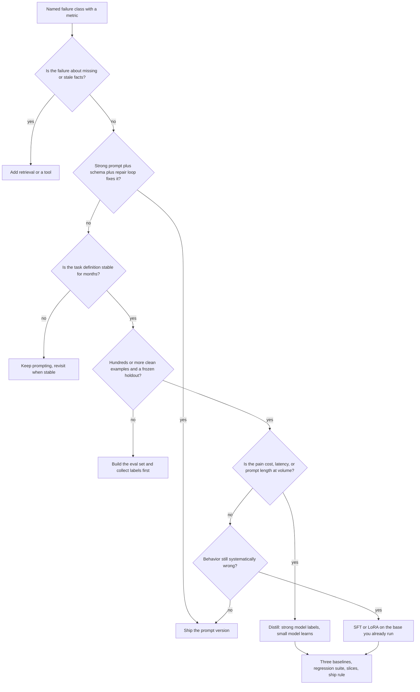
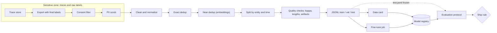
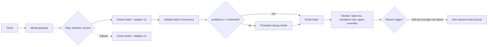

# Chapter 33 — Fine-Tuning for Engineers

Fine-tuning changes a model's weights instead of its context, and it is the most expensive rung on the decision ladder to climb and to undo. This chapter is about deciding with evidence whether a task deserves it, and then doing the data, evaluation, and operations work that makes the result safe to ship. The running case is the Northwind ticket classifier: 40 categories, high volume, and a prompted strong model that is accurate but too expensive to keep.

**You will be able to:**
- Decide whether a task needs fine-tuning, or a prompt, retrieval, or a tool instead, and choose among SFT, LoRA, distillation, preference tuning, and reinforcement fine-tuning.
- Build a training set from production traces that survives a leakage audit: consent, PII scrubbing, exact and near dedup, entity and time splits, artifact detection, and a data card.
- Run an evaluation protocol with three baselines, slices, calibration, and a ship rule written before training.
- Compose a fine-tuned small model with an escalation path and pick the confidence threshold on validation data.
- Drive a hosted fine-tuning job through a provider-neutral interface that survives crashes and transient errors.
- Operate the result as a versioned artifact: registry, flag rollout, drift monitoring, and evidence-based retraining.

**Prerequisites:** Chapters 1 (the decision ladder), 6 (schema validation, confidence and calibration), and 24 (frozen evaluation sets and paired comparisons). | **Code:** `book/projects/examples/ch33/` (run: `cd book/projects/examples/ch33 && pytest -q`) | **Builds:** the Chapter 33 fine-tuning pipeline: a dataset builder, an evaluation protocol with a ship rule, and a job runner with a fake provider so everything runs offline.

**First reading:** Mental model, Core concepts (except its deep dives), How it works through "The evaluation protocol", Dataset builder, Code walkthrough, Failure modes, The Northwind ticket classifier end to end, Before you ship. **Deep dives** (skip on a first pass): Training data for tool calls; LoRA, QLoRA, and parameter-efficient fine-tuning; Beyond supervised fine-tuning; Training options; the other Implementation subsections; Production considerations.

## Why this matters

Fine-tuning is the step on the Chapter 1 ladder that teams reach for too early and regret, or avoid for too long and overpay. Both failures come from one gap: engineers know how to call a training API but not how to decide whether the weights should change, what data earns that change, and what evidence justifies shipping the result.

A narrow, stable, high-volume task such as ticket classification or extraction from a fixed document family can often move from a large prompted model to a small fine-tuned one at a fraction of the latency and cost. But a fine-tune is a new model version with hidden regressions, memorized sensitive text, and a dataset whose shortcuts become its behavior. Training loss shows none of this; only a frozen holdout, a regression suite, and slice analysis do. So the algorithms get one section each, and the data and evaluation work gets most of the pages.

## Mental model

> **Mental model:** Weights are a compiler, not a database. Fine-tuning compiles examples into behavior; it does not store facts you can query, audit, or revoke.

Prompting, retrieval, and tools change the context, per request, with full visibility. Fine-tuning changes the weights, once, for every future request, with no visibility into what was learned. When you need to know *why* an output happened, or to make the model stop knowing something, context wins. When a behavior must be reliable at high volume without paying for instructions on every call, weights win.

Two book-wide rules follow: evaluate before optimizing, so the evaluation protocol comes before the training script; and judge the composed system, so Northwind decides on a small model plus its escalation path, not the small model alone. To see the whole story first, read "The Northwind ticket classifier, end to end" near the end; every earlier section explains one step of it.

## Core concepts

### What fine-tuning actually changes

Fine-tuning continues a pretrained model's gradient-based training on a narrower set of examples, with the same next-token loss as pretraining, so the behaviors in them become more probable. Three consequences drive every decision in this chapter.

First, fine-tuning changes *distributions*, not rules. A model fine-tuned to emit one of 40 category ids emits them with high probability, not with certainty. You still validate output (Chapter 6) and still need a fallback.

Second, the model learns whatever best predicts the targets. If every `billing` example contains a phrase an agent's macro inserts, the model learns the phrase. The dataset is the specification; artifacts in it are bugs in the specification.

Third, learned behavior is opaque and durable. You cannot list what a fine-tuned model knows, revoke one training example, or honor a deletion request by editing weights. So fresh or permissioned facts never belong in a fine-tune, and personally identifiable information (PII) is scrubbed before text enters a training file.

### When fine-tuning is useful

Fine-tuning pays off when the task has a stable definition, enough representative examples, an offline way to measure success, and a cost or quality problem that context engineering has not solved.

- **Stable format or behavior at high volume.** A model that has learned your schema does not need a 1,400-token prompt explaining it on every call.
- **Narrow classification or extraction.** Forty ticket categories, fixed invoice fields, intent routing: a closed label space with plentiful examples.
- **Style and voice.** Hard to specify in prose, easy to demonstrate.
- **Moving down a model size.** The most common business case: a small model imitates a strong model on one narrow task.
- **Domain vocabulary.** Product names and shorthand that general models misread.
- **Few-shot examples that have stopped changing.** The behavior is ready to compile in.

### When fine-tuning is not the answer

- **Fresh or permissioned facts.** Inventory, weekly policy changes, anything with access control. Retrieval (Chapter 10) supplies current, permissioned, citable facts at request time.
- **Rapidly changing requirements.** Every change means a new dataset and training run; while the taxonomy is still argued about, a prompt is cheaper.
- **Small data.** Below a few hundred clean examples per behavior, the variance of the result usually exceeds the gain.
- **No evaluation set.** Without a frozen holdout you cannot tell improvement from noise or leakage. Build it first; it is useful even if you never train.
- **When prompting, RAG, or tools would do.** A schema plus a repair loop fixes most formatting problems; a tool fixes arithmetic and lookups.
- **Actions and multi-step control.** Fine-tuning does not make a model a safe agent; policy and authorization live in code (Chapter 16).

### Fine-tuning versus prompting, retrieval, and tools

The four mechanisms change different parts of the system:

| Dimension | Prompting | Retrieval (RAG) | Tools | Fine-tuning |
|---|---|---|---|---|
| What changes | Instructions in context | Evidence in context | Actions and authoritative reads | Model weights |
| Best for | Instructions, transformations, reasoning over given text | Facts that are current, large, or permissioned | Side effects, exact computation, system state | Stable behavior, format, style, narrow tasks at volume |
| Change cost | Minutes, a prompt version | Hours, reindex | Days, a tool contract | Days to weeks, data plus training plus eval |
| Auditability | Full: the prompt is visible | Full: evidence is logged | Full: calls are logged | None: behavior is implicit |
| Revocability | Edit the prompt | Delete the document | Disable the tool | Retrain without the example |
| Per-request cost | Pays for instructions every call | Pays for evidence every call | Pays for calls | Pays once at training, cheaper per call |
| Main failure | Instruction ignored, drift | Wrong or missing evidence | Wrong action, security surface | Forgetting, artifacts, memorization, stale behavior |
| Data needed | None | A corpus | Nothing beyond the API | Hundreds to tens of thousands of clean examples |

The decision follows the Chapter 1 ladder: every branch toward fine-tuning passes through a cheaper fix first.



### Supervised fine-tuning mechanics

Supervised fine-tuning (SFT) trains on prompt-response pairs. For chat models the unit is a conversation: a system message, user messages, and the assistant message the model should have produced. In JSONL (one JSON object per line) a Northwind training row looks like this:

```json
{"messages": [
  {"role": "system", "content": "Classify the Northwind support ticket into exactly one category. Reply with the category id only."},
  {"role": "user", "content": "cannot connect to the corporate vpn from home, ticket ref VP017, user in logistics unit"},
  {"role": "assistant", "content": "vpn"}
]}
```

Three mechanics matter even when a hosted API hides them.

**Loss is computed on assistant tokens.** The trainer masks system and user tokens, so the model is penalized only for what it should say; without the mask it spends capacity predicting tickets and the format blurs. The assistant turn must be exactly the inference output, including casing and punctuation: a dataset that mixes `vpn`, `VPN`, and `VPN access` for one class teaches three behaviors.

**Epochs multiply exposure.** One epoch is one pass over the training set; hosted APIs default to a few (three is common, illustrative). Too many cause overfitting, memorizing rows instead of learning the task. Warning signs: validation loss rising while training loss falls, training phrases emitted for unrelated inputs, a collapse on the time-split test set, and confidence near 1.0 on everything. Watch the task metric on validation, not only token loss.

**Token-weighted loss favors long examples.** A 1,200-token ticket contributes more gradient than a 40-token one, so inspect lengths in tokens, cap outliers, and truncate the user turn. A hand-written trainer that packs several examples into one sequence must also mask attention across example boundaries.

### Training data for tool calls

> **Deep dive.** How SFT changes when the target is a tool-calling trajectory; skip on a first reading.

To fine-tune tool calling, the training row is a whole trajectory: tool schemas, the user turn, an assistant turn with tool calls, the tool result, and the final answer. Field names below are illustrative and differ between providers.

```json
{"tools": [{"type": "function", "function": {"name": "get_service_status",
   "parameters": {"type": "object", "properties": {"service": {"type": "string"}}, "required": ["service"]}}}],
 "messages": [
  {"role": "user", "content": "is the vpn down for logistics?"},
  {"role": "assistant", "tool_calls": [{"id": "c1", "type": "function",
     "function": {"name": "get_service_status", "arguments": "{\"service\": \"vpn\"}"}}]},
  {"role": "tool", "tool_call_id": "c1", "content": "{\"service\": \"vpn\", \"status\": \"degraded\"}"},
  {"role": "assistant", "content": "The VPN is degraded right now. IT is working on it."}
]}
```

Three rules come on top of SFT's. Loss falls on every assistant turn, including tool-call arguments; tool results are inputs. Schemas must match production byte for byte: rename a parameter after training and the model keeps emitting the old name. And the data must include turns where the right move is not to call a tool, but never calls your policy would deny, such as `send_reply` without approval (Chapter 16). The chapter's `validate_chat_jsonl` rejects the `tool` role on purpose, so a tool-call pipeline needs its own validator: each call names a listed tool, its arguments parse against the schema, and it has a matching result.

Evaluation changes most. A model right on 95% of steps still fails a large share of five-step tasks, and a fine-tune can raise per-call accuracy while making loops longer. Evaluate on frozen trajectories (task success, call validity, steps and tokens per task, policy violations) against the prompted baseline; Chapter 25 owns trajectory evaluation.

### LoRA, QLoRA, and parameter-efficient fine-tuning

> **Deep dive.** The parameter and memory arithmetic of adapters; skip on a first reading.

Full fine-tuning updates every weight and produces a full checkpoint per fine-tune. Parameter-efficient fine-tuning (PEFT) trains a small set of new parameters and leaves the base frozen; Low-Rank Adaptation (LoRA) is the dominant method. For a weight matrix `W` of shape `d_out × d_in`, LoRA freezes `W` and learns an additive update `ΔW = B · A`, where `A` is `r × d_in` and `B` is `d_out × r`, with the rank `r` (the bottleneck width) much smaller than either dimension. At inference the effective weight is `W + (α / r) · B · A`, where `α` is a scaling constant. Trainable parameters per matrix drop from `d_out · d_in` to `r · (d_in + d_out)`.

The worked example: a 4096 × 4096 projection has 16,777,216 parameters. At rank 16, LoRA trains `16 · (4096 + 4096) = 131,072`, 128 times fewer. At rank 8 it is 65,536; at rank 64, 524,288. With such matrices in every attention and feed-forward block, the adapter (all trained A and B matrices, shipped as one file) is typically tens of millions of parameters and a few hundred megabytes or less, versus tens of gigabytes for a full checkpoint.

What LoRA does *not* save matters for hardware planning:

- **Base weights still occupy memory.** A 7-billion-parameter base in 16-bit precision is about 14 GB (illustrative: bytes per parameter times parameters).
- **Activations still occupy memory.** The backward pass needs every layer's activations for every token in the batch; gradient checkpointing trades compute for that memory.
- **Compute is barely reduced.** A smaller optimizer does not speed up the forward or backward pass.

QLoRA quantizes the frozen base, commonly to 4-bit, while adapter weights and arithmetic stay in higher precision; that is how a large model gets adapted on one GPU. Total memory is still more than half a byte per parameter once buffers, adapter state, and activations are added, and the adapter is bound to the exact base, tokenizer, and quantization it was trained against. For rank, `α`, and target modules, rank 8 to 32 on attention and feed-forward modules is a common start; evaluate on task data rather than trusting a recipe.

### Distillation: the pattern you will actually use

Knowledge distillation trains a smaller student to imitate a stronger teacher. In the practical form, the teacher is the prompted strong model already in production, its outputs on real traffic become labels, and a small model is fine-tuned on them. Northwind is exactly this: the strong classifier has run for months, so there are tens of thousands of teacher labels, each confirmed or corrected by a human agent, at no extra labeling cost.

Distillation inherits two risks. The student learns the teacher's mistakes at scale, so filter: keep rows the agent confirmed, drop overridden rows or use the agent's label as the target, and sample a slice for human review. And rare categories the teacher rarely saw stay rare: oversample them or collect human labels for exactly those.

### Where confidence comes from

A distilled small model rarely ships alone. The usual design is a cascade: the small model answers when confident and escalates to the strong model otherwise. That needs a number per prediction, from one of three sources:

- **Token log-probabilities.** The label's probability is `exp(sum of logprobs)` over its tokens; best with short, distinct label ids. Self-hosted engines usually expose them; hosted fine-tuned endpoints may not.
- **A verifier score.** A cheap separate check (a small classifier, a consistency rule, a model judge) scores (input, label), at the cost of an extra call.
- **Agreement.** The vote share of several samples at nonzero temperature, at several times the cost.

None of these is trustworthy by default. Check with reliability bins: group holdout predictions by confidence and compare each bin's mean confidence with its accuracy. An illustrative result for the Northwind candidate on its 5,200-row test set:

| Confidence bin | Predictions | Mean confidence | Accuracy | Gap |
|---|---|---|---|---|
| 0.5 to 0.7 | 300 | 0.62 | 0.55 | 0.07 |
| 0.7 to 0.9 | 900 | 0.81 | 0.79 | 0.02 |
| 0.9 to 1.0 | 4,000 | 0.97 | 0.90 | 0.07 |

Expected calibration error (ECE) is the count-weighted mean gap: `(300 · 0.07 + 900 · 0.02 + 4,000 · 0.07) / 5,200 ≈ 0.06`, the standalone figure in the end-to-end case. The table says more than the number: the top bin, where most traffic lives, is seven points overconfident, so a 0.95 threshold means less than it appears to. Over-training pushes nearly everything into the top bin, which is why the ship rule carries a maximum ECE and the threshold is chosen on validation data, never the test set. Chapter 6 owns calibration itself.

### Beyond supervised fine-tuning

Three adaptations go past SFT on a generator. Northwind's classifier needs none of them, so each is a deep dive.

#### Preference tuning in one section

> **Deep dive.** RLHF, DPO, and group-relative methods, and why you will rarely run them; skip on a first reading.

SFT reproduces one gold response; preference tuning optimizes for *better* when several answers are acceptable, from pairs or rankings `(prompt, chosen, rejected)`. Chapter 2 introduces it as a training stage; here is what running it involves.

Reinforcement learning from human feedback (RLHF) trains a reward model to predict human preferences, then optimizes the policy (the model being tuned) against it, with a penalty keeping it close to the SFT reference. Its usual optimizer, Proximal Policy Optimization (PPO), samples and scores generations with several models running at once. Direct Preference Optimization (DPO) drops the reward model and the RL loop: a classification-like loss raises the chosen response's likelihood relative to the rejected one, still anchored to a reference model. Group-relative methods such as GRPO (Group Relative Policy Optimization) score several candidates per prompt against each other, which suits tasks a verifier can score automatically.

You will probably not run any of these. The data is expensive and subtle, rater disagreement becomes noise, reward models get exploited, and verbosity and position biases creep in. Use a provider's preference fine-tuning only when SFT has plateaued on a judgment-heavy task, you have a rubric two raters apply consistently, and you can measure the result like any other fine-tune.

#### Reinforcement fine-tuning with graders

> **Deep dive.** Training against a scoring function instead of gold answers; skip on a first reading.

As of 2026, some hosted providers offer reinforcement fine-tuning (RFT), mostly on reasoning models. You supply prompts and a grader; the provider samples several responses per prompt, scores each, and moves the weights toward the higher-scoring ones: the group-relative idea, run as a service.

A **grader** maps (prompt, response, optional reference) to a number, usually between 0 and 1: exact match, field-level comparison for structured output (per-field F1), your own code that runs tests, or a model judge with a rubric, often combined as a weighted sum (0.7 for correct fields plus 0.3 for valid schema).

RFT beats SFT when the answer is checkable but the path is hard to demonstrate: multi-step reasoning, extraction from messy documents, code that must pass tests, especially with tens to hundreds of good prompts rather than thousands of gold responses. It is the wrong tool for closed-label classification at volume (Northwind's classifier is cheaper with SFT and distillation), without a reliable grader, or with a model judge you have not calibrated against human labels (Chapter 24).

The characteristic failure is **reward hacking**: the model learns what the grader rewards, not what you meant. A grader that gives partial credit for empty fields teaches the model to leave hard fields empty; a judge that prefers long answers teaches verbosity. Test the grader like code before paying for training: hand-written bad responses (empty, verbose, well-formatted but wrong) must score low. Evaluate the result on the frozen holdout with humans or a different grader, and because RFT costs more per example than SFT and varies between runs (illustrative), run two seeds when the decision is close.

#### Fine-tuning embedding models and rerankers

> **Deep dive.** When the retrieval models, not the generator, are worth tuning; skip on a first reading.

For a RAG system the highest-return fine-tune is often not the generator. When general embedding models misread your vocabulary ("PTO" filed under "leave"), the right chunk never reaches the generator. Measure recall@k on the RAG evaluation set (Chapter 10), sliced by question type; misses concentrated on domain vocabulary make a retrieval fine-tune a candidate.

The data is (query, relevant passage) pairs plus **hard negatives**, passages that look relevant but are not, mined by retrieving with the current model and removing known positives. Sources include the RAG evaluation set's training split, passages cited in accepted answers, click logs, and synthetic queries (Chapter 25). A contrastive loss pulls each query toward its positive and away from the negatives; a few thousand pairs often help measurably (illustrative).

Start with the reranker (Chapter 12): it runs at query time, so it ships and rolls back behind a flag without touching the index. Fine-tuning the embedder changes the vector space, forcing a full re-embed and index rebuild (Chapter 9 covers the migration, Chapter 8 the space fingerprint). Do that only when the positive never reaches the candidate set, usually with a self-served open-weights model. The leakage rules below still apply: split by document and time, not by query, keep a general retrieval regression set, and filter by authorization before scoring (Chapter 15).

## How it works: the adaptation experiment

A trustworthy fine-tuning project is an experiment with a protocol fixed in advance:

1. **Name the failure class and its metric.** "The strong prompted classifier costs too much at our volume; we need macro-F1 (F1 averaged equally over all 40 categories) within 0.01 of it at half the cost or less."
2. **Build the strongest simple baseline:** the best prompt with schema-constrained output and a repair loop, on a small and a strong model.
3. **Freeze the holdout,** stratified over categories and split from training data by entity and time. Nobody touches it for prompt iteration, cleaning, or threshold tuning.
4. **Build the training set** without leaking the holdout.
5. **Train the smallest sensible adaptation,** usually LoRA on a small base or a hosted SFT job.
6. **Compare on identical inputs:** target metrics, regression suite, slices, latency, cost.
7. **Decide with the rule you wrote before step 5.**

### Dataset construction

**Sourcing from production traces.** The best training data is real traffic with verified outcomes. Northwind's traces (Chapter 31) carry the ticket text, the strong model's category, the agent's final category, the account, and the timestamp; export rows where the final category is known.

Two constraints come first. Consent: honor every opt-out at export time, because a row cannot be removed from weights later. PII: scrub emails, phone numbers, account identifiers, and names before the row is written to any file, because a model will memorize a customer's phone number and emit it to another customer. Use a dedicated PII detector in production (Chapter 27); the chapter's regex scrubber shows where the step lives.

**Labeling guidelines.** Written definitions for every category, with examples and the nearest confusable category called out ("`vpn` is for connectivity through the tunnel; authentication failures at the VPN login are `password`"). Measure agreement: two labelers independently label a few hundred rows and you compute Cohen's kappa, an agreement score corrected for chance (1.0 is perfect, 0 is chance). Below about 0.7 the labels are too noisy to teach anything; fix the guidelines, not the model.

**Cleaning.** Drop rows that are too short, too long, unlabeled, or outside the current taxonomy, and record every drop reason.

**Deduplication, exact and near.** Exact duplicates are found by hashing normalized text. Near duplicates are the dangerous ones: one outage reported by forty users in slightly different words, a template with one field changed. If they straddle the train/test boundary, the test score measures memorization. The builder drops later members of any cluster above a cosine threshold, with a pluggable embedder: the fallback, character n-gram TF-IDF (weighted counts of short character sequences), catches typo and template variants; a semantic embedder catches paraphrases. Near-identical texts with different labels are reported as *conflicting* pairs, for the guidelines to settle.

**Splitting by entity and time.** Random row splits leak. Tickets from one account share vocabulary and recurring problems, so a model that trained on account 1142 looks better on account 1142's test tickets than on a new account. Assign whole entities (account, customer, document template) to one split. Then hold out the most recent weeks as the test set, the only honest estimate of how the model does on *future* tickets.

**Format.** The chat format shown earlier, rendered exactly as at inference: same system prompt, user template, and retrieved context.

**Size heuristics (illustrative).** For a closed-label classifier, a few hundred clean examples per class is a floor and a few thousand shows diminishing returns; format and style tasks often need several hundred to a few thousand in total. A thousand consistent examples beat ten thousand inconsistent ones.

**Synthetic data.** A strong model can generate tickets for rare categories from their definitions, but synthetic rows carry the generator's style, so a model can learn "synthetic-sounding means category X". Mark them `source: synthetic`, keep them a minority of each class, keep them out of the test set, and verify a sample by hand.

**Data cards.** A data card is a JSON document committed next to the model version: label distribution per split, sources, time range, split strategy and seed, drop reasons, dedup counts and conflicts, token lengths, suspected artifacts, file hashes, and known limitations. When a regression appears months later, the card tells you the test set never contained a German-language ticket.

### Quality checks before training

- **Label agreement**: Cohen's kappa on a double-labeled sample, per category where possible.
- **Length distributions**: p50, p95, and max in tokens per split; a p95 far above p50 means a few rows dominate the loss.
- **Artifact detection**: a frequent token that predicts one label almost perfectly is a shortcut candidate. `refund` predicting `billing` is signal; `autorouted`, a macro stamp, is not. Every hit is a question for a human.
- **Class balance**: list classes under a floor and decide per class whether to oversample, collect, synthesize, or merge.
- **Holdout hygiene**: no entity overlap (asserted for the entity strategy; check it yourself under the time strategy), a test set strictly later than training, and the holdout's hash stored.

### The evaluation protocol

Every system runs on the same frozen holdout and reports the same fields.

**Three baselines.** Rules or keywords show how much of the task is trivial. A prompted small model separates the gain from fine-tuning from the gain from the base. A prompted strong model is the reference to match or replace.

**Target metrics.** Macro-F1, because it weights every category equally and exposes collapse on rare ones; per-class recall, because critical categories (`security-incident`) hide inside a global number; and calibration (above), because escalation depends on confidence meaning something.

**Regression suite.** If the same model serves other prompts, run their suites too. Losing unrelated abilities after narrow training is called catastrophic forgetting.

**Slices.** Language, length bucket, business unit, source channel, new versus existing accounts. A candidate three points behind on German tickets fails even if the average is fine.

**Cost and latency.** Per 1,000 requests, p50 and p95, on the composed system including escalations.

**Decision rule.** Written before training, with thresholds for macro-F1 drop versus the reference, critical-label recall, a per-label recall floor, per-slice drop, cost reduction, latency, maximum ECE, and regression-suite pass rate. A mechanical rule makes the review meeting argue about evidence, not moving goalposts.

### Training options

> **Deep dive.** Hosted jobs versus open-weights training, and the hardware arithmetic; skip on a first reading.

**Hosted fine-tuning APIs.** As of 2026, hosted APIs commonly follow three steps: upload a JSONL training file; create a job naming the file, the base, and hyperparameters such as epochs and a learning-rate multiplier; poll until it returns a fine-tuned model id you call like any other model. You get no hardware, no training code, and solved serving; you pay with the provider's choice of bases, data leaving your boundary (check retention terms), and limited hyperparameters. The chapter's `FineTuneProvider` protocol keeps the pipeline identical across vendors.

**Open-weights with PEFT.** You pick a base whose license allows your use and train on your own GPUs:

```python
# pseudocode: open-weights LoRA fine-tuning outline (library-agnostic)
tokenizer, base = load(base_model_id, dtype="bf16" or quantized_4bit)
base = attach_lora(base, rank=16, alpha=32, dropout=0.05,
                   target_modules=["q_proj", "k_proj", "v_proj", "o_proj", "up_proj", "down_proj"])
train_ds = load_jsonl("train.jsonl"); val_ds = load_jsonl("val.jsonl")
collator = chat_collator(tokenizer, max_len=2048, loss_on="assistant_only")
trainer = Trainer(base, train_ds, val_ds, collator,
                  epochs=2, lr=2e-4, batch_tokens=16_384, grad_checkpointing=True,
                  eval_every_steps=200, save_best_on="val_loss")
trainer.fit()
save_adapter("adapters/nw-tickets-v3/")           # small file, bound to base_model_id
# optional: merged = merge_lora(base, adapter); save_model(merged)
```

Hardware, illustrative: a 7-billion-parameter base in 16-bit fits one 24 GB to 48 GB GPU for LoRA at modest sequence lengths, and in 4-bit with room to spare; tens of thousands of short examples over two epochs take hours. The costs that matter are engineering ones: the serving stack must load the adapter (Chapter 34), and you own evaluation, versioning, and the security of the weights.

## Architecture

Everything downstream of the scrubber is a training artifact that will be copied, uploaded, and retained, so the trust boundary sits before any file is written.



Serving composes the small model with an escalation path behind the Chapter 3 gateway; a flag selects the adapter version.



## Implementation

Three pipeline modules and one bridge to the shared library, all tested offline (`cd book/projects/examples/ch33 && pytest -q`). The dataset builder and evaluation protocol never call a model: one takes an embedding function, the other takes predictions. `aie_bridge.py` supplies both from `aie_core` clients, so a real run goes through the same gateway, pricing, and tracing as every other model call in the book. The listings are excerpts; schemas, file I/O, the PII scrubber, the provider classes, and the JSONL validator are on disk.

### Dataset builder

Each `RawExample` carries text, label, an `entity_id` (the grouping key for splits), a timestamp, a `source`, and a `consent` flag. The excerpt shows cleaning, near dedup, the entity split, and the order `build_dataset` runs them in.

```python
# path: book/projects/examples/ch33/dataset_builder.py  (excerpt; full file on disk)
def clean(examples: Iterable[RawExample], config: CleanConfig | None = None) -> tuple[list[RawExample], Counter]:
    """Drop examples that must not or cannot be trained on. Returns kept examples and drop reasons."""
    config = config or CleanConfig()
    kept: list[RawExample] = []
    reasons: Counter = Counter()
    for ex in examples:
        text = normalize_text(ex.text)
        if config.scrub_pii:
            text = scrub_pii(text)
        if config.require_consent and not ex.consent:
            reasons["no_consent"] += 1
            continue
        # ... too_short, too_long, empty_label, unknown_label: same pattern, one reason each ...
        kept.append(ex.model_copy(update={"text": text}))
    return kept, reasons


def dedupe_near(
    examples: list[RawExample],
    embed_fn: EmbedFn | None = None,
    threshold: float = 0.90,
) -> tuple[list[RawExample], int, list[tuple[str, str]]]:
    # ...
    embed = embed_fn or tfidf_embed
    ordered = sorted(examples, key=lambda e: (e.created_at, e.id))
    vectors = embed([e.text for e in ordered])
    vectors = vectors / np.maximum(np.linalg.norm(vectors, axis=1, keepdims=True), 1e-12)
    sims = vectors @ vectors.T
    keep = np.ones(len(ordered), dtype=bool)
    conflicts: list[tuple[str, str]] = []
    for i in range(len(ordered)):
        if not keep[i]:
            continue
        later = np.where(sims[i, i + 1 :] >= threshold)[0] + i + 1
        for j in later:
            if keep[j]:
                keep[j] = False
                if ordered[i].label != ordered[j].label:
                    conflicts.append((ordered[i].id, ordered[j].id))
    kept = [e for e, k in zip(ordered, keep) if k]
    return kept, int((~keep).sum()), conflicts


def split_by_entity(examples: list[RawExample], config: SplitConfig) -> Splits:
    # ...
    groups: dict[str, list[RawExample]] = defaultdict(list)
    for ex in examples:
        groups[ex.entity_id].append(ex)
    order = sorted(groups, key=lambda eid: _bucket(eid, config.seed))
    total = len(examples)
    train_target = config.train_frac * total
    val_target = (config.train_frac + config.val_frac) * total
    train, val, test = [], [], []
    assigned = 0
    for eid in order:
        rows = groups[eid]
        if assigned < train_target:
            train.extend(rows)
        elif assigned < val_target:
            val.extend(rows)
        else:
            test.extend(rows)
        assigned += len(rows)
    return Splits(train=train, val=val, test=test)


def build_dataset(
    # ... raw, out_dir, system_prompt, configs, embed_fn, near_threshold ...
) -> BuildResult:
    """Clean -> dedupe (exact, near) -> split -> write JSONL -> data card. Order matters:
    dedupe before split, otherwise the same text can land on both sides of the holdout."""
    split_config = split_config or SplitConfig()
    kept, reasons = clean(raw, clean_config)
    kept, exact_removed, conflicts = dedupe_exact(kept)
    kept, near_removed, near_conflicts = dedupe_near(kept, embed_fn=embed_fn, threshold=near_threshold)
    # ...
    splits = split(kept, split_config)
    if split_config.strategy == "entity":
        assert_no_entity_overlap(splits)
    # ... refuse an empty split ...
    artifacts = detect_label_artifacts(splits.train)
    # ... write train/val/test JSONL in the inference shape, then data_card.json ...
```

`detect_label_artifacts` (on disk) reports a token found in at least 20 training rows with 98% label purity. `split_by_time` (on disk) sends everything after the cutoff to test and runs `split_by_entity` on the past.

One test shows the contract of near dedup: a typo variant collapses, a distinct ticket survives, and the earliest row is kept.

```python
# path: book/projects/examples/ch33/test_ch33.py  (excerpt; full file on disk)
def test_dedupe_near_removes_paraphrase_but_keeps_distinct():
    rows = [
        ex(1, "cannot connect to the corporate vpn from home office this morning", "vpn", days=0),
        ex(2, "cannot connect to the corporate vpn from home office this mornin", "vpn", days=1),  # typo variant
        ex(3, "invoice total looks wrong for last month on the retail account", "billing", days=2),
    ]
    kept, removed, _ = dedupe_near(rows, threshold=0.9)
    assert removed == 1
    assert {r.id for r in kept} == {"t1", "t3"}
```

### Evaluation protocol

> **Deep dive.** The ship rule, the gate, and the cascade as code; skip on a first reading.

The protocol consumes predictions (label, confidence, latency, and cost per holdout row), computes an `EvalReport` (macro-F1, per-class precision and recall, reliability bins and ECE, slices, cost per 1,000, latency percentiles), and gates on a `ShipRule`.

```python
# path: book/projects/examples/ch33/eval_protocol.py  (excerpt; full file on disk)
class ShipRule(BaseModel):
    """Thresholds agreed *before* training. Changing them after seeing results is how teams ship regressions."""

    max_macro_f1_drop_vs_reference: float = 0.01  # candidate may trail the strong baseline by this much
    critical_labels: list[str] = Field(default_factory=list)
    min_critical_recall: float = 0.90
    min_recall_floor: float = 0.50  # no class may collapse below this
    max_slice_drop: float = 0.03  # per-slice macro-F1 may not trail the reference by more
    min_cost_reduction: float = 0.50  # candidate must cost at most 50% of the reference
    max_latency_p95_ms: float | None = None
    max_ece: float = 0.10
    regression_suite_min_pass: float = 0.98


def decide_ship(
    candidate: EvalReport,
    reference: EvalReport,
    rule: ShipRule,
    regression_pass_rate: float = 1.0,
) -> ShipDecision:
    # ...
    reasons: list[str] = []
    # Same frozen holdout, every row answered: otherwise the two reports measure different things.
    if candidate.coverage < 1.0 or candidate.n != reference.n:
        reasons.append(f"candidate answered {candidate.coverage:.0%} of the holdout (n={candidate.n}) "
                       f"versus reference n={reference.n}; compare on the same complete holdout")
    if candidate.macro_f1 < reference.macro_f1 - rule.max_macro_f1_drop_vs_reference:
        reasons.append(f"macro-F1 {candidate.macro_f1:.3f} trails reference {reference.macro_f1:.3f} "
                       f"by more than {rule.max_macro_f1_drop_vs_reference:.3f}")
    for label in rule.critical_labels:
        rec = candidate.per_class.get(label, {}).get("recall", 0.0)
        if rec < rule.min_critical_recall:
            reasons.append(f"critical label {label!r} recall {rec:.3f} < {rule.min_critical_recall:.2f}")
    # ... recall floor per label, per-slice drop, cost ratio, p95 latency: one reason each ...
    if candidate.ece > rule.max_ece:
        reasons.append(f"ECE {candidate.ece:.3f} exceeds {rule.max_ece:.2f}; escalation policy cannot trust confidence")
    if regression_pass_rate < rule.regression_suite_min_pass:
        reasons.append(f"regression suite pass rate {regression_pass_rate:.3f} < {rule.regression_suite_min_pass:.2f}")
    return ShipDecision(ship=not reasons, reasons=reasons)


def cascade(
    small: SystemRun,
    strong: SystemRun,
    threshold: float,
    name: str = "cascade",
) -> SystemRun:
    # ...
    strong_by_id = strong.by_id()
    merged: list[Prediction] = []
    for p in small.predictions:
        if p.confidence >= threshold or p.example_id not in strong_by_id:
            merged.append(p)
        else:
            s = strong_by_id[p.example_id]
            merged.append(Prediction(example_id=p.example_id, label=s.label, confidence=s.confidence,
                                     latency_ms=p.latency_ms + s.latency_ms, cost_usd=p.cost_usd + s.cost_usd))
    return SystemRun(name=name, predictions=merged)


def choose_threshold(
    # ... validation, small, strong, labels, target_macro_f1, candidate thresholds, score ...
) -> float | None:
    """Pick the lowest threshold whose cascade meets the target on *validation* data.

    Lowest, because a lower threshold escalates less and therefore costs less. The test set is
    never consulted here; if it were, its score would stop being an estimate of production.
    """
    for t in sorted(candidates):
        report = evaluate(validation, cascade(small, strong, t), labels)
        if score(report) >= target_macro_f1:
            return float(t)
    return None
```

`evaluate` (on disk) pairs predictions with holdout rows by id, so a missing row lowers `coverage` instead of silently shrinking the denominator.

### Fine-tuning job runner

> **Deep dive.** A provider-neutral job runner that survives crashes; skip on a first reading.

The provider interface is deliberately small. On disk, `FakeProvider` advances a job one status per poll so tests terminate predictably, and `OpenAICompatibleFineTuneProvider` maps the interface onto `/files` and `/fine_tuning/jobs` style endpoints and HTTP failures into the `aie_core` error taxonomy.

```python
# path: book/projects/examples/ch33/finetune_job.py  (excerpt; full file on disk)
class FineTuneProvider(Protocol):
    """What every fine-tuning backend must offer. Keep it this small on purpose."""

    def upload_training_file(self, path: Path) -> str: ...

    def create_job(
        self,
        training_file_id: str,
        base_model: str,
        hyperparameters: Hyperparameters | None = None,
        validation_file_id: str | None = None,
        suffix: str | None = None,
    ) -> FineTuneJob: ...

    def get_job(self, job_id: str) -> FineTuneJob: ...

    def cancel_job(self, job_id: str) -> FineTuneJob: ...

    def list_events(self, job_id: str) -> list[JobEvent]: ...


def run_fine_tune(
    # ... provider, train_path, base_model, val_path, data_card_path, hyperparameters, poll and resume options ...
) -> FineTuneRecord:
    # ...
    _check_against_card(data_card_path, train_path, val_path)   # right files, and never the test set
    train_stats = validate_chat_jsonl(train_path)
    if val_path is not None:
        validate_chat_jsonl(val_path)          # before any upload, so a bad val file orphans nothing
    if resume_job_id is not None:
        job = provider.get_job(resume_job_id)
        if job.base_model != base_model:
            raise ValueError(f"job {job.id} trains {job.base_model!r}, not {base_model!r}; resume with the original inputs")
        train_id = job.training_file_id
    else:
        train_id = provider.upload_training_file(train_path)
        val_id = provider.upload_training_file(val_path) if val_path else None
        job = provider.create_job(train_id, base_model, hyperparameters, validation_file_id=val_id, suffix=suffix)
    if on_status:
        on_status(job)  # the caller persists job.id here: it is the only handle for resuming
    last_status: str | None = job.status
    poll_errors = 0
    for _ in range(max_polls):
        try:
            job = provider.get_job(job.id)
            poll_errors = 0
        except LLMError as err:
            poll_errors += 1
            if not err.retryable or poll_errors > max_consecutive_poll_errors:
                raise
            sleep(err.retry_after_s or poll_interval_s)
            continue
        if job.status != last_status and on_status:
            on_status(job)
        last_status = job.status
        if job.status in TERMINAL:
            break
        sleep(poll_interval_s)
    if job.status not in TERMINAL:
        raise FineTunePollTimeout(job, provider.list_events(job.id))
    if job.status != "succeeded" or not job.fine_tuned_model:
        raise FineTuneFailed(job, provider.list_events(job.id))
    # ... return a FineTuneRecord: model id, base, job id, training-file and data-card hashes, hyperparameters ...
```

The test that pins crash recovery scripts a 503 and a 429 while polling a resumed job and asserts that nothing is uploaded twice:

```python
# path: book/projects/examples/ch33/test_ch33.py  (excerpt; full file on disk)
def test_poll_survives_transient_errors_and_resumes_existing_job(tmp_path: Path):
    # ...
    train = write_train_file(tmp_path / "train.jsonl")
    script = iter([httpx.Response(200, json=_job_json("running")),
                   httpx.Response(503, json={"error": {"message": "overloaded"}}),
                   httpx.Response(429, headers={"retry-after": "7"}, json={"error": {"message": "slow down"}}),
                   httpx.Response(200, json=_job_json("succeeded", done=True))])
    seen: list[tuple[str, str]] = []

    def handler(request: httpx.Request) -> httpx.Response:
        seen.append((request.method, request.url.path))
        return next(script)

    provider = OpenAICompatibleFineTuneProvider("https://example.invalid/v1", "k", transport=httpx.MockTransport(handler))
    sleeps: list[float] = []
    record = run_fine_tune(provider, train, "small-base", resume_job_id="ftjob-9", sleep=sleeps.append, poll_interval_s=30)
    assert record.fine_tuned_model == "ft:small-base:org:r9" and record.training_file_id == "file-abc"
    assert all(method == "GET" for method, _ in seen)  # resumed: no upload, no second paid job
    assert sleeps == [30, 7.0]  # the 503 waited the poll interval, the 429 honored Retry-After
```

### Plugging into aie_core

> **Deep dive.** How evaluation runs through the production gateway; skip on a first reading.

`embed_fn_from_client` (on disk) adapts any `aie_core` embedding client into the `EmbedFn` that `dedupe_near` expects. `run_classifier` runs a classifier over the frozen holdout through any `LLMClient`, normally the production `ModelGateway`, and returns the `SystemRun` that `evaluate` and `cascade` consume.

```python
# path: book/projects/examples/ch33/aie_bridge.py  (excerpt; full file on disk)
def logprob_confidence(completion: Completion, label: str) -> float:
    # ...
    choices = (completion.raw or {}).get("choices") or []
    content = ((choices[0].get("logprobs") or {}).get("content") or []) if choices else []
    if not content:
        return 1.0
    total = sum(float(tok.get("logprob", 0.0)) for tok in content)
    return float(min(1.0, math.exp(total)))


def run_classifier(
    # ... llm, holdout, model, system_prompt, labels, expected_prompt_sha256, confidence_fn, expected_provider ...
) -> SystemRun:
    # ...
    if expected_prompt_sha256 is not None and prompt_sha256(system_prompt) != expected_prompt_sha256:
        raise ValueError(
            "system prompt differs from the one the model was trained with; "
            "re-evaluate the model under the new prompt instead of serving it silently"
        )
    allowed = set(labels)
    predictions: list[Prediction] = []
    for row in holdout:
        req = CompletionRequest(
            messages=[Message.system(system_prompt), Message.user(user_template.format(text=row.text))],
            model=model,
            temperature=0.0,
            max_tokens=max_tokens,
            metadata={"eval.system": name, "eval.example_id": row.id},
        )
        try:
            completion = llm.complete(req)
        except LLMError:
            # A failed call is a wrong answer for the protocol, not a crash of the evaluation.
            predictions.append(Prediction(example_id=row.id, label=INVALID_LABEL, confidence=0.0))
            continue
        label = completion.text.strip()
        # With a fallback-capable gateway, pass expected_provider: an answer served by the fallback
        # provider says nothing about the model under test, so it counts as invalid.
        served_by_expected = expected_provider is None or completion.provider == expected_provider
        valid = label in allowed and served_by_expected
        predictions.append(
            Prediction(
                example_id=row.id,
                label=label if valid else INVALID_LABEL,
                confidence=confidence_fn(completion, label) if valid else 0.0,
                latency_ms=completion.latency_ms,
                # a cache hit is billed 0 but still costs what the model charges: compare full prices
                cost_usd=float((completion.raw or {}).get("cost_usd", 0.0))
                + float((completion.raw or {}).get("avoided_cost_usd", 0.0)),
            )
        )
    return SystemRun(name=name, predictions=predictions)
```

`test_hardening.py` (on disk) pins edge cases such as a candidate that skips rows and the test set offered for training.

## Code walkthrough

**Order of operations in `build_dataset`.** Clean, then dedupe, then split. Deduplicating after splitting is the classic leak: the same text lands in train and test, invisible to the split code. Cleaning after splitting changes the fractions and can empty a rare class from the test set.

**Why `dedupe_near` keeps the earliest row.** It is the one that existed when a time-split model was trained, which preserves the ordering the test split depends on.

**Why `split_by_entity` fills by example count.** Hashing each entity into a bucket is simpler, but when a few hundred accounts hold most of the traffic the fractions swing wildly by seed and a test set can come out empty. Filling train, then val, then test in seeded entity order keeps the fractions while moving whole entities together.

**`detect_label_artifacts` runs on the training split only,** so the holdout never influences cleaning decisions.

**`decide_ship` compares against a reference, not an absolute.** The strong prompted model is what production delivers today, so "within 0.01 macro-F1 of it" is the honest target. `cascade` charges escalated rows for both models and both latencies, so the report describes the system users see.

**`run_fine_tune` is built for a job that outlives the process.** A hosted job runs for hours while the polling process can crash or meet ten minutes of 503s. Retryable poll errors are absorbed; a bad key raises at once. The job id goes to `on_status` as soon as the job exists, so after a crash `resume_job_id` polls that job instead of paying for a second run. A poll timeout does not cancel a job that may be nearly done; that is an operator decision. Given the data card, `_check_against_card` refuses any file that is not the card's train file, including the frozen test set.

**`aie_bridge` keeps evaluation on the production path.** `run_classifier` refuses to run when the system prompt hash differs from the card's, because a fine-tuned model under a different prompt is a different system. Cache hits are charged at full price so a rerun cannot look free, and fallback-served answers, invalid labels, and errors become zero-confidence predictions that metrics count wrong and a cascade escalates. The default `confidence_fn` returns 1.0 for every valid label; a real cascade passes `logprob_confidence` (Chapter 34 shows how to request log-probabilities) or a verifier score.

## Production considerations

> **Deep dive.** Serving, versioning, and operating the model after the ship decision; skip on a first reading.

**Adapter serving versus merged weights.** A LoRA adapter loaded next to a shared base lets one deployment serve many adapters and swap versions without reloading, at a small per-token overhead. Merged into the base, it serves at full speed but costs one full artifact per version. Chapter 34 covers the mechanics.

**Versioning.** A fine-tuned model versions four things at once: the base, the adapter or merged weights, the dataset (card and file hashes), and the system prompt and template it was trained with. Changing the prompt under a fine-tuned model is a silent distribution shift, so the CI gate (Chapter 25) refuses a prompt change on a fine-tuned route without re-evaluation.

**Rollout, monitoring, and retraining.** Roll out like any risky change (Chapter 32). Beyond latency and errors, watch label mix against the card, escalation rate (the live proxy for "out of its depth"), and agent override rate (a quality signal and the next training label), alerting on sustained changes. Retrain on evidence, not the calendar, and only once enough new verified labels exist; each retrain is a new build, card, and full protocol.

**Security and cost.** Training data is a copy of customer text in a bucket, a vendor's storage, and, diluted, the weights: encrypt it, record hosted retention terms, and restrict downloads. On cost, count labeling, distillation calls, discarded training runs, candidate evaluations, and operating one more model version against per-request savings (Chapter 30).

## Common mistakes

- **Training before freezing a holdout**, then "just checking" it while iterating. The holdout becomes a validation set and the shipping decision loses its evidence.
- **Changing the system prompt after training** and wondering why quality dropped.
- **Tuning the escalation threshold on the test set.**
- **Skipping the small-prompted baseline**, so nobody can say whether the gain came from fine-tuning or from the base.

## Failure modes

Each entry names the failure, how it shows in telemetry, and how to test for it.

**Catastrophic forgetting.** Narrow training degrades general instruction following or safety behavior. Telemetry: other prompts on the same model id show rising parse failures or refusal changes. Test: the regression suite on every checkpoint.

**Label artifact learned as the task.** The model keys on a template phrase or macro stamp. Telemetry: accuracy collapses on a channel that lacks the phrase while the holdout looked fine. Test: artifact detection; an adversarial slice with the phrase removed.

**Leakage inflating the holdout.** Near-duplicates or shared accounts across splits. Telemetry: offline macro-F1 far above the production estimate from agent overrides. Test: entity-overlap assertion, dedup before split, a time-split test set.

**Memorization of sensitive text.** The model completes training rows verbatim. Telemetry: PII detector hits on outputs containing strings absent from the input. Test: prompt with training-row prefixes.

**Calibration collapse.** Confidence approaches 1.0 on everything after over-training, so escalation stops firing. Telemetry: escalation rate drops sharply after a rollout while override rate rises. Test: the ship rule's maximum ECE.

**Rare-class collapse.** Macro-F1 looks acceptable but a critical category's recall fell. Telemetry: overrides concentrated in one category. Test: per-class recall floors and critical-label minimums.

**Drift after deployment.** New products and vocabulary move inputs away from the training data. Telemetry: escalation and override rates rise over weeks; label mix diverges from the card. Test: scheduled evaluation on a fresh labeled sample.

**Orphaned or duplicated training job.** The polling process dies, the job keeps running, and a pipeline retry starts a second paid job. Telemetry: two jobs with the same training-file hash; a fine-tuned model id in the provider console but not the registry. Test: a resumed run against a fake provider that fails polls must not upload again.

**Base model deprecation.** The hosted base behind the adapter is retired. Telemetry: provider notice, then errors. Test: the registry records the base; a calendar check against deprecation schedules; a rehearsed retrain on the successor.

## Tradeoffs

**Hosted versus open-weights.** Zero infrastructure against control, license freedom, data inside your boundary, and independence from deprecations. Volume and data sensitivity usually decide.

**LoRA versus full fine-tuning.** LoRA is cheaper to train, store, and switch, and limits drift, which reduces regression risk; full fine-tuning has capacity for large behavior changes. For application tasks, LoRA first.

**Small fine-tuned model versus strong prompted model.** Latency and cost against flexibility and no operational overhead. The cascade often gets most of both.

**Distillation versus human labeling.** Free and plentiful against accurate and covering rare classes: distilled labels for the body, human labels for the tail and the test set.

## Evaluation and testing

The protocol is itself tested, and that is the pattern to copy: metrics, decision rule, and cascade are pure functions checked against constructed cases with known answers, and the ship rule is tested in both directions.

For the models, every candidate and baseline produces an `EvalReport` from the same frozen, hashed holdout. Compare them as pairs: per-case deltas and a bootstrap confidence interval on the macro-F1 difference, especially near a threshold such as Northwind's 0.01 (Chapter 24). The release report answers what changed, which holdout cases changed, why, and whether the canary agrees.

## The Northwind ticket classifier, end to end

All numbers in this section are illustrative. They are the shape of a real project, not measurements.

**Situation.** Northwind routes support tickets into 40 categories. A prompted strong model has done this for eight months with a 1,400-token system prompt containing every category definition. Accuracy is good; agents override about 9% of its labels. Volume is about 180,000 tickets a month, and the classifier is the single largest line in the assistant's inference bill. The question: can a small fine-tuned model match it at a fraction of the cost?

**Step 1, failure class and rule.** The failure class is cost at acceptable quality. The ship rule, written before any training: macro-F1 within 0.01 of the strong prompted reference; recall on `security-incident` and `data-deletion-request` at least 0.90; no category below 0.50 recall; no slice (language, business unit, length bucket) more than 0.03 below the reference; cost per 1,000 tickets at most half the reference; ECE at most 0.10; no p95 latency limit, because routing is asynchronous and escalations may be slower; regression suite on the two other prompts that will share the fine-tuned model at 0.98 pass rate or better.

**Step 2, data.** Six months of traces yield 61,000 tickets with a final (agent-confirmed) category. Consent filtering removes 2,400 from accounts with training opt-outs. Cleaning removes another 1,900 (too short, labels from a retired taxonomy). The PII scrubber replaces identifiers in 14% of rows. Exact dedup removes 3,100 rows (outage storms); near dedup at a 0.90 cosine threshold removes 1,900 more and reports 212 conflicting pairs, which a reviewer resolves in an afternoon, mostly by sharpening the `vpn` versus `password` guideline. The result is 51,700 rows.

Splitting: the most recent six weeks (5,200 rows) become the time-split test set and are hashed and frozen. The remaining rows are split by account into 41,500 train and 5,000 validation. Seven categories have under 150 training rows; for each, synthetic tickets are generated from the category definition, capped at one synthetic row per real row so they stay a minority of the class, marked `synthetic`, and held out of validation and test. The artifact detector flags one token, a macro stamp `[auto]` present in 97% of `billing-dispute` rows; it is stripped from the text everywhere. Cohen's kappa between two agents on a 400-row double-labeled sample is 0.78. The data card records all of it.

**Step 3, baselines on the frozen test set.** Rules and keywords: macro-F1 0.41. Small base model, prompted with the same 1,400-token prompt: macro-F1 0.62, p95 latency 900 ms, cost about 0.40 per 1,000 tickets. Strong prompted model: macro-F1 0.86, p95 2,600 ms, cost about 6.00 per 1,000. The strong model's per-class recall on `security-incident` is 0.93.

**Step 4, training.** A hosted SFT job on the small base, two epochs, system prompt shortened to one sentence because the categories are now in the weights. Validation loss flattens late in epoch two; a third epoch in a second run raises it slightly and pushes ECE from 0.06 to 0.13, so the two-epoch model is kept.

**Step 5, candidate results.** Fine-tuned small model standalone: macro-F1 0.84, p95 320 ms, cost about 0.35 per 1,000 (illustrative: the shorter prompt cuts input tokens sharply, but fine-tuned models are often priced higher per token, which absorbs most of that saving). ECE 0.06. Slices are within 0.02 of the reference except German-language tickets, which trail by 0.04. `security-incident` recall is 0.81. The ship rule fails on three counts: macro-F1 drop of 0.02, critical recall below 0.90, and the German slice.

**Step 6, the cascade.** On the validation set, `choose_threshold` finds that escalating predictions below 0.70 confidence to the strong model meets the macro-F1 target; the escalation rate at that threshold is 14%. Composed system on the frozen test set: macro-F1 0.87, `security-incident` recall 0.95 (uncertain security tickets are exactly the ones that escalate), German slice within 0.01 of the reference, ECE 0.05. Cost: 0.35 plus 14% of 6.00, about 1.20 per 1,000, an 80% reduction against the reference. p50 latency 320 ms, p95 about 2,700 ms because the p95 is now an escalated request. The regression suite on the other two prompts that will share the fine-tuned model passes at 0.99. The ship rule passes.

**Step 7, rollout and operations.** The model id, data card hash, training file hash, base model, prompt version, and threshold are registered together. A flag sends 5% of traffic to the cascade for a week; override rate on the canary matches the strong model's within noise. Rollout completes. Dashboards track label mix against the card, escalation rate (baseline 14%, alert on a sustained move above 20%), and override rate per category. Retraining is triggered by any taxonomy change, by escalation above 20% for two consecutive weeks, or by 5,000 new agent-confirmed labels together with measured drift, whichever comes first. Three months in, a new product launch pushes escalation to 19%, just under the alert, and `hardware` share up by half; that label-mix shift is measured drift, 5,000 new confirmed labels have accumulated, and the next build adds the new rows, the card shows the shift, and the protocol runs again.

## Before you ship

- [ ] The ship rule, with numeric thresholds for macro-F1 drop, critical-label recall, per-label recall floor, slice drop, cost reduction, latency, maximum ECE, and regression pass rate, was committed before the first training run and has not changed since.
- [ ] The test set is time-split, frozen, and hashed in the data card, and `run_fine_tune` receives the card so it refuses the test file.
- [ ] Exact and near dedup ran before the split, `assert_no_entity_overlap` passes, and the card's dedup counts are plausible for the corpus (zero on traffic with outage storms is a red flag).
- [ ] Consent filtering and PII scrubbing ran before any file was written, and a memorization probe on training-row prefixes finds no verbatim completions of sensitive strings.
- [ ] Cohen's kappa on a double-labeled sample is at least 0.7, and every artifact-detector hit has a recorded decision (strip, keep, or relabel).
- [ ] Rules, prompted small, and prompted strong baselines and the candidate were scored on the same complete holdout (coverage 1.0, identical n).
- [ ] The escalation threshold was chosen on validation, and the composed system, not the standalone model, passed the ship rule on the test set.
- [ ] Reliability bins for the candidate were reviewed, not only the ECE number, and the confidence source (log-probabilities or verifier) is the one production will use.
- [ ] Regression suites for every other prompt that shares the model id pass at the agreed rate; for tool-call fine-tunes, a frozen trajectory set passes too.
- [ ] The registry entry links model id, base model, job id, training-file hash, data-card hash, prompt version and hash, and threshold, and serving refuses a prompt whose hash differs.
- [ ] A flag routes a canary slice first, the previous version stays deployable, and rollback has been rehearsed.
- [ ] Alerts exist for label mix against the card, escalation rate, and per-category override rate; retrain triggers and the base model's deprecation date are written down.

## Exercises

**Start here:** K1, K4, E2, P2, D1 (about 3 hours). The rest go deeper.

### Knowledge questions

**K1.** Explain why a weekly-changing HR policy should not be fine-tuned into a model, using the "compiler, not database" model and the properties of auditability and revocability.

**K2.** For a 2048 × 8192 weight matrix, compute the LoRA trainable parameters at ranks 8 and 32, and the ratio to full fine-tuning. Then name two memory costs LoRA does not reduce.

**K3.** Why is loss computed only on assistant tokens in SFT? What goes wrong in a hand-written trainer that forgets to mask?

**K4.** A team reports a fine-tuned classifier at 0.91 accuracy and 0.58 macro-F1 on 40 classes. What does the gap tell you, and which single additional table would you ask for?

**K5.** Describe what DPO removes relative to the classic RLHF pipeline, and give two reasons an application team would still not run DPO themselves.

**K6.** Distinguish exact deduplication, near deduplication, and entity-grouped splitting. Give one leak each one catches that the other two miss.

**K7.** Explain what a grader is in reinforcement fine-tuning, name one task where RFT would beat SFT and one where it would not, and describe a grader that invites reward hacking.

### Engineering questions

**E1.** Northwind wants to fine-tune the same small base for three tasks: ticket classification, invoice field extraction, and reply drafting in house style. Design the versioning and serving scheme: adapters or merged weights, how many model ids, what the registry records, and how a prompt change on one task is gated.

**E2.** The strong model's labels are the training targets, but agents override 9% of them. Design the filtering and sampling policy for distillation: which rows become training targets, how overrides are used, what fraction gets human review, and how rare categories are protected.

**E3.** Design the monitoring and retraining policy for the cascade: which three signals, what thresholds and durations, what forces an immediate retrain versus a scheduled one, and what evidence the retrain must produce before replacing the model id.

**E4.** A hosted provider announces the base model behind your adapter will be retired in 90 days. Write the migration plan, including what the registry must already contain for this to be routine.

**E5.** Northwind's HR assistant misses answers to questions phrased in internal shorthand ("PTO carryover", "WFH stipend"), and recall@8 on those questions is far below the rest of the evaluation set. Decide between fine-tuning the generator, the reranker, or the embedding model: what measurement settles it, what training data you would build and from where, how you would split it, and what the rollout costs for each option.

### Practical exercises

**P1.** (about 2 hours) Make the near-dedup embedder part of the dataset's provenance. Extend `build_dataset` so the data card records which embedder ran (`tfidf`, or the `embedding_space` of an `aie_core` client passed through `embed_fn_from_client`) and the threshold. Then write a test with `FakeEmbeddings(vocabulary=...)` that shows a reworded pair the TF-IDF fallback keeps and the vocabulary embedder removes, and asserts that two builds with different embedders produce cards that say so.

**P2.** (about 60 min) Add a stratification check to the data card: for each label, the share in train, val, and test, and a warning list of labels whose test share is zero or whose train share is below a floor. Add a test with a corpus that triggers the warning.

**P3.** (about 90 min) Implement a memorization probe: given the training JSONL and a prediction function, prompt with the first half of each user turn for a sample of rows and report how many completions reproduce the second half above a similarity threshold. Test it with a fake model that memorizes.

**P4.** (about 2 hours) Write a second `FineTuneProvider` adapter for a different REST shape of your choosing (different endpoint names and status vocabulary), tested with `httpx.MockTransport`, and show that `run_fine_tune` and its tests do not change.

### Debugging exercises

**D1.** A fine-tuned classifier scored macro-F1 0.88 on the holdout. In production, agent overrides are three times higher than that implies. The data card shows the split strategy was `entity` with a 0.8/0.1/0.1 fraction and dedup counts of zero for both exact and near. Inspecting traces shows many tickets from an outage storm in the last month of the export. Diagnose the cause and name the two fields in the card that should have warned you.

**D2.** After a retrain, the escalation rate fell from 14% to 3% overnight and the override rate rose from 9% to 12%. Training loss was lower than the previous run and the validation macro-F1 was slightly higher. The run used four epochs instead of two. Explain what happened and which metric in the ship rule should have blocked the release.

**D3.** A fine-tuned extraction model performs perfectly on the holdout and fails on 30% of tickets from a newly added intake channel. The failing tickets differ from the training ones only in that they lack a boilerplate footer the old channel appended. Name the failure, the check that would have flagged it before training, and the slice that would have caught it in evaluation.

## Key takeaways

- Fine-tuning compiles examples into behavior. It is the right tool for stable behavior, format, style, and narrow tasks at volume, and the wrong tool for fresh or permissioned facts, changing requirements, and small data.
- Follow the ladder: prompt and schema, then retrieval or tools, then fine-tuning. Every branch toward training passes through a cheaper fix and a frozen evaluation set first.
- SFT trains on chat-format examples with loss on the assistant turn. Targets must be exactly the inference output; epochs multiply exposure; inspect data in tokens, not rows.
- LoRA trains `r · (d_in + d_out)` parameters per matrix instead of `d_in · d_out` (131,072 versus 16.8 million for 4096 × 4096 at rank 16). It does not shrink base weights or activations; QLoRA quantizes the frozen base to fit smaller hardware.
- Distillation from production traces, filtered by human confirmation, is the pattern most teams actually use. Preference tuning is how providers align models; you will rarely run it.
- The dataset is the specification: consent and PII scrubbing before any file is written, written labeling guidelines with measured agreement, exact and near dedup before splitting, splits by entity and time, artifacts detected and removed, everything recorded in a data card.
- Evaluate with three baselines on a frozen holdout, report macro-F1, per-class recall, calibration, slices, cost, and latency, and decide with a rule written before training.
- Evaluate the composed system. A small model plus an escalation path to a strong model often meets the quality bar at most of the savings, and it is what users experience.
- A fine-tune is a model version: register base, adapter, data card, prompt, and threshold together; roll out behind a flag; keep rollback one flip away; monitor label mix, escalation, and override rates; retrain on evidence, not on the calendar.
- Training loss sees none of the failures that matter: forgetting, artifacts, leakage, memorization, calibration collapse, rare-class collapse. Only the protocol does.

## Further reading

- *LoRA: Low-Rank Adaptation of Large Language Models* (Hu et al., 2022): the method behind most adapters you will train or serve, with the parameter arithmetic this chapter uses.
- *QLoRA: Efficient Finetuning of Quantized LLMs* (Dettmers et al., 2023): how a quantized frozen base makes single-GPU adaptation possible, and what it costs.
- *LIMA: Less Is More for Alignment* (Zhou et al., 2023): evidence that a small, carefully curated SFT set goes further than a large noisy one.
- *Training Language Models to Follow Instructions with Human Feedback* (Ouyang et al., 2022): the SFT-then-RLHF pipeline that preference tuning starts from.
- *Direct Preference Optimization: Your Language Model is Secretly a Reward Model* (Rafailov et al., 2023): how preference tuning works without a reward model or RL loop.
- *On Calibration of Modern Neural Networks* (Guo et al., 2017): reliability diagrams and ECE, the vocabulary behind the cascade threshold and the ship rule's calibration check.
