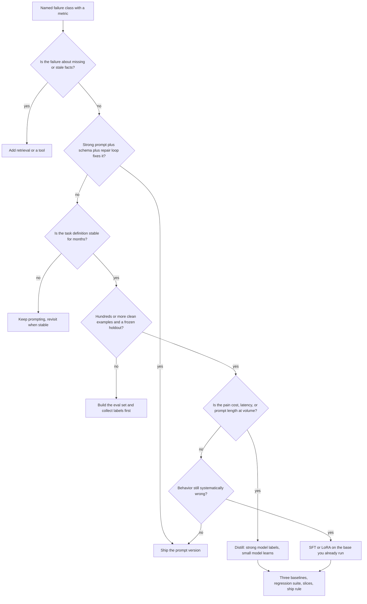
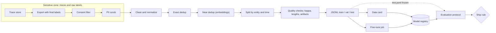
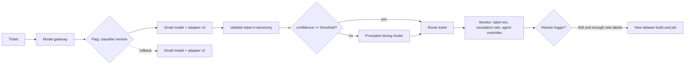

# Chapter 33 — Fine-Tuning for Engineers

Fine-tuning changes a model's weights instead of its context, and it is the most expensive rung on the decision ladder to climb and to undo. This chapter is about deciding with evidence whether a task deserves it, and then doing the data, evaluation, and operations work that makes the result safe to ship. The running case is the Northwind ticket classifier: 40 categories, high volume, and a prompted strong model that is accurate but too expensive to keep.

**You will be able to:**
- Decide whether a task needs fine-tuning, or a prompt, retrieval, or a tool instead, and choose among SFT, LoRA, distillation, preference tuning, and reinforcement fine-tuning.
- Build a training set from production traces that survives a leakage audit: consent, PII scrubbing, exact and near dedup, entity and time splits, artifact detection, and a data card.
- Run an evaluation protocol with three baselines, slices, calibration, and a ship rule written before training.
- Compose a fine-tuned small model with an escalation path and pick the confidence threshold on validation data.
- Drive a hosted fine-tuning job through a provider-neutral interface that survives crashes and transient errors.
- Operate the result as a versioned artifact: registry, flag rollout, drift monitoring, and evidence-based retraining.

**Prerequisites:** Chapters 1 (the decision ladder), 6 (schema validation, confidence and calibration), and 24 (frozen evaluation sets and paired comparisons). | **Code:** `book/projects/examples/ch33/` (run: `cd book/projects/examples/ch33 && pytest -q`) | **Builds:** the Chapter 33 fine-tuning pipeline: a dataset builder, an evaluation protocol with a ship rule, and a job runner with a fake provider so everything runs offline.

## Why this matters

Fine-tuning is the step on the decision ladder from Chapter 1 that teams reach for too early and then regret, or avoid for too long and overpay. Both failures come from the same gap: engineers know how to call a training API but not how to decide whether the weights should change, what data earns that change, and what evidence justifies shipping the result.

The economics are real. A narrow, stable, high-volume task such as ticket classification, field extraction from a fixed document family, or enforcing a house style on summaries can often move from a large prompted model to a small fine-tuned one at a fraction of the latency and cost. The risks are equally real. A fine-tune is a new model version with hidden regressions, memorized sensitive text, and a dataset whose shortcuts become the model's behavior. Training loss tells you none of this. Only a frozen holdout, a regression suite, and slice analysis do.

This chapter treats fine-tuning the way the rest of the book treats everything else: as a systems-engineering problem with a measurable failure class, a baseline, an experiment, and an operating plan. The algorithms get one section each. The data and evaluation work, which is where projects succeed or fail, get most of the pages.

## Mental model

> **Mental model:** Weights are a compiler, not a database. Fine-tuning compiles examples into behavior; it does not store facts you can query, audit, or revoke.

Everything a model does at inference comes from two inputs: the weights and the context. Prompting, retrieval, and tools change the context, per request, with full visibility. Fine-tuning changes the weights, once, for every future request, with no visibility into what was learned. When you need to know *why* an output happened, or to make the model stop knowing something, context wins. When you need a behavior to be reliable at high volume without paying for instructions on every call, weights win.

Two book-wide mental models carry the rest of the chapter. "Evaluate before optimizing" is why the evaluation protocol comes before the training script. "Model quality alone does not determine application quality" is why the Northwind decision is made on the composed system, a small model plus an escalation path, rather than on the small model's standalone score.

If you want to see where the chapter is going before the mechanics, skip ahead to "The Northwind ticket classifier, end to end" near the end: it walks one project from the ship rule through data, baselines, training, the cascade, and three months of operations, with illustrative numbers. Every section before it explains one step of that story.

## Core concepts

### What fine-tuning actually changes

A pretrained model has already learned language, formats, and a great deal of world knowledge from its pretraining corpus. Fine-tuning continues gradient-based training on a narrower set of examples, so that the behaviors in those examples become more probable. The mechanism is the same next-token cross-entropy loss as pretraining; only the data and scale differ.

Three consequences follow, and they drive every decision in this chapter.

First, fine-tuning changes *distributions*, not rules. A model fine-tuned to emit one of 40 category ids will emit them with high probability, not with certainty. You still validate output (Chapter 6) and you still need a fallback.

Second, what the model learns is whatever best predicts the training targets. If every example of the `billing` category contains the phrase an agent's macro inserts, the model learns the phrase. If long tickets are mostly `hardware` because of how the export was filtered, the model learns length. The dataset is the specification; artifacts in the dataset are bugs in the specification.

Third, learned behavior is opaque and durable. You cannot list what a fine-tuned model knows, you cannot revoke one training example after the fact, and a customer's deletion request cannot be honored by editing weights. This is why facts with freshness or permission requirements never belong in a fine-tune, and why personally identifiable information (PII) is scrubbed before text enters a training file, not after.

### When fine-tuning is useful

Fine-tuning pays off when the task has a stable definition, enough representative examples, an offline way to measure success, and a cost or quality problem that context engineering has not solved.

- **Stable format or behavior at high volume.** A model that has learned to emit exactly your schema does not need a 1,400-token system prompt explaining it on every call. The saved prompt tokens alone can fund the project.
- **Narrow classification or extraction.** Forty ticket categories with written definitions, a fixed set of invoice fields, intent routing. The label space is closed and the examples are plentiful.
- **Style and voice.** A house style for incident summaries or customer replies is hard to specify in prose and easy to demonstrate with examples.
- **Latency and cost by moving down a model size.** The most common business case: a small model that imitates a strong model's decisions on one narrow task, at a fraction of the latency and cost.
- **Domain vocabulary and conventions.** Internal product names, ticket shorthand, abbreviations that general models misread.
- **Reducing prompt length after the task is understood.** Few-shot examples that have stopped changing are a sign the behavior can be compiled in.

### When fine-tuning is not the answer

- **Fresh or permissioned facts.** Inventory, policy documents that change weekly, anything with access control. Weights are a slow and opaque knowledge store; retrieval (Chapter 10) supplies current, permissioned, citable facts at request time.
- **Rapidly changing requirements.** Every change to the task definition means a new dataset and a new training run. If the category taxonomy is still being argued about, a prompt is cheaper to edit.
- **Small data.** A few dozen examples are a few-shot prompt, not a training set. Below a few hundred clean examples per behavior, the variance of the result usually exceeds the gain.
- **No evaluation set.** Without a frozen holdout you cannot tell improvement from noise or from leakage. Build the evaluation first; it is useful even if you never train.
- **When prompting, RAG, or tools would do.** A schema-constrained request with a repair loop fixes most formatting problems. A tool fixes arithmetic and database lookups. Fine-tuning fixes neither cheaply.
- **Actions and multi-step control.** Fine-tuning does not make a model a safe agent; policy and authorization live in code (Chapter 16).

### Fine-tuning versus prompting, retrieval, and tools

The four mechanisms change different parts of the system. The table compares them along the dimensions that decide a project.

| Dimension | Prompting | Retrieval (RAG) | Tools | Fine-tuning |
|---|---|---|---|---|
| What changes | Instructions in context | Evidence in context | Actions and authoritative reads | Model weights |
| Best for | Instructions, transformations, reasoning over given text | Facts that are current, large, or permissioned | Side effects, exact computation, system state | Stable behavior, format, style, narrow tasks at volume |
| Change cost | Minutes, a prompt version | Hours, reindex | Days, a tool contract | Days to weeks, data plus training plus eval |
| Auditability | Full: the prompt is visible | Full: evidence is logged | Full: calls are logged | None: behavior is implicit |
| Revocability | Edit the prompt | Delete the document | Disable the tool | Retrain without the example |
| Per-request cost | Pays for instructions every call | Pays for evidence every call | Pays for calls | Pays once at training, cheaper per call |
| Main failure | Instruction ignored, drift | Wrong or missing evidence | Wrong action, security surface | Forgetting, artifacts, memorization, stale behavior |
| Data needed | None | A corpus | Nothing beyond the API | Hundreds to tens of thousands of clean examples |

The decision procedure follows the ladder from Chapter 1, and the flowchart makes the order explicit: every branch toward fine-tuning passes through a cheaper fix first.



### Supervised fine-tuning mechanics

Supervised fine-tuning (SFT) trains on prompt-response pairs. For chat models the unit is a conversation: a system message, one or more user messages, and the assistant message the model should have produced. In JSONL (one JSON object per line) a Northwind training row looks like this:

```json
{"messages": [
  {"role": "system", "content": "Classify the Northwind support ticket into exactly one category. Reply with the category id only."},
  {"role": "user", "content": "cannot connect to the corporate vpn from home, ticket ref VP017, user in logistics unit"},
  {"role": "assistant", "content": "vpn"}
]}
```

Three mechanics matter to an engineer even when a hosted API hides them.

**Loss is computed on assistant tokens.** The trainer masks the system and user tokens so the model is penalized only for what it should say, not for predicting the ticket text. Without the mask the model spends capacity learning to predict user input and the format conventions blur. The practical consequence is that the assistant turn must be exactly the output you want at inference, including whitespace, casing, and punctuation. A dataset that mixes `vpn`, `VPN`, and `VPN access` as targets for one class teaches three behaviors.

**Epochs multiply exposure.** One epoch is one pass over the training set; hosted APIs default to a small number (three is a common default, illustrative). More epochs on a narrow dataset lead to overfitting, where the model memorizes the training set instead of learning the task: training loss keeps falling while validation loss flattens and then rises, and the model starts reproducing training tickets verbatim. Watch both losses and the task metric on validation, because lower token loss does not guarantee better classification.

**Token-weighted loss favors long examples.** A 1,200-token ticket contributes more gradient than a 40-token one, even though both count as one row. Inspect length distributions in tokens, cap outliers, and truncate the user turn rather than let a handful of long rows dominate. Trainers that pack several short examples into one sequence must also mask attention across example boundaries; hosted APIs handle this, and in a hand-written script it is your job.

Signs of overfitting that show up before production does: validation loss rising while training loss falls; training-set phrases emitted for unrelated inputs; high validation accuracy with a collapse on the time-split test set; confidence approaching 1.0 on everything, which destroys calibration.

### Training data for tool calls

To fine-tune a model to call tools, the training row is a whole trajectory, not a prompt-response pair: the tool schemas the model will see at inference, the user turn, an assistant turn carrying tool calls (a name and JSON arguments), a tool-role message with the result, and the final assistant answer. The shape below is illustrative; field names differ between providers.

```json
{"tools": [{"type": "function", "function": {"name": "get_service_status",
   "parameters": {"type": "object", "properties": {"service": {"type": "string"}}, "required": ["service"]}}}],
 "messages": [
  {"role": "user", "content": "is the vpn down for logistics?"},
  {"role": "assistant", "tool_calls": [{"id": "c1", "type": "function",
     "function": {"name": "get_service_status", "arguments": "{\"service\": \"vpn\"}"}}]},
  {"role": "tool", "tool_call_id": "c1", "content": "{\"service\": \"vpn\", \"status\": \"degraded\"}"},
  {"role": "assistant", "content": "The VPN is degraded right now. IT is working on it."}
]}
```

The SFT rules carry over with three additions. Loss falls on every assistant turn, including the tool-call arguments; tool results are inputs, like user turns. The schemas in the training rows must match what production sends byte for byte: rename a parameter after training and the model keeps emitting the old name. And the dataset must contain the turns where the right move is not to call a tool (answer directly, ask a clarifying question, recover from a tool error), or the model learns that every request deserves a call. Never include calls your policy would deny, such as `send_reply` without approval: the model learns the call even though the policy layer in code still blocks it (Chapter 16).

The chapter's `validate_chat_jsonl` rejects the `tool` role on purpose, because the classifier never has tool turns. A tool-call pipeline needs its own validator: every call names a tool in the row's schema list, its arguments parse against that schema, and every call has a matching result.

Evaluation changes most. Per-call accuracy is not enough: a model that picks the right tool on 95% of steps still fails a large share of five-step tasks, and a fine-tune can raise per-call accuracy while making loops longer. Evaluate tool-call fine-tunes on frozen trajectories: task success, call validity, steps and tokens per task, and policy violations, compared with the prompted baseline on the same tasks. Chapter 25 owns trajectory evaluation and Chapter 19 the loop it runs in.

### LoRA, QLoRA, and parameter-efficient fine-tuning

Full fine-tuning updates every weight. For a model with billions of parameters that means storing gradients and optimizer state for all of them, and producing a complete new checkpoint per fine-tune. Parameter-efficient fine-tuning (PEFT) methods update a small set of new parameters instead and leave the base frozen.

Low-Rank Adaptation (LoRA) is the dominant PEFT method. For a weight matrix `W` of shape `d_out × d_in`, LoRA leaves `W` frozen and learns an additive update `ΔW = B · A`, where `A` is `r × d_in` and `B` is `d_out × r`, with the rank `r` (the width of the bottleneck between `A` and `B`) much smaller than either dimension. At inference the effective weight is `W + (α / r) · B · A`, where `α` is a scaling constant. Trainable parameters per matrix drop from `d_out · d_in` to `r · (d_in + d_out)`.

The worked example: a 4096 × 4096 projection has 16,777,216 parameters. At rank 16, LoRA trains `16 · (4096 + 4096) = 131,072` parameters for that matrix, 128 times fewer. At rank 8 it is 65,536; at rank 64 it is 524,288. A model has many such matrices (query, key, value, and output projections in every attention block, plus the feed-forward projections), so the adapter (the trained A and B matrices for all of them, shipped as one file) is typically tens of millions of parameters, stored as a file of a few hundred megabytes or less, versus tens of gigabytes for a full checkpoint.

What LoRA does *not* save is just as important for planning hardware:

- **Base weights still occupy memory.** Every forward pass runs the full model. A 7-billion-parameter base in 16-bit precision is about 14 GB of weights before anything else (illustrative, from bytes per parameter times parameter count).
- **Activations still occupy memory.** The backward pass needs the activations of every layer for every token in the batch. Long sequences and large batches dominate memory regardless of how small the adapter is. Gradient checkpointing trades compute for memory here.
- **Compute is barely reduced.** Fewer parameters to update means a smaller optimizer, not a faster forward or backward pass.

QLoRA pushes the base weights into a quantized format, commonly 4-bit, while keeping adapter weights and the arithmetic in higher precision. That is how a large model gets adapted on a single GPU. "4-bit model" is not "half a byte per parameter of total memory": quantized weights, dequantization buffers, adapter weights, optimizer state for the adapter, activations, and gradients all add up. The resulting adapter is bound to the exact base architecture, tokenizer, and quantization scheme it was trained against.

Rank, `α`, dropout, and which modules to adapt (attention only, or attention plus feed-forward) are hyperparameters without a universal answer. Rank 8 to 32 with attention and feed-forward modules is a common starting point; evaluate against task data rather than trusting a recipe. Other PEFT methods exist, such as prefix tuning that learns continuous prompt vectors, but LoRA's combination of quality, tooling, and serving support makes it the default an application engineer will meet.

### Distillation: the pattern you will actually use

Knowledge distillation trains a smaller student to imitate a stronger teacher. In the original form the student learns from the teacher's probability distributions. In the practical form you will use, the teacher is the prompted strong model already running in production, its outputs on real traffic become the labels, and the student is a small model fine-tuned on them. The Northwind case is exactly this: the strong prompted classifier has been running for months, so you have tens of thousands of teacher labels, each one confirmed or corrected by a human agent, at no extra labeling cost.

Distillation inherits two risks. The student learns the teacher's mistakes at scale, so teacher outputs must be filtered: keep rows where the agent confirmed the category; for rows where the agent overrode it, either drop them or use the agent's label as the target, and sample a slice for human review. And the student is only as good as the teacher's coverage, so rare categories the teacher rarely saw remain rare. Oversample them, or write labeling guidelines and collect human labels for exactly those.

### Where confidence comes from

A distilled small model is rarely shipped alone. The usual design is a cascade: the small model answers when it is confident and escalates to the strong model otherwise. That needs a number per prediction, and a chat API returns text, not class probabilities. There are three practical sources.

- **Token log-probabilities.** If the serving engine returns log-probabilities for the emitted tokens, the probability of the label is the product of its tokens' probabilities, `exp(sum of logprobs)`. This works best when labels are short, distinct ids; long labels or labels that share a prefix make the number reflect tokenization as much as the decision. Self-hosted engines usually expose log-probabilities; hosted fine-tuned endpoints may not.
- **A verifier score.** A separate, cheap check scores the pair (input, label): a small classifier, a rule that the label is consistent with extracted fields, or a model judge. It costs an extra call or computation but works when log-probabilities are unavailable.
- **Agreement.** Sample several answers at a nonzero temperature and use the vote share. It needs no special API but multiplies cost by the number of samples.

None of these numbers is trustworthy by default. You check them with reliability bins: group holdout predictions by confidence and compare each bin's mean confidence with its accuracy. An illustrative result for the Northwind candidate on its 5,200-row test set:

| Confidence bin | Predictions | Mean confidence | Accuracy | Gap |
|---|---|---|---|---|
| 0.5 to 0.7 | 300 | 0.62 | 0.55 | 0.07 |
| 0.7 to 0.9 | 900 | 0.81 | 0.79 | 0.02 |
| 0.9 to 1.0 | 4,000 | 0.97 | 0.90 | 0.07 |

Expected calibration error (ECE) is the count-weighted mean gap: `(300 · 0.07 + 900 · 0.02 + 4,000 · 0.07) / 5,200 ≈ 0.06`, the number the end-to-end case reports for the standalone model. The table says more than the number: the top bin, where most traffic lives, is seven points overconfident, so a threshold of 0.95 means less than it appears to. Over-training makes this worse by pushing nearly everything into the top bin, which is why the ship rule carries a maximum ECE and why the threshold is chosen on validation data, never on the test set. Chapter 6 owns calibration itself: the ECE definition, recalibration methods such as temperature scaling, and how much data a threshold needs. This chapter only uses it.

### Preference tuning in one section

Supervised fine-tuning teaches a model to reproduce one gold response. Many tasks do not have one: several replies to a customer are acceptable, and one is better. Preference tuning optimizes for *better* rather than *equal to*. The data is pairs or rankings, `(prompt, chosen, rejected)`.

Reinforcement learning from human feedback (RLHF) is the classic pipeline: SFT first, then train a reward model to predict human preferences, then optimize the policy (the model being tuned) to score well under the reward model while a penalty keeps it close to the SFT reference. Proximal Policy Optimization (PPO) was the usual optimizer, and it requires sampling generations, scoring them, and running several models at once.

Direct Preference Optimization (DPO) skips the reward model and the RL loop: it turns preference pairs into a classification-like loss that raises the likelihood of the chosen response relative to the rejected one, still anchored to a reference model. Group-relative methods such as GRPO (Group Relative Policy Optimization) sample several candidates per prompt and use their relative scores as the signal, which works well when a verifier (unit tests, a schema check, an exact-match answer) can score candidates automatically.

What this means for you as an application engineer: preference tuning is how model providers shape helpfulness, tone, refusal behavior, and reasoning, and it is where their alignment work happens. You will probably not run it yourself. The data is expensive and subtle, rater disagreement becomes noise, reward models get exploited, and verbosity and position biases creep in. If a hosted provider offers preference fine-tuning on pairs, use it only when SFT has plateaued on a judgment-heavy task, when you have a written rubric that two raters can apply consistently, and when you can measure the result with the same discipline as any other fine-tune. For everything else in this book, SFT with clean data is the tool.

### Reinforcement fine-tuning with graders

As of 2026, some hosted providers offer reinforcement fine-tuning (RFT), mostly on reasoning models. Instead of one gold response per prompt, you supply prompts and a grader. The provider samples several candidate responses per prompt, scores each with your grader, and moves the weights toward the higher-scoring ones: the group-relative idea from the previous section, run as a service.

A **grader** is a scoring function from (prompt, response, optional reference) to a number, usually between 0 and 1. Common kinds: exact or normalized string match against a reference; a field-level comparison for structured output (per-field F1 for an invoice extraction); code you supply that runs tests or checks invariants; a model judge applying a written rubric. Graders combine as a weighted sum, for example 0.7 for correct fields plus 0.3 for valid schema.

RFT beats SFT when the answer is checkable but the path to it is hard to demonstrate: multi-step reasoning, extraction from messy documents where rules interact, code that must pass tests. It also suits teams that have tens to hundreds of good prompts with checkable answers rather than thousands of gold responses, and tasks where SFT has plateaued because the model imitates the surface of answers without the reasoning behind them. It is the wrong tool for closed-label classification at volume (Northwind's classifier is an SFT and distillation problem: cheaper and more predictable), for tasks without a reliable grader, and whenever the grader is a model judge you have not calibrated against human labels (Chapter 24).

The characteristic failure is **reward hacking**: the model learns what the grader rewards rather than what you meant. A field-level grader that gives partial credit for empty fields teaches the model to leave hard fields empty; a judge that prefers longer answers teaches verbosity. Test the grader like code before you pay for training: hand-written bad responses (empty, verbose, well-formatted but wrong, the reference copied from the prompt) must score low, and good ones high. Then evaluate the trained model with the same frozen holdout and ship rule as any fine-tune, scored by humans or a different grader than the one it was trained against. Budget for cost and variance too: RFT is typically billed by training compute and costs far more per example than SFT (illustrative; check the provider's terms), and results vary between runs, so run two seeds when the decision is close.

### Fine-tuning embedding models and rerankers

For a RAG system, the highest-return fine-tune is often not the generator. When general embedding models misread your vocabulary (product codes, internal shorthand, "PTO" filed under "leave"), the right chunk never reaches the generator, and no generator fine-tune can fix that. Measure first: recall@k on the RAG evaluation set (Chapter 10 defines the metrics), sliced by question type. If misses concentrate on domain vocabulary, a retrieval fine-tune is a candidate.

The data is (query, relevant passage) pairs plus **hard negatives**: passages that look relevant but are not, mined by retrieving with the current model and removing the known positives. Sources include the training split of the RAG evaluation set, passages cited in answers users accepted, search click logs, and synthetic queries generated from chunks (Chapter 25 owns synthetic data). Training uses a contrastive loss that pulls each query toward its positive and away from the negatives. A few thousand pairs often produce a measurable gain (illustrative).

Start with the reranker. A reranker (a cross-encoder that reads query and passage together, Chapter 12) runs at query time, so fine-tuning it changes nothing in the index: it ships and rolls back like any model version behind a flag. Fine-tuning the embedding model changes the vector space: every document must be re-embedded, the index rebuilt, and old and new vectors never mixed (Chapter 9 covers the migration, Chapter 8 the space fingerprint that enforces it). Do that only when first-stage recall is the bottleneck, meaning the positive is not in the candidate set at all, so no reranker can promote it. Hosted embedding APIs often do not offer fine-tuning, so this usually means an open-weights embedding model you serve yourself.

The leakage and evaluation rules of this chapter apply unchanged. Split by document and by time, not by query, or a passage seen in training queries inflates test recall. The baseline is the current embedder and reranker; keep a general retrieval regression set so gains on domain vocabulary do not hide losses elsewhere; and authorization still filters candidates before scoring (Chapter 15).

## How it works: the adaptation experiment

A trustworthy fine-tuning project is an experiment with a protocol fixed in advance. The steps, in order:

1. **Name the failure class and its metric.** "The strong prompted classifier costs too much per ticket at our volume; we need macro-F1 (F1 averaged equally over all 40 categories, defined below) within 0.01 of it at no more than half the cost."
2. **Build the strongest simple baseline.** The best prompt, with schema-constrained output and a repair loop, on both a small and a strong model.
3. **Freeze the holdout.** Stratified over categories, including rare and ambiguous cases, split from training data by entity and time. Nobody touches it for prompt iteration, cleaning decisions, or threshold tuning.
4. **Build the training set** (next section) so that it targets the failure without leaking the holdout.
5. **Train the smallest sensible adaptation.** Usually LoRA on a small base or a hosted SFT job.
6. **Compare on identical inputs.** Target metrics, regression suite, slices, latency, cost.
7. **Decide with the rule you wrote before step 5.**

### Dataset construction

**Sourcing from production traces.** The best training data is real traffic with verified outcomes. Northwind's traces (Chapter 31) already carry the ticket text, the strong model's category, the agent's final category, the account, and the timestamp. Export rows where the final category is known.

Two constraints come before anything else. Consent: honor every opt-out and every data-processing restriction at export time, because you cannot remove a row from weights later; the dataset builder has a `consent` flag and drops rows without it. PII: scrub emails, phone numbers, account identifiers, and free-text names from the ticket body before the row is written to any file. A model will happily memorize a customer's phone number and emit it to another customer. Use a dedicated PII detector in production (Chapter 27); the chapter code ships a regex scrubber to show where the step lives.

**Labeling guidelines.** Written definitions for every category, with two or three positive examples and the nearest confusable category called out ("`vpn` is for connectivity through the tunnel; authentication failures at the VPN login are `password`"). Guidelines are the only way to make labels from different agents, different months, and the strong model agree. Measure that agreement before training: have two labelers independently label a sample of a few hundred rows and compute Cohen's kappa, an agreement score corrected for chance (1.0 is perfect agreement, 0 is what chance alone would produce). Below about 0.7 the labels are too noisy to teach anything; fix the guidelines, not the model.

**Cleaning.** Drop rows that are too short to carry signal, too long to fit, unlabeled, or labeled outside the current taxonomy. Normalize whitespace. Record every drop with a reason; the data card will report them.

**Deduplication, exact and near.** Exact duplicates are found by hashing normalized text. Near duplicates are the dangerous ones: the same outage reported by forty users with slightly different words, a template with one field changed, a ticket re-opened with an appended line. If near duplicates straddle the train/test boundary, the test score measures memorization.

The builder embeds every text, computes cosine similarity, and drops later members of any cluster above a threshold, keeping the earliest. The embedding function is pluggable; the fallback is a character n-gram TF-IDF (weighted counts of short character sequences), which catches typo-level and template-level variants. A semantic embedding client catches paraphrases. Dedup also surfaces *conflicting* pairs, near-identical texts with different labels: those are either labeling errors or the ambiguous cases your guidelines need to settle.

**Splitting by entity and time.** Random row splits leak. Tickets from one account share vocabulary, product, and often the same recurring problem; a model that has seen account 1142's tickets in training will look better on account 1142's test tickets than on a new account. Group by entity (account, customer, document template) and assign whole groups to one split. Then add time: the model will be used on *future* tickets, so hold out the most recent weeks as the test set. Vocabulary drifts, new products launch, and a time-split test set is the only honest estimate of that. The builder supports both, and it asserts that no entity appears in two splits.

**Format.** The JSONL chat format shown earlier, rendered in exactly the shape the model will see at inference: same system prompt, same user template, retrieved context included if production includes it.

**Size heuristics (illustrative).** For a closed-label classifier, a few hundred clean examples per class is a reasonable floor and a few thousand per class shows diminishing returns. For format and style tasks, several hundred to a few thousand total examples often suffice. Quality dominates: a thousand precise, consistent examples beat ten thousand inconsistent ones, and every contradictory pair actively teaches noise.

**Synthetic data and its risks.** When rare categories lack examples, a strong model can generate tickets from the category definition. Synthetic rows fill coverage gaps and nothing more. They carry the generator's style, so a model can learn "synthetic-sounding means category X"; mark them with `source: synthetic`, keep them a minority of each class, never put them in the test set, and verify a sample by hand.

**Data cards.** A data card is a JSON document committed next to the model version: label set and distribution per split, sources, time range, split strategy and seed, drop reasons, dedup counts and conflicts, length statistics in tokens, suspected artifacts, file hashes, and known limitations. When a regression appears months later, the card is how you find out that the test set never contained a German-language ticket.

### Quality checks before training

- **Label agreement**: Cohen's kappa on a double-labeled sample, per category where possible.
- **Length distributions**: p50, p95, and max in tokens per split; a p95 far above p50 means a few rows dominate the loss.
- **Artifact detection**: for every token, count how often it appears and how pure its label distribution is. A token present in dozens of rows that predicts one label with near-perfect purity is a shortcut. `refund` predicting `billing` is legitimate signal; `autorouted`, a macro stamp, is not. Every hit is a question for a human.
- **Class balance**: list classes under a floor. Decide per class whether to oversample, collect, synthesize, or merge.
- **Holdout hygiene**: assert no entity overlap (the builder asserts it for the entity strategy; under the time strategy, check it yourself if accounts recur), confirm the test set is strictly later than training when using the time strategy, and store the holdout's hash.

### The evaluation protocol

Run every system on the same frozen holdout and report the same fields; `decide_ship` refuses a candidate that did not answer every holdout row or was scored on a different n.

**Three baselines.** A rules or keyword baseline tells you how much of the task is trivial. A prompted small model tells you what the base model can do before training, which separates the gain from fine-tuning from the gain from the base. A prompted strong model is the reference you are trying to match or replace.

**Target metrics.** For classification: macro-F1, because it weights every category equally and exposes collapse on rare ones; per-class recall, because some categories (`security-incident`) are critical and a global number hides them; calibration, measured with reliability bins and ECE as shown in "Where confidence comes from", because the escalation policy depends on confidence meaning something.

**Regression suite.** A fine-tune is a new model version. If the same model serves other prompts, run their evaluation suites too. A classifier that also lost its ability to follow the system prompt in another product is a regression even if macro-F1 went up. Losing unrelated abilities after narrow training is called catastrophic forgetting.

**Slices.** Language, length bucket, business unit, source channel, new versus existing accounts. Report per-slice macro-F1 for candidate and reference; a candidate that trails the reference by three points on German tickets fails even if the average is fine.

**Cost and latency.** Per 1,000 requests, with p50 and p95 latency, measured on the composed system including escalations.

**Decision rule.** Written before training, with thresholds: maximum macro-F1 drop versus the reference, minimum recall for critical labels, a recall floor for every label, maximum per-slice drop, required cost reduction, latency budget, maximum ECE, and minimum regression-suite pass rate. The rule is mechanical so the review meeting argues about evidence, not about moving goalposts.

### Training options

**Hosted fine-tuning APIs.** As of 2026, hosted fine-tuning APIs commonly follow a three-step flow: upload a JSONL training file (and optionally a validation file), create a job that references the file, the base model, and hyperparameters such as the number of epochs and a learning-rate multiplier (which scales how far each update moves the weights), then poll the job until it reaches a terminal state and returns a fine-tuned model id. The model id is then used in completion requests like any other model name. You never see the weights; the provider owns training, serving, and retention. Advantages: no hardware, no training code, and serving is solved. Costs: the base must be one the provider offers, the data leaves your boundary (check data-retention terms), and hyperparameters are limited. The chapter's `FineTuneProvider` protocol captures this flow so the rest of the pipeline is identical across vendors.

**Open-weights with PEFT.** You pick a base model with a license that allows your use, write or configure a training script, and run it on your own GPUs. The outline, library-agnostic, is short:

```python
# pseudocode: open-weights LoRA fine-tuning outline (library-agnostic)
tokenizer, base = load(base_model_id, dtype="bf16" or quantized_4bit)
base = attach_lora(base, rank=16, alpha=32, dropout=0.05,
                   target_modules=["q_proj", "k_proj", "v_proj", "o_proj", "up_proj", "down_proj"])
train_ds = load_jsonl("train.jsonl"); val_ds = load_jsonl("val.jsonl")
collator = chat_collator(tokenizer, max_len=2048, loss_on="assistant_only")
trainer = Trainer(base, train_ds, val_ds, collator,
                  epochs=2, lr=2e-4, batch_tokens=16_384, grad_checkpointing=True,
                  eval_every_steps=200, save_best_on="val_loss")
trainer.fit()
save_adapter("adapters/nw-tickets-v3/")           # small file, bound to base_model_id
# optional: merged = merge_lora(base, adapter); save_model(merged)
```

Hardware notes, all illustrative: memory is base weights (bytes per parameter times parameters) plus adapter and its optimizer state (small) plus activations (proportional to batch tokens and sequence length, reduced by gradient checkpointing) plus framework overhead. A 7-billion-parameter base in 16-bit fits a single 24 GB to 48 GB GPU for LoRA at modest sequence lengths; the same base in 4-bit fits with room to spare. Training time for tens of thousands of short examples over two epochs is hours, not days. The costs that matter are the engineering ones: the serving stack must load the adapter (Chapter 34), and you own evaluation, versioning, and security of the weights.

## Architecture

The pipeline has a trust boundary that is easy to miss: everything downstream of the scrubber is a training artifact that will be copied, uploaded, and retained. Consent filtering and PII scrubbing therefore happen before any file is written.



Serving composes the fine-tuned small model with an escalation path. The gateway from Chapter 3 routes by model id; a flag selects the adapter version; low-confidence predictions go to the strong model or a human queue. Monitoring feeds the retraining decision.



## Implementation

Three pipeline modules and one bridge to the shared library, all tested offline (`cd book/projects/examples/ch33 && pytest -q`). The dataset builder and the evaluation protocol depend only on pydantic, NumPy, and scikit-learn (for the TF-IDF fallback), and never call a model: one takes an embedding function, the other takes predictions. The job runner uses httpx for the OpenAI-compatible adapter and the `aie_core` error taxonomy for its failures. `aie_bridge.py` supplies the embedding function and the predictions from `aie_core` clients, so a real run goes through the same gateway, pricing, and tracing as every other model call in the book.

The listings are excerpts that carry the ideas the walkthrough discusses. The schemas (`RawExample`, `CleanConfig`, `SplitConfig`, `EvalReport`), file I/O, the PII scrubber, the data-card dictionary, both provider classes, and the JSONL validator are on disk in the same directory.

### Dataset builder

Each `RawExample` carries the text, the label, an `entity_id` (the grouping key for leakage-safe splits: account, customer, or template), a timestamp, a `source`, and a `consent` flag. The excerpt shows cleaning, near dedup, the entity split, and the order in which `build_dataset` runs them.

```python
# path: book/projects/examples/ch33/dataset_builder.py  (excerpt; full file on disk)
def clean(examples: Iterable[RawExample], config: CleanConfig | None = None) -> tuple[list[RawExample], Counter]:
    """Drop examples that must not or cannot be trained on. Returns kept examples and drop reasons."""
    config = config or CleanConfig()
    kept: list[RawExample] = []
    reasons: Counter = Counter()
    for ex in examples:
        text = normalize_text(ex.text)
        if config.scrub_pii:
            text = scrub_pii(text)
        if config.require_consent and not ex.consent:
            reasons["no_consent"] += 1
            continue
        # ... too_short, too_long, empty_label, unknown_label: same pattern, one reason each ...
        kept.append(ex.model_copy(update={"text": text}))
    return kept, reasons


def dedupe_near(
    examples: list[RawExample],
    embed_fn: EmbedFn | None = None,
    threshold: float = 0.90,
) -> tuple[list[RawExample], int, list[tuple[str, str]]]:
    # ...
    embed = embed_fn or tfidf_embed
    ordered = sorted(examples, key=lambda e: (e.created_at, e.id))
    vectors = embed([e.text for e in ordered])
    vectors = vectors / np.maximum(np.linalg.norm(vectors, axis=1, keepdims=True), 1e-12)
    sims = vectors @ vectors.T
    keep = np.ones(len(ordered), dtype=bool)
    conflicts: list[tuple[str, str]] = []
    for i in range(len(ordered)):
        if not keep[i]:
            continue
        later = np.where(sims[i, i + 1 :] >= threshold)[0] + i + 1
        for j in later:
            if keep[j]:
                keep[j] = False
                if ordered[i].label != ordered[j].label:
                    conflicts.append((ordered[i].id, ordered[j].id))
    kept = [e for e, k in zip(ordered, keep) if k]
    return kept, int((~keep).sum()), conflicts


def split_by_entity(examples: list[RawExample], config: SplitConfig) -> Splits:
    # ...
    groups: dict[str, list[RawExample]] = defaultdict(list)
    for ex in examples:
        groups[ex.entity_id].append(ex)
    order = sorted(groups, key=lambda eid: _bucket(eid, config.seed))
    total = len(examples)
    train_target = config.train_frac * total
    val_target = (config.train_frac + config.val_frac) * total
    train, val, test = [], [], []
    assigned = 0
    for eid in order:
        rows = groups[eid]
        if assigned < train_target:
            train.extend(rows)
        elif assigned < val_target:
            val.extend(rows)
        else:
            test.extend(rows)
        assigned += len(rows)
    return Splits(train=train, val=val, test=test)


def build_dataset(
    # ... raw, out_dir, system_prompt, configs, embed_fn, near_threshold ...
) -> BuildResult:
    """Clean -> dedupe (exact, near) -> split -> write JSONL -> data card. Order matters:
    dedupe before split, otherwise the same text can land on both sides of the holdout."""
    split_config = split_config or SplitConfig()
    kept, reasons = clean(raw, clean_config)
    kept, exact_removed, conflicts = dedupe_exact(kept)
    kept, near_removed, near_conflicts = dedupe_near(kept, embed_fn=embed_fn, threshold=near_threshold)
    # ...
    splits = split(kept, split_config)
    if split_config.strategy == "entity":
        assert_no_entity_overlap(splits)
    # ... refuse an empty split ...
    artifacts = detect_label_artifacts(splits.train)
    # ... write train/val/test JSONL in the inference shape, then data_card.json ...
```

`detect_label_artifacts` (on disk) counts, for every token in the training split, how many rows contain it and how pure their label distribution is; a token with at least 20 rows and 98% purity is reported. `split_by_time` (on disk) sends everything after the cutoff to test and runs `split_by_entity` on the past.

One test shows the contract of near dedup: a typo variant collapses, a distinct ticket survives, and the earliest row is the one kept.

```python
# path: book/projects/examples/ch33/test_ch33.py  (excerpt; full file on disk)
def test_dedupe_near_removes_paraphrase_but_keeps_distinct():
    rows = [
        ex(1, "cannot connect to the corporate vpn from home office this morning", "vpn", days=0),
        ex(2, "cannot connect to the corporate vpn from home office this mornin", "vpn", days=1),  # typo variant
        ex(3, "invoice total looks wrong for last month on the retail account", "billing", days=2),
    ]
    kept, removed, _ = dedupe_near(rows, threshold=0.9)
    assert removed == 1
    assert {r.id for r in kept} == {"t1", "t3"}
```

### Evaluation protocol

The protocol consumes predictions (a label, a confidence, latency, and cost per holdout row), computes an `EvalReport` (macro-F1, per-class precision and recall, reliability bins and ECE, slices, cost per 1,000, latency percentiles), and gates on a `ShipRule`. The excerpt shows the rule, the gate, and the cascade.

```python
# path: book/projects/examples/ch33/eval_protocol.py  (excerpt; full file on disk)
class ShipRule(BaseModel):
    """Thresholds agreed *before* training. Changing them after seeing results is how teams ship regressions."""

    max_macro_f1_drop_vs_reference: float = 0.01  # candidate may trail the strong baseline by this much
    critical_labels: list[str] = Field(default_factory=list)
    min_critical_recall: float = 0.90
    min_recall_floor: float = 0.50  # no class may collapse below this
    max_slice_drop: float = 0.03  # per-slice macro-F1 may not trail the reference by more
    min_cost_reduction: float = 0.50  # candidate must cost at most 50% of the reference
    max_latency_p95_ms: float | None = None
    max_ece: float = 0.10
    regression_suite_min_pass: float = 0.98


def decide_ship(
    candidate: EvalReport,
    reference: EvalReport,
    rule: ShipRule,
    regression_pass_rate: float = 1.0,
) -> ShipDecision:
    # ...
    reasons: list[str] = []
    # Same frozen holdout, every row answered: otherwise the two reports measure different things.
    if candidate.coverage < 1.0 or candidate.n != reference.n:
        reasons.append(f"candidate answered {candidate.coverage:.0%} of the holdout (n={candidate.n}) "
                       f"versus reference n={reference.n}; compare on the same complete holdout")
    if candidate.macro_f1 < reference.macro_f1 - rule.max_macro_f1_drop_vs_reference:
        reasons.append(f"macro-F1 {candidate.macro_f1:.3f} trails reference {reference.macro_f1:.3f} "
                       f"by more than {rule.max_macro_f1_drop_vs_reference:.3f}")
    for label in rule.critical_labels:
        rec = candidate.per_class.get(label, {}).get("recall", 0.0)
        if rec < rule.min_critical_recall:
            reasons.append(f"critical label {label!r} recall {rec:.3f} < {rule.min_critical_recall:.2f}")
    # ... recall floor per label, per-slice drop, cost ratio, p95 latency: one reason each ...
    if candidate.ece > rule.max_ece:
        reasons.append(f"ECE {candidate.ece:.3f} exceeds {rule.max_ece:.2f}; escalation policy cannot trust confidence")
    if regression_pass_rate < rule.regression_suite_min_pass:
        reasons.append(f"regression suite pass rate {regression_pass_rate:.3f} < {rule.regression_suite_min_pass:.2f}")
    return ShipDecision(ship=not reasons, reasons=reasons)


def cascade(
    small: SystemRun,
    strong: SystemRun,
    threshold: float,
    name: str = "cascade",
) -> SystemRun:
    # ...
    strong_by_id = strong.by_id()
    merged: list[Prediction] = []
    for p in small.predictions:
        if p.confidence >= threshold or p.example_id not in strong_by_id:
            merged.append(p)
        else:
            s = strong_by_id[p.example_id]
            merged.append(Prediction(example_id=p.example_id, label=s.label, confidence=s.confidence,
                                     latency_ms=p.latency_ms + s.latency_ms, cost_usd=p.cost_usd + s.cost_usd))
    return SystemRun(name=name, predictions=merged)


def choose_threshold(
    # ... validation, small, strong, labels, target_macro_f1, candidate thresholds, score ...
) -> float | None:
    """Pick the lowest threshold whose cascade meets the target on *validation* data.

    Lowest, because a lower threshold escalates less and therefore costs less. The test set is
    never consulted here; if it were, its score would stop being an estimate of production.
    """
    for t in sorted(candidates):
        report = evaluate(validation, cascade(small, strong, t), labels)
        if score(report) >= target_macro_f1:
            return float(t)
    return None
```

`macro_f1`, `per_class_prf`, and `calibration_bins` (on disk) are the textbook definitions with known-answer tests; `evaluate` pairs predictions with holdout rows by id, so a missing row lowers `coverage` instead of silently shrinking the denominator.

### Fine-tuning job runner

The provider interface is deliberately small: upload, create, get, cancel, list events. Two implementations are on disk: `FakeProvider`, which advances a job one status per poll so tests terminate after a known number of polls, and `OpenAICompatibleFineTuneProvider`, which maps the interface onto `/files` and `/fine_tuning/jobs` style endpoints and maps HTTP failures into the `aie_core` error taxonomy. The excerpt shows the interface and the polling loop.

```python
# path: book/projects/examples/ch33/finetune_job.py  (excerpt; full file on disk)
class FineTuneProvider(Protocol):
    """What every fine-tuning backend must offer. Keep it this small on purpose."""

    def upload_training_file(self, path: Path) -> str: ...

    def create_job(
        self,
        training_file_id: str,
        base_model: str,
        hyperparameters: Hyperparameters | None = None,
        validation_file_id: str | None = None,
        suffix: str | None = None,
    ) -> FineTuneJob: ...

    def get_job(self, job_id: str) -> FineTuneJob: ...

    def cancel_job(self, job_id: str) -> FineTuneJob: ...

    def list_events(self, job_id: str) -> list[JobEvent]: ...


def run_fine_tune(
    # ... provider, train_path, base_model, val_path, data_card_path, hyperparameters, poll and resume options ...
) -> FineTuneRecord:
    # ...
    _check_against_card(data_card_path, train_path, val_path)   # right files, and never the test set
    train_stats = validate_chat_jsonl(train_path)
    if val_path is not None:
        validate_chat_jsonl(val_path)          # before any upload, so a bad val file orphans nothing
    if resume_job_id is not None:
        job = provider.get_job(resume_job_id)
        if job.base_model != base_model:
            raise ValueError(f"job {job.id} trains {job.base_model!r}, not {base_model!r}; resume with the original inputs")
        train_id = job.training_file_id
    else:
        train_id = provider.upload_training_file(train_path)
        val_id = provider.upload_training_file(val_path) if val_path else None
        job = provider.create_job(train_id, base_model, hyperparameters, validation_file_id=val_id, suffix=suffix)
    if on_status:
        on_status(job)  # the caller persists job.id here: it is the only handle for resuming
    last_status: str | None = job.status
    poll_errors = 0
    for _ in range(max_polls):
        try:
            job = provider.get_job(job.id)
            poll_errors = 0
        except LLMError as err:
            poll_errors += 1
            if not err.retryable or poll_errors > max_consecutive_poll_errors:
                raise
            sleep(err.retry_after_s or poll_interval_s)
            continue
        if job.status != last_status and on_status:
            on_status(job)
        last_status = job.status
        if job.status in TERMINAL:
            break
        sleep(poll_interval_s)
    if job.status not in TERMINAL:
        raise FineTunePollTimeout(job, provider.list_events(job.id))
    if job.status != "succeeded" or not job.fine_tuned_model:
        raise FineTuneFailed(job, provider.list_events(job.id))
    # ... return a FineTuneRecord: model id, base, job id, training-file and data-card hashes, hyperparameters ...
```

The test that pins the crash-recovery contract scripts a 503 and a 429 during polling of a resumed job and asserts that nothing is uploaded twice:

```python
# path: book/projects/examples/ch33/test_ch33.py  (excerpt; full file on disk)
def test_poll_survives_transient_errors_and_resumes_existing_job(tmp_path: Path):
    # ...
    train = write_train_file(tmp_path / "train.jsonl")
    script = iter([httpx.Response(200, json=_job_json("running")),
                   httpx.Response(503, json={"error": {"message": "overloaded"}}),
                   httpx.Response(429, headers={"retry-after": "7"}, json={"error": {"message": "slow down"}}),
                   httpx.Response(200, json=_job_json("succeeded", done=True))])
    seen: list[tuple[str, str]] = []

    def handler(request: httpx.Request) -> httpx.Response:
        seen.append((request.method, request.url.path))
        return next(script)

    provider = OpenAICompatibleFineTuneProvider("https://example.invalid/v1", "k", transport=httpx.MockTransport(handler))
    sleeps: list[float] = []
    record = run_fine_tune(provider, train, "small-base", resume_job_id="ftjob-9", sleep=sleeps.append, poll_interval_s=30)
    assert record.fine_tuned_model == "ft:small-base:org:r9" and record.training_file_id == "file-abc"
    assert all(method == "GET" for method, _ in seen)  # resumed: no upload, no second paid job
    assert sleeps == [30, 7.0]  # the 503 waited the poll interval, the 429 honored Retry-After
```

### Plugging into aie_core

`aie_bridge.py` supplies the two things the pure modules take as parameters. `embed_fn_from_client` adapts any `aie_core` embedding client (hosted, `FakeEmbeddings`, or `CachedEmbeddings` around either) into the `EmbedFn` that `dedupe_near` expects, and `embedding_space` returns what the data card should record about it. `run_classifier` runs a classifier over the frozen holdout through any `LLMClient`, normally the production `ModelGateway`, and returns the `SystemRun` that `evaluate` and `cascade` consume.

```python
# path: book/projects/examples/ch33/aie_bridge.py  (excerpt; full file on disk)
def logprob_confidence(completion: Completion, label: str) -> float:
    # ...
    choices = (completion.raw or {}).get("choices") or []
    content = ((choices[0].get("logprobs") or {}).get("content") or []) if choices else []
    if not content:
        return 1.0
    total = sum(float(tok.get("logprob", 0.0)) for tok in content)
    return float(min(1.0, math.exp(total)))


def run_classifier(
    # ... llm, holdout, model, system_prompt, labels, expected_prompt_sha256, confidence_fn, expected_provider ...
) -> SystemRun:
    # ...
    if expected_prompt_sha256 is not None and prompt_sha256(system_prompt) != expected_prompt_sha256:
        raise ValueError(
            "system prompt differs from the one the model was trained with; "
            "re-evaluate the model under the new prompt instead of serving it silently"
        )
    allowed = set(labels)
    predictions: list[Prediction] = []
    for row in holdout:
        req = CompletionRequest(
            messages=[Message.system(system_prompt), Message.user(user_template.format(text=row.text))],
            model=model,
            temperature=0.0,
            max_tokens=max_tokens,
            metadata={"eval.system": name, "eval.example_id": row.id},
        )
        try:
            completion = llm.complete(req)
        except LLMError:
            # A failed call is a wrong answer for the protocol, not a crash of the evaluation.
            predictions.append(Prediction(example_id=row.id, label=INVALID_LABEL, confidence=0.0))
            continue
        label = completion.text.strip()
        # With a fallback-capable gateway, pass expected_provider: an answer served by the fallback
        # provider says nothing about the model under test, so it counts as invalid.
        served_by_expected = expected_provider is None or completion.provider == expected_provider
        valid = label in allowed and served_by_expected
        predictions.append(
            Prediction(
                example_id=row.id,
                label=label if valid else INVALID_LABEL,
                confidence=confidence_fn(completion, label) if valid else 0.0,
                latency_ms=completion.latency_ms,
                # a cache hit is billed 0 but still costs what the model charges: compare full prices
                cost_usd=float((completion.raw or {}).get("cost_usd", 0.0))
                + float((completion.raw or {}).get("avoided_cost_usd", 0.0)),
            )
        )
    return SystemRun(name=name, predictions=predictions)
```

The rest of the test suite (on disk) builds a deterministic four-category corpus, checks each builder stage and each metric against hand-computed values, drives both providers through `run_fine_tune` with an injected sleep and an `httpx.MockTransport`, and runs the classifier through a `ModelGateway` over `FakeLLM` with an illustrative pricing table. `test_hardening.py` pins the edge cases: a candidate that skips rows, the test set offered for training, a resume with another base model, and nonsense hyperparameters.

## Code walkthrough

**Order of operations in `build_dataset`.** Clean, then dedupe, then split. Deduplicating after splitting is the classic leak: the same text lands in train and test, and nothing in the split code can see it. Splitting before cleaning is a subtler mistake: dropping rows after the split changes the fractions and can empty a rare class from the test set.

**Why `dedupe_near` keeps the earliest row.** When a cluster of near-duplicates spans weeks, the earliest is the one that would have existed when a time-split model was trained. Keeping it preserves the time ordering the test split depends on. The conflicting pairs it returns are listed in the data card; a reviewer resolves them before the next build.

**Why `split_by_entity` fills by example count.** Hashing each entity into a bucket is simpler, but with a few hundred accounts that hold most of the traffic the fractions swing wildly from seed to seed, and a test set can come out empty. Visiting entities in seeded hash order and filling train, then val, then test until each hits its target keeps fractions close to the request while still moving whole entities together. The test checks that the result is independent of input order, which matters when the export query changes its sort.

**`split_by_time` (on disk) nests an entity split.** The future slice becomes the test set untouched. The past slice is still split by entity between train and validation so threshold tuning on validation is not flattered by accounts the model trained on.

**`detect_label_artifacts` (on disk) returns questions, not verdicts.** It cannot know that `refund` legitimately predicts `billing`. It can tell you that `autorouted` appears in 25 rows and predicts `billing` 100% of the time, which is almost certainly a macro stamp. Run it on the training split only, so the holdout never influences cleaning decisions; a token that is pure in train but missing from new traffic is exactly the shortcut that will not generalize.

**`decide_ship` compares against a reference, not against an absolute.** The strong prompted model is what production currently delivers, so "within 0.01 macro-F1 of it" is the honest target. Critical-label recall and the per-slice check are the two guards that catch the regressions a macro average hides.

**`cascade` evaluates the system users will see.** Escalated rows pay for both models and both latencies. `choose_threshold` picks the lowest threshold that meets the target on the *validation* split, because lower thresholds escalate less and cost less, and because consulting the test set here would turn it into a training signal.

**`run_fine_tune` is built for a job that outlives the process.** A hosted job runs for hours while the process polling it can crash, be redeployed, or hit a provider that returns 503 for ten minutes. Three rules follow. Transient errors during polling are absorbed: the provider adapter maps HTTP failures into the same `aie_core` taxonomy as completion calls, so the loop branches on `retryable`, honors `Retry-After`, and gives up only after several consecutive failures, while a bad key or an unknown job raises at once. The job id is handed to `on_status` as soon as the job exists, so the caller can persist it; after a crash, `resume_job_id` keeps polling that job instead of uploading again and paying for a second run. And when polling gives up, `FineTunePollTimeout` carries the job and deliberately does not cancel it, because the training may be nearly done; cancelling or resuming is an operator decision.

**`run_fine_tune` validates before uploading.** Hosted APIs validate too, but after the upload and sometimes after a wait in the queue; local validation (`validate_chat_jsonl`, on disk) catches a `tool` role or an empty assistant turn in milliseconds. Given the data card, `_check_against_card` (on disk) also refuses a training file that is not the card's train file and any file that is the frozen test set, and on resume it refuses a different base model. The returned `FineTuneRecord` carries the training file hash, the data card hash, the job's base model, and the hyperparameters: the minimum a registry needs to answer "what was this model trained on" six months later. Everything vendor-specific in the OpenAI-compatible adapter (on disk) sits in its `_STATUS` status map and the request bodies; another vendor gets another small class and nothing else changes.

**`aie_bridge` keeps evaluation on the production path.** `run_classifier` builds every request with the system prompt and user template the training file was rendered with, and, given the data card's `system_prompt_sha256`, refuses to run when the prompt has drifted: a fine-tuned model evaluated or served under a different prompt is a different system. It calls whatever `LLMClient` it is given, normally the same `ModelGateway` production uses, so latency comes from the completion and cost from the gateway's pricing table rather than from a spreadsheet. A cache hit is charged at full price (`cost_usd` plus `avoided_cost_usd`) so a cached rerun cannot look free, and, given `expected_provider`, an answer the gateway's fallback served counts as invalid for the model under test. A label outside the taxonomy, or a provider error, becomes an invalid prediction with zero confidence, so the metrics count it as wrong and a cascade escalates it rather than routing a ticket to a queue that does not exist.

**Confidence and embeddings come from `aie_core`.** The default `confidence_fn` gives every valid label 1.0, which makes the cascade escalate only invalid outputs. A real cascade passes `logprob_confidence`, which reads token log-probabilities that an engine returns when the client is built with `extra_body={"logprobs": True}` (Chapter 34), or a verifier's score; "Where confidence comes from" in Core concepts explains the choice, and the ECE check in the ship rule decides whether the number can be trusted. `embed_fn_from_client` (on disk) lets `dedupe_near` use any `aie_core` embedding client; wrapped in `CachedEmbeddings`, rebuilds do not re-embed unchanged rows, and `embedding_space` returns the space fingerprint the data card should record so two builds' dedup results are comparable.

## Production considerations

**Adapter serving versus merged weights.** A LoRA adapter can be served two ways. Loaded dynamically next to a shared base, which lets one deployment serve many adapters (per tenant, per task) and swap versions without reloading the base; the cost is routing complexity, per-adapter memory, and a small per-token overhead. Or merged into the base weights to produce a standalone model that serves at full speed with no adapter machinery; the cost is one full model artifact per version and the loss of hot switching. Hosted APIs make this choice for you behind the model id. Chapter 34 covers the serving mechanics.

**Versioning.** A fine-tuned model is a version of four things at once: the base model, the adapter or merged weights, the dataset (its card and file hashes), and the system prompt and user template it was trained with. Register them together. Changing the system prompt under a fine-tuned model is a silent distribution shift; the model was trained on one prompt and is now served with another. Prompt versions (Chapter 4) and model versions must move together, and the CI gate (Chapter 25) should refuse a prompt change on a fine-tuned route without a re-evaluation.

**Rollout and rollback.** Treat the new model id like any other risky change (Chapter 32): a feature flag selects the version, a canary slice of traffic goes first, and rollback is flipping the flag back to the previous id. Keep the previous adapter deployable. Because a hosted provider can deprecate a base model, record the base and have a plan for retraining on its successor before the deadline, not after.

**Monitoring.** Three signals matter beyond the usual latency and error rates. Label distribution: a sudden shift in the share of a category usually means input drift (a new product, an outage) or a model problem; compare against the training distribution in the data card. Escalation rate: the share of requests below the confidence threshold is the live proxy for "how often the small model is out of its depth"; a sustained rise is drift. Agent override rate: when humans correct the category, you get both a quality signal and the next training label. Alert on sustained changes, not single-day spikes.

**Retraining triggers.** Retrain when evidence says so, not because a quarter ended: a taxonomy change (new or merged categories) forces it; a sustained escalation or override rise above an agreed level suggests it; and in either case, retrain only once enough new verified labels exist to move the model. Each retrain is a new dataset build with a new card and the full protocol, including the regression suite.

**Security and privacy.** Training data is a copy of customer text that now lives in a bucket, a vendor's storage, and, in diluted form, in weights. Scrub before writing, encrypt at rest, record retention terms for hosted providers, and restrict who can download training files and adapters. Memorization is testable: prompt the fine-tuned model with the beginnings of training rows and check whether it completes them verbatim; sensitive strings that survive scrubbing will show up here.

**Cost.** Account for the whole project, not the inference line alone: labeling, the strong model's calls during distillation, training runs including the ones you discard, the evaluation runs on every candidate, and the engineering time to operate one more model version. Then compare with the per-request savings at real volume over the period you expect the taxonomy to stay stable. Chapter 30's cost model covers the accounting.

## Common mistakes

- **Training before freezing a holdout**, then "just checking" the holdout while iterating on data. The holdout becomes a validation set and the shipping decision loses its evidence.
- **Mixing target formats** (`vpn`, `VPN`, `VPN access`). The model learns three behaviors and the parser rejects a third of outputs.
- **Distilling teacher mistakes at scale** without filtering by agent confirmation or sampling for review.
- **Changing the system prompt after training** and wondering why quality dropped.
- **Letting synthetic rows dominate a class** or reach the test set.
- **Tuning the escalation threshold on the test set.**
- **Skipping the small-prompted baseline**, which makes it impossible to say whether the gain came from fine-tuning or from the base model being good enough already.

## Failure modes

Each entry names the failure, how it shows in telemetry, and how to test for it.

**Catastrophic forgetting.** Narrow training degrades general instruction following or safety behavior. Telemetry: other prompts on the same model id show rising parse failures or refusal changes after the rollout. Test: the regression suite on unrelated prompts, run on every checkpoint.

**Label artifact learned as the task.** The model keys on a template phrase or a macro stamp. Telemetry: accuracy collapses on a channel that lacks the phrase (a new intake form) while the holdout looked fine. Test: artifact detection on the training split; an adversarial slice with the phrase removed or added to the wrong class.

**Leakage inflating the holdout.** Near-duplicates or shared accounts across splits, usually from a random row split on data with entity or time structure: the model scores well on accounts it trained on and regresses on new ones. Telemetry: offline macro-F1 far above the early production estimate from agent overrides. Test: entity-overlap assertion, dedup before split, and a time-split test set whose score is the one you report.

**Memorization of sensitive text.** The model completes training rows verbatim. Telemetry: PII detector hits on outputs that contain strings absent from the input. Test: prompt with training-row prefixes; scrub before training; cap epochs.

**Calibration collapse.** Confidence approaches 1.0 on everything after over-training, so escalation stops firing. Telemetry: escalation rate drops sharply after a rollout while override rate rises. Test: ECE on the holdout and a maximum-ECE check in the ship rule.

**Rare-class collapse.** Macro-F1 looks acceptable but a critical category's recall fell. Telemetry: override rate concentrated in one category. Test: per-class recall with floors and critical-label minimums in the ship rule.

**Drift after deployment.** New products and vocabulary push inputs away from the training distribution. Telemetry: escalation rate and override rate rise slowly over weeks; label mix diverges from the card. Test: scheduled evaluation on a fresh labeled sample; retrain trigger thresholds.

**Orphaned or duplicated training job.** The process polling a hosted job crashes or gives up, the job keeps running, and a retry of the pipeline uploads the data again and starts a second, paid job; or nobody notices the first one finishing. Telemetry: two jobs with the same training-file hash in the provider's job list; a fine-tuned model id that appears in the provider console but not in the registry. Test: a fake provider that fails polls with 503 and a run that resumes by job id, asserting no second upload or job creation. Prevention: persist the job id on creation, resume by id, and key job creation on the training file hash.

**Base model deprecation.** The hosted base behind the adapter is retired. Telemetry: provider notice, then errors. Test: the registry records the base; a calendar check against provider deprecation schedules; a rehearsed retrain on the successor.

## Tradeoffs

**Hosted versus open-weights.** Zero infrastructure and solved serving against control, license freedom, data staying inside your boundary, and independence from provider deprecations. Volume and data sensitivity usually decide it.

**LoRA versus full fine-tuning.** LoRA is cheaper to train, store, and switch, and it limits how far the model can drift, which is a feature for regression risk. Full fine-tuning has more capacity for large behavior changes or very large datasets. For application tasks, LoRA first.

**Small fine-tuned model versus strong prompted model.** Latency and cost against flexibility, breadth, and zero operational overhead. The cascade is often the right answer: the small model takes the easy majority, the strong model takes the rest, and most of the savings survive.

**Distillation from production labels versus human labeling.** Free and plentiful against accurate and covering rare classes. Use both: distilled labels for the body, human labels for the tail and the test set.

**More data versus cleaner data.** Beyond a few thousand examples per behavior, consistency buys more than volume. Spend the next hour on guidelines and dedup, not on export size.

## Evaluation and testing

The protocol in this chapter is itself tested, and that is the pattern to copy: the metrics, the decision rule, and the cascade are pure functions with known answers, so the pipeline that judges models is at least as trustworthy as the models. The test file checks each builder stage with a constructed case (a paraphrase pair that must collapse, a conflicting pair that must be reported, an entity that must not straddle splits, a leaked phrase the detector must flag), checks macro-F1, per-class recall, and ECE against hand-computed values, and checks the ship rule in both directions.

For the models themselves, the evaluation set is the test. Freeze it, hash it, version it alongside the regression suite, and make every candidate, including every prompt-only baseline, produce an `EvalReport` from identical inputs. Because every system runs on the same holdout cases, compare them as a pair: report per-case deltas and a bootstrap confidence interval on the macro-F1 difference, especially when it sits near a threshold such as the 0.01 in the Northwind rule; Chapter 24 covers the statistics. The release report should answer four questions: what changed, which holdout cases changed, why, and whether the canary agrees.

## The Northwind ticket classifier, end to end

All numbers in this section are illustrative. They are the shape of a real project, not measurements.

**Situation.** Northwind routes support tickets into 40 categories. A prompted strong model has done this for eight months with a 1,400-token system prompt containing every category definition. Accuracy is good; agents override about 9% of its labels. Volume is about 180,000 tickets a month, and the classifier is the single largest line in the assistant's inference bill. The question: can a small fine-tuned model match it at a fraction of the cost?

**Step 1, failure class and rule.** The failure class is cost at acceptable quality. The ship rule, written before any training: macro-F1 within 0.01 of the strong prompted reference; recall on `security-incident` and `data-deletion-request` at least 0.90; no category below 0.50 recall; no slice (language, business unit, length bucket) more than 0.03 below the reference; cost per 1,000 tickets at most half the reference; ECE at most 0.10; no p95 latency limit, because routing is asynchronous and escalations may be slower; regression suite on the two other prompts that will share the fine-tuned model at 0.98 pass rate or better.

**Step 2, data.** Six months of traces yield 61,000 tickets with a final (agent-confirmed) category. Consent filtering removes 2,400 from accounts with training opt-outs. Cleaning removes another 1,900 (too short, labels from a retired taxonomy). The PII scrubber replaces identifiers in 14% of rows. Exact dedup removes 3,100 rows (outage storms); near dedup at a 0.90 cosine threshold removes 1,900 more and reports 212 conflicting pairs, which a reviewer resolves in an afternoon, mostly by sharpening the `vpn` versus `password` guideline. The result is 51,700 rows.

Splitting: the most recent six weeks (5,200 rows) become the time-split test set and are hashed and frozen. The remaining rows are split by account into 41,500 train and 5,000 validation. Seven categories have under 150 training rows; for each, synthetic tickets are generated from the category definition, capped at one synthetic row per real row so they stay a minority of the class, marked `synthetic`, and held out of validation and test. The artifact detector flags one token, a macro stamp `[auto]` present in 97% of `billing-dispute` rows; it is stripped from the text everywhere. Cohen's kappa between two agents on a 400-row double-labeled sample is 0.78. The data card records all of it.

**Step 3, baselines on the frozen test set.** Rules and keywords: macro-F1 0.41. Small base model, prompted with the same 1,400-token prompt: macro-F1 0.62, p95 latency 900 ms, cost about 0.40 per 1,000 tickets. Strong prompted model: macro-F1 0.86, p95 2,600 ms, cost about 6.00 per 1,000. The strong model's per-class recall on `security-incident` is 0.93.

**Step 4, training.** A hosted SFT job on the small base, two epochs, system prompt shortened to one sentence because the categories are now in the weights. Validation loss flattens late in epoch two; a third epoch in a second run raises it slightly and pushes ECE from 0.06 to 0.13, so the two-epoch model is kept.

**Step 5, candidate results.** Fine-tuned small model standalone: macro-F1 0.84, p95 320 ms, cost about 0.35 per 1,000 (illustrative: the shorter prompt cuts input tokens sharply, but fine-tuned models are often priced higher per token, which absorbs most of that saving). ECE 0.06. Slices are within 0.02 of the reference except German-language tickets, which trail by 0.04. `security-incident` recall is 0.81. The ship rule fails on three counts: macro-F1 drop of 0.02, critical recall below 0.90, and the German slice.

**Step 6, the cascade.** On the validation set, `choose_threshold` finds that escalating predictions below 0.70 confidence to the strong model meets the macro-F1 target; the escalation rate at that threshold is 14%. Composed system on the frozen test set: macro-F1 0.87, `security-incident` recall 0.95 (uncertain security tickets are exactly the ones that escalate), German slice within 0.01 of the reference, ECE 0.05. Cost: 0.35 plus 14% of 6.00, about 1.20 per 1,000, an 80% reduction against the reference. p50 latency 320 ms, p95 about 2,700 ms because the p95 is now an escalated request. The regression suite on the other two prompts that will share the fine-tuned model passes at 0.99. The ship rule passes.

**Step 7, rollout and operations.** The model id, data card hash, training file hash, base model, prompt version, and threshold are registered together. A flag sends 5% of traffic to the cascade for a week; override rate on the canary matches the strong model's within noise. Rollout completes. Dashboards track label mix against the card, escalation rate (baseline 14%, alert on a sustained move above 20%), and override rate per category. Retraining is triggered by any taxonomy change, by escalation above 20% for two consecutive weeks, or by 5,000 new agent-confirmed labels together with measured drift, whichever comes first. Three months in, a new product launch pushes escalation to 19%, just under the alert, and `hardware` share up by half; that label-mix shift is measured drift, 5,000 new confirmed labels have accumulated, and the next build adds the new rows, the card shows the shift, and the protocol runs again.

## Before you ship

- [ ] The ship rule, with numeric thresholds for macro-F1 drop, critical-label recall, per-label recall floor, slice drop, cost reduction, latency, maximum ECE, and regression pass rate, was committed before the first training run and has not changed since.
- [ ] The test set is time-split, frozen, and hashed in the data card, and `run_fine_tune` receives the card so it refuses the test file.
- [ ] Exact and near dedup ran before the split, `assert_no_entity_overlap` passes, and the card's dedup counts are plausible for the corpus (zero on traffic with outage storms is a red flag).
- [ ] Consent filtering and PII scrubbing ran before any file was written, and a memorization probe on training-row prefixes finds no verbatim completions of sensitive strings.
- [ ] Cohen's kappa on a double-labeled sample is at least 0.7, and every artifact-detector hit has a recorded decision (strip, keep, or relabel).
- [ ] Rules, prompted small, and prompted strong baselines and the candidate were scored on the same complete holdout (coverage 1.0, identical n).
- [ ] The escalation threshold was chosen on validation, and the composed system, not the standalone model, passed the ship rule on the test set.
- [ ] Reliability bins for the candidate were reviewed, not only the ECE number, and the confidence source (log-probabilities or verifier) is the one production will use.
- [ ] Regression suites for every other prompt that shares the model id pass at the agreed rate; for tool-call fine-tunes, a frozen trajectory set passes too.
- [ ] The registry entry links model id, base model, job id, training-file hash, data-card hash, prompt version and hash, and threshold, and serving refuses a prompt whose hash differs.
- [ ] A flag routes a canary slice first, the previous version stays deployable, and rollback has been rehearsed.
- [ ] Alerts exist for label mix against the card, escalation rate, and per-category override rate; retrain triggers and the base model's deprecation date are written down.

## Exercises

**Start here:** K1, K4, E2, P2, D1 (about 3 hours). The rest go deeper.

### Knowledge questions

**K1.** Explain why a weekly-changing HR policy should not be fine-tuned into a model, using the "compiler, not database" model and the properties of auditability and revocability.

**K2.** For a 2048 × 8192 weight matrix, compute the LoRA trainable parameters at ranks 8 and 32, and the ratio to full fine-tuning. Then name two memory costs LoRA does not reduce.

**K3.** Why is loss computed only on assistant tokens in SFT? What goes wrong in a hand-written trainer that forgets to mask?

**K4.** A team reports a fine-tuned classifier at 0.91 accuracy and 0.58 macro-F1 on 40 classes. What does the gap tell you, and which single additional table would you ask for?

**K5.** Describe what DPO removes relative to the classic RLHF pipeline, and give two reasons an application team would still not run DPO themselves.

**K6.** Distinguish exact deduplication, near deduplication, and entity-grouped splitting. Give one leak each one catches that the other two miss.

**K7.** Explain what a grader is in reinforcement fine-tuning, name one task where RFT would beat SFT and one where it would not, and describe a grader that invites reward hacking.

### Engineering questions

**E1.** Northwind wants to fine-tune the same small base for three tasks: ticket classification, invoice field extraction, and reply drafting in house style. Design the versioning and serving scheme: adapters or merged weights, how many model ids, what the registry records, and how a prompt change on one task is gated.

**E2.** The strong model's labels are the training targets, but agents override 9% of them. Design the filtering and sampling policy for distillation: which rows become training targets, how overrides are used, what fraction gets human review, and how rare categories are protected.

**E3.** Design the monitoring and retraining policy for the cascade: which three signals, what thresholds and durations, what forces an immediate retrain versus a scheduled one, and what evidence the retrain must produce before replacing the model id.

**E4.** A hosted provider announces the base model behind your adapter will be retired in 90 days. Write the migration plan, including what the registry must already contain for this to be routine.

**E5.** Northwind's HR assistant misses answers to questions phrased in internal shorthand ("PTO carryover", "WFH stipend"), and recall@8 on those questions is far below the rest of the evaluation set. Decide between fine-tuning the generator, the reranker, or the embedding model: what measurement settles it, what training data you would build and from where, how you would split it, and what the rollout costs for each option.

### Practical exercises

**P1.** (about 2 hours) Make the near-dedup embedder part of the dataset's provenance. Extend `build_dataset` so the data card records which embedder ran (`tfidf`, or the `embedding_space` of an `aie_core` client passed through `embed_fn_from_client`) and the threshold. Then write a test with `FakeEmbeddings(vocabulary=...)` that shows a reworded pair the TF-IDF fallback keeps and the vocabulary embedder removes, and asserts that two builds with different embedders produce cards that say so.

**P2.** (about 60 min) Add a stratification check to the data card: for each label, the share in train, val, and test, and a warning list of labels whose test share is zero or whose train share is below a floor. Add a test with a corpus that triggers the warning.

**P3.** (about 90 min) Implement a memorization probe: given the training JSONL and a prediction function, prompt with the first half of each user turn for a sample of rows and report how many completions reproduce the second half above a similarity threshold. Test it with a fake model that memorizes.

**P4.** (about 2 hours) Write a second `FineTuneProvider` adapter for a different REST shape of your choosing (different endpoint names and status vocabulary), tested with `httpx.MockTransport`, and show that `run_fine_tune` and its tests do not change.

### Debugging exercises

**D1.** A fine-tuned classifier scored macro-F1 0.88 on the holdout. In production, agent overrides are three times higher than that implies. The data card shows the split strategy was `entity` with a 0.8/0.1/0.1 fraction and dedup counts of zero for both exact and near. Inspecting traces shows many tickets from an outage storm in the last month of the export. Diagnose the cause and name the two fields in the card that should have warned you.

**D2.** After a retrain, the escalation rate fell from 14% to 3% overnight and the override rate rose from 9% to 12%. Training loss was lower than the previous run and the validation macro-F1 was slightly higher. The run used four epochs instead of two. Explain what happened and which metric in the ship rule should have blocked the release.

**D3.** A fine-tuned extraction model performs perfectly on the holdout and fails on 30% of tickets from a newly added intake channel. The failing tickets differ from the training ones only in that they lack a boilerplate footer the old channel appended. Name the failure, the check that would have flagged it before training, and the slice that would have caught it in evaluation.

## Key takeaways

- Fine-tuning compiles examples into behavior. It is the right tool for stable behavior, format, style, and narrow tasks at volume, and the wrong tool for fresh or permissioned facts, changing requirements, and small data.
- Follow the ladder: prompt and schema, then retrieval or tools, then fine-tuning. Every branch toward training passes through a cheaper fix and a frozen evaluation set first.
- SFT trains on chat-format examples with loss on the assistant turn. Targets must be exactly the inference output; epochs multiply exposure; inspect data in tokens, not rows.
- LoRA trains `r · (d_in + d_out)` parameters per matrix instead of `d_in · d_out` (131,072 versus 16.8 million for 4096 × 4096 at rank 16). It does not shrink base weights or activations; QLoRA quantizes the frozen base to fit smaller hardware.
- Distillation from production traces, filtered by human confirmation, is the pattern most teams actually use. Preference tuning is how providers align models; you will rarely run it.
- The dataset is the specification: consent and PII scrubbing before any file is written, written labeling guidelines with measured agreement, exact and near dedup before splitting, splits by entity and time, artifacts detected and removed, everything recorded in a data card.
- Evaluate with three baselines on a frozen holdout, report macro-F1, per-class recall, calibration, slices, cost, and latency, and decide with a rule written before training.
- Evaluate the composed system. A small model plus an escalation path to a strong model often meets the quality bar at most of the savings, and it is what users experience.
- A fine-tune is a model version: register base, adapter, data card, prompt, and threshold together; roll out behind a flag; keep rollback one flip away; monitor label mix, escalation, and override rates; retrain on evidence, not on the calendar.
- Training loss sees none of the failures that matter: forgetting, artifacts, leakage, memorization, calibration collapse, rare-class collapse. Only the protocol does.

## Further reading

- *LoRA: Low-Rank Adaptation of Large Language Models* (Hu et al., 2022): the method behind most adapters you will train or serve, with the parameter arithmetic this chapter uses.
- *QLoRA: Efficient Finetuning of Quantized LLMs* (Dettmers et al., 2023): how a quantized frozen base makes single-GPU adaptation possible, and what it costs.
- *LIMA: Less Is More for Alignment* (Zhou et al., 2023): evidence that a small, carefully curated SFT set goes further than a large noisy one.
- *Training Language Models to Follow Instructions with Human Feedback* (Ouyang et al., 2022): the SFT-then-RLHF pipeline that preference tuning starts from.
- *Direct Preference Optimization: Your Language Model is Secretly a Reward Model* (Rafailov et al., 2023): how preference tuning works without a reward model or RL loop.
- *On Calibration of Modern Neural Networks* (Guo et al., 2017): reliability diagrams and ECE, the vocabulary behind the cascade threshold and the ship rule's calibration check.
