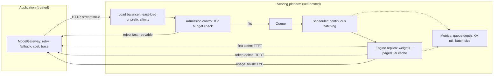
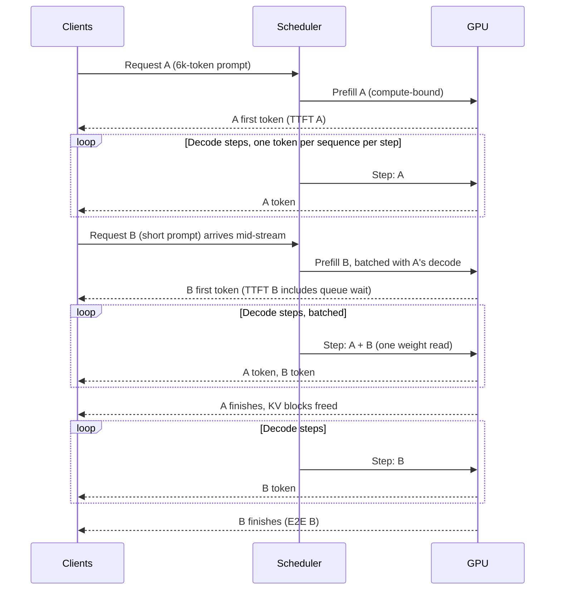

# Chapter 34 — Inference and Serving Essentials

This chapter is the serving math behind a model endpoint: what limits how many users one GPU serves, which latency numbers users feel, and how to plan capacity from a load test instead of a spec sheet. You need it the day a workload moves from a hosted API to open weights on hardware you control, or the day a hosted endpoint's latency becomes your problem.

**You will be able to:**
- Decide, with numbers, which slice of traffic (if any) should run on a self-hosted or managed open-weight endpoint instead of a hosted API.
- Define TTFT, TPOT, end-to-end latency, throughput, and goodput, and read a serving benchmark for the one your users feel.
- Size the KV cache for a model and context length, including grouped-query, sliding-window, latent-attention, and mixture-of-experts models, and turn it into a concurrency limit.
- Plan replicas with Little's Law and a load-tested operating point, and explain why headroom is not waste.
- Run a reproducible closed-loop load test that measures TTFT through streaming and finds the operating point.
- Put a self-hosted, OpenAI-compatible server behind the same `aie_core` client and gateway the rest of the book uses.

**Prerequisites:** Chapters 2 (tokens, prefill and decode, the KV cache as a mechanism), 3 (the `aie_core` client and `ModelGateway`), and 5 (prompt layout for prefix caching). | **Code:** `book/projects/examples/ch34/` (run: `.venv/bin/python -m pytest book/projects/examples/ch34 -q` from the repository root) | **Builds:** a KV-cache and concurrency calculator, Little's Law and replica-estimate helpers, an async streaming load generator, an in-process fake server, and a serving-target router over `aie_core`.

**First reading:** Why this matters, Mental model, Core concepts through Quantization trade-offs, How it works, the Implementation subsections KV-cache sizing and Capacity helpers, Production considerations, Common mistakes, Failure modes, and Before you ship. **Deep dives** (skip on a first pass): Speculative decoding, multi-adapter serving, Parallelism in one paragraph, Serving options compared, Architecture, the Implementation subsections from The load generator on, Code walkthrough (including What changes when you route between hosted and local), Tradeoffs, Evaluation and testing.

## Why this matters

Most of this book treats the model as a service behind an HTTP call. That holds until one of four things happens: the per-token bill becomes a line item finance asks about; a customer or regulator requires that prompts never leave a network; a product needs a model no provider hosts, such as a fine-tune from Chapter 33; or latency must be controlled rather than observed, as for a voice product (Chapter 35, Case 2) during a provider's traffic spike.

At that point an application engineer inherits what looks like infrastructure, and it is not someone else's domain. The serving layer leaks straight into application behavior: your prompt layout (Chapter 5) decides whether prefix caching (reusing computation for a shared prompt opening) helps, your RAG context lengths decide how many users fit on a GPU, and the quantization (lower-precision weights) an operator picks can silently change your structured-output success rate. And the decision to self-host is often made badly in both directions: some teams pay per-token prices for workloads several times cheaper on dedicated hardware, others buy GPUs that never reach break-even utilization.

You do not need to know how an attention kernel works. You do need the arithmetic of memory, the vocabulary of metrics, and a disciplined benchmark protocol.

## Mental model

> **Mental model:** Serving an LLM is a memory and scheduling problem wrapped around matrix multiplication. Weights are a fixed cost; the KV cache (the per-request store of attention keys and values, Chapter 2) is the variable cost that decides how many users share the GPU; the scheduler decides who waits.

Three consequences recur throughout the chapter. The KV cache grows linearly with context length, so "the model fits in memory" says nothing about how many requests fit. Each decode step reads the whole weight set once, shared by every sequence in the batch, so batching is almost free throughput. And queues form in front of a saturated GPU, so near capacity the tail, not the average, is what users feel.

> **Mental model:** Capacity is an empirical envelope found by load testing, not a division of peak tokens per second by tokens per request.

## Core concepts

### Hosted API or self-hosted engine

The decision is rarely binary. Many production systems route most traffic to a hosted provider and send a slice to a self-hosted model: regulated tenants, high-volume cheap tasks, or a fine-tuned specialist. Chapter 7 frames the hosting decision as part of model selection; the question here is which slice, if any, justifies the operational burden. The table gives the factors. Two deserve a sentence. Cost: a self-hosted GPU costs the same per hour whether it serves one request or a thousand, so a GPU idle 60 percent of the day often costs more per useful token than the API it replaced (arithmetic in Production considerations). Burden: procurement, engine upgrades, capacity planning, on-call for a service that fails by memory exhaustion, and a quality rerun after every engine change; budget a fraction of an engineer permanently.

| Factor | Favors hosted API | Favors self-hosting |
|---|---|---|
| Traffic | Spiky, low, or unpredictable | Sustained, high, predictable enough to size |
| Data | Can leave the network under contract | Must stay in-region or on-premises |
| Latency | Observed p95 is acceptable | Need control over batching, admission, headroom (and own every outage) |
| Model | Frontier general model required | Fine-tuned, licensed, or specialist open model |
| Team | No one to own GPUs and engine upgrades | Platform team exists, or workload justifies hiring |
| Change rate | Want new models without migration work | Want pinned behavior and reproducible outputs |
| Typical outcome | Everything hosted, gateway for retries and cost (Chapter 3, 30) | Hybrid: hosted default, self-hosted slice behind the same gateway |

**The middle option: managed open-weight endpoints.** A provider serves open weights for you, billed per token or per reserved GPU-hour. You get open-weight model choice, often including your own adapter, without procurement or on-call, and give up most latency control and part of the residency guarantee. The provider picks the engine and quantization, so ask which is served and rerun your evaluation suite when it changes. It is the usual first step toward open weights, and the right end state when volume is too spiky for dedicated GPUs.

Whatever the split, both sides speak the `LLMClient` protocol from Chapter 3 behind the same `ModelGateway`. Interchangeable replicas of one model belong in a gateway's fallback chain. A model with a different envelope (shorter context, no tool calling) belongs behind a capability-aware router (Chapter 7; this chapter's `check_fit` and `choose_target` are a minimal version); in a fallback chain it would silently change capability mid-incident.

### The metrics, defined precisely

Serving benchmarks are full of numbers that sound interchangeable and are not.

| Metric | Definition | Who feels it |
|---|---|---|
| Queue time | Arrival at the server until the scheduler starts prefill | Nobody directly; it sits inside TTFT and grows first under load |
| Time to first token (TTFT) | Request send to first content token: network, queue, prefill, first step | Interactive users: the pause before anything appears |
| Time per output token (TPOT), also inter-token latency | Average gap between content tokens after the first | Interactive users as streaming pace; noticeable above roughly 100 ms |
| End-to-end latency (E2E) | Send to final token, plus post-processing | Everyone; agents and batch pipelines feel only this |
| Throughput | Output tokens/s or requests/s across the server | The operator and the bill |
| Goodput | Throughput counting only requests that met their SLO | The product; the capacity you can advertise |
| p50 / p95 / p99 | Percentiles of any of the above | p50 is the demo; p95 and p99 are one user in twenty and one in a hundred |

Two distinctions matter. First, TTFT is where load shows up. A saturated GPU does not generate tokens more slowly; it makes new requests wait, so TPOT stays flat while TTFT climbs and a tokens-per-second dashboard looks healthy while users stare at a spinner. Second, goodput, not throughput, is capacity: 4,000 tokens per second at a p95 TTFT of 9 seconds is a number you cannot use.

Northwind Assist's RAG targets, used throughout: p95 TTFT under 2 seconds and p95 completion under 8 seconds.

### Prefill and decode

Chapter 2 introduced the two phases; here is what they mean for hardware. **Prefill** processes every prompt token at once, one large matrix multiplication per layer, so it is compute-bound; it produces the first token and the prompt's KV cache. **Decode** generates one token per step per sequence, and each step reads the entire weight set from GPU memory for one token's worth of arithmetic per sequence.

That is why decode is memory-bandwidth-bound. Moving tens of gigabytes of weights takes a fixed time per step, so decoding sixteen sequences in one step costs nearly the same as decoding one. Batching is therefore close to free throughput, memory bandwidth predicts single-stream TPOT better than FLOPS, and fewer bytes per weight speeds up decode.

Long prompts lengthen TTFT; long outputs lengthen E2E. A 6,000-token RAG prompt and a 60-token chat message have similar TPOT and very different TTFT: traffic shape, not model size alone, determines what users feel.

### The KV cache and the concurrency it allows

Chapter 2 introduced the KV cache as a mechanism; here it is a budget. For a conventional attention model the cache for one sequence is

```
kv_bytes = 2 * layers * kv_heads * head_dim * tokens * bytes_per_element
```

The factor 2 is keys plus values. `kv_heads` counts key/value heads, which under grouped-query attention are fewer than query heads: 32 query heads sharing 8 KV heads store a quarter of the cache, which can quadruple the users one GPU serves.

Take an illustrative 8-billion-parameter model with 32 layers, 8 KV heads, head dimension 128, and a BF16 cache (2 bytes per element). Per token that is 2 × 32 × 8 × 128 × 2 = 131,072 bytes, or 128 KiB. Two worked contexts:

| Context (tokens) | KV cache per sequence | Why that length |
|---|---|---|
| 8,192 | 1.00 GiB | A typical RAG answer: system prompt, five or six evidence chunks, a question, and a few hundred output tokens |
| 32,768 | 4.00 GiB | A long document in context or a many-turn agent loop |

Now place it on an illustrative 80 GiB GPU. Weights at BF16 take about 15 GiB; reserve 10 percent of the device (8 GiB) as headroom for fragmentation and bursts, and 2 GiB for the runtime's buffers. That leaves 80 − 15 − 8 − 2, roughly 55 GiB, for cache: about 55 concurrent sequences at 8k tokens, about 13 at 32k. Same model, same hardware, a quarter of the users, purely because of context length. With INT8 weights and an FP8 cache (see Quantization trade-offs), the 32k figure rises to about 31. `kv_cache.py` reproduces all of these numbers.

Three consequences follow. Admission control must count KV memory, not requests: one 64k-context request is worth sixteen 4k requests (Chapter 29 implements admission; the budget comes from here). Context engineering (Chapter 5) is capacity engineering: every thousand tokens trimmed is cache for another user. And an engine's "maximum model length" trades concurrency for length; it is not a free parameter.

The formula is a floor (real engines add metadata and fragmentation): a plausibility check, with the load test as the truth.

### When the architecture changes the arithmetic

The formula and `kv_cache.py` describe a dense model with conventional (grouped-query) attention in every layer. Many current open-weight models depart from that, so read the model's configuration file before you plan: the headline parameter count can mislead in either direction.

**Mixture-of-experts (MoE).** An MoE model replaces each feed-forward block with many "expert" blocks and a router that sends each token to a few. **Memory scales with total parameters**, because every expert must be resident. **Compute per token, and decode bandwidth at small batch, scale with active parameters** (what one token passes through). An illustrative MoE with 48B total and 8B active parameters needs about 96 GB at BF16 and does not fit on the 80 GiB device; at FP8 it takes about 48 GB and leaves much less cache than the dense 8B model. Yet its single-stream TPOT resembles the dense 8B model's.

Two consequences follow. "Batching is nearly free" weakens: a larger batch routes tokens to more experts, so per-step time rises toward that of a dense model of the total size. And the KV cache depends on the attention layers alone; size it from the config's attention shape. MoE models suit fleets with plenty of memory and steady, high concurrency, not a single small device.

**Attention variants change the KV formula.** Three are common:

- **Multi-query and grouped-query attention** shrink `kv_heads`, which the formula already captures.
- **Sliding-window (local) attention** layers attend only to the last W tokens, so they keep at most W tokens of cache. Models that interleave local and global layers pay the full formula only for the global layers, provided the engine implements the window rather than allocating full-length cache for every layer.
- **Latent attention** (multi-head latent attention, used for example in the DeepSeek-V2 and V3 families) caches one compressed latent vector per token per layer. Per token the cost is roughly `layers × latent_dim × bytes`, several times smaller than a grouped-query cache of similar model size.

Hybrid models with linear-attention or state-space layers keep a fixed-size state that does not grow with context. In every case, check against the engine: it reports the KV capacity it allocated at startup, and that number divided by your p95 sequence length is the concurrency ceiling. `kv_cache.py` models only conventional attention; exercise K7 extends the reasoning.

### Static versus continuous batching

**Static batching** runs N requests together and returns when the longest finishes, so most of the batch idles while one request still generates, and a late arrival waits for the whole batch. Utilization is poor and TTFT is erratic.

**Continuous batching** schedules per decode step: admit new requests whose prompts fit in the remaining cache, run one step for every active sequence, retire finished ones and free their blocks. This keeps the GPU full under mixed-length traffic, for several times the throughput of static batching.

Scheduling policy still matters. A long prompt's prefill stalls everyone's decode step, a TPOT hiccup for interactive users; engines mitigate this by chunking long prefills across steps (very large deployments split prefill and decode onto separate pools, which is not a starting point). The knob you will touch is the maximum number of batched sequences or tokens, which trades throughput for TPOT. Tune it against your SLO, not the engine's default.

Paged attention is the memory management underneath: cache is allocated in fixed-size blocks mapped to sequences like virtual-memory pages, so sequences grow without reserving a maximum-length region. You do not configure it; you read its utilization metric.

### Prefix caching and prompt layout

When requests share an identical token prefix, the next request reuses the KV cache computed for it, skipping that prefill and cutting TTFT. Hosted providers sell this as prompt caching; self-hosted engines do automatic prefix caching over the paged cache. A hit requires the same model, tokenizer, adapter, and text, so the layout rules of Chapter 5 apply unchanged: stable content first, variable content last, and nothing unique (a timestamp, a request ID) in the shared prefix. Measure the hit rate before designing around it; unique long documents get nothing from it but the memory it consumes.

Two serving-specific cautions. Timing can leak: a fast first token reveals that someone recently sent the same prefix, so review cross-tenant sharing (Chapter 26). And the prefix cache competes with active sequences for the same blocks, so a high hit rate under low load can vanish under high load.

### Quantization trade-offs

Quantization stores tensors in fewer bits. Three targets exist and should never be conflated.

**Weight-only quantization** (INT8, INT4, FP8) shrinks the fixed cost: the illustrative 8B model drops from about 16 GB (15 GiB) at 16 bits to about 8 GB at 8 bits and 4 GB at 4 bits. The freed memory becomes KV cache, which becomes concurrency. Fewer bytes per step can also speed up TPOT, but only with efficient kernels for that format; a slow 4-bit kernel can lose to 8-bit.

**Activation quantization** (FP8 or INT8 for weights and activations) also accelerates the arithmetic on hardware that supports those formats, which matters for prefill. It is sensitive to outlier channels and needs calibration data.

**KV-cache quantization** (FP8 or INT8 cache) halves the variable cost and doubles concurrency at a given context. Quality effects show up most on long-context retrieval, exactly what a RAG system cares about.

The memory saving is usually worth more than the kernel speed: doubling batch size on a bandwidth-bound decode nearly doubles throughput, and a 20 percent faster kernel does not.

One rule deserves emphasis: **measure task quality, not perplexity alone.** Perplexity can barely move while structured-output validity, tool-call arguments, multilingual quality, or long-context faithfulness regress badly. Run the sliced release evaluation (Chapters 24 and 25) before and after any quantization change; INT4 that doubles concurrency but breaks structured output for one task family is not a win.

### Speculative decoding

> **Deep dive.** How speculation trades draft cost for fewer sequential steps; skip on a first reading.

In speculative decoding a cheap **draft** proposes several future tokens and the full **target** model verifies them all in one forward pass, which costs about the same as one decode step because the pass is bandwidth-bound anyway. The target keeps the longest accepted prefix plus one token of its own. Under the standard acceptance rule the output distribution is identical to the target's: speculation changes speed, not results.

The **acceptance rate** governs the speedup: four guesses with three accepted advance about four positions per expensive step, and a poorly matched draft makes the system slower. Acceptance is high for predictable text (code, structured output) and low for creative content.

Drafts include a small same-family model, **Medusa** heads, **EAGLE** feature prediction, and nearly free **N-gram speculation** from the prompt (good for extraction and code editing). All are engine settings; benchmark at realistic concurrency, because speculation helps most at low batch sizes and fades when the GPU is busy.

### Serving many fine-tunes on one base: multi-adapter serving

> **Deep dive.** Serving many LoRA fine-tunes from one replica; skip on a first reading.

A LoRA fine-tune (Chapter 33) is a small set of low-rank matrices, the adapter, on frozen base weights. An engine can load the base once, keep many adapters resident, and apply each request's adapter inside a mixed batch; the client selects one by model name.

**When it pays.** Many fine-tunes with modest traffic each (per tenant, task, or language). Ten adapters cost roughly one replica plus tens to hundreds of megabytes each (illustrative), where ten merged models would cost ten mostly idle replicas.

**When not.** A single high-volume fine-tune is better merged into the base, because a runtime adapter adds work to every step. Full fine-tunes cannot share a base, and different bases or quantizations need different pools.

**What to watch.** A cold adapter shows up as a TTFT outlier while it loads, and the prefix cache is per adapter, so ten adapters split the hit rate ten ways. Each adapter is its own model release: evaluate its slice, trace its name and version, and test that an unknown adapter name is rejected rather than served by the base model.

### Parallelism in one paragraph

> **Deep dive.** The four ways to spread a model across devices; skip on a first reading.

When a model does not fit on one GPU, or one GPU is too slow, the engine spreads work across devices. **Tensor parallelism** splits each matrix operation across GPUs and synchronizes after every layer, so it needs a fast interconnect within one machine. **Pipeline parallelism** assigns layers to devices and passes activations along; it tolerates slower links but leaves idle bubbles. **Data parallelism** runs independent replicas and adds capacity with no communication. **Expert parallelism** places an MoE model's experts on different devices, with all-to-all communication. The guidance for an application team: fit the model on the smallest device group that holds weights plus a useful KV budget, scale with data-parallel replicas behind a load balancer, and leave multi-node tensor parallelism to specialists.

### Serving options compared

> **Deep dive.** Engine and endpoint options side by side; skip on a first reading.

The table lists options, not recommendations. Cells reflect engine documentation as of mid-2026 and change quickly; verify each against the version you deploy, and pin it.

| Option | Target hardware | Batching | Prefix cache | Structured output | Quantization formats | Operational maturity and notes |
|---|---|---|---|---|---|---|
| vLLM | Data-center and workstation GPUs, several vendors | Continuous, paged KV | Automatic | Grammar and JSON-schema backends | Many weight-only and FP8 formats, KV quantization | Widely deployed OpenAI-compatible server; adapters, parallelism, speculation |
| SGLang | Data-center GPUs | Continuous, radix-tree prefix sharing | Core design goal | Built in, plus a frontend language | Common weight-only and FP8 formats | OpenAI-compatible; strong for agentic and structured workloads |
| TensorRT-LLM | One GPU vendor's hardware only | Continuous, in-flight | Supported | Via integrations | Vendor-optimized FP8, INT8, INT4 | Often highest peak performance on its hardware; per-model build step |
| llama.cpp (GGUF) | CPUs, consumer GPUs, edge | Limited parallel slots | Per slot | Grammar-constrained sampling | GGUF file format, many low-bit schemes | Local and single-user use; OpenAI-compatible server; not for server-scale concurrency |
| Managed open-weight endpoints | Provider's | Provider-managed | Varies | Varies; often JSON-schema mode | Provider's choice; ask | Open weights and often your adapters without GPUs; upgrades on the provider's schedule |
| Hosted endpoints | Provider's | Provider-managed | Prompt caching with discounts | Native on most providers | Not exposed | No operations; latency observed, not controlled; behavior can change on provider schedule |

Benchmark the shortlist on your model, hardware, and traffic; a generic leaderboard measures none of those.

## How it works

### A request's path through a serving stack

The gateway (Chapter 3) sends an HTTP request to a load balancer, which picks a replica by least outstanding requests or by prefix affinity (so cache hits land where the prefix lives). The replica's admission controller checks that the request's token budget fits in free KV memory and admits it, queues it, or rejects it fast with a retryable status. The scheduler places the tokenized prompt into the next step's batch for prefill, possibly chunked. The first token streams back, and the sequence stays in the batch until it emits an end token, hits `max_tokens`, or the client disconnects. Its cache blocks then return to the pool, and the usage block reports token counts for cost accounting and tracing.

### Capacity planning with Little's Law

Little's Law is the queueing identity behind every capacity estimate (Chapter 35 applies it to whole systems; here it sizes the serving fleet). For any stable system,

```
L = λ × W
```

where L is the average number of requests in the system (queued or running), λ is the arrival rate, and W is the average time a request spends in the system. It holds regardless of distribution, scheduling, or batching. Peak arrivals of 20 requests per second with a 4 second mean end-to-end time means about 80 requests in flight; at 1.5 GiB of KV cache each, the fleet needs 120 GiB of cache before weights and headroom. Capacity planning starts there, not from a single-request benchmark.

The second idea is the **queueing knee**. For an idealized single-server queue, mean response time is `S / (1 − ρ)`, where S is the service time and ρ the utilization (the fraction of time the server is busy). At 50 percent utilization requests take twice the service time; at 90 percent, ten times; at 99 percent, a hundred times. Real LLM servers batch, but the curve has the same shape: flat, then vertical. The operating point (the load you plan to run at, chosen in the protocol below) must sit before the knee. That is why **headroom** is not waste: a replica at 60 percent of its measured goodput capacity has room for bursts, long-tail prompts, and a failed neighbor; one at 90 percent is already where p99 is unbounded.

**Worked example (illustrative).** Northwind Assist's RAG endpoint peaks at 6 requests per second. Mean input is 3,000 tokens (p95 6,000), mean output 300 tokens (p95 600), mean E2E 4 seconds. A load test of one replica of the 8B model found it sustains 1,500 output tokens per second and 20,000 prefill tokens per second while meeting the p95 TTFT and completion SLOs.

Little's Law puts 24 requests in flight at peak. Decode demand is 6 × 300 = 1,800 tokens per second; at a 60 percent target utilization one replica is good for 900, so decode needs 2.0 replicas. Prefill demand is 18,000 tokens per second against 12,000 usable, so 1.5 replicas. KV demand is 24 requests at a p95 sequence of 6,600 tokens, about 0.8 GiB each, 19 GiB total, well inside the 55 GiB cache budget of a single replica computed in the KV section (0.59 replicas at 60 percent utilization). Decode is the binding constraint; round up to 2 and add one replica for failover and rolling upgrades: 3 replicas. `capacity.py` encodes this computation; raise the p95 context to 30,000 tokens and the binding constraint flips to KV.

### A load test and benchmark protocol

A benchmark that cannot be reproduced is an anecdote. Record for every run the weights and quantization, engine version, hardware, scheduler settings, sampling parameters, and prompt and output distributions. Then:

1. **Warm up.** The first requests pay for kernel compilation, graph capture, and cold caches. Discard them.
2. **Use realistic distributions.** Sample prompts and `max_tokens` from production traces or a representative mix (short chat turns, long RAG prompts, extraction with tool schemas). Identical 128-token prompts tell you nothing, because queueing and KV pressure come from the tails.
3. **Sweep concurrency.** Run a closed loop at 1, 2, 4, 8, 16, 32 concurrent clients and beyond, until something breaks. Closed loop means each client sends its next request when the previous completes, which keeps offered load bounded.
4. **Record per request:** input and output tokens, concurrency level, TTFT, TPOT, E2E, success or error or cancel status. Record per level: GPU memory and utilization, KV-cache utilization, batch size, and queue depth from the engine's metrics endpoint.
5. **Plot two curves.** p50 and p95 TTFT against offered load, and throughput (requests per second or output tokens per second) against p95 E2E. Throughput rises and flattens; TTFT stays flat and then climbs. The knee is where p95 TTFT leaves the floor.
6. **Pick the operating point.** The highest concurrency at which p95 TTFT and p95 E2E meet the SLO with no errors. Its goodput is your capacity per replica; plan replicas from it with headroom, as in the worked example.
7. **Repeat for every variant** (quantization, engine version, scheduler setting, speculation on or off) with workload and SLO held constant, and compare goodput at the operating point, not peak throughput.

The chapter's load generator implements steps 1 to 3, the per-request half of 4, and 6, printing step 5's data as a table; exercises P1 and P2 add engine metrics and plots.

## Architecture

> **Deep dive.** The request path and a replica's batching timeline as diagrams; skip on a first reading.

The first diagram shows the request path and where each metric is measured. Authorization (Chapter 16) must be decided before a request passes the gateway.



The second diagram shows continuous batching inside a replica: request B arrives during A's decode and is admitted at a step boundary, and A's cache is freed the moment it finishes.



## Implementation

Five modules under `book/projects/examples/ch34/`; the listings are excerpts and every file is complete on disk. Only `local_target.py` needs `aie_core`, imported lazily; the rest depend on `httpx` and `pydantic`.

```
book/projects/examples/ch34/
├── kv_cache.py        # KV sizing, weight memory, concurrency estimate
├── capacity.py        # Little's Law, M/M/1 knee, headroom, replica estimate
├── loadtest.py        # async closed-loop load generator with streaming TTFT/TPOT
├── fake_server.py     # in-process OpenAI-compatible SSE fake for offline tests
├── local_target.py    # ServingTarget capability envelope + aie_core client factory
├── conftest.py        # registers the integration marker
└── test_ch34.py
```

Run the tests from the repository root:

```bash
.venv/bin/python -m pytest book/projects/examples/ch34 -q
```

Run the load generator against any OpenAI-compatible server (the engine's own `/v1/chat/completions`):

```bash
cd book/projects/examples/ch34
python loadtest.py --base-url http://localhost:8000/v1 --model my-model \
    --levels 1,2,4,8,16,32 --requests 32 --prompt-file prompts.txt --ttft-slo 2 --e2e-slo 8
```

### KV-cache sizing

```python
# path: book/projects/examples/ch34/kv_cache.py (excerpt; full file on disk)
class ModelShape(BaseModel):
    # ... docstring: read these from the model's config file
    name: str = "illustrative-8b"
    layers: PositiveInt
    kv_heads: PositiveInt
    head_dim: PositiveInt
    params_billion: float = Field(gt=0, description="total parameters, in billions")


def kv_bytes_per_token(shape: ModelShape, kv_bytes: float = 2.0) -> int:
    """Bytes of KV cache that one token occupies across all layers.

    Formula: 2 (keys and values) * layers * kv_heads * head_dim * bytes_per_element.
    """
    return int(2 * shape.layers * shape.kv_heads * shape.head_dim * kv_bytes)


def kv_bytes_per_sequence(shape: ModelShape, tokens: int, kv_bytes: float = 2.0) -> int:
    """KV cache for one sequence of ``tokens`` tokens (prompt plus generated so far)."""
    if tokens < 0:
        raise ValueError("tokens must be non-negative")
    return kv_bytes_per_token(shape, kv_bytes) * tokens


def weight_bytes(shape: ModelShape, weight_bytes_per_param: float = 2.0) -> int:
    """Memory for the weights alone. Scales and metadata for quantized formats add a few percent."""
    return int(shape.params_billion * 1e9 * weight_bytes_per_param)


# ... ConcurrencyEstimate (fields and summary) on disk


def max_concurrent_sequences(
    shape: ModelShape,
    tokens_per_sequence: int,
    gpu_memory_bytes: int,
    precision: Precision | None = None,
    headroom_fraction: float = 0.10,
    runtime_overhead_bytes: int = 2 * GiB,
    tensor_parallel: int = 1,
) -> ConcurrencyEstimate:
    """How many sequences of a given length fit in KV memory once weights are resident.

    ``tensor_parallel`` devices share weights and cache evenly, so the estimate is for the whole
    group. ``headroom_fraction`` is memory you refuse to plan into: fragmentation and bursts.
    ``runtime_overhead_bytes`` is per device (CUDA context, workspaces), so it scales with the group.
    """
    precision = precision or Precision()
    if not 0 <= headroom_fraction < 1:
        raise ValueError("headroom_fraction must be in [0, 1)")
    total = gpu_memory_bytes * tensor_parallel
    weights = weight_bytes(shape, precision.weight_bytes)
    headroom = int(total * headroom_fraction)
    runtime = runtime_overhead_bytes * tensor_parallel
    usable = total - weights - headroom - runtime
    per_seq = kv_bytes_per_sequence(shape, tokens_per_sequence, precision.kv_bytes)
    max_seq = 0 if usable <= 0 or per_seq == 0 else usable // per_seq
    return ConcurrencyEstimate(
        gpu_memory_bytes=total,
        weight_bytes=weights,
        headroom_bytes=headroom,
        runtime_overhead_bytes=runtime,
        usable_kv_bytes=max(usable, 0),
        per_sequence_bytes=per_seq,
        max_sequences=int(max_seq),
    )


def tokens_that_fit(shape: ModelShape, kv_budget_bytes: int, kv_bytes: float = 2.0) -> int:
    """Inverse question: given a KV budget, how many total tokens can be resident at once?"""
    per_token = kv_bytes_per_token(shape, kv_bytes)
    return 0 if kv_budget_bytes <= 0 else kv_budget_bytes // per_token
```

Running `python kv_cache.py` (its `__main__` block is on disk) prints the numbers used earlier in the chapter (illustrative hardware):

```
illustrative-8b: 128.0 KiB per token
    8192 tokens -> 1.00 GiB per sequence
   32768 tokens -> 4.00 GiB per sequence
  ctx 8192:  ... 55.1 GiB for KV; 1.00 GiB per sequence -> about 55 concurrent sequences
  ctx 32768: ... 55.1 GiB for KV; 4.00 GiB per sequence -> about 13 concurrent sequences
  ctx 32768 with INT8 weights + FP8 cache: ... 62.5 GiB for KV; 2.00 GiB per sequence -> about 31
```

### Capacity helpers

```python
# path: book/projects/examples/ch34/capacity.py (excerpt; full file on disk)
def in_flight(arrival_rate_per_s: float, mean_time_in_system_s: float) -> float:
    """L = lambda * W. Average number of requests inside the system (queued or running)."""
    _non_negative(arrival_rate_per_s, "arrival_rate_per_s")
    _non_negative(mean_time_in_system_s, "mean_time_in_system_s")
    return arrival_rate_per_s * mean_time_in_system_s


# ... arrival_rate, mean_time_in_system, utilization on disk


def mm1_response_time(service_time_s: float, rho: float) -> float:
    """Mean time in system for an M/M/1 queue: S / (1 - rho).

    Idealized (Poisson arrivals, exponential service, one server). Real LLM servers batch and
    have heavy-tailed service times, so the knee is sharper and arrives earlier. The shape of
    the curve is still the right intuition: latency is flat, then vertical.
    """
    if not 0 <= rho < 1:
        raise ValueError("rho must be in [0, 1) for a stable queue")
    return service_time_s / (1.0 - rho)


# ... headroom, Workload, ReplicaProfile, ReplicaEstimate on disk


def replicas_needed(
    workload: Workload,
    profile: ReplicaProfile,
    target_utilization: float = 0.6,
    failover_replicas: int = 1,
) -> ReplicaEstimate:
    # ... docstring and argument validation
    decode_demand = workload.peak_requests_per_s * workload.mean_output_tokens
    prefill_demand = workload.peak_requests_per_s * workload.mean_input_tokens
    decode_r = decode_demand / (profile.decode_tokens_per_s * target_utilization)
    prefill_r = prefill_demand / (profile.prefill_tokens_per_s * target_utilization)

    l_in_flight = in_flight(workload.peak_requests_per_s, workload.mean_e2e_s)
    # Size KV for the p95 sequence when known: tail requests are what exhaust cache.
    seq_tokens = (workload.p95_input_tokens or workload.mean_input_tokens) + (
        workload.p95_output_tokens or workload.mean_output_tokens
    )
    kv_per_request = seq_tokens * profile.kv_bytes_per_token
    kv_r = (l_in_flight * kv_per_request) / (profile.kv_budget_bytes * target_utilization)

    constraints = {"decode": decode_r, "prefill": prefill_r, "kv": kv_r}
    binding = max(constraints, key=constraints.__getitem__)
    recommended = math.ceil(constraints[binding]) + failover_replicas
    return ReplicaEstimate(
        decode_bound_replicas=decode_r,
        prefill_bound_replicas=prefill_r,
        kv_bound_replicas=kv_r,
        target_utilization=target_utilization,
        failover_replicas=failover_replicas,
        recommended_replicas=max(recommended, 1),
        in_flight_requests=l_in_flight,
        binding_constraint=binding,
    )
```

### The load generator

> **Deep dive.** Measuring TTFT and TPOT through streaming and picking the operating point in code; skip on a first reading.

```python
# path: book/projects/examples/ch34/loadtest.py (excerpt; full file on disk)
async def run_one(
    client: httpx.AsyncClient, cfg: LoadTestConfig, prompt: str, max_tokens: int, concurrency: int
) -> RequestResult:
    """One streamed chat completion with TTFT, TPOT, and end-to-end timing."""
    body = {
        "model": cfg.model,
        "messages": [{"role": "user", "content": prompt}],
        "max_tokens": max_tokens,
        "temperature": cfg.temperature,
        "stream": True,
        "stream_options": {"include_usage": True},
    }
    result = RequestResult(concurrency=concurrency, ok=False, prompt_chars=len(prompt), max_tokens=max_tokens)
    start = time.perf_counter()
    first_token_at: float | None = None
    last_token_at: float | None = None
    tokens = 0
    reported_tokens: int | None = None
    try:
        async with client.stream("POST", "/chat/completions", json=body, timeout=cfg.timeout_s) as resp:
            result.status_code = resp.status_code
            if resp.status_code != 200:
                await resp.aread()
                result.error = f"HTTP {resp.status_code}: {resp.text[:200]}"
                result.e2e_s = time.perf_counter() - start
                return result
            async for line in resp.aiter_lines():
                chunk = parse_sse_line(line)
                if chunk is None:
                    continue
                usage = chunk.get("usage")
                if usage and usage.get("completion_tokens") is not None:
                    reported_tokens = int(usage["completion_tokens"])
                if _delta_text(chunk):
                    now = time.perf_counter()
                    if first_token_at is None:
                        first_token_at = now
                    last_token_at = now
                    tokens += 1
    except (httpx.HTTPError, json.JSONDecodeError) as exc:
        result.error = f"{type(exc).__name__}: {exc}"
        result.e2e_s = time.perf_counter() - start
        return result
    # asyncio.CancelledError is not caught: Ctrl-C or an outer deadline must stop the sweep.

    end = time.perf_counter()
    result.e2e_s = end - start
    # Content deltas are an approximation of tokens; prefer the server's usage count if given.
    result.output_tokens = reported_tokens if reported_tokens is not None else tokens
    if first_token_at is None:
        result.error = "no content tokens received"
        return result
    result.ttft_s = first_token_at - start
    if last_token_at is not None and result.output_tokens > 1:
        result.tpot_s = (last_token_at - first_token_at) / (result.output_tokens - 1)
    result.ok = True
    return result

# ... run_level (closed-loop workers draining a shared queue) on disk

def summarize(results: list[RequestResult], wall_s: float, cfg: LoadTestConfig) -> LevelSummary:
    ok = [r for r in results if r.ok]
    ttft = [r.ttft_s for r in ok if r.ttft_s is not None]
    tpot = [r.tpot_s for r in ok if r.tpot_s is not None]
    e2e = [r.e2e_s for r in ok]
    passed = sum(1 for r in results if r.meets_slo(cfg))
    wall = max(wall_s, 1e-9)
    return LevelSummary(
        # ... nearest-rank p50/p95/p99 for TTFT, TPOT, and E2E
        requests_per_s=len(ok) / wall,
        output_tokens_per_s=sum(r.output_tokens for r in ok) / wall,
        slo_pass_fraction=passed / len(results) if results else 0.0,
        goodput_requests_per_s=passed / wall,
    )

# ... sweep (warm-up, pooled client, one run_level per concurrency level) on disk

def find_operating_point(summaries: list[LevelSummary], cfg: LoadTestConfig) -> LevelSummary | None:
    """Highest concurrency whose p95 TTFT and p95 E2E meet the SLO with zero errors."""
    passing = [
        s for s in summaries
        if s.errors == 0 and s.ttft_p95 <= cfg.ttft_slo_s and s.e2e_p95 <= cfg.e2e_slo_s
    ]
    return max(passing, key=lambda s: s.concurrency) if passing else None
```

### The offline fake server

> **Deep dive.** A fake with a real capacity limit, so the load generator is tested offline; skip on a first reading.

```python
# path: book/projects/examples/ch34/fake_server.py (excerpt; full file on disk)
@dataclass
class FakeServer:
    capacity: int = 4  # concurrent sequences the fake "GPU" decodes without queueing
    prefill_s: float = 0.01  # fixed prompt-processing delay
    tpot_s: float = 0.002  # per-token decode delay
    queue_slot_s: float = 0.02  # scheduler overhead added when a request had to wait for a slot
    fail_above: int | None = None  # return HTTP 429 when more than this many are active
    # ... counters and the per-event-loop slot semaphore on disk

    # ... handle(): routes /chat/completions, returns 429 above fail_above, streams _SSEStream

class _SSEStream(httpx.AsyncByteStream):
    # ...
    async def __aiter__(self) -> AsyncIterator[bytes]:
        s = self.server
        s.active += 1
        s.peak_active = max(s.peak_active, s.active)
        slots = s.slots()
        try:
            queued = slots.locked()                              # every decode slot is busy
            async with slots:                                    # wait for a slot: the real queue
                s.decoding += 1
                s.peak_decoding = max(s.peak_decoding, s.decoding)
                try:
                    await asyncio.sleep(s.prefill_s + (s.queue_slot_s if queued else 0.0))  # prefill => TTFT
                    created = int(time.time())
                    for i in range(self.n_tokens):
                        if i:
                            await asyncio.sleep(s.tpot_s)
                        yield _chunk(self.model, created, f"tok{i} ")
                    usage = {"prompt_tokens": 10, "completion_tokens": self.n_tokens, "total_tokens": 10 + self.n_tokens}
                    yield _chunk(self.model, created, None, finish="stop", usage=usage)
                    yield b"data: [DONE]\n\n"
                finally:
                    s.decoding -= 1
        finally:
            s.active -= 1
```

### Serving targets and the `aie_core` client

> **Deep dive.** The capability envelope and client factory that put a self-hosted engine behind the book's gateway; skip on a first reading.

```python
# path: book/projects/examples/ch34/local_target.py (excerpt; full file on disk)
class ServingTarget(BaseModel):
    name: str
    base_url: str
    model: str
    api_key_env: str = "OPENAI_API_KEY"
    max_context_tokens: int = Field(gt=0)
    supports_tools: bool = True
    supports_response_schema: bool = True
    supports_stream_usage: bool = True
    engine: str | None = None  # e.g. "vllm", "sglang", "llama.cpp", "hosted"; recorded in traces


# ... RequestEnvelope: input_tokens, max_output_tokens, needs_tools, needs_response_schema


def check_fit(target: ServingTarget, env: RequestEnvelope, reserve_tokens: int = 64) -> list[str]:
    """Return a list of human-readable problems; empty means the request can be sent as is."""
    problems: list[str] = []
    needed = env.input_tokens + env.max_output_tokens + reserve_tokens
    if needed > target.max_context_tokens:
        problems.append(
            f"context: needs {needed} tokens (input {env.input_tokens} + output {env.max_output_tokens} "
            f"+ reserve {reserve_tokens}) but {target.name} allows {target.max_context_tokens}"
        )
    if env.needs_tools and not target.supports_tools:
        problems.append(f"tools: {target.name} does not support tool calling")
    if env.needs_response_schema and not target.supports_response_schema:
        problems.append(f"schema: {target.name} does not support JSON-schema constrained output")
    return problems


# ... choose_target and envelope_for on disk


def make_client(
    target: ServingTarget,
    *,
    timeout_s: float = 60.0,
    transport: Any = None,
    async_transport: Any = None,
) -> Any:
    # ... docstring; aie_core is imported lazily
    from aie_core.llm.providers import OpenAICompatibleClient  # noqa: PLC0415

    client = OpenAICompatibleClient(
        base_url=target.base_url,
        api_key=os.environ.get(target.api_key_env, "not-needed"),
        default_model=target.model,
        provider=f"{target.engine or 'openai-compatible'}:{target.name}",
        timeout_s=timeout_s,
        transport=transport,
        async_transport=async_transport,
    )
    client.supports_response_schema = target.supports_response_schema
    return client
```

## Code walkthrough

> **Deep dive.** The non-obvious decisions behind the listings, and a sweep read end to end; skip on a first reading.

**`kv_cache.py`.** The 10 percent headroom default is memory you refuse to count on, a planning posture rather than a measurement. `tokens_that_fit` answers the admission controller's question: given the free cache now, how long a request can I admit?

**`capacity.py`.** The Little's Law functions are exact; `mm1_response_time` only draws the knee. `replicas_needed` reports which constraint binds because the remedies differ: decode-bound wants more replicas or quantized weights, prefill-bound wants shorter prompts or prefix caching, KV-bound wants shorter contexts, cache quantization, or a GQA model. Its token rates must come from a load test at the operating point; a spec sheet's tokens per second is measured past the knee.

**`loadtest.py`.** TTFT is measured to the first non-empty content delta, not the first byte, because engines send role-only or empty deltas first. Errors become rows with `ok=False`, so overload shows up as an error rate instead of aborting the sweep. `sweep` (on disk) sizes the connection pool to the highest concurrency level; a default pool of 100 would queue requests on the client and report the wait as server TTFT.

Against the fake server with a capacity of 8 (prefill 0.02 s, 5 ms per token, 32 or 64 output tokens, 32 requests per level, SLOs of 0.15 s TTFT and 1 s end to end), the sweep produces this table. Timings vary slightly between runs; the shape is what real hardware shows, and `test_walkthrough_shape_has_a_knee_at_capacity` checks it:

```
 conc    n  err  ttft p50  ttft p95  tpot p50  e2e p50  e2e p95   req/s    tok/s   slo%  goodput
------------------------------------------------------------------------------------------------
    1   32    0     0.022     0.023    0.0058     0.20     0.40    3.51    161.6  100.0     3.51
    4   32    0     0.021     0.022    0.0058     0.38     0.41   12.56    627.9  100.0    12.56
    8   32    0     0.021     0.022    0.0057     0.21     0.38   27.02   1161.9  100.0    27.02
   16   32    0     0.253     0.433    0.0058     0.60     0.79   23.02   1150.8   25.0     5.75
   32   32    0     0.423     0.856    0.0059     0.61     1.20   22.78   1025.0   25.0     5.69
```

Read it the way you will read a real one. TPOT is flat at every level: the GPU did not get slower. Throughput climbs to concurrency 8 and levels off, because the fake decodes at most 8 sequences at once. TTFT is flat until capacity, then p95 jumps about twentyfold, and goodput collapses from 27.0 to 5.8 requests per second while raw throughput barely moves. The operating point is 8. A benchmark reporting only the 1,162 tokens per second peak would have been accurate and would have hidden the collapse.

**`fake_server.py`** runs as an `httpx.MockTransport`, so the generator exercises its real HTTP and SSE parsing with no sockets.

**`local_target.py`.** `check_fit` returns every problem, not the first, so the trace (Chapter 31) explains a reroute. In `make_client`, `provider` becomes `engine:target`, so every span and cost report says which deployment answered, and `supports_response_schema` mirrors the target, so `complete_structured` falls back to prompt-and-repair instead of sending a `response_format` the engine will reject. Everything else is unchanged: same `CompletionRequest`, same `ModelGateway`.

### What changes when you route between hosted and local

> **Deep dive.** Five capability differences to check before assuming parity; skip on a first reading.

The transport does not change; the envelope does.

**Tool support.** Tool calling on open models depends on the engine's parser for that family's format and on the model's training. A target with `supports_tools=False` should get `tools=None` and a text-protocol fallback, or a route elsewhere. Test with your real tool definitions (Chapter 16).

**Schema support.** The supported subset of JSON Schema varies (recursive schemas, `anyOf`, string formats); keep the target's capability flag accurate.

**Context length.** The engine's limit is a concurrency knob, often far below the model's trained maximum. `check_fit` reserves a margin because the application's and the engine's token counts can disagree. Requests that do not fit are compacted (Chapter 5) or routed, never silently truncated.

**Log-probabilities.** Many self-hosted engines return them, the cheapest confidence signal for a classifier cascade (Chapter 33). Request them with `extra_body={"logprobs": True}`, read them from `completion.raw`, and recalibrate thresholds after any engine or quantization change.

**Model identity.** The served name tells you little; behavior follows the deployed quantization and engine version, so record both in traces.

## Production considerations

This section gives the reasons behind the Before you ship checklist; self-explanatory items appear only there.

**Latency and autoscaling.** Queue depth and KV-cache utilization are leading indicators: they rise before the latency percentiles do. Autoscaling on GPU utilization alone reacts too late, because a GPU at 70 percent can already be past the knee if its cache is full. Scale on queue depth, admission rejections, and SLO violations.

**Cost model.** Self-hosted cost per useful token is `(GPU hours × hourly cost + operations) / tokens served within SLO`, and the denominator makes or breaks the case. Illustrative arithmetic: a GPU at 3.00 USD per hour serving the 8B model at 1,500 output tokens per second produces 5.4 million tokens per hour, about 0.55 USD per million if saturated around the clock. At a realistic 35 percent average utilization it produces 1.9 million useful tokens per hour, about 1.60 USD per million, before engineer time, the idle failover replica, and load tests. Compare that to the per-token price you actually pay, caching discounts included. Chapter 30 owns the full cost model; feed it load-tested goodput.

**Upgrades and cancellation.** Drain a replica by stopping admission and waiting for in-flight sequences up to a timeout; a hard kill discards every active user's generation. Readiness and cancellation each have a failure mode below (replica flapping, zombie generations); Chapter 29 covers cancellation plumbing at the gateway.

**Releases and traces.** Treat a change of quantization, engine version, kernel configuration, speculation, or even maximum batch size as a model release: some settings alter outputs at temperature zero. Without engine and quantization identifiers in every span, you will debug a prompt for a day before discovering the operator upgraded the engine.

**Security.** An OpenAI-compatible server will serve anyone, so authenticate calls even on an internal network. The engine does not know what a tenant is, so isolate tenants at the gateway, and keep licensed weights out of public buckets.

## Common mistakes

Each is explained above; the list is for review.

- **Planning from peak tokens per second** instead of goodput at the operating point plus headroom.
- **Benchmarking with uniform prompts**, which hide long-tail queueing and KV pressure.
- **Measuring without streaming**, which hides TTFT, the metric that saturates first.
- **Treating "the model fits" as "the users fit."** The KV budget decides concurrency.
- **Sizing an MoE model by its active parameters.** Total parameters decide whether it fits.
- **Self-hosting a spiky workload.** A GPU busy two hours a day costs more per useful token than the API.
- **Forgetting the failover replica.** N replicas sized exactly to peak become N minus one during every upgrade.

## Failure modes

Each failure names what breaks, its telemetry, and a test.

**KV exhaustion under long contexts.** A burst of long-context requests fills the cache; new requests queue or running ones are preempted, and TTFT climbs while TPOT stays flat. Telemetry: KV utilization near 100 percent, rising queue depth, engine preemption or recompute counters climbing. Test: load-test with a prompt mix whose p95 is your real p95, and confirm admission rejects fast rather than queueing without bound.

**Head-of-line blocking by a long prefill.** One 30k-token prompt enters a busy batch and delays every active user's next token. Telemetry: periodic TPOT spikes aligned with long-prompt admissions. Test: mix a few very long prompts into short traffic and plot per-request TPOT; enable chunked prefill or a prompt-length cap if spikes breach the SLO.

**Quantization regression on one task family.** Aggregate quality looks unchanged but structured-output validity drops or tool arguments acquire formatting errors. Telemetry: repair-loop rate in `complete_structured`, tool-call validation failures, sliced evaluation scores. Test: the release suite with slices, run before promotion.

**Prefix cache miss storm.** A prompt change moves a variable field earlier in the prompt; cache hit rate drops to zero and TTFT doubles across the fleet. Telemetry: engine prefix-cache hit ratio, TTFT p50 step change aligned with a prompt registry version bump (Chapter 4). Test: assert in CI that the registered system prompt's first N tokens are stable across the versions you intend to be cache-compatible.

**Zombie generations after client disconnect.** Abandoned streams keep decoding; KV utilization stays high with no corresponding client connections. Telemetry: active sequences on the engine exceed open connections at the gateway. Test: open streams, close them early, watch the engine's active-sequence metric fall within a bounded time.

**Replica flapping during rolling upgrade.** Readiness passes while weights are still loading (or after the GPU context has died), and the load balancer sends traffic to a replica that times out every request. Telemetry: error spikes aligned with deployment events, one replica with zero completions. Test: a readiness check that performs a real completion; staged rollout, one replica first.

**Speculative decoding that slows the system.** A draft with low acceptance for your workload adds cost at every step and TPOT worsens at high concurrency. Telemetry: acceptance rate below break-even for the draft length; TPOT regression versus baseline. Test: the same sweep with speculation on and off, compared at the operating point.

**Silent context truncation.** An engine configured with a shorter maximum length than the application assumes truncates or rejects, and the model answers without the evidence that was cut. Telemetry: engine-side input token counts below the gateway's, or a spike in `InvalidRequestError`. Test: `check_fit` with the engine's real limit, plus a contract test that sends a request one token over it.

## Tradeoffs

> **Deep dive.** The levers side by side, with the settings this chapter recommends; skip on a first reading.

The levers not settled elsewhere in the chapter:

- **Context length versus concurrency.** A 128k limit admits rare requests whose cache crowds out dozens of ordinary ones, and worst-case planning must assume them. Set the engine's limit to your p99 plus margin and route the rare long request to a pool configured for it.
- **Batch size versus TPOT.** Larger batches raise decode throughput almost linearly and TPOT slightly; past the cache budget they raise TTFT sharply. Tune maximum batched tokens against the SLO.
- **Headroom versus cost.** Every point of headroom is idle hardware; every point removed moves you toward the knee. Sixty to seventy percent of measured goodput capacity is a common posture for interactive services; batch pools can run hotter.
- **Engine choice.** Peak performance and hardware specialization against portability and model coverage. Benchmark, pin, and re-benchmark on upgrade.

## Evaluation and testing

> **Deep dive.** What the test file pins and how real-hardware runs differ; skip on a first reading.

**Unit tests of the arithmetic** in `test_ch34.py` pin the formulas to the chapter's numbers. They catch the unit errors (GB versus GiB, bytes versus elements, query heads versus KV heads) that produce wildly wrong plans.

**Offline tests** run the real HTTP and SSE code against the fake and assert the shape the protocol predicts (flat TPOT, p95 TTFT rising past capacity, errors counted, an operating point of 8), plus the gateway integration: the span's provider, and no `response_format` sent to a schema-less target. If you extend the generator, extend the fake first.

**Benchmark runs against real hardware** are evaluations, not tests: store each with its configuration record and pair it with the quality suite on the same deployment, since a speedup with a quality regression is a failed run. Re-measure whenever the model, engine, quantization, or prompt distribution changes; the capacity envelope expires. Tests you add against a real engine take the `integration` marker and are skipped unless `--run-integration` is passed.

## Before you ship

- [ ] The self-hosting decision is written down per traffic slice, with cost per useful token computed at measured average utilization (including nights and weekends), not at peak throughput.
- [ ] Two SLOs exist, p95 TTFT and p95 completion, with per-replica alerts on each, plus leading-indicator alerts on queue depth, KV-cache utilization, and preemptions.
- [ ] The KV budget was computed from the model's configuration file (attention type, KV heads, sliding windows, MoE total parameters) and matches, within a few percent, the KV capacity the engine reports at startup.
- [ ] The engine's maximum model length is set to the p99 sequence plus margin, `ServingTarget.max_context_tokens` holds that same value, and a contract test sends a request one token over it and gets a clean rejection, not truncation.
- [ ] A load test with production-sampled prompt and output lengths, warm-up discarded, swept concurrency until p95 TTFT left the floor, and its full configuration record (weights, quantization, engine version, scheduler settings, hardware) is stored with the results.
- [ ] The replica count comes from load-tested goodput at a 60 to 70 percent target utilization, plus at least one failover replica.
- [ ] The sliced release evaluation (structured output, tool calls, long context, language) passed on the exact quantization, engine version, and adapter being deployed.
- [ ] Prefix-cache hit rate is on a dashboard, and CI asserts that the system prompt's first N tokens are unchanged across cache-compatible prompt versions.
- [ ] Readiness performs a real tiny completion; rolling upgrades drain with a timeout and promote one replica first.
- [ ] A cancellation test closes streams early and sees the engine's running-sequence count return to baseline within a bounded time.
- [ ] Every span carries model, quantization, adapter, engine version, and replica; the engine requires authentication even on the internal network; cross-tenant prefix-cache sharing has been reviewed.

## Exercises

**Start here:** K3, K7, E2, P3, D2 (about 4 hours). The rest go deeper.

### Knowledge questions

**K1.** Define queue time, TTFT, TPOT, end-to-end latency, throughput, and goodput. For an interactive chat product and for a nightly batch classification job, name the one metric each cares about most and explain why the other metrics matter less for that product.

**K2.** Explain in two or three sentences, without kernel detail, why the decode phase is limited by memory bandwidth and why that makes batching during decode nearly free in throughput terms.

**K3.** State the KV-cache formula and name each variable. For a model with 48 layers, 8 KV heads, head dimension 128, and a BF16 cache, compute the cache per token and per 16k-token sequence. How does the result change with an FP8 cache?

**K4.** Contrast static batching and continuous batching. What property of LLM requests makes static batching waste capacity, and what scheduling problem does continuous batching introduce for interactive latency?

**K5.** Why is "measure task quality, not perplexity alone" the right rule for evaluating a quantized model? Name three task slices that commonly regress while aggregate scores look stable.

**K6.** State Little's Law and give one example of using it in each direction: deriving in-flight requests from traffic, and deriving a sustainable arrival rate from a fixed concurrency budget.

**K7.** An illustrative mixture-of-experts model has 48B total and 8B active parameters, 32 layers, 8 KV heads, and head dimension 128. (a) Compute its weight memory at BF16 and at FP8, and, with the chapter's 10 percent headroom and 2 GiB runtime allowance on an 80 GiB device, the KV budget left in each case. (b) How much KV cache does one 8k-token sequence need, and how many fit? (c) Would you expect its TPOT at concurrency 1 and at concurrency 32 to resemble a dense 8B model or a dense 48B model, and why? (d) If 24 of its 32 layers used sliding-window attention with a 4,096-token window, what would one 32k-token sequence cost in KV memory?

### Engineering questions

**E1.** Northwind's logistics tenant requires that incident reports never leave the corporate network, while the retail tenant has no such constraint. Design the routing so both tenants use the same application code and the same gateway. Which `aie_core` components are involved, what does the `ServingTarget` list look like, and what must appear in every trace?

**E2.** A team proposes raising the engine's maximum model length from 16k to 64k so that one rare long-document feature works. Using the illustrative 8B shape on an 80 GiB device, quantify the effect on maximum concurrency and propose two alternatives that serve the feature without paying that cost for every request.

**E3.** Your prompt registry adds a `request_id` to the first line of every system prompt for debugging. Explain the effect on prefix caching, estimate the TTFT impact for a 2,000-token system prompt relative to a 300-token user message, and propose a layout that keeps the debugging value without the cost.

**E4.** A load test shows p95 TTFT crossing the 2 second SLO at concurrency 12, with TPOT flat and KV utilization at 60 percent. Queue depth is rising. Which of the three constraints in `replicas_needed` is binding, what does that imply about the fix, and why would quantizing the KV cache not help here?

### Practical exercises

**P1.** (about 2 hours) Extend `loadtest.py` to record the engine's Prometheus-style metrics (queue depth, KV utilization, running sequences) at the end of each concurrency level, add the columns to `LevelSummary` and the report, and extend `fake_server.py` to expose a `/metrics` endpoint so the feature is tested offline.

**P2.** (about 90 min) Write `plot_sweep.py` that reads a list of `LevelSummary` objects (serialize them to JSON from `sweep`) and produces the two protocol plots: p50 and p95 TTFT against requests per second, and output tokens per second against p95 E2E. Mark the SLO lines and the operating point.

**P3.** (about 2 hours) Build an admission-control function on top of `kv_cache.tokens_that_fit` that, given free KV bytes reported by the engine and a request's input tokens plus `max_tokens`, decides between admit, queue (with a bounded wait), and reject with a retryable error. Test it with a sequence of mixed-length requests against a fixed budget and assert that it never admits more tokens than fit.

**P4.** (about half a day, needs a local GPU or a capable CPU) Run the load generator against a real local OpenAI-compatible server of your choice, once with the default configuration and once with a quantized variant of the same model. Record the full configuration from the protocol section, find both operating points, and run the same small structured-output evaluation against both. Write a one-page comparison that reports goodput at the SLO and the quality deltas by slice.

### Debugging exercises

**D1.** After an engine upgrade, p50 TTFT for the RAG endpoint doubled across all replicas while TPOT, error rate, GPU utilization, and traffic were unchanged. The prompt registry shows no changes in the last week. Traces show input token counts identical to last week's. Diagnose the most likely cause and name the single engine metric that would confirm it.

**D2.** A dashboard shows output tokens per second at an all-time high and GPU utilization at 85 percent, yet support tickets about "the assistant hangs before answering" tripled this afternoon. KV utilization is pinned at 99 percent and the engine's preemption counter is climbing. Explain what is happening, why the throughput number is misleading, and what two changes, one immediate and one structural, address it.

**D3.** Overnight, a self-hosted replica's KV utilization climbed steadily to 95 percent and stayed there with almost no client traffic; the gateway shows a handful of open connections, the engine shows forty running sequences. In the morning every request queues. Identify the fault, the layer most likely responsible, and the test that should have caught it.

## Key takeaways

- Self-hosting is a hybrid decision made per traffic slice on five factors: cost at sustained volume, data residency, latency control, model availability, and the operational burden of owning a stateful GPU service. Both sides use the same `aie_core` client and gateway; the router chooses between targets with different capabilities, and gateway fallbacks hold only interchangeable replicas.
- Define metrics precisely. TTFT is where load appears, TPOT stays mostly flat under saturation, and goodput under SLO is the only capacity number worth advertising.
- Prefill is compute-bound and sets TTFT; decode is memory-bandwidth-bound, sets TPOT, and makes batching nearly free. Traffic shape, not model size alone, determines what users feel.
- KV cache per sequence is 2 × layers × KV heads × head dim × tokens × bytes. For the illustrative 8B shape that is 1 GiB at 8k and 4 GiB at 32k, so a fourfold context increase divides concurrency by four on the same hardware. Admission control must count tokens, not requests. Read the config, not the headline parameter count: MoE weight memory follows total parameters while small-batch speed follows active ones, and sliding-window and latent attention shrink the cache below the formula.
- Continuous batching and paged KV memory are why modern engines reach high utilization; the knobs you tune are maximum batched tokens and chunked prefill, against your SLO.
- Prefix caching is controlled by prompt layout: stable content first, variable content last, nothing unique in the shared prefix.
- Quantization's main gift is memory that becomes batch size; its cost is task-specific and visible only in a sliced quality suite. Speculative decoding helps interactive, low-concurrency traffic and depends on acceptance rate.
- Little's Law turns traffic into in-flight requests and KV demand; the queueing knee says why headroom is not waste. Size replicas from the load-tested operating point, divide by a target utilization, and add failover.
- A reproducible benchmark warms up, uses realistic prompt and output distributions, sweeps concurrency in a closed loop, records TTFT, TPOT, E2E, errors, and engine metrics, and chooses the operating point where p95s meet the SLO.
- Treat every engine, quantization, or scheduler change as a model release: record versions in traces, rerun the quality suite, roll out one replica at a time, and verify that cancellation frees KV memory.

## Further reading

- *Efficiently Scaling Transformer Inference* (Pope et al., 2023): the prefill versus decode split, memory bandwidth limits, and KV-cache costs worked out carefully; the source of most of this chapter's arithmetic.
- *Efficient Memory Management for Large Language Model Serving with PagedAttention* (Kwon et al., 2023): the vLLM paper; why paged KV memory makes continuous batching practical and how fragmentation wastes capacity.
- *Orca: A Distributed Serving System for Transformer-Based Generative Models* (Yu et al., 2022): iteration-level scheduling, the idea behind continuous batching.
- *DistServe: Disaggregating Prefill and Decoding for Goodput-optimized Large Language Model Serving* (Zhong et al., 2024): goodput under an SLO as the capacity metric, and when splitting prefill and decode pays.
- *Fast Inference from Transformers via Speculative Decoding* (Leviathan, Kalman, and Matias, 2023): the acceptance rule that makes speculation lossless and the arithmetic of its speedup.
- *GQA: Training Generalized Multi-Query Transformer Models from Multi-Head Checkpoints* (Ainslie et al., 2023): the attention variant that shrinks `kv_heads` and therefore the KV cache in most current open models.
