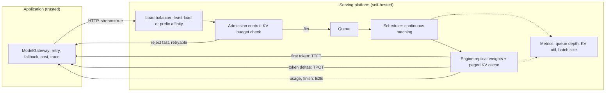
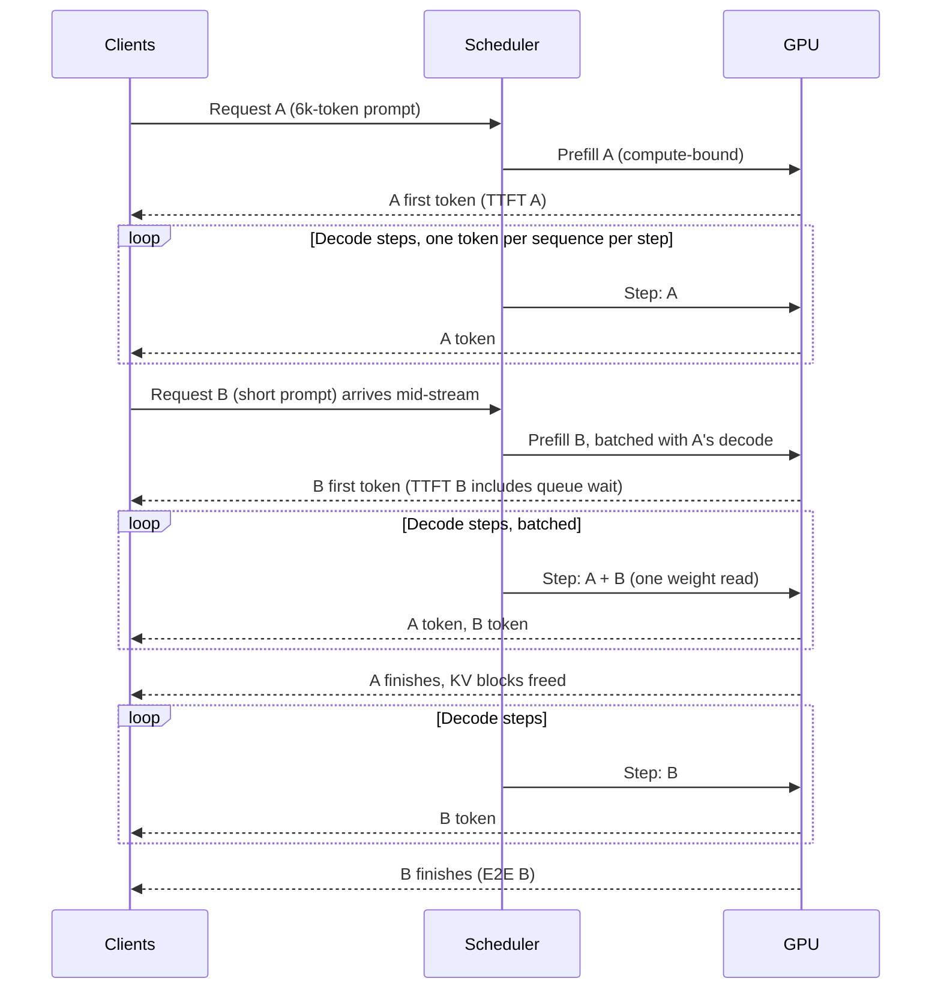

# Chapter 34 — Inference and Serving Essentials

After this chapter you will be able to decide, with numbers, whether an application should call a hosted model API or run an open-weights model on hardware you control; read a serving benchmark and know which of its metrics your users will feel; size the KV cache for a given model and context length and translate that into a concurrency limit; plan capacity with Little's Law and a load test instead of a vendor's single-request figure; and put a self-hosted, OpenAI-compatible server behind the same `aie_core` client the rest of the book uses. The code for the chapter lives in `book/projects/examples/ch34/`: a KV-cache and concurrency calculator, Little's Law and replica-estimate helpers, an async load generator that measures time to first token through streaming, and an in-process fake server so everything is testable offline.

## Why this matters

Most of this book treats the model as a service behind an HTTP call. That abstraction holds until one of four things happens. Volume grows until the per-token bill becomes a line item the finance team asks about. A customer or regulator requires that prompts never leave a region or a network. A product needs a model the hosted providers do not offer, such as a fine-tuned open model from Chapter 33 or a small specialist for classification. Or latency needs to be controlled rather than observed, because a voice product (Chapter 38) cannot tolerate a provider's queue during a traffic spike.

At that point an application engineer inherits a problem that looks like infrastructure: GPUs, serving engines, memory budgets, batch schedulers. The temptation is to treat it as someone else's domain. That is a mistake for two reasons. First, the serving layer's behavior leaks straight into application behavior: the prompt layout you chose in Chapter 5 decides whether prefix caching (reusing computation for a shared prompt opening) helps, the context lengths your RAG pipeline produces decide how many users fit on a GPU, and the quantization (lower-precision weights) an operator picks silently changes your structured-output success rate.

Second, the decision to self-host is often made badly in both directions: teams pay per-token prices for workloads that would be several times cheaper on dedicated hardware, and other teams buy GPUs for a workload that never gets near the utilization needed to break even.

Engine internals are a deep subject, and this chapter compresses them deliberately. You do not need to know how a paged attention kernel works to run a serving platform well, but you do need the arithmetic of memory, the vocabulary of metrics, and a disciplined benchmark protocol.

## Mental model

> **Mental model:** Serving an LLM is a memory and scheduling problem wrapped around matrix multiplication. Weights are a fixed cost; the KV cache (the per-request store of attention keys and values, Chapter 2) is the variable cost that decides how many users share the GPU; the scheduler decides who waits.

Three consequences follow and recur throughout the chapter. Because the KV cache grows linearly with context length, long contexts buy capacity at the expense of concurrency, and "the model fits in memory" says nothing about how many requests fit. Because token generation reads the entire weight set once per decode step, shared by every sequence in the batch, the generation phase is limited by memory bandwidth, and batching several requests into one weight read is almost free throughput. Because queues form in front of a saturated GPU, average latency is meaningless near capacity and the tail is what users feel.

> **Mental model:** Capacity is an empirical envelope found by load testing, not a division of peak tokens per second by tokens per request.

## Core concepts

### Hosted API or self-hosted engine

The decision is rarely binary. Many production systems route most traffic to a hosted provider and send a slice to a self-hosted model: regulated tenants, high-volume cheap tasks, or a fine-tuned specialist. The question is which slice, if any, justifies the operational burden. Five factors decide it.

**Cost at volume.** Per-token pricing has no fixed component; a self-hosted GPU costs the same per hour whether it serves one request or a thousand. Self-hosting wins only when utilization is high and sustained. The cost section later gives the arithmetic; a GPU idle 60 percent of the day often costs more per useful token than the API it replaced.

**Data residency and confidentiality.** Some requirements can only be met by keeping prompts inside your own network: air-gapped environments, contractual prohibitions on third-party processing, or source code the security team refuses to send anywhere. These settle the decision for the affected traffic.

**Latency control.** A hosted API gives you an observed latency distribution; a self-hosted engine gives you a controlled one. You decide batch size, admission policy, headroom, and whether a batch job may delay an interactive user. You also own every outage. For voice and latency-budgeted agent loops, control can be worth the burden.

**Model choice.** Fine-tuned open-weights models (Chapter 33), particular licenses, or small specialists no provider hosts require self-hosting. The strongest general models are often hosted-only, which is why the hybrid is common: self-host the specialist, call the API for the hard cases.

**Operational burden.** GPU procurement or reservation, driver and engine upgrades, capacity planning, on-call for a stateful service whose failure mode is memory exhaustion, and a quality-suite rerun after every engine change. Budget a fraction of an engineer permanently.

| Factor | Favors hosted API | Favors self-hosting |
|---|---|---|
| Traffic | Spiky, low, or unpredictable | Sustained, high, predictable enough to size |
| Data | Can leave the network under contract | Must stay in-region or on-premises |
| Latency | Observed p95 is acceptable | Need control over batching, admission, headroom |
| Model | Frontier general model required | Fine-tuned, licensed, or specialist open model |
| Team | No one to own GPUs and engine upgrades | Platform team exists, or workload justifies hiring |
| Change rate | Want new models without migration work | Want pinned behavior and reproducible outputs |
| Typical outcome | Everything hosted, gateway for retries and cost (Chapter 3, 30) | Hybrid: hosted default, self-hosted slice behind the same gateway |

Whatever the split, both sides speak the same `LLMClient` protocol from Chapter 3, so retries, caching, cost accounting, and tracing come from the same `ModelGateway`. Where each target sits is a design choice. Interchangeable replicas of the same model belong in one gateway's fallback chain. A different model with a different envelope (shorter context, no tool calling, another quantization) belongs behind a capability-aware router like the one in Chapter 7 (this chapter's `check_fit` and `choose_target` are a minimal version) that chooses a target per request and then calls that target's gateway; putting it in a fallback chain would silently change capability in the middle of an incident.

### The metrics, defined precisely

Serving benchmarks are full of numbers that sound interchangeable and are not. Define each one before you measure it, and know which one your users experience.

| Metric | Definition | Who feels it |
|---|---|---|
| Queue time | From request arrival at the server to the moment the scheduler starts prefill | Nobody directly; it is inside TTFT, and it is the first thing to grow under load |
| Time to first token (TTFT) | From request send to first content token received. Includes network, queue time, prefill, and first scheduling step | Interactive users: this is the pause before anything appears |
| Time per output token (TPOT), also inter-token latency | Average gap between consecutive content tokens after the first | Interactive users as the streaming pace; readers notice above roughly 100 ms per token |
| End-to-end latency (E2E) | From send to final token, including all of the above plus post-processing | Everyone; agents and batch pipelines feel only this |
| Throughput | Aggregate work per second across the server: output tokens/s, or requests/s | The operator and the bill |
| Goodput | Throughput counting only requests that met their SLO | The product; it is the capacity you can advertise |
| p50 / p95 / p99 | Percentiles of any of the above across requests | p50 is the demo; p95 and p99 are what one in twenty and one in a hundred users get |

Two distinctions matter in practice. First, TTFT is where load shows up. A saturated GPU does not generate tokens more slowly; it makes new requests wait. TPOT stays flat while TTFT climbs, so a dashboard showing only tokens per second looks healthy while users stare at a spinner. Second, goodput, not throughput, is capacity. A benchmark reporting 4,000 tokens per second at a p95 TTFT of 9 seconds reports a number you cannot use.

Northwind Assist's targets are p95 TTFT under 2 seconds and p95 completion under 8 seconds for RAG answers. Every benchmark in this chapter is judged against those two numbers.

### Prefill and decode

A request passes through two phases that stress hardware differently. **Prefill** processes every prompt token at once: one large matrix multiplication per layer over the whole prompt, which keeps the GPU's arithmetic units busy and is therefore compute-bound. Prefill produces the first token and, as a side effect, the KV cache for the prompt. **Decode** then generates one token per step per sequence. Each step reads the entire weight set and the sequence's KV cache from GPU memory to produce a single token's worth of arithmetic.

That ratio, many bytes moved for very little arithmetic, is the whole intuition for why decode is memory-bandwidth-bound. Moving tens of gigabytes of weights from memory to the compute units takes a fixed time per step regardless of how many sequences are in the batch; the arithmetic for one extra sequence is tiny by comparison. A GPU decoding one sequence is mostly waiting on memory, and decoding sixteen sequences in one step costs nearly the same time. This is why batching is close to free throughput during decode, why memory bandwidth predicts single-stream TPOT better than FLOPS, and why quantizing weights to fewer bytes speeds up decode even when the arithmetic is unchanged.

The two phases map onto the two user-facing metrics. Long prompts lengthen prefill and therefore TTFT; long outputs lengthen decode and therefore E2E. A 6,000-token RAG prompt and a 60-token chat message have similar TPOT and very different TTFT, which is why traffic shape, not model size alone, determines what users feel.

### The KV cache and the concurrency it allows

Chapter 2 introduced the KV cache as the mechanism that avoids recomputing attention keys and values for every earlier token on every decode step. Here it matters as a budget. For a conventional attention model the cache for one sequence is

```
kv_bytes = 2 * layers * kv_heads * head_dim * tokens * bytes_per_element
```

The factor 2 is keys plus values. `kv_heads` is the number of key/value heads, which under grouped-query attention is smaller than the number of query heads: a model with 32 query heads and 8 KV heads stores one quarter of the cache a full multi-head model would. This single architectural choice, invisible to the application, can quadruple the users one GPU serves.

Take an illustrative 8-billion-parameter model with 32 layers, 8 KV heads, head dimension 128, and a BF16 cache (2 bytes per element). Per token that is 2 × 32 × 8 × 128 × 2 = 131,072 bytes, or 128 KiB. Two worked contexts:

| Context (tokens) | KV cache per sequence | Why that length |
|---|---|---|
| 8,192 | 1.00 GiB | A typical RAG answer: system prompt, five or six evidence chunks, a question, and a few hundred output tokens |
| 32,768 | 4.00 GiB | A long document in context or a many-turn agent loop |

Doubling the context doubles the cache. Now place it on an illustrative 80 GiB GPU. Weights at BF16 take about 15 GiB; reserve 10 percent of the device (8 GiB) as headroom for fragmentation and bursts, and 2 GiB for the runtime's own buffers. That leaves 80 − 15 − 8 − 2, roughly 55 GiB, for cache. At 8k tokens that is about 55 concurrent sequences; at 32k it is about 13. Same model, same hardware, a quarter of the users, purely because of context length. If the engine also quantizes weights to INT8 and the cache to FP8 (8-bit formats, covered under Quantization trade-offs below), the 32k figure rises to about 31 (`kv_cache.py` reproduces all of these numbers).

Three consequences follow. Admission control must count KV memory, not requests: one 64k-context request is worth sixteen 4k requests (Chapter 29 owns the admission implementation; the budget comes from here). Context engineering (Chapter 5) is also capacity engineering: every thousand tokens trimmed from a prompt is cache given to another user. And an engine's "maximum model length" is a knob that trades concurrency for length, not a free parameter.

The formula is a floor. Real footprints add block metadata, fragmentation, draft-model caches, and per-request workspaces. Treat the estimate as the plausibility check and the load test as the truth.

### Static versus continuous batching

Early serving systems used **static batching**: wait until N requests have arrived, run them together, return when the longest finishes. Because output lengths vary, most of the batch sits idle waiting for the one request still generating, and a request arriving a millisecond after the batch started waits for the whole batch. Utilization is poor and TTFT is erratic.

**Continuous batching** schedules at the granularity of a decode step. At each step the engine admits new requests whose prompts fit in the remaining cache budget, runs one step for every active sequence, and retires those that produced an end token, freeing their cache blocks for the next arrival. This keeps the GPU full under mixed-length traffic and is why modern engines reach several times the throughput of static batching on the same hardware.

Scheduling policy still matters. A long prompt admitted into a busy batch does a large prefill that stalls everyone's decode step, so interactive users see a TPOT hiccup. Engines mitigate this by chunking long prefills across steps or separating prefill and decode priorities; at very large scale some deployments run the two phases on separate worker pools and ship KV state between them, an optimization called disaggregated prefill and decode, listed in the comparison table below; it is not a starting point. The knob you will touch is the maximum number of batched sequences or tokens, which trades throughput for TPOT. Tune it against your SLO, not the engine's default.

Paged attention is the memory-management idea underneath continuous batching: cache is allocated in fixed-size blocks mapped to sequences like virtual-memory pages, so sequences grow without reserving a contiguous maximum-length region and freed blocks are reused with little fragmentation. You do not configure it; you benefit from it and read its utilization metric.

### Prefix caching and prompt layout

When many requests share an identical token prefix, the KV cache computed for that prefix during one request's prefill can be reused for the next. Prefill for the shared part is skipped and TTFT drops, sometimes dramatically for a long system prompt or a cached document. Hosted providers expose the same idea as prompt caching with a per-token discount; self-hosted engines implement it as automatic prefix caching over the paged cache.

The application controls whether it helps. A hit requires an identical token prefix: same model, tokenizer, adapter, and text. Anything that varies early in the prompt breaks the match for everything after it. The layout rules from Chapter 5 and the caching layers in Chapter 30 follow directly: stable system prompt and tool definitions first, tenant and session context next, the user's message and freshly retrieved evidence last. A timestamp or request ID in the system prompt defeats caching entirely. Measure the hit rate before designing around it; a workload of unique long documents gets nothing from prefix caching except the memory it consumes.

Two cautions. Cached activations derive from user content; engines key on exact token match, which is safe for content, but timing can leak: a fast first token reveals that someone recently sent the same prefix, so review cross-tenant sharing with your security team (Chapter 26). And the prefix cache competes with active sequences for the same blocks, so a high hit rate under low load can vanish under high load.

### Quantization trade-offs

Quantization stores tensors in fewer bits. Three targets exist and should never be conflated.

**Weight-only quantization** (INT8, INT4, FP8) shrinks the model's fixed memory cost. The illustrative 8B model drops from about 16 GB (15 GiB) of weights at 16 bits to about 8 GB at 8 bits and 4 GB at 4 bits, before scales and metadata. The freed memory becomes KV cache, which becomes concurrency; and because decode is bandwidth-bound, reading half the bytes per step also speeds up single-stream TPOT when the kernels for that format are efficient on your hardware. A 4-bit format with a slow dequantization kernel can be slower than 8-bit, so the speedup is empirical.

**Activation quantization** (typically FP8 or INT8 for both weights and activations) also accelerates the arithmetic on hardware that supports those tensor-core formats, which matters for prefill. It is more sensitive to outlier channels and needs calibration data.

**KV-cache quantization** (FP8 or INT8 cache) halves the variable memory cost and therefore doubles concurrency at a given context. Quality effects are position- and task-dependent and show up most on long-context retrieval tasks, exactly the tasks a RAG system cares about.

One rule deserves emphasis: **measure task quality, not perplexity alone.** Perplexity is an aggregate language-modeling score that can move by a fraction of a percent while structured-output validity, tool-call argument accuracy, multilingual quality, or long-context faithfulness regress badly. Run the release evaluation suite (Chapters 24 and 25), sliced by task type, before and after any quantization change. If INT4 doubles concurrency but breaks structured output for one task family, it is not a win; if a small benchmark dip leaves the product evaluation unchanged and halves cost, it is.

The memory saving is usually worth more than the kernel speed. Doubling batch size on a bandwidth-bound decode nearly doubles throughput; a 20 percent faster kernel does not.

### Speculative decoding

Decode is sequential: one token per step per sequence, each step reading all the weights. Speculative decoding attacks that sequential bottleneck. A cheap **draft** mechanism proposes several future tokens; the full **target** model then verifies all of them in a single forward pass, which costs about the same as generating one token because the pass is bandwidth-bound anyway. The verifier accepts the longest prefix of the draft that passes the acceptance test (under greedy decoding, that matches the target's own choice) and generates one more token itself. Under the standard acceptance rule the output distribution is identical to the target model's; speculation changes speed, not results.

The speedup is governed by the **acceptance rate**. If the draft guesses four tokens and three are typically accepted, each expensive step advances about four positions instead of one. If the draft is poorly matched to the target or the text is unpredictable, most proposals are rejected and the system pays the draft cost for nothing; a bad draft makes the system slower. Acceptance is high for predictable text (code, structured output, boilerplate) and low for creative or novel content.

Drafts come in several forms. A separate small model from the same family is the classic choice and needs its own weights and cache. **Medusa** adds prediction heads to the target so it proposes several tokens from one hidden state, at the cost of training those heads. **EAGLE** predicts at the level of hidden features with a small auxiliary network and tends to reach higher acceptance than a tiny standalone draft. **N-gram speculation** proposes continuations from token patterns already in the prompt or output, costs almost nothing, and suits tasks that copy from context, such as extraction and code editing. All are engine configuration choices; benchmark TTFT and TPOT at realistic concurrency, because speculation helps most at low batch sizes and its benefit shrinks when the GPU is already busy.

### Parallelism in one paragraph

When a model does not fit on one GPU, or one GPU cannot deliver the required throughput, the engine spreads work across devices. **Tensor parallelism** splits each matrix operation across GPUs and synchronizes after every layer, so it needs a fast interconnect and is used within one machine. **Pipeline parallelism** assigns layers to stages on different devices and passes activations along; it tolerates slower links but introduces idle bubbles. **Data parallelism** runs independent replicas of the whole model and is the right answer whenever the model fits on one device group, because replicas add capacity with no communication. **Expert parallelism** places the experts of a mixture-of-experts model on different devices and routes tokens to them, which requires all-to-all communication. The practical guidance for an application team is simple: fit the model on the smallest device group that holds weights plus a useful KV budget, scale with data-parallel replicas behind a load balancer, and treat multi-node tensor parallelism as a specialist's problem.

### Serving options compared

The table lists the common choices as options, not recommendations. The cells reflect engine documentation as of mid-2026, and features change quickly across versions; verify every cell against the version you deploy, and pin that version.

| Option | Target hardware | Batching | Prefix cache | Structured output | Quantization formats | Operational maturity and notes |
|---|---|---|---|---|---|---|
| vLLM | Data-center and workstation GPUs, several vendors | Continuous, paged KV | Automatic prefix caching | Grammar and JSON-schema constrained decoding via pluggable backends | Many weight-only and FP8 formats, KV quantization | Widely deployed OpenAI-compatible server; large model catalog; supports adapters, tensor and pipeline parallelism, speculative decoding; optional disaggregated prefill/decode at scale |
| SGLang | Data-center GPUs | Continuous, paged KV with radix-tree prefix sharing | Core design goal; strong for shared prefixes and multi-call agent programs | Constrained decoding built in, plus a frontend language for multi-step programs | Common weight-only and FP8 formats | OpenAI-compatible server; emphasizes scheduling and cache reuse for agentic and structured workloads; speculative decoding supported |
| TensorRT-LLM | One GPU vendor's hardware only | Continuous, in-flight batching | Supported | Supported via guided decoding integrations | Vendor-optimized FP8, INT8, INT4 kernels | Often the highest peak performance on its hardware in published benchmarks; requires a per-model build step and tighter coupling to the vendor stack; typically fronted by a separate inference server |
| llama.cpp (GGUF) | CPUs, consumer GPUs, laptops, edge; many backends | Limited parallel slots; not a high-concurrency design | Prompt cache per slot | Grammar-constrained sampling | GGUF with many low-bit schemes; GGUF is a file format, llama.cpp is the runtime | Excellent for local, offline, and single-user deployments; OpenAI-compatible server included; not intended for server-scale concurrency |
| Hosted endpoints | Provider's | Provider-managed | Prompt caching with discounts, provider-specific rules | Native structured outputs on most providers | Not exposed | No operations; regional options; capacity and latency are observed rather than controlled; model behavior can change on provider schedule |

Benchmark the shortlist on your exact model, your GPU generation, your prompt and output distributions, and your structured-output needs. A generic leaderboard measures none of those.

## How it works

### A request's path through a serving stack

A production stack has more parts than the engine. The application's gateway (Chapter 3) sends an HTTP request to a load balancer that routes it to a replica, usually by least outstanding requests or by prefix affinity so cache hits land on the replica that holds the prefix. The replica's admission controller checks that the request's token budget fits in free KV memory and either queues it, admits it, or rejects it fast with a retryable status. The tokenizer converts text to IDs. The scheduler places the prompt into the next decode step's batch for prefill, possibly chunked. The first token streams back; the sequence stays in the batch for every decode step until it emits an end token, hits `max_tokens`, or the client disconnects. On completion or cancellation its cache blocks return to the pool, and the response's usage block reports token counts for cost accounting and tracing.

### Capacity planning with Little's Law

Little's Law is the queueing identity behind every capacity estimate; Chapter 35 applies it to whole-system sizing, and this section applies it to the serving fleet. For any stable system,

```
L = λ × W
```

where L is the average number of requests in the system (queued or running), λ is the arrival rate, and W is the average time a request spends in the system. It holds regardless of distribution, scheduling, or batching. A first use: peak arrivals of 20 requests per second with a 4 second mean end-to-end time means about 80 requests in flight. If each needs 1.5 GiB of KV cache at its typical length, the fleet needs 120 GiB of cache for those requests alone, before weights and headroom. Capacity planning starts there, not from a single-request benchmark.

The second idea is the **queueing knee**. For an idealized single-server queue, mean response time is `S / (1 − ρ)`, where S is the service time and ρ the utilization (the fraction of time the server is busy). At 50 percent utilization requests take twice the service time; at 90 percent, ten times; at 99 percent, a hundred times. Real LLM servers batch and have heavy-tailed service times, so the real curve is not that formula, but it has the same shape: flat, then vertical. The point where it turns is the knee, and the operating point (the load you plan to run at, chosen in the protocol below) must sit before it. This is why **headroom** is not waste. A replica loaded to 60 percent of its measured goodput capacity has room for bursts, for the long-tail prompt, and for the replica next to it failing; one loaded to 90 percent has already crossed into the region where p99 is unbounded.

**Worked example (illustrative).** Northwind Assist's RAG endpoint peaks at 6 requests per second. Mean input is 3,000 tokens (p95 6,000), mean output 300 tokens (p95 600), mean E2E 4 seconds. A load test of one replica of the 8B model found it sustains 1,500 output tokens per second and 20,000 prefill tokens per second while meeting the p95 TTFT and completion SLOs.

Little's Law puts 24 requests in flight at peak. Decode demand is 6 × 300 = 1,800 tokens per second; at a 60 percent target utilization one replica is good for 900, so decode needs 2.0 replicas. Prefill demand is 18,000 tokens per second against 12,000 usable, so 1.5 replicas. KV demand is 24 requests at a p95 sequence of 6,600 tokens, about 0.8 GiB each, 19 GiB total, well inside the 55 GiB cache budget of a single replica computed in the KV section (0.59 replicas at 60 percent utilization). Decode is the binding constraint; round up to 2 and add one replica for failover and rolling upgrades: 3 replicas. `capacity.py` encodes this computation, and if you change the p95 context to 30,000 tokens the binding constraint flips to KV, which is exactly the lesson of the KV section.

### A load test and benchmark protocol

A benchmark that cannot be reproduced is an anecdote. Record, for every run, the model and its exact weights or quantization, the engine and version, the hardware, the scheduler settings (maximum batched sequences and tokens, chunked prefill, speculative configuration), the sampling parameters, and the prompt and output distributions. Then follow this protocol.

1. **Warm up.** The first requests pay for kernel compilation, graph capture, and cold caches. Discard them.
2. **Use realistic distributions.** Sample prompts from production traces or a representative mix: short chat turns, long RAG prompts, structured extraction with tool schemas. Sample `max_tokens` from the observed output distribution. A benchmark of identical 128-token prompts with 128-token outputs tells you nothing about mixed traffic, because queueing and KV pressure come from the tails.
3. **Sweep concurrency.** Run a closed loop at 1, 2, 4, 8, 16, 32 concurrent clients (and beyond, until something breaks). Closed loop means each client sends its next request when the previous completes, which keeps offered load bounded and the sweep interpretable.
4. **Record per request:** input and output tokens, concurrency level, TTFT, TPOT, E2E, success or error or cancel status. Record per level: GPU memory and utilization, KV-cache utilization, batch size, and queue depth from the engine's metrics endpoint.
5. **Plot two curves.** p50 and p95 TTFT against offered load, and throughput (requests per second or output tokens per second) against p95 E2E. Throughput rises and flattens; TTFT stays flat and then climbs. The knee is where p95 TTFT leaves the floor.
6. **Pick the operating point.** The highest concurrency at which p95 TTFT and p95 E2E meet the SLO with no errors. Its goodput is your capacity per replica. Plan replicas from that number with headroom, as in the worked example.
7. **Repeat for every variant** you are comparing: quantization, engine version, scheduler setting, speculative decoding on or off. Keep workload and SLO constant and compare goodput at the operating point, not peak throughput.

The load generator in this chapter implements steps 1 to 3, the per-request half of step 4, and step 6, and prints the data behind step 5's curves as a text table; exercises P1 and P2 add the engine metrics and the plots.

## Architecture

The first diagram shows the request path and where each metric is measured. The trust boundary matters: everything past the gateway is your infrastructure when self-hosting, and the application's authorization decisions (Chapter 16) must already have been made before a request reaches the engine.



The second diagram shows one request's life inside a replica, with two concurrent sequences sharing decode steps. Request B arrives during A's decode and is admitted at a step boundary, which is continuous batching; A's cache is freed the moment it finishes.



## Implementation

Five modules, all under `book/projects/examples/ch34/`. The calculators and the load generator depend only on `httpx` and `pydantic`. `local_target.py` is the bridge to `aie_core`: it imports the library lazily, so the capacity helpers stay importable on their own, and its tests drive a real `OpenAICompatibleClient` and `ModelGateway` against the in-process fake server.

```
book/projects/examples/ch34/
├── kv_cache.py        # KV sizing, weight memory, concurrency estimate
├── capacity.py        # Little's Law, M/M/1 knee, headroom, replica estimate
├── loadtest.py        # async closed-loop load generator with streaming TTFT/TPOT
├── fake_server.py     # in-process OpenAI-compatible SSE fake for offline tests
├── local_target.py    # ServingTarget capability envelope + aie_core client factory
├── conftest.py        # registers the integration marker
└── test_ch34.py
```

Run the tests from the repository root:

```bash
.venv/bin/python -m pytest book/projects/examples/ch34 -q
```

Run the load generator against any OpenAI-compatible server (the engine's own `/v1/chat/completions`):

```bash
cd book/projects/examples/ch34
python loadtest.py --base-url http://localhost:8000/v1 --model my-model \
    --levels 1,2,4,8,16,32 --requests 32 --prompt-file prompts.txt --ttft-slo 2 --e2e-slo 8
```

### KV-cache sizing

```python
# path: book/projects/examples/ch34/kv_cache.py
"""KV-cache sizing and concurrency estimation for self-hosted decoder models.

Every number this module produces is an *estimate before allocator overhead*: real engines add
block metadata, fragmentation, CUDA graphs, activation workspaces, and communication buffers.
Use these functions to decide whether a plan is plausible, then confirm with a load test
(see ``loadtest.py``). Pure arithmetic, no I/O.
"""
from __future__ import annotations

import math

from pydantic import BaseModel, Field, PositiveInt

KiB = 1024
MiB = 1024**2
GiB = 1024**3


class ModelShape(BaseModel):
    """The handful of architecture facts that drive serving memory.

    Read them from the model's config file (``num_hidden_layers``, ``num_key_value_heads``,
    ``hidden_size // num_attention_heads``). ``kv_heads`` is the number of key/value heads,
    which with grouped-query attention is smaller than the number of query heads.
    """

    name: str = "illustrative-8b"
    layers: PositiveInt
    kv_heads: PositiveInt
    head_dim: PositiveInt
    params_billion: float = Field(gt=0, description="total parameters, in billions")


class Precision(BaseModel):
    """Bytes per element for weights and for the KV cache. They may differ."""

    weight_bytes: float = Field(default=2.0, gt=0, description="2 = BF16/FP16, 1 = INT8/FP8, 0.5 = INT4")
    kv_bytes: float = Field(default=2.0, gt=0, description="2 = BF16 cache, 1 = FP8/INT8 cache")


def kv_bytes_per_token(shape: ModelShape, kv_bytes: float = 2.0) -> int:
    """Bytes of KV cache that one token occupies across all layers.

    Formula: 2 (keys and values) * layers * kv_heads * head_dim * bytes_per_element.
    """
    return int(2 * shape.layers * shape.kv_heads * shape.head_dim * kv_bytes)


def kv_bytes_per_sequence(shape: ModelShape, tokens: int, kv_bytes: float = 2.0) -> int:
    """KV cache for one sequence of ``tokens`` tokens (prompt plus generated so far)."""
    if tokens < 0:
        raise ValueError("tokens must be non-negative")
    return kv_bytes_per_token(shape, kv_bytes) * tokens


def weight_bytes(shape: ModelShape, weight_bytes_per_param: float = 2.0) -> int:
    """Memory for the weights alone. Scales and metadata for quantized formats add a few percent."""
    return int(shape.params_billion * 1e9 * weight_bytes_per_param)


class ConcurrencyEstimate(BaseModel):
    gpu_memory_bytes: int
    weight_bytes: int
    headroom_bytes: int
    runtime_overhead_bytes: int
    usable_kv_bytes: int
    per_sequence_bytes: int
    max_sequences: int

    def summary(self) -> str:
        return (
            f"GPU {self.gpu_memory_bytes / GiB:.0f} GiB, weights {self.weight_bytes / GiB:.1f} GiB, "
            f"headroom {self.headroom_bytes / GiB:.1f} GiB, runtime {self.runtime_overhead_bytes / GiB:.1f} GiB "
            f"-> {self.usable_kv_bytes / GiB:.1f} GiB for KV; {self.per_sequence_bytes / GiB:.2f} GiB per "
            f"sequence -> about {self.max_sequences} concurrent sequences"
        )


def max_concurrent_sequences(
    shape: ModelShape,
    tokens_per_sequence: int,
    gpu_memory_bytes: int,
    precision: Precision | None = None,
    headroom_fraction: float = 0.10,
    runtime_overhead_bytes: int = 2 * GiB,
    tensor_parallel: int = 1,
) -> ConcurrencyEstimate:
    """How many sequences of a given length fit in KV memory once weights are resident.

    ``tensor_parallel`` devices share weights and cache evenly, so the estimate is for the whole
    group. ``headroom_fraction`` is memory you refuse to plan into: fragmentation and bursts.
    ``runtime_overhead_bytes`` is per device (CUDA context, workspaces), so it scales with the group.
    """
    precision = precision or Precision()
    if not 0 <= headroom_fraction < 1:
        raise ValueError("headroom_fraction must be in [0, 1)")
    total = gpu_memory_bytes * tensor_parallel
    weights = weight_bytes(shape, precision.weight_bytes)
    headroom = int(total * headroom_fraction)
    runtime = runtime_overhead_bytes * tensor_parallel
    usable = total - weights - headroom - runtime
    per_seq = kv_bytes_per_sequence(shape, tokens_per_sequence, precision.kv_bytes)
    max_seq = 0 if usable <= 0 or per_seq == 0 else usable // per_seq
    return ConcurrencyEstimate(
        gpu_memory_bytes=total,
        weight_bytes=weights,
        headroom_bytes=headroom,
        runtime_overhead_bytes=runtime,
        usable_kv_bytes=max(usable, 0),
        per_sequence_bytes=per_seq,
        max_sequences=int(max_seq),
    )


def tokens_that_fit(shape: ModelShape, kv_budget_bytes: int, kv_bytes: float = 2.0) -> int:
    """Inverse question: given a KV budget, how many total tokens can be resident at once?"""
    per_token = kv_bytes_per_token(shape, kv_bytes)
    return 0 if kv_budget_bytes <= 0 else kv_budget_bytes // per_token


def format_bytes(n: int | float) -> str:
    """Human-readable binary units; the text of the chapter uses the same units."""
    if n >= GiB:
        return f"{n / GiB:.2f} GiB"
    if n >= MiB:
        return f"{n / MiB:.1f} MiB"
    if n >= KiB:
        return f"{n / KiB:.1f} KiB"
    return f"{int(n)} B"


def gqa_savings_factor(query_heads: int, kv_heads: int) -> float:
    """KV memory ratio of grouped-query attention vs. full multi-head attention."""
    if kv_heads <= 0 or query_heads <= 0 or kv_heads > query_heads:
        raise ValueError("need 0 < kv_heads <= query_heads")
    return kv_heads / query_heads


if __name__ == "__main__":
    # Illustrative shape: 32 layers, 8 KV heads, head dimension 128, 8B parameters.
    shape = ModelShape(layers=32, kv_heads=8, head_dim=128, params_billion=8)
    print(f"{shape.name}: {format_bytes(kv_bytes_per_token(shape))} per token")
    for ctx in (8_192, 32_768):
        print(f"  {ctx:>6} tokens -> {format_bytes(kv_bytes_per_sequence(shape, ctx))} per sequence")
    for ctx in (8_192, 32_768):
        est = max_concurrent_sequences(shape, ctx, gpu_memory_bytes=80 * GiB)
        print(f"  ctx {ctx}: {est.summary()}")
    est_fp8 = max_concurrent_sequences(
        shape, 32_768, gpu_memory_bytes=80 * GiB, precision=Precision(weight_bytes=1.0, kv_bytes=1.0)
    )
    print(f"  ctx 32768 with INT8 weights + FP8 cache: {est_fp8.summary()}")
    print(f"  math.ceil check: {math.ceil(est_fp8.per_sequence_bytes / GiB)} GiB per sequence rounded up")
```

Running it prints the numbers used earlier in the chapter (illustrative hardware):

```
illustrative-8b: 128.0 KiB per token
    8192 tokens -> 1.00 GiB per sequence
   32768 tokens -> 4.00 GiB per sequence
  ctx 8192:  ... 55.1 GiB for KV; 1.00 GiB per sequence -> about 55 concurrent sequences
  ctx 32768: ... 55.1 GiB for KV; 4.00 GiB per sequence -> about 13 concurrent sequences
  ctx 32768 with INT8 weights + FP8 cache: ... 62.5 GiB for KV; 2.00 GiB per sequence -> about 31
```

### Capacity helpers

```python
# path: book/projects/examples/ch34/capacity.py
"""Capacity-planning helpers: Little's Law, the queueing knee, headroom, replica estimates.

These are sanity checks, not a substitute for a load test. Little's Law is exact for any stable
system; the M/M/1 curve is an idealization that shows *why* latency explodes near saturation.
The replica estimate converts token rates into a first guess that the benchmark then corrects.
"""
from __future__ import annotations

import math

from pydantic import BaseModel, Field


# ----------------------------------------------------------------------------- Little's Law


def in_flight(arrival_rate_per_s: float, mean_time_in_system_s: float) -> float:
    """L = lambda * W. Average number of requests inside the system (queued or running)."""
    _non_negative(arrival_rate_per_s, "arrival_rate_per_s")
    _non_negative(mean_time_in_system_s, "mean_time_in_system_s")
    return arrival_rate_per_s * mean_time_in_system_s


def arrival_rate(in_flight_requests: float, mean_time_in_system_s: float) -> float:
    """lambda = L / W. The arrival rate a fixed concurrency slot count can sustain."""
    if mean_time_in_system_s <= 0:
        raise ValueError("mean_time_in_system_s must be positive")
    return in_flight_requests / mean_time_in_system_s


def mean_time_in_system(in_flight_requests: float, arrival_rate_per_s: float) -> float:
    """W = L / lambda. What users wait on average when L requests share the system."""
    if arrival_rate_per_s <= 0:
        raise ValueError("arrival_rate_per_s must be positive")
    return in_flight_requests / arrival_rate_per_s


# ----------------------------------------------------------------------------- Queueing knee


def utilization(arrival_rate_per_s: float, service_rate_per_s: float) -> float:
    """rho = lambda / mu. Above 1.0 the queue grows without bound."""
    if service_rate_per_s <= 0:
        raise ValueError("service_rate_per_s must be positive")
    _non_negative(arrival_rate_per_s, "arrival_rate_per_s")
    return arrival_rate_per_s / service_rate_per_s


def mm1_response_time(service_time_s: float, rho: float) -> float:
    """Mean time in system for an M/M/1 queue: S / (1 - rho).

    Idealized (Poisson arrivals, exponential service, one server). Real LLM servers batch and
    have heavy-tailed service times, so the knee is sharper and arrives earlier. The shape of
    the curve is still the right intuition: latency is flat, then vertical.
    """
    if not 0 <= rho < 1:
        raise ValueError("rho must be in [0, 1) for a stable queue")
    return service_time_s / (1.0 - rho)


def queueing_curve(service_time_s: float, utilizations: list[float]) -> list[tuple[float, float]]:
    """(rho, mean response time) pairs; plot it once and you will remember the knee."""
    return [(rho, mm1_response_time(service_time_s, rho)) for rho in utilizations]


def headroom(capacity: float, demand: float) -> float:
    """Fraction of capacity left unused at this demand. Negative means overload."""
    if capacity <= 0:
        raise ValueError("capacity must be positive")
    return 1.0 - demand / capacity


# ----------------------------------------------------------------------------- Replica estimate


class Workload(BaseModel):
    """Traffic shape. Use measured distributions; the mean alone hides the saturation story."""

    peak_requests_per_s: float = Field(gt=0)
    mean_input_tokens: float = Field(gt=0)
    mean_output_tokens: float = Field(gt=0)
    p95_input_tokens: float | None = None
    p95_output_tokens: float | None = None
    mean_e2e_s: float = Field(gt=0, description="measured or targeted mean end-to-end latency")


class ReplicaProfile(BaseModel):
    """What one replica sustains *while meeting the SLO*, taken from a load test, not a spec sheet."""

    decode_tokens_per_s: float = Field(gt=0, description="aggregate output tokens/s at the operating point")
    prefill_tokens_per_s: float = Field(gt=0, description="aggregate prompt tokens/s at the operating point")
    kv_budget_bytes: int = Field(gt=0, description="KV memory available after weights and headroom")
    kv_bytes_per_token: int = Field(gt=0)


class ReplicaEstimate(BaseModel):
    decode_bound_replicas: float
    prefill_bound_replicas: float
    kv_bound_replicas: float
    target_utilization: float
    failover_replicas: int
    recommended_replicas: int
    in_flight_requests: float
    binding_constraint: str

    def summary(self) -> str:
        return (
            f"in flight ~{self.in_flight_requests:.1f}; decode needs {self.decode_bound_replicas:.2f}, "
            f"prefill {self.prefill_bound_replicas:.2f}, KV {self.kv_bound_replicas:.2f} replicas at "
            f"{self.target_utilization:.0%} utilization; binding: {self.binding_constraint}; "
            f"+{self.failover_replicas} failover -> {self.recommended_replicas} replicas"
        )


def replicas_needed(
    workload: Workload,
    profile: ReplicaProfile,
    target_utilization: float = 0.6,
    failover_replicas: int = 1,
) -> ReplicaEstimate:
    """First-cut replica count from three independent constraints.

    Decode: peak output tokens/s against what a replica decodes under SLO.
    Prefill: peak prompt tokens/s against prefill throughput.
    KV: average in-flight requests (Little's Law) times per-request cache, against KV budget.
    Each is divided by ``target_utilization`` because running near 100 percent puts you past the
    queueing knee. The largest wins; failover replicas are added on top.
    """
    if not 0 < target_utilization <= 1:
        raise ValueError("target_utilization must be in (0, 1]")
    if failover_replicas < 0:
        raise ValueError("failover_replicas must be non-negative")

    decode_demand = workload.peak_requests_per_s * workload.mean_output_tokens
    prefill_demand = workload.peak_requests_per_s * workload.mean_input_tokens
    decode_r = decode_demand / (profile.decode_tokens_per_s * target_utilization)
    prefill_r = prefill_demand / (profile.prefill_tokens_per_s * target_utilization)

    l_in_flight = in_flight(workload.peak_requests_per_s, workload.mean_e2e_s)
    # Size KV for the p95 sequence when known: tail requests are what exhaust cache.
    seq_tokens = (workload.p95_input_tokens or workload.mean_input_tokens) + (
        workload.p95_output_tokens or workload.mean_output_tokens
    )
    kv_per_request = seq_tokens * profile.kv_bytes_per_token
    kv_r = (l_in_flight * kv_per_request) / (profile.kv_budget_bytes * target_utilization)

    constraints = {"decode": decode_r, "prefill": prefill_r, "kv": kv_r}
    binding = max(constraints, key=constraints.__getitem__)
    recommended = math.ceil(constraints[binding]) + failover_replicas
    return ReplicaEstimate(
        decode_bound_replicas=decode_r,
        prefill_bound_replicas=prefill_r,
        kv_bound_replicas=kv_r,
        target_utilization=target_utilization,
        failover_replicas=failover_replicas,
        recommended_replicas=max(recommended, 1),
        in_flight_requests=l_in_flight,
        binding_constraint=binding,
    )


def _non_negative(value: float, name: str) -> None:
    if value < 0:
        raise ValueError(f"{name} must be non-negative")


if __name__ == "__main__":
    # Illustrative Northwind Assist RAG traffic and a replica profile from a load test.
    wl = Workload(
        peak_requests_per_s=6, mean_input_tokens=3000, mean_output_tokens=300,
        p95_input_tokens=6000, p95_output_tokens=600, mean_e2e_s=4.0,
    )
    prof = ReplicaProfile(
        decode_tokens_per_s=1500, prefill_tokens_per_s=20000,
        kv_budget_bytes=55 * 1024**3, kv_bytes_per_token=131072,
    )
    print(f"Little's Law: {in_flight(wl.peak_requests_per_s, wl.mean_e2e_s):.0f} requests in flight at peak")
    print(replicas_needed(wl, prof).summary())
    print("M/M/1 knee (service 2 s):")
    for rho, w in queueing_curve(2.0, [0.5, 0.7, 0.8, 0.9, 0.95, 0.99]):
        print(f"  rho={rho:.2f} -> mean response {w:6.1f} s")
```

### The load generator

```python
# path: book/projects/examples/ch34/loadtest.py
"""Async load generator for any OpenAI-compatible chat endpoint.

Closed-loop design: at concurrency N, N workers each keep exactly one request open and start
the next one when the previous finishes. Sweeping N and watching p95 TTFT and p95 end-to-end
latency is how you locate the operating point. Streaming is mandatory because TTFT and TPOT
are only observable from the first and subsequent content deltas.

Run against a real server:

    python loadtest.py --base-url http://localhost:8000/v1 --model my-model \
        --levels 1,2,4,8,16 --requests 24 --prompt-file prompts.txt

Tests inject an ``httpx.AsyncBaseTransport`` (see ``fake_server.py``) so no network is used.
"""
from __future__ import annotations

import argparse
import asyncio
import json
import math
import random
import sys
import time
from pathlib import Path
from typing import Any

import httpx
from pydantic import BaseModel, Field


class LoadTestConfig(BaseModel):
    base_url: str = "http://localhost:8000/v1"
    model: str = "local-model"
    api_key: str = "not-needed"
    prompts: list[str] = Field(min_length=1, description="realistic prompt distribution, sampled uniformly")
    max_tokens_choices: list[int] = Field(default=[64, 128, 256], min_length=1)
    concurrency_levels: list[int] = Field(default=[1, 2, 4, 8], min_length=1)
    requests_per_level: int = Field(default=16, ge=1)
    warmup_requests: int = Field(default=2, ge=0)
    timeout_s: float = Field(default=120.0, gt=0)
    temperature: float = 0.0
    ttft_slo_s: float = Field(default=2.0, gt=0)
    e2e_slo_s: float = Field(default=8.0, gt=0)
    seed: int = 7


class RequestResult(BaseModel):
    concurrency: int
    ok: bool
    error: str | None = None
    status_code: int | None = None
    prompt_chars: int = 0
    max_tokens: int = 0
    output_tokens: int = 0
    ttft_s: float | None = None
    tpot_s: float | None = None  # mean inter-token latency after the first token
    e2e_s: float = 0.0

    def meets_slo(self, cfg: LoadTestConfig) -> bool:
        return self.ok and self.ttft_s is not None and self.ttft_s <= cfg.ttft_slo_s and self.e2e_s <= cfg.e2e_slo_s


class LevelSummary(BaseModel):
    concurrency: int
    requests: int
    errors: int
    wall_s: float
    ttft_p50: float
    ttft_p95: float
    ttft_p99: float
    tpot_p50: float
    tpot_p95: float
    e2e_p50: float
    e2e_p95: float
    e2e_p99: float
    requests_per_s: float
    output_tokens_per_s: float
    slo_pass_fraction: float
    goodput_requests_per_s: float  # completed requests per second that met the SLO


def percentile(values: list[float], p: float) -> float:
    """Nearest-rank percentile; deterministic and good enough for load-test reporting."""
    if not values:
        return math.nan
    if not 0 <= p <= 100:
        raise ValueError("p must be in [0, 100]")
    ordered = sorted(values)
    rank = max(1, math.ceil(p / 100 * len(ordered)))
    return ordered[rank - 1]


def parse_sse_line(line: str) -> dict[str, Any] | None:
    """Return the JSON payload of a ``data:`` line, ``None`` for keep-alives and ``[DONE]``."""
    if not line.startswith("data:"):
        return None
    payload = line[len("data:"):].strip()
    if not payload or payload == "[DONE]":
        return None
    return json.loads(payload)


def _delta_text(chunk: dict[str, Any]) -> str:
    choices = chunk.get("choices") or []
    if not choices:
        return ""
    delta = choices[0].get("delta") or {}
    return delta.get("content") or ""


async def run_one(
    client: httpx.AsyncClient, cfg: LoadTestConfig, prompt: str, max_tokens: int, concurrency: int
) -> RequestResult:
    """One streamed chat completion with TTFT, TPOT, and end-to-end timing."""
    body = {
        "model": cfg.model,
        "messages": [{"role": "user", "content": prompt}],
        "max_tokens": max_tokens,
        "temperature": cfg.temperature,
        "stream": True,
        "stream_options": {"include_usage": True},
    }
    result = RequestResult(concurrency=concurrency, ok=False, prompt_chars=len(prompt), max_tokens=max_tokens)
    start = time.perf_counter()
    first_token_at: float | None = None
    last_token_at: float | None = None
    tokens = 0
    reported_tokens: int | None = None
    try:
        async with client.stream("POST", "/chat/completions", json=body, timeout=cfg.timeout_s) as resp:
            result.status_code = resp.status_code
            if resp.status_code != 200:
                await resp.aread()
                result.error = f"HTTP {resp.status_code}: {resp.text[:200]}"
                result.e2e_s = time.perf_counter() - start
                return result
            async for line in resp.aiter_lines():
                chunk = parse_sse_line(line)
                if chunk is None:
                    continue
                usage = chunk.get("usage")
                if usage and usage.get("completion_tokens") is not None:
                    reported_tokens = int(usage["completion_tokens"])
                if _delta_text(chunk):
                    now = time.perf_counter()
                    if first_token_at is None:
                        first_token_at = now
                    last_token_at = now
                    tokens += 1
    except (httpx.HTTPError, json.JSONDecodeError) as exc:
        result.error = f"{type(exc).__name__}: {exc}"
        result.e2e_s = time.perf_counter() - start
        return result
    # asyncio.CancelledError is not caught: Ctrl-C or an outer deadline must stop the sweep.

    end = time.perf_counter()
    result.e2e_s = end - start
    # Content deltas are an approximation of tokens; prefer the server's usage count if given.
    result.output_tokens = reported_tokens if reported_tokens is not None else tokens
    if first_token_at is None:
        result.error = "no content tokens received"
        return result
    result.ttft_s = first_token_at - start
    if last_token_at is not None and result.output_tokens > 1:
        result.tpot_s = (last_token_at - first_token_at) / (result.output_tokens - 1)
    result.ok = True
    return result


async def run_level(
    client: httpx.AsyncClient, cfg: LoadTestConfig, concurrency: int, n_requests: int, rng: random.Random
) -> list[RequestResult]:
    """Closed loop: ``concurrency`` workers drain a shared queue of ``n_requests`` jobs."""
    queue: asyncio.Queue[tuple[str, int]] = asyncio.Queue()
    for _ in range(n_requests):
        queue.put_nowait((rng.choice(cfg.prompts), rng.choice(cfg.max_tokens_choices)))
    results: list[RequestResult] = []

    async def worker() -> None:
        while True:
            try:
                prompt, max_tokens = queue.get_nowait()
            except asyncio.QueueEmpty:
                return
            results.append(await run_one(client, cfg, prompt, max_tokens, concurrency))

    await asyncio.gather(*(worker() for _ in range(min(concurrency, n_requests))))
    return results


def summarize(results: list[RequestResult], wall_s: float, cfg: LoadTestConfig) -> LevelSummary:
    ok = [r for r in results if r.ok]
    ttft = [r.ttft_s for r in ok if r.ttft_s is not None]
    tpot = [r.tpot_s for r in ok if r.tpot_s is not None]
    e2e = [r.e2e_s for r in ok]
    passed = sum(1 for r in results if r.meets_slo(cfg))
    wall = max(wall_s, 1e-9)
    return LevelSummary(
        concurrency=results[0].concurrency if results else 0,
        requests=len(results),
        errors=len(results) - len(ok),
        wall_s=wall_s,
        ttft_p50=percentile(ttft, 50), ttft_p95=percentile(ttft, 95), ttft_p99=percentile(ttft, 99),
        tpot_p50=percentile(tpot, 50), tpot_p95=percentile(tpot, 95),
        e2e_p50=percentile(e2e, 50), e2e_p95=percentile(e2e, 95), e2e_p99=percentile(e2e, 99),
        requests_per_s=len(ok) / wall,
        output_tokens_per_s=sum(r.output_tokens for r in ok) / wall,
        slo_pass_fraction=passed / len(results) if results else 0.0,
        goodput_requests_per_s=passed / wall,
    )


async def sweep(cfg: LoadTestConfig, transport: httpx.AsyncBaseTransport | None = None) -> list[LevelSummary]:
    """Warm up, then run every concurrency level and summarize each one."""
    rng = random.Random(cfg.seed)
    headers = {"Authorization": f"Bearer {cfg.api_key}"}
    summaries: list[LevelSummary] = []
    # The default pool caps connections at 100; above that the client itself would queue and the
    # wait would be reported as server TTFT.
    width = max(cfg.concurrency_levels)
    limits = httpx.Limits(max_connections=width, max_keepalive_connections=width)
    async with httpx.AsyncClient(base_url=cfg.base_url, headers=headers, transport=transport, limits=limits) as client:
        if cfg.warmup_requests:
            await run_level(client, cfg, concurrency=1, n_requests=cfg.warmup_requests, rng=rng)
        for level in cfg.concurrency_levels:
            t0 = time.perf_counter()
            results = await run_level(client, cfg, level, cfg.requests_per_level, rng)
            summaries.append(summarize(results, time.perf_counter() - t0, cfg))
    return summaries


def find_operating_point(summaries: list[LevelSummary], cfg: LoadTestConfig) -> LevelSummary | None:
    """Highest concurrency whose p95 TTFT and p95 E2E meet the SLO with zero errors."""
    passing = [
        s for s in summaries
        if s.errors == 0 and s.ttft_p95 <= cfg.ttft_slo_s and s.e2e_p95 <= cfg.e2e_slo_s
    ]
    return max(passing, key=lambda s: s.concurrency) if passing else None


def format_report(summaries: list[LevelSummary]) -> str:
    header = (
        f"{'conc':>5} {'n':>4} {'err':>4} {'ttft p50':>9} {'ttft p95':>9} {'tpot p50':>9} "
        f"{'e2e p50':>8} {'e2e p95':>8} {'req/s':>7} {'tok/s':>8} {'slo%':>6} {'goodput':>8}"
    )
    rows = [header, "-" * len(header)]
    for s in summaries:
        rows.append(
            f"{s.concurrency:>5} {s.requests:>4} {s.errors:>4} {s.ttft_p50:>9.3f} {s.ttft_p95:>9.3f} "
            f"{s.tpot_p50:>9.4f} {s.e2e_p50:>8.2f} {s.e2e_p95:>8.2f} {s.requests_per_s:>7.2f} "
            f"{s.output_tokens_per_s:>8.1f} {s.slo_pass_fraction * 100:>6.1f} {s.goodput_requests_per_s:>8.2f}"
        )
    return "\n".join(rows)


def _parse_args(argv: list[str]) -> LoadTestConfig:
    p = argparse.ArgumentParser(description=__doc__, formatter_class=argparse.RawDescriptionHelpFormatter)
    p.add_argument("--base-url", default="http://localhost:8000/v1")
    p.add_argument("--model", default="local-model")
    p.add_argument("--api-key", default="not-needed")
    p.add_argument("--levels", default="1,2,4,8", help="comma-separated concurrency levels")
    p.add_argument("--requests", type=int, default=16, help="requests per level")
    p.add_argument("--warmup", type=int, default=2)
    p.add_argument("--max-tokens", default="64,128,256", help="comma-separated choices")
    p.add_argument("--prompt-file", type=Path, help="one prompt per line; default is a built-in mix")
    p.add_argument("--ttft-slo", type=float, default=2.0)
    p.add_argument("--e2e-slo", type=float, default=8.0)
    a = p.parse_args(argv)
    prompts = (
        [ln for ln in a.prompt_file.read_text().splitlines() if ln.strip()]
        if a.prompt_file
        else [
            "Summarize the Northwind parental leave policy in three sentences.",
            "List the steps of the IT runbook for a VPN outage. " * 20,
            "Classify this ticket: 'My laptop will not charge since the update.'",
        ]
    )
    return LoadTestConfig(
        base_url=a.base_url, model=a.model, api_key=a.api_key, prompts=prompts,
        max_tokens_choices=[int(x) for x in a.max_tokens.split(",")],
        concurrency_levels=[int(x) for x in a.levels.split(",")],
        requests_per_level=a.requests, warmup_requests=a.warmup,
        ttft_slo_s=a.ttft_slo, e2e_slo_s=a.e2e_slo,
    )


def main(argv: list[str] | None = None) -> int:
    cfg = _parse_args(sys.argv[1:] if argv is None else argv)
    summaries = asyncio.run(sweep(cfg))
    print(format_report(summaries))
    op = find_operating_point(summaries, cfg)
    if op is None:
        print(f"\nNo level met the SLO (TTFT p95 <= {cfg.ttft_slo_s}s, E2E p95 <= {cfg.e2e_slo_s}s).")
        return 1
    print(f"\nOperating point: concurrency {op.concurrency}, goodput {op.goodput_requests_per_s:.2f} req/s")
    return 0


if __name__ == "__main__":
    raise SystemExit(main())
```

### The offline fake server

```python
# path: book/projects/examples/ch34/fake_server.py
"""An in-process fake of an OpenAI-compatible streaming server for offline tests.

It is deliberately simple but has the two properties that make load tests interesting:
a per-token decode delay (so TTFT < E2E) and a real capacity limit: at most ``capacity``
sequences decode at once and the rest wait for a slot, so queue time, and therefore TTFT,
grows once more requests are active than the fake "batch" can hold, while throughput levels
off at the knee instead of growing without bound. Plug it into an
``httpx.AsyncClient`` through ``httpx.MockTransport``.
"""
from __future__ import annotations

import asyncio
import json
import time
from collections.abc import AsyncIterator
from dataclasses import dataclass, field

import httpx


@dataclass
class FakeServer:
    capacity: int = 4  # concurrent sequences the fake "GPU" decodes without queueing
    prefill_s: float = 0.01  # fixed prompt-processing delay
    tpot_s: float = 0.002  # per-token decode delay
    queue_slot_s: float = 0.02  # scheduler overhead added when a request had to wait for a slot
    fail_above: int | None = None  # return HTTP 429 when more than this many are active
    active: int = 0
    seen: list[dict] = field(default_factory=list)
    peak_active: int = 0
    peak_decoding: int = 0
    decoding: int = 0
    _slots: dict = field(default_factory=dict, repr=False)  # one semaphore per event loop

    def slots(self) -> asyncio.Semaphore:
        loop = asyncio.get_running_loop()
        if loop not in self._slots:
            self._slots[loop] = asyncio.Semaphore(self.capacity)
        return self._slots[loop]

    def transport(self) -> httpx.MockTransport:
        return httpx.MockTransport(self.handle)

    async def handle(self, request: httpx.Request) -> httpx.Response:
        body = json.loads(request.content or b"{}")
        self.seen.append(body)
        if request.url.path.endswith("/models"):
            return httpx.Response(200, json={"data": [{"id": "fake-model"}]})
        if not request.url.path.endswith("/chat/completions"):
            return httpx.Response(404, json={"error": "unknown path"})
        if self.fail_above is not None and self.active >= self.fail_above:
            return httpx.Response(429, json={"error": {"message": "overloaded"}})
        if not body.get("stream"):
            return httpx.Response(400, json={"error": {"message": "this fake only streams"}})
        return httpx.Response(
            200,
            headers={"content-type": "text/event-stream"},
            stream=_SSEStream(self, int(body.get("max_tokens", 16)), body.get("model", "fake-model")),
        )


class _SSEStream(httpx.AsyncByteStream):
    def __init__(self, server: FakeServer, n_tokens: int, model: str) -> None:
        self.server, self.n_tokens, self.model = server, n_tokens, model

    async def __aiter__(self) -> AsyncIterator[bytes]:
        s = self.server
        s.active += 1
        s.peak_active = max(s.peak_active, s.active)
        slots = s.slots()
        try:
            queued = slots.locked()                              # every decode slot is busy
            async with slots:                                    # wait for a slot: the real queue
                s.decoding += 1
                s.peak_decoding = max(s.peak_decoding, s.decoding)
                try:
                    await asyncio.sleep(s.prefill_s + (s.queue_slot_s if queued else 0.0))  # prefill => TTFT
                    created = int(time.time())
                    for i in range(self.n_tokens):
                        if i:
                            await asyncio.sleep(s.tpot_s)
                        yield _chunk(self.model, created, f"tok{i} ")
                    usage = {"prompt_tokens": 10, "completion_tokens": self.n_tokens, "total_tokens": 10 + self.n_tokens}
                    yield _chunk(self.model, created, None, finish="stop", usage=usage)
                    yield b"data: [DONE]\n\n"
                finally:
                    s.decoding -= 1
        finally:
            s.active -= 1

    async def aclose(self) -> None:  # pragma: no cover - nothing to release
        return None


def _chunk(model: str, created: int, text: str | None, finish: str | None = None, usage: dict | None = None) -> bytes:
    delta = {"content": text} if text is not None else {}
    payload = {
        "id": "chatcmpl-fake", "object": "chat.completion.chunk", "created": created, "model": model,
        "choices": [{"index": 0, "delta": delta, "finish_reason": finish}],
    }
    if usage is not None:
        payload["usage"] = usage
    return f"data: {json.dumps(payload)}\n\n".encode()
```

### Serving targets and the `aie_core` client

```python
# path: book/projects/examples/ch34/local_target.py
"""Describe a serving target (hosted or local) and check a request against its capabilities.

The book's ``aie_core.OpenAICompatibleClient`` already speaks to any OpenAI-compatible server
when given a ``base_url``, so there is nothing to reimplement for transport. What changes when
you route between a hosted endpoint and a self-hosted engine is the *envelope*: whether tools
and JSON-schema output are supported, how long the context is, and which model name the
server expects. This module makes that envelope explicit so the router can refuse or downgrade
a request before the server rejects it with a less helpful error.

Two functions connect it to ``aie_core``: ``envelope_for`` derives the envelope from the same
``CompletionRequest`` the application already built, and ``make_client`` returns an
``OpenAICompatibleClient`` whose ``provider`` names the engine and target (so every span says
which deployment answered) and whose ``supports_response_schema`` matches the target (so
``complete_structured`` falls back to prompt-and-repair instead of sending an unsupported
``response_format``). Capability-changing choices between targets belong to the router
(Chapter 7); a ``ModelGateway`` fallback chain should hold only interchangeable replicas.
"""
from __future__ import annotations

from typing import Any

from pydantic import BaseModel, Field


class ServingTarget(BaseModel):
    name: str
    base_url: str
    model: str
    api_key_env: str = "OPENAI_API_KEY"
    max_context_tokens: int = Field(gt=0)
    supports_tools: bool = True
    supports_response_schema: bool = True
    supports_stream_usage: bool = True
    engine: str | None = None  # e.g. "vllm", "sglang", "llama.cpp", "hosted"; recorded in traces


class RequestEnvelope(BaseModel):
    """The capability-relevant facts about one request, independent of the message contents."""

    input_tokens: int = Field(ge=0)
    max_output_tokens: int = Field(ge=1)
    needs_tools: bool = False
    needs_response_schema: bool = False


def check_fit(target: ServingTarget, env: RequestEnvelope, reserve_tokens: int = 64) -> list[str]:
    """Return a list of human-readable problems; empty means the request can be sent as is."""
    problems: list[str] = []
    needed = env.input_tokens + env.max_output_tokens + reserve_tokens
    if needed > target.max_context_tokens:
        problems.append(
            f"context: needs {needed} tokens (input {env.input_tokens} + output {env.max_output_tokens} "
            f"+ reserve {reserve_tokens}) but {target.name} allows {target.max_context_tokens}"
        )
    if env.needs_tools and not target.supports_tools:
        problems.append(f"tools: {target.name} does not support tool calling")
    if env.needs_response_schema and not target.supports_response_schema:
        problems.append(f"schema: {target.name} does not support JSON-schema constrained output")
    return problems


def choose_target(targets: list[ServingTarget], env: RequestEnvelope) -> ServingTarget | None:
    """First target, in preference order, that fits the request. ``None`` if none does."""
    for t in targets:
        if not check_fit(t, env):
            return t
    return None


def envelope_for(req: Any, *, needs_tools: bool | None = None, needs_response_schema: bool | None = None) -> RequestEnvelope:
    """The envelope of an ``aie_core`` ``CompletionRequest``, counted with ``count_message_tokens``.

    The count is the application's estimate, not the engine's; ``check_fit`` keeps a reserve for
    the difference. Imported lazily so the module stays importable without ``aie_core``.
    """
    from aie_core.llm.tokens import count_message_tokens  # noqa: PLC0415

    return RequestEnvelope(
        input_tokens=count_message_tokens(req.messages, req.model),
        max_output_tokens=req.max_tokens,
        needs_tools=bool(req.tools) if needs_tools is None else needs_tools,
        needs_response_schema=(req.response_schema is not None) if needs_response_schema is None else needs_response_schema,
    )


def make_client(
    target: ServingTarget,
    *,
    timeout_s: float = 60.0,
    transport: Any = None,
    async_transport: Any = None,
) -> Any:
    """Build the book's provider-neutral client for this target.

    ``provider`` becomes ``"<engine>:<target name>"`` so gateway spans and cost reports separate
    a self-hosted replica from the hosted endpoint. Transports are injectable for offline tests.
    Imported lazily so this module stays importable in environments without ``aie_core``.
    """
    import os

    from aie_core.llm.providers import OpenAICompatibleClient  # noqa: PLC0415

    client = OpenAICompatibleClient(
        base_url=target.base_url,
        api_key=os.environ.get(target.api_key_env, "not-needed"),
        default_model=target.model,
        provider=f"{target.engine or 'openai-compatible'}:{target.name}",
        timeout_s=timeout_s,
        transport=transport,
        async_transport=async_transport,
    )
    client.supports_response_schema = target.supports_response_schema
    return client


# Illustrative targets. Capabilities and limits are engine- and version-specific: read them from
# the server's /v1/models response and its documentation, and re-check after every upgrade.
HOSTED = ServingTarget(
    name="hosted", base_url="https://api.example-provider.com/v1", model="hosted-general",
    max_context_tokens=128_000, engine="hosted",
)
LOCAL_VLLM = ServingTarget(
    name="local-gpu", base_url="http://inference.internal:8000/v1", model="open-8b-instruct",
    api_key_env="LOCAL_LLM_API_KEY", max_context_tokens=32_768, engine="vllm",
)
LOCAL_CPU = ServingTarget(
    name="local-cpu", base_url="http://localhost:8080/v1", model="open-8b-instruct-q4",
    api_key_env="LOCAL_LLM_API_KEY", max_context_tokens=8_192, supports_tools=False,
    supports_response_schema=True, engine="llama.cpp",
)
```

## Code walkthrough

**`kv_cache.py`** is the formula with guard rails. `ModelShape` holds the four architecture facts that matter and tells you where to find them in a model's configuration file. `max_concurrent_sequences` subtracts weights, a headroom fraction, and a fixed runtime allowance from device memory and divides by the per-sequence cache. The headroom default of 10 percent is a planning posture, not a measurement: it is memory you refuse to count on. The `tensor_parallel` argument pools memory across a device group, which is the only parallelism arithmetic an application engineer needs; the runtime allowance is per device, so it scales with the group. `tokens_that_fit` answers the inverse question an admission controller asks: given the free cache right now, what is the longest request I can admit?

**`capacity.py`** separates what is exact from what is a sketch. The three Little's Law functions are exact identities and are safe to use on any measured system. `mm1_response_time` is labeled an idealization in its docstring, and it exists to produce the knee curve, not to predict your server. `replicas_needed` computes three independent constraints and reports which one binds, because the remedy differs: a decode-bound fleet wants more replicas or quantized weights, a prefill-bound fleet wants shorter prompts or prefix caching, a KV-bound fleet wants shorter contexts, cache quantization, or a GQA model. The `ReplicaProfile` docstring insists that its token rates come from a load test at the operating point, not from a spec sheet, because a spec sheet's tokens per second is measured past the knee.

**`loadtest.py`** does the one thing most ad hoc benchmarks skip: it streams. `run_one` requests `stream_options.include_usage` so the server's final chunk reports the real completion token count; content deltas are counted as a fallback because servers may coalesce tokens into one chunk. TTFT is measured to the first non-empty content delta, not the first response byte, because engines send role-only or empty deltas first. TPOT is the span between first and last content token divided by tokens minus one. Errors become result rows with `ok=False` rather than exceptions, so an overloaded server shows up as an error rate instead of aborting the sweep; cancellation is not caught, so Ctrl-C or an outer deadline stops it. The client's connection pool is sized to the highest concurrency level, because a default pool of 100 would queue requests on the client and report the wait as server TTFT. `summarize` computes nearest-rank percentiles and goodput as requests that met both SLOs divided by wall time; `find_operating_point` applies the protocol's rule: highest concurrency with zero errors and both p95s under the SLO.

Against the fake server configured with a capacity of 8 (prefill 0.02 s, 5 ms per token, 32 or 64 output tokens, 32 requests per level, and SLOs scaled to the fake: 0.15 s TTFT and 1 s end to end), the sweep produces this table. The timings are fake and vary a little between runs; the shape is what you will see against real hardware, and `test_walkthrough_shape_has_a_knee_at_capacity` checks it:

```
 conc    n  err  ttft p50  ttft p95  tpot p50  e2e p50  e2e p95   req/s    tok/s   slo%  goodput
------------------------------------------------------------------------------------------------
    1   32    0     0.022     0.023    0.0058     0.20     0.40    3.51    161.6  100.0     3.51
    4   32    0     0.021     0.022    0.0058     0.38     0.41   12.56    627.9  100.0    12.56
    8   32    0     0.021     0.022    0.0057     0.21     0.38   27.02   1161.9  100.0    27.02
   16   32    0     0.253     0.433    0.0058     0.60     0.79   23.02   1150.8   25.0     5.75
   32   32    0     0.423     0.856    0.0059     0.61     1.20   22.78   1025.0   25.0     5.69
```

Read it the way you will read a real one. TPOT is flat at every level: the GPU did not get slower. Throughput climbs to concurrency 8 and then levels off, because the fake decodes at most 8 sequences at once and the rest wait for a slot. TTFT is flat until capacity, then p95 jumps about twentyfold, and goodput collapses from 27.0 to 5.8 requests per second even though raw throughput barely moved. The operating point is 8. A benchmark that reported only the 1,162 tokens per second peak would have been accurate and would have hidden the collapse.

**`fake_server.py`** implements the server-sent-events framing of an OpenAI-compatible endpoint with a per-token sleep so TTFT and E2E differ, a real capacity limit (at most `capacity` sequences decode at once; the rest wait for a slot) so TTFT grows and throughput levels off when more requests are active than the fake can batch, and a `fail_above` knob that returns HTTP 429 to exercise the error path. As an `httpx.MockTransport`, it lets the generator run its real HTTP and SSE parsing code with no sockets.

**`local_target.py`** is the routing side of self-hosting. `ServingTarget` records what an endpoint can do; `check_fit` returns every problem rather than the first so the trace (Chapter 31) explains a reroute; `choose_target` walks a preference list. `envelope_for` computes the envelope from the `CompletionRequest` the application already built, using `aie_core`'s token counter, so routing needs no second representation of the request. `make_client` builds the book's `OpenAICompatibleClient` with the target's `base_url` and two settings that matter in production: `provider` becomes `engine:target`, so every gateway span and cost report says which deployment answered, and `supports_response_schema` mirrors the target, so `complete_structured` switches to prompt-and-repair on an engine without schema mode instead of sending a `response_format` it will reject. That is the entire integration: the same `CompletionRequest`, the same `ModelGateway`, the same tests. One test streams through a gateway into the fake server and checks the span's provider; another runs `complete_structured` against a mocked schema-less target and checks that no `response_format` was sent.

### What changes when you route between hosted and local

The transport does not change; the envelope does. When a request that ran on a hosted endpoint is routed to a self-hosted engine, check five things before you assume parity.

**Tool support.** Tool calling on open models depends on the engine's parser for that model family's tool-call format and on the model having been trained for it. A target that reports `supports_tools=False` should receive requests with `tools=None`, and the application should fall back to a text-protocol tool format or route tool-using requests elsewhere. Test with the actual tool definitions from Chapter 16; argument formatting errors are common and specific to model and parser version.

**Schema support.** Constrained decoding for JSON schemas is widely available on self-hosted engines, often more strictly than hosted structured outputs, but the supported subset of JSON Schema varies (recursive schemas, `anyOf`, string formats). `complete_structured` in `aie_core` already falls back to prompt-and-repair when `response_schema` is unsupported; make sure the target's capability flag is accurate so it does.

**Context length.** A self-hosted engine's maximum model length is a deployment knob chosen for concurrency, often far below the model's trained maximum and far below a hosted endpoint's limit. `check_fit` reserves a margin because tokenizers differ between what the application counted with `count_tokens` and what the engine counts. Requests that do not fit should be compacted (Chapter 5) or routed, never silently truncated.

**Log-probabilities.** Many self-hosted engines return token log-probabilities on request, which hosted endpoints may restrict. They are the cheapest confidence signal a classifier cascade has (Chapter 33). The neutral `CompletionRequest` has no field for them, so build the target's client with `extra_body={"logprobs": True}` and read them from `completion.raw`; `extra_body` never overrides a field the adapter sets. Treat the numbers as engine- and quantization-specific: recalibrate the escalation threshold after any engine or quantization change.

**Model identity and behavior.** The model name the server expects is whatever the operator registered; the behavior is whatever quantization and engine version are deployed. `make_client` already puts the engine and target into the span's `provider`; Production considerations lists the remaining trace fields.

## Production considerations

**Latency.** Set two SLOs, TTFT and completion, and alert on p95 of each per replica. Alert on queue depth and KV-cache utilization as leading indicators, because they rise before the latency percentiles do. Autoscaling on GPU utilization alone reacts too late: a GPU at 70 percent utilization can already be past the knee if its cache is full. Scale on queue depth, admission rejections, and SLO violations, and add replicas before the knee, not at it.

**Cost model.** For self-hosting, cost per useful token is `(GPU hours × hourly cost + operations) / tokens served within SLO`. The denominator makes or breaks the case. Illustrative arithmetic: a GPU at 3.00 USD per hour running the 8B model at its operating point of 1,500 output tokens per second could produce 5.4 million output tokens per hour, about 0.55 USD per million if saturated around the clock. Real traffic has a daily cycle; at 35 percent average utilization the same GPU produces 1.9 million useful tokens per hour and the cost becomes about 1.60 USD per million, before engineer time, the failover replica that is idle by design, and load tests. Compare that to the per-token price you actually pay for the same traffic with caching discounts applied. The comparison favors self-hosting for sustained, high-utilization workloads or when a non-cost factor decides. Chapter 30 owns the full cost model; feed it goodput from your load test, not peak throughput.

**Health checks and rolling upgrades.** A replica's readiness check must do a real tiny completion, not just return 200 from the HTTP server: an engine can accept connections while its weights are still loading or after its GPU context has died. During a rolling upgrade, drain a replica by stopping admission and waiting for in-flight sequences to finish or hit a drain timeout; a hard kill discards every active user's generation. Keep at least one replica of headroom permanently so an upgrade never drops capacity below the operating point.

**Cancellation.** When a client disconnects or an agent loop abandons a step, the engine must notice and free that sequence's KV blocks. The zombie-generation failure mode below gives the test; some gateway configurations keep the upstream connection open after the client has gone, and the GPU keeps generating for nobody. Chapter 29 covers timeouts and cancellation plumbing at the gateway.

**Model version in traces.** Every span for a self-hosted call should carry the model name, weights or quantization identifier, engine name and version, and the replica. Outputs change when any of these change, and without the fields in the trace you will debug a prompt for a day before discovering the operator upgraded the engine.

**Quality suite after every engine or quantization change.** Treat a change of quantization, engine version, kernel configuration, speculative decoding setting, or even maximum batch size as a model release. Rerun the golden-set evaluation and the slice reports from Chapters 24 and 25 before promoting it. Some settings change sampling numerics enough to alter outputs at temperature zero.

**Security.** The engine is now inside your trust boundary, which removes a third party and adds responsibilities: authenticate calls to the engine even on an internal network, because an OpenAI-compatible server will happily serve anyone; isolate tenants at the gateway, since the engine does not know what a tenant is; review prefix-cache behavior for cross-tenant timing leakage; and keep model weights, which may be licensed, out of public buckets.

## Common mistakes

**Planning from peak tokens per second.** Dividing an engine's advertised throughput by tokens per request gives a capacity you can never run at. Use goodput at the operating point, then add headroom.

**Benchmarking with uniform prompts.** Identical 128-token prompts hide the queueing and KV pressure that long-tail requests create. Sample from production traces.

**Measuring TTFT without streaming.** A non-streaming benchmark reports only E2E, so you cannot see the metric that saturates first.

**Treating "the model fits" as "the users fit."** Weight memory is the fixed cost; the KV cache budget is what determines concurrency, and it depends on your context lengths.

**Leaving the engine's maximum model length at the model's trained maximum.** A 128k setting admits rare requests whose cache crowds out dozens of ordinary ones, and worst-case planning has to assume them.

**Choosing quantization by perplexity.** Run the task-level suite, sliced by structured output, tool calling, long context, and language.

**Varying the prompt's beginning.** A timestamp or request ID early in the system prompt defeats prefix caching for every request.

**Self-hosting a spiky workload.** A GPU busy two hours a day costs more per useful token than the API; do the cost arithmetic before buying hardware.

**Forgetting the failover replica.** N replicas sized exactly to peak become N minus one during every rolling upgrade and hardware fault.

## Failure modes

Each failure below names what breaks, how it looks in telemetry, and how to test for it before production does.

**KV exhaustion under long contexts.** A burst of long-context requests fills the cache; new requests queue or are preempted mid-generation, and TTFT climbs while TPOT stays flat. Telemetry: KV utilization near 100 percent, queue depth rising, preemption or recompute counters incrementing on the engine. Test: run the load generator with a prompt mix whose p95 is your real p95, not your mean, and confirm admission rejects fast rather than queueing without bound.

**Head-of-line blocking by a long prefill.** One 30k-token prompt enters a busy batch and every active user's next token is delayed by its prefill. Telemetry: periodic TPOT spikes correlated with admissions of long prompts. Test: mix a few very long prompts into a stream of short ones and plot per-request TPOT over time; enable chunked prefill or a prompt-length cap if the spikes breach the SLO.

**Quantization regression on one task family.** Aggregate quality looks unchanged but structured-output validity drops or tool arguments acquire formatting errors. Telemetry: repair-loop rate in `complete_structured`, tool-call validation failures, sliced evaluation scores. Test: the release suite with slices, run before promotion.

**Prefix cache miss storm.** A prompt change moves a variable field earlier in the prompt; cache hit rate drops to zero and TTFT doubles across the fleet. Telemetry: engine prefix-cache hit ratio, TTFT p50 step change aligned with a prompt registry version bump (Chapter 4). Test: assert in CI that the registered system prompt's first N tokens are stable across the versions you intend to be cache-compatible.

**Zombie generations after client disconnect.** Abandoned streams keep decoding; KV utilization stays high with no corresponding client connections. Telemetry: active sequences on the engine exceed open connections at the gateway. Test: open streams, close them early, watch the engine's active-sequence metric fall within a bounded time.

**Replica flapping during rolling upgrade.** Readiness passes before weights finish loading and the load balancer sends traffic to a replica that times out every request. Telemetry: error spikes aligned with deployment events, one replica with zero completions. Test: a readiness check that performs a real completion; staged rollout, one replica first.

**Speculative decoding that slows the system.** A draft with low acceptance for your workload adds cost at every step and TPOT worsens at high concurrency. Telemetry: acceptance rate below break-even for the draft length; TPOT regression versus baseline. Test: the same sweep with speculation on and off, compared at the operating point.

**Silent context truncation.** An engine configured with a shorter maximum length than the application assumes truncates or rejects, and the model answers without the evidence that was cut. Telemetry: engine-side input token counts below the gateway's, or a spike in `InvalidRequestError`. Test: `check_fit` with the engine's real limit, plus a contract test that sends a request one token over it.

## Tradeoffs

Every lever in this chapter trades one resource for another, and the right setting is workload-specific.

- **Context length versus concurrency.** Longer maximum contexts let single requests claim cache that many users could have shared. Set the engine's limit to your p99 plus margin, not to the model's maximum.
- **Batch size versus TPOT.** Larger batches raise throughput almost linearly during decode and raise per-token latency slightly; past the cache budget they raise TTFT sharply. Tune the maximum batched tokens against the SLO.
- **Quantization versus quality.** Fewer bits buy concurrency and bandwidth; the price is task-specific and only visible in a sliced evaluation.
- **Speculation versus utilization.** Speculative decoding helps most when the GPU is underutilized (low concurrency, interactive use) and least when it is already full.
- **Prefix caching versus memory.** A warm prefix cache reduces prefill work but occupies blocks that active sequences need; under heavy load it may be evicted anyway.
- **Headroom versus cost.** Every percentage point of headroom is idle hardware; every point removed moves you toward the knee. Sixty to seventy percent of measured goodput capacity is a common operating posture for interactive services, and batch pools can run hotter.
- **Hosted versus self-hosted.** Control, residency, and cost at high utilization against operational burden, capacity risk, and slower access to new models.
- **Engine choice.** Peak performance and hardware specialization against portability, model coverage, and operational familiarity. Benchmark, pin, and plan to re-benchmark on upgrade.

## Evaluation and testing

Three kinds of tests belong to a serving layer, and they run at different times.

**Unit tests of the arithmetic**, in `test_ch34.py`, pin the formulas to known values: 128 KiB per token for the illustrative shape, exactly 1 GiB at 8k and 4 GiB at 32k, a fourfold concurrency drop between them, and the replica estimate's binding constraint flipping from decode to KV when contexts and request durations lengthen. These tests are cheap and catch the unit errors (GB versus GiB, bytes versus elements, query heads versus KV heads) that produce wildly wrong plans.

**Offline tests of the load generator** run the real HTTP and SSE code against the in-process fake and assert the shape the protocol predicts: TTFT strictly below E2E, TPOT close to the configured per-token delay, p95 TTFT rising sharply once concurrency exceeds the fake's capacity, errors counted rather than raised, and the operating-point finder selecting the last level inside capacity. `test_walkthrough_shape_has_a_knee_at_capacity` runs the walkthrough's setup and checks its shape (a real capacity limit, TTFT rising sharply above it, throughput leveling off, flat TPOT, an operating point of 8); `test_cancelling_a_sweep_stops_it` checks that an outer deadline stops a sweep instead of being swallowed. If you extend the generator (for example to record engine metrics between levels), extend the fake first so the behavior is tested before it meets a GPU.

**Benchmark runs against real hardware** are evaluations, not tests, and should be stored as artifacts with the full configuration record from the protocol section. Compare runs by goodput at the operating point under a fixed SLO. Pair every performance run with the quality suite from Chapters 24 and 25 on the same deployment; a performance gain that comes with a quality regression is a failed run. Finally, record the operating point per replica in the capacity model and re-measure whenever the model, engine, quantization, or prompt distribution changes materially; the capacity envelope is empirical and it expires.

The full test file is on disk at `book/projects/examples/ch34/test_ch34.py`. The `aie_core` tests run offline against the fake server and a mock transport; the `integration` marker remains registered for tests you add against a real engine, which are skipped unless `--run-integration` is passed.

## Exercises

### Knowledge questions

**K1.** Define queue time, TTFT, TPOT, end-to-end latency, throughput, and goodput. For an interactive chat product and for a nightly batch classification job, name the one metric each cares about most and explain why the other metrics matter less for that product.

**K2.** Explain in two or three sentences, without kernel detail, why the decode phase is limited by memory bandwidth and why that makes batching during decode nearly free in throughput terms.

**K3.** State the KV-cache formula and name each variable. For a model with 48 layers, 8 KV heads, head dimension 128, and a BF16 cache, compute the cache per token and per 16k-token sequence. How does the result change with an FP8 cache?

**K4.** Contrast static batching and continuous batching. What property of LLM requests makes static batching waste capacity, and what scheduling problem does continuous batching introduce for interactive latency?

**K5.** Why is "measure task quality, not perplexity alone" the right rule for evaluating a quantized model? Name three task slices that commonly regress while aggregate scores look stable.

**K6.** State Little's Law and give one example of using it in each direction: deriving in-flight requests from traffic, and deriving a sustainable arrival rate from a fixed concurrency budget.

### Engineering questions

**E1.** Northwind's logistics tenant requires that incident reports never leave the corporate network, while the retail tenant has no such constraint. Design the routing so both tenants use the same application code and the same gateway. Which `aie_core` components are involved, what does the `ServingTarget` list look like, and what must appear in every trace?

**E2.** A team proposes raising the engine's maximum model length from 16k to 64k so that one rare long-document feature works. Using the illustrative 8B shape on an 80 GiB device, quantify the effect on maximum concurrency and propose two alternatives that serve the feature without paying that cost for every request.

**E3.** Your prompt registry adds a `request_id` to the first line of every system prompt for debugging. Explain the effect on prefix caching, estimate the TTFT impact for a 2,000-token system prompt relative to a 300-token user message, and propose a layout that keeps the debugging value without the cost.

**E4.** A load test shows p95 TTFT crossing the 2 second SLO at concurrency 12, with TPOT flat and KV utilization at 60 percent. Queue depth is rising. Which of the three constraints in `replicas_needed` is binding, what does that imply about the fix, and why would quantizing the KV cache not help here?

### Practical exercises

**P1.** Extend `loadtest.py` to record the engine's Prometheus-style metrics (queue depth, KV utilization, running sequences) at the end of each concurrency level, add the columns to `LevelSummary` and the report, and extend `fake_server.py` to expose a `/metrics` endpoint so the feature is tested offline.

**P2.** Write `plot_sweep.py` that reads a list of `LevelSummary` objects (serialize them to JSON from `sweep`) and produces the two protocol plots: p50 and p95 TTFT against requests per second, and output tokens per second against p95 E2E. Mark the SLO lines and the operating point.

**P3.** Build an admission-control function on top of `kv_cache.tokens_that_fit` that, given free KV bytes reported by the engine and a request's input tokens plus `max_tokens`, decides between admit, queue (with a bounded wait), and reject with a retryable error. Test it with a sequence of mixed-length requests against a fixed budget and assert that it never admits more tokens than fit.

**P4.** Run the load generator against a real local OpenAI-compatible server of your choice, once with the default configuration and once with a quantized variant of the same model. Record the full configuration from the protocol section, find both operating points, and run the same small structured-output evaluation against both. Write a one-page comparison that reports goodput at the SLO and the quality deltas by slice.

### Debugging exercises

**D1.** After an engine upgrade, p50 TTFT for the RAG endpoint doubled across all replicas while TPOT, error rate, GPU utilization, and traffic were unchanged. The prompt registry shows no changes in the last week. Traces show input token counts identical to last week's. Diagnose the most likely cause and name the single engine metric that would confirm it.

**D2.** A dashboard shows output tokens per second at an all-time high and GPU utilization at 85 percent, yet support tickets about "the assistant hangs before answering" tripled this afternoon. KV utilization is pinned at 99 percent and the engine's preemption counter is climbing. Explain what is happening, why the throughput number is misleading, and what two changes, one immediate and one structural, address it.

**D3.** Overnight, a self-hosted replica's KV utilization climbed steadily to 95 percent and stayed there with almost no client traffic; the gateway shows a handful of open connections, the engine shows forty running sequences. In the morning every request queues. Identify the fault, the layer most likely responsible, and the test that should have caught it.

## Key takeaways

- Self-hosting is a hybrid decision made per traffic slice on five factors: cost at sustained volume, data residency, latency control, model availability, and the operational burden of owning a stateful GPU service. Both sides use the same `aie_core` client and gateway; the router chooses between targets with different capabilities, and gateway fallbacks hold only interchangeable replicas.
- Define metrics precisely. TTFT is where load appears, TPOT stays mostly flat under saturation, and goodput under SLO is the only capacity number worth advertising.
- Prefill is compute-bound and sets TTFT; decode is memory-bandwidth-bound, sets TPOT, and makes batching nearly free. Traffic shape, not model size alone, determines what users feel.
- KV cache per sequence is 2 × layers × KV heads × head dim × tokens × bytes. For the illustrative 8B shape that is 1 GiB at 8k and 4 GiB at 32k, so a fourfold context increase divides concurrency by four on the same hardware. Admission control must count tokens, not requests.
- Continuous batching and paged KV memory are why modern engines reach high utilization; the knobs you tune are maximum batched tokens and chunked prefill, against your SLO.
- Prefix caching is controlled by prompt layout: stable content first, variable content last, nothing unique in the shared prefix.
- Quantization's main gift is memory that becomes batch size; its cost is task-specific and visible only in a sliced quality suite. Speculative decoding helps interactive, low-concurrency traffic and depends on acceptance rate.
- Little's Law turns traffic into in-flight requests and KV demand; the queueing knee says why headroom is not waste. Size replicas from the load-tested operating point, divide by a target utilization, and add failover.
- A reproducible benchmark warms up, uses realistic prompt and output distributions, sweeps concurrency in a closed loop, records TTFT, TPOT, E2E, errors, and engine metrics, and chooses the operating point where p95s meet the SLO.
- Treat every engine, quantization, or scheduler change as a model release: record versions in traces, rerun the quality suite, roll out one replica at a time, and verify that cancellation frees KV memory.
