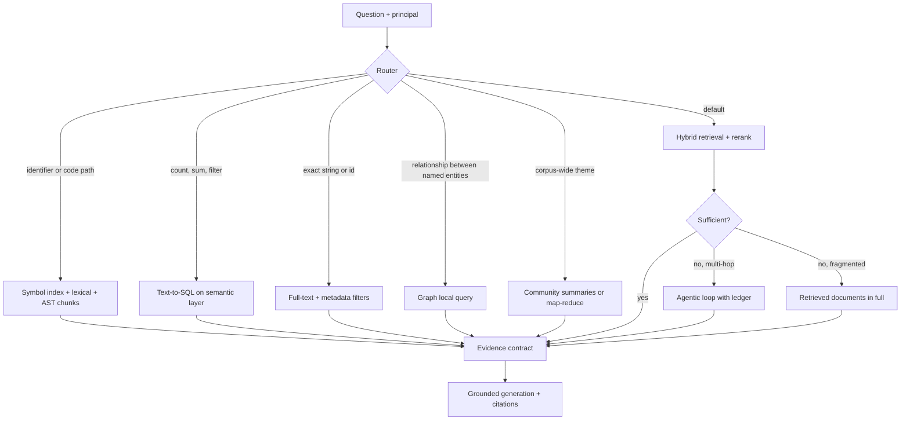
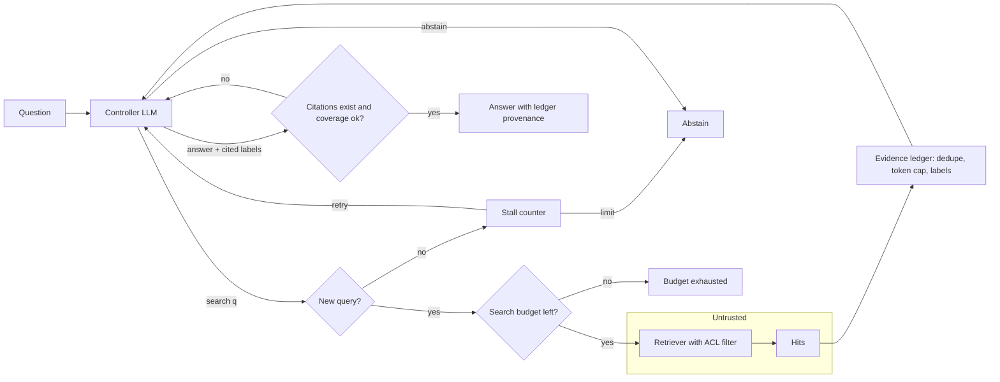
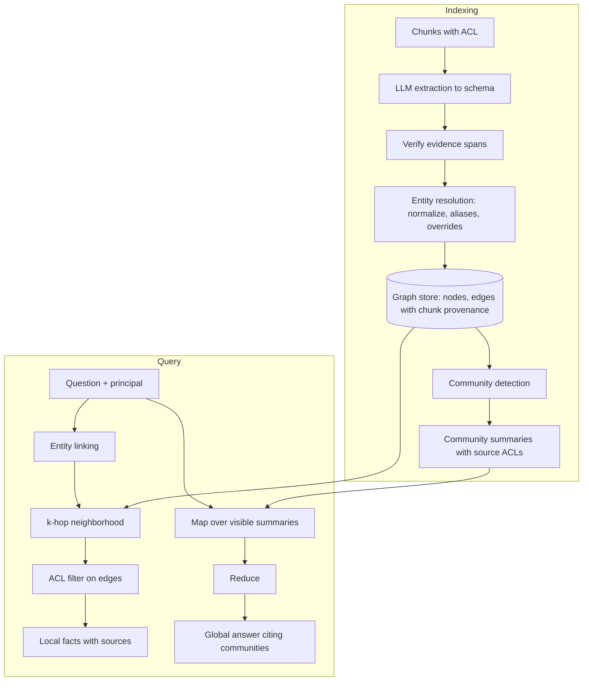
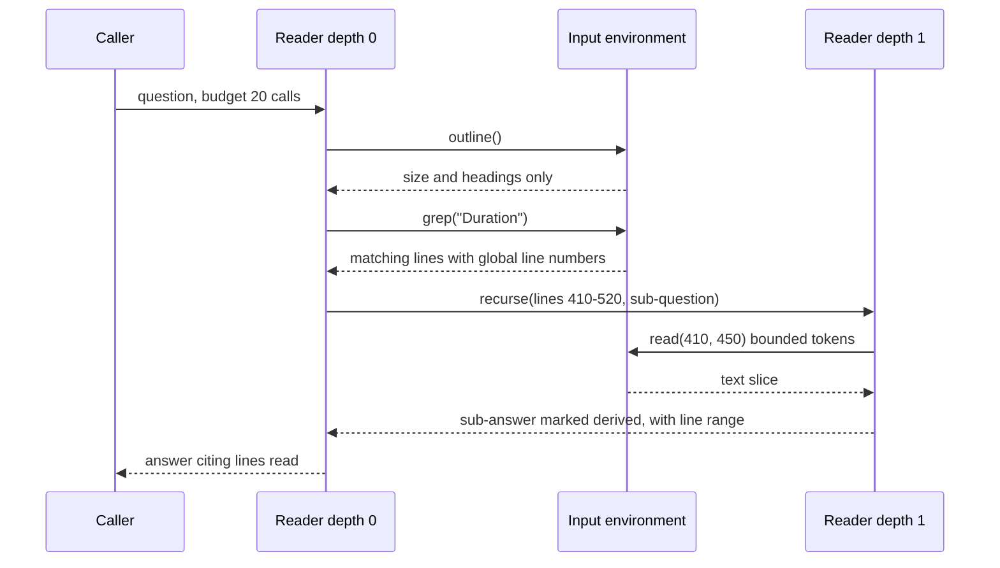

# Chapter 37 — Advanced Retrieval Patterns

A production RAG pipeline still fails on a few recognizable question classes: multi-hop, relational, structured, visual, whole-input, and code. This chapter teaches you to name the class from evaluation data and route only those questions to the cheapest pattern that fixes it, knowing what each pattern costs and how it fails.

**You will be able to:**
- Diagnose failing questions into classes and choose the cheapest pattern, or a baseline fix, for each.
- Build a bounded agentic retrieval loop with an evidence ledger, citation checks, and a sufficiency gate on the agent harness.
- Decide when a knowledge graph (GraphRAG) is worth its extraction, resolution, maintenance, and permission costs, and what to try before it.
- Choose vectorless routes (SQL, metadata filters, full text, table-of-contents navigation) for structured and exact questions.
- Compare late interaction, multimodal retrieval, long context, map-reduce, and recursive reading on cost, latency, and failure modes.
- Build symbol-first retrieval over code with AST-aware chunks.

**Prerequisites:** Chapters 10 to 15 (the RAG baseline, its evaluation, and ACL filtering), Chapter 19 (the agent loop and `AgentRuntime`). | **Code:** `book/projects/examples/ch37/` (run: `cd book/projects/examples/ch37 && pytest -q`) | **Builds:** offline examples of an agentic RAG loop, a miniature GraphRAG, a table-of-contents navigator, a MaxSim demo, a map-reduce summarizer and recursive reader, an AST code index, and a long-context cost calculator, all over the Northwind corpus.

**First reading:** Why this matters through Vectorless and structured retrieval; How it works; Architecture; Implementation through GraphRAG (skipping the Variant); Failure modes; Tradeoffs; Before you ship. **Deep dives** (skip on a first pass): Late interaction through Retrieval over code, the remaining Implementation subsections, Code walkthrough, Production considerations, Evaluation and testing.

## Why this matters

By the end of Part IV, Northwind Assist has a production RAG pipeline (Chapters 12 to 15) that answers most policy and runbook questions well. The remaining failures cluster into a few recognizable classes.

An on-call engineer asks why the November card-payment outage happened and how that certificate is renewed now. The incident report says the renewal process "is now documented in the Lumen POS Platform Overview", so the second retrieval's query is known only after the first. A manager asks which teams own open action items across all incident reports; no single chunk contains the answer. A finance analyst asks how many invoices from one vendor exceeded the approval threshold; embeddings cannot count. A support engineer pastes an error code, and dense retrieval ranks the one runbook containing that exact string tenth. A developer asking where retry delays are computed gets a chunk that starts mid-function.

Each failure has a pattern that fixes it, and each pattern has been oversold: teams adopt GraphRAG (retrieval over a knowledge graph extracted from the corpus) for single-hop questions, or agentic loops for what query decomposition (Chapter 12) solves deterministically. This chapter teaches diagnosis first: name the failure class from the evaluation set, pick the cheapest pattern that addresses it, and measure whether it did.

## Mental model

> **Mental model:** Every advanced retrieval pattern is a trade of build cost, query cost, and failure surface for coverage of a specific question class. Adopt one only when your evaluation set shows that class, and only as a route for those questions, not as a replacement for the baseline.

Picture a ladder whose bottom rung is the measured baseline from Chapters 12 to 15. Each rung above adds a mechanism: iteration (agentic RAG), explicit structure (graphs, tables of contents, SQL), richer representations (late interaction, multimodal), or a different relationship between corpus and context window (long context, recursion). Each rung costs latency, money, and new ways to be wrong, so a router keeps most questions on the bottom rung.

## Core concepts

### Diagnose before you escalate

Before reaching for any pattern, sort the failing questions from your evaluation set (Chapter 14) into classes, then try the cheaper alternative first.

| Question class | What it looks like | Pattern | Cheaper alternative first |
|---|---|---|---|
| Single-hop, evidence missed | the answer is in one place and retrieval missed it | none: fix the baseline | chunking and headers (Chapter 11), hybrid, learned sparse, reranking (Chapter 12) |
| Multi-hop | the next query depends on earlier evidence | agentic RAG | query decomposition (Chapter 12), following explicit links, a fixed workflow (Chapter 17) |
| Relational | a relationship chain across documents | GraphRAG local query | system of record, parser-built link graph |
| Corpus-wide or global | a property of the whole corpus ("which themes recur") | GraphRAG global query | hierarchical summaries, map-reduce over relevant documents |
| Structured or exact | counts, sums, filters, identifiers, error codes, dates | SQL, metadata, full text | metadata filters on the existing index |
| Fine-grained mismatch | the right passage's single embedding is dominated by other content | late interaction | smaller chunks, cross-encoder reranking |
| Non-text evidence | the answer is in an image, scan, chart, or table | multimodal embeddings | describe-then-index, table extraction |
| Whole-input | summarize or audit a large input end to end | map-reduce, recursive reader | long context if it fits and is used rarely |
| Code | questions about a repository | symbol index, AST chunks | plain text search and file reads |

The proportion of each class determines what to build. If multi-hop questions are an illustrative 3 percent of traffic, the design is a router that sends only those questions to an agentic loop.

### Agentic RAG: iterative retrieval under a budget

Agentic RAG hands retrieval to a model inside a loop. Each turn, the model reads the question and the evidence so far and chooses to search again, answer, or give up. It exists because the second query in the outage example ("PayBridge certificate renewal inventory") is derivable from the incident report, not from the question.

The mechanism is Chapter 19's agent loop specialized to one tool. The recommended build, `RuntimeAgenticRAG`, places a search tool, an evidence ledger, and a sufficiency gate on `AgentRuntime`, which supplies budgets, stops, the event log, and replay. A variant, `AgenticRAG`, is a **state-in-prompt controller** that rebuilds each turn's prompt from the ledger instead of a growing transcript; reach for it only when traces show late steps dominated by stale search results. Either way, four controls make the loop production-worthy:

**Budgets.** Maximum turns, searches, and evidence tokens. Each turn resends the growing evidence, so cost grows faster than linearly in steps (Chapter 19 owns the arithmetic). With an illustrative 300-token prompt and 600 tokens of new evidence per search, four turns send 300, 900, 1,500, and 2,100 input tokens: 4,800 in total, about five times a single-shot request of 940. A few round trips alone exceed Northwind's two-second time-to-first-token target.

**An evidence ledger.** An append-only record of every retrieved chunk with a stable label the model cites (E1, E2) and the query, step, and token count. It de-duplicates, enforces the token budget, and shows whether evidence was never found, found and ignored, or found and misread.

**A sufficiency check.** Models are optimistic about sufficiency, so a deterministic gate requires every citation to name an existing ledger label and the cited evidence to cover the question's key terms above a threshold. This chapter's crude term-overlap gate still rejects answering after a first plausible hit; stronger gates verify each cited claim with a groundedness judge (Chapter 13).

**Stall detection.** A repeated query, or two searches in a row that add no evidence, ends the loop.

Do not use the loop when the hop structure is known in advance (an incident question always needs the incident and its linked runbook, so fetch both in a workflow, Chapter 17) or when latency targets are tight.

### GraphRAG: entities, relations, and communities

For ownership and dependencies the answer is a path, not a passage. GraphRAG has an LLM read each chunk and extract entities (teams, systems, incidents, certificates) and relations (`PayBridge Adapter -authenticates_with-> PayBridge client certificate`), each with provenance. Entity resolution merges different names (surface forms) for the same thing. The graph is partitioned into communities, clusters of densely connected entities, each with an LLM-written summary.

A **local query** links the entities named in a question to nodes and retrieves their k-hop neighborhood (every node within k edges): "what does the PayBridge Adapter depend on". A **global query** asks every community summary and merges the relevant partial answers (a map-reduce): "what themes recur across incidents", which no chunk contains.

**Try cheaper structures first:**

- **Contextual chunk headers.** A chunk about "the adapter" that never names the PayBridge Adapter cannot be found by that name, graph or no graph. Chapter 11's breadcrumb headers put the name back.
- **Hierarchical summaries.** Index a summary per section and per document alongside the chunks, so a corpus-wide question retrieves a handful of summaries. No extraction, and each summary inherits exactly its document's ACL; explicit relations are lost.
- **Explicit links and systems of record.** Query an HR directory or configuration database directly. Every Northwind document ends with a "Related documents" list, and a parser-built link graph costs nothing and has no extraction errors.
- **Map-reduce over relevant documents.** Answers an occasional global question, paid per question instead of per build.

Extract a graph when relationships are implicit in prose, numerous, and central to real questions, and these options have measurably failed. Five costs keep it from being a default.

**Build cost.** One extraction call per chunk plus summaries. Northwind's corpus, about 155 chunks at Chapter 10's chunk size, is trivial; an illustrative 30,000 documents at 10 chunks each are 300,000 calls, about 450 million input and 120 million output tokens, paid again whenever the extraction prompt or model changes.

**Entity resolution** fails in two directions. A missed merge ("PayBridge certificate" and "PayBridge client certificate" as two nodes) splits evidence and costs recall. A false merge ("Retail Systems" the team with "retail systems" the category) produces confident wrong answers about both. Keep automatic rules conservative (normalization, declared aliases) and send similarity-based candidates to review.

**Error propagation.** An extraction error becomes an edge, then a summary, then an answer. Every edge keeps its chunk and a verbatim evidence span that code checks. That check catches fabrication but not misreading: this chapter's extractor turns "owned by a single engineer who had left Retail Systems" into `Retail Systems -owned-> PayBridge certificate`, with a verbatim span and a wrong relation. Only sampled human review measures misreading.

**Maintenance.** A document edit means deleting edges from its old chunks (Chapter 11's chunk diff lists them), re-extracting, and recomputing affected communities and summaries; show the build date in answers.

**Permissions.** Edges inherit their chunk's ACL, so local queries walk only readable edges; a hop through a restricted edge would reveal that the link exists. A summary mixes many chunks, so its reader must be allowed to see every source, or it leaks restricted facts in paraphrase. That hides many summaries; per-scope summaries multiply build cost.

### Vectorless and structured retrieval

Nothing in RAG requires embeddings. Vectorless retrieval uses the primitive that matches the data.

**SQL over structured data.** "How many SEV1 incidents did logistics have in 2026" is an aggregate that embeddings cannot compute. The pattern is text-to-SQL against a semantic layer (curated metric and table definitions) under a read-only role and a validator (Chapter 36 builds the guard).

**Metadata filters.** A filter on `updated_at > 2026-01-01` removes the stale HR FAQ that naive retrieval ranks above the current PTO policy.

**Full-text search.** Lexical search beats dense retrieval on identifiers, error codes, and exact phrases; `FullTextIndex` in `corpus.py` does it over SQLite FTS5 with ACL filters (Chapter 12 owns BM25). Keep this route on a plain lexical tokenizer, because a learned sparse model can split identifiers into fragments.

**Hierarchical (table-of-contents) navigation.** Long, well-structured documents (policies, manuals, contracts) have authored headings. Show the model a catalog of documents, then the chosen documents' headings with sizes, and let it open or read sections until it has read enough. Sections are read whole, and no index is needed beyond Chapter 11's parsed heading tree.

It fails when headings do not describe content. Asked "what is the PayBridge certificate renewal process?", this chapter's offline navigator goes to "Release process", because the answer sits under "Payments". Quality is bounded by heading quality; a one-line summary per section added at ingestion helps. Navigation is sequential and its catalog grows with the corpus, so it suits tens of long documents, not tens of thousands of short ones. Validate every id the model returns against what was offered; models invent plausible ids.

### Late interaction

> **Deep dive.** Token-level matching for passages whose single vector is diluted; skip on a first reading.

A single-vector embedding puts a multi-topic passage between its topics, so a query about one detail can sit closer to a passage about a neighboring topic. Late interaction, popularized by the ColBERT retrieval model, keeps one vector per token; query and passage are encoded separately and interact only at scoring time. Each query token finds its most similar document token, and the score is the sum of those maxima (MaxSim):

```text
score(q, d) = sum over query tokens i of  max over document tokens j of  q_i . d_j
```

Document token vectors are computed at indexing time, so unlike a cross-encoder reranker (Chapter 12), no model runs per query-document pair.

In `maxsim.py`, for "return window for my old laptop", mean-pooled vectors prefer a retail-returns passage over a laptop runbook passage that answers in its last sentence but is mostly about data migration (0.248 against 0.095 in the toy space). MaxSim reverses the order (3.75 against 2.40): "old" matched "previous", "window" matched "within".

The cost is storage. With illustrative numbers, a million 200-token passages take about 3.1 GB as 768-dimension 32-bit single vectors and about 51 GB as 128-dimension 16-bit token vectors before compression. Production systems compress token vectors and often rerank cheaper candidates with MaxSim. Use it when evaluation shows fine-grained mismatches that smaller chunks and a cross-encoder do not fix within latency.

### Multimodal documents

> **Deep dive.** Images, scans, charts, and tables as evidence; skip on a first reading.

Northwind has diagrams in runbooks, scanned invoices, charts in incident reports, and tables in policies. Most systems combine two approaches.

**Describe-then-index.** Convert each non-text element to text at ingestion: OCR for scans, a vision-model description prompted for retrievable content (components, labels, numbers) for images, and the source data for charts, whose descriptions lose the values. This reuses the whole text stack at low query cost; the price is a model call per element and errors invisible downstream, since a misread digit is faithfully repeated.

**Multimodal embeddings.** Image-text models place images and text in one space, so a text query retrieves images directly; a variant embeds whole page images with late interaction, retrieving scans without OCR. This avoids lossy conversion, at the cost of image tokens at answer time, domain-dependent quality (invoices are not photographs), and weak exact matching.

**Tables are data.** For filtering or aggregation ("which laptop models have 32 GB of RAM"), extract rows and use SQL; models misalign large serialized tables.

In any multimodal pipeline, keep provenance a reviewer can check (page and bounding box), evaluate perception and reasoning separately, and treat images as untrusted, since hidden instructions in screenshots ride OCR into the context (Chapter 26).

### Long context versus RAG, and the hybrids between them

> **Deep dive.** Cost and cache arithmetic for putting the corpus in the prompt; skip on a first reading.

Long context removes retrieval but pays for every corpus token on every request and is used unevenly by models (Chapters 5 and 10). The `long_context_cost.py` calculator, with illustrative prices and Northwind's shared corpus at about 22,600 tokens and 50,000 questions per month, gives:

| Strategy | Input tokens per question | Monthly cost, USD (illustrative) | Uncached prefill (illustrative) |
|---|---|---|---|
| Whole corpus in context | 22,940 | 3,629 | 4.6 s |
| Whole corpus, prompt-cached | 22,940 | 1,220 | 4.6 s cold |
| Retrieve 2 documents, send whole | 2,240 | 524 | 0.45 s |
| RAG, 4 chunks | 940 | 329 | 0.19 s |

Prompt caching (a discount for a repeated prompt prefix; Chapter 5) makes long context competitive for a small, stable corpus with one audience. Permissions break that: each scope needs its own prefix, and a cached prefix expires after a time-to-live. With twelve scopes and 20,000 questions a month, each scope sees a question roughly every 26 minutes; with an illustrative five-minute lifetime, every request misses the cache and pays the cache-write premium. Caching then costs more than not caching (about 1,795 a month against 1,451, illustrative), so compute cache economics per scope and traffic level.

A real knowledge base (an illustrative 45 million tokens) fits in no context window, so long context becomes a last step:

- **Retrieve documents, read them whole.** Send the top one to three retrieved documents in full. Chunk-boundary failures disappear and cost is bounded by document size; often the best default for coherent documents such as policies.
- **Parent expansion.** Retrieve small chunks and expand them to their parent sections (Chapter 11).
- **Escalation.** Retry with the retrieved documents in full when RAG fails (see How it works below).

Long context moves failures from the retriever to the model's attention; evaluate the choice on your questions.

### Recursive and long-input processing

> **Deep dive.** Map-reduce and recursive reading for inputs beyond the window; skip on a first reading.

To summarize a 300-page contract or audit a quarter of incident reports when the input exceeds the window, process it in pieces.

**Map-reduce.** Apply one prompt to each piece (map), then merge the partial results (reduce), level by level when they do not fit one call. Three details matter more than the prompts: estimate the calls before starting and refuse jobs that cannot finish; enforce the output cap in code, because a reduce whose output is as long as its input never converges; and carry the character spans each partial covers, so claims trace to their source.

The known weakness is loss of minority facts; query-focused map prompts reduce it. A sequential refine strategy (a running summary carried through the pieces) preserves narrative better but cannot run in parallel.

**The input as an environment.** Recursive language models, a young research approach, let the model inspect a long input through operations: outline, search, read a bounded range, or delegate a sub-question over a slice to a fresh call. This chapter's `RecursiveReader` answers "how long did INC-2025-1142 last" over the whole corpus in three calls (grep, read four lines, answer).

Recursion needs a depth limit and one call counter shared by all levels. Errors travel upward, because the parent treats an unverified sub-answer as evidence, so mark sub-answers as derived and carry their line ranges.

### Retrieval over code

> **Deep dive.** Symbol-first retrieval and AST chunks for repositories; skip on a first reading.

In code, identifiers are exact strings, meaning lives in definitions and calls, and fixed-size chunks cut functions in half, so coding agents (Chapter 38) use a different stack.

**Symbols and lexical search first.** "Where is `complete_structured` defined" and "who calls `_prepare`" have exact answers from a symbol index and an import graph. Plain text search and file reads are fast, always fresh, and effective because developers ask in identifiers. Identifier-aware tokenization (`RetryPolicy` becomes `retry`, `policy`) lets natural-language queries hit code names.

**AST-aware chunks.** Split along the abstract syntax tree (AST), the parsed structure of the code: one function or method per chunk, with its path, lines, the module's imports, and the enclosing class header, without which `self` means nothing.

**Dependency graphs.** The import graph answers blast-radius questions, and a call graph lists callers. This chapter's name-based resolution conflates `_prepare` in `structured.py` with `_prepare` in `CachedEmbeddings`; type-aware indexes (language servers) resolve the real target.

**Embeddings and freshness.** Dense retrieval helps vague questions ("where do we handle rate limits?") as a second, fused route. Update the index by file hash and re-read retrieved code from disk before editing.

## How it works

Put the patterns behind one retrieval interface and a router (Chapter 7), and each request takes the route for its class (first diagram below). If the baseline's generator abstains or the sufficiency check fails, the request escalates: to the agentic loop for multi-hop questions, or to the retrieved documents in full for fragmented evidence.

Every path returns the same contract to generation (Chapter 13): labeled evidence with provenance, ACL already applied, so citations and permission tests work whichever pattern ran. The trace records each request's route, escalation, and cost; otherwise a question misrouted to RAG instead of SQL looks like a generation failure.

## Architecture

The first diagram shows the routing decision.



The second diagram is the agentic loop. Retrieved text is untrusted data, escaped inside its wrapper so it cannot close it; the controller reads it, but code decides what counts as accepted evidence and when the loop stops.



The third diagram is GraphRAG's pipeline. Provenance flows from chunks into every edge and summary, enabling ACL filtering and error tracing.



The fourth diagram is the recursive reader: only bounded observations enter any context window, and the call budget is shared down the recursion.



## Implementation

The examples share `corpus.py`: section chunks of the Northwind documents, `Principal` with the book-wide ACL rule, and a TF-IDF `LexicalIndex` standing in for Chapter 12's hybrid retriever.

```text
book/projects/examples/ch37/
  corpus.py              Principal, section chunks, LexicalIndex, FullTextIndex (FTS5)
  agentic_rag.py         AgenticRAG, EvidenceLedger, Budget, scripted_controller
  agentic_rag_runtime.py RuntimeAgenticRAG: the same ledger and gate on agentkit's AgentRuntime
  graphrag.py            GraphRAG, EntityResolver, DictGraph / NetworkXGraph, fixtures
  toc_navigation.py      build_toc, TocNavigator, keyword_picker
  maxsim.py              token_vectors, maxsim, explain, index_bytes
  map_reduce.py          MapReduceSummarizer, InputEnvironment, RecursiveReader
  code_search.py         CodeIndex, split_identifier
  long_context_cost.py   Workload, Prices, estimate, compare
  tests/                 offline tests
  pyproject.toml, README.md, .env.example
```

| Variable | Default | Effect |
|---|---|---|
| `LLM_PROVIDER` | `fake` | `fake` uses each module's scripted controller; `openai` or `anthropic` use a real model via `aie_core` |
| `LLM_MODEL`, `LLM_BASE_URL` | `fake-model`, unset | model name and optional OpenAI-compatible endpoint |
| `OPENAI_API_KEY`, `ANTHROPIC_API_KEY` | unset | credentials |
| `TRACE_SINK` | `none` | `jsonl` or `otel` for spans (Chapter 31) |

```bash
uv pip install --python .venv/bin/python -e book/projects/aie_core -e book/projects/agentkit -e book/projects/ragkit
.venv/bin/python -m pytest book/projects/examples/ch37 -q
cd book/projects/examples/ch37 && ../../../../.venv/bin/python agentic_rag.py
```

### The agentic loop on the agent harness

`RuntimeAgenticRAG` owns only the retrieval-specific parts. The search tool rebuilds the ledger from the run's event log on every call, so the log is the only state and a replayed run sees exactly the original evidence. The gate is a Definition-of-Done verifier, so a premature answer is rejected through the usual `dod_rejected` path, and `INSUFFICIENT_EVIDENCE` is an accepted outcome. Turns map to `max_steps`, searches to `max_tool_calls`, and two searches without new evidence trip `NO_PROGRESS`.

```python
# path: book/projects/examples/ch37/agentic_rag_runtime.py (excerpt; full file on disk)
def ledger_from_events(events: list[Any], max_tokens: int) -> EvidenceLedger:
    """Rebuild the ledger by folding the search results recorded in the run's event log."""
    ledger = EvidenceLedger(max_tokens)
    for e in events:
        if isinstance(e, ToolResult) and e.tool == TOOL and e.ok and isinstance(e.data, dict):
            ledger.queries.append(normalize_query(e.data["query"]))
            ledger.entries.extend(LedgerEntry.model_validate(x) for x in e.data["entries"])
    return ledger


def search_tool(index: LexicalIndex, principal: Principal, store: EventStore, budget: Budget) -> FunctionTool:
    def search_evidence(ctx: ToolContext, query: str) -> ToolOutput:
        ledger = ledger_from_events(store.load(ctx.run_id), budget.max_evidence_tokens)
        if normalize_query(query) in ledger.queries:   # same terms in another order: no new search
            return ToolOutput(content="this query was already run; try a different angle or answer",
                              data={"query": query, "entries": []})
        hits = index.search(query, principal, k=budget.k, exclude=ledger.seen)   # ACL from the caller
        new = ledger.add(ctx.step, query, hits)
        body = "\n\n".join(wrap_untrusted(e) for e in new) or "no new evidence for this query"
        return ToolOutput(content=body, data={"query": query, "entries": [e.model_dump() for e in new]})
# ...


def sufficiency_gate(question: str, store: EventStore, run_id: str, budget: Budget) -> Check:
    """Definition-of-Done verifier: cited labels exist in the ledger and cover the question."""

    def fn(answer: str, state: Any) -> tuple[bool, str]:
        if answer.strip().startswith(ABSTAIN):
            return True, ""                            # abstaining is a valid, grounded outcome
        ledger = ledger_from_events(store.load(run_id), budget.max_evidence_tokens)
        labels = list(dict.fromkeys(CITE.findall(answer)))
        unknown = [label for label in labels if ledger.get(label) is None]
        cited = [e for label in labels if (e := ledger.get(label)) is not None]
        if unknown or not cited:
            return False, f"cite existing evidence labels such as [E1]; unknown labels: {unknown}"
        score, missing = coverage(question, cited)
        if score < budget.min_coverage:
            return False, f"cited evidence does not mention: {', '.join(missing)}; search for it or abstain"
        return True, ""

    return Check("evidence_sufficient", fn)


@dataclass
class RuntimeAgenticRAG:
    llm: LLMClient
    index: LexicalIndex
    budget: Budget = field(default_factory=Budget)
    store: EventStore = field(default_factory=InMemoryEventStore)

    def run(self, question: str, principal: Principal, *, run_id: str | None = None) -> tuple[RunResult, EvidenceLedger]:
        run_id = run_id or uuid.uuid4().hex[:12]
        b = self.budget
        runtime = AgentRuntime(
            self.llm, [search_tool(self.index, principal, self.store, b)], system_prompt=INSTRUCTIONS,
            budget=RunBudget(max_steps=b.max_steps, max_tool_calls=b.max_searches),
            dod=DefinitionOfDone(tool_was_called(TOOL), sufficiency_gate(question, self.store, run_id, b)),
            store=self.store, config=LoopConfig(max_identical_calls=1, max_no_progress_steps=2),
            principal={"user": principal.user})
        result = runtime.run(question, run_id=run_id)
        return result, ledger_from_events(self.store.load(run_id), b.max_evidence_tokens)
```

The ledger and the coverage signal live in `agentic_rag.py` and are shared by both loops. `add` skips chunks already seen and stops admitting evidence when the token budget is full.

```python
# path: book/projects/examples/ch37/agentic_rag.py (excerpt; full file on disk)
    def add(self, step: int, query: str, hits: list[Hit]) -> list[LedgerEntry]:
        self.queries.append(normalize_query(query))
        added: list[LedgerEntry] = []
        for h in hits:
            if h.chunk.id in self.seen:
                continue
            n = count_tokens(h.chunk.text)
            if self.tokens + n > self.max_tokens:
                self.dropped_for_budget += 1
                continue
            entry = LedgerEntry(
                label=f"E{len(self.entries) + 1}",
                step=step,
                query=query,
                chunk_id=h.chunk.id,
                doc_id=h.chunk.doc_id,
                section=h.chunk.context_header(),
                score=round(h.score, 3),
                tokens=n,
                text=h.chunk.text,
            )
            self.entries.append(entry)
            added.append(entry)
        return added
# ...
def coverage(question: str, entries: list[LedgerEntry]) -> tuple[float, list[str]]:
    """Deterministic sufficiency signal: which question terms appear in the cited evidence."""
    wanted = sorted(set(terms(question)))
    if not wanted:
        return 1.0, []
    have = set(terms(" ".join(e.section + " " + e.text for e in entries)))
    missing = [t for t in wanted if t not in have]
    return 1.0 - len(missing) / len(wanted), missing
```

### Variant: the state-in-prompt controller

> **Deep dive.** The same loop written by hand; skip on a first reading.

`AgenticRAG` writes the loop by hand so each turn's prompt can be rebuilt from the ledger; budgets, stall detection, and the gate become explicit branches in `run`:

```python
# path: book/projects/examples/ch37/agentic_rag.py (excerpt; full file on disk)
                if decision.action == "search":
                    if searches >= b.max_searches:
                        steps.append(StepRecord(step=step, action="search", query=decision.query, note="search budget exhausted"))
                        return finish("budget_exhausted", "max_searches")
                    if not decision.query.strip() or normalize_query(decision.query) in ledger.queries:
                        stalls += 1
                        steps.append(StepRecord(step=step, action="search", query=decision.query, note="repeated or empty query"))
                        feedback = "That query was already run or empty. Try a different angle or answer."
                        if stalls >= 2:
                            return finish("abstained", "stalled")
                        continue
                    hits = self.index.search(decision.query, principal, k=b.k, exclude=ledger.seen)
                    searches += 1
                    new = ledger.add(step, decision.query, hits)
                    steps.append(StepRecord(step=step, action="search", query=decision.query, new_labels=[e.label for e in new]))
                    stalls = stalls + 1 if not new else 0
                    if stalls >= 2:
                        return finish("abstained", "no_new_evidence")
                    continue

                if decision.action == "abstain":
                    steps.append(StepRecord(step=step, action="abstain", note=decision.missing))
                    return finish("abstained", "model_abstained")

                # answer: citations must exist, and the gate must agree that evidence suffices
                cited = [e for label in decision.cited if (e := ledger.get(label)) is not None]
                unknown = [label for label in decision.cited if ledger.get(label) is None]
                if unknown or not cited:
                    steps.append(StepRecord(step=step, action="answer", note=f"rejected: unknown or missing citations {unknown}"))
                    feedback = "Your answer cited labels that are not in the ledger or cited nothing. Cite existing labels."
                    continue
                score, missing = coverage(question, cited)
                if score < b.min_coverage:
                    steps.append(StepRecord(step=step, action="answer", note=f"rejected: coverage {score:.2f}, missing {missing}"))
                    if searches >= b.max_searches:   # no budget left to find the rest: abstain, do not wave it through
                        return finish("abstained", "insufficient_coverage")
                    feedback = f"Cited evidence does not mention: {', '.join(missing)}. Search for it or abstain."
                    continue
                steps.append(StepRecord(step=step, action="answer", note=f"accepted: coverage {score:.2f}"))
                span.set_attribute("agentic_rag.searches", searches)
                return finish("answered", "answered", decision.answer, cited)
```

When the search budget is spent and coverage is still short, the controller abstains rather than accept the answer.

### GraphRAG

Entity resolution applies explicit overrides first and reuses an existing id when the name or any declared alias is already known.

```python
# path: book/projects/examples/ch37/graphrag.py (excerpt; full file on disk)
class EntityResolver:
    """Maps surface names to canonical ids: normalization, then aliases, then manual overrides.

    Normalization is deliberately conservative. Merging two different things ("Retail Systems"
    the team and "retail systems" the category) corrupts every answer that touches them, while a
    missed merge only splits evidence; so automatic rules stay simple and overrides are explicit.
    """

    def __init__(self, overrides: dict[str, str] | None = None) -> None:
        self.overrides = {self.normalize(k): self.normalize(v) for k, v in (overrides or {}).items()}
        self.alias_to_id: dict[str, str] = {}
        self.display: dict[str, str] = {}

    @staticmethod
    def normalize(name: str) -> str:
        s = unicodedata.normalize("NFKC", name).casefold()
        s = re.sub(r"\([^)]*\)", " ", s)  # drop parentheticals: "Overview (prod-retail-pos-overview)"
        s = re.sub(r"[`'\"*]", "", s)
        s = re.sub(r"^the\s+", "", s.strip())
        return re.sub(r"\s+", " ", s).strip()

    def resolve(self, name: str, aliases: Iterable[str] = ()) -> str:
        keys = [self._key(s) for s in (name, *aliases)]
        # reuse an existing id if the name or any alias is already known, else mint one
        canonical = next((self.alias_to_id[k] for k in keys if k in self.alias_to_id), keys[0])
        for k in keys:
            self.alias_to_id.setdefault(k, canonical)
        self.display.setdefault(canonical, name.strip())
        return canonical

    def _key(self, surface: str) -> str:
        k = self.normalize(surface)
        return self.overrides.get(k, k)
```

Adding an extraction records provenance and ACL on every edge, verifies the evidence span, and counts relations whose endpoints were never declared as entities, a cheap signal of extraction quality.

```python
# path: book/projects/examples/ch37/graphrag.py (excerpt; full file on disk)
    def add_extraction(self, ex: Extraction, chunk: Chunk) -> None:
        self.chunks[chunk.id] = chunk
        declared: set[str] = set()
        for ent in ex.entities:
            nid = self.resolver.resolve(ent.name, ent.aliases)
            declared.add(nid)
            attrs = self.store.node(nid) if nid in self.store.nodes() else {}
            mentions = set(attrs.get("mentions", set())) | {chunk.id}
            self.store.add_node(nid, name=self.resolver.display[nid], type=ent.type, mentions=mentions)
        body = _squash(chunk.text)
        for rel in ex.relations:
            u, v = self.resolver.resolve(rel.source), self.resolver.resolve(rel.target)
            if u not in declared or v not in declared:
                self.stats.dangling_relations += 1
            verified = bool(rel.evidence) and _squash(rel.evidence) in body
            self.stats.unverified_relations += 0 if verified else 1
            for nid, surface in ((u, rel.source), (v, rel.target)):
                if nid not in self.store.nodes():
                    self.store.add_node(nid, name=surface, type="other", mentions={chunk.id})
            self.store.add_edge(
                u, v, relation=rel.relation, chunk_id=chunk.id, doc_id=chunk.doc_id,
                tenant=chunk.tenant, acl_groups=list(chunk.acl_groups), verified=verified,
            )
```

Community summaries carry the ACLs of all their sources; local queries link entities by name, expand k hops, and filter edges by the principal.

```python
# path: book/projects/examples/ch37/graphrag.py (excerpt; full file on disk)
class CommunitySummary(BaseModel):
    id: int
    members: list[str]
    text: str
    source_chunks: list[str]
    sources: list[tuple[str | None, list[str]]]  # (tenant, acl_groups) of every source chunk

    def visible_to(self, p: Principal) -> bool:
        """A summary mixes its sources, so a reader must be allowed to read all of them."""
        return all(p.can_read(t, g) for t, g in self.sources)

```

```python
# path: book/projects/examples/ch37/graphrag.py (excerpt; full file on disk)
    def match_entities(self, question: str, principal: Principal | None = None) -> list[str]:
        """Entity linking for the query: an entity matches when all its name terms occur in it.
        With a principal, only entities mentioned in at least one chunk the principal can read."""
        q = set(terms(question))
        out = []
        for nid in self.store.nodes():
            attrs = self.store.node(nid)
            name_terms = set(terms(attrs.get("name", nid)))
            if not name_terms or not name_terms <= q:
                continue
            if principal is not None and not any(
                    cid in self.chunks and principal.can_read_chunk(self.chunks[cid]) for cid in attrs.get("mentions", ())):
                continue
            out.append(nid)
        return out

    def local_query(self, question: str, principal: Principal, hops: int = 1, max_facts: int = 20) -> list[Fact]:
        """Facts in the k-hop neighborhood of entities named in the question, ACL-filtered."""
        # Walk only edges the principal can read: a hop through a restricted edge would reveal that
        # the restricted link exists, even if its own fact is filtered out at the end.
        readable = [(u, v, d) for u, v, d in self.store.edges() if principal.can_read(d["tenant"], d["acl_groups"])]
        adjacency: dict[str, set[str]] = {}
        for u, v, _ in readable:
            adjacency.setdefault(u, set()).add(v)
            adjacency.setdefault(v, set()).add(u)
        frontier = set(self.match_entities(question, principal))
        reached = set(frontier)
        for _ in range(hops):
            frontier = {m for n in frontier for m in adjacency.get(n, ())} - reached
            reached |= frontier
        facts = [self._fact(u, v, d, surface=True) for u, v, d in readable if u in reached and v in reached]
        facts.sort(key=lambda f: (not f.verified, f.source, f.relation, f.target))
        return facts[:max_facts]
```

### Table-of-contents navigation

> **Deep dive.** Building the outline and walking it under a budget; skip on a first reading.

The TOC is built from the heading blocks of ragkit's Markdown parser. A section runs to the next heading of the same or higher rank, so a parent's span contains its children.

```python
# path: book/projects/examples/ch37/toc_navigation.py (excerpt; full file on disk)
def build_toc(doc: Document) -> DocToc:
    headings = [b for b in doc.blocks if b.kind == "heading" and b.level]
    nodes: dict[str, TocNode] = {}
    stack: list[TocNode] = []
    roots: list[str] = []
    for i, h in enumerate(headings):
        # a section ends where the next heading of the same or higher rank begins
        end = next((n.char_start for n in headings[i + 1 :] if (n.level or 9) <= (h.level or 9)), len(doc.text))
        title = h.text.lstrip("#").strip()
        node = TocNode(
            id=f"{doc.id}#s{i}", doc_id=doc.id, title=title, level=h.level or 1, path=list(h.section_path),
            start=h.char_start, end=end, tokens=count_tokens(doc.text[h.char_start : end]),
        )
        while stack and stack[-1].level >= node.level:
            stack.pop()
        (stack[-1].children if stack else roots).append(node.id)
        nodes[node.id] = node
        stack.append(node)
    # a single H1 wrapping everything is not a useful choice: start from its children
    if len(roots) == 1 and nodes[roots[0]].children:
        roots = nodes[roots[0]].children
    return DocToc(doc_id=doc.id, title=doc.title, version=doc.version, updated_at=doc.updated_at, roots=roots, nodes=nodes)
```

Navigation filters the catalog by ACL before the model sees it, validates every returned id, drills into large sections, reads small ones whole, and records why it stopped in `stop_reason`.

```python
# path: book/projects/examples/ch37/toc_navigation.py (excerpt; full file on disk)
    def navigate(self, question: str, principal: Principal) -> NavResult:
        b = self.budget
        visible = {d.id for d in self.docs if principal.can_read_doc(d)}  # ACL before the model sees anything
        trace: list[NavStep] = []
        calls = 0

        catalog = "\n".join(
            f"[{t.doc_id}] {t.title} (v{t.version}, updated {t.updated_at}) :: "
            + "; ".join(t.nodes[r].title for r in t.roots[:6])
            for t in (self.tocs[i] for i in sorted(visible))
        )
        pick = self._ask("catalog", question, "Documents:\n" + catalog, b.max_docs)
        calls += 1
        chosen = [i for i in pick.ids if i in visible][: b.max_docs]
        trace.append(NavStep(stage="catalog", offered=sorted(visible), picked=chosen, rejected=[i for i in pick.ids if i not in visible], reason=pick.reason))

        frontier = [nid for d in chosen for nid in self.tocs[d].roots]
        sections: list[ReadSection] = []
        read_tokens = 0
        stop = "frontier_empty"
        for _ in range(b.max_rounds):
            if not frontier:
                stop = "frontier_empty"
                break
            listing = "\n".join(self._line(nid) for nid in frontier)
            pick = self._ask("toc", question, "Sections:\n" + listing, 2)
            calls += 1
            # unique, still on the frontier, and at most the two the prompt asked for
            picked = list(dict.fromkeys(i for i in pick.ids if i in frontier))[:2]
            trace.append(NavStep(stage="toc", offered=list(frontier), picked=picked, rejected=[i for i in pick.ids if i not in frontier], reason=pick.reason))
            if not picked:
                stop = "nothing_relevant"
                break
            next_frontier: list[str] = []
            for nid in picked:
                node = self._node(nid)
                if node.children and node.tokens > b.leaf_tokens:
                    next_frontier.extend(node.children)  # drill down
                    continue
                if len(sections) >= b.max_reads or read_tokens + node.tokens > b.max_read_tokens:
                    stop = "read_budget"
                    continue
                text = self.by_id[node.doc_id].text[node.start : node.end]
                sections.append(ReadSection(node_id=nid, doc_id=node.doc_id, path=node.path, text=text, tokens=node.tokens))
                read_tokens += node.tokens
            if stop == "read_budget":
                break
            frontier = next_frontier
            if not frontier and sections:
                stop = "read_complete"
                break
        else:
            stop = "max_rounds"
        return NavResult(sections=sections, trace=trace, llm_calls=calls, stop_reason=stop)
```

### MaxSim

> **Deep dive.** The late-interaction score in code; skip on a first reading.

The score is one matrix product and a row-wise maximum. The toy token vectors share a direction per concept so that synonyms align.

```python
# path: book/projects/examples/ch37/maxsim.py (excerpt; full file on disk)
def token_vectors(text: str) -> tuple[list[str], np.ndarray]:
    """One unit vector per content token: concept direction plus token-specific noise."""
    toks = terms(text)
    if not toks:
        return [], np.zeros((0, DIM))
    rows = [_unit(_unit(_seeded("concept:" + CONCEPTS.get(t, t))) + NOISE * _unit(_seeded("token:" + t))) for t in toks]
    return toks, np.vstack(rows)


def pooled_vector(text: str) -> np.ndarray:
    """The single-vector baseline: mean-pool the token vectors, then normalize."""
    _, m = token_vectors(text)
    return _unit(m.mean(axis=0))


def single_vector_score(query: str, doc: str) -> float:
    return float(pooled_vector(query) @ pooled_vector(doc))


def maxsim(q: np.ndarray, d: np.ndarray) -> float:
    """sum over query tokens of the best cosine against any document token."""
    if q.size == 0 or d.size == 0:
        return 0.0
    return float((q @ d.T).max(axis=1).sum())


def maxsim_score(query: str, doc: str) -> float:
    return maxsim(token_vectors(query)[1], token_vectors(doc)[1])


def explain(query: str, doc: str) -> list[tuple[str, str, float]]:
    """For each query token: the document token it aligned with and the similarity. This is the
    interpretability bonus of late interaction: you can see which words matched."""
    qt, q = token_vectors(query)
    dt, d = token_vectors(doc)
    sims = q @ d.T
    return [(qt[i], dt[int(sims[i].argmax())], round(float(sims[i].max()), 3)) for i in range(len(qt))]

```

### Map-reduce and the recursive reader

> **Deep dive.** Budgeted summarization and the recursive reader in code; skip on a first reading.

The summarizer estimates its calls before starting, truncates every output in code, and forces pairwise merges when no group can hold two partials, which guarantees progress.

```python
# path: book/projects/examples/ch37/map_reduce.py (excerpt; full file on disk)
    def estimate_calls(self, n_pieces: int) -> int:
        """Map calls plus reduce calls for a tree whose fan-in is how many full-size summaries fit one
        reduce. Conservative: real summaries are usually shorter, so real runs need fewer calls."""
        fan_in = max(2, self.budget.reduce_input_tokens // self.budget.summary_tokens)
        total, level = n_pieces, n_pieces
        while level > 1:
            level = math.ceil(level / fan_in)
            total += level
        return total

    def _call(self, task: str, instruction: str, body: str) -> str:
        if self.calls >= self.budget.max_llm_calls:
            raise BudgetExceeded(f"max_llm_calls={self.budget.max_llm_calls} reached")
        req = CompletionRequest(
            messages=[Message.system(instruction), Message.user(f"<untrusted_data>\n{body}\n</untrusted_data>")],
            max_tokens=self.budget.summary_tokens,
            metadata={"task": task},
        )
        self.calls += 1
        self.input_tokens += count_tokens(body)
        out = self.llm.complete(req).text.strip()
        # trust but verify the output budget: a reduce that grows its input never terminates
        return _truncate_tokens(out, self.budget.summary_tokens)

    def run(self, text: str, focus: str = "Summarize the key facts, decisions, numbers, and owners.") -> MapReduceResult:
        b = self.budget
        pieces = split_pieces(text, b.piece_tokens)
        estimate = self.estimate_calls(len(pieces))
        if estimate > b.max_llm_calls:
            raise BudgetExceeded(f"estimated {estimate} calls for {len(pieces)} pieces > budget {b.max_llm_calls}")

        partials = [
            Partial(text=self._call("map", f"{focus} Be concise; keep identifiers exact.", body), spans=[(s, e)], level=0)
            for s, e, body in pieces
        ]
        levels = [len(partials)]
        while len(partials) > 1:
            if len(levels) > b.max_levels:
                raise BudgetExceeded(f"more than {b.max_levels} reduce levels")
            groups: list[list[Partial]] = [[]]
            for p in partials:
                group_tokens = sum(count_tokens(x.text) for x in groups[-1])
                if groups[-1] and group_tokens + count_tokens(p.text) > b.reduce_input_tokens:
                    groups.append([])
                groups[-1].append(p)
            if len(groups) == len(partials):  # no group could take two: force pairs to guarantee progress
                groups = [partials[i : i + 2] for i in range(0, len(partials), 2)]
            partials = [
                Partial(
                    text=self._call("reduce", f"Merge these partial summaries. {focus} Do not add facts.",
                                    "\n\n".join(f"[part {i}] {p.text}" for i, p in enumerate(g))),
                    spans=[s for p in g for s in p.spans],
                    level=len(levels),
                )
                for g in groups
            ]
            levels.append(len(partials))
        final = partials[0]
        return MapReduceResult(summary=final.text, spans=final.spans, levels=levels, llm_calls=self.calls, input_tokens=self.input_tokens)
```

The recursive reader takes one structured action per turn, refuses recursion at the depth limit, and shares one call counter across levels.

```python
# path: book/projects/examples/ch37/map_reduce.py (excerpt; full file on disk)
class RecursiveReader:
    def __init__(self, llm: LLMClient, max_depth: int = 2, max_steps: int = 6, max_llm_calls: int = 20) -> None:
        self.llm = llm
        self.max_depth = max_depth
        self.max_steps = max_steps
        self.max_llm_calls = max_llm_calls
        self.calls = 0

    def answer(self, question: str, env: InputEnvironment) -> RecursiveAnswer:
        self.calls = 0  # budget is per top-level question, shared by all sub-readers
        return self._answer(question, env, depth=0)

    def _answer(self, question: str, env: InputEnvironment, depth: int) -> RecursiveAnswer:
        observations: list[str] = []
        trace: list[str] = []
        for _ in range(self.max_steps):
            if self.calls >= self.max_llm_calls:
                return RecursiveAnswer(answer="INSUFFICIENT_EVIDENCE", status="budget_exhausted", depth=depth, trace=trace)
            req = CompletionRequest(
                messages=[
                    Message.system(READER_SYSTEM),
                    Message.user(
                        f"Question: {question}\nDepth {depth}/{self.max_depth}. Calls left: {self.max_llm_calls - self.calls}.\n"
                        f"Input outline:\n{env.outline()}\n\nObservations so far:\n"
                        + ("\n".join(observations[-6:]) or "(none)")
                    ),
                ],
                max_tokens=300,
                metadata={"task": "reader.act", "depth": depth},
            )
            act, _ = complete_structured(self.llm, req, EnvAction, max_repair_attempts=1)
            self.calls += 1
            where = f" {act.start}-{act.end}" if act.action in ("read", "recurse") else ""
            trace.append(f"d{depth} {act.action}{where} {act.pattern or act.question}".rstrip())
            if act.action == "answer":
                return RecursiveAnswer(answer=act.answer, status="answered", depth=depth, trace=trace)
            if act.action == "grep":
                hits = env.grep(act.pattern)
                observations.append(f"grep {act.pattern!r}: " + ("; ".join(hits) or "no matches"))
            elif act.action == "read":
                observations.append(f"read {act.start}-{act.end}:\n{env.read(act.start, act.end)}")
            elif act.action == "recurse":
                if depth >= self.max_depth:
                    observations.append("recurse refused: depth limit; use grep/read or answer")
                    trace.append(f"d{depth} depth_limited")
                    continue
                sub = self._answer(act.question, env.slice(act.start, act.end), depth + 1)
                trace.extend(sub.trace)
                observations.append(f"sub-answer for {act.question!r} over {act.start}-{act.end} [{sub.status}]: {sub.answer}")
        return RecursiveAnswer(answer="INSUFFICIENT_EVIDENCE", status="budget_exhausted", depth=depth, trace=trace)
```

### Code search

> **Deep dive.** Identifier splitting, symbol queries, and AST chunks in code; skip on a first reading.

Identifier splitting makes natural-language queries meet code names; symbol queries and AST chunks are short because the syntax tree already did the work.

```python
# path: book/projects/examples/ch37/code_search.py (excerpt; full file on disk)
def split_identifier(name: str) -> list[str]:
    """complete_structured -> [complete, structured]; RetryPolicy -> [retry, policy]; HTTPError -> [http, error]."""
    words: list[str] = []
    for part in re.split(r"[^A-Za-z0-9]+", name):
        words += re.findall(r"[A-Z]+(?=[A-Z][a-z])|[A-Z]?[a-z]+|[A-Z]+|\d+", part)
    return [w.lower() for w in words if w and w.lower() not in STOP]

```

```python
# path: book/projects/examples/ch37/code_search.py (excerpt; full file on disk)
    def find_definition(self, name: str) -> list[Symbol]:
        """By bare name ('complete') or qualified suffix ('ModelGateway.complete')."""
        if "." in name:
            return [s for q, s in self.symbols.items() if q.endswith("." + name)]
        return [self.symbols[q] for q in self.by_name.get(name, [])]

    def callers(self, name: str) -> list[Symbol]:
        """Name-based: fast and dependency-free, but it conflates different functions that share a
        name. A type-aware index (a language server, SCIP, or a compiler) resolves the real target."""
        return sorted(
            (s for s in self.symbols.values() if s.kind != "class" and name in s.calls and s.name != name),
            key=lambda s: s.qualname,
        )

    def dependents(self, module: str) -> list[str]:
        """Modules that import `module` or a name from it: the blast radius of changing it."""
        return sorted(m for m, targets in self.imports.items() if any(t == module or t.startswith(module + ".") for t in targets) and m != module)

    def dependencies(self, module: str) -> list[str]:
        mods = set()
        for t in self.imports.get(module, set()):
            if t in self.sources:  # a module
                mods.add(t)
            elif t.rpartition(".")[0] in self.sources and t.rpartition(".")[0] not in self.imports[module]:
                mods.add(t.rpartition(".")[0])  # a name imported from a module not listed itself
        return sorted(mods - {module})
```

```python
# path: book/projects/examples/ch37/code_search.py (excerpt; full file on disk)
    def chunk(self, sym: Symbol) -> str:
        """Symbol source plus the context needed to read it: path, imports, enclosing class header."""
        lines = self.sources[sym.module]
        parts = [f"# {sym.module} ({sym.path.name}:{sym.lineno}-{sym.end_lineno})"]
        parts += self.module_imports_src.get(sym.module, [])
        if sym.parent:
            cls = self.symbols[sym.parent]
            header = [cls.signature + ":"] + ([f'    """{cls.doc}"""'] if cls.doc else []) + ["    ..."]
            parts += [""] + header
        parts += [""] + lines[sym.lineno - 1 : sym.end_lineno]
        return "\n".join(parts)
```

### Long-context cost

> **Deep dive.** The calculator behind the long-context table; skip on a first reading.

With caching on, each permission scope rewrites its prefix once per cache lifetime, so writes scale with scopes rather than with questions.

```python
# path: book/projects/examples/ch37/long_context_cost.py (excerpt; full file on disk)
def estimate(strategy: Strategy, w: Workload, p: Prices, cache: bool = False, cache_ttl_minutes: int = 5) -> Estimate:
    fixed = w.system_tokens + w.question_tokens
    docs = {"long_context": w.corpus_tokens, "rag": w.rag_context_tokens, "hybrid": w.hybrid_docs * w.avg_doc_tokens}[strategy]
    per_query_in = fixed + docs
    out_cost = w.queries_per_month * w.answer_tokens * p.output / 1e6

    if cache and strategy == "long_context":
        prefix = w.system_tokens + w.corpus_tokens  # identical across requests within one scope
        # with steady traffic, each scope's prefix is rewritten once per TTL window
        writes = min(w.queries_per_month, w.permission_scopes * MINUTES_PER_MONTH // cache_ttl_minutes)
        hits = w.queries_per_month - writes
        in_cost = (
            writes * prefix * p.cache_write
            + hits * prefix * p.cached_input
            + w.queries_per_month * w.question_tokens * p.input
        ) / 1e6
    else:
        in_cost = w.queries_per_month * per_query_in * p.input / 1e6

    return Estimate(
        strategy=strategy,
        cached=cache,
        input_tokens_per_query=per_query_in,
        monthly_usd=round(in_cost + out_cost, 2),
        prefill_s=round(per_query_in / p.prefill_tokens_per_s, 3),
        fits_window=docs + fixed + w.answer_tokens <= w.context_window * w.headroom if strategy == "long_context" else True,
    )
```

## Code walkthrough

> **Deep dive.** What the offline runs and tests show for each pattern; skip on a first reading.

**Agentic RAG on the harness.** In `test_agentic_runtime.py` the multi-hop run answers after two searches and replays identically; a premature answer produces one `dod_rejected` note naming the missing terms; a repeated query ends with `REPEATED_ACTION`, a harness stop rather than chapter code.

**The controller variant.** `agentic_rag.py` answers the outage question in two searches and three model calls; the second search finds the POS overview's Payments section, and the gate accepts at coverage 0.75.

**GraphRAG.** Five fixture chunks produce 15 entities and 16 relations, one flagged unverified (its span is not in the text), and two communities. For an ordinary employee, a local query on the PayBridge Adapter returns only POS overview facts, and both summaries are hidden because each mixes in a restricted source.

**TOC navigation.** For the carryover question the navigator reads "3. Carryover" of the PTO policy whole: two calls, 146 tokens, no index.

**Map-reduce.** The corpus splits into 28 pieces and reduces through levels of 4, 2, and 1 for 35 calls; the preflight estimate of 45 is conservative because it assumes every summary fills its cap.

**Code search.** Over 224 symbols in `aie_core`, "retry backoff jitter" ranks `RetryPolicy.delay_for` first.

## Production considerations

> **Deep dive.** Latency, cost, security, and operations per route, beyond the checklist in Before you ship; skip on a first reading.

**Latency.** Agentic loops, TOC navigation, and recursive readers are sequential calls of an illustrative one to two seconds each; parallelize independent sub-queries and stream progress. GraphRAG local queries move cost to ingestion; global queries make one call per community.

**Cost.** Track cost per route. A graph build's dry-run estimate is chunks times tokens times price; agentic loops have heavy-tailed costs.

**Security.** Every route applies the same ACL rule before evidence reaches a model: retrievers filter chunks, graphs filter edges, navigators filter catalogs, SQL runs under a tenant-scoped read-only role. Derived artifacts (summaries, image descriptions, map-reduce partials) inherit the most restrictive ACL of their sources, or their input is filtered first, as `corpus_as_one_text(principal)` does for map-reduce. Forgetting this is the most common leak in advanced retrieval.

**Operations.** Each pattern adds an index that must track its sources; reuse Chapter 15's chunk diffs and versioned builds. Log route decisions, budget stops, gate rejections, and unverified edges as structured events.

## Common mistakes

- Adopting GraphRAG or an agentic loop without an evaluation slice that shows the class it fixes, or running it on every request.
- Letting the model decide when to stop, with no code-enforced budget.
- Asking a model to count or filter rows that SQL answers exactly.
- Describing charts in prose and discarding the numbers.
- Trusting ids, labels, or line numbers a model returns without validating them.

## Failure modes

**Premature sufficiency (agentic RAG).** The controller answers after the first plausible hit. Telemetry: one-search answers with low coverage; groundedness failures on the multi-hop slice. Test: script an answer after an irrelevant search; the gate must reject it.

**Query drift and stalls (agentic RAG).** Queries wander or rephrase the same idea. Telemetry: repeated normalized queries, searches adding no ledger entries. Test: a repetitive controller must end `stalled`, not time out.

**Extraction errors (GraphRAG).** Fabricated and misread edges. Telemetry: unverified-edge and dangling-relation rates per build; sampled human review. Test: a fabricated span must be flagged; a misread verbatim span documents the limit of automatic checks.

**Fragmentation and false merges (GraphRAG).** Usually from merging on embedding similarity without review. Telemetry: near-duplicate node names; degree spikes on one node after a build. Test: resolver cases for known variants and non-merges.

**Derived-artifact leakage.** A summary paraphrases restricted facts to users who cannot read the sources. Quality metrics never show it; only a permission test does (zero restricted-source summaries for a principal without access).

**Heading mismatch (TOC navigation).** Navigation confidently reads the wrong section. Telemetry: low overlap between sections read and the answer's claims. Test: a question whose answer sits under an uninformative heading.

**Pooling dilution and perception errors.** The right passage loses to a topical neighbor (gold passages stuck at ranks 5 to 20 in long multi-topic chunks), or the answer repeats wrong OCR text (low OCR confidence on cited pages). Tests: the MaxSim pair as a regression case; extraction evaluated on labeled scans.

**Detail loss and runaway reduce (map-reduce).** Minority facts vanish, or a level fails to shrink because a call ignored its output length. Telemetry: per-level token totals that do not decrease; planted needle facts missing. Test: assert truncation against a verbose model.

**Budget escape in recursion.** Sub-readers count only their own calls. Telemetry: calls per question above the limit. Test: an always-recursing reader must stop at the global budget.

## Tradeoffs

Each pattern's question class is in the diagnose table above.

| Pattern | Build cost | Query cost and latency | Main failure | Prefer instead when |
|---|---|---|---|---|
| Agentic RAG | none beyond baseline | high, sequential calls | premature stop, drift | hop structure is fixed: workflow or decomposition |
| GraphRAG local | very high, extraction per chunk | low to moderate | extraction and resolution errors | relationships exist in a system of record or explicit links |
| GraphRAG global | very high plus summaries | moderate, map over summaries | stale or leaky summaries | occasional question: map-reduce; recurring: hierarchical summaries |
| Hierarchical summaries | one call per section or document | low | implicit relations, stale summaries | relations central to questions: graph |
| SQL and metadata | schema and semantic layer | low | wrong SQL, wrong join | data is prose without structure |
| Full-text | low | low | vocabulary mismatch | paraphrased questions: hybrid |
| TOC navigation | very low | moderate, sequential | uninformative headings | many short docs: standard retrieval |
| Late interaction | high storage | moderate | index size, serving complexity | reranker already fixes it |
| Describe-then-index | per-element model call | low | invisible perception errors | layout-heavy pages: page-image retrieval |
| Multimodal embeddings | moderate | image tokens at answer time | weak exact matching | text dominates: describe-then-index |
| Long context | none | high per request | attention gaps, cache misses | corpus large or permissioned |
| Map-reduce | none | many calls, parallel | detail loss | focused question: recursive reader or retrieval |
| Recursive reader | none | few calls, sequential | error propagation via sub-answers | input is indexable: just index it |
| Symbol-first code search | low, incremental | low | stale index, name collisions | vague questions: add dense route |

## Evaluation and testing

> **Deep dive.** Per-pattern metrics; skip on a first reading.

Tag the gold set (Chapter 14) by class and report metrics per class and per route, so each pattern is shown to help its class without hurting the others.

**Agentic RAG.** Evidence recall at loop end, searches per question, budget-stop and gate-rejection rates, groundedness. On the multi-hop slice it must beat fixed decomposition by enough to pay for its latency. Scripted controllers test control logic; replayed traces test real models (Chapter 19).

**GraphRAG.** Extraction and resolution precision and recall on hand-labeled data, and answer quality on relational and global questions against baseline RAG and map-reduce, judged pairwise (Chapter 24). Build cost is a first-class metric.

**Vectorless routes.** SQL by execution accuracy, not string match; navigation by whether the sections read contain the gold span, and by calls per question.

**The rest.** Late interaction by recall at k on the slices where single vectors fail, plus index size. Multimodal by perception metrics apart from answers. Long context by running the same questions through RAG, retrieve-then-read-whole, and full context: the calculator gives cost, only the experiment gives accuracy. Map-reduce by needle retention; code by recall at k on symbol questions and index freshness.

## Before you ship

- [ ] The gold set is tagged by question class, and each advanced route has a slice result showing it beats both the baseline and the cheaper alternative on its class without regressing the other classes.
- [ ] The router sends only the targeted classes to each route; the route, any escalation, and the cost are recorded on every trace.
- [ ] Every route enforces call, token, and wall-clock budgets in code; graph builds and map-reduce jobs run a dry-run estimate and refuse to start above their ceiling.
- [ ] The agentic route sets `max_steps`, `max_tool_calls`, identical-call and no-progress limits, and its scripted premature, repetitive, and over-searching controller tests pass.
- [ ] The sufficiency gate rejects unknown citation labels and answers below `min_coverage`, and abstention is an accepted, measured outcome.
- [ ] A permission-matrix test in CI covers every route: no chunk, edge, summary, section, partial, or image description from a forbidden source reaches the model, and derived artifacts carry their sources' ACLs.
- [ ] Every id a model returns (ledger label, TOC node, line range, entity) is validated against what was offered before it is used.
- [ ] GraphRAG builds report unverified-edge and dangling-relation rates under an agreed threshold, a sampled human review of extractions exists, resolver tests cover known non-merges, and answers show the build date.
- [ ] Map-reduce truncates every output in code, per-level token totals shrink in a regression test, and a planted-needle fact survives.
- [ ] The long-context route's cache hit rate is monitored per permission scope, and its cost was computed per scope at real traffic levels.
- [ ] Multimodal ingestion has perception metrics (character error rate, table cell accuracy) on labeled samples, separate from answer metrics.
- [ ] Alerts exist on p99 searches per question, budget-exhaustion rate, and gate-rejection rate per route, and the code index lags the repository by no more than one incremental update.

## Exercises

**Start here:** K1, K3, E1, P3, D1 (about 3 hours). The rest go deeper.

### Knowledge questions

**K1.** Why does an agentic RAG loop's input-token cost grow faster than linearly with the number of steps, and which two mechanisms in this chapter's code bound it?

**K2.** Explain the difference between a GraphRAG local query and a global query, and give one Northwind question suited to each.

**K3.** Why is a false entity merge usually worse than a missed one?

**K4.** What does MaxSim compute, and why is late interaction cheaper at query time than a cross-encoder while being more expensive to store than single vectors?

**K5.** Give three reasons a whole-corpus prompt with prompt caching can cost more than the same prompt without caching.

**K6.** In the recursive reader, why must the call budget be shared across recursion levels rather than set per reader?

### Engineering questions

**E1.** Northwind's evaluation set has 400 questions: 340 single-hop, 28 multi-hop where the second hop always follows a "Related documents" link, 20 aggregates over tickets, and 12 corpus-wide questions about incidents. Propose a retrieval architecture, state which patterns you would not build and why, and give the metrics you would use to decide whether to revisit.

**E2.** Design the maintenance process for a GraphRAG index when a document is edited: which artifacts are invalidated, in what order they are rebuilt, what the answer metadata shows in the meantime, and how ACL changes on a document are handled.

**E3.** A legal team wants to ask questions about one 400-page contract at a time, with about 60 questions per contract over two weeks, and contracts are visible only to the deal team. Compare long context with caching, retrieve-then-read-whole, and TOC navigation for this workload, and recommend one.

**E4.** You are adding scanned supplier invoices with embedded tables to Northwind Assist. Design the ingestion and query path, including how table questions ("total of line items over 500 USD") are answered, what provenance is stored, and how you would evaluate perception separately from answers.

### Practical exercises

**P1.** (about 2 hours) Extend `AgenticRAG` so the controller can emit up to three search queries in one turn, executed in parallel, while the search budget counts each query. Add tests that the budget is respected and that the ledger records which query produced each entry.

**P2.** (about 2 hours) Replace the term-overlap sufficiency gate with a pluggable `SufficiencyJudge` protocol and implement an LLM judge that returns, per question term or sub-question, whether cited evidence supports it, using `complete_structured`. Keep the deterministic gate as the default and test both with fakes.

**P3.** (about 90 min) Build a link graph for the Northwind corpus from the "Related documents" sections, without any LLM, and add a `follow_links` step to the agentic loop or a deterministic workflow. Measure on the outage question how many model calls it saves compared with the agentic version.

**P4.** (about 90 min) Add per-section one-line summaries to `build_toc` (generated by an LLM at ingestion, cached by section content hash) and show them in the navigator's listing. Write a test showing that the renewal-process question now reaches the Payments section with a scripted picker that scores summaries as well as titles.

### Debugging exercises

**D1.** After enabling GraphRAG global search, a regional manager in the logistics tenant receives an answer that mentions the retail card-payment outage and its root cause. Local queries for the same user never show retail incident facts. Where is the leak, what telemetry or test would have caught it, and what is the fix?

**D2.** The agentic route's p95 latency doubled after a model upgrade, while answer quality was unchanged. Traces show the median search count went from 2 to 4, many steps carry the note "rejected: coverage", and a growing share of runs end with `stop_reason=no_new_evidence`. The new model's accepted answers cite one or two labels where the old one cited four or five. What is the likely cause, and how do you confirm and fix it?

**D3.** Another team copied the chapter's summarizer but removed the code-side truncation of model output because it "cut sentences mid-way". After they switched models, their nightly incident-summary job began failing with `BudgetExceeded: more than 5 reduce levels`, although the number of input pieces did not change. The per-level partial counts in the logs read 31, 24, 19, 15, 12, 10. Diagnose the failure and name the fix and the metric that would have warned them.

## Key takeaways

- Diagnose the failing question class from the evaluation set before choosing a pattern; most failures are fixed on the baseline rung.
- Route the minority of questions that need an advanced pattern to it, and make escalation explicit.
- Agentic RAG needs code-enforced budgets, an evidence ledger with provenance, citation validation, and a sufficiency gate; the model only proposes the next action.
- GraphRAG pays off when relationships are implicit, numerous, and central; its costs are extraction at scale, entity resolution, error propagation, maintenance, and summary ACLs.
- Retrieval does not require vectors: SQL, metadata, full text, and TOC navigation win for structured, exact, and well-structured long-document questions.
- Late interaction buys token-level matching with storage; multimodal content needs describe-then-index or multimodal embeddings, tables handled as data, and perception evaluated separately.
- Long context is a cost and cache decision per permission scope; for large corpora it is the last step after retrieval.
- For inputs beyond the window, use budgeted map-reduce with provenance or treat the input as an environment, with a global call budget.
- Code retrieval is symbol-first and structure-aware, with embeddings as a complement.
- Every derived artifact inherits the most restrictive ACL of its sources, and every model-returned id is validated by code.

## Further reading

- *From Local to Global: A Graph RAG Approach to Query-Focused Summarization* (Edge et al., 2024): the GraphRAG paper; read it for community summaries and global search, and note how much of its evaluation is on corpus-wide questions.
- *ColBERT: Efficient and Effective Passage Search via Contextualized Late Interaction over BERT* (Khattab and Zaharia, 2020): the original MaxSim formulation and why late interaction sits between single vectors and cross-encoders.
- *ColBERTv2: Effective and Efficient Retrieval via Lightweight Late Interaction* (Santhanam et al., 2022): how token-vector storage is compressed enough to make late interaction practical.
- *Self-RAG: Learning to Retrieve, Generate, and Critique through Self-Reflection* (Asai et al., 2024): adaptive retrieval where the model decides when to retrieve and critiques its evidence, a trained cousin of the agentic loop.
- *Lost in the Middle: How Language Models Use Long Contexts* (Liu et al., 2024): the evidence that long context moves failures from the retriever to the model's attention.
- *Introducing Contextual Retrieval* (Anthropic, 2024): chunk contextualization before indexing, the cheap fix to try before a graph.
