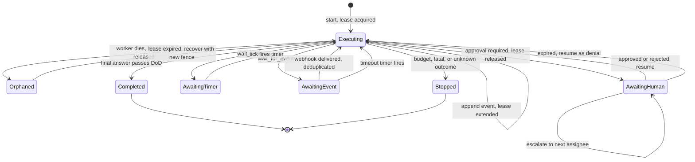
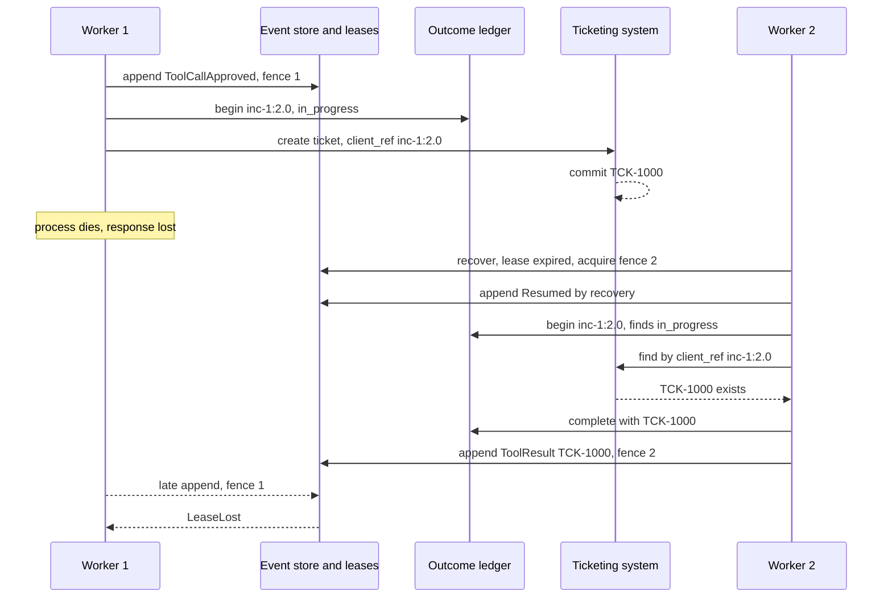
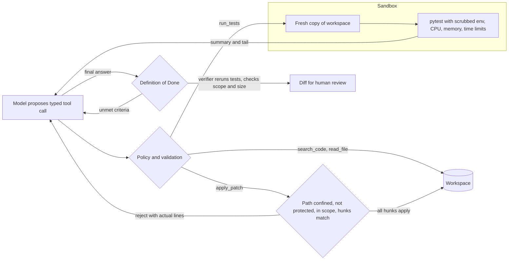

# Chapter 38 — Durable and Long-Running Agents

This chapter is about agents that outlive the process that started them: runs that last hours or days, survive crashes and deploys, wait for people and webhooks, and still perform each side effect once. It is also about the harness, the code around the model that runs tools, keeps state, and enforces checks, which decides how well coding, computer-use, and skill-based agents work.

**You will be able to:**
- Build a durable agent run on an event log with leases and fence tokens, so that exactly one worker drives a run and a crashed run resumes where it stopped.
- Close the at-least-once window around side effects with stable idempotency keys, an outcome ledger, and reconciliation against the system of record.
- Model approvals, timers, and external events as persisted interrupts with owners, escalation, expiry as denial, and deduplication.
- Keep a two-hundred-step run inside a bounded context with a typed task ledger and literal-preserving compaction.
- Decide whether to build durability on your own database or adopt a durable execution engine, and know what each choice still leaves to you.
- Design a coding-agent harness with narrow tools, a sandbox, and a deterministic Definition of Done, and package procedure as versioned, pinned skills.

**Prerequisites:** Chapters 16 (tool contracts, `SQLiteIdempotencyStore`, `SandboxRunner`), 17 (checkpoints and the engine landscape), and 19 (`agentkit`'s event log, approvals, and replay). | **Code:** `book/projects/examples/ch38/` (run: `cd book/projects/examples/ch38 && pytest -q`) | **Builds:** a SQLite-backed `DurableRunner` with leases and outcome reconciliation, an `InterruptManager` for approvals, timers, and events, a task ledger with compaction, a coding-agent harness, a skill loader, and a voice-turn gate, all offline with scripted models.

**First reading:** Why this matters, Mental model, Core concepts from Durable execution through Interrupts as first-class states, Build vs adopt a durable engine, How it works, Architecture, Implementation through Interrupts: approvals, timers, events, Failure modes, Before you ship. **Deep dives** (skip on a first pass): Replay and counterfactual testing, Long-horizon context, Harness engineering in agent products, Ledger and compaction, The coding harness, Skills and the voice gate.

The chapter has two parts. **Part one, durable runs**, covers the log, the at-least-once window, leases, interrupts, replay, long-horizon context, and when to adopt an engine instead of building one. **Part two, harness engineering in agent products**, applies the same lens to coding, computer-use, and skill-based agents, with a short note on voice, which Chapter 35 owns. The Implementation section builds both parts in that order.

## Why this matters

Chapter 19's agent loop assumes a run starts, works, and ends while one process watches. Real Northwind work does not fit that shape. An incident run waits forty minutes for a database failover. A refund reply waits overnight for a team lead's approval. A carrier claim waits three days for a vendor's email. A coding task runs two hundred tool calls. Meanwhile deploys roll the worker pods, nodes drain, providers time out, and someone presses Ctrl-C.

A naive agent then fails in one of three ways. The run is lost. The run restarts from the beginning, repeating every model call and side effect: two customer replies, two tickets, two refunds. Or it resumes from a checkpoint written before the side effect, and the harness cannot tell whether the email in flight at the crash actually left. On restart, the harness must determine whether an action completed instead of asking the model to guess.

Long runs also fill the context window with stale search results, and blind truncation can lose the one ticket id the final answer needs. And long runs are where humans enter the loop, so approvals need deadlines, owners, and an answer for "what if nobody answers?"

Distributed systems solved crash recovery, idempotent side effects, timers, and leases long ago. What is new is that the component choosing the next action is probabilistic, so the harness cannot rely on it to remember, reconcile, or stop.

## Mental model

> **Mental model:** A long-running agent is an append-only log plus a scheduler. The process is a disposable cache of the log.

Everything that matters about a run is in its event log: the goal, every model decision, every tool request, approval, and result. Agent state is a fold over that log (Chapter 19's `derive_state`), so any process that can read the log can become the run, and a dying worker loses only the event it was about to write. A waiting run is not a sleeping thread but a row saying "resume me when this timer fires, this approval arrives, or this webhook shows up," which the scheduler turns back into running work.

The model is the one component that cannot be trusted with continuity. It does not remember the previous process, cannot tell whether an email went out, and should not decide what an approver's silence means. Those are facts, and facts belong to code and storage: mental model 7 from Chapter 1 in its strongest form.

A second framing helps with side effects. Every external action has three moments: intent (we are about to do X with key K), effect (the outside world changed), and acknowledgment (we learned that it changed). A crash can fall between any two. Durable design records intent before effect, sends K with the effect, and can ask the outside world about K when acknowledgment is missing.

## Core concepts

### Durable execution: the log is the run

Durable execution means persisting a run's progress at well-defined points, so it can continue after any interruption without repeating completed steps. Workflow engines record each step's result in a history and replay it; graph libraries checkpoint state after each node, the style Chapter 17 built. `agentkit` uses the first style: every decision is an event appended before state changes, and `AgentRuntime.resume(run_id)` rebuilds state from the log.

Three properties make this work. Events are appended before they are acted on, or a crash leaves state the log cannot explain. Sequence numbers are dense and checked on append, or two writers can interleave events from different futures of one run. And state is derivable from events alone, because a field kept only in memory dies in the crash.

`agentkit`'s `JsonlEventStore` checks the sequence in memory, which is racy across processes (Chapter 19, E4). This chapter's SQLite store puts the check in the database: the primary key on `(run_id, seq)` makes a second writer of the same sequence number fail inside its transaction. It adds what matters once runs are long and workers many: storage that survives the host, one owner per run, and correct handling of the step that was executing at the crash.

A checkpoint here is only cached derived state at a sequence number, never the source of truth. A log can be re-folded by a new release; a pickled checkpoint from the old one cannot. Version event schemas like database schemas, and keep the fold tolerant of old event shapes.

### The at-least-once window and outcome reconciliation

A worker resumes a run whose last event is `ToolCallApproved` for `create_ticket`, with no `ToolResult`. The tool may never have started, may have failed, or may have created the ticket and died before recording it. Re-executing gives at-least-once semantics: harmless for reads, harmful for writes.

The defense is an idempotency key: a stable identifier for one logical action, sent with the request, which the receiving system uses to recognize a retry. `agentkit` derives the key `"<run_id>:<request_id>"` for every call, and Chapter 16's `SQLiteIdempotencyStore` records it. Because the request id comes from the event log, the crashed and the recovering process use the same key; a `uuid4()` generated at execution time would differ on retry and protect nothing.

A local record still cannot settle a crash mid-side-effect. It says `in_progress`, and only the ticketing system knows whether the ticket exists. Outcome reconciliation asks it, in one of three ways:

| External system can... | After a crash mid-call, the harness... | Result |
|---|---|---|
| Deduplicate by key (an idempotency-key header with replay) | Repeats the call with the same key | The system returns the original result; one effect |
| Look up by key (a client reference field, a search by external id) | Asks "do you have K?" first; uses the answer, or executes if absent | One effect, and the original output is recovered |
| Neither | Cannot know; marks the outcome unknown and stops for a human | No duplicate; a person reconciles |

Teams are tempted to "just retry" the third row. For a customer email, a refund, or an access change, an unknown outcome must become a human task, because both errors (a duplicate refund or a missing one) are costly. The long-term fix is to change the integration: put the key in a searchable field, or front the system with a service that records keys before forwarding.

One crash point needs no external help: the side effect completed and the local ledger recorded success, but the process died before appending `ToolResult`. On resume the ledger returns the recorded output without calling anything. That works only if the ledger lives in shared, durable storage; a ledger in memory or on the dead pod's disk dies with the worker.

### Leases and fencing: one owner per run

With many workers and a recovery loop, two workers can believe they own one run. Worker A stalls in a garbage-collection pause for forty seconds, the recovery loop gives the run to worker B, and A wakes up and keeps appending events and calling tools.

A lease is a time-limited claim: worker A holds run R until time T and must renew before T. A lease alone does not stop the zombie, because A does not know its lease expired while it was paused. Fencing closes the hole. Each lease carries a fence token that increases on every acquire, and every write checks the token in the same transaction. When A wakes and tries to append, the database refuses: the current fence is B's.

In `durable.py`, every append extends the lease and checks the fence atomically, so appends double as heartbeats, and a background heartbeat renews the lease while a long tool call runs. A heartbeat proves only that the process lives, so every tool call also needs its own timeout. A worker frozen past its lease still loses the run; fencing stops its next event but not a side effect already under way, which is why the external system should also deduplicate on the idempotency key.

Leases also define recovery: a `running` run with an expired lease was abandoned and is resumed; a run with a live lease is merely slow and is left alone.

### Interrupts as first-class states

In a long-running agent, a human approval is a persisted state: which request is pending, with which arguments, assigned to whom, escalating and expiring when. `agentkit` already pauses on approval and binds a decision to the pending call through `resume(request_id=...)`, but it has no owner, escalation, or expiry, so nothing happens if the approver never answers.

Four rules make approvals safe in long runs:

1. **An approval is bound to one request and its arguments.** If the agent replans while paused, or a second click arrives, the decision is stale and refused. Timers and events carry the request id too.
2. **Every approval has an owner and an escalation chain**, for example a support lead, then a duty manager after an hour.
3. **Every approval expires, and expiry is a denial.** Silence is not consent; otherwise the approval gate becomes a timer.
4. **Authority to decide is checked by code:** only someone on the chain, up to the current escalation level, may approve.

Waits that involve no human use the same mechanism: a wait is an approval granted by the clock or the outside world. The agent calls `wait_until(seconds)` or `wait_for_event(event_type, correlation_id, timeout_s)`; both require approval, so the runtime pauses, and the interrupt manager records a timer or event subscription instead of a human task. When it fires, the run resumes with approval granted, and the wait tool returns the delivered payload as its observation. Between pause and resume there is no process and no lease, only rows.

Webhooks bring two hazards. Providers deliver at least once, so each delivery is deduplicated by event id in the same transaction that records its effect. Events can arrive before the agent waits, so they go to an inbox keyed by correlation id. A scheduler calls `tick()` every few seconds to fire timers, escalate, and expire. Each change is a conditional update only one replica can win, and every input is recorded before the resume, so a later `tick()` finishes a resume that failed and several schedulers can run safely.

The run-time budget (Chapter 19's `deadline_s`) limits computation, so it counts active time only and a day waiting for approval uses none of it. A business deadline ("file this claim within 72 hours") is a separate wall-clock limit, enforced by the interrupt's expiry and a stopping timer.

### Replay and counterfactual testing

> **Deep dive.** What long runs change about replay; skip on a first reading.

Chapter 19 defines harness and counterfactual replay. Long runs change them in three ways.

**A recovered run is still one recording.** Recovery appends `Resumed(by="recovery")` to the same log, so a reconciled run replays identically. Restarting under a new run id would leave two partial recordings, neither of which replays.

**Waits replay instantly.** A three-day wait is a `ToolCallApproved` plus the wait tool's observation in the log, so behavior after an expired approval or a late webhook becomes testable in CI.

**Recordings age with the tools.** Months later, misses may reflect tool output format changes, not planning changes. Tag recordings with tool, skill, and prompt versions (in `GoalSet.metadata`); when the miss rate is high, switch to a live, sandboxed evaluation (Chapter 25).

### Long-horizon context: a task ledger and compacted observations

> **Deep dive.** Keeping a two-hundred-step run inside a bounded context; skip on a first reading.

A long run accumulates the plan and decisions (small, needed every step), exact identifiers (small, needed at unpredictable later steps), and raw observations (large, soon useless). Chapter 5 compacts conversations; agents need something stricter, because a lost decision means redone work and a lost identifier means a hallucinated one.

The design keeps a typed task ledger (objective, plan items with status, decisions, facts, open questions) that the model edits only through an `update_ledger` tool. Each edit is validated and becomes a `ToolResult` event, so after a crash `ledger_from_events` rebuilds the ledger from the log. Beside it sit harness facts computed from events, which the model cannot edit: calls per tool, recent failures and denials. A ledger claiming "root cause confirmed" after three failed searches is itself a signal.

Compaction rewrites the request, never the log. When a request exceeds its token budget, `CompactingLLM` keeps the system prompt, the goal, and the last K steps verbatim, and replaces older steps with the ledger, the harness facts, and one deterministic digest line per old observation: tool and arguments, the first meaningful line, and every literal in the full result (paths, ticket ids, error classes, test counts), because literals are what later steps quote. A tool call and its results are kept or dropped together, since providers reject an orphaned result.

Digests cannot invent content, but they keep that a search returned `INC-1007`, not why it mattered; recording why is the ledger's job. For prose-heavy tools an LLM summarizer (Chapter 5's `LLMSummarizer`) can replace the digest, keeping the literal extraction.

### Build vs adopt a durable engine

Everything above can be built on your own database, as this chapter does in about a thousand lines, or adopted. This section maps Chapter 17's engine families onto this chapter's concepts.

Four shapes are common as of 2026, named only as examples: **replay-based workflow engines** (for example Temporal), a separate service that records an event history per run and dispatches work to your workers; **durable function libraries** over your own database (for example DBOS, on PostgreSQL); **durable RPC runtimes** (for example Restate), with a journal per invocation and keyed objects that process one call per key at a time; and **graph checkpointers** (for example LangGraph's), which save state after each graph step inside your process.

| This chapter | History-based engines (Temporal-, DBOS-, Restate-style) | Graph checkpointer |
|---|---|---|
| Event log, state as a fold | Event history or step table; state rebuilt by re-running the workflow function against it | Checkpoint per step, keyed by a thread id |
| Lease and fence token | Engine dispatches each run to one worker; heartbeat timeouts and rejected late completions play the fence's role | None; you prevent two processes resuming one thread |
| Outcome ledger and reconciliation | Recorded step results cover "completed but not acknowledged"; a step that died mid-call is retried, so external deduplication or lookup is still yours | Same as the left column, with a coarser step |
| Timer interrupt | Durable sleep or timer | None; you bring a scheduler |
| Event interrupt and inbox | Signals, messages, or awakeables addressed to a run, persisted if they arrive early | Resume with a value; you bring the delivery and deduplication |
| Approval owner, escalation, expiry | Built from a signal plus a timer; the policy (who, when, expiry as denial) is still your code | Interrupt plus your own policy and scheduler |
| Recovery loop | Built in | You resume threads yourself |
| Request compaction, Definition of Done | Not provided; same code as this chapter | Not provided |

An engine takes over the log, ownership, timers, delivery, and recovery, the hardest parts to operate. Idempotency at the external system, approval policy, context management, and verification stay yours. One graph-specific trap: some libraries re-run the interrupted node from its start on resume, so a side effect placed before the interrupt runs twice; put the approval and the side effect in separate nodes.

**Determinism is the price of replay.** Replay-based engines rebuild state by re-running your workflow function from the top with recorded results substituted for completed steps, so the function must take the same path every time. Every model call and tool call must be a step (an activity), because a model asked twice answers differently. The loop's control code stays in the workflow function and must not read the wall clock, draw random numbers, generate `uuid4()` ids, or read configuration directly; use the engine's helpers or derive ids from the step counter. A violation fails silently until a recovered run diverges from its history, often days later. This chapter avoids the rule by folding events into state instead of re-executing loop code, at the cost of a fold that must accept every event shape ever written.

**In-flight runs meet new code.** A run paused three days on an approval resumes on whatever release is then deployed. With a replay-based engine, a new policy check or a reordered step makes old histories diverge; use the engine's versioning markers, or worker versioning that keeps old runs on old workers until they drain. Keep the workflow function small and stable and put what changes often (prompts, tools, models, policy tables) inside steps. In this chapter's design a resumed run uses current code by design, so record which release took over in the `Resumed` event's note.

**LLM payloads are large.** Engines cap payload size and history length (a few megabytes and tens of thousands of events are typical, illustrative), and a two-hundred-step coding run can hit both. Store large blobs in object storage behind a reference and content hash (the claim-check pattern), pass the compacted ledger between steps, and use the engine's "continue as new" for very long runs. The history inherits redaction rules (Chapter 27), and model-call steps need a retry policy per error class (Chapter 29), because each engine retry pays for the call again.

**When building your own is justified.** Build on your database when you already have an event-sourced loop like `agentkit`, few run types owned by one team, modest timer and concurrency volumes (thousands, not millions), no capacity to operate a stateful service, or transcripts that must never leave a database you control. Adopt an engine when several teams build long-running workflows, runs span services, timers and signals are central, or you want visibility, cancellation, and versioning tooling. A durable function library over your existing PostgreSQL is a middle path. The log takes a week to build; the scheduler, timer scale-out, upgrades for in-flight runs, operator tooling, and runbooks take the rest of the year.

## Harness engineering in agent products

> **Deep dive.** How the part-one mechanisms carry over to coding, computer-use, skill-based, and voice agents; skip on a first reading.

The model is often easier to swap than the harness. Each product below has one hardest harness problem and reuses a part-one mechanism:

| Product | Hardest harness problem | Part-one mechanism it reuses |
|---|---|---|
| Coding agent | Proving the task is done without trusting the model's claim | Definition of Done checked by code; ledger and literal-preserving compaction for long runs |
| Computer-use agent | UI actions that fail silently | Verification after each consequential action; approval interrupts for destructive steps |
| Agent Skills | Loading procedure safely and only when relevant | Versions recorded per run, so replay traces a regression to a skill change |
| Realtime voice agent | Side effects triggered from uncertain, interruptible speech | Outcome reconciliation and durable call state, on a much shorter clock |

### Coding agents

A coding agent's advantage over a single model call is closing the loop with the environment: it edits, runs the tests, reads the failure, and repairs.

Give it narrow tools instead of a raw shell: `search_code` (exact regex, because identifiers must match exactly), `read_file` with line numbers, `apply_patch` taking a unified diff, `run_tests`, and `show_diff`. A unified diff is reviewable and its context lines fail loudly when the file is not what the model thinks. A failed patch should report the lines actually there, and patches apply all-or-nothing across files.

The sandbox is the security boundary, because tests execute repository code. Run them with only the repository's files, a scrubbed environment, bounded CPU, memory, and time, and no network; package installation needs its own permission, because it runs arbitrary code. The chapter runs pytest through Chapter 16's `SandboxRunner` on a fresh workspace copy, which is not isolation (test code can reach the workspace by absolute path); in production use a container or microVM per task.

The Definition of Done must be deterministic. For the Northwind SLA task: a file changed, the tests pass when the verifier runs them itself, every change is within the allowed paths, no protected file (tests, `conftest.py`, `pyproject.toml`, lockfiles, environment files) changed, the diff is under a size limit, and the agent ran the tests and viewed the diff. A model's "all tests pass" is a claim, and the cheapest way to pass a failing test is to edit it. Judge scope on the normalized path: `northwind_sla/../tests/test_sla.py` is a test file.

Context is retrieval over code (Chapter 37): search symbols, references, and tests, keep a compact working set, and compact old observations with the ledger and digests above. IDE integration and autocomplete are designed in Chapter 35, Case 4.

### Computer-use agents

Computer-use agents drive graphical interfaces through screenshots, pointer and keyboard actions, or accessibility trees, for software without an API such as a legacy carrier portal. They are slower and less reliable than structured tools, because a click on the wrong row raises no exception.

Use them only where no stable API exists, and prefer the accessibility tree, whose roles and names are steadier than coordinates. Verify state after every consequential action: after "submit claim," read the confirmation number back and treat a mismatch as a failed step. Isolate each task in its own virtual machine or browser profile with only its credentials and egress limited to the target. Page text is untrusted data (Chapter 26), and destructive steps go through approval interrupts, with the harness deciding which screens are destructive.

### Agent Skills: procedural knowledge as a package

A skill (a folder format several agent hosts support, as of 2026) packages procedure, reference material, scripts, and assets around a `SKILL.md` file whose front matter holds a name, a one-line description, and a version. MCP (Chapter 18) connects the agent to systems; skills tell it how to do a job with them.

Progressive disclosure keeps skills cheap: the catalog of names and descriptions is always in context, a skill's body loads when the task matches its description, and individual resources load only when the procedure asks. The description is therefore the most important line, because the selector matches against it. The chapter's lexical selector suits dozens of skills; beyond that, use embeddings (Chapter 8) and evaluate selection like retrieval, with precision and an abstain rate.

A skill holds stable procedure only; prices, policy versions, and on-call names come from tools at run time.

Skills are also a supply chain that can carry scripts, exfiltrating URLs, and override instructions. Review every change, pin each skill to a content hash in a lockfile, serve exactly the hashed bytes, and audit for executable files, network access, secrets, and override language. A skill grants no capabilities; its scripts run under the same sandbox as any tool. Record which skill version each run loaded.

### Realtime voice agents

Chapter 35 (Case 2) owns voice agent design. Three harness rules carry over, the first two encoded in `voice_gate.py`: a partial transcript may trigger only reads, and a side effect needs a final transcript above a confidence threshold plus normal confirmation; after barge-in, history holds only what the caller heard, by the audio clock, or the next turn reasons about words the caller never heard; and call state is durable, so a mid-call restart never creates a second ticket.

## How it works

Follow one Northwind run through a crash. The on-call engineer asks why Trackline lookups are slow and wants a follow-up ticket. Worker 1 acquires the run's lease with fence 1. The model searches the runbooks and proposes `create_ticket`; the approval is appended; the reconciling wrapper (`ReconcilingTool`, under Implementation) reserves the key `inc-1:2.0` as `in_progress`; the ticketing system commits `TCK-1000`; the process dies before the response arrives.

The database now says the run is `running`, the last event is the approval, the ledger record is `in_progress`, and the lease expires in thirty seconds. Worker 2's recovery loop skips the run while the lease is live, then acquires it with fence 2 and calls `resume`. The runtime folds the log, appends `Resumed(by="recovery")`, and finds the approved call without a result. The wrapper finds the `in_progress` record and asks the ticketing system whether a ticket with client reference `inc-1:2.0` exists. It does, so `TCK-1000` becomes the observation, and the run completes with one ticket. If worker 1 wakes up, its next append fails with `LeaseLost`.

Approvals and waits follow the same path. A paused run releases its lease and `InterruptManager.after_run` records the interrupt. A decision, a timer, or a webhook resolves it with a conditional update and calls `resume`, which acquires a new lease and continues from the log.

## Architecture

The run lifecycle is a state machine over persisted states. Everything except `Executing` is a row in the database, not a process.



The crash-and-reconcile sequence shows where each record lives and which boundary each call crosses.



The coding harness puts the model's proposals and the repository on opposite sides of a policy layer, and the tests on the far side of a sandbox.



## Implementation

The examples live in `book/projects/examples/ch38/` and import `agentkit`, `toolkit`, and `aie_core` from the shared virtual environment.

```text
book/projects/examples/ch38/
  durable.py           SqliteEventStore, LeaseManager, DurableRunner, ReconcilingTool
  interrupts.py        InterruptManager, EscalationPolicy, wait tools
  ledger.py            TaskLedger, update_ledger tool, CompactingLLM
  coding_harness.py    Workspace, unified diff, CodingTools, coding_dod
  skills.py            SKILL.md loader, selector, SkillLock, audit
  voice_gate.py        TurnGate, PlaybackController, LatencyBudget
  fakes.py             FakeClock, FakeTicketSystem, sample tools
  skills/              three sample Northwind skills
  demo.py              crash after commit, recover, one ticket
  test_ch38_*.py       offline tests
  pyproject.toml  README.md  conftest.py
```

Run the tests and the demo from the book root:

```bash
uv pip install --python .venv/bin/python -e book/projects/aie_core -e book/projects/agentkit -e book/projects/toolkit
.venv/bin/python -m pytest book/projects/examples/ch38 -q
cd book/projects/examples/ch38 && ../../../../.venv/bin/python demo.py
```

The examples read no environment variables. To use a real provider, replace the scripted `FakeLLM` with `aie_core.make_llm_client()`, configured as in Chapter 3.

### Durable runs: store, leases, reconciliation, runner

The event store implements agentkit's `EventStore` protocol. A fenced view checks and extends the lease inside the append transaction, which is what stops a zombie worker.

```python
# path: book/projects/examples/ch38/durable.py  (excerpt; full file on disk)
class SimulatedCrash(BaseException):
    # ... stands in for `kill -9` (see the Code walkthrough)


class LeaseLost(RuntimeError):
    """This worker no longer owns the run; it must stop writing immediately."""

# ...
@dataclass(frozen=True)
class Lease:
    run_id: str
    owner: str
    fence: int           # increases on every acquire of this run; a newer owner always has a larger fence
    expires_at: float


class LeaseManager:
    def __init__(self, db: Database, *, ttl_s: float = 30.0, clock: Callable[[], float] = time.time) -> None:
        self.db = db
        self.ttl_s = ttl_s
        self.clock = clock

    def acquire(self, run_id: str, owner: str) -> Lease | None:
        """Take the run if nobody holds a live lease. Returns None if another owner does."""
        now = self.clock()
        with self.db.transaction() as c:
            row = c.execute("SELECT owner, fence, expires_at FROM leases WHERE run_id=?", (run_id,)).fetchone()
            if row is not None and row[0] != owner and row[2] > now:
                return None
            fence = (row[1] + 1) if row else 1
            c.execute("INSERT INTO leases(run_id, owner, fence, expires_at) VALUES (?,?,?,?) "
                      "ON CONFLICT(run_id) DO UPDATE SET owner=excluded.owner, fence=excluded.fence, "
                      "expires_at=excluded.expires_at", (run_id, owner, fence, now + self.ttl_s))
        return Lease(run_id, owner, fence, now + self.ttl_s)

    def release(self, lease: Lease) -> None:
        # Expire the row instead of deleting it: the fence must keep counting up, or the next
        # owner would get fence 1 again and a zombie holding an old fence 1 would pass the check.
        with self.db.transaction() as c:
            c.execute("UPDATE leases SET expires_at=0 WHERE run_id=? AND fence=?", (lease.run_id, lease.fence))

    def renew(self, lease: Lease) -> bool:
        """Heartbeat: extend a lease this worker still holds. False means it was lost."""
        with self.db.transaction() as c:
            try:
                self.check_and_extend(c, lease)
            except LeaseLost:
                return False
        return True

    # ... holder(run_id) returns the live lease or None (on disk)

    def check_and_extend(self, c: sqlite3.Connection, lease: Lease) -> None:
        """Called inside the append transaction: the fence check and the write commit together."""
        now = self.clock()
        cur = c.execute("UPDATE leases SET expires_at=? WHERE run_id=? AND owner=? AND fence=? AND expires_at>?",
                        (now + self.ttl_s, lease.run_id, lease.owner, lease.fence, now))
        if cur.rowcount != 1:
            raise LeaseLost(f"{lease.owner} lost run {lease.run_id} (fence {lease.fence})")

class SqliteEventStore:
    """agentkit's EventStore protocol over SQLite. `fenced(lease)` returns a view that
    refuses to append unless `lease` is still the current one."""

    def __init__(self, db: Database, *, leases: LeaseManager | None = None, lease: Lease | None = None) -> None:
        self.db = db
        self.leases = leases
        self.lease = lease

    def fenced(self, leases: LeaseManager, lease: Lease) -> "SqliteEventStore":
        return SqliteEventStore(self.db, leases=leases, lease=lease)

    def append(self, event: Event) -> None:
        with self.db.transaction() as c:
            if self.lease is not None:
                assert self.leases is not None
                self.leases.check_and_extend(c, self.lease)
            try:
                c.execute("INSERT INTO events(run_id, seq, type, body, at) VALUES (?,?,?,?,?)",
                          (event.run_id, event.seq, getattr(event, "type"), event_to_json(event), event.at))
            except sqlite3.IntegrityError as exc:
                raise ValueError(f"run {event.run_id}: seq {event.seq} already written") from exc
            status = _status_after(event)
            if status is not None:
                c.execute("INSERT INTO runs(run_id, status, stop_reason, updated_at) VALUES (?,?,?,?) "
                          "ON CONFLICT(run_id) DO UPDATE SET status=excluded.status, "
                          "stop_reason=excluded.stop_reason, updated_at=excluded.updated_at",
                          (event.run_id, status[0], status[1], event.at))
```

`ReconcilingTool` wraps any agentkit tool and closes the at-least-once window using Chapter 16's `SQLiteIdempotencyStore` as the outcome ledger.

```python
# path: book/projects/examples/ch38/durable.py  (excerpt; full file on disk)
@dataclass
class ReconcilingTool:
    """Wraps a side-effecting tool so that, under at-least-once execution, the side effect
    happens at most once per logical call.

    The key is agentkit's `ctx.idempotency_key` ("<run_id>:<request_id>"), which is stable
    across crashes because the request id comes from the event log. Outcomes:

    - no record: reserve the key, execute, record the output.
    - succeeded: return the recorded output; do not execute (crash after the side effect
      and the ledger write, before the ToolResult event).
    - in_progress or unknown: an earlier attempt died mid-flight. Ask `reconcile(key,
      arguments)`: a ToolOutput means "it happened, here is what it produced"; None means
      "it definitely did not happen", so execute now. Without a reconciler the outcome is
      unknowable, and the call fails as FATAL so a human decides instead of the model.

    The run lease, kept alive by the runner's heartbeat while the tool runs, means one worker
    per run, so an `in_progress` record for this run's key belongs to a dead attempt. The
    exception is a worker frozen (GC, partition) for longer than the lease TTL: fencing stops
    its next event, but not a side effect it is already performing. Closing that gap needs
    the external system itself to check the fence or the idempotency key.
    """

    inner: Any
    ledger: SQLiteIdempotencyStore
    reconcile: Reconciler | None = None
    ttl_s: float = 7 * 24 * 3600.0
    log: list[dict[str, Any]] = field(default_factory=list)

    def __post_init__(self) -> None:
        self._tool: Tool = adapt_tool(self.inner)
        self.name = self._tool.name
        self.side_effect = self._tool.side_effect
        self.requires_approval = self._tool.requires_approval
        self.idempotent = self._tool.idempotent

    @property
    def spec(self) -> Any:
        return self._tool.spec

    def execute(self, arguments: dict[str, Any], ctx: ToolContext) -> ToolOutput:
        key = ctx.idempotency_key
        existing = self.ledger.begin(key, self.name, _args_hash(arguments), self.ttl_s)
        if existing is not None:
            if existing.status == "succeeded":
                self.log.append({"key": key, "outcome": "deduplicated"})
                return _output_from_json(existing.result)
            if self.reconcile is None:
                self.ledger.mark_unknown(key)
                self.log.append({"key": key, "outcome": "unknown"})
                return ToolOutput.failure(
                    f"an earlier attempt of {self.name} may or may not have taken effect and this system "
                    "cannot check; a human must reconcile before anything else is done", ErrorClass.FATAL)
            found = self.reconcile(key, arguments)
            if found is not None:
                self.ledger.complete(key, _output_to_json(found))
                self.log.append({"key": key, "outcome": "reconciled_found"})
                return found
            self.log.append({"key": key, "outcome": "reconciled_absent"})
        out = self._tool.execute(arguments, ctx)       # exceptions propagate; the record stays in_progress
        self.ledger.complete(key, _output_to_json(out))
        return out
```

The runner builds a fresh runtime for every start or resume, so code is current while state comes only from the log.

```python
# path: book/projects/examples/ch38/durable.py  (excerpt; full file on disk)
RuntimeFactory = Callable[[EventStore], AgentRuntime]


class DurableRunner:
    """Owns runs through leases. `factory(store)` builds an AgentRuntime bound to a fenced
    store; build it per call so that tools, model client, and policy come from current code
    and configuration, while state comes only from the log."""

    def __init__(self, db: Database, factory: RuntimeFactory, *, owner: str, lease_ttl_s: float = 30.0,
                 heartbeat_s: float | None = None, clock: Callable[[], float] = time.time) -> None:
        self.db = db
        self.factory = factory
        self.owner = owner
        self.store = SqliteEventStore(db)
        self.leases = LeaseManager(db, ttl_s=lease_ttl_s, clock=clock)
        self.heartbeat_s = heartbeat_s if heartbeat_s is not None else lease_ttl_s / 3

    def start(self, goal: str, *, run_id: str, metadata: dict[str, Any] | None = None) -> RunResult:
        return self._with_lease(run_id, lambda rt: rt.run(goal, run_id=run_id, metadata=metadata))

    def resume(self, run_id: str, *, approve: bool | None = None, reason: str = "",
               budget: Budget | None = None, request_id: str | None = None) -> RunResult:
        """`request_id` binds a decision to the request it was made for (Chapter 19): if the
        run is now paused on a different request, agentkit refuses instead of approving it."""
        return self._with_lease(run_id, lambda rt: rt.resume(run_id, approve=approve, reason=reason, budget=budget,
                                                             request_id=request_id))

    def recover(self) -> list[RunResult]:
        """Resume every run that is marked running but has no live lease: its worker died."""
        results = []
        for run_id in self.store.runs_with_status("running"):
            if self.leases.holder(run_id) is not None:
                continue
            try:
                results.append(self.resume(run_id))
            except LeaseHeld:
                continue                       # another recovering worker got there first
        return results

    def _with_lease(self, run_id: str, fn: Callable[[AgentRuntime], RunResult]) -> RunResult:
        lease = self.leases.acquire(run_id, self.owner)
        if lease is None:
            raise LeaseHeld(f"run {run_id} is owned by {self.leases.holder(run_id)}")
        runtime = self.factory(self.store.fenced(self.leases, lease))
        stop = threading.Event()
        beat = threading.Thread(target=self._heartbeat, args=(lease, stop), daemon=True)
        beat.start()
        try:
            result = fn(runtime)
        except SimulatedCrash:
            stop.set()
            raise                               # a dead process releases nothing; the lease must expire
        except BaseException:
            stop.set()
            self.leases.release(lease)
            raise
        stop.set()
        self.leases.release(lease)              # paused, stopped, or completed: nobody needs to hold it
        return result

    def _heartbeat(self, lease: Lease, stop: threading.Event) -> None:
        """Appends extend the lease, but a tool can run longer than the TTL between two
        appends. Renew on a timer until the call finishes or the lease is gone."""
        while not stop.wait(self.heartbeat_s):
            if not self.leases.renew(lease):
                return
```

The ticketing fake can crash before or after its remote commit; the reconciler asks the system of record "did this happen?"

```python
# path: book/projects/examples/ch38/fakes.py  (excerpt; full file on disk)
def ticket_tool(system: FakeTicketSystem) -> FunctionTool:
    def create_ticket(ctx: ToolContext, title: str, body: str) -> ToolOutput:
        t = system.create(title=title, body=body, client_ref=ctx.idempotency_key)
        return ToolOutput(content=f"created {t['id']}: {title}", data=t, artifacts={"ticket_id": t["id"]})

    return FunctionTool(
        "create_ticket", "Open a follow-up ticket in Northwind's ticketing system.",
        {"type": "object", "properties": {"title": {"type": "string"}, "body": {"type": "string"}},
         "required": ["title", "body"], "additionalProperties": False},
        fn=create_ticket, side_effect=SideEffect.WRITE, idempotent=False, pass_context=True,
    )


def ticket_reconciler(system: FakeTicketSystem):
    """Answers 'did this action already happen?' by asking the system of record."""

    def reconcile(key: str, arguments: dict[str, Any]) -> ToolOutput | None:
        t = system.find_by_client_ref(key)
        if t is None:
            return None
        return ToolOutput(content=f"created {t['id']}: {t['title']} (recovered after restart)", data=t,
                          artifacts={"ticket_id": t["id"]})

    return reconcile
```

`demo.py` shows the crash, no recovery while the lease is live, and `resumed` between the approval and the result:

```text
worker-1 died: died after the remote commit, before reading the response
status after crash: running | recover now: []
recovered: completed | tickets in system: ['TCK-1000']
reconciliation log: [{'key': 'inc-1:2.0', 'outcome': 'reconciled_found'}]
   8 tool_call_requested  create_ticket
   9 tool_call_approved   create_ticket
  10 resumed
  11 tool_result          create_ticket
```

### Interrupts: approvals, timers, events

`after_run` turns a paused run into a durable interrupt. The pending tool decides the kind: a wait tool becomes a timer or an event subscription, anything else becomes a human approval with an assignee, an escalation time, and an expiry.

```python
# path: book/projects/examples/ch38/interrupts.py  (excerpt; full file on disk)
    def after_run(self, result: RunResult) -> Interrupt | None:
        """Record why a run paused. Idempotent per (run_id, request_id)."""
        if result.status is not AgentStatus.AWAITING_APPROVAL:
            return None
        return self._record_pause(result.run_id, result.state.pending_approval)

    def _record_pause(self, run_id: str, rec: Any) -> Interrupt | None:
        existing = self._find(run_id, rec.request_id)
        if existing is not None:
            return existing
        now = self.clock()
        it = Interrupt(id=uuid.uuid4().hex[:12], run_id=run_id, request_id=rec.request_id, tool=rec.tool,
                       arguments=dict(rec.arguments), status=InterruptStatus.PENDING, created_at=now,
                       kind=InterruptKind.APPROVAL)
        if rec.tool == WAIT_UNTIL:
            it.kind = InterruptKind.TIMER
        elif rec.tool == WAIT_FOR_EVENT:
            it.kind = InterruptKind.EVENT
            it.correlation_key = f"{rec.arguments['event_type']}:{rec.arguments['correlation_id']}"
        else:
            policy = self.policies.get(rec.tool, self.default_policy)
            it.assignee = policy.chain[0]
            it.escalate_at = now + policy.escalate_after_s if len(policy.chain) > 1 else None
            it.expires_at = now + policy.expire_after_s
            it.history.append({"at": now, "event": "assigned", "to": it.assignee})
        # The interrupt and what makes it end (a timer, or an event already in the inbox) are
        # written in one transaction: a crash cannot leave a wait that nothing will ever finish.
        with self.db.transaction() as c:
            if not self._insert(c, it):                     # another replica recorded this pause first
                return self._find(run_id, rec.request_id)
            if it.kind is InterruptKind.TIMER:
                self._schedule(c, it.id, now + min(float(rec.arguments["seconds"]), self.max_wait_s), "fire")
            # ... EVENT: take a matching event from the inbox and resolve at once, or schedule the timeout
        if it.kind is InterruptKind.APPROVAL:
            self.notify(it, "assigned")
        return it

    def decide(self, interrupt_id: str, *, approve: bool, by: str, reason: str = "") -> RunResult:
        it = self.get(interrupt_id)
        # ... refuse non-approval kinds and interrupts that are no longer pending
        policy = self.policies.get(it.tool, self.default_policy)
        if by not in policy.chain[: it.level + 1]:
            raise PermissionError(f"{by} may not decide {it.tool} at escalation level {it.level}")
        state = derive_state(self.runner.store.load(it.run_id))
        pending = state.pending_approval
        if pending is None or pending.request_id != it.request_id:
            raise ValueError("the run is no longer paused on this request; the decision is stale")
        # The claim records the decision first; if the resume below fails, tick() retries it.
        return self._resolve_and_resume(it, {"approved": approve, "reason": reason, "at": self.clock()},
                                        by=by, approve=approve, note=reason)

    def tick(self) -> list[RunResult]:
        """Run by a scheduler every few seconds (cron, a queue consumer, a k8s CronJob).
        Fires due timers, escalates stale approvals, expires dead ones, and finishes resumes
        that an earlier call recorded but did not complete. Safe to run on several replicas:
        each state change is a conditional UPDATE that only one wins, and the loser skips."""
        now = self.clock()
        results: list[RunResult] = []
        for timer_id, interrupt_id, purpose in self.db.query(
                "SELECT id, interrupt_id, purpose FROM timers WHERE status='scheduled' AND fire_at<=? "
                "ORDER BY fire_at", (now,)):
            it = self.get(interrupt_id)
            try:
                with self.db.transaction() as c:            # firing the timer and claiming commit together
                    won = c.execute("UPDATE timers SET status='fired' WHERE id=? AND status='scheduled'",
                                    (timer_id,)).rowcount == 1
                    if not won or it.status is not InterruptStatus.PENDING:
                        continue
                    self._claim(c, it, {"status": "fired" if purpose == "fire" else "timeout", "at": now},
                                by="clock")
            except AlreadyResolved:
                continue                                    # an event or another replica got there first
            self._try(results, lambda: self._resume(it, approve=True, note=f"{it.kind.value} resolved by clock"))
        for (interrupt_id,) in self.db.query("SELECT id FROM interrupts WHERE kind='approval' AND status='pending' "
                                             "AND expires_at<=?", (now,)):
            it = self.get(interrupt_id)
            self._try(results, lambda: self._resolve_and_resume(
                it, {"approved": False, "reason": "expired", "at": now}, by="clock", approve=False,
                note=f"approval for {it.tool} expired unanswered; treated as denied", status=InterruptStatus.EXPIRED))
        # ... escalate approvals past escalate_at, then finish resumes recorded but not completed
        results.extend(self._repair())          # last, so it also sees what failed in this tick
        return results

    def _resume(self, it: Interrupt, *, approve: bool, note: str) -> RunResult:
        # request_id binds the resume to this interrupt: if the run has moved on to another
        # request, agentkit refuses rather than approving whatever is pending now.
        result = self.runner.resume(it.run_id, approve=approve, reason=note, request_id=it.request_id)
        self.after_run(result)                  # the resumed run may pause again on a new request
        return result
```

### Ledger and compaction

> **Deep dive.** The ledger tool, digests, and request rewrite in code; skip on a first reading.

The ledger tool reads the current ledger from the event log and returns the new version as an artifact; compaction rewrites only the outgoing request.

```python
# path: book/projects/examples/ch38/ledger.py  (excerpt; full file on disk)
def make_ledger_tool(store: EventStore) -> FunctionTool:
    def update_ledger(ctx: ToolContext, **changes: Any) -> ToolOutput:
        current = ledger_from_events(store.load(ctx.run_id))
        new = current.apply(LedgerUpdate.model_validate(changes))
        done = sum(p.status == "done" for p in new.plan)
        return ToolOutput(content=f"ledger v{new.version}: {done}/{len(new.plan)} plan items done",
                          artifacts={LEDGER_ARTIFACT: new.model_dump()})

    schema = LedgerUpdate.model_json_schema()
    params = {"type": "object", "properties": schema["properties"], "additionalProperties": False}
    return FunctionTool("update_ledger", "Update the task ledger: add plan items, set item status "
                        "(todo/doing/done/blocked), record decisions, facts, and open questions.",
                        params, fn=update_ledger, pass_context=True)

def digest_observation(tool: str, arguments: dict[str, Any], content: str, *, max_chars: int = 140) -> str:
    """One deterministic line per old observation: what was called, the first meaningful line,
    and every literal identifier found anywhere in the full content (up to eight)."""
    first = next((ln.strip() for ln in content.splitlines() if ln.strip()), "")
    if len(first) > max_chars:
        first = first[: max_chars - 3] + "..."
    literals: list[str] = []
    for m in LITERAL.finditer(content):
        if m.group(0) not in literals:
            literals.append(m.group(0))
    args = json.dumps(arguments, sort_keys=True, ensure_ascii=False)
    if len(args) > 80:
        args = args[:77] + "..."
    keep = f" keep={literals[:8]}" if literals else ""
    return f"{tool}({args}) -> {first}{keep}"

def compact_messages(messages: Sequence[Message], *, keep_recent_steps: int, ledger: TaskLedger | None,
                     facts: dict[str, Any] | None) -> list[Message]:
    head, groups = _groups(messages)
    if len(groups) <= keep_recent_steps:
        return list(messages)
    old, recent = groups[: len(groups) - keep_recent_steps], groups[len(groups) - keep_recent_steps:]
    parts = ["[harness:compacted] Earlier steps were compacted. The ledger and digests below are authoritative; "
             "re-read a source with a tool if you need its full text."]
    if ledger is not None:
        parts.append(ledger.render())
    if facts:
        parts.append("Harness facts: " + json.dumps(facts, sort_keys=True))
    digest = [f"- {line}" for g in old for line in _summarize_group(g)]
    parts.append("Earlier steps, oldest first:\n" + "\n".join(digest))
    return [*head, Message.user("\n\n".join(parts)), *(m for g in recent for m in g)]

# ... class CompactingLLM: an LLMClient decorator (on disk); its request rewrite:
    def _rewrite(self, req: CompletionRequest) -> CompletionRequest:
        before = count_message_tokens(req.messages, req.model)
        if before <= self.max_input_tokens:
            return req
        run_id = str(req.metadata.get("run_id", ""))
        ledger = self.ledger_source(run_id) if self.ledger_source else None
        facts = self.facts_source(run_id) if self.facts_source else None
        messages, kept = list(req.messages), self.keep_recent_steps
        while kept >= 1:
            messages = compact_messages(req.messages, keep_recent_steps=kept, ledger=ledger, facts=facts)
            if count_message_tokens(messages, req.model) <= self.max_input_tokens:
                break
            kept -= 1
        after = count_message_tokens(messages, req.model)
        self.stats.append(CompactionStat(run_id, int(req.metadata.get("step", 0)), before, after, max(kept, 1)))
        return req.model_copy(update={"messages": messages})
```

### The coding harness

> **Deep dive.** Patching, the sandboxed test run, and the coding Definition of Done in code; skip on a first reading.

Patching verifies context before writing anything and reports the real lines on mismatch. Tests run in the sandbox on a fresh copy of the workspace (`CodingTools.pytest`, on disk), and the Definition of Done reruns them.

```python
# path: book/projects/examples/ch38/coding_harness.py  (excerpt; full file on disk)
def apply_hunks(original: list[str], hunks: list[Hunk], *, fuzz: int = 3, path: str = "") -> list[str]:
    """Apply hunks in order. Each hunk's context and removed lines must match exactly; the
    position may be off by up to `fuzz` lines (earlier edits shift line numbers)."""
    result = list(original)
    offset = 0
    for h in hunks:
        old = [ln[1:] for ln in h.lines if ln[0] in " -"]
        new = [ln[1:] for ln in h.lines if ln[0] in " +"]
        want = max(h.old_start - 1 + offset, 0) if h.old_len else h.old_start + offset
        found = None
        for delta in sorted(range(-fuzz, fuzz + 1), key=abs):
            pos = want + delta
            if 0 <= pos <= len(result) - len(old) and result[pos:pos + len(old)] == old:
                found = pos
                break
        if found is None:
            lo = max(want - 2, 0)
            actual = "\n".join(f"{n + 1:4d}| {t}" for n, t in enumerate(result[lo:lo + len(old) + 4], start=lo))
            raise PatchError(f"hunk @@ -{h.old_start},{h.old_len} @@ does not match {path or 'the file'}. "
                             f"Lines there are:\n{actual}\nRe-read the file and regenerate the patch.")
        result[found:found + len(old)] = new
        offset += len(new) - len(old)
    return result

# ... class CodingTools (on disk); its patch tool:
    def apply_patch(self, diff: str) -> ToolOutput:
        try:
            patches = parse_unified_diff(diff)
            staged: dict[Path, str | None] = {}
            for fp in patches:
                raw = fp.new_path or fp.old_path
                assert raw is not None
                target = self.ws.resolve(raw)
                rel = target.relative_to(self.ws.root).as_posix()   # judge the normalized path, not the raw one
                # ... refuse hidden or non-text paths
                if self.ws.is_protected(rel):
                    return ToolOutput.failure(f"{rel} is protected and cannot be modified by the agent",
                                              ErrorClass.PERMISSION)
                if not self.ws.is_allowed(rel):
                    return ToolOutput.failure(f"{rel} is outside the paths this task may change: "
                                              f"{list(self.ws.allowed)}", ErrorClass.PERMISSION)
                # ... refuse deletions
                if target in staged:            # a second patch to the same file applies on top of the first
                    original = (staged[target] or "").splitlines()
                else:
                    original = [] if fp.old_path is None else target.read_text(encoding="utf-8").splitlines()
                if fp.old_path is None and (target.exists() or target in staged):
                    raise PatchError(f"{rel} already exists; patch it instead of creating it")
                staged[target] = "\n".join(apply_hunks(original, fp.hunks, path=rel)) + "\n"
        except PatchError as exc:
            return ToolOutput.failure(str(exc), ErrorClass.VALIDATION)
        except (PermissionError, FileNotFoundError) as exc:
            return ToolOutput.failure(str(exc), ErrorClass.PERMISSION)
        for target, content in staged.items():          # all-or-nothing: write only after every hunk applied
            target.parent.mkdir(parents=True, exist_ok=True)
            target.write_text(content or "", encoding="utf-8")
        names = [str(t.relative_to(self.ws.root)) for t in staged]
        return ToolOutput(content=f"patched {names}; {self.ws.changed_line_count()} changed lines in total",
                          artifacts={"changed_files": self.ws.changed_files()})

    # ... pytest(selector) runs the tests in the sandbox on a fresh copy of the workspace (on disk)

def coding_dod(tools: CodingTools, *, max_changed_lines: int = 60, test_selector: str = "tests") -> DefinitionOfDone:
    ws = tools.ws

    def tests_pass(answer: str, state: AgentState) -> tuple[bool, str]:
        report = tools.pytest(test_selector)       # the verifier runs the tests; it does not trust the transcript
        return report["ok"], "" if report["ok"] else f"tests fail: {report['summary']}"

    def scoped(answer: str, state: AgentState) -> tuple[bool, str]:
        bad = [f for f in ws.changed_files() if ws.is_protected(f) or not ws.is_allowed(f)]
        return not bad, f"changes outside the allowed scope: {bad}" if bad else ""

    def has_change(answer: str, state: AgentState) -> tuple[bool, str]:
        return bool(ws.changed_files()), "no file was changed"

    def small(answer: str, state: AgentState) -> tuple[bool, str]:
        n = ws.changed_line_count()
        return n <= max_changed_lines, f"diff has {n} changed lines; limit is {max_changed_lines}"

    return DefinitionOfDone(
        Check("has_change", has_change),
        Check("tests_pass", tests_pass),
        Check("diff_in_scope", scoped),
        Check(f"diff<={max_changed_lines}_lines", small),
        tool_was_called("run_tests", "show_diff"),
        description="The task is done only when all of these hold (checked by the harness, not by you):",
    )
```

This test shows the Definition of Done rejecting a premature "everything passes" by running the tests itself:

```python
# path: book/projects/examples/ch38/test_ch38_coding_harness.py  (excerpt; full file on disk)
def test_premature_done_claim_is_rejected_by_running_the_tests(harness):
    ws, tools = harness
    result = runtime(tools, [
        call("apply_patch", 1, diff=FIX_P2),
        call("run_tests", 2),
        call("show_diff", 3),
        "Done, everything passes.",                           # it does not: the unknown-priority test fails
        call("apply_patch", 4, diff=FIX_UNKNOWN),
        call("run_tests", 5),
        "Fixed both requirements; tests pass.",
    ]).run(TASK)
    assert result.ok
    rejected = [n for n in result.events_of(Note) if n.kind == "dod_rejected"]
    assert len(rejected) == 1 and "tests fail" in rejected[0].text
```

### Skills and the voice gate

> **Deep dive.** Skill selection, the lockfile, and the voice turn gate in code; skip on a first reading.

The skill selector ranks descriptions lexically, and the lockfile serves only skills whose version and content hash match what was reviewed.

```python
# path: book/projects/examples/ch38/skills.py  (excerpt; full file on disk)
def select_skills(task: str, skills: dict[str, Skill], *, k: int = 2, min_score: float = 0.2) -> list[SkillMatch]:
    """Rank skills by how much of each description's vocabulary the task covers. Lexical on
    purpose: descriptions are short, written for matching, and auditable; swap in embeddings
    (Chapter 8) when the catalog grows past what keywords can separate."""
    task_terms = _tokens(task)
    out = []
    for s in skills.values():
        terms = _tokens(s.description + " " + s.name.replace("-", " ") + " " + " ".join(s.meta.get("triggers", [])))
        if not terms:
            continue
        matched = tuple(sorted(task_terms & terms))
        score = len(matched) / len(terms) ** 0.5
        if score >= min_score:
            out.append(SkillMatch(s.name, round(score, 3), matched))
    return sorted(out, key=lambda m: (-m.score, m.name))[:k]

# ... class SkillLock (on disk):
    def verify(self, skills: dict[str, Skill]) -> list[str]:
        problems = []
        for s in skills.values():
            pin = self.entries.get(s.name)
            if pin is None:
                problems.append(f"{s.name}: not in lockfile (unreviewed)")
            elif pin["version"] != s.version:
                problems.append(f"{s.name}: version {s.version} but lockfile pins {pin['version']}")
            elif pin["hash"] != s.hash():
                problems.append(f"{s.name}: content changed without a version bump")
        return problems

    def trusted(self, skills: dict[str, Skill]) -> dict[str, Skill]:
        """Only skills whose version and hash match the lock are offered to the agent, frozen
        so that the content checked is exactly the content served."""
        frozen = {n: s.freeze() for n, s in skills.items()}
        bad = {p.split(":")[0] for p in self.verify(frozen)}
        return {n: s for n, s in frozen.items() if n not in bad}
```

The voice gate encodes the two voice rules from part two: what a transcript segment may trigger, and what the history records after barge-in. Chapter 35 builds the rest of the voice design around it.

```python
# path: book/projects/examples/ch38/voice_gate.py  (excerpt; full file on disk)
@dataclass
class TurnGate:
    min_stability: float = 0.8
    min_confidence: float = 0.85

    def classify(self, seg: Segment) -> GateDecision:
        if not seg.text.strip():
            return "ignore"
        if not seg.is_final:
            return "speculate" if seg.stability >= self.min_stability else "ignore"
        return "commit" if seg.confidence >= self.min_confidence else "reprompt"

    def allowed_effects(self, decision: GateDecision) -> set[SideEffect]:
        """Speculation may read (look up the account, prefetch the policy); only a committed
        turn may write, and writes still go through the normal policy and confirmation."""
        if decision == "speculate":
            return {SideEffect.READ}
        if decision == "commit":
            return set(SideEffect)
        return set()


@dataclass
class PlaybackController:
    """Text goes to TTS in chunks; the audio clock reports how many characters were played."""

    planned: list[str] = field(default_factory=list)
    played_chars: int = 0
    cancelled: bool = False

    def enqueue(self, chunk: str) -> None:
        if not self.cancelled:
            self.planned.append(chunk)

    def on_played(self, chars: int) -> None:
        self.played_chars = min(self.played_chars + chars, len("".join(self.planned)))

    def barge_in(self) -> str:
        """Stop playback, drop unplayed chunks, return what the caller heard. The caller must
        also cancel the in-flight generation so no more chunks arrive."""
        self.cancelled = True
        heard = "".join(self.planned)[: self.played_chars]
        self.planned = [heard]
        return heard

    def history_text(self) -> str:
        text = "".join(self.planned)[: self.played_chars] if self.cancelled else "".join(self.planned)
        return text + (" [interrupted by caller]" if self.cancelled else "")
```

## Code walkthrough

**Extension points, not forks.** Nothing in `agentkit` changed: the store, `ReconcilingTool`, `CompactingLLM`, and the wait tools each implement an existing protocol. If durability needs a source change to your harness, its boundaries are in the wrong place.

**`SimulatedCrash` derives from `BaseException`.** The runtime turns `Exception` from tools into observations; a real `kill -9` cannot be caught at all, and `BaseException` gives the tests the same property.

**Why `in_progress` means "dead attempt."** Chapter 16's store can tell a dead caller from a live one only by age. Here the lease guarantees one worker per run and the key includes the run id, so an `in_progress` record found by the current owner belongs to a dead attempt, and `ReconcilingTool` reconciles at once.

**The model never supplies the event it waited for.** The wait tool reads the resolution from the interrupt table through its trusted `ToolContext`.

**The coding Definition of Done compares with a baseline**, so a file changed behind the harness's back, by a test or a misbehaving tool, still fails `diff_in_scope`.

## Production considerations

**Latency.** One database transaction per event: well under a millisecond on local SQLite, a few milliseconds on networked PostgreSQL (illustrative). Batch one step's events if it matters, but never skip the write before a side effect. For voice, reads may be appended asynchronously; side effects wait for their write.

**Cost.** Waiting is free, but each resume after a long gap pays a full prefill, because prefix caches rarely survive hours; alert on runs that resume many times. Counterfactual replay is the cheapest evaluation, because it reuses recorded observations.

**Security.** The event log holds prompts and tool outputs, often with personal data: encrypt, restrict, retain, and redact at write time (Chapter 27). Take an approver's identity from authentication, never from a form field, and keep credentials out of the model's context.

**Operations.** Beyond the Before you ship dashboards, watch recovery count, expired approvals, duplicate webhooks, compaction savings, and Definition of Done rejections. Run the recovery loop and scheduler as separate replicated processes; on PostgreSQL, use `SELECT ... FOR UPDATE SKIP LOCKED` for the timer table.

## Common mistakes

- **Generating idempotency keys at execution time.** A `uuid4()` per attempt is different on retry. Derive keys from the run id and the request's position in the log.
- **Restarting a crashed run from the goal.** It repeats every model call and every side effect. Resume from the log.
- **Recovery without leases.** Two workers drive one run, each believing the other is dead.
- **Treating expiry as approval.** The gate would then approve exactly the requests no one looked at: those sent overnight, on holidays, or to the wrong person.
- **Sleeping inside a tool.** A tool that sleeps an hour holds a worker, a lease, and a connection, and dies with the pod. Waits are persisted interrupts.
- **Compacting the log instead of the request.** Audit, replay, and the Definition of Done lose the evidence they need.
- **Letting the coding agent edit tests or run a raw shell** before the sandbox and policy justify it.
- **Installing skills from a shared folder without a lockfile.** A one-line edit to a skill changes every agent that loads it.

## Failure modes

| Failure | How it shows in telemetry | How to test for it |
|---|---|---|
| Duplicate side effect after crash | Two external objects with one `client_ref` prefix; recovery event before a second `tool_result` for the same request id | Crash between commit and acknowledgment with a fake system; assert one object |
| Unknown outcome retried by the model | `fatal_error` stop missing; a second call with a new request id and the same arguments after a recovery | No-lookup fake, crash after commit; assert the run stops and nothing repeats |
| Zombie writer | `LeaseLost` errors; two owners in the lease history within one TTL | Advance the clock past the TTL while a fenced store is held; assert the stale append fails |
| Stale approval applied | Decision on an interrupt whose request id is no longer pending | Decide twice; replan during a pause; assert refusal |
| Approval silently granted by timeout | Expired interrupts followed by executed calls | Advance past expiry; assert `tool_call_denied` with reason expired |
| Ledger drift | Ledger says done while harness facts show failures; no-progress counter masked by ledger edits | Compare ledger claims with harness facts in an evaluator; cap ledger-only steps |
| Lost identifier after compaction | Final answer cites an id absent from the request but present in the log | Long scripted run; assert literals from early steps appear in late requests |
| Test-gaming coding agent | Changes under `tests/`, or Definition of Done passes while CI fails | Protected-path patch test; verifier reruns tests on a clean copy |
| Barge-in history mismatch | Agent refers to content the caller never heard; user corrections after interruptions | Play part of a reply, interrupt, assert history holds only the heard prefix |

## Tradeoffs

| Decision | Option A | Option B | Choose A when |
|---|---|---|---|
| Durability engine | Event log in your database (this chapter) | A durable execution engine or library | Few run types, one team, modest scale; see Build vs adopt a durable engine |
| Granularity | Persist every event | Persist per step or per node | Side effects are frequent; per-step persistence widens the at-least-once window |
| Unknown outcome | Stop for a human | Retry and accept duplicates | The action is irreversible or customer-visible |
| Lease TTL | Short (seconds) | Long (minutes) | Fast recovery matters more than tolerance for long pauses; long tools need a heartbeat with short leases |
| Compaction | Extractive digests plus ledger | Model-written summaries | Tool outputs are structured and identifiers matter; summaries for prose-heavy observations |
| Coding agent tools | Narrow tools | Sandboxed shell | Tasks fit the tool set; a shell needs a container, network policy, and command audit |
| Skill selection | Lexical over descriptions | Embeddings or model choice | The catalog is small and auditable |

## Evaluation and testing

Test durability by breaking things on purpose. The suite injects crashes at the three points in Before you ship and asserts the number of external effects and the reconciliation outcome, not merely completion, because a completed run with two tickets is the bug. Lease tests advance a fake clock in both directions (no recovery while the lease is live, a zombie's write refused after expiry), and a heartbeat test keeps a slow tool's lease alive. Interrupt tests cover a second click, an unauthorized decider, escalation, expiry as denial, duplicated and early webhooks, a failed resume finished by the next tick, and a stale timer that must not approve a later request.

For compaction, measure what it keeps, not only what it saves: every request under budget, tool-call pairs intact, and identifier recall, the fraction of identifiers in the final answer that appear in the request the model actually saw.

For coding agents, use historical tasks with tests from your own repositories, measuring task success under the Definition of Done, unnecessary edits, steps, tokens, and review findings, and include tasks where the right outcome is to ask for clarification. For computer-use agents, measure verification failures and wrong-action rate in a recorded staging environment; for skills, selection precision and abstain rate, with versions pinned per evaluation run. Voice evaluation is in Chapter 35, Case 2.

Before shipping a new prompt, model, or skill version, replay last week's recorded runs counterfactually and send divergent runs to a judge or reviewer (Chapter 24).

## Before you ship

- [ ] Every append checks the fence and extends the lease in the same transaction; a test advances the clock past the TTL and asserts a stale append raises `LeaseLost`.
- [ ] Long tool calls are covered by a lease heartbeat, and every tool call has its own timeout shorter than the time a stuck call may hold a run.
- [ ] Idempotency keys come from the event log (`<run_id>:<request_id>`), never from `uuid4()` at execution time, and every side-effecting tool sends its key to the external system.
- [ ] The outcome ledger lives in shared, durable storage; startup refuses an in-memory or pod-local ledger outside tests.
- [ ] Each side-effecting tool is classified as dedupe-by-key, lookup-by-key, or neither, and the "neither" tools stop for a human on an unknown outcome.
- [ ] Crash tests run before the remote commit, between commit and acknowledgment, and between ledger write and `ToolResult`, and each asserts the count of external effects, not just completion.
- [ ] Every approval has an owner chain, an escalation time, and an expiry, and a test asserts that expiry produces `ToolCallDenied`.
- [ ] Webhook deliveries are deduplicated by event id, early events land in the inbox, and the scheduler runs on at least two replicas in staging without double-firing a timer.
- [ ] Compaction is measured: every request under budget, tool-call pairs intact, and identifier recall on a long scripted run at or above your threshold.
- [ ] Event schemas are versioned and the fold reads every shape ever written; a test replays a recording from the previous release.
- [ ] The coding Definition of Done reruns tests in a sandbox, rejects changes to protected paths, and caps diff size; skills load only from a reviewed lockfile with content hashes.
- [ ] Dashboards show runs by status, orphaned runs, reconciliation outcomes, pending approvals by age, and timer lag, and an `unknown` reconciliation outcome pages someone.

## Exercises

**Start here:** K2, K3, E4, P2, D1 (about 4 hours). The rest go deeper.

### Knowledge questions

**K1.** Why must an idempotency key be derived from the event log rather than generated when the tool executes? What exactly goes wrong with a fresh key per attempt?

**K2.** Name the crash points around a side-effecting tool call (before the remote commit, after the commit but before acknowledgment, and after the ledger write but before the `ToolResult` event) and what the harness knows after each one.

**K3.** What problem does a fence token solve that a lease alone does not?

**K4.** Why does this chapter treat an expired approval as a denial, and why does waiting time not count against an agent's run-time budget?

**K5.** Explain progressive disclosure for skills and why the description line matters more than the body for selection.

**K6.** Why must a voice agent's conversation history contain only what the caller heard, and what goes wrong if it contains the planned reply?

### Engineering questions

**E1.** Northwind's payment provider supports neither idempotency keys nor lookup by reference. Design the integration so that a refund tool can still be reconciled after a crash, and state which component owns the key.

**E2.** A coding agent needs `pip install` to complete some tasks. Design the permission boundary: what is allowed, what requires approval, where it runs, and what the Definition of Done must add.

**E3.** Your agents run on Kubernetes with rolling deploys every hour, and the slowest tool call takes up to four minutes. Choose a lease TTL and heartbeat strategy, and explain the recovery-time and duplicate-execution consequences of your choice.

**E4.** Northwind's platform team proposes moving the incident agent onto a replay-based durable execution engine. Sketch the port: which parts of the agent loop become steps and which stay in the workflow function, what replaces `DurableRunner`, `LeaseManager`, and the timer table, what `ReconcilingTool` still has to do, and how you would deploy a new policy check while runs are paused on approvals. Name two things that would break silently if done naively.

### Practical exercises

**P1.** (about 2 hours) Add `DurableRunner.reopen(run_id, outcome)` for runs stopped on an unknown outcome: an operator records the true outcome in the ledger, and the run continues with that outcome as the observation. Write the tests.

**P2.** (about 2 hours) Extend `InterruptManager` with four-eyes approval for tools tagged `irreversible`: two distinct approvers from the chain, either of whom may reject. Include escalation and expiry behavior in the tests.

**P3.** (about 3 hours) Replace `digest_observation` for prose-heavy tools with an LLM summarizer through `aie_core`, keeping literal extraction, and add an identifier-recall evaluation comparing it with the extractive digest on a scripted 30-step run.

**P4.** (about 90 min) Add a `run_linter` tool and a "no new lint errors" check to `coding_dod`, computed against the baseline, so pre-existing lint errors do not block the task but new ones do.

### Debugging exercises

**D1.** After a deploy, the ticketing team reports pairs of identical follow-up tickets created about forty seconds apart, always during rollouts. The logs show `Resumed(by="recovery")` on the affected runs and no `LeaseLost` errors. The tool is wrapped in `ReconcilingTool`. What is the most likely cause, and which telemetry confirms it?

**D2.** A long research run's final answer cites `INC-2231`, which does not exist. The event log shows the agent read `INC-2213` at step 6. Compaction statistics show the run was compacted from step 14 on with `keep_recent_steps=1`. Diagnose the failure and name two fixes.

**D3.** Approvals for `send_reply` are being granted overnight with nobody awake, and the audit log shows `decided_by = "clock"` on `resolved` interrupts. The `tick()` code was recently refactored. What broke, and what test would have caught it?

## Key takeaways

- A long-running agent is a log plus a scheduler; any process that can read the log can become the run, and nothing important may live only in memory.
- At-least-once execution is the default after a crash. Stable idempotency keys from the log, an outcome ledger written outside the worker, and reconciliation against the system of record turn it into at-most-once side effects.
- When the outside world cannot answer "did it happen?", stop for a human. Never let the model guess.
- Leases decide who may drive a run; fence tokens checked in the write transaction stop zombies.
- Approvals, timers, and webhooks are persisted interrupts with owners, deadlines, deduplication, and escalation. Expiry means denial, and waiting costs no process.
- Replay of recorded runs, including recovered ones, is the cheapest regression test for prompts, models, harness changes, and skills.
- Long runs need a typed task ledger kept in the event log and compaction of requests that preserves literal identifiers and never splits tool calls from their results.
- Coding, IDE, computer-use, and voice agents succeed through harness design: narrow tools, sandboxes, verification after every consequential action, and a deterministic Definition of Done that reruns the checks itself.
- Skills package stable procedure with progressive disclosure and must be versioned, pinned, audited, and evaluated like any dependency.
- Durable execution engines take over the log, ownership, timers, and recovery, at the price of determinism and versioning rules and payload limits; idempotency at the external system, approval policy, compaction, and verification stay yours either way.

## Further reading

- Kleppmann, *Designing Data-Intensive Applications.* The chapters on logs, delivery guarantees, and fencing tokens are the distributed-systems foundation this chapter builds on.
- Nygard, *Release It!* Timeouts, bulkheads, and stability patterns for the workers, schedulers, and tool calls of long-running runs.
- Yang et al., *SWE-agent: Agent-Computer Interfaces Enable Automated Software Engineering.* Evidence that interface and harness design move coding-agent results, the premise of part two.
- Jimenez et al., *SWE-bench: Can Language Models Resolve Real-World GitHub Issues?* How coding agents are evaluated on real repositories with tests as the verifier.
- Saltzer and Schroeder, *The Protection of Information in Computer Systems.* Least privilege and fail-safe defaults, the principles behind sandboxes, skill permissions, and expiry as denial.
- LangGraph documentation. A concrete graph checkpointer with interrupts, useful to compare with the mapping in Build vs adopt a durable engine.
