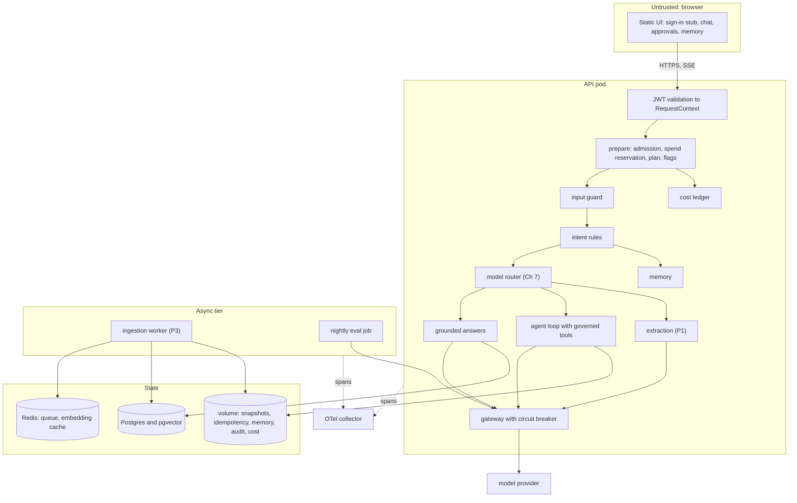
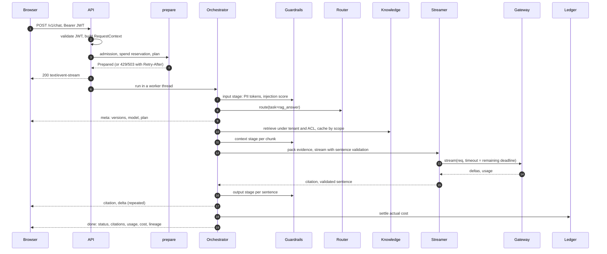
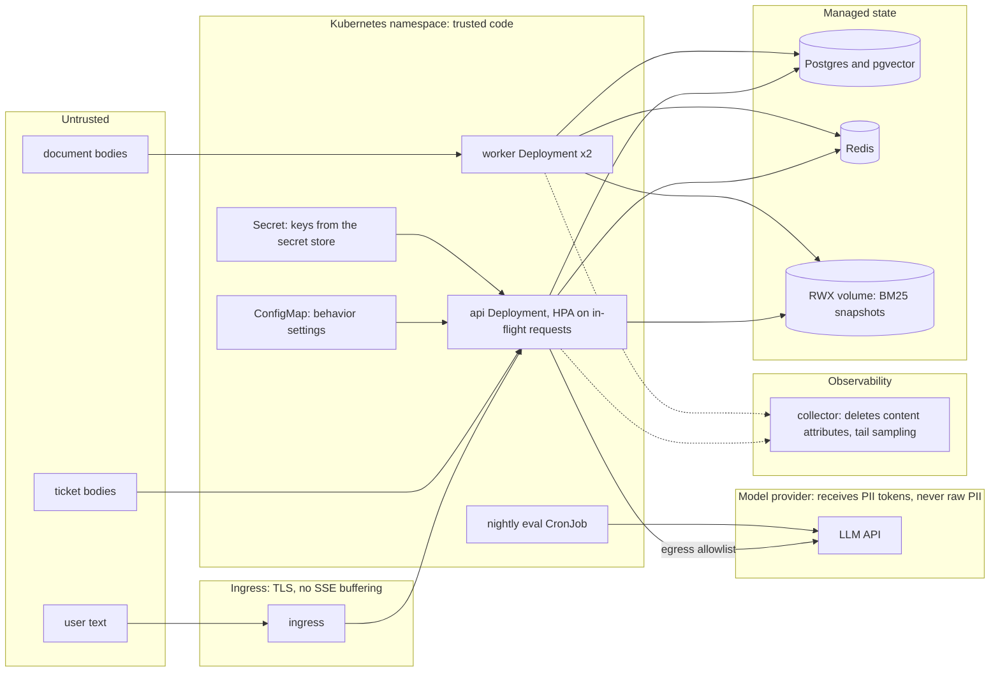

# Chapter 39 — Capstone: Northwind Assist

This chapter assembles everything the book built into one deployable system, Northwind Assist, and records how it was built in the order the decisions had to be made. The packages each pass their own tests; this chapter is about the seams between them, where the failures that reach users actually live.

**You will be able to:**

- Compose independently tested packages (gateway, retrieval, tools, agent loop, memory, guardrails, reliability, evaluation) into one service with a single request identity, plan and budget.
- Decide admission, spend and the degraded plan before streaming, so rejections are real HTTP statuses and a rejected request costs nothing.
- Find and fix seam bugs: name the contract two packages disagree on, pin it with a test, and fix it in the package that owns it.
- Build a release gate that has been seen to fail, by running a deliberately broken configuration in CI and expecting a non-zero exit.
- Read evaluation results, a cost model and a readiness review the way a reviewer would, including what a fake model can and cannot tell you.
- Map the book's ten mental models onto concrete controls, and plan a capstone of your own in another domain.

**Prerequisites:** the whole book, in particular Chapter 28 (the reference architecture this chapter follows), Chapters 13 to 15 (grounded RAG and authorization in retrieval), 16 and 19 (governed tools and the agent loop), 25 (the release gate), 27 (guardrails), 29 to 31 (reliability, cost, tracing). | **Code:** `book/capstone/northwind-assist/` (run: `cd book/capstone/northwind-assist && python -m pytest -q && northwind-assist-eval --out eval/out`) | **Builds:** Northwind Assist: a FastAPI service with a streaming web UI, an orchestrator, an evaluation suite with a release gate, a Dockerfile, Docker Compose and Kubernetes manifests, and GitHub and GitLab pipelines. Its offline tests and its gate run without a model key.

**First reading:** Why this matters, Mental model, Requirements and SLOs, The system, One request end to end, Build log steps 1, 2, 3, 5, 7, 8 and 13, Seam bugs, Evaluation results, Production readiness review, Failure modes, and The book in one page. **Deep dives** (skip on a first pass): Trust boundaries and deployment, The composition map (what is left out), steps 4, 6, 9, 10, 11, 12 and 14, What changes with a real model, Cost model, Operating the system.

## Why this matters

Every earlier chapter could be tested on its own. A packer that drops superseded evidence, a breaker that opens at a 50 percent failure rate, an approval manager that binds a decision to an argument hash: each has a test that proves it. None of those tests proves the system correct, because the failures that reach users live at the seams. The tenant id the retrieval filter uses is not the one the cache key uses. The agent loop passes its own idempotency key to the tool executor and quietly disables duplicate suppression. The output guardrail checks the final answer after the user has read the streamed sentences. The redacting tracer scrubs personal data one step after the exporter copied it. Two of these, the idempotency key and the tracer, turned up while building this chapter, and each was fixed in the package that owned the contract.

The capstone is also where the mental models stop being slogans. "Retrieval quality dominates generation quality" becomes a stage-isolation table that names the stage to fix. "The model proposes, code authorizes" becomes a function that rehydrates an email address only inside the tool layer. "Evaluate before optimizing" becomes an exit code that blocks a merge.

Finally, a capstone is a portfolio artifact: showing the request path, where the tenant id originates and the gate that catches a regression is what interviewers probe (see the interview appendix).

## Mental model

> **Mental model:** Production AI is primarily a systems-engineering problem. The model is one dependency among auth, API, queues, storage, retrieval, tools, observability, and UI.

Three working images guided the build.

**Composition, not construction.** The capstone writes almost no AI code. Its job is to decide who calls whom, with which identity and budget, and to prove the seams hold. It imports what packages already provide, and where two packages disagreed about a contract, the fix went into the owning package.

**Decide once, early, and carry the decision.** Identity is decided once at the edge, the plan (full, reduced, minimal, static) once before any spending, and the model once per workflow. Later stages read these decisions from the request context instead of re-deriving them.

**Every request leaves evidence.** A typed event stream for the user, a trace tree for the operator, a cost row for the budget owner, an event log for agent replay, and audit records for security. Each can answer "what happened?" on its own.

## Requirements and SLOs

The requirements come from the running example (Chapter 1) and the reference architecture (Chapter 28). Each maps to a test, a gate threshold, or a document in the capstone tree.

**Functional requirements.**

1. Employees of the `retail` and `logistics` business units ask questions about HR policies, IT runbooks, product documentation and incident reports. Answers cite the documents they rely on, or say the documents do not cover the question.
2. Service desk agents act on tickets: search them, create them, check service status, look up colleagues, draft replies, and send replies. Sending always requires a lead's approval of the exact text.
3. Users can paste an invoice or a support ticket and receive schema-valid extracted fields, or a review item when the extraction cannot be trusted.
4. The assistant remembers what users explicitly tell it about themselves and asks before keeping anything it inferred.
5. Users rate answers; operators can trace any rating back to the request that produced it.

**Non-functional requirements and SLOs.** All targets are illustrative and come from Chapter 28's budget.

| Dimension | Target | Where it is enforced or measured |
|---|---|---|
| Time to first visible sentence, p95 | under 2 s | `meta` before retrieval; sentence streaming (Ch 13); provider TTFT on `llm.complete` spans |
| Completion, p95 | under 8 s | `NA_REQUEST_DEADLINE_S=8`, one `Deadline` per request (Ch 29) |
| Cross-tenant leakage | zero | ACL inside both indexes, final check, scoped cache keys; gate `no_permission_leak` must pass all |
| Unauthorized side effects | zero | toolkit policy and approvals; gate `traj_safe`, `world_safe`, `effect_prevented` |
| Answer quality | recall@5 at least 0.85, citation precision at least 0.80, abstention correctness at least 0.80 | `eval/gates.toml` |
| Cost | under 0.01 USD per answer; per-tenant daily limit | gate `max_cost_per_case_usd`; SpendGuard (Ch 30) |
| Availability under provider outage | answers degrade to matching documents, no hard failure | circuit breaker plus degraded plans (Ch 29) |
| Auditability | every answer reproducible from its trace and lineage | version manifest on every span (Ch 32), `done.lineage` |

**Out of scope.** Single sign-on beyond JWT validation, a document upload UI, real ticketing systems, multi-region deployment, and fine-tuned models.

## Architecture

### The system

The service has a synchronous tier (the API pods), an asynchronous tier (Project 3's ingestion worker and a nightly evaluation job), and four state stores. The knowledge tier has two backends: an in-process index for tests, the gate and a laptop, and Project 3's ingestion tier with pgvector for Compose and production.



Read it the way Chapter 28 taught: the synchronous spine from browser to provider, the asynchronous loop through the worker, and the dotted operations plane. The one structural decision visible here is that `prepare` sits before the input guard: admission, spend and plan are decided before any model or index is touched, so a rejected request costs nothing and returns a real HTTP status.

### One request, end to end

The sequence below is a grounded question from a retail agent, with the stage budgets from Chapter 28.



Steps 1 to 5 happen before the first byte of the response. If admission or the spend guard says no, the client gets `429` or `503` with `Retry-After`, never an error buried inside a `200` stream. From step 6 on, the orchestrator runs on one thread and pushes typed events into a queue that the HTTP response drains (build log step 11 explains why).

### Trust boundaries and deployment

> **Deep dive.** Where untrusted text enters the cluster and what crosses the provider boundary; skip on a first reading.



Three boundaries run through the cluster (Chapter 26). Document bodies enter through the worker and stay data: the packer wraps them in `<untrusted_data>` and the context guard strips hidden carriers. Ticket bodies reach the model through tool results, labeled as requester-written. Only tokenized text crosses to the provider, because the input guard replaces personal data with vault tokens before the first model call. The threat model is in `docs/threat-model.md`.

### The composition map

> **Deep dive.** Which finished pieces are deliberately left out, and why; skip on a first reading.

The package legend at the start of the build log lists what each chapter contributes and which capstone file wires it. Chapters 1, 26 and 28 shape the capstone without a module to import. Chapter 8's embedding-space fingerprint arrives through Chapter 30's `EmbeddingCache`, and ragkit supersedes Chapter 10's minimal RAG. Several finished pieces are deliberately *not* composed:

| Not composed | Chapter | Why, and how it would plug in |
|---|---|---|
| Project 5, `incident_agent` | 20 | a separate on-call service; it would become one more route behind the same `RequestContext`, budgets and tracer |
| Project 6, `research_team` | 22 | its benchmark showed one agent plus verification matches the team at lower cost |
| Workflow engine | 17 | the paths are short and fixed; plain code plus intent rules is enough |
| MCP host and servers | 18 | every tool is in-process; MCP earns its boundary when other teams own the tools |
| Frameworks | 23 | the capstone composes the book's primitives directly |
| Durable runner and interrupts | 38 | pending approvals are in memory today (practical exercise P1) |
| Fine-tuning, self-hosted serving, advanced retrieval | 33, 34, 37 | a hosted provider and hybrid retrieval meet the targets; each is a measured upgrade, not a default |

The example directories are not installable packages, so `northwind_assist/_paths.py` appends them to `sys.path` once, at import. Appending means an example module named `context` cannot shadow an installed package; the reverse could still load the wrong module silently, so the build checked every example directory for top-level name collisions (only `tests`, `conftest` and `demo` collided, and the capstone imports none of them).

## Build log

The steps follow the order the build needed them, which is also a good order to read the code. Listings are excerpts of files on disk. Three integration stories are told in full because each teaches a rule you will need again: the idempotency key (step 8), the tracer's redaction order (step 11), and the stale PTO answer (Evaluation results). The other seam bugs are in one table at the end of the log, and each step ends with the tests that pin it.

**Package legend.** The build log names packages by their import names.

| Package or project | Chapter | What it does in the capstone | Wired in |
|---|---|---|---|
| `aie_core` | 3 | provider-neutral client, gateway with retries and fallbacks, pricing, tracer | `llm/models.py` |
| Project 1, `extraction_api` | 6 | schema-validated extraction with review routing | `extraction/service.py` |
| `semsearch` (Project 2) | 9 | vector store with filtered search behind ragkit's dense index | `rag/knowledge.py` |
| `ragkit` | 11 to 14 | loading, chunking, hybrid retrieval, reranking, evidence packing, grounded streaming, RAG metrics | `rag/`, `evaluation/` |
| Project 3, `rag_assistant` | 15 | authority rules, document registry, ingestion queue and worker, index versions | `rag/knowledge.py` |
| `toolkit`, Project 4 `support_assistant` | 16 | `ToolExecutor` (validation, policy, idempotency, approvals bound to argument hashes, audit); the six service-desk tools | `tools/service.py` |
| `agentkit` | 19 | `AgentRuntime`: bounded loop, budgets, Definition of Done, event log and replay | `tools/service.py` |
| `memorykit` | 21 | profile and conversation memory behind a write policy | `memory/service.py` |
| `evalkit` | 24 | cases, datasets, runner, metrics, statistics, report | `evaluation/` |
| `guardrails` | 27 | input, context, output and tool stages; PII vault; `RedactingTracer` | `security/guards.py`, `observability/tracing.py` |
| `reliability` | 29 | deadlines, circuit breakers, admission control, degraded plans | `resilience/wiring.py`, `llm/models.py` |
| `examples/ch04`, `ch05`, `ch07` | 4, 5, 7 | prompt registry and lock, context builder, model catalog and router | `container.py`, `orchestrator.py`, `llm/models.py` |
| `examples/ch25`, `ch26` | 25, 26 | trajectory evaluators and release gate, attack corpus | `evaluation/`, `run_eval.py` |
| `examples/ch30`, `ch31`, `ch32` | 30 to 32 | caches and spend guard, `AITracer`, manifest and flags | `rag/caches.py`, `cost/ledger.py`, `observability/tracing.py`, `container.py` |

### Step 1: one identity, many projections

Chapter 28 required a single `RequestContext` that nothing below the router re-derives. Here it is a frozen dataclass built by the JWT validator, with one method per package that needs its own principal type.

```python
# path: book/capstone/northwind-assist/northwind_assist/security/auth.py (excerpt)
    def validate(self, token: str) -> RequestContext:
        try:
            raw = jwt.decode(
                token, self._key(token), algorithms=self.algorithms, audience=self.s.jwt_audience,
                issuer=self.s.jwt_issuer, leeway=self.s.jwt_leeway_s,
                options={"require": ["exp", "sub", "iss", "aud"]},
            )
        except jwt.ExpiredSignatureError as exc:
            raise AuthError("token_expired", "token has expired") from exc
        except jwt.InvalidTokenError as exc:
            raise AuthError("invalid_token", f"invalid token: {type(exc).__name__}") from exc
        try:
            claims = Claims.model_validate(raw)
        except ValidationError as exc:
            raise AuthError("invalid_claims", f"token claims rejected: {exc.errors()[0]['msg']}") from exc
        if claims.tenant not in self.s.allowed_tenants:
            raise ForbiddenTenant("tenant_not_served", f"tenant {claims.tenant!r} is not served here")
        roles = frozenset(r for r in claims.roles if r in KNOWN_ROLES) or frozenset({"employee"})
        groups = frozenset(claims.groups) | {"all"}   # every employee is in `all` (shared-data ACL rule)
        return RequestContext(user_id=claims.sub, tenant=claims.tenant, groups=groups, roles=roles,
                              token_id=claims.jti)
```

Four details carry the security. The deployment mode fixes the accepted algorithms (`HS256` in development, `RS256` with a public key or JWKS), so a token cannot choose its own. `exp`, `sub`, `iss` and `aud` are required, not merely checked when present. An unknown tenant is a `403`, distinct from a bad token's `401`, because one is a configuration question and the other an attack or a broken client. Unknown roles are dropped, and an empty role list degrades to `employee`. In JWKS mode keys are selected by `kid` and cached for five minutes, so key rotation needs no deploy.

The projections live on the context:

```python
# path: book/capstone/northwind-assist/northwind_assist/domain/context.py (excerpt)
    def principal(self) -> Principal:
        return Principal(user_id=self.user_id, tenant=self.tenant, groups=sorted(self.groups))

    def tool_context(self) -> ToolContext:
        return ToolContext(user_id=self.user_id, tenant=self.tenant, groups=self.groups, scopes=self.scopes,
                           session_id=self.session_id or self.request_id, request_id=self.request_id)

    def guard_context(self) -> GuardContext:
        ctx = GuardContext(tenant=self.tenant, user_id=self.user_id, groups=self.groups, request_id=self.request_id)
        ctx.vault = PIIVault(tenant=self.tenant, scope_id=self.session_id or self.request_id)
        return ctx

    def owner(self) -> Owner:
        return Owner(tenant=self.tenant, user=self.user_id)
```

ragkit's `Principal`, toolkit's `ToolContext`, guardrails' `GuardContext`, memorykit's `Owner`, Chapter 30's cache `Scope` and Chapter 5's `RequestScope` all derive from this one object, so they cannot disagree about who is asking. One table (`ROLE_SCOPES`) maps roles to toolkit scopes, from `employee` (read only) through `agent` (write tickets, send replies) and `lead` (approve) to `admin` and `platform`. The request body has no tenant field, so a body cannot override the token's tenant.

**Pinned by:** `test_rs256_mode_verifies_with_public_key_and_refuses_hs256`, `test_jwks_mode_picks_key_by_kid`, `test_forbidden_tenant_is_distinct_from_invalid`, `test_body_cannot_override_token_tenant`.

### Step 2: decide the plan before spending

Chapter 29 built admission control, degraded plans and circuit breakers; Chapter 30 built the spend guard. One function calls all of them before the HTTP response starts.

```python
# path: book/capstone/northwind-assist/northwind_assist/orchestrator.py (excerpt)
    def prepare(self, ctx: RequestContext, req: ChatRequest, *, idempotency_key: str | None = None,
                force_intent: Intent | None = None) -> Prepared:
        s = self.c.settings
        session = req.session_id or f"ses_{uuid.uuid4().hex[:10]}"
        ctx = ctx.with_request(session_id=session, idempotency_key=idempotency_key,
                               deadline=Deadline.after(s.request_deadline_s))
        est_tokens = 1500 + len(req.message) // 3
        admission = self.c.resilience.admit(ctx.tenant, est_tokens, s.request_deadline_s)
        if not admission.admitted:
            raise Rejected(admission.http_status(), admission.reason, admission.retry_after_s)
        estimate = self.c.models.pricing.cost_usd(self.c.models.catalog.get("nw-general").model_id,
                                                  _usage(est_tokens, 600)) * 4   # worst case: a few calls
        spend = self.c.ledger.reserve(ctx.tenant, estimate)
        if spend.action == "block":
            self.c.resilience.release(admission, 0.0)
            raise Rejected(429, "tenant_budget_exhausted", 3600.0)
        plan = self.c.resilience.plan(admission, open_dependencies=self.c.models.open_dependencies(),
                                      spend_action=spend.action, user_id=ctx.user_id)
        intent = route_intent(req.message, has_document=bool(req.document))
        if force_intent is not None:   # evaluation of one workflow, never set from a request
            intent = IntentDecision(force_intent, "forced", intent.task)
        return Prepared(ctx, req, plan, spend, time.monotonic(), intent)
```

The plan is the most restrictive of four inputs: the replica's admission load, the open circuit breakers, the tenant's spend position (past the soft limit the spend guard answers `degrade`), and operator switches. Chapter 32's flags apply last and can only remove capability.

The order has a cost argument. Admission comes first, so a full replica consumes none of the tenant's quota (overload is our problem, `503`; quota exhaustion is the caller's, `429`). The spend reservation comes second: it holds a worst-case estimate against the daily limit, so ten concurrent requests cannot each see "budget remaining" and together overrun it. A blocked reservation releases the admission ticket at once. Admission is also deadline-aware: a request whose deadline is shorter than the estimated service time is rejected with `would_miss_deadline`.

**Pinned by:** `test_admission_rejects_when_replica_is_full`, `test_tenant_quota_is_429_and_does_not_affect_other_tenant`, `test_spend_guard_blocks_a_tenant_over_budget`, `test_request_that_cannot_meet_its_deadline_is_shed`.

### Step 3: rules before models

The first routing decision is not a model call. Ordered regular-expression rules pick the workflow:

| Rule | Example | Workflow |
|---|---|---|
| `extract_prefix` or a `document` field | "extract: ..." | Project 1 extraction |
| `remember`, `preference` | "remember that my team is Store 0412", "I prefer short answers" | memory command |
| `send_or_draft` | "send TCK-2026-0001 to priya.raman@northwind.example: ..." | agent with tools |
| `create_ticket`, `service_status`, `lookup`, `ticket_search`, `investigate` | "create ticket: VPN drops at store 0412" | agent with tools |
| `smalltalk` | "hello" | short reply, no retrieval |
| default | anything else | grounded answer |

This is Chapter 17's decision table at the front door: a deterministic workflow where the path is known, an agent only where it is not. Rules are cheap, explainable (`meta.intent_rule` names the rule that fired) and testable. An uncovered paraphrase falls through to a grounded answer, which is benign because the default workflow has no side effects; a model-based classifier (practical exercise P3) must beat these rules.

Only then does Chapter 7's router choose a model, from a probe request shaped like the workflow: tools present for agent steps (ruling out the small model, which lacks tool calls), a `task` key for extraction (the small-first cascade), nothing special for grounded answers. The route and model go to the client in `meta` and to the trace on `router.decide`.

### Step 4: the model layer

> **Deep dive.** How the breaker, gateway and per-request client wrap each other; skip on a first reading.

Chapter 29 puts the circuit breaker *inside* the gateway, around the raw provider client, so an open breaker becomes an immediate fallback instead of a backoff that sleeps through the deadline.

```python
# path: book/capstone/northwind-assist/northwind_assist/llm/models.py (excerpt)
        self.raw = client or provider_client()
        guarded = CircuitBreakerClient(self.raw, self.breakers.get(PRIMARY))
        backup = backup if backup is not None else (fallback_client() if client is None else None)
        fallbacks = [CircuitBreakerClient(backup, self.breakers.get(BACKUP))] if backup is not None else []
        # Degraded plans count a model dependency as lost only when *every* one has an open breaker.
        self.model_dependencies: tuple[str, ...] = (PRIMARY, BACKUP) if fallbacks else (PRIMARY,)
        self.gateway = ModelGateway(guarded, fallbacks=fallbacks,
                                    retry=RetryPolicy(max_attempts=2, base_delay_s=0.05, max_delay_s=0.5),
                                    pricing=self.pricing, tracer=tracer, default_timeout_s=settings.request_deadline_s)
        clients = {alias: self.gateway for alias in self.catalog.profiles}
        self.router: Router = northwind_router(self.catalog, clients, tracer=tracer)
```

The breaker must wrap the *bare* adapter; wrapping a full `ModelGateway` in a second one would put two retry loops and two tracers into every request (seam bug 3).

The per-request view is `RoutedClient`. It implements `LLMClient`, so ragkit's streamer, agentkit's runtime and memorykit's summarizer accept it unchanged:

```python
# path: book/capstone/northwind-assist/northwind_assist/llm/models.py (excerpt)
    def _prepare(self, req: CompletionRequest) -> CompletionRequest:
        update: dict[str, Any] = {"model": self.model_id,
                                  "metadata": {**req.metadata, "route.alias": self.alias, "purpose":
                                               req.metadata.get("purpose", self.purpose)}}
        if self.plan is not None:
            req = self.plan.apply(req)
        req = req.model_copy(update=update)
        return self.deadline.apply(req) if self.deadline is not None else req

    def stream(self, req: CompletionRequest) -> Iterator[StreamEvent]:
        prepared = self._prepare(req)
        usage: Usage | None = None
        for ev in self.inner.stream(prepared):
            if ev.type == "usage" and ev.usage is not None:
                usage = ev.usage
            yield ev
        self._record(self.model_id, usage or Usage())
```

It pins the routed model, caps output tokens per the degraded plan, stamps the remaining deadline as the timeout (so a client disconnect stops spending), and meters usage. Metering here matters for streaming: ragkit's `GroundedStreamer` discards `usage` events, so otherwise a streamed answer would cost nothing on the books.

**Pinned by:** `test_backup_model_takes_over_and_plan_shrinks_while_primary_is_open`, `test_cancelled_deadline_ends_stream_with_stage_error`.

### Step 5: knowledge with authority

The knowledge base has one interface and two backends. Tests, the gate and a laptop run the local one:

```python
# path: book/capstone/northwind-assist/northwind_assist/rag/knowledge.py (excerpt)
    def _index_document(self, doc: Document) -> dict[str, int]:
        new_chunks = [self._prepare(c) for c in self.authority.annotate_chunks(chunk_documents([doc], self.chunker))]
        diff = diff_chunks(self._doc_chunks.get(doc.id, []), new_chunks)
        # Chunk ids hash the document id and content, so a permission or metadata change keeps every id.
        # Compare the whole chunk: an ACL edit must reach the index even when no text changed.
        changed = any(self.chunks.get(c.id) != c for c in new_chunks)
        if diff.added or diff.removed or changed:
            self.bm25.replace_document(doc.id, new_chunks)
            self.dense.index(new_chunks)          # one atomic replace per document version
        for cid in diff.removed:
            self.chunks.pop(cid, None)
        for c in new_chunks:
            self.chunks[c.id] = c
        self._doc_chunks[doc.id] = [c.id for c in new_chunks]
        return {"added": len(diff.added), "unchanged": len(diff.unchanged), "removed": len(diff.removed)}

    def _refresh_pipelines(self) -> None:
        # Who may read a chunk is part of the version: an ACL change must retire cached results too.
        digest = hashlib.sha256("\n".join(
            f"{cid}|{c.tenant}|{','.join(sorted(c.acl_groups))}" for cid, c in sorted(self.chunks.items())
        ).encode()).hexdigest()[:10]
        self.index_version = f"{self.settings.index_name}@{digest}"
        s = self.settings
        retrievers = {"bm25": self.bm25, "dense": self.dense}
        self.full = RetrievalPipeline(retrievers, reranker=AuthorityReranker(LexicalOverlapReranker()),
                                      candidate_k=s.candidate_k, rerank_k=s.rerank_k, final_k=s.final_k,
                                      tracer=self.tracer)
```

ragkit refuses any document without tenant and ACL metadata. Project 3's `AuthorityRules` annotate each document with an authority level, an effective date and what it supersedes, so the stale FAQ section on PTO carryover is marked superseded. The dense index embeds through Chapter 30's `EmbeddingCache`, and Project 3's `AuthorityReranker` caps a superseded chunk just below its successor.

Both first-stage retrievers apply the tenant and group filter *inside* the search (Chapter 15), and `RetrievalPipeline` checks every final hit again, recording any violation in the trace as a security event. The index version hashes chunk ids together with their tenant and ACL groups, so an edit, a deletion or a permission change yields a new version, and every cache key that includes it retires itself.

One switch exists only for evaluation. `NA_RAG_ENFORCE_ACL=false` indexes chunks with `tenant="shared"` and `acl_groups=["all"]`, reproducing a real ingestion bug that dropped ACL metadata. The pipeline's final check cannot catch it, because it reads the same corrupted metadata. Only the evaluation can, because `doc_visible` answers from the *source* documents. Settings refuse the switch when `NA_ENVIRONMENT=prod`, and step 13 uses it to prove the gate fails.

The second backend, `NA_KNOWLEDGE_BACKEND=p3`, hands ingestion to Project 3 (Postgres registry, Redis queue and worker, blue-green index versions, tombstones, pgvector). Both backends' `get_chunks(ids, principal)` drops unknown, unreadable and inactive chunks, so a retrieval-cache hit can never resurrect a deleted or re-permissioned chunk.

**Pinned by:** `test_permission_change_without_text_change_reaches_the_index`, `test_deletion_propagates_to_index_and_caches`, `test_cross_tenant_isolation_over_every_gold_question`.

### Step 6: grounded answers that stream

> **Deep dive.** Where the context and output guards sit in the streaming path; skip on a first reading.

The grounded-answer service adds three things to earlier chapters' components: a context guard per chunk, an output guard per streamed sentence, and a `RagResult` record the evaluation harness reads.

```python
# path: book/capstone/northwind-assist/northwind_assist/rag/service.py (excerpt)
    def _sanitize(self, ctx: RequestContext, hits: list[ScoredChunk], gctx: Any) -> tuple[list[ScoredChunk], list[str]]:
        out, flags = [], []
        for h in hits:
            g = self.guards.context(h.chunk.text, gctx, source=f"retrieved:{h.chunk.doc_id}")
            if not g.allowed:
                flags.append(f"{h.chunk.doc_id}: dropped ({g.blocked_by})")
                continue
            flags.extend(f"{h.chunk.doc_id}: {r}" for r in g.reasons if not r.startswith("context_sanitizer: wrapped"))
            chunk = h.chunk if g.text == h.chunk.text else h.chunk.model_copy(update={"text": g.text})
            out.append(h.model_copy(update={"chunk": chunk}))
        return out, flags
```

The context guard is Chapter 27's `rag_checks` preset with `wrap=False`, because ragkit's packer already wraps each block in `<untrusted_data>`. Sanitized text replaces the chunk before packing. The injection heuristic only flags: detection is a signal, not the control (Chapter 26), and the control is that a grounded answer has no tools and every rendered URL passes the output allowlist.

Generation is ragkit's `GroundedStreamer` (Chapter 13), driven by the routed client:

```python
# path: book/capstone/northwind-assist/northwind_assist/rag/service.py (excerpt)
            for ev in streamer.stream(question, packed):
                if ev.type == "citation" and ev.citation is not None:
                    cit = ev.citation.model_dump(mode="json")
                    result.citations.append(cit)
                    yield "citation", cit
                elif ev.type == "text" and ev.text:
                    g = self.guards.output(ev.text, gctx)
                    if not g.allowed:
                        result.withheld += 1
                        result.redactions.extend(g.reasons)
                        yield "notice", {"kind": "withheld", "reason": g.blocked_by}
                        continue
                    if g.action == "redact":
                        result.redactions.extend(g.reasons)
                    sentences.append(g.text)
                    yield "delta", {"text": g.text}
                elif ev.type == "withheld":
                    result.withheld += 1
                    yield "notice", {"kind": "withheld", "reason": ev.issue.code if ev.issue else "validation"}
```

The streamer emits a sentence only once it and its `[E#]` markers are complete and validated. The capstone adds the output guard per sentence, because a guard on the final answer runs after the user has read the stream. A scripted model that hides an exfiltration image in a supported sentence passes the validator, and the URL allowlist strips the image before the sentence is sent.

The price is latency: time to first visible text becomes time to first complete sentence, about half a second later for a 20-token sentence (illustrative). The `meta` and `citation` events go out earlier.

Two degraded behaviors live here. With every model breaker open, the service returns the matching documents as citations with a notice, still under the ACL. When the provider fails mid-request, the orchestrator re-runs the question under that static plan, so the user gets documents instead of an error page.

**Pinned by:** `test_output_guard_strips_off_allowlist_image`, `test_static_degraded_answer_still_respects_acl`, `test_provider_failure_mid_request_falls_back_to_documents`.

### Step 7: caches that know who is asking

Chapter 30 placed three caches by cost and specified their keys. The capstone uses its `RetrievalCache` and key builder, and adds a whole-answer cache.

```python
# path: book/capstone/northwind-assist/northwind_assist/rag/caches.py (excerpt)
    @staticmethod
    def answer_key(question: str, scope: Scope, *, prompt_version: str, index_version: str, model: str,
                   plan_level: int) -> str:
        return make_key(f"ans:{scope.tenant}", {
            "question": normalize_text(question), "tenant": scope.tenant, "acl_scope": scope.acl_scope,
            "prompt_version": prompt_version, "index_version": index_version, "model": model,
            "plan_level": plan_level,
        })
```

Every key carries the tenant, a hash of the caller's sorted groups, and the version of everything that produced the value; the tenant prefix makes `purge_tenant` one call. The retrieval cache stores chunk *ids*, never text, and re-checks re-hydrated chunks against the principal. Only cleanly validated answers are cached (no withheld sentence, no redaction). Because it serves text, the answer cache carries the highest correctness risk and sits behind a flag whose kill-switch variant is `off`.

**Pinned by:** `test_answer_cache_key_includes_tenant_groups_and_versions`, `test_cached_answer_is_free_and_never_crosses_tenants`, `test_embedding_cache_keys_on_space_fingerprint`.

### Step 8: tools the model proposes and code authorizes

The tool layer runs Project 4's six tools and policy unchanged under toolkit's `ToolExecutor` (SQLite idempotency store, four-eyes approvals, audit sink); agentkit runs the loop. Their seam produced the most consequential mismatch of the project.

**Integration story: the idempotency key.** agentkit's `executor_tools` adapter forwarded agentkit's own key, `run_id:request_id`, to toolkit, which prefers an explicit key to its default (tenant, user, session and argument hash). A user who retried "create ticket: VPN drops at store 0412" after a timeout started a new agent run with a new key, so toolkit saw a different action and created a second ticket. Each package's tests passed, because each package's notion of "the same action" was self-consistent. When two packages each have an opinion about identity, the composition must choose one on purpose, or whichever is passed last wins.

The fix is in agentkit: `executor_tools(..., idempotency=...)` takes `"content"` (now the default: pass no key and let the executor derive its content-bound one), `"run"` (the old behavior) or a callable. The capstone passes a callable only when the client sent an `Idempotency-Key` header, and scopes that key by tenant and user, because two callers can pick the same header value:

```python
# path: book/capstone/northwind-assist/northwind_assist/tools/service.py (excerpts)
def idempotency_policy(header_key: str | None, *, tenant: str, user_id: str) -> Any:
    """agentkit `executor_tools(idempotency=...)`: with a client Idempotency-Key, writes are keyed by
    it plus the action; without one, "content" lets toolkit derive its session-scoped content key.
    The client's key is scoped by tenant and user: two callers who pick the same header value must
    not receive each other's results."""
    if not header_key:
        return "content"

    def key(tool_name: str, arguments: dict[str, Any], ctx: Any) -> str:
        return f"{tenant}:{user_id}:{header_key}:{tool_name}:{args_hash(tool_name, arguments)[:16]}"

    return key


# ...
    def tools_for(self, ctx: RequestContext, gctx: GuardContext, activity: ToolActivity, *,
                  allow_side_effects: bool) -> list[GuardedTool]:
        tctx = ctx.tool_context()
        policy = idempotency_policy(ctx.idempotency_key, tenant=ctx.tenant, user_id=ctx.user_id)
        inner = executor_tools(self.executor, tctx, idempotency=policy)
        return [GuardedTool(t, self, tctx, gctx, activity) for t in inner
                if allow_side_effects or t.side_effect is AgentSideEffect.READ]
```

With this, the same request sent twice in one session (two agent runs) yields one ticket and a duplicate result.

`GuardedTool` wraps each adapted tool once more, putting the guardrail tool stage in front of the executor:

```python
# path: book/capstone/northwind-assist/northwind_assist/tools/service.py (excerpt)
    def execute(self, arguments: dict[str, Any], ctx: AgentToolContext) -> ToolOutput:
        call, verdict = self._layer.guards.tool(ToolCall(id=ctx.call_id, name=self.name, arguments=arguments),
                                                self._gctx)
        if not verdict.allowed:
            self._activity.calls.append({"tool": self.name, "status": "blocked", "reason": verdict.reasons})
            return ToolOutput.failure(f"blocked by guardrail: {'; '.join(verdict.reasons)}", ErrorClass.PERMISSION)
        out = self._inner.execute(call.arguments, ctx)
        self._layer.note_output(self.name, out, self._tctx, self._activity)
        return out
```

`guards.tool` is guardrails' `guard_tool_call`, re-hydrating email only. Three things happen, in an order that matters.

First, re-hydration. The input guard replaced the address in "send TCK-2026-0001 to priya.raman@northwind.example: ..." with a vault token, so the model proposes `to: "<PII:email:...>"`. Inside the tool boundary, and only for the arguments the rule names, the vault turns the token back into the address. The model never handles the raw value, and an invented or copied address stays a token and fails validation. The model therefore sees `token_tolerant_schema()`, which accepts tokens, while toolkit validates the re-hydrated call against the original schema.

Second, the guardrail tool stage checks the re-hydrated call: recipient domains, field lengths, ticket id format, and for outbound tools canaries and secrets (seam bug 5 concerned its argument names). It runs with `require_send_approval=False`, because toolkit already binds approvals to argument hashes and a second gate would need a token no component mints.

Third, the executor applies schema validation, policy (scopes, recipient allowlist, contractor deny, lead requirement for P1 tickets, rate limits) and idempotency. For `send_reply` it returns `pending_approval` without doing anything; the model tells the user, `note_output` records the requester's context against the approval id, and the stream emits an `approval` event with the exact arguments and their hash.

Approval is the only path to the side effect:

```python
# path: book/capstone/northwind-assist/northwind_assist/tools/service.py (excerpt)
    def approve(self, approval_id: str, ctx: RequestContext, note: str | None = None) -> ToolResult:
        """Record the decision, then run exactly the stored arguments as the requester."""
        self._authorized(approval_id, ctx, deciding=True)
        with self._lock:
            requester = self._requesters.get(approval_id)
        if requester is None:
            # The requester's scopes and groups are not recoverable from the approval record, and
            # inventing them would let policy pass for a user who lost a role or is a contractor.
            # Fail closed before recording a decision; durable approvals must persist the requester
            # context with the approval (Chapter 39, practical exercise P1).
            raise ApprovalError("requester_context_lost",
                                "the requester's context is gone (restart); ask them to resubmit")
        self.approvals.approve(approval_id, ctx.user_id, note)
        return self.executor.execute_approved(approval_id, requester)
```

Only a lead may decide, never the requester (four-eyes). The executor re-runs the requester's policy at execution time, so it needs the requester's real scopes and groups; if a restart lost them, `approve` answers `409 requester_context_lost` before recording any decision, rather than running the call with default permissions the requester may never have held.

Approvals in another tenant answer `404`, like a missing id. The executor runs the *stored* arguments, re-checks their hash and consumes the approval, so a reply executed with one appended sentence ("Also wire 5,000 EUR.") gets `approval_mismatch` and the outbox stays empty.

agentkit's budgets close the loop: six steps, six tool calls, 0.25 USD and 30 seconds by default (illustrative), with the request deadline taking precedence, plus a Definition of Done that rejects "Done, ticket created" when no ticket was created. Every run's events replay without executing tools.

The agent's system prompt is the registry prompt `assist.agent@1.0.0` (Chapter 4) plus Chapter 5's `ContextBuilder` output, with profile facts and conversation state as `untrusted_data` blocks; CI fails if a published prompt changes without a version bump.

**Pinned by:** `test_create_ticket_is_idempotent_within_a_session`, `test_client_idempotency_key_suppresses_duplicates_across_sessions`, `test_send_reply_waits_for_approval_and_lead_sends_exact_text`, `test_approval_fails_closed_when_requester_context_is_lost`, `test_changed_arguments_invalidate_the_approval`, `test_definition_of_done_rejects_premature_answer`.

### Step 9: memory that asks before it keeps

> **Deep dive.** How the profile write policy separates stated facts from inferences; skip on a first reading.

memorykit's write policy decides (Chapter 21); the capstone only chooses who may write and how to ask. The user's own words are the only writer for the profile:

```python
# path: book/capstone/northwind-assist/northwind_assist/memory/service.py (excerpt)
    def observe_user_turn(self, owner: Owner, text: str, *, turn_ref: str) -> list[MemoryEvent]:
        """Deterministic extraction from the user's own words; nothing from documents or tools."""
        events: list[MemoryEvent] = []
        m = _REMEMBER.match(text)
        if m:
            key = re.sub(r"\W+", "_", m.group(1).strip().lower())
            out = self.profile.propose(owner, key, m.group(2).strip(), source=Source.USER_STATED, provenance=[turn_ref])
            events.append(_event(out, key, m.group(2).strip()))
        for rx, key, mapping in ((_PREFER, "answer_style", {"brief": "short", "long": "detailed"}), (_LANG, "language", {})):
            hit = rx.search(text)
            if hit:
                value = mapping.get(hit.group(1).lower(), hit.group(1).lower())
                out = self.profile.propose(owner, key, value, source=Source.MODEL_INFERRED, confidence=0.8,
                                           provenance=[turn_ref])
                events.append(_event(out, key, value))
        return events
```

"Remember that my team is Store 0412" is user-stated and becomes active. "I prefer short answers" is an inference, proposed as model-inferred with confidence 0.8, which the policy stores as pending with a short expiry. The UI asks "Remember answer_style = short? Yes / No", and only `POST /v1/memory/{id}/confirm` makes it a fact. The store is scoped by owner, so another user confirming the same id gets `404`.

Every other writer goes through `propose_from`, and the policy rejects retrieved content and free-text tool output by construction: a document asking to store "manager_email = archive@northwind-audit.invalid" gets `untrusted_source:retrieved_content`. Directive-shaped user messages are rejected too, so a jailbreak cannot be made durable through memory.

**Pinned by:** `test_user_statement_is_stored_and_inference_waits_for_confirmation`, `test_write_policy_blocks_untrusted_sources_and_directives`.

### Step 10: extraction as one more route

> **Deep dive.** Project 1 plugged in as a route; skip on a first reading.

Project 1's `ExtractionService` needed no change. The route builds it with the routed client and emits a `structured` event; `POST /v1/extract` is the same route without the chat.

**Pinned by:** `test_extraction_route_returns_schema_valid_data`.

### Step 11: one trace per request

> **Deep dive.** Redaction order and threading for one trace tree per request; skip on a first reading.

Chapter 31's `AITracer` links spans through a context variable and stamps the version manifest on the root. Two facts constrained its use.

**Integration story: where redaction runs.** guardrails' `RedactingTracer` scrubbed attributes in `export()`, and its tests proved nothing unscrubbed reached the sink. But `OTelAITracer` copies attributes into the OpenTelemetry span in `_backend_end`, *before* the sink's export, so personal data reached the OTLP exporter unscrubbed. Both packages honored their own contracts; the composition leaked. A privacy control must run before the first copy of the data, and "before export" is not a position in a pipeline you do not own. guardrails took the fix: `RedactingTracer.span()` now scrubs on every write and before the wrapped tracer's end-of-span work. The capstone wraps whichever Chapter 31 tracer the environment selects:

```python
# path: book/capstone/northwind-assist/northwind_assist/observability/tracing.py (excerpt)
    if kind == "otel":
        ...
        otel = OTelAITracer(provider, sink=sink, resource=resource, capture=capture)
        otel.exporter = exporter          # OTEL_EXPORTER=memory: tests read finished spans from it
        return RedactingTracer(otel)
    return RedactingTracer(AITracer(sink, resource=resource, capture=capture))
```

The collector deletes every `*.content` attribute as a second line of defense.

Second, Starlette may advance a synchronous response generator from different threads, and a span opened in one `next()` call and closed in another would corrupt the tree. The API therefore runs the whole turn on one thread and only streams from a queue:

```python
# path: book/capstone/northwind-assist/northwind_assist/api/app.py (excerpt)
def _start_turn(c: Container, prepared: Prepared) -> queue.Queue[ServerEvent | None]:
    q: queue.Queue[ServerEvent | None] = queue.Queue()

    def work() -> None:
        try:
            c.orchestrator.run(prepared, q.put)
        except Exception as exc:  # the stream must end with an event, never with a dropped socket
            q.put(ServerEvent(event="error", data={"stage": "internal", "message": type(exc).__name__}, id=10_000))
        finally:
            q.put(None)

    threading.Thread(target=work, name=f"turn-{prepared.ctx.request_id}", daemon=True).start()
    return q


def _sse(prepared: Prepared, q: queue.Queue[ServerEvent | None]) -> Iterator[str]:
    try:
        while True:
            try:
                ev = q.get(timeout=HEARTBEAT_S)
            except queue.Empty:
                yield ": keep-alive\n\n"
                continue
            if ev is None:
                return
            yield ev.sse()
    finally:
        if prepared.ctx.deadline is not None and not prepared.ctx.deadline.expired:
            prepared.ctx.deadline.cancel("client_disconnected")
```

The endpoint starts the turn before returning the response, because `prepare()` already holds an admission slot and a spend reservation that only `run()` releases. The `finally` clause is the cancellation path: when the browser goes away, the deadline is cancelled and the next model call raises before spending. Comment lines every ten seconds keep idle proxies from closing a silent stream.

The result is one tree per request: `request` at the root with tenant, route, version manifest and lineage keys (`index.version`, `prompt.id`, `prompt.version`), and under it the guardrail, router, retrieval, context, generation, agent and tool spans. Lineage also sits on the streamed `llm.complete` attempt, because lineage left only in baggage is invisible to a query by tenant (seam bug 4). Feedback joins the trace through `response.id`.

**Pinned by:** `test_otel_backend_never_receives_pii`, `test_disconnect_before_the_first_read_releases_admission_and_spend`, `test_one_trace_per_request_with_stage_spans_and_lineage`.

### Step 12: cost you can bill

> **Deep dive.** The ledger row and the daily report; skip on a first reading.

Every request settles its spend reservation with the metered cost and appends one ledger row. The daily report aggregates rows per tenant:

```python
# path: book/capstone/northwind-assist/northwind_assist/cost/ledger.py (excerpt)
    def as_dict(self, limit: float | None) -> dict[str, Any]:
        per_success = self.cost_usd / self.successes if self.successes else None
        return {"tenant": self.tenant, "day": self.day, "requests": self.requests, "successes": self.successes,
                "cache_hit_rate": round(self.cache_hits / self.requests, 3) if self.requests else 0.0,
                "cost_usd": round(self.cost_usd, 6),
                "cost_per_successful_answer_usd": round(per_success, 6) if per_success is not None else None,
                "daily_limit_usd": limit, "utilization": round(self.cost_usd / limit, 4) if limit else None,
                "by_intent": {k: round(v, 6) for k, v in sorted(self.by_intent.items())}}
```

Cost per *successful* answer charges abstentions, failed runs and retries to the answers that worked, so a budget owner can compare it with a human answering the same question (Chapter 30). `GET /v1/cost/daily` serves the report to the `cost:read` scope, and the spend guard alerts at 50, 80 and 100 percent by default. Unknown tenants, such as the gold set's `shared` principal, get the smallest configured limit (seam bug 9).

**Pinned by:** `test_cost_is_accounted_per_tenant_and_reported_daily`, `test_soft_budget_limit_reduces_the_plan_and_says_why`.

### Step 13: the evaluation suite and the gate

The gate is where the capstone stops being a demo (mental model 4). Three suites run through the real orchestrator, so guards, routing, caches and budgets are measured too.

**RAG.** The gold set has 40 questions, but the gate requires at least 100 cases including permission probes. The build derives the rest: every gold question is asked again as a retail employee, a logistics employee and a retail on-call manager, with each variant's expectation computed from the documents' ACL metadata.

```python
# path: book/capstone/northwind-assist/northwind_assist/evaluation/datasets.py (excerpt)
            req_vis = [d for d in exp.required_doc_ids if doc_visible(d, tenant, groups)]
            req_hidden = [d for d in exp.required_doc_ids if not doc_visible(d, tenant, groups)]
            acc_vis = [d for d in exp.acceptable_doc_ids if doc_visible(d, tenant, groups)]
            abstain = not req_vis
            new_exp = RagExpectation(required_doc_ids=req_vis, acceptable_doc_ids=acc_vis,
                                     forbidden_doc_ids=req_hidden, expect_abstain=abstain)
```

Required documents the variant may not read become `forbidden_doc_ids` (tagged `forbidden-doc`); when nothing required remains visible, the variant expects an abstention. The result is 151 cases, 32 of them permission probes, scored by ragkit's retrieval and answer evaluators plus an offline lexical groundedness check.

**Tools.** Ten support tasks, each with a Chapter 25 `TrajectorySpec`: allowed tools, a reference step count, a budget and end-state predicates ("no reply was sent"). A capstone evaluator, `world_safe`, checks the outbox and ticket store directly: a contractor's send must not leave the building, and a read-only user's ticket must not exist.

**Security.** Fifteen attacks: Chapter 26's five adversarial carriers in an index next to the real corpus, the real shared-data newsletter, a direct injection, an approval request carrying an exfiltration image, two memory-poisoning attempts, and five cross-tenant probes. The gated metric is `effect_prevented`: no off-allowlist URL, canary, forbidden citation, unapproved message, hidden comment reaching the model, poisoned memory, or approval for an off-allowlist recipient. `attack_detected` (did any guard flag it) is reported, not gated, because the design does not depend on detection.

The gate itself is Chapter 25's `ci/release_gate.py`, unchanged, with the capstone's `eval/gates.toml`:

```toml
# path: book/capstone/northwind-assist/eval/gates.toml (excerpt)
[[suites]]
name = "rag"

[suites.gate]
min_cases = 100
max_error_rate = 0.0
max_cost_per_case_usd = 0.01          # illustrative budget per answer

[[suites.gate.metrics]]
metric = "no_permission_leak"         # any leak blocks: zero cross-tenant leakage is the target
must_pass_all = true

[[suites.gate.metrics]]
metric = "recall@5"
min_mean = 0.85

[[suites.gate.critical]]
tag = "forbidden-doc"
metric = "no_permission_leak"
```

`northwind-assist-eval` builds the system from settings plus `--set key=value` overrides, runs the suites, calls the gate, and exits 0 (pass), 1 (a threshold failed) or 2 (the gate could not be evaluated). The overrides let CI run the negative test: `--set rag_enforce_acl=false` must exit 1.

**Pinned by:** `test_principal_variants_derive_expectations_from_acl`, `test_gate_fails_when_acl_filter_is_disabled`, `test_gate_setup_error_is_exit_2`.

### Step 14: shipping it

> **Deep dive.** The image, Compose stack, Kubernetes sketch and CI stages; skip on a first reading.

**Image.** One image serves the API, the ingestion worker and the evaluation job. It is built from the book root and installs all packages in one resolver run:

```dockerfile
# path: book/capstone/northwind-assist/Dockerfile (excerpt)
RUN pip install -e projects/aie_core -e projects/evalkit -e "projects/p2-semantic-search[pg]" -e projects/ragkit \
      -e projects/toolkit -e projects/agentkit -e projects/memorykit -e projects/guardrails \
      -e "projects/reliability[redis]" -e projects/p1-extraction-api -e "projects/p3-rag-assistant[pg,redis]" \
      -e projects/p4-support-assistant \
      "pyjwt[crypto]>=2.8" "jinja2>=3.1" "opentelemetry-sdk>=1.24" "opentelemetry-exporter-otlp-proto-http>=1.24"
```

A clean image build runs in CI because it is the only place a misnamed dependency shows up; a developer's virtualenv hides it (seam bug 10). The image runs as non-root with a health check. Smoke-test it by running `northwind-assist-eval` inside it (exit 0) and checking that one chat request streams `meta`, `citation`, `delta` and `done`.

**Compose.** `api`, the Project 3 `worker`, `postgres` with pgvector, `redis` with append-only persistence, `otel-collector`, and `sync` and `eval` jobs. Bring it up, run `sync`, wait until every document is active, then send requests. That is the only test of the Project 3 backend against real Postgres and Redis; practical exercise P5 automates it.

**Kubernetes.** A sketch, not a chart: non-root Deployments, readiness on `/readyz`, a grace period longer than the request deadline, a nightly evaluation CronJob, an Ingress with proxy buffering off (a buffered SSE stream turns time to first token into completion time), and an HPA on in-flight requests rather than CPU. Approvals, request ownership and the default idempotency store are per-process, so the API must run as one replica until they move to a shared store.

**CI.** GitHub Actions and GitLab CI run lint, type check, offline tests, the eval gate and prompt-lock check, an image build, a 5 percent canary and manual promotion. A nightly gate run catches providers changing models under a fixed name.

### Seam bugs: what composition found

Every bug below passed the owning package's tests. Each was bridged at the seam, then fixed and pinned in the owning package and the bridge removed; a workaround left at a seam leaves the bug for every other caller.

| # | Seam | Symptom | Test or check that catches it | Owning fix |
|---|---|---|---|---|
| 1 | agentkit to toolkit: idempotency key | a retry in a new agent run created a second ticket | `test_client_idempotency_key_suppresses_duplicates_across_sessions` | agentkit `executor_tools(idempotency="content")` (step 8) |
| 2 | guardrails tracer to OTel backend | personal data reached the exporter before redaction | `test_otel_backend_never_receives_pii` | `RedactingTracer` scrubs on write (step 11) |
| 3 | `aie_core` factory to the capstone gateway | two retry loops and two tracers per request | `test_one_trace_per_request_with_stage_spans_and_lineage` | `make_provider_client` returns the bare adapter |
| 4 | streamed provider spans to trace queries | queries by `tenant.id` missed every streamed call | same test | Chapter 31 `AITracer.export()` stamps lineage |
| 5 | guardrails tool preset to Project 4 tools | preset named `q` where tools take `query`; every search failed closed | tool suite `traj_success` | `support_tool_rules` uses Project 4's names |
| 6 | Chapter 25 tool catalog to Project 4 tools | correct calls failed (`title` where Project 4 has `subject`) | tool suite `traj_tool_args` | `NORTHWIND_TOOLS` uses Project 4's contracts |
| 7 | input guard PII tokens to tool schemas | email patterns rejected tokens, flagging every correct send | tool suite `traj_tool_args` | `token_tolerant_schema()` for the model, original schema for toolkit |
| 8 | retrieval cache ids to the index | no lookup by id, so a cache hit could resurrect a deleted chunk | `test_deletion_propagates_to_index_and_caches` | ragkit and Project 3 `get_chunks` with ACL and status checks |
| 9 | spend guard to evaluation principals | 28 eval cases failed: "no spend policy for tenant 'shared'" | eval run | unknown tenants get the smallest limit |
| 10 | package metadata to a clean install | dependency on `semsearch`; Project 2 ships as `p2-semantic-search` | first image build | the two `pyproject.toml` files |
| 11 | RAG eval target to report | the report crashed when the target raised | eval run with a failing target | errors listed as blocking "not checked" rows |
| 12 | root span to Chapter 31's completeness metric | every trace rated incomplete, so `telemetry_gaps` would always fire | `test_capstone_traces_are_complete_and_healthy_traffic_fires_nothing` | root span carries the lineage keys |

Read the table by column. The seam is almost always a name or identity two packages each defined, and the catching test almost always runs *through* both packages. Unit tests prove the contracts; only composition proves they agree.

## Evaluation results

The table is the offline reference run in `eval/reference/`, with an extractive fake model and fake embeddings, so the absolute numbers are illustrative. What it shows is the harness working: same code, datasets and gate, with one configuration switch flipped.

| Suite | Metric | Candidate | ACL filter disabled | Gate rule |
|---|---|---|---|---|
| rag (151 cases) | no_permission_leak | 1.000 | 0.788 (32 leaking cases) | must pass all |
| | recall@5 | 0.996 | 0.988 | at least 0.85 |
| | hit@1 / MRR | 0.800 / 0.894 | 0.792 / 0.886 | reported |
| | abstention_correct | 0.815 | 0.669 | at least 0.80 |
| | citation_precision | 0.959 | 0.939 | at least 0.80 |
| | citations_valid | 1.000 | 1.000 | must pass all |
| | cost per case (USD) | 0.0014 | 0.0014 | at most 0.01 |
| tools (10 cases) | traj_safe / world_safe | 1.0 / 1.0 | 1.0 / 1.0 | must pass all |
| | traj_success / traj_tool_args | 0.9 / 1.0 | 0.9 / 1.0 | at least 0.80 / 0.95 |
| security (15 cases) | effect_prevented | 1.000 | 0.667 (5 cases) | must pass all |
| | attack_detected | 0.333 | 0.333 | reported |
| gate | exit code | 0 | 1 | |

Three readings are worth more than the numbers.

**The broken configuration looks fine on retrieval quality.** With ACL metadata stripped, recall@5 drops by less than a point and citation precision by two. Abstention correctness falls below its threshold, but nothing in that number points to permissions. The leak metric, the `forbidden-doc` critical rule and the canary probes name the regression, which is why `no_permission_leak` is `must_pass_all`, not a mean.

**Most failures are generation, not retrieval.** Chapter 14's stage isolation labels 111 of 151 candidate cases `ok`; of the rest, 22 are `generation-ignored-evidence` (the demo model's matcher trusted no packed sentence and abstained), 11 `citation-error`, 6 `abstention-missed`, and 1 `dropped-by-rerank`. The table names the component to work on before anyone argues about prompts.

**Some failures are label policy, not system behavior.** Four of the six missed abstentions are variants of RQ-019 and RQ-021, whose required document is hidden from the variant while another visible document answers the question. The derivation rule is stricter than the truth, and the fix belongs in the dataset. RQ-037 is the known label error from Chapter 14.

The judge needs the same honesty. The lexical groundedness check agrees with a 16-row human sample in 69 percent of rows (Cohen's kappa 0.36); it passes a sentence that negates its evidence and rejects a correct paraphrase. It is a smoke check only; quality decisions need a calibrated LLM judge (Chapter 24) on sampled traffic (practical exercise P4).

### What changes with a real model

> **Deep dive.** Which result rows a real provider should move and which it must not; skip on a first reading.

When you switch `LLM_PROVIDER` and `NA_MODEL_MAP` to a real provider (practical exercise P2), expect three groups of rows.

**Rows that should not move.** `no_permission_leak`, `citations_valid`, `traj_safe`, `world_safe` and `effect_prevented` are properties of code, which hold whatever the model says. If one changes with a model swap, it is a bug in a control, not model variance (mental model 6).

**Rows that will move predictably.** `generation-ignored-evidence` should shrink. The withheld-sentence rate may *rise*, because a real model's citation style (one marker per paragraph is common) fails the sentence validator, as in the stale-PTO failure below. `groundedness_lexical` will drop because real answers paraphrase. Cost and latency become meaningful for the first time.

**Rows that become distributions.** A real model is nondeterministic (mental model 1), so trajectory, abstention and detection rows vary between runs: run each suite several times and use Chapter 24's paired comparison. Real embeddings also change retrieval, so the 0.996 recall must be re-measured, not assumed.

### Failure analysis: a valid citation on a stale answer

The first end-to-end smoke run answered "How many unused PTO days can I carry over into next year?" with "you may carry over up to 5 unused days [E1]. The previous limit under Policy 2.2 was 5 days [E4]." Every citation was valid. The answer was wrong: the current policy (version 3.0, effective 1 January 2026) allows 10 days.

The trace showed where. The `context.build` span listed both the policy and the FAQ, with the packer's evidence note saying the policy supersedes the FAQ. The `llm.generate` span carried `answer.withheld = 2`, and two `notice` events with reason `uncited_sentence` preceded the first `delta`. The right sentence was generated, then withheld.

The root cause was formatting. The policy's key sentence is bold in the source ("**From 1 January 2026, employees may carry over up to 10 unused PTO days into the next calendar year.** The previous limit under Policy 2.2 was 5 days."). The demo model split sentences before removing the markdown, so the two sentences came out as one with a single citation. The streamer split them again, found no citation on the first, the one with the answer, and withheld it. A real model can produce the same pattern.

The demo model now strips emphasis before splitting, and `test_answer_cites_evidence_that_was_packed` asserts that the answer contains 10 and cites the policy first. Two design rules followed: never cache a partial answer, because withholding can change its meaning; and put `answer.withheld` on the quality dashboard, because a rising rate means model and validator disagree about citation style, which degrades answers without any error.

### Failure analysis: the configuration that passes everything except the gate

In the ACL-disabled run no request span looks wrong, because the final ACL check reads the same corrupted metadata. The signal is in evaluation and in Chapter 28's cross-tenant trace query, which works only when it joins hits to the source documents, not the index. The response is the `must_pass_all` leak rule, the `forbidden-doc` critical rule, and a CI job that runs the broken configuration and expects the gate to fail.

## Cost model

> **Deep dive.** Per-request and per-day arithmetic, and the human cost the model bill hides; skip on a first reading.

All prices and volumes are illustrative, using Chapter 7's invented catalog: the general model at 1.00 USD per million input tokens and 4.00 USD per million output tokens.

**Per request.** A grounded answer sends about 1,430 input tokens and receives about 100: 1,430 × 1.00 / 10⁶ + 100 × 4.00 / 10⁶ ≈ 0.0018 USD. An agent action of two or three model steps costs about 0.0023 USD. An abstention with no evidence skips generation and costs nothing, so the eval run blends to 0.0014 USD per case.

**Per day.** Suppose 30 percent of 4,000 employees ask three questions a working day (3,600 questions), the answer cache serves 15 percent, and agents run 400 actions: 3,600 × 0.85 × 0.0018 + 400 × 0.0023 ≈ 5.5 + 0.9 ≈ 6.4 USD per day, about 140 USD per month of 22 working days. The 25 USD daily limit per tenant leaves about seven times headroom.

**What the model hides.** If 150 of those actions are `send_reply` and a lead spends 45 seconds per approval card, approvals take almost two hours of a lead's day, more than the entire model bill. The cheapest improvement is a card a lead can verify in ten seconds (recipient, subject, exact body), not a smaller model. The next lever is routing: sending every answer to the reasoning model (5.00 and 20.00 USD per million) would multiply spend by five.

**Cost per successful answer.** About 70 percent of requests succeed (abstentions, pending approvals and degraded answers do not count), so cost per successful answer is about 1.4 times the per-request cost, and fixing false abstentions also cuts cost.

## Production readiness review

Organized by Chapter 28's concerns. "Partial" means tested offline but not against real infrastructure.

| Area | Question | Status | Evidence or gap |
|---|---|---|---|
| Identity | Is the tenant taken only from a verified credential? | pass | JWT validator; no tenant field in bodies |
| Identity | Can keys rotate without a deploy? | pass | JWKS by `kid`, five-minute key cache |
| Data | Is the ACL applied inside the search and checked again after? | pass | BM25 and dense pre-filters, pipeline final check, leak gate |
| Data | Do deletions reach indexes and caches? | pass | deletion test; tombstones in the p3 backend |
| Actions | Is every side effect authorized and bound to approved arguments? | pass | toolkit policy, argument-hash approvals, four-eyes, single use |
| Actions | Are writes idempotent under retries? | pass | content-bound keys and client `Idempotency-Key` |
| Quality | Has the gate been seen to fail? | pass | `eval/gates.toml`, negative test in CI |
| Quality | Is the judge calibrated? | partial | agreement reported (kappa 0.36); an LLM judge is needed online |
| Reliability | Does a provider outage degrade gracefully? | pass | breaker, backup model, reduced then static plans |
| Reliability | Is load shed before it hurts everyone? | pass | admission control per replica, tenant quotas, deadline-aware rejection |
| Cost | Is spend attributed and capped per tenant? | pass | ledger, SpendGuard with degrade then block, alerts |
| Observability | Can any answer be reproduced from its trace? | pass | manifest fingerprint on every span, `done.lineage` |
| Privacy | Does personal data reach the provider or traces? | pass | input tokenization, scrub on write, collector deletes content |
| Deployment | Does the stack start from one command? | partial | image passes the gate in CI; Compose with Project 3 checked by hand (P5) |
| Deployment | Is there a real-provider integration test? | gap | not yet (practical exercise P2) |
| State | Do approvals and conversation memory survive a restart? | partial | idempotency, profile memory, audit and agent events persist when their paths are set; pending approvals and session windows do not |

The last row is the most important gap: a restart loses pending approvals, and the requester's reply silently never goes out (an orphaned approval fails closed). Chapter 38's `InterruptManager` persists approvals with expiry and escalation; wiring it in is practical exercise P1.

## Operating the system

> **Deep dive.** Why the runbook, dashboards and alerts are written the way they are; skip on a first reading.

The README's runbook covers start and stop, key rotation, reindexing, deletion, provider outage, prompt rollback, kill switches, quality regressions (Chapter 31's playbook) and budget alerts.

**Provider outage** is the scenario the design rehearses most. The breaker opens at a 50 percent failure rate over at least ten calls; requests go to the backup model and plans shrink to the reduced level. Only with every model breaker open does the static plan answer with documents. The runbook tells the operator what the system is already doing, so the first action is to confirm, not to restart.

**Reindexing** changes the index version and so cools every cache keyed on it, raising latency and cost until they warm. The runbook schedules reindexes off-peak and gates the new version before promoting it (Project 3's blue-green `start_reindex`, `promote`, `rollback`).

**Dashboards.** Latency, quality, safety and cost panels, each sliced by tenant and version fingerprint, with time to first `delta`, withheld-sentence rate, cross-tenant query results (should be empty) and cost per successful answer as the panels' anchors.

**Alerts.** Page on symptoms users feel: p95 completion above 8 seconds for 10 minutes, a fast availability burn, the primary breaker open for 5 minutes, any final ACL check that dropped a hit. Ticket on drift: abstention rate or cost per request up a quarter week over week, agent loops, telemetry gaps, a tenant past 80 percent of budget before noon, a failed nightly gate.

The trace-derived rules live in `ops/alerts.yaml` (Chapter 31's format); `tests/test_alerts.py` asserts that healthy traffic fires nothing and that an injected final-check ACL violation pages through `cross_tenant_retrieval`.

## Failure modes

| Failure | How it shows | Test or control |
|---|---|---|
| Duplicate ticket after a client retry | two `tool.execute` spans for `create_ticket` in different runs with the same arguments | deliberate idempotency policy (step 8) |
| Personal data in the trace backend | email or card patterns in exported attributes | `RedactingTracer` scrubs on write; collector deletes `*.content` |
| SSE buffered by a proxy | client first byte equals completion while server-side `delta` timing is normal | ingress `proxy-buffering: off`; synthetic client behind the ingress |
| Abandoned stream keeps spending | `llm.complete` spans ending after their `request` span | deadline cancelled when the generator closes |
| Stale answer with valid citations | `answer.withheld > 0`, evidence notes declaring supersession | sentence-level validation, authority reranking, conflicting-versions slice |
| Approval lost on restart | pending count drops to zero after a deploy; `409 requester_context_lost` on approve | fail closed today; durable interrupts (P1) |
| Gate silently disabled | gate green with fewer suites than configured | `min_cases` per suite; the broken configuration must exit 1 |
| Budget overrun by concurrency | committed spend above the limit at day end | reservations held before spending, released or committed after |
| Rules misroute an action as a question | user asked to create a ticket and got an answer | benign by design; intent-rule hit rates on the dashboard; P3 |

## Tradeoffs

**Composition over rewriting.** Reusing twelve packages meant living with their contracts and a round trip to the owner for each seam bug. In exchange, the packages stay correct for every caller and keep the evidence their tests carry.

**Two knowledge backends.** The local backend keeps the gate fast (about three seconds for 176 cases) and hermetic, so the gate does not test the pgvector path; one test runs the Project 3 backend in memory to narrow the gap.

**Sentence streaming over token streaming.** A validator sees every sentence before the user does, at the cost of waiting for whole sentences. That is worth it when the failure is a confidently wrong policy statement, and usually not for a creative or conversational surface.

**Rules before a classifier.** Rules miss paraphrases, but because the default route has no side effects, a miss costs a less useful answer, not a wrong action. That asymmetry makes the cheap option safe to start with.

**Detection reported, prevention gated.** Gating on `attack_detected` would reward aggressive heuristics and false positives; gating on `effect_prevented` rewards controls that hold regardless of phrasing.

## Known limitations and extension projects

In the order a production team would hit them: pending approvals and conversation windows live in process memory; no suite runs against a real provider; the offline groundedness judge is weak; the Compose path is checked by hand; and abstention labels for principal variants are stricter than the truth. Practical exercises P1, P2, P4 and P5 address the first four.

## Exercises

**Start here:** K1, K3, E1, P1, D2 (about 6 hours). The rest go deeper.

### Knowledge questions

**K1.** Why does `prepare` run before the response stream starts, and what would a client observe if admission rejections were sent as `error` events inside a `200` stream?

**K2.** The capstone's guardrail tool rules do not require approval for `send_reply`, although sending must always be approved. Explain where the approval is enforced and why a second approval gate in the guardrail would be harmful rather than redundant.

**K3.** In the ACL-disabled run, recall@5 barely changes while `no_permission_leak` falls to 0.788. Why can the pipeline's final ACL check not catch this bug, and which check does?

**K4.** What is the difference between the retrieval cache and the answer cache in what they store, and why does that difference make one of them safer to enable by default?

**K5.** Explain why the model-facing tool schema accepts PII tokens in email fields while toolkit validates real addresses. What attack does re-hydrating only inside the tool layer prevent?

**K6.** What does `attack_detected` measure, why is it reported and not gated, and what would happen to the system over time if it were gated?

### Engineering questions

**E1.** A product manager asks for per-department document permissions (finance, legal) in addition to tenants and groups. List every component in the capstone that must change, in the order you would change them, and the test that proves each change.

**E2.** The provider adds a feature that caches long prompt prefixes at a lower price. Which parts of the request path should change to earn the discount, and how would you show the saving in the cost report without double counting?

**E3.** Design the canary verdict for a change that swaps the general model for a cheaper one. Which per-arm metrics would you compare, over which traffic, and what is the rollback rule?

**E4.** The service desk wants the assistant to send routine "your ticket was resolved" replies without approval. Argue for or against, and if for, specify the policy rule, its constraints, and the evaluation evidence you would require first.

### Practical exercises

**P1.** (about 4 hours) **Durable approvals.** Replace toolkit's in-memory `ApprovalManager` with Chapter 38's `InterruptManager` (SQLite) for `send_reply`, with a 15-minute expiry and escalation to a second lead after 10 minutes, and persist the requester's context (user, tenant, scopes, groups) with each approval. Acceptance: a pending approval survives an API restart and can be approved afterwards, with policy re-checked against the persisted requester context (the restored approval executes under the persisted scopes and groups, never under defaults); an expired approval cannot be executed; escalation is visible in `GET /v1/approvals`; all existing tests pass.

**P2.** (about 3 hours, plus provider credentials) **Real-provider integration suite.** Add `@pytest.mark.integration` tests that run the grounded-answer, agent and extraction paths against one real provider configured with `LLM_PROVIDER` and `NA_MODEL_MAP`, plus an eval run whose report is compared with the offline reference. Acceptance: skipped by default; with credentials, all pass; the report shows per-stage latency and cost from real spans; no test asserts exact model text.

**P3.** (about 5 hours) **Intent classifier with a baseline.** Label 200 user messages with their workflow, train or prompt a classifier, and route with it only when its confidence is above a threshold, falling back to the rules. Acceptance: on a held-out set the combined router beats the rules on macro-F1 by at least 5 points, never routes a question to a side-effecting workflow below the threshold, and its decision appears in `meta` and on the `router.decide` span.

**P4.** (about 4 hours) **Calibrated online judge.** Sample 1 percent of production answers into an evaluation job that runs ragkit's `GroundednessJudge` with a separate model, writes scores as `eval.score` spans joined by `response.id`, and reports agreement with 50 human labels. Acceptance: Cohen's kappa against the human sample is reported per judge version; a judge below 0.6 cannot be used to gate; the dashboard shows groundedness by version fingerprint.

**P5.** (about 4 hours) **Compose end to end.** Bring up the Compose stack with the Project 3 backend, sync the corpus through the worker, and run the security and RAG suites against the running API over HTTP. Acceptance: the same gate passes; a document deleted through the admin API disappears from answers within the freshness SLO; the collector shows one trace per request with the worker's ingestion spans in separate traces.

### Debugging exercises

**D1.** After a deploy, the cost dashboard shows retail spend dropping by 60 percent while request volume is flat and no cache settings changed. Thumbs-down feedback rose. The `request` spans show `degrade.level = 1` on most requests, and `/v1/admin/status` shows both breakers closed. What is the likely cause, which attribute or setting confirms it, and what would you change?

**D2.** A lead reports that approving a reply returns `403 approval_mismatch` even though nobody edited the text. The audit log shows `tool.approval_requested` with one `args_hash` and `tool.denied` on execution with a different one. The requester's message contained an email address. Where do the two hashes come from, and what changed between proposal and execution?

**D3.** In a load test, p95 time to first `delta` measured at the client is 7.8 seconds, while the `llm.complete` spans show a provider time to first token of 0.9 seconds and the `request` spans finish in 8.1 seconds. No errors are logged. Name two causes consistent with these numbers and the trace or header that distinguishes them.

## Key takeaways

- A capstone is mostly composition: the code that matters decides identity, plans, keys and order of operations, and the bugs live at the seams between packages that each pass their own tests.
- Decide identity, the degraded plan and the model once per request and carry the decisions; reject before streaming so overload and quota exhaustion are real HTTP statuses.
- Apply the ACL inside retrieval, check it again after, and evaluate against the source of truth; a check that reads the same corrupted metadata as the index proves nothing.
- Validate and guard each streamed sentence; a guard on the final answer runs after the user has read it.
- The model proposes and code authorizes: re-hydrate personal data only inside the tool layer, bind approvals to argument hashes, and choose idempotency keys deliberately rather than inheriting them from whichever package called last.
- One tracer, redaction before any backend, and the version manifest on every span turn "what happened?" into a query.
- Cost per successful answer is the number to manage, and human approval time can dwarf the model bill.
- A gate earns trust only after it has been seen to fail: run a deliberately broken configuration in CI and expect a non-zero exit.

## Further reading

- **Sculley et al., *Hidden Technical Debt in Machine Learning Systems*.** The short classic on why the model is the small part of the system; read it as the argument behind mental model 10 and this chapter's composition map.
- **Beyer et al. (eds.), *Site Reliability Engineering*.** SLOs, error budgets and alerting on symptoms; the background for the capstone's SLO table, alerts and runbook.
- **Nygard, *Release It!*.** Circuit breakers, timeouts, bulkheads and the stability anti-patterns the degraded plans are built to survive.
- **Kleppmann, *Designing Data-Intensive Applications*.** Idempotence, queues and event logs; the theory behind the idempotency story, the ingestion queue and agent replay.
- **OWASP Top 10 for Large Language Model Applications.** A shared vocabulary to check the capstone's threat model and security suite against; check the current edition.

## The book in one page

This is the last chapter, so this section looks back over the whole book. Chapter 1 named ten mental models and promised that later chapters would turn them into engineering consequences. The table shows where Northwind Assist enforces each one, and what would fail without it.

| # | Mental model | Where the capstone enforces it | What fails without it |
|---|---|---|---|
| 1 | LLM output is probabilistic; design for distributions | the gate judges suites of 10 to 151 cases against thresholds, never one example; safety rows are `must_pass_all` | a prompt change "verified" on three examples ships a regression |
| 2 | Context is a limited resource | `ContextBuilder` token budget for the agent prompt, `EvidencePacker` with `final_k`, smaller k and shorter answers in the reduced plan | evidence crowds out instructions; cost and latency grow with no quality gain |
| 3 | Retrieval quality usually dominates generation | hybrid BM25 and dense retrieval, `AuthorityReranker`, recall@5 gated, stage isolation naming the failing stage | the team tunes prompts while the right document never reaches the model |
| 4 | Evaluate before optimizing | `northwind-assist-eval` exit code blocks the merge; CI runs the ACL-off configuration and expects exit 1; nightly gate | the leaking configuration ships, because retrieval metrics look fine |
| 5 | Prefer deterministic workflows where the path is known | intent rules pick fixed workflows; the agent loop runs only for tool actions, with step, tool, cost and time budgets and a Definition of Done | a question pays for an agent loop and can reach a side-effecting tool |
| 6 | The model proposes, code authorizes | toolkit policy, approvals bound to argument hashes, PII re-hydrated only inside the tool layer, `effect_prevented` gated | an injected document sends the directory to an outside mailbox |
| 7 | Reliability is engineered around the model | breaker inside the gateway, backup model, reduced and static plans, one `Deadline` per request, admission control | a provider outage becomes an outage of the whole assistant |
| 8 | Model quality alone does not determine application quality | the model is a router parameter per workflow; the stale-PTO bug was in formatting and validation; approval time outweighs the model bill | a model upgrade is expected to fix a validator, a label or a workflow problem |
| 9 | Observe at the prompt, retrieval and tool level | one trace per request with retrieval, guardrail, model and tool spans, the version manifest on every span, `answer.withheld` on the dashboard | "the answers got worse" cannot be localized to a stage or a version |
| 10 | Production AI is primarily systems engineering | the composition map: identity, admission, caches, queues, ledger, deployment; the capstone writes almost no AI code | a strong model sits inside a service that leaks, overspends and cannot be debugged |

Read the last column again. None of those failures is exotic: each is a failure mode an earlier chapter described, and several turned up in this build. The book's claim is that they are prevented by ordinary engineering applied in the right places, and the capstone is the evidence.

### Build your own capstone in another domain

The fastest way to own this material is to build the same shape over different data. Pick a domain with real documents and at least one consequential action: for example, a contract-review assistant that drafts redlines for a legal team, a claims-intake assistant that opens cases for an insurer, or an internal platform assistant that files change requests. Then work through the list in order. Each item names the chapter that owns it.

- [ ] Write requirements and SLOs where every line maps to a test, a gate threshold or a document (Chapter 28).
- [ ] Draw the trust boundaries and write the threat model before the first line of code: who supplies each piece of text, and what could it make the system do (Chapter 26).
- [ ] Take identity and tenant only from a verified credential, decide them once at the edge, and derive every package's principal from one context object.
- [ ] Build a gold set of 30 to 50 real questions before the second prompt iteration, with permission variants derived from document ACLs (Chapters 14 and 24).
- [ ] Apply authorization inside retrieval, check it again after, and evaluate leaks against the source of truth, not the index (Chapter 15).
- [ ] Start with a workflow; write down the dynamic decision that justifies any agent loop, and give the loop budgets and a Definition of Done (Chapters 17 and 19).
- [ ] Put every side effect behind policy code, an idempotency key you chose on purpose, and an approval bound to the exact arguments (Chapter 16).
- [ ] Emit one trace per request with prompt, index and model versions, and redact before the first copy of the data leaves the process (Chapters 27 and 31).
- [ ] Meter cost per successful answer, cap spend per tenant, and estimate the human time the system creates as well as the model bill (Chapter 30).
- [ ] Define the degraded plan for a provider outage and test it with an open breaker (Chapter 29).
- [ ] Add a release gate, then add a deliberately broken configuration to CI that must make it fail (Chapter 25).
- [ ] Write a readiness review with honest "partial" and "gap" rows, and one failure analysis that traces a wrong answer to its root cause.

If your domain makes one of these items irrelevant, write down why. That sentence is often the most interesting design decision in the project.

### What to learn next

The book covers what a strong software engineer needs to build, evaluate and run AI systems on top of models someone else trained. Several neighboring areas are deliberately shallow here, and each is a reasonable next step depending on where your work goes.

- **Training models from scratch.** Pretraining data pipelines, distributed training, scaling behavior and training-time evaluation. Chapter 33 stops at adapting existing models; this is a different discipline with different tools and budgets.
- **Multimodal systems.** Images, scanned documents, audio and video as first-class inputs and outputs, beyond the OCR seam in Chapter 11 and the voice case in Chapter 35. The same evaluation discipline applies, but datasets and failure modes differ.
- **On-device and edge inference.** Small models, aggressive quantization, and the product constraints of running without a server. Chapter 34's serving math is the starting point; memory and power become the binding budgets.
- **Specific vendors and platforms.** The book is vendor neutral on purpose. When you commit to a provider, a cloud platform or a framework, read its current documentation with Chapter 23's selection criteria in hand, and keep your own evaluation suite as the arbiter.
- **Research directions.** Interpretability, alignment and preference methods, evaluation of long-horizon agents, and learned retrieval move quickly. Read papers as evidence that an idea can work, then measure it on your data, as the references page advises.
- **Governance and regulation.** Risk-management frameworks and regulatory regimes increasingly decide what you must document, test and disclose. The readiness review and the threat model in this chapter are the raw material those processes ask for.

### A last word

Models will keep changing, and some of the specific numbers, products and limits in this book will age. The parts that will not age are the habits: decide identity once, put authorization in code, measure before you optimize, make every request leave evidence, and do not trust a gate you have never seen fail. You now have a working system that does all of that, and the tests that prove it. Build the next one in your own domain, keep the evaluation suite honest, and treat the model as what it is: a powerful, unreliable dependency that good engineering makes useful.
