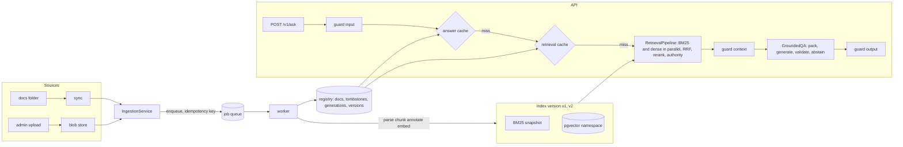

# Project 3: Production RAG assistant

Northwind Assist's knowledge service is built in Chapter 15. It is an ingestion pipeline with a queue and workers, and a hybrid ACL-aware retrieval path. It also has grounded answers with citations and abstention, scoped caches, degraded modes, tracing and metrics, and an evaluation gate for CI. Everything below composes earlier packages; nothing here re-implements a parser, retriever, packer, guardrail, queue, or breaker.

| Capability | Comes from |
|---|---|
| parsing, normalization, chunking, `diff_chunks`, contextual enrichment | `ragkit` (Ch 11, 12) |
| BM25, dense retrieval, RRF fusion, reranking, retrieval pipeline | `ragkit.retrieval` (Ch 12) |
| vector storage (NumPy or pgvector) | `semsearch` (Project 2, Ch 9) |
| evidence packing, grounded generation, citation validation, abstention, safe streaming | `ragkit.generation` (Ch 13) |
| RAG metrics, stage isolation, report, gate | `ragkit.eval` + `evalkit` (Ch 14, 24) |
| input/context/output guardrails, tenant-scoped cache | `guardrails` (Ch 27) |
| job queue, worker, deadlines, circuit breakers, admission control | `reliability` (Ch 29) |
| LLM and embedding clients, tracing, settings | `aie_core` (Ch 3) |

## Architecture



## Layout

```
p3-rag-assistant/
  pyproject.toml   Dockerfile   docker-compose.yml   .env.example   README.md
  rag_assistant/
    config.py                 AssistantSettings (RAG_* environment variables)
    wiring.py                 build_container: the composition root (Container)
    domain/
      models.py               DocRecord, IngestPayload, AskResponse, IndexStatus, SourceSnippet
      authority.py            AuthorityRules: authority level, effective date, supersedes / superseded_by
      keys.py                 document fingerprint, query normalization, partitions, generation scopes
    data/authority_rules.json reviewed rules (PTO policy supersedes the FAQ's time-off section)
    ingestion/
      sources.py              FolderConnector, BlobConnector
      registry.py             DocumentRegistry protocol, InMemoryRegistry, SqlRegistry (SQLAlchemy)
      processing.py           DocumentProcessor: parse -> normalize -> annotate -> chunk -> enrich
      handlers.py             IngestHandlers: ingest.upsert, ingest.purge (idempotent)
      service.py              IngestionService: uploads, sync, delete, blue/green reindex; rag-assistant-sync
      worker.py               build_worker, rag-assistant-worker
    retrieval/
      index.py                SearchIndex, IndexSet (versions, partitions, snapshots, reconcile)
      wiring.py               build_pipeline, BreakerRetriever, TombstoneFilter, AuthorityReranker
    answering/service.py      AnswerService (ask, stream), AskOutcome
    caching/caches.py         ForgettableEmbeddings, ScopedCache, CacheSet, RedisBytesMap
    observability/metrics.py  Metrics (Prometheus text)
    adapters/llm.py           DeadlineBoundLLM, offline extractive/compromised FakeLLM handlers
    api/app.py, api/auth.py   FastAPI app factory; HMAC bearer-token stub (real JWT: Chapter 39)
    eval/run_eval.py          CI gate: rag-assistant-eval
  tests/                      offline: in-memory stores, FakeLLM, FakeEmbeddings(vocabulary=...)
```

## Install and test

```bash
# from the book root, into the shared virtualenv (dependencies are already installed there)
uv pip install --python .venv/bin/python --no-deps -e book/projects/p3-rag-assistant
# standalone fallback
pip install -e ../aie_core -e ../evalkit -e ../p2-semantic-search -e ../ragkit -e ../guardrails -e ../reliability
pip install -e ".[dev]"

cd book/projects/p3-rag-assistant && pytest -q          # or, from the repo root:
pytest -q book/projects/p3-rag-assistant/tests
```

The tests need no network, API keys, database, or Redis. They use fakeredis and SQLite to cover the Redis queue, the Redis cache, and the SQL registry.

## Run

```bash
# local, everything in one process, offline fakes
RAG_INLINE_INGEST=true RAG_SYNC_ON_STARTUP=true uvicorn rag_assistant.api.app:app --port 8000
python -c "from rag_assistant.api.auth import issue_token; print(issue_token('dev-only-change-me', user_id='u1', tenant='retail', groups=['all']))"
curl -s localhost:8000/v1/ask -H "Authorization: Bearer $TOKEN" -H 'Content-Type: application/json' \
     -d '{"question": "How many PTO days can I carry over?"}'
curl -N localhost:8000/v1/ask -H "Authorization: Bearer $TOKEN" -H 'Content-Type: application/json' \
     -d '{"question": "How many PTO days can I carry over?", "stream": true}'

# the full stack: PostgreSQL + pgvector, Redis, API, worker
cp .env.example .env
docker compose up -d postgres redis
docker compose up -d worker api
docker compose run --rm sync        # enqueue a sync of shared-data/docs; the worker indexes it
docker compose run --rm eval        # the CI gate

# CI gate (offline by default; exit 0 pass, 1 gate failure incl. any permission leak, 2 setup error)
rag-assistant-eval --out out/eval [--baseline-run previous/candidate_run.json]
```

The image build and `docker compose up` could not be verified here, because Docker Hub returned 503 on the base image pull. `docker compose config` validates. The pgvector DDL comes from Project 2 and has the same caveat.

## Configuration

| Variable | Default | Meaning |
|---|---|---|
| `LLM_PROVIDER`, `LLM_MODEL`, API keys | `fake` | generator, via `aie_core` (the fake is an extractive, cautious model) |
| `EMBEDDING_PROVIDER`, `EMBEDDING_MODEL` | `fake` | the fake uses vocabulary mode over the docs folder so similarity is meaningful |
| `DATABASE_URL`, `REDIS_URL` | unset | PostgreSQL (registry and pgvector) and Redis (queue and embedding cache) |
| `TRACE_SINK`, `TRACE_PATH` | `none` | aie_core tracer: `jsonl` or `otel` |
| `RAG_DOCS_DIR` | `../shared-data/docs` | folder connector root |
| `RAG_BLOB_DIR` / `RAG_SNAPSHOT_DIR` | unset | uploaded originals / BM25 snapshots shared by worker and API |
| `RAG_VECTOR_BACKEND` | `numpy` | `numpy` or `pgvector` |
| `RAG_REGISTRY_BACKEND`, `RAG_REGISTRY_URL` | `memory` | `memory` or `sql` (URL defaults to `DATABASE_URL`) |
| `RAG_QUEUE_BACKEND`, `RAG_CACHE_BACKEND` | `memory` | `memory` or `redis` |
| `RAG_INDEX_NAME`, `RAG_INDEX_VERSION` | `northwind`, `v1` | vector namespace is `index:model:version` |
| `RAG_TENANCY_MODE` | `shared` | `shared` (one index, ACL pre-filter) or `namespace` (one partition per tenant + shared) |
| `RAG_CHUNK_MAX_TOKENS` | `300` | MarkdownSectionChunker size |
| `RAG_PIPELINE_VERSION` | `p3-ingest-1` | bump to force re-ingestion when processing logic changes |
| `RAG_AUTHORITY_RULES_PATH` | packaged JSON | authority levels and supersessions |
| `RAG_CONTEXTUAL_ENRICHMENT` | `false` | ragkit ContextualEnricher at ingestion (LLM cost per changed chunk) |
| `RAG_CANDIDATE_K`, `RAG_RERANK_K`, `RAG_FINAL_K` | `40`, `20`, `8` | retrieval funnel |
| `RAG_RERANKER` | `lexical` | `lexical`, `cross_encoder`, `none` |
| `RAG_RETRIEVE_TIMEOUT_S`, `RAG_RERANK_TIMEOUT_S` | `0.3`, `0.25` | stage budgets: a slow retriever is skipped, a slow reranker keeps the fused order |
| `RAG_PG_STATEMENT_TIMEOUT_MS` | `250` | server-side cancel for pgvector reads (`SET LOCAL statement_timeout`) |
| `RAG_AUTHORITY_WEIGHT` | `0.05` | boost per authority level, relative to the top score |
| `RAG_EVIDENCE_TOKEN_BUDGET`, `RAG_MAX_EVIDENCE_BLOCKS` | `2500`, `6` | packer budget |
| `RAG_GENERATION_MAX_TOKENS` | `700` | reserved output tokens |
| `RAG_REQUEST_DEADLINE_S`, `RAG_MIN_GENERATION_S` | `8`, `1.5` | end-to-end budget; below the minimum, return sources only |
| `RAG_BREAKER_MIN_CALLS`, `RAG_BREAKER_OPEN_S` | `5`, `30` | circuit breakers for bm25, dense, reranker, llm |
| `RAG_ADMISSION_CAPACITY`, `RAG_TENANT_REQUESTS_PER_MINUTE` | `32`, `600` | admission control and per-tenant quota |
| `RAG_RETRIEVAL_CACHE`, `RAG_RETRIEVAL_CACHE_TTL_S` | `true`, `300` | scoped retrieval cache |
| `RAG_ANSWER_CACHE`, `RAG_ANSWER_CACHE_TTL_S` | `true`, `600` | scoped answer cache |
| `RAG_AUTH_SECRET`, `RAG_ADMIN_GROUP` | dev value, `rag-admin` | token stub secret; admin group for document endpoints |
| `RAG_ALLOW_DEV_AUTH_SECRET` | `false` | the API refuses to start with the published dev secret unless this is `true` (Compose sets it for local use only) |
| `RAG_INLINE_INGEST`, `RAG_SYNC_ON_STARTUP` | `false` | development conveniences |
| `RAG_FRESHNESS_SLO_S` | `300` | target time from change to searchable |

## Offline reference numbers

These come from `rag-assistant-eval` on the 40-question shared-data gold set, with the fake model and vocabulary embeddings. They are illustrative.

| Configuration | leaks | recall@5 | hit@1 | abstention correct | gate |
|---|---|---|---|---|---|
| default (lexical rerank + authority) | 0 | 0.986 | 0.811 | 0.875 | pass |
| authority layer off | 0 | 0.986 | 0.784 | 0.875 | fail (conflicting-versions) |
| no reranker | 0 | 1.000 | 0.946 | 0.85 | fail (conflicting-versions) |
| namespace tenancy | 0 | 1.000 | 0.811 | 0.875 | pass |
